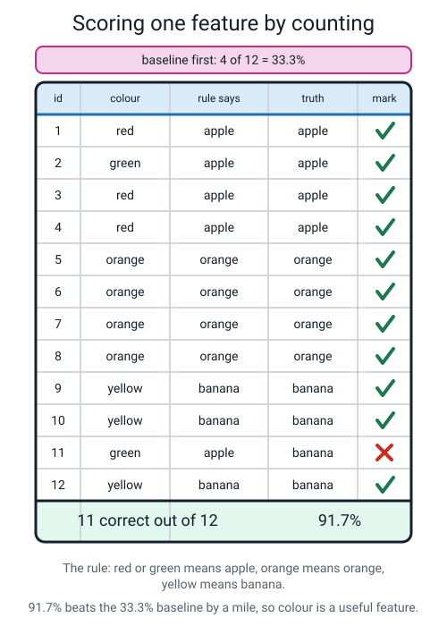
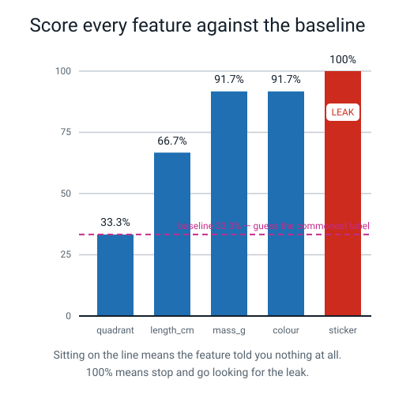
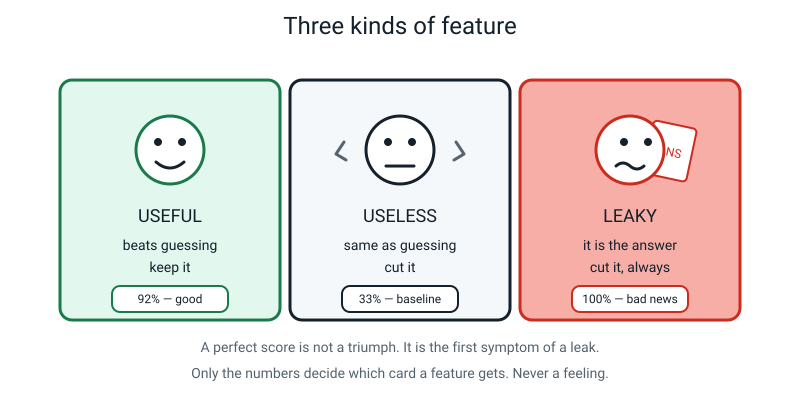
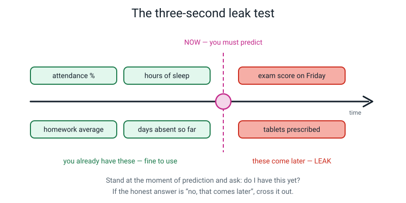
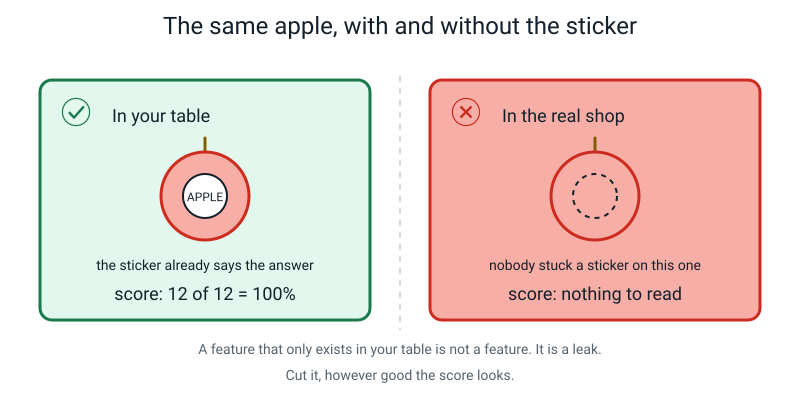
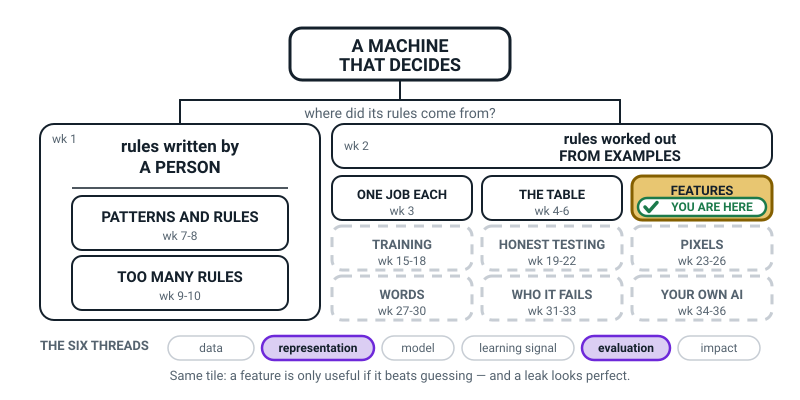
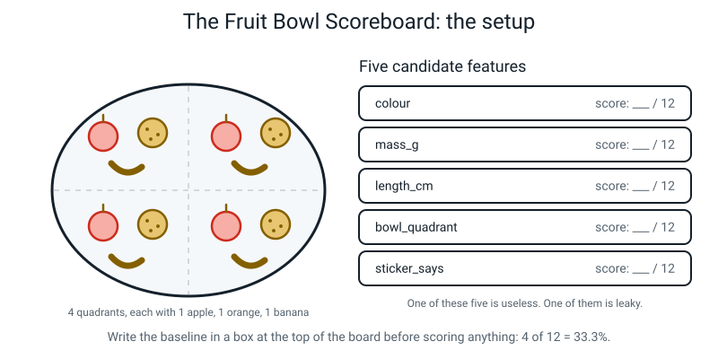

# Week 12 — Useful, Useless, and Sneaky Features

[⬅ Week 11](week-11.md) · [Course Home](../README.md) · [Week 13 ➡](week-13.md) · [Student Guide](../student-guide/week-12.md) · [Workbook](../workbook/week-12.md)

---

## 📋 At a Glance

| | |
|---|---|
| **Duration** | 70 minutes |
| **Type** | 🟦 Teach — one new discipline (count, don't guess) applied five times |
| **Material** | Printed workbook (Warm-Up through Self-Check; the only numbered pages are 12.4–12.6 in Build It) · the twelve-row fruit table (student guide, section 1, or the Activity Setup below) · a blank landscape sheet · pencil · a calculator · **an umbrella** (or a coat, or a towel) for the Hook · the student's Week 11 kitchen table · optional: a real bowl with 4 apples, 4 oranges, 4 bananas and paper stickers |
| **Big idea** | A feature is only useful if it beats guessing, and a leaky feature that already contains the answer will betray you the moment it matters. |
| **New vocabulary** | baseline · useful feature · useless feature · leaky feature · leak |
| **Tech needed** | **None.** A spreadsheet is an optional extension. |
| **Prep time** | 12 minutes the night before, 5 minutes on the day |

> **⚠️ Watch out:** the printed twelve-row table works completely. **Do not buy fruit specially.** Real fruit is a nice-to-have that costs money and adds nothing the printed table lacks — except the sticker moment, which you can reproduce by putting a paper label on three objects you already own.

---

## 🎯 Lesson Objectives

By the end of the lesson the student can:

1. **Compute the baseline for a table** by counting the labels and taking the most common one.
2. **Score a single feature** by counting how often that feature alone gets the label right.
3. **Rank features as useful, useless or leaky using the numbers**, not a feeling.
4. **Spot a leaky feature** by asking whether it would exist at the moment you need the prediction.

Observable evidence: a baseline written in a box at the top of the page *before* any feature was scored, five scores each written as a fraction and a percentage, and a ranked scoreboard where the useless feature and the leaky feature are both correctly named.

---

## 🧑‍🏫 What YOU Need to Know First

Everything in this section is arithmetic you can do with a pencil. There is nothing clever here, and that is the point of the week: **feature choice is done by counting, not by opinion.**

### 1. The baseline — the number you must compute first

Suppose you have twelve pieces of fruit and you have to name each one. You are not allowed to look at anything. What is the best you can do?

You count up the answers. Four apples, four oranges, four bananas. Whatever you guess every time, you will get four right. Four out of twelve is 33.3%.

> **Baseline** — how well you would do by ignoring every feature and always guessing the most common label.

That number is the ruler. **A feature that cannot beat the baseline is worth nothing at all**, however sensible it sounds and however much work it took to measure.

Two things make baselines slippery, and you should know both before a student trips you with them.

**Slippery thing 1 — a tie.** With 4/4/4, all three guesses are equally good. Pick one, say so out loud, and move on. The baseline is 33.3% either way.

**Slippery thing 2 — a lopsided table.** If 95 of your 100 emails are ham and 5 are spam, the baseline is **95%**. That means a spam detector scoring 94% is *worse than a machine that says "ham" to everything and has never looked at an email in its life.* This is not a curiosity. It is one of the most common ways real systems fool the people who build them, and the whole of Week 20 is about it. Do not teach it in depth today — but if the student finds it themselves, celebrate it loudly and write it on the wall for Week 20.

**Why the baseline goes first, in a box, before anything else:** because if you score a feature first and get 58%, 58% *feels* good. Fifty-eight out of a hundred sounds like a pass. It is only meaningful next to the 33.3%. Compute the ruler before you measure anything with it.

### 2. How to score one feature, by counting

Here is the whole method. It takes about two minutes per feature.

1. **Group the rows** by the value of that feature.
2. **In each group, look at the labels and pick the commonest one.** That is the best guess you can make for everything in that group.
3. **Count how many rows that guess gets right**, group by group.
4. **Add up and divide** by the total number of rows.

Worked on `colour`, from the twelve-row fruit table:

| colour | apples | oranges | bananas | best guess | gets right |
|---|---|---|---|---|---|
| red | 3 | 0 | 0 | apple | 3 of 3 |
| orange | 0 | 4 | 0 | orange | 4 of 4 |
| yellow | 0 | 0 | 3 | banana | 3 of 3 |
| green | 1 | 0 | 1 | apple *(tie, pick one)* | 1 of 2 |

3 + 4 + 3 + 1 = **11 out of 12 = 91.7%.** Against a baseline of 33.3%, that is a genuinely strong feature.


*Figure 12.1 — Count row by row. 91.7% beats the 33.3% baseline by a mile, so colour is a useful feature.*

**Scoring a number feature.** Same method, but you group by *bands* instead of by exact values. For `mass_g`, sort the rows by class first: bananas 110–135, apples 140–190, oranges 185–210. Bananas separate cleanly; apples and oranges overlap between 185 and 190. The best three-band rule is:

```
IF mass < 138        THEN banana
ELSE IF mass <= 187  THEN apple
ELSE                      orange
```

which gets 10 of 12 right — it fails on the 190 g apple and the 185 g orange, which sit in each other's territory. **83.3%.** Real measurements overlap constantly; do not treat that as a mistake.

### 3. Can a feature score *below* the baseline?

A student will ask this, or you should ask it for them. The honest answer has two halves.

**The feature itself, scored properly, cannot.** If you always predict the commonest label *inside each group*, the worst that can happen is that every group has the same commonest label as the whole table — which is exactly the baseline. So a properly-scored feature lands on the baseline or above it.

**But a rule you wrote can be much worse.** Take `has_stem`. Scored properly it gets 7 of 12, 58.3%. Now suppose the student writes:

```
IF has_stem = yes THEN banana ELSE apple
```

- 3 rows have a stem, all apples → predicted banana → **0 right**
- 9 rows have no stem: 1 apple, 4 oranges, 4 bananas → all predicted apple → **1 right**

**1 out of 12 = 8.3%.** Far below the baseline. Nothing is wrong with `has_stem`. The rule was written the wrong way round.

The lesson to say out loud: **a score below the baseline is a message about your rule, not about your feature.** Go back and, in each group, predict the label that is actually commonest in that group.

### 4. The three kinds of feature


*Figure 12.2 — Sitting on the line means the feature told you nothing at all. 100% means stop and go looking for the leak.*

> **Useful feature** — knowing it makes your guess better than the baseline.
> **Useless feature** — knowing it makes no difference; it lands on the baseline.
> **Leaky feature** — knowing it makes your guess perfect, because it secretly contains the answer.


*Figure 12.3 — A perfect score is not a triumph. It is the first symptom of a leak.*

**Useless features are annoying but honest.** In our fruit bowl, `bowl_quadrant` is useless: each of the four quadrants contains exactly one apple, one orange and one banana, so knowing the quadrant leaves you guessing 1 in 3, exactly as if you had never asked. It scores 4/12 = 33.3%, sitting precisely on the line. Cut it.

It is worth saying *why* someone measured it: because it seemed plausible. It felt like information. **Only the counting settled it**, and that is the discipline the whole lesson is teaching.

**Leaky features are the dangerous ones, and they are dangerous precisely because they look like a triumph.**

> **Leak** — a feature that would not actually be available at the moment you need to make the prediction, usually because it only exists *after* the answer is already known.

### 5. The wet umbrella, and the three-second test

You want to predict "is it raining outside?" You collect features: temperature, cloud colour, wind — and `is_my_umbrella_wet`. Your predictor is 100% accurate. Amazing.

Except your umbrella only gets wet **after** you have already been outside in the rain. At the moment you actually need the prediction — standing at the front door deciding whether to take a coat — the umbrella is bone dry. Your perfect system is worth nothing.


*Figure 12.4 — Stand at the moment of prediction and ask: do I have this yet?*

The test is three seconds long:

> **Stand at the exact moment you need the answer. Ask: do I have this value yet?** If the honest reply is "no, that comes later" — it is a leak. Cross it out, whatever the score says.

In the fruit bowl the leak is `sticker_says`: a supermarket sticker reading APPLE. It scores 12 out of 12. Perfect. And the moment somebody hands you fruit from their garden, the column is blank and your perfect model has nothing at all to read.


*Figure 12.5 — A feature that only exists in your table is not a feature. It is a leak.*

**A warning that will save the student real pain later:** a leaky feature never announces itself. Nobody labels a column `THE_ANSWER`. It will be called `case_status`, or `refund_issued`, or `days_in_hospital`, or `cancellation_reason_text`. You have to go looking, deliberately, every single time.

### 6. The two misconceptions you will meet

**Misconception 1 — "100% is the best possible result."**

This is the whole lesson, and it is genuinely counter-intuitive, so do not expect one telling to fix it. The reframe that works: *a score is a measurement of your table, not of the world.* 100% means your table contains the answer twice. It says nothing about whether the system will work.

The line to use, and to keep using all year: **"A perfect score is not a triumph. It's the first symptom of a leak."**

**Misconception 2 — "More features must be better, so keep them all."**

No. Extra columns actively hurt in two ways. They **hide** the good features, because a model spreads its attention across everything you give it. And every extra column is another thing that can go missing, be measured inconsistently, or turn out to be a leak nobody spotted.

The proof from this very table: after deleting the useless column and the leaky column, **two features (length and skin, or length and colour) do a better and far more trustworthy job than all seven together.** The model got better by knowing less. Say that sentence; it lands.

### 7. How deep to go, and where to stop

**Go this far:** baseline, scoring by counting, the three verdicts, the three-second test.

**Stop before:**
- **Testing on data the model has not seen.** Every score today is computed on the same twelve rows the features were judged on. That is *fine for today* and it is not the whole truth. If the student says "but you already know the answers for these twelve" — that is a brilliant observation and it is Week 19. Write their name and the date next to it in the margin and tell them they got there seven weeks early.
- **Accuracy being a misleading number.** Week 20.
- **Combining features.** Today is strictly one feature at a time. If they want to chain two rules, let them do it as an extension, but do not build the lesson on it.
- **Classification vs regression.** Still Week 13. Do not use those words.

---

### 🧭 The Growing Map

The student guide carries the same structural figure every week, with one more piece filled in. This
week the tinted box has **not moved** — FEATURES is still the current box, its second week of four —
and that is worth saying out loud, because it tells them the map grows in chunks, not in weekly hops.



*Figure 12.0 — Week 12's version. FEATURES still tinted and badged; **representation** and
**evaluation** lit along the bottom; everything from TRAINING onward still dashed.*

**What to do with it, in about two minutes at the end of the lesson:**

1. **Show it and ask the week's version of the question:** *"which bit of today is on this map?"*
   Expect a pause — the box says FEATURES and today felt like counting and dividing. The answer you
   want is *"we were testing the columns"*, and the baseline is how we tested them.
2. **Then the better question:** *"why is HONEST TESTING still dashed?"* Someone will already have
   noticed we scored the same twelve rows we looked at. Say plainly: *"you're right, and that's Week
   19 — the dashes are the bits we know we haven't fixed yet."* That answer buys you enormous
   credibility.
3. **Have them add it to their own copy** on the inside cover, in pencil, and shade the FEATURES box
   again. Two weeks shading the same box is the point.

> **🧑‍🏫 Why this is worth two minutes.** After a lesson built entirely on arithmetic, some learners
> come away thinking the subject *is* arithmetic. Ten seconds of map fixes that: the sums were a tool
> for deciding which columns survive. A learner who can see the map can tell you *"I don't know where
> this week goes"* instead of just *"I don't get it"*.

**The six threads** along the bottom are the spine of all four levels. This week **representation**
and **evaluation** are lit and the other four are white. Do not teach or test the threads — they are
shelves, and the only thing that matters is that by week 36 every week has landed on one.

---

## 🧰 Prep Checklist

**12 minutes the night before**

- [ ] Print the whole workbook (Warm-Up, Practice Sets A and B, Puzzle, Think Deeper, Build It pages 12.4–12.6, Draw It, Self-Check). The workbook does **not** contain the twelve-row fruit table, so also print it from the student guide (section 1) or copy it from the Activity Setup below — ideally twice, one to write on and one to keep clean for reference.
- [ ] **Score `colour` yourself** using the method in section 2 above. Do it with a pencil, do not just read it. Fifteen minutes of teaching confidence for two minutes of counting.
- [ ] **Find the umbrella.** Or a coat, or a towel — anything that gets wet. Put it out of sight but within reach.
- [ ] **Find the Week 11 kitchen table.** The homework needs it. If it has gone missing, the homework becomes "score the five features in the printed fruit table you haven't already scored" instead.
- [ ] Read section 3 (can a feature score below the baseline?) once. It is the question most likely to catch you out.

**5 minutes on the day**

- [ ] Umbrella hidden but reachable.
- [ ] Calculator on the table.
- [ ] A blank sheet for the scoreboard, landscape, with a horizontal line already drawn two-thirds of the way down. You will write `BASELINE 33.3%` on it in the Concept segment.
- [ ] **Optional:** if you are using real fruit, stick the paper labels on *before* the student comes in. Do not point at them. The moment they notice is the best moment of the week.

**Fallback if something fails**

| If this fails | Do this instead |
|---|---|
| No fruit, no props | The printed twelve-row table is the primary version. Nothing is lost. |
| No umbrella | Use any object that changes state after an event: a wet towel, muddy shoes, an empty plate. "How do I know somebody had dinner? The plate's dirty. When did the plate get dirty?" |
| The Week 11 kitchen table is lost | Homework page 12.5 (Build It) becomes: build a five-row table of five objects you can see from where you're sitting, then score it. Slightly weaker, entirely workable. |
| The student already knows the answer because they read ahead | Excellent. Hand them the pencil and make *them* explain the sticker to you. Then jump straight to the harder question: "Give me a case where the sticker is honest and not a leak." (Answer: a supermarket's own checkout system, where every item genuinely has a sticker.) |
| The arithmetic is defeating them | Do the counting orally, together, one group at a time, while they only write the totals. The counting is the method; the handwriting is not. |

---

## ⏱️ The Lesson, Minute by Minute

| Segment | Minutes | Running total | What happens |
|---|---|---|---|
| 🪝 Hook — My Perfect Rain Predictor | 8 | 8 | A 100% accurate predictor that is completely worthless |
| 🧠 Concept — Baseline, Then the Three Kinds | 18 | 26 | Compute the ruler; then useful / useless / leaky |
| 🔍 Worked Example Together — Score Two Features | 14 | 40 | `colour` scores 91.7%. `quadrant` lands exactly on the line. |
| 🎲 Activity — The Fruit Bowl Scoreboard | 20 | 60 | Score the remaining three; build and rank the scoreboard |
| 🔑 Wrap & Assign | 10 | 70 | Three checks, the takeaway, homework |

---

### 🪝 Hook — My Perfect Rain Predictor (8 minutes)

**Do this:** Umbrella still hidden. Sit down and look pleased with yourself.

**Say this:**

> "I've built something and I want to show off. I have invented a machine that tells you whether it is raining outside, and it is right **one hundred percent of the time**. Not ninety. Not ninety-nine. A hundred. I have tested it on the last thirty days and it has never once been wrong.
>
> How much do you reckon that's worth?"

Let them react. Let them be a bit impressed, or suspicious — either is fine.

> "Want to know how it works? It's very simple. It checks one thing."

*(Now produce the umbrella.)*

> "**Is my umbrella wet?** If the umbrella's wet, it's raining. If it's dry, it isn't. Thirty days, thirty correct answers.
>
> Right. Tell me what's wrong with my invention."

Let them work at it. They usually get there in under a minute, and it is much better if they say it than if you do.

> "Yes. **The umbrella only gets wet after I've already been out in the rain.** So picture the actual moment I need this. I'm standing at the front door. I want to know: coat or no coat? And at *that* moment, my umbrella is hanging up, completely dry — because I haven't been out yet. My hundred-percent machine has nothing to tell me. It's worth exactly nothing.
>
> Now here's the part I want you to hold on to, because it's the thing this whole lesson is about, and it feels upside-down.
>
> **The hundred percent wasn't a warning sign that something *might* be wrong. It was the actual symptom.** Something that scores a hundred percent has usually got the answer hidden inside it. If it were really doing the hard job, it would get things wrong sometimes, because the job is hard.
>
> A feature like my wet umbrella has a name. It's a **leaky feature** — it leaks the answer backwards into the thing that's supposed to be a clue."

Write it up:

> **Leaky feature** — a feature that already contains the answer, usually because it only exists *after* the answer is known.

**Ask this:**

| Ask | Answer you want | If they say something else |
|---|---|---|
| "What's wrong with my machine?" | The umbrella gets wet after the rain, not before. | If they say "it's cheating" — that's right, push for precision: "Cheating how? What exactly does it know that it shouldn't?" |
| "So is 100% good or bad news?" | Bad news. It means something is leaking. | If they say "good if it's real" — a fair fight. Reply: "Agreed. So what would you do next, before believing it?" Answer: check whether you'd actually *have* that value in advance. |
| "Give me another wet umbrella." | Muddy shoes → "did I go outside?" · A dirty plate → "did I eat?" · An empty petrol tank → "did I drive?" | If stuck, offer one and ask them to explain why it leaks, then ask for one of their own. |

---

### 🧠 Concept — Baseline, Then the Three Kinds (18 minutes)

**Do this:** Put the printed twelve-row table (student guide, section 1) between you. Take the blank landscape sheet for the scoreboard and put it beside it.

**Say this — part 1, the baseline:**

> "Here's a bowl of fruit written down as a table. Twelve rows, because twelve pieces of fruit. Five feature columns — colour, mass in grams, length in centimetres, which quadrant of the bowl it was sitting in, and what the supermarket sticker says. And on the end, the label: apple, orange or banana.
>
> Before we look at a single feature, we do one thing, and it is the thing everybody skips. **We work out how well you'd do knowing nothing at all.**
>
> Count the labels for me. How many apples? Four. Oranges? Four. Bananas? Four.
>
> So imagine you can't see the table at all, and I hand you each of the twelve fruits one by one, and you have to name it. What's your best strategy?"

Let them get to "say the same thing every time." Then:

> "Right. Just say 'apple' twelve times. How many do you get right? Four. Four out of twelve. That's thirty-three point three percent, and it has a name."

Write it, in a box, at the top of the scoreboard sheet:

```
┌────────────────────────────┐
│  BASELINE = 4/12 = 33.3%   │
└────────────────────────────┘
```

> **Baseline** — how well you'd do by ignoring every feature and always guessing the most common label.

> "That box is the most important thing on the page and we wrote it before we did any work. Here's why. In a minute you're going to score a feature and it'll come out at fifty-eight percent. And fifty-eight out of a hundred *feels* alright, doesn't it? It's a pass. But fifty-eight only means anything sitting next to thirty-three. **You have to build the ruler before you measure anything with it.**"

**Say this — part 2, how to score a feature:**

> "Now, scoring a feature. There's a method, and it's four steps, and there is no cleverness in it anywhere.
>
> One: **group the rows** by what that feature says.
> Two: **in each group, look at the answers and pick whichever one shows up most.** That's the best guess you can make for that whole group.
> Three: **count how many rows that guess gets right.**
> Four: **add them up and divide by twelve.**
>
> That's it. Counting. Not looking at it and having a feeling about it."

**Say this — part 3, the three verdicts:**

> "Every feature you score comes out in one of three places, and here they are.
>
> **Above the line** — the feature helps. It's a **useful feature**. Keep it.
>
> **On the line** — the feature told you nothing. Nothing at all. It's a **useless feature**, and you cut it. And it's worth knowing that a useless feature usually *sounded* completely reasonable when somebody measured it. That's why we count.
>
> **A hundred percent** — that's the umbrella. It's a **leaky feature**, and you cut it too, and it's the one that will actually hurt you, because it doesn't look like a problem. It looks like you won."

Draw the three verdicts on the scoreboard sheet as three zones. Then:

> "And the test for a leak takes three seconds. **Stand at the exact moment you need the answer, and ask: do I have this yet?** Not 'could I get it eventually'. Do I have it, right now, in my hand, at the moment I have to decide? If the answer is 'no, that turns up later' — cross it out. It doesn't matter what it scored."

**Ask this:**

| Ask | Answer you want | If they say something else |
|---|---|---|
| "Apples, oranges, bananas — 4, 4, 4. Which do I guess?" | Any of them; it's a tie; still 4 out of 12. | If they say "you can't decide" — that's fine, and it's the answer: pick one and say so. The baseline is 33.3% whichever you pick. |
| "If a table had 10 apples and 2 bananas, what's the baseline?" | 10/12 = 83.3%. | This one is worth doing even though it's a detour. If they say 50%, they're averaging rather than counting the biggest group. Recount together. |
| "Why compute the baseline first, not last?" | So a score means something when you see it. | If they say "so you don't cheat" — close enough, and better than they know. Sharpen it: "So you can't fool *yourself* about what a number means." |
| "Which is worse: a useless feature or a leaky one?" | Leaky. A useless one wastes your time; a leaky one makes you believe a broken system works. | Any argued answer is good. Push for the reason. |

---

### 🔍 Worked Example Together — Score Two Features (14 minutes)

Both of these you do **together, out loud, with the student holding the pencil and doing the counting.**

**Feature 1 — `colour` (7 minutes).** The first scoring grid, drawn on the blank sheet (the workbook has no fruit scoring grids).

**Say this:**

> "Group by colour. Read me the colours down the column and I'll tally."

Build the table with them:

| colour | apples | oranges | bananas | best guess | gets right |
|---|---|---|---|---|---|
| red | 3 | 0 | 0 | apple | 3 of 3 |
| orange | 0 | 4 | 0 | orange | 4 of 4 |
| yellow | 0 | 0 | 3 | banana | 3 of 3 |
| green | 1 | 0 | 1 | apple *(tie)* | 1 of 2 |

> "Add them. Three plus four plus three plus one. Eleven. Eleven out of twelve. Get me the percentage — eleven divided by twelve, times a hundred."

**91.7%.** Have them write it on the scoreboard, above the line, and say out loud how far above: **58.4 percentage points above the baseline.**

> "Now — the only place it went wrong. Look at the green row. One green apple, one green banana, and colour can't separate them. Colour isn't perfect. **And that's a point in its favour, not against it.** A feature that gets one wrong is doing an honest job on a hard problem."

**Feature 2 — `bowl_quadrant` (7 minutes).** Same method, second grid.

**Say this:**

> "Now the quadrant — where in the bowl it was sitting. Somebody measured this because it seemed like it might mean something. Maybe the heavy fruit sank to one side. Let's find out."

| quadrant | apples | oranges | bananas | best guess | gets right |
|---|---|---|---|---|---|
| top-left | 1 | 1 | 1 | any *(three-way tie)* | 1 of 3 |
| top-right | 1 | 1 | 1 | any | 1 of 3 |
| bottom-left | 1 | 1 | 1 | any | 1 of 3 |
| bottom-right | 1 | 1 | 1 | any | 1 of 3 |

> "One plus one plus one plus one. Four out of twelve. What's four out of twelve as a percentage?"

**33.3%.** Now stop and make it land.

> "Write it on the scoreboard. Where does it go?
>
> **Exactly on the line.** Not near it. On it. This feature is worth precisely as much as not asking the question. Somebody went round that bowl writing down which quarter every single fruit was in, and the answer is that they could have stayed in bed.
>
> And here's the thing I actually want you to take away. Before we counted, did `quadrant` sound stupid to you? It didn't to me. It sounded like it might be something. **That's why we count.** Your feelings about a feature are worth nothing. The scoreboard is worth everything."

**Ask this:**

| Ask | Answer you want | If they say something else |
|---|---|---|
| "Colour got 11 of 12. Where did it lose one?" | The green row — a green apple and a green banana. | If they can't find it, have them read the four green-row entries aloud. |
| "Should we delete colour because it isn't perfect?" | No — 91.7% against a 33.3% baseline is excellent. | If they say yes, ask: "What would you replace it with that's better?" |
| "Quadrant is exactly on the line. Does that mean it's broken?" | No. It means it carries no information about which fruit it is. | If they want to re-measure it, that's a good instinct — say "the measuring was fine. The feature just doesn't relate to the answer." |
| "Could `quadrant` ever be useful?" | Yes, for a different question — "which fruit gets picked first?" might depend on where it sits. | This is a strong answer if they get there. A feature is useless *for a label*, not useless in general. |

---

### 🎲 Activity — The Fruit Bowl Scoreboard (20 minutes)

Full instructions below. In the lesson flow:

- **Minutes 0–12:** score `mass_g`, `length_cm` and `sticker_says`.
- **Minutes 12–20:** complete the scoreboard, rank all five, and have the argument about the 100%.

---

## 🎲 The Activity, In Full

### Setup


*Figure 12.6 — Write the baseline in a box at the top of the board before scoring anything: 4 of 12 = 33.3%.*

**On the table:** the printed twelve-row table (student guide, section 1), a blank landscape sheet for the five scoring grids and the scoreboard (workbook item A5 / Figure W12.1 holds a blank scoreboard you can use instead), a pencil, a calculator.

**On the board or the big sheet:** the baseline box, already written, and a horizontal line across the scoreboard sheet at the 33.3% level.

The twelve-row table:

| id | mass_g | length_cm | colour | quadrant | sticker_says | **fruit** |
|---|---|---|---|---|---|---|
| 1 | 150 | 8 | red | top-left | APPLE | **apple** |
| 2 | 165 | 8 | green | top-right | APPLE | **apple** |
| 3 | 140 | 7 | red | bottom-left | APPLE | **apple** |
| 4 | 190 | 9 | red | bottom-right | APPLE | **apple** |
| 5 | 200 | 8 | orange | top-left | ORANGE | **orange** |
| 6 | 185 | 7 | orange | top-right | ORANGE | **orange** |
| 7 | 210 | 8 | orange | bottom-left | ORANGE | **orange** |
| 8 | 195 | 8 | orange | bottom-right | ORANGE | **orange** |
| 9 | 120 | 19 | yellow | top-left | BANANA | **banana** |
| 10 | 135 | 21 | yellow | top-right | BANANA | **banana** |
| 11 | 110 | 18 | green | bottom-left | BANANA | **banana** |
| 12 | 128 | 20 | yellow | bottom-right | BANANA | **banana** |

### The rules

1. **The baseline box goes up first and stays visible.** No score gets written before it.
2. **One feature at a time, finished completely, before the next one starts.**
3. **Every score is written twice: as a fraction and as a percentage.** `10/12 = 83.3%`.
4. **No verdict may be given before the number.** If they say "that one's useless" before counting, say: "Might be. Count it."

### Step 1 — `length_cm` (4 minutes)

It is a number, so group by bands. Have them sort the twelve lengths and look for a gap.

```
7, 7, 8, 8, 8, 8, 8, 9,   18, 19, 20, 21
                        ^
              a huge empty gap between 9 and 18
```

Rule: `IF length_cm >= 15 THEN banana, ELSE apple` (apple picked to break the apple/orange tie).

| rows | prediction | correct |
|---|---|---|
| 9, 10, 11, 12 (18–21 cm) | banana | 4 of 4 |
| 1, 2, 3, 4 (7–9 cm) | apple | 4 of 4 |
| 5, 6, 7, 8 (7–8 cm) | apple | 0 of 4 |

**8 out of 12 = 66.7%.** Above the line. Worth noticing out loud: it is a *perfect banana detector* — on the question "banana or not banana?" it scores 12 out of 12 — and it is hopeless at telling apples from oranges. That is a real and common shape for a feature.

### Step 2 — `mass_g` (5 minutes)

Sort by class first:

- bananas: 110, 120, 128, 135 → **110–135**
- apples: 140, 150, 165, 190 → **140–190**
- oranges: 185, 195, 200, 210 → **185–210**

Bananas separate cleanly. Apples and oranges **overlap between 185 and 190**. Best three-band rule:

```
IF mass < 138        THEN banana
ELSE IF mass <= 187  THEN apple
ELSE                      orange
```

| id | mass | predicted | true | ✓/✗ |
|---|---|---|---|---|
| 1 | 150 | apple | apple | ✓ |
| 2 | 165 | apple | apple | ✓ |
| 3 | 140 | apple | apple | ✓ |
| 4 | 190 | orange | apple | ✗ |
| 5 | 200 | orange | orange | ✓ |
| 6 | 185 | apple | orange | ✗ |
| 7 | 210 | orange | orange | ✓ |
| 8 | 195 | orange | orange | ✓ |
| 9 | 120 | banana | banana | ✓ |
| 10 | 135 | banana | banana | ✓ |
| 11 | 110 | banana | banana | ✓ |
| 12 | 128 | banana | banana | ✓ |

**10 out of 12 = 83.3%.** Point at rows 4 and 6: one heavy apple, one light orange, each sitting in the other's territory. No threshold can fix that, and moving the threshold just swaps which one you get wrong.

### Step 3 — `sticker_says` (3 minutes)

This one takes thirty seconds to score and three minutes to argue about, which is the correct ratio.

| sticker | apples | oranges | bananas | gets right |
|---|---|---|---|---|
| APPLE | 4 | 0 | 0 | 4 of 4 |
| ORANGE | 0 | 4 | 0 | 4 of 4 |
| BANANA | 0 | 0 | 4 | 4 of 4 |

**12 out of 12 = 100%.**

**Say this:**

> "A hundred percent. Best feature we've got by miles. Put it at the top of the scoreboard."

Let them write it. Let them enjoy it for about ten seconds. Then:

> "Now run the three-second test on it. **You're holding a piece of fruit and you need the machine to tell you what it is. Do you have this value?**"

The realisation usually arrives here without further help. If it doesn't:

> "If it already has a sticker saying APPLE… what did you need the machine for? And what happens the first time somebody hands you a plum from their garden?"

> "Cross it out. Twelve out of twelve, and it goes in the bin. That's the whole lesson: **the score didn't tell us this feature was good. It told us this feature was the answer wearing a disguise.**"

### Step 4 — Build the scoreboard (5 minutes)

| feature | score | vs baseline 33.3% | verdict |
|---|---|---|---|
| `sticker_says` | 12/12 = **100%** | +66.7 | 🚨 **LEAKY — remove** |
| `colour` | 11/12 = **91.7%** | +58.4 | ✅ very useful |
| `mass_g` | 10/12 = **83.3%** | +50.0 | ✅ useful |
| `length_cm` | 8/12 = **66.7%** | +33.4 | ✅ useful (banana specialist) |
| `quadrant` | 4/12 = **33.3%** | 0.0 | ❌ useless — remove |

**Final feature list: `colour`, `mass_g`, `length_cm`.** Two columns deleted, and the table just got more trustworthy by containing less.

### What "finished" looks like

- The baseline box was written first and is still visible.
- Five scoring grids completed, all filled in by counting.
- Five scores written as fractions **and** percentages.
- A ranked scoreboard, ordered by score.
- The useless feature and the leaky feature both correctly named, with the *reason* — "lands on the line" and "wouldn't exist at prediction time" — not just the label.

### Variation — easier

- Score **three** features only: `colour` (useful), `quadrant` (useless), `sticker_says` (leaky). One of each. That is the entire lesson.
- Skip `mass_g` and `length_cm` entirely — the banded rules are the hardest arithmetic in the week.
- Do the tallying orally together; the student writes only the totals.
- Pre-fill the group headings in each scoring grid so they only fill in the counts.

### Variation — harder

1. **Two features beat five.** Chain them, first-match-wins:
   ```
   RULE 1: IF length_cm >= 15   THEN banana
   RULE 2: ELSE IF colour = orange THEN orange
   RULE 3: OTHERWISE                 apple
   ```
   Score it on all twelve rows. It gets **12 out of 12** — with two honest features and no leak. Then the question: "You got the same score as the sticker. Why is this one fine and that one wasn't?"
2. **Make the useless feature useful.** "Change one thing about the fruit bowl so that `quadrant` stops being useless." (Put all four bananas in one quadrant. Then quadrant carries real information — and notice that nothing about the *measuring* changed, only the world.)
3. **The honest sticker.** "Name a real situation where `sticker_says` is not a leak." (A supermarket's own self-checkout, where every item genuinely carries a sticker at the moment of scanning. The same column can be honest in one deployment and fatal in another.)
4. **Find the leak in a job you know.** "Predict which team wins a football match. Give me four features, and make one of them leaky on purpose. Then defend the other three."

---

## ❓ Questions Students Ask This Week

**"Why is 100% bad? Surely getting everything right is the point?"**

Getting everything right *on data where you already know the answers* is not an achievement — you had the answers on the page. The question that matters is whether it will get things right tomorrow, on fruit nobody has stickered. A 100% score means your table contains the answer twice, so it has told you nothing about tomorrow. And there's a rough rule of thumb worth carrying: if a job is genuinely hard, a good system gets some of it wrong. Perfection on a hard job means you're not doing the hard job.

**"What if I just delete the leaky feature and keep everything else? Then it's fine, right?"**

Yes — that's exactly the right move, and it's what we did. The difficulty isn't deleting it, it's *finding* it. Nobody names a column `THE_ANSWER`. It'll be called `refund_issued` or `days_in_hospital` or `case_closed_reason`. You have to go looking on purpose, feature by feature, every time.

**"Can a feature be useful for one question and useless for another?"**

Yes, and this is worth getting straight. `quadrant` is useless for "which fruit is it?" It might be genuinely useful for "which fruit gets eaten first?", because whatever is nearest the front of the bowl probably goes first. A feature is never useful or useless on its own. It is useful **for a particular label**. Change the question and the whole scoreboard changes.

**"Why not just measure everything and let the machine sort it out?"**

Two reasons, and both are real. First, extra columns hide the good ones — the machine spreads its attention over everything you hand it, so five weak features can bury one strong one. Second, every extra column is another thing that can be measured inconsistently, go missing, or quietly be a leak. The fruit table got *more* trustworthy when we deleted two columns.

**"How much above the baseline is 'good enough'?"** *(Answer this one honestly: nobody knows.)*

**Nobody knows for sure, and here is why it isn't a dodge.** There's no universal number, because "good enough" depends entirely on what happens when you're wrong. A system that suggests which song to play next can be barely above baseline and still be useful — the cost of a bad suggestion is that you press skip. A system that decides whether someone gets a bank loan needs to be far better than baseline before anyone should switch it on, and "far better" still doesn't tell you *how much* better, because the real question is what it costs the person who gets refused unfairly. People who do this for a living argue about the threshold constantly, and the honest position is that it's a judgement about consequences, not a fact about mathematics. What you *can* always say is the easy half: **below or on the baseline is never good enough**, because you could have got that by guessing.

**"What if two features tie?"**

Then you pick on other grounds, and it's a real decision, not a coin flip. Which one is cheaper to measure? Which is less likely to go missing? Which do you trust more — is one of them a proper instrument reading and the other a human judgement out of five? In our table `length_cm` and `skin` both score 66.7%, and `length_cm` wins because a ruler is more reliable than somebody's fingertips.

**"Is a feature that scores 90% nine times better than one that scores 10%?"**

No, and this is a good trap to fall into. Scores don't work like that, because the baseline is the floor. A feature scoring 33.3% here isn't "a third as good" as one scoring 100% — it's worth **zero**, because it's exactly the baseline. The right thing to compare is not the score but **how far above the line** it sits.

---

## ⚠️ Where This Lesson Goes Wrong

| What happens | Why | What to do right now |
|---|---|---|
| The baseline is computed last, or not at all | It feels like admin and the features are more interesting | Enforce it physically: a box at the top of the sheet, filled in before any pencil touches a scoring grid. If they skip it, stop and go back. This is *the* habit of the week. |
| A verdict arrives before the count — "that one's obviously rubbish" | Intuition is fast and counting is slow | Always the same reply: "Might be. Count it." Then, when `quadrant` lands exactly on the line and they were right: "You were right this time. Were you right because you knew, or because you guessed?" |
| The 100% is celebrated and the lesson doesn't land | It genuinely looks like success, and the hook was twenty minutes ago | Do not explain. Ask the three-second question and wait, in silence, as long as it takes. "You're holding a fruit. Do you have the sticker?" The realisation has to be theirs or it won't stick. |
| A score comes out below the baseline and they think they've broken the maths | They wrote the rule the wrong way round | Do not tell them the answer. Say: "Look at the group where you predicted 'banana'. How many bananas are actually in it?" See section 3 above for the full worked case. |
| `mass_g` gets scored as 12/12 by nudging the thresholds | Rows 4 and 6 are annoying and the fix looks obvious | Try their threshold on all twelve rows in front of them. Moving the boundary always swaps which row breaks, never fixes both. That is a genuinely important thing to have felt. |
| Percentages come out wrong — 11/12 written as 91% or 92% | Rounding, or the calculator | Agree a convention out loud once: one decimal place. 11 ÷ 12 = 0.9166… = **91.7%**. Write it on the board. |
| "But you already know the answers for these twelve fruits" | Because it is completely true, and it is the best question in the week | Do not brush past it and do not try to answer it now. Say: "That is the single best question anyone has asked me this term, and it is Week 19's entire lesson. Write your name and today's date next to it." Then move on. |
| The `sticker` argument turns into "so stickers are bad" | Overgeneralising is what brains do | Correct it immediately with the honest version: at a supermarket self-checkout, the sticker is *there* at the moment of prediction, so it's a perfectly good feature. **The same column is honest in one place and fatal in another.** It depends on where you'll use it. |

---

## 🧭 Differentiation

### If the student is struggling

**Cut:** score three features, not five — `colour`, `quadrant`, `sticker_says`. One useful, one useless, one leaky. That is the entire lesson and it fits in 12 minutes.

**Reteach:** the sticking point is almost always the scoring method itself, not the concept. Do it physically. Cut the twelve rows into twelve paper strips. To score `colour`, physically sort the strips into piles by colour. Then, pile by pile, ask "what's the commonest answer in this pile?" and put a tick on the strips that match. Then count the ticks. Sorting objects into piles is much easier than tracking a tally table, and the method becomes obvious rather than explained.

**Reduce:** accept fractions without percentages. `11/12` is a complete answer at this level; the percentage is a convenience, not the concept.

**One thing you must not cut:** the baseline. If the whole lesson collapses to a single idea, make it *"work out how well guessing does, before you get impressed by anything."*

### If the student is flying

1. **Two features beat five** (Variation — harder, item 1). Then the follow-up: "Why is 12/12 fine here and a disaster with the sticker?" *(Because length and colour both exist at the moment you're holding an unknown fruit. The sticker doesn't.)*
2. **The lopsided baseline.** "A spam filter is tested on 100 emails: 95 ham, 5 spam. What's the baseline?" *(95%.)* "So is a filter that scores 94% any good?" *(It's worse than a machine that says 'ham' to everything and has never looked at an email.)* This is Week 20 arriving seven weeks early, and it is a superb thing to have discovered yourself.
3. **Rank by information, not by score.** "You can keep only two features. Which two, and prove they beat any other pair." They have to actually score the pairs. `length_cm` + `colour` gets 12/12; `colour` + `mass_g` also does well; `mass_g` + `length_cm` cannot separate apples from oranges reliably.
4. **Design a leak.** "Invent a feature for the fruit table that would score 100% and is a leak — but make it subtle enough that I might not spot it." Good answers: `barcode_number`, `which_shelf_it_came_from`, `price_per_kg`, `the_name_of_the_photo_file`.

### If the student won't engage today

Do the Hook and nothing else, and do it properly.

The umbrella conversation is a complete, satisfying, ten-minute lesson on its own. Extend it into a game: **"Wet Umbrella or Not?"** You name a feature, they say leak or fine, best of ten.

> Predicting whether someone passed the exam — *how many hours they revised* (fine) · *their exam certificate* (leak) · *how nervous they looked* (fine, if you can measure it) · *what mark the teacher wrote* (leak) · *how many past papers they did* (fine) · *whether they celebrated* (leak) · *their attendance* (fine) · *whether they've told their family the news* (leak) · *what time they went to bed* (fine) · *whether they're retaking it next term* (leak).

That game delivers objective 4 completely and takes ten minutes. The scoreboard survives to tomorrow perfectly well; the fruit table is printed and isn't going anywhere.

---

## ✅ Assessing Understanding

Three checks, five minutes, exact wording.

**Check 1 — the baseline (spoken)**

> "Twenty animals in a table. Twelve are dogs, five are cats, three are rabbits. What's the baseline?"

*Good answer:* 12 out of 20, which is 60%. Full marks for the fraction alone. **What to catch:** an answer of 33% (dividing by the number of classes instead of counting the biggest group), or "you can't tell". Recount together, out loud.

**Check 2 — reading a score (spoken)**

> "In that same table, I've got a feature that scores 58%. Is it any good?"

*Good answer:* "No — the baseline is 60%, so it's worse than guessing." This is the check that separates level 2 from level 3. If they say "yes, 58% is over half", they are comparing to 50% instead of to the baseline. Point at the baseline you both just computed.

**Check 3 — the three-second test (spoken)**

> "I want to predict on Monday whether a student will pass the exam on Friday. One of these is a leak — tell me which and tell me why. Attendance percent. Homework average. Hours of sleep. Exam score."

*Good answer:* "Exam score — it's Friday's result, so on Monday you don't have it yet." Full marks needs both the **which** and the **when**. If they only say "exam score, obviously", prompt once: "Why is that a problem, when it would score 100%?"

### Mastery scale for this week

| Level | What it looks like |
|---|---|
| **1 — Not yet** | Cannot compute a baseline. Judges features by feel. Thinks 100% is the best possible outcome. |
| **2 — Emerging** | Computes a baseline when reminded. Can score a feature with the grid pre-drawn. Compares scores to 50% rather than to the baseline. |
| **3 — Secure** | Computes the baseline unprompted and first. Scores a feature by counting, unaided. Correctly names useless and leaky features and gives the reason. **This is the target.** |
| **4 — Strong** | Spots a leak in an unfamiliar scenario using the three-second test. Explains why a score below the baseline means the *rule* is wrong, not the feature. Sees that a feature is useful *for a label*, not in general. |
| **5 — Exceptional** | Recognises that the same feature can be honest in one deployment and a leak in another, and gives an example of each. Works out on their own that a lopsided table makes a high accuracy meaningless. Suggests a non-leaky replacement that captures some of the same information. |

---

## 📤 Homework to Assign

**Say this:**

> "The workbook has a lot in it this week, so you'll do it over a few sittings rather than all at once. It starts with five quick questions about last week, then two sets of practice, a puzzle, and a section called Build It, which has two pages I care about most.
>
> **First, the leak hunt.** In Build It, page 12.4. Six real situations, each with four possible features, and in every single one of them exactly one feature is leaky. Mark it — and this is the part that gets the marks — write **one sentence saying when that value actually becomes known.** Not 'it's cheating'. Something like: 'it only exists after a doctor has already made the diagnosis'. Use the three-second test on every single one: stand at the moment you need the answer, and ask whether you've got it yet.
>
> **Second, score your own table.** Page 12.5, also in Build It. Get out your kitchen table from last week — the five objects with the five features. Compute the baseline first. Put it in a box at the top. Then score all five of your own features by counting, exactly the way we did the fruit, and rank them into a scoreboard.
>
> And I want a prediction from you before you start: write down, right now, which of your five features you think will win. Then find out if you were right. Being wrong there is the most interesting outcome and I'd quite like it to happen."

**What the workbook contains, in order** (the pages are not numbered 12.1–12.3; only the three Build It pages carry a page number):

| Section | Items | What it asks |
|---|---|---|
| ✅ Warm-Up (5 min) | W1–W5 | Week 11 recall: feature, label, measuring instruction, the "rabbit" machine |
| ✍️ Practice Set A — Understand It | A1–A6 | Fill-in on baseline and leaks · baseline for 12/5/3 animals · "58% is good" true/false · match the vocabulary · label the scoreboard (Figure W12.1) · five baselines plus the 94% spam detector |
| ✍️ Practice Set B — Use It | B1–B5 | Score `weather` by counting · score a number feature by banding · the flu-tablets leak · "a score below the baseline" (Anika) · the same column honest in one place and leaky in another |
| 🧩 Puzzle of the Week | P1–P6 | Twenty cakes, five features, find the leak and the useless one |
| 🤔 Think Deeper | T1–T2 | Why a hard job should produce wrong answers · how far above baseline is good enough |
| 🛠️ Build It | Page 12.4 (items 1–6, g, h) · Page 12.5 (steps 1–3, a–c) · Page 12.6 (write-up) | The leak hunt · score your own kitchen table · why 100% is bad news |
| 🎨 Draw It | one drawing | Invent your own wet umbrella |
| 📊 Self-Check | five rows | Tick-box confidence check |

**Suggested split.** The fruit-bowl scoring itself (the twelve-row table and the five scoring grids) is done **in class** in the Worked Example and the Activity, on a blank sheet; the workbook does not contain the twelve-row table (it is in the student guide, section 1, and in the Activity Setup above). Everything in the workbook is **homework**, in three sittings:

1. **Sitting 1 — the basics (about 25 min):** Warm-Up, Practice Set A. Figure W12.1 (A5) is a copy of the scoreboard already built in class.
2. **Sitting 2 — the two Build It pages that carry the marks (about 50 min):** page 12.4 (about 15 min), page 12.5 (about 25 min), page 12.6 (about 10 min).
3. **Sitting 3 — practice and stretch (about 45 min):** Practice Set B, Puzzle of the Week, Think Deeper, Draw It, Self-Check.

If time is short, drop Sitting 3 to B1, B2 and the Puzzle, and treat Think Deeper and Draw It as optional. The times are estimates, not measured.

**Mark in this order:** page 12.4 and 12.5 first (the "when is it known" sentences and the baseline-in-a-box), then 12.6, then the rest.

---

## 🔑 Answer Key

This key follows the workbook section by section, using the workbook's own item labels (W1–W5, A1–A6, B1–B5, P1–P6, T1–T2, pages 12.4–12.6). The values are those in the workbook's own Answers section; the teacher-only notes (what wrong answers look like, what to say when marking) are added underneath.

### ✅ Warm-Up

| Item | Answer | What a wrong answer usually means |
|---|---|---|
| **W1** | A feature is **one measured description of one example**, one column in the table. The key word is **measured**. | "Quite heavy" or "a thing about the fruit" — no measurement. Ask: "How would two people get the same number?" |
| **W2** | The five measurement columns are the features; the `label` column (which spoon it is) is the label. It is the label because you chose to cover it, not because it is last. | Saying the last column is the label "because it's last". |
| **W3** | **Neither.** One measured top to bottom, one across the widest point. The instruction was missing; fix the sentence, not the person. | "The one who said 9" — they are blaming a person. |
| **W4** | A **tool** (or fixed list) · a **unit** · a **rounding**. Example: kitchen scale · grams · nearest gram. | Listing "a ruler, a pencil, a table" — things on the desk, not parts of the instruction. |
| **W5** | It says **dog or cat**, confidently, every time. It is **your** fault, not the machine's: you built two classes and there is no rabbit box. | "It says rabbit" — it cannot; it only has the classes it was given. |

### ✍️ Practice Set A — Understand It

**A1.** most common · **nothing at all** · **leaky** · the **answer** · **before**.

**A2.** **(c) 60.0%.** Biggest group = dogs, 12 of 20; 12/20 = 0.60 = 60%.
*Tempting wrong answer (a) 33.3%:* that is 1 ÷ 3 classes. The baseline is the size of the biggest group over the total, not one over the number of classes; they match only when the groups are equal.

**A3.** **FALSE.** 58% only means something next to the baseline. Against a 33.3% baseline it is decent; against 60% (the animal table in A2) it is **worse than guessing**. A table where 58% is terrible: 95 ordinary emails and 5 spam (baseline 95%).

**A4.** baseline = **C** · useful feature = **D** · useless feature = **A** · leaky feature = **E** · the three-second test = **B**.

**A5.** Baseline box: **BASELINE = 4/12 = 33.3%.** The dashed line is **the baseline**. Bars and verdicts:

| feature | bar height | verdict to write |
|---|---|---|
| `sticker_says` | 100% — top of the chart | 🚨 **LEAKY — remove** |
| `colour` | 91.7% | ✅ very useful (+58.4) |
| `mass_g` | 83.3% | ✅ useful (+50.0) |
| `length_cm` | 66.7% | ✅ useful (+33.4) |
| `quadrant` | 33.3% — flat on the line | ❌ **useless — remove** |

Check two things on the drawing: `quadrant` sits **exactly** on the dashed line, and `sticker_says` is marked as a problem despite being the tallest bar. **Final feature list: `colour`, `mass_g`, `length_cm`.**

*Discussion questions from the class scoreboard:*

- **Why is `sticker_says` not ranked 1st, even though it scored highest?** Because it is not really a feature: it is the answer copied into another column. It would not exist at the moment the prediction is needed, so its score describes the table and not the world.
- **Which feature would you delete next, if you had to lose one more?** `length_cm`, at 66.7%. But say what you would lose: it is the only perfect banana detector, and deleting it leaves bananas depending entirely on `colour` and `mass_g`. There is no free deletion.

**A6.**

| # | Table | Baseline (fraction) | Baseline (%) |
|---|---|---|---|
| (a) | 4 apples, 4 oranges, 4 bananas | 4/12 | **33.3%** (three-way tie; pick any one and say so) |
| (b) | 12 dogs, 5 cats, 3 rabbits | 12/20 | **60.0%** |
| (c) | 95 ordinary emails, 5 spam | 95/100 | **95.0%** |
| (d) | 7 pass, 7 fail | 7/14 | **50.0%** (tie) |
| (e) | 30 red, 12 blue, 5 green, 3 yellow | 30/50 | **60.0%** |

**Is a 94% spam detector any good in table (c)?** No. It is **worse than useless**: a machine that says "ordinary" to every email, and has never looked at one, scores 95%. This is why the baseline goes first — 94% sounds excellent right up until you know the floor.

*On ties:* a tie changes nothing except that you must pick one class and say which. In (a) the baseline is 33.3% whichever of the three you pick.

### ✍️ Practice Set B — Use It

**B1.** Step 1: late = **5** (ids 1, 2, 3, 9, 10), not late = **5** (ids 4–8). A tie, so pick one and say so. **Baseline = 5/10 = 50%.**

| weather | late: yes | late: no | best guess | gets right |
|---|---|---|---|---|
| rain | 4 | 1 | **late** | 4 of 5 |
| dry | 1 | 4 | **not late** | 4 of 5 |

Step 3: 4 + 4 = 8 → 8/10 = **80%**. Step 4: **30 percentage points** above the baseline, so `weather` is **a useful feature**. It fails on id 4 (rain, not late) and id 9 (dry, late); two rows against the pattern is an honest feature on a real problem.

**B2.**
(a) 4 cats and 4 dogs, a tie. **Baseline = 4/8 = 50%.**
(b) Cats: **3,200 · 4,100 · 4,800 · 5,500.** Dogs: **5,200 · 6,000 · 12,400 · 18,000.**
(c) **The 5,500 g cat is heavier than the 5,200 g dog.** They overlap between 5,200 and 5,500, so no single threshold puts both on the correct side.
(d) Rule `IF mass_g < 5350 THEN cat ELSE dog`:

| id | mass_g | predicted | true | ✓/✗ |
|---|---|---|---|---|
| 1 | 3,200 | cat | cat | ✓ |
| 2 | 4,100 | cat | cat | ✓ |
| 3 | 4,800 | cat | cat | ✓ |
| 4 | 5,500 | dog | cat | ✗ |
| 5 | 6,000 | dog | dog | ✓ |
| 6 | 12,400 | dog | dog | ✓ |
| 7 | 18,000 | dog | dog | ✓ |
| 8 | 5,200 | cat | dog | ✗ |

**6/8 = 75%.**
(e) Push the threshold below 5,200 (for example `< 5100`): only the 5,500 g cat is wrong, **7/8 = 87.5%.** Or push it above 5,500 (`< 5600`): only the 5,200 g dog is wrong, also **7/8 = 87.5%.**
(f) **No, 8 out of 8 is impossible.** Moving the threshold only swaps which of the two overlapping rows is wrong; it never fixes both. That is a fact about a world where some cats are heavier than some dogs, not an arithmetic slip.

**B3.**
(a) **The feature is blank.** The patient has just walked in and nobody has prescribed anything, so the 100% is worth nothing.
(b) **Only after a doctor has already diagnosed flu** and decided to treat it: a record of the answer arriving after the answer.
(c) `days_of_symptoms_so_far`, known the moment the patient sits down. Also fine: `temperature_c`, `is_it_flu_season`, `household_member_already_diagnosed`.
(d) In ten years of records every flu patient already had the tablets column filled in. In the past, the future has already happened, so the leak is invisible when testing on history. That is why the three-second test asks about the **moment of prediction**, not about the data.

**B4.**
(a) **No.** The maths is fine.
(b) She predicted **the less common label inside each group**, the rule written the wrong way round. Scoring properly means predicting the commonest label *in that group*.
(c) Should predict **dog** (8 of 10 right); probably predicted **cat** (2 of 10 right).
(d) The lowest a properly scored feature can get is **exactly the baseline**: the worst case is that every group's commonest label is the same as the whole table's, and that is the baseline by definition. A score below the baseline is a message about the rule, never the feature.

**B5.**
(a) **Whether the value exists at the moment you need the prediction.** At a self-checkout every item carries a sticker when scanned; holding a plum from someone's garden, it does not. The column did not change; the moment did.
(b) Any well-argued pair is right. Examples:

| The column | Honest here | A leak here |
|---|---|---|
| `barcode_scanned` | A shop till, where every item is scanned before the price is decided | Identifying an unknown object from a photo — no barcode in the photo |
| `ticket_number` | A cloakroom, where the ticket is issued before you collect the coat | Predicting who will attend an event — tickets are issued after they decide |
| `bank_transaction_description` | Sorting your own past spending into categories | Predicting whether a payment *will* happen — it does not exist yet |

### 🧩 Puzzle of the Week

**P1.** Most common label = **did not win a prize**, 15 of 20. **Baseline = 15/20 = 75%.** (Tempting mistake: "five won" → 5/20 = 25%. The baseline uses the **biggest** group.)

**P2.**

| | feature | score | % | gap | verdict |
|---|---|---|---|---|---|
| A | `hours_practised` | 17/20 | **85.0%** | **+10.0** | ✅ useful |
| B | `oven_temperature_c` | 16/20 | **80.0%** | **+5.0** | ✅ useful, but only barely |
| C | `judges_rosette_on_the_plate` | 20/20 | **100%** | +25.0 | 🚨 **LEAKY — remove** |
| D | `cake_height_cm` | 18/20 | **90.0%** | **+15.0** | ✅ very useful — the best honest one |
| E | `kitchen_number_1to5` | 15/20 | **75.0%** | **0.0** | ❌ **useless — remove** |

**P3.** **C — `judges_rosette_on_the_plate`.** The rosette goes on only **after the judges have decided**; when you need the prediction every plate is bare.
**P4.** **E — `kitchen_number_1to5`.** 15/20 is **exactly** the baseline, so the feature carries no information, visible without reading the name.
**P5.** **B — `oven_temperature_c`**, 80% against 75%: only **+5.0 points**, which with twenty rows is one single cake.
**P6.** Final ranked list: **1. `cake_height_cm` (90.0%, +15.0) · 2. `hours_practised` (85.0%, +10.0) · 3. `oven_temperature_c` (80.0%, +5.0, keep but barely)**, with `judges_rosette_on_the_plate` (leak) and `kitchen_number_1to5` (useless) crossed out. The highest-scoring feature was removed, and the table got better for it.

### 🤔 Think Deeper

**T1.** Full marks needs a specific overlapping pair (the 190 g apple and 185 g orange, or the green apple and green banana) and the conclusion that **perfection on a hard job is evidence of a shortcut, not of skill.** Model answer: weight genuinely cannot separate every apple from every orange, rows 4 and 6 sit inside each other's territory, and colour's single miss is the one row where the world does not cooperate; getting that row wrong is evidence colour is doing the real job. A feature that never errs on a hard problem usually has the answer lying in a column.

**T2.** Full marks needs two examples with genuinely different stakes and the recognition that what decides it is **the cost of being wrong, and who pays it**, not the maths. Model answer: barely above baseline is fine for a next-song suggester (press skip); it is nowhere near enough for a bank-loan decision (a real person refused). The one thing always true: on or below the baseline is never good enough, because guessing gets that.

### 🛠️ Build It

### Page 12.4 — The leak hunt (Build It)

| # | Task | The leak | When does it become known? | A non-leaky replacement |
|---|---|---|---|---|
| 1 | Will this parcel arrive late? | `customer_complaint_filed` | Only **after** the parcel was already late — a complaint is a reaction to the outcome. | `distance_km` combined with `courier_late_rate_last_month` — both known the moment the parcel is posted. |
| 2 | Will this student join the football team? | `team_shirt_number` | Only after they have **already joined**. Nobody is issued a shirt number in advance. | `sport_played_last_year`, or `attended_the_trial` (yes/no) — both known before the decision. |
| 3 | Will it rain tomorrow? | `tomorrow_umbrella_sales` | Tomorrow. It is literally from the future. | `today_pressure_change_over_6h` — a genuine early signal available today. |
| 4 | Is this song going to be a hit? | `weeks_in_top_10` | Only after it has already been a hit. It *is* the answer. | `artist_followers_at_release` and `playlist_adds_in_first_week` — known early, and honestly predictive. |
| 5 | Does this patient have flu? | `flu_tablets_prescribed` | Only after a doctor has already diagnosed flu. At prediction time it is always blank. | `days_of_symptoms_so_far` — known the moment the patient walks in. |
| 6 | Will this customer cancel this month? | `cancellation_reason_text` | Only for people who have **already cancelled**. For everyone else it is empty — so the model learns "if this box has any text in it, they cancelled". | `days_since_last_login` or `support_tickets_in_last_30_days` — both exist for every customer at any moment. |

**12.4(g) What do all six leaks have in common?**
Every one of them is **a record of the outcome, or of a decision made after the outcome.** They are all in the future relative to the moment of prediction.

**12.4(h) How would you check a replacement is honest?**
Point at a clock. At *this exact time*, does this value already exist — for **every** example, including the ones where nothing has happened yet? If some rows would be blank, it is still a leak in disguise.

### Page 12.5 — Score your own kitchen table (Build It)

The student's table is their own; mark the structure and the arithmetic. Model answer, using the five-bottle table from Week 11:

**Baseline:** five bottles, five different labels — one of each. So the most common label appears once: **1/5 = 20%.**

> **Teacher note, important:** a five-row table with five different labels gives a 20% baseline and *every* feature will score at or above it, usually well above, because with five rows almost anything separates them. Say this out loud when you mark it: **"Your table is too small to trust these scores. Four of your five features would look brilliant on five rows, and that's evidence about the size of your table, not about your features."** That honesty is worth more than the marks.

| feature | grouping | score | vs baseline 20% | verdict |
|---|---|---|---|---|
| `empty_mass_g` | 92 / 410 / 265 / 78 / 118 — all different | 5/5 = 100% | +80 | separates perfectly, but see note |
| `height_cm` | 24.0 / 27.5 / 19.0 / 16.0 / 23.5 — all different | 5/5 = 100% | +80 | same |
| `material` | plastic ×3, steel ×1, glass ×1 | 3/5 = 60% | +40 | ✅ useful |
| `lid_type` | screw ×3, push ×1, straw ×1 | 3/5 = 60% | +40 | ✅ useful |
| `widest_cm` | 7.0 / 8.0 / 6.5 / 6.0 / 7.5 — all different | 5/5 = 100% | +80 | same |

**12.5(a) Did any of your features score 100%? Is it a leak?**
Almost certainly yes, and almost certainly **no**. This is the important distinction of the page. A feature is leaky when it *contains the answer* — a sticker, an outcome, a decision made afterwards. `empty_mass_g` scoring 5/5 is not a leak; it is a five-row table where every object happens to have a different mass. Test it: *would this value exist for a brand-new bottle I picked up in a shop?* Yes, you can weigh it. Not a leak. Just a tiny table.

**12.5(b) Was your prediction right about which feature would win?**
Whatever they wrote, mark the honesty rather than the accuracy. A student who predicted wrong and says so has understood the point of counting better than one who predicted right.

**12.5(c) Did any of your features land on the baseline?**
Common answer: a column where every row says the same thing — `parts_count` all 1, or `colour` all silver. Those score exactly the baseline and are useless, for the simplest possible reason: a column that never changes can never separate anything.

### Page 12.6 — Why 100% is bad news (Build It)

A full-credit write-up (5+ sentences) contains all four of these. Model answer:

> A hundred percent means my system got every single row right on the table I built it from — but I already knew the answers for those rows, so that is not the achievement it looks like. What I actually want to know is whether it works on the next piece of fruit, and a perfect score on old data tells me nothing about that.
>
> The usual reason for a perfect score is that one of my columns secretly contains the answer. In the fruit table it was `sticker_says`, which reads APPLE for every apple. It scored twelve out of twelve, and it is worthless, because at the moment I actually need a prediction I am holding an unknown fruit with no sticker on it.
>
> The test I use is three seconds long: stand at the moment I need the answer and ask whether I have this value yet. If it only turns up later — a diagnosis, a final score, a complaint, a shirt number — it is a leak, and I cross it out no matter what it scored.
>
> The last part is the bit I found hardest to accept: a hard job should produce some wrong answers. If telling apples from oranges by weight is genuinely difficult, and one heavy apple weighs the same as one light orange, then a feature that never gets anything wrong is not being cleverer than the problem. It is not doing the problem.


### 🎨 Draw It

There is no single right drawing. A strong answer does three things:

1. The **dashed line is the moment of prediction**: a moment in time, not a wall between "good" and "bad" features.
2. Everything on the **right** is both **later** *and* **a record of the outcome**. Just being in the future is not enough; tomorrow's weather is later but irrelevant, not leaky.
3. The **honest replacement** in the third box captures *some* of the same information from something you actually have. An unrelated replacement means the thinking is unfinished.

Test: at the exact moment the dashed line marks, could I look up every item on the left? If not for even one, it belongs on the right. The workbook's sample (the little brother's dinner, with the empty plate as the leak) is a model, not the only answer.

### 📊 Self-Check

Not marked. Read the ticks against the work: a student who ticks "got it" for the three-second test but wrote "it's cheating" on page 12.4 needs the "when is it known" conversation again. The last line ("one thing I'd like explained again") is the best input you will get for the start of Week 13.

### Class activity — the five scoring grids (worked in class, not in the workbook)

The student did these in class on their blank sheet. The workbook does not reproduce them, but A5 depends on these scores, so they are kept here for reference while marking.

**`colour` — 11/12 = 91.7%**

| colour | apples | oranges | bananas | best guess | gets right |
|---|---|---|---|---|---|
| red | 3 | 0 | 0 | apple | 3 of 3 |
| orange | 0 | 4 | 0 | orange | 4 of 4 |
| yellow | 0 | 0 | 3 | banana | 3 of 3 |
| green | 1 | 0 | 1 | apple (tie) | 1 of 2 |

Total 3 + 4 + 3 + 1 = **11/12 = 91.7%.** Verdict: ✅ very useful. The only failure is the green row — one green apple and one green (unripe) banana.

**`mass_g` — 10/12 = 83.3%**

Ranges: bananas 110–135 · apples 140–190 · oranges 185–210. Bananas separate cleanly; apples and oranges overlap between 185 and 190.
Rule: `IF mass < 138 THEN banana; ELSE IF mass <= 187 THEN apple; ELSE orange`.
Wrong on id 4 (190 g apple → predicted orange) and id 6 (185 g orange → predicted apple).
**10/12 = 83.3%.** Verdict: ✅ useful but imperfect. No threshold fixes both; moving it swaps which row breaks.

**`length_cm` — 8/12 = 66.7%**

Sorted: 7, 7, 8, 8, 8, 8, 8, 9 | 18, 19, 20, 21. Rule: `IF length_cm >= 15 THEN banana ELSE apple`.
Bananas 4 of 4 ✓ · apples 4 of 4 ✓ · oranges 0 of 4 ✗.
**8/12 = 66.7%.** Verdict: ✅ useful — a *perfect banana detector* (12/12 on "banana or not banana?") that cannot tell an apple from an orange at all.

**`quadrant` — 4/12 = 33.3%**

| quadrant | apples | oranges | bananas | best guess | gets right |
|---|---|---|---|---|---|
| top-left | 1 | 1 | 1 | any (tie) | 1 of 3 |
| top-right | 1 | 1 | 1 | any (tie) | 1 of 3 |
| bottom-left | 1 | 1 | 1 | any (tie) | 1 of 3 |
| bottom-right | 1 | 1 | 1 | any (tie) | 1 of 3 |

**4/12 = 33.3%.** Verdict: ❌ useless — exactly the baseline. Knowing where the fruit sat tells you nothing about what it is.

**`sticker_says` — 12/12 = 100%**

| sticker | apples | oranges | bananas | gets right |
|---|---|---|---|---|
| APPLE | 4 | 0 | 0 | 4 of 4 |
| ORANGE | 0 | 4 | 0 | 4 of 4 |
| BANANA | 0 | 0 | 4 | 4 of 4 |

**12/12 = 100%.** Verdict: 🚨 **LEAKY.** At the moment you are holding an unknown fruit and need the answer, there is no sticker — and if there were, you would not have needed a machine. Cut it regardless of the score.


### Lesson questions posed in the Say-this scripts

- *"What's wrong with my rain predictor?"* → The umbrella gets wet after the rain, so at the moment you need to decide, it is dry.
- *"Is 100% good or bad news?"* → Bad news, until proven otherwise. It is the symptom of a leak.
- *"4, 4, 4 — which do I guess?"* → Any of them. It is a tie. Baseline 4/12 = 33.3% either way.
- *"10 apples and 2 bananas — what's the baseline?"* → 10/12 = 83.3%.
- *"Why compute the baseline first?"* → So that a score means something the moment you see it, and you cannot fool yourself.
- *"Which is worse, useless or leaky?"* → Leaky. Useless wastes your time; leaky makes you believe a broken system works.
- *"Colour got 11 of 12 — where did it lose one?"* → The green row: a green apple and a green banana are indistinguishable by colour.
- *"Quadrant is on the line — is it broken?"* → No. It was measured perfectly. It simply carries no information about which fruit it is.
- *"Could `quadrant` ever be useful?"* → Yes, for a different label — "which fruit gets eaten first?" A feature is useful *for a question*, never in general.
- *"Why is 12/12 fine for length-plus-colour and fatal for the sticker?"* → Because length and colour both exist when you are holding an unknown fruit. The sticker does not.

---

## 🔮 Next Week Preview

Week 13 turns the attention from the feature columns to the label column, and asks one question about it: **which one? or how much?** Some labels are a choice from a short fixed list — apple, orange, banana — and some are a number on a sliding scale, like a weight in grams or the number of minutes a piece of homework will take. Those two kinds of question are graded completely differently: with a list, a guess is simply right or wrong, whereas with a number a guess is *off by an amount*, and 195 grams is nearly right if the truth is 200. Same table, same measurements, one decision — which column you cover up — and it becomes a different kind of problem.

**Prep early:** keep the twelve-row fruit table; Week 13 reuses it directly, covering `mass_g` instead of `fruit` and asking how heavy an unknown orange probably is. Have a calculator ready — there is real arithmetic in Week 13 (averages and differences), more than in this week. And keep this week's scoreboard sheet somewhere visible: the phrase "compute the baseline first" gets used every week from here to Week 36.

---

[⬅ Week 11](week-11.md) · [Course Home](../README.md) · [Week 13 ➡](week-13.md) · [Student Guide](../student-guide/week-12.md) · [Workbook](../workbook/week-12.md) · [Orientation](00-orientation.md) · [Glossary](../../glossary.md)
