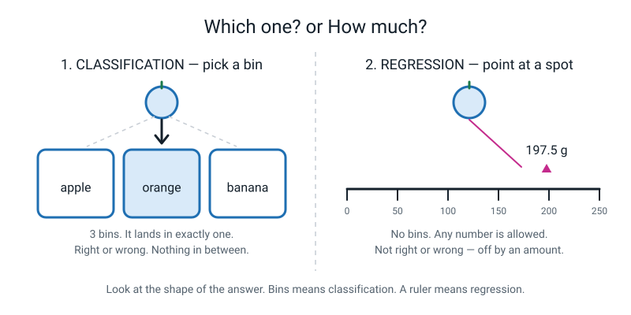
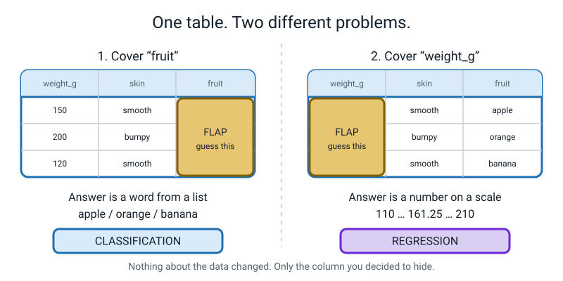
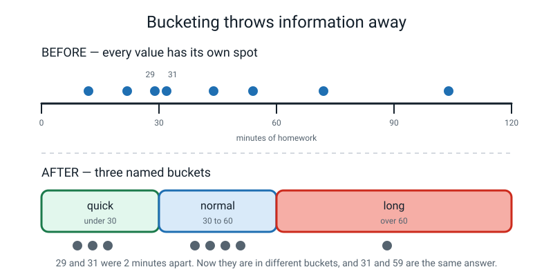
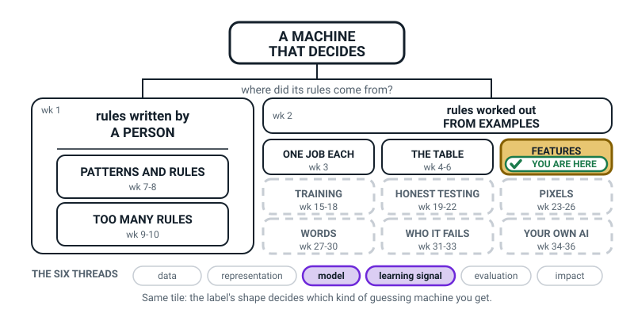
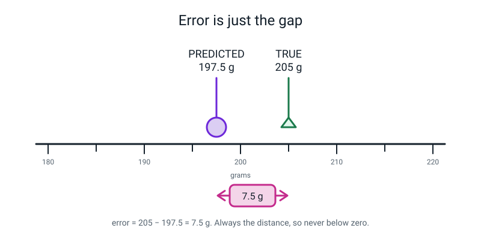
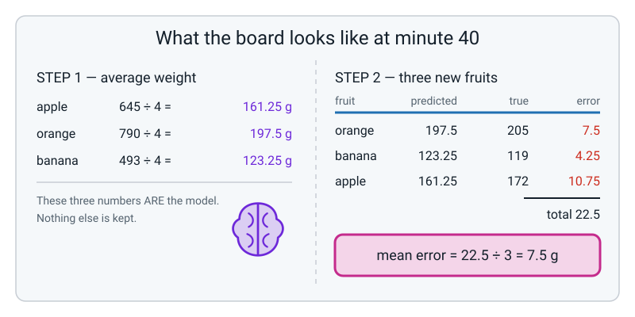

# Week 13 — Which One? or How Much?

[⬅ Week 12](week-12.md) · [Course Home](../README.md) · [Week 14 ➡](week-14.md) · [Student Guide](../student-guide/week-13.md) · [Workbook](../workbook/week-13.md)

---

## 📋 At a Glance

| | |
|---|---|
| **Duration** | 70 minutes (works in 60 if you cut the Hook to 5 and the Activity to 15) |
| **Type** | 🟦 Teach |
| **Big idea** | Classification picks from a short list and regression predicts a number on a sliding scale — and the *same table* does either, depending on which column you cover up. |
| **New vocabulary** | classification · binary classification · multi-class classification · regression · error |
| **Materials** | The 10 task cards (print or hand-write) · the fruit table printout · the student's Week 13 workbook (Build It, Part 1 table) · a ruler · a mystery object in an opaque bag · a kitchen scale (optional but lovely) · paper, pencil, whiteboard or big sheet |
| **Tech needed** | **None.** This is a paper-and-pencil week. A calculator is allowed for the division. |
| **Prep time** | 20 minutes the night before (15 of it is writing the 10 task cards) |

---

## 🎯 Lesson Objectives

By the end of the lesson the student can, observably:

1. **Sort a task into classification or regression** by looking only at the shape of its answer — and say the sorting rule out loud without prompting.
2. **Convert any classification task into a regression task and back again**, by rewriting the label, and name one thing gained and one thing lost by the swap.
3. **Compute the error of a regression prediction** as the distance between the predicted value and the true value, and compute the mean error across three predictions.
4. **Cut a number label into three named buckets** and state, specifically, what information the bucketing threw away.

You will know they have it when they stop asking "is this classification?" and start asking "what shape is the answer?"

---

## 🧑‍🏫 What YOU Need to Know First

*Read this section once. It takes about twelve minutes and it is everything you need. There is nothing else to look up.*

### The one sentence

**Every prediction task has an answer, and answers come in exactly two shapes: a word from a short list, or a number on a scale.** That is the whole of this week. Which shape you are dealing with decides how you build the thing, how you test it, and what "being wrong" even means.

### Shape one — the answer is a word from a short list

You show the machine something and it must pick one of a small number of named options.

> **Classification** — predicting *which one*. The answer is a category chosen from a short, fixed list you wrote in advance.

Everyday examples, all of them classification:

- Is this text message spam, or not spam? *(two options)*
- Is this fruit an apple, an orange, or a banana? *(three options)*
- Which of these five bus routes did the passenger take? *(five options)*

Two special names, and they are just counts:

> **Binary classification** — classification where the list has exactly **two** options. Spam / not spam. Rain / no rain. Pass / fail.
>
> **Multi-class classification** — classification where the list has **three or more** options. Apple / orange / banana.

There is nothing deeper going on. "Binary" means two. That is genuinely it, and you should say so, because an 11-year-old will assume a fancy word must hide a fancy idea and will waste effort looking for it.

The crucial property of classification: **there is no such thing as nearly right.** If the truth is "orange" and the machine says "apple", that is exactly as wrong as saying "banana". You cannot be 10% wrong about which fruit it is.

### Shape two — the answer is a number on a scale

You show the machine something and it must produce a number, and any number in the range is allowed.

> **Regression** — predicting *how much* or *how many*. The answer is a number on a sliding scale.

Everyday examples:

- How many millimetres of rain will fall tomorrow? *(0, 0.4, 3.2, 17…)*
- How many grams does this fruit weigh? *(110, 161.25, 205…)*
- How many minutes will this homework take? *(12, 47, 63…)*

Here "nearly right" **does** mean something, and that changes everything. If the truth is 205 grams and the machine says 197.5 grams, it was not "wrong" in the way "apple instead of orange" is wrong. It was **off by 7.5 grams**. That distance is the whole story, and it has a name.

> **Error** — in regression, how far the guess was from the truth. Always measured as a distance, so it is never below zero.


*Figure 13.1 — Bins on the left, a ruler on the right. Look at the shape of the answer and you know which kind of task you have.*

### The test that never fails: does "nearly right" mean anything?

This is the tool. Give it to yourself and give it to your student.

> Say the true answer out loud. Then say an answer that is a little bit off. Ask: **is the second one nearly as good?**
>
> - True answer "orange", nearly answer "apple" → no, that is just wrong → **classification**.
> - True answer 205 g, nearly answer 203 g → yes, that is nearly right → **regression**.

That test beats every other rule of thumb, including the one everybody reaches for first, which is wrong. See below.

### Misconception 1 — "If the label is a number, it's regression"

This is the single most common error, for adults as much as children, and it will come up this lesson.

A **jersey number** is a number. Player 7 and player 8 are not "nearly the same player." A **bus route number** is a number. Route 12 and route 13 do not go to nearly the same place. A **postcode** is a number. These are categories wearing a number's clothes.

Apply the test: is route 12 *nearly* route 13? No. Therefore: **classification**, despite the digits.

The fix, when a student says "it's a number so it's regression":

> "Try adding two of them together. Weight 150 g plus weight 200 g is 350 g and that means something. Bus route 12 plus bus route 13 is bus route 25, which means nothing at all. If you can't add them or average them sensibly, they're categories."

### Misconception 2 — "Error means the model got it wrong"

In regression, **every prediction has an error, including the good ones.** An error of 0.2 grams is not a failure; it is an excellent prediction. An error of exactly 0 on a real measurement is rare enough to be worth a second look (leaking is one possible cause).

Students who have spent six years being marked right or wrong find this genuinely hard. They will write "error = 0" for a good guess because they think error means "mistake". Head it off in the concept segment with a single line:

> "In regression, 'error' doesn't mean you did something wrong. It just means 'how far off'. A brilliant prediction still has an error — a small one."

### How to compute error (and where to stop)

For a single prediction:

```
error = the distance between predicted and true
      = the bigger one minus the smaller one
```

Real practitioners write this with vertical bars, `|205 − 197.5|`, which means "take the positive size of that gap and ignore the minus sign". **Do not introduce the bars.** With an 11-year-old, "bigger minus smaller" is exact, does the same job, and costs no confusion. If your student already knows absolute value from maths, by all means use it.

For several predictions, add the errors and divide by how many:

```
mean error = (all the errors added up) ÷ (how many predictions)
```

Professionals call that the *mean absolute error*. Call it **mean error** in class. That name is honest and the word "absolute" buys nothing here.

**Where to stop, firmly.** Do not mention squared error, root mean square error, R-squared, loss functions, or linear regression. Do not draw a line of best fit — that is a different idea and this course does not need it. Regression in Level 1 means one thing only: *the answer is a number, so score the guess by its distance from the truth.*

### The idea that makes this week worth teaching: the label is a choice

Here is the part that will surprise your student, and possibly you.

Take a table of twelve fruits, with columns `weight_g`, `length_cm`, `colour`, `skin`, `has_stem`, `fruit`.

- Cover the **`fruit`** column and ask a machine to reconstruct it → the answer is a word from a list of three → **classification**.
- Cover the **`weight_g`** column instead and ask a machine to reconstruct *that* → the answer is a number → **regression**.

Same twelve fruits. Same measurements. Same ink on the same page. **One decision — which column you decided to hide — turned one problem into a completely different one.**


*Figure 13.2 — Two paper flaps, two different problems, one table.*

This is why the week matters. Students arrive believing that "classification problems" and "regression problems" are two different kinds of thing out in the world, like mammals and birds. They are not. They are two different *questions you can ask of the same data*. The task type lives in your question, not in the data.

### Flipping a task on purpose

Because the label is a choice, you can deliberately rewrite any task as the other kind.

**Classification → regression.** Replace the category with a number that measures the same thing.
"Is this spam?" (yes/no) becomes "How spammy is this, from 0 to 100?"
*You gain:* the machine can express doubt. A 51 is honestly different from a 99.
*You lose:* effort. Somebody has to produce those 0-to-100 numbers for the training examples, and there is often no honest way to.

**Regression → classification.** Cut the number line into named ranges.
"How many minutes will homework take?" becomes "quick / normal / long".

> **Bucketing** — turning a number into a category by grouping ranges and giving each range a name. (This gets its own vocabulary card next week; this week just use the plain word.)

*You gain:* simplicity, and often a better match to the decision you're actually making. If all you need to know is "can I finish before dinner?", three buckets answer it.
*You lose:* precision, and you lose it in a specific, nasty way. 29 minutes and 31 minutes are two minutes apart in reality and land in **different buckets**. Meanwhile 31 minutes and 59 minutes land in the **same** bucket and become literally the same answer.


*Figure 13.3 — What bucketing costs. The dots keep their bucket but lose their position.*

Neither direction is "more advanced". Which is right depends entirely on the decision the answer feeds into. That sentence is the mature version of this week's big idea, and a good student will reach it by the end of the activity.

### How deep to go

| Go this deep | Do not go here |
|---|---|
| Two shapes of answer; the "nearly right" test | Probability, likelihood, calibration |
| Binary = two boxes, multi-class = three or more | Softmax, one-vs-rest, logits |
| Error = distance; mean error = average of the distances | Squared error, RMSE, R², loss curves |
| Bucketing and what it costs | Optimal binning, quantiles, entropy |
| The label is a choice | Multi-label tasks, ranking, ordinal regression |

If a student pushes past the right-hand column, the honest answer is *"there is a real answer to that and it comes in Level 2 or 3."* Say it and move on. Do not improvise.

### One last thing you will be asked

A **1-to-5 star rating**: is that a number or a category? Genuinely: **experts disagree**, and the disagreement is old and unresolved. Prepare to say so. There is a scripted answer in the Questions section below.

---

### 🧭 The Growing Map

Same tinted box as last week, third of four. The figure is the place where that stops being confusing:
the box has not moved, but the two lit threads underneath it have, and *that* is what tells you which
week you are in.



*Figure 13.0 — Week 13's version. FEATURES still tinted and badged; this week **model** and
**learning signal** are lit instead of representation and evaluation.*

**What to do with it, in about two minutes at the end of the lesson:**

1. **Show it and ask:** *"which bit did we do today — and why has the shaded box not moved?"* The
   answer you are fishing for: *"we were still working on the table, but on the answer column."*
2. **Then the better question:** *"why is TRAINING still dashed, when we spent all lesson talking
   about what the machine will predict?"* Because we have decided the *kind* of machine, and not yet
   built one. Deciding classification versus regression is a choice a person makes before any machine
   exists — that is the sentence to leave hanging in the air.
3. **Have them shade FEATURES on their own copy for the third time**, and write *which one? / how
   much?* beside it. Their own handwriting on their own map beats anything printed.

> **🧑‍🏫 Why this is worth two minutes.** Today's lesson is a sorting distinction, and sorting
> distinctions feel arbitrary unless the learner can see what hangs off them. The map shows what hangs
> off it: everything to the right. Picking the wrong shape of answer spoils the training week, the
> testing week and the evaluation weeks all at once.

**The six threads** along the bottom are the spine of all four levels. **Model** and **learning
signal** are lit this week. You need neither name them nor assess them; they exist so that by week 36
the learner has seen 36 weeks land on six shelves rather than 36 unrelated topics.

---

## 🧰 Prep Checklist

### 20 minutes the night before

- [ ] **Write the ten task cards (15 min).** Index cards, sticky notes, or paper torn into ten rectangles. Write ONE task on each, exactly as listed below, in this order. Do not write the answers on them.

```
 1  Is this text message spam?
 2  How many millimetres of rain will fall tomorrow?
 3  Which fruit is this: apple, orange or banana?
 4  How many minutes will this homework take?
 5  Is this photo a cat or a dog?
 6  How many runs will this batter score?
 7  Which bus route is fastest: A, B or C?
 8  What price should this second-hand bike be?
 9  Will the kitchen run out of lunches tomorrow?
10  How many times will this song be played in its first week?
```

- [ ] **Make two pile headers.** Two more cards: one saying `WHICH ONE?` and one saying `HOW MUCH?`. These go at the top of the table.
- [ ] **Print or copy the fruit table** (it is in the Worked Example section below, and it is the same table the student built in Week 12 — if their own copy survives, use theirs, it is more motivating).
- [ ] **Put one small object in an opaque bag.** A rubber, a AA battery or a pencil (it must be one of the three things named in Question 1). Something with a weight between about 5 g and 60 g. Do not let the student see it.
- [ ] **Read the Worked Example numbers once** so the arithmetic doesn't ambush you mid-lesson. There are only three divisions and three subtractions.

### 3 minutes before class

- [ ] Whiteboard or a big sheet of paper, wiped clean.
- [ ] The ten cards shuffled, face down.
- [ ] The bag on the table where the student can see it but not touch it.
- [ ] A ruler and a pencil for each of you.

### If something fails

**There is no technology in this lesson, so there is nothing to fail.** But just in case:

- **No printer, no index cards?** Write the ten tasks as a numbered list on one sheet and have the student write `W` or `H` beside each. Everything still works; you lose the physical sorting, which is a real loss but not a fatal one.
- **No kitchen scale?** You never needed one. Every weight in the lesson is supplied in the tables below.
- **Student already knows these words** (from a previous school, an older sibling, the internet)? Skip straight to the flipping. Ask them to flip task 5 and defend the flip. Nobody arrives already able to do that.

---

## ⏱️ The Lesson, Minute by Minute

| Minutes | Segment | What happens |
|---|---|---|
| 0–8 | 🪝 **Hook** — The Bag | Two questions about a hidden object; two completely different kinds of being wrong |
| 8–26 | 🧠 **Concept** | The two shapes of answer, the "nearly right" test, binary vs multi-class, error |
| 26–40 | 🔍 **Worked Example Together** | The fruit table flipped to regression: three averages, three predictions, three errors, one mean |
| 40–60 | 🎲 **Activity** | Flip Every Task — sort ten cards, then flip all ten and argue |
| 60–70 | 🔑 **Wrap & Assign** | Takeaways, vocabulary, homework |

---

### 🪝 Hook — The Bag (0–8 min)

**Do this:** Hold up the opaque bag. Do not open it. Draw two empty boxes on the board, side by side, headed `QUESTION 1` and `QUESTION 2`.

**Say this:**

> "There's one object in this bag. You can't see it, you can't touch it, and I'm not telling you what it is. I'm going to ask you two questions about it, and I want you to answer both.
>
> Question one: is the thing in this bag a **pencil**, a **rubber**, or a **battery**? Pick one of those three. Don't say 'I don't know' — you have to pick.
>
> Write your answer in box one."

Wait for them to commit. Then:

> "Question two: **how many grams does it weigh?** Any number you like. Write it in box two."

Let them write. Then open the bag and reveal the object. Announce its true weight (weigh it if you have a scale; if not, use the value you looked up or estimated the night before — write it on the card in the bag so you can't fudge it).

**Say this:**

> "Now let's mark you. Question one: you said 'rubber' and it is a rubber, so — tick. Or you said 'pencil' and it's a rubber, so — cross. There is nothing else I can write. There's no half tick. If you'd said 'pen' instead of 'pencil', that wouldn't have been *closer*. Wrong is wrong.
>
> Question two: you said 30 grams and it's 42 grams. Do I put a cross? That feels harsh, doesn't it. You weren't right, but you weren't *wrong* in the same way. You were **off by twelve grams**.
>
> That's the whole lesson. You just answered the two kinds of question that every prediction machine on earth answers. One of them you're right or wrong about. The other one you're off by an amount. They need different names, they need different scoring, and today you learn both."

**Ask this:**

| Question | Answer you want | If they say something else |
|---|---|---|
| "Which question was harder to be exactly right on?" | Question 2 — the weight. There are hundreds of possible answers, only one is exact. | If they say question 1: ask "how many possible answers did question 1 have?" (Three.) "And question 2?" (Loads.) That usually turns it around. |
| "Which one would you rather be graded on?" | Usually question 2, because near-misses count for something. | Either answer is fine — the interesting bit is the reason. Push for the reason: "why?" |
| "If I asked question 2 about the same object tomorrow and you said 41 grams, is that better than 30?" | Yes — much closer. | If they say "no, it's still not exactly right", you have found Misconception 2 early. Excellent. Say: "hold that thought, we'll fix it in ten minutes." |

---

### 🧠 Concept (8–26 min)

**Do this:** Draw Figure 13.1 on the board — three bins on the left, a ruler on the right. Keep it crude; two minutes maximum. Then show the printed figure.


*Figure 13.4 — Draw this on the board. Three bins, one ruler.*

**Say this:**

> "Question one had **bins**. Three bins, labelled pencil, rubber, battery. Your answer had to go in exactly one bin. That's called **classification** — you're saying *which one*.
>
> Question two had a **ruler**. Not bins — a line, with every number on it available to you. You could have said 30, or 30.5, or 30.4999. That's called **regression** — you're saying *how much*.
>
> Two words. Classification: which one. Regression: how much. Write them down."

Pause and let them write. Then:

> "Now, there are two sizes of classification and they have their own names, and I promise the names are as boring as they sound.
>
> If there are exactly **two** bins — spam or not spam, rain or no rain, pass or fail — that's **binary classification**. 'Binary' just means two. That's the entire meaning of the word. There's no hidden cleverness in it.
>
> If there are **three or more** bins — apple, orange, banana — that's **multi-class classification**. 'Multi' means many. Also not clever.
>
> Two names, one idea, and the only difference is how many bins are on the floor."

**Do this:** Write the four terms on the board in a column with a one-line definition each. Leave them up all lesson.

```
classification              which one?  -> a word from a short list
  binary classification     exactly 2 boxes
  multi-class classification  3 or more boxes
regression                  how much?   -> a number on a scale
error                       how far off the number was
```

**Say this — the test:**

> "Here's how you tell them apart, and this test never fails.
>
> Say the true answer. Then say an answer that's *a bit* off. Ask yourself: **was that nearly as good?**
>
> True answer 'orange'. A bit off: 'apple'. Nearly as good? No — that's just wrong. So it's classification.
>
> True answer 205 grams. A bit off: 203 grams. Nearly as good? Yes, obviously. So it's regression.
>
> Try it: 'which bus route is fastest — A, B or C?' True answer is B. A bit off: C. Nearly as good?"

**Ask this:**

| Question | Answer you want | If they say something else |
|---|---|---|
| "Bus route B, but you said C. Nearly as good?" | No. You get on the wrong bus. Classification. | If they say "yes, they both go to school" — brilliant answer, actually. Say: "you're right that both are buses. But as an *answer to the question 'which is fastest'*, C isn't 90% of B. There's no partial credit." |
| "Here's a hard one. Shirt number: is a player's shirt number a number or a category?" | It's a **category** wearing a number's clothes. Player 7 is not nearly player 8. | This one is *supposed* to be hard. If they say "number", do the addition trick: "add player 7 and player 8. Is that player 15? Does that mean anything?" |
| "How do you know if a number is really a number?" | You can add them or average them and the result means something. 150 g + 200 g = 350 g, and that means something. | If stuck, offer three examples and have them sort: weight in grams (real number), house number (category), temperature (real number). |

**Say this — error, and the trap:**

> "Now the scoring, because it's completely different for the two kinds.
>
> Classification: tick or cross. You count the ticks. That's it. We'll do a lot more of that later in the year.
>
> Regression: there is no tick. There's a **gap**. If the true weight is 205 grams and you predicted 197.5, the gap is 7.5 grams. That gap has a name: it's the **error**.
>
> And here is the bit I need you to get right, because it trips up grown-ups. **'Error' does not mean you did something wrong.** It just means *how far off*. A brilliant prediction still has an error — a tiny one. A prediction with an error of half a gram is a great prediction. You are not being told off. You are being measured."

**Do this:** Draw the number line from Figure 13.3 on the board, with the two pins and the arrow.


*Figure 13.5 — Error is the gap. Draw exactly this on the board.*

**Say this:**

> "And it's always a distance, so it's never a negative number. If I predict 210 and the truth is 205, my error is 5. If I predict 200 and the truth is 205, my error is *also* 5. Same distance, opposite directions, same size of mistake. Bigger number minus smaller number. Every time."

**Ask this:**

| Question | Answer you want | If they say something else |
|---|---|---|
| "Predicted 120 g, true 133 g. Error?" | 13 g | If they say −13: "good, you spotted the direction. For now we just want the size, so: 13." |
| "Predicted 150 g, true 141 g. Error?" | 9 g | If they say 9 but write "−9" or hesitate: reinforce "bigger minus smaller, always." |
| "Which of those two guesses was better?" | The second one — 9 is a smaller gap than 13. | If they say "the first, because it was over instead of under" — ask "does it matter to the fruit whether you were over or under?" Usually it doesn't. Sometimes it does, and if they argue that well, say so and move on: "you've found something real, and we'll come back to it." |

---

### 🔍 Worked Example Together (26–40 min)

This is the fruit table from Week 12, reused with the label moved. **Do the arithmetic together on the board, out loud.** Do not present it finished.

**Do this:** Put the fruit table in front of both of you.

| id | weight_g | length_cm | colour | skin | has_stem | fruit |
|---|---|---|---|---|---|---|
| 1 | 150 | 8 | red | smooth | yes | apple |
| 2 | 165 | 8 | green | smooth | yes | apple |
| 3 | 140 | 7 | red | smooth | yes | apple |
| 4 | 190 | 9 | red | smooth | no | apple |
| 5 | 200 | 8 | orange | bumpy | no | orange |
| 6 | 185 | 7 | orange | bumpy | no | orange |
| 7 | 210 | 8 | orange | bumpy | no | orange |
| 8 | 195 | 8 | orange | bumpy | no | orange |
| 9 | 120 | 19 | yellow | smooth | no | banana |
| 10 | 135 | 21 | yellow | smooth | no | banana |
| 11 | 110 | 18 | green | smooth | no | banana |
| 12 | 128 | 20 | yellow | smooth | no | banana |

**Say this:**

> "You built this table in Week 12. Back then the last column, `fruit`, was the label — the thing we covered up and asked the machine to guess. Three boxes. Multi-class classification.
>
> Today I'm going to change one thing and nothing else. I'm going to **uncover `fruit`** and **cover `weight_g` instead**. Now the machine is told the fruit is an orange, and it has to guess how many grams it weighs.
>
> Same twelve fruits. Same twelve rows. I have not changed a single number. What kind of task is it now?"

**Ask this:**

| Question | Answer you want | If they say something else |
|---|---|---|
| "What kind of task is it now?" | Regression — the answer is a number on a scale. | If they say "still classification": apply the test. "True answer 205, guess 203. Nearly as good?" |
| "How many possible answers are there now?" | Loads. Any number. There's no list. | If they say "twelve, one for each fruit" — good thinking, wrong. Say: "a new fruit could weigh 163 g and that's not in the table at all." |

**Say this:**

> "Right. So we need a way to guess a weight. Here's the simplest honest guesser in the world: **for each type of fruit, work out the average weight, and use that as the guess every time.** That's it. That's our whole model.
>
> Let's build it. Apples first."

**Do this:** Work the three averages on the board, letting the student do the adding.

```
apples:   150 + 165 + 140 + 190  =  645       645 ÷ 4 = 161.25 g
oranges:  200 + 185 + 210 + 195  =  790       790 ÷ 4 = 197.5  g
bananas:  120 + 135 + 110 + 128  =  493       493 ÷ 4 = 123.25 g
```

**Say this:**

> "Stop and look at that. Those **three numbers are the entire model.** 161.25, 197.5, 123.25. Everything else in that table — the colours, the skin, the stems, all twelve rows — is gone. Three numbers is all we kept.
>
> Now let's use it. Three new fruits arrive that were never in the bowl."

**Do this:** Reveal the three test fruits one at a time. Get the prediction from the student *before* revealing the true weight each time.

**Fruit P — an orange.**
> "It's an orange. What do we predict?" → 197.5 g.
> "It actually weighs **205 g**. Error?" → 205 − 197.5 = **7.5 g**

**Fruit Q — a banana.**
> "It's a banana. Predict." → 123.25 g.
> "It actually weighs **119 g**. Error?" → 123.25 − 119 = **4.25 g**

**Fruit R — an apple.**
> "It's an apple. Predict." → 161.25 g.
> "It actually weighs **172 g**. Error?" → 172 − 161.25 = **10.75 g**

**Say this:**

> "Three errors: 7.5, 4.25 and 10.75. Which prediction was best?"

Let them answer (the banana, error 4.25).

> "Now — if somebody asks 'how good is your model?', you can't hand them three numbers. You need one. So do the obvious thing: add them up and divide by how many."

```
7.5 + 4.25 + 10.75  =  22.5
22.5 ÷ 3            =  7.5

MEAN ERROR = 7.5 grams
```

**Do this:** Your board should now look like this.


*Figure 13.6 — The board at minute 40. Everything on it was worked out out loud.*

**Say this:**

> "'Our model is off by about seven and a half grams on average.' That's an honest sentence about a machine and you just earned the right to say it.
>
> And notice what you *can't* say. You can't say 'our model is 83% accurate', because there's no such thing here. Nothing was right and nothing was wrong. Everything was off by an amount."

**Ask this:**

| Question | Answer you want | If they say something else |
|---|---|---|
| "Is a mean error of 7.5 g good or bad?" | **It depends what you're doing with it.** For sorting fruit into crates, fine. For dosing medicine, catastrophic. | If they just say "good" or "bad", push: "good for what?" This is the answer you want them to build a habit of. |
| "How could we make the mean error smaller?" | Use more than just the fruit type — `length_cm` would help separate big bananas from small ones. Or collect more fruit. | If they say "guess better", ask "using what information?" Point at the unused columns. |
| "If I cover `length_cm` instead, what kind of task is it?" | Regression again — length is a real number. | If they say classification: run the test. "True 19 cm, guess 18.5 cm. Nearly as good?" |

---

### 🎲 Activity — Flip Every Task (40–60 min)

Full instructions are in the next section. In the lesson flow:

- **40–46 · Sort.** Deal the ten cards. Student sorts them under `WHICH ONE?` and `HOW MUCH?`. You say nothing until all ten are placed.
- **46–56 · Flip.** Take each card in turn and rewrite the task as the other kind, out loud, then in the Part 1 table of the workbook.
- **56–60 · Argue.** For three of the cards, argue about which version is genuinely more useful for the person who'd use it. You take the opposite side deliberately.

---

### 🔑 Wrap & Assign (60–70 min)

**Do this:** Clear the board except the four vocabulary lines. Ask the student to fill in the definitions from memory before you check them.

**Say this:**

> "Four things to take away.
>
> One: **look at the shape of the answer.** A short list of words means classification. A number on a scale means regression. That's the only test you need.
>
> Two: **beware numbers that aren't numbers.** Bus route 12 isn't nearly bus route 13. If you can't add them sensibly, they're categories in disguise.
>
> Three: **in regression there's no tick or cross — there's a gap.** That gap is the error. Bigger minus smaller, always positive. Average the errors and you have one honest number for the whole model.
>
> Four, and this is the big one: **the task type isn't a property of the data. It's a property of your question.** The same twelve fruits gave us a classification problem and a regression problem, and the only thing that changed was which column we decided to cover up."

**Assign the homework** using the exact wording in the 📤 section below.

---

## 🎲 The Activity, In Full

### Flip Every Task

**Time:** 20 minutes. **Group size:** one student and you, or pairs.
**Materials:** the ten task cards, the two pile headers, the workbook open at **🛠️ Build It, Part 1** (the ten-row table), a pencil.

### Setup (1 minute)

Put the two header cards at the top of the table, about 40 cm apart:

```
   ┌─────────────────┐              ┌─────────────────┐
   │   WHICH ONE?    │              │    HOW MUCH?    │
   │ (classification)│              │  (regression)   │
   └─────────────────┘              └─────────────────┘
```

Shuffle the ten task cards and put them face down in a stack between the headers.

### Phase 1 — Sort (6 minutes)

**Rules:**
1. Turn over one card. Read it aloud.
2. Say which pile it goes in **and why**, using the "nearly right" test out loud. The *why* is compulsory; a card placed silently gets turned face down again.
3. Place it. Move on.
4. **You say nothing** until all ten are placed. Not a nod, not an eyebrow. Write your own predictions on a scrap of paper if you need something to do with your hands.

After all ten are placed, go through them together. Expect a correct split of 5 and 5. The two cards that most often land wrong are card 7 (bus routes — the letters A/B/C look like a scale to some children) and card 9 (running out of lunches — sounds like a counting question but the answer is yes/no).

**What "finished" looks like:** ten cards in two piles, and the student can justify each placement with the "nearly right" test.

### Phase 2 — Flip (10 minutes)

Now the hard half.

**Rules:**
1. Take a card from the `WHICH ONE?` pile. Rewrite it as a `HOW MUCH?` question, out loud, then write the new version in the workbook.
2. Name the new label column and say what values it can take. "The label is `rain_mm`, and it can be any number from 0 upwards."
3. Do the same in reverse for the `HOW MUCH?` pile: cut the number into named buckets.
4. Every flip must produce a **real, sayable question**, not "how much cat is this photo".

Work through all ten. Model the first one yourself so the shape is clear:

> "Card 1. 'Is this text message spam?' That's yes/no — binary classification. To flip it, I need a number that measures the same thing. How about: 'How spammy is this message, from 0 to 100?' New label column: `spam_score`, any number 0 to 100. Done. Your turn with card 2."

### Phase 3 — Argue (4 minutes)

Pick three cards. For each one, ask:

> "Which version would actually be more useful for the person who has to use it?"

**Your job is to take the opposite side, whatever side they take.** Not to win — to make them find the second reason. Two minutes of genuine argument per card is worth more than a page of notes.

Good pressure lines:
- "You'd rather have the percentage? Fine — who's going to sit and grade five thousand old messages from 0 to 100 to teach it?"
- "You'd rather have yes/no? So a message that's obviously spam and one that's borderline get the same answer, and you never see the difference?"

### What "finished" looks like

- Ten cards sorted, with a spoken justification for each.
- Ten flips written down, each with its new label column named.
- Three cards argued, and the student has changed their mind at least once — or held their position with a *second* reason, which is just as good.

### Variation — easier

Cut to **six cards** (1, 3, 4, 5, 6, 8). Do the sort, and flip only the three classification cards — flipping regression → classification needs the bucketing idea, which is the harder direction. Give the buckets rather than asking them to invent them: for card 4, offer `under 30 / 30–60 / over 60` and just ask what got thrown away.

### Variation — harder

After the ten cards, add this:

> **The bad flip.** One of these ten flips is a genuinely *bad* idea — the flipped version is worse than the original for every realistic user. Find it and prove it.

The intended answer is **card 5** (cat or dog → what fraction of 100 people would call it a cat). To label the training data you would need a hundred human opinions per photo, which costs a hundred times more and produces information nobody sorting a photo album will ever use. A student who argues instead for card 3 or card 7 with a solid reason should be credited — the point is the argument, not the card.

Then: **invent an eleventh card** for a task in their own life, write both versions, and say which they'd build.

---

## ❓ Questions Students Ask This Week

**"Is a 1-to-5 star rating a number or a category?"**
Honestly: **nobody has a settled answer, and people who do this for a living still argue about it.** Here is why. The stars are in order — 4 really is better than 3 — so they are not pure categories like apple and orange. But the gaps aren't equal: the difference between 1 star and 2 stars usually means something much bigger than the difference between 4 and 5. So they're not proper numbers either. There's a whole in-between name for data like this, and there is no agreement on the right way to handle it. What people actually do is try both and see which works better for their problem, which is a slightly unsatisfying but completely honest answer. If it helps: this is a real open argument in statistics, not a gap in your teacher's knowledge.

**"Can something be both classification and regression at the same time?"**
Not the same question, no. But the same *table* can give you both, which is what we did with the fruit — cover `fruit` and it's classification, cover `weight_g` and it's regression. And a real system often runs both at once: a weather app tells you "rain tomorrow: yes" *and* "12 mm". Those are two separate predictions from the same data, not one prediction being two things.

**"Why not always use regression? It gives you more information."**
Because somebody has to produce the numbers to learn from. For the fruit, that was easy — we had a scale. Now try "how much of a cat is this photo, from 0 to 100?" There's no cat-o-meter. To get those labels you'd have to ask a hundred people about every single photo, and even then you'd only be measuring *what people think*, not what's true. When there's no honest way to produce the number, regression isn't available, however much you'd like it.

**"What if my prediction is exactly right? Is the error zero?"**
Yes — error 0 means you nailed it. It's rare, and worth being slightly suspicious of. If your model gets error 0 over and over on a real measurement, something may be leaking (the answer sneaking into the features) or the test may be too easy, so go and check. One perfect guess is luck. Twenty perfect guesses is a reason to investigate.

**"Does it matter if I guessed too high or too low?"**
Sometimes enormously, and this week we're ignoring it on purpose. For the fruit, being 7 g over or 7 g under is the same size of miss. But imagine predicting how long a journey takes: guessing 10 minutes short means you miss your train, and guessing 10 minutes long means you wait on a platform. Same error size, wildly different cost. Real systems do handle this, and we won't this year. You spotted something real.

**"Which one do real companies use more?"**
Both, constantly, usually in the same product. Your music app classifies (which genre is this?) and regresses (how many seconds before you skip?) at the same time. Nobody picks a favourite. They pick whichever matches the question they're being paid to answer.

**"If I put more buckets in, do I lose less?"**
Yes — ten buckets throw away less than three. But you gain less simplicity, and every bucket needs enough examples in it to learn from. Split 12 fruits into ten weight buckets and most buckets have one fruit in them, which teaches you nothing. There is no formula for the right number of buckets. People try a few and look.

**"Could you have a task with a hundred boxes?"**
Yes, easily. "Which country is this flag from?" has about 195 boxes and it's still classification. There's no upper limit; it just gets harder, because you need examples of every box and some of them will be rare. Somewhere past a few thousand boxes people start using different machinery, but the idea doesn't change.

---

## ⚠️ Where This Lesson Goes Wrong

| What happens | Why | What to do right now |
|---|---|---|
| Student calls everything with a number in it "regression" | The word "number" is doing all the work in their head, and nobody has shown them a counter-example | Stop and do the shirt-number question. Then the addition trick: "add player 7 and player 8 — is that player 15? Does that mean anything?" Three examples fixes it permanently |
| Student writes "error = 0" for a good prediction | They read "error" as "mistake", so a good prediction can't have one | Say it flatly: "error means *how far off*, not *how wrong you were*. A great prediction has a small error, not no error." Then redo the 197.5 / 205 example and make them say "seven point five" out loud |
| Student writes a negative error, or gets confused about direction | Predicted 210, true 205 — the subtraction goes the other way | "Bigger minus smaller. Always. We only want the size of the gap." Write `BIGGER − SMALLER` on the board and leave it there for the rest of the lesson |
| The flipping phase stalls completely | Flipping regression → classification requires inventing bucket boundaries, and inventing boundaries from nothing is genuinely hard | **Give them the buckets.** For card 4 offer `under 30 / 30–60 / over 60`. Once they've seen two sets of boundaries handed to them, they can invent the third |
| Student flips a task into nonsense ("how much cat is this?") | They're pattern-matching on the word "how much" instead of finding a real quantity | Ask: "who would measure that, and with what?" If there's no answer, the flip isn't real. Then offer the honest version — "what fraction of 100 people would call it a cat?" — and note that it costs a hundred opinions per photo |
| Student insists their favourite version is right and the argument dies in 20 seconds | You agreed with them, or asked a question with an obvious answer | Take the other side hard, even if you agree. "Fine. Who is going to grade five thousand messages from 0 to 100? Name them." The argument is the activity |
| Arithmetic errors derail the worked example | 645 ÷ 4 and 22.5 ÷ 3 are not hard, but doing them under observation is | Let them use a calculator. The maths is not the point this week — the *shape* of the calculation is. Check the three averages against 161.25 / 197.5 / 123.25 and move on |
| Student says "so classification is easier" | The fruit classification worked perfectly in Week 12 and the regression didn't | Correct it clearly: "the regression *did* work — it was off by 7.5 grams out of about 160, which is about 5%. It's not worse, it's measured differently." Neither type is easier |

---

## 🧭 Differentiation

### If they are struggling

**Cut:** the bucketing half of the homework, and the argue phase in the activity. Use the six-card easier variation.

**Reteach with this:** go back to the bag. Put a *different* object in it and run the hook again, but this time ask the student to write down, before answering, which kind of question each one is. Two rounds of that is worth ten minutes of explanation.

**Hold the line on this:** they must be able to say "classification means which one; regression means how much" without looking. Everything else this week can be soft. If they leave with only that sentence and the "nearly right" test, the week worked.

**A crutch that helps:** let them draw a tiny bin or a tiny ruler beside every task in the workbook instead of writing the word in the Build It table. The word can come next week.

### If they are flying

Extension questions, in increasing difficulty:

1. **"Turn card 3 into a binary classification."** (Answer: "Is this a banana — yes or no?" You've collapsed three boxes into two, and you've lost the ability to tell apples from oranges entirely.)
2. **"Our mean error was 7.5 g. What's the *worst possible* mean error our fruit model could get?"** Push them to realise it depends on what fruit turns up — a 400 g monster apple would blow it up on its own. Then ask the sharper question: **"does one huge error hide inside a mean?"** (Yes, badly. Mean of 1, 1, 1 and 40 is 10.75, and three of those four were excellent.)
3. **"Design a fourth fruit class — say, `lime` — and predict what happens to the mean error."** (It should get worse at first, because limes are much lighter than everything else and the model has no lime average yet.)
4. **"Find a task where flipping is impossible in both directions."** Genuinely hard. A decent attempt: "which language is this text written in?" — there's no honest number version, because languages aren't on a scale. Credit any argued attempt.

### If they won't engage today

Run the bag hook, then switch entirely to the **sort only**. Ten cards, two piles, no writing, no flipping, no arithmetic. It takes six minutes and it delivers objective 1 on its own. Then stop and do something physical: hide three objects around the room, ask them to guess the weight of each before you weigh it, and write the errors on the board. That's the same lesson through a game, and it costs nothing.

If even that fails, the minimum viable version of Week 13 is this, and you can do it in four minutes at the end of any other activity:

> "Two kinds of question. *Which one?* and *How much?* Give me one example of each from your own day."

Get the two examples. Write them down. Move on. You can rebuild the rest at the start of Week 14.

---

## ✅ Assessing Understanding

Three checks for the last five minutes. Use the exact wording.

### Check 1 — the sorting reflex

> "Which kind of task: *how many people will come to the school fair?*"

**A good answer:** "Regression — the answer is a number, and 400 is nearly right if it's 410."
**A weak answer:** "Regression" with no reason. Ask "how do you know?" and listen for the "nearly right" test.
**A wrong answer:** "Classification because people are things you count." Reteach the test.

### Check 2 — the number that isn't a number

> "Which kind of task: *which of the four school houses is this student in?* The houses are numbered 1, 2, 3 and 4."

**A good answer:** "Classification. They're numbers but they're really names — house 2 isn't nearly house 3."
**A weak answer:** "Classification" without addressing the digits. Push: "but they're numbers. Why doesn't that make it regression?"
**A wrong answer:** "Regression, because 1, 2, 3, 4." Do the addition trick immediately.

### Check 3 — the error

> "A model predicted a parcel would weigh 480 grams. It actually weighed 512 grams. What's the error, and was the model good?"

**A good answer:** "32 grams. And I can't say if it's good until I know what it's for — 32 g is nothing for a parcel and everything for a letter."
**An acceptable answer:** "32 grams", with a shrug on the second part.
**A wrong answer:** "512 − 480 = 32, so it's 32% wrong" — a units confusion worth catching. Or a negative number. Or "it's wrong" full stop, which is Misconception 2.

### Mastery scale for this week's objective

| Level | What it looks like |
|---|---|
| **1 — Not yet** | Uses "classification" and "regression" as sounds, not meanings. Sorts by guessing. |
| **2 — Emerging** | Sorts correctly when the answer is obviously a word or obviously a measurement. Falls for shirt numbers and route numbers. Computes an error only with the subtraction written out for them. |
| **3 — Secure** | Sorts all ten cards correctly and applies the "nearly right" test out loud without prompting. Computes single errors and a mean error unaided. Can flip classification → regression. |
| **4 — Strong** | Flips in both directions, including inventing sensible bucket boundaries. Says what bucketing threw away in specific terms ("29 and 31 got split"). Catches number-shaped categories on sight. |
| **5 — Mastery** | Argues about which version is more useful *from the point of view of the person using it*, and can name a case where flipping is a bad idea and say why. Notices unprompted that one huge error can hide inside a mean. |

Aim for 3. A 6th grader hitting 4 this week is doing genuinely well.

---

## 📤 Homework to Assign

**Say this:**

> "Two things, and they should take you about fifty minutes.
>
> First: **the ten cards, both ways.** The table is in your workbook, under **Build It, Part 1**. Fill in every one of the ten, write the classification version and the regression version — both, even the one you flipped in class. Then, underneath each pair, one line: **which version is more useful in real life, and who for?** Not which is easier. Which is more *useful*, and for which person.
>
> Second: **go back to your own table from Week 12** — the one you built with your own objects. Find a column that holds a number. Cut it into **three named buckets** with sensible boundaries you choose yourself. Give each bucket a name a human would actually say. Then write two sentences on **what information the bucketing threw away.** I want specifics — 'two values that were close together ended up in different buckets' is the kind of sentence I'm after, with the actual numbers.
>
> Bring the table and the cards next week. You'll need your own objects again."

**Workbook sections (Week 13 workbook, in order):** ✅ Warm-Up (W1–W5) · ✍️ Practice Set A (A1–A6) · ✍️ Practice Set B (B1–B5) · 🧩 Puzzle of the Week · 🤔 Think Deeper (T1–T2) · 🛠️ Build It Part 1 (ten flips) and Part 2 (bucketing) · 🎨 Draw It · 📊 Self-Check. The two tasks in the script above are **Build It Part 1** and **Build It Part 2**.
**Suggested split (the workbook is longer than the script):** Build It Part 1 is started in class during the Flip phase and finished at home; Build It Part 2 is home only. The rest of the workbook is for the week: Warm-Up, Practice Sets A and B and the Puzzle on one or two short sittings, Think Deeper and Draw It on another, Self-Check last. Don't assign everything in one evening.
**Expected time:** Build It Parts 1 and 2 about 45–55 minutes, as scripted. Expect roughly another hour across the rest of the workbook, spread over the week. If Build It takes over an hour they are over-writing; tell them one line per flip means one line.
**The one thing not to skip:** the "who for?" column of Build It Part 1. That is the objective; the flipping is just the vehicle.

---

## 🔑 Answer Key

*Complete worked answers to every question posed in the lesson and every workbook item, in workbook order: Warm-Up, Practice Set A, Practice Set B, Puzzle, Think Deeper, Build It Parts 1 and 2, Draw It, Self-Check. The workbook's own ✅ Answers section agrees with this key.*

### Lesson questions

**Hook — "which question was harder to be exactly right on?"** Question 2, the weight. Question 1 had three possible answers so a blind guess is right one time in three. Question 2 has hundreds of possible answers and a blind guess is almost never exactly right.

**Concept — "bus route B, but you said C. Nearly as good?"** No. There is no partial credit. You board the wrong bus and arrive late by however long that route takes. Classification.

**Concept — "is a shirt number a number or a category?"** A category. Test it by adding: player 7 + player 8 = player 15, which means nothing. Test it by averaging: the average of players 7 and 8 is player 7.5, who does not exist. Numbers you cannot add or average are labels wearing digits.

**Concept — "predicted 120 g, true 133 g. Error?"** 133 − 120 = **13 g**.
**Concept — "predicted 150 g, true 141 g. Error?"** 150 − 141 = **9 g**.
**Concept — "which was better?"** The second. 9 g is a smaller gap than 13 g.

**Worked example — the three averages.**
```
apples:  150 + 165 + 140 + 190 = 645     645 ÷ 4 = 161.25 g
oranges: 200 + 185 + 210 + 195 = 790     790 ÷ 4 = 197.5  g
bananas: 120 + 135 + 110 + 128 = 493     493 ÷ 4 = 123.25 g
```

**Worked example — the three predictions and errors.**

| fruit | predicted | true | error |
|---|---|---|---|
| orange P | 197.5 | 205 | 205 − 197.5 = **7.5** |
| banana Q | 123.25 | 119 | 123.25 − 119 = **4.25** |
| apple R | 161.25 | 172 | 172 − 161.25 = **10.75** |

**Mean error:** (7.5 + 4.25 + 10.75) ÷ 3 = 22.5 ÷ 3 = **7.5 g**.

**Worked example — "is 7.5 g good?"** It depends entirely on the use. Sorting fruit into crates: excellent. Selling by weight to the gram: unacceptable. Any answer that does not ask "for what?" is incomplete.

**Worked example — "how could we make the mean error smaller?"** Use `length_cm` as well as fruit type — the 21 cm banana is almost certainly heavier than the 18 cm one, and the current model gives them the same guess. Or collect more fruit so the averages are steadier.

**Worked example — "cover `length_cm` instead: what kind of task?"** Regression. Length is a genuine measurement on a scale; 18.5 cm is nearly 19 cm.

### Activity Phase 1 — the sort

| card | task | pile | why |
|---|---|---|---|
| 1 | Is this text message spam? | WHICH ONE? | Two boxes: spam, not spam. **Binary classification.** |
| 2 | How many millimetres of rain tomorrow? | HOW MUCH? | 4 mm is nearly 4.5 mm. Regression. |
| 3 | Which fruit: apple, orange or banana? | WHICH ONE? | Three boxes. **Multi-class classification.** |
| 4 | How many minutes will this homework take? | HOW MUCH? | 47 is nearly 48. Regression. |
| 5 | Is this photo a cat or a dog? | WHICH ONE? | Two boxes. Binary classification. |
| 6 | How many runs will this batter score? | HOW MUCH? | 48 is nearly 50. Regression. |
| 7 | Which bus route is fastest: A, B or C? | WHICH ONE? | Three named boxes. The letters are labels, not a scale. Multi-class. |
| 8 | What price for this second-hand bike? | HOW MUCH? | £4,400 is nearly £4,500. Regression. |
| 9 | Will the kitchen run out of lunches? | WHICH ONE? | Yes or no. Binary — despite the fact that lunches are counted. The *answer* is not a count. |
| 10 | How many plays in the first week? | HOW MUCH? | A count on a scale. Regression. |

Split: 5 classification (1, 3, 5, 7, 9), 5 regression (2, 4, 6, 8, 10).

### Workbook — ✅ Warm-Up (W1–W5, last week's ideas)

**W1.** A feature is one **measured** description of one example; a label is the **answer** you want the machine to produce. (Accept "number or word" for measured, "right answer" for answer.)

**W2.** **(b)** — almost the same value for every example, so it never helps tell anything apart. *Wrong-answer map:* (a) is a **leaky** feature, a different problem — the usual slip; (c) and (d) are not problems at all.

**W3.** The sticker is not part of what an apple *is*; it is a trace of where this apple came from. It separates apples from bananas perfectly in **their bowl** and fails on an apple from a tree or a banana that happens to have a sticker. It works on the examples you have and tells you nothing real, and it *looks* like the best feature — that is what makes it dangerous.

**W4.** 4 / 12 = **1/3**, which is **33%** (0.333…). That is the baseline any real model has to beat. *Watch for:* 4/4 or 100% (they counted only the apples), or 4/3.

**W5.** **FALSE.** 100% can mean an excellent feature, **or** a leaky one that is reading the answer, **or** examples that were too easy to tell apart. A perfect score is a reason to investigate, not to celebrate.

### Workbook — ✍️ Practice Set A, Understand It (A1–A6)

**A1.** Classification predicts **which one** — the answer is a **word (a category)** from a short, fixed list. Regression predicts **how much** — the answer is a **number** on a sliding scale.

**A2.** **(b)** is binary classification (exactly two boxes). The others: (a) **multi-class classification** (four boxes; houses numbered 1–4 are still categories); (c) **regression** (4 mm is nearly 4.5 mm); (d) **multi-class classification** (three boxes). *Watch for:* (a) called "regression" because the houses have numbers, and (d) called "binary".

**A3.** **FALSE.** Bus route 12 is written in digits and is not nearly bus route 13. Shirt numbers, house numbers, postcodes and phone numbers are categories wearing digits. The test: try adding two. 150 g + 200 g = 350 g means something; player 7 + player 8 = player 15 does not. Accept any example where adding or averaging gives nonsense.

**A4.**

| Task | Answer | Why |
|---|---|---|
| 1. Cat or dog? | **(b)** binary | Two boxes |
| 2. How many grams? | **(a)** regression | 204 g is nearly 205 g |
| 3. Which country's flag? | **(c)** multi-class | About 195 boxes, still classification |
| 4. What price? | **(a)** regression | £4,400 is nearly £4,500 |
| 5. Run out of lunches? | **(b)** binary | Yes or no — the *answer* is not a count |
| 6. Which of three routes? | **(c)** multi-class | Three named boxes; A, B, C are labels, not a scale |

*Most likely error:* item 3 marked (a) because "there are so many countries", or item 5 marked (a) because lunches are counted.

**A5. The labelled diagram (Figure W13.1).** **A** = **classification** (the bins). **B** = **multi-class classification** (three or more boxes). **C** = **regression** (the ruler). **D** = **error** (the gap between the guess and the truth). **E** = any real classification task (e.g. "which of my three water bottles is this?"). **F** = any real regression task (e.g. "how heavy is my school bag today?"). If their **E** or **F** is number-shaped like "which bus route", it belongs in **E** — have them run the addition test.

**A6.**

| | predicted | true | error | working |
|---|---|---|---|---|
| 1 | 120 g | 133 g | **13 g** | 133 − 120 |
| 2 | 150 g | 141 g | **9 g** | 150 − 141 (the guess was *above* the truth, so bigger − smaller runs the other way) |
| 3 | 480 g | 512 g | **32 g** | 512 − 480 |
| 4 | 205 g | 205 g | **0 g** | exactly right |

Best: **row 4** (error 0). Worst: **row 3** (error 32).

```text
13 + 9 + 32 + 0 = 54
54 ÷ 4          = 13.5

MEAN ERROR = 13.5 g
```

*Watch for:* a negative error on row 2 (−9) — remind them it is always bigger minus smaller. Some will divide by 3 because one error is 0 and "doesn't count"; it counts, divide by 4.

### Workbook — ✍️ Practice Set B, Use It (B1–B5)

**B1.** **Regression.** 410 people against a model that said 400 is nearly right, so the answer is a number on a scale, not a box. Error = 410 − 400 = **10 people**. Is that good? **It depends what it is for.** For how many chairs to put out: excellent. For ordering exactly enough food: 10 people is 10 lunches, which may matter. Any answer that does not ask "good for what?" is incomplete.

**B2.** Two things wrong (any two of these):
1. **A house number is a category, not a measurement.** 15.5 is not "nearly" house 14; it is not a house at all, so the model is allowed to answer things that cannot exist.
2. **The error is meaningless as a score.** "Off by 1.5" sounds tiny, but a parcel at the wrong house is 100% wrong, exactly as wrong as house 90. There is no partial credit for nearly finding a front door.

*Should have done:* **classification** — the answer is one of the house numbers that exist on that street — scored with ticks and crosses. Bonus if they notice the list of boxes changes street by street.

**B3.** **79 and 80:** one mark apart, but grades **B** and **A** — a one-mark difference becomes the biggest visible difference on the report. **80 and 99:** nineteen marks apart, both **A** — now literally the same answer. That is both losses of bucketing in one question. *Who:* grades suit somebody scanning two hundred reports, a form with room for one letter, or a student asking "did I pass?"; marks suit the teacher deciding who needs help, or a student seeing they improved from 62 to 78 (both B). Accept any sensible named person with a reason.

**B4.** **Gain:** the ability to express doubt — a 50/50 photo gets a different answer from an obvious one, and someone can set their own cut-off or flag the uncertain ones. **Cost:** someone has to produce those numbers for every training photo; there is no cat-o-meter, so you would ask a hundred people about every photo, and you would still be measuring what people think. **Worth it for a photo album app? NO** — nobody will ever look at "63% cat". It would be worth it where ambiguity matters, such as a vet's system flagging photos a human should re-check.

**B5.**

```text
1 + 1 + 1 + 40 = 43
43 ÷ 4         = 10.75 g
```

"About eleven grams on average" is misleading because it describes a model that does not exist: it sounds consistently a bit off, when this model was **superb three times out of four and catastrophic once**. The mean cannot tell those stories apart; the one huge error hides inside it. Better to report the mean **and** the worst single error, or the list. (This comes back in Week 20.)

### Workbook — 🧩 Puzzle of the Week (six cards, two are lying)

| card | column | tray | why |
|---|---|---|---|
| 1 | `house_number` | **category in disguise** | House 14 + house 16 = house 30, which means nothing |
| 2 | `weight_g` | **real number** | 150 g + 200 g = 350 g |
| 3 | `shoe_size` | **arguable** | see below |
| 4 | `temperature_c` | **real number** | averaging temperatures means something |
| 5 | `bus_route` | **category in disguise** | route 12 + route 13 = route 25, nonsense |
| 6 | `rain_mm` | **real number** | 2 mm + 2 mm = 4 mm of rain |

**The arguable card is 3, `shoe_size`.** *Side 1, a real number:* sizes are in order and roughly evenly spaced (4 to 5 is about the same amount of foot as 8 to 9), and averaging a family's sizes means something-ish. *Side 2, a category:* sizes are whole steps with nothing between, they differ by country (a UK 5 is not a US 5), and a shoe is not 5 of anything. Nobody has settled it; star ratings and school grades are the same family. In practice people try both and see which works better. If a student argues `temperature_c` is tricky (20°C is not "twice as hot" as 10°C), credit it — it is still a real number for our purposes.

### Workbook — 🤔 Think Deeper (T1–T2)

**T1.** No single answer; it is their own Week 12 table. A model answer from the ten-writing-implements table: cover `kind` (pen / pencil / marker) for **multi-class classification**, scored by counting ticks; cover `weight_g` for **regression** (5.5 g is nearly 6 g), scored by the error in grams. They would build the classification one, for someone tidying a pencil case who needs to know which drawer it goes in — but for a shop posting parcels the weight one becomes the useful one. Mark for: (1) two different named columns; (2) the right task type for each, with the "nearly right" test applied; (3) a named **person** who would use one; (4) for top marks, a situation where the *other* one becomes the useful one — that last part is the actual idea.

**T2.** Two reasons regression is not "more advanced":
1. **Somebody has to produce the numbers.** Fruit weight has a scale; "how much of a cat is this photo?" has no instrument, so you would need a hundred human opinions per photo. When there is no honest way to produce the label, regression is not available.
2. **A number often does not match the decision.** For "can I finish before dinner?", `quick / normal / long` answers it and 43.6 minutes does not do better. The right task type matches the decision.

A third, if offered: in classification "nearly right" does not exist, which is sometimes exactly right — a parcel goes to one house, a bus takes one route. At least one of their reasons must be about the work of producing labels; if both are about something else, prompt for that one.

### Activity Phase 2 and Workbook — 🛠️ Build It, Part 1: all ten flips

The workbook table has columns Original task, Kind, Flipped version, New label column and More useful for… The **Kind** column is the original kind listed under each number below. For each: the original kind, the flipped version, the new label column, and which is more useful and for whom.

**1 — Is this text message spam?** *Classification (binary).*
→ **Flipped:** "How spammy is this message, from 0 to 100?" New label `spam_score`, any number 0–100.
*More useful:* the **flipped** one, for the person building the phone's filter. With a score they can set their own line — bin anything over 90, warn between 60 and 90, let the rest through. With yes/no they get someone else's line and can't move it. *But* for the person reading their inbox, yes/no is what they want, because nobody wants a percentage next to every message.

**2 — How many millimetres of rain tomorrow?** *Regression.*
→ **Flipped:** "Will it rain tomorrow — yes or no?" New label `rain_tomorrow`, two values.
*More useful:* the **flipped** one for someone deciding whether to take a coat, which is nearly everybody. The millimetres matter to a farmer deciding whether to irrigate and to a council deciding whether the drains will cope. Same forecast, different users, different right answer.

**3 — Which fruit: apple, orange or banana?** *Classification (multi-class).*
→ **Flipped:** "How heavy is this fruit in grams?" New label `weight_g`, any number.
*More useful:* the **original**. A supermarket till needs to know what it is to charge for it; the weight alone doesn't tell you the price. This is a flip that loses the thing you actually wanted. Note that the flipped version is exactly the task we did in the worked example — it's a legitimate question, just not the one the till is asking.

**4 — How many minutes will this homework take?** *Regression.*
→ **Flipped:** "Will this homework be quick (under 30), normal (30–60), or long (over 60)?" New label `duration_bucket`, three values.
*More useful:* usually the **flipped** one, for the student, because the real decision is "can I do this before dinner?" and three buckets answer it. The cost is that 29 and 31 minutes now get different answers while 31 and 59 get the same one.

**5 — Is this photo a cat or a dog?** *Classification (binary).*
→ **Flipped:** "What fraction of 100 people would call this a cat?" New label `percent_saying_cat`, 0–100.
*More useful:* the **original**, and this is the bad flip. To teach the flipped version you would need a hundred human opinions on every training photo — a hundred times the labelling cost — for information that nobody sorting a photo album will ever look at. The flip is only worth it in a setting where genuine ambiguity matters, such as a vet's record system flagging photos a human should re-check.

**6 — How many runs will this batter score?** *Regression.*
→ **Flipped:** "Will they score a fifty — yes or no?" New label `scored_fifty`, two values.
*More useful:* depends sharply on the user. For a team selector planning a batting order, the **original** number is far richer. For a broadcaster putting a milestone graphic on screen, the **flipped** one is exactly right. The flip's cost is brutal: 49 and 0 become the same answer, and so do 50 and 200.

**7 — Which bus route is fastest: A, B or C?** *Classification (multi-class).*
→ **Flipped:** "How many minutes will each route take?" Three number predictions, then pick the smallest. New label `minutes`, any number, predicted once per route.
*More useful:* the **flipped** one, clearly, and this is the best flip on the list. You learn *by how much* one route wins — winning by 2 minutes and winning by 25 lead to different decisions if one route is more comfortable. And if a fourth route opens tomorrow you just predict it too; a three-box classifier cannot handle a route it has never heard of. The cost is that you now need three good predictions instead of one choice.

**8 — What price for this second-hand bike?** *Regression.*
→ **Flipped:** "Is this bike cheap (under £2,000), mid (£2,000–£6,000), or pricey (over £6,000)?" New label `price_band`, three values.
*More useful:* the **original**, for the person selling the bike, who has to type an actual number into the listing. The bands are useful for a *search filter*, where a buyer just wants to narrow the page down. Same data, two different jobs.

**9 — Will the kitchen run out of lunches?** *Classification (binary).*
→ **Flipped:** "How many lunches will be sold tomorrow?" New label `lunches_sold`, a count.
*More useful:* the **flipped** one, for the cook, who has to decide how much food to prepare and cannot act on "yes". "Will you run out?" only becomes useful if you already know how many you cooked. This is the flip where the classification version quietly hides the number you actually needed.

**10 — How many plays in the first week?** *Regression.*
→ **Flipped:** "Will this song be a hit — yes or no?" (Define "hit" as over 100,000 plays in week one.) New label `is_hit`, two values.
*More useful:* the **original**, for anyone making a decision about money, because 99,000 plays and 5,000 plays are both "no" and they are not remotely the same outcome. The flipped version is useful only for a headline. Notice you had to *invent a threshold* to do the flip at all — and whoever picks that threshold quietly controls the answer.

**Checking the Part 1 checklist:** all ten rows flipped (including the one done in class); every flip a real, sayable question (not "how much cat is this?"); every flip has a named label column such as `spam_score`; every row names a person; at least one row where the student chose the **original**. **Which flip is genuinely a bad idea?** Card 5. Credit a solid argument for card 3 or 7.

### Workbook — 🛠️ Build It, Part 2: bucketing your own table

There is no single right answer; the student's own numbers vary. The workbook asks for the column and its unit, all values in order, a three-bucket table with a count per bucket and a total, a YES/NO check that every row appears once, then Loss 1 and Loss 2. Here is a full model answer, and the marking criteria follow.

**Model answer.** My Week 12 table has ten writing implements with a `weight_g` column: 4, 4, 5, 5, 6, 6, 7, 16, 18, 20.

**My three buckets:**

| bucket name | range | which rows land here |
|---|---|---|
| `feather` | under 5.5 g | 4, 4, 5, 5 → four rows |
| `normal` | 5.5 g to 10 g | 6, 6, 7 → three rows |
| `chunky` | over 10 g | 16, 18, 20 → three rows |
| | **total** | **10** rows |

I put the boundaries in the empty gaps rather than in the middle of a cluster: there's a real gap between 7 and 16, so my big boundary goes there. The other boundary has to cut through the 4-to-7 group somewhere, because I need three buckets, and I put it between 5 and 6.

**What the bucketing threw away.**

First, it threw away every difference *inside* a bucket. The 16 g marker and the 20 g marker are now the same answer, `chunky`, even though one is 25% heavier than the other. If I later wanted to tell my two markers apart, this column can no longer help me at all.

Second, and worse, it invented a difference that wasn't really there. The 5 g pencil and the 6 g pen are one gram apart — closer to each other than the 16 g and 20 g markers are — but they land in **different** buckets and now look completely unrelated. Bucketing didn't just blur the small differences; it made one small difference look enormous purely because of where I happened to draw a line.

**Marking criteria for this task:**
- Three buckets with **named** ranges (not "1, 2, 3") — the names must be words a person would say.
- Boundaries stated in actual numbers, with units.
- Every row from their table assigned to a bucket, with none missing and none in two.
- At least one loss identified **with the actual numbers from their own table**, not a generic sentence.
- Full credit needs the second, subtler loss too: two values that were close now sit in different buckets. Most students find the first loss and miss this one; it is worth prompting for.

### Workbook — 🎨 Draw It

No single right drawing. A good one has the **same** table drawn twice, two **different** columns covered, both task types named correctly, and the scoring method written under each half (ticks for classification, the gap for regression). The three reminder boxes in Figure W13.3 should be filled for both halves. If the two halves show two *different* tables, have them redraw — the point is that nothing changed except the question. Crossings-out are a good sign, not a mistake.

### Workbook — 📊 Self-Check

Not marked; it is a self-rating. Read it for the 😕 ticks and reteach those lines. A student who ticks 😀 on "Say what bucketing threw away, using real numbers" but could not find Loss 2 in Build It Part 2 is overrating themselves — ask them to show you.

### Extension answers (for the "flying" path)

**"Turn card 3 into a binary classification."** "Is this a banana — yes or no?" Two boxes. You have gained a much easier task (bananas are 18–21 cm and everything else is 7–9 cm, so one measurement settles it) and lost the ability to distinguish apples from oranges entirely — both are now just "not banana".

**"What's the worst possible mean error?"** Unbounded — it depends entirely on what turns up. One 400 g apple against a prediction of 161.25 contributes an error of 238.75 on its own. With three predictions, that single fruit drags the mean above 79 g even if the other two are perfect.

**"Does one huge error hide inside a mean?"** Yes, and this is the important half. Errors of 1, 1, 1 and 40 give a mean of 43 ÷ 4 = **10.75**, which sounds like a model that is consistently mediocre. In fact it is a model that is superb three times out of four and catastrophic once. The mean cannot tell those two stories apart. (This is worth remembering — it comes back in Week 20 when we meet a number that lies.)

**"Add a `lime` class — what happens to the mean error?"** It gets worse before it gets better. Limes weigh around 60–70 g, far below every average in the model, so until you add a lime average the model will predict 123.25 (banana) or 161.25 (apple) and be off by 60–100 g on every lime. Once you compute a lime average from real limes, the error drops back to normal levels.

---

## 🔮 Next Week Preview

Next week is a lab, and it is the one where the ideas stop being about machines and start being about a person you know. The student builds a deck of twenty cards. On the front of each card: five measured features and nothing else. On the back: the name of the object. Then they hand the deck to a real human being who has never seen the objects and find out whether five numbers are enough to identify a thing. They are not allowed to speak during the test — not a hint, not a raised eyebrow — and the last ten minutes are spent working out, from the evidence, which single feature the tester was secretly relying on.

**Prep early, this is the one that bites:** ask your student **this week** to gather twenty objects from around the house, put them in a bag or box, and — this matters — **do not let yourself see what's in it.** If you know the objects, you cannot be the tester, and finding a second adult on the day is the most common reason this lab goes sideways. Details are in the Week 14 prep checklist. Ten seconds of asking now saves you the whole problem.

---

[⬅ Week 12](week-12.md) · [Course Home](../README.md) · [Week 14 ➡](week-14.md) · [Student Guide](../student-guide/week-13.md) · [Workbook](../workbook/week-13.md) · [Orientation](00-orientation.md) · [Glossary](../../glossary.md)
