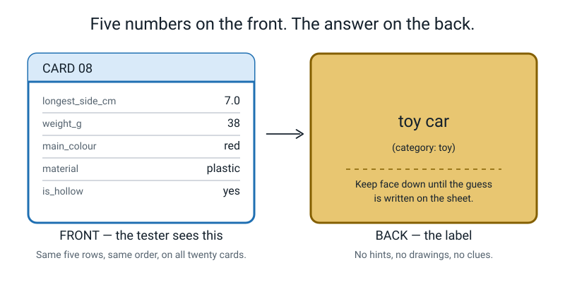
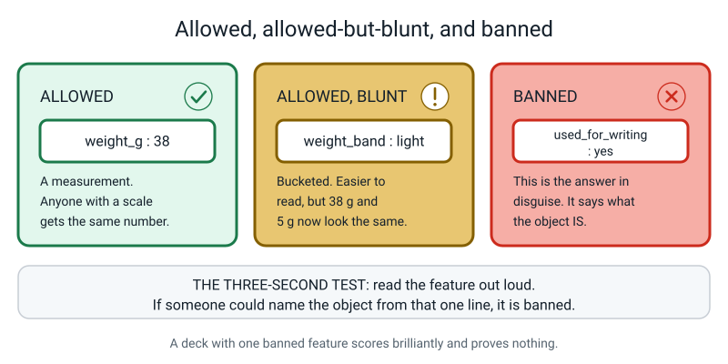
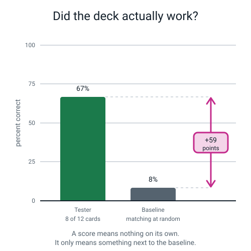
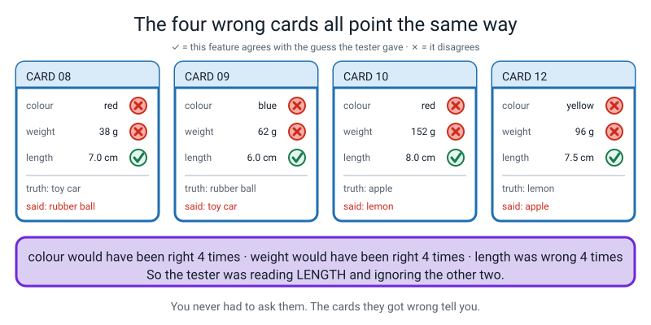
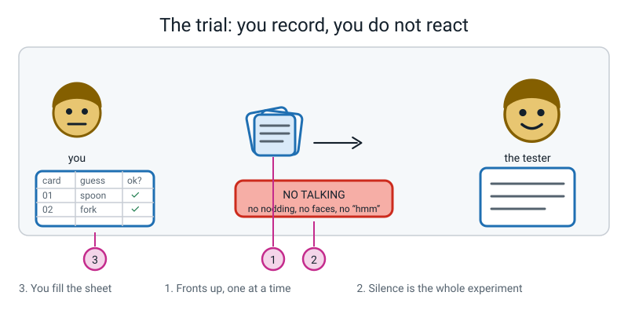

# Week 14 — Feature Card Deck: Make a Human Be the Model

[⬅ Week 13](week-13.md) · [Course Home](../README.md) · [Week 15 ➡](week-15.md) · [Student Guide](../student-guide/week-14.md) · [Workbook](../workbook/week-14.md)

---

## 📋 At a Glance

| | |
|---|---|
| **Duration** | 70 minutes |
| **Type** | 🟩 Lab |
| **Big idea** | If your features are good enough, a stranger who has never seen the thing can guess its label from the numbers alone. |
| **New vocabulary** | bucketing |
| **Materials** | 20 index cards (or paper cut to card size) · a ruler · a kitchen scale · a pen · the student's box of 20 objects · a scoring sheet · **a second person to be the tester** |
| **Tech needed** | None. A phone scale app is fine if you have no kitchen scale. |
| **Prep time** | 15 minutes the night before, plus one text message to arrange a tester |
| **⚠️ The one thing that ruins this lesson** | You knowing what is in the box. Read the Prep Checklist before you do anything else. |

---

## 🎯 Lesson Objectives

By the end of the lesson the student can, observably:

1. **Build feature cards** with exactly five features on the front, in the same order every time, and the label hidden on the back — and reject a proposed feature that would leak the answer.
2. **Run a fair test on a human tester** without leaking the answer through hints, faces or noises, recording every guess on a scoring sheet as it happens.
3. **Compute the tester's accuracy and compare it against the deck's baseline**, and say in one sentence why the score means nothing without the baseline.
4. **Work out which feature the tester actually relied on, using evidence** — specific card numbers where features disagree — rather than by asking them.

---

## 🧑‍🏫 What YOU Need to Know First

*Twelve minutes. Everything you need, from scratch.*

### Why we are making a person be the model

All year the student has been told that a machine never meets the object — it meets a **row of numbers somebody chose**. That is easy to say and hard to feel.

This week they feel it. They take twenty real objects, boil each one down to five measurements, write those five measurements on a card, and hand the deck to a person who has **never seen the objects**. That person is now in exactly the position a machine is in: they have the row and nothing else. No smell, no weight in the hand, no memory of which drawer it came from. Five values.

If the tester can name the objects, the student has proved something genuinely important: **a well-chosen set of five features carries enough information to identify a thing.** If the tester can't, they have proved something just as valuable and rather more interesting — which is that their features were the wrong five.

Either result is a success. Say that out loud at the start, because a student who is hoping for a high score will unconsciously cheat, and a student who knows both outcomes are wins will run an honest test.

### What goes on a card

Front: the card number and five feature values, **in the same order on every card**. Back: the object's name.


*Figure 14.1 — Front and back. Nothing on the front hints at the answer.*

The "same order every time" rule is not tidiness. If `weight_g` is the second line on card 3 and the fourth line on card 11, the tester has to re-read the labels every time, gets slower, gets sloppier, and your test measures their patience instead of your features. Every real dataset in the world has fixed columns for the same reason.

### The rule you have to enforce ruthlessly: no leaky features

The student met this in Week 12. Here it becomes an enforcement job, because in the heat of building twenty cards, a leak will be proposed and it will sound completely reasonable.

> **A leaky feature is one that hands over the answer.** For this deck, that means anything that names the object, names what it is used for, or names what category it is in.

Banned, and all four of these get proposed every single time:

| Proposed feature | Why it is banned |
|---|---|
| `is_used_for_writing` | Says "pen or pencil" in five words |
| `found_in_the_kitchen` | Hands over the category for free |
| `is_it_food` | Same |
| `shape: spoon-shaped` | Says the answer in the value |

Allowed, because you could measure them without knowing what the object is:

`longest_side_cm` · `weight_g` · `main_colour` · `material` · `is_hollow` · `is_shiny` · `number_of_straight_edges`


*Figure 14.2 — The three-second test. Read the feature out loud; if someone could name the object from that one line, it is banned.*

The three-second test, which you should teach as a phrase: **"Could a stranger name the object from this one line alone? Then it's banned."**

### The word of the week: bucketing

> **Bucketing** — turning a number into a category by grouping ranges and giving each range a name. 38 grams becomes `medium`. 7.0 cm becomes `short`.

The student met the idea last week when they cut a number label into three named ranges. This week it shows up as a **design decision on the card front**, and that is a much more concrete place to meet it.

For every number feature, the student has to choose: write `weight_g: 38`, or write `weight_band: medium`?

| Writing the raw number | Writing the bucket |
|---|---|
| The tester can make fine distinctions — 38 g and 44 g are visibly different | The tester reads it faster and doesn't have to hold six numbers in their head |
| More work to measure precisely | Hides real differences: 38 g and 62 g might both be `medium` |
| Tester may ignore it because numbers are effort | Tester will definitely use it because it's an easy word |

There is no right answer. The point is that it's a **choice with a cost**, exactly like last week. Have the student make the choice deliberately and write down why, rather than defaulting.

### Baselines: why a score means nothing on its own

Suppose the tester gets 13 out of 20. Is that good?

You cannot possibly know until you answer: **what would they have got with no information at all?**

There are two baselines worth computing, and they answer different questions:

**Name baseline — matching at random.** The tester has a shuffled list of 20 object names and must assign one to each card. If they closed their eyes and matched at random, how many would they get right?

The answer is **about 1**. Not 1 in 20 as a percentage of something — literally about one card. Here is why, and it is a nice fact: each card has a 1-in-20 chance of getting the right name, and there are 20 cards, so on average 20 × (1/20) = 1 card comes out right. Curiously this stays at about 1 whether the deck has 12 cards or 200. So:

```
name baseline  =  1 out of 20  =  5%
```

**Category baseline — always guess the biggest group.** If the student's 20 objects fall into 4 categories of 5 each, someone who only had to name the *category* and always said the same one would get 5 out of 20 = 25%.

Use the **name baseline (5%)** as the headline, because that is the game the tester actually played. Mention the category baseline as a second yardstick if the tester got the category right but the specific object wrong — which is by far the most common failure pattern.


*Figure 14.3 — The gap is the result. The bar on its own is not.*

### The elimination hunt: finding out what they used without asking

At the end, everybody wants to ask the tester "which feature did you use?" Let them ask — and then **do not believe the answer.**

People are unreliable narrators of their own reasoning. This is not a slur; it is one of the most robust findings in psychology. The tester will say "weight, mostly", genuinely believing it, while their guesses line up perfectly with length.

So instead: **look at the cards they got wrong.**

The logic is elimination, and it is simple enough for an 11-year-old to run:

> For each feature, check the wrong cards. Would that feature have led to the right answer? If **yes**, the tester wasn't using it — because if they had been, they'd have got it right.
>
> The feature that would have led them to the **same wrong answer they gave** is the one they were using.


*Figure 14.4 — Four wrong cards, all pointing the same way.*

That figure is the worked example you'll run in class. The tester swapped two pairs of objects. On all four cards, colour and weight would have given the right answer, and length gave exactly the wrong answer they produced. Conclusion: they were reading length and ignoring the rest. They never had to say a word.

### Misconception 1 — "a high score means my features are good"

Not by itself. A high score means *either* the features are good *or* the objects are too easy to tell apart. Twenty objects made up of five shoes, five apples, five books and five spoons will score brilliantly and prove nothing — the categories don't overlap at all. The deck rules exist to prevent this: at least two categories must be **genuinely confusable**, which is why "three spoons of different sizes" is a better exercise than "a spoon, a sofa and a cat".

If the score comes out at 19/20, do not celebrate — investigate. Ask: "which two of your objects were hardest to tell apart, and did the tester get them both right?" If there wasn't a hard pair, the deck was too easy.

### Misconception 2 — "the tester failed, so the test failed"

A tester scoring 6/20 has not wasted your afternoon. Six out of twenty is still six times the baseline of one, so the features carried real information — just not enough to pin down the exact object. That is a genuine, publishable-shaped result: *"my five features identify the category reliably and the individual object unreliably."*

The lesson is about **measuring honestly**, not about winning. Say so before the test, not after, or it sounds like consolation.

### How deep to go

| Go this deep | Do not go here |
|---|---|
| Five features, fixed order, no leaks | Feature engineering, normalisation, one-hot encoding |
| Two baselines and why you need one | Confusion matrices, precision and recall (Week 20) |
| Bucketing as a design choice with a cost | Optimal bin widths, quantiles |
| Elimination from the wrong cards | Feature importance scores, ablation studies (the grown-up name for what you're doing) |

If the student asks whether computers do this elimination thing too: yes, and it is called an ablation study, and it works exactly the same way — you remove a feature and see how much worse things get. Saying the name is fine. Going further is not.

---

## 🧰 Prep Checklist

### ⚠️ One week before — the message that saves the lesson

Send this, or say it, at the end of Week 13:

> "Before next week, put twenty objects in a box. Four to six different kinds of thing, at least three of each. Make at least two of the kinds easy to mix up. **Don't show me. Don't tell me what's in it.** Put the lid on."

**You must not know what is in the box.** If you know, you cannot be the tester, and finding another adult on the day is the single most common reason this lab collapses.

### 15 minutes the night before

- [ ] **Arrange a tester.** One text message. A parent, a neighbour, an older sibling, a colleague, the person in the next room. They need **eight minutes** and they must not have seen the objects. Have a name and a time.
- [ ] **Check you have 20 index cards.** Or cut A4 paper into eight rectangles each; three sheets does it. Cards must be opaque — hold one up to the light. If the back shows through, double it up.
- [ ] **Find a scale.** Kitchen scale, luggage scale, or a phone app. If you genuinely have none, see the fallback below.
- [ ] **Read the worked example numbers once.** There is one 12-card demo deck below with a full result table. Skim it so you can run it at pace.
- [ ] **Print or copy the scoring sheet** (20 rows: card, guess, truth, ✓/✗) or draw it on paper.

### 3 minutes before class

- [ ] Ruler, scale, pen, blank cards on the table.
- [ ] The box, unopened, in front of the student.
- [ ] Scoring sheet ready.
- [ ] A quiet corner where the tester can sit without seeing the objects. **Move the box out of sight before the tester arrives.**

### If something fails

| Problem | Fallback |
|---|---|
| **No tester available** | You be the tester — but only if you genuinely did not see the box. If you did see it, run the class as a **build-only** session: make the cards, do the elimination hunt on the worked example deck instead, and the real trial becomes homework. This is a completely acceptable version of the lesson |
| **No scale at all** | Replace `weight_g` with a 3-value bucket the student can judge by hand: `feather / normal / heavy`, defined as "lighter than a pencil / between a pencil and a full mug / heavier than a full mug". Write the definition down before measuring anything. This is bucketing, and it is this week's vocabulary word doing real work |
| **The student's box has 6 objects, not 20** | Fine. Build 6 cards, run the trial, do all the arithmetic on 6. The homework extends it to 20. Six cards with a proper baseline beats twenty rushed ones |
| **Objects are all wildly different** (a shoe, a banana, a torch) | Say so plainly: "this deck is too easy and it'll score high for the wrong reason." Send them to fetch three similar things — three pens, three spoons, three socks — and swap them in |
| **Tester finishes in 90 seconds and gets 20/20** | Investigate immediately. Almost always a leak got onto the cards, or the tester glanced at the objects. Check the feature list against the banned list. This is a great teaching moment, not a disaster |

---

## ⏱️ The Lesson, Minute by Minute

| Minutes | Segment | What happens |
|---|---|---|
| 0–8 | 🪝 **Hook** — Five Numbers | You read five numbers aloud; the student names the object |
| 8–26 | 🧠 **Concept** | The card rules, the leak ban, bucketing, the two baselines, the silence rule |
| 26–40 | 🔍 **Worked Example Together** | The 12-card demo deck: score it, baseline it, run the elimination hunt |
| 40–60 | 🎲 **Activity** | The Deck Trial: build ten cards, run the test, score it |
| 60–70 | 🔑 **Wrap & Assign** | Elimination on their own deck, takeaways, homework |

---

### 🪝 Hook — Five Numbers (0–8 min)

**Do this:** Before the student sits down, secretly pick an object in the room and write its five values on a scrap of paper. Do not name it.

**Say this:**

> "I'm thinking of something in this room. I'm not going to describe it. I'm not going to point at it. I'm going to read you five numbers, and that is genuinely everything you get.
>
> longest side: **14 centimetres**.
> weight: **6 grams**.
> main colour: **blue**.
> material: **plastic**.
> hollow: **yes**.
>
> That's it. That's the whole thing. What is it?"

Let them guess. Let them be wrong. Give them three goes. Then reveal.

**Say this:**

> "You got there — or you nearly did — from five numbers. You never saw it. You never held it. You couldn't smell it or shake it or check whether it had a lid.
>
> That's exactly the position a machine is in, every single time, for ever. It has never met the object. It has a row of numbers somebody chose, and the numbers are all it will ever have.
>
> Today you're going to be the person who chooses. And then — this is the good bit — you're going to hand your numbers to a real human being who has never seen your objects, and find out whether you chose well."

**Ask this:**

| Question | Answer you want | If they say something else |
|---|---|---|
| "Which of the five numbers helped you most?" | Usually `hollow: yes` or `material: plastic` — the ones that rule things out fastest | If they say "all of them", push: "if I'd removed one, which would you have missed least?" |
| "What did you want to know that I didn't tell you?" | Something like "does it have a lid", "is it pointy", "does it make a noise" | Any answer is good. Write it on the board — you'll come back to it when they choose their own five features |
| "If I gave you fifty numbers instead of five, would it be easier?" | Probably yes, but you'd get tired reading them, and most would be useless | If they say "no", ask why not — sometimes they've spotted that extra numbers add noise, which is a Week 12 idea and worth praising loudly |

---

### 🧠 Concept (8–26 min)

**Do this:** Draw a blank card front on the board: a rectangle, `CARD __` at the top, five empty lines beneath.

**Say this — the card:**

> "Every card in your deck looks the same. Number at the top. Five features underneath. **The same five features, in the same order, on every single card.** Card 3 and card 17 have `weight_g` on the same line. That's not me being fussy — if the tester has to hunt for the line each time, they get slow and sloppy and your test stops measuring your features and starts measuring their patience.
>
> On the back: one word. The name of the object. Nothing else. No drawing, no hint, no smiley face.
>
> Now — before we write a single card, we choose the five features. And this is where it goes wrong for almost everyone, so we're going to do it slowly."

**Do this:** Write two headings on the board: `ALLOWED` and `BANNED`. Ask the student to propose features and sort them live. Do not sort them yourself — make them argue each one.

**Say this — the leak ban:**

> "Here's the test. Read the feature out loud, on its own. **Could a stranger name the object from that one line?** If yes, it's banned.
>
> `is_used_for_writing: yes` — could a stranger name it? They'd say pen or pencil. Banned.
> `found_in_the_kitchen: yes` — that's the category, free. Banned.
> `weight_g: 6` — could a stranger name a 6-gram object? No chance. Allowed.
>
> Why does this matter so much? Because a deck with a banned feature will score brilliantly, and the score will mean nothing at all. You'll have proved that if you tell someone the answer, they can tell you the answer."

**Ask this:**

| Question | Answer you want | If they say something else |
|---|---|---|
| "`is_it_shiny` — allowed or banned?" | Allowed. Loads of things are shiny; it names nothing. | If they say banned: "name me three shiny things. See? It narrows it down, it doesn't hand it over." |
| "`can_you_eat_it` — allowed or banned?" | Banned, or at least dangerous. It hands over an entire category in one word. | If they argue it's a real physical property — a good argument — accept it but rule it out anyway: "you're right that you could measure it. But if half your objects are food, this one line does the whole job. Save it." |
| "`number_of_holes` — allowed or banned?" | Allowed. It's a genuine count and it names nothing. | Praise this one hard if they propose it. It's an unusual, good feature. |

**Say this — bucketing, the word of the week:**

> "Now a choice you have to make on purpose. Take weight. On the card, do you write **`weight_g: 38`**, or do you write **`weight: medium`**?
>
> Turning a number into a named range like that has a name: **bucketing**. You take the number line, cut it into chunks, and give each chunk a word.
>
> Here's the trade, and it's the same trade as last week. The word is easier to read, so the tester will actually use it. The number is more precise, so it can tell 38 grams from 62 grams — and the word can't, if they're both `medium`.
>
> You have to pick. And I want you to write down *why* you picked, because in ten minutes you're going to find out whether you were right."

**Do this:** Write the definition on the board and leave it up.

```
bucketing = turning a number into a named range
            38 g  ->  medium        (easier to read, less precise)
```

**Say this — the two baselines:**

> "Last thing before we build. Suppose your tester gets thirteen out of twenty. Good?
>
> You have no idea. Nobody does. Not until you answer: **what would they have got knowing nothing at all?**
>
> Imagine they close their eyes and just deal the twenty name-slips onto the twenty cards at random. How many come out right? About **one**. Each card has a one-in-twenty chance, and there are twenty cards, so one card lands right on average.
>
> So the baseline is 1 out of 20 — five percent. And thirteen out of twenty is sixty-five percent. The gap is sixty points. *That* is your result. Not the thirteen. The gap."

**Say this — the silence rule:**

> "One more rule and it's the strictest one. **During the test you do not speak.** Not a word. Not a nod. Not a hmm, not a sharp breath, not looking pleased. You sit there, you write down what they say, and your face does nothing.
>
> If you react, you're feeding them the answer, and your whole experiment is worthless. The machine you're pretending to be doesn't get encouragement. Neither do they."

---

### 🔍 Worked Example Together (26–40 min)

**Do this:** Show the student this 12-card demo deck. Say clearly: "someone else built this. We're going to mark their experiment."

**The deck.** Twelve objects, four categories of three. Feature sheet, written before any measuring:

```
FEATURE SHEET - the demo deck
f1  longest_side_cm  ruler, longest straight dimension, nearest 0.5 cm
f2  weight_g         kitchen scale, nearest gram
f3  main_colour      ONE of {red, blue, yellow, white, silver, clear}
f4  material         ONE of {metal, plastic, wood, rubber, glass, food}
f5  is_hollow        yes / no  (could it hold water?)
```

| card | longest_side_cm | weight_g | main_colour | material | is_hollow | **label (back)** | category |
|---|---|---|---|---|---|---|---|
| 01 | 15.0 | 24 | silver | metal | yes | teaspoon | kitchen |
| 02 | 18.5 | 41 | silver | metal | no | fork | kitchen |
| 03 | 28.0 | 96 | silver | metal | yes | ladle | kitchen |
| 04 | 14.0 | 6 | blue | plastic | yes | pen | stationery |
| 05 | 17.5 | 5 | yellow | wood | no | pencil | stationery |
| 06 | 4.5 | 9 | white | rubber | no | eraser | stationery |
| 07 | 1.5 | 5 | clear | glass | no | marble | toy |
| 08 | 7.0 | 38 | red | plastic | yes | toy car | toy |
| 09 | 6.0 | 62 | blue | plastic | yes | rubber ball | toy |
| 10 | 8.0 | 152 | red | food | no | apple | fruit |
| 11 | 19.0 | 118 | yellow | food | no | banana | fruit |
| 12 | 7.5 | 96 | yellow | food | no | lemon | fruit |

**Say this:**

> "Twelve cards. Four categories: kitchen, stationery, toy, fruit. Three of each. Look down the feature list — is anything banned?"

**Ask this:**

| Question | Answer you want | If they say something else |
|---|---|---|
| "Any leaks in that feature sheet?" | No. All five are things you could measure without knowing what the object is. | If they flag `material: food` as a leak — excellent objection, and worth two minutes. It does hand over the fruit category for free. The honest answer: "you're right that it's doing a lot of work. It's not a leak because you can tell food from metal by looking. But it's the *weakest* feature on the sheet." |
| "Which category will be hardest?" | Toy, probably — a car and a ball are similar sizes and both plastic and hollow. Or fruit. | Any reasoned answer. Write their prediction on the board — you're about to check it |

**Do this:** Show the tester's actual results.

| card | truth | tester said | ✓/✗ |
|---|---|---|---|
| 01 | teaspoon | teaspoon | ✓ |
| 02 | fork | fork | ✓ |
| 03 | ladle | ladle | ✓ |
| 04 | pen | pen | ✓ |
| 05 | pencil | pencil | ✓ |
| 06 | eraser | eraser | ✓ |
| 07 | marble | marble | ✓ |
| 08 | toy car | **rubber ball** | ✗ |
| 09 | rubber ball | **toy car** | ✗ |
| 10 | apple | **lemon** | ✗ |
| 11 | banana | banana | ✓ |
| 12 | lemon | **apple** | ✗ |

**Say this:**

> "Count the ticks. Eight. So: eight out of twelve. Now — is that good?"

Let them answer. Whatever they say, ask "compared to what?"

> "Right. Baseline. Twelve cards, twelve names, matched at random. Each card has a one-in-twelve chance, twelve cards, so about **one** comes out right. One out of twelve.
>
> Do the percentages: 8 ÷ 12 = 0.667, so 67%. And 1 ÷ 12 = 0.083, so 8%.
>
> **67 minus 8 is 58.** The tester beat blind guessing by fifty-eight percentage points. That's the result. Write it as a sentence: *'the deck beat the baseline by 58 points.'*"

**Do this:** Show the bar chart.


*Figure 14.5 — 67% against a baseline of 8%. The arrow is the finding.*

**Say this — now the good part:**

> "Now the detective work. **Which feature was the tester actually using?**
>
> The lazy way is to ask them. And you should ask them — but you shouldn't believe them, because people are genuinely terrible at knowing why they did things. They'll say 'weight, mostly' and be completely sincere and completely wrong.
>
> The honest way is to look at the four cards they got wrong. Look at them."

**Do this:** Put the four error cards side by side.

| card | length | weight | colour | truth | said |
|---|---|---|---|---|---|
| 08 | 7.0 | 38 | red | toy car | rubber ball |
| 09 | 6.0 | 62 | blue | rubber ball | toy car |
| 10 | 8.0 | 152 | red | apple | lemon |
| 12 | 7.5 | 96 | yellow | lemon | apple |

**Ask this:**

| Question | Answer you want | If they say something else |
|---|---|---|
| "Did they get any *category* wrong?" | No. All four mistakes are inside a category — toy for toy, fruit for fruit. They never said "pencil" for a fruit. | If they don't spot it, point at the category column: "toy, toy, fruit, fruit. What do you notice?" |
| "So what did they definitely get right?" | The category, 12 out of 12. Something on the card gives the category away — probably `material`. | Confirm: metal → kitchen, food → fruit, and so on |
| "If they'd used **colour** on card 10, what would they have said?" | Red. And card 10 *is* the apple. So colour would have been right. | If they're unsure, hand them the card and let them work it |
| "So were they using colour?" | **No.** If they'd been using colour they'd have got it right. They got it wrong, so they weren't using it. | This is the whole elimination logic. Slow down here |
| "Same for weight — 152 g versus 96 g. Would that have separated the apple and the lemon?" | Easily. 56 grams apart. So they weren't using weight either. | |
| "What's left?" | Length. Apple 8.0, lemon 7.5 — half a centimetre apart. Car 7.0, ball 6.0 — one centimetre apart. **The four cards they got wrong are the four cards where lengths are nearly identical.** | If they get here on their own, stop and tell them that's a genuinely good piece of reasoning |

**Do this:** Show the elimination diagram to confirm what they just worked out.


*Figure 14.6 — Colour would have been right four times. Weight would have been right four times. Length was wrong four times. That is the proof.*

**Say this — the punchline:**

> "So here's the finding, and it's slightly annoying. **The weight was written on every single card. It would have got both of these pairs right. The tester ignored it.**
>
> Why? Because a number with a unit is work, and a word like 'red' or a length you can picture is not. People reach for the easy feature. So do machines, actually — you'll see exactly this again next week, for exactly the same reason.
>
> You didn't have to ask them anything. Four cards told you."

---

### 🎲 Activity — The Deck Trial (40–60 min)

Full instructions in the next section. In the lesson flow, with a timer you actually run:

- **40–43 · Feature sheet.** Five features, measuring instruction written for each. Nothing gets measured until the sheet is finished.
- **43–55 · Build ten cards.** Twelve minutes, ten cards, seventy seconds each. Move.
- **55–60 · The trial.** Bring in the tester. Ten cards, ten guesses, total silence from the student.

The remaining ten cards and a second tester are homework.

---

### 🔑 Wrap & Assign (60–70 min)

**Do this:** Score the trial together, on paper, immediately. Do not save it for later — the tester's reasoning is fresh and the student is invested.

```
correct  = ____ out of 10          =  ____%
baseline = 1 out of 10             =  10%
gap      = ____ minus 10           =  ____ percentage points
```

Then run the elimination hunt on their own wrong cards, exactly as you did on the demo deck. Give it five full minutes — this is the objective that separates a good lesson from a craft activity.

**Say this:**

> "Three things.
>
> One: **five numbers can identify a real object.** A person who had never seen your things named some of them from a card. That's not a trick. That's what a machine does all day.
>
> Two: **a score means nothing without a baseline.** Seven out of ten sounds decent until you know that random guessing gets one. Then it's not decent, it's excellent.
>
> Three, and this is the one to remember: **you found out what your tester was using without asking them.** You looked at the cards they got wrong and you eliminated. That habit — check the evidence, don't trust the story — is worth more than everything else in this lesson put together."

---

## 🎲 The Activity, In Full

### The Deck Trial

**Time:** 20 minutes in class, plus homework. **Materials:** 20 index cards, ruler, scale, pen, the box of objects, scoring sheet, one human tester.

### Setup (3 minutes) — the feature sheet comes first

**Nothing gets measured until the sheet is written.** This rule exists because a student who starts measuring first will change what `length` means halfway through the deck and the column becomes nonsense.

The sheet must have five features and, for each, the **exact measuring instruction**:

```
FEATURE SHEET  -  name: ______________   date: __________

f1  ________________  how:  _______________________________
f2  ________________  how:  _______________________________
f3  ________________  how:  _______________________________
f4  ________________  how:  _______________________________
f5  ________________  how:  _______________________________

BANNED CHECK: read each one aloud. Could a stranger name the
object from that one line?   f1 □  f2 □  f3 □  f4 □  f5 □
```

A working default, if they're stuck — hand it over rather than lose four minutes:

```
f1  longest_side_cm  ruler, longest straight dimension, nearest 0.5 cm
f2  weight_g         scale, nearest gram
f3  main_colour      ONE of {red, blue, green, yellow, black, white, brown, clear}
f4  material         ONE of {metal, plastic, wood, fabric, glass, paper, food}
f5  is_hollow        yes / no  (could it hold water?)
```

### Phase 1 — Build ten cards (12 minutes)

**Rules:**
1. One object at a time. Measure all five features, write them on the front in sheet order, write the name on the back. Next object.
2. **Number every card.** You will need the numbers for the elimination hunt and they are impossible to add later.
3. Same order every card. No exceptions, not even to save space.
4. Nothing on the front that isn't one of the five features.

**Your job during this phase** is to be a stopwatch and a leak inspector. Say the minute count out loud every three minutes. Read each card front as it's finished and ask, once: "could a stranger name it from one line?"

**Pace target:** 70 seconds per card. If they're at four cards after eight minutes, drop the target to eight cards and say so — a finished eight beats a rushed ten.

### Phase 2 — The trial (5 minutes)

**Setup:** move the box of objects out of sight. Seat the tester so they cannot see it. Give the tester:

- the deck, **fronts up, backs hidden**
- the list of the ten object names, **shuffled into random order**


*Figure 14.7 — The setup. The student's only job is the scoring sheet.*

**Rules — read these aloud to the tester before starting:**
1. "Match each card to one name from the list. You can use a name more than once if you want to, or not at all."
2. "Say your guess out loud. Don't explain it — just the name."
3. "You may look at the card as long as you like, but once you've said a name we move on."

**Rules for the student — read these aloud too, in front of the tester:**
1. **No talking.** At all.
2. **No faces.** No wincing, no smiling, no eyebrows.
3. **No sounds.** No hmm, no oh, no sharp intake of breath.
4. Write the guess down the instant it's said, before turning the card over.

The scoring sheet:

| card | tester's guess | truth | ✓/✗ |
|---|---|---|---|
| 01 | | | |
| … | | | |
| 10 | | | |

If the student breaks the silence rule, stop, restart from the current card, and say why. Once is enough; they will not do it again.

### Phase 3 — Score and eliminate (in the Wrap segment)

```
correct  ____ / 10  = ____%      baseline 1/10 = 10%      gap = ____ points
```

Then, for every card they got **wrong**, fill in this row:

| card | truth | tester said | would COLOUR have got it right? | would WEIGHT? | would LENGTH? | would MATERIAL? |
|---|---|---|---|---|---|---|

The feature with the most "no"s is the one the tester was using. Write the conclusion as a sentence with card numbers in it:

> *"The tester was using ________, and cards ____, ____ and ____ prove it."*

### What "finished" looks like

- A written feature sheet with five measuring instructions and the banned-check ticked.
- Ten numbered cards, five values each, name on the back, no blanks.
- A completed ten-row scoring sheet.
- Three numbers: score, baseline, gap.
- One sentence naming the feature the tester used, with card numbers as evidence.

### Variation — easier

**Six cards, two categories, three features.** Drop to three features (`longest_side_cm`, `main_colour`, `material`) and six objects in two clearly different groups. Everything else runs identically, and the elimination hunt is *easier* with three features, not harder — there are fewer suspects. The full deck stays as homework with no time pressure.

### Variation — harder

**The blindfold round.** After the first trial, cover the tester's best feature with a sticky note on every card, and run the whole deck again with a **second** tester.

The score drop tells you what that feature was really worth — not what you assumed, but what it cost to lose it. Two outcomes, both interesting:

- **Score barely moves** → the other four features were quietly carrying the deck. Your "star" feature was overrated.
- **Score collapses** → you have found a single point of failure. A deck — or a product — that only works while one measurement keeps working.

Have them write three sentences on which happened and what they'd do about it if this were a real product.

---

## ❓ Questions Students Ask This Week

**"Can I use six features instead of five?"**
Not this week, and the reason is worth knowing. Five is a hard limit because it forces you to *choose*, and choosing is the skill. With six you'd keep the marginal one, with ten you'd keep everything, and you'd never find out which ones were pulling their weight. The constraint is the exercise. (Real teams do this too — they deliberately cap the feature count to force the conversation.)

**"What if two objects have exactly the same five values?"**
Then your features cannot tell them apart, full stop, and no tester on earth could do better than a coin flip on that pair. This is not a failure — it is a **finding**, and it's the most useful thing your deck can tell you. Write it down: "cards 6 and 14 are identical, so my features cannot distinguish a blue pen from a blue pencil." Then, if you want, work out the sixth feature that would have separated them, and name its measuring instruction.

**"Is it cheating if the tester is my mum and she knows my stuff?"**
Yes, a bit, and you should say so in your write-up rather than hide it. Someone who has seen your blue water bottle a hundred times isn't guessing from the card; they're recognising your bottle. The score will be too high and it won't mean anything. If she's your only option, use her — and then find a second tester who's never been in your house, and report both numbers. Two honest numbers beat one flattering one.

**"Why can't I just ask the tester which feature they used?"**
You can, and you should. But then check it, because people are genuinely bad at knowing why they did things — this is one of the most solid findings in all of psychology, not a criticism of your mum. In the demo deck the tester said "weight, mostly" and the evidence showed length. Both of those can be true: she *believed* it was weight. Her belief was just wrong.

**"What's the best possible score?"**
Ten out of ten — but be suspicious of it. A perfect score means either your features are outstanding **or** your objects were too easy to confuse in the first place. Check: were at least two of your objects genuinely hard to tell apart? If not, run it again with three of the same kind of thing and watch the score fall. That fall is the real measurement.

**"Does a real computer do the elimination thing?"**
Yes, and it has a proper name: an **ablation study**. You remove one feature, retrain the model, and see how much worse it gets. Big companies run these constantly, on models with thousands of features, and the results are often surprising — the feature everyone assumed was carrying the model turns out not to be. You are doing the same experiment with index cards and one human. It is the same experiment.

**"How many objects do you need before the score means anything?"**
Nobody can give you a clean number, and this is one of those questions where the honest answer is *it depends and there's no formula*. What's certain is that with three cards the score means almost nothing — get all three right and that could easily be luck. With twenty, luck can't explain a score of fifteen. Somewhere between those it starts to count, and where exactly depends on how many categories you have and how different they are. Statisticians have tools for this and they still argue about the answers.

**"What if my tester takes ages on one card?"**
Let them. Time isn't being measured. But do write down which card it was — a card that takes thirty seconds is telling you something about your features that a wrong answer wouldn't. Slow cards and wrong cards are both evidence.

---

## ⚠️ Where This Lesson Goes Wrong

| What happens | Why | What to do right now |
|---|---|---|
| **You already know what's in the box** | The message never went home, or the student showed you proudly | Do not test yourself and pretend. Either recruit anyone else in the building for eight minutes, or convert to a build-only lesson: make the cards, run the elimination hunt on the demo deck, and make the real trial homework. Say out loud why you're doing it — "I've seen your objects, so my score wouldn't mean anything." That sentence teaches more than the trial would |
| A leaky feature gets onto the cards and nobody notices until the score is 10/10 | Leaks sound reasonable in the moment. `is_it_food` feels like a measurement | Don't bin the result — mark it. Ask: "which single line on the card gave it away?" Then cover that line with a sticky note and rerun with a second tester. The before-and-after is a better lesson than a clean run |
| Ten cards take twenty minutes and the trial never happens | Measuring is slower than anyone expects, especially weighing | Announce a cut at minute 51 regardless of card count. Six cards and a completed trial beats ten cards and no trial. The card-making is homework; the trial cannot be |
| The student can't stay silent | Watching someone struggle with your puzzle is genuinely hard | Give their hands and eyes a job: they must write the guess **before** the tester finishes the word, and they must look at the paper, not the tester. Physical instructions beat "try not to react" |
| The tester explains their reasoning out loud as they go | Adults narrate. It feels helpful | Fine — let them, and write it down as a *claim to test*, not as the answer. Then run the elimination and compare. The gap between what they said and what the cards show is the best moment in the lesson |
| Student concludes "my deck failed" at 4 out of 10 | They expected a high score and nobody said what a good one was | Do the baseline arithmetic immediately, in front of them: 4/10 is 40%, random is 10%, the gap is 30 points. Their features carry real information. Then ask the useful question: "which pairs got confused, and what one feature would separate them?" |
| Every object is wildly different and the score is near-perfect | The box was assembled for variety instead of for difficulty | Say plainly that the deck is too easy and the score can't be trusted. Send them for three near-identical things — three pens, three socks — and swap them into the homework deck |
| Cards aren't numbered, so the elimination hunt is impossible | Numbering feels like admin while you're building | Number them now, in whatever order they're sitting in. It doesn't matter what the numbers are, only that they exist and match the scoring sheet |
| Student writes different measurements for the same feature on different cards | `longest_side` meant the diagonal on card 3 and the height on card 9 | Stop and re-measure the affected cards against the written instruction. If the instruction itself is vague, fix the wording — the wording, not the student, is the bug |

---

## 🧭 Differentiation

### If they are struggling

**Cut:** the twenty-card target and the second tester. Six cards, three features, one tester. That is a complete and honest experiment.

**Reteach with this:** run the hook again in reverse. *They* pick an object and read you five numbers, and *you* guess. Being on the other side for two minutes makes the whole thing click — especially the part where you ask for a feature they didn't give you.

**Hold the line on this:** the baseline comparison. Even with three cards, they must be able to say "the tester got 2, random guessing gets about 1, so the gap is 1." A score without a baseline is the one habit this lesson exists to prevent.

**A crutch that helps:** pre-write the five feature *names* on all the blank cards before class, so the student only fills in values. It halves the writing and it enforces the fixed-order rule for free.

### If they are flying

1. **The blindfold round** (harder variation above). Cover the star feature, run a second tester, measure the drop.
2. **Predict the tester before they arrive.** Write down, sealed, which two cards the tester will get wrong and why. Then run the trial. Being right is impressive; being wrong and explaining why is better.
3. **Compute a category baseline as well.** If their 20 objects are 4 categories of 5, the category baseline is 5/20 = 25%. Then ask the sharp question: "your tester got 12 objects right but 20 categories right. Which number describes your deck better, and who would care about each one?"
4. **Design the sixth feature.** Find the two objects most often confused, and design a feature that separates them — name, unit, and measuring instruction. Then actually measure it on all the cards and predict whether the score would rise.
5. **The identical-twins hunt.** Find any two cards with identical values on all five features and write down what that proves about the limit of the deck.

### If they won't engage today

Skip the building entirely. Run the **hook**, then hand them the printed demo deck from the Worked Example section and run only the elimination hunt on the four wrong cards. That is fifteen minutes, it needs no measuring, no scale, no tester and no cooperation from anyone else, and it delivers objective 4 — which is the hardest and most valuable of the four.

If even that stalls, the minimum viable Week 14 is one question, asked and answered:

> "I got 8 out of 12. Is that good? What do you need to know before you can tell me?"

The answer — *the baseline* — is the habit. Get it, write it down, stop.

---

## ✅ Assessing Understanding

Three checks for the last five minutes. Use the exact wording.

### Check 1 — the leak reflex

> "I want to add a sixth feature to your deck: `can_you_write_with_it`. Allowed or banned?"

**A good answer:** "Banned — that one line tells you it's a pen or a pencil. A stranger could name it."
**A weak answer:** "Banned" with no reason. Ask "how do you know?" and listen for the three-second test.
**A wrong answer:** "Allowed, because you can check it." True but irrelevant — reteach the test: *could a stranger name it from that one line?*

### Check 2 — the baseline reflex

> "My friend's tester got 14 out of 20 on her deck. Is that good?"

**A good answer:** "You can't tell yet. Random guessing gets about 1 out of 20, so 14 is 70% against a 5% baseline — a 65-point gap. That's very good."
**An acceptable answer:** "You need the baseline first," even without computing it. That's the habit; the arithmetic can follow.
**A wrong answer:** "Yes, that's most of them." That is the exact instinct this lesson exists to break. Reteach with the arithmetic on the board.

### Check 3 — elimination from evidence

> "My tester got cards 4, 9 and 15 wrong. On all three, the object was **yellow** and they guessed a **red** object. Were they using colour?"

**A good answer:** "No. If they'd been using colour they'd have got them right. Colour would have told them yellow. They were using something else."
**A weak answer:** "Maybe" or "I'd ask them." Push: "what do the three cards tell you, without asking?"
**A wrong answer:** "Yes, they used colour and got it wrong." Reteach with the demo deck's card 10: colour said red, the truth was the red apple, they said lemon. If they'd read the colour they could not have said lemon.

### Mastery scale for this week's objective

| Level | What it looks like |
|---|---|
| **1 — Not yet** | Builds cards with inconsistent features or a leak on the front. Reports a raw score with no baseline. Asks the tester what they used and writes down the answer as fact. |
| **2 — Emerging** | Builds a clean deck with help. Computes the score. Computes the baseline when prompted. Can say a feature is leaky when shown it, but doesn't catch one unprompted. |
| **3 — Secure** | Writes the feature sheet before measuring. Catches a proposed leak unaided. Runs the trial in silence. Reports score, baseline and gap without prompting. |
| **4 — Strong** | Runs the elimination hunt independently and names the feature with specific card numbers as evidence. Notices when the tester's stated reason disagrees with the evidence and trusts the evidence. |
| **5 — Mastery** | Predicts before the trial which cards will fail and why, and is roughly right. Identifies the deck's limit — two cards with identical values — and designs a specific sixth feature, with units and instruction, to fix it. |

Aim for 3, and expect 4 on objective 4 from a student who enjoyed the detective part.

---

## 📤 Homework to Assign

**Say this:**

> "Three things. About an hour.
>
> First: **finish the deck to a full twenty cards.** Same five features, same order, same measuring instructions — do not change the instructions halfway, and if you have to, re-measure everything. Number every card.
>
> Second: **test it on a second human.** Somebody who has not seen your objects and was not in the room today. Same rules: you say nothing, you make no faces, you write the guess down before you turn the card over. Fill in the twenty-row scoring sheet, and work out the score, the baseline and the gap.
>
> Third, and this is the one I'll be reading most carefully: **write which feature you think the testers actually used, and give me the card numbers that prove it.** Not what they told you. What the wrong cards show. 'I think they used colour, and cards 3, 11 and 17 prove it because on all three the length would have been right and the colour was wrong.' That shape of sentence.
>
> Then a last line: **what would you change about the deck to make the tester's job harder?** Name one thing — a feature to remove, an object to add, a number to bucket."

**Workbook pages:** Week 14, pages 1–5.
**Expected time:** 55–65 minutes. Card-making is about 25 of it; the trial is 10; the write-up is the rest.
**The one thing not to skip:** the card numbers in the third task. Without them it's an opinion, and the whole lesson is about the difference.

---

## 🔑 Answer Key

*Complete worked answers to every question posed in the lesson and every workbook item.*

### Hook

**"Which of the five numbers helped you most?"** For the pen (14 cm, 6 g, blue, plastic, hollow): most students say `weight_g: 6` or `is_hollow: yes`. Six grams rules out almost everything solid; hollow rules out pencils and rulers. Any answer with a reason is correct — the question is about noticing that features differ in power, not about a specific one.

**"What did you want to know that I didn't tell you?"** Common good answers: "does it have a lid", "does it have a point", "is there writing on it", "does it click". All legitimate. Note that most of these are things a *machine* would not get either.

**"If I gave you fifty numbers, would it be easier?"** Somewhat — but most would be useless, and useless columns hide the useful ones (Week 12). Also, a tester reading fifty lines per card gets tired and starts skipping. Both halves earn credit.

### Concept questions

**"`is_it_shiny` — allowed or banned?"** **Allowed.** Many things are shiny; the line names nothing. It narrows the field, which is exactly what a feature is supposed to do.

**"`can_you_eat_it` — allowed or banned?"** **Banned in practice.** It is a genuine physical property you could check, so it isn't a leak in the strict Week 12 sense. But if any of your objects are food, this one line delivers a whole category free and makes the other four features irrelevant for those cards. Rule it out.

**"`number_of_holes` — allowed or banned?"** **Allowed**, and it's a good one — a real count, it names nothing, and it separates things most features can't (a button from a coin, a colander from a bowl).

### Worked example — the demo deck

**"Any leaks in the feature sheet?"** No. All five are measurable without knowing the object. The strongest objection is `material: food`, which hands over the fruit category — a fair criticism, and worth recording as "the weakest feature on the sheet", but not a leak, because you can tell food from metal by looking without knowing *which* food.

**"Which category will be hardest?"** Toy is the best prediction: the car and the ball are both plastic, both hollow, both red-or-blue, and 1 cm apart in length. Fruit is a reasonable second: apple and lemon are 0.5 cm apart. Both predictions turn out correct.

**The score.**
```
correct  = 8 out of 12          8 ÷ 12 = 0.667 = 66.7%, call it 67%
baseline = about 1 out of 12    1 ÷ 12 = 0.083 =  8.3%, call it  8%
gap      = 67 − 8 = 59 points   (58.4 exactly)
```

**"Did they get any category wrong?"** No — 12 out of 12 on category. Every mistake is a swap *inside* a category: toy↔toy and fruit↔fruit.

**"If they'd used colour on card 10, what would they have said?"** Red — and card 10 *is* the red apple. Colour would have been correct.

**"So were they using colour?"** No. Colour would have produced the right answer on all four wrong cards; they produced the wrong answer; therefore they were not reading colour.

**"Would weight have separated the apple and the lemon?"** Yes, easily: 152 g against 96 g, a 56-gram gap. And the car against the ball: 38 g against 62 g, a 24-gram gap. Weight would have got all four right, so weight was not being used either.

**"What's left?"** Length. Here are the four cards:

| pair | lengths | gap | tester |
|---|---|---|---|
| toy car / rubber ball | 7.0 / 6.0 | 1.0 cm | swapped them |
| apple / lemon | 8.0 / 7.5 | 0.5 cm | swapped them |

And every pair the tester got **right** has a length gap of at least 3.5 cm:

| category | lengths | smallest gap | result |
|---|---|---|---|
| kitchen | 15.0, 18.5, 28.0 | 3.5 cm | all correct |
| stationery | 4.5, 14.0, 17.5 | 3.5 cm | all correct |
| toy | 1.5, 6.0, 7.0 | 1.0 cm | two swapped |
| fruit | 7.5, 8.0, 19.0 | 0.5 cm | two swapped |

**Conclusion, written as the student should write it:** *"The tester used `material` to pick the category and `longest_side_cm` to pick the object inside it. Cards 08, 09, 10 and 12 prove it: those are the only four cards where two objects in the same category are within 1 cm of each other, and they are the only four cards the tester got wrong. Weight was printed on every card and would have separated both pairs easily, and it was ignored."*

### Assessment check answers

**Check 1 — `can_you_write_with_it`.** Banned. That one line narrows the object to a pen, pencil, marker or crayon — a stranger could name it, or come very close. It hands over most of the answer.

**Check 2 — 14 out of 20.** 14 ÷ 20 = 70%. Baseline 1 ÷ 20 = 5%. Gap = **65 percentage points**. That is a strong result. The correct first move is to ask for the baseline, not to judge the 14.

**Check 3 — three yellow objects guessed as red.** They were **not** using colour. Colour would have told them yellow on all three cards, and they said red on all three. Whatever they were reading, it wasn't the colour line. (Next step: check whether length, weight or material would have produced "red" on those three cards — whichever one did is the suspect.)

### Homework — model answers and marking

**Task 1 — the finished twenty-card deck.**

Marking criteria:
- 20 numbered cards, no gaps in the numbering.
- The same five features in the same order on all 20 fronts.
- No blanks. A missing measurement must be written as blank and flagged, never invented (Week 5's rule).
- Nothing on the front except the five values.
- One name on each back, and nothing else.
- The feature sheet attached, with a measuring instruction for all five and the banned-check ticked.

**Task 2 — the second trial.**

A model completed sheet, for a deck of 20 in 4 categories of 5:

```
correct  = 13 out of 20        13 ÷ 20 = 65%
baseline =  1 out of 20         1 ÷ 20 =  5%
gap      = 65 − 5 = 60 percentage points
```

Marking criteria:
- All 20 rows filled, including the ones they got right.
- Score written as **both** a fraction and a percentage.
- Baseline stated as 1/20 = 5% (accept a category baseline as well, but not instead).
- Gap computed and stated in **percentage points**, not percent — a small distinction worth correcting gently.
- A note on who the tester was and whether they had seen the objects. Honesty about a contaminated test earns full marks; hiding it does not.

**Task 3 — which feature did they use, with evidence.**

Model answer:

> *"I think both testers used `main_colour`. Here is the evidence. They got seven cards wrong between them: cards 3, 6, 11, 12, 14, 17 and 19. On five of those seven — 3, 6, 12, 14 and 19 — the object they named has the same colour as the object on the card. On card 3 the truth was my green sock and they said 'green pencil'. On card 12 the truth was the blue mug and they said 'blue toothbrush'. Every time they got it wrong, they got the colour right and the object wrong.*
>
> *`weight_g` would have separated four of those five pairs. The sock is 22 g and the pencil is 5 g, and they still swapped them. So they were not reading the weight.*
>
> *Tester 2 told me she was 'mostly going on size'. The evidence says colour. Cards 3 and 12 are both cases where size would have been right and colour was wrong, so she can't have been going on size."*

Marking criteria:
- Names **one** feature, not a vague list.
- Gives **specific card numbers**, at least three.
- Explains for at least one card *why* those numbers prove it — i.e. that another feature would have given the right answer.
- Bonus credit: notices a disagreement between what the tester said and what the cards show, and sides with the cards.

**Task 4 — what would you change to make it harder.**

Any one of these, argued:

| Change | Why it makes it harder |
|---|---|
| Remove the strongest feature | Forces the tester onto the weaker ones and reveals whether they were carrying anything |
| Bucket a number feature (`38 g` → `medium`) | Deliberately throws away the precision that was separating two objects |
| Add three near-identical objects (three blue pens) | Creates a group the current features cannot split at all |
| Replace `main_colour` with `is_shiny` | Removes the easy feature people reach for first |
| Add a second object of the same colour, weight and material as an existing one | Manufactures a genuine tie and exposes the deck's limit |

Marking criteria: one specific change, plus a prediction of what will happen to the score. "Make it harder" with no mechanism is not an answer; "remove colour, and I predict the score drops from 13 to about 8 because five of the seven errors were already colour-driven" is a very good one.

### Extension answers (for the "flying" path)

**Category baseline with 4 categories of 5.** Always guessing the biggest category gets 5 out of 20 = **25%**. If the tester got 20/20 on category but 13/20 on object, the two numbers describe different things: 20/20 says "my features nail the category", 13/20 says "they don't reliably nail the individual". A shop sorting deliveries into four bins would care about the first number. A lost-property desk finding *your* pen would care about the second.

**Identical twins.** Two cards with identical values on all five features prove that the deck has hit its ceiling: no tester, and no machine, can ever separate those two objects using this feature set. The fix is not a better tester; it is a sixth feature. This is exactly the situation a real machine learning team calls "the features are not separable", and the only cure is more or better measurement.

---

## 🔮 Next Week Preview

Next week the object of study stops being a person and becomes a program. The student learns what **training** actually is: a one-off process that eats labelled examples and produces a model, after which the examples are gone and only the model remains. They will *be* the model first, unplugged — shown twelve labelled cards for twenty seconds each, then the cards are physically taken away and six new ones are handed over. Whatever is left in their head is the model, and the cards are in an envelope. Then, before any camera comes out, they plan a photo shoot on paper: five backgrounds, three lighting conditions, eight angles, two distances, turned into a numbered shot list of forty photographs.

**Prep early — this is a ten-minute job you cannot skip:** Week 15 needs eighteen hand-drawn cards that you must draw yourself, the night before, from an exact recipe. It is three made-up creatures, a black pen and eighteen index cards, and the drawing rules are spelled out completely in the Week 15 prep checklist. There is a deliberate trap built into how you draw them, and it only works if you follow the recipe exactly. Also: ask your student to decide **now** which three similar objects they'll photograph, so they're not choosing on the day. Three toothbrushes beats an elephant and a spoon.

---

[⬅ Week 13](week-13.md) · [Course Home](../README.md) · [Week 15 ➡](week-15.md) · [Student Guide](../student-guide/week-14.md) · [Workbook](../workbook/week-14.md) · [Orientation](00-orientation.md) · [Glossary](../../glossary.md)
