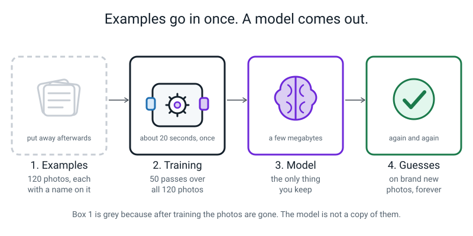
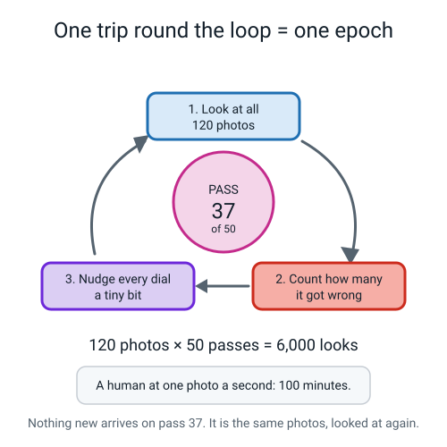
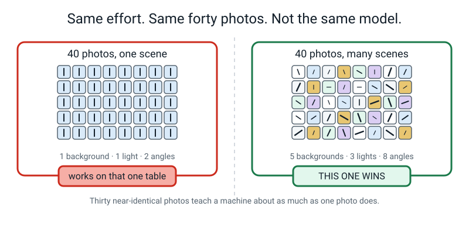
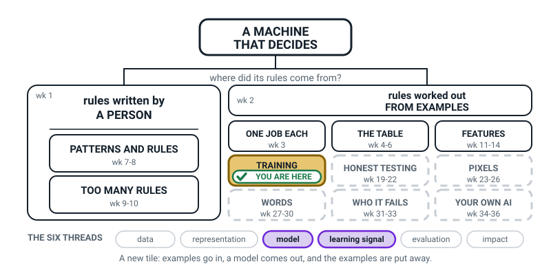
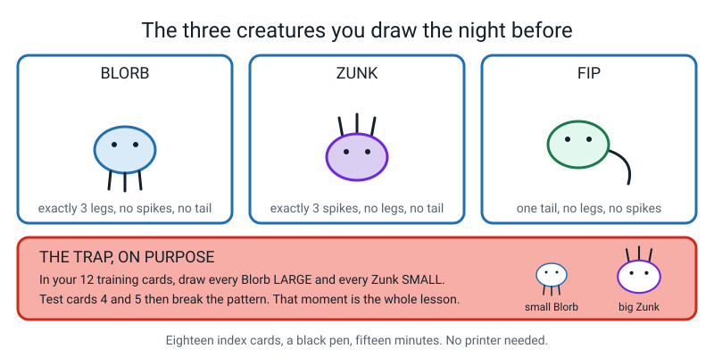
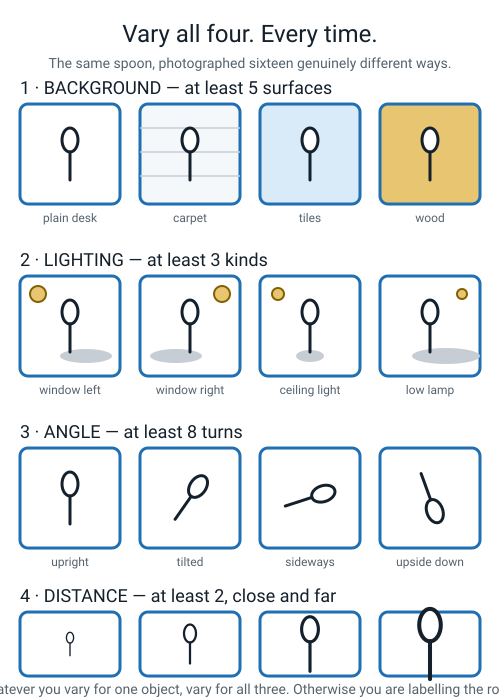
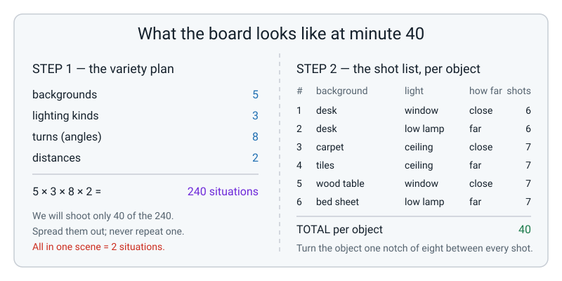

# Week 15 — Training: Turning 120 Photos Into a Guessing Machine

[⬅ Week 14](week-14.md) · [Course Home](../README.md) · [Week 16 ➡](week-16.md) · [Student Guide](../student-guide/week-15.md) · [Workbook](../workbook/week-15.md)

---

## 📋 At a Glance

| | |
|---|---|
| **Duration** | 70 minutes (works in 60 if you cut the Hook to 5 and stop the shot list at one object) |
| **Type** | 🟦 Teach |
| **Big idea** | Training is a one-time process that reads labelled examples and produces a model — after that the examples are gone and only the model remains. |
| **New vocabulary** | training · epoch · baseline model · variety |
| **Materials** | 18 index cards you draw yourself the night before (recipe below) · an envelope or a drawer · a black pen · the student's workbook open at **Build It** (Step 2 checklist, Step 3 shot list, Step 5 tally sheet) · a whiteboard or big sheet of paper · a timer or phone clock |
| **Tech needed** | **None in class.** The student needs a phone or tablet camera *for the homework*, not today. |
| **Prep time** | 15 minutes the night before, and 12 of those are drawing the cards |
| **⚠️ The one thing that ruins this lesson** | Drawing the eighteen cards freehand instead of following the recipe. The size trap is the lesson, and it only works if you follow it exactly. |

---

## 🎯 Lesson Objectives

By the end of the lesson the student can, observably:

1. **Describe training as a process** — labelled examples in, a model out — and say out loud what happens to the examples afterwards.
2. **Explain what an epoch is** and give one reason a program looks at the same photo fifty times, without saying "to learn it better".
3. **Plan a photo collection in writing before touching a camera**, using a variety checklist, and turn that plan into a numbered shot list that adds up to 40 photos per object.
4. **Explain why forty varied photos beat four hundred near-identical ones**, using the distinct-situations count as evidence rather than an opinion.

You will know they have it when they stop saying "the computer remembers the photos" and start saying "the photos are gone; the model is what's left."

---

## 🧑‍🏫 What YOU Need to Know First

*Read this section once. It takes about fourteen minutes and it is everything you need. There is nothing else to look up.*

### The one sentence

**Training is a one-off process. You feed it labelled examples, it hands you back a model, and then the examples are no longer part of the machine.**

That's it. Everything else this week is a consequence of that sentence. If you finish this section understanding only that, you can teach the lesson well.

Most adults quietly believe the opposite — that a trained AI is somehow *holding on* to its training data, looking things up, comparing the new photo against the old ones. It isn't. Getting your student off that belief in Week 15 is worth more than anything else you'll do today.

### What actually goes in and what actually comes out


*Figure 15.1 — Examples go in once. A model comes out. Box 1 is drawn grey because those photos are put away afterwards.*

Four stages, and the student needs all four:

| Stage | What it is | How long it lasts |
|---|---|---|
| **1. Labelled examples** | 120 photos, each with a name attached: `spoon`, `toothbrush`, `comb` | You make them once. They are used once. |
| **2. Training** | The process. The machine looks at the examples over and over and adjusts itself | About 20 seconds, one time |
| **3. The model** | The finished guessing machine — a file of a few megabytes | You keep this for ever |
| **4. Guesses** | Feed it a brand-new photo, get an answer out | Again and again, as often as you like |

> **Training** — the one-off process where a machine looks at labelled examples over and over, and adjusts itself until its guesses on those examples are as good as it can get them.

The word to lean on hard is **one-off**. Compare it with something the student already believes:

- A calculator does its job every time you press the button. Nothing was ever trained.
- A model does its job every time you show it a photo — but the *training* happened once, before you ever met it, and it is not happening again while you use it.

**🍕 The analogy that does the most work: the recipe and the cake.**
The examples are the ingredients. Training is the baking. The model is the cake. Once the cake is baked you cannot get the eggs back out, you cannot read the recipe off the cake, and if the cake tastes wrong the only fix is to bake a new one with better ingredients. You never fix a model by arguing with it. You fix it by changing the examples and training again.

Say the last two sentences aloud in class. They land.

### The size arithmetic that proves the photos are gone

This is the single most convincing thing you can put on the board, and it needs no expertise from you:

```text
   120 photos from a phone      ≈  40 megabytes
   the model those photos made  ≈   3 megabytes
```

The model is **smaller than the data that made it** — about a thirteenth of the size. It cannot possibly be storing your pictures. There is nowhere to put them. What it stored instead was a *pattern*: which arrangements of brightness and edge and curve tended to come with which of your three names.

If a student says "maybe it squashed them," that's a good guess and the honest answer is: it squashed them so hard that the individual pictures are unrecoverable. What survived is the thing they had in common, not the pictures.

### An epoch: why look at the same photo fifty times?


*Figure 15.2 — One trip round the loop is one epoch. Nothing new arrives on pass 37 — it is the same photos, looked at again.*

> **Epoch** — one complete pass through every single training example. Fifty epochs means the machine went through all your photos, start to finish, fifty times.

Here is the mechanism, and you can explain it correctly without any maths.

Picture an old radio with a tuning dial. You turn it a little, listen, hear more static, turn it back the other way, listen again. Nudge, check, nudge, check. Nobody calculated the right dial position; you found it by nudging.

The machine has **thousands** of tiny dials. One epoch is: look at all 120 photos, count how many it got wrong, then nudge every dial a tiny bit in whichever direction reduced the mistakes (real programs often nudge a little during the pass too, but this is the idea). Then do it again. After 50 rounds of nudging, the dials sit roughly where the mistakes are fewest.

So why look again on pass 37? **Not** because pass 37 shows it anything new. It's the same photos. It looks again because the dials have moved since pass 36, so the same photo now produces a different amount of wrongness, which tells you which way to nudge next. The photos are the measuring stick, and you need the measuring stick every time you adjust something.

The arithmetic students enjoy:

```text
   120 photos × 50 epochs = 6,000 photo-looks

   a human at one photo per second, no breaks
      = 6,000 seconds
      = 100 minutes

   the browser does it in about 20 seconds
```

Not magic. Very fast arithmetic, repeated a lot.

### Variety: why 40 good photos beat 400 lazy ones


*Figure 15.3 — Same effort, same forty photos, not the same model.*

> **Variety** — how much your examples differ from each other **in the ways that shouldn't matter**, so the machine is forced to learn the thing that does.

A photo of a spoon is never just a spoon. It also contains a background, a light source, an angle, a distance, maybe a hand, maybe a shadow. Training does not know which of those things you *meant*. It finds whichever pattern separates your three piles most easily.

So if all forty spoon photos sit on a wooden table with a window on the left, then "warm brown texture, light from the left" is a far easier pattern to spot than "spoon". Training takes the easy one. Every time.

**The true story to tell in class.** In a 2016 research paper (Ribeiro, Singh and Guestrin, the "Why Should I Trust You?" paper), researchers built a husky-versus-wolf classifier on a deliberately biased, hand-picked set of photos, to show how a model can be right for the wrong reason. They showed it to a small group (as I recall, mostly graduate students; I have not re-checked the details) and asked whether they trusted it; some did.

Then an explanation tool revealed the trick: the wolf photos had **snow** in the background and the husky photos did not. The tool suggested the model had leaned on the background: a rule like *white stuff at the bottom of the picture → say wolf*.

Photograph a husky in snow and it is likely to say wolf, and sound confident. Do not quote exact numbers of people or percentages in class.

Nobody wrote that rule. Nobody wanted it. It came out of the photographs.

**The counting trick that turns this from opinion into evidence.** Count *distinct situations*, not shutter clicks:

| | Set A — "quantity" | Set B — "quality" |
|---|---|---|
| photos | 40 | 40 |
| backgrounds | 1 (wooden table) | 5 (desk, carpet, tiles, wood, bed) |
| lighting | 1 (afternoon window) | 3 (window, ceiling, low lamp) |
| angles | 2 | 8 |
| distances | 1 | 2 |
| **distinct situations** | 1 × 1 × 2 × 1 = **2** | 5 × 3 × 8 × 2 = **240** |

Same effort. Same count. Set A teaches the machine about two situations, copied twenty times each. Set B samples forty points out of two hundred and forty. **Thirty near-identical photos teach a machine roughly what one photo teaches it** — while making the student feel like they did thirty times the work.

And the hard rule that makes everything else work, worth writing on the board in capitals:

> **⚠️ Watch out:** Whatever you vary for one object, vary for **all** of them. If the spoons are all on the kitchen table and the combs are all on the bathroom floor, you have not built an object classifier. You have built a floor-covering classifier that happens to be right.

### Baseline model — the fourth vocabulary word, and the easiest

> **Baseline model** — the first decent version you build, which every later experiment gets compared against.

That's the whole idea. Before you start changing things, you make one good honest version and write its numbers down. Then when you try something clever, you can answer "clever compared to *what*?"

The student already has this habit from Week 14, where a score of 13 out of 20 meant nothing until they had the baseline of 1 out of 20 to compare it with. Same word, same job: **a number you compare against.** Today they only need to know it's coming, because in Week 17 the model they train first *is* their baseline model.

### One thing about Teachable Machine you should know before they ask

Week 17 uses Google's Teachable Machine, and 40 photos per object is a suspiciously small number. Here's why it's enough, and this is the honest version:

Teachable Machine does not start from nothing. It begins with a model Google already trained on **millions** of everyday photographs — one that already recognises edges, curves, shine, fur, wood grain, fabric. Your 40 photos only teach the last small step: *which of those already-known patterns go with which of your three names.*

You are not building a brain from scratch. You are giving names to a vocabulary that already exists. That is why it takes twenty seconds instead of a week.

You do not need to teach this. You need to be able to say it in two sentences if asked, and then stop. Level 3 pulls it apart properly.

### Misconception 1 — "the computer keeps my photos and compares new ones against them"

This is the big one, and almost every student and most adults hold it. It's a completely reasonable guess: it's how *we* would do the job.

Three ways to break it, in order of effectiveness:

1. **The unplugged activity you are about to run.** Twelve cards go into their head, then physically into an envelope, then into a drawer. They still classify six new cards. The cards are in the drawer. Something else did the work.
2. **The size arithmetic.** 40 MB of photos, a 3 MB model. There is nowhere to keep them.
3. **The cake.** You cannot get the eggs back out.

Why it matters, and this is not a technicality: if you believe a model keeps its examples, then you believe you can fix a bad model by explaining things to it, and you believe a model that fails has "forgotten" something. Both are false, and both lead to wasted effort. A model that fails was made from the wrong ingredients, and the only repair is new ingredients and a new bake.

### Misconception 2 — "more epochs means more learning" (and its twin, "more photos is always better")

An epoch is a *re-read*, not new material. Fifty epochs over 5 photos is still only 5 photos. The student will very often propose "just do 500 epochs then" as a way to fix a weak model. The honest short answer:

> "It doesn't add information. It only nudges the dials more times over the same information. And past a certain point it starts memorising these exact photos instead of learning the general idea — which is a real problem with a name, and it's what Week 21 is about."

Do not go further than that sentence. "Overfitting" is Week 21's word and stealing it now costs you the impact later.

The twin misconception — "more photos is always better" — is answered by the distinct-situations table. More photos of the same scene is not more information. Ask *what kind* of photo is missing, then go and take that one.

### How deep to go

| Go this deep | Do not go here |
|---|---|
| Examples in → training → model out; examples then gone | Neural network layers, weights, gradient descent |
| An epoch is one full pass; 50 is the default; it's a re-read | Learning rate, batch size, optimisers |
| The model is much smaller than the data | Compression, feature maps, embeddings |
| Variety beats volume, counted as distinct situations | Data augmentation (flipping and cropping photos automatically) |
| Plan the shoot on paper before shooting | Anything about accuracy numbers — that's Week 19 and 20 |
| "Nudge the dials" as a picture | Any attempt to explain what a dial actually is |

If a student asks what a dial *is*: "a number inside the model that gets adjusted, and there are thousands of them, and nobody reads them." That is a true and complete answer at this level. Stop there and be comfortable stopping there.

### One last thing you will be asked

**"Does it learn like I do?"** In some ways strikingly similar — nobody gave you a rule for recognising your best friend either, you just saw them thousands of times with their name attached. In other ways not at all: you learned "dog" from a handful of dogs and never needed 6,000 looks, and you can learn from one bad experience in one second, which no model can. Whether the two processes are the *same underneath* is genuinely unsettled and there's more on it in the questions section below.

---

### 🧭 The Growing Map

This is a chunk boundary, and the figure shows it better than you can say it: FEATURES has turned
white and kept the label **wk 11-14**, and the shading has dropped to **TRAINING**, the first box on
the middle row. Four weeks of hand-built tables are behind them; the machine builds the next one.



*Figure 15.0 — Week 15's version. A new tinted box for the first time in four weeks, with **model**
and **learning signal** lit along the bottom.*

**What to do with it, in about two minutes at the end of the lesson:**

1. **Show it and ask:** *"which bit did we do today — and what's changed about the picture?"* Somebody
   will spot that the shading moved. Let them say it. *"Four weeks in one box, and today we finished
   it and moved on"* is a genuinely satisfying sentence for an eleven-year-old.
2. **Then the better question:** *"why is HONEST TESTING still dashed, when we've just trained a
   model?"* The answer: *"because so far we've only tested it on the photos it already saw."* If that
   bothers them, say so — being bothered in Week 15 is exactly the right preparation for Week 19.
3. **Have them shade TRAINING on their own copy** and write *examples in → model out, examples put
   away* underneath. That sentence is the misconception-killer for the whole term.

> **🧑‍🏫 Why this is worth two minutes.** Training is the week learners are most likely to over-read
> — they come out of it believing the machine is now "clever". The map's dashed middle and bottom rows
> are the cheapest available antidote: five boxes still to go, every one of them about a way a trained
> model can be wrong, unfair, or confidently useless.

**The six threads** along the bottom are the spine of all four levels. **Model** and **learning
signal** are lit this week. You do not have to name them; they are shelves, so that by week 36 the
year reads as six ideas rather than thirty-six topics.

---

## 🧰 Prep Checklist

This section lists everything to make or set out before class, and what to do if something fails.

### ⚠️ 12 minutes the night before — draw the eighteen cards

This is the whole prep, and there is a trap built into it deliberately. **Follow the recipe exactly.** If you improvise the sizes, the best moment in the lesson does not happen.

You need 18 index cards (or A4 cut into eighths) and a black pen. Three made-up creatures, all of them a simple blob with two dot eyes:


*Figure 15.4 — Three creatures, three rules, and one trap you build on purpose.*

| Creature | The rule | Draw it as |
|---|---|---|
| **Blorb** | exactly 3 legs, no spikes, no tail | a blob with three straight legs hanging down |
| **Zunk** | exactly 3 spikes, no legs, no tail | a blob with three straight spikes on top |
| **Fip** | one tail, no legs, no spikes | a blob with one curly tail out of the side |

**The 12 TRAINING cards.** Write the creature's name on the **back** of each one, small.

- Cards **T1–T4: Blorb**, and draw all four **LARGE** — body about as wide as three fingers, filling most of the card.
- Cards **T5–T8: Zunk**, and draw all four **SMALL** — body about the size of a coin, in the middle of the card.
- Cards **T9–T12: Fip**, drawn at **mixed** sizes — two large, two small. This one is the control and it must be mixed.

**The 6 TEST cards.** Number them 1 to 6 on the back, and write the truth on the back too, in brackets.

| Test card | Draw | Truth on the back |
|---|---|---|
| **1** | a LARGE Blorb | (Blorb) |
| **2** | a SMALL Zunk | (Zunk) |
| **3** | a medium Fip | (Fip) |
| **4** | a **SMALL** Blorb — three legs, tiny body | (Blorb) ← **the trap** |
| **5** | a **LARGE** Zunk — three spikes, big body | (Zunk) ← **the trap** |
| **6** | a blob with three legs **and** a tail | (neither — a made-up mixture) |

Cards 4 and 5 are why this lesson works. Every Blorb they ever saw was big and every Zunk was small, so "big means Blorb" is by far the easiest pattern in the room — easier than counting legs. Most students fall straight into it, and the moment they realise they were counting size instead of legs is the moment the wolves-and-snow story stops being a story about somebody else.

Card 6 has no right answer. Do not tell them that.

### 3 minutes before class

- [ ] Training cards **shuffled**, face down, in a stack.
- [ ] Test cards 1–6 in order, face down, in a **separate** stack. Keep them well apart from the training stack.
- [ ] An **envelope or a drawer** you can physically put the training cards into, in sight of the student.
- [ ] Timer or phone clock, ready to time twenty seconds.
- [ ] Workbook open at **Build It** on the table: Steps 1–3 (objects, variety checklist, shot list) are for today; Steps 4–7 (shoot, tally, shortfall line, arithmetic) are the homework.
- [ ] Whiteboard or big sheet, clear.
- [ ] One question you must have asked before today: **which three similar objects will they photograph?** Three toothbrushes. Three spoons. Three socks. Three pens. Not an elephant and a spoon.

### If something fails

| Problem | Fallback |
|---|---|
| **You didn't get the cards drawn** | Do it in 6 minutes with 9 cards: 3 Blorbs (all large), 3 Zunks (all small), and 3 test cards — big Blorb, small Blorb, big Zunk. The trap still fires. Fewer cards is fine; a missing trap is not |
| **You cannot draw at all** | You can. These are blobs with dots and sticks. If you truly won't, write the features in words on the cards instead: `legs: 3 · spikes: 0 · tail: no · size: LARGE`. It works — it becomes a Week 14 feature card — but it is less startling, because the size sits there in writing where they can see it |
| **The student has no camera for the homework** | The plan is still the homework. Have them write the full 40-shot list and then shoot whatever they can — even ten photos — and mark the rest as not taken. A written plan with ten photos beats forty unplanned ones. Alternatively they can borrow a camera for twenty minutes in one evening; the shot list makes that possible, which is one of the points |
| **The student has already chosen three wildly different objects** | Say plainly: "a machine that tells a shoe from a banana has learned nothing and proves nothing." Send them to fetch three of the same kind of thing. This takes ninety seconds and saves Week 17 |
| **No envelope or drawer** | Anything opaque, or hand the stack to another person to hold in another room. The cards must physically and visibly leave. Turning them face down is not enough — the point is that they are *gone*, not hidden |
| **They peek at the training cards during the test** | Restart the test with the remaining cards and say why in one sentence. If they've seen too much, run the test with the harder variation instead (below) |

---

## ⏱️ The Lesson, Minute by Minute

This section is the plan for the lesson: what to do, say and ask in each segment.

| Minutes | Segment | What happens |
|---|---|---|
| 0–8 | 🪝 **Hook** — Show Me The Photos | They recognise a familiar thing, then can't produce the examples that taught them |
| 8–26 | 🧠 **Concept** | Training as a pipeline · what an epoch is · variety beats volume |
| 26–40 | 🔍 **Worked Example Together** | Build the spoon / toothbrush / comb shot list on the board, 40 photos, counted |
| 40–60 | 🎲 **Activity** | Be the Model, Unplugged — then plan their own shoot |
| 60–70 | 🔑 **Wrap & Assign** | Finish the shot list, four takeaways, homework |

---

### 🪝 Hook — Show Me The Photos (0–8 min)

**Do this:** Sit down opposite them with nothing in your hands. No cards yet.

**Say this:**

> "Think about somebody you know really well. Your best friend. Someone in this family. Don't tell me who.
>
> Now: if that person walked past the window right now — from behind, in a coat, in the rain, thirty metres away — would you know it was them?"

Wait for the yes. It's always yes.

> "Right. So here's my question, and I want you to take it seriously, because it's not a trick.
>
> **How do you do that?**
>
> Not 'because I know them'. I mean: what exactly is in your head that lets you recognise a person from behind, in a coat, in the rain, at thirty metres? Nobody ever sat you down and gave you a rule. Nobody said 'their shoulders are 42 centimetres wide and they lean slightly left'. So what have you got?"

Let them struggle. This is a genuinely hard question and struggling with it is the point. Then:

> "You've got something. You definitely have. You just can't describe it and you can't read it.
>
> Here's the second question. **Show me the photographs you learned it from.**
>
> You saw that person thousands of times. Every one of those times was an example, and every one had a name attached — you knew who you were looking at. That's exactly what a training example is. So where are they? Bring me the pictures."

They can't, obviously. Sit in that for a second.

> "They're gone. You cannot produce a single one of the thousands of looks that taught you that face. And yet the *thing you learned* is still in there, working perfectly, right now.
>
> That is what happens inside a machine when it is trained. The examples go in. Something forms. The examples go away. What's left is called a **model**, and today you're going to be one — for real, with cards, in about twenty minutes."

**Ask this:**

| Question | Answer you want | If they say something else |
|---|---|---|
| "Could you write down the rule you use to recognise them?" | No — and that's not laziness, there genuinely isn't a rule they can read | If they try ("she's got curly hair"), test it: "so anyone with curly hair, at thirty metres, in the rain?" They'll see the rule is far too weak for what they can actually do |
| "Do you think you're remembering all those thousands of times, or something else?" | Something else — a summary, a pattern, a feeling | If they say "remembering them all", don't correct it yet. Say "hold that thought, we'll test it with cards in twenty minutes." The activity does the work better than you can |
| "If you'd only ever seen that person once, would you still manage it?" | Probably not — one example isn't enough for a hard job | If they say yes, ask about someone they met once at a party. That usually settles it |

---

### 🧠 Concept (8–26 min)

**Do this:** Draw the four-box pipeline on the board, left to right, as you talk. Boxes: `LABELLED EXAMPLES` → `TRAINING` → `MODEL` → `GUESSES`. When you get to box 3, go back and draw a dotted line around box 1 and write **"put away"** next to it.

**Say this — the pipeline:**

> "Here's the whole shape of it. Four boxes.
>
> **Box one: labelled examples.** A pile of photos with names on them. 40 photos of a spoon labelled `spoon`, 40 of a toothbrush labelled `toothbrush`, 40 of a comb labelled `comb`. A hundred and twenty photos, a hundred and twenty labels. You make these. It's the slow part — it takes you an afternoon.
>
> **Box two: training.** This is a *process*, not a thing. The machine reads all 120 photos, over and over, and adjusts itself. It takes about twenty seconds and it happens **once**.
>
> **Box three: the model.** The guessing machine that comes out. This is the bit you keep. It's a file. It's about three megabytes — about the size of ten of your photos.
>
> **Box four: guesses.** You show the model a photo it has never seen, and it tells you `spoon`, `toothbrush` or `comb`. You can do that a million times. The model doesn't wear out and it doesn't change.
>
> Now the important part, and I'm going to draw it." *(draw the dotted line round box 1)*
>
> "After training, box one is **put away**. The photos are not inside the model. The model is not looking them up. It is not comparing your new photo against the old ones. Those 120 photos could be deleted tonight and the model would work exactly the same tomorrow."

**Say this — the arithmetic that proves it:**

> "You don't have to take my word for it. Do the arithmetic.
>
> A hundred and twenty photos from a phone is about **forty megabytes**. The model those photos made is about **three megabytes**. Three is smaller than forty. Thirteen times smaller.
>
> So where would it be keeping them? There's nowhere to put them. What it kept was the **pattern** — the thing all your spoon photos had in common. Not the photos."

**Do this:** Write on the board, and leave it up all lesson:

```text
training  =  the one-off process:  labelled examples  ->  a model
                                   40 MB of photos    ->  3 MB model
```

**Ask this:**

| Question | Answer you want | If they say something else |
|---|---|---|
| "If I delete all 120 photos tonight, does the model stop working?" | No. It works exactly the same | If they say yes, point at the two numbers: "the photos were never in there. Which box are they in?" |
| "The model got a photo wrong. Can I explain to it what a comb is?" | No — you can't talk to it. You change the photos and train again | If they say yes, use the cake: "can you take the eggs out of a baked cake? You bake a new one" |
| "Which box takes the longest?" | Box one — collecting the photos. Training is twenty seconds | If they guess training, that's the natural guess. Correct it: "the slow bit is *you*, with a camera. The machine's bit is the fast bit" |

**Say this — epochs:**

> "Now a word that sounds technical and isn't. When the machine trains, it doesn't look at your 120 photos once. It goes through all of them, sees how many it got wrong, adjusts itself a tiny bit, and goes through all 120 **again**. Fifty times.
>
> One complete pass through every example is called an **epoch**. Fifty epochs is the normal setting.
>
> So: 120 photos, 50 times each. That's **six thousand** looks at a photograph. If a person did it at one photo a second without stopping, that's six thousand seconds — a hundred minutes. Nearly two hours. The browser does it in about twenty seconds.
>
> Here's the question people never ask: **why look again?** Pass thirty-seven shows it nothing new. It's the same photos. So why?"

Let them try. Then:

> "Because *it* has changed since pass thirty-six. Imagine tuning an old radio. You turn the dial a bit, listen, hear static, turn it back the other way, listen again. Nudge, check, nudge, check. Nobody calculated the right dial position — you found it by nudging and listening.
>
> The machine has thousands of tiny dials. Each pass it checks how wrong it is and nudges every dial a bit. The photos are how it *checks*. You need the measuring stick every single time you move something. So it looks again — not for new information, but for a fresh measurement."

**Ask this:**

| Question | Answer you want | If they say something else |
|---|---|---|
| "If I do 500 epochs instead of 50, does the machine know more?" | No. Same photos. It only nudges more times over the same information | If they say yes: "how many photos did you add?" None. Then: "and past a point it starts memorising these exact photos instead of the general idea, which is a real problem we'll meet later" — and stop there |
| "Is one epoch over 5 photos the same as 50 epochs over 5 photos?" | Almost — and either way it's still only 5 photos' worth of information | If confused, say: "reading the same page fifty times doesn't put a second page in the book" |
| "Does the model keep learning while I'm using it?" | No. Training stopped. It's frozen. To change it you train again from scratch | This surprises everyone. It's worth saying twice |

**Say this — variety, with the wolf story:**

> "Last idea, and it's the one that decides whether your project works next month.
>
> In 2016 some researchers wrote a paper about a machine that told huskies from wolves. It got most photos right. They showed it to some people and asked 'do you trust this?' Some of them said yes.
>
> Then a tool that shows what the machine is looking at revealed the trick. The wolf photos had **snow** in the background. The husky photos did not. The tool suggested the machine had leaned on the background: a rule like *white stuff at the bottom of the picture, say wolf.* If that is right, a husky standing in snow could well get called a wolf, and sound confident.
>
> Nobody wrote that rule. Nobody wanted it. It came out of the photographs, because **the machine learns the easiest pattern that separates your piles** — not the pattern you meant."

**Do this:** Show Figure 15.5 or sketch the four rows on the board: background, lighting, angle, distance.


*Figure 15.5 — Four things to vary, every time, for every object.*

> "So here's the defence, and it's the whole of this week's homework. **Variety.** How much your photos differ from each other in the ways that shouldn't matter.
>
> Four things to vary, every single time: **background, lighting, angle, distance.**
>
> And one hard rule on top: whatever you vary for one object, vary for **all** of them. If your spoons are all on the kitchen table and your combs are all on the bathroom floor, you have not built a spoon detector. You've built a floor detector that happens to be right."

**Do this:** Write the four vocabulary words on the board with room under each for a definition. Leave them up.

```text
training        =
epoch           =
variety         =
baseline model  =
```

---

### 🔍 Worked Example Together (26–40 min)

**Say this:**

> "We're going to plan a photo shoot on paper, right now, before anybody touches a camera. Three objects: a **spoon**, a **toothbrush** and a **comb**. All small, all thin, all held in a hand — deliberately hard, because a machine that tells a spoon from a sofa proves nothing.
>
> Forty photos each. A hundred and twenty in total. And I'm not letting you take a single one until the plan adds up."

**Do this — Step 1, count the situations.** Draw two columns on the board: `SET A` and `SET B`.

> "Two students each take forty photos. Same effort, same afternoon, same number.
>
> Student A shoots all forty on the kitchen table, in the afternoon, from two angles, from one distance. Let's count what they actually got:
>
> Backgrounds: one. Lighting: one. Angles: two. Distances: one. Multiply them: 1 × 1 × 2 × 1 = **two**. Two situations, twenty photos of each.
>
> Student B uses five backgrounds, three kinds of light, eight turns of the object, and two distances. Multiply: 5 × 3 × 8 × 2 = **two hundred and forty**. They only shoot forty of those two hundred and forty, but every photo is a different one.
>
> Same forty photos. Two situations against two hundred and forty. Which model would you rather have?"

**Ask this:**

| Question | Answer you want | If they say something else |
|---|---|---|
| "If Student A takes 400 photos instead of 40, how many situations do they have?" | Still **two**. That's the whole point | If they say 20 or 400, walk it through: "you shot the same two scenes 200 times each. Did a third scene appear?" |
| "What will Student A's model actually be detecting?" | The kitchen table, and afternoon light | If they say "the spoon", ask "what's in all forty photos? Is the spoon the only thing?" |
| "Which of the four things is hardest to vary?" | Usually lighting — most people shoot everything in one room at one time of day | Any answer with a reason is fine. It's a real planning question and it feeds straight into the homework |

**Do this — Step 2, build the shot list.** This is the part everyone wants to skip, so do it slowly, on the board, and make the student do the adding.

> "Now we turn 'be varied' into instructions you can actually follow at eight o'clock tonight when you're tired. A **numbered shot list**. Every row says where, what light, how far, and how many. And the numbers have to add to forty, because forty is the target."

Build it live, one row at a time, asking them for each background and each light. Aim for this, or their equivalent:


*Figure 15.6 — The board at minute 40. The left half proves the plan is varied; the right half is a list you can follow when you're tired.*

| # | background | light | how far | shots |
|---|---|---|---|---|
| 1 | desk | window | close | 6 |
| 2 | desk | low lamp | far | 6 |
| 3 | carpet | ceiling | close | 7 |
| 4 | tiles | ceiling | far | 7 |
| 5 | wood table | window | close | 7 |
| 6 | bed sheet | low lamp | far | 7 |
| | | | **total** | **40** |

Then check the table out loud, with them doing the counting. The four lines below show the check:

```text
   backgrounds:  desk 12 · carpet 7 · tiles 7 · wood 7 · bed 7   = 40   (5 backgrounds ✓)
   lighting:     window 13 · low lamp 13 · ceiling 14            = 40   (3 kinds ✓)
   distance:     close 20 · far 20                               = 40   (2 ✓)
   angles:       turn the object one notch of eight between every shot  (8 ✓)
```

**Say this:**

> "Notice what just happened. The plan is now something you can hand to someone else. 'Six photos of each object on the desk by the window, held close.' You don't have to be clever at eight o'clock tonight — you just have to follow the list.
>
> And notice the last line. The angles aren't a row of their own; you get them by turning the object a bit between every single shot. Forty shots, eight turns, five times round. That's free variety and nobody ever does it."

**Do this — Step 3, the total.**

```text
   40 photos × 3 objects = 120 labelled examples
   120 photos × 50 epochs = 6,000 looks
   training time: about 20 seconds
```

> "One afternoon of your work. Twenty seconds of the machine's. That ratio is what this whole subject actually feels like, and nobody tells you."

**Ask this:**

| Question | Answer you want | If they say something else |
|---|---|---|
| "Row 1 says six photos. Should all six be identical?" | No — turn the object between each one, and shift it around the frame | If they say yes, that's Set A appearing inside a good plan. Say: "then row 1 is one situation, not six photos" |
| "Which row would be easiest to cheat on?" | The low lamp rows — it's dark, the photos look bad, and it's tempting to skip | If they can't answer, tell them, then say: "and that's exactly the row you'll be short on tomorrow. Predict it now and see" |
| "Do the three objects need the same shot list?" | **Yes.** Identical list for all three, or you've built a background detector | This is the hard rule. If they hesitate, go back to the spoons-on-the-table example |

---

### 🎲 Activity — Be the Model, Unplugged, then plan the shoot (40–60 min)

Full instructions are in the next section. In the lesson flow:

- **40–46 · Be trained.** Twelve labelled cards, twenty seconds each, name said aloud. They may not take notes.
- **46–47 · The envelope.** The twelve cards physically leave the room. Make a performance of it.
- **47–52 · Be tested.** Six new cards, one at a time. They say a name. You write it down and say nothing.
- **52–54 · The reveal.** Turn over the truths. Cards 4 and 5 do their work.
- **54–60 · Plan their own shoot.** The variety checklist and shot list for *their* three objects.

---

### 🔑 Wrap & Assign (60–70 min)

**Do this:** Clear the board except the four vocabulary lines. Ask the student to fill in the definitions from memory before you check them.

**Say this:**

> "Four things to take away.
>
> One: **training is a one-off process, and the model is what it leaves behind.** Examples in, model out, examples put away. You can't talk to a model, you can't read it, you can't fix it by explaining. You rebuild it from better examples.
>
> Two: **an epoch is a re-read, not new material.** Fifty passes over the same 120 photos is still 120 photos. Six thousand looks, twenty seconds, no new information after the first pass.
>
> Three: **the machine learns the easiest pattern that separates your piles.** You were the machine ten minutes ago, and you learned 'big means Blorb' because it was easier than counting legs. That's not you being lazy. That's what training *does*. The wolves were snow. Your Blorbs were size.
>
> Four: **variety beats volume, and you plan it on paper first.** Forty photos across five backgrounds and three lights beat four hundred on one table, and the only way to actually get that variety is to write the list before you pick up the camera."

**Do this:** Have them read their own shot list back to you, out loud, and check the numbers add to 40. If the numbers don't add up, fix it now — this sheet is the homework and a broken list means a broken week.

**Assign the homework** using the exact wording in the 📤 section below.

---

## 🎲 The Activity, In Full

This section gives the full instructions for the card game and the shoot planning that follow it.

### Be the Model, Unplugged — then plan the shoot

**Two halves, twenty minutes.** The first half is the fun one. The second half is the one that matters, and the one everybody wants to skip.

Protect the second half. If you run out of time, finish the shot list in the wrap.

### Materials

- The 12 training cards, shuffled, face down
- The 6 test cards, in order 1 to 6, face down, well away from the training stack
- An envelope, a drawer, or another room
- A timer
- A scoring sheet: 6 rows — `card · you said · truth · ✓/✗`
- The workbook open at Build It: Step 1 (objects), Step 2 (variety checklist), Step 3 (shot list)
- A pen

### Phase 1 — Be trained (6 minutes)

Rules, said out loud before you start:

1. You may look at each card for **twenty seconds** and no longer.
2. I will say the creature's name out loud each time. That is the label.
3. You may **not** take notes, write anything, or photograph anything.
4. You may not ask questions.

Then do it. Twelve cards, twenty seconds each, name said aloud: *"Blorb… Blorb… Zunk…"* Keep to the timer. It feels slow around card seven and that's fine — that slowness is what 6,000 looks feels like from the inside.

> **💡 Try this:** Shuffle so the four Blorbs are not consecutive. A run of four identical labels lets them stop looking.

### Phase 2 — The envelope (1 minute)

Put all twelve training cards into the envelope. Seal it. Put it in a drawer, or hand it to someone in another room. Do this slowly and deliberately, in full view.

**Say this:**

> "Those are gone. They are not coming back out during the test. Everything you learned from them is now in exactly one place, and it isn't on this table."

This one minute is the whole lesson made physical. Do not rush it.

### Phase 3 — Be tested (5 minutes)

Six cards, one at a time, in order. For each one:

- They say **one** name: Blorb, Zunk or Fip.
- You write it on the scoring sheet.
- You say **nothing**. No "hmm", no eyebrow, no pause of a meaningful length. Week 14's silence rule, again.
- Do **not** reveal the truth until all six are done.

If they say "I don't know", say: "you still have to pick one." That constraint is real and important — a machine cannot decline either.

On card 6 (three legs *and* a tail), they will hesitate hard. Let them. Write down what they choose and how long they took.

### Phase 4 — The reveal (2 minutes)

Turn over the truths and mark the sheet. The block below is the key for the scoring sheet:

```text
   card 1  large Blorb        -> Blorb    ✓
   card 2  small Zunk         -> Zunk     ✓
   card 3  medium Fip         -> Fip      ✓
   card 4  SMALL Blorb        -> Blorb    usually ✗ (they say Zunk)
   card 5  LARGE Zunk         -> Zunk     usually ✗ (they say Blorb)
   card 6  legs AND a tail    -> neither  no right answer
```

Then ask the questions, in this order — the order matters:

| Ask this | Answer you want | If they say something else |
|---|---|---|
| "What did you get cards 4 and 5 wrong *because of*?" | Size. Every Blorb they saw was big and every Zunk was small | If they blame themselves ("I wasn't looking properly"), push back: "you were looking fine. Look at the twelve cards" — open the envelope now |
| "Did I ever tell you size mattered?" | No. They picked it up from the examples | If they insist you did, re-read the three rules. Legs, spikes, tail. Size was never mentioned |
| "So who put 'big means Blorb' in your head?" | The examples did — because I drew them that way | This is the moment. Let it land before you speak again |
| "What's the fix — you, or the cards?" | The cards. Mixed sizes in training would have killed it | If they say "I'd try harder", say: "that's arguing with the cake. You change the ingredients" |
| "Card 6. What went wrong there?" | It wasn't any of the three. There was no right answer available | If they defend their choice, praise it, then say: "you had three boxes and no way to say 'none of these'. Next week is exactly about that" |
| "Where are the twelve cards right now?" | In the envelope, in the drawer | Then: "and you still got the three easy cards right. So what did the work?" |

**Say this to close the phase:**

> "You just did the whole thing. Twelve labelled examples went in. They went into a drawer. Something stayed behind that could classify cards it had never seen — that's the model, and it's in your head, and you can't read it or show it to me.
>
> And it learned the wrong thing, in exactly the way the wolf machine did, for exactly the same reason: **because size was easier than legs, and I gave you no reason to look at legs.**"

### Phase 5 — Plan the shoot (6 minutes, and the rest is homework)

Now the paper half, which is workbook **Build It, Steps 1–3**. The student has three chosen objects — three similar ones.

**Step 1 — write the objects and the class names.**

```text
   object 1: ________________   class name: ________________
   object 2: ________________   class name: ________________
   object 3: ________________   class name: ________________
```

Class names must be words they'll still understand in three days. Not `A`, `B`, `C`.

**Step 2 — fill in the variety checklist with real places in their real house.**

```text
   BACKGROUNDS (5):  1.________  2.________  3.________  4.________  5.________
   LIGHTING (3):     1.________  2.________  3.________
   ANGLES (8):       turn the object one notch between every shot
   DISTANCES (2):    close  ·  far
```

Named places, not categories. "The blue rug in the hall" beats "carpet".

**Step 3 — turn it into a numbered shot list adding to 40.**

| # | background | light | how far | shots |
|---|---|---|---|---|
| 1 | | | | |
| … | | | | |
| | | | **total** | **40** |

**Step 4 — the same list applies to all three objects.** Write that at the bottom of the sheet in their own handwriting: *"Identical list for all three objects."*

**Step 5 — predict the shortfall.** One line: *"The row I'm most likely to skip is ____ because ____."* They check this against reality in the homework, and being right about their own laziness is a genuinely valuable skill.

### What "finished" looks like

- A completed 6-row scoring sheet with truths marked.
- One sentence, in their words, on why cards 4 and 5 went wrong and whose fault it was.
- Three object names with class names.
- A variety checklist with five named backgrounds and three named lights, all real places.
- A numbered shot list whose `shots` column adds to exactly 40, applying to all three objects.
- One predicted shortfall row.

### Variation — easier

**Nine cards and one trap.** Six training cards (3 large Blorbs, 3 small Zunks — drop Fip entirely) and three test cards: large Blorb, small Blorb, large Zunk. Two creatures, one rule each, one trap. The reveal is identical and takes half the time.

For the planning half, cut to **three backgrounds, two lights, two distances** and a shot list of 20 photos per object in four rows. Everything about the lesson survives; only the arithmetic gets smaller.

### Variation — harder

**Be the model twice.** After the reveal, re-train them properly: hand them four **new** training cards — a small Blorb, a big Zunk, a medium Blorb, a medium Zunk — for twenty seconds each. That is the fix applied to the ingredients. Then test them on two fresh trap cards.

They will get both right, and the interesting question is the one you ask afterwards: **"which is the better model — the one in your head now, or the one from before? And how would you prove it to someone who wasn't here?"**

The honest answer is that they can't prove it from four test cards, which is a perfect setup for Weeks 19 and 20. Have them write two sentences on it.

A second extension, for a student who likes arithmetic: work out how many photos you'd need to cover **every** one of the 240 situations once, then how long that would take at ten seconds a photo (2,400 seconds = 40 minutes per object, two hours for three objects) — and then explain why sampling 40 of the 240 is the sensible choice.

---

## ❓ Questions Students Ask This Week

Use this section for short, honest answers to the questions students are most likely to ask.

**"Does the computer keep my photos somewhere?"**
No. After training, the photos aren't part of the model — you can delete them and the model works exactly the same. The arithmetic proves it: 120 phone photos are around 40 megabytes and the model is around 3. There is nowhere to keep them. What got kept is the pattern they had in common, not the pictures. (In Teachable Machine your photos never even leave your browser unless you deliberately export something — which is a privacy point we come back to in Week 32.)

**"Why fifty passes? Why not one? Why not five hundred?"**
One pass isn't enough because each pass only nudges the dials a tiny bit, and one nudge from a random starting point doesn't get you anywhere. Fifty is a default that works well for small projects. Five hundred doesn't add information — it's the same photos — and past a point it starts memorising *these exact photos* instead of the general idea. That has a name and a whole week of its own coming up.

**"Can I add more photos later without retraining?"**
No, and this surprises everyone. Training happened once and finished. New photos change nothing until you press train again, and when you do, you get a brand-new model built from the whole pile. The cake, again: you don't stir an extra egg into a baked cake, you bake another one.

**"Is forty photos really enough? That seems tiny."**
It's enough because you're not starting from nothing. Teachable Machine begins with a model Google already trained on millions of photographs — one that already knows about edges and curves and shine and fabric. Your forty photos only teach the last little step: which of those known patterns go with which of your three names. If you were building from scratch you'd need hundreds of thousands of photos and a lot more than twenty seconds.

**"How many photos do I actually need? Is there a formula?"**
There isn't one, and this is a genuinely unsettled question, not a gap in your teacher's knowledge. It depends on how similar your objects are, how varied your photos are, and what "good enough" means for your use. Professional teams answer it by trying — train, measure, add more, measure again, and stop when the improvement stops being worth the effort. Which is exactly what you'll do in Week 17. Anyone who gives you a confident number without asking what you're classifying is guessing.

**"Does it learn the same way I do? Nobody actually knows, do they?"**
Nobody knows for sure, and here's why that's an honest answer rather than a dodge. The similarities are real and surprising: nobody gave you a rule for recognising your friend either, and you learned from thousands of labelled examples the same way. But the differences are also real. You learned "dog" from about five dogs; a from-scratch model needs tens of thousands. You can learn from one bad experience in one second, which no model can do.

The deep reason nobody can settle it is that **we can't read either one.** We can't read the thousands of dials inside a trained model, and we can't read the connections inside your head. Two things we can't inspect, being compared. Scientists in two different fields argue about this and they haven't finished.

**"Can I look at the model and see what it learned?"**
Not usefully. You can open the file and find thousands of numbers, and no human can read them — the person who built the training program can't either. What you *can* do is test it: show it things and watch where it fails. That's the only window you get, and it's the reason Weeks 19 to 22 exist. "You can only test it, never read it" is one of the most important true facts about modern AI.

**"My three objects look almost identical. Isn't that unfair on the machine?"**
It's the opposite of unfair — it's the only version worth doing. A machine that tells a shoe from a banana has learned "big brown thing versus yellow curve" and proves nothing. Three toothbrushes force it to find something real. And when it fails, the failure is interesting and you can name it. Easy classes give you a good score and nothing to learn.

**"What if I photograph two objects on the same table by accident?"**
Not a disaster, as long as *both* objects appear on that table roughly equally. The killer isn't a shared background; it's a background that belongs to only one class. Spoons-on-the-table-only and combs-on-the-carpet-only is the fatal version. All three objects on all five backgrounds is the fix, and it's why your shot list is the same list for all three.

**"Can the model say 'I don't know'?"**
Not by default, and card 6 in the activity is why we did that to you. You had three boxes and something that fitted none of them, and you were forced to pick. A model is in exactly that position every time. There's a partial fix — adding a class called `other` and filling it with random stuff — and there's a much more interesting problem hiding underneath, which is next week's whole lesson.

---

## ⚠️ Where This Lesson Goes Wrong

This table lists the usual ways the lesson slips, and what to do about each one while it is happening.

| What happens | Why | What to do right now |
|---|---|---|
| **The trap doesn't fire** — they get cards 4 and 5 right | You drew the Blorbs and Zunks at similar sizes, so "big means Blorb" was never available | Don't fake it. Say: "you counted legs, which is exactly right — let me show you what I was *trying* to make you do", then show the twelve cards and explain the trap you failed to set. The lesson still lands, from the outside. Then run the harder variation |
| The student takes notes during training | It's the obvious thing to do, and nobody stopped them | Stop it the moment you see it and restart that card. Notes are not a model — notes are keeping the examples, which is the exact belief this activity exists to break. Say that out loud, it's a good sentence |
| They say "I don't know" on a test card and refuse to guess | Being forced to answer with no confidence is genuinely uncomfortable | "You have to pick one. A machine doesn't get to decline either." That discomfort is real data — write down which card caused it |
| The planning half never happens | Phase 1 is fun, Phase 5 is homework-shaped, and the clock runs out | Hard-stop the reveal at minute 54, even mid-discussion. **The shot list is the deliverable**; the card game is the hook for it. If you must choose, cut the reveal discussion, never the list |
| The shot list doesn't add to 40 | Adding six columns of numbers while thinking about spoons is harder than it sounds | Make *them* add it, out loud, and fix the last row to make up the difference. Do not let a wrong total go home — they'll follow the list literally and end up with 31 photos |
| They write "carpet, table, floor" as three backgrounds | Categories feel like planning; specific places feel like fuss | Push for named places: "which carpet? Which table? Where in the house?" A list you can follow at eight o'clock tonight is the standard |
| They plan a different list for each object | It seems efficient — one object lives in the bathroom, another in the kitchen | Go straight back to the spoons and combs: "then you've built a room detector." Have them write "identical list for all three" at the bottom in their own hand |
| Three wildly different objects turn up | Nobody said "similar" clearly enough, or the similar ones were boring | Swap them now, in ninety seconds. Three of the same kind of thing. This is cheap today and expensive in Week 17 |
| "More epochs" becomes the answer to everything | It sounds like effort and it's one click | One sentence: "how many photos did that add?" None. Then move on — don't teach overfitting today |

---

## 🧭 Differentiation

This section shows how to lighten the lesson for a student who struggles, and how to stretch it for one who flies.

### If they are struggling

**Cut:** the 240-situations multiplication and the 6,000-looks arithmetic. Both are lovely and neither is load-bearing.

**Keep, no matter what:** the envelope. The twelve cards physically leaving the room, and them still classifying six new cards afterwards. That single minute delivers the big idea by itself, without any arithmetic at all.

**Reteach with this:** run the training half again with just two creatures and three cards each, and say the label loudly. Then ask one question: *"Where are the cards?"* — "In the drawer." — *"So what just answered me?"* Repeat until they say something like "the thing in my head". That sentence is the objective.

**A crutch that helps:** pre-fill the shot list with the background and light columns already written in, so they only choose the numbers and check the total. Half the work, and the fixed-list rule comes for free.

**Shrink the homework honestly:** 20 photos per object in four rows, not 40 in six. Twenty planned photos beat forty unplanned ones, and Week 17 works fine with 20 per class.

### If they are flying

1. **The re-training round** (harder variation): four new mixed-size training cards, then two fresh trap cards. Then the question they can't fully answer — "which model is better, and how would you *prove* it?"
2. **Design the trap yourself.** Have them draw twelve training cards designed to make *you* learn the wrong thing, then test you. Building a trap requires understanding it completely, and watching a grown-up fall in is worth a lot.
3. **The coverage arithmetic.** 240 situations, one photo each, ten seconds per photo: 2,400 seconds = 40 minutes per object, two hours for three. Then: why is sampling 40 out of 240 the right call, and which 40 would you choose?
4. **Predict the failure before it happens.** Have them write, sealed, in this exact form: *"My model will fail when ______, because ______ is in all my ______ photos and none of my ______ photos."* Open it in Week 17. Real learners have written "it'll call anything held in my left hand a spoon" and been exactly right.
5. **The imbalance question.** If they end up with 40 photos of object one, 40 of object two and 8 of object three, what happens? Let them reason it out — the machine reduces *total* mistakes, so the cheapest move is to abandon the small pile. This is Week 20 territory and a strong student can get there today.

### If they won't engage today

Run the cards and nothing else. Twelve cards, twenty seconds each, the envelope, six test cards. That's twelve minutes, it needs no writing, no camera, no planning and no cooperation beyond sitting still, and it delivers objective 1 — the most important of the four.

If even that stalls, the minimum viable Week 15 is one exchange:

> **You:** "Where are the twelve cards?"
> **Them:** "In the drawer."
> **You:** "And you still got the three easy cards right. So what did the work?"

Get an answer in their own words, write it on a sticky note, stop. The shot list becomes homework with the checklist attached, and you pick the rest up in Week 16.

---

## ✅ Assessing Understanding

Three checks for the last five minutes. Use the exact wording.

### Check 1 — where the examples went

> "I trained a model on 500 photos of dogs and cats. Then I deleted all 500 photos. Does the model still work?"

**A good answer:** "Yes. The photos aren't in the model — training already happened. Deleting them changes nothing."
**An acceptable answer:** "Yes" with a gesture at the envelope. The physical memory counts.
**A wrong answer:** "No, it needs the photos to compare against." Reteach with the envelope: the twelve cards were in a drawer and they still got the three easy cards right. Then the size arithmetic.

### Check 2 — the epoch

> "My friend's model isn't very good. She's got 10 photos and she's going to run 500 epochs to fix it. Will it work?"

**A good answer:** "No. Epochs are re-reads. 500 passes over 10 photos is still only 10 photos. She needs more *different* photos, not more passes."
**An acceptable answer:** "No, she needs more photos." The mechanism can follow.
**A wrong answer:** "Yes, it'll learn it better." Ask: "how many photos did the 500 epochs add?" Wait for "none". That's the whole correction.

### Check 3 — variety, counted

> "Two people each take 60 photos of their cat. One shoots all 60 on the sofa in the evening. The other uses 4 rooms, 3 lights and 5 angles. Whose model is better, and prove it with a number."

**A good answer:** "The second one. The first has 1 × 1 × maybe 2 = about 2 situations. The second has 4 × 3 × 5 = 60. Same 60 photos, thirty times the variety."
**An acceptable answer:** "The second, because the first one will just learn the sofa." Correct and complete without the arithmetic — push gently for the multiplication.
**A wrong answer:** "They're the same, both took 60." That's the exact instinct this lesson exists to break. Do the two multiplications on the board side by side.

### Mastery scale for this week's objective

| Level | What it looks like |
|---|---|
| **1 — Not yet** | Believes the model stores or looks up the training photos. Thinks an epoch adds information. Would take 40 photos without a plan and describe that as "being varied". |
| **2 — Emerging** | Says examples in, model out, when prompted. Knows an epoch is a pass but not why passes repeat. Writes a shot list with help; the total needs correcting. |
| **3 — Secure** | Explains the pipeline unprompted, including that the examples are put away. Says an epoch is a re-read and that it adds no information. Produces a shot list adding to 40 with five named backgrounds and three named lights, identical for all three objects. |
| **4 — Strong** | Uses the distinct-situations multiplication as evidence without being asked. Explains cards 4 and 5 as a fault in the *training cards*, not in themselves. Predicts which shot-list row they'll under-shoot and why. |
| **5 — Mastery** | Designs their own trap and can say what it would prove. Connects the size trap to the wolves-and-snow story unprompted, and articulates the general principle: the machine learns the easiest pattern that separates the piles, which is very often not the one you meant. |

Aim for 3. A student who genuinely gets cards 4 and 5 is at 4 already, whatever their handwriting looks like.

---

## 📤 Homework to Assign

This section gives the words to use when you set the homework, and the workbook parts that go with it.

**Say this:**

> "Three things, and the first one is the big one. About an hour, and it needs a camera.
>
> First: **take the photos.** Forty of each object, a hundred and twenty in total, following the shot list on your sheet **exactly**. Row one says six on the desk by the window, held close — take six, and turn the object between every one. Don't improvise. The list is the point.
>
> Second: **sort them into three folders**, named with your class names. Not `A`, `B`, `C` — the real words. If your photos aren't sorted, next week's lab doesn't happen.
>
> Third: **fill in the tally sheet** (Build It, Step 5 in the workbook). Count how many photos you actually ended up with for each background and for each lighting kind. Then write one line: **which condition did you end up short on, and why?**
>
> That last line is the one I'll read first. Everybody comes up short somewhere. The people who know where they're short can fix it. The people who don't will get a mystery failure next month and never find out why."

**Workbook sections (Week 15 workbook):**

| Where | What | When |
|---|---|---|
| **Build It, Steps 1–3** | Objects and class names · variety checklist · numbered shot list adding to 40, checked three ways, plus "predict your own laziness" | Done **in class** (minutes 54–60) |
| **Build It, Steps 4–7** | Shoot it · tally sheet (background, lighting, class) · shortfall line · your own arithmetic | **Homework, the big one** |
| ✅ **Warm-Up** (W1–W5) | Five questions from Week 14 | Homework, at a table, before the shoot |
| ✍️ **Practice Set A** (A1–A6) and **Practice Set B** (B1–B5) | Understand it, then use it | Homework, at a table; B5 is worth doing before shooting, because it is a shot list to check |
| 🧩 **Puzzle of the Week** (Parts 1–5) | Six photos, one thing in common (wolves and huskies) | Homework |
| 🤔 **Think Deeper** (T1, T2) | Why cards 4 and 5 went wrong; does a machine learn as you do | Homework, or talk through at the start of Week 16 if time is short |
| 🎨 **Draw It** | Draw a trap of your own, with one test card that breaks it | Homework; optional for a student who is short of time, and the natural "flying" task |
| 📊 **Self-Check** | Six "I can…" rows and one confusing thing | Last thing, after everything else |

**Expected time:** the shoot and the tally are 45–60 minutes (about 30 of it taking photos; the tally and the write-up are 15). The paper sections (Warm-Up, Practice Sets, Puzzle, Think Deeper, Draw It) add roughly another 40–50 minutes; spread them over the week rather than one sitting. If time is tight, the order of priority is: Build It Steps 4–7, then Practice Set A and B, then Puzzle, then Warm-Up, then Think Deeper, Draw It.

**The one thing not to skip:** the tally sheet (Build It, Step 5) and the shortfall line under it (Step 6). Photos with no tally are just photos. The tally is what makes them a *measured* collection, and it's what Week 17 needs.

> **🧑‍🏫 If they have no camera:** the plan is still the homework. Write the full 40-shot list, shoot whatever is possible — even ten photos — and mark the rest as not taken. Write the tally for what exists. Week 17 has a fallback that works with a small set.

---

## 🔑 Answer Key

*Complete worked answers to every question posed in the lesson and every item in the Week 15 workbook (Warm-Up, Practice Sets A and B, Puzzle, Think Deeper, Build It, Draw It, Self-Check). The workbook's own Answers section gives the student the same values; this key adds what to watch for when marking.*

### Hook questions

**"Could you write down the rule you use to recognise them?"** No, and this is the correct answer, not a failure. Any rule they offer ("curly hair", "walks fast") is far too weak to do what they can actually do — pick a person out from behind, in a coat, at thirty metres. The gap between what they can *do* and what they can *say* is exactly the gap between a model and a written rule. Accept any answer that ends in "I can't really say".

**"Are you remembering all those thousands of times, or something else?"** Something else. They cannot retrieve a single one of those individual sightings, yet the ability is intact. What they have is a summary — a pattern — not a stored album. Don't push for this in the hook; the envelope proves it twenty minutes later.

**"If you'd only seen that person once, would you still manage it?"** Almost certainly not, for a hard job like recognising them from behind in the rain. One example is not enough. Full credit for anyone who connects this to "so a machine trained on 5 photos will be bad too" — that is a Week 15 idea arriving early.

### Concept questions

**"If I delete all 120 photos tonight, does the model stop working?"** No. It works exactly the same. Training already happened; the photos were the ingredients and the bake is finished. Evidence: 40 MB of photos, a 3 MB model — the pictures cannot be in there.

**"The model got a photo wrong. Can I explain to it what a comb is?"** No. There is nothing in a model that listens to explanations. The only repair is to change the examples and train again, which produces a **new** model. This is the single most useful practical fact in the week.

**"Which box takes the longest?"** Box one, by miles. Collecting and sorting 120 photos is an afternoon of human work. Training is about twenty seconds of machine work. Most people assume the reverse.

**"If I do 500 epochs instead of 50, does the machine know more?"** No. Epochs are re-reads of the same examples, so no new information enters. It only nudges the dials more times. Beyond a point it starts memorising these exact photos rather than the general idea — a real problem, with a name, coming in Week 21. Full credit for "no, because you didn't add any photos".

**"Is one epoch over 5 photos the same as 50 epochs over 5 photos?"** Not identical — 50 passes tune the dials much more finely — but both are limited to five photos' worth of information. Reading one page fifty times does not put a second page in the book. Either half of that earns credit; both halves is a strong answer.

**"Does the model keep learning while I'm using it?"** No. A trained model is frozen. It gives the same answer to the same photo for ever. To change it you train again, from the examples, and get a different model. (Some big commercial systems *are* retrained regularly — but that's people running the training process again, not the model learning by itself.)

**"If Student A takes 400 photos instead of 40, how many situations do they have?"** Still **two**. 1 background × 1 lighting × 2 angles × 1 distance = 2, whatever the shutter count. 400 photos of two situations is two situations photographed 200 times each.

**"What will Student A's model actually be detecting?"** The kitchen table and the afternoon light, at least as much as the object. Those two things appear in 100% of the photos and are far easier to spot than a thin metal shape. Move to the bathroom and a chunk of its evidence disappears.

**"Which of the four things is hardest to vary?"** Lighting, usually — it needs you to come back at a different time of day, or to move rooms, and dim photos look bad so people quietly skip them. Backgrounds are the easiest to fake variety on (four surfaces in one room) and angles are the easiest to actually do (just turn the object). Any answer with a real reason is correct.

**"Row 1 says six photos. Should all six be identical?"** No. Turn the object between each one and move it around the frame. Six identical photos make row 1 a single situation, which quietly turns a good plan back into Set A.

**"Which row would be easiest to cheat on?"** The low-lamp rows. They're dim, the photos look poor, and the temptation to shoot them under the ceiling light instead is strong. Predict it in advance and check against the tally sheet.

**"Do the three objects need the same shot list?"** **Yes**, identical. If object one is shot in the kitchen and object two in the bathroom, the room becomes the pattern that separates them, and you have built a room detector with a 100% score and no value.

### Activity — the six test cards, and why

| card | what it is | what most students say | truth | why |
|---|---|---|---|---|
| 1 | large Blorb | Blorb ✓ | Blorb | Legs and size both point the same way. No information about what they learned |
| 2 | small Zunk | Zunk ✓ | Zunk | Same — both cues agree |
| 3 | medium Fip | Fip ✓ | Fip | The tail is unmistakable and Fips were drawn at mixed sizes, so size was never a cue for Fip |
| 4 | **small** Blorb | **Zunk** ✗ | Blorb | Three legs, no spikes — but every Blorb in training was large, so "small" screamed Zunk. Size beat legs |
| 5 | **large** Zunk | **Blorb** ✗ | Zunk | Three spikes, no legs — but every Zunk in training was small. Same trap, mirrored |
| 6 | legs **and** a tail | anything, slowly | none of the three | It's a mixture that was never in training. Three boxes, no correct one, and no way to decline |

**Typical score: 3 out of 6** (cards 1-3; card 6 has no right answer). Cards 4 and 5 are the informative ones. Card 3 being correct is the control that proves the trap is about size and not about being generally confused: Fip was drawn at mixed sizes and Fip was fine.

**"What did you get cards 4 and 5 wrong because of?"** Size. Not carelessness. Every single Blorb they saw was large and every single Zunk was small, so size was a perfect separator in training — and a much easier thing to notice than counting three legs against three spikes.

**"Did I ever tell you size mattered?"** No. The three rules were legs, spikes, tail. Size was never stated. It was learned *from the examples*, silently, without permission.

**"So who put 'big means Blorb' in your head?"** The examples did — because the teacher drew them that way. This is the whole lesson and it is worth a silence.

**"What's the fix — you or the cards?"** The cards. Draw Blorbs at mixed sizes and Zunks at mixed sizes, and size stops being a separator, so the only thing left to learn is legs versus spikes. Arguing with the learner is arguing with the cake; you fix the ingredients.

**"Card 6 — what went wrong?"** Nothing they did. Card 6 belongs to none of the three classes, so no available answer was correct. They had three boxes and had to put their belief in one. A model is in this position constantly. Next week is about the confidence number it shows while doing it.

**"Where are the twelve cards right now?"** In the envelope, in the drawer. And they still got the three easy cards right. Therefore the thing that answered was not the cards — it was the model in their head, and it is unreadable even to them.

### Worked example — the shot list arithmetic

**Distinct situations** (Set A against Set B):

```text
   Set A:  1 background × 1 lighting × 2 angles × 1 distance  =    2
   Set B:  5 backgrounds × 3 lightings × 8 angles × 2 distances = 240
```

**The shot list, checked three ways:**

```text
   by shots:       6 + 6 + 7 + 7 + 7 + 7                     = 40 ✓
   by background:  desk 12 · carpet 7 · tiles 7 · wood 7 · bed 7   = 40 ✓  (5 backgrounds)
   by lighting:    window 13 · low lamp 13 · ceiling 14            = 40 ✓  (3 kinds)
   by distance:    close 20 · far 20                               = 40 ✓  (2)
```

**The totals:**

```text
   40 photos × 3 objects   = 120 labelled examples
   120 photos × 50 epochs  = 6,000 looks
   6,000 seconds for a human = 100 minutes;  the browser: about 20 seconds
```

Note the desk appears twice (rows 1 and 2) and so carries 12 photos against 7 for the others. That's acceptable — it is 30% of the set rather than 100% — but a student who spots the imbalance and evens it out to 8/8/8/8/8 is right and should be told so.

### Assessment check answers

**Check 1 — deleting the 500 photos.** The model still works, unchanged. Training is finished; the photos were ingredients, not parts. Evidence: the model is a fraction of the size of the photos, so it cannot contain them; and the envelope in the drawer, where twelve cards sat while the student classified six new ones.

**Check 2 — 10 photos and 500 epochs.** It won't work. Epochs are re-reads: 500 passes over 10 photos is 10 photos' worth of information, tuned very hard. What she needs is more *different* photos — new backgrounds, new lights, new angles. Extra credit for adding that too many epochs eventually makes things worse by memorising those exact ten.

**Check 3 — 60 photos of a cat.**

```text
   sofa-only:  1 background × 1 lighting × ~2 angles      = about 2 situations
   varied:     4 rooms × 3 lightings × 5 angles           = 60 situations
```

The second model is better. Same 60 shutter clicks, about thirty times the coverage. The first will work beautifully on that sofa in the evening and may well fail in the kitchen at breakfast — and, worse, it may well score *higher* than the good model if you only ever test it on the sofa. (That trap is Week 19.)

### Workbook — Warm-Up (from Week 14)

| Item | Answer | Marking note |
|---|---|---|
| **W1** | **Five** features on the front, in the same order every time; on the back **one word, the name of the object**, and nothing else | Accept "five" plus "the label". "Six" or "the answer and a picture" means Week 14 did not stick |
| **W2** | "Could a **stranger** name the object from **that one line** alone? Then it's banned." | Accept any close wording of "someone who's never seen it" |
| **W3** | `score = 7 ÷ 10 = 70%`  ·  `baseline = 1 / 10 = 10%`  ·  `gap = 60 percentage points` | Common slip: writing the gap as 60% rather than 60 points, or 7% for the score. Correct gently, the unit matters |
| **W4** | **No, they were not using colour.** The colour line said `red`; a tester reading it could not have named a blue object. The suspect is whichever *other* feature would have produced the blue object they named | Full credit needs the reasoning, not just "no" |
| **W5** | **`can_you_eat_it: yes`** is banned. It is measurable, which is what makes it tempting, but for any food object the one line hands over the whole category. The test is "could a stranger name it from this one line?", not "is it measurable?" | `weight_g`, `is_hollow` and `number_of_holes` are all fine. A student who circles `is_hollow` has used "sounds odd" instead of the leak test |

### Workbook — Practice Set A

| Item | Answer |
|---|---|
| **A1** | Training is the **one**-off process where a machine looks at **labelled** examples over and over and adjusts itself; what comes out is a **model**. An epoch is one complete **pass** through **every** training example |
| **A2** | **(b)**. Arithmetic: **120 phone photos ≈ 40 MB, the model ≈ 3 MB**, so the photos cannot be inside it. The model is about a thirteenth of the size of the data that made it; what it kept is the pattern, not the pictures |
| **A3** | **FALSE.** The question: "how many **photos** did that add?" Answer: **none**. She needs **more *different* photos** (new backgrounds, lights, angles, distances). Extra credit: too many epochs eventually memorises those ten (Week 21) |
| **A4** | 1 → **(c)** · 2 → **(a)** · 3 → **(e)** · 4 → **(b)** · 5 → **(d)** |
| **A5** | Boxes: **1 labelled examples** (120 photos with names attached) · **2 training** (about 20 seconds, happens once) · **3 the model** (about 3 MB, the bit you keep) · **4 guesses** (new photos, as often as you like). The box put away is **Box 1**; the box that takes longest in real life is also **Box 1** (an afternoon of human work against twenty seconds of machine work) |
| **A6** | A = 1×1×2×1 = **2** · B = 5×3×8×2 = **240** · C = 1×1×2×1 = **2** · D = 3×2×5×1 = **30**. Rows A and C: ten times as many photos bought **nothing**; still two situations, now photographed 200 times each instead of 20 |

**Watch for:** choosing (d) in A2. It is a good guess and earns reasoning credit, but the pictures are unrecoverable once squashed; what survives is what they had in common. In A6 a student who adds across the row (1+1+2+1 = 5) instead of multiplying has missed the idea that variety *combines*. Do one row on the board with real objects.

### Workbook — Practice Set B

| Item | Answer |
|---|---|
| **B1** | **YES**, it still works, unchanged. Evidence 1 (arithmetic): 500 photos are far bigger than the model they made, so they are not in there. Evidence 2 (class): the twelve cards were sealed in the envelope and the student still classified six new cards, about four right |
| **B2** | Easiest pattern: the **floor or surface** (kitchen table against bathroom floor). Spoon on the bathroom floor → says **comb** or **toothbrush**. Comb on the kitchen table → says **spoon**. The 100% is worthless because the test photos came from the same places as the training photos, so the shortcut worked; they measured a floor classifier. Fix: **8 spoons on the bathroom floor, 8 combs on the kitchen table, 8 toothbrushes on the kitchen table = 24 photos**. Note that comb and toothbrush share a floor, so the model is honest about that pair and cheating on the other |
| **B3** | glue sticks right **40**, markers right **40**, erasers right **0**; correct = **80 out of 88**, 80 ÷ 88 = **90.9%**; erasers alone **0%**. A good deal because training minimises *total* mistakes and abandoning the eraser costs only **8 of 88**. Fix: **32 more eraser photos**, so 40 / 40 / 40 (keep classes within about 20% of each other) |
| **B4** | Ravi: 1 × 1 × about 2 = **about 2** situations. Meera: 4 × 3 × 5 = **60** situations. Meera's is better, about **thirty times** the variety. If both are tested only on the sofa in the evening, **Ravi's may well score higher**, because the test is the exact scene he trained on. The worse model can produce the better number if the test is chosen badly (Week 19) |
| **B5** | Total column: 6 + 6 + 7 + 7 + 5 = **31**, so **9 short**. Backgrounds **4** (desk, carpet, tiles, wood table) · lighting kinds **3** · distances **2**. The broken rule is **five backgrounds**. Row 6: **bed sheet | low lamp | far | 9** (any fifth, genuinely different, named background with 9 shots works; two rows of 4 and 5 with different lights is even better) |

**Watch for:** in B3 a student who divides by 80 or by 48 instead of 88, or who writes 0% as the overall score. In B5 a student who says lighting is broken (it has three kinds, which is correct) or who adds a row that repeats an existing background (that fixes the total but not the rule). In B2 a student who proposes "take 400 more photos": ask which of the 400 would break the surface pattern.

### Workbook — Puzzle of the Week

| Part | Answer |
|---|---|
| **1** | **Snow**, in 100% of the wolf photos and 0% of the husky photos. (Equally correct: **grass**, in 100% of huskies and 0% of wolves) |
| **2** | "If **there is white stuff at the bottom of the picture** then say **wolf**." Any wording that names snow or the ground and not the animal is right |
| **3** | A husky in snow → **wolf** (snow present). A wolf on grass → **husky** (no snow). A wolf in snow → **wolf**. The one that is **right for the wrong reason** is the third, the wolf in snow |
| **4** | Photo 1: **a husky standing in snow, labelled HUSKY**, breaks "snow → wolf". Photo 2: **a wolf standing on grass, labelled WOLF**, breaks "grass → husky". With both, the ground no longer separates the piles. Two photos do not teach a wolf, but they destroy the shortcut, which is what was asked |
| **5** | Because **the model got the right answers.** The people shown it saw predictions, not reasoning, and the photos they tried came from the same collection. A shortcut shows only on the one case it gets wrong (a husky in snow), and nobody had tested that photo |

**Watch for:** Part 3's "why" column. "Because it is a wolf" for the wolf-in-snow row is the exact misunderstanding the puzzle exists to catch.

### Workbook — Think Deeper

**T1.** Full credit needs four things: (1) rejecting the blame, since they did what training does; (2) naming **size** specifically as a perfect separator in the twelve training cards; (3) the fix being the **cards**, not the learner (Blorbs and Zunks at mixed sizes); (4) connecting to the wolves and using the phrase **easiest pattern** (Blorbs were size, wolves were snow). Bonus for noticing card 3: Fip was drawn at mixed sizes and was fine, which shows the trap was about size and not general confusion.

**T2.** One genuine similarity: neither you nor the machine was given a rule for recognising things, both learned from thousands of examples with names attached, and neither can read out what it ended up with. Two genuine differences from: you need far fewer examples (far fewer dogs than the many thousands of pictures a from-scratch model needs); you can learn from one event (a hot stove once) and a model cannot; you can explain some of your reasoning and the machine none; you keep learning while in use and a trained model is frozen. Why it cannot be settled: **we cannot read either one**. "Nobody knows" is a real answer, not a dodge. Do not accept "the machine is just maths" as a difference without a reason, and do not accept "it learns exactly like us" without one.

### Workbook — Build It (Steps 1–7)

**Step 1 — objects and class names.** Three genuinely similar things (three toothbrushes, not a toothbrush, a chair and a dog), with real-word class names, not `A`, `B`, `C`. If the student has picked wildly different objects, send them to fetch three of the same kind now.

**Step 2 — variety checklist.** Five **named places**, three **named** lighting conditions. "The blue rug in the hall" is a plan; "carpet" is a wish. Angles (8) and distances (2) are given.

**Step 3 — the shot list and the "predict your own laziness" line.** The model list is the six-row one from the worked example: 6 + 6 + 7 + 7 + 7 + 7 = 40, across 5 backgrounds, 3 lighting kinds and 2 distances (checked three ways in the Worked example section above). The desk appears twice and carries 12 against 7; acceptable at 30% of the set, and evening it out to 8/8/8/8/8 is better. The "Identical list for all three objects" box must be ticked, in their own handwriting. The predicted row is usually a low-lamp row. **Do not let a wrong total go home.**

**Step 4 — shoot it.** Marking criteria (the workbook ticks are a checklist, so check them against the photos):

- Roughly 40 per object (accept 30–45), and the three counts within about 20% of each other. Note it if one object is far behind, because an unbalanced pile is a real problem in Week 17.
- Photos actually differ from each other. Scroll through twenty of them: if fifteen look identical, the shot list was not followed, however good the sheet looks.
- All five backgrounds and all three lighting kinds appear **for every object**, not just the first one they got bored on.
- Objects are genuinely similar to each other.
- Sorted into three folders named with the real class names, not `A/B/C` or `Class 1`. This costs nothing today and saves a confused lab next week.

**Step 5 — the tally sheet (by background, by lighting, by class).** A model completed tally, for a real student who was short in a predictable place:

| background | planned | actual |
|---|---|---|
| desk | 12 | 15 |
| carpet | 7 | 8 |
| tiles | 7 | 3 |
| wood table | 7 | 9 |
| bed sheet | 7 | 5 |
| **total** | **40** | **40** |

| lighting | planned | actual |
|---|---|---|
| window | 13 | 20 |
| ceiling | 14 | 15 |
| low lamp | 13 | 5 |
| **total** | **40** | **40** |

The "By class" table (class name and photos) should show three counts within about 20% of each other. Marking: planned and actual side by side (actual alone cannot show a shortfall); totals still add to 40, or to whatever they really shot, honestly stated.

**Step 6 — the shortfall line, written well:**

> *"I came up short on low lamp light — I planned 13 and got 5. The lamp photos looked dark and blurry so I kept redoing them under the ceiling light instead. That means most of my photos are bright, so I think my model will be bad at guessing anything photographed in a dim room in the evening. Also tiles: 3 instead of 7, because the bathroom floor is cold and I gave up."*

Marking criteria:

- One named short condition, with the real numbers ("Planned ___, got ___").
- A **reason**, and an honest one. "I got bored" is a perfectly good reason and should be praised, not marked down.
- Full credit needs the consequence: *what will my model now be bad at?* This is the sentence that turns a tally into a prediction, and it is the one thing to insist on.
- The YES / NO "Did you predict this row back in Step 3?" is answered honestly. If they predicted the low-lamp row in class and it *was* the low-lamp row, say so loudly. Predicting your own future laziness correctly is the same skill as predicting a model's failure before you test it.

**Step 7 — the arithmetic, for a full 40-per-object set:**

```text
my photos per object  = 40     × 3 objects  = 120 labelled examples
my examples × 50 epochs                     = 6,000 looks
my distinct situations: 5 × 3 × 8 × 2       = 240
```

A student who shot fewer photos should use their real count (for example 31 × 3 = 93 examples, × 50 = 4,650 looks). Their situations figure is the product of the backgrounds, lighting kinds, angles and distances they *actually* covered, not the planned 240.

### Workbook — Draw It

No single right drawing. A good trap has three properties: (1) the hidden thing is a feature the **rules never mention** (size, paper, background, which pen); (2) it is present in **100%** of one class and **0%** of the others, because a trap in half the cards is noise; (3) the student can say **in advance** which test card will break it, and the three boxes under the drawing agree: what is hidden, which test card breaks it, and the fix (mix the feature across both classes). The model example in the workbook is Nub on lined paper, Gorp on plain. If they ran the trap on someone, ask what the person said; if it did not work, ask why not, which is the better result.

### Workbook — Self-Check

No right answer; it is the learner's own rating of six "I can…" rows and one confusing thing. Read the "one thing I still find confusing" line and the 😕 rows: they are your Week 16 opening. Two rows deserve a follow-up question whatever is ticked: "Describe training as examples in, model out — and say where the examples go" (ask "where are the twelve cards?") and "Say why cards 4 and 5 went wrong, and whose fault it was" (the cards' fault, not theirs).

### Extension answers (for the "flying" path)

**"Which model is better — the one in your head before or after re-training, and how would you prove it?"** The re-trained one is better, and here's the honest part: they **can't** prove it from two test cards. Two cards is far too few — a lucky guess accounts for a decent share of the outcome. To prove it you'd need a set of test cards neither version had seen, big enough that luck can't explain the difference, and you'd have to test both versions on the *same* cards. That is precisely the machinery of Weeks 19 and 20, and a student who feels the gap here will meet it as an answer rather than a rule.

**Designing a trap for the teacher.** A good student-built trap: draw every Fip on lined paper and every Blorb on plain paper. The teacher will learn "lines mean Fip" without noticing, and fail on a Fip drawn on plain paper. Marking: the trap must be a feature the *rules never mention*, it must be present in 100% of one class and 0% of the others, and they must be able to state in advance which test card will break it.

**The coverage arithmetic.** 240 situations × 1 photo × 10 seconds = 2,400 seconds = **40 minutes per object**, so **two hours** for three objects — and that's before sorting them. Sampling 40 of the 240 gets most of the benefit for a sixth of the work, because the point of variety isn't to visit every combination; it's to stop any one condition appearing in *all* your photos of a class. Forty well-spread photos already break every such pattern.

**The imbalance question (40 / 40 / 8).** Training reduces the *total* number of mistakes across all examples, and it doesn't care which pile they come from. With 8 examples in the third pile, ignoring that pile entirely costs only 8 mistakes out of 88 — a cheap deal. So the model can drift toward ignoring the third object (it has an incentive to, even if real models usually still fit the few photos they were shown). Do the arithmetic: a model that never says the third name gets 80 out of 88 = **90.9% accuracy** and is **0%** correct on object three. Keep the three counts within about 20% of each other and this doesn't happen. (Week 20 is built on this number.)

---

## 🔮 Next Week Preview

This section says what comes next week and what to prepare now.

Next week is about the number that sits next to every guess a model makes — the percentage. The student will find out that when a model says `spoon, 74%`, that 74 does **not** mean "74% chance of being right", and that a model shown something it has never met will report a large, confident-looking number while being completely wrong. Card 6 in today's activity was the first taste: three boxes, nothing that fitted, and an answer given anyway. Week 16 gives that situation its name and one simple habit — reading the *gap* between the top two numbers instead of the top number alone — that catches most of the damage.

**Prep early:** nothing to draw this time, which is a relief. Two things, though. First, **chase the photos**. Week 17 is the lab where the student trains a real model in a browser, and it needs the 120 sorted photos from this week's homework — if they aren't taken and sorted by then, Week 17 becomes a very thin lesson. A single check-in mid-week is usually enough. Second, if your internet is unreliable, Week 17 needs a working browser and one visit to `teachablemachine.withgoogle.com`; it costs two minutes to confirm the page loads on the machine you'll use, and finding out on the day is much worse.

---

[⬅ Week 14](week-14.md) · [Course Home](../README.md) · [Week 16 ➡](week-16.md) · [Student Guide](../student-guide/week-15.md) · [Workbook](../workbook/week-15.md) · [Orientation](00-orientation.md) · [Glossary](../../glossary.md)
