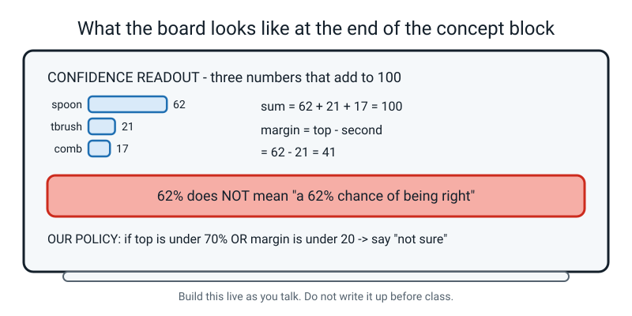

# Week 16 — Confidence Is Not Correctness

[⬅ Week 15](week-15.md) · [Course Home](../README.md) · [Week 17 ➡](week-17.md) · [Student Guide](../student-guide/week-16.md) · [Workbook](../workbook/week-16.md)

---

## 📋 At a Glance

| | |
|---|---|
| **Duration** | 70 minutes (60-minute and 75-minute versions both given in §Differentiation) |
| **Type** | 🟦 teach — new idea, worked examples, a paper activity |
| **Big idea** | A confidence score is how strongly the model **prefers** a class. It is a guess strength, not a promise — and the **margin** tells you how close the race was. |
| **New vocabulary** | class balance · confidence score · margin · `other` class |
| **Materials** | The notebook · a pencil · the eight printed readout cards (Handout 16A) · one sheet of scrap paper · a calculator is allowed for the division |
| **Tech needed** | **None.** No laptop, no webcam, no internet. This is a paper week on purpose. |
| **Prep time** | 10 minutes the night before + 5 minutes on the day |

> **🧑‍🏫 Why no computer this week?** Next week the student trains a real model and the screen will
> be full of moving bars. If they meet those bars for the first time *while* the camera is running,
> they will watch the bars and learn nothing. This week teaches them to read the bars while nothing
> is moving. Then next week they will already know what they are looking at.

---

## 🎯 Lesson Objectives

By the end of the lesson the student can, observably:

1. **Read a set of confidence scores and check they add up to 100%** — out loud, with the addition
   shown, and spot the one that does not.
2. **Compute the margin** between the top two classes and say in one sentence what a small margin
   means.
3. **Predict, in writing and before being told,** what an imbalanced set of classes (200 / 200 / 8)
   will do to a model's predictions — and justify the prediction with the arithmetic.
4. **Write a confidence policy** containing a specific number, and defend that exact number when you
   push back on it.

If they can do all four without their notes, the week landed.

---

## 🧑‍🏫 What YOU Need to Know First

*Read this section twice. It takes about twelve minutes and it is the whole lesson. Everything else
in this file is delivery.*

### 1. What actually comes out of a classifier

You probably imagine that when you show a photo to an image classifier, it says "spoon." It does
not. It never does.

What comes out is **one number for every class you set up**, and those numbers always add up to
100%. Like this:

```
   spoon       ████████████████████░░░░░░░░░░   62%
   toothbrush  ███████░░░░░░░░░░░░░░░░░░░░░░░   21%
   comb        █████░░░░░░░░░░░░░░░░░░░░░░░░░   17%
                                              ─────
                                               100%
```

> **Confidence score** — how strongly the model prefers each class, given as percentages that
> always add up to 100%.

The "adds up to 100%" part is not a nice extra. It is the key to reading these correctly, and here
is why.

**The model has exactly 100 points of belief and it must give every single point away.** It cannot
keep any back. It cannot put points in a box that does not exist. It is not answering the question
*"is this a spoon?"* It is answering a completely different question: *"of the three boxes this
person gave me, which one fits best?"* And it is **forced** to answer, even if you hold up a shoe.

That single sentence explains almost every strange thing a classifier ever does.


*Figure 16.1 — Read left to right: the winner, then the gap. The gap is the part most people skip.*

### 2. The margin — the number that is actually useful

Look at 62 / 21 / 17 again. Most people read "62%" and stop. That is a mistake, because 62 on its
own tells you almost nothing. Compare these two readouts:

| Readout | Top score | Second score | Margin |
|---|---|---|---|
| 62 / 21 / 17 | 62% | 21% | **41** |
| 45 / 44 / 11 | 45% | 44% | **1** |

Both pick the same winner. In the first one the winner beat the runner-up by 41 points. In the
second one it beat the runner-up by **one point** — that is not a preference, that is a shrug that
happened to land on the left.

> **Margin** — the top score minus the second-highest score. It tells you how close the race was.

Here is the scale to keep in your head. It is not an official standard; it is a useful reading
guide, and the course uses it consistently:

| Margin | What it means | What you should do |
|---|---|---|
| 60 or more | Not even close | Act on it |
| 30 – 59 | Reasonably clear | Act on it, but log it |
| 15 – 29 | Shaky — a small change could flip this | Check it another way |
| Under 15 | A coin toss dressed up as an answer | Do not act on it |


*Figure 16.2 — Identical winner. Completely different situation. Only the margin shows it.*

**Why the margin matters more than the top score:** the margin moves *before* the right/wrong column
does. A model that is quietly falling apart will still get the answer right for a while, but its
margins will collapse first. The margin is an early warning system. Right-or-wrong is a late one.

### 3. The sentence you must be fussy about all year

> **A confidence score is not the chance of being right.**

Say it out loud now. You will need it in about eight different weeks.

Ninety-nine per cent confident does not mean "right ninety-nine times out of a hundred." It means
"of the boxes I was given, this one is by far the best fit." Those two statements come apart
completely when the thing in front of the camera is **not in any of the boxes**.

The classic demonstration, and the one used in this course: a three-class model that knows
spoon / toothbrush / comb is shown a **fork**. There is no fork class. There never was. It reports:

```
   spoon 74%   ·   toothbrush 15%   ·   comb 11%
```

74% confident, margin 59, and **100% wrong**. Not broken. Working exactly as designed. It had 100
points of belief and three boxes, and a fork is more spoon-shaped than it is comb-shaped, so that is
where the belief went.

> **⚠️ Watch out:** This is the misconception that adults hold most stubbornly, and the word
> "confidence" is entirely to blame. In everyday English, a confident person is usually right. In
> machine learning, confidence measures preference among the options, not likelihood of truth. If
> you take away one thing from this file, take away that sentence.

### 4. The `other` class — the only real defence

If a model must always pick one of your boxes, the fix is obvious once you hear it: **give it a box
for "none of the above."**

> **`other` class** — an extra class filled with photos of the things that are *not* any of your
> real classes: an empty hand, a bare table, a fork, a pen, a wall.

It is not a magic fix. Adding a big messy class often steals a few points of belief from your real
classes and shrinks every margin. But it gives the model somewhere honest to put its belief instead
of forcing all 100 points into a wrong answer. Almost no real product does this, which is worth
mentioning to the student, because it is one of the reasons real products are confidently wrong.


*Figure 16.3 — Give it somewhere honest to put the belief, or it will put it somewhere wrong.*

### 5. Class balance — the arithmetic that makes an impressive number worthless

> **Class balance** — how evenly your examples are spread across the classes. Roughly equal counts
> is balanced; wildly unequal counts is **imbalanced**.

Here is the mechanism, and it is not complicated. Training nudges the model to reduce **total
mistakes across all the examples**. It does not care which class the mistakes come from. So if one
class is enormous and one is tiny, the cheapest way to reduce total mistakes is to lean towards the
big classes and quietly abandon the small one.

Work the numbers. Suppose you train with:

| class | photos |
|---|---|
| spoon | 200 |
| toothbrush | 200 |
| comb | 8 |
| **total** | **408** |

Now suppose the model gives up on combs entirely and never outputs "comb." How does it score on its
own training photos?

```
   correct  = 200 (spoons) + 200 (toothbrushes) + 0 (combs)
            = 400

   accuracy = 400 ÷ 408
            = 0.98039…
            ≈ 98.0%
```

**98% accurate. And 0% right on every single comb.** Nobody lied. The number is real. It just
answers a question nobody should have asked.


*Figure 16.4 — The count decides. Training goes where the examples are.*

The fix is boring: **make the counts roughly equal.** The working rule this course uses is that the
biggest class should be within about 20% of the smallest. 41 / 40 / 39 is fine. 200 / 200 / 8 is
not.

### 6. The two misconceptions you will meet today

**Misconception 1 — "62% means it's right 62% of the time."**
This is the big one and it will come from the student in almost exactly those words. Do not just say
"no." Do this instead: ask *"right about what?"* Then hold up something they never trained on — a
stapler, a TV remote — and ask what the model will say. They will work out that it has to say one of
the three, and that the percentage has nothing to hold on to. That conversation is worth more than
your correction.

**Misconception 2 — "if the model is only 45% sure, it must be broken."**
It is not broken; it is being unusually honest. A 45 / 44 / 11 readout is a model *telling you* it
cannot separate these two things. Most real products throw that information away and show you only
the winning word. The shrug is the useful part. Teach the student to value it.

There is a third one you may hold yourself, so check: **"the percentages come from the model
counting how often it was right in the past."** They do not. They come from a maths step at the end
of the network that squashes its internal scores into numbers that add to 100. Nothing was counted.
Nothing was looked up.

### 7. How deep to go, and where to stop

| Go this deep | Stop before |
|---|---|
| Scores always add to 100 | *Why* they add to 100 (the softmax function) |
| Margin = top minus second | Any other uncertainty measure (entropy, variance) |
| Confidence is preference, not probability | The word "calibration", and calibration curves |
| Imbalance makes the model abandon the small class | Class weighting, resampling, focal loss |
| An `other` class helps | Open-set recognition, out-of-distribution detection |

If a student asks *why* the numbers add to 100, the honest and sufficient answer is: **"There's a
maths step at the very end that takes the model's raw scores and squeezes them into numbers that
add up to 100, so they're easy to compare. It's a bit of algebra and it's Level 3."** That is true,
complete enough, and it closes the loop.

---

### 🧭 The Growing Map

The tinted box stays on **TRAINING** for a second week, and the change is in the thread strip:
**evaluation** has joined **model**. That is the shape of this week — the model is built, and today
is about not being fooled by what it prints.


*Figure 16.0 — Week 16's version. TRAINING still tinted and badged, with **model** and
**evaluation** lit along the bottom.*

**What to do with it, in about two minutes at the end of the lesson:**

1. **Show it and ask:** *"which bit did we do today — we didn't train anything, so why is TRAINING
   still the shaded box?"* The answer you want: *"we were reading what the trained model says."*
   Building it and trusting it are two halves of the same box.
2. **Then the better question:** *"why is HONEST TESTING still dashed, when we spent the lesson
   looking at numbers?"* Because confidence is the model's opinion of itself, and every number today
   came out of the model's own mouth. Nothing today was measured against an answer we held back. Say
   that sentence exactly — it is the door into Week 19.
3. **Have them shade TRAINING again** and write *margin*, plus the threshold their group chose, in the
   margin of their own map. Thresholds they picked themselves get remembered.

> **🧑‍🏫 Why this is worth two minutes.** This is one of the two or three most transferable weeks in
> the year — every AI product an adult meets shows a confident number — and it can easily feel like a
> fussy detail about bar charts. The map puts it where it belongs: on the evaluation thread, next to
> Weeks 19 to 22 and Week 33, which are all the same instinct applied to bigger things.

**The six threads** along the bottom are the spine of all four levels. **Model** and **evaluation**
are lit this week. Do not quiz them on the threads; the map is orientation, never assessment.

---

## 🧰 Prep Checklist

### 10 minutes the night before

- [ ] **Print Handout 16A** — the eight readout cards, from the workbook. One sheet, cut into eight
      cards, or leave it as a sheet and cover the ones you are not on with a piece of paper.
      *(No printer? Copy the eight readouts onto eight index cards by hand. It takes four minutes.
      They are listed in full in the Answer Key below.)*
- [ ] **Do the eight cards yourself, on paper**, without looking at the answer key. If you cannot do
      card 5 and card 6 cold, re-read §3 and §4 above.
- [ ] **Do the balance arithmetic yourself:** 200 + 200 + 8 = 408, then 400 ÷ 408. Write out the
      division. If you rely on a calculator that is fine, but write down the steps you will show.
- [ ] **Decide your own confidence policy** for the spoon/toothbrush/comb model, with a real number
      in it. You need one so you can disagree with the student's and make them defend theirs.
- [ ] **Find one household object** that is definitely *not* a spoon, a toothbrush or a comb. A
      stapler, a TV remote, a rubber duck. It sits on the table all lesson, unexplained, until
      minute 30. This works better than you expect.

### 5 minutes on the day

- [ ] Handout 16A face down on the table
- [ ] Board or big paper visible, with a marker that works
- [ ] Last week's homework (the 120 sorted photos and the counts-per-background log) on the table —
      you will need those counts at minute 46
- [ ] Notebook open at a fresh page
- [ ] The mystery object placed where the student will see it and not ask about it

### If something fails

| What fails | Fallback |
|---|---|
| No printer for Handout 16A | Write the eight readouts on the board three at a time. Slower but works. |
| The student did not do last week's photo homework | Use the sample counts in Answer Key §K7 instead. The lesson does not depend on their own photos. |
| You run out of time in the activity | Do cards 1, 2, 5, 6 in class. Cards 3, 4, 7, 8 move to homework, and the homework's own eight become optional. |
| The student refuses to write a policy | Write yours on the board, deliberately badly (threshold 30%), and ask them to attack it. Getting them to argue is the same skill. |

---

## ⏱️ The Lesson, Minute by Minute

| Minutes | Segment | What happens |
|---|---|---|
| 0 – 8 | 🪝 **Hook** — The Confident Wrong Answer | You make a confident wrong claim and get caught |
| 8 – 26 | 🧠 **Concept** — 100 points of belief, and the margin | The two definitions, built on the board |
| 26 – 40 | 🔍 **Worked Example** — the fork, then the balance arithmetic | You do one, they do the next |
| 40 – 60 | 🎲 **Activity** — Read the Bars Like an Expert | Eight cards, two of them traps, then the policy |
| 60 – 70 | 🔑 **Wrap & Assign** | One-sentence summary, vocabulary, homework |

---

### 🪝 Hook — 8 minutes

**Say this:**

> "I'm going to tell you the capital city of three countries and I want you to notice how sure I
> sound. France — Paris. I'm completely certain. Japan — Tokyo. Completely certain. Australia —
> Sydney. Completely certain."
>
> *(Wait. If they catch it, brilliant. If not, carry on.)*
>
> "It's Canberra. Australia's capital is Canberra, not Sydney. Now here's the thing I want you to
> notice: I said all three in exactly the same voice. My voice was 100% confident all three times.
> Two of them were right and one of them was wrong, and **you couldn't tell from the confidence
> which was which.**"
>
> "That's this whole lesson. Next week you're going to build a real model, and it's going to show
> you a number — 62%, 91%, 45% — every single time it guesses. Today you're going to learn to read
> that number properly, because if you read it the way most adults read it, you will get fooled."

**Do this:**

Write on the board, big, and leave it there for the whole lesson:

```
   CONFIDENT   ≠   CORRECT
```

Then draw nothing else yet. Put the marker down.

**Ask this:**

> **"Have you ever been completely sure about something and been wrong?"**

- *Hoping for:* any real story — a wrong answer in a test they were sure about, a wrong turn, a
  wrong name.
- *If they say "no":* offer your own. Everybody has one. "I was sure I'd left my keys in the car."
  Then ask: "when you were sure, how did being sure feel different from actually knowing?" The
  answer is: it didn't.
- *If they say something vague:* push once — "give me the actual thing." Specificity matters here,
  because you will call back to their story at minute 62.

> **🧑‍🏫 If a student asks "did you get Australia wrong on purpose?":** Yes, say so plainly. "I did.
> I wanted you to feel it rather than be told it." Never pretend an error you planted was real —
> they will stop trusting the ones that aren't planted.

---

### 🧠 Concept — 18 minutes

**Say this (part 1 — the 100 points):**

> "Here's what actually comes out of a model. Not a word. Three numbers."
>
> *(Write the three bars on the board as you talk.)*
>
> "Spoon, sixty-two. Toothbrush, twenty-one. Comb, seventeen. Add those up for me."
>
> *(Wait for 100.)*
>
> "One hundred. That is not a coincidence and it happens every single time. The model has exactly
> **one hundred points of belief** and it has to give every point away. It cannot keep any. It
> cannot put points into a box that doesn't exist."
>
> "So it is *not* answering 'is this a spoon?' It's answering a completely different question: **'of
> these three boxes, which fits best?'** And it is forced to answer. Even if I hold up a shoe."

**Say this (part 2 — the margin):**

> "Now here's the bit that most adults skip. Look at these two readouts."
>
> *(Write both on the board, one above the other.)*
>
> ```
>    A:  62  /  21  /  17
>    B:  45  /  44  /  11
> ```
>
> "Both of them pick the first one. If a product just showed you the winning word, both of these
> would look identical — both would just say 'spoon'. But they are not the same at all, are they?"
>
> "In A the winner beat the runner-up by forty-one points. In B it beat it by **one**. One point.
> That's not a preference. That's a shrug that happened to land on the left."
>
> "The gap between first and second has a name. It's called the **margin**, and it is the most
> useful number on the whole screen. Top score minus second score. Write it down."

**Do this:**

Build the board up in this exact order — do not write it all at once:

1. The three bars, drawn as actual bars (rough is fine — length matters, neatness doesn't)
2. The sum, written as `62 + 21 + 17 = 100`
3. The words `margin = top − second` and then `= 62 − 21 = 41`
4. Only then, the red warning box
5. Last, the empty policy line — leave the numbers blank until minute 58

By the end of this segment the board should look like this:


*Figure 16.5 — The finished board. Build it in five moves, in this order, as you talk.*

**Ask this:**

> **1. "What's the margin on B?"**
> - *Hoping for:* 45 − 44 = 1.
> - *If they say "44":* they subtracted from 45 wrongly or read the wrong bar. Point at the two bars
>   and ask "which two numbers am I subtracting?"
> - *If they say "1%":* accept it, then gently correct the unit. "It's 1 point, not 1 per cent. The
>   scores are percentages; the gap between them is points." Do not make a meal of this.

> **2. "Can the three numbers ever add up to 105?"**
> - *Hoping for:* no, never, they always make 100.
> - *If they say yes:* ask them to imagine the model having 105 points of belief. Where did the
>   extra five come from? The answer they should reach is: there is no extra. If you ever add three
>   scores and get 105, you misread a bar.

> **3. "If I add a fourth class, do the numbers still add to 100?"**
> - *Hoping for:* yes — four numbers now, still 100 total.
> - *If they say "no, 133" or similar:* draw four boxes and 100 counters being shared out. The
>   number of boxes changes; the pile of belief does not.

> **⚠️ Watch out — the 12-minute ceiling.** If you are still talking at minute 26, stop
> mid-sentence and go straight to the worked example. Everything you were about to say is in the
> worked example anyway.

---

### 🔍 Worked Example Together — 14 minutes

This segment has two parts: **the fork** (you do it) and **the balance arithmetic** (they do it).

**Say this (part 1 — the fork, you drive):**

> "Right. Same model — spoon, toothbrush, comb. Three boxes. That's all it has. And I hold up…"
>
> *(Pick up the mystery object you put on the table at the start. A stapler.)*
>
> "…this. A stapler. There is no stapler box. There never was. What does the model say?"
>
> *(Let them think. Then write the answer on the board.)*
>
> ```
>    stapler held up:    spoon 74   ·   toothbrush 15   ·   comb 11
> ```
>
> "Seventy-four per cent spoon. Margin of fifty-nine — that's a *bigger* margin than it gets on a
> real comb. And it is completely, totally wrong."
>
> "It is not broken. Read that again — it is not broken. It's doing exactly what it was built to do.
> It has a hundred points of belief and three boxes, and a stapler is a bit more spoon-shaped than
> it is comb-shaped, so that's where the belief went. It had nowhere else to put it."

**Ask this:**

> **"What could we give it so it had somewhere honest to put the belief?"**
> - *Hoping for:* a fourth box, a "don't know" box, an "other" box.
> - *If they say "we should let it say I don't know":* that IS the answer — tell them the professional
>   name for it. Draw the bin from Figure 16.3 on the board and label it `other`.
> - *If they say "add a stapler class":* good, and then push: "and a fork class, and a pen class,
>   and a rubber duck class? How many boxes is that?" They should arrive at: one box for everything
>   else. That is the `other` class.
> - *If they say "it should just say nothing":* honest and reasonable. Ask "what would a product do
>   if it said nothing 30% of the time?" This is the Week 32 conversation arriving early — let it
>   run for thirty seconds, then move on.

**Say this (part 2 — the balance arithmetic, they drive):**

> "Now you do one, and I'm going to sit on my hands. Somebody trains a model with two hundred spoon
> photos, two hundred toothbrush photos, and **eight** comb photos."
>
> "Before any arithmetic: what do you think that model does? Write one sentence. Don't say it out
> loud yet — write it."

**Do this:**

Wait. Genuinely wait — count to fifteen in your head. Do not fill the silence. When they have
written something, ask them to read it out, and *do not react yet*. Then:

> "Good. Now let's find out if you were right. Three sums. I'll write the questions, you do them."
>
> ```
>    (a)  How many photos altogether?
>    (b)  If the model NEVER says "comb", how many does it get right?
>    (c)  What's that as a percentage?
> ```

Answers, with the working they must show:

```
   (a)  200 + 200 + 8  =  408

   (b)  200 + 200 + 0  =  400

   (c)  400 ÷ 408  =  0.98039…  ≈  98.0%
```

**Say this (the punchline):**

> "Ninety-eight per cent. That would look fantastic in a report. Somebody could put that on a poster.
> And the model is **zero per cent** right on every single comb — which is the class they presumably
> added *because they cared about combs.*"
>
> "Nobody lied. The number is real. It just answers a question nobody should have asked."

**Ask this:**

> **"How would you fix it?"**
> - *Hoping for:* get more comb photos, or cut the other two down.
> - *If they say "delete some spoons and toothbrushes":* correct, and worth a follow-up — "down to
>   eight each?" They should notice that 8 / 8 / 8 is balanced *and useless*, because 8 photos is far
>   too few for any class. The right answer is about 40 each.
> - *If they say "tell the model combs are important":* lovely instinct, wrong mechanism. "You can't
>   tell a model anything. You can only change the photos." (Real systems *can* weight classes —
>   don't mention it, it's Level 3.)
> - *If they get stuck:* point at Figure 16.4 and ask what would make the scale level.

---

### 🎲 Activity — 20 minutes

**Read the Bars Like an Expert.** Full instructions in the next section. In summary: eight printed
readout cards, worked one at a time, each one producing a winner, a margin, and a trust/don't-trust
call with a reason. Two of the eight are traps. The last five minutes are the confidence policy.

---

### 🔑 Wrap & Assign — 10 minutes

**Say this:**

> "Right. Notebooks. Four words go in today, and then I want one sentence from you that isn't mine."

**Do this — the vocabulary, four entries:**

The student writes the term and **their own** definition. Do not accept the book's wording read back.

| Term | The plain definition they are aiming at |
|---|---|
| **confidence score** | How strongly the model prefers each class. All the scores add to 100. |
| **margin** | Top score minus second score. How close the race was. |
| **class balance** | Whether every class has roughly the same number of examples. |
| **`other` class** | An extra box for "none of the above", filled with random and background photos. |

**Ask this — the three closing checks (see §Assessing Understanding for what a good answer sounds
like):**

> **1. "Tell me the big idea in one sentence, in your own words."**
> **2. "Model says 90%. Is it right?"**
> **3. "Why is 45 / 44 / 11 worse news than 45 / 30 / 25?"**

Then call back to the hook:

> "Remember the thing you were sure about and wrong about at the start? That's what a model does
> every single day. The difference is that the model shows you its shrug, and most people don't
> bother to look at it. You're going to look at it."

**Then assign the homework** (see §Homework to Assign) and check they can do step one — not the
whole thing, just step one.

---

## 🎲 The Activity, In Full

### Read the Bars Like an Expert

**Time:** 20 minutes (15 for the cards, 5 for the policy)
**Materials:** Handout 16A (eight cards) · notebook · pencil · calculator optional
**Setup:** Cards face down in a stack, in order. One at a time. Do not lay all eight out — the
surprise on cards 5 and 6 is the point and it needs the reveal.


*Figure 16.6 — Eight cards, worked one at a time. Card 5 is the first trap.*

### The rules

For **every** card, the student writes four things in the notebook, in this order and no other:

```
   ┌──────────────────────────────────────────────────────┐
   │  1.  SUM       add the three numbers. Is it 100?     │
   │  2.  WINNER    which class has the top score?        │
   │  3.  MARGIN    top  −  second  =  ?                  │
   │  4.  CALL      trust / don't trust  +  ONE reason    │
   └──────────────────────────────────────────────────────┘
```

The reason is compulsory. "Don't trust it" with no reason is not an answer.

### The eight cards

Each card shows what was held up and the three scores. Classes are always spoon / toothbrush / comb,
in that order.

| Card | Held up | spoon | toothbrush | comb |
|:--:|---|:--:|:--:|:--:|
| 1 | a spoon | 97 | 2 | 1 |
| 2 | a toothbrush | 45 | 51 | 4 |
| 3 | a comb, in dim light | 40 | 33 | 27 |
| 4 | a spoon, at arm's length | 68 | 30 | 2 |
| 5 | a toothbrush | 45 | 44 | 11 |
| 6 | **a stapler** | 99 | 1 | 0 |
| 7 | a comb, in the dark | 34 | 33 | 33 |
| 8 | **a comb** | 80 | 19 | 1 |

Cards 5 and 6 are the traps, and cards 7 and 8 are the aftershocks. Do not warn them.

### How to run it

**Cards 1–4 (about 6 minutes).** Fast. These are practice at the four-step drill. Do card 1 together
out loud, then hand them the pencil and stay quiet. Check their margin arithmetic on each one; do
not check anything else.

**Card 5 (about 3 minutes).** This is the first trap. Hand it over, say nothing, and watch. Most
students write "toothbrush wins" and move on. When they do, ask:

> **"By how much?"**

The one point lands better as a question than as a statement. Then:

> "It won. It genuinely won. And it means nothing. If that toothbrush had been one centimetre
> further away, the answer would have flipped. A winner is not the same as a preference."

**Card 6 (about 3 minutes).** The second trap, and the bigger one. Hand it over. They will see 99 /
1 / 0, compute a margin of 98, and write "trust it." Let them. Let the wrong answer live for a full
thirty seconds. Then:

> **"What was held up?"**

Point at the word "stapler" on the card. Then pick up the actual stapler from the table.

> "Ninety-nine per cent. The biggest margin on any card. And there is no stapler box. The model has
> never seen a stapler in its life. It's not lying to you — it has a hundred points of belief and
> three boxes, and it did the only thing it could."

This is the moment of the lesson. Let it sit. Do not rush to card 7.

**Cards 7–8 (about 3 minutes).** Fast again, but they land differently now. Card 7 (34/33/33) is the
purest shrug there is — exactly the 1-in-3 you would get by guessing blind. Card 8 (80/19/1 on a
comb) is confidence and wrongness together with nothing weird about the object at all.

**The policy (5 minutes).** Now the real work. Say:

> "You are going to write the rule your own model will follow next week. It has to have a number in
> it. Fill this in:"

```
   MY CONFIDENCE POLICY
   ─────────────────────────────────────────────────────
   If the top score is below ______ %,
   OR the margin is below ______ points,
   my model must say  "not sure"  instead of guessing.

   I chose those numbers because ______________________
```

Then — and this is the important part — **argue with them.** Whatever number they write, push:

- If they write 50%: *"Card 5's top score was 45. Card 7's was 34. Your policy lets 51/45/4 straight
  through. Is that what you want?"*
- If they write 90%: *"Card 6 was 99. Your policy waves the stapler through and blocks a perfectly
  good 88% spoon. Is that what you want?"*
- If they write no margin threshold: *"Then 45/44/11 passes. Show me why that's fine."*

You are not trying to get them to a particular number. You are trying to make them **defend one**.
A defended 60/20 is a better answer than an undefended 70/30.

### What "finished" looks like

- [ ] Eight cards, each with sum, winner, margin, and a call with a reason written down
- [ ] Card 6 identified as "not in any box" rather than just "wrong"
- [ ] A policy with **two** numbers in it, not one
- [ ] The student able to say out loud why they picked those two numbers, when pushed twice

### Variation — easier

Cut to five cards: 1, 5, 6, 7, 8. Drop the sum check for cards where the sum is obviously 100 and
just do winner / margin / call. Give them the margin scale table (§What You Need to Know, part 2)
printed out and let them look up their call rather than reason it. Do the policy together, with you
writing and them choosing the numbers.

### Variation — harder

Add three cards of your own where the sums are **wrong** — 62 / 21 / 14 (= 97), 50 / 30 / 25 (= 105),
88 / 9 / 2 (= 99) — and do not tell them. Their job is to catch the misread. Then ask the extension
question: *"Which is more dangerous in a real product — a readout with a small margin, or a readout
where the object isn't in any class? Defend it."* There is no settled answer; the defence is the
work.

---

## ❓ Questions Students Ask This Week

**1. "Where does the percentage actually come from? Does it count how many times it was right
before?"**
No — nothing is counted and nothing is looked up. Inside the model there are raw scores, one per
class, and at the very end there's a bit of maths that squashes those raw scores into numbers that
add up to 100 so they're easy to compare. That's all. The model has no memory of ever having been
right or wrong.

**2. "Can it ever be 100%?"**
You'll see 100% on the screen, but it's usually 99.6% rounded up. And a 100% reading should make you
*more* suspicious, not less — it usually means the thing you're holding looks almost exactly like
one of the training photos, which is a sign your test isn't testing anything.

**3. "If it's only 45% sure, is it broken?"**
No — that's the model being unusually honest. It's telling you it genuinely can't separate those two
things. The broken thing would be a model that said 99% on everything. The shrug is useful
information and most products throw it away.

**4. "Why can't it just say 'I don't know'?"**
Because nobody gave it that option. It has the boxes you made and nothing else. You *can* give it
that option — that's the `other` class — and you'll build one later this year. The honest reason
most products don't is that a product which says "not sure" a lot feels broken to customers, so
companies build ones that always answer even when they shouldn't.

**5. "Is a 90% model better than a 70% model?"**
Not necessarily, and this is worth being careful about. A 90% on a stapler that isn't in any class is
worthless. A 70% with a margin of 55 on a real object it was trained on is a good, usable answer. You
need to know *what was held up* before a percentage means anything at all.

**6. "Do humans have confidence scores?"**
Sort of, and this is genuinely interesting. You do have a feeling of how sure you are, and it's
famously unreliable — people are most confident about things they've only just learned. The
difference is that you can say "I don't know", and you can go and check. The model can do neither.

**7. "How does the model decide how to split the 100 points?"**
**Nobody knows for sure, and here's why.** The split comes out of thousands of internal numbers that
were set by training, and no human chose any of them or can read them. We can see what goes in and
what comes out, but the reason it gave 62 rather than 58 is not written down anywhere in a form a
person can read. Making models explain their own answers is an active research problem right now,
being worked on by people at universities and companies — it is not a setting somebody forgot to
switch on. So the honest answer is: we can test it, but we cannot ask it.

**8. "If confidence isn't the chance of being right, is there a number that IS?"**
There is — you get it by testing the model on lots of examples it has never seen and counting how
often it was right. That number is called accuracy and it's Weeks 19 to 22, and it is the single
most important part of this course. Note the difference: confidence comes out of the model for free,
accuracy costs you real work with a pencil.

---

## ⚠️ Where This Lesson Goes Wrong

| What happens | Why | What to do right now |
|---|---|---|
| The student reads the top number and stops | The big bar is the one your eye goes to. It is a design problem, not a laziness problem. | Cover the top bar with your thumb and ask "now tell me if you trust it." Make the drill four steps, always, and refuse card answers that skip step 3. |
| They compute margin as top minus bottom | The bottom bar is the other one that stands out. | One correction, then a rule out loud: "second-place, not last-place. It's a race for first, so only second place can threaten it." Check the next two cards. |
| They write "trust it" with no reason | The call feels like the answer, so the reason feels like extra. | Say "that's the answer, not the reasoning" and hand the pencil back. Do not accept it. This is the habit the whole course is built on. |
| "62% means it's right 62 times out of 100" comes back at minute 55 | The word "confidence" is doing this, and one correction never sticks. | Do not repeat yourself. Hold up the stapler again and ask "62% of what?" Let them get there. Expect this to recur in Weeks 17, 20 and 22. |
| The balance arithmetic turns into a maths fight | 400 ÷ 408 is genuinely awkward mental arithmetic for a Year 7. | Hand over the calculator immediately. **They must still write the fraction 400/408.** The fraction is the honest bit; the decimal is just arithmetic. |
| They write a policy number instantly and won't defend it | Picking a number feels like the task; defending it doesn't feel like part of it. | Attack the number with a specific card. "Your threshold is 50. Card 2 was 51. Do you want that one through?" Concrete beats general every time. |
| They decide every model is untrustworthy | The whole lesson pointed one way, and 11-year-olds are logical. | Card 1 (97/2/1, margin 95) is your antidote. "This one is fine. Trusting nothing is as useless as trusting everything. The skill is telling them apart." |
| The lesson runs long and the policy gets cut | The eight cards are moreish and card 6 generates conversation. | Cut cards 3 and 4, never the policy. The policy is objective 4 and the only part that transfers to next week. |

---

## 🧭 Differentiation

### If they are struggling

**Cut:** the sum check on cards where the sum is obviously 100; cards 3 and 4 entirely; the
"argue with them" round on the policy — take one defence, not three.

**Reteach with counters.** Get 100 small objects — dried beans, coins, Lego bricks, torn paper
squares. Draw three boxes on a sheet. Physically deal all 100 into the three boxes. Then say: "now
put some back in your pocket." They can't — every bean has to go in a box. That is the entire idea of
this lesson and it takes ninety seconds with your hands.

**The margin, physically.** Cut two strips of paper, one 62 cm and one 21 cm (or 6.2 cm and 2.1 cm).
Lay them side by side. The margin is the bit of the long one sticking out past the short one. Then
cut 45 and 44 and lay those side by side. They will see it before you say it.

**Keep, whatever else goes:** card 6, the stapler, and the sentence "confident is not correct."

### If they are flying

Extension questions, in increasing order of difficulty:

1. **"Design a readout that would be honest."** If you could redesign the screen a product shows a
   user, what would you put on it instead of just the winning word? Draw it.
2. **"Two models, same object. Model A says 70/20/10, model B says 95/3/2. Which do you trust?"**
   The trap: you cannot tell without knowing whether either was ever tested. Confidence from an
   untested model is worth nothing regardless of size.
3. **"Your policy sends anything under threshold to a human. What if there are 10,000 items an
   hour?"** This is a real engineering trade-off — a stricter policy means a safer system and an
   impossible workload. Ask where they'd draw the line and who should decide.
4. **"Invent a situation where you'd want the threshold really LOW."** *(Answer: when missing
   something is far worse than a false alarm — a smoke detector, a scan looking for something
   dangerous. This is the Week 8 false-alarms-versus-misses idea, and connecting it here is
   genuinely strong work.)*

### If they won't engage today

**Plan A — make it a game.** You read out three numbers, they shout the margin. Fastest correct
answer wins the point, you keep score, best of eight. It is the same drill with the writing removed.
Ten minutes of this beats forty minutes of a fight.

**Plan B — be the model.** They hold up any object in the room and you must answer "spoon,
toothbrush, or comb" with a percentage, out loud, immediately. No hesitating and no "I don't know."
Let them pick genuinely ridiculous objects. After four or five they will start laughing at how
useless the answers are — and that laugh *is* the lesson. Then say: "that's what your model does
next week."

**Plan C — the two-minute floor.** If everything is failing, get one thing only: the sentence
"confident is not correct" written in the notebook, in their handwriting, with one example. Then
stop. Week 17 will re-teach it with a live camera and it will land better.

---

## ✅ Assessing Understanding

Three checks, all doable in the last five minutes. Ask them in this order.

### Check 1 — the one-sentence summary

> **"Tell me the big idea of today in one sentence, in your own words."**

- **Good answer:** anything containing *the percentage is how much it prefers that answer, not how
  likely it is to be right*. Their words, not yours.
- **Not good enough:** "confidence isn't correctness" recited back with no content behind it. Ask
  "what does that mean?" and see whether anything is there.
- **Warning sign:** any sentence with "magic", "it just knows", or "the AI decides" in it. Circle
  it and ask for the sentence again. Every time, all year.

### Check 2 — the applied question

> **"A model says 90%. Is it right?"**

- **Good answer:** "You can't tell." Followed, ideally, by "it depends what you held up — if it's
  something with no box, 90% means nothing."
- **Partial:** "Probably." Follow up with: "what would make you sure?" If they reach *test it on
  things it's never seen*, that is a strong answer and it pre-loads Week 19.
- **Not good enough:** "Yes, 90% is high." Reteach with the stapler card, right now, in 60 seconds.

### Check 3 — the comparison

> **"Why is 45 / 44 / 11 worse news than 45 / 30 / 25?"**

- **Good answer:** margin of 1 versus margin of 15. The first one could flip from nothing; the second
  one at least has a gap.
- **Partial:** they compute both margins correctly but can't say why it matters. Prompt with: "what
  would it take to flip each one?"
- **Not good enough:** "they're the same, both say 45." They are reading the top number only —
  the exact failure this lesson exists to prevent. Reteach with the paper strips from the struggling
  path.

### Mastery scale for this week

| Level | What it looks like |
|:--:|---|
| **1** | Reads the top number. Thinks 62% means a 62% chance of being right. Cannot compute a margin. |
| **2** | Computes the margin correctly when reminded to. Still equates high confidence with correct. |
| **3** | Computes the margin unprompted and uses it to judge a readout. Knows confidence ≠ correctness but cannot explain *why*. |
| **4** | Explains why: the model has 100 points and only the boxes you gave it. Spots the stapler card unaided. Writes a policy with two thresholds. |
| **5** | Defends the exact numbers in their policy against a specific counter-example, and connects the choice to false alarms versus misses from Week 8. |

**Aim for 3.** Level 4 is a genuinely good Year 7 outcome. Level 5 is exceptional and you should say
so out loud.

---

## 📤 Homework to Assign

**Workbook:** Week 16, pages 1–3. **Time: about 50 minutes.**

**Say this, word for word:**

> "Two jobs. First, eight more readouts — same four steps as the cards: sum, winner, margin, call.
> One of the eight has a sum that isn't 100. Don't come and tell me which one, just deal with it and
> write down what you did."
>
> "Second job, and this is the one that matters: write your confidence policy properly, with the two
> numbers in it, and give me **two** reasons for the numbers you picked. Not one. Two. One reason has
> to be about **false alarms** — the model saying 'spoon' when it isn't one. The other has to be
> about **misses** — the model saying 'not sure' when it was actually a perfectly good spoon. Those
> are two different problems and your one number has to handle both."

**Check before they leave:** ask them to do the sum on readout 1 out loud. That's step one. Do not
walk them through more than that.

| Page | Task | Approx. time |
|---|---|---|
| 1 | Eight readouts: sum, winner, margin, call with a reason | 25 min |
| 2 | The confidence policy, two thresholds, two reasons | 15 min |
| 3 | Vocabulary: four terms in their own words | 10 min |

> **💡 Try this:** If the student finishes early, ask them to test their own policy against the
> eight *class* cards from today. How many of the eight would their policy have blocked? Was that
> the right call on each one? It takes ten minutes and it turns a guess into a measurement.

---

## 🔑 Answer Key

*Complete worked answers to every question in this week's lesson and workbook.*

### K1 — The eight in-class cards (Handout 16A)

All eight sum to 100. Classes are spoon / toothbrush / comb in that order.

**Card 1 — a spoon. 97 / 2 / 1.**
Sum 97 + 2 + 1 = 100. ✅ Winner: **spoon**. Margin: 97 − 2 = **95**.
**Call: trust it.** As clear as these ever get. A margin of 95 means nothing else is even in the
race. *Note for the teacher:* if a real model gives you this on every object, be suspicious — either
the classes are far too easy to tell apart, or you're testing on photos it trained on.

**Card 2 — a toothbrush. 45 / 51 / 4.**
Sum 45 + 51 + 4 = 100. ✅ Winner: **toothbrush**. Margin: 51 − 45 = **6**.
**Call: don't trust it.** Correct answer, terrible margin. Six points is nothing — a slight change of
angle would flip this to "spoon". Being right this time was partly luck. *Watch for:* students
writing the winner as spoon because it's listed first. The winner is the biggest number, not the
first one.

**Card 3 — a comb, in dim light. 40 / 33 / 27.**
Sum 40 + 33 + 27 = 100. ✅ Winner: **spoon**. Margin: 40 − 33 = **7**.
**Call: don't trust it — and it's wrong.** A comb was held up and comb came *last*. The dim light has
destroyed the edges the model relies on, and the belief has spread almost evenly. The margin of 7
warned you before you even knew the true answer.

**Card 4 — a spoon at arm's length. 68 / 30 / 2.**
Sum 68 + 30 + 2 = 100. ✅ Winner: **spoon**. Margin: 68 − 30 = **38**.
**Call: trust it, but log it.** Right answer, reasonable margin. Note that toothbrush is at 30 — the
distance has made the spoon thinner in the frame and more toothbrush-like. Distance is a real
weakness here and it's worth writing down.

**Card 5 — a toothbrush. 45 / 44 / 11.  ⚠️ TRAP 1**
Sum 45 + 44 + 11 = 100. ✅ Winner: **spoon**. Margin: 45 − 44 = **1**.
**Call: absolutely do not trust it — and it's wrong.** This is the trap. There *is* a winner, and it
means nothing. One point of separation is not a preference; it's a coin toss that happened to land
on spoon. The true object was a toothbrush, which lost by one point. The lesson: **a winner is not
the same as a preference.**

**Card 6 — a stapler. 99 / 1 / 0.  ⚠️ TRAP 2**
Sum 99 + 1 + 0 = 100. ✅ Winner: **spoon**. Margin: 99 − 1 = **98**.
**Call: the biggest margin on any card, and completely worthless.** A stapler was held up. There is
no stapler class. The model had 100 points of belief and three boxes and no way to say "none of
these", so it gave nearly all of them to the closest fit. **This is the single most important card
in the set.** High confidence + huge margin + object not in any class = confidently, uselessly
wrong. The defence is an `other` class.

**Card 7 — a comb, in the dark. 34 / 33 / 33.**
Sum 34 + 33 + 33 = 100. ✅ Winner: **spoon**, technically. Margin: 34 − 33 = **1**.
**Call: don't trust it — this is a pure shrug.** With three classes, blind guessing gets you 1 in 3,
which is 33.3%. This readout *is* the blind-guess rate. The model has learned nothing usable about
this particular input and is splitting its belief almost perfectly evenly. This is the reading you'd
most want a product to show a human instead of hiding.

**Card 8 — a comb. 80 / 19 / 1.**
Sum 80 + 19 + 1 = 100. ✅ Winner: **spoon**. Margin: 80 − 19 = **61**.
**Call: it looks trustworthy and it is wrong.** No trick object here — a genuine comb, one of the
three real classes, and the model called it a spoon with a margin of 61. Compare it with card 6:
there the object wasn't in any box, so at least the failure had an excuse. Here it *was* in a box and
the model still missed. Most likely cause: the training combs all looked one particular way (one
colour, one angle, always held) and this one didn't match. The 80% is a completely true statement
about the model's preference and tells you nothing at all about reality.

**Summary the student should be able to give at the end:** cards 1 and 4 are usable. Cards 2, 3, 5
and 7 are shaky and the margin told you so. Cards 6 and 8 look great and are wrong, and only knowing
*what was held up* revealed it.

### K2 — Balance arithmetic, worked in class

**(a) Total photos.**
```
   200 + 200 + 8  =  408
```

**(b) Correct, if the model never says "comb".**
```
   200 (spoons) + 200 (toothbrushes) + 0 (combs)  =  400
```

**(c) Accuracy.**
```
   400 ÷ 408

   long division:  408 × 0.9  = 367.2      remainder 400 − 367.2 = 32.8
                   32.8 ÷ 408 = 0.0804…
                   0.9 + 0.0804 = 0.9804…

   accuracy ≈ 0.980  =  98.0%
```

**(d) Accuracy on combs specifically.** `0 ÷ 8 = 0.0 = 0.0%`. Zero. The headline 98.0% hides it
completely.

**(e) Two ways to fix it.**
*Level up:* collect more comb photos until you have about 200 → 200 / 200 / 200.
*Level down:* delete spoon and toothbrush photos down to 8 each → 8 / 8 / 8.
**Which to choose:** level up, if combs are available to photograph. Levelling down throws away 384
perfectly good photos, and 8 photos per class is far too few for *any* class — you'd end up with a
model that's balanced and useless. The realistic middle path is about 40 each, which is what the
course actually does.

### K3 — Lesson questions and their answers

| Segment | Question | Answer |
|---|---|---|
| Hook | Have you ever been sure and wrong? | Personal. Any concrete example. |
| Concept | What's the margin on 45/44/11? | 45 − 44 = 1 |
| Concept | Can the three numbers add to 105? | No. If you get 105, you misread a bar. There are only ever 100 points. |
| Concept | Four classes — still 100? | Yes. Four numbers, still totalling 100. Boxes change, belief doesn't. |
| Worked ex. | What could we give it so it has somewhere honest to put belief? | An `other` class — a box for "none of the above", filled with empty hands, bare tables, forks, walls. |
| Worked ex. | How would you fix 200/200/8? | Collect ~200 combs, or trim all three to about 40 each. Not 8/8/8 — balanced and useless. |
| Wrap | Big idea in one sentence? | The percentage is how strongly it prefers that class, not how likely it is to be right. |
| Wrap | Model says 90%. Is it right? | You can't tell. Depends entirely on what was held up. |
| Wrap | Why is 45/44/11 worse than 45/30/25? | Margin 1 versus margin 15. The first flips from nothing. |

### K4 — Workbook page 1: the eight homework readouts

Classes are spoon / toothbrush / comb in that order.

**H1 — a spoon. 93 / 5 / 2.**
Sum = 100 ✅. Winner **spoon**, margin 93 − 5 = **88**. **Trust it.** Clear win, right answer,
nothing competing.

**H2 — a toothbrush. 47 / 46 / 7.**
Sum = 100 ✅. Winner **spoon**, margin 47 − 46 = **1**. **Don't trust it — and it's wrong.** Card 5
again with different numbers. The true object lost by a single point.

**H3 — a spoon. 62 / 21 / 17.**
Sum = 100 ✅. Winner **spoon**, margin 62 − 21 = **41**. **Trust it, with a note.** Right answer,
solid margin. But 38 points of belief went elsewhere, so this is not a model that finds spoons easy.
Worth watching.

**H4 — a comb. 55 / 40 / 5.**
Sum = 100 ✅. Winner **spoon**, margin 55 − 40 = **15**. **Don't trust it — and it's wrong.** Right at
the boundary of the shaky band, and it turns out to be a miss. Notice that comb, the true answer, got
5 points — the model isn't just unsure between two options, it has essentially ruled out the correct
one.

**H5 — a spoon. 100 / 0 / 0.**
Sum = 100 ✅. Winner **spoon**, margin 100 − 0 = **100**. **Technically perfect, and suspicious.**
A real model almost never produces a clean 100 / 0 / 0; it's usually 99.6 rounded. If you see this,
the most likely explanation is that you are testing on a photo the model was trained on — which means
you are not testing anything. *(This is Week 19 knocking at the door. Don't open it yet, but if the
student raises it, say "hold that thought, it's the whole of next term.")*

**H6 — a comb. 38 / 36 / 24.  ⚠️ The broken sum.**
Sum = 38 + 36 + 24 = **98**. ❌ **This does not add to 100, so one bar was misread.** The correct
handling: do not guess and do not average. Write down "sum = 98, so I misread a bar — I need to read
it again." If they must proceed, the missing 2 points almost certainly belong to the bar they
misread, and re-reading gives 38 / 36 / 26 = 100. Winner **spoon**, margin **2**, don't trust it, and
it's wrong. **Full credit requires spotting the 98.** A student who wrote a margin of 2 and never
noticed the sum has missed the objective.

**H7 — a toothbrush. 15 / 71 / 14.**
Sum = 100 ✅. Winner **toothbrush**, margin 71 − 15 = **56**. **Trust it.** Right answer, good margin.
Note that the two losers are almost level (15 and 14), which is normal and means nothing — the margin
is only ever about first versus second.

**H8 — a banana. 88 / 7 / 5.**
Sum = 100 ✅. Winner **spoon**, margin 88 − 7 = **81**. **Confidently wrong — nothing in any box.**
Card 6 again with a different object. A banana is long, curved and smooth, so of the three boxes it
lands nearest spoon. The model isn't malfunctioning. It has 100 points and three boxes.

**Overall pattern the student should notice and write down:** the two highest margins in the set
(H5 at 100, H8 at 81) are the two you should trust least — one because the test was invalid, one
because the object wasn't in any class. **Margin is necessary but not sufficient. You also have to
know what was held up.**

### K5 — Workbook page 2: the confidence policy

There is no single correct policy. Grade the **defence**, not the number. A full-credit answer has:
two thresholds, one reason about false alarms, one reason about misses, and numbers that survive one
counter-example.

**Model answer (the kind of thing to aim for):**

```
   MY CONFIDENCE POLICY
   ─────────────────────────────────────────────────────
   If the top score is below 65%,
   OR the margin is below 25 points,
   my model must say "not sure" instead of guessing.
```

> **Reason 1 — about false alarms.** A false alarm here means saying "spoon" when it isn't one. On
> my eight cards, every wrong answer except card 8 had a margin under 25. If I'd used a 25-point
> margin rule, I'd have blocked cards 2, 3, 5 and 7 — all four of the shaky ones — and card 8 would
> still have got through, but that one had nothing wrong with the readout to warn me. So 25 points
> catches most of my false alarms without me having to see the true answer first.
>
> **Reason 2 — about misses.** A miss here means saying "not sure" about a perfectly good spoon.
> Card 4 was a real spoon at 68% with a margin of 38 — my policy lets it through, which is right,
> because refusing to answer on a correct 68% would make the model annoying to use. If I set the
> threshold at 80% instead I'd block card 4 and probably half of all my correct answers, and a model
> that says "not sure" half the time is a model nobody uses.
>
> **Why I used OR and not AND.** Card 6 was 99% with a margin of 98 — it passes both tests and it's
> still wrong, so no threshold catches that one. But 45/44/11 has a high-ish top score and a terrible
> margin, and I want that blocked. If I used AND, it would need to fail *both* tests to be blocked,
> and it would sneak through. OR is stricter, and stricter is right here.

**Common wrong answers and how to handle them:**

| They wrote | The problem | What to ask |
|---|---|---|
| "Trust anything over 50%" | 51/45/4 passes. Card 2's exact readout. | "Card 2 was 51. Is that a good answer?" |
| One threshold only (top score) | 45/44/11 has no defence at all. | "Show me how your policy handles 45/44/11." |
| "Trust anything over 95%" | Blocks nearly every real answer. Card 6 still passes. | "How many of the eight cards does this let through? Is that a useful machine?" |
| Two numbers, no reasons | Objective 4 is the defence, not the number. | Hand it back. "Now tell me why 70 and not 60." |
| "Never trust it" | Consistent, but useless. | "Card 1 was 97/2/1 on a real spoon. What's wrong with that one?" |

### K6 — Workbook page 3: vocabulary

Accept the student's own wording. These are the targets.

| Term | Target definition | Example they should give |
|---|---|---|
| **confidence score** | How strongly the model prefers each class; the scores always add to 100. | spoon 62, toothbrush 21, comb 17 |
| **margin** | Top score minus second score — how close the race was. | 62 − 21 = 41 |
| **class balance** | Whether each class has roughly the same number of examples. | 41/40/39 is balanced; 200/200/8 is not |
| **`other` class** | An extra box for "none of the above", filled with random and background photos. | empty hand, bare table, fork, wall |

Reject: "confidence = how right it is" (that's the misconception), "margin = the difference between
the numbers" (which numbers?), "class balance = when it's fair" (measure it, don't feel it).

### K7 — Sample photo counts, if the student didn't do Week 15's homework

Use these for the balance check so the lesson can run:

| class | photos collected |
|---|---|
| spoon | 41 |
| toothbrush | 40 |
| comb | 39 |

Balance check: biggest 41, smallest 39, difference 2. `2 ÷ 41 ≈ 4.9%` — well under 20%. ✅ Balanced.

---

## 🔮 Next Week Preview

Next week is the one they have been waiting for since Week 10: **Week 17 — Train Your First Real
Model.** In about twenty minutes, with no code at all, the student will load their forty photos per
class into Teachable Machine, press one button, and have a working image classifier. Then they will
hold up an object it has never seen and watch it produce a confident wrong answer — which is
everything you did today, arriving in the flesh with a camera pointed at it.

**Prep early, this week, not on the day:**

- **Run the Week 0 smoke test again** — palm versus fist, two classes, four seconds each, train, check
  the bars swap. Five minutes. Do it on the actual laptop you'll use. This is the single highest-value
  five minutes you will spend all term.
- **Check the student's 120 photos exist and are findable** — in one folder, or already on the phone,
  or already in a browser tab. Hunting for photos eats a lab session alive.
- **Quit every other app that could hold the camera** — Zoom, Teams, FaceTime, a second browser tab.
- **Decide now where the `.tm` file will be saved** and tell the student the filename in advance:
  `baseline-v1.tm`. Not `Untitled.tm`. They will need it in Week 18 and there is no autosave.

---

[⬅ Week 15](week-15.md) · [Course Home](../README.md) · [Week 17 ➡](week-17.md) · [Student Guide](../student-guide/week-16.md) · [Workbook](../workbook/week-16.md) · [Orientation](00-orientation.md) · [Glossary](../../glossary.md)
