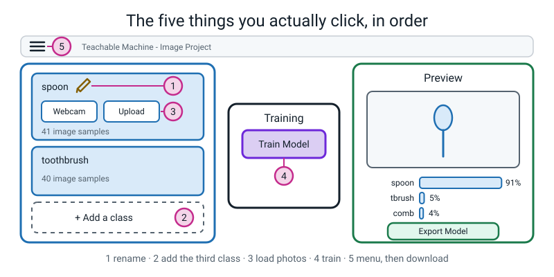
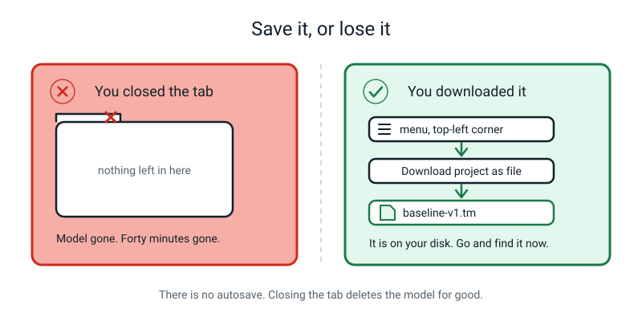
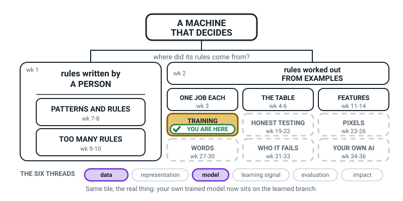
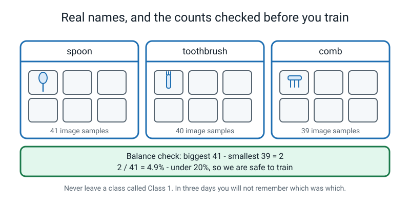
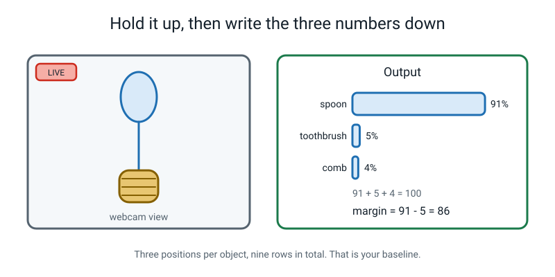
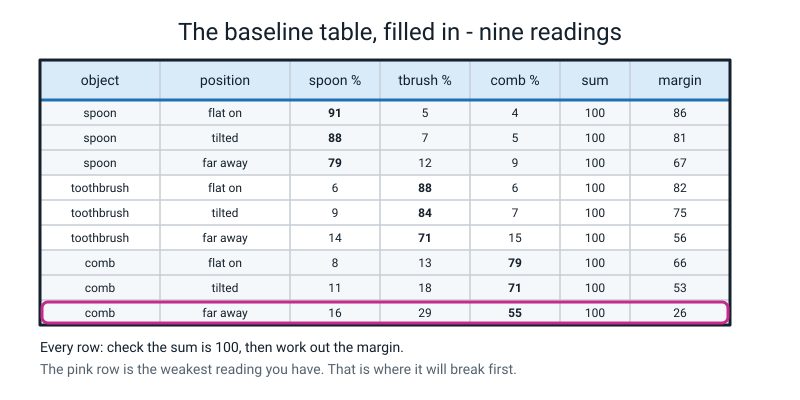

# Week 17 — Train Your First Real Model

[⬅ Week 16](week-16.md) · [Course Home](../README.md) · [Week 18 ➡](week-18.md) · [Student Guide](../student-guide/week-17.md) · [Workbook](../workbook/week-17.md)

---

## 📋 At a Glance

| | |
|---|---|
| **Duration** | 70 minutes (this one genuinely needs all of it — see §Differentiation for the 60-minute cut) |
| **Type** | 🟩 lab — hands on the keyboard from minute 8 |
| **Big idea** | You can build a working image classifier in twenty minutes without writing a line of code — and it will be **exactly as good as the photos you gave it**. |
| **New vocabulary** | None. This is a consolidation week: every word used today came from Weeks 15 and 16. |
| **Materials** | Laptop · the student's 120 photos from Week 15 · the three real objects · one object that is **not** any of the three · the notebook · the printed baseline table (Handout 17A) |
| **Tech needed** | A browser (Chrome or Edge preferred) · a webcam **or** the photos as files · [teachablemachine.withgoogle.com](https://teachablemachine.withgoogle.com) · no account, no install |
| **Prep time** | 15 minutes the night before — **do not skip the smoke test** |

> **⚠️ Watch out:** This is the week the student falls in love with their model. That is fine and it
> is meant to happen. Do **not** spoil it by hinting that the number might be a lie — Weeks 19 to 22
> exist to do that, and they need a fortnight of pride sitting in between or the lesson does not
> bite. Today, let it be brilliant.

---

## 🎯 Lesson Objectives

By the end of the lesson the student can, observably:

1. **Create three named classes** in Teachable Machine — real names, never `Class 1` — and load their
   photos into each one.
2. **Train a model and read the live preview** confidence bars out loud as they hold objects up.
3. **Record a baseline** — nine confidence readings in a table, each with its sum checked and its
   margin computed — so it can be compared against something later.
4. **Save the project as a file** called `baseline-v1.tm` and **point at it on the disk.**

Objective 4 is not administration. It is the one the whole of Week 18 depends on, and it is the one
most likely to be skipped.

---

## 🧑‍🏫 What YOU Need to Know First

*Ten minutes. You need this section even if you have used Teachable Machine before, because two of
the things in it are commonly got wrong by people who have.*

### 1. What Teachable Machine actually is

It is a free web page made by Google that lets you train a small image classifier by showing it
photos, with no code and no account. You open it, you make some named boxes, you put photos in each
box, you press one button, and about twenty seconds later you have a working model.

That is genuinely all it is. There is no catch and nothing to install.


*Figure 17.1 — The whole screen. Five clicks, in order, and you have a model.*

The five clicks, in the order you will do them today:

| # | Click | What it does |
|:--:|---|---|
| 1 | the **pencil** beside a class name | renames it from `Class 1` to `spoon` |
| 2 | **+ Add a class** | gives you the third box |
| 3 | **Webcam** (or **Upload**) | opens the camera, or lets you drag photo files in |
| 4 | **Train Model** | the twenty seconds |
| 5 | **☰ menu → Download project as file** | saves it to your disk |

### 2. Where the photos go — the answer you will be asked

**The photos do not leave the laptop.** Training runs inside the browser tab, on your own machine,
using your own processor. Nothing is uploaded to Google unless you deliberately click "upload my
model" to get a shareable link — and this course never asks you to do that.

This matters for two reasons. First, it is the honest answer to a fair question a child will ask, and
you should be able to give it without hedging. Second, it is why the tab freezing is a real risk:
the work is happening *here*, not on a server farm somewhere. Close your other tabs.

> **🧑‍🏫 If a student asks "is my photo going to Google?":** "No. The training is happening in this
> tab, on this laptop. Your photos never get sent anywhere. You can even turn the wifi off after the
> page has loaded and it still works — try it." *(It does work. It is a good demonstration.)*

### 3. Why twenty seconds is enough — the honest version

Here is the thing that most explanations skip, and it is worth knowing because a bright student will
smell that something is missing.

**Teachable Machine does not start from nothing.** It begins with a model Google already trained on
*millions* of everyday photographs — a model that already recognises edges, curves, shine, fur, wood
grain, fabric texture. Your forty photos only teach the last small step: **which of those
already-known patterns go with which of your three names.**

That is why forty photos is enough, and why it takes twenty seconds instead of a week. You are not
building a brain from scratch. You are giving names to a vocabulary that already exists.

Say this out loud to the student if they ask why it's so fast. Do not volunteer it if they don't.
It is a Level 3 topic and it can swamp today's point.

### 4. What is happening during those twenty seconds

You do not need to explain the maths and you should not try. But you should know this, because the
progress bar invites a question:

- The model looks at all 120 photos, checks how many it got wrong, nudges thousands of internal
  numbers a tiny bit, and then looks at all 120 again. One complete pass is an **epoch**.
- Teachable Machine does **50 epochs** by default. So 120 photos × 50 = **6,000 photo-examinations**.
- If a human looked at one photo per second without stopping, 6,000 seconds is 100 minutes. The
  browser does it in about twenty. Not magic — just very fast arithmetic, repeated.

There is an **Advanced** panel with epochs, batch size and learning rate in it. **Leave all three
alone.** Point at it, name it once so it isn't mysterious, and move on. Changing them today will cost
you fifteen minutes and teach nothing.

### 5. The deliberate wobble — the most important two minutes of the lesson

At about minute 55 you are going to hand the student an object that is not any of the three classes —
a fork, a stapler, a TV remote — and ask them to hold it up to their beautiful new model.

The model will produce a confident, completely wrong answer. Something like `spoon 74%`.

This is not a failure of the lesson. **It is the lesson.** Everything in Week 16 was paper; this is
the same thing with a camera pointed at it, on a model the student built themselves, ten minutes
after they were proudest of it. That combination is why it sticks.

Your job in that moment is to say nothing for a few seconds and let them react. Then ask *"why did it
do that?"* and wait. The answer they should reach is: **it has 100 points of belief and three boxes,
and no way to say "none of these."**

### 6. There is no autosave. None. At all.

Close the tab and the model is gone. Refresh the page and the model is gone. Let the laptop go to
sleep for long enough and, on some machines, the model is gone.

The only save is **☰ menu → Download project as file**, which gives you a `.tm` file on your disk.


*Figure 17.2 — There is no autosave. This is the only save there is.*

**The session cannot end until the file exists and the student has pointed at it in the Downloads
folder.** Not "downloaded it" — *pointed at it*. Week 18 loads this file four times. If it does not
exist, Week 18 does not happen.

### 7. The two misconceptions you will meet today

**Misconception 1 — "the photos are inside the model."**
They are not. After training, the photos are gone from the model entirely. What remains is a pile of
adjusted numbers that happen to work. The clinching evidence is size: a Teachable Machine model file
is a few megabytes, while the 120 photos that made it might be forty megabytes. **The model is much
smaller than the data that made it.** It could not possibly be storing them. It genuinely compressed
them into a pattern.

> **⚠️ Watch out:** the saved `.tm` **project file** is different. It also keeps copies of the photos (that is how Week 18 can delete samples after reopening it), so it will be far bigger than a few megabytes. The size argument is about the trained model, not the project file. Say so if the student looks at the file size.

Useful analogy: the examples are the ingredients, training is the baking, the model is the cake. Once
it's baked you cannot get the eggs back out, you cannot read the recipe off the cake, and if the cake
is bad the only fix is **to bake a new one with better ingredients**. You never fix a model by
arguing with it.

**Misconception 2 — "it works, so it's good."**
The live preview will look astonishing. The student will hold up a spoon and get 91% and conclude the
model is excellent. It might be. It might also be reading the wooden table, or the light from the
window, or their hand. Today you are not going to challenge this — but **write the numbers down**,
because Week 18 is going to challenge it with evidence, and evidence needs a baseline.

> **⚠️ Watch out:** the misconception you may hold yourself is that the live preview counts as
> testing. It does not. Holding an object up to a camera in the same room, in the same light, is the
> loosest possible test. It is a *demonstration*. Real testing starts in Week 19 and it involves a
> sealed envelope. Don't say that today — just don't call the preview a test in front of the student.

### 8. How deep to go, and where to stop

| Go this deep | Stop before |
|---|---|
| The model is made from your photos and nothing else | Convolutional layers, MobileNet, embeddings |
| 50 epochs = 50 passes over every photo | Backpropagation, gradient descent, loss curves |
| It starts from a model Google pre-trained | The words "transfer learning" (fine to say, don't explain) |
| Training happens in this tab, on this laptop | WebGL, tensors, why the tab can freeze |
| Confidence bars mean what Week 16 said they mean | Softmax, calibration |

---

### 🧭 The Growing Map

The tinted box has not moved — **TRAINING**, for a third week — but the thread strip has: **data** has
come back and joined **model**. That is precisely today's shape. They fed it photos, and a model came
out the other side.



*Figure 17.0 — Week 17's version. TRAINING still tinted and badged, with **data** and **model** lit
along the bottom.*

**What to do with it, in about two minutes at the end of the lesson:**

1. **Show it and ask:** *"which bit did we do today?"* They will point at TRAINING and say "we trained
   it" — take that, then push once: *"and what did we hand it?"* You want the word **photos** out loud,
   because it is the only ingredient there was. Nobody wrote a rule today.
2. **Then the better question:** *"why is HONEST TESTING still dashed, when we held all three objects
   up to the camera and got them right?"* Because they held them up **in the room they trained in**.
   That is a demonstration, not a test. Say that sentence and stop — it is the hook for Week 19.
3. **Have them shade TRAINING on their own map** and write their **saved filename** beside it. That is
   a thirty-second job that pays back in Weeks 18, 22, 33 and 34, when the file has to still exist.

> **🧑‍🏫 Why this is worth two minutes.** Today is the loudest lesson of the term and the one most
> likely to be remembered as *"the day we used the Google website"*. The map is what stops that. It puts
> a name on what happened — a model was produced from data — and it shows that the exciting part sits
> on a branch that began in Week 2 with a question about where rules come from.

**The six threads** along the bottom are the spine of all four levels. **Data** and **model** are lit
this week. Do not quiz them on the threads; the map is orientation, never assessment.

---

## 🧰 Prep Checklist

This section lists what to do the night before and on the day, and what to do if something fails.

### 15 minutes the night before — the smoke test is not optional

- [ ] **Run the smoke test on the actual laptop you will use.** Five minutes:
      `teachablemachine.withgoogle.com` → **Get Started** → **Image Project** → **Standard image
      model** → Class 1 → **Webcam** → **Allow** → hold up a flat **palm**, press and hold *Hold to
      Record* for 4 seconds → Class 2 → Webcam → hold up a **fist**, 4 seconds → **Train Model** →
      wait ~20 s → show your palm.
      ✅ **Pass:** Class 1 reads above 80% for the palm and the bars swap when you make a fist.
      ❌ **Fail:** see the troubleshooting table below. Fix it tonight, not tomorrow.
      Then close the tab without saving.
- [ ] **Find the student's 120 photos.** Are they on a phone? In a folder? Not taken at all? Sort this
      out now. Hunting for photos will eat the whole lesson.
- [ ] **Count them and check the balance yourself** — biggest minus smallest, divided by biggest,
      should be under 20%.
- [ ] **Print Handout 17A** — the blank nine-row baseline table. Or rule it into the notebook by
      hand; it is seven columns.
- [ ] **Choose the wobble object.** A fork, a stapler, a TV remote, a rubber duck. Hide it. It comes
      out at minute 55 and not before.
- [ ] **Decide where the file will be saved** and write the name on a sticky note: `baseline-v1.tm`.

### 5 minutes on the day

- [ ] Laptop plugged in, not on battery — training on a low battery gets throttled
- [ ] **Quit every app that could hold the camera:** Zoom, Teams, FaceTime, Photo Booth, any second
      browser tab that ever asked for a camera
- [ ] Close every other browser tab. Training runs on this machine and it wants the memory.
- [ ] The three objects on the table, plus the hidden fourth
- [ ] Handout 17A and a pencil beside the laptop, not under it
- [ ] Teachable Machine already open on the Image Project page, before the student sits down

### If something fails

| What fails | Fallback |
|---|---|
| **No webcam / camera broken** | Use **Upload** instead of **Webcam** and drag the photo files in. This is genuinely better — you can walk around the house between shots. Everything else is identical. |
| **No internet** | The page must load once. If it will not load at all: run the lesson on paper today using Figures 17.1–17.4 and the sample data in Answer Key §K6, and do the build as a 30-minute session before Week 18. Do **not** skip to Week 18 without a built model. |
| **Training freezes or the tab crashes** | Close every other tab, switch to Chrome or Edge, and reduce each class to 30 samples. Then retrain. It will work. |
| **Photos were never taken** | Take them now, at 15 per class, from the webcam, in three different spots in the room. A 45-photo model is a worse model but a perfectly good lesson. Log the real count — do not pretend it was 40. |
| **You run out of time before saving** | Stop everything else and save. Cut the wrap-up, cut the vocabulary, cut the homework explanation. **Nothing else in this lesson matters if the file does not exist.** |

---

## ⏱️ The Lesson, Minute by Minute

This section is the plan for the whole lesson. The table is the overview; the steps below it say what to say and ask.

| Minutes | Segment | What happens |
|---|---|---|
| 0 – 8 | 🪝 **Hook** — the twenty-second claim | You make a bold promise and start a timer |
| 8 – 26 | 🧠 **Concept** — set up the three classes | Names, photos, the balance check |
| 26 – 40 | 🔍 **Worked Example** — train, and read row 1 together | The button, the wait, the first reading |
| 40 – 60 | 🎲 **Activity** — the nine-row baseline, then the wobble | The build finished and tested honestly |
| 60 – 70 | 🔑 **Wrap & Assign** — save the file, find the file, homework | The bit you must not cut |

---

### 🪝 Hook — 8 minutes

**Say this:**

> "Seven weeks ago, in Week 10, you tried to write rules to spot spam and you gave up somewhere around
> rule number five, because every rule you added broke two others. Do you remember what that felt
> like?"
>
> "Today you are going to build a machine that sorts three objects apart, and you are not going to
> write a single rule. Not one. You are going to give it your photos and it will work out the rule
> by itself."
>
> "And here's my claim, which I want you to time me on: **from a blank page to a working model takes
> about twenty seconds of actual training.** Not twenty minutes. Twenty seconds. Get your phone or the
> clock, because when I press the button you're going to time it and write the number down."

**Do this:**

Open the laptop, already on the Teachable Machine home page. Do **not** click anything yet. Put a
timer or a clock where the student can see it. Write on the board:

```text
   MY PREDICTION:  training will take _______ seconds
   ACTUAL:         _______ seconds
```

Make them fill in the prediction line **now**, before anything else happens. Predictions written
before an experiment are a habit this course builds all year, and this is a cheap, fun place to
practise it.

**Ask this:**

> **1. "What do you think 'training' is actually doing in those seconds?"**
> - *Hoping for:* something like "looking at the photos and working out the pattern."
> - *If they say "downloading":* nothing downloads. It happens here, on this laptop.
> - *If they say "asking Google":* no — and this is worth thirty seconds. Nothing is sent anywhere.
>   You could turn the wifi off after the page loads and it would still work.
> - *If they say "I don't know":* perfect, honestly. "Neither does anyone until they watch it. Let's
>   watch it."

> **2. "What's going to make this model good or bad?"**
> - *Hoping for:* the photos. If they say the photos, say "hold that thought" and write **THE PHOTOS**
>   on the board. You will point at it three times today.
> - *If they say "how clever the computer is":* let it stand for now. The wobble at minute 55 will
>   correct it more effectively than you can.

---

### 🧠 Concept — 18 minutes

This is hands-on. The student drives the mouse. You narrate.

**Say this:**

> "Right. Get Started. Image Project. Standard image model. Now look at this screen — it's simpler
> than it looks. Three areas. Down the left, boxes for your classes. In the middle, one button that
> trains. On the right, the preview that shows you what it thinks."
>
> "First job, and it's the one everyone skips: **name the boxes properly.** See where it says
> 'Class 1'? Click that little pencil. Type 'spoon'. Now do Class 2 — 'toothbrush'."
>
> "Why does this matter? Because in three days, when you open this file again, 'Class 1' will mean
> nothing to you. I promise. Everyone thinks they'll remember and nobody does."
>
> "Now we need a third box. See '+ Add a class' at the bottom? Click it. Name it 'comb'."

Then the photos:

> "Now we load your photos. Click **Upload** in the spoon box and drag your spoon photos in. All of
> them at once — you can select the whole folder."
>
> *(Or, if using the camera: "Click **Webcam**, then **Allow**. Now — and this is important — do
> **not** hold the record button down for twenty seconds. If you do, you get two hundred nearly
> identical pictures, which teaches the model roughly as much as one picture does. Two seconds, stop,
> move the object, two seconds, stop, move it again.")*

**Do this — the balance check, out loud:**

When all three classes are loaded, stop everything and point at the sample count under each class.
Write the three numbers on the board. Then do the arithmetic together:

```text
   spoon: ____    toothbrush: ____    comb: ____

   (biggest − smallest)  ÷  biggest  =  ____ %     want: under 20%
```


*Figure 17.3 — Names, counts, and the check you do before you press anything.*

If they are out of balance, fix it now: either add photos to the small class, or use the class's
**three-dot menu → Remove All Samples** on the big one and reload fewer. Five minutes here saves the
whole model.

**Ask this:**

> **1. "Our counts are 41, 40 and 39. Is that balanced? Show me."**
> - *Hoping for:* `(41 − 39) ÷ 41 = 2 ÷ 41 ≈ 4.9%`, which is under 20%, so yes.
> - *If they say "yes because they're nearly the same":* correct instinct, no evidence. "Show me the
>   number." The arithmetic is the point.
> - *If their real counts are badly out:* good — that is a better lesson than a tidy one. Work out the
>   real percentage and fix it in front of them.

> **2. "What would happen if I had 200 spoons and 8 combs?"**
> - *Hoping for:* Week 16's answer — it stops saying comb, and still scores 98%.
> - *If they've forgotten:* one prompt only — "what did the scale figure look like last week?" Then
>   move on. Do not re-teach Week 16 here; you will run out of time.

---

### 🔍 Worked Example Together — 14 minutes

**Say this:**

> "Right. Timer ready. Everything else on this laptop is closed. Press **Train Model** and **do not
> touch anything** — don't switch tabs, don't minimise the window. Browsers slow down tabs you aren't
> looking at, and training can stall if you look away. Watch the bar."

**Do this:**

Let them press it. Say nothing for twenty seconds. When it finishes, get the actual number written on
the board next to their prediction. Then:

> "Nothing visible happened, did it? No 'aha'. A bar filled up and now a model exists that did not
> exist thirty seconds ago."

Now the first live reading:

> "Hold up the spoon. Flat on, about thirty centimetres away. Now read me the three numbers, biggest
> first."


*Figure 17.4 — Read all three numbers, not just the winner. Then check the sum. Then the margin.*

Fill in row 1 of Handout 17A together, out loud, doing all three checks from Week 16:

```text
   object: spoon     position: flat on
   spoon ____   toothbrush ____   comb ____
   sum = ____        (must be 100)
   margin = ____ − ____ = ____
```

**Ask this:**

> **1. "Check the sum for me."**
> - *Hoping for:* 100, computed out loud.
> - *If it isn't 100:* they misread a bar, or the numbers moved between reading them. Freeze the
>   object still and read again. Do not let a non-100 row into the table.
> - *If they say "why do I have to, it's always 100":* exactly — that's why it's a check. It only
>   ever tells you something when it fails, and when it fails it means you misread.

> **2. "What's the margin, and is that good?"**
> - *Hoping for:* top minus second, and a judgement using last week's scale (60+ is a clear win).
> - *If they give the margin as top minus bottom:* one correction — "second place, not last place."

> **3. "Move it further away and read it again. What happened to the margin?"**
> - *Hoping for:* it dropped. Distance makes objects smaller and thinner in frame and the model gets
>   less to go on.
> - *If nothing changed:* try tilting it, or moving to a different background. Something will move it.
>   The point is that the numbers are *live* and respond to the world, not fixed facts about the
>   object.

---

### 🎲 Activity — 20 minutes

**The Build, finished and tested honestly.** Full instructions in the next section. In summary: the
remaining eight rows of the baseline table, then the deliberate wobble with the hidden fourth object,
then the save.

---

### 🔑 Wrap & Assign — 10 minutes

**Do this first — nothing else until this is done:**

1. **☰ menu, top-left corner → Download project as file.**
2. Name it `baseline-v1.tm`. Not `Untitled`. Not `my model`.
3. **Open the Downloads folder and point at the file.** Out loud: "there it is."
4. Write the file's location in the notebook: *"baseline-v1.tm is in Downloads."*

Only then:

**Say this:**

> "Twenty seconds. You built a machine that tells three objects apart and you didn't write a line of
> code. Nobody wrote the rule — you gave it your photos and it worked the rule out."
>
> "But here's the sentence I want you to write down, because it's the one that matters:"
>
> ```
>    My model is exactly as good as the photos I gave it.
> ```
>
> "Not as good as the computer. Not as good as Google. As good as your photos. That's why the fork
> broke it, and that's what next week is about."

**Ask this — the three closing checks (see §Assessing Understanding for what good sounds like):**

> **1. "Tell me in one sentence what training actually did."**
> **2. "Where are your photos now — are they inside the model?"**
> **3. "Your model said 74% on the fork. Was it broken?"**

Then assign the homework and check they can do step one only.

---

## 🎲 The Activity, In Full

This section gives the full instructions for the Build: the baseline table, the wobble and the save.

### The Build

**Time:** 20 minutes (12 for the table, 4 for the wobble, 4 for the save)
**Materials:** the trained model on screen · the three objects · the hidden fourth object · Handout
17A · pencil
**Setup:** Model trained. Preview panel live. Table in front of the keyboard, not under it. The
fourth object still hidden.

### Part 1 — the nine-row baseline (12 minutes)

Each of the three objects is held up in **three positions**:

```text
   ┌──────────────────────────────────────────────────────────┐
   │  POSITION 1 — flat on      face the camera, ~30 cm away  │
   │  POSITION 2 — tilted       turn it ~45°, same distance   │
   │  POSITION 3 — far away     arm's length, same angle      │
   └──────────────────────────────────────────────────────────┘
```

Three objects × three positions = **nine rows**. For every row, the student writes seven things:
object, position, the three percentages, the sum, and the margin.

**The rules, which you enforce:**

1. **Hold still before you read.** The numbers jitter while the object is moving. Freeze, count to
   two, then read.
2. **Read all three numbers, not just the winner.**
3. **Check the sum before writing the margin.** If it isn't 100, you misread — read again.
4. **Round to whole numbers.** 91.4% is 91. Nobody needs the decimal.
5. **Same distance, same light, same order, every time.** This is a measurement, not a play.

Here is what a finished table looks like:


*Figure 17.5 — Nine rows. The pink row is the weakest reading, and that is where it will break first.*

When the nine rows are done, ask one question and let it sit:

> **"Which row has the smallest margin?"**

Whatever it is, that is the model's weak spot, and they found it before anything went wrong. That is
exactly what the margin column is for.

### Part 2 — the deliberate wobble (4 minutes)

Now bring out the hidden object.

**Say this:**

> "One more test. Hold this up."

Hand them the fork (or stapler, or remote). Say nothing else. Let them hold it up and read the
screen.

They will get something like `spoon 74% · toothbrush 15% · comb 11%`. Let the silence run for a good
five seconds. Then:

**Ask this:**

> **1. "What did it say?"** — just get the numbers read out loud.
> **2. "Is it right?"** — no.
> **3. "Is it broken?"**
> - *Hoping for:* no — it has three boxes and no way to say "none of these."
> - *If they say "yes, it's broken":* ask "what would you have wanted it to say?" They will say "I
>   don't know" or "fork". Then: "is either of those one of your three boxes?" That gets them there.
> - *If they say "it's stupid":* redirect once, gently. "It's not stupid, it's *stuck*. What is it
>   stuck with?"

Then write the wobble reading into the table as row 10, marked clearly:

```text
   row 10  |  a FORK  |  no class exists  |  74 / 15 / 11  |  100  |  margin 59  |  ✗ WRONG
```

Point out the thing that lands hardest: **the margin on the fork (59) is bigger than the margin on
several of the real objects.** Confidence and correctness are genuinely unrelated, and here is the
proof, in their own handwriting, on their own model.

### Part 3 — the save (4 minutes)

This is Objective 4 and the session does not end without it. Follow the four steps in §Wrap above.
Do not accept "I clicked download." Make them **find the file and point at it.**

### What "finished" looks like

- [ ] Three classes with real names, counts logged, balance percentage calculated and under 20%
- [ ] A trained model that gets all three real objects right in position 1
- [ ] Nine baseline rows, each with the sum checked and the margin computed
- [ ] Row 10: the wobble object, its reading, and the word WRONG
- [ ] `baseline-v1.tm` on the disk, and the student able to point at it
- [ ] One sentence in the notebook: *"My model is exactly as good as the photos I gave it."*

### Variation — easier

**Cut to two positions per object** (flat on and far away) — six rows instead of nine. Cut the sum
check on rows where the winner is obviously above 90. Do the arithmetic on a calculator, but the
student still writes the subtraction down. If the table is still a struggle, you read the screen and
they write; the writing is what matters.

If the whole build is overwhelming: build it with **two** classes instead of three. Two classes is a
real model, trains faster, and produces bigger clearer margins. Add the third next week.

### Variation — harder

**Add a fourth class called `other`** and fill it with 40 photos of the empty hand, the bare table, a
pen, a wall, and — deliberately — a fork. Retrain, and then re-run the wobble test and compare:

| test | 3-class model | 4-class model |
|---|---|---|
| the fork | spoon 74% ✗ | ? |
| a real spoon | spoon 91% ✓ | ? |
| a real comb | comb 79% ✓ | ? |

Two things to watch for, and the second is the interesting one:

1. Does the fork land in `other`?
2. **Did the three real objects get worse?**

Adding a big messy class often steals belief from
the real classes and shrinks every margin. Ask them to write three sentences on whether the trade was
worth it and how they'd decide if this were a real product.

---

## ❓ Questions Students Ask This Week

This section gives short, honest answers to the eight questions most likely to come up.

**1. "Are my photos going to Google?"**
No. The training runs in this browser tab, on this laptop, using this machine's processor. Your photos
are not uploaded anywhere. You can turn the wifi off once the page has loaded and it still trains —
try it, it's a good check. The only time anything leaves is if you deliberately click "upload my
model" to get a shareable link, and we are not doing that.

**2. "Are my photos inside the model file?"**
No, and there's a nice way to prove it: the model file is a few megabytes and your 120 photos are
maybe forty megabytes. The model is much *smaller* than the photos that made it, so it cannot be
storing them. Training squeezed them into a pattern and then the photos were done with.

**3. "Why is it so fast? Twenty seconds seems too quick to learn anything."**
Because it isn't starting from nothing. It begins with a model Google already trained on millions of
photos, which already knows about edges and curves and shine. Your forty photos only teach the last
small step — which of those already-known patterns goes with which of your three names.

**4. "Can I use more than three classes?"**
Yes, as many as you like. But keep them balanced — every class needs roughly the same number of
photos — and remember that more classes means the 100 points of belief get split more ways, so margins
usually get smaller. Three is a good number for learning; two is easier; ten is a lot of
photographing.

**5. "Why does the number keep changing when I hold still?"**
Because you are not actually holding still, and neither is the light. The camera takes a new picture
several times a second and every one is slightly different — a hand tremor, a flicker in the light, a
shadow. The model re-reads every frame from scratch. It has no memory of the last one.

**6. "Can I make it better by pressing Train again?"**
Barely. You'd get a very slightly different model because training has some randomness in it, but the
photos are the same, so the model is essentially the same. You cannot fix a model by retraining it.
You fix it by changing the photos. That's next week's whole lesson.

**7. "What's inside the model? Can I look?"**
**Nobody can, and this is honestly the state of the field.** Inside the file are thousands of numbers
that training set. No human chose any of them and no human can read them — there's no line in there
saying "spoons are shiny." The knowledge is spread across all the numbers at once with no individual
piece meaning anything on its own. Getting models to explain their own answers is something
researchers at universities and companies are actively working on right now; it isn't a setting
someone forgot to switch on. So: we can test a model, but we cannot ask it.

**8. "Is this a real AI or a toy version?"**
It's a real one. It's small, and it's using a shortcut by starting from Google's pre-trained model,
but the machinery is genuinely the machinery. The image classifier in a phone's photo app is the same
idea with millions of photos instead of 120 and a much bigger network. You have not built a pretend
one.

---

## ⚠️ Where This Lesson Goes Wrong

This section lists the usual problems, why each happens, and what to do right away.

| What happens | Why | What to do right now |
|---|---|---|
| **The webcam is a black rectangle** | Another app has the camera — Zoom, Teams, FaceTime, or a second browser tab that once asked for it. | Quit them all, reload the page. Then click the 🔒 padlock in the address bar → Camera → Allow. Works nine times out of ten. |
| **"Train Model" is greyed out** | One class has zero samples. | Every class needs at least one sample, ideally 30+. Delete any empty class with ⋮ → Delete Class, or load photos into it. |
| **Every class sits near 33% no matter what you hold up** | The three classes look identical *to the model* — same background, same light, same distance in every photo. | This is a data problem, not a bug. Retake 10 photos per class in three genuinely different places, reload, retrain. |
| **The student holds the record button down for 20 seconds** | The sample count shoots up and it feels productive. | Stop them at once and delete the batch. 200 near-identical frames teach roughly what one frame teaches. 2-second bursts, move the object between every burst. |
| **The tab freezes during training** | Training runs on this laptop, and something is eating the memory. | Close every other tab and app. Switch to Chrome or Edge. Reduce classes to 30 samples each. Retrain. |
| **The model works brilliantly and the student declares it perfect** | It genuinely does look brilliant, and this is the correct emotional response today. | Do **not** puncture it. Just make sure the nine rows are written down. Week 18 needs the numbers and Week 19 needs the pride. |
| **The tab gets closed before the file is saved** | There is no autosave and nothing warns you. | Rebuild. It takes 15 minutes with the photos already sorted. Then save immediately, before anything else. Then say, once, "this is why we save first." |
| **The margins are all tiny (under 20) even on real objects** | Too few photos, or too little variety, or three objects that genuinely look alike. | Log it honestly — do not retake photos to make the table look nicer. A weak baseline is a perfectly good baseline. Week 18 works fine from a weak one. |
| **The student wants to change the epochs in Advanced** | It's there and it's tempting. | "Not today — one thing at a time. Write it on the Questions We Owe page and we'll try it in Week 18 as a fifth experiment." Then actually do that if they want to. |

---

## 🧭 Differentiation

This section says what to cut, add or change for a student who is struggling, flying or not engaging.

### If they are struggling

**Cut, in this order:** the third class (build a two-class model — it is a real model and it trains
faster); positions 2 and 3 in the baseline table (three rows instead of nine); the sum check where
the winner is over 90.

**Never cut:** the wobble, and the save. Those are the two things this week exists for.

**Reteach:** if the confidence bars themselves are the problem rather than the software, go back to
paper for four minutes. Draw three bars on a sheet, write 91 / 5 / 4 beside them, and do the sum and
the margin by hand once, slowly, with no screen in the way. Then return to the laptop.

**The 60-minute version:** Hook 5 · Concept 15 · Worked example 12 · Activity 18 (six rows, not nine)
· Wrap 10. The saved file is inside the ten minutes and stays there.

### If they are flying

1. **Build the `other` class** (see §Variation — harder). This is the best extension in the whole
   term and it produces a genuinely surprising result.
2. **Find the breaking point.** Ask: "how far away can you get before the margin drops below 20?"
   Measure it in steps across the room. Now they have a number, and a number is a claim you can test.
3. **Predict before testing.** Before each of the nine rows, they write down what they think the top
   score will be. Then compare. Being wrong is fine; the point is that the prediction was written
   down first. This is a direct rehearsal for Week 18.
4. **The hostile test.** "Try to break your own model in three ways in three minutes. Log every one."
   Common finds: a hand in shot, a patterned background, a shiny surface reflecting the window.

### If they won't engage today

**Plan A — swap roles.** You drive the mouse, they direct you and read the screen. Some days the
keyboard is the barrier, not the content.

**Plan B — make it silly.** Change the three classes to three ridiculous things they choose: three
different socks, three cereal boxes, three facial expressions *(their own face only, and the model
stays on the laptop — see Orientation §8 rule 2)*. Twenty photos each, train, play. The learning is
identical and the buy-in is completely different.

**Plan C — the ten-minute floor.** Get one thing: a trained two-class model with one confidence
reading written down and the file saved. That is enough for Week 18 to work. Then stop and do
something else.

---

## ✅ Assessing Understanding

This section shows what good, partial and weak answers sound like for the three closing checks, and a five-level mastery scale.

### Check 1 — the process

> **"Tell me in one sentence what training actually did."**

- **Good:** "It looked at all my photos lots of times and adjusted itself until it got most of them
  right." Any version of *studied the examples and tuned itself* is right.
- **Partial:** "It learned the objects." Follow up with "learned them from what?" You want *the
  photos* in the answer.
- **Not good enough:** "It figured it out" / "it's smart" / "the AI worked it out." Circle it, ask
  again. Banned words, all year.

### Check 2 — the model

> **"Where are your photos now? Are they inside the model?"**

- **Good:** "No. The model is just numbers now. It's smaller than the photos so it can't be storing
  them."
- **Partial:** "No" with no reason. Prompt: "how do you know?" The file-size argument is the one you
  want.
- **Not good enough:** "Yes, it looks them up when I hold something up." Reteach with the cake
  analogy, right now, in 60 seconds.

### Check 3 — the wobble

> **"Your model said 74% on the fork. Was it broken?"**

- **Good:** "No — it only has three boxes and it has to put all 100 points somewhere."
- **Partial:** "No, it just didn't know what a fork was." True but incomplete — push once: "so why
  didn't it say so?"
- **Not good enough:** "Yes, it's broken." This is the Week 16 idea not having landed. Reteach with
  the three-boxes-and-100-points picture and re-test next week.

### Mastery scale for this week

| Level | What it looks like |
|:--:|---|
| **1** | Needs the mouse driven for them. Reads only the winning bar. No table. |
| **2** | Builds the model with step-by-step instructions. Fills the table with the top score only. |
| **3** | Builds and trains independently. Fills all nine rows with sums and margins. Saves the file when reminded. |
| **4** | Does the balance check unprompted. Explains the wobble correctly. Saves without being told and can find the file. |
| **5** | Predicts which row will have the smallest margin *before* testing, and is right — or is wrong and can say why. Builds the `other` class and reports honestly that the real margins got smaller. |

**Aim for 3.** Level 4 is a strong Year 7 outcome for a first build.

---

## 📤 Homework to Assign

This section says what to assign, what to say, and how the workbook sections map to time.

**Workbook:** Week 17 (`workbook/week-17.md`). It has nine sections: ✅ Warm-Up (W1–W5), ✍️ Practice Set A
(A1–A6), ✍️ Practice Set B (B1–B5), 🧩 Puzzle of the Week, 🤔 Think Deeper (T1–T2), 🛠️ Build It (Parts 1
and 2), 🎨 Draw It, 📊 Self-Check, and a closed ✅ Answers section at the end. **Time: about 45
minutes for 🛠️ Build It, which is the part that needs the laptop and `baseline-v1.tm`.**

The paper sections (Warm-Up, Practice Sets A and B, Puzzle, Think Deeper, Draw It, Self-Check) need no
laptop. Set them as a second sitting before Week 18, Warm-Up first.

Do the Build It first. It is the one the script below describes, and everything in the lesson has been
leading to it.

**Say this, word for word:**

> "Your model is saved, so you can open it again — go to Teachable Machine, ☰ menu, **Open project
> from file**, and pick `baseline-v1.tm`."
>
> "Find **five objects it has never seen.** Not your spoon, toothbrush or comb — five completely new
> things. A pencil. A key. A sock. Your empty hand. Whatever's around. Hold each one up and write
> down what the model said and how confident it was. All three numbers, the sum, and the margin. Five
> rows."
>
> "Then, and this is the bit I actually care about: pick the **one prediction that surprised you
> most** and write a paragraph. What did you expect, what did it actually say, and what's your best
> guess at why? You will not know for certain and that's completely fine — I want your best guess and
> your reason, not a right answer."

**Check before they leave:** ask them to name one of the five objects they're going to use. That's
step one. Nothing more.

| Workbook section | Task | Approx. time |
|---|---|---|
| 🛠️ Build It, Part 1 | Five unseen objects: prediction first, then three scores, sum, winner, margin, the counts and the summary sentence | 25 min |
| 🛠️ Build It, Part 2 | The surprise paragraph: expected / actual / best guess at why | 20 min |
| ✅ Warm-Up | W1–W5, five quick questions on last week's confidence (notebook closed) | 5 min |
| ✍️ Practice Set A | A1–A6: blanks, multiple choice, true/false, matching, label the five clicks, balance checks | paper, second sitting |
| ✍️ Practice Set B | B1–B5: what would go wrong, the mug/plate/bowl table, the 33/33/34 model, the lost model | paper, second sitting |
| 🧩 Puzzle of the Week | Whose bar is whose (slots 1–3) | paper, second sitting |
| 🤔 Think Deeper | T1 (how 40 photos is enough), T2 (faces and consent), a paragraph each | paper, second sitting |
| 🎨 Draw It | Draw the journey from photos to a number; label the one thing that is gone | paper, second sitting |
| 📊 Self-Check | Tick the six "I can…" rows; one question for next lesson | 2 min |

> **⚠️ Watch out:** they must **not** delete or overwrite `baseline-v1.tm`. Week 18 loads it four
> times. Say this out loud as they leave.

---

## 🔑 Answer Key

*This is a lab, so most answers are the student's own measurements. What follows is (a) the answers
to every question posed in the lesson (K1), (b) a model baseline table so you know what a good one
looks like (K2), (c) fully worked model answers for the two Build It parts (K3, K4), and (d) an
answer for every other item in the workbook (K7–K13), with the values taken from the workbook's own
Answers section. Each section is labelled with the workbook item numbers, so you can mark straight
down the printed workbook.*

| Workbook section | Key section |
|---|---|
| ✅ Warm-Up W1–W5 | K7 |
| ✍️ Practice Set A, A1–A6 | K8 |
| ✍️ Practice Set B, B1–B5 | K9 |
| 🧩 Puzzle of the Week | K10 |
| 🤔 Think Deeper T1–T2 | K11 |
| 🛠️ Build It, Part 1 | K3 |
| 🛠️ Build It, Part 2 | K4 |
| 🎨 Draw It | K12 |
| 📊 Self-Check | K13 |

### K1 — Lesson questions

| Segment | Question | Answer |
|---|---|---|
| Hook | What is training doing in those seconds? | Looking at all the photos repeatedly and adjusting thousands of internal numbers until its guesses on those photos are as good as it can get them. |
| Hook | What will make this model good or bad? | The photos. Nothing else. Not the computer, not Google. |
| Concept | 41 / 40 / 39 — balanced? | `(41 − 39) ÷ 41 = 2 ÷ 41 ≈ 4.9%`. Under 20%, so yes. |
| Concept | What if 200 spoons and 8 combs? | It would mostly stop saying comb, and still score about 98% because 400 out of 408 photos aren't combs. |
| Worked ex. | Check the sum | Must be 100. If not, a bar was misread — read it again. |
| Worked ex. | What's the margin, is it good? | Top minus second. 60+ is a clear win, 30–59 fine, 15–29 shaky, under 15 a coin toss. |
| Worked ex. | Move it further away — what happened? | The margin drops. The object is smaller and thinner in frame, so there is less for the model to go on. |
| Activity | Which row has the smallest margin? | Student's own. Whatever it is, that is the model's weak spot, found before anything went wrong. |
| Activity | Is the fork answer right? Is it broken? | Not right. Not broken. Three boxes, 100 points of belief, no way to say "none of these." |
| Wrap | What did training do? | Studied the labelled photos over and over and tuned itself. |
| Wrap | Are the photos in the model? | No — the model is much smaller than the photos, so it cannot be storing them. |
| Wrap | Was the 74% fork answer a fault? | No. Normal operation, given the boxes it was offered. |

### K2 — A model baseline table

Yours will differ. **The shape is what matters**, not the numbers. This is what a healthy 40-photo,
good-variety model looks like:

| object | position | spoon % | tbrush % | comb % | sum | margin | ✓/✗ |
|---|---|:--:|:--:|:--:|:--:|:--:|:--:|
| spoon | flat on | **91** | 5 | 4 | 100 | 86 | ✓ |
| spoon | tilted | **88** | 7 | 5 | 100 | 81 | ✓ |
| spoon | far away | **79** | 12 | 9 | 100 | 67 | ✓ |
| toothbrush | flat on | 6 | **88** | 6 | 100 | 82 | ✓ |
| toothbrush | tilted | 9 | **84** | 7 | 100 | 75 | ✓ |
| toothbrush | far away | 14 | **71** | 15 | 100 | 56 | ✓ |
| comb | flat on | 8 | 13 | **79** | 100 | 66 | ✓ |
| comb | tilted | 11 | 18 | **71** | 100 | 53 | ✓ |
| comb | far away | 16 | 29 | **55** | 100 | 26 | ✓ |
| **fork** | **flat on** | **74** | 15 | 11 | 100 | 59 | **✗** |

**Three things to point at in this table:**

1. **Every margin drops as the object gets further away.** 86 → 81 → 67 for the spoon. That is
   normal and it is worth naming: distance is a real, measurable weakness of this model.
2. **The comb has the smallest margins throughout** (66 / 53 / 26). A comb and a toothbrush are the
   most similar pair, and the model already feels that. The margin found the weak spot **before**
   anything actually went wrong — which is the whole reason the margin column exists.
3. **The fork's margin (59) is bigger than the real comb's worst margin (26).** So the most confident
   *looking* answer in the bottom half of the table is the completely wrong one. Confidence and
   correctness are unrelated, and here it is on their own model.

**What to do if the student's table looks much worse than this** — say every margin under 30, or one
object wrong: nothing. Log it honestly and carry on. A weak baseline works perfectly well for Week
18, and it usually produces a *more* interesting set of sabotage results. Do **not** retake photos to
make the table look nicer.

### K3 — 🛠️ Build It, Part 1: five unseen objects

Model answer. The student's five objects will differ; these are typical and the *reasoning* is the
part to mark.

| # | object held up | predicted | spoon % | tbrush % | comb % | sum | winner | margin | in a class? |
|:--:|---|---|:--:|:--:|:--:|:--:|---|:--:|---|
| 1 | a pencil | toothbrush | 14 | **72** | 14 | 100 | toothbrush | 58 | no |
| 2 | a door key | spoon | **63** | 22 | 15 | 100 | spoon | 41 | no |
| 3 | an empty hand | no idea | 31 | 26 | **43** | 100 | comb | 12 | no |
| 4 | a sock | comb | **48** | 30 | 22 | 100 | spoon | 18 | no |
| 5 | a fork | spoon | **81** | 12 | 7 | 100 | spoon | 69 | no |

**The three counts the workbook asks for:** objects that were in one of the classes: **0 of 5**. Right
answers: **0 of 5**. Margins over 40: **3 of 5** (58, 41 and 69).

The **"I predict it will say…"** column must be filled in **before** each object is held up; the
"predicted" column above is a sample. The prediction is not marked right or wrong, only marked
present.

**What every row has in common, and what the student should notice:** none of the five objects is in
any class, so **every single answer is wrong**, and yet three of the five have margins over 40. The
correct summary sentence is something like: *"The model named a winner five times out of five and
was wrong five times out of five, and three of those wrong answers had margins over 40."*

**Row-by-row reasoning to look for:**

- **Pencil → toothbrush, 58.** A pencil is a long thin stick with a differently-coloured tip. That is
  almost exactly the shape of a toothbrush. Sensible failure.
- **Key → spoon, 41.** Small, metal, shiny, with a rounded head on a narrow shaft. Spoon-shaped
  enough. Note the lower margin — the model was less sure here, correctly.
- **Empty hand → comb, 12.** The most interesting row. A margin of 12 is a shrug, and a shrug is the
  *right* response to an object with no class. If your student's model does this, praise it — it is
  behaving better than the other four rows.
- **Sock → spoon, 18.** Soft, no edges, nothing to key on. Low margin again, and again that is the
  model being honest.
- **Fork → spoon, 69.** The worst row, because it is the most confident. A fork is genuinely
  spoon-shaped and the model commits.

**Marking guide:** full credit needs the prediction written first, all three numbers per row, the sum
checked, the margin computed, the three counts, and the observation that all five were wrong.
A student who wrote only the winner has done a third of the work.

### K4 — 🛠️ Build It, Part 2: the surprise paragraph

**Model answer:**

> The one that surprised me most was the **empty hand**. I expected it to say something with a big
> number, like the fork did, because that's what happened with everything else. Instead it said comb
> 43, spoon 31, toothbrush 26 — a margin of only 12, which is the smallest margin in my whole table
> including all nine baseline rows.
>
> My best guess at why is that a hand doesn't look like any of my three objects at all. It has no
> straight edges and nothing shiny. My spoon, toothbrush and comb are all long, thin and hard, so
> whatever the model is keying on, a hand hasn't got any of it. With the fork it *did* have something
> to grab — a fork is thin and metal and has a rounded end, so it committed to spoon at 81%.
>
> So I think the size of the margin isn't about how wrong the model is. It's about how much the
> object *resembles* one of the boxes. The fork resembled one, so it was confidently wrong. The hand
> resembled none of them, so it was unconfidently wrong. Both were wrong. Only one of them warned me.

**What a full-credit paragraph contains:**

- [ ] What they expected, stated **before** the result
- [ ] What actually happened, with numbers
- [ ] A *mechanism* for why, not just "because it's confusing" — something about shape, colour,
      shine, edges, background or the training photos
- [ ] Honesty about it being a guess

**What to push back on:**

| They wrote | Say |
|---|---|
| "It was surprising because the AI is dumb" | "That's a judgement, not an explanation. What about the object made it answer that way?" |
| "It said spoon because it thought it was a spoon" | Circular. "Why did it think that? What do a fork and a spoon have in common that a comb doesn't?" |
| "Because it wasn't trained on forks" | True but only half of it. "Right — so why *spoon* and not comb? It had to pick one." |
| No numbers | Hand it back. Numbers are not optional in this course. |

### K5 — The three wrap-up checks

Full expected answers are in §Assessing Understanding above. In brief:
**(1)** Training studied the labelled photos repeatedly and tuned the model's internal numbers.
**(2)** No — the model is much smaller than the photos, so it cannot be storing them; it compressed
them into a pattern.
**(3)** Not broken. Three boxes, 100 points of belief, no option to say "none of these."

### K6 — Sample data, if the build could not happen

If the internet failed or the photos didn't exist, run the lesson on paper using Figures 17.1–17.5
and the table in §K2 as the "results", then schedule a 30-minute build before Week 18. Week 18
**cannot** run without a real trained model and a real `.tm` file — it is entirely built on
retraining that model four times.

### K7 — ✅ Warm-Up (W1–W5)

Five questions about last week's confidence idea. Notebook closed.

| Item | Answer | Marking note |
|---|---|---|
| **W1** | `68 − 30 = 38`. A margin of 38 is in the 30–59 band: fairly clear, act on it but log it. | Wrong-answer map: **66** means they subtracted the *last* place (68 − 2). Second place, not last place. |
| **W2** | They always add to **100**. The model has exactly 100 points of belief and must give every point to one of the boxes it has; it cannot hold any back or put points in a box that does not exist. If the three do not make 100, a bar was misread. | Accept any wording that says "100" and "all the points are shared out". |
| **W3** | The object is in **none** of its classes. A spoon/toothbrush/comb model shown a stapler might say 99 / 1 / 0: 100 points, three boxes, no way to say "none of these". Nothing is broken. Also acceptable: testing on a photo it was trained on, so the 99% says nothing about new objects. | "The AI is wrong/broken" is the misconception from §Where This Lesson Goes Wrong. |
| **W4** | It will mostly stop saying "comb", because combs are only 8 of 408 photos and giving up on them barely changes the total mistakes. `400 ÷ 408 = 0.98039… ≈ 98.0%` overall, and **0% right on every comb**. | Both halves are needed: the behaviour *and* the 98%. |
| **W5** | An extra class for "none of the above". Three things: an empty hand, a bare table, a fork. Also fine: a wall, a pen, the floor, a book. | Any three things the camera will realistically see that are not a real class. |

### K8 — ✍️ Practice Set A (A1–A6)

- **A1.** (a) `(biggest − smallest) ÷ biggest`, answer under **20**%. (b) An **epoch**; Teachable Machine does **50** by default. (c) **Download project as file**. (d) The **photos**.
- **A2.** **C** — gone completely, and nothing warned you. There is no autosave; refreshing the page loses it too, and on some machines a long sleep does. Rebuild time: about **15 minutes**, if the photos are already sorted. (Which is why "I'll save it later" is an expensive sentence.)
- **A3.** **FALSE.** The two numbers: the model file is about **3 megabytes**, the 120 photos that made it about **40 megabytes**. The model is much smaller than the data, so it cannot be storing it. Training squeezed the photos into a pattern and let them go, like a cake: you cannot get the eggs back out. Full credit needs both numbers.
- **A4.** pencil beside a class name = **S**; + Add a class = **T**; Webcam / Upload = **Q**; Train Model = **R**; ☰ → Download project as file = **P**.
- **A5.** The five clicks on Figure W17.1, in the order the workbook's answer gives them: (1) the **pencil beside a class name**, renaming `Class 1` to `spoon`, the step everybody skips and regrets; (2) **+ Add a class**, the third box, also named properly; (3) **Webcam / Upload**, loading photos into that class; (4) **Train Model**, the twenty seconds, touch nothing while it runs; (5) the **☰ menu**, top-left, for *Download project as file* (and next week *Open project from file*). Full credit needs the five things named. A slightly different order is fine as long as **Train Model comes after the classes and photos are set up** and the **save** is identified as its own separate step that nothing else does for you.
- **A6.**

| | counts | working | % | verdict |
|---|---|---|:--:|---|
| (a) | 41 / 40 / 39 | `(41 − 39) ÷ 41 = 2 ÷ 41 = 0.0487…` | **4.9%** | **PASS** |
| (b) | 52 / 40 / 33 | `(52 − 33) ÷ 52 = 19 ÷ 52 = 0.3653…` | **36.5%** | **FIX** |
| (c) | 8 / 8 / 8 | `(8 − 8) ÷ 8 = 0 ÷ 8 = 0` | **0%** | PASS |

  Why (c) is still a bad idea: **8 photos is far too few for any class.** Perfectly balanced and useless, so the model sees almost no variety and every margin collapses. Balance is necessary, not sufficient; you need balance *and* enough examples, about 40 each. A student who subtracts from the *smallest* instead of the biggest gets `19 ÷ 33 = 57.6%` in (b): same verdict, wrong number.

### K9 — ✍️ Practice Set B (B1–B5)

- **B1.** (a) **One**, possibly two if her hand drifted. 214 samples, one situation. (b) 214 near-identical frames teach what one frame teaches, and her spoon class now has 214 against about 40 in the others: `(214 − 40) ÷ 214 = 81%`, badly imbalanced, so the model leans towards spoon on everything. (c) Delete the batch. Then record for **two seconds, stop, move the object** (new angle, distance, background, hand in or out of shot), two seconds, stop, move again. About twenty bursts gives roughly 40 samples over 20 genuinely different situations.
- **B2.** (a) He may claim "my model scores 96% on cats, dogs and rabbits photographed on my blue bedspread." That is the only claim he has evidence for. (b) He may **not** claim a cat/dog/rabbit classifier: he has no evidence anywhere else, and the blue bedspread is in every training photo, so "blue fuzzy background" may have become part of what all three animals look like. (c) Carry the same rabbit to the kitchen floor and hold it up the same way. Change **one** thing, the background, and nothing else. If the score collapses, the bedspread was doing the work. (This is next week's experiment 2; a student who wrote this has invented the lesson, so say so.)
- **B3.** (a) Every sum is **100**. Margins in order: **91, 84, 71, 79, 65, 16, 61, 41, 4**.

| object | position | working | margin |
|---|---|---|:--:|
| mug | flat on | `94 − 3` | 91 |
| mug | tilted | `90 − 6` | 84 |
| mug | far away | `82 − 11` | 71 |
| plate | flat on | `87 − 8` | 79 |
| plate | tilted | `79 − 14` | 65 |
| plate | far away | `52 − 36` | 16 |
| bowl | flat on | `76 − 15` | 61 |
| bowl | tilted | `65 − 24` | 41 |
| bowl | far away | `45 − 41` | 4 |

  Wrong-answer map: plate flat on is `87 − 8 = 79`, because second place is bowl on 8, not mug on 5. Students who subtract the mug column (5) get 82. (b) Smallest margin: **bowl, far away, 4**. (c) The worst pair is **plate and bowl**: in every small-margin row the runner-up is the other of the two (plate far away has bowl second on 36; bowl far away has plate second on 41), while mug is never the runner-up in a close row. From a distance a plate and a bowl are both round and flat-ish; a mug has a handle. (d) The score column says nothing: nine of nine correct. But two margins (16 = shaky, 4 = coin toss) are weak, so those answers are right by a hair and a centimetre of movement could flip them. The margin found the weak spot before anything went wrong, which is why the margin column exists.
- **B4.** (a) **No**, the software is not broken. (b) Most likely the three classes look identical to the model: same background, light and distance in every photo of all three, so nothing separates the classes except a small object on a dominant background. Second most likely: one class has almost no samples, or the same photos were loaded into all three. (c) A data fix, not a software fix: retake about **10 photos per class in three genuinely different places** (surface, light, distance), reload, retrain. Do not press Train again on the same photos. (d) Blind guessing with three classes scores **33.3%**, so a model sitting at 33% has learned nothing usable. That is not "a weak model", it is "no model".
- **B5.** (a) There is **no autosave** and nothing on the page warns you; reloading the tab, which some machines do by themselves after sleeping, throws the model away. (b) **☰ menu → Download project as file** the moment training finished and the model worked, before testing anything and before dinner. Save first, admire later. (c) No. Train again builds a **new** model. With the photos still sorted it takes about fifteen minutes and gives an almost identical model, but training has some randomness, so his baseline numbers would shift slightly and any comparison with the old table would be worthless. Only the saved `.tm` file gets back **the same model**.

### K10 — 🧩 Puzzle of the Week

Check the three steps, then the answer.

- **Step 1.** A comb was held up and slot 3 scored 83, margin `83 − 9 = 74`, a clear win. So **slot 3 is the comb class.**
- **Step 2.** A spoon was held up and slot 2 scored 80, margin `80 − 12 = 68`. So **slot 2 is the spoon class.**
- **Step 3.** Three classes, two slots pinned down, so by elimination **slot 1 is toothbrush**. No third clue needed.
- **The answer:** slot 1 = **toothbrush**, slot 2 = **spoon**, slot 3 = **comb**.
- **Step 4.** In row 3 slot 1 has the top score (74), so the model said **toothbrush**. Margin: `74 − 15 = 59`.
- **The hard part — should you believe row 3?** **No.** A margin of 59 looks trustworthy, but the row says "held up: something else". We do not know what the object was and there is a good chance it was not one of the three classes, in which case 74% is a confidently wrong answer with a healthy-looking margin, like the fork. The rule: you cannot judge a readout from the numbers alone; you must also know what was in front of the camera. Rows 1 and 2 are trustworthy because the object was a real class. Row 3 is *unjudgeable*, and unjudgeable is not the same as fine. Give full credit for "no" plus that reason; a bare "yes, 59 is big" is the misconception the whole term is about.

### K11 — 🤔 Think Deeper (T1–T2)

Paragraph answers. Mark for the ideas, not the wording.

**T1 — must contain:** the phrase *starts from a model that was already trained*; that the million photos and the week of work were spent once, by someone else (Google), on everyday photographs, so the base model already knows edges, curves, shine, fur, wood grain and fabric texture; that the student's 40 photos per class only teach the last small step, which of those known patterns go with which of their three names; so the two facts are not in competition. Model answer, in short: *"The million photos are still there, they are just in somebody else's twenty seconds, not mine."*

**T2 — must contain all three cases, and a reason for where it stops being fine:**

| Case | Expected verdict |
|---|---|
| Your own face, stays on your laptop | Completely fine: your face, your laptop, your decision, and nothing is uploaded because training happens in the browser tab. |
| A friend's face, with permission | Mostly fine, but permission must be real and specific: what the photos are for, where they are stored, for how long, and that she can ask for them to be deleted. Permission for a school project is not permission to put the model on the internet. |
| Photos of people taken off the internet | This is where it stops being fine. Those people agreed to nothing; a public photo was not offered for training a face model, and they cannot ask for removal because they do not know the dataset exists. |

What changed along that line is **who gets to decide**: you about you, then your friend about herself for one stated purpose, then nobody, because you just took it. It is an ethics question, not a technical one. Do not mark down an answer that draws the line slightly elsewhere if the reason is about consent.

### K12 — 🎨 Draw It

There is no single right drawing. The figure is a blank frame (Figure W17.3) for the student to draw in. Full credit needs four things:

- [ ] **Four stages, left to right, in order:** photographing, three named class boxes, training, live prediction (a screen with three bars and a number).
- [ ] **Real class names** on the boxes (`spoon`, `toothbrush`, `comb`, not `Class 1`), with a **sample count under each**, ideally the balance sum beside them, e.g. `(41−39)÷41 = 4.9%`.
- [ ] **Training shown as repeated:** "50 passes", a loop arrow round the machine, or `50 passes × 120 photos = 6,000`. One arrow through the machine misses the idea of an epoch.
- [ ] **The photos marked as gone after training:** a dashed outline, a crossed-out arrow from the model back to the photos, or "40 MB in, 3 MB out". This is the part that earns the marks.

Test to give the student: *could somebody who missed the lesson build a model using only this picture?* If they would end up with classes called `Class 1`, or would not know when to save, add those bits.

### K13 — 📊 Self-Check

Six "I can…" rows and one open question ("One thing I want to ask about next lesson"). Nothing is marked right or wrong. Read the ticks in the 😕 column and the open question: any "not yet" on *explain why the photos are not inside the model* or *save the project as a file and find it on the disk* is worth five minutes at the start of Week 18, because Week 18 loads `baseline-v1.tm` four times.

---

## 🔮 Next Week Preview

This section says what the next week needs from you, so you can prepare this week.

Next week is **Week 18 — Term 2 Checkpoint: Break Your Own Model on Purpose**, and it is the best
week of the term. The student will deliberately damage their own model four times — five photos per
class, one background only, blurry photos, and a 40/40/5 imbalance — retraining after each one and
scoring it against today's baseline. Before each retrain they write a prediction, and they report the
result whether they were right or not.

The one-background run is the moment of the term: a model that scores brilliantly on its own table
and collapses two metres away at the sink.

**Prep early:**

- **Confirm `baseline-v1.tm` still exists** and has not been deleted or overwritten. Check this on
  the actual laptop, this week. If it's gone, rebuild it before Week 18 — the whole lesson compares
  against it.
- **You will need a second background** for the one-background experiment: somewhere in the house
  that is visibly different from where the training photos were taken. A sink, a windowsill, a
  carpet. Pick it now.
- **You need about 15 extra photos per class** for the one-background run and the blurry run. If the
  student can shoot those before the lesson, Week 18 gets a lot calmer. Ask for them as an optional
  extra alongside the homework.
- **Print the five-row experiment table and the prediction slips** from the Week 18 workbook.

---

[⬅ Week 16](week-16.md) · [Course Home](../README.md) · [Week 18 ➡](week-18.md) · [Student Guide](../student-guide/week-17.md) · [Workbook](../workbook/week-17.md) · [Orientation](00-orientation.md) · [Glossary](../../glossary.md)
