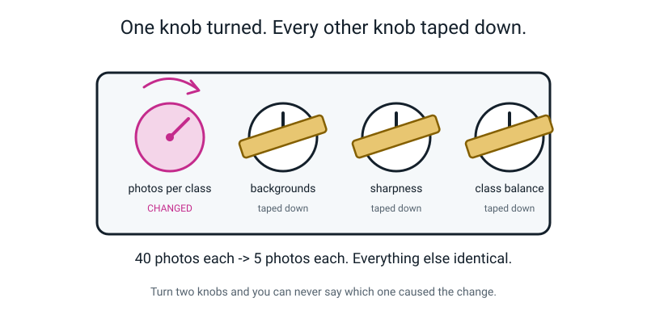
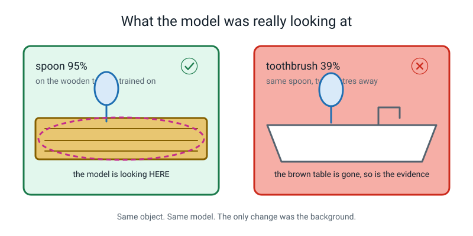
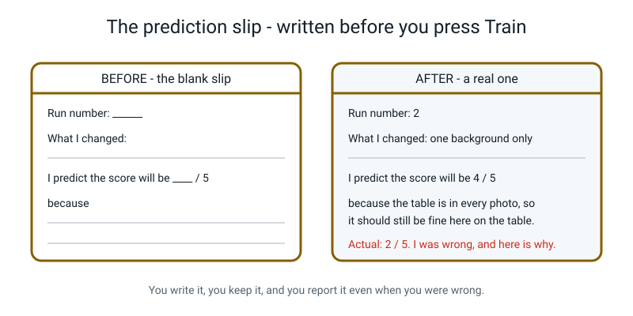
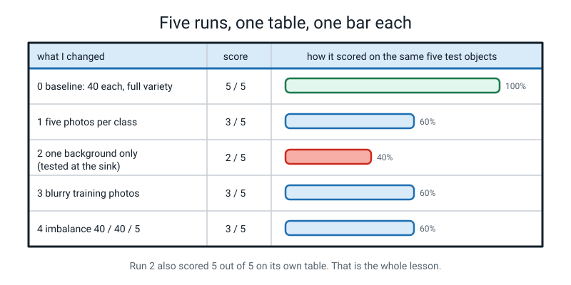
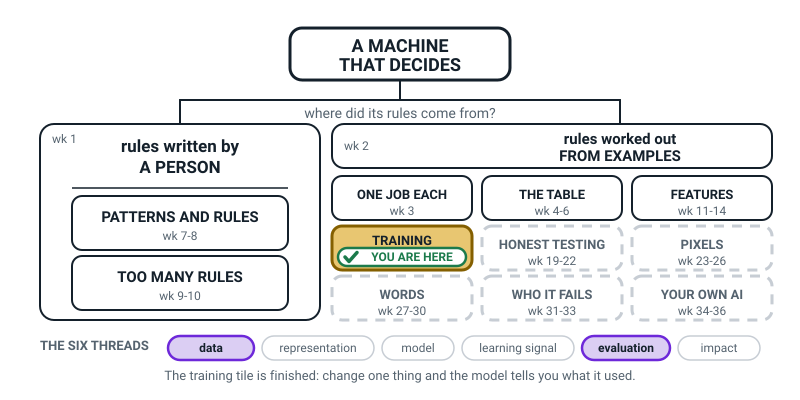
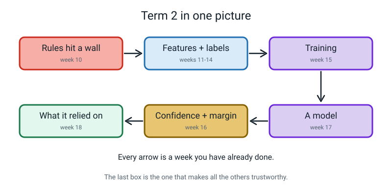

# Week 18 — Term 2 Checkpoint: Break Your Own Model on Purpose

[⬅ Week 17](week-17.md) · [Course Home](../README.md) · [Week 19 ➡](week-19.md) · [Student Guide](../student-guide/week-18.md) · [Workbook](../workbook/week-18.md)

---

## 📋 At a Glance

This table is the lesson on one page. Read it first.

| | |
|---|---|
| **Duration** | 70 minutes (this one is tight — the 60-minute cut is in §Differentiation) |
| **Type** | 🟪 review — term checkpoint: a hands-on lab, then the Term 2 quiz |
| **Big idea** | Change exactly **one** thing at a time and the model will tell you precisely what it had been relying on. |
| **New vocabulary** | controlled experiment · sabotage test |
| **Materials** | Laptop · `baseline-v1.tm` · the three objects · the fork · Handout 18A (five-row results table) · Handout 18B (four prediction slips) · the 14-question Term 2 quiz · Week 17's baseline table |
| **Tech needed** | Browser · Teachable Machine · webcam or photo files · the extra photos (see Prep) |
| **Prep time** | 20 minutes the night before — the longest prep of the term, and it earns its keep |

> **⚠️ Watch out:** Four retrains in twenty minutes is genuinely brisk. The single biggest time saver
> is having the *sabotage photo sets ready before the lesson starts*. Read the Prep Checklist
> properly — it is the difference between a lesson that lands and a lesson that runs out of clock at
> experiment 2.

---

## 🎯 Lesson Objectives

By the end of the lesson the student can, observably:

1. **Design a controlled experiment** — change one variable, hold everything else fixed — and say
   which things they are holding fixed and why.
2. **Predict a result in writing before running it**, and report the outcome either way, including
   when the prediction was wrong.
3. **Explain a drop in performance** by pointing at the specific change in the data that caused it —
   not "it got worse", but "the margin fell from 86 to 41 because…".
4. **Recall and use the Term 2 vocabulary** — features, labels, baseline, training, confidence —
   without notes.

---

## 🧑‍🏫 What YOU Need to Know First

*Twelve minutes. Sections 1, 3 and 5 are the ones you cannot teach without.*

### 1. What a controlled experiment actually is

> **Controlled experiment** — you change exactly one thing and keep everything else the same, so that
> anything that changes was most likely caused by the one thing you changed (training wobbles a point or two by chance).

That last clause is the whole idea, and it is worth being precise about it, because it is the most
transferable thing in this entire course.

Suppose you retrain the model with fewer photos **and** you also test it in a different room **and**
you hold the objects a bit closer. The score drops. Which of the three caused it? You cannot say.
Not "you're not sure" — you literally cannot say, and no amount of staring at the numbers will
help. The information is not there. The experiment is worthless.


*Figure 18.1 — One knob turned. Everything else taped down. That is the whole method.*

Hold these things fixed today, and say them out loud:

```text
   TAPED DOWN, every single run
   ─────────────────────────────────────────────────
   □  the same three objects
   □  the same five test items, in the same order
   □  the same room, the same spot, the same light
   □  the same distance from the camera
   □  the same person holding them
   □  read the numbers the same way (freeze, count 2, read)
```

An 11-year-old will find "the same order" fussy. It is not. If you always test the spoon first while
your hand is steady and the comb last while you are bored, you have added a variable.

### 2. What a sabotage test is, and why it isn't vandalism

> **Sabotage test** — deliberately damaging your training data to find out what the model had been
> depending on.

This feels backwards. You spent last week building something and today you break it four times. Say
this to the student directly, because they will feel the resistance:

> "You cannot just read the answer off the numbers inside a model. So one reliable way to find out what it was using is to
> take something away and see what falls over. If you remove the variety and it collapses, it was
> using the variety. That's not vandalism, it's a real diagnostic tool."

This is a genuine professional technique. Its grown-up name is an **ablation study**, and researchers
run them constantly for exactly this reason. You can mention the name if you like; don't dwell.

### 3. The four sabotages, and what each one suggests

| # | Sabotage | What you expect | What it suggests |
|:--:|---|---|---|
| 1 | **5 photos per class** instead of 40 | Still mostly right, but every margin collapses | Too few examples produces *unstable* answers before it produces *wrong* ones |
| 2 | **One background only** | Brilliant on that background, broken two metres away | The model never saw the background change, so a new background throws it off |
| 3 | **Blurry photos** | Still right, margins way down | Blur may be hiding edges, a useful signal in a small-object photo (a likely but untested explanation) |
| 4 | **40 / 40 / 5 imbalance** | The small class almost never gets predicted | Training reduces *total* mistakes, so it abandons the cheap class |

**Experiment 2 is the moment of the term.** Everything else is a supporting act. Here is why it
matters so much:

When you retrain on photos taken only on the wooden table, and then test on the wooden table, the
model scores **higher than the baseline** — 95% versus 91%. It looks like your best model yet. Then
you carry the same spoon two metres to the sink and it says "toothbrush, 39%."


*Figure 18.2 — 95% on its own table. Wrong at the sink. Same object, same model, different background.*

**And notice the trap, because it is the trap this entire course exists to prevent:** if you had only
ever tested where you trained, you would have concluded that the single-background model was
*better*. A higher number, honestly measured, pointing entirely the wrong way.

That trap has a name and Weeks 19 to 22 are about nothing else. Do not name it today. Let the student
feel it first.

### 4. The wolves-and-snow story, for the hook

In 2016 three researchers built a picture classifier on purpose to be bad, and didn't tell anyone.

It told huskies from wolves. It mostly worked.

This is the Ribeiro, Singh and Guestrin 2016 "Why
Should I Trust You?" (LIME) paper. As I recall (not re-checked; do not quote numbers), the training set was small and hand-picked. The
audience was about 27 graduate students on a survey, and only a minority trusted the biased model
before seeing explanations.

Then an explanation tool showed the trick. **The wolf photos in the training set had snow in the
background; the husky photos did not.** The model had learned very little about wolves. It had
mostly learned: *white fuzzy stuff at the bottom of the picture → say wolf.* Photograph a husky in
snow and it is likely to say wolf, and sound sure of itself.

Nobody wrote that rule. Nobody wanted it. **The model learns the easiest pattern that separates your
classes, not the pattern you meant.**

Experiment 2 today is a close cousin of that story, shown in your own
kitchen, in about ten minutes.

### 5. Why the prediction must be written down first

Before every retrain, the student writes what they think will happen. This is not a warm-up ritual.
It exists for one reason:

**Human memory rewrites itself.** After you see a result, you genuinely, sincerely remember having
expected it. Everybody does this; it is not dishonesty. The only defence is ink.


*Figure 18.3 — Written before. Reported after. Including the ones that were wrong.*

**And a wrong prediction is worth more than a right one.** A student who writes "I predict 4/5"
and gets 2/5 has learned something the model just taught them. A student who predicts nothing has
watched a number appear on a screen. Say this out loud, and mean it, and mark accordingly.

### 6. Reading the results table


*Figure 18.4 — Five runs. Read down the margin, not the score.*

The habit to build: **the margin moves before the verdict does.** In experiments 1 and 3 the model is
still getting the answers right while its margins quietly fall apart. Right-or-wrong is a blunt
instrument — with five test items it has only six possible values (0 to 5), so it cannot register
anything finer. The margin is continuous and keeps reporting.

### 7. The two misconceptions you will meet today

**Misconception 1 — "we should fix it by pressing Train again."**
Retraining on the same photos gives you essentially the same model. There is a little randomness in
training so the numbers wobble slightly, and that wobble is very tempting to read as improvement. It
isn't. **You cannot fix a model. You can only change the ingredients and bake a new one.**

**Misconception 2 — "a higher score means a better model."**
Experiment 2 kills this one, which is exactly why it's in the lesson. 95% on its own table is a
*worse* model than 91% across five backgrounds. The number was honestly measured and it points the
wrong way, because of *where* it was measured.

### 8. How deep to go, and where to stop

| Go this deep | Stop before |
|---|---|
| One variable at a time | Control groups, randomisation, statistical significance |
| Sabotage reveals dependence | The word "ablation" beyond a passing mention |
| Higher score ≠ better model | The words "overfitting" and "test set" — those are Weeks 19–21 |
| Blur destroys edges | What an edge actually is numerically — that's Week 25 |

> **⚠️ Watch out:** the temptation today is to explain overfitting, because it is right there and you
> can feel it. **Don't.** Week 21 is built on the student having *already felt this* and not yet had a
> word for it. Giving them the word now costs you the best lesson of Term 3.

---

### 🧭 The Growing Map

**TRAINING** is tinted for the last time today, and the threads have shifted to **data** and
**evaluation**. Nothing new was built this lesson; the ingredients were changed and the consequences
measured. That is the honest description of a sabotage lab.



*Figure 18.0 — Week 18's version. TRAINING tinted and badged for the final week, with **data** and
**evaluation** lit along the bottom.*

**What to do with it, in about two minutes at the end of the lesson:**

1. **Show it and ask:** *"which bit did we do today — we didn't make a new model, so why is TRAINING
   still the shaded box?"* The answer you want: *"we retrained it four times with different photos."*
   Every experiment today was a training run. Breaking it is part of building it.
2. **Then the better question:** *"why is HONEST TESTING still dashed, when we spent all lesson finding
   out how bad our models were?"* Because every score today came from photos they had chosen and seen.
   They compared models to each other, never to anything held back. Leave that sitting there; Week 19
   opens with it.
3. **Have them shade TRAINING for the last time** and write next to it the sentence *"my model was using
   \_\_\_ instead of \_\_\_"* — or, if they found nothing, *"nothing found, here is how I looked"*. Both
   are legitimate, and writing the second one honestly is the harder skill.

> **🧑‍🏫 Why this is worth two minutes.** Today can feel to a student like an afternoon of deliberately
> making things worse, which is not obviously progress. The map reframes it: the TRAINING box is now
> *finished*, and it took two weeks — one to build, one to find out what the build was standing on. That
> is also the moment to point right along the middle row at Weeks 19 to 22 and say "and now we measure it
> properly", because Term 2 ends here.

**The six threads** along the bottom are the spine of all four levels. **Data** and **evaluation** are
lit this week. Do not quiz them on the threads; the map is orientation, never assessment.

---

## 🧰 Prep Checklist

Use this list to get ready.

### 20 minutes the night before

- [ ] **Confirm `baseline-v1.tm` exists.** Open Teachable Machine → ☰ → **Open project from file** →
      pick it. Check it loads and the classes are named. If it is gone, rebuild it tonight; today's
      lesson is entirely a comparison against it.
- [ ] **Prepare the sabotage photo sets — this is the big one.** Two of the four experiments need
      *new* photos:
      - **Experiment 2** needs ~15 photos per class taken all on **one surface, one light**.
      - **Experiment 3** needs ~15 photos per class taken **while waving the object** so they blur.
      Twelve minutes with a phone. If the student shot them as their optional extra last week,
      brilliant — check they exist. If not, shoot them yourself tonight.
      *(Experiments 1 and 4 need no new photos — they are done by deleting samples.)*
- [ ] **Choose the second test location** for experiment 2. Visibly different from where the training
      photos were taken. A sink, a windowsill, a dark carpet. Walk there once and check the light.
- [ ] **Choose the five test items and write them on the board.** They are used identically in all
      five runs. Suggested: spoon, toothbrush, comb, fork, empty hand.
- [ ] **Print:** Handout 18A (five-row results table), Handout 18B (four prediction slips), and the
      14-question Term 2 quiz.
- [ ] **Have Week 17's baseline table on the table.** Row 0 is copied from it, not re-measured.
- [ ] **Read the quiz answers (§K5)** so you can mark it live without stopping to think.

### 5 minutes on the day

- [ ] Laptop plugged in, all other tabs and apps closed, camera free
- [ ] `baseline-v1.tm` already loaded in the tab
- [ ] Photo sets in clearly-named folders: `sabotage-one-background`, `sabotage-blurry`
- [ ] Five test items lined up on the table in the fixed order
- [ ] Week 17 baseline table, Handouts 18A and 18B, the quiz, a pencil

### If something fails

| What fails | Fallback |
|---|---|
| **`baseline-v1.tm` is gone** | Rebuild it in 15 minutes (photos are already sorted), or use the sample baseline in §K1 as row 0 and run only experiments 1 and 4, which need no new photos. |
| **No time for four experiments** | Run **1 and 2** only. Experiment 2 is compulsory — it is the point of the week. Move 3 and 4 to homework as a written prediction with no retrain. |
| **The sabotage photos don't exist** | Do experiments **1 and 4** in class (both are done by deleting samples, no new photos needed) and set experiment 2 as a homework build. Say plainly that you didn't prep it — modelling honesty is on-topic. |
| **The quiz won't fit in the time** | Do the lab. Mark the quiz at the start of Week 19 as the warm-up. Never cut the lab to fit the quiz — the lab is the assessment that matters. |
| **The model won't retrain / tab crashes** | Reduce every class to 20 samples and retrain. The absolute numbers get worse; the *comparison* still works, which is all today needs. |

---

## ⏱️ The Lesson, Minute by Minute

This section is the plan for the whole lesson, one segment at a time.

| Minutes | Segment | What happens |
|---|---|---|
| 0 – 8 | 🪝 **Hook** — the wolves that were made of snow | The story, and the question it leaves |
| 8 – 26 | 🧠 **Concept** — one knob turned, everything else taped | Controlled experiment + sabotage test, built on the board |
| 26 – 40 | 🔍 **Worked Example** — experiment 1 together | Predict, retrain, test, explain — the full loop once |
| 40 – 60 | 🎲 **Activity** — Sabotage Lab: experiments 2, 3, 4 | Three more runs, three more predictions |
| 60 – 70 | 🔑 **Wrap & Assign** — the Term 2 quiz, marked together | Week numbers in the margin beside every miss |

> **⏰ Timing reality check:** the quiz is 14 questions and will not fit properly into ten minutes if
> you also want to mark it together. Two honest options: (a) run the lesson at 75 minutes, or (b) do
> the quiz at the start of Week 19 as a warm-up. Both are fine. What is not fine is rushing the lab.

---

### 🪝 Hook — 8 minutes

**Say this:**

> "In 2016, three researchers built a picture classifier on purpose to be bad — and then they didn't
> tell anyone."
>
> "Their model told huskies apart from wolves. And it mostly worked. It got most of its test photos
> right. They showed it to some people who study machine learning, and asked: do you trust this
> model? Some of them said yes."
>
> "Then a tool that shows what a model is looking at revealed the trick. **The wolf photos in their
> training set had snow in the background. The husky photos did not.**"
>
> *(Pause. Let it land. Then, quietly:)*
>
> "The model had learned very little about wolves. It had mostly learned: white fuzzy stuff at the
> bottom of the picture, say wolf. Photograph a husky standing in snow and it is likely to say wolf,
> and sound sure about it."
>
> "Nobody wrote that rule. Nobody wanted it. It came from the photos. And here is the thing that
> should worry you: **it worked.** It passed. A good score hid the problem. You can't just read the
> answer off the numbers inside a model."
>
> "So today you're going to find out what *your* model is really looking at. And one reliable way to do
> that is to break it."

**Do this:**

Draw two boxes on the board — a wolf in snow, a husky on grass. Then draw a third: a husky in snow,
with a big label `MODEL SAYS: WOLF`. Stick figures are fine.

Leave this question on the board for the whole lesson:

```text
   WHAT IS MY MODEL REALLY LOOKING AT?
```

**Ask this:**

> **1. "How would you find the snow, if nobody had told you?"**
> - *Hoping for:* show it a husky in snow, or a wolf not in snow — i.e. change one thing and see.
>   That IS today's method and it is worth naming: "you just invented the whole lesson."
> - *If they say "look inside the model":* a natural answer. "You can't just read it off the numbers
>   — researchers have special explanation tools, but they are hard to use. One reliable way is to poke it from the outside."
> - *If they're stuck:* "You've got a photo of a husky and a bucket of snow. What would you do?"

> **2. "Do you think YOUR model has a snow?"**
> - *Hoping for:* a guess. Any guess. Write it on the board and come back to it at minute 68.
> - *If they say "no, mine's good":* excellent — write that down, word for word, and initial it. It is
>   the best possible setup for experiment 2.

---

### 🧠 Concept — 18 minutes

**Say this (part 1 — the controlled experiment):**

> "Here's the method, and it's the most useful thing you'll learn all year — not just for AI, for
> anything."
>
> "Imagine my model is a machine with four knobs on it. How many photos per class. How many
> backgrounds. How sharp the photos are. Whether the classes are balanced."
>
> *(Draw four circles on the board as you say them.)*
>
> "If I turn one knob and the model gets worse, I know exactly what did it. If I turn three knobs and
> it gets worse — how much did each one contribute?"
>
> *(Wait. Let them try. The answer is: you cannot possibly know.)*
>
> "You can't know. Not 'you're not sure' — you literally cannot find out, ever, from that experiment.
> The information isn't there. So: **one knob. Everything else taped down.** That's called a
> **controlled experiment**, and that's what you're going to do four times today."

**Do this:**

Draw the tape across the other three knobs. Then write this taped-down list on the board and read it
out, item by item, pointing at each:

```text
   TAPED DOWN, every run:
      same 3 objects
      same 5 test items, same order
      same room, same spot, same light
      same distance
      same person holding
```

**Say this (part 2 — the sabotage test):**

> "Now the strange part. Today we're not going to make the model better. We're going to make it
> **worse**, four times, on purpose."
>
> "That sounds mad, so here's why. You cannot just read the answer off the numbers inside a model — not me, not Google,
> not anyone. So one reliable way to find out what it was using is to **take something away and see what
> falls over.** If I take away the variety and it collapses, it was using the variety. That's called a
> **sabotage test**, and a version of it is a real technique that researchers use (grown-ups call it an ablation study), for exactly this reason."

Write both definitions on the board. Leave them up.

**Ask this:**

> **1. "Why can't I just change two things at once to save time?"**
> - *Hoping for:* because you wouldn't know which one caused it.
> - *If they say "it would take too long":* redirect to the four-knobs picture. "Say I turn two and it
>   gets worse. Which one? Point at it."
> - *Extension if they get it fast:* "When would a scientist deliberately change two things at once?"
>   *(Answer: to see whether two things together do something neither does alone. That's a real and
>   more advanced design — and it needs the one-at-a-time results first.)*

> **2. "Which of these four sabotages do you think will hurt the most?"**
> - *Hoping for:* a prediction, written on the board, initialled. Any answer.
> - Many students say "five photos". That is often not the worst — experiment 2 can hurt more, and in a
>   nastier way, because it *looks* like an improvement. Do not tell them. Write their answer down and
>   point at it at minute 58.

> **3. "What are we going to compare all of this against?"**
> - *Hoping for:* last week's baseline table.
> - *If they say "each other":* half right. "Compared with each other, all four are bad. Compared with
>   what?" You want the word **baseline**, from Week 12, out of their mouth.

---

### 🔍 Worked Example Together — 14 minutes

**Experiment 1: five photos per class.** You drive the structure, they drive the mouse.

**Step 1 — copy row 0 (2 min).** Open Handout 18A. Copy the baseline result across from last week's
table. Do **not** re-measure it — re-measuring would change a variable. The baseline row reads:

```text
   row 0  |  baseline: 40 each, full variety  |  3 / 3 real objects correct  |  margins 86, 82, 66
```

**Step 2 — the prediction slip (3 min).** Hand them prediction slip 1. Say:

> "Before you touch anything. Five photos per class instead of forty. Write what you think the score
> will be out of five, and write **why**. The 'why' is the bit I'm marking."

Wait. Count to fifteen. Do not help. When it's written, read it back to them once and move on
**without saying whether you agree**.

**Step 3 — sabotage and retrain (4 min).** In Teachable Machine, delete samples from each class until
each has exactly 5. *(Click into the class, use the ⋮ on individual samples, or Remove All Samples and
re-add five.)* Check all three counts read 5. Then **Train Model** — this one takes about six seconds.

**Step 4 — test the five items, same order (4 min).** Same spot, same light, same distance. Record
the top score and the margin for each of the five. Then the score out of five.

**Step 5 — explain it (1 min).** This is the part that earns the marks. Not "it got worse." Say:

> "Give me the sentence in this shape: **the margin fell from ___ to ___ because ___.**"

**Model result and model explanation.** The first sabotage row reads:

```text
   row 1  |  5 photos per class  |  2 / 3 real objects correct  |  margins 41, 14, 7
```

> "The margins fell from 86, 82 and 66 down to 41, 14 and 7 — every single one collapsed. It still got
> two of the three real objects right, so if I only looked at the score I'd think it was only a bit worse. But
> with five photos it saw almost no variety, so the pattern it found is thin and fragile. **Too few
> examples doesn't make the answers wrong so much as unstable** — and unstable answers become wrong
> answers the moment anything shifts."

**Ask this:**

> **1. "Was your prediction right?"**
> - Whatever the answer: say "good" and mean it. Then: "what would you predict differently next time,
>   and why?" A wrong prediction that gets updated is the best possible outcome.
> - *If they try to change what they wrote:* don't allow it, warmly. "No — the whole point is that it's
>   in ink. That's what makes it worth something."

> **2. "It got 2 of 3 real objects, and the baseline got 3 of 3. Is 'one fewer' the whole story?"**
> - *Hoping for:* no — the margins collapsed much more dramatically than the score did.
> - *If they say yes:* put the two margin rows side by side and read them out. 86 → 41. 82 → 14. Then
>   ask again.

> **3. "Now reload the good model. Why?"**
> - *Hoping for:* because every experiment must start from the same place, or you've turned two knobs.
> - Then actually do it: ☰ → Open project from file → `baseline-v1.tm`. **Do this after every single
>   experiment.** It is the most-forgotten step of the lesson.

---

### 🎲 Activity — 20 minutes

**Sabotage Lab, experiments 2, 3 and 4.** Full instructions in the next section.

---

### 🔑 Wrap & Assign — 10 minutes

**The Term 2 quiz, marked together.** 14 questions, answers in §K5.

**Do this:**

1. They answer all 14 with the notebook closed. About 6 minutes.
2. Mark it **together, out loud, immediately.** Not later, alone, in red pen.
3. For every wrong answer, ask: **"which week does this belong to?"** Write the week number in the
   margin.
4. At the end, read out the list of week numbers. That list is the entire output of a checkpoint.

**There is no grade. Do not give a grade.** The output of a checkpoint is a list of weeks to revisit,
not a number. (Orientation §7.)

Then close the loop on the hook:

> "At the start I asked whether your model had a snow. Look at your table. Did it?"


*Figure 18.5 — Term 2, end to end. Every arrow is a week they have already done.*

Put this map up and walk it left to right, then back along the bottom, naming the weeks. Then:

> "That last box — 'what it was actually relying on' — is the one that makes all the others worth
> anything. Anyone can build a model. You can now tell me what yours is looking at."

---

## 🎲 The Activity, In Full

This section gives the full instructions for the Sabotage Lab.

### Sabotage Lab

**Time:** 20 minutes (about 6–7 minutes per experiment)
**Materials:** laptop with `baseline-v1.tm` · the two prepared photo sets · the five test items ·
Handout 18A · prediction slips 2, 3 and 4
**Setup:** baseline reloaded, five test items in a fixed order on the table, results table open.

### The loop — identical for every experiment

Run these seven steps, in this order, for every experiment:

```text
   ┌─────────────────────────────────────────────────────────────┐
   │  1. PREDICT   write the slip. Score out of 5, and WHY.      │
   │  2. SABOTAGE  change ONE thing in the photos.               │
   │  3. RETRAIN   press Train Model. 6–20 seconds.              │
   │  4. TEST      the same five items, same order, same spot.   │
   │  5. RECORD    top score and margin for each. Score /5.      │
   │  6. EXPLAIN   "the margin fell from ___ to ___ because ___" │
   │  7. RELOAD    baseline-v1.tm, before you touch anything     │
   └─────────────────────────────────────────────────────────────┘
```

Step 7 is the one that gets forgotten and it ruins the next experiment. Say it every time.

### Experiment 2 — one background only  ⭐ *the one that matters*

**The sabotage:** replace all the photos with the `sabotage-one-background` set — every photo on the
same surface, in the same light.

**The extra step that makes this experiment special:** test **twice**.

The two tests are:

```text
   Test A:  on the SAME surface the photos were taken on
   Test B:  somewhere completely different (the sink, the windowsill)
```

Record both.

**What will probably happen (results vary; the numbers in this guide are illustrative, not measured on your class):** Test A scores *higher than the baseline*. Test B falls apart. If experiment 2 does not break on your model (a pretrained base can be forgiving), do not hide it: record it as a finding, and try a harder test surface or fewer photos before drawing any conclusion.

| test | spoon | toothbrush | comb | predicted | true | margin |
|---|:--:|:--:|:--:|---|---|:--:|
| spoon, on the wooden table | **95** | 3 | 2 | spoon | spoon ✓ | 92 |
| spoon, over the white sink | 34 | **39** | 27 | toothbrush | spoon ✗ | 5 |

**How to run the reveal.** Do Test A first. Let them enjoy it — 95% is better than the baseline's
91% and they will notice. Say nothing. Let them write "this is my best model" if they want to.

Then hand them the same spoon and say: *"bring it to the sink."* Walk there together. Hold it up.

Then, and only then, ask:

> **"Which model is better — the 91% one or the 95% one?"**

- *Hoping for:* the 91% one, because the 95% only works in one place.
- *If they say "the 95%":* don't correct — ask "where?" The word "where" does the work.
- *Then the killer follow-up:* **"If you'd only ever tested on the table, what would you have
  concluded?"** They should say: that it was the better model. Let that sit. That is the whole of
  Term 3 in one sentence, arriving nine weeks early, felt rather than told.

**The explanation to draw out:** the wooden table appeared in every single training photo, so the model was
never shown that backgrounds can change, and it probably leaned on "warm brown texture in the
background" as well as on the spoon. (This one test does not isolate the cause; that is the likely
explanation.) Remove the table and a chunk of the evidence may vanish.

**It is a cousin of the husky
in the snow: there the snow went with one label, here the table goes with every label, but either way
the model was never shown that backgrounds vary.**

### Experiment 3 — blurry photos

**The sabotage:** load the `sabotage-blurry` set — same variety, same counts, but shot while waving
the object.

**Test with the objects held perfectly still and sharp.**

**Expected result:** still mostly correct, margins down hard (86 → 34, 66 → 12).

**The likely explanation (untested):** blur hides edges, and edges are a useful signal in a photo of a small
object. Feeding blurry photos is like learning to recognise faces from out-of-focus pictures —
you'd manage, badly.

**The subtle bit worth raising if there's time:** this model was trained blurry and tested sharp, and
it *still* struggled. This hints that a mismatch can hurt.

We did not test the reverse direction, but a model trained only on perfect studio photos may
well struggle with the wobbly ones real people take. **Your training photos should look like the photos the
model will actually meet.**

### Experiment 4 — imbalance, 40 / 40 / 5

**The sabotage:** reload the baseline, then delete comb photos until only **5** remain. Leave spoon
and toothbrush at 40. Check the counts read 40 / 40 / 5 before training.

**Expected result:**

| test | spoon | toothbrush | comb | predicted | true |
|---|:--:|:--:|:--:|---|---|
| hold a spoon | **93** | 5 | 2 | spoon | spoon ✓ |
| hold a toothbrush | 7 | **90** | 3 | toothbrush | toothbrush ✓ |
| hold a comb | 12 | **77** | 11 | toothbrush | comb ✗ |

Point at the comb row: **the model gives the comb class 11 points out of 100 while staring straight
at a comb.** It has essentially stopped believing combs exist.

Then do the arithmetic, which they did in Week 16 and can now see happening:

```text
   photos:  40 + 40 + 5  =  85
   a model that never says "comb" gets  40 + 40 + 0  =  80 correct
   80 ÷ 85  =  0.941…  ≈  94.1%
```

94% accurate and blind to a third of its job.

### What "finished" looks like

- [ ] Five rows in Handout 18A, each with score out of 5 and the three margins
- [ ] Experiment 2 has **two** entries — on the surface and off it
- [ ] Four completed prediction slips, including at least one honest "I was wrong"
- [ ] One written explanation per row in the *"the margin fell from ___ to ___ because ___"* shape
- [ ] The student able to name, out loud, which experiment hurt most and why

### Variation — easier

Run **two** experiments: 1 (five photos) and 2 (one background). Experiment 2 is compulsory. Use
three test items instead of five. Fill the results table with the top score only and add margins for
experiment 2 alone. You read the screen, they write.

Cut the quiz to eight questions: 1, 3, 4, 6, 8, 10, 12, 14.

### Variation — harder

1. **Invent a fifth sabotage.** Not one of the four. Ideas real learners have used: photograph one
   class only at night; mislabel five photos on purpose; put your own face in every photo of one
   class; photograph one class through a window. **Prediction first**, then run it, then report —
   including an honest "I was wrong because…".
2. **Rank the four sabotages by damage** and defend the ranking. Then ask the harder question: *"by
   damage to what — the score, or the margins?"* They rank differently, and noticing that is the
   strong answer.
3. **Price the fix.** For each broken model, how many photos of what kind would repair it? "About 60
   more photos, 20 each on carpet, sink and bed" is a professional answer. "More photos" is not.

---

## ❓ Questions Students Ask This Week

Use these answers when the student asks one of these questions.

**1. "Why are we breaking it? We just made it."**
Because you can't just read the answer off the numbers inside a model — not even the people who built Teachable Machine can.
One reliable way to find out what it was using is to take something away and see what falls over. If you
remove the variety and it collapses, it was using the variety. Breaking it on purpose is a simple,
reliable diagnostic tool.

**2. "Can I put it back to how it was?"**
Yes — that's exactly what `baseline-v1.tm` is for, and it's why we saved it. Reload it after every
experiment. You can't repair a damaged model, but you can always go back to the saved one. That's
also why we never overwrite the file.

**3. "The one-background model scored higher. Isn't that better?"**
Better *where*? It's better on that one table and much worse everywhere else.

This is the most
important question anyone asks this week and the answer is: **a score means nothing until you know
where it was measured.** Hold onto that thought — it's the whole of next term.

**4. "Why does it still get some right with only five photos?"**
Because five photos is more than zero, and it's still doing much better than the 33% you'd get by
guessing blind with three classes. But look at *how* it's getting them right — margins of 7 and 14.
It's getting them right by a hair. Move the object slightly and those flip.

**5. "Could I sabotage it in a way that makes it BETTER?"**
Not by damaging the data, no. But you've spotted something real: there is a technique where people
deliberately mess photos about — rotating, darkening, cropping them — to give the model *more
variety* from the same photos. That's adding variety, not removing it, and it does help. It's called
augmentation and you meet it in a later level.

**6. "How do real companies find their snow?"**
Some of them don't, and that's how you get news stories. The good ones do roughly what you did today:
test on data from somewhere different, deliberately split their results by group, and run sabotage
tests. You'll do the full grown-up version of this in Week 33 when you audit your own model.

**7. "How many photos is enough?"**
**Nobody knows for sure, and here's why:** it depends completely on how similar your classes are, how
varied your photos are, and how good the pre-trained model underneath happens to be at your
particular objects. There is no number anybody can give you. What you *can* do is exactly what you
did today — try 5, try 40, and watch what happens to the margins. That's not a workaround for not
knowing the answer; **measuring it is the answer.** Professionals do the same thing with bigger
numbers.

**8. "If the model can't explain itself, how do we ever trust it?"**
We don't trust it because it explained itself — we trust it because we tested it in enough different
situations that we know where it works and where it doesn't. That's a completely different kind of
trust, and honestly it's the more useful one. It's the difference between someone telling you they're
reliable and you having watched them be reliable.

---

## ⚠️ Where This Lesson Goes Wrong

This table lists the usual problems, why they happen and what to do.

| What happens | Why | What to do right now |
|---|---|---|
| **The baseline isn't reloaded between experiments** | It's an invisible step with no button of its own, and the tab looks fine. | Say it out loud every single time, as step 7. If you catch it late, that experiment is void — redo it. Do not quietly keep the number. |
| **The test conditions drift** — different spot, closer, different light | Twenty minutes of standing up and sitting down. Nobody drifts on purpose. | Mark the spot with tape on the floor or a book on the table. Test the five items in the same order every run, out loud: "spoon, toothbrush, comb, fork, hand." |
| **The prediction gets written after the result** | Genuinely honest self-deception — you really do remember having expected it. | Slip goes in your hand, face down, before the retrain. If it's blank when they've seen the result, that experiment gets no prediction. Say why, kindly. |
| **"It got worse" is the whole explanation** | Explaining is much harder than observing, and the result feels self-evident. | Refuse it. Give them the sentence frame every time: *"the margin fell from ___ to ___ because ___."* Fill in the first two together and make them do the third. |
| **The one-background model scores 95% and they declare victory** | It genuinely is a higher number and they measured it honestly. | Do not argue. Just say "bring it to the sink" and walk there. The room does the teaching. |
| **Time runs out at experiment 2** | Four retrains in twenty minutes is genuinely tight. | Stop at 2. It is the important one. Set 3 and 4 as written predictions for homework with no retrain, and run them as a Week 19 warm-up. |
| **The quiz eats the lab** | The quiz feels like the "real" assessment because it looks like a test. | It isn't. Move the quiz to the start of Week 19 without hesitation. The five-row table is the assessment that matters. |
| **The student is upset at wrecking their model** | They were proud of it last week and this feels like a punishment. | Take it seriously, don't tease. "The saved file is safe — we're making copies and wrecking the copies. And you'll rebuild a better one in Week 22 knowing all this." |
| **Every experiment gives 5/5 and nothing breaks** | The three objects are too easy to tell apart (a shoe, a banana, a laptop). | Read the *margins*, not the scores — they will have moved even if the verdicts didn't. Then note it honestly and use harder objects for the capstone. |

---

## 🧭 Differentiation

Use this section to make the lesson easier or harder for the student in front of you.

### If they are struggling

**Cut:** experiments 3 and 4; the second test in experiment 2 stays (it is the lesson); the quiz down
to eight questions; the margin column on all rows except experiment 2.

**Reteach the controlled experiment away from the laptop.** Two paper cups, one with a hole in the
bottom. "Why did this one empty faster? Because of the hole? Because I filled it less? Because I held
it higher?" Then do it properly, changing one thing. Three minutes, no computer, and the idea is
identical.

**The 60-minute version:** Hook 5 · Concept 14 · Worked example 13 · Activity 18 (experiments 1 and 2
only) · Wrap 10 with no quiz. Move the quiz to Week 19.

**Keep, whatever else goes:** experiment 2, both tests, and the question *"if you'd only tested on the
table, what would you have concluded?"*

### If they are flying

1. **The fifth sabotage** (see §Variation — harder). The best extension of the term.
2. **Two knobs at once, deliberately.** Run 5-photos-AND-one-background together. Ask: *"can you work
   out how much each one contributed?"* The honest answer is no — and having tried it is worth more
   than being told.
3. **Predict experiment 4 from Week 16's arithmetic alone.** Before running it: "40 / 40 / 5. What
   accuracy does a model get if it never says comb? Show the division." They should get 80 ÷ 85 =
   94.1%. Then run it and check the comb row.
4. **The recovery experiment.** "Take the one-background model and add just 10 photos per class from a
   second background. Predict what happens, then measure it." Expect (but do not promise) that a *small* amount of
   variety fixes a surprising amount; this has not been measured here, so treat the result as theirs to discover.

### If they won't engage today

**Plan A — let them choose the sabotage.** Any sabotage, however silly. Photograph everything upside
down. Photograph it all through a glass. Their idea, their prediction, their result. The method is
what matters, not which four you run.

**Plan B — you be wrong.** Announce loudly that you think experiment 2 will barely matter and the
model will be basically fine at the sink. Be confident about it. Then be wrong in front of them.
Being right when the adult was wrong is powerful fuel.

**Plan C — the five-minute floor.** Run experiment 2 only. One prediction, one sabotage, two tests,
one sentence. That single experiment carries the entire week's big idea. Then stop, and move the quiz
to Week 19.

---

## ✅ Assessing Understanding

Use these checks to see what the student understood. They are not a grade.

### Check 1 — the method

> **"Why did we only change one thing at a time?"**

- **Good:** "So we know which change caused the difference." Bonus if they add "otherwise you can't
  tell which one did it."
- **Partial:** "To be fair." Push once: "fair to what? What would go wrong if I changed two?"
- **Not good enough:** "Because you told me to." Reteach with the four knobs, right now, in 60
  seconds.

### Check 2 — the explanation

> **"Point at row 2 and tell me why it broke."**

- **Good:** something naming the mechanism — "every photo had the table in it, so the model was using
  the table, so when the table went away it had nothing left."
- **Partial:** "Because it was only on one background." That's the *change*, not the *reason*. Ask:
  "and why does that matter?"
- **Not good enough:** "It got worse." Refuse it, hand back the sentence frame.

### Check 3 — the vocabulary, no notes

> **"Give me one sentence each for: feature, label, baseline, training, confidence."**

Notebooks closed. Targets:

| Term | Good answer |
|---|---|
| **feature** | One measured description of one example. One column. |
| **label** | The answer you want the machine to produce. The column you cover up. |
| **baseline** | The score you'd get by guessing the most common answer — what you compare against. |
| **training** | The one-off process where the machine studies labelled examples and tunes itself. |
| **confidence** | How strongly the model prefers a class. Not the chance of being right. |

Three out of five without notes is a solid pass for a term checkpoint. Note the misses and reteach
them as Week 19 warm-ups.

### Mastery scale for this week

| Level | What it looks like |
|:--:|---|
| **1** | Follows instructions, records numbers. No predictions. Explains nothing. |
| **2** | Records score and margin. Writes predictions when handed a slip. "It got worse." |
| **3** | Runs a controlled experiment correctly, reloads the baseline unprompted, explains at least two rows by naming the data change. |
| **4** | Predicts before every run and reports honestly when wrong. Explains all five rows with mechanisms. Sees that experiment 2's higher score is worse news than a lower one. |
| **5** | Designs and runs a fifth sabotage of their own with a written prediction, and prices the fix in photos. Says out loud that the one-background model would have looked best if they'd only tested on the table. |

**Aim for 3.** Level 4 is an excellent end-of-Term-2 outcome and worth telling them so.

---

## 📤 Homework to Assign

This section says what to set, what to say, and how long each part takes.

**Workbook:** Week 18, the whole sheet. The **🛠️ Build It** section (Parts 1–3) is the core and takes
about 55 minutes; the rest (✅ Warm-Up, ✍️ Practice Sets A and B, 🧩 Puzzle of the Week, 🤔 Think Deeper,
🎨 Draw It, 📊 Self-Check) is about 60 minutes more, best spread over the week. Set Build It first.

**Say this, word for word:**

> "Two things. First, finish the five-row table properly — every row gets a written explanation, and
> every explanation has to say **whether your prediction was right**. If you were wrong, say so and
> say what you'd predict next time. I mean that: a wrong prediction you've thought about is worth
> more to me than a right one you got lucky on."
>
> "Second, the Term 2 reflection. Three things you can do now that you could not do in Week 10.
> Not 'I learned about AI' — three specific things, with an example of each. Something like 'I can
> work out a margin from three confidence scores' is what I'm after."
>
> "The rest of the sheet — the warm-up, the two practice sets, the puzzle, the two Think Deeper
> questions and the drawing — is for across the week. The Answers section at the back is folded away;
> do not open it until you have written your own."

**Check before they leave:** ask them to say aloud the explanation for row 1. That's step one.

| Workbook section | Task | Approx. time |
|---|---|---|
| ✅ Warm-Up (W1–W5) | Five questions on last week's model-building | 5 min |
| ✍️ Practice Set A (A1–A6) | Blanks, multiple choice, true/false, matching, label the four knobs, Term 2 vocabulary | 20 min |
| ✍️ Practice Set B (B1–B5) | Two "what would go wrong" cases, Term 2 review, two shapes of answer, design a fifth sabotage | 25 min |
| 🧩 Puzzle of the Week | Which sabotage damaged each of four models, with reasons, plus the bonus question | 10 min |
| 🤔 Think Deeper (T1–T2) | Two paragraphs on trust and on whose job it is to find the snow | 15 min |
| 🛠️ Build It, Part 1 | The five-row results table completed with score and margins | 15 min |
| 🛠️ Build It, Part 2 | One written explanation per row + prediction right/wrong | 25 min |
| 🛠️ Build It, Part 3 | Term 2 reflection: three things you can now do, plus the minute-one guess | 15 min |
| 🎨 Draw It | Same object twice: what the model was really looking at | 10 min |
| 📊 Self-Check | Tick the grid, list weeks to revisit, one question for next lesson | 5 min |

---

## 🔑 Answer Key

This section holds the model answers for the workbook, the lesson questions and the quiz. Keep it away from the student.

### K1 — Build It Parts 1 and 2: the five-row results table, model answers

The student's numbers will differ. **The shape is what matters.** Five test items: spoon, toothbrush,
comb, fork, empty hand. (The fork and hand are in no class, so a perfect score is 3 out of 5 unless
an `other` class exists — flag this if the student is confused about why 5/5 is impossible on some
runs. If they used three real objects only, scores are out of 3 and the pattern is identical.)

| # | what I changed | score | spoon margin | tbrush margin | comb margin | verdict |
|:--:|---|:--:|:--:|:--:|:--:|---|
| 0 | baseline: 40 each, full variety | 3/3 real | 86 | 82 | 66 | works |
| 1 | 5 photos per class | 2/3 real | 41 | 14 | 7 | fragile |
| 2 | one background — **on the table** | 3/3 real | 92 | 88 | 71 | looks great |
| 2 | one background — **at the sink** | 1/3 real | 5 | 11 | 9 | broken elsewhere |
| 3 | blurry training photos | 3/3 real | 34 | 29 | 12 | weakened |
| 4 | imbalance 40 / 40 / 5 | 2/3 real | 88 | 83 | *comb never predicted* | blind spot |

**Model explanations — full-credit answers, one per row:**

**Row 1 — five photos per class.**
> The margins fell from 86, 82 and 66 to 41, 14 and 7. It still got two of the three real objects
> right, so the score barely moved, but every margin collapsed. With five photos the model saw almost
> no variety — one or two angles, one background — so the pattern it found was thin. Too few examples
> doesn't produce wrong answers so much as **unstable** ones, and unstable answers become wrong ones
> the moment anything shifts. **My prediction was 3/3 and I was wrong** — I thought five photos would
> be plenty because five seems like a lot when you're looking at them. Next time I'd predict that the
> score holds up and the margins fall, because that's what actually happened.

**Row 2 — one background, tested on that background.**
> The margin went *up*, from 86 to 92 — better than the baseline. That's the surprising bit. Because
> every training photo had the wooden table in it, the table was in every class, so it may have
> helped the model feel sure, and when I test on the table everything looks familiar, so the model is more sure than ever.
> **My prediction was "about the same" and I was right, but for the wrong reason** — I thought it'd be
> fine because the objects hadn't changed, and actually it was fine because the *table* hadn't changed.

**Row 2 — one background, tested at the sink.**
> Same spoon, same model, two metres away, and the margin fell from 92 to 5 — a coin toss that landed
> wrong. The wooden table appeared in every single training photo, so the model was never shown that
> backgrounds change, and it probably leaned on "warm brown texture in the background". At the sink the table is gone
> and a big chunk of the evidence may go with it (my one test does not prove that). This is a cousin of the husky-in-the-snow story, in my kitchen.
> **If I'd only tested on the table I'd have said this was my best model.**

**Row 3 — blurry photos.**
> Still got all three right, but the margins fell from 86, 82 and 66 to 34, 29 and 12. Blur may be hiding
> edges, a useful signal in a photo of a small thin object (a likely explanation, not tested). The odd part is that I
> trained it on blurry photos and tested with everything held perfectly still and sharp, and it
> *still* struggled — which hints that a mismatch can hurt (I did not test the reverse direction). Training photos need to look like the
> photos the model will actually meet.

**Row 4 — imbalance 40 / 40 / 5.**
> Spoon and toothbrush were fine (margins 88 and 83) and comb was never predicted at all — it got 11
> points out of 100 while I was holding an actual comb. Training reduces *total* mistakes and doesn't
> care which class they come from, so with only 5 combs out of 85 photos the cheapest thing to do is
> give up on combs. A model that never says comb still gets 80 out of 85 right, which is
> `80 ÷ 85 = 94.1%`. **94% accurate and completely blind to one third of its job.**

### K2 — The prediction slips

There is no correct prediction. Mark the **reason and the honesty**, not the accuracy.

| Level | Looks like |
|---|---|
| Full credit | A number, a reason naming a mechanism, and an honest right/wrong verdict afterwards — including "I was wrong because…" |
| Partial | A number with a reason like "because fewer photos is worse" (true but no mechanism) |
| No credit | Blank, or written after the result, or changed after the result |

Many students predict that **experiment 1 (five photos)** will hurt most. Often that is not what the example runs show: experiment
2 can hurt more, and in a nastier way because it *looks* like an improvement (the experiments are measured in different places, so this is not a like-for-like ranking). If a student
predicted experiment 2 and can say why, say so out loud — that is genuinely strong thinking.

### K3 — Lesson questions

| Segment | Question | Answer |
|---|---|---|
| Hook | How would you find the snow if nobody told you? | Show it a husky in snow, or a wolf with no snow. Change one thing and see. |
| Hook | Does your model have a snow? | A written guess, checked at minute 68. |
| Concept | Why not change two things at once? | Because you could never work out which one caused the difference. The information isn't in the experiment. |
| Concept | Which sabotage will hurt most? | A written guess. Usually experiment 2, and usually not what they guessed. |
| Concept | What are we comparing against? | The Week 17 baseline. |
| Worked ex. | Was your prediction right? | Either answer is fine. The update is the marks. |
| Worked ex. | Is "one fewer correct" the whole story? | No — the margins collapsed far more than the score did. |
| Worked ex. | Why reload the baseline? | Otherwise the next experiment starts from a damaged model and you've turned two knobs. |
| Activity | Which is better, 91% or 95%? | The 91%. The 95% only works in one place. |
| Activity | If you'd only tested on the table, what would you conclude? | That the single-background model was better. That is exactly the trap. |
| Wrap | Did your model have a snow? | Compare against their minute-8 guess. |

### K4 — Build It Part 3: the Term 2 reflection

Model answer:

> **1. I can work out a margin.** Given spoon 62, toothbrush 21, comb 17, I can say the winner is
> spoon and the margin is 62 − 21 = 41, and that a margin of 41 is reasonably safe but a margin of 4
> would be a coin toss. In Week 10 I'd have just read the 62.
>
> **2. I can train a real model and check it's fair before I press the button.** I named my three
> classes properly, counted the samples, and worked out `(41 − 39) ÷ 41 = 4.9%`, which is under 20%,
> before training. In Week 10 I didn't know a model was made of photos at all.
>
> **3. I can find out what a model is relying on by breaking it.** I changed one thing, kept
> everything else the same, predicted the result in writing first, and then explained the drop by
> pointing at the data change. My one-background model scored 95% on the table and 34% at the sink, so
> I know it was using the table. In Week 10 I would have looked at 95% and said it was good.

**Not acceptable:** "I learned about AI." "I learned how models work." "I got better at computers."
Hand these back and ask: *"give me one thing you can DO, and show me an example."*

### K5 — The Term 2 checkpoint quiz, 14 questions

*Give the question, mark together, write the week number beside every miss.*

**1. What is a feature?** *(Week 11)*
One measured description of one example — one column in the table. Example: `weight_g = 150`.

**2. What is a label?** *(Week 11)*
The answer you want the machine to produce. The column you cover up and try to predict.

**3. A feature says `sticker_says = APPLE`. What's wrong with it?** *(Week 12)*
It's **leaky** — it already contains the answer, and it won't be there when you actually need to make
a real prediction. It will score brilliantly in testing and be useless in real use.

**4. Three fruits, equally common. What's the baseline?** *(Week 12)*
1 in 3 = **33.3%**. Any model scoring near 33% has learned essentially nothing.

**5. "Will it rain tomorrow, yes or no?" — classification or regression?** *(Week 13)*
**Classification** — which one, from a short fixed list. *(How many millimetres of rain* would be
regression.)*

**6. What does training actually do?** *(Week 15)*
Looks at all the labelled examples over and over, checks how many it got wrong, and nudges thousands
of internal numbers until its guesses on those examples are as good as it can get them.

**7. After training, are the photos inside the model?** *(Week 15)*
No. The model is a pile of adjusted numbers. It's much smaller than the photos that made it, so it
cannot be storing them.

**8. A model outputs spoon 62, toothbrush 21, comb 17. What must these add to, and why?** *(Week 16)*
**100.** The model has exactly 100 points of belief and has to give every point to one of the boxes
you gave it. If your three numbers don't make 100, you misread a bar.

**9. What's the margin there, and what does it mean?** *(Week 16)*
62 − 21 = **41**. Reasonably clear — a comfortable win, though 38 points went elsewhere.

**10. Does 90% confidence mean it's right 9 times out of 10?** *(Week 16)*
**No.** Confidence is how strongly the model prefers that class among the boxes it was given. A model
shown an object with no class can be 99% confident and 100% wrong.

**11. You train with 200 spoons, 200 toothbrushes and 8 combs. What happens, and what accuracy does
a model get if it never says comb?** *(Week 16)*
It mostly abandons the comb class. `200 + 200 + 0 = 400` correct out of `408`, so
`400 ÷ 408 ≈ 98.0%` — and 0% right on every comb.

**12. What is a controlled experiment?** *(Week 18)*
Change exactly one thing and keep everything else the same, so any difference was most likely caused by
the thing you changed (chance can still add a wobble of a point or two).

**13. Your model scores 95% on the table it was trained on and 34% at the sink. Which number should
you report?** *(Week 18)*
**Both** — and if you only reported one, the 34% is the honest one, because it tells you what happens
somewhere the model hasn't already seen. Reporting only the 95% would be true and misleading.

**14. Name two ways to make a model worse, and say what each one suggests.** *(Week 18)*
Any two of: fewer photos *(too few examples gives unstable answers before wrong ones)* · one
background *(the model never saw the background vary)* · blurry photos *(blur may be hiding edges, a
useful signal; untested)* · imbalanced classes *(training abandons the small class to reduce total
mistakes)*.

**Marking:** no grade, no total. For each miss, write the week number in the margin. Read the list of
weeks out loud at the end. **That list is the output of the checkpoint.**

Common patterns and what they mean:

| Missed | Reteach |
|---|---|
| 1, 2, 3, 4 | Weeks 11–12. Reteach with a physical object and a five-column table. Fifteen minutes. |
| 8, 9, 10 | Week 16. Reteach with the 100-counters activity from Week 16 §Differentiation. |
| 11 | Week 16 arithmetic. Do one more balance sum, slowly, on paper. |
| 12, 13, 14 | Today. Reteach with the four-knobs picture as the Week 19 warm-up. |
| 6, 7 | Week 15. Reteach with the cake analogy — you can't get the eggs back out. |

### K6 — The rest of the workbook, section by section

The workbook's own ✅ Answers section (folded at the back) is the student's copy of these and has been
checked. Mark against the values below. K1 covers 🛠️ Build It Parts 1–2, K4 covers Part 3; here is
everything else.

**✅ Warm-Up**

| Item | Answer | Likely wrong answer |
|---|---|---|
| W1 | `(44 − 36) ÷ 44 = 8 ÷ 44 = 0.1818… ≈ 18.2%`. Under 20%, so **yes, train** — close enough to note in the log. | Dividing by 36 (22.2%, which would wrongly say no). The gap is divided by the **biggest** class. |
| W2 | `120 × 50 = 6,000` photo-examinations (about 100 minutes at one per second). | Adding, 170. |
| W3 | **No.** Model file about 3 MB; photos about 40 MB. 3 MB cannot hold 40 MB, so the photos are not in it. | "No" with no numbers. The question asks for two. |
| W4 | **☰ menu → Download project as file.** No autosave of any kind. The file was `baseline-v1.tm`. | "Click save." There is no save button. |
| W5 | **No, not broken** — three boxes, 100 points of belief to give away, no box for "none of these", so it gave nearly all of it to the closest-shaped box. | "It was wrong" with no mention of boxes. |

**✍️ Practice Set A**

- **A1.** (a) exactly **one**, everything **else**. (b) **damaging**, **depending** (or relying). (c)
  **`baseline-v1.tm`**, the saved project file. (d) The margin moves **before** the verdict does.
- **A2.** **D** — the experiment cannot answer the question. Two things changed, so the 20 points cannot
  be divided. **C is the tempting wrong answer**: 10 and 10 feels fair, but the number is invented.
- **A3.** **CAN'T TELL** is best; **FALSE** with a good explanation is also full credit. The explanation
  must say **where**: the one-background model scored 95% on the table it trained on and 34% at the
  sink, while the baseline scored 91% everywhere it was tried. **TRUE** is the trap.
- **A4.** 5 photos = **R** · one background = **P** · blurry = **S** · imbalance 40 / 40 / 5 = **Q**.
- **A5.** Knobs: **A** photos per class (40 or 5) · **B** number of different backgrounds · **C** sharpness
  · **D** whether the classes are balanced. Any four sensible properties of the *photos* earn credit
  (lighting, angle, distance). Not a knob: how clever the computer is, how long it trains, the Advanced
  settings. Six things taped down: same three objects · same five test items **in the same order** ·
  same room, spot and light · same distance · same person holding · same way of reading the numbers
  (freeze, count to two, read). "Same order" feels fussy to them and isn't: testing the spoon first
  with a steady hand and the comb last when bored adds a variable.
- **A6.** feature: one measured description of one example, one column (`weight_g = 150`). label: the
  answer you want produced, the column you cover up. baseline: the score from always guessing the most
  common answer, what every result is compared against. training: the one-off process of studying
  labelled examples over and over and tuning its own internal numbers. confidence: how strongly the
  model prefers a class, **not** the chance of being right. Three of five with no notes is a solid pass;
  star the misses and reteach as next week's warm-up (this is the same material as quiz Q1, Q2, Q4, Q6,
  Q10 in K5).

**✍️ Practice Set B**

- **B1.** (a) Nothing useful. (b) "Which of the two caused the drop, and how much belongs to each?" —
  unanswerable now and later. (c) **Yes**: to test whether two things *together* do what neither does
  alone, but only once the one-at-a-time results exist to compare against.
- **B2.** (a) **Five** — nothing put the samples back (the workbook question stipulates the shortcut of carrying on from experiment 1's classes with only 5 one-background photos per class). (b) **Two** at least: photos per class (still 5)
  and number of backgrounds; possibly a third if the one-background set has another count. (c) Cross
  them out, the experiment is void; reload `baseline-v1.tm` and rerun. A number from a broken
  experiment is worse than none because you will believe it. (d) Reloading has no button and nothing on
  screen warns you; every other step in the loop shows something. That is why you say it aloud.
- **B3.** (a) A **leaky feature** (a leak) — it already contains the answer. (b) Testing: about
  **100%**. Real use: **useless**, because at the moment you need a prediction the sticker is not there
  yet. (c) `1 in 3 = 33.3%`. (d) At 34% it has learned **essentially nothing**: no better than always
  guessing one fruit.
- **B4.** (a) **Classification**. (b) **Regression**. (c) Write **both** numbers: "95% on the surface it
  was trained on; 34% on a surface it had never seen." Only the 95% is dishonest because a number with
  no "where" invites the reader to assume it holds everywhere. If forced to give one, give the 34%.
- **B5.** No single right answer; marks are in (b), (c), (d), not in whether the prediction came true.
  Full credit needs all five parts, exactly **one** changed thing, a hold-fixed list, a written
  prediction with a mechanism, and a statement of what it would prove. Model answer: photograph only
  the comb at night under a lamp; change = lighting of one class; hold fixed = the same objects, 40
  photos per class, test items and order, daylight test spot, distance, person, reading method;
  prediction 2 out of 3 because "dim and orange" becomes part of what a comb is; suggests the model can key
  on lighting as readily as on background, and that the damage stays inside the damaged class. Red flag:
  a design that changes two things.

**🧩 Puzzle of the Week**

| Model | Sabotage | Giveaway |
|:--:|:--:|---|
| 1 | **B** one background | Right on the table, wrong two metres away: only the place changed. |
| 2 | **C** blurry | All right, margins halved, worst on the thin object with the finest edges. Blur probably hides edges (untested). |
| 3 | **A** 5 photos | Every margin collapsed at once (41, 14, 7), score barely fell: thin pattern, not yet wrong. |
| 4 | **D** imbalance | Two healthy classes (88, 83), one vanished. Damage confined to one class. |

**Bonus:** **A** and **D** need no new photos; both are done by deleting samples (A down to 5 per class;
D delete combs down to 5). B and C need photos they do not already own. Credit a correct answer with a
reason for every row; the reason matters more than the letter. Common swap: 2 and 3 (both "margins
fell"), separated by edges versus even collapse.

**🤔 Think Deeper** (marked on reasoning, not on matching the wording)

- **T1.** Must use *tested in enough different situations*: other surfaces, lights, distances, unseen
  objects, each class scored separately, failures written down (a list of successes is an advertisement,
  a list of failures is a map). The trust is earned by watching, not by being told, and is stronger than
  a self-explaining model because an explanation can be invented and a result on unseen tests cannot.
  Strong answers add that the trust is **local**: these objects, these places, this light.
- **T2.** Full credit names who (the people building and selling it) and a mechanism that makes it
  happen: test somewhere the model has never been, publish results split by group and condition rather
  than averaged, say plainly what it was trained on, and require a sabotage test report from whoever
  signs off. Weak answer: "someone should check" with no how.

**🎨 Draw It** (no single right drawing; four things earn the marks)

1. The **same object twice**.
2. Exactly **one** difference between panels, labelled as the thing that changed.
3. **Both readouts as numbers** (for example `95, margin 92` and `39, margin 5`), not "good" and "bad".
4. The arrow points at the **background**, not the object: the model was never looking at the spoon.

Final test to put to them: "does your picture explain why a higher score can mean a worse model?" If
not, add the line "if I'd only tested here, I'd have called this my best one."

**📊 Self-Check** has no key. Read the "Weeks I want to go back over" line and the question for next
lesson: the first should match the list of weeks from the quiz in K5, and the question is a free opener
for Week 19.

---

## 🔮 Next Week Preview

This section says what the next week needs from you now.

Term 3 opens with **Week 19 — The Test You Can't Study For**, and it is the week the whole course has
been building towards. Today the student found out that a model can score brilliantly where it was
trained and collapse two metres away. Next week that trap gets its name, and the student learns the
one habit that catches it every single time: **hide some examples before you start, and never let the
model near them.**

It becomes physical. Printed photos go into an envelope and the student **signs across the flap**.
Eleven-year-olds take a sealed envelope seriously in a way they do not take instructions seriously.

**Prep early:**

- **Buy or find sealable envelopes** — you need one for Week 19, one for Week 22, one for Week 34.
  They are on the Week 0 materials list.
- **The Week 19 homework needs photos taken on two different days.** Say this in advance so day 1 can
  happen over the weekend, or Week 19's homework will run into Week 21.
- **Keep every one of today's tables.** Weeks 20, 21 and 22 all compare back to them, and the
  five-row sabotage table becomes a piece of evidence in the Week 34 capstone.
- **Marked quiz kept, not filed away.** Open Week 19 with one question they missed. It takes ninety
  seconds and it is the single most trust-building thing you can do.

---

[⬅ Week 17](week-17.md) · [Course Home](../README.md) · [Week 19 ➡](week-19.md) · [Student Guide](../student-guide/week-18.md) · [Workbook](../workbook/week-18.md) · [Orientation](00-orientation.md) · [Glossary](../../glossary.md)
