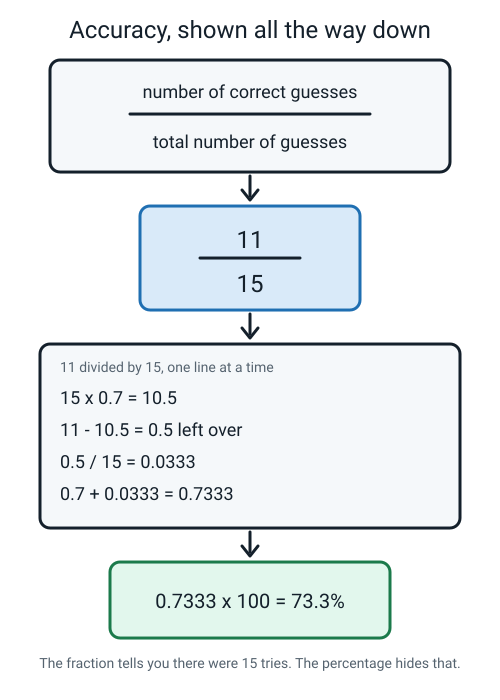
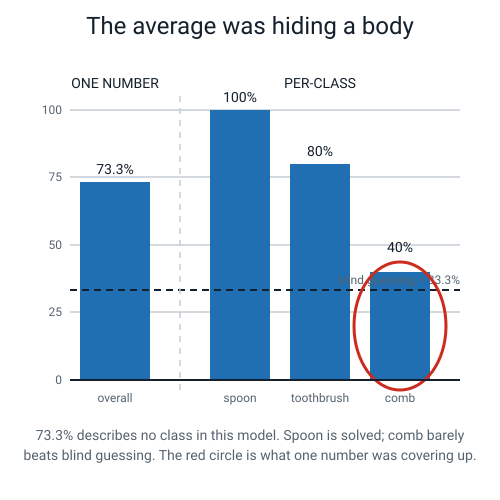
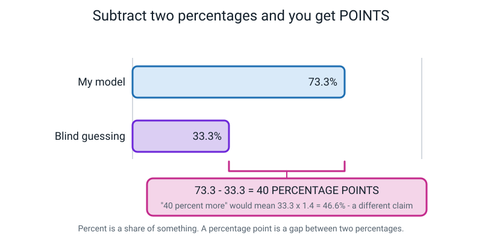
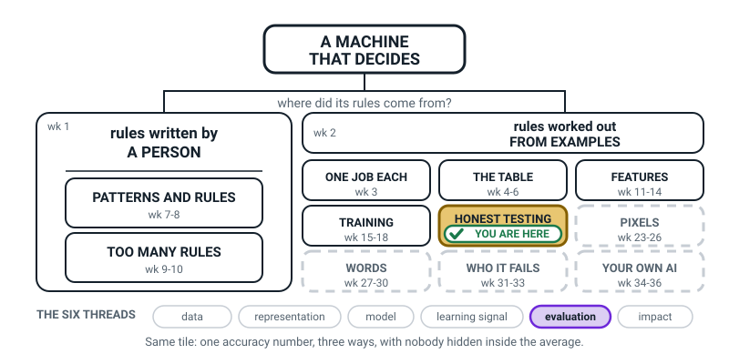
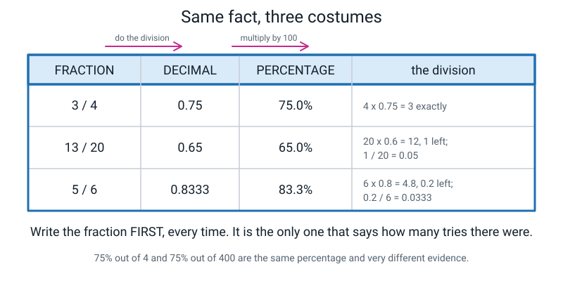
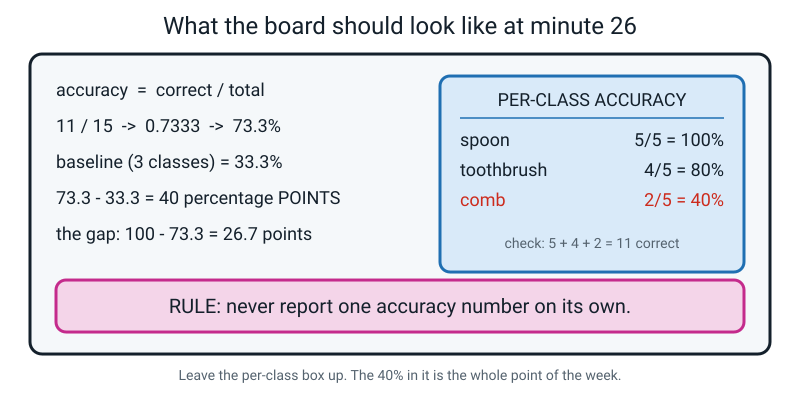
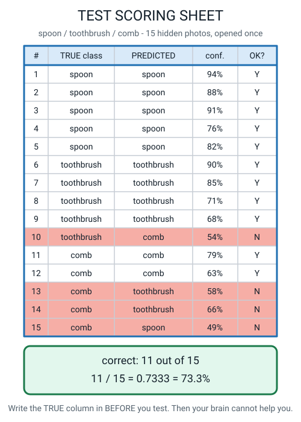

# Week 20 — Accuracy, Three Ways — and the Number That Lies

[⬅ Week 19](week-19.md) · [Course Home](../README.md) · [Week 21 ➡](week-21.md) · [Student Guide](../student-guide/week-20.md) · [Workbook](../workbook/week-20.md)

---

## 📋 At a Glance

| | |
|---|---|
| **Duration** | 70 minutes (works in 60; the cut is in §Differentiation) |
| **Type** | 🟦 teach — **🔑 the single most important lesson in the course** |
| **Big idea** | Accuracy is correct divided by total. And one accuracy number can hide a class that is completely broken. |
| **New vocabulary** | generalizing · memorizing · the gap · per-class accuracy · percentage point |
| **Materials** | The **filled-in 15-row scoring sheet** (Handout 20A — printed, already completed) · a **coloured pen or highlighter** · plain paper · a ruler · a **pen** · Handout 20B (the percentage-point drill) |
| **Tech needed** | **None.** No computer, and — this matters — **no calculator until the very end.** |
| **Prep time** | 15 minutes the night before, 5 minutes on the day |

> **⚠️ Watch out:** put the calculator in a drawer before the student sits down. The entire value of
> this lesson is in the division being written out by hand, one line at a time. A calculator turns a
> 14-minute lesson about what a number *means* into a 20-second lesson about typing.

---

## 🎯 Lesson Objectives

By the end of the lesson the student can, observably:

1. **Compute accuracy as a fraction, a decimal and a percentage**, showing the division every single
   time, without a calculator.
2. **Explain why the fraction carries information that the percentage hides**, using an example.
3. **Compute per-class accuracy** and name the class that the overall average was concealing.
4. **Use the term percentage point correctly** when subtracting two percentages — out loud, with the
   unit attached.

---

## 🧑‍🏫 What YOU Need to Know First

*Read this once — about fifteen minutes. Sections 2, 4 and 5 are the ones you cannot teach without.
Section 5 is the one most adults get wrong, so read it even if you are in a hurry.*

### 1. Where we are

Last week the student learned to hide examples before training and sealed fifteen photos in a signed
envelope. They have not scored anything yet. **Today they finally get to score something** — but not
their own model, because their envelope stays sealed until Week 22.

Instead they score somebody else's completed test sheet. That is deliberate: it means the arithmetic
gets learned cold, on data with no feelings attached, so that in Week 22 the student can spend their
attention on their own result instead of on long division.

### 2. The formula, and the three costumes

```
                number of correct guesses
   accuracy =  ───────────────────────────
                 total number of guesses
```

That is the whole formula and it is not the hard part. **The skill is writing it three ways so that
nobody — including you — can hide behind one of them.**

You got 11 out of 15 on a spelling test.

| Form | Value | What it tells the reader |
|---|---|---|
| **Fraction** | 11/15 | The score **and the sample size**. There were fifteen questions. |
| **Decimal** | 0.7333 | Easy to compare and to multiply with. |
| **Percentage** | 73.3% | Familiar and quotable. **Hides that there were only fifteen.** |

Same fact, three costumes. And here is the sentence to build the whole lesson on: **the fraction is the
only one of the three that tells you how much evidence there was.** "75%" could be 3 out of 4 or 300
out of 400. Those are wildly different claims and they look identical once you convert them.

The division, written out the way an 11-year-old can actually do it:

```
   11 ÷ 15

   15 × 0.7  = 10.5              →  so it's at least 0.7
   11 − 10.5 = 0.5 left over
   0.5 ÷ 15  = 0.0333
   0.7 + 0.0333 = 0.7333

   0.7333 × 100 = 73.33…  ≈  73.3%
```


*Figure 20.1 — Every step visible. This is the figure to have on the table while they work.*

> **🧑‍🏫 If a student asks** why we don't just do 11 ÷ 15 with a bus-stop long division: you can, and
> if that is how they were taught, let them. The multiply-and-subtract method above is here because it
> keeps the *size* of the answer visible at every step — they can see it is "a bit more than 0.7"
> before they finish. Either route is fine. What is not fine is a number appearing with no working.

### 3. Accuracy means nothing without a baseline

The student met **baseline** in Week 12. Bring it back today, hard.

With three roughly equal classes, blind guessing scores 1 in 3 = **33.3%**. So 73.3% is a real
improvement of about 40 points.

But flip it: if a test set were 90% spoons, then "always say spoon" scores **90%** without looking at
anything. A model reported as "90% accurate" would have achieved precisely nothing. **Always write the
baseline next to the accuracy.** A number with no baseline beside it is not a result, it is a boast.

### 4. One number hides bodies — the tool that opens it

Accuracy is an average, and an average's job is to hide the spread. That is not a flaw; it is what
averages are *for*. It just means you must never stop at one.

**The example to keep in your head.** A spam filter is tested on 100 emails: 90 real, 10 spam. It marks
every single email "not spam".

```
   accuracy = 90 ÷ 100 = 0.90 = 90%
```

**90% accurate — and it has never caught a spam email in its life.** Broken open:

```
   real emails:  90 / 90  = 100%
   spam emails:   0 / 10  =   0%
```

The 90% is honest arithmetic and a complete lie about what the thing does. (And note the baseline: with
90 real and 10 spam, "always say real" *is* 90%. So this filter scored exactly the baseline, which
means it learned nothing at all.)

> **Per-class accuracy** — of the test examples that truly belong to class X, what fraction did the
> model get right? Worked out separately, one class at a time.

Today's sheet does the same thing more subtly, and that subtlety is the lesson:


*Figure 20.2 — 73.3% describes no class in this model. The red circle is what one number was covering
up.*

Overall 73.3%. Per class: spoon **100%**, toothbrush **80%**, comb **40%**. There is no class scoring
73.3%. The average describes nobody — exactly like a class averaging 70% where half the room got 85%
and half got 40%.

### 5. Percentage versus percentage point — read this even if you skip everything else

This is the bit adults get wrong constantly, including on the news.

- A **percentage** is a share *of something*. "40% of the photos."
- A **percentage point** is the gap *between two percentages*. "It went from 33.3% to 73.3% — up 40
  percentage points."

Why it matters: "40 percent more" means something completely different from "40 percentage points
more".

```
   33.3% + 40 percentage points  =  73.3%          ← what actually happened
   33.3% + 40 percent OF ITSELF  =  33.3 × 1.4  =  46.6%   ← a much smaller claim
```


*Figure 20.3 — Percent is a share of something. A percentage point is a gap between two percentages.*

**The habit to drill:** when you subtract two percentages, the answer's unit is *points*, and you say
the word out loud. It takes about five repetitions to stick and it will make the student sound
strikingly precise for the rest of their life.

### 6. The gap, generalizing, and memorizing — introduce, don't dig

Three of today's five vocabulary words belong to a bigger idea that **Week 21 unpacks properly**. Today
you introduce them and compute one number. Do not go further.

> **Generalizing** — the model works on examples it has never seen. This is the only thing you
> actually want.
>
> **Memorizing** — the model works on the exact examples it studied, and falls apart on anything else.
>
> **The gap** — training accuracy minus test accuracy. How much memorizing happened.

```
   training accuracy:  60/60 = 100.0%
   test accuracy:      11/15 =  73.3%
   ─────────────────────────────────────
   the gap:                    26.7 percentage points
```

And the sentence that makes 100% boring, which is a genuinely useful thing to make boring:

> **A model scoring 100% on its own study material is the most ordinary thing in the world.** It means
> nothing on its own. Only the gap carries information.

Where to stop today: compute the gap, name the two words, move on. Week 21 does memorizing versus
generalizing, overfitting, and the confusion matrix.

### 7. The two misconceptions you will meet today

**Misconception 1 — "73.3% means it gets 73 out of every 100 right."**
Nearly true and worth pinning down, because the *sample size* is the thing being lost. It got 11 out of
15 right. 73.3% is what that would be *if* it kept up the same rate over a hundred — which it might not.
With 15 photos, **one photo is worth 6.7 percentage points.** If one comb had gone the other way the
headline would read 80%. So a 5-point difference between two models measured on 15 photos means
nothing at all.

**Misconception 2 — "the model went up by 40 percent."**
It went up by 40 **percentage points**. Correct this every time, gently, all lesson, until the student
starts correcting themselves. It is the single most transferable habit in the week.

### 8. How deep to go, and where to stop

| Go this deep | Stop before |
|---|---|
| Accuracy three ways, with the division shown | Precision, recall, F1 — those are Level 2 |
| Baseline written next to every accuracy | Weighted averages, class priors |
| Per-class accuracy, and the class the average hid | The confusion matrix — that is next week |
| The gap, as one subtraction | Overfitting as a concept — next week |
| "One photo is worth 6.7 points" | Confidence intervals, error bars, significance |

---

### 🧭 The Growing Map

Same box as last week — **HONEST TESTING** — and this is the only week of the term with a **single**
thread lit. That is deliberate and it is worth saying out loud: today is one skill, practised until it
is automatic, not a tour of new ideas.



*Figure 20.0 — Week 20's version. HONEST TESTING still tinted and badged, with **evaluation** the only
lit thread along the bottom.*

**What to do with it, in about two minutes at the end of the lesson:**

1. **Show it and ask:** *"which bit did we do today — and why is it the same box as last week?"* The
   answer you want: last week we **hid** the photos, this week we **scored** them. Sealing and scoring are
   two halves of one box, and doing either without the other is worthless.
2. **Then the better question:** *"only one thread is lit today. Which one, and why only one?"*
   **Evaluation.** We touched no new data, changed no model, trained nothing. We took a pile of results
   and learned to report it in a way that cannot flatter us — and the baseline is the part that does the
   work.
3. **Have them write one accuracy on their own map** in all three costumes, with the baseline beside it.
   If those two numbers are close, they add the words **"earned nothing"** and an arrow. That phrase, in
   their own handwriting, is the week.

> **🧑‍🏫 Why this is worth two minutes.** Accuracy arithmetic looks to a student like a maths lesson that
> wandered into the wrong room. The map tells them why it is here: it sits on the evaluation thread, in the
> same box as the envelope they sealed last week, two tiles along from WHO IT FAILS in Week 31 — which is
> the same trick at higher stakes. A single lit thread is the clearest signal in this figure's whole
> vocabulary, so point at it and let it mean something.

**The six threads** along the bottom are the spine of all four levels. **Evaluation** is lit on its own
this week. Do not quiz them on the threads; the map is orientation, never assessment.

---

## 🧰 Prep Checklist

### 15 minutes the night before

- [ ] **Print Handout 20A — the completed 15-row scoring sheet.** It must be **already filled in** with
      true class, predicted class and confidence for all fifteen rows, and the "correct?" column
      **blank**. The data is in §Answer Key K1. If you have no printer, rule it by hand: fifteen rows,
      five columns, ten minutes with a ruler.
- [ ] **Work the division yourself, on paper, once.** 11 ÷ 15. Genuinely do it. You will be doing it
      live and hesitating over 0.5 ÷ 15 in front of a student is the one avoidable wobble in this
      lesson.
- [ ] **Print Handout 20B — the percentage-point drill** (five subtractions, in §K3). Or write the five
      lines on a card in ninety seconds.
- [ ] **Find a coloured pen or highlighter.** The moment the sheet gets split by class is done in
      colour, and doing it in colour is what makes the discovery visible.
- [ ] **Put the calculator away.** In a drawer, in another room, off the table. It comes out at minute
      68 to check, and not before.
- [ ] **Write the four blank headings on the board:** `ACCURACY`, `BASELINE`, `PER CLASS`, `THE GAP`.
      Leaving them visibly empty makes the lesson feel like a form to be filled in, which is exactly
      the feeling you want.

### 5 minutes on the day

- [ ] Handout 20A flat on the table, pen on top of it
- [ ] Highlighter, plain paper, ruler
- [ ] Handout 20B face down (it is the last ten minutes of the activity)
- [ ] Board with the four empty headings
- [ ] The Week 19 envelope visible and still sealed — glance at it, do not touch it

### If something fails

| What fails | Fallback |
|---|---|
| **No printer** | Read the fifteen rows out loud, one at a time, and have the student write them down as you go. This is slightly *better* than a handout: it makes the sheet feel like data arriving rather than a worksheet. Budget 4 extra minutes. |
| **The student insists on a calculator** | Deal: they may check each answer with the calculator **after** writing the division. Not before. Frame it as "you're checking the calculator, not the other way round" — it is a surprisingly effective reframe. |
| **The division defeats them completely** | Switch to the friendly numbers: score 12/15 instead (12 ÷ 15 = 0.8 exactly). Do the whole lesson on 12/15, and set 11/15 as homework with the worked method beside it. The per-class discovery still works. |
| **Time runs out before the percentage-point drill** | Do two of the five subtractions and set the other three as homework. Do **not** cut the per-class split — it is the point of the week. |
| **The student wants to open the Week 19 envelope today** | "Two weeks. And today's sheet is somebody else's, which is exactly why we can be relaxed about it." Then move the envelope out of sight. |

---

## ⏱️ The Lesson, Minute by Minute

| Minutes | Segment | What happens |
|---|---|---|
| 0 – 8 | 🪝 **Hook** — the 90% filter that never caught a spam email | One division on the board, and a surprise |
| 8 – 26 | 🧠 **Concept** — correct over total, three costumes, and points | The formula, the three forms, per-class, percentage point |
| 26 – 40 | 🔍 **Worked Example** — score the sheet, row by row | 11 ticks, then the long division to 73.3% |
| 40 – 60 | 🎲 **Activity** — split the sheet by class · then the drill | The 40% appears · the gap · five subtractions |
| 60 – 70 | 🔑 **Wrap & Assign** — the four headings, filled | Read the whole result out loud in one sentence |

---

### 🪝 Hook — 8 minutes

**Say this:**

> "I've built a spam filter. It's 90% accurate. Do you want it?"
>
> *(Whatever they say, keep going.)*
>
> "Here's how I tested it. I took 100 emails. Ninety of them were real emails — messages from friends,
> from school, that sort of thing. Ten of them were spam."
>
> *(Write `90 real · 10 spam` on the board.)*
>
> "And here is my filter's entire method. Ready? It says 'not spam' about every email. Every single
> one. It doesn't even look at them."
>
> *(Let that sit for a second.)*
>
> "So let's score it. Out of the 90 real emails, how many did it get right?"
>
> *(Answer: all 90. It said 'not spam' and they were not spam.)*
>
> "And out of the 10 spam emails?"
>
> *(Answer: none. Zero.)*
>
> "So: 90 correct out of 100. Let's write it as a sum."

**Do this:** on the board, exactly this:

```
   accuracy = 90 ÷ 100 = 0.90 = 90%

   real emails:  90 / 90  = 100%
   spam emails:   0 / 10  =   0%
```

**Say this:**

> "Ninety percent accurate. And it has never caught a single spam email in its life. Not one. It
> literally cannot — it doesn't look."
>
> "Nobody lied to you. The arithmetic is perfect. 90 ÷ 100 really is 90%. And yet 'this filter is 90%
> accurate' is one of the most misleading true sentences you could say."
>
> "So today: two things. First, how to work out accuracy properly and write it three different ways.
> Second — and this is the real one — **how to catch a number that's lying to you while telling the
> truth.**"

**Ask this:**

> **1. "How did a filter that does nothing get 90%?"**
> - *Hoping for:* because most of the emails were real, and it says "real" to everything.
> - *If they're stuck:* "How many of the 100 emails were real?" then "and what does the filter say
>   about every email?" The two facts collide on their own.

> **2. "What would you need to know to catch this?"**
> - *Hoping for:* how it did on each kind separately. That is **per-class accuracy** and they have just
>   invented it — say so.
> - *If they say "I'd read the emails":* fair and true, and redirect: "You can't read a million. What
>   number would you ask for?"

> **3. "What score would a filter get if it said 'spam' to everything?"**
> - *Hoping for:* 10 out of 100 = 10%.
> - The follow-up worth asking: *"so which is the better filter, the 90% one or the 10% one?"* Neither.
>   Both are broken in opposite directions and neither has looked at an email. That is a genuinely
>   uncomfortable and correct answer.

---

### 🧠 Concept — 18 minutes

**Say this (part 1 — the formula and the three costumes):**

> "Accuracy is the simplest formula in this entire course. **Correct, divided by total.** That's it.
> There is nothing else in it."
>
> "The hard part isn't the formula. The hard part is that the answer has three different costumes, and
> people choose the costume that makes them look best."
>
> "Say you got 11 out of 15 on a spelling test. **11 out of 15** is a fraction. Your teacher writes
> **0.73** in the register — that's a decimal. Your report card says **73.3%** — that's a percentage.
> Same fact. Three costumes."
>
> "Now the question that matters: which of those three tells me that the test had fifteen questions?"
>
> *(Wait for it. It's the fraction.)*
>
> "Only the fraction. So — 75%. Is that 3 out of 4, or 300 out of 400?"
>
> *(You can't tell.)*
>
> "You cannot tell, and those are two totally different claims. Three out of four is one good
> afternoon. Three hundred out of four hundred is proof. **So we always write the fraction first.**"

**Do this:** put up the conversion strip and walk the three worked rows across it with your finger,
saying the division out loud for each.


*Figure 20.4 — Write the fraction first, every time. It is the only one that says how many tries there
were.*

**Say this (part 2 — the average that hides):**

> "Second idea, and it's the important one. Accuracy is an **average**. And an average's whole job is
> to hide the spread — that's not a bug, that's what averages are for."
>
> "Imagine a class averages 70% on a test. Sounds fine. Then you look at the actual marks: half the
> room got 85% and the other half got 40%. The average of 70% is completely true and completely
> useless. It described **nobody in the room.**"
>
> "So we break the average open. For every class in your model, you work out the accuracy separately.
> That's called **per-class accuracy**: of the photos that really were combs, how many did it get
> right? That question, once per class."

**Say this (part 3 — percentage points):**

> "Last idea, and it's a word one. If blind guessing gets 33.3% and my model gets 73.3%, how much
> better is my model?"
>
> *(They will say 40 percent. Almost everybody does.)*
>
> "Forty — yes. But forty **percentage points**, not forty percent. And those are genuinely different
> things, which is why the word exists."
>
> "'Percent' is a share **of** something. 'Percentage points' is the gap **between** two percentages.
> If I'd gone up by 40 percent of 33.3, I'd be at 46.6%, which is a much smaller claim than 73.3%."
>
> "So: subtract two percentages, and the answer is in **points**. And you say the word out loud, every
> time, because otherwise you're making a different claim from the one you mean."

**Do this:** build the board as you go and leave every line up.


*Figure 20.5 — What the board should look like at minute 26. The 40% in the per-class box is the whole
point of the week.*

**Ask this:**

> **1. "Which of the three forms would you use in an advert, and why?"**
> - *Hoping for:* the percentage, because it sounds biggest and hides the sample size.
> - This is a lovely question because the cynical answer is the correct one. Follow with: "and which
>   would you use in a lab notebook?" *(The fraction.)*

> **2. "A model scores 95%. Am I impressed?"**
> - *Hoping for:* it depends on the baseline / on how many examples / on what the classes are.
> - *If they say "yes, that's great":* give them the lopsided case. "It's a test set of 100 photos and
>   95 of them are spoons." Then ask again.

> **3. "Blind guessing is 33.3%, my model is 73.3%. Say the difference out loud with the right unit."**
> - *Hoping for:* "40 percentage points."
> - *If they say "40 percent":* do not sigh. Just say "points" and have them say the whole sentence
>   again. You will do this about five times today and then it will be permanent.

> **4. "Overall it's 73.3%. Can I tell you how it did on combs?"**
> - *Hoping for:* no — that number is an average across all three classes.
> - This question is the bridge into the activity. If they answer it correctly, tell them they have
>   just predicted the next twenty minutes.

---

### 🔍 Worked Example Together — 14 minutes

**Score the sheet.** Handout 20A is a completed test of somebody else's spoon / toothbrush / comb model
— fifteen held-out photos, with the true class and the prediction already recorded. The "correct?"
column is blank. That column is the student's job.

**Step 1 — the rules, said out loud (1 min).**

> "One row at a time. Top to bottom. No skipping, no scanning ahead to see how it ends, and no
> calculator — the calculator is in a drawer and it stays there until you've written the division."

**Step 2 — mark the fifteen rows (5 min).** They work down the sheet putting Y or N in the last column,
comparing the TRUE column with the PREDICTED column. Your job is to say almost nothing. If they start
totalling as they go, stop them — the count comes after.


*Figure 20.6 — What the finished sheet looks like. Eleven Y and four N — and the four N are not spread
evenly, which is the thing to notice later, not now.*

**Step 3 — count the Ys, out loud (1 min).** Rows 1, 2, 3, 4, 5, 6, 7, 8, 9, 11, 12 → **11 correct**.
Write `11` and `15` at the bottom. Then, before any division happens, make them write the fraction:

```
   correct: 11 / 15
```

**Step 4 — the division, on paper, by hand (5 min).** You talk, they write. Do not do it for them, and
do not let a number appear without a line above it.

```
   FRACTION:    11 / 15

   DECIMAL:     11 ÷ 15
                15 × 0.7  = 10.5              →  at least 0.7
                11 − 10.5 = 0.5 left over
                0.5 ÷ 15  = 0.0333
                0.7 + 0.0333 = 0.7333

   PERCENTAGE:  0.7333 × 100 = 73.33…  ≈  73.3%
```

**Step 5 — the baseline, in the same breath (2 min).**

```
   baseline (3 roughly equal classes) = 1 in 3 = 33.3%
   73.3 − 33.3 = 40 percentage points better than blind guessing
```

Then say the sentence that this whole segment exists to produce:

> "**11 out of 15, which is 0.7333, which is 73.3%, against a 33.3% baseline.** All four parts, one
> breath. That's what a result sounds like."

**Ask this:**

> **1. "Before we divide — is 11 out of 15 more or less than three quarters?"**
> - *Hoping for:* less, because three quarters of 15 would be 11.25.
> - This is worth thirty seconds because it means the answer 0.7333 arrives *expected* rather than
>   revealed, which is how you catch your own arithmetic mistakes for life.

> **2. "One photo went the other way. What happens to the headline?"**
> - *Hoping for:* 12/15 = 80%. So one photo is worth 6.7 percentage points.
> - Then the killer follow-up: *"So if my model gets 73% and yours gets 78% on fifteen photos, is yours
>   better?"* **You can't tell.** That is a genuinely sophisticated answer and it is available to an
>   11-year-old today.

> **3. "Why did I make you write 11/15 before you wrote 73.3%?"**
> - *Hoping for:* because the fraction says how many there were.
> - *If they say "because you told me to":* ask what 75% means if you don't know the total. Wait.

---

### 🎲 Activity — 20 minutes

**Part 1: The number that lies (12 min).** Split the sheet by class in colour. The 40% appears.
**Part 2: The percentage-point drill (8 min).** Five subtractions, said out loud with the unit.

Full instructions in the next section.

---

### 🔑 Wrap & Assign — 10 minutes

**Do this:** point at the four headings on the board, now filled in:

```
   ACCURACY   11/15 = 0.7333 = 73.3%
   BASELINE   33.3%   →  40 percentage points better
   PER CLASS  spoon 100%  ·  toothbrush 80%  ·  comb 40%
   THE GAP    100% − 73.3% = 26.7 percentage points
```

**Say this:**

> "Four numbers. None of them is optional and none of them means much on its own. From now on they
> travel together — always."
>
> "Now say the whole thing to me as one sentence, with all four parts in it."

Target sentence, and it is worth insisting on:

> *"On 15 photos it had never seen, this model scored 11/15 = 73.3% against a 33.3% baseline, and it
> was worst at comb, at 2 out of 5, which is 40%."*

**Say this, last thing:**

> "And notice what 'it's 73% accurate' would have told you about any of that. Nothing. It's true, and
> it's nearly useless, and it's what almost every advert about AI says."

Then bring the calculator out of the drawer, let them check 11 ÷ 15, and enjoy the fact that it says
0.73333333.

**Ask this:**

> **"Two weeks from now you open your own envelope. What do you think your comb number will be?"**
> - Any guess. Write it down, date it, initial it. Week 22 opens by comparing against it, and the
>   comparison is worth more than the score.

---

## 🎲 The Activity, In Full

### Part 1 — The Number That Lies

**Time:** 12 minutes · **Materials:** the marked Handout 20A · a coloured pen or highlighter · plain
paper

**Setup:** the sheet is already scored (11 Y, 4 N) and the overall accuracy is already written at the
bottom: 11/15 = 0.7333 = 73.3%.

**Steps:**

1. **Highlight by class.** Go down the TRUE column and put a coloured line through every row whose true
   class is `spoon`. There are five: rows 1–5. Then a different mark for `toothbrush` (rows 6–10) and
   `comb` (rows 11–15).
2. **Score the spoon rows only.** Count the Ys among those five. Write it as a fraction, then a
   decimal, then a percentage:
   ```
      spoon: 5 / 5 = 1.000 = 100.0%
   ```
3. **Score the toothbrush rows only.**
   ```
      toothbrush: 4 / 5 = 0.800 = 80.0%
   ```
4. **Score the comb rows only.** Say nothing while they do this one.
   ```
      comb: 2 / 5 = 0.400 = 40.0%
   ```
5. **Run the check.** The three correct-counts must add to the overall correct count, and the three
   totals must add to the total: `5 + 4 + 2 = 11` ✓ and `5 + 5 + 5 = 15` ✓. Make them write both.
6. **Draw the four bars** on plain paper: one for overall at 73.3%, three underneath for the classes.
   Circle the 40% one in red. Add the dotted 33.3% baseline line across all four.

**Say this, at step 4, once the 40% is on the page:**

> "Stop there for a second. Your overall number was 73.3%. Now look at your three class numbers: a
> hundred, eighty, forty."
>
> "Which class scored 73.3%?"
>
> *(None of them. That's the answer, and it should feel slightly wrong.)*
>
> "None of them. The overall number describes **no class in this model.** Spoons are basically solved.
> Combs are barely above the coin-toss line — blind guessing gets 33.3% and combs got 40%."
>
> "And here's the thing to take away and never lose: the 73.3% was **honest**. Nobody cheated to get
> it. It's just an average, and averages hide bodies. That's why you never, ever report one accuracy
> number on its own."

**Then the gap (2 minutes of the twelve).**

> "One more number and then we're done with this sheet. The person who built this model also wrote down
> how it did on the sixty photos it trained on: sixty out of sixty. A hundred percent."
>
> "Is that impressive?"
>
> *(Let them answer either way.)*
>
> "It's the most ordinary result in the world. Of course it got 100% — those are the photos it studied.
> You'd get 100% too if I gave you the exam paper to revise from. **The 100% is boring. The gap is
> interesting.**"

```
   training accuracy:  60/60 = 100.0%
   test accuracy:      11/15 =  73.3%
   ────────────────────────────────────
   the gap:                    26.7 percentage points
```

> "Twenty-six point seven percentage points. Some of what this model learned was real — 73.3% against
> a 33.3% baseline is not luck. And some of it was **memorizing** those exact sixty photos. Working out
> how much of each is next week's entire lesson."

**Ask this:**

> **1. "Which class was the average hiding?"**
> - *Hoping for:* comb, at 40%.
> - *If they say "toothbrush, it's 80%":* "80% is below 73.3%? Check." They will re-read. It's fine.

> **2. "If you could take ten more photos tomorrow, what would they be of?"**
> - *Hoping for:* combs. Push for specificity: combs in different light, combs held differently, combs
>   next to a toothbrush.
> - *If they say "more of everything":* "You've got ten photos and one afternoon. Spend them where the
>   40% is."

> **3. "Is 40% good or bad?"**
> - The right answer is *"bad, but not as bad as it sounds — it still beats the 33.3% baseline, just
>   barely."* A student who reaches for the baseline unprompted here has understood the whole of Week
>   12 and Week 20 together.

### Part 2 — The Percentage-Point Drill

**Time:** 8 minutes · **Materials:** Handout 20B (five lines) · a pen

**Why this exists:** because everyone gets this wrong, including adults, including the news. Five
repetitions is roughly what it takes.

**How it runs:** they write the subtraction, then **read the whole answer out loud with the unit
attached.** You correct only the unit, never the arithmetic — the arithmetic here is trivial on
purpose.

| # | The question | The answer to say out loud |
|:--:|---|---|
| 1 | Blind guessing 33.3%, my model 73.3%. Difference? | "40 percentage points." |
| 2 | Toothbrush 80%, comb 40%. Difference? | "40 percentage points." |
| 3 | Training 100%, test 73.3%. Difference? | "26.7 percentage points." |
| 4 | Last term 50%, this term 75%. Difference? | "25 percentage points." *(And also: "half as much again," which is 50% more. Both true, different sentences.)* |
| 5 | Model A 12%, model B 9%. Difference? | "3 percentage points." *(Careful: that is also a third more, since 3 ÷ 9 = 33%. Two true sentences about the same pair.)* |

**Say this, on number 4:**

> "This one's a trap and I want you to fall into it slightly. Fifty to seventy-five. That's 25
> percentage points. It's *also* 'half as much again', which is 50 percent more. **Both of those
> sentences are true and they use different numbers.** That's exactly why the word 'points' exists —
> without it, nobody knows which of the two things you meant."

**Ask this:**

> **1. "Which sounds more impressive — up 25 percentage points, or up 50 percent?"**
> - *Hoping for:* the 50 percent, because the number is bigger.
> - Then: "and which one is more honest?" Neither is dishonest — but only one of them tells you where
>   you started. This is the advert-versus-notebook distinction again.

> **2. "Make one up and catch me out."**
> - Let them set you a subtraction. Answer one of them wrong on purpose, without the unit, and see if
>   they catch it. If they do, that is the objective met.

### What "finished" looks like

- [ ] Fifteen rows marked Y or N, in pen, no skipping
- [ ] Overall accuracy in all three forms with the division written out
- [ ] The baseline written next to it, and the difference in **percentage points**
- [ ] Three per-class accuracies, each in all three forms
- [ ] Both checks written down: 5 + 4 + 2 = 11 and 5 + 5 + 5 = 15
- [ ] Four bars drawn, with the 40% circled and the 33.3% baseline line across
- [ ] The gap computed: 100 − 73.3 = 26.7 points
- [ ] Five drill answers, each said out loud with the word "points" in it

### Variation — easier

Score a **nine-row** sheet instead of fifteen (three per class). Choose the results so the arithmetic
is kind: 6/9 overall = 0.6667 = 66.7%, per class 3/3 = 100%, 2/3 = 66.7%, 1/3 = 33.3%. The discovery is
identical and the division is friendlier. Skip the gap. Do drill items 1, 2 and 4 only.

If the decimal is the blocker, do the whole thing with 12/15 (= 0.8 exactly), and set 11/15 as homework
with the worked example beside it.

### Variation — harder

1. **Build the lopsided test set.** "Design a 15-photo test set where a model that only ever says
   'spoon' scores 80%." *(12 spoons, 2 toothbrushes, 1 comb.)* Then: "what's the baseline for that test
   set?" *(80% — the same as the useless model.)* This is the hardest idea in the week and it is
   completely reachable.
2. **Two models, same accuracy.** Both score 90% on 200 emails (100 real, 100 spam). Model A gets 82
   real and 98 spam right; Model B gets 98 real and 82 spam right. Which would you install on your own
   inbox, and which in a hospital? *(Yours: B — a lost real email is worse than a spam that gets
   through. Hospital: A — one phishing email can be a catastrophe and quarantined mail is
   recoverable.)*
3. **The sample-size question.** "How many test photos would you need before a 5-point difference
   between two models meant something?" There is no exact answer at this level, but the reasoning is
   the prize: one photo is worth 6.7 points out of 15, 1 point out of 100, 0.1 points out of 1000. So:
   more than fifteen. A lot more.

---

## ❓ Questions Students Ask This Week

**1. "Why can't I just use the percentage? It's easier."**
Use it — just never on its own. The problem isn't that percentages are wrong, it's that they throw away
the sample size on the way through. "75%" could be 3 out of 4 or 300 out of 400, and those are
completely different amounts of evidence. Write the fraction, then the percentage. It costs four extra
characters.

**2. "Is 73% good?"**
Compared to what? Against a 33.3% baseline it's genuinely good — 40 points better than guessing.
Against a test set that was 90% spoons, it would be *terrible*, because "always say spoon" would score
90%. "Good" is not a property of a number; it's a comparison. That's why the baseline always travels
with the accuracy.

**3. "What accuracy is good enough?"**
**Nobody knows for sure, and here's why:** it depends entirely on what the mistakes cost, and that's a
question about the world rather than about the data. A film-recommender at 70% is great — a bad
recommendation costs you two minutes. A brake-light detector in a car at 99.9% is nowhere near good
enough, because the 0.1% is somebody's life. Same number, opposite verdicts. There is no threshold
anybody can hand you. What you can always do is state the number, the sample size, the baseline, and
the worst class, and let the reader judge.

**4. "Why is 100% on the training photos boring? That sounds amazing."**
Because it's the expected result, not a good one. Those are the photos it studied — of course it can do
them. If I gave you the exam paper a week early you'd get 100% too, and neither of us would learn
anything about your maths. The number that carries information is the one on photos it has never seen,
and the *gap* between the two.

**5. "The 40% class — is the model broken?"**
It's badly weak on that one class, which is a much more useful thing to know than "broken". 40% is
still slightly above the 33.3% you'd get from guessing, so it has learned *something* about combs —
just not enough. And it tells you exactly where to spend your next ten photos, which "the model is 73%
accurate" never would have.

**6. "Can accuracy be over 100%?"**
No, and it's worth knowing why: it's correct divided by total, and you can't get more right than there
were questions. If you ever calculate over 100%, you've either counted a row twice or divided by the
wrong total. It's a free error-check.

**7. "Why does it matter if I say percent instead of percentage points? Everyone says percent."**
Everyone does, including newsreaders, and it genuinely misleads people. If a shop's prices go from 20%
off to 30% off, that's 10 percentage points more off — but only 50% more discount. Those two sentences
sound similar and mean different things. Getting it right is a small habit that makes you very hard to
fool.

**8. "Whose photos should be in the test set? These are all somebody's own kitchen."**
Excellent question and it's the honest weakness of every test set in this course. Your test photos are
your hands, your light, your table — so your score predicts *your house* well and other houses much
less well. If a model were going to be used by hundreds of people, you'd need photos from lots of
those people's homes before you could honestly say "it works". We measure exactly this in Week 31 and
Week 33.

---

## ⚠️ Where This Lesson Goes Wrong

| What happens | Why | What to do right now |
|---|---|---|
| **The calculator comes out** | It is right there and the division is tedious. | Trade, don't ban: "write the division, then check it with the calculator." Framing it as *checking the calculator* keeps the pride intact and the working on the page. |
| **"40 percent" instead of "40 percentage points"** | Everybody says it wrong, including adults on television. | Correct only the unit, every single time, in a completely flat voice, and have them repeat the whole sentence. Five corrections and it sticks. Do not explain it a second time — repetition is what works here, not explanation. |
| **The per-class split gets skipped for time** | It looks like a bonus step after the "real" answer. | It is the *point*. If you are short of time, cut the drill, cut the gap, cut the wrap — never cut the per-class split. Two minutes of it beats twenty minutes of anything else in this lesson. |
| **They total the Ys as they go and lose count** | Natural, and it feels efficient. | Stop them at row 3. "Mark all fifteen, then count. Counting while marking is how you end up with twelve and then eleven and then not knowing." |
| **The student is upset that "their" model is bad** | They forget the sheet is somebody else's, because it looks like theirs. | Say it again, clearly: "This isn't yours. Yours is still in the envelope." Then use it: "And this is why we practise on someone else's — so that when it's yours, the sums are already easy." |
| **73.3% gets read as "73 out of every 100"** | It is the natural reading of a percentage. | Go back to the fraction. "How many photos were there? Fifteen. So it got eleven. If one had gone the other way you'd be at 80%." One photo, 6.7 points. |
| **The four bars get drawn with no baseline line** | The baseline is not one of the bars, so it gets forgotten. | Draw it yourself, dotted, across all four, and label it. Without the 33.3% line the 40% bar looks merely small rather than *alarming*. |
| **The gap gets computed as 100 − 73 = 27, and then called "27 percent"** | Two errors at once: rounding early, and the unit. | Take the rounding first (73.3, not 73), then the unit. Both matter, and doing them one at a time avoids a lecture. |

---

## 🧭 Differentiation

### If they are struggling

**Cut:** the gap; drill items 3 and 5; the four-bar drawing (talk it instead of drawing it).

**Reteach the fraction-decimal-percentage link with money.** 11 out of 15 is hard. Ask instead: "if I
had 100p and gave away 73p, what fraction did I give away?" Then walk it back the other way. Money is
the one place where an 11-year-old already fluently converts between fractions, decimals and
percentages, and borrowing that fluency works better than re-teaching the conversion.

**Use kind numbers.** Score 12/15 = 0.8 = 80% instead of 11/15. Per class: 5/5, 4/5, 3/5 → 100%, 80%,
60%. The discovery is weaker (60% is less shocking than 40%) but the method is identical, and you can
show them the real sheet afterwards.

**The 60-minute version:** Hook 6 · Concept 14 · Worked example 13 · Activity 17 (per-class split plus
two drill items) · Wrap 10. Everything that matters survives.

**Keep, whatever else goes:** the per-class split, the 40%, and the words "percentage points" said
correctly at least twice.

### If they are flying

1. **The lopsided test set** (§Variation — harder, item 1). Designing a test set where a useless model
   scores 80% is the strongest thing available this week.
2. **The two-filter dilemma** (§Variation — harder, item 2), and then the twist: recompute both models
   on a *realistic* inbox of 90 real and 10 spam. Model A wrongly bins 16.2 real emails to stop 1.6
   extra spam; Model B bins 1.8. The balanced test made it look like a philosophical dilemma; the
   realistic mix shows it was arithmetic. **A test set that doesn't match the real-world mix can give
   you a wrong decision, not just a wrong number.**
3. **Reverse the sum.** "A model scored 84%. How many photos might there have been, and how many
   correct?" *(21/25, or 42/50, or 84/100 — and 84% on 25 photos is a very different claim from 84% on
   100.)*
4. **Write the advert and the notebook entry.** Same result, two audiences: a one-line advert that is
   technically true and maximally flattering, and a one-line lab entry that a hostile reader couldn't
   pick apart. Comparing their own two sentences is the lesson.

### If they won't engage today

**Plan A — score me instead.** You take the test. You are the model. They read out fifteen photos
("what's this: spoon, toothbrush or comb?"), you answer, and *they* keep the sheet and do the marking.
Being the examiner is much more appealing than being the arithmetic-doer, and the sums are identical.

**Plan B — hunt for lying numbers instead.** Skip the sheet. Find three real claims — a shampoo advert,
a game's "97% positive reviews", a school league table — and for each ask: out of how many? compared to
what? which group does it fail on? This meets every objective except the division, and the division can
be homework.

**Plan C — the four-minute floor.** Score the comb rows only. 2 out of 5 = 40%. Then the one question:
"the overall score was 73.3% — how did that number manage to hide this?" That single exchange carries
the week.

---

## ✅ Assessing Understanding

### Check 1 — accuracy three ways, cold

> **"Nine correct out of twelve. Give me the fraction, the decimal and the percentage, and show me the
> division."**

- **Good:** 9/12, then 12 × 0.75 = 9 exactly so 0.75, then 75.0%. Bonus for noticing 9/12 = 3/4.
- **Partial:** gets 75% by recognising three quarters but writes no division. Accept it, then ask them
  to do 4 out of 7 the same way — that one cannot be spotted, so it tests the method.
- **Not good enough:** no fraction written, or a percentage with no working. Reteach with the money
  route (§Differentiation), then re-ask tomorrow.

### Check 2 — the hidden class

> **"A model scores 70% overall. Its three classes score 100%, 90% and 20%. What should I be worried
> about, and what should I do first?"**

- **Good:** the 20% class — and it is *below* the 33.3% baseline, so on that class the model is worse
  than guessing. First action: look at that class's training photos and go and collect more, with more
  variety.
- **Partial:** "the 20% one" with no reason. Ask: "how does 20% compare to just guessing?"
- **Not good enough:** "70% is fine." Go straight back to the spam filter: 90% accurate, zero spam
  caught, sixty seconds.

### Check 3 — the unit

> **"Guessing gets 25%. My model gets 60%. Say the difference in a full sentence."**

- **Good:** "It's 35 percentage points better than guessing."
- **Partial:** "35 points." Accept — the unit is right, the sentence is short. Ask for the whole
  sentence once.
- **Not good enough:** "35 percent better." Say "points", have them repeat the whole sentence, and note
  it for the Week 21 warm-up. This one needs repetition, not explanation.

### Mastery scale for this week

| Level | What it looks like |
|:--:|---|
| **1** | Marks the sheet. Cannot get from 11/15 to a percentage without being walked through it. |
| **2** | Computes overall accuracy with help. Writes the percentage but not the fraction. Says "percent" when they mean points. |
| **3** | Accuracy in all three forms, division written out, baseline written next to it. Computes per-class accuracy and names the worst class. Uses "percentage points" when reminded. |
| **4** | All of the above unprompted, including both checks. Explains why the fraction matters using the 3-out-of-4-versus-300-out-of-400 example. Computes the gap and says 100% on training is unremarkable. Uses "percentage points" without reminding. |
| **5** | Works out unaided that one photo is worth 6.7 points, and therefore that a 5-point difference on 15 photos means nothing. Designs a lopsided test set where a useless model scores 80%. Explains that the 73.3% was honest arithmetic and still misleading. |

**Aim for 3.** Level 4 is a genuinely strong outcome and worth saying so out loud.

---

## 📤 Homework to Assign

**Workbook:** Week 20, pages 1–3. **Time: about 50 minutes.**

**Say this, word for word:**

> "Three pages, and there's one rule that covers all of them: **if a number appears with no division
> written above it, it doesn't count.** I'd rather see messy working and a wrong answer than a right
> answer that arrived by magic."
>
> "Page one: five accuracy problems. Each one three ways — fraction, decimal to four places,
> percentage to one place — with the division shown. Then, for each, how many percentage points it
> beats a 33.3% baseline by. Say 'points'. Write 'points'."
>
> "Page two is the interesting one: **the number that lies.** You get one overall score and three
> per-class scores for a bike / scooter / skateboard model. Find the class the average was hiding, say
> how it compares to blind guessing, and write one sentence on what you'd go and look at first. Not
> 'more photos' — what exactly."
>
> "Page three: the drill. Five subtractions, each written out with the unit. And two sentences: one
> defining a percentage point, one saying why we write the fraction first."
>
> "Also — the envelope stays shut. Two more weeks."

**Check before they leave:** ask them to do 6 ÷ 10 out loud. If that comes instantly, page 1 will be
fine.

| Page | Task | Approx. time |
|---|---|---|
| 1 | Five accuracy problems, three ways each, division shown, points against baseline | 25 min |
| 2 | The number that lies: per-class hunt, the hidden class, what to investigate first | 15 min |
| 3 | The percentage-point drill written up, plus two definition sentences | 10 min |

---

## 🔑 Answer Key

### K1 — Handout 20A: the completed scoring sheet (the data to print)

This is the sheet the student scores in class. Print it with the last column **blank**.

| # | true class | predicted | top conf. | correct? |
|:--:|---|---|:--:|:--:|
| 1 | spoon | spoon | 94% | ✅ Y |
| 2 | spoon | spoon | 88% | ✅ Y |
| 3 | spoon | spoon | 91% | ✅ Y |
| 4 | spoon | spoon | 76% | ✅ Y |
| 5 | spoon | spoon | 82% | ✅ Y |
| 6 | toothbrush | toothbrush | 90% | ✅ Y |
| 7 | toothbrush | toothbrush | 85% | ✅ Y |
| 8 | toothbrush | toothbrush | 71% | ✅ Y |
| 9 | toothbrush | toothbrush | 68% | ✅ Y |
| 10 | toothbrush | **comb** | 54% | ❌ N |
| 11 | comb | comb | 79% | ✅ Y |
| 12 | comb | comb | 63% | ✅ Y |
| 13 | comb | **toothbrush** | 58% | ❌ N |
| 14 | comb | **toothbrush** | 66% | ❌ N |
| 15 | comb | **spoon** | 49% | ❌ N |

**Overall:** correct rows are 1, 2, 3, 4, 5, 6, 7, 8, 9, 11, 12 → **11 correct out of 15**.

```
   FRACTION:    11 / 15
   DECIMAL:     15 × 0.7 = 10.5;  11 − 10.5 = 0.5;  0.5 ÷ 15 = 0.0333
                0.7 + 0.0333 = 0.7333
   PERCENTAGE:  0.7333 × 100 = 73.33…  ≈  73.3%

   baseline (3 equal classes) = 33.3%
   beats baseline by 73.3 − 33.3 = 40 percentage points
```

**Per class:**

| class | correct | total | fraction | decimal | percentage |
|---|:--:|:--:|---|---|---|
| spoon | 5 | 5 | 5/5 | 1.000 | **100.0%** |
| toothbrush | 4 | 5 | 4/5 | 0.800 | **80.0%** |
| comb | 2 | 5 | 2/5 | 0.400 | **40.0%** |
| **overall** | **11** | **15** | **11/15** | **0.733** | **73.3%** |

Checks: 5 + 4 + 2 = 11 ✓ · 5 + 5 + 5 = 15 ✓

**The gap:** training 60/60 = 100.0%; test 73.3%; gap = **26.7 percentage points**.

**The one-sentence verdict** (this is the shape Week 22 will demand):

> *"On 15 held-out photos this model scored 11/15 = 73.3% against a 33.3% baseline; it was worst at
> comb, at 2/5 = 40%."*

### K2 — Workbook page 1: five accuracy problems

**(a) 9 out of 12**
```
   fraction:   9/12   (= 3/4)
   decimal:    12 × 0.75 = 9 exactly  →  0.7500
   percentage: 0.75 × 100 = 75.0%
   beats a 33.3% baseline by 41.7 percentage points
```

**(b) 17 out of 20**
```
   fraction:   17/20
   decimal:    20 × 0.8 = 16;  17 − 16 = 1;  1 ÷ 20 = 0.05
               0.8 + 0.05 = 0.8500
   percentage: 85.0%
   beats a 33.3% baseline by 51.7 percentage points
```

**(c) 23 out of 30**
```
   fraction:   23/30
   decimal:    30 × 0.7 = 21;  23 − 21 = 2;  2 ÷ 30 = 0.0667
               0.7 + 0.0667 = 0.7667
   percentage: 76.7%
   beats a 33.3% baseline by 43.4 percentage points
```

**(d) 4 out of 7**
```
   fraction:   4/7
   decimal:    7 × 0.5 = 3.5;  4 − 3.5 = 0.5;  0.5 ÷ 7 = 0.0714
               0.5 + 0.0714 = 0.5714
   percentage: 57.1%
   beats a 33.3% baseline by 23.8 percentage points
```

**(e) 45 out of 60**
```
   fraction:   45/60   (= 3/4)
   decimal:    0.7500
   percentage: 75.0%
   beats a 33.3% baseline by 41.7 percentage points
```

**The point of putting (a) and (e) in the same list:** they are the *same percentage* from very
different evidence — 12 photos versus 60. On 12 photos one photo is worth 8.3 points; on 60 it is worth
1.7. Same number, one of them far more trustworthy. **That is why you write the fraction.** If the
student spots this without being asked, it is the best answer on the page.

### K3 — Workbook page 3: the percentage-point drill

| # | Subtraction | Answer |
|:--:|---|---|
| 1 | 73.3% − 33.3% | **40 percentage points** |
| 2 | 80% − 40% | **40 percentage points** |
| 3 | 100% − 73.3% | **26.7 percentage points** |
| 4 | 75% − 50% | **25 percentage points** — and also "50% more than 50%", which is a different sentence about the same pair |
| 5 | 12% − 9% | **3 percentage points** — and also "a third more", since 3 ÷ 9 = 0.333 |

**Two definition sentences, model answers:**

> **What is a percentage point?**
> It is the unit you get when you subtract one percentage from another. A percentage is a share of
> something; a percentage point is the gap between two percentages. Going from 33.3% to 73.3% is 40
> percentage points, not 40 percent.

> **Why write the fraction first?**
> Because the fraction is the only one of the three forms that says how many tries there were. 75% could
> be 3 out of 4 or 300 out of 400, and those are very different amounts of evidence, but they look
> identical once you turn them into a percentage.

**Marking note:** on items 4 and 5, a student who writes *only* the percentage-point answer gets full
marks. The second sentence is a bonus. A student who writes only the "50% more" version has the
misconception the drill exists to catch — go back to Figure 20.3.

### K4 — Workbook page 2: the number that lies

**The data given to the student:** a bike / scooter / skateboard classifier, tested on 24 held-out
photos, 8 per class. Overall: 16 correct. Per class: bike 8 correct, scooter 6 correct, skateboard 2
correct.

**(a) Overall accuracy, three ways.**
```
   fraction:   16/24   (= 2/3)
   decimal:    24 × 0.6 = 14.4;  16 − 14.4 = 1.6;  1.6 ÷ 24 = 0.0667
               0.6 + 0.0667 = 0.6667
   percentage: 66.7%
```

**(b) Per-class accuracy.**

| class | correct | total | fraction | decimal | percentage |
|---|:--:|:--:|---|---|---|
| bike | 8 | 8 | 8/8 | 1.000 | **100.0%** |
| scooter | 6 | 8 | 6/8 | 0.750 | **75.0%** |
| skateboard | 2 | 8 | 2/8 | 0.250 | **25.0%** |
| **overall** | **16** | **24** | **16/24** | **0.667** | **66.7%** |

Checks: 8 + 6 + 2 = 16 ✓ · 8 + 8 + 8 = 24 ✓

**(c) Which class was the average hiding?**

> **Skateboard, at 2 out of 8 = 25%.** The overall 66.7% describes no class in this model: one class is
> perfect, one is decent, and one is a disaster.

**(d) How does it compare to blind guessing?**

```
   baseline (3 equal classes) = 1 in 3 = 33.3%
   skateboard = 25.0%
   25.0 − 33.3 = −8.3
```

> **On skateboards this model is 8.3 percentage points WORSE than guessing at random.** That is the
> sentence to look for. A student who writes it has understood both the baseline and the unit.

Overall the model beats the baseline by 66.7 − 33.3 = **33.4 percentage points**, which is why the
headline looks respectable while one third of the job is broken.

**(e) What would you investigate first? (One sentence, and "more photos" is not enough.)**

Full-credit answers name something specific and checkable. Any one of these:

> "I'd count the skateboard training photos first, because 25% smells like there were far fewer of
> them than the other two classes."

> "I'd look at whether all the skateboard photos were taken in the same place — if they were all on the
> same driveway, the model may have learned the driveway rather than the skateboard."

> "I'd check whether the skateboards were being confused with bikes specifically, because both have
> wheels — and if so I'd shoot ten photos of each at the same distance so wheels aren't the only
> difference."

**Not enough:** "get more data", "train it longer", "it needs to be better". Hand these back with the
question: *"look at where, exactly?"*

### K5 — Every question posed in the lesson

| Segment | Question | Answer |
|---|---|---|
| Hook | How did a filter that does nothing get 90%? | 90 of the 100 emails were real, and it says "real" to everything. |
| Hook | What would you need to know to catch it? | How it did on each class separately — per-class accuracy. |
| Hook | What would a say-spam-to-everything filter score? | 10/100 = 10%. Neither filter has looked at an email. |
| Concept | Which form would you use in an advert? | The percentage — biggest-sounding, and it hides the sample size. In a notebook: the fraction. |
| Concept | A model scores 95%. Impressed? | Only after you know the baseline and the sample size. On a test set that is 95% spoons, 95% is the baseline. |
| Concept | 33.3% to 73.3% — say the difference. | 40 percentage points. |
| Concept | Overall 73.3% — how did it do on combs? | You cannot tell. It is an average over all three classes. |
| Worked ex. | Is 11/15 more or less than three quarters? | Less — three quarters of 15 is 11.25. |
| Worked ex. | One photo goes the other way. What happens? | 12/15 = 80%. One photo is worth 6.7 percentage points. |
| Worked ex. | Why write 11/15 before 73.3%? | Because the fraction is the only form that says how many tries there were. |
| Activity | Which class was the average hiding? | Comb, at 2/5 = 40%. |
| Activity | Which class scored 73.3%? | None of them. The average described nobody. |
| Activity | Ten more photos — of what? | Combs, and specifically combs in situations the training photos missed. |
| Activity | Is 40% good or bad? | Bad — but still above the 33.3% baseline, so it learned something, just not enough. |
| Activity | Is 100% on training impressive? | No. It is the most ordinary result there is. The gap is the informative part. |
| Drill | Up 25 points or up 50 percent — which sounds better? | The 50 percent. Both are true; only one tells you where you started. |
| Wrap | What do you think your own comb number will be? | A written, dated guess. Week 22 opens by comparing against it. |

### K6 — The nine-row easier sheet (for §Differentiation)

| # | true | predicted | correct? |
|:--:|---|---|:--:|
| 1 | spoon | spoon | Y |
| 2 | spoon | spoon | Y |
| 3 | spoon | spoon | Y |
| 4 | toothbrush | toothbrush | Y |
| 5 | toothbrush | toothbrush | Y |
| 6 | toothbrush | comb | N |
| 7 | comb | comb | Y |
| 8 | comb | toothbrush | N |
| 9 | comb | spoon | N |

```
   overall: 6/9;  9 × 0.6 = 5.4;  6 − 5.4 = 0.6;  0.6 ÷ 9 = 0.0667
            0.6 + 0.0667 = 0.6667  =  66.7%

   spoon      3/3 = 1.000 = 100.0%
   toothbrush 2/3 = 0.667 =  66.7%
   comb       1/3 = 0.333 =  33.3%   ← exactly the baseline: no better than guessing
   check: 3 + 2 + 1 = 6 ✓   3 + 3 + 3 = 9 ✓
```

The comb class landing *exactly* on the baseline is a gift — it makes "no better than guessing"
literally true rather than approximately true.

---

## 🔮 Next Week Preview

Next week is **Week 21 — Memorizing vs Generalizing**, and it takes the two words introduced today and
turns them into a diagnosis. The student meets **overfitting** in plain words — *it learned the photos,
not the object* — and then builds a **confusion matrix** by hand from this same fifteen-row sheet: a
three-by-three grid of what got mistaken for what. The diagonal gets shaded green and summed, and it
must come to 11, which is the self-check that catches almost every filling error. Then every cell off
the diagonal becomes a spoken sentence: *"two combs were called toothbrush."*

**Prep early:**

- **Keep today's marked Handout 20A.** Next week starts from it. Do not throw it away and do not let it
  go home loose — staple it into the workbook.
- **A ruler and a coloured pen** (green if you have one, for shading the diagonal).
- **Print Handout 21A**, the second scoring sheet — a pen / pencil / marker model, fifteen rows — which
  is next week's homework. The data is in the Week 21 answer key.
- **The envelope:** check it once, do not touch it. One more week after next.

---

[⬅ Week 19](week-19.md) · [Course Home](../README.md) · [Week 21 ➡](week-21.md) · [Student Guide](../student-guide/week-20.md) · [Workbook](../workbook/week-20.md) · [Orientation](00-orientation.md) · [Glossary](../../glossary.md)
