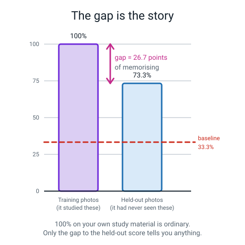
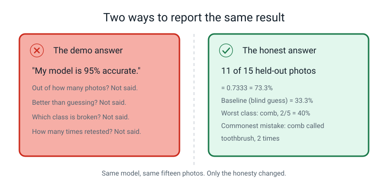
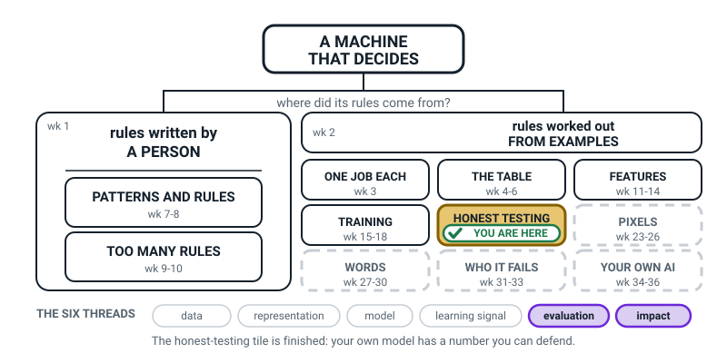
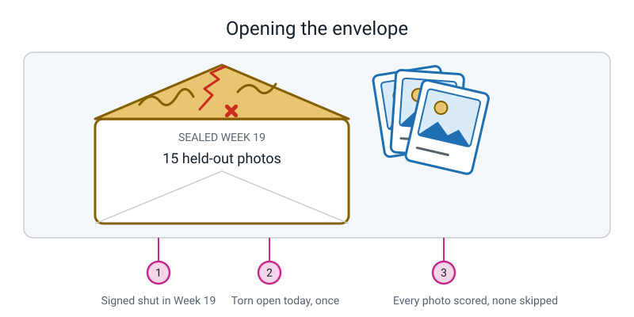
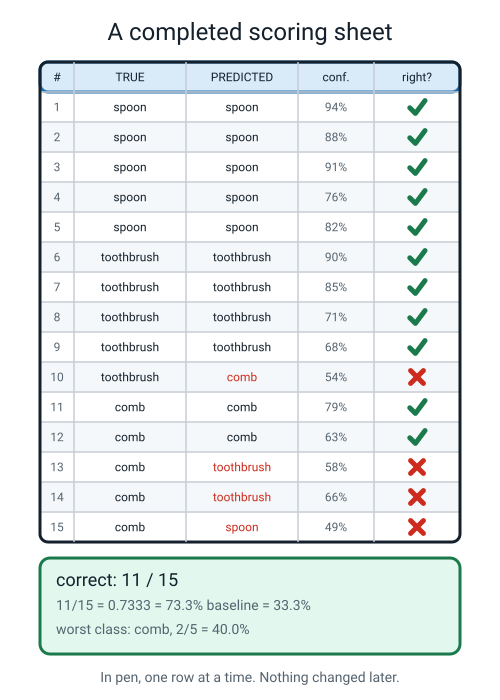
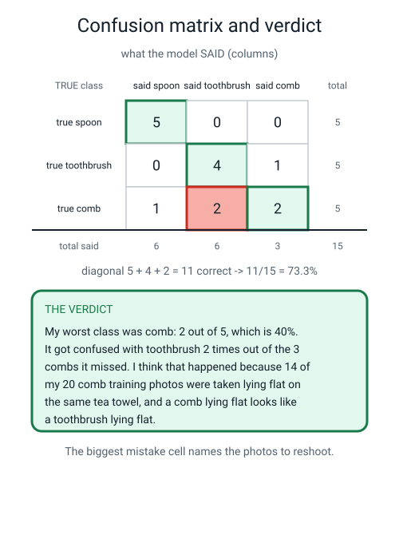

# Week 22 — The Hidden Ten: Test Your Own Model Honestly

[⬅ Week 21](week-21.md) · [Course Home](../README.md) · [Week 23 ➡](week-23.md) · [Student Guide](../student-guide/week-22.md) · [Workbook](../workbook/week-22.md)

---

## 📋 At a Glance

| | |
|---|---|
| **Duration** | 70 minutes (works in 60; runs comfortably to 75) |
| **Type** | Project — the student produces one finished, defensible piece of work |
| **Big idea** | The only number worth reporting is the one you got on examples the model had never seen. |
| **New vocabulary** | **None.** This is a consolidation week. Every word used today was taught in Weeks 19–21. |
| **Materials** | The **sealed Week 19 envelope** · the printed scoring sheet (15 rows) · a **pen**, not a pencil · a ruler · plain paper for the confusion matrix · a calculator (only after the hand division is done) |
| **Tech needed** | The student's trained model from Week 17, open in a browser (Teachable Machine). Nothing else. |
| **Prep time** | 20 minutes the night before, 5 minutes on the day |

> **⚠️ Do not open the envelope before class.** Not to check it. Not to count the photos. Not "just
> to make sure it worked". If you open it, the entire point of Weeks 19 to 22 evaporates and there
> is no way to get it back. If you have already opened it, read the **Prep Checklist** fallback —
> there is an honest repair, and it involves telling the student what you did.

---

## 🎯 Lesson Objectives

By the end of this lesson the student will be able to:

1. **Open a sealed test set and score every held-out example on paper**, one at a time, without
   skipping any and without re-testing any.
2. **Report their own model's accuracy three ways** — as a fraction, a decimal and a percentage,
   with the division written out — and write the baseline next to it.
3. **Build a confusion matrix by hand** for their own model, check the diagonal against their
   correct count, and name their worst class out loud.
4. **Write a one-sentence honest verdict** on their own work that contains the number, the sample
   size, the baseline and the worst class — and that does not over-claim.

You will know they got there when they can say a sentence like *"11 out of 15, which is 73.3%,
against a 33.3% baseline, and I was worst at comb"* without you prompting any of the four parts.

---

## 🧑‍🏫 What YOU Need to Know First

*Read this section once. It is about 15 minutes. When you finish it you will understand today's
content properly, not just be able to read it aloud.*

### The one sentence this whole week rests on

**A score is only worth something if the thing being scored had never seen the questions.**

That is the whole of today. Everything else — the arithmetic, the grid, the verdict sentence — is
machinery for making that one sentence concrete enough that an 11-year-old cannot wriggle out of it.

### Where we are in the story

Over the last five weeks the student has:

- **Week 17** — trained a real image classifier in Teachable Machine, on photos they collected
  themselves. Three classes. Somewhere around 60 training photos.
- **Week 19** — learned why you must hide some examples *before* training, physically separated
  about 20% of their photos into an envelope, **signed across the flap**, and handed it to you.
- **Week 20** — learned that one accuracy number is an average, and averages hide things. Learned to
  compute per-class accuracy and to draw a confusion matrix.
- **Week 21** — learned the difference between **memorizing** (works on the old examples only) and
  **generalizing** (works on new ones), and that the **gap** between training accuracy and test
  accuracy is what tells you which one happened.

Today they cash all of that in, on their own model, with real numbers, in one sitting.

### The four numbers they leave with

| Number | What it is | Example |
|---|---|---|
| **Overall accuracy** | correct ÷ total, on the held-out photos only | 11/15 = 0.7333 = 73.3% |
| **Baseline** | what blind guessing would score. Three equal classes → 1 in 3 | 33.3% |
| **Per-class accuracy** | the same sum, done separately for each class | comb 2/5 = 40% |
| **The gap** | training accuracy minus test accuracy | 100% − 73.3% = 26.7 points |

None of those four is optional and none of them means much alone. The habit you are building is
that they **always travel together**.

### Why a single accuracy number is dangerous

Accuracy is an average, and an average's job is to hide the spread. Here is the example to keep in
your head, because you will need it when the student is pleased with a decent-looking number.

A spam filter is tested on 100 emails: 90 real, 10 spam. It marks everything "not spam". Its
accuracy is 90 ÷ 100 = **90%**. It has never caught a single spam email in its life. The 90% is
honest arithmetic and a complete lie about what the thing does.

Broken open by class:

```
   real emails:  90 / 90  = 100%
   spam emails:   0 / 10  =   0%
```

That is what per-class accuracy is for. And that is why we always write the baseline next to the
headline: with 90 real and 10 spam, blind guessing "always say real" *is* 90%. A "90% accurate"
filter scored exactly the baseline, which means it learned nothing at all.

### What the confusion matrix actually is

It is a grid. **Rows are the truth. Columns are what the model said.** Each cell counts how many
photos fell into that combination.

```
                        ┌─────── WHAT THE MODEL SAID ───────┐
                        │  spoon    toothbrush     comb     │  total
   ┌────────────────────┼───────────────────────────────────┼───────
   │ TRUTH: spoon       │    5           0          0       │   5
   │ TRUTH: toothbrush  │    0           4          1       │   5
   │ TRUTH: comb        │    1           2          2       │   5
   └────────────────────┴───────────────────────────────────┴───────
     total predicted         6           6          3       │  15
```

Two reading directions, and you should always do both:

- **Along a row** — "of the 5 real combs, 2 were called comb, 2 were called toothbrush, 1 was called
  spoon." That is the model's weakness *on combs*.
- **Down a column** — "the model said the word 'comb' only 3 times in 15 tries, even though 5 combs
  existed." That is the model being **reluctant** to say comb. It is a different diagnosis from
  simply being bad at combs, and it usually points at the class being under-represented or
  under-varied in the training photos.

**The single most useful number in the whole grid** is the biggest number that is *not* on the
diagonal. Here it is the 2 in "true comb, said toothbrush". That cell is a shopping list: it tells
you exactly which ten photos to go and take tomorrow.

**The diagonal check.** Add the diagonal — 5 + 4 + 2 = 11 — and it must equal the number of correct
answers on the scoring sheet. Add every cell — it must equal the number of test photos. If either
check fails, a tally mark went in the wrong box. This check catches nearly every mistake and takes
four seconds, so make the student do it every time.

### The gap, and why 100% on training is boring

Teachable Machine will happily tell you the model got 100% on the photos it trained on. This is the
most ordinary result in the world and it means nothing. A student who was given the exam paper to
revise from will also get 100%.



*Figure 22.1 — 100% on the photos it studied, 73.3% on the photos it had never seen. The 26.7-point
gap is the only part of that pair which carries information.*

| Training accuracy | Test accuracy | What it means |
|---|---|---|
| 100% | 95% | Generalizing well. It learned the object. |
| 100% | 73% | Learned something real, and memorised some of the photos too. |
| 100% | 40% | Memorised hard. It learned your table, not your comb. |
| 55% | 52% | Barely learned anything — too few photos, or the task is too hard. |

Note the last row. A *small* gap is not automatically good news. A model that scores 55% and 52% has
a tiny gap and is useless. You read the gap **and** the level together.

### The two misconceptions, and how to head them off

**Misconception 1: "The test was unfair, so that one shouldn't count."**

This is the big one and it will happen today. The student will show a photo, the model will say
something silly, and the student will say *"but that photo is blurry / at a weird angle / I took it
in the dark — that's not fair."*

Here is the correct answer, and it is important that you say it warmly rather than sternly:

> *"You might be completely right that it's a hard photo. Write that down — genuinely, write
> 'blurry' in the notes column. But it still counts. The reason is simple: you chose which photos
> went in the envelope back in Week 19, before you knew which ones the model would get wrong. If we
> throw out photos now, we're choosing them **because** the model failed on them, and then the score
> stops measuring the model and starts measuring how many photos we were willing to delete."*

The photo stays in. The complaint gets written down. That is the deal, and it is exactly the deal
real scientists make with themselves.

**Misconception 2: "The model is 73% sure, so it's right 73% of the time."**

Confidence is not correctness. This was Week 16's whole lesson and it will resurface today, because
the scoring sheet has a confidence column. The number Teachable Machine shows is **how strongly the
model prefers that class over the others**. It is not a probability of being right. A model can be
94% confident and wrong; today's sheet will probably contain an example. If it does, point at it.

### How deep to go, and where to stop

**Go this deep:** overall accuracy three ways, baseline, per-class accuracy, a hand-drawn confusion
matrix with both checks, the gap, and a verdict sentence. Then stop.

**Do not go here today**, even if the student is flying:

- Precision, recall and F1. They are the natural next step and they are Level 2. Saying "there are
  more careful measures than accuracy and you'll meet them next year" is enough.
- Statistical significance or error bars. The honest version of "how much should I trust 15 photos?"
  is *"one photo is worth 6.7 percentage points, so a difference of 5 points between two models
  means nothing"* — that is plenty, and it is true.
- Retraining. **Absolutely no retraining today.** Today is measurement. If they want to fix the
  model, that is a shot list for tomorrow, not a change now.

### The thing that makes this course different from a demo



*Figure 22.2 — Both statements are about the same fifteen photos. Only one of them lets a reader
check anything.*

An enormous amount of what people say about AI in public sounds like the left panel. "97% accurate."
"Better than a human." "State of the art." None of those tell you out of how many, against what
baseline, or which group it fails on.

Your student is going to learn, today, to produce the right panel instead. That is a genuinely rare
skill and it is worth more than anything else in this course. When they write their verdict at the
end of the lesson, that is the moment. Make a small fuss of it.

---

### 🧭 The Growing Map

This is a closing week and the map says so: **HONEST TESTING** is tinted for the last time in its run,
and the thread strip has **impact** lit next to **evaluation**. That pairing is the point of the
lesson — the moment you report per-class accuracy, you have stopped asking *is it good?* and started
asking *good for whom?*



*Figure 22.0 — Week 22's version. HONEST TESTING tinted and badged for the final week of its run, with
**evaluation** and **impact** lit along the bottom.*

**What to do with it, in about two minutes at the end of the lesson:**

1. **Show it and ask:** *"which bit did we do today — and why is it the same shaded box as three weeks
   ago?"* The answer you want: holding photos back, counting them, drawing the matrix and finally
   *judging* were four parts of one job, and today was the judging. Pointing at the box is the whole
   exercise; do not let it become a speech.
2. **Then the better question:** *"why is PIXELS still dashed, when we spent the whole lesson looking
   at photographs?"* Because nothing today cared what was *inside* a photo — a photo was a row with a
   right answer attached. Opening the photo up is next week. Say that sentence out loud; it is the
   hook for Week 23.
3. **Have them write their own four numbers** on their notebook map beside HONEST TESTING, and circle
   their worst class. Numbers they measured themselves are the numbers they will defend.

> **🧑‍🏫 Why this is worth two minutes.** Today can feel like an ending — the project is scored, the
> envelope is used up. The map reframes it as a foundation: those four numbers are exactly what Weeks
> 31 to 34 stand on. A learner who sees that treats the Week 33 audit as a bigger version of something
> they already own, instead of as a brand-new topic they have to learn from zero.

**The six threads** along the bottom are the spine of all four levels. **Evaluation** and **impact**
are lit this week. Do not quiz them on the threads; the map is orientation, never assessment.

---

## 🧰 Prep Checklist

### 20 minutes the night before

- [ ] **Find the sealed envelope from Week 19. Do not open it.** Put it somewhere you will see it
      in the morning. Check the signature is still intact across the flap; you will point at it.
- [ ] **Print two copies of the 15-row scoring sheet** (Workbook page W22.1, or copy the layout in
      *Figure 22.3* by hand onto lined paper with a ruler). Two copies: one to spoil, one to keep.
- [ ] **Open the student's Teachable Machine model in a browser and test it once**, with any object
      at all. You are checking that the page loads and the webcam permission still works — nothing
      else. If the model has been lost, see the fallback below.
- [ ] **Find the training accuracy from Week 17.** It should be written in their workbook (it is
      usually 100%, or very close). You need it for the gap. If it is not written down anywhere,
      open the model, click **Advanced → Under the hood**, and read it off.
- [ ] **Read the Answer Key section at the end of this file**, specifically the cat / dog / rabbit
      worked example. You will be doing that live, on a board, in front of the student. It goes far
      better if you have done it once yourself with a pencil.
- [ ] **Write the four blank headings on a board or a big sheet** before class: `ACCURACY`,
      `BASELINE`, `PER CLASS`, `THE GAP`. Leaving them visibly empty makes the lesson feel like a
      form to fill in, which is exactly the feeling you want.

### 5 minutes on the day

- [ ] Envelope on the table, signature side up, where the student can see it.
- [ ] Pen (not pencil — see below), ruler, scoring sheet, plain paper.
- [ ] Browser open on the model, webcam already permitted.
- [ ] Phone or timer visible. The activity is time-boxed and it matters.

> **💡 Try this:** Use a **pen**, not a pencil, for the scoring sheet. It sounds fussy. It is not.
> A pencil invites a student to go back and "fix" row 4 after they see how row 12 turned out. A pen
> makes the record permanent, which is the entire point of a record. If they make a genuine writing
> error, they cross it out with one line and write next to it. That is what a real lab notebook
> looks like.

### If the internet or the tool fails

**If Teachable Machine will not load, or the model has vanished:** you can still run 100% of today's
lesson. Today is a *scoring and arithmetic* lesson, not a training lesson. Use the printed
demonstration data in the Answer Key: the 15-row spoon / toothbrush / comb sheet (Figure 22.3) is a
complete, real result. Hand the student the *predictions* one row at a time — read them out, do not
let them see the sheet — and have them fill in their own copy, compute all four numbers, draw the
matrix and write the verdict. They practise every skill; the only thing they lose is that the
numbers are somebody else's. Then reschedule the envelope opening for the first ten minutes of
Week 23 and shorten Week 23's activity by ten minutes.

**If you have already opened the envelope:** tell the student, plainly, before you do anything else.
*"I opened this last week to check on it. That was a mistake and here is why it matters."* Then run
the lesson exactly as written, and in the verdict add the honest sentence: *"the envelope was opened
early by my teacher, so I cannot be certain nothing leaked."* A student who watches an adult write
that sentence learns more about science than one who gets a clean result.

---

## ⏱️ The Lesson, Minute by Minute

| Minutes | Segment | What happens |
|---|---|---|
| 0–8 | 🪝 **Hook** — The envelope on the table | The signature, the rules, why they cannot be bent |
| 8–26 | 🧠 **Concept** — The four numbers | Accuracy three ways, baseline, per-class, the gap |
| 26–40 | 🔍 **Worked Example Together** | Score a stranger's 12-row sheet on the board, end to end |
| 40–60 | 🎲 **Activity** — Opening the Envelope | Score all 15, compute, draw the matrix, write the verdict |
| 60–70 | 🔑 **Wrap & Assign** | Read the verdict out loud, the shot list, homework |

---

### 🪝 Hook — The envelope on the table (8 min)

**Do this:** Put the sealed envelope on the table between you. Do not touch it. Sit down. Let it
sit there for a beat longer than is comfortable.

**Say this:**

> *"Three weeks ago you took fifteen photos and put them in this envelope, and you signed your name
> across the flap. Since then, your model has been trained, tested, poked and prodded — and it has
> never once seen what is inside here. Today it finds out.*
>
> *Before we open it, I need to tell you the rules, because they are strict and they are strict on
> purpose. There are three.*
>
> ***Rule one: every photo gets scored.*** *All fifteen. Not the good ones. Not the ones where the
> lighting was nice. If a photo comes out and you think 'oh no, that one's rubbish' — it still goes
> on the sheet.*
>
> ***Rule two: one go each.*** *You show the photo, you write down what the model said, you move on.
> No 'let me try that again holding it straighter'. No 'wait, the webcam was blurry'. One go.*
>
> ***Rule three: no crossing anything out afterwards.*** *That's why we're using a pen. When row four
> is written, row four is finished, even after you've seen row twelve.*
>
> *Now — those rules are going to feel unfair at some point in the next half hour. Probably around
> photo number nine. I want you to notice the feeling when it comes, because that feeling is the
> single most interesting thing in this lesson."*

**Do this:** Point at the signature across the flap.

**Say this:**

> *"That signature is doing a real job. It's not decoration. It's proof that nobody — not you, not
> me — has quietly slipped a photo in or out since Week 19. Scientists do exactly this. There are
> laboratories where the results are sealed and time-stamped before anybody is allowed to look at
> them, for precisely this reason: because human beings, including honest ones, are very good at
> talking themselves into small adjustments."*



*Figure 22.3 — Sealed in Week 19, torn open once in Week 22. Fifteen photos, every one of them
scored.*

**Ask this:** *"Why do you think I made you take those photos on a different day, in a different
room, instead of just keeping fifteen from the same batch?"*

- **Hoping for:** "Because photos from the same batch are almost the same photo, so the model has
  basically already seen them." Perfect — that is the Week 19 lesson landing.
- **If they say "so it's harder":** accept it and sharpen it. *"Harder, yes — but harder in a
  specific way. Harder in the same way that real life will be harder. That's the bit that matters."*
- **If they shrug or don't know:** give it to them straight. *"Because two photos taken two seconds
  apart on the same table are basically the same photo. Hiding one of them doesn't hide anything.
  The model has seen its twin."* Then move on; do not dig.

**Ask this:** *"Right now, before we open it — what score do you think you'll get? Write the number
down."*

Have them write a prediction at the top of the scoring sheet and circle it. This takes fifteen
seconds and it is worth a great deal. Comparing the prediction to the result at the end is the
cheapest, most memorable calibration exercise in the entire course, and it works whether they
guessed high or low.

---

### 🧠 Concept — The four numbers (18 min)

**Do this:** Envelope still unopened. Turn to the board with the four empty headings on it.

**Say this:**

> *"Before we open anything, we're going to agree on what we're going to write down. Four things.
> Not one thing — four. Because one number on its own can lie to you without technically saying
> anything false, and I'd like to show you how.*
>
> *Imagine a spam filter. Someone tests it on 100 emails: 90 of them are ordinary emails, 10 of them
> are spam. And the filter just… says 'not spam' to everything. It never catches anything. It's a
> brick with a label on it.*
>
> *What's its accuracy? It got all 90 ordinary emails right, and all 10 spam ones wrong. 90 out of
> 100. **Ninety percent accurate.** You could put that on a poster. And it is a completely honest
> piece of arithmetic about a completely useless machine."*

**Ask this:** *"So what would you have to also tell me, before I'd believe 90% was any good?"*

- **Hoping for:** something in the neighbourhood of "how it did on each kind" or "what you'd get by
  guessing". Either one is the right instinct — take it and name it.
- **If they say "how many emails there were":** excellent, that is the fraction argument. *"Yes —
  and that's why we always write 90/100 and not just 90%. The fraction tells you the sample size."*
- **If they're stuck:** prompt with *"how well would I do if I just always said 'not spam' without
  looking?"* They will get it immediately, and that is the baseline.

**Do this:** Write on the board, under `ACCURACY`:

```
   accuracy  =    number it got right
                 ─────────────────────
                   number of tries
```

**Say this:**

> *"That's the whole formula. There isn't a harder one hiding behind it. The skill isn't the
> formula — the skill is writing it three ways, because each of the three tells you something the
> others hide.*
>
> *Say you got 11 out of 15.*
>
> *The **fraction** is 11/15. That's the honest one. It tells you there were only fifteen tries.*
>
> *The **decimal** is 11 divided by 15. Let's do it properly. Fifteen times zero-point-seven is ten
> point five. So we're at 0.7 with 0.5 left over. Half divided by fifteen is 0.0333. Add them:
> 0.7333.*
>
> *The **percentage** is that times a hundred: 73.3%. That's the one everybody quotes, and it's the
> one that hides the most, because '73.3%' doesn't tell you whether there were fifteen photos or
> fifteen thousand."*

**Do this:** Write the division out longhand on the board while you say it. Do not use a calculator
here. The student needs to see an adult do arithmetic slowly and without embarrassment.

```
   FRACTION:    11 / 15

   DECIMAL:     15 x 0.7 = 10.5        remainder 11 - 10.5 = 0.5
                0.5 / 15 = 0.0333
                0.7 + 0.0333 = 0.7333

   PERCENTAGE:  0.7333 x 100 = 73.3%
```

**Say this:**

> *"Second number: the **baseline**. That's the score you'd get by not thinking at all. You have
> three classes and roughly the same number of photos of each, so if you just shouted a random one
> of the three names every time, you'd be right about one time in three. One third. 33.3%.*
>
> *So 73.3% isn't 'good' on its own — it's good **compared to 33.3%**. It beats not-thinking by
> forty percentage points. Forty **points**, by the way, not forty percent. That distinction is
> going to annoy you all year and I'm going to keep being annoying about it.*
>
> *Third number: **per class**. Same sum, done separately for each of your three classes. This is
> where the bodies are buried. You'll see."*

**Do this:** Draw the empty confusion matrix grid on the board — three rows, three columns, plus a
totals row and column. Label the rows "TRUE" and the columns "SAID".

**Say this:**

> *"Fourth thing, and it's not a number, it's a grid. It's called a **confusion matrix**, which is a
> silly grand name for something you could explain to a six-year-old.*
>
> *Down the side: what the photo actually was. Across the top: what the model said it was. Every
> photo you score puts one tally mark in one box.*
>
> *If everything goes perfectly, all your marks land on the diagonal — the boxes where 'what it was'
> and 'what it said' are the same thing. Every mark **off** the diagonal is a mistake, and it's a
> mistake with a name attached: 'a comb that got called a toothbrush'. Not 'it's a bit rubbish'.
> A specific, nameable, fixable thing."*

**Ask this:** *"If you had a box with 3 in it, in the row 'true comb' and the column 'said
toothbrush' — what would you go and do about it tomorrow?"*

- **Hoping for:** "take more photos of combs" — and then push: *"which photos, exactly?"* You want
  them to land on **photos that separate combs from toothbrushes**, not just more combs.
- **If they say "retrain it":** *"Retrain it on what? The same photos will give you the same model.
  The grid is telling you which new photos to go and take."*
- **If they say "nothing, it's fine":** ask what the score would be if all 5 combs went in that box.
  0%. Then ask what the overall accuracy would still be: 10/15 = 66.7%, which still sounds fine.
  That is the point.

**Say this, to close the segment:**

> *"And one last thing before we open it. Your model scored 100% on its training photos. I know it
> did, because they all do. That is the least impressive number in this room. It's a student marking
> their own homework with the answer sheet open. The interesting number is the **difference** between
> that 100% and whatever we're about to get. That difference has a name: **the gap**. A small gap
> means it learned the object. A big gap means it learned your kitchen table."*

---

### 🔍 Worked Example Together — Somebody else's fifteen minutes of shame (14 min)

**Do this:** Before touching their envelope, do one complete run on somebody else's data. This is
deliberate: they get to practise the whole pipeline with no emotional stake, so when their own
numbers arrive they already know the moves.

Write this table on the board (or hand them the printed copy from Workbook page W22.2). Tell them it
is a cat / dog / rabbit classifier somebody else built, with 4 test photos per class.

| # | true | predicted | top conf. |
|---|---|---|---|
| 1 | cat | cat | 88% |
| 2 | cat | cat | 79% |
| 3 | cat | dog | 61% |
| 4 | cat | cat | 92% |
| 5 | dog | dog | 84% |
| 6 | dog | dog | 90% |
| 7 | dog | dog | 73% |
| 8 | dog | cat | 55% |
| 9 | rabbit | cat | 64% |
| 10 | rabbit | rabbit | 70% |
| 11 | rabbit | cat | 58% |
| 12 | rabbit | dog | 51% |

**Say this:**

> *"This is a real result from somebody else's model. Twelve photos, four of each animal. Your job
> is to tell me, in about ten minutes, exactly what's wrong with this model — and I don't mean
> 'it's not very good'. I mean the specific broken thing, named."*

**Do this — step 1, count the correct rows.** Go down the list out loud together. Rows 1, 2, 4, 5,
6, 7, 10 are correct. Seven.

**Do this — step 2, accuracy three ways, on the board.**

```
   FRACTION:    7 / 12

   DECIMAL:     12 x 0.5 = 6           remainder 7 - 6 = 1
                1 / 12 = 0.0833
                0.5 + 0.0833 = 0.5833

   PERCENTAGE:  58.3%

   BASELINE:    3 equal classes  ->  1/3  =  33.3%
   BEATS IT BY: 58.3 - 33.3  =  25.0 percentage points
```

**Ask this:** *"Is 58.3% good?"*

- **Hoping for:** "It beats guessing, so it learned something, but not much." That is exactly right
  and it is a genuinely sophisticated answer.
- **If they say "no, it's terrible":** *"Careful. It beats blind guessing by 25 points, so something
  real happened. It's disappointing, not empty. Those are different."*
- **If they say "yes, it's over half":** *"Over half of what, though? If I flip a coin between two
  classes I get 50% for free. Half only sounds good because we count in halves at school."*

**Do this — step 3, per class.**

| class | correct rows | fraction | decimal | percentage |
|---|---|---|---|---|
| cat | 1, 2, 4 | 3/4 | 0.75 | **75.0%** |
| dog | 5, 6, 7 | 3/4 | 0.75 | **75.0%** |
| rabbit | 10 | 1/4 | 0.25 | **25.0%** |
| **overall** | | **7/12** | 0.583 | **58.3%** |

Check with them: 3 + 3 + 1 = 7 ✓ and 4 + 4 + 4 = 12 ✓.

**Say this:**

> *"Look at rabbit. Twenty-five percent. Now look back at the baseline — 33.3%. **This model is worse
> at rabbits than a coin spinner would be.** You could replace the rabbit part of this model with a
> dice and improve it. And the headline number, 58.3%, said nothing about that at all."*

**Do this — step 4, build the matrix together.** Go down the twelve rows and put a tally in each
cell. Do it slowly; the student should call out the cell for each row.

| | **said cat** | **said dog** | **said rabbit** | row total |
|---|---|---|---|---|
| **true cat** | **3** | 1 | 0 | 4 |
| **true dog** | 1 | **3** | 0 | 4 |
| **true rabbit** | 2 | 1 | **1** | 4 |
| **column total** | 6 | 5 | 1 | **12** |

Diagonal check: 3 + 3 + 1 = **7** ✓ matches the correct count. Grand total 6 + 5 + 1 = 12 ✓.

**Ask this:** *"Read down the 'said rabbit' column. How many times did this model say the word
'rabbit' in twelve tries?"*

- **Hoping for:** "Once." Then let it sit. *"Once. There were four rabbits in front of it and it
  used the word once."*
- **If they read across instead:** gently redirect. *"That's the row — that's what happened to the
  rabbits. I want the column: what the model was willing to say."*

**Say this:**

> *"That's a different diagnosis from 'it's bad at rabbits'. If it were just bad at rabbits, its
> rabbit guesses would be scattered about randomly. This one has nearly stopped believing rabbits
> exist. It said 'cat' six times when there were only four cats. It is over-eager about cat and
> reluctant about rabbit.*
>
> *And here's the clincher. Look at the 'true cat, said rabbit' box. It's zero. Not one single cat
> was ever mistaken for a rabbit. If cats and rabbits genuinely looked alike to this model, the
> confusion would run **both ways**. It only runs one way. So the problem isn't 'cats and rabbits
> look similar' — the problem is the rabbit class itself. Probably too few rabbit photos, or all the
> rabbit photos were too samey."*

**Do this — step 5, the verdict sentence.** Write it on the board, slowly, naming each part as you
write it.

> *"On 12 held-out photos, this model scored 7/12 = 58.3% against a 33.3% baseline; it was worst at
> **rabbit** (1/4 = 25%), and its most common mistake was calling a rabbit a cat."*

**Say this:**

> *"Number. Sample size. Baseline. Worst class. Commonest mistake. Five things, one sentence. When
> you write yours in twenty minutes, that's the shape it has to have."*

---

### 🎲 Activity — Opening the Envelope (20 min)

Full instructions are in the next section. In the lesson flow it runs like this:

- **Minutes 40–42:** Open the envelope. Count the photos out loud. Write the count on the sheet.
- **Minutes 42–54:** Score all fifteen, one at a time, in pen.
- **Minutes 54–58:** Accuracy three ways, baseline, per class.
- **Minutes 58–60:** Draw the confusion matrix and run both checks.

Keep the timer visible. If they are behind at minute 54, they finish the arithmetic for homework —
but the **scoring** must be completed in class, because the scoring is the part with the rules
attached, and the rules only work with a witness in the room.

---

### 🔑 Wrap & Assign (10 min)

**Do this:** Ask them to read their verdict sentence out loud. Stand up if that helps make it feel
like a moment. It should feel slightly formal, because it is.

**Say this:**

> *"Say it out loud, all five parts, and I'll listen for whether any of them are missing."*

Then:

> *"Now compare it to the number you wrote down and circled at the start of the lesson, before we
> opened anything.*
>
> *If you predicted too high — welcome to the club. Almost everybody does, and the reason is that
> you've been watching this model work on your own table for weeks and it looked great. If you
> predicted too low, that's also interesting; it usually means you'd already spotted something you
> hadn't said out loud.*
>
> *Either way, the gap between what you expected and what you got is worth more than the score
> itself. That gap is the reason we hide photos in envelopes."*

**Ask this:** *"Look at the biggest number in your grid that isn't on the diagonal. What ten photos
are you taking tomorrow?"*

Push for specificity. Not "more combs". Something like: *"five photos of the comb standing up in a
mug so it isn't lying flat, and five of the comb next to a toothbrush at the same distance so size
is the only difference."* Write the shot list on the workbook page. They are not taking those photos
this week, but naming them turns the confusion matrix from a grade into a plan.

**Say this, last thing:**

> *"One more thing and then we're done. You are not retraining this model today. Not tonight, not
> tomorrow. The moment you change something because of what the envelope told you, the envelope
> stops being a fair test — because you'd be choosing your changes using the answers. Your fifteen
> photos are spent. If you want to fix the model properly, you'd need a fresh envelope. That's not
> me being strict; that's the rule that stops everybody in this field from fooling themselves."*

Assign the homework (see 📤 below).

---

## 🎲 The Activity, In Full

### Opening the Envelope

**Time:** 20 minutes in class · **Group size:** one student, one adult witness

**What "finished" looks like:** a scoring sheet with fifteen rows in pen, every row filled, four
computed numbers written underneath, and a hand-drawn 3×3 grid whose diagonal matches the correct
count.

### Materials

| Item | Notes |
|---|---|
| The sealed Week 19 envelope | Signature intact |
| Printed 15-row scoring sheet | Workbook W22.1, or ruled by hand |
| A pen | Not a pencil |
| A ruler | For the confusion matrix grid |
| Plain paper | For the matrix and the verdict |
| The trained model in a browser | Teachable Machine, webcam permitted |
| A timer | Visible to the student |

### Setup (2 minutes)

1. Model open, prediction bars visible on screen.
2. Scoring sheet flat on the table, pen on top of it.
3. Envelope in the middle. **The student opens it, not you.**
4. Tip the photos out face down. Count them out loud. Write the count in the header of the sheet.
   *(If the count is not 15, write the real number and use it. Do not go looking for missing ones.)*
5. **Before scoring anything**, fill in the entire **TRUE class** column. The student knows what
   each photo is — they took them. Writing the truth in first, before any prediction exists, is the
   single most important procedural step of the day.

> **⚠️ Watch out:** If the student fills in "true" *after* seeing the prediction, their brain will
> help them, and it will help them dishonestly. This is not a character flaw — it happens to
> everyone, including professional researchers, and it is precisely why real experiments write the
> answer key before they run the test.

### The rules (say them again, out loud, at the table)

1. **Every photo gets scored.** No skipping.
2. **One attempt each.** No re-showing, no re-angling, no "the webcam didn't focus".
3. **No changing a written row.** Pen. If you genuinely mis-write, one line through it and rewrite
   beside it.
4. **Complaints go in the notes column, not in the bin.** "Blurry", "weird angle", "in shadow" —
   write it down. The photo still counts.

### Running it (12 minutes — about 45 seconds per photo)

For each photo, in this order:

1. Show it to the model. Hold the printed photo up to the webcam, or upload the file — whichever
   the student used for the practice runs in Week 17. **Use the same method for all fifteen.**
2. Read the **top class** off the screen. Write it in the PREDICTED column.
3. Read the **top confidence percentage**. Write it in the CONF column.
4. Tick or cross the last column.
5. Turn the photo face down onto a finished pile. Next.



*Figure 22.4 — What a finished sheet looks like. Eleven ticks, four crosses, and four crosses that
are all clustered in one class. That clustering is the thing to notice.*

Your job during these twelve minutes is almost entirely to **not help**. Specifically:

- Do not comment on whether a prediction is right. They can see the tick or the cross.
- Do not say "ooh, that one's close". Confidence is on the sheet; commentary isn't.
- Do not let them re-show a photo, even once, even if the webcam was genuinely wobbling. Write
  "camera wobbled" in notes and move on.
- **Do** keep the pace up. Long pauses invite second-guessing.

### The arithmetic (4 minutes)

At the bottom of the sheet, in this order:

```
   correct: ____ / ____

   fraction   ____/____
   decimal    ____ / ____ = __________     (show the division)
   percentage ________ %

   baseline (3 equal classes) = 33.3%
   beats baseline by ______ percentage points

   training accuracy (from Week 17) = ______%
   the gap = ______ - ______ = ______ percentage points
```

Then the per-class table:

| class | correct | total | fraction | percentage |
|---|---|---|---|---|
| | | 5 | | |
| | | 5 | | |
| | | 5 | | |
| **overall** | | **15** | | |

Insist on the check: the three "correct" numbers must add up to the overall correct count.

### The matrix (2 minutes)

Ruler out. Three rows, three columns, plus a totals row and a totals column. Rows labelled
`true <class>`, columns labelled `said <class>`. Go down the fifteen sheet rows and put one tally
mark in one cell per row.

Two checks, both compulsory:

- **Diagonal = correct count.**
- **All cells = number of photos.**

If either fails, find the mis-tallied row before doing anything else.

### The verdict (the part that matters)

Three sentences, written by the student, on the plain paper, under the matrix.

1. **Sentence 1 — the worst class.** *"My worst class was ______, at ___ out of ___, which is ___%."*
2. **Sentence 2 — what it got confused with.** *"It got called ______ ___ times, which is the biggest
   number in my grid that isn't on the diagonal."*
3. **Sentence 3 — the cause, as a guess about their own photos.** *"I think that happened because
   ______________ in my training photos."*

Then — and this is the step that separates this course from a demo — **go and check sentence 3.**
Open the training photo folder. Look. Is the guess right? Write one more line: *"I checked, and
______."*



*Figure 22.5 — The finished artefact: the grid, the checks, and a verdict that names a cause the
student went back and verified in their own photo folder.*

### Variation — easier

If fifteen photos and four calculations is too much in twenty minutes:

- **Score all fifteen, but compute only two numbers in class:** overall accuracy as a fraction, and
  per-class accuracy as three fractions. Leave the decimal, the percentage and the gap for homework.
- **Pre-draw the confusion matrix grid** on paper before the lesson, with the class names already
  written in. Drawing a 5×5 ruled grid is a separate skill and it is not today's skill.
- **Do the tally together, aloud.** You read the row, they place the mark.

### Variation — harder

If they finish with time to spare:

- **The confidence split.** Average the confidence of the correct answers, and separately of the
  wrong ones. Are wrong answers less confident? By how much? Then find the *highest-confidence
  mistake* on the sheet and go look at that photo — the mistakes a model was sure about are always
  the most informative.
- **The 70% rule.** Split the fifteen rows into "confidence 70% or more" and "under 70%". Compute
  accuracy in each pile. If the confident pile is much more accurate, you have just discovered the
  design of every real product that says *"send it to a human when unsure."* Then say the honest
  caveat out loud: that 70% was chosen *after* seeing these results, so it will not work quite so
  cleanly on fresh photos.
- **Predict the lazy score.** Ask: *"If I'd let you test on fifteen photos from the same batch as
  your training photos, what do you think you'd have scored?"* Have them write a number. It is
  almost always close to 100%, and knowing that they know it is the whole lesson.

---

## ❓ Questions Students Ask This Week

**"Can I just try that one again? The camera was blurry."**

> No — but write "blurry" in the notes column, because that is real information and it belongs in
> the record. Here is the reason it has to be no. You chose these fifteen photos before you knew
> which ones would go wrong. If we start removing photos now, we are removing them *because* the
> model failed on them, and then the score isn't measuring the model any more. It's measuring how
> many photos we were willing to delete. Every professional in this field has to hold this line with
> themselves, in private, with nobody watching.

**"Why does 100% on the training photos not count for anything?"**

> Because the model was allowed to study those exact photos, over and over, fifty times. Getting
> them right is like getting full marks on a test made entirely of questions you were given the
> answers to the night before. It's not cheating exactly — it's just not measuring anything. The
> useful number is the difference between that 100% and today's score. That difference is called the
> gap, and it tells you how much of the model's cleverness was actually just memory.

**"My score is worse than my friend's. Is my model worse?"**

> Maybe, and maybe not, and here's how you'd tell. First: how many test photos did each of you use?
> With fifteen photos, one photo is worth 6.7 percentage points, so 73% and 80% is a *one-photo*
> difference — that's noise, not a result. Second: how different were their test photos from their
> training photos? If they shot both batches in the same room on the same afternoon, their score is
> inflated and yours isn't. A lower honest number beats a higher dishonest one, and it is worth more
> to you, because yours will actually predict what happens next.

**"Can I add more photos and train it again to get a better score?"**

> You can absolutely improve the model — that's a great instinct and the confusion matrix is telling
> you exactly which photos to take. But you cannot then report the new score on these same fifteen
> photos. Once you've used the envelope to *decide something*, it stops being hidden. It leaked, not
> through the upload button, but through your brain. To report a new score honestly you'd need a
> fresh envelope, sealed before the changes.

**"The model was 94% confident and it was still wrong. Is it broken?"**

> No, and this is one of the most important things in the whole course. A confidence score is how
> strongly the model *prefers* one class over the others. It is not the chance of being right. The
> model has no idea it's wrong — it has no way of knowing what "wrong" means. It can only tell you
> which of its three options fits best, and if you show it something unlike anything it trained on,
> it will still pick one, and it will still pick it strongly. Confident and wrong is completely
> normal.

**"How many test photos would be enough to really know?"**

> Nobody can give you an exact number, and here's why. It depends on how good the model is, how
> different the classes are, and how small a difference you're trying to detect. What you *can* do
> is work out what one photo is worth: with 15 photos it's 6.7 points, with 100 photos it's 1 point,
> with 1000 it's 0.1. That tells you how big a difference you're allowed to take seriously. And
> there's a trap in going bigger: every photo you move into the test set is a photo the model doesn't
> get to learn from. So a more trustworthy measurement gives you a worse model to measure. There's no
> way out of that trade — only ways to be honest about where you sat on it.

**"Does anybody actually do this properly, or is it just us?"**

> Mostly they try, and quite often they fail, and it is a real, ongoing problem. In 2020 and 2021,
> lots of research teams built systems to spot COVID from chest X-rays, and many reported superb
> accuracy. When other researchers checked, several of the systems turned out to be keying on things
> like the patient's position, or text markers that one particular hospital's machine printed on the
> image — because the sick patients' scans came from one hospital and the healthy ones from another.
> They had built hospital detectors and called them disease detectors. Every one of those systems had
> been tested. Just not on anything genuinely new.

**"What if my model got 100% on the envelope too?"**

> Then congratulations, and then be a bit suspicious, in that order. First check the honest question:
> were the envelope photos genuinely taken on a different day, in a different room, with different
> light? If yes, that's a real result and it's excellent — write it up exactly as it is. If they
> came from the same afternoon as the training photos, the 100% is measuring almost nothing and you
> should say so in your verdict. Also: 15 photos is a small number. 15/15 is genuinely encouraging.
> It is not proof.

---

## ⚠️ Where This Lesson Goes Wrong

| What happens | Why | What to do right now |
|---|---|---|
| The student wants to re-test a photo the model got wrong | It feels obviously unfair, and they are emotionally invested in the model | Hold the line, warmly. "Write 'blurry' in the notes — that's real data. The photo still counts." Then explain the deletion argument in one sentence and move straight on. Do not debate it for three minutes. |
| They fill in the TRUE column as they go, after seeing predictions | It seems faster, and they'd never cheat on purpose | Stop and restart the column. Fill in all fifteen TRUE values before any scoring. If it has already happened, note it honestly on the sheet — that is a better lesson than a clean sheet. |
| The score is much lower than they expected and they deflate | They have watched this model work beautifully on their own table for weeks | Reframe immediately: "You just discovered something true that you didn't know an hour ago. That's the job." Then go to the confusion matrix — a diagnosis feels much better than a grade. |
| The diagonal doesn't match the correct count | One tally mark went in the wrong cell | Do not recount everything. Recount **one row of the matrix at a time** against the sheet; you will find it in under a minute. Make this a normal, unembarrassing event — say "good, the check worked". |
| They compute per-class accuracy and the three numbers don't add up to the overall correct count | Usually a miscount of one class's rows | Say the check out loud as a rule: "the parts have to add to the whole." Recount the class with the fewest ticks first. |
| Time runs out at photo 11 | Scoring takes longer than you think, especially with a webcam | Finish the scoring, always — the arithmetic can go home, the scoring cannot. If necessary, drop the confidence column for the last few rows and note that you did. |
| They want to change the model immediately | The confusion matrix makes the fix look obvious and urgent | Redirect the energy into the **shot list**: "Write down the exact ten photos. That's tomorrow's job and it's a real one." Naming the photos scratches the itch without spending the envelope. |
| The model no longer loads or the webcam is refused | Browser permissions reset, or the model was saved to a session that has expired | Switch to the printed demonstration data in the Answer Key and run the whole lesson on that. Reschedule the envelope for the start of Week 23. Nothing is lost except a week. |
| They round 73.33 to 73 and lose the point | It looks tidier | Fine for the headline, but insist the division is *shown*. The working is the assessable thing today, not the tidiness. |
| They say "40 percent better" instead of "40 percentage points" | Everyone does, including the news | Correct it every single time, briefly and without irritation. "Points, not percent — going from 33 to 73 is 40 points, but it's more than *double*." It takes six repetitions across the year and then it sticks. |

---

## 🧭 Differentiation

### If they are struggling

**Cut:** the decimal and the percentage in class. Fractions and the confusion matrix are the
load-bearing parts today; the conversions can be homework with a calculator.

**Cut:** the confidence column. Scoring fifteen photos with three columns to fill is a lot of
writing. True / predicted / tick is enough to build the matrix and everything downstream.

**Reteach:** the confusion matrix with **two** classes instead of three, using six invented rows,
before touching their own data. A 2×2 grid with four boxes is much easier to see, and every idea
transfers.

**Scaffold:** pre-draw the matrix grid, pre-write the class names, and pre-print the fraction lines
so they only fill in numerators and denominators.

**Say this if they are demoralised by the score:**

> *"Every single person who has ever done this got a lower number than they expected the first time.
> That is not a sign you did it badly — it's a sign you did it honestly. Somebody who got a higher
> number than you probably tested on their own training photos and doesn't know it yet."*

### If they are flying

- **The confidence split.** Mean confidence on correct answers versus wrong ones. Then find the
  overlap: what is the *lowest* confidence on a correct answer, and the *highest* on a wrong one? If
  they overlap, no threshold cleanly separates right from wrong — which is a genuinely deep result
  and it is sitting right there in fifteen rows of their own data.
- **Read the columns, not just the rows.** Which class does the model *say* most often? Compare that
  to how many actually exist. A class the model under-says is a different problem from a class it
  gets wrong, and spotting the difference is a Level-2 skill they can have today.
- **The counterfactual question.** *"If one more comb had gone the right way, what would your
  headline number be?"* (12/15 = 80%.) *"So one photo moved your headline by 6.7 points. What does
  that tell you about comparing your model to somebody else's?"*
- **Design the fresh envelope.** Not take the photos — *design* the collection. How many, of what,
  in which rooms, on which days, and why each choice? Twenty minutes of planning is worth more than
  an hour of shooting.

### If they won't engage today

This happens, and today it happens more than most weeks, because opening the envelope carries real
stakes and some students would rather not find out.

**First:** name it without making it a big deal. *"Bit nervous about what's in there? Everybody is.
Let's do somebody else's first."* Then do the cat / dog / rabbit worked example and stop. The
envelope can wait until next week; the skills transfer completely.

**Second option — you drive.** You show the photos and read out the predictions; they only write and
tally. Removing the operating job halves the load and often the interest comes back around photo
five, when a pattern starts appearing.

**Third option — make it a competition against you.** Before each photo, you both write down what
you think the model will say. Whoever is right more often wins. This turns a scoring exercise into a
prediction game, and it teaches calibration by the side door.

**Do not** postpone the envelope more than one week. The tension is doing useful work, but only for
so long; after that it becomes dread.

---

## ✅ Assessing Understanding

Three checks, in the last five minutes. Ask them exactly as written.

**Check 1 — the four-part sentence.**

> *"Tell me how your model did, in one sentence, and I'm going to count whether you say four things."*

*A good answer contains:* the fraction (not just the percentage), the sample size (which the
fraction gives you for free), the baseline, and the worst class. *"11 out of 15, that's 73.3%,
baseline was 33.3%, and I was worst at comb."*
*A weak answer:* "It got 73%." Prompt once with *"out of how many?"* and see if the rest follows.

**Check 2 — the meaning of an off-diagonal cell.**

> *"Point at the biggest number in your grid that isn't on the diagonal, and tell me what it means in
> words — using the names of your actual classes."*

*A good answer:* "Two real combs got called toothbrush." *A weak answer:* pointing at a diagonal
cell, or saying "it got two wrong" without naming both classes. The two class names are the whole
point: a mistake with two names attached is fixable.

**Check 3 — the honesty rule, in their own words.**

> *"Why couldn't you re-test the blurry one?"*

*A good answer:* anything that gets at *"because I'd be choosing which photos count using the
answers."* *A weak answer:* "because you said so." If you get that, give them the one-line version
once more and check again next week — this one is worth being patient about.

### Mastery scale for this week

| Level | What it looks like |
|:--:|---|
| **1** | Can read a prediction off the screen and mark it right or wrong on the sheet, with help. |
| **2** | Scored all fifteen unaided and computed the overall fraction. Needed help with the decimal, the percentage and the matrix. |
| **3** | All four numbers computed, matrix drawn, diagonal check passed. Can state the score with its baseline when prompted. |
| **4** | Names the worst class and the biggest off-diagonal cell unprompted; writes a verdict containing number, sample size, baseline and worst class without a template. |
| **5** | All of level 4, **plus** proposes a cause rooted in their own training photos, goes and checks it, and reports honestly whether the guess was right or wrong. |

Level 3 is a fully successful week. Level 5 is what you would hope to see by Week 34.

---

## 📤 Homework to Assign

**Say this:**

> *"Tonight you're finishing the write-up. Everything you scored today, turned into one page that
> somebody else could read and check. There's nothing new to learn — it's the same four numbers and
> the same grid, written out neatly enough that a stranger could catch you if you'd made a mistake.
> That's the test of a good write-up: not that it looks nice, but that it gives somebody enough to
> catch you with.*
>
> *It should take about forty-five minutes. If it's taking you ninety, stop and bring me the bit
> that's stuck."*

**Workbook pages:** W22.1 through W22.6.

| Page | Task | Time |
|---|---|---|
| **W22.1** | The completed 15-row scoring sheet — copied up neatly if today's is messy, with the original stapled behind it | 10 min |
| **W22.2** | Accuracy three ways: fraction, decimal (4 places), percentage (1 dp), **with the division written out longhand**. Baseline stated. Improvement in percentage points. | 10 min |
| **W22.3** | The per-class accuracy table, with the check that the parts add to the whole | 5 min |
| **W22.4** | The hand-drawn confusion matrix, ruled, with row totals, column totals, and both checks shown | 10 min |
| **W22.5** | The gap: training accuracy, test accuracy, the subtraction, and two sentences on what it means **for their model specifically** | 5 min |
| **W22.6** | The three-sentence verdict, plus the "I checked, and ____" line | 5 min |

**Plus one practice set on somebody else's data** (page W22.7), so you have something with a fixed
right answer to mark against. Full answers are in the key below.

> **⚠️ Watch out:** the temptation tonight is to open Teachable Machine "just to look". Say
> explicitly: *"Don't open the model tonight. The measuring is finished. Tonight is only writing."*

---

## 🔑 Answer Key

### Lesson — the cat / dog / rabbit worked example (done together on the board)

**Correct rows:** 1, 2, 4, 5, 6, 7, 10 → **7 correct out of 12**.

```
   FRACTION:    7 / 12

   DECIMAL:     12 x 0.5 = 6           remainder 7 - 6 = 1
                1 / 12   = 0.0833
                0.5 + 0.0833 = 0.5833

   PERCENTAGE:  0.5833 x 100 = 58.33...  =  58.3%

   BASELINE:    3 roughly equal classes  ->  1/3  =  33.3%
   BEATS IT BY: 58.3 - 33.3 = 25.0 percentage points
```

**Per-class accuracy:**

| class | correct rows | fraction | decimal | percentage |
|---|---|---|---|---|
| cat | 1, 2, 4 | 3/4 | 0.75 | 75.0% |
| dog | 5, 6, 7 | 3/4 | 0.75 | 75.0% |
| rabbit | 10 | 1/4 | 0.25 | **25.0%** |
| **overall** | | **7/12** | 0.5833 | **58.3%** |

Checks: 3 + 3 + 1 = 7 ✓ · 4 + 4 + 4 = 12 ✓
Rabbit at 25.0% is **below** the 33.3% baseline — on rabbits this model is worse than a dice.

**Confusion matrix:**

| | said cat | said dog | said rabbit | row total |
|---|---|---|---|---|
| **true cat** | **3** | 1 | 0 | 4 |
| **true dog** | 1 | **3** | 0 | 4 |
| **true rabbit** | 2 | 1 | **1** | 4 |
| **column total** | 6 | 5 | 1 | **12** |

Diagonal 3 + 3 + 1 = 7 ✓ · all cells sum to 12 ✓

**Reading down the columns:** the model said `cat` 6 times when only 4 cats existed (over-eager) and
said `rabbit` exactly **1** time when 4 rabbits existed (deeply reluctant).

**Why the diagnosis is "the rabbit class", not "cats and rabbits look alike":** the
`true cat → said rabbit` cell is **0**. If the two genuinely resembled each other, the confusion
would run in both directions. It runs one way only, which is the signature of a class that is
under-represented or under-varied in training.

**Verdict sentence:**

> *"On 12 held-out photos, this model scored 7/12 = 58.3% against a 33.3% baseline; it was worst at
> **rabbit** (1/4 = 25.0%), and its most common mistake was calling a rabbit a cat."*

**The fix, in one sentence:** collect many more rabbit training photos, with far more variety —
different backgrounds, angles and lighting — because the matrix shows the model has almost stopped
using the word.

---

### Lesson questions asked during the Concept segment

**"What would you have to also tell me before I'd believe 90% was any good?"**
Two acceptable answers: *the baseline* (what always-guess-the-commonest scores — here 90%, so the
filter achieved nothing) and *the per-class breakdown* (100% on real mail, 0% on spam). A third
acceptable answer is *the sample size* (90/100 rather than "90%").

**"If you had a 3 in the box 'true comb / said toothbrush', what would you do tomorrow?"**
Target answer: take new photos designed to separate combs from toothbrushes specifically — e.g. the
comb standing upright rather than lying flat, the comb and toothbrush side by side at the same
distance, the comb at angles where the teeth are visible. Not simply "more combs".

**"Is 58.3% good?"**
Correct answer: it beats the 33.3% baseline by 25 percentage points, so the model has learned
something real; but one of its three classes performs *below* the baseline, so it is not usable as
it stands. Both halves are needed for full credit.

**"How many times did this model say 'rabbit' in twelve tries?"**
Once. (The `said rabbit` column totals 1.)

---

### Homework W22.1–W22.6 — the student's own model

These depend on the student's own results, so mark against the **checklist**, not against numbers:

- [ ] All fifteen rows present. None missing, none crossed out and rewritten in a different pen.
- [ ] TRUE column plausibly filled first (5 / 5 / 5 if the split was even).
- [ ] Overall correct count equals the number of ticks.
- [ ] Fraction, decimal to 4 places, percentage to 1 dp — **with the division shown longhand**, not
      just a calculator output.
- [ ] Baseline stated as 33.3% for three roughly equal classes (or the correct figure if their
      classes are unbalanced — for 3 classes of 6, 5 and 4 test photos, the baseline is
      6/15 = 40.0%, because always guessing the commonest class scores that).
- [ ] Improvement written in **percentage points**, not "percent".
- [ ] Per-class table: three fractions, three percentages, and the check that the correct counts add
      to the overall correct count.
- [ ] Confusion matrix ruled, with row totals, column totals, diagonal check and grand-total check
      both written out.
- [ ] The gap = training accuracy − test accuracy, in percentage points, with two sentences of
      interpretation that mention **their own** photos, not a generic statement.
- [ ] Verdict: three sentences containing the worst class, its confusion partner and a proposed
      cause — **plus** the "I checked, and ____" line, which may honestly report that the guess was
      wrong.

**Model answer for W22.5 (the two gap sentences), to show the standard:**

> *"My training accuracy was 100% and my held-out accuracy was 73.3%, so the gap is 26.7 percentage
> points. That tells me the model learned something genuinely useful — 73.3% is forty points above
> the 33.3% baseline, which is not luck — but it also memorised a fair amount that was specific to
> my kitchen table, because the only things I changed for the test photos were the room, the light
> and which hand I used, and that alone cost me a quarter of my score."*

---

### Homework W22.7 — score somebody else's test (fixed data, full answers)

The workbook gives this 12-row sheet from a **sock / glove / hat** classifier, 4 test photos per
class:

| # | true | predicted | top conf. |
|---|---|---|---|
| 1 | sock | sock | 88% |
| 2 | sock | sock | 74% |
| 3 | sock | glove | 61% |
| 4 | sock | sock | 93% |
| 5 | glove | glove | 81% |
| 6 | glove | sock | 58% |
| 7 | glove | glove | 69% |
| 8 | glove | sock | 52% |
| 9 | hat | hat | 90% |
| 10 | hat | hat | 85% |
| 11 | hat | hat | 77% |
| 12 | hat | glove | 55% |

**(a) Overall accuracy.** Correct rows: 1, 2, 4, 5, 7, 9, 10, 11 → **8 correct**.

```
   FRACTION:    8 / 12       (simplifies to 2/3)

   DECIMAL:     12 x 0.6 = 7.2          remainder 8 - 7.2 = 0.8
                0.8 / 12 = 0.0667
                0.6 + 0.0667 = 0.6667

   PERCENTAGE:  0.6667 x 100 = 66.67...  =  66.7%

   BASELINE:    3 equal classes -> 33.3%
   BEATS IT BY: 66.7 - 33.3 = 33.4 percentage points
```

**(b) Per-class accuracy.**

| class | correct rows | fraction | decimal | percentage |
|---|---|---|---|---|
| sock | 1, 2, 4 | 3/4 | 0.75 | 75.0% |
| glove | 5, 7 | 2/4 | 0.50 | **50.0%** |
| hat | 9, 10, 11 | 3/4 | 0.75 | 75.0% |
| **overall** | | **8/12** | 0.6667 | **66.7%** |

Check: 3 + 2 + 3 = 8 ✓ · 4 + 4 + 4 = 12 ✓

**(c) Confusion matrix.**

| | said sock | said glove | said hat | row total |
|---|---|---|---|---|
| **true sock** | **3** | 1 | 0 | 4 |
| **true glove** | 2 | **2** | 0 | 4 |
| **true hat** | 0 | 1 | **3** | 4 |
| **column total** | 5 | 4 | 3 | **12** |

Diagonal 3 + 2 + 3 = **8** ✓ matches the correct count · all cells sum to **12** ✓

**(d) The worst class and the biggest mistake.** Worst class: **glove**, 2/4 = 50.0%. The largest
off-diagonal cell is `true glove → said sock`, with **2**. Two of the four gloves were called socks.

**(e) Reading down the columns.** The model said `sock` 5 times when only 4 socks existed
(over-eager about sock) and said `hat` 3 times for 4 real hats. Note that `true hat → said sock` is
**0** and `true sock → said hat` is **0** — socks and hats are never confused in either direction,
which makes sense: they look nothing alike. All the trouble sits between sock and glove.

**(f) Confidence split.**

```
   correct answers (8):  88, 74, 93, 81, 69, 90, 85, 77
       sum  = 88+74+93+81+69+90+85+77 = 657
       mean = 657 / 8 = 82.125  =  82.1%

   wrong answers (4):    61, 58, 52, 55
       sum  = 61 + 58 + 52 + 55 = 226
       mean = 226 / 4 = 56.5%
```

Wrong answers averaged **25.6 percentage points** lower in confidence, so confidence carries real
information here. But note the overlap: the lowest confidence on a correct answer is **69%**
(row 7), and the highest on a wrong answer is **61%** (row 3). In *this* sample they happen not to
overlap, which is unusual and is a small-sample fluke rather than a property of the model. With only
twelve rows you should not build a threshold rule and believe it.

**(g) The one-sentence verdict.**

> *"On 12 held-out photos this model scored 8/12 = 66.7% against a 33.3% baseline; it was worst at
> **glove** (2/4 = 50.0%), and its most common mistake was calling a glove a sock."*

**(h) The ten-photo fix.** Attack the `glove → sock` cell specifically: five photos of a glove with
the fingers clearly spread (so the finger shape is unmistakable and it cannot be read as a tube of
fabric), and five photos of a glove and a sock lying side by side at the same distance, so shape is
the only thing that differs between them. Simply adding ten more ordinary glove photos would
probably not help, because the existing glove photos apparently already look sock-like.

**(i) The gap.** The workbook states this model's training accuracy as 100%.

```
   training accuracy: 100.0%
   test accuracy:      66.7%
   gap:                33.3 percentage points
```

A 33.3-point gap is large. Real learning happened (66.7% is 33.4 points above baseline) but a
substantial amount of what the model "knows" is memory of its own training photos rather than
knowledge of socks, gloves and hats.

---

### One extra question you may be asked while marking

**"Why is the baseline 33.3% and not 25%, or 50%?"**
Because there are three classes with roughly equal numbers of test photos. Blind guessing lands on
the right one about one time in three. If the test set were unbalanced — say 8 socks, 2 gloves and
2 hats — the baseline would be *"always say sock"* = 8/12 = 66.7%, and a model scoring 66.7% would
have achieved nothing at all. The baseline is always **the score of the best strategy that ignores
the input**, which for classification means always naming the commonest class.

---

## 🔮 Next Week Preview

Today ended with a question the student cannot yet answer: *why* was the model worst at that
particular class? They can name the confusion, but not its cause — because they cannot see what the
model sees. Next week we go and look. Week 23 zooms into a photograph until it stops being a picture
and becomes what it always was: a grid of brightness numbers between 0 and 255. The student will
shade a letter on graph paper, turn every square into a number, and hand the numbers — *only* the
numbers — to you, and you will reconstruct their drawing without ever seeing it. It is the best
trick in the course and it needs almost nothing.

**Prep early:** you need **5 mm graph paper** for Week 23 — at least four sheets, more if the student
enjoys it. It is worth buying a proper pad rather than printing, because the printed squares are
usually too small to write a three-digit number in. You will also want a **soft pencil (B or 2B)**,
because the activity depends on being able to shade at five distinct darknesses, which is genuinely
hard with a hard pencil. Ten minutes and a trip to a stationery shop, this week rather than next.

---

[⬅ Week 21](week-21.md) · [Course Home](../README.md) · [Week 23 ➡](week-23.md) · [Student Guide](../student-guide/week-22.md) · [Workbook](../workbook/week-22.md) · [Orientation](00-orientation.md) · [Glossary](../../glossary.md)
