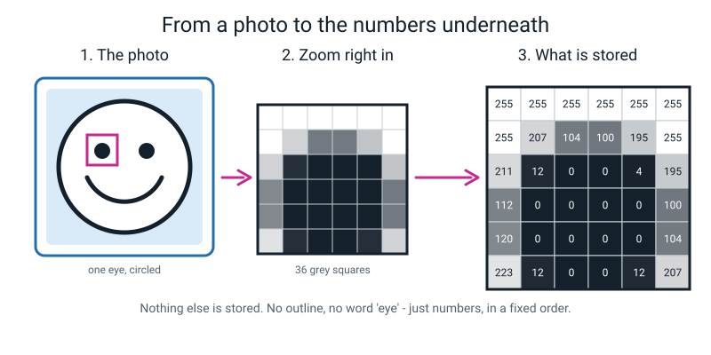
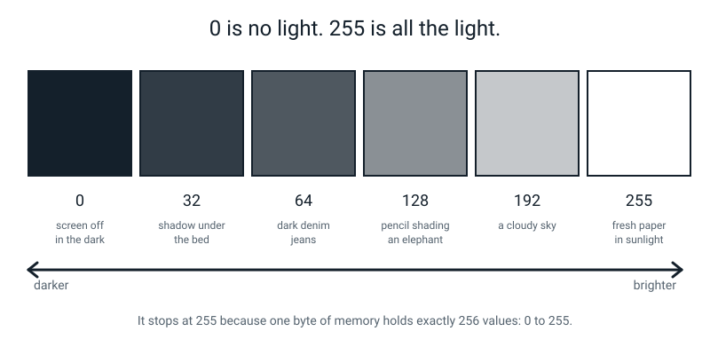
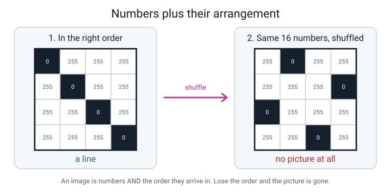
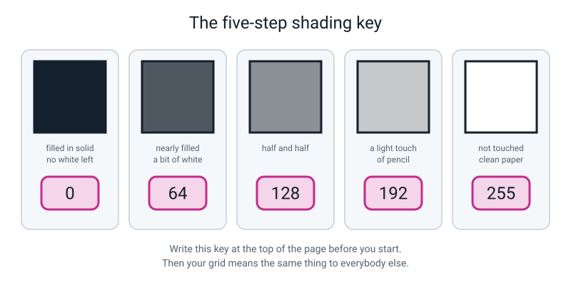
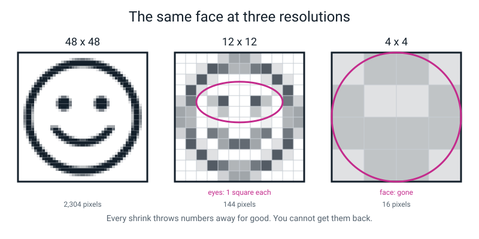
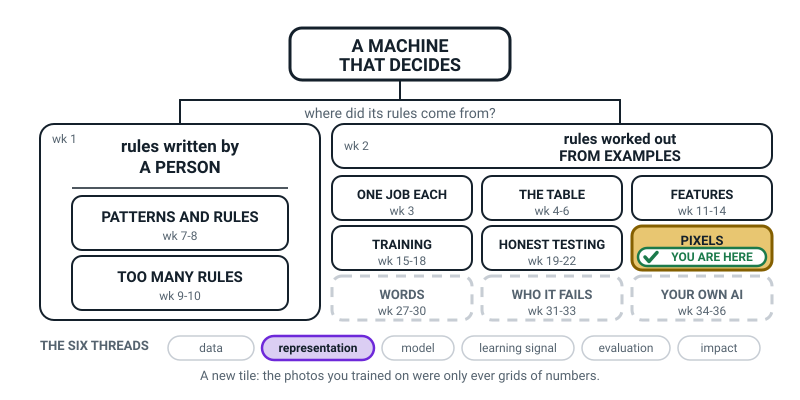
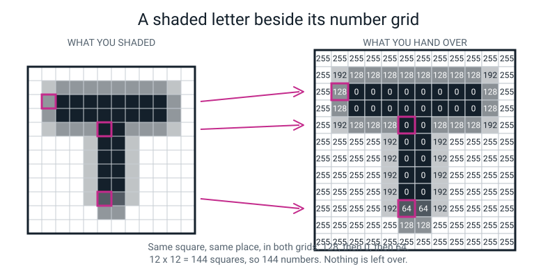
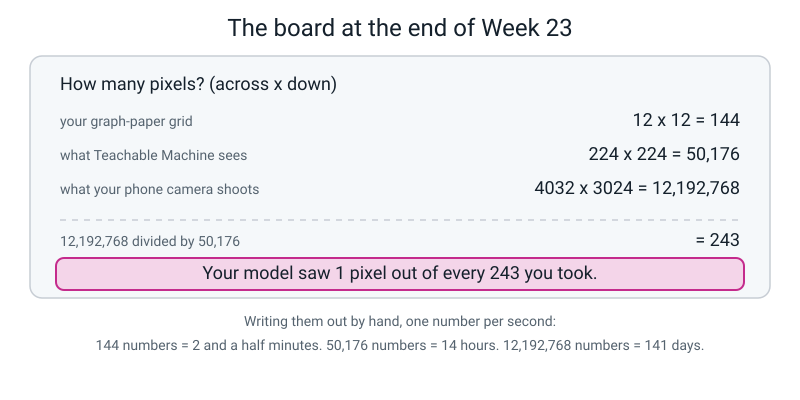

# Week 23 — A Photo Is Just a Grid of Numbers

[⬅ Week 22](week-22.md) · [Course Home](../README.md) · [Week 24 ➡](week-24.md) · [Student Guide](../student-guide/week-23.md) · [Workbook](../workbook/week-23.md)

---

## 📋 At a Glance

| | |
|---|---|
| **Duration** | 70 minutes (works in 60 if you shorten the Activity to 15 and set the resolution sums as homework) |
| **Type** | 🟦 Teach |
| **Big idea** | To a computer a picture is nothing but a grid of brightness numbers running from 0 to 255. |
| **New vocabulary** | pixel · grayscale · resolution · megapixel |
| **Materials** | 5 mm graph paper (4 sheets), a **soft pencil (B or 2B)**, eraser, ruler, 2 sheets of plain paper, a calculator (or phone calculator), a dark-coloured pen for the board |
| **Tech needed** | **None required.** A phone with a photo on it is a nice 30-second extra in the Hook, and that is the only screen in the lesson. |
| **Prep time** | 15 minutes the night before + 5 minutes on the day |

---

## 🎯 Lesson Objectives

By the end of this lesson your student can:

1. **Explain what a pixel is**, and say out loud what 0, 128 and 255 mean in a grayscale image — without looking it up.
2. **Convert a shaded drawing into a grid of numbers** using the five-step shading key (0, 64, 128, 192, 255), one square at a time, with no squares skipped.
3. **Reconstruct a picture from numbers alone.** Hand you 144 numbers and nothing else, and you can shade their drawing back into existence.
4. **Compute how many pixels an image has from its resolution** — 12 × 12, 224 × 224, and a 12-megapixel photo — showing the multiplication.

---

## 🧑‍🏫 What YOU Need to Know First

*Read this section once, slowly. It takes about 12 minutes. When you finish it you will genuinely
understand how a computer stores a picture. There is no hidden extra layer, no "well actually" that
gets sprung on you later in the course. This is the real thing, and it is small enough to hold in
your head.*

### The one-sentence version

**A picture, inside a computer, is a rectangle of whole numbers. Each number says how bright one
tiny square is: 0 means pitch black, 255 means brightest white, and everything in between is a grey.**

That is it. Not a description of a picture. Not a code that points at a picture stored somewhere
else. The numbers **are** the picture. If you have the numbers and you know what order they came in,
you have the picture, exactly, with nothing lost.

### Where we are in the story

Last week (Week 22) your student opened a sealed envelope, scored fifteen photos their model had
never seen, and found the class it was worst at. They wrote down a number. Then they hit a wall,
because the obvious next question has no obvious answer: **why?**

You cannot ask a model why. It has no words. It never saw your student's sock. It never saw a
sock-shaped thing at all.

What it actually received was a rectangle of numbers. So if you want to know why it failed, you have
to stop looking at the photo and start looking at the numbers. This week is where we go and look.

This is also, honestly, the most fun week in the whole term. The lesson contains a genuine magic
trick that works every single time, needs nothing but graph paper, and ends with your student
believing something they did not believe an hour earlier.

### 1. A pixel is one square, holding one number

> **Pixel** — one tiny square of a picture, and the smallest piece a computer can store. The word is a squashed-together version of "**pic**ture **el**ement".

Hold a bright phone screen right up against your eye — closer than you can focus. Look at a plain
white area. If the screen is bright enough and your eye is close enough, the smooth white breaks
apart into a grid of tiny dots or stripes of light. Those are not an illusion. They are the screen's own
tiny lights, one small cluster per pixel, and the picture is nothing but how bright each one is.
There is nothing else there.


*Figure 23.1 — Zoom in far enough and the photo stops being a picture. It was always a grid of numbers; you just could not see the grid.*

> **Grayscale** — a black-and-white picture where each pixel is a single number for brightness, and nothing else.

In a grayscale picture, every pixel holds **one whole number from 0 to 255**:

| Number | Looks like | Everyday anchor |
|---:|---|---|
| 0 | pure black | a switched-off screen in a dark room |
| 32 | very dark grey | the shadow under a bed |
| 64 | dark grey | dark denim jeans |
| 128 | middle grey | pencil shading; an elephant |
| 192 | light grey | a cloudy sky |
| 255 | pure white | fresh paper in sunlight |


*Figure 23.2 — The whole range, with an everyday anchor for each step. Low number = little light. High number = lots of light.*

**The direction matters and it catches adults out too.** 0 is *dark*, not *empty*. Think of the
number as **how much light is coming out of that square**. 0 light = black. 255 = as much light as
the screen can make. If you find yourself thinking "0 must be white, because paper is white and
that's where you start", stop and re-anchor on light. A cinema before the film starts is 0.

**Why does it stop at 255 and not 100, or 1000?** Because computers store things in **bytes**, and
one byte holds exactly 256 different values: 0, 1, 2, … , 255. Nobody chose 255 because it was
tidy. It is simply what fits in one byte, and one byte per pixel is cheap. That is the entire
reason. Say that one sentence and move on — it is a satisfying fact, not a topic.

🍕 **The analogy that works: a mosaic wall.** A mosaic is a picture made of hundreds of small
coloured tiles. Stand close and you see tiles. Stand back and you see a face. Nobody carved a nose —
the nose is what happens when enough tiles agree. A digital picture is a mosaic where every tile is
a number, and your eye does the standing-back.

### 2. Numbers **plus their arrangement**

Here is the part that turns a fact into an idea, and it is worth ten minutes of your attention.

The number 255 sitting in row 2, column 2 does not carry a little label saying "I live in row 2,
column 2". Nothing stores that. The computer knows where each number belongs only because the
numbers arrive **in a fixed order**: row 1 left to right, then row 2 left to right, then row 3, all
the way down.

Shuffle the order and the picture is destroyed — even though every single number is still there,
and the total is unchanged, and the average brightness is unchanged.


*Figure 23.6 — Sixteen numbers on the left; the same sixteen numbers on the right. One is a line. The other is nothing. A picture is numbers **and** their order.*

This is why "a photo is just a list of numbers" is not quite right, and your student will notice.
A photo is a list of numbers **in a known arrangement**. Both halves are load-bearing. It is also
the cleanest possible answer to the question "so is a picture the same as a spreadsheet?" — yes,
genuinely, and in Week 26 you will build one in a spreadsheet and it will look like a picture.

### 3. The five-step shading key (and why five and not 256)

Today your student turns a pencil drawing into numbers by hand. Nobody can shade 256 distinguishable
darknesses with a pencil, and nobody needs to. We use five steps:


*Figure 23.3 — The key. Write it at the top of the page before you start, so your numbers mean the same thing to everyone else.*

| How the square is shaded | Number |
|---|---:|
| Filled in solid, no white left | **0** |
| Nearly filled, a bit of white showing | **64** |
| Half-and-half | **128** |
| A light touch of pencil | **192** |
| Not touched at all — clean paper | **255** |

Two things to know about this key before you teach it.

**First: it is a real thing, not a teaching simplification.** Reducing many brightness levels down to
a few is exactly what happens when a photo is saved in a small format, and the word for it is
*quantising*. You do not need that word. But you should know that the activity is not a toy version
of the idea — it is the idea, at a size a person can do by hand.

**Second: the interesting squares are the half-and-half ones.** When your student outlines a letter
and starts numbering, most squares are easy — solidly inside (0) or solidly outside (255). The
squares that sit on the *boundary* of the letter are the ones they will hesitate over, argue about,
and get wrong. Those grey boundary squares are where all the disagreement in today's activity will
live, and that is not a flaw in the activity. **Real cameras do exactly the same thing at every
boundary in every photo they take.** There is a proper name for those grey edge squares, and your
student meets it next week. Do not name it today. Today it is enough that they *notice* the greys
cluster along the outline.

### 4. Resolution, and why 12 megapixels becomes 224 × 224

> **Resolution** — how many pixels a picture has, written as width × height. More pixels = more detail = more numbers to store.
>
> **Megapixel** — one million pixels. A "12-megapixel camera" makes pictures of about 12 million pixels.

A phone camera might shoot **4032 × 3024**. Multiply it out:

```
   4032 × 3024 = 12,192,768 pixels
```

Twelve million, which is where "12 megapixel" comes from. Now the number that lands hardest:
Teachable Machine — the tool your student used in Week 17 to train their model — does **not** look at
12 million pixels. Before training, it squashes every photo down to **224 × 224**.

```
   224 × 224      =     50,176 pixels
   12,192,768 ÷ 50,176  =  243
```

Their model saw **one pixel out of every 243 they took**. Two hundred and forty-two out of every 243
were thrown in the bin before training even started.

Sit with that for a moment, because it quietly explains an enormous amount. If the thing that tells
two of their classes apart is *thin* — the teeth of a comb, a hairline crack, small printed text —
the model may literally never have seen it. That is not the model being stupid. The information was
deleted before the model was born.


*Figure 23.5 — The same drawing at 48 × 48, 12 × 12 and 4 × 4. At 48 it is a face. At 12 each eye is one square. At 4 there is no face left at all. Circled: what died at each step.*

Show this figure and ask one question: *"at which of the three could you still tell whose face it
is?"* That is the whole argument about resolution, in one image, and it takes twenty seconds.

**Why would anyone throw away 99.6% of a photo on purpose?** Four practical reasons, and it is
worth being able to say them: 12 million numbers per photo × 60 photos is far too much for a web
browser to hold; small pictures train in seconds instead of hours; most fine detail genuinely
does not help tell a sock from a glove; and, the main one, Teachable Machine builds on a ready-made
network (MobileNet) that takes fixed 224 × 224 input, so every photo must be made that size. (Training
is quick mostly because only the last part of that network is trained, so reasons 1 and 2 explain why
the size is sensible rather than why it is exactly 224.)

*You do not teach the shrinking arithmetic today.* Next week is entirely about that. Today you only
need the pixel **counts**, which is straight multiplication.

### The two misconceptions you will actually meet

**Misconception 1 — "the big numbers are where the pencil is."** This is the single most common slip
and it will happen within four minutes of starting the activity. Your student shades a letter, then
writes 255 in the shaded squares because 255 feels like "full" and "lots of pencil". The fix is not
to correct the number, it is to re-anchor the meaning: *the number is how much light comes out of
that square.* Pencil blocks light. More pencil = smaller number. Point at Figure 23.2 and ask
"which end is the dark end?" Then let them fix it themselves.

**Misconception 2 — "the numbers are a description, and the real picture is stored somewhere else."**
This one is quieter and more important. A student can do the whole activity and still believe the
computer keeps an actual little picture in a drawer, with the numbers as a sort of index card
attached to it. Kill this off in the Activity: you are going to reconstruct their drawing from
nothing but their numbers, having never seen the drawing. If numbers were merely a description,
that would not be possible. It is possible, because there is nothing else.

A third one to have ready, in case it comes up: **"grayscale means low quality."** It does not.
Grayscale means one number per pixel instead of three. A grayscale photo can be enormously detailed
— hospital scans, most old photography. It is missing colour, not detail.

### How deep to go, and where to stop

| Go here | Stop here |
|---|---|
| 0 = black, 255 = white, one number per pixel | Binary. Say "one byte holds 256 values" once and move on. Do not write out 11111111. |
| Numbers plus their arrangement | Rows-and-columns notation, matrices, coordinates. "Row 5, column 4" in plain words is plenty. |
| Pixel counts from a resolution (multiplication) | Averaging blocks to shrink an image. **That is next week.** If it comes up, say "that is exactly next week's lesson" and write it on the board as a promise. |
| "The file on your phone is a squashed version, and it gets unsquashed back into a grid before anything looks at it" | JPEG, compression, file formats, lossy vs lossless. One sentence, no more. |
| Colour is coming next week | RGB, channels. Do not start. Colour eats forty minutes and you have twenty. |

If your student asks something you cannot answer, the honest sentence is: *"I don't know — write it
on the question list and we'll find out."* Keep a running question list. It models the right
behaviour better than a confident guess does.

---

### 🧭 The Growing Map

A new box lights up today — **PIXELS** — and only **representation** is lit at the bottom. That is
deliberate. This is a one-idea week, and the idea is about the *form* a picture takes, not about models,
training or scores. If a learner notices that only one pill is lit, you can tell them honestly: some
weeks are one idea done properly.



*Figure 23.0 — Week 23's version. PIXELS newly tinted and badged, HONEST TESTING now finished in white
with its full range, and a single lit thread along the bottom.*

**What to do with it, in about two minutes at the end of the lesson:**

1. **Show it and ask:** *"which bit did we do today?"* They will point at the new box. Follow it
   straight away with *"and what is a picture, in six words?"* — you are listening for **one number per
   square, in order**. If the words *in order* are missing, the second half of the lesson has not
   landed and it is worth thirty more seconds.
2. **Then the better question:** *"why is PIXELS a new box instead of just part of THE TABLE?"* This is
   a genuinely good thing to wonder and the honest answer is small: it *is* a table, one number per
   cell — but it is the first table where the **arrangement** of the cells carries meaning. Every table
   before this one could have its columns shuffled without harm.
3. **Have them add PIXELS to their own map** and write *0 = black, 255 = white* underneath it. That one
   line gets used in every one of the next three lessons, so it is worth having in their handwriting.

> **🧑‍🏫 Why this is worth two minutes.** Weeks 15 to 22 were about a tool doing something invisible to
> their photographs. The map makes today read as a lid coming off rather than a change of subject: same
> photos, now readable. Learners who make that connection stop treating image AI as magic, which is
> most of the work of the next three weeks already done.

**The six threads** along the bottom are the spine of all four levels. Only **representation** is lit
this week. Do not quiz them on the threads; the map is orientation, never assessment.

---

## 🧰 Prep Checklist

**15 minutes the night before**

- [ ] **Buy or find real 5 mm graph paper** — at least 4 sheets. This matters more than it sounds. Printed graph paper usually comes out too small to write a three-digit number inside a square. If you must print, print at 8 mm or 10 mm squares, not 5 mm. *(If you were prepping ahead in Week 22, you already have this.)*
- [ ] **Find a soft pencil — B or 2B.** The activity depends on shading at five clearly different darknesses. With a hard HB or a 2H, "half-and-half" and "a light touch" look identical and the whole activity turns mushy.
- [ ] **Do the activity yourself, once, on one sheet.** Twelve by twelve, one letter, all 144 numbers. It takes about 12 minutes and it is the single highest-value thing you can do tonight. You will find out how long it really takes, where the fiddly squares are, and how the greys behave.
- [ ] **Read Figure 23.2 and Figure 23.3 until you can say the key from memory.** You will be asked "is this one a 64 or a 128?" perhaps fifteen times.
- [ ] Print or copy out the **6 × 6 letter L** grid from the Worked Example below onto paper, so you are not inventing it live.
- [ ] Check the last row of the arithmetic on Figure 23.7 with a calculator so you are confident saying it out loud.

**5 minutes on the day**

- [ ] Rule a **12 × 12 box** on one sheet of graph paper for your student (or let them do it — it takes 90 seconds and is good ruler practice).
- [ ] Write the five-step shading key on the board, top corner, and leave it there all lesson.
- [ ] Put two sheets of plain paper aside: one for the numbers they hand you, one for you to reconstruct on.
- [ ] Have a calculator within reach for the resolution sums.

**If something fails**

There is no tool to fail this week — that is deliberate, and it is a relief after Week 22. The two
things that can still go wrong:

- **No graph paper at all.** Rule a 12 × 12 grid with a ruler on plain paper, 1 cm squares. It takes five minutes and works fine. Or drop to **8 × 8** (64 squares), which loses nothing conceptually.
- **Only a hard pencil.** Drop the five-step key to a **three-step key: 0 (solid), 128 (half), 255 (blank)**. Everything in the lesson still works; you lose a little of the boundary-argument richness. Say so out loud — "we're using three steps today instead of five" — rather than pretending.

---

## ⏱️ The Lesson, Minute by Minute

| # | Segment | Minutes | What happens |
|---|---|---|---|
| 1 | 🪝 Hook — the question we cannot answer | 0–8 | Why did the model get socks wrong? Zoom into a photo until it stops being a photo. |
| 2 | 🧠 Concept — one number per square | 8–26 | Pixel, 0–255, the ramp, the shading key, and why order matters. |
| 3 | 🔍 Worked Example Together — the 6 × 6 L | 26–40 | Shade it, number it, check it, on the board, together. |
| 4 | 🎲 Activity — Become a Pixel Grid | 40–60 | The 12 × 12 letter, the handover, and the reconstruction. |
| 5 | 🔑 Wrap & Assign — resolution arithmetic | 60–70 | 144, 50,176, 12 million, 243. Then homework. |

---

### 1 · 🪝 Hook — the question we cannot answer (0–8 min)

**Say this:**

> "Last week you opened the envelope, scored fifteen photos, and found the class your model was
> worst at. You wrote down a number and you were honest about it, which is more than most people
> manage. And then you got stuck on the next question, which is: *why?*
>
> So let's ask it. Go on — ask your model why it thought the glove was a sock."
>
> *(Wait. Let the silence sit there for a few seconds. It is doing work.)*
>
> "You can't, can you. It has no mouth and no words. It never saw your glove. Here is the thing that
> is going to sound like a riddle and is actually just true: **it has never seen a glove-shaped
> thing in its life.** It has never seen a shape at all.
>
> What it got was a rectangle of numbers. That's the whole delivery. No picture, no shapes, no
> labels saying 'the glove is over here and the table is over there'. Just numbers, in rows.
>
> So if we want to know why it failed, we have to stop looking at your photos and start looking at
> what it actually received. And today we're going to go and look. By the end of the lesson you are
> going to hand me a page with 144 numbers on it and nothing else, no drawing, and I am going to
> draw your picture back."

**Do this:**

If you have a phone, take 30 seconds: open any photo, pinch-zoom in as far as it will go, on
somebody's eye or a letter of text. Keep going past the point where it looks bad. The smooth photo
turns into blocks of flat colour. Hand the phone over and let them zoom it themselves. Then draw
Figure 23.1 on the board as three boxes: photo → magnified corner → numbers.


*Figure 23.1 (again) — the board sketch for the Hook. Three boxes: the photo, the magnified corner, the numbers underneath.*

**Ask this:**

- **"When you zoomed all the way in, what were the blocks? Were they always there, or did zooming create them?"**
  - *Hoping for:* "They were always there, I just couldn't see them."
  - *If they say "zooming made them":* fair mistake — that is what it looks like. Say: "Zooming can't add squares that weren't there. Think of a mosaic wall: standing close doesn't make tiles, it just lets you see the tiles." Then re-ask.
- **"If I gave you a photo and asked you to send it to me down a phone line where you can only say numbers out loud — could you?"**
  - *Hoping for:* hesitation, then "maybe, if I told you where each one goes?"
  - *If they say no:* "By the end of today you will have done it, so hold that thought."

---

### 2 · 🧠 Concept — one number per square (8–26 min)

**Say this:**

> "New word, and it's a word you already half know. **Pixel.** A pixel is one tiny square of a
> picture — the smallest piece a computer can store. The word is just 'picture element' squashed
> together, which is a very boring origin for such a good word.
>
> Now the important bit. In a black-and-white picture, each pixel holds **one number**, and that
> number says **how much light comes out of that square**. Not how much pencil. How much *light*.
>
> The number runs from 0 to 255. **0 is pitch black** — a cinema before the film starts, a screen
> switched off in a dark room. **255 is the brightest white the screen can do** — fresh paper in
> sunlight. And in between you get greys. 128 is middle grey, the colour of pencil shading, or an
> elephant.
>
> Here's the whole range." *(Point at the ramp.)*
>
> "Now, why does it stop at 255? Why not 100, or 1000? Because computers store things in **bytes**,
> and one byte holds exactly 256 different values — 0, 1, 2, all the way to 255. Nobody picked 255
> because it was pretty. It's just what fits. That's the entire reason, and you now know something
> most adults don't."

**Do this:** draw the ramp on the board as six boxes, shaded from solid to blank, with the numbers
0, 32, 64, 128, 192, 255 under them. Write **"the number = how much LIGHT"** above it, and box it.
Leave that box on the board for the rest of the lesson; you will point at it repeatedly.

Then the second half of the segment — the ordering idea.

**Say this:**

> "One more thing before we start drawing, and it's the bit that makes this a real idea instead of
> a fact.
>
> Look at this square here" *(point at one cell)* "holding 255. Does it come with a little label
> saying 'I live in row 2, column 5'? No. Nothing stores that. The computer only knows where each
> number goes because they arrive **in a fixed order**: row 1 left to right, then row 2 left to
> right, all the way down.
>
> So what happens if I keep all your numbers but shuffle them?"

**Do this:** draw Figure 23.6 on the board — a 4 × 4 grid with four dark squares on the diagonal,
then the same four dark squares scattered. Same numbers. Same total. Same average. One is a line;
the other is noise.


*Figure 23.6 (again) — the board sketch. Left: a line. Right: exactly the same sixteen numbers, shuffled, meaning nothing.*

**Say this:**

> "So a picture isn't just a pile of numbers. It's numbers **plus the order they arrive in**. Both
> halves matter. Lose the order and you've still got every number and no picture at all.
>
> Last thing, then we draw. We can't shade 256 different darknesses with a pencil — nobody can. So
> we're going to use five steps." *(Write the key.)* "Solid black is 0. Nearly filled is 64.
> Half-and-half is 128. A light touch is 192. Untouched paper is 255. Write that key at the top of
> your page every time, so your numbers mean the same thing to me as they do to you."

**Ask this:**

- **"I've shaded this square in solid black. What number do I write?"**
  - *Hoping for:* "0."
  - *If they say 255:* do not say "wrong". Point at the boxed reminder and ask: "How much light is coming out of a solid black square?" They will get there. This mistake is so common it is practically part of the lesson.
- **"What's the number for a square you didn't touch at all?"** → 255. If unsure: "How much light comes off white paper? All of it."
- **"If I read you 144 numbers but in a random order, could you draw my picture?"**
  - *Hoping for:* "No, because I wouldn't know where they go."
  - *If they say yes:* ask them to try it with your shuffled 4 × 4 on the board. Thirty seconds of trying beats any explanation.
- **"Two people shade the same letter. One writes 128 for the edge squares, one writes 64. Who's right?"**
  - *Hoping for:* "Depends how dark they shaded it" / "They need the same key."
  - *This is the answer you want to plant*, because it is exactly what the Activity is about to demonstrate.

---

### 3 · 🔍 Worked Example Together — the 6 × 6 letter L (26–40 min)

Do this one **together, on the board**, before they do a bigger one alone. Six by six is 36 squares,
which is small enough to finish in ten minutes and big enough to be a real letter.

**Say this:**

> "Before you do a big one, let's do a small one together, and I'll do the drawing.
>
> Six across, six down. I'm going to draw a fat capital **L** in it, filling most of the box, and
> I'm going to leave one square deliberately awkward — see this one at the bottom right? My L stops
> halfway across it. That square is going to be the interesting one.
>
> Now we number it. Rule: go along row 1 left to right, then row 2, and say every number out loud —
> including the boring ones. Do not skip the 255s. Skipping is how you lose your place, and once
> you've lost your place the whole grid is scrap."

**Do this:** draw a 6 × 6 grid on the board. Shade a fat L: solid in column 2 and 3 from row 2 to
row 5, and along row 5 from column 2 to column 5, with the bottom-right square (row 5, column 6)
only *half* shaded. Then fill in the numbers together, calling them out. The finished board:

```
        c1    c2    c3    c4    c5    c6
   r1   255   255   255   255   255   255
   r2   255    0     0    255   255   255
   r3   255    0     0    255   255   255
   r4   255    0     0    255   255   255
   r5   255    0     0     0     0    128
   r6   255   255   255   255   255   255
```

Then three checks, out loud, in this order:

1. **"How many squares altogether?"** 6 × 6 = 36. Count the numbers you wrote. If you have 35 or 37, you skipped or doubled one — find it now.
2. **"How many pure black squares?"** Ten. (Two in each of rows 2, 3 and 4 = 6, plus four in row 5.)
3. **"What is the average brightness of the whole picture?"** Do this one properly on the board:

```
   sum  = (10 × 0) + (1 × 128) + (25 × 255)
        = 0 + 128 + 6375
        = 6503

   average = 6503 ÷ 36 = 180.6
```

**Say this:**

> "180.6. That's a light-ish grey. Which makes sense — most of this picture is blank paper. And
> notice something: that one number, 180.6, tells you the picture is mostly bright. It tells you
> absolutely nothing about it being an L. You could shuffle all 36 numbers and the average would be
> exactly the same. Averages throw the arrangement away. Remember that — it comes back in two weeks
> when we start hunting for edges."

**Ask this:**

- **"Which square did we argue about, and why?"**
  - *Hoping for:* "The bottom right one, because the L only covers half of it."
  - *If they shrug:* point at it. "My L stops in the middle of this square. Is it black or white?" → neither → 128.
- **"Where are all the half-and-half squares in a normal drawing?"**
  - *Hoping for:* "On the edges of the shape."
  - *If they say "everywhere" or "in the middle":* ask them to point at a middle square of your L and say what's in it (all pencil, no doubt at all). The doubt only lives on the boundary.
- **"If I read you these 36 numbers over the phone, could you draw my L?"** → Yes, as long as you say them in order and say how wide the grid is. **Both** facts are needed. If they only say "in order", ask: "In order, but is it 6 across or 4 across or 9 across?" That is a genuinely necessary piece of information and it is easy to forget.

---

### 4 · 🎲 Activity — Become a Pixel Grid (40–60 min)

Full instructions are in the next section. In the lesson flow, it runs like this:

**Say this:**

> "Your turn, and this time it's twelve by twelve — 144 squares — and I'm not allowed to see the
> drawing.
>
> Here's the deal, and it's a proper challenge, so listen to all of it. You rule a 12 by 12 box.
> You pick a capital letter and you shade it in, filling most of the box. You do **not** tell me
> which letter. Then you turn every square into a number using our five-step key, and you copy
> those numbers — just the numbers, no drawing, no hints — onto a clean sheet.
>
> Then you fold the drawing over, hand me the numbers, and I will shade in your letter without ever
> seeing it. If I get it right, that proves something: that the numbers weren't a *description* of
> your picture. They **were** your picture.
>
> One rule, and it's the one that makes or breaks this: **go in order and don't skip.** Row 1 left
> to right, then row 2. Say them out loud if it helps. Twelve numbers per row, twelve rows."

**Do this:**

1. Hand over graph paper, soft pencil, ruler. Make sure the shading key is visible.
2. Let them draw and shade — about 5 minutes. **Do not look at the drawing.** Turn your chair away and mean it; the theatre matters.
3. They number the squares on the drawing itself — about 7 minutes. This is the long bit.
4. They copy the numbers onto a clean sheet — about 3 minutes.
5. They fold the drawing away. You take the numbers and shade a blank 12 × 12 grid — about 4 minutes. Shade as you read, out loud: "255, 255, 255… ah, here we go, zeros starting."
6. Announce the letter. Then unfold and compare, square by square, anywhere the two disagree.


*Figure 23.4 — What finished work looks like: the shaded 12 × 12 letter, its completed number grid, and three squares traced from one to the other.*

**Ask this — the two questions that matter, at the end:**

- **"Where did we disagree?"**
  - *Hoping for:* "On the edge squares" / "the greys".
  - *This is the whole point of the activity.* Nine times out of ten every disagreement is a boundary square: they wrote 128 and you shaded it darker than they drew it, or they wrote 192 and you left it near-white. The solid interior and the blank background always match.
- **"So whose fault is a disagreement — yours or mine?"**
  - *Hoping for:* "Neither, really — that square genuinely was half-and-half."
  - *If they blame themselves:* don't allow it. Say: "You drew a smooth line across a square grid. There is no correct answer for a square the line goes through. Cameras have exactly this problem in every photo they take, and next week that grey edge gets a proper name."

---

### 5 · 🔑 Wrap & Assign — resolution arithmetic (60–70 min)

**Say this:**

> "Two words to finish, and then some multiplication that I think will annoy you.
>
> First word: **resolution.** It's just how many pixels a picture has, written width times height.
> Yours today was 12 by 12. Second word: **megapixel** — one million pixels. That's it. 'Mega'
> means million.
>
> Now. How many numbers did you just write out by hand?"

**Do this:** build this on the board, one line at a time, asking for each multiplication before you
write the answer. Let them use the calculator for the big ones.

```
   your grid                12 × 12      =        144 pixels
   what Teachable Machine sees   224 × 224      =     50,176 pixels
   what a phone camera shoots  4032 × 3024      = 12,192,768 pixels   ("12 megapixels")

   12,192,768 ÷ 50,176 = 243
```


*Figure 23.7 — The finished board. Copy this layout; the last line is the punchline.*

**Say this:**

> "So: your model, the one you spent Week 17 training and Week 22 testing — it saw **one pixel out
> of every 243** that your camera recorded. Two hundred and forty-two out of every 243 got thrown in
> the bin before training even started.
>
> Now think back to last week. You found the class your model was worst at, and you guessed at a
> cause. Is it possible that the thing that made that class special was *thin*? Thin enough to
> disappear when a photo gets shrunk by 243 times?
>
> One last bit of arithmetic, for scale. It took you about ten minutes to decide and write 144
> numbers. Let's be generous and say the writing alone could go at one number per second. At one per second: 144 numbers takes two and a half minutes. 50,176
> numbers takes **fourteen hours**. And 12,192,768 numbers takes **141 days**, non-stop, no sleeping.
> That's what one photo is. You've written out about one 85,000th of a photograph — roughly a thousandth of one percent."

**Ask this:**

- **"12 × 12 — how many pixels?"** → 144. If they say 24, they added instead of multiplying: "Twelve rows, and how many in each row?"
- **"224 × 224 — bigger or smaller than a hundred thousand?"** → smaller; 50,176. Good estimation practice before reaching for the calculator.
- **"Does the model see more or less than your camera captured?"** → Much less. If they say more: point at 50,176 vs 12,192,768 on the board.
- **"Guess: how many numbers in a *colour* photo of the same size?"** → Take any guess, then say: "Hold that. It's next week's whole lesson, and the answer is three times as many."

Then assign homework (see 📤 below) and stop.

---

## 🎲 The Activity, In Full

### Become a Pixel Grid

**The point:** to prove, physically, that a picture can be transmitted as nothing but numbers — and
to discover by accident that the boundary squares are where all the argument lives.

**Time:** 20 minutes. (5 draw · 7 number · 3 copy · 4 reconstruct and compare.)

**Materials**

| Item | Why |
|---|---|
| 5 mm graph paper, 2 sheets | one to draw on, one for the numbers |
| Soft pencil, B or 2B | five distinguishable darknesses need a soft pencil |
| Eraser | they will change their mind about the letter |
| Ruler | for the 12 × 12 box |
| One blank 12 × 12 grid for YOU | to reconstruct on |
| The shading key, visible | on the board, in the corner, all lesson |

**Setup (2 minutes, before you start the clock)**

1. Rule a 12 × 12 box on the graph paper. On 5 mm paper that is a 6 cm square. Number the rows 1–12 down the left side and the columns 1–12 across the top — **this is not optional**, it is what stops them losing their place.
2. Write the five-step key in the top corner of the page.
3. Rule a second, empty 12 × 12 box for yourself, with rows and columns numbered the same way.

**The rules — read them out**

1. Pick a **capital letter**. Anything with a straight bit and, ideally, a diagonal or a curve: T, L, H, A, K, S, E.
2. Draw it so it **fills most of the box** and is **at least two squares thick** everywhere. A one-square-thick letter is a bad picture and it makes the reconstruction ambiguous.
3. Shade it with the pencil. Let the outline fall wherever it falls — **do not** carefully align it to the grid lines. The whole point is that some squares end up half covered.
4. **Do not tell the teacher the letter.**
5. Number every square using the key. **Go in order: row 1 left to right, then row 2.** Never skip a square, not even a blank one.
6. Copy the numbers onto the clean sheet. Numbers only. No arrows, no outline, no hints.
7. Fold the drawing so it cannot be seen. Hand over the numbers.

**What the teacher does**

Take the numbers. Shade your blank grid: 0 solid, 64 nearly solid, 128 half, 192 a light touch, 255
leave it. Read the numbers out loud as you go — the running commentary is what makes it feel like a
transmission rather than a puzzle. Then say the letter out loud **before** unfolding anything.

**What "finished" looks like**

- 144 numbers written on the drawing, in the grid, none missing.
- 144 numbers copied onto a clean sheet, matching.
- Your reconstruction, and the correct letter named out loud.
- Both grids side by side with every disagreement circled — usually between 2 and 8 squares, all of them on the letter's boundary.
- One sentence written underneath, in the student's own words, about *why* those particular squares were the ones that disagreed.

**Variation — easier**

Drop to **8 × 8** (64 squares) and a **three-step key**: 0 solid, 128 half, 255 blank. This cuts the
writing by more than half and removes the "is it 64 or 128?" hesitation, while keeping every single
idea intact. Use it if numbering the first two rows takes more than three minutes, or if the
five-way shading judgement is causing real distress rather than useful arguing.

**Variation — harder**

Two extensions, both good:

1. **The blind pair.** They draw and number a 12 × 12 *without* letting you see it, and *you* draw and number a different one without letting them see it. Swap number sheets. Both reconstruct. Now the student is on the receiving end, which is where the "so the numbers really are the whole picture" penny drops hardest.
2. **Draw something that isn't a letter** — a smiley face, an arrow, a house. Curves generate far more grey boundary squares than straight letters do, so the disagreement count goes up sharply. Then ask the honest question: *"was that harder to send, or just longer?"* (Answer: longer, not harder. Which is exactly why computers do it and we don't.)

---

## ❓ Questions Students Ask This Week

**"Why 255? That's such a weird number to stop at."**
Because computers store things in bytes, and one byte holds exactly 256 different values: 0, 1, 2,
all the way up to 255. It stops at 255 because that is where one byte runs out. If you ever see 256
where you expected 255, that is why — 256 values, the last one numbered 255, because zero counts.

**"Is 0 white or black? I keep getting it backwards."**
Black. The trick is to stop thinking about paper and start thinking about a lamp. The number is how
much light comes out of the square. 0 light is black. 255 is the most light the screen can make. If
you are working with a pencil it feels backwards, because more pencil means a smaller number — but
that is right: pencil blocks light.

**"Can a pixel be 300? Or −5? Or 12.7?"**
No, no, and no. Whole numbers only, and only from 0 to 255. If a calculation gives 300 the software
squashes it back to 255, and if it gives −5 it becomes 0. You will meet that squashing properly in
Week 25, where it has a name and it costs you something real.

**"How big is a pixel?"**
That is a better question than it sounds, and the answer is: a pixel has no size. It is a *number*.
It gets a size only when it is shown on something — on your phone screen a pixel is about a tenth of
a millimetre, on a stadium screen a pixel is the size of your fist, and printed in a book a pixel is
whatever size the printer chose. Same numbers, wildly different sizes. This is the reason a photo can
be both "small" and "huge" at the same time and everyone gets confused.

**"If a photo is 12 million numbers, how does it fit on my phone at all?"**
Because it is stored squashed. There are clever tricks for writing "the next four hundred numbers
are all 255" instead of writing 255 four hundred times, and that is the basic idea behind compression (JPEG uses cleverer tricks, and also throws away a little detail you will not miss). But —
and this is the bit that matters for us — before *anything* looks at that photo, the phone unsquashes
it back into a full grid of numbers. The grid is always what gets looked at.

**"Do our eyes have pixels?"**
Sort of, and this is where it gets genuinely interesting. Your eye has about 100 million light
detectors, so in a rough sense yes. But they are not in a tidy grid — they are spread unevenly, with the ones
that see sharp detail crowded into the middle of your vision — and they do not all report at the same time, and a
lot of processing happens in your eye before anything reaches your brain. So: same basic idea, a
completely different arrangement. A camera records everywhere evenly. Your eye records the middle
extremely well and mostly guesses the rest.

**"How many different greys can a person actually see?" — nobody knows for sure.**
This one is genuinely unsettled, and it is worth saying so. Estimates run from about 30 shades, if
the greys are shown one at a time, up to several hundred if they are side by side where you can
compare them. The number depends on how bright the room is, whether the patches touch, how big they
are, how long you look, and which person is looking. There is no single true answer, which is partly
why 256 levels got chosen — it is enough that in most photos you cannot see the steps
(in a very smooth sky or shadow you sometimes can).

**"Could I write out a whole real photo by hand?"**
Yes, and it would take about 141 days without sleeping, at one number per second — and that is for a
black-and-white one. Which tells you something real: the reason computers are useful here is not
that they are clever. It is that they are fast and they never get bored.

---

## ⚠️ Where This Lesson Goes Wrong

| What happens | Why | What to do right now |
|---|---|---|
| They write **255 in the shaded squares and 0 in the blank ones** — the whole grid is inverted. | 255 feels like "full" and "lots of pencil". It is a meaning error, not a carelessness error. | Do not correct the numbers. Point at the boxed reminder on the board and ask: *"how much light comes out of a solid black square?"* Then let them fix it. Catch it in the first two rows by glancing at row 1 — if row 1 is all 0s and the top of the page is blank paper, it is inverted. |
| They **skip squares** and the row has 11 numbers, so everything after that point is shifted one square and the reconstruction comes out jogged and smeared (or garbled if there are several skips). | 144 squares is genuinely boring and blank squares feel skippable. | Prevention beats cure: insist on numbered rows and columns, and on saying the numbers out loud. Cure: count each row as they finish it. Twelve or start again. It is cheaper to recount row 4 now than to rebuild 100 squares later. |
| The drawing is **carefully aligned to the grid lines**, so every square is 0 or 255 and there are no greys. | Students naturally tidy. It feels like doing it properly. | This kills the best part of the lesson, so head it off before they start: *"let the line fall wherever it falls — I actively want some awkward squares."* If it has already happened, ask them to add a diagonal stroke or a curve to their letter. |
| **The reconstruction fails** — you shade the numbers and the letter is distorted or unrecognisable. | Almost always a skipped square, or a row copied out of order between the drawing and the clean sheet. Occasionally a letter drawn only one square thick. | Do not treat this as a failure — treat it as a bug hunt, out loud, and it becomes the best five minutes of the lesson. Count each row: which row has 11 or 13? That is where the picture broke. Fix it and re-shade. The lesson learned ("one missing number wrecked everything after it") is *more* valuable than a clean success. |
| It takes **twice as long as planned** and there is no time for the resolution arithmetic. | 144 squares at a considered pace is 10–12 minutes for an 11-year-old, not 7. | Plan for it. If you are past minute 58 and still numbering, stop the activity, do the reconstruction with the rows they have finished (a partial letter still reads), and move the resolution sums into homework (Build It Part 3), which is where they already live. |
| They ask **"but where's the actual picture?"** after the whole activity. | Misconception 2 — the belief that the numbers describe a picture stored somewhere else. It survives the activity surprisingly often. | Answer with the activity itself: *"I have never seen your drawing. Not once. The only thing that came across the table was your numbers. So if the picture is somewhere else — where?"* Let them chase it. There is nowhere for it to be. |
| They get **bored halfway through numbering** and start guessing whole rows. | Rows 6 to 9 of a letter are often identical and it feels pointless to write them out. | Name it honestly: *"rows 6, 7, 8 and 9 are identical and writing them out is dull. That dullness is exactly why computers do this and people don't. Four more rows."* Then let them write "same as above" **nowhere** — but do let them copy quickly. Identical rows are a legitimate speed-up to *notice*, and a note on their page saying "rows 6–9 identical" is a genuine observation, not a shortcut. |

---

## 🧭 Differentiation

### If they are struggling

**Cut:** the 6 × 6 worked example goes from the board to a printed sheet they only *number* (you
supply the shaded drawing). Drop the 12 × 12 activity to **8 × 8** and the **three-step key**. Skip
the average-brightness calculation entirely — it is a nice-to-have, not an objective.

**Reteach, in this order:**

1. **Direction first.** Only one thing needs to be secure by the end of the lesson: bigger number = brighter. Do it as a physical sort: write 0, 64, 128, 192, 255 on five scraps of paper, shade a square on each, shuffle them and have the student lay them in order darkest to brightest. Sixty seconds, and it either works or it doesn't, and you know which.
2. **Then one row.** Give them a single row of 12 squares with a shape running through it, and have them number just that row. Twelve numbers. Check it. That builds the habit without the endurance test.
3. **Then the handover.** Even an 8 × 8 reconstruction produces the magic-trick moment, and that moment is the real objective of the week.

If they only get to "0 is black, 255 is white, and my numbers were enough for you to redraw my
letter" — that is a genuinely successful lesson. The arithmetic can wait.

### If they are flying

Extension questions, roughly in order of difficulty. Every one has a worked answer in the Answer Key.

1. **"Your 12 × 12 grid has 144 numbers. How many *different pictures* could a 12 × 12 grayscale grid hold?"** (Warning: the honest answer is 256¹⁴⁴, a number with 347 digits. The interesting part is not the number, it is realising that almost every one of those pictures is meaningless noise. Recognisable pictures are a vanishingly thin sliver of everything possible.)
2. **"Shrink your own letter: cover up the odd rows and odd columns so only 36 squares are left. Can you still read it?"** Usually yes, barely. This is next week's lesson, discovered a week early, which is fine — let them have it.
3. **"Invert your grid — replace every number *v* with 255 − *v*. What happens?"** You get a photographic negative: white letter on black. Good arithmetic, instant visual payoff.
4. **"You wrote 144 numbers in about 10 minutes. How long for a full 12-megapixel photo — first at a generous one number per second, then at your real rate?"** At one per second, about 141 days non-stop; at your real rate (about 4 seconds per number) closer to 590 days. Then: **"and in colour?"** About 423 days.
5. **"Here are two grids with the same average brightness but different pictures. Make me a pair."** Genuinely hard, genuinely doable, and it lands the point that averages destroy arrangement.

### If they won't engage today

Some days the answer is not more explaining. Two things that work, in order:

**First, make it a competition against you.** "You draw a letter, I draw a letter. We swap number
sheets. First one to name the other's letter wins." The reconstruction is fun even when the numbering
is a chore, and being the *receiver* is much more engaging than being the sender.

**Second, shrink the job until it is obviously finishable.** A 6 × 6 grid is 36 numbers and three
minutes. Do that instead, and do it as the swap game. You will hit objectives 1 and 3 (what a pixel
is, and reconstruction) and you can pick up objectives 2 and 4 next week with no damage — Week 24
opens on this same grid.

**What not to do:** do not let them off the "go in order, don't skip" rule as a way of speeding
things up. A grid with skipped squares does not reconstruct, the trick fails, and the lesson ends on
a flat note instead of a good one. Better a finished 6 × 6 than an abandoned 12 × 12.

---

## ✅ Assessing Understanding

Three checks, last five minutes. Ask them exactly like this.

**Check 1 — the direction (10 seconds)**

> "I'm looking at a pixel and it says 20. Bright or dark?"

*A good answer:* "Dark — almost black." Instant, no thinking. If they pause and reason it out from
the ramp on the board, that is a 3, not a 5. If they say "bright", the core idea has not landed and
that is what to reteach next week before anything else.

**Check 2 — the transmission (30 seconds)**

> "I never saw your drawing. Explain to me how I managed to draw your letter."

*A good answer:* names both halves — "I gave you the numbers, and you knew what order they were in
and how wide the grid was, so you could put each one back in the right square." A weaker answer only
mentions the numbers. Prompt once: "Would the numbers alone have been enough, in any order?"

**Check 3 — the arithmetic (60 seconds, on paper)**

> "A picture is 30 pixels across and 20 pixels down. How many pixels is that, and how many numbers
> do you need to store it in grayscale?"

*A good answer:* 30 × 20 = 600 pixels, and 600 numbers, because grayscale is one number per pixel.
The second half is the part that tests understanding — a student who says "600 pixels but I don't
know how many numbers" has the multiplication but not the concept.

### Mastery scale for this week

| Level | What it looks like |
|---|---|
| **1** | Can say the word "pixel". Still gets 0 and 255 the wrong way round more often than not. |
| **2** | Knows 0 is black and 255 is white when reminded of the ramp. Numbered part of a grid but skipped squares and lost the row alignment. |
| **3** | Numbered a complete grid in order with no gaps. Gets the direction right unprompted. Can multiply width × height for pixel count. |
| **4** | All of the above, **plus** can explain why the order of the numbers matters as much as the numbers, and can say where the grey squares come from. |
| **5** | All of the above, **plus** connects it back unprompted: notices that shrinking a photo to 224 × 224 could have deleted whatever made their worst class special, and says so without being asked. |

Aim for 3 by the end of this lesson and 4 by the end of next week. A 5 this week is unusual and
worth telling them about.

---

## 📤 Homework to Assign

**Say this:**

> "The workbook for Week 23 has a few sections. The main one, the one I want done first, is called
> **Build It**, and it has three parts. It should take you about fifty minutes.
>
> **Build It Part 1 — do it again, better.** A second 12 × 12 drawing, converted to numbers. Different letter
> from the one you did today, and this time make it one with a diagonal or a curve in it, because
> those are the ones that produce interesting grey squares. Key at the top of the page, rows and
> columns numbered, all 144 squares filled in, none skipped. About 15 minutes.
>
> **Build It Part 2 — read the grid.** This is the interesting half. There's a number grid printed in your
> workbook and I am not going to show you the picture. Six questions, Q1 to Q6, and a bonus. You have to work out
> what the picture is from nothing but the numbers — which is exactly the job a computer has, every
> time, for every photo. About 20 minutes. Do not guess and move on; point at the numbers that made
> you say it.
>
> **Build It Part 3 — three sums.** Resolution arithmetic. Show the multiplication, not just the answer.
> About 10 minutes.
>
> The other sections, **Warm-Up, Practice Set A, Practice Set B, Puzzle of the Week, Think Deeper,
> Draw It and Self-Check**, are there too. Do Build It first; then work through the rest over the
> week, in the order they appear, and tick the Self-Check last."

**Workbook sections, in the order they appear in `workbook/week-23.md`:**

| Section | Items | What it covers | Suggested use |
|---|---|---|---|
| ✅ Warm-Up (5 min) | W1–W5 | Last week (Week 22): fractions and percentages, baseline, confusion-matrix columns, "40 percent better", training accuracy | Start of the next sitting, before anything new |
| ✍️ Practice Set A — Understand It | A1–A6 | Pixel, 0 to 255, byte, grayscale, match the words, label the brightness ramp (Figure W23.1), the five-step key | Second sitting |
| ✍️ Practice Set B — Use It | B1–B5 | Read a 6 × 6 grid, resolution arithmetic, a missing-number situation, a too-neat-grid situation, mark another student's grid | Second sitting |
| 🧩 Puzzle of the Week | P1–P6 | Three 4 × 4 grids with one average (Figure W23.2); shrinking each to 2 × 2 | Optional stretch |
| 🤔 Think Deeper | T1–T2 | Two written paragraphs | Optional stretch |
| 🛠️ Build It, Part 1 (15 min) | — | A second 12 × 12 drawing turned into numbers, value counts, one sentence on the greys | **Core homework, first** |
| 🛠️ Build It, Part 2 (20 min) | Q1–Q6, Bonus | Read the printed 12 × 12 grid | **Core homework** |
| 🛠️ Build It, Part 3 (10 min) | S1–S3 | Three resolution sums | **Core homework** |
| 🎨 Draw It | — | Three panels from photo to numbers (Figure W23.3) | Last |
| 📊 Self-Check | — | Six "I can" ticks and one question for you | Last; read it before Week 24 |

**Expected time:** Build It is 45–50 minutes. The rest of the workbook is the week's independent
practice and is not timed on the page, so treat the split above as a suggestion and do not expect it
all in one evening. If Build It Part 1 alone is taking more than 25 minutes, they should stop Part 1
and do Parts 2 and 3 — reading a grid is the harder and more valuable skill, and it is what Week 24
builds on. If time is short, the sections to protect are Build It, then Practice Set B1 and the Puzzle.

---

## 🔑 Answer Key

This key follows the workbook's own sections in the order they appear there. Lesson answers come
first, then every workbook section. Values are taken from the workbook's Answers section
(`workbook/week-23.md`), with the teacher notes added.

### Lesson · the 6 × 6 letter L (Segment 3)

```
        c1    c2    c3    c4    c5    c6
   r1   255   255   255   255   255   255
   r2   255    0     0    255   255   255
   r3   255    0     0    255   255   255
   r4   255    0     0    255   255   255
   r5   255    0     0     0     0    128
   r6   255   255   255   255   255   255
```

- **Total squares:** 6 × 6 = **36**.
- **Pure black squares (0):** **10** — two each in rows 2, 3 and 4 (that is 6), plus four in row 5 (c2, c3, c4, c5).
- **Half-and-half squares (128):** **1** — row 5, column 6, where the foot of the L stops midway.
- **Pure white squares (255):** 36 − 10 − 1 = **25**.
- **Sum of all pixels:** (10 × 0) + (1 × 128) + (25 × 255) = 0 + 128 + 6375 = **6503**.
- **Average brightness:** 6503 ÷ 36 = **180.6** (to one decimal place). A light grey, which fits — most of the picture is blank paper.
- **Why the average tells you nothing about it being an L:** shuffling all 36 numbers leaves the sum, and therefore the average, exactly the same. The average discards the arrangement, and the arrangement is where the letter lives.

### Lesson · every "Ask this" question

**Segment 1.** *Were the blocks always there?* Yes — zooming reveals them, it cannot create them; a
mosaic does not grow tiles when you walk closer. *Could you send a photo using only spoken numbers?*
Yes, provided you also say how wide the grid is and you read them in a fixed order.

**Segment 2.** *Solid black square →* **0**. *Untouched paper →* **255**. *144 numbers in random
order →* no, because a number carries no record of where it belongs; position comes only from the
order. *Two people, 128 versus 64 on the same edge square →* both can be right; the number depends
on how much of that square the pencil actually covered, which is why you agree a shared key first.

**Segment 3.** *Which square did we argue about?* Row 5, column 6, because the drawn line stops
halfway through it. *Where do half-and-half squares live?* On the boundary of the shape, essentially
never in the middle of it. *Could you draw my L from 36 spoken numbers?* Yes — but you need two
extra facts: the order they are read in, and that the grid is 6 wide.

**Segment 5.** *12 × 12 =* **144**. *224 × 224 =* **50,176** — smaller than a hundred thousand.
*Does the model see more or less than the camera captured?* Far less: 50,176 out of 12,192,768, which
is 1 pixel in 243. *How many numbers in a colour photo of the same size?* Three times as many —
50,176 × 3 = **150,528** — and that is next week's lesson.

### Workbook · Warm-Up (W1–W5, last week's material)

**W1.** Fraction **9/12** (or 3/4); decimal **0.7500**; percentage **75.0%**.

**W2.** Four equal classes: **25.0%**. Ten cats and two dogs: always say "cat", 10/12 = **83.3%**. The baseline is the score of always naming the commonest class, which equals 1 ÷ classes only when the classes are even.

**W3.** A row total says how many of that class **existed**; a column total says how many times the model was **willing to say** that word.

**W4.** **FALSE.** It is **40 percentage points**.

**W5.** The model was allowed to study those exact photos; the useful number is the **gap** between that 100% and the held-out score.

*Watch for:* 83.3% written as 83% is fine, but 50% for the cats-and-dogs baseline (1 ÷ 2 classes) is the usual slip. If W1 to W5 go badly, that is a Week 22 problem and not a Week 23 one, so note it and move on.

### Workbook · Practice Set A — Understand It (A1–A6)

**A1.** square · store · picture element · 0 to 255 · light · 0 = black (no light), 255 = white (most light) · byte, 256 values.

**A2.** (i) **(c) almost black**. (ii) **(c) 600** (30 × 20). (iii) **(b) 600** — one number per pixel in grayscale. *Wrong-answer map:* (a) 50 means they added; (c) 1800 is the colour answer and is next week; (d) means they have not yet taken in that the count depends only on the size.

**A3.** **FALSE.** Grayscale means one number per pixel instead of three: it is missing colour, not detail. X-rays and most of photographic history are grayscale.

**A4.** pixel = **C** · grayscale = **E** · resolution = **A** · megapixel = **B** · byte = **D**.

**A5.** Left to right: **0 · 32 · 64 · 128 · 192 · 255**; the arrow reads darker on the left, brighter on the right. (g) the **0** swatch; (h) the **255** swatch.

**A6.** Solid = **0** · not touched = **255** · half-and-half = **128** · light touch = **192** · nearly filled = **64**. The middle three live on the **boundary** of the letter and essentially nowhere else, because doubt only exists where the drawn line cuts through a square.

*Watch for:* 64 and 192 swapped. "Light touch" is a light pencil, so a high number (192); "nearly filled" is dark, so a low one (64).

### Workbook · Practice Set B — Use It (B1–B5)

**B1.** (a) 6 × 6 = **36** pixels and **36** numbers. (b) **Row 4**, all six squares 0, a six-way tie. (c) **Yes, row 4**: a whole row of one identical value with different rows above and below. (Rows 3 and 5 are also straight lines of 128.) (d) A thick horizontal black stripe across the middle: a shelf, a bar, a horizon. (e) The 128s are in **rows 3 and 5**, just above and below the black row, because the stripe's real edge falls partway through those squares, so they are half covered. (f)

```text
    6 x   0  =      0
   12 x 128  =  1,536
   18 x 255  =  4,590
                ──────
                6,126

   average = 6,126 ÷ 36 = 170.2
```

(g) Every row is the same all the way across, so there is **no vertical detail**: the picture is made of horizontal bands.

**B2.** (a) 2048 × 1536 = **3,145,728** pixels, about **3.1** megapixels. (b) 64 × 64 = **4,096** pixels, **4,096** numbers. (c) 3,145,728 ÷ 4,096 = **768** times. (d) **4,096** seconds = 68.3 minutes = about **1 hour 8 minutes**.

**B3.** (a) **143**. (b) Perfect down to the end of row 4; from the missing square on, everything is one place early, every later row is shifted by the same one square (not a growing shift), so the lower part is a jogged, smeared copy rather than noise; more skips shift it further. (c) Count each row on the original and find the one with 11. (d) A number carries no record of where it belongs; a list of 143 numbers cut into twelves looks perfectly reasonable.

**B4.** (a) **0** greys. (b) He lost the interesting part of the exercise: he never sees the boundary squares or what a camera does at an edge, and the picture is unlike any real photo. (c) **No, it is not wrong**; it is valid but unrealistic, since real shapes essentially never line up with the pixel grid. (d) Add a diagonal or a curve, or shift the letter half a square sideways.

**B5.** (The workbook question now tells the student the drawing is dark pencil eyes on blank paper with a blank top row; without that, the inversion fault cannot be known from the grid alone.) Three faults (any three, in any order):

| Fault | Why it's a fault | The fix |
|---|---|---|
| No key at the top | The numbers are meaningless without it | Write the five-step key on the page |
| The grid is inverted (row 1 is all 0s while the top of the drawing is blank paper) | 255 was written where the pencil was; the number counts light | Pencil becomes small numbers, blank paper 255; row 1 should be twelve 255s |
| "(same as above)" instead of writing the row out | A missing row is 12 missing numbers and the picture below collapses | Write all twelve numbers for every row |
| *(also acceptable)* rows and columns not numbered | Easy to lose your place | Number rows 1 to 12 and columns 1 to 12 |

The fault that makes the grid **completely unusable** is **no key**: the inversion can be flipped back and "same as above" can be fixed by asking the author, but with no key you do not know which end is dark.

### Workbook · Puzzle of the Week (P1–P6)

**P1.** All three grids hold twelve 255s and four 0s: sum (12 × 255) + (4 × 0) = **3,060**, average 3,060 ÷ 16 = **191.25**, for A, B and C.

**P2.** The three averages are **identical** to the last decimal place.

**P3.** **A** a diagonal line, top-left to bottom-right. **B** four scattered dots (noise). **C** a solid 2 × 2 dark block in the top-left corner.

**P4.** An average can never tell you the **arrangement**, and the arrangement is where the picture lives.

**P5.**

| Grid | top-left | top-right | bottom-left | bottom-right |
|---|---:|---:|---:|---:|
| A | 510 ÷ 4 = 127.5 → **128** | **255** | **255** | **128** |
| B | 765 ÷ 4 = 191.25 → **191** | **191** | **191** | **191** |
| C | **0** | **255** | **255** | **255** |

**P6.** **Grid B** is destroyed: all four blocks come out 191. Each of B's four dark squares falls in a *different* 2 × 2 block, so every block holds exactly one 0 and three 255s. A keeps its diagonal because its dark squares are paired inside two blocks; C keeps its corner because all four dark squares sit in one block. Rule: shrinking destroys fine, spread-out detail and keeps big, clumped detail.

*Watch for:* 127.5 left as 127.5 (the workbook says round .5 up, so 128).

### Workbook · Think Deeper (T1–T2)

Marked on reasoning, not on wording. Full marks:

- **T1** needs: the order is **not stored** anywhere; it is an agreement between sender and receiver (row by row, left to right, with a known width); and the numbers alone are genuinely not enough. The workbook's model answer makes the point that sending the numbers without saying the grid is 12 wide leaves you with all the data and no picture.
- **T2** needs: a real gain named (memory or speed); a **specific** cost tied to *their own* model and one of *their* classes (the workbook's model answer uses "comb" and its thin teeth; a shrink factor of 13.5 from 3024 to 224 means anything thinner than about 14 original pixels is squeezed into less than one pixel and blended with its neighbours); and an honest trade rather than "keep everything". Do not mark down a student whose worst class was different from comb.

### Workbook · Build It, Part 1 — a second 12 × 12 drawing

There is no single correct grid, because it is the student's own drawing. Mark it against five
things, and mark them in this order:

1. **The key is written on the page.** No key, no marks — the numbers are meaningless without it.
2. **Rows and columns are numbered.**
3. **All 144 squares hold a number.** Count row by row: twelve rows of twelve. This is the most common failure and it is worth checking properly.
4. **The direction is right.** The darkest squares of the drawing hold the *lowest* numbers. Check one square in the middle of the letter and one square of blank background; that is enough to catch an inverted grid.
5. **The greys sit on the boundary.** 64s, 128s and 192s should trace the outline of the letter. Greys scattered through the middle of a solid stroke means they were guessing rather than looking.

**A model answer, for comparison — a capital H:**

```
        c1   c2   c3   c4   c5   c6   c7   c8   c9  c10  c11  c12
   r1   255  255  255  255  255  255  255  255  255  255  255  255
   r2   255  192   0    0   255  255  255  255   0    0   192  255
   r3   255  192   0    0   255  255  255  255   0    0   192  255
   r4   255  192   0    0   255  255  255  255   0    0   192  255
   r5   255  192   0    0   255  255  255  255   0    0   192  255
   r6   255  192   0    0    0    0    0    0    0    0   192  255
   r7   255  192   0    0    0    0    0    0    0    0   192  255
   r8   255  192   0    0   255  255  255  255   0    0   192  255
   r9   255  192   0    0   255  255  255  255   0    0   192  255
   r10  255  192   0    0   255  255  255  255   0    0   192  255
   r11  255  192   0    0   255  255  255  255   0    0   192  255
   r12  255  255  255  255  255  255  255  255  255  255  255  255
```

Checks on the model answer: 48 squares of 0 (20 in the left upright, 20 in the right upright, 8 in
the crossbar between them), 20 squares of 192 (the faint outer edge of each upright, ten rows × two), and
144 − 48 − 20 = 76 squares of 255. Sum = (20 × 192) + (76 × 255) = 3840 + 19,380 = **23,220**;
average = 23,220 ÷ 144 = **161.25**.

### Workbook · Build It, Part 2 — read the grid (Q1–Q6 and Bonus)

This is the grid printed in the workbook. **Do not show the student this section until they have
answered.**

```
        c1   c2   c3   c4   c5   c6   c7   c8   c9  c10  c11  c12
   r1   255  255  255  255  255  255  255  255  255  255  255  255
   r2   255  255  255  255  255  255  255  255  255  255  255  255
   r3   255  255  255  255  128   0    0   128  255  255  255  255
   r4   255  255  255  128   0    0    0    0   128  255  255  255
   r5   255  255  255   0    0    0    0    0    0   255  255  255
   r6   255  255  255   0    0    0    0    0    0   255  255  255
   r7   255  255  255  128   0    0    0    0   128  255  255  255
   r8   255  255  255  255  128   0    0   128  255  255  255  255
   r9   255  255  255  255  255  255  255  255  255  255  255  255
   r10   64   64   64   64   64   64   64   64   64   64   64   64
   r11  255  255  255  255  255  255  255  255  255  255  255  255
   r12  255  255  255  255  255  255  255  255  255  255  255  255
```

**Q1. Which square is the darkest in the whole grid, and how dark is it?**
Any square holding **0** — for example row 5, column 4. 0 is pure black, the darkest a pixel can be.
There is a tie: **24 squares** hold 0. A complete answer names one and mentions the tie.

**Q2. Where is the darkest region? Give the rows and columns it covers.**
Rows **3 to 8**, columns **4 to 9**. Every 0 in the grid lives inside that block, and every square
outside it is 64, 128 or 255.

**Q3. Is there a perfectly straight edge anywhere? Where, and how do you know from the numbers?**
Yes — **row 10**. All twelve of its squares hold exactly **64**, and rows 9 and 11 above and below
are 255 all the way across. A whole row identical, with different rows either side, is what a
perfectly straight horizontal line looks like in numbers. (Accept also: the top and bottom edges of
the picture are straight, being rows of identical 255s — but row 10 is the intended answer, because
it is the only straight *dark* line.)

**Q4. What shape is the dark region? Give your reason from the numbers.** (The workbook has a small table to fill in: row, columns holding 0, width.)
It is round — a **circle, disc or ball**. The reason is in the widths. Count the run of 0s in each
row:

| Row | 0s in that row | Width |
|---|---|---:|
| r3 | c6–c7 | 2 |
| r4 | c5–c8 | 4 |
| r5 | c4–c9 | 6 |
| r6 | c4–c9 | 6 |
| r7 | c5–c8 | 4 |
| r8 | c6–c7 | 2 |

2, 4, 6, 6, 4, 2 — narrow at the top, widest in the middle, narrow again at the bottom, and
symmetrical left to right about the gap between columns 6 and 7. A square would give 6, 6, 6, 6, 6,
6. A triangle would give 2, 3, 4, 5, 6, 7. A diamond would give 2, 4, 6, 6, 4, 2 as well, so accept
a diamond **if** the student says why they prefer it or a circle; the 128s at the diagonal corners are
what round the shape off, so a circle is the intended answer.

**Q5. How many squares are pure white (255)?**
**100.** Working: 144 squares altogether. 24 hold 0, 8 hold 128 (the corner squares of the circle at
r3c5, r3c8, r4c4, r4c9, r7c4, r7c9, r8c5, r8c8), and 12 hold 64 (all of row 10). That is
24 + 8 + 12 = 44 non-white squares, so 144 − 44 = **100**.

**Q6. What do you think this picture is?**
A **dark round object sitting above a straight grey line** — a ball on a shelf, a ball above the
ground, a dot over a line, a full moon above the horizon. Any of those is a correct answer. What
makes the answer good is the reasoning: a round dark blob (from Q4) with a straight horizontal line
below it and a clear gap of white between them (row 9).

**Bonus. Why are the 128s only found around the edge of the circle?**
Because a circle's boundary is curved and the squares are square, so along the outline the curve
cuts some squares roughly in half — those get 128. Squares fully inside are 0 and squares fully
outside are 255. Doubt only exists on the boundary, which is exactly what happened in class.

### Workbook · Build It, Part 3 — three resolution sums (S1–S3)

**S1. A picture is 12 pixels across and 12 down. How many pixels? How long to write the numbers out at one per second?**

```
   12 × 12 = 144 pixels
   144 seconds = 2 minutes 24 seconds
```

**S2. Teachable Machine shrinks every photo to 224 × 224. How many pixels is that? How long at one number per second?**

```
   224 × 224 = 50,176 pixels
   50,176 seconds ÷ 60 = 836.3 minutes
                  ÷ 60 = 13.9 hours  ≈ 14 hours
```

**S3. A phone camera shoots 4032 × 3024. How many pixels? How many times more than the model sees?**

```
   4032 × 3024 = 12,192,768 pixels   (that is the "12 megapixels" on the box)

   12,192,768 ÷ 50,176 = 243
```

So the model sees **one pixel out of every 243** the camera recorded. Writing all 12,192,768 out by
hand at one per second would take 12,192,768 ÷ 60 ÷ 60 ÷ 24 = **141.1 days**, non-stop.

*Common wrong answers to watch for:* adding instead of multiplying (12 + 12 = 24; 224 + 224 = 448);
and giving 12,000,000 for S3 instead of 12,192,768. "12 megapixels" is the rounded marketing number,
so accept 12,000,000 **if** the multiplication 4032 × 3024 is shown correctly somewhere.

### Workbook · Draw It and Self-Check

**Draw It.** There is no single right drawing. A strong answer has **three panels with arrows**, a real number written in at least four squares, and at least **one grey number on a boundary** with a note saying why it is neither 0 nor 255. The test: could someone who had never met the idea explain to a third person what a computer receives when it "looks at" a photo? If there is no number on the page, it is a poster and not a diagram.

**Self-Check.** Nothing to mark. Read the six ticks and the "one thing I'd like explained again" line before Week 24. Any 😕 on "Rebuild a picture from numbers alone" or "Explain why the order of the numbers matters" is worth five minutes at the start of next week, since Week 24 opens by shrinking this same grid.

### Extension answers (for the "flying" path)

1. **How many different 12 × 12 grayscale pictures are possible?** Each of the 144 squares can hold any of 256 values, so the count is 256¹⁴⁴ — a number with 347 digits. The point is not the number. It is that virtually every one of those pictures is random noise; recognisable pictures are an unimaginably thin sliver of what a grid *could* hold.
2. **Cover the odd rows and columns — can you still read the letter?** Usually yes, but only just; thin strokes and the grey boundary squares are the first things to go. That is Week 24 in one move.
3. **Invert every number: replace *v* with 255 − *v*.** 0 becomes 255, 255 becomes 0, 128 becomes 127, 64 becomes 191, 192 becomes 63. You get a photographic negative — a white letter on a black background.
4. **141 days** for a grayscale 12-megapixel photo at one number per second; **423 days** in colour, because colour needs three numbers per pixel (12,192,768 × 3 = 36,578,304 numbers).
5. **Two grids, same average, different picture.** Easiest recipe: take any grid and swap two squares with different values. The sum is unchanged, so the average is unchanged, but the picture is different. A neat pair on a 2 × 2: `[0, 255 / 255, 0]` and `[255, 0 / 0, 255]` both average 127.5 and are opposite diagonals.

---

## 🔮 Next Week Preview

Today's picture was grey. Next week it gets its colour back, and the answer is beautifully simple:
a colour picture is **three** number grids stacked on top of each other — one for red, one for
green, one for blue — with one number each per pixel. That is where the 150,528 numbers in a single
224 × 224 photo come from. Then the second half of Week 24 does the thing today's lesson kept
promising: it *shrinks* a grid, by averaging blocks of four squares into one, with real arithmetic —
and finishes with the question that ends "just enhance it!" forever: *can you get the 12 × 12 back
from the 3 × 3?*

**Prep early:** keep this week's 12 × 12 number grid safe — flat, in a folder, not folded into a bag.
**Next week starts by shrinking that exact grid**, so if it goes missing you will have to make a new
one and you will lose ten minutes. You also want **coloured pencils or felt pens including a red, a
green, a blue and a yellow** (five minutes to find), and it is worth having **one white or very pale
object and one strongly coloured object** on the table for the RGB discussion. No screens needed
again, though a magnifying glass held against a bright phone screen — where you can genuinely see the
red, green and blue stripes — is the single best 20 seconds of next week's lesson if you can find one.

---

[⬅ Week 22](week-22.md) · [Course Home](../README.md) · [Week 24 ➡](week-24.md) · [Student Guide](../student-guide/week-23.md) · [Workbook](../workbook/week-23.md) · [Orientation](00-orientation.md) · [Glossary](../../glossary.md)
