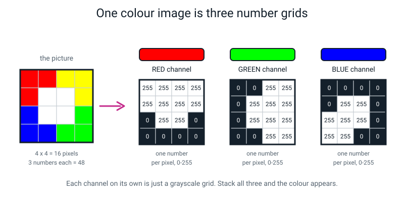
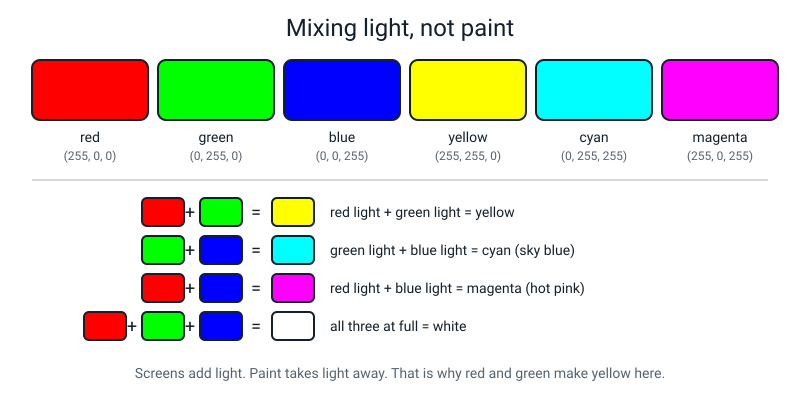
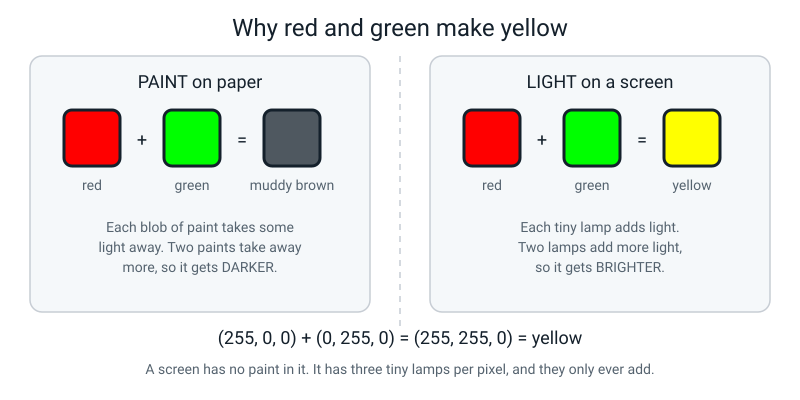
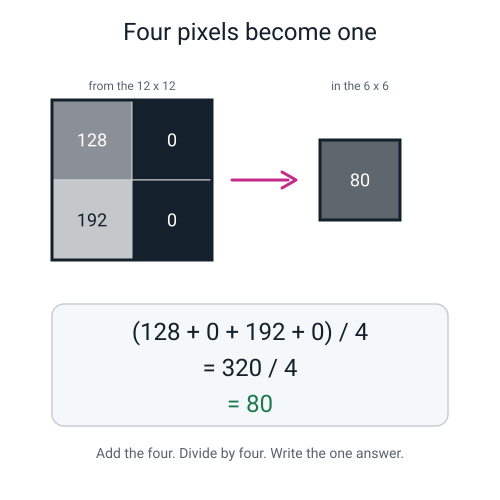
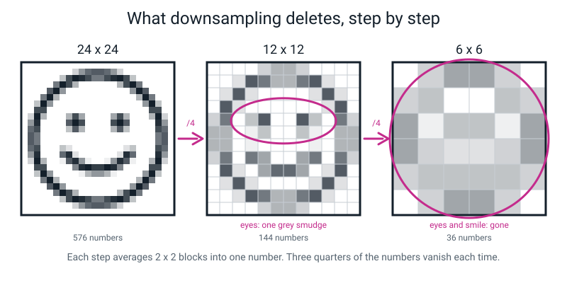
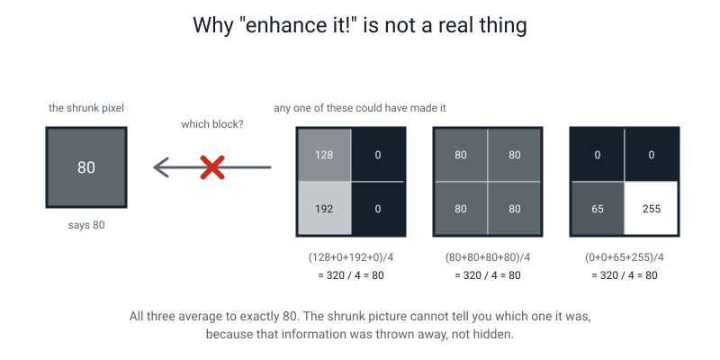
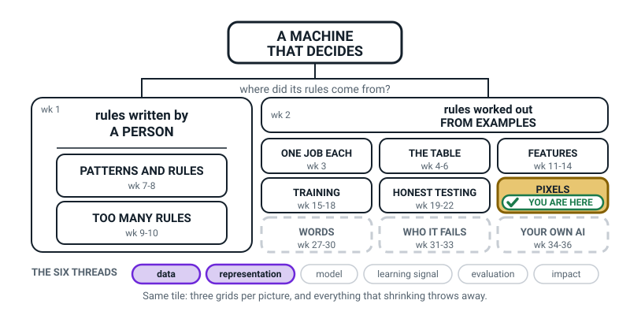
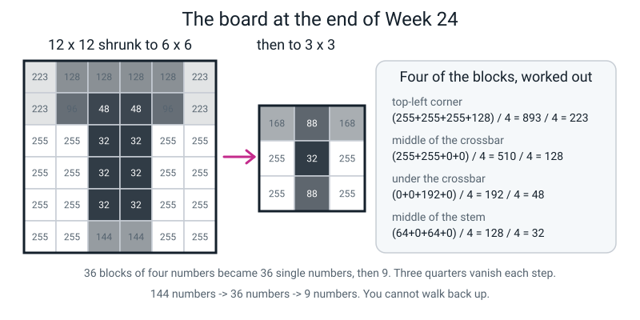

# Week 24 — Colour Is Three Grids Stacked

[⬅ Week 23](week-23.md) · [Course Home](../README.md) · [Week 25 ➡](week-25.md) · [Student Guide](../student-guide/week-24.md) · [Workbook](../workbook/week-24.md)

---

## 📋 At a Glance

| | |
|---|---|
| **Duration** | 70 minutes (works in 60 if you cut the colour activity to four triples each way) |
| **Type** | 🟦 Teach |
| **Big idea** | A colour picture is three number grids — red, green and blue — sitting on top of each other, and shrinking an image throws information away forever. |
| **New vocabulary** | RGB · channel · downsampling · anti-aliasing |
| **Materials** | **Last week's completed 12 × 12 number grid** (essential — the lesson shrinks that exact grid), graph paper (1 sheet), coloured pencils or felt pens including red, green, blue and yellow, an ordinary pencil, eraser, calculator, plain paper |
| **Tech needed** | **None required.** Optional and excellent: a magnifying glass held against a bright white phone screen, and any device where you can see a photo. |
| **Prep time** | 15 minutes the night before + 5 minutes on the day |

---

## 🎯 Lesson Objectives

By the end of this lesson your student can:

1. **Explain RGB as three stacked channels**, with one number per pixel in each channel, and say how many numbers a 224 × 224 colour photo therefore holds.
2. **Name the colour produced by a given RGB triple**, and go the other way — give a plausible triple for a named colour.
3. **Downsample a grid by averaging 2 × 2 blocks**, showing the addition and the division for each block.
4. **State exactly what information downsampling destroys**, and explain in their own words why it cannot be recovered.

---

## 🧑‍🏫 What YOU Need to Know First

*About 14 minutes of reading. Two ideas today, not one — colour, and shrinking — and they are both
small. The second one is where the real intellectual punch is, so if you are short on time, read the
downsampling part twice.*

### The one-sentence version, twice

**Colour:** a colour picture is **three** grayscale grids stacked on top of each other — one for red,
one for green, one for blue — and each pixel holds one number in each grid, 0 to 255.

**Shrinking:** to make a picture smaller you replace each block of four pixels with their average,
which turns four numbers into one — and there is no way back, because four different numbers can
average to the same thing in unlimited different ways.

### Part 1 · Three grids stacked

Last week your student proved that a black-and-white picture is one number per pixel. Colour needs
three.

> **RGB** — a way of storing colour as three numbers per pixel: how much **R**ed, how much **G**reen, how much **B**lue. Each runs 0 to 255.
>
> **Channel** — one of the three grids. The "red channel" is the whole grid made of just the R numbers, and on its own it looks exactly like a grayscale picture.


*Figure 24.1 — One small colour picture, pulled apart into its three channels. Each channel is a plain grid of numbers. Stack all three and the colour appears.*

The counting is the part that lands:

```
   224 × 224          =  50,176 pixels
   50,176 × 3 channels = 150,528 numbers
```

One small photo, 150,528 whole numbers. And how many colours can a single pixel be?

```
   256 × 256 × 256 = 16,777,216
```

Sixteen point seven million. When a television is advertised as "16.7 million colours", that is not a
boast — it is just 256 cubed, and it has been true of essentially every screen for thirty years.

### The eight triples worth memorising

Learn these and you can read most RGB triples on sight.

| R | G | B | Colour | Why |
|---:|---:|---:|---|---|
| 255 | 0 | 0 | red | only the red light is on |
| 0 | 255 | 0 | green | only green |
| 0 | 0 | 255 | blue | only blue |
| 255 | 255 | 0 | **yellow** | red light + green light |
| 0 | 255 | 255 | cyan (sky blue) | green + blue |
| 255 | 0 | 255 | magenta (hot pink) | red + blue |
| 255 | 255 | 255 | white | all three at full |
| 0 | 0 | 0 | black | all three off |


*Figure 24.2 — Six triples and the colour each one produces, with the four mixing sums written out underneath. This is the figure to have open on the table while you teach the triples.*

And one rule that does an enormous amount of work:

> **When R, G and B are all equal, the pixel is grey.** (60, 60, 60) is a dark grey. (200, 200, 200)
> is a light grey. Grey is not really a colour — it is a **tie**.

That rule is also the bridge back to last week: a grayscale picture is just a colour picture where
all three channels hold the same numbers, which is why you only bother storing one of them.

### The yellow moment — light, not paint

This is the single most important thirty seconds of the lesson, and if you assert it instead of
explaining it, your student will not believe you. They should not believe you. Every art lesson they
have ever had says red and green make brown.

**Both facts are true, because there are two different kinds of mixing.**

**Paint takes light away.** White paper reflects all the light that falls on it. Red paint sits on
top and absorbs most of the light *except* the red part, so red is what bounces back to your eye.
Green paint absorbs everything except green. Put both on the same spot and between them they absorb
nearly everything — so almost nothing bounces back, and you get a dark muddy brown. **Two paints
always give you less light than one paint.**

**A screen adds light.** A screen starts black — no light at all — and makes light. Every single
pixel on a phone screen is actually *three tiny lamps*: one red, one green, one blue, side by side,
too small to see apart. Turn the red lamp fully on and you see red. Turn the green fully on as well
and now two lamps are shining into the same bit of your eye, and your eye adds them. Red light plus
green light is what your eye calls **yellow**. **Two lamps always give you more light than one lamp.**


*Figure 24.6 — The same two colours, two kinds of mixing. Paint subtracts and gets darker. Lamps add and get brighter.*

**Do the twenty-second demo if you possibly can.** Set a phone screen to full brightness, show a plain
white image (a blank note app page works), and hold a magnifying glass or a drop of water against it.
You will see red, green and blue stripes glowing side by side. There is no white lamp in there. White
is all three at once. Nothing in this lesson persuades an 11-year-old as thoroughly as seeing that.

### Turning colour into grey is a one-way door

To turn a colour pixel grey you average its three numbers:

```
   grey = (R + G + B) ÷ 3
        = (200 + 80 + 40) ÷ 3
        = 320 ÷ 3
        = 106.67   →  107
```

Three numbers became one number. And now notice: (200, 80, 40) gives 107, and so does
(107, 107, 107), and so does (0, 200, 121). **You cannot get the colour back.** This is the same
one-way idea as the shrinking half of the lesson, in miniature, and it is worth pointing that out
loud when you get there.

> Real photo software uses a slightly fancier recipe — roughly `0.30 × R + 0.59 × G + 0.11 × B` —
> because human eyes are far more sensitive to green than to blue. **Do not teach this.** Keep it in
> your pocket in case a very sharp student asks why their phone's black-and-white filter looks
> different from plain averaging. Plain averaging is correct for everything we do.

### Part 2 · Downsampling, and the door that only opens one way

> **Downsampling** — making a picture smaller by replacing each block of pixels with a single number, usually their average.

Here is the whole mechanism, and it is just addition and division:


*Figure 24.3 — Four pixels become one. Add the four numbers, divide by four, write the answer in the new grid. That is downsampling, complete.*

```
   (128 + 0 + 192 + 0) ÷ 4  =  320 ÷ 4  =  80
```

A 12 × 12 grid has 36 such blocks, so it becomes a 6 × 6 grid: **144 numbers become 36**. Do it
again and 36 become 9. Each step throws away three quarters of the numbers.

This is not a hypothetical. It is exactly what Teachable Machine did to every photo your student
uploaded in Week 17, on the way down from 12 megapixels to 224 × 224.


*Figure 24.4 — The same face at 24 × 24, 12 × 12 and 6 × 6, each step made by averaging 2 × 2 blocks. Circled at each stage: the specific feature that has just stopped existing.*

**Now the important half: why you cannot go back.**

Your shrunk pixel holds 80. What were the four numbers that made it? You cannot know. Look:

```
   (128 + 0 + 192 + 0) ÷ 4  = 320 ÷ 4 = 80
   ( 80 + 80 + 80 + 80) ÷ 4 = 320 ÷ 4 = 80
   (  0 + 0 + 65 + 255) ÷ 4 = 320 ÷ 4 = 80
```

Three completely different blocks. All average to exactly 80. The shrunk picture holds one number,
and that number is compatible with an enormous number of different originals. The information is not
hidden. It is **gone** — the way a burnt letter is gone, not the way a letter in a locked drawer is
gone.


*Figure 24.5 — One number, three possible pasts. This is why the "just enhance it!" scene in every crime drama is fiction.*

**The honest note about "enhance", because your student will raise it.** Phone apps and websites do
exist that make a small blurry photo look sharp, and they are not lying about what they show you.
What they are doing is **inventing** plausible detail — a model that has seen millions of faces
guesses what a face-ish blur was probably made of, and paints that in. It looks convincing. It is a
*guess*, and it can be confidently wrong: an invented number plate that reads clearly and is not the
real number plate. So the honest sentence is: **you cannot recover detail, but you can generate a
convincing replacement for it, and you must never treat the replacement as evidence.** That is a
grown-up distinction and an 11-year-old can hold it.

### Anti-aliasing — the grey squares finally get their name

Last week your student and you argued about a handful of squares. Every one of them was on the
boundary of the letter, where the drawn line cut a square in half and neither 0 nor 255 was right.
That has a name.

> **Anti-aliasing** — the grey in-between pixels that appear along a boundary, because the real edge does not line up with the square grid.

Anti-aliasing is not a mistake and not a compromise. It is the *correct* answer for a square that is
genuinely half covered: the honest value is halfway. Cameras do it, screens do it, and every letter
of text you are reading right now has grey pixels along its curves. Turn anti-aliasing off and text
looks like a 1980s video game.

Two things worth knowing:

- **Downsampling creates more of it.** Every time you average a block that straddles an edge, you manufacture a new in-between value. Sharp edges become soft edges. That is why a shrunk photo looks slightly blurry even when nothing has gone wrong.
- **It is why last week's disagreements were nobody's fault.** Say that out loud this week if you did not say it clearly last week.

### The two misconceptions you will actually meet

**Misconception 1 — "red and green make brown."** Discussed above, and it is not really a
misconception, it is a *correct fact about the wrong situation*. Never tell a student they are wrong
about this. Tell them they are right about paint and we are talking about lamps. Then do the
magnifying-glass demo. Fifteen years of art lessons need something physical to push against.

**Misconception 2 — "shrinking loses quality, but the detail is still in there somewhere."** This is
the deep one, and it survives most explanations because it feels true — the photo *looks* like it
still nearly has the detail. Beat it with arithmetic, not with words: put 80 on the board, ask them to
give you four numbers that average to 80, then ask for four *different* numbers that also average to
80, then a third set. Once *they* have generated three different pasts for the same present, they own
the argument. Explaining it does not work nearly as well as making them do it.

A third one to have ready: **"RGB means a pixel is red or green or blue."** Some students hear "three
colours" and picture each pixel picking one. Correct it by pointing at any single pixel in
Figure 24.1 and reading its three numbers aloud: *"this one pixel has a red number AND a green number
AND a blue number. Always three. Every pixel, always."*

### How deep to go, and where to stop

| Go here | Stop here |
|---|---|
| Three channels, one number each per pixel, 0–255 | Hex codes like `#FF0000`. If they ask, one sentence: "that's the same three numbers written in a shorthand programmers use." Then stop. |
| Red + green light = yellow, because lamps add | Colour theory, complementary colours, colour wheels, hue and saturation. All out of scope. |
| Printers use ink, which is paint, so they use different primaries | CMYK, colour management, why prints never match screens. One sentence if asked. |
| Averaging a 2 × 2 block, by hand, with the division shown | The names of shrinking methods (nearest neighbour, bilinear, Lanczos). Averaging is the honest core of all of them. |
| "You cannot get it back — the information is gone" | Information theory, entropy. The three-blocks-average-to-80 demo *is* the proof, at the right level. |
| Anti-aliasing = the honest grey for a half-covered square | Sub-pixel rendering, gamma. No. |
| A promise that filters are next week | Anything about edges or filters. Week 25 needs its own hook. |

---

### 🧭 The Growing Map

The tinted box has not moved — **PIXELS**, second week — and that is the message. Colour is not a new
topic, it is last week's grid three times over. What has changed is the thread strip: **data** has
joined **representation**, because the second half of the lesson is about how many numbers there
actually are and which of them get thrown in the bin.



*Figure 24.0 — Week 24's version. PIXELS still tinted and badged, with **data** and **representation**
lit along the bottom.*

**What to do with it, in about two minutes at the end of the lesson:**

1. **Show it and ask:** *"which bit did we do today — we did colour and shrinking, so why is it the
   same shaded box as last week?"* The answer you want is *"because colour is just three of last week's
   grids."* If they say that, the whole lesson has landed in one sentence.
2. **Then the better question:** *"why has a second pill lit up at the bottom today?"* Point at
   **data**. Downsampling is the first time this year they have watched information be destroyed and
   been able to prove it is gone. That is a data fact, not a picture fact.
3. **Have them write one sum on their map** next to PIXELS: `224 × 224 × 3 = 150,528`. It is the number
   their own Week 17 model actually saw, and putting it in their handwriting makes Week 22's failures
   look a lot less mysterious.

> **🧑‍🏫 Why this is worth two minutes.** Two weeks on the same box can feel like standing still, and a
> learner who thinks nothing happened stops paying attention. The map shows movement in the right
> place — the box holds, the threads change — which teaches the useful idea that depth and novelty are
> not the same thing. It also parks "zoom and enhance" permanently: the information is gone, and they
> proved it with three blocks averaging to 80.

**The six threads** along the bottom are the spine of all four levels. **Data** and **representation**
are lit this week. Do not quiz them on the threads; the map is orientation, never assessment.

---

## 🧰 Prep Checklist

**15 minutes the night before**

- [ ] **Find last week's 12 × 12 number grid.** This is the one genuinely critical item. The whole second half of the lesson shrinks that exact grid. If it has gone missing, use the worked grid in the Answer Key below — it is the letter T, ready to go — but the lesson is noticeably better when the numbers are *theirs*.
- [ ] **Test the magnifying-glass demo yourself.** Bright phone screen, blank white page, magnifier or a single drop of water on the glass. Some screens show the red/green/blue stripes beautifully and some barely at all — you want to know which yours is *before* you promise your student a miracle. If yours does not work, say so and use Figure 24.6 instead; do not fumble at it for three minutes.
- [ ] **Check you have a red, a green, a blue and a yellow** pencil or pen. Those four are enough. Cyan and magenta are a bonus, not a requirement.
- [ ] **Do the 12 × 12 → 6 × 6 shrink yourself**, all 36 blocks, with a calculator. About 12 minutes. You will discover that most blocks are trivially 255 or 0 and only about eight of them are interesting, which is exactly the insight you need to run the activity to time.
- [ ] Decide now how you will handle **decimals**. Blocks like 893 ÷ 4 = 223.25 will appear. The rule to announce up front: *keep the exact answer, then round to the nearest whole number, and .5 rounds up.* Announcing it beforehand prevents a five-minute panic later.

**5 minutes on the day**

- [ ] Rule an empty **6 × 6 grid** and an empty **3 × 3 grid** on graph paper, rows and columns numbered.
- [ ] Write on the board and leave up all lesson: **`R  G  B  —  each 0 to 255`** and **`all three equal = grey`**.
- [ ] Have the calculator on the table. There are 36 divisions coming and none of them are the point.
- [ ] Put last week's grid flat on the table, weighted down. Not folded.

**If something fails**

- **No coloured pencils.** The activity is written so that colours can be *named in words* rather than drawn. It loses a little joy and nothing else. Write the colour names in ordinary pencil.
- **No magnifier and the demo won't work.** Use Figure 24.6, and add this: "look at an old TV or a big screen close up in a shop sometime — you can see the stripes with your naked eye." Do not spend more than 60 seconds trying.
- **Last week's grid is genuinely lost.** Use the letter-T grid in the Answer Key. Hand it over as "here's one I made" and carry on. Do not spend lesson time redrawing a 12 × 12.
- **No calculator.** All 36 divisions are divisions by 4, which is halving twice. That is a legitimate and quite pleasant mental-arithmetic lesson: 1020 → 510 → 255. Say it that way and it goes faster than a calculator.

---

## ⏱️ The Lesson, Minute by Minute

| # | Segment | Minutes | What happens |
|---|---|---|---|
| 1 | 🪝 Hook — how many colours are in a white screen? | 0–8 | Three. Magnifier on a bright screen; there is no white lamp. |
| 2 | 🧠 Concept — three grids, and lamps not paint | 8–26 | RGB, channels, the counting, grey is a tie, the yellow moment. |
| 3 | 🔍 Worked Example Together — reading triples, and one block | 26–40 | Four triples both directions, then one 2 × 2 average on the board. |
| 4 | 🎲 Activity — Colour By Numbers, then Zoom Until It Dies | 40–60 | Eight triples and six names; then 12 × 12 → 6 × 6 → 3 × 3. |
| 5 | 🔑 Wrap & Assign — can you get it back? | 60–70 | Three blocks that all average to 80. Then homework. |

---

### 1 · 🪝 Hook — how many colours are in a white screen? (0–8 min)

**Say this:**

> "Last week you proved a black-and-white picture is one number per square. Today, colour. And I'm
> going to start with a question that sounds stupid.
>
> Look at this screen. It's showing plain white. **How many different colours of lamp do you think
> are inside it, making that white?**"
>
> *(Take the guess. Most people say one, or "none, it's white", or "loads".)*
>
> "Three. That's the answer. Red, green and blue. There is no white lamp in there at all. There
> never has been, in any screen you have ever looked at. White is what you get when all three are on
> at once and your eye can't tell them apart.
>
> Here — look."

**Do this:** hold the magnifying glass against the bright white screen and hand it over. Let them
find the stripes themselves; do not point at them. If the demo does not work on your screen, show
Figure 24.6 and say honestly: "my screen is too fine to see it, but they are there."

Then the second half of the hook — a question that will feel wrong.

**Say this:**

> "Right. Second question, and you are going to want to argue with me. **What do you get when you
> mix red and green?**"
>
> *(They will say brown, or mud. Everyone does.)*
>
> "Brown. Correct — with paint. Absolutely correct. Now, on a screen, red and green make **yellow**,
> and I'm not going to just tell you that and expect you to swallow it, because it sounds like
> nonsense. By minute twenty you're going to know exactly why both answers are right."

**Ask this:**

- **"Why is there no white lamp? Wouldn't that be simpler?"**
  - *Hoping for:* "Because you can make white from the other three anyway."
  - *If they are stuck:* "If you had a white lamp, how would you make red? You'd still need a red one. Three lamps can make white **and** red **and** everything else. A white lamp can only make white."
- **"Your screen has about two million pixels and each one has three lamps. How many tiny lamps is that?"**
  - *Hoping for:* an attempt — six million.
  - *If they refuse to guess:* do it on the board. 2,000,000 × 3 = 6,000,000. The absurdity is the point.
- **"Have you ever seen the stripes before, on any screen?"**
  - *Hoping for:* "On a big TV up close" or "on a cracked screen".
  - *Either way:* "You've been looking at three colours your whole life and reading it as millions."

---

### 2 · 🧠 Concept — three grids, and lamps not paint (8–26 min)

**Say this:**

> "So here's the whole idea, and it's smaller than you'd think. **New word: RGB.** Red, Green, Blue.
> A colour picture stores **three** numbers for every pixel — how much red, how much green, how much
> blue — and each one runs 0 to 255, exactly like last week.
>
> Which means a colour picture isn't one grid of numbers. It's **three grids, stacked**. And here's
> the neat part: each grid on its own looks exactly like the grayscale pictures you did last week.
> One number per square, 0 to 255. Nothing new to learn. **New word for one of those grids:
> channel.** The red channel is the whole grid of just the R numbers."

**Do this:** draw Figure 24.1 on the board as one small square picture with three grids fanning out
of it, labelled RED, GREEN, BLUE. Write one pixel's three numbers next to it, big.


*Figure 24.1 (again) — the board sketch. One picture, three channels, one number per pixel in each.*

**Say this:**

> "Now let's count, because the counting is where this gets silly. Your model's photos were 224 by
> 224. That's 50,176 pixels — you worked that out last week. In colour, how many numbers?"
>
> *(Wait for × 3.)*
>
> "50,176 times 3 is **150,528**. A hundred and fifty thousand numbers, for one small photo. And you
> uploaded sixty of them.
>
> Next: how many different colours can **one** pixel be? It's got three numbers, each with 256
> possible values. So it's 256 times 256 times 256." *(Do it on the calculator, on the board.)*
> "**16,777,216.** Sixteen point seven million. That's why televisions are advertised as '16.7
> million colours'. It's not a boast. It's just 256 cubed. You can never be impressed by that
> sticker again."

**Do this:** now the eight triples. Write them on the board as a table and read each one as an
instruction, not a fact: *"255, 0, 0 — red lamp full on, green off, blue off. What do you see? Red."*
Keep Figure 24.2 beside you while you do it — it has the four mixing sums written out and saves you
inventing them live. Work down to (255, 255, 0) and then stop and make the yellow argument properly.


*Figure 24.6 (again) — draw this as two panels on the board. Left: paint takes light away. Right: lamps add light.*

**Say this:**

> "Here's the argument, and then you can decide whether to believe me.
>
> **Paint.** White paper bounces back all the light that lands on it. Put red paint on it — the paint
> soaks up most of the light and only lets the red bounce back. Put green paint on it — it soaks up
> everything except green. Now put **both** on the same spot. Between them, they soak up nearly
> everything. Almost no light gets back to your eye. So you get dark brown mud. **With paint, adding
> a second colour always means less light.**
>
> **A screen.** A screen starts completely black. No light at all. Then it *makes* light. Turn the
> red lamp on — red light comes at your eye. Now turn the green lamp on **as well**. Now there's red
> light *and* green light arriving at the same place, and your eye adds them together. And what your
> eye calls red-plus-green is **yellow**. **With lamps, adding a second colour always means more
> light.**
>
> Same two colours. Opposite results. Because one of them takes light away and the other one adds
> light. You were never wrong about paint. It's just a different machine."

**Say this — the last idea of the segment:**

> "One more rule and it's a freebie. What happens when all three numbers are **the same**? Say
> (60, 60, 60)?"
>
> *(Take the guess.)*
>
> "Grey. Dark grey. All three lamps equally on, so no colour wins. (200, 200, 200) is a light grey.
> (128, 128, 128) is middle grey. **Grey isn't really a colour — it's a tie.**
>
> And that's the bridge back to last week: a black-and-white picture is just a colour picture where
> all three channels hold identical numbers. Which is why nobody bothers storing three copies of the
> same grid. You store one, and you call it grayscale."

**Ask this:**

- **"(0, 0, 255) — what colour?"** → Blue. If they hesitate, prompt: "which lamp is on?"
- **"(255, 255, 255)?"** → White. All three full.
- **"(90, 90, 90)?"** → A dark grey. If they say "black": "is it 0? No. So it's a grey — a dark one."
- **"Give me a triple for yellow."** → (255, 255, 0). If they give (255, 255, 255), point at the blue: "that's blue full on too. What does all three full give you?"
- **"Why does a printer's ink look different from a screen's colours?"**
  - *Hoping for:* "because ink is like paint."
  - *If blank:* "Ink sits on paper and takes light away. Same as paint. That's why printer ink comes in weird colours like cyan and magenta instead of red and green — different machine, different set of starting colours." One sentence, then move on.

---

### 3 · 🔍 Worked Example Together — reading triples, and one block (26–40 min)

Two halves, seven minutes each. Do both **on the board, together**, before they work alone.

**Half A — triples, both directions (7 min).**

**Say this:**

> "Four of these together, then you do eight on your own. I'll say the numbers, you say the colour,
> and I want the *reason*, not just the word."

Work these four on the board. Write the reason next to each.

| Triple | Colour | The reason to say out loud |
|---|---|---|
| (255, 0, 255) | magenta / hot pink | red lamp full, blue lamp full, green off |
| (0, 255, 255) | cyan / sky blue | green full, blue full, red off |
| (30, 30, 30) | very dark grey | all three equal, and all three low |
| (200, 80, 40) | a warm brown-orange, like terracotta | most red, some green, little blue |

Then go backwards, which is harder and more revealing:

**Say this:**

> "Now the other way. Give me a triple for **orange**. Think about it — orange sits between red and
> yellow. Red is (255, 0, 0). Yellow is (255, 255, 0). So orange must be…?"

*(Answer: red at full, green partway, blue off — around (255, 140, 0). Anything with R high, G in the
middle, B low is correct. There is no single right answer and you should say so.)*

> "And **brown**? Brown is the one that catches everybody. Brown is just a *dark orange*. So take
> your orange and turn all the lamps down: about (150, 75, 0). Try it — is there a brown lamp on a
> screen? No. Brown is a dimmed orange, and orange is red plus a bit of green."

**Half B — one 2 × 2 block (7 min).**

**Say this:**

> "Now the second idea of the day, and this is the one that matters most. **How do you make a picture
> smaller?**
>
> Not by deleting rows — that would be crude and jerky. You do it by averaging. Take a block of four
> pixels, add them up, divide by four, and write that one number into a new smaller grid. Four
> numbers in, one number out. That's it. It has a name: **downsampling**."

**Do this:** draw this on the board exactly.


*Figure 24.3 (again) — the board sketch. Four numbers, one sum, one division, one answer.*

```
     128    0                 (128 + 0 + 192 + 0)  =  320
                       →              320 ÷ 4      =   80
     192    0
```

Then a second one where the answer is not whole:

```
     255  255                 (255 + 255 + 255 + 128)  =  893
                       →                893 ÷ 4        =  223.25   →  223
     255  128
```

**Say this:**

> "Sometimes it doesn't divide neatly, and that's fine. Rule for today: **work out the exact answer,
> then round to the nearest whole number, and .5 rounds up.** So 223.25 becomes 223, and 127.5
> becomes 128. Write both down — the exact one and the rounded one — because I want to see the
> arithmetic, not just the answer."

**Ask this:**

- **"How many blocks are there in a 12 × 12 grid?"**
  - *Hoping for:* 36. If they say 72 or 144: "each block is 2 across and 2 down. So how many blocks across a row of 12?" → 6. "And how many rows of blocks?" → 6. 6 × 6 = 36.
- **"So 144 numbers become how many?"** → 36. **"And what fraction did we throw away?"** → Three quarters.
- **"If I do it again, 6 × 6 becomes what?"** → 3 × 3, which is 9 numbers.
- **"Quick one: what's 1020 ÷ 4?"** → 255. If they reach for the calculator: "halve it, then halve it again. 1020, 510, 255." Teach the trick now; there are 36 of these coming.

---

### 4 · 🎲 Activity — Colour By Numbers, then Zoom Until It Dies (40–60 min)

Full instructions in the next section. In the lesson flow:

**Part A — Colour By Numbers, both directions (8 min).** Write the eight triples on the board (they are in the Answer Key below; the workbook's Build It Part 1 uses a different set of triples and is homework). They name each colour and write one short reason. Then six colour names
going the other way, where the yellow one is the checkpoint: if they write (255, 255, 0) without
prompting, the argument from Segment 2 has landed.

**Part B — Zoom Until the Picture Dies (12 min).**

**Say this:**

> "Get out last week's grid — your 144 numbers. We're going to shrink it, for real, with actual
> arithmetic, and I want you to watch your own letter die.
>
> Here's an empty 6 by 6 grid. Take the top-left 2 by 2 block of your big grid — four numbers — add
> them, divide by four, write the answer in the top-left square of the small grid. Then move two
> squares right and do the next block. Six blocks across, six rows of blocks.
>
> A lot of them will be boring. If all four numbers are 255, the answer is 255 and you can write it
> straight down — you don't need the calculator to know that four 255s average to 255. The
> interesting ones are the blocks that sit **on the edge** of your letter, where some numbers are
> dark and some are light. Slow down on those.
>
> And after each row, stop and tell me one thing about your letter that has just got harder to see."

**Do this:** work alongside them for the first row so the rhythm is set, then let them run. When the
6 × 6 is done, look at it together before shrinking again — hold it at arm's length, squint. Then do
the 3 × 3, which is only nine blocks and takes three minutes.


*Figure 24.7 — What the board should look like when the shrinking is finished: the 6 × 6, the 3 × 3, and the arithmetic for four of the blocks written out.*

**Ask this — after the 6 × 6:**

- **"What can you not see any more?"**
  - *Hoping for:* something specific — "the crossbar isn't black any more, it's grey", "the little grey bits on the ends have disappeared".
  - *If they say "it's just blurrier":* push once. "Point at one square and tell me what it used to be." Specific beats vague, and specificity is the objective.

**Ask this — after the 3 × 3:**

- **"Can you still tell it's your letter?"** → Almost certainly not. Good.
- **"If I showed this 3 × 3 to your Teachable Machine model, could it work?"** → No. And that is the honest link back to their own project.

---

### 5 · 🔑 Wrap & Assign — can you get it back? (60–70 min)

This is the intellectual payoff of the whole week. Do not rush it.

**Say this:**

> "Last question, and it's the big one. You have your 3 by 3. **Can you get your 12 by 12 back from
> it?**"
>
> *(Take the answer. Many students say yes, or "sort of", or "with a computer you could".)*
>
> "Let's test it. Here's one of your shrunk numbers: 80. Give me four numbers that average to 80."

**Do this:** write `80` on the board. Get their four numbers — say (80, 80, 80, 80). Write the sum and
division. Then ask for four **different** numbers that also average to 80. Then a third set. Keep
going until they have produced three genuinely different blocks. Do not supply them yourself; the
whole force of this depends on them generating it.

```
   (128 +  0 + 192 +   0) ÷ 4  =  320 ÷ 4  =  80
   ( 80 + 80 +  80 +  80) ÷ 4  =  320 ÷ 4  =  80
   (  0 +  0 +  65 + 255) ÷ 4  =  320 ÷ 4  =  80
```


*Figure 24.5 (again) — the finished board. One number, three possible pasts, and a crossed-out arrow going backwards.*

**Say this:**

> "So: your 3 by 3 says 80. Which of those three blocks was it? You cannot tell. Not because you're
> not clever enough, and not because you don't have a good enough computer. Because **the information
> isn't there any more.** It wasn't hidden. It was thrown away.
>
> This is why 'zoom in — now ENHANCE it!' in films is nonsense. You cannot recover something that
> was deleted.
>
> Now, one honest complication, because you have probably seen an app that *does* seem to do it.
> There are apps that take a blurry photo and make it sharp. They are not lying about what they show
> you — but they aren't recovering anything either. They are **inventing** something plausible. A
> model that has seen millions of faces guesses what your blur was probably made of and paints that
> in. It often looks great. And it can be confidently wrong — it can invent a number plate that
> reads perfectly clearly and is not the real number plate. So: you can *generate* a convincing
> replacement for lost detail. You can never *recover* it. And you must never treat the replacement
> as evidence.
>
> One last word, and it's a name for something you already found. Last week we argued about those
> half-shaded squares on the edge of your letter, remember? Those grey in-between pixels have a name:
> **anti-aliasing.** They are not a mistake. When a real edge cuts a square in half, halfway is the
> honest answer. Every camera does it, every screen does it, and the letters you are reading right
> now have grey pixels along their curves. And notice what just happened when you shrank your grid:
> you *made more of them*. That's why a shrunk photo always looks a bit soft."

**Ask this:**

- **"So can you get the 12 × 12 back — yes or no, and why?"**
  - *Hoping for:* "No, because lots of different blocks give the same average."
  - *If they say "not exactly, but nearly":* push. "Nearly how? Which of the three blocks on the board would you pick, and how would you know?" There is no answer, and finding that out is the lesson.
- **"Name one thing your model might have missed because of shrinking."** Anything specific from their own project — a pattern, a thin edge, small writing. This is the connection to Week 22 you want them to make out loud.
- **"What is anti-aliasing, in your own words?"** → The grey squares along an edge, because the edge doesn't line up with the grid.

Then assign homework and stop.

---

## 🎲 The Activity, In Full

### Part A — Colour By Numbers, Both Directions

**The point:** to make RGB *readable* rather than memorised, and to force the light-not-paint idea to
be used rather than recited.

**Time:** 8 minutes. **Materials:** the triples written on the board (the workbook's Build It Part 1 is a different set, kept for homework), a pencil,
coloured pencils if you have them.

**Direction 1 — triples to names (4 min).** Eight triples. For each: write the colour name **and** one
short reason. The reason is compulsory; "yellow" alone earns nothing, "yellow — red and green lamps
both on" is the answer.

**Direction 2 — names to triples (4 min).** Six colour names. For each: write a plausible triple.
Say clearly before they start that **there is no single right answer** for colours like orange and
brown — a range is correct, and you are marking the *shape* of the answer (which lamps are high,
which are low), not an exact match.

**What "finished" looks like:** eight named colours each with a reason; six triples, each with the
three numbers in a sensible relationship to each other. Yellow written as (255, 255, 0) without
prompting is the single indicator that the lesson worked.

### Part B — Zoom Until the Picture Dies

**The point:** to do downsampling as arithmetic, on their own picture, and watch specific features
stop existing.

**Time:** 12 minutes. (7 for the 6 × 6, 3 for the 3 × 3, 2 for the noticing.)

**Materials**

| Item | Why |
|---|---|
| Last week's completed 12 × 12 number grid | this is the input; there is no substitute for it being theirs |
| A ruled, empty 6 × 6 grid, rows and columns numbered | the output |
| A ruled, empty 3 × 3 grid | the second output |
| Calculator | 36 divisions, none of which are the point |
| Pencil and eraser | |

**Setup (before the clock starts)**

1. Lay the 12 × 12 flat. Draw a heavy line every two columns and every two rows, dividing it into 36 blocks of four. **Do this before any arithmetic.** It is the step people skip and it is the step that prevents every misalignment error.
2. Number the block rows 1–6 and block columns 1–6 in the margins.

**The rules**

1. Work **block by block, left to right, top row of blocks first.** Same discipline as last week: never skip, even the obvious ones.
2. For each block: write the sum, then the division, then the answer. `255+255+255+128 = 893, ÷4 = 223.25 → 223`.
3. **Shortcut allowed and encouraged:** if all four numbers are identical, the answer is that number. Write it straight down. Say out loud why that is legitimate — averaging four identical numbers cannot change anything.
4. Round to the nearest whole number. **.5 rounds up.**
5. After each row of six blocks, stop and say one specific thing about the picture that has got worse.
6. Then repeat the whole process on the 6 × 6 to get a 3 × 3. Only nine blocks.

**What "finished" looks like**

- A completed 6 × 6 grid of numbers, with the arithmetic visible for at least the eight or so non-obvious blocks.
- A completed 3 × 3 grid.
- Three written observations: one thing lost going 12 → 6, one thing lost going 6 → 3, and an answer to "can you get it back?"
- The student able to say, unprompted, that many different blocks average to the same number.

**Variation — easier**

Do only the **middle four block-rows** of the 12 × 12 (block rows 2 to 5), which is 24 blocks instead
of 36, and skip the 3 × 3 entirely. The 12 → 6 step alone carries every objective. Alternatively:
you do the boring all-255 blocks out loud while they do the interesting edge blocks — it halves the
work and concentrates their effort on the blocks that actually teach something.

**Variation — harder**

Three good extensions:

1. **Shrink by 3 instead of 2.** Take 3 × 3 blocks of nine pixels and divide by 9. The 12 × 12 becomes a 4 × 4 in a single step. Then compare it against the two-step 12 → 6 → 3 result and ask which is more damaged, and why.
2. **Do it in colour.** Take a 4 × 4 colour picture (three channels of 16 numbers each) and shrink it to 2 × 2. That is 12 block-averages, four per channel, and it proves that colour downsampling is just the grayscale one done three times.
3. **The reconstruction challenge.** Give them a 3 × 3 grid of averages and ask them to invent a 6 × 6 that would produce it. Then ask them to invent a *second, different* 6 × 6 that also produces it. Once they have built two, they have personally proved the information is gone — and that is a stronger form of the argument than the one in the lesson.

---

## ❓ Questions Students Ask This Week

**"Why red, green and blue? Why not red, yellow and blue like in art?"**
Because screens are built to match your **eye**, not your paint set. The back of your eye has three
kinds of colour detector, and they are most sensitive to reddish light, greenish light and bluish
light. If you build a screen with lamps at those three, you can trigger your eye's three detectors in
any combination, and that is enough to make you see essentially any colour. Red, yellow and blue is
the right set for *paint*, which works by taking light away. Different job, different primaries.

**"Is there a black lamp?"**
No, and there cannot be. Black is not a kind of light; it is the *absence* of light. A screen makes
black by switching all three lamps off — which is also why a switched-off phone screen and a
"black" image can look slightly different, and why proper black on a screen is surprisingly hard to
achieve.

**"What about brown? And pink? There's no brown lamp."**
Brown is a **dark orange** — around (150, 75, 0): quite a lot of red, some green, no blue, and all of
it turned down. Pink is a **pale red** — around (255, 180, 180): red at full, with green and blue
turned up enough to wash it out towards white. Try both on paper: turning a colour "down" makes it
browner, turning it "up towards white" makes it paler. That is genuinely all that is happening.

**"How does a printer make colours then?"**
Ink is paint — it sits on paper and takes light away — so printers use a different starting set:
cyan, magenta, yellow and black. That is why a printer's ink cartridges are those odd colours instead
of red, green and blue. It is also why a photo never looks quite the same printed as it did on screen:
one is made of lamps adding light, the other of ink removing it, and they cannot reach exactly the
same set of colours.

**"My phone can un-blur a photo. So you *can* get it back."**
It can make a blurry photo look sharp, and it is not lying about what it shows you — but it is not
getting anything back. It is **inventing** detail that looks plausible, because it has seen millions
of similar pictures and can guess what your blur was probably made of. Sometimes the guess is
excellent. Sometimes it is confidently wrong — it can invent a number plate or a face that reads
perfectly clearly and is not the real one. So it is generating a replacement, not recovering the
original, and that distinction matters enormously if anyone is going to use the picture as evidence.

**"If we can't see 16.7 million colours, why bother storing that many?"**
Because you cannot see the *steps*. If a screen only had, say, 32 levels of red, a smooth sunset
would come out as visible stripes — and you would notice that instantly. 256 levels per channel is
comfortably more than anyone can distinguish, which is exactly the point: the steps are invisible, so
the sky looks smooth. It is chosen to be more than enough, not to be impressive.

**"Why do we divide by 4 and not something else?"**
Because a 2 × 2 block has four numbers in it, and an average is "add them all up and divide by how
many there were". If you took 3 × 3 blocks you would divide by 9. If you took 4 × 4 blocks you would
divide by 16. The 4 is not special — it is just how many pixels you decided to squash together.

**"Do other people see the same colours as I do?" — nobody knows for sure.**
This is a genuinely open question and it is worth saying so plainly. We know some things: about one
boy in twelve has some form of colour blindness and genuinely sees fewer distinctions; a small number
of people appear to have a *fourth* kind of detector and may make distinctions the rest of us cannot;
and different languages carve the colour spectrum up differently, which measurably changes how quickly
people spot a difference. But whether your experience of red is *the same experience* as mine —
nobody has found a way to check that, because there is no way to get inside someone else's seeing. We
can compare what people *say* and what their eyes *do*. We cannot compare what they see. That is not
a gap in the science yet; it may be a permanent one.

---

## ⚠️ Where This Lesson Goes Wrong

| What happens | Why | What to do right now |
|---|---|---|
| They insist **red + green = brown** and will not budge. | They are right about paint, and thirteen art lessons say so. Being told "no" just makes them dig in. | Never say they are wrong. Say: *"You are completely right about paint. I'm talking about lamps, and they work backwards."* Then get physical — magnifier on the screen, or two coloured torch beams overlapping on a white wall, or Figure 24.6 drawn big. This needs a demonstration, not a sentence. |
| They treat each pixel as being **red *or* green *or* blue**. | "Three colours" is easy to hear as "pick one of three". | Point at one single pixel in Figure 24.1 and read its three numbers out loud: *"this one pixel has a red number AND a green number AND a blue number. All three. Always."* Then ask them to read out a different pixel's three numbers themselves. |
| Block averages come out **wrong by a factor of 2** — they add two numbers instead of four. | They average the top pair, or the left pair, and forget the block is 2 × 2. | Prevention: make them draw the heavy block borders on the 12 × 12 *before* any arithmetic. Cure: point at a block and say "how many squares are in there?" Then have them circle the four numbers before adding. |
| A decimal appears (223.25, 127.5) and everything **stops**. | They expect grid numbers to be whole, and they are right that pixels must be — so the decimal feels like an error. | Announce the rule before it happens: *exact answer first, then round to the nearest whole number, .5 rounds up.* Add the honest reason: a pixel must hold a whole number, so real software rounds too, exactly like this. |
| They shrink the grid and conclude **"nothing much was lost, it still looks like a T"**. | At 6 × 6 a big fat letter often *does* survive, so the conclusion is reasonable and the lesson seems to fail. | Do not argue. Go to 3 × 3, which always kills it. And in the meantime redirect from "can I still read it" to "which specific squares changed": the crossbar going from 0 to 128 is a real, nameable loss even though the letter survives. |
| They believe **"a computer could get it back"**. | Deference to computers. It feels like a limitation of pencils, not of arithmetic. | Do not explain — make them do the 80 exercise. Get *them* to produce three different blocks averaging 80. Once they have written all three with their own hand, the belief cannot survive. Then add: "a computer would have exactly these three options and no way to choose." |
| Last week's grid has been **lost or folded into confetti**. | It is a loose sheet of graph paper in the life of an 11-year-old. | Use the letter-T grid printed in the Answer Key below, handed over as "here's one I made earlier". Do not spend lesson time redrawing. Then, quietly, start a folder. |
| The 36 block averages take **20 minutes**, not 7, and there is no time for the wrap. | Every block gets full working, including the twenty-odd blocks that are four identical 255s. | Authorise the shortcut loudly and early: four identical numbers → write it down, no working. If you are past minute 55, stop at the 6 × 6, do the 3 × 3 verbally on three blocks only, and protect the "can you get it back?" wrap. **The wrap is the objective. The arithmetic is only how you earn it.** |

---

## 🧭 Differentiation

### If they are struggling

**Cut, in this order:** the 3 × 3 step (do 12 → 6 only); the "names to triples" direction (do triples
to names only); the 16.7-million calculation; the grayscale-averaging formula.

**Reteach:**

1. **One lamp at a time.** Before any triple-reading, do three physical checks with coloured pencils: colour a square red and say "red lamp on, other two off — (255, 0, 0)". Then green. Then blue. Then ask them to *predict* red-and-green before you tell them. Prediction first, answer second.
2. **The tie rule alone.** If nothing else sticks, "all three numbers the same means grey" is a genuinely useful, genuinely correct rule that they can apply immediately to any triple. It gets them a third of the way through any list.
3. **Averaging as halving twice.** Divide by 4 is halve, then halve again. Practise on four numbers: 1020 → 510 → 255. It converts an intimidating division into something they can do in their head, and confidence matters more here than speed.
4. **One block, done beautifully.** A single 2 × 2 block, fully worked, with the sum and the division written out, is worth more than twelve rushed ones. If they can do one and explain it, objective 3 is met.

If they end the lesson knowing only *(a)* colour is three numbers per pixel and *(b)* shrinking
averages numbers together and you cannot undo it — that is a good lesson. Objectives 1 and 4 are the
load-bearing ones; 2 and 3 are the practice that gets you there.

### If they are flying

Every one of these has a worked answer in the Answer Key.

1. **"A 4032 × 3024 colour photo — how many numbers, and how many would fit on a page if you wrote 1000 numbers per page?"** (36,578,304 numbers; 36,579 pages — a stack about four metres tall.)
2. **"Shrink your 12 × 12 straight to 4 × 4 using 3 × 3 blocks. Compare it with your two-step 12 → 6 → 3. Which lost more, and why?"**
3. **"Turn a colour pixel grey with (R+G+B)÷3. Now find three *different* colours that all give the same grey."** This is the one-way-door argument, in colour, and it is the most elegant version of it.
4. **"Your model's photos were 224 × 224 × 3. Your phone shoots 4032 × 3024 × 3. What fraction of the numbers survived?"** (150,528 ÷ 36,578,304 = 1/243, the same ratio as last week — because the channel count divides out. That is a lovely thing to notice.)
5. **"Design a picture that survives being shrunk, and a picture that gets destroyed by it."** (Big, bold, high-contrast shapes survive. Thin lines, fine checkerboards and small text die. Get them to make the checkerboard and prove it: every 2 × 2 block of a checkerboard averages to the same middle grey, so the whole thing becomes a flat rectangle.)

### If they won't engage today

**First: go straight to the colour half and make it physical.** Colour is the most immediately
enjoyable topic in the entire term. Coloured pencils, "guess the triple", "I'll say a colour and you
tell me which lamps are on" — it plays as a game and needs no endurance. Twenty minutes of that with
no arithmetic at all still delivers objectives 1 and 2.

**Second: if they will do arithmetic but not much of it, do the 80 exercise and nothing else.** Write
80 on the board and get three different blocks out of them. It takes four minutes, it is a puzzle
rather than a grind, and it delivers objective 4 — which is the most important objective of the week.
Downsampling their own grid can move to homework or to the start of Week 25.

**What not to do:** do not skip the yellow argument to save time. If it is skipped, the student
carries "the teacher said red and green make yellow, which is obviously wrong" for the rest of the
course, and it quietly poisons their trust in everything else you tell them. Either make the argument
properly or postpone the whole colour half.

---

## ✅ Assessing Understanding

Three checks, last five minutes.

**Check 1 — the counting (20 seconds)**

> "A picture is 10 pixels across and 10 down, in colour. How many numbers does it hold?"

*A good answer:* 300 — "10 × 10 = 100 pixels, times 3 because there's a red, green and blue number
for each one." A student who says 100 has the pixel count but has not internalised the three
channels; that is the thing to reteach.

**Check 2 — the yellow argument (30 seconds)**

> "Your friend says red and green make brown. Are they wrong?"

*A good answer:* "No — they're right about paint. Paint takes light away so you get less. A screen
adds light, so red plus green gives more light, and that's yellow." The mark of real understanding is
that they say **both** are right and name *why* they differ. A student who just says "no, it's yellow"
has memorised the answer, not the argument — score 3, not 5.

**Check 3 — the one-way door (60 seconds, on paper)**

> "This shrunk pixel says 100. Write down two *different* 2 × 2 blocks that would both have given
> 100. Then tell me what that proves."

*A good answer:* any two blocks each summing to 400 — for example (100, 100, 100, 100) and
(0, 0, 145, 255) — plus the sentence "so you can't tell which one it was, so you can't get the
original back." Both halves are needed. The blocks alone are arithmetic; the sentence is the
understanding.

### Mastery scale for this week

| Level | What it looks like |
|---|---|
| **1** | Knows a colour picture involves red, green and blue somehow. Still says red + green = brown for a screen. |
| **2** | Can read the six easy triples (pure red, green, blue, white, black, and a grey) when the table is in front of them. Can average a 2 × 2 block with help. |
| **3** | Reads triples unaided, including yellow. Averages 2 × 2 blocks correctly and independently, showing the division. Knows a colour photo holds three numbers per pixel and can do the × 3. |
| **4** | All the above, **plus** explains the paint-versus-lamp difference in their own words, **plus** states that downsampling cannot be undone and gives the "different blocks, same average" reason. |
| **5** | All the above, **plus** connects it unprompted to their own model — names a specific feature of their own photos that would not have survived being shrunk to 224 × 224, and can distinguish *inventing* detail from *recovering* it. |

Aim for 3 or 4. A 5 requires the student to make the Week-22 connection on their own, which is the
whole point of Term 3 and does not usually arrive until Week 26.

---

## 📤 Homework to Assign

**Say this:**

> "The workbook for Week 24 has a few sections, and the big one is **Build It** — about fifty minutes,
> three parts. That is the one I'll mark closely.
>
> **Build It, Part 1 — colour by numbers, both directions.** Eight triples where you name the colour,
> and eight colour names where you give a triple. For the triples you name, write one short reason
> each — which lamps are on. For the ones you invent, remember there's often no single right answer,
> so I'm looking at whether the three numbers make sense together, not whether you matched some exact
> code. There are two rules printed under the tables; check yourself against them before you hand it
> in. About 15 minutes.
>
> **Build It, Part 2 — shrink a grid.** There's a 12 × 12 grid printed in the workbook — the letter T.
> Draw the block borders first, then shrink it to 6 × 6, then to 3 × 3. You must show the full
> arithmetic — the sum and the division — for **four** blocks, and you choose which four, so choose
> interesting ones from the edge of the letter. Tick the step checklist as you go. About 25 minutes.
>
> **Build It, Part 3 — what was lost.** Write three specific things that stopped being visible going
> from 12 × 12 to 6 × 6, and two going from 6 × 6 to 3 × 3. Be specific — 'it got blurrier' earns
> nothing, 'the crossbar went from solid black to grey' earns everything. Then one sentence: can you
> get the 12 × 12 back from the 3 × 3, and why? About 10 minutes.
>
> The rest of the workbook is there to help you check that the ideas have stuck: the **Warm-Up**
> (five questions about last week), **Practice Set A** (understand it) and **Practice Set B** (use it,
> including marking somebody else's work), the **Puzzle of the Week**, **Think Deeper**, **Draw It**,
> and a **Self-Check** to tick at the end."

**Workbook sections for Week 24, in the order they appear:** Warm-Up (W1–W5) · Practice Set A
(A1–A6: fill the blanks, multiple choice, true/false on "red and green make brown", match the pairs,
label the three channels of a four-pixel picture, sort greys from colours) · Practice Set B (B1–B5:
average four blocks, shrink a 4 × 4 twice, Maya's mistake, the CCTV face app, mark another student's
colour homework) · Puzzle of the Week (four clues, then P5 and P6) · Think Deeper (T1, T2) · Build It
(Parts 1–3, as above) · Draw It · Self-Check. Every one has an answer in the Answer Key below, and the
workbook also carries its own Answers section at the end.

**Expected time:** Build It alone is 45–55 minutes. If Part 2 runs long, they may write "255" straight
into any block whose four numbers are identical, with no working — that is legitimate and it should be
said out loud when you assign it. The other sections are extra; use the Warm-Up and Practice Sets as
you see fit, and if you have to choose, Practice Set B (B2, B3 and B5 especially) is the best
second priority because it uses exactly the skills Build It tests.

---

## 🔑 Answer Key

### Lesson · Worked Example, Half A (triples both directions)

| Triple | Colour | Reason |
|---|---|---|
| (255, 0, 255) | magenta / hot pink | red full, blue full, green off |
| (0, 255, 255) | cyan / sky blue | green full, blue full, red off |
| (30, 30, 30) | very dark grey | all three equal (a tie), all three low |
| (200, 80, 40) | warm brown-orange / terracotta | most red, some green, least blue |

Backwards: **orange** ≈ (255, 140, 0) — red full, green in the middle, blue off; anything with R high,
G mid, B low is correct. **Brown** ≈ (150, 75, 0) — the same shape of answer as orange but with every
lamp turned down; brown *is* a dark orange, and there is no brown lamp.

### Lesson · Worked Example, Half B (the two blocks)

```
   (128 + 0 + 192 + 0)     = 320  ;  320 ÷ 4 = 80          (whole)
   (255 + 255 + 255 + 128) = 893  ;  893 ÷ 4 = 223.25 → 223 (rounded down)
```

Blocks in a 12 × 12: 6 across × 6 down = **36**. 144 numbers → 36 numbers, so **three quarters** are
thrown away. Doing it again: 6 × 6 → 3 × 3 = **9** numbers. And 1020 ÷ 4 = **255** (halve to 510,
halve again).

### Lesson · every "Ask this" question

**Segment 1.** *Why no white lamp?* Because three lamps can make white *and* every other colour,
whereas a white lamp can only make white — three is strictly more useful. *Two million pixels × 3
lamps* = **6,000,000** tiny lamps. *Seen the stripes before?* On a large TV close up, or on a cracked
or magnified screen.

**Segment 2.** (0, 0, 255) = **blue**. (255, 255, 255) = **white**. (90, 90, 90) = **a dark grey**
(not black — black is 0). Yellow = **(255, 255, 0)**. *Why printer ink looks different:* ink takes
light away like paint, so printers start from cyan, magenta, yellow and black instead of red, green
and blue.

**Segment 3.** Blocks in a 12 × 12 = **36**; 144 → **36** numbers; three quarters discarded;
6 × 6 → **3 × 3 = 9**; 1020 ÷ 4 = **255**.

**Segment 4.** *What can you not see any more (after 6 × 6)?* Accept only specifics — see the loss
lists below. *Can you still tell it's your letter (after 3 × 3)?* No. *Would the model work on the
3 × 3?* No — there is essentially nothing left to learn from.

**Segment 5.** *Can you get the 12 × 12 back?* **No** — many different blocks give the same average,
so a single number cannot tell you which one it came from. *Anti-aliasing?* The grey in-between
pixels along an edge, which appear because the real edge does not line up with the square grid, and
halfway is the honest value for a half-covered square.

### Lesson · Activity Part A — the eight triples and six names

**Direction 1 — triples to names:**

| # | Triple | Colour | Reason |
|---|---|---|---|
| 1 | (255, 0, 0) | red | only the red lamp is on |
| 2 | (0, 0, 255) | blue | only blue |
| 3 | (255, 255, 0) | **yellow** | red + green light |
| 4 | (0, 255, 255) | cyan / sky blue | green + blue |
| 5 | (255, 0, 255) | magenta / hot pink | red + blue |
| 6 | (60, 60, 60) | dark grey | all three equal and low |
| 7 | (255, 255, 255) | white | all three at full |
| 8 | (200, 80, 40) | warm brown-orange | most red, some green, least blue |

**Direction 2 — names to triples.** Accept any answer with the right *shape*; the model answers are
one correct point in a correct range.

| Colour | Model triple | What must be true to be correct |
|---|---|---|
| black | (0, 0, 0) | all three at or near 0 |
| white | (255, 255, 255) | all three at or near 255 |
| middle grey | (128, 128, 128) | all three equal, mid-range |
| yellow | (255, 255, 0) | R and G both high, B low |
| orange | (255, 140, 0) | R high, G middle, B low |
| dark green | (0, 100, 0) | G clearly the largest, and all values low |

### Lesson · Activity Part B — the 12 × 12 letter T, shrunk

Use this grid if last week's is missing. It is the letter T with a soft-pencil edge — the 128s at the
ends of the crossbar, the 192s under it, and the 64s down the sides of the stem are the anti-aliased
squares.

```
        c1   c2   c3   c4   c5   c6   c7   c8   c9  c10  c11  c12
   r1   255  255  255  255  255  255  255  255  255  255  255  255
   r2   255  128   0    0    0    0    0    0    0    0   128  255
   r3   255  128   0    0    0    0    0    0    0    0   128  255
   r4   255  255  192  192  192   0    0   192  192  192  255  255
   r5   255  255  255  255   64   0    0    64  255  255  255  255
   r6   255  255  255  255   64   0    0    64  255  255  255  255
   r7   255  255  255  255   64   0    0    64  255  255  255  255
   r8   255  255  255  255   64   0    0    64  255  255  255  255
   r9   255  255  255  255   64   0    0    64  255  255  255  255
   r10  255  255  255  255   64   0    0    64  255  255  255  255
   r11  255  255  255  255   64   0    0    64  255  255  255  255
   r12  255  255  255  255  255  255  255  255  255  255  255  255
```

**All 36 block averages.** Blocks are named by block-row and block-column: B23 is block-row 2,
block-column 3, covering image rows 3–4 and columns 5–6.

| Block | Four values | Sum | ÷ 4 | Rounded |
|---|---|---:|---:|---:|
| B11 | 255, 255, 255, 128 | 893 | 223.25 | **223** |
| B12 | 255, 255, 0, 0 | 510 | 127.5 | **128** |
| B13 | 255, 255, 0, 0 | 510 | 127.5 | **128** |
| B14 | 255, 255, 0, 0 | 510 | 127.5 | **128** |
| B15 | 255, 255, 0, 0 | 510 | 127.5 | **128** |
| B16 | 255, 255, 128, 255 | 893 | 223.25 | **223** |
| B21 | 255, 128, 255, 255 | 893 | 223.25 | **223** |
| B22 | 0, 0, 192, 192 | 384 | 96 | **96** |
| B23 | 0, 0, 192, 0 | 192 | 48 | **48** |
| B24 | 0, 0, 0, 192 | 192 | 48 | **48** |
| B25 | 0, 0, 192, 192 | 384 | 96 | **96** |
| B26 | 128, 255, 255, 255 | 893 | 223.25 | **223** |
| B31 | 255, 255, 255, 255 | 1020 | 255 | **255** |
| B32 | 255, 255, 255, 255 | 1020 | 255 | **255** |
| B33 | 64, 0, 64, 0 | 128 | 32 | **32** |
| B34 | 0, 64, 0, 64 | 128 | 32 | **32** |
| B35 | 255, 255, 255, 255 | 1020 | 255 | **255** |
| B36 | 255, 255, 255, 255 | 1020 | 255 | **255** |
| B41 | 255, 255, 255, 255 | 1020 | 255 | **255** |
| B42 | 255, 255, 255, 255 | 1020 | 255 | **255** |
| B43 | 64, 0, 64, 0 | 128 | 32 | **32** |
| B44 | 0, 64, 0, 64 | 128 | 32 | **32** |
| B45 | 255, 255, 255, 255 | 1020 | 255 | **255** |
| B46 | 255, 255, 255, 255 | 1020 | 255 | **255** |
| B51 | 255, 255, 255, 255 | 1020 | 255 | **255** |
| B52 | 255, 255, 255, 255 | 1020 | 255 | **255** |
| B53 | 64, 0, 64, 0 | 128 | 32 | **32** |
| B54 | 0, 64, 0, 64 | 128 | 32 | **32** |
| B55 | 255, 255, 255, 255 | 1020 | 255 | **255** |
| B56 | 255, 255, 255, 255 | 1020 | 255 | **255** |
| B61 | 255, 255, 255, 255 | 1020 | 255 | **255** |
| B62 | 255, 255, 255, 255 | 1020 | 255 | **255** |
| B63 | 64, 0, 255, 255 | 574 | 143.5 | **144** |
| B64 | 0, 64, 255, 255 | 574 | 143.5 | **144** |
| B65 | 255, 255, 255, 255 | 1020 | 255 | **255** |
| B66 | 255, 255, 255, 255 | 1020 | 255 | **255** |

**The 6 × 6 result:**

```
        C1   C2   C3   C4   C5   C6
   R1   223  128  128  128  128  223
   R2   223   96   48   48   96  223
   R3   255  255   32   32  255  255
   R4   255  255   32   32  255  255
   R5   255  255   32   32  255  255
   R6   255  255  144  144  255  255
```

**Then the 3 × 3**, averaging 2 × 2 blocks of the 6 × 6 above:

| Block | Four values | Sum | ÷ 4 | Rounded |
|---|---|---:|---:|---:|
| top-left | 223, 128, 223, 96 | 670 | 167.5 | **168** |
| top-middle | 128, 128, 48, 48 | 352 | 88 | **88** |
| top-right | 128, 223, 96, 223 | 670 | 167.5 | **168** |
| middle-left | 255, 255, 255, 255 | 1020 | 255 | **255** |
| centre | 32, 32, 32, 32 | 128 | 32 | **32** |
| middle-right | 255, 255, 255, 255 | 1020 | 255 | **255** |
| bottom-left | 255, 255, 255, 255 | 1020 | 255 | **255** |
| bottom-middle | 32, 32, 144, 144 | 352 | 88 | **88** |
| bottom-right | 255, 255, 255, 255 | 1020 | 255 | **255** |

```
   3 × 3 result:      168   88  168
                      255   32  255
                      255   88  255
```

### Workbook · Warm-Up (W1–W5, about last week)

| Item | Answer | What to watch for |
|---|---|---|
| W1 | 32 is **dark** (near black); 240 is **bright** (nearly white) | A student who says 32 is "bright because it is a bigger number than 3" has it backwards; the number counts light |
| W2 | One **byte** holds exactly 256 values, 0 to 255; a result of 300 is squashed back to 255 | "Because that's the rule" is a half mark; the byte is the reason |
| W3 | 40 × 25 = **1,000 pixels**, **1,000 numbers** (grayscale is one per pixel) | Someone who answers 3,000 has jumped ahead to colour |
| W4 | **FALSE** — you also need the **order** and the **width of the grid** | A pile of numbers is not a picture |
| W5 | On the **boundary** of the letter, where the drawn line cuts a square partly covered, so neither 0 nor 255 is honest | Note this is the anti-aliasing idea before it gets its name |

### Workbook · Practice Set A (A1–A6)

**A1.** **Red, Green, Blue** · **three** numbers per pixel · each from **0** to **255** · one grid is a **channel** · it looks like a **grayscale** picture. 224 × 224 = **50,176** pixels; 50,176 × 3 = **150,528** numbers; 256 × 256 × 256 = **16,777,216** colours. All three equal = **grey**, which is not really a colour, it is a **tie**.

**A2.** (i) **b** cyan / sky blue. (ii) **c** 300 (10 × 10 × 3; a student who picks **a**, 100, forgot the channels). (iii) **a** 6 × 6 (**c** 3 × 3 is what you get after doing it twice). (iv) **c** yellow.

**A3.** **FALSE**, but the best answer is "both are right, about different things". Paint takes light away, so red paint plus green paint absorbs nearly everything and gives dark muddy brown. A screen adds light, so red light plus green light arriving together is seen as yellow. Credit the two-machines explanation; an answer that only says "no, it's yellow" has the fact and not the argument.

**A4.** RGB = **C** · channel = **E** · downsampling = **A** · anti-aliasing = **B** · grey = **D**.

**A5.** Grid **A** (0, 0 / 255, 255) = **blue** channel. Grid **B** (255, 255 / 0, 255) = **red** channel. Grid **C** (0, 255 / 0, 255) = **green** channel. The yellow pixel is **(255, 255, 0)**. The method is to write the four colours as triples, then read the first numbers (255, 255, 0, 255 = grid B, red), the second (0, 255, 0, 255 = grid C, green) and the third (0, 0, 255, 255 = grid A, blue).
(e) The giveaway for grid A is the **blue pixel** (bottom-left): the only channel where the bottom-left is 255 while the top-left is 0.
(f) The **green channel (grid C)**: 0 for the **red** pixel and the **blue** pixel, which use no green. Grid A (blue channel) also has exactly two 0s (the red and yellow pixels), so that answer is correct if the two pixels are named; the red channel has only one 0.

**A6.**

| Triple | Verdict |
|---|---|
| (128, 128, 128) | grey |
| (255, 255, 0) | has a colour (yellow) |
| (30, 30, 30) | grey |
| (200, 80, 40) | has a colour (warm brown-orange) |
| (200, 200, 200) | grey |
| (0, 128, 128) | has a colour (teal) |
| (99, 99, 99) | grey |
| (100, 100, 101) | has a colour, *technically* |

The trick: (100, 100, 101) is not a tie, so strictly it is not grey, but nobody could see the difference from (100, 100, 100). **Both verdicts earn the mark if the explanation is given.** The lesson is that "all three equal = grey" is a rule about numbers, and the eye's version is much rougher.

### Workbook · Practice Set B (B1–B5)

**B1.**

| Block | Sum | ÷ 4 | Rounded |
|---|---:|---:|---:|
| (a) 255, 255, 255, 255 | 1,020 | 255 | **255** |
| (b) 0, 0, 128, 128 | 256 | 64 | **64** |
| (c) 192, 64, 255, 0 | 511 | 127.75 | **128** |
| (d) 255, 128, 192, 64 | 639 | 159.75 | **160** |

**(a)** needs no arithmetic: four identical numbers average to that number. That is correct reasoning, not laziness, and noticing it earns credit.

**B2.** (a) **4** blocks. (b)

```text
   top-left:        0 +   0 +   0 +   0 =    0  ; ÷ 4 =   0     ->    0
   top-right:     255 + 255 + 255 + 255 = 1020  ; ÷ 4 = 255     ->  255
   bottom-left:     0 + 128 + 128 + 255 =  511  ; ÷ 4 = 127.75  ->  128
   bottom-right:  255 + 255 + 255 + 255 = 1020  ; ÷ 4 = 255     ->  255
```

The 2 × 2 result is **0, 255 / 128, 255**. (c) 0 + 255 + 128 + 255 = **638**; ÷ 4 = 159.5 → **160**. (d) 4 × 4 → 2 × 2: the **staircase** on the diagonal edge is gone (one 128 is left in one corner). 2 × 2 → 1: **the edge itself** is gone; 160 is a plain mid-grey with no dark side and no light side. (e) **No.** The four numbers must add to 4 × 160 = **640**; any two different blocks of numbers from 0 to 255 that add to 640 are correct, for example (160, 160, 160, 160) and (0, 130, 255, 255). Check the sums yourself when marking.

**B3.** (a) She averaged only the top pair: two numbers, ÷ 2, forgetting the block is 2 across **and** 2 down, so it holds four numbers. (b) 255 + 255 + 0 + 0 = **510**; ÷ 4 = 127.5 → **128**. (c) She wrote 255 instead of 128, which is **127 too bright**, half the whole range; a half-black, half-white edge was recorded as pure white, so done to every block the picture is deleted. (d) Draw the heavy block borders **before any arithmetic**, and circle the four numbers before adding.

**B4.** (a) **No**, the app really is showing a sharp picture. (b) It is **inventing** plausible detail from what faces usually look like. (c) One shrunk number could have come from an enormous number of different blocks (for a pixel holding exactly 100, **8,752,741** different sets of four numbers between 0 and 255), and the app has no evidence for choosing between them. (d) Something like "this is a computer's guess at what a face like that might have looked like; it is not a photograph of anyone and must not be used to identify a person". (e) **No**; a faster computer faces the same options. The information was deleted, not hidden. The exact 8,752,741 only needs to be quoted if the student quotes it; "millions" is enough.

**B5.**

| # | Fault | Fix |
|---|---|---|
| 1 | (255, 255, 0) is yellow, not white; blue is 0, so "all high" is false | **yellow** — red and green on, blue off; white is (255, 255, 255) |
| 2 | Right shape, but every lamp is turned down (nothing near 255), so it is brown | **brown**, a dark orange; orange is about (255, 140, 0) |
| 3 | (255, 140, 60) is far too bright for brown | about **(150, 75, 0)** |
| 4 | (0, 0, 100) is a dark blue, not a pale one | about **(180, 220, 255)**, pushing R and G up |

**Deepest misunderstanding: number 4.** It assumes "paler" means "less", when on a screen paler means more light in the other two channels. Fault 2 is a close second and worth being kind about: (150, 75, 0) really is orange-shaped.

### Workbook · Puzzle of the Week

**Clue 1.** 384 ÷ 3 = 128, so **(128, 128, 128)**, middle grey. **Clue 2.** **(255, 255, 0)**, yellow; the lemon rules out cyan (0, 255, 255) and magenta (255, 0, 255). **Clue 3.** One lamp on and the sum is 255, so that lamp is 255: **(255, 0, 0)**, **(0, 255, 0)** or **(0, 0, 255)**, and all three are correct. **Clue 4.** The three numbers add up to **300**; any two different triples that do, for example (100, 100, 100) and (255, 45, 0), or (0, 150, 150). Check the sum of each.

**P5.** **Clue 3** has more than one answer without saying so. That is the point of the puzzle: the clue does not contain enough information, and noticing that is a real skill. (Clue 4 also has many answers, but it says so.) **P6.** Clue 4 is the **one-way door** in one pixel: three numbers go in, one comes out, and a grey of 100 could have come from a grey, an orange-red or a teal. Same argument as "you cannot get the 12 × 12 back from the 3 × 3".

### Workbook · Think Deeper (T1, T2)

Both are paragraphs, so mark against the ingredients rather than the wording.

**T1 — full marks needs:** a definition of both words (recovering = getting back what was there; generating = producing something that could plausibly have been there) · the arithmetic reason (many originals, one number, so nothing can pick the true one) · and a **named** situation with real consequences, such as a sharpened CCTV face used to accuse someone or an invented number plate used for a fine. Best answers notice the errors are not evenly spread: the app is least reliable for whoever is least typical of its training photos.

**T2 — full marks needs:** that the eye detects **steps or joins** between nearly identical shades rather than absolute values · that 32 levels per channel would show visible **banding** (stripes in a smooth sunset) · and that 256 was chosen as "comfortably more than enough", helped by the fact that one byte holds exactly 256 values.

### Workbook · Build It, Part 1 — colour by numbers, both directions

**Direction 1 — eight triples to name.** One reason each; the reason is half the mark.

| # | Triple | Colour | Reason |
|---|---|---|---|
| 1 | (0, 255, 0) | green | only the green lamp is on |
| 2 | (255, 128, 0) | orange | red full, green about halfway, blue off |
| 3 | (128, 0, 128) | purple / violet | red and blue equal and mid, green off |
| 4 | (0, 0, 0) | black | all three lamps off |
| 5 | (255, 255, 255) | white | all three at full |
| 6 | (100, 100, 100) | mid-dark grey | all three equal (a tie), a bit below halfway |
| 7 | (255, 200, 200) | pale pink | red full, green and blue high — a red washed towards white |
| 8 | (0, 128, 128) | teal / dark cyan | green and blue equal and mid, red off |

**Direction 2 — eight colours to triple.** Model answers; accept any triple with the right shape.

| Colour | Model triple | Must be true |
|---|---|---|
| red | (255, 0, 0) | R high, G and B at/near 0 |
| cyan | (0, 255, 255) | G and B high and roughly equal, R low |
| magenta | (255, 0, 255) | R and B high and roughly equal, G low |
| middle grey | (128, 128, 128) | all three equal, mid-range |
| brown | (150, 75, 0) | R largest, G roughly half of R, B lowest, nothing near 255 |
| pale blue | (180, 220, 255) | B highest, all three fairly high (washed towards white) |
| dark grey | (60, 60, 60) | all three equal and low, but not 0 |
| yellow | (255, 255, 0) | R and G high, B low |

**A note for marking:** the two that reveal real understanding are **brown** and **pale blue**. Brown
requires them to know it is a *dimmed* orange (nothing near 255). Pale blue requires them to know
that "pale" means *push the other two channels up*, not "turn blue down". A student who gets those two
right has understood additive colour; the rest can be got from the table.

### Workbook · Build It, Part 2 — shrink the grid

The workbook's Build It Part 2 prints the same letter-T grid as above, so the answers are the 36 block averages, the
6 × 6 grid and the 3 × 3 grid in the tables above.

**The four blocks worth demanding full working for** (they are the only interesting ones — everything
else is either four 255s or a straightforward repeat):

```
   B11 (top-left corner):        255 + 255 + 255 + 128 = 893   ;  893 ÷ 4 = 223.25 → 223
   B12 (middle of the crossbar): 255 + 255 +   0 +   0 = 510   ;  510 ÷ 4 = 127.5  → 128
   B23 (just under the crossbar):  0 +   0 + 192 +   0 = 192   ;  192 ÷ 4 = 48
   B33 (middle of the stem):      64 +   0 +  64 +   0 = 128   ;  128 ÷ 4 = 32
```

*Marking note:* the sixteen blocks that are four identical 255s (B31, B32, B35, B36, B41, B42, B45, B46, B51, B52, B55, B56, B61, B62, B65, B66; count them in the 6 × 6 grid above) may be written straight down with no
working. That is not a shortcut being tolerated; it is correct reasoning, and a student who *notices*
it and says why should be credited for it. *(The workbook's own Answers section says "20 of the 36"; counting the grid gives 16, so accept 16. A student who writes 20 has probably counted the 128 and 223 blocks as 255s.)*

### Workbook · Build It, Part 3 — what was lost

**Going from 12 × 12 to 6 × 6 — accept any three of these, and insist on this level of specificity:**

1. **The crossbar stopped being black.** It was solid 0 across the top; it is now a row of 128s. You can no longer tell whether the original bar was black or a medium grey.
2. **The ends of the crossbar disappeared.** The 128s that marked where the bar stopped (columns 2 and 11) got averaged in with the white paper on either side and became 223 — nearly indistinguishable from blank background.
3. **The faint bottom edge of the bar is gone as a separate thing.** The 192s in row 4 got mixed into the 96s and 48s. There is no longer any square that says "the bar's edge was here".
4. **The stem got thinner *and* lighter in a way you cannot separate.** It was two columns of 0 with a 64 either side; it is now two columns of 32. You cannot tell from the 32s whether the original stem was narrow and black or wide and grey.
5. **The exact width of the stem is unknowable.** 32 could have come from 64+0+64+0, or from 32+32+32+32, or from 0+0+128+0.

**Going from 6 × 6 to 3 × 3 — accept any two:**

1. **The crossbar is gone entirely.** The top row reads 168, 88, 168 — that is just "slightly darker in the middle at the top". There is no bar.
2. **You can no longer tell a T from an I, a plus sign, or a lollipop.** All four would produce a very similar 3 × 3. The letter's identity has stopped existing.
3. **The stem is one column wide**, so its real width — and whether it was even straight — is unrecoverable.
4. **The distinction between ink and anti-aliased edge has vanished.** Every dark square is now a blend of real ink and boundary grey, and nothing in the numbers separates them.

**The final sentence — can you get the 12 × 12 back from the 3 × 3?**

A good answer: **No.** Each number in the 3 × 3 is the average of sixteen of the original numbers, and
an enormous number of different sets of sixteen numbers average to the same value — so the 3 × 3
cannot tell you which set it came from. 144 numbers became 9, and the other 135 were not hidden, they
were thrown away.

An excellent answer adds the honest complication: *a computer could invent a plausible 12 × 12 that
would shrink to this 3 × 3, and it might look convincing, but it would be a guess, not the original —
and you must never treat it as evidence.*

### Workbook · Draw It and Self-Check

**Draw It.** There is no single right drawing. A strong answer has **one pixel with three labelled numbers** and **one block-average with the sum and the division written out**. The test: is there at least one number between 0 and 255 on the page, and at least one division? A rainbow with the letters R, G, B and no numbers is the weak answer; RGB is three lamps, not a spectrum.

**Self-Check.** Not marked. Read the "not yet" ticks and the "One thing I'd like explained again" line, and start next week's first five minutes with whatever they name.

### Extension answers (for the "flying" path)

1. **4032 × 3024 in colour:** 4032 × 3024 = 12,192,768 pixels; × 3 = **36,578,304 numbers**. At 1000 numbers per page that is 36,579 pages — at 200 pages per 2 cm, a stack roughly **3.7 metres** tall. For one photograph.
2. **12 × 12 straight to 4 × 4 with 3 × 3 blocks** (nine pixels, divide by 9) versus **12 → 6 → 3**. The 4 × 4 keeps more (16 numbers versus 9), so less is lost overall — but it loses it *differently*: a single big block can swallow a whole feature in one go, whereas two gentle steps blur progressively. The general rule worth extracting: what matters is not how many steps you take, but **how many numbers you end up with**. 16 > 9, so the 4 × 4 is the less damaged picture.
3. **Three colours that give the same grey.** (R+G+B) ÷ 3 = 100 needs R+G+B = 300. So (100, 100, 100), (255, 45, 0) and (0, 150, 150) all become exactly 100. Three completely different colours — a grey, a bright orange-red and a teal — become the identical grey pixel. Same one-way door as downsampling, in a single pixel.
4. **What fraction of the numbers survived?** 150,528 ÷ 36,578,304 = **1/243** — exactly the same ratio as the grayscale calculation last week. The reason is neat: both top and bottom got multiplied by 3, and the 3s cancel. Colour does not change the *fraction* you lose; it only changes how many numbers you had to start with.
5. **A picture that survives, and one that dies.** Survives: one big bold high-contrast shape — a fat black circle on white. Every 2 × 2 block inside it is four 0s (still 0) and every block outside is four 255s (still 255); only the boundary blocks change. Dies: a fine checkerboard of alternating 0 and 255. **Every** 2 × 2 block contains two 0s and two 255s, so every block averages to (0+0+255+255) ÷ 4 = 127.5 → 128. The entire picture becomes one flat grey rectangle with no pattern at all — and no amount of extra training photos can help a model that was shown a flat grey rectangle.

---

## 🔮 Next Week Preview

Your student now knows what the machine actually receives: a grid of numbers, three deep, already
shrunk. The obvious next question is the one they have been asking since Week 15 — *"so how does it
get from a pile of numbers to 'that's a sock'?"* Next week is the first honest answer, and it is
almost absurdly simple. You take a tiny grid of numbers — nine of them — lay it on top of a patch of
the picture, multiply each one by the pixel underneath, add up the answers, and write down the single
number that comes out. Then you slide it one step right and do it again. That is a **filter**, and it
is the bottom rung of every vision system on Earth. By the end of Week 25 your student will have run
one by hand and watched an outline appear out of nothing but addition and subtraction.

**Prep early:** Week 25 is entirely pencil and paper, but it needs **two sheets of graph paper, a
calculator, and three highlighter pens or coloured pencils** for marking up which cells the filter is
sitting on. Five minutes to gather. The one thing genuinely worth doing in advance is **working
through the six-cell example in the Week 25 file yourself with a calculator** — about 15 minutes — so
that when your student's answer disagrees with yours you know instantly which of you is wrong. Also:
keep this week's 6 × 6 and 3 × 3 grids. They are not needed next week, but they go in the portfolio
for the Week 27 checkpoint.

---

[⬅ Week 23](week-23.md) · [Course Home](../README.md) · [Week 25 ➡](week-25.md) · [Student Guide](../student-guide/week-24.md) · [Workbook](../workbook/week-24.md) · [Orientation](00-orientation.md) · [Glossary](../../glossary.md)
