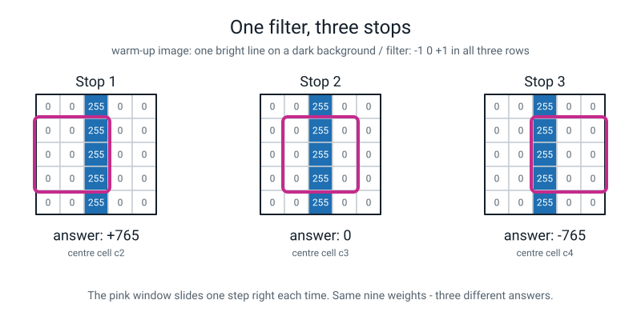
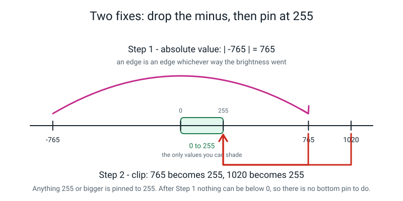
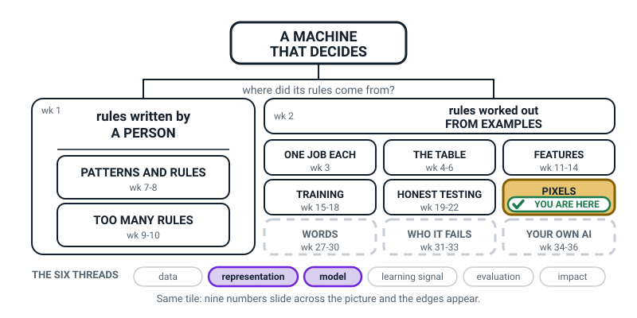
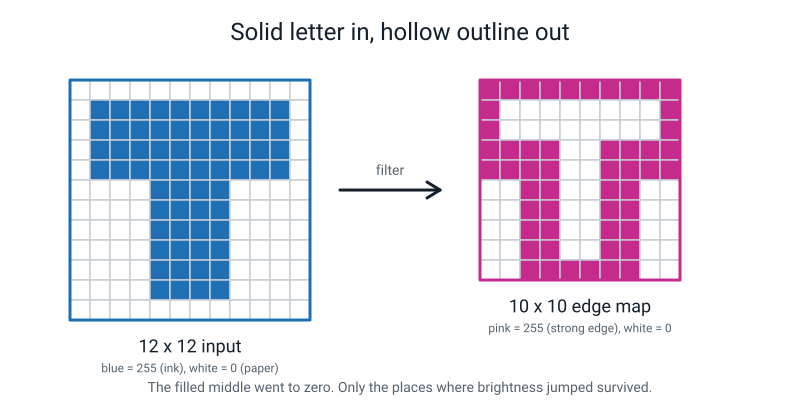
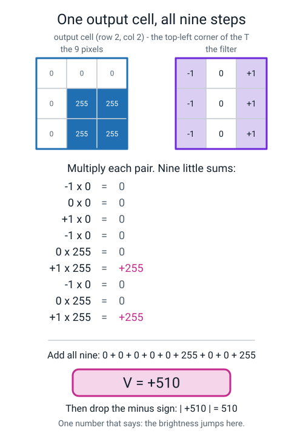
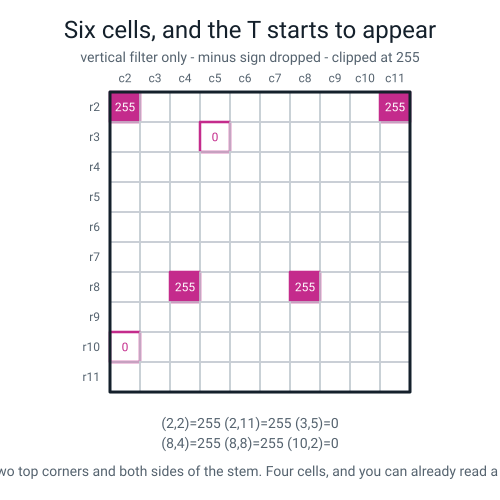

# Week 25 — Filters: The Little Grid That Finds Edges

[⬅ Week 24](week-24.md) · [Course Home](../README.md) · [Week 26 ➡](week-26.md) · [Student Guide](../student-guide/week-25.md) · [Workbook](../workbook/week-25.md)

---

## 📋 At a Glance

| | |
|---|---|
| **Duration** | 70 minutes (works in 60 if you cut Segment 5 to 5 minutes) |
| **Type** | 🟦 Teach |
| **Big idea** | Slide a tiny grid of numbers over an image and it will highlight exactly one thing — and an edge is simply a sudden change in brightness. |
| **New vocabulary** | filter · edge · absolute value · clipping |
| **Materials** | Graph paper (2 sheets), pencil, eraser, ruler, a calculator or a phone calculator, 3 highlighter pens or coloured pencils, the printed grid sheet (below) |
| **Tech needed** | **None.** Everything this week is pencil and paper. |
| **Prep time** | 10 minutes the night before + 5 minutes on the day |

---

## 🎯 Lesson Objectives

By the end of this lesson your student can:

1. **Compute one output cell of a 3×3 filter** by writing out all nine multiplications, adding them, and stating the single number that comes out.
2. **Explain why a filter made of minus-ones and plus-ones detects a vertical edge** — in the words *"it takes the right-hand column and subtracts the left-hand column"*.
3. **Take the absolute value** of a filter's answer and say, in one sentence, why the minus sign is thrown away.
4. **Clip a result back into the 0–255 range** so it can be shaded, and say what clipping costs you.
5. Shade six computed cells onto a blank grid and **recognise the beginning of an outline.**

---

## 🧑‍🏫 What YOU Need to Know First

*Read this section once, slowly. About 12 minutes. When you finish it you will genuinely understand
edge filters — not "enough to bluff", actually understand them. There is no hidden extra layer.*

### The one-sentence version

**A filter is a small grid of numbers. You lay it on top of a small patch of the image, multiply
each filter number by the pixel underneath it, add up the nine answers, and write that single
number down. Then you slide the filter one step to the right and do it again.**

That is the entire idea. Multiply, add, write down, slide. Nothing is hidden, nothing is
approximated, and there is no step you are not being shown.

### Where we are in the story

Two weeks ago (Week 23) your student learned that a photo is a grid of numbers: **0 is black, 255
is white**, and everything in between is a shade of grey. Last week (Week 24) they learned that
colour is just three of those grids stacked — red, green, blue.

So the machine now has a pile of numbers. The obvious question is the one an 11-year-old will ask
out loud: *"OK, but how does it get from a pile of numbers to 'that's a dog'?"*

This week is the first honest answer to that question. It does **not** get there in one leap. It
climbs a ladder:

```
   PIXELS      →      EDGES      →      PARTS      →     OBJECTS
   raw numbers        this week         Level 3          Level 3
```

Today we build the first rung, by hand, with a pencil. Everything above that rung is built out of
this rung, so nothing you teach today gets thrown away later.

### What an "edge" actually is

Forget the everyday meaning of the word. In images:

> **Edge** — a place where the brightness suddenly changes as you move across the picture.

That is it. Not a border you drew, not the outline of an object you recognise. Just: the number was
30, and one step later the number is 220. Something happened here.

Where does brightness *not* change? A plain wall. A blank sky. The middle of a black jumper. Those
places are boring, and the filter will report **zero** for all of them. Where does it change?
Exactly where one thing ends and another begins — which is where all the useful information lives.

### The vertical edge filter, in words before numbers

The filter we use today is this 3×3 grid:

```
   -1    0   +1
   -1    0   +1
   -1    0   +1
```

Do **not** try to read that as a picture. Read it as an instruction, and say the instruction out
loud, because the words are what your student will remember:

> **"Add up the three pixels on the right. Subtract the three pixels on the left."**

That is all those nine numbers mean. The `+1`s say *add me*. The `−1`s say *subtract me*. The `0`s
in the middle column say *ignore me completely* — the middle column genuinely does not participate.

Now think about what that instruction produces:

| What the patch looks like | Right side | Left side | Answer |
|---|---|---|---|
| Plain wall, all the same | 765 | 765 | **0** |
| Dark on the left, bright on the right | 765 | 0 | **+765** |
| Bright on the left, dark on the right | 0 | 765 | **−765** |

So a big number — positive or negative — means *"the brightness jumped sideways here."* A zero
means *"nothing changed here."* The filter answers one question, and only that question, at every
position in the image.


*Figure 25.1 — The same filter at three positions on a five-by-five warm-up grid. Left of the line: +765. On the line: 0. Right of the line: −765.*

### Two housekeeping facts that make the arithmetic work

**Fact 1 — the output grid is smaller than the input.**

A 3×3 filter needs a full ring of neighbours around whatever cell it is centred on. On the very
outside row and column, that ring does not exist — there is nothing out there. So the filter can
never sit on the border.

> **Output size = input size − 2** (for a 3×3 filter).

A 12×12 image gives a **10×10** output. Compute this number *before* you start, and count that many
cells. Getting this wrong is the single most common error in the whole lesson.

**Fact 2 — the answers can go outside 0–255, and that has to be fixed.**

The biggest the vertical filter can ever produce is 3 × 255 = **765**. The smallest is **−765**.
Neither of those is a shade of grey. Two repairs, in this order:

1. **Absolute value.** Throw the minus sign away. `|−765| = 765`. An edge is an edge whether the
   brightness went dark→bright or bright→dark; the sign only tells you *which way*, and for
   "is there an edge here?" you do not care.
2. **Clipping.** Anything 255 or above becomes exactly 255. `1020 → 255`. `765 → 255`.


*Figure 25.2 — Absolute value first, clipping second. After the absolute value nothing can be negative, so there is no bottom pin to do.*

**Clipping costs you something, and say so honestly.** A cell that was 1020 and a cell that was 765
both come out as 255. The information that one was stronger than the other is destroyed. We accept
that because we want to shade the grid, and a shade cannot be darker than black. Your student
should hear that trade named out loud — it is exactly the kind of "what did we throw away?" thinking
the whole course is built on.

### Why this matters — the reason edges are the right first thing to look for

Here is a proof your student can check in their head, and it is worth doing well.

Take two pixels: a dark object at **40** and a bright wall at **200**. The difference is 160.

Now somebody switches a lamp on and every pixel gets 50 brighter:

```
   before:   object  40    wall 200   →   difference = 160
   after:    object  90    wall 250   →   difference = 160     ← IDENTICAL
```

Both raw numbers moved. **The difference did not move at all.** And a difference is exactly what an
edge filter computes.

This is not luck. Add up the filter's nine weights: −1, 0, +1, −1, 0, +1, −1, 0, +1. **They sum to
zero.** Add the same amount to every pixel in the patch and the filter's answer changes by
(that amount) × 0 = nothing. A filter whose weights sum to zero is mathematically blind to a lamp that
adds the same amount to every pixel. (Real light is not quite that tidy: a much dimmer room also
shrinks the jumps a little. But the jump moves far less than the raw brightness does.)

That is the payoff, and it is next week's lesson in advance: **raw brightness is a bad feature
because it moves whenever the light moves. An edge is a good feature because it holds still.**

### The two misconceptions you will hit today

**Misconception 1: "Zero means there is nothing there."**

This one comes up every single time, usually while shading. The student gets a 0 in the middle of
the letter, where there is obviously plenty of ink, and decides they made a mistake.

They did not. **Zero means nothing *changed* here.** A pure white wall gives zero. A pure black wall
also gives zero. The filter is not measuring how much stuff is there; it is measuring how much the
stuff is *changing*. Say it this way:

> "The filter isn't asking 'is anything here?'. It's asking 'did anything just happen here?'
> The middle of the letter is boring — it's the same all the way across — so the answer is
> nothing happened. Zero."

**Misconception 2: "A negative answer means the pixel is dark."**

Also very common. A student sees −765 and shades it black, or worse, treats it as smaller than 0.

The sign is a **direction**, not a size. `+765` means *dark on the left, bright on the right*.
`−765` means *bright on the left, dark on the right*. Both are equally strong edges. The two sides
of the same stroke of a letter always come out with opposite signs and the same size — which is
itself a lovely arithmetic check you can point at.

### How deep to go, and exactly where to stop

**Go this deep:** one filter, applied by hand, cell by cell, with the arithmetic written out. The
words "right column minus left column". Absolute value. Clipping. Output size = input − 2.

**Stop here — do not go further today:**

- ❌ Do **not** mention that real systems *learn* their own filters instead of being handed one.
  (That is Level 3. If asked, see the Questions section — there is a short honest answer.)
- ❌ Do **not** introduce the horizontal filter in class. It is this week's **homework**, deliberately,
  so the student does one on their own from scratch.
- ❌ Do **not** mention convolution, stride, padding, or channels. None of those words help an
  11-year-old and all of them cost you time you need.
- ❌ Do **not** get drawn into "but how does it know it's a T?" It does not, yet. Today it only knows
  *where things change*. Promise the rest and move on.

### The one thing that must survive the lesson

If your student remembers only one sentence in a year's time, make it this one:

> **"A filter is nine numbers you multiply and add. Where the picture is boring, it gives you zero.
> Where something changes, it gives you a big number."**

---

### 🧭 The Growing Map

Third week on **PIXELS**, and this is the week the box earns the word *model*: the strip at the bottom
has **model** lit beside **representation**. Nine numbers on squared paper are not an analogy for what
a vision model does first — they are the thing itself, at a size a pencil can manage.



*Figure 25.0 — Week 25's version. PIXELS still tinted and badged, with **representation** and
**model** lit along the bottom.*

**What to do with it, in about two minutes at the end of the lesson:**

1. **Show it and ask:** *"which bit did we do today — and what did we do to the grid that we have never
   done before?"* The answer you want is *arithmetic*: Weeks 23 and 24 read grids, today they changed
   one and an outline appeared that nobody drew.
2. **Then the better question:** *"why is **model** lit today, when we did not train anything and did
   not touch a computer?"* Because a filter is a real first step inside an image model. Nothing was
   learned today — somebody chose the nine numbers by hand — and that is exactly the distinction worth
   making out loud, with a pointed finger at the left-hand branch of the map.
3. **Have them write six words, not nine numbers**, on their own map: *right column minus left column*.
   Words survive; a remembered grid gets rotated by accident within a fortnight.

> **🧑‍🏫 Why this is worth two minutes.** This is the lesson most likely to be mistaken for a maths
> drill — sixty multiplications and a lot of arguing about minus signs. The map is what stops that. It
> tells the learner that the tedious cell they just finished is the same kind of step that photo apps,
> scanners and vision software use, and that it sits on the *examples* branch of the
> year, not off to one side.

**The six threads** along the bottom are the spine of all four levels. **Representation** and **model**
are lit this week. Do not quiz them on the threads; the map is orientation, never assessment.

---

## 🧰 Prep Checklist

### 10 minutes, the night before

- [ ] **Print two copies of the grid sheet** (the 12×12 letter T, printed below in this file — copy it
      onto graph paper by hand or print this page). One is the *input*; one is the blank *output*.
- [ ] **Print or hand-draw the blank 10×10 output grid** with the row numbers r2–r11 down the left and
      column numbers c2–c11 across the top. Those labels matter more than they look — half the
      mistakes today are "which cell was I doing?"
- [ ] **Do cell (2,2) yourself, on paper, right now.** It takes 90 seconds. You want to have felt the
      arithmetic once before you demonstrate it. The answer is **+510**; if you get that, you are ready.
- [ ] Check the answer key at the bottom of this file is to hand — you will be reading numbers off it live.

### 5 minutes, on the day

- [ ] Sharpen two pencils. Put a rubber on the table. There *will* be corrections.
- [ ] Put the calculator where the student can reach it. Insist they use it for the three-number
      column sums; today is not an arithmetic test, and a slip in adding 255+255+255 derails the
      real lesson.
- [ ] Draw the empty 3×3 filter on the board before the student arrives:

```
    ┌────┬────┬────┐
    │ -1 │  0 │ +1 │
    ├────┼────┼────┤
    │ -1 │  0 │ +1 │
    ├────┼────┼────┤
    │ -1 │  0 │ +1 │
    └────┴────┴────┘
```

### If something fails

**There is no technology in this lesson, so almost nothing can fail.** The two things that can:

| Problem | Fallback |
|---|---|
| No graph paper | Draw a 12×12 grid on plain paper with a ruler, 1.5 cm squares. Five minutes. Or copy the 12×12 picture from the workbook's Build It section. |
| Your student drew a *different* letter in Week 23 and wants to use theirs | Let them, and switch to their grid — the method is identical. But **you** must then recompute the six cells live, so budget 5 extra minutes and check each one with them. If you are at all unsure, use the T in this file and promise them their own letter next week (which is true — Week 26 uses their own). |

---

## ⏱️ The Lesson, Minute by Minute

| # | Segment | Minutes | Running total |
|---|---|---|---|
| 1 | 🪝 Hook — Find the edge with your finger | 8 | 8 |
| 2 | 🧠 Concept — Nine numbers, one question | 18 | 26 |
| 3 | 🔍 Worked example together — cell (2,2), all nine steps | 14 | 40 |
| 4 | 🎲 Activity — Run the Filter by Hand | 20 | 60 |
| 5 | 🔑 Wrap & assign | 10 | 70 |

---

### 1 · 🪝 Hook — Find the edge with your finger (8 min)

**Say this:**

> "Put your finger on the wall — anywhere in the middle of it. Slide it along. Now tell me: does the
> wall get brighter or darker as you slide? … No. It's the same all the way. Boring.
>
> Now slide your finger until you hit the edge of the door frame. Stop there. *That* spot is
> different. On one side it's wall, on the other side it's frame, and the brightness just jumped.
>
> That jump has a name in this course. It's called an **edge**. Not the edge of a table — an edge in
> a picture is just this: **a place where the brightness suddenly changes.**
>
> Here's the strange thing I want you to notice. If I switch an extra lamp on, the wall gets
> brighter, the door frame gets brighter, everything gets brighter. But is there *still* a jump at
> the door frame? … Yes. In these numbers the jump survives. The brightness didn't.
>
> Hold on to that, because it's the reason this whole week exists. Today you're going to build a
> tiny machine — nine numbers on a scrap of paper — whose only job in life is to find those jumps."

**Do this:**

- Actually make them get up and touch the wall and the door frame. It takes 40 seconds and it turns
  an abstract word into a physical memory.
- Write on the board, and leave it there all lesson:

```
   EDGE = a place where the brightness suddenly changes
```

- Then hand over the printed input grid (the letter T) and say nothing for ten seconds while they
  look at it.

**Ask this:**

> **Q: "Look at the grid. Point at a place where a 0 sits right next to a 255. How many places like
> that can you find along the top row of the letter?"**
>
> *Hoping for:* they trace along and find the boundary between row 1 (all zeros) and row 2 (mostly
> 255s), and ideally say "the whole top of the letter".
>
> *If they say "I don't know where to look":* put your own finger on cell (r1, c5) — a zero — and
> then move it down one to (r2, c5) — a 255. Say: "Zero, then 255. That's a jump. That's an edge.
> Now find me another one."
>
> *If they point at two 255s next to each other:* "Those are the same number. Nothing changed. What
> we want is a place where the number suddenly *changes*."

> **Q: "Which is easier to spot with your eyes — the exact brightness of a pixel, or the place where
> the brightness jumps?"**
>
> *Hoping for:* "the jump."
>
> *If they say "the brightness":* try it. Cover the grid, show them a single square shaded mid-grey
> and ask what number it is. They will not know. Then show them a boundary and ask "is there a jump
> here — yes or no?" Instant. That's the point: jumps are easy, absolute levels are hard. Your eye
> works the same way the filter does.

---

### 2 · 🧠 Concept — Nine numbers, one question (18 min)

**Say this:**

> "Here is the whole invention. It is nine numbers. I'm going to write them on the board and then
> I'm going to tell you what they *say*, because the numbers look mysterious and the sentence is not.
>
> [write the 3×3 grid]
>
> Now. This is not a picture. This is an **instruction**. And the instruction is exactly this:
> **add up the three pixels on the right, and subtract the three pixels on the left.** That's it.
> The plus-ones mean 'add me'. The minus-ones mean 'take me away'. And the zeros in the middle
> column mean 'ignore me completely' — the middle column doesn't get used at all.
>
> This little nine-number grid has a name. It's called a **filter**. Some people call it a **kernel**;
> same thing, don't worry about it.
>
> Now think about what the instruction does. Suppose I put it down on a boring bit of the picture —
> a plain patch where every pixel is the same. The right side adds up to some number. The left side
> adds up to *the same* number. Subtract them and you get… zero. Every time.
>
> Now suppose I put it down right on the left-hand edge of the letter. On the left of my little
> window it's all paper — zeros. On the right of my window it's all ink — 255s. Right side is
> 255 + 255 + 255 = 765. Left side is 0. Subtract: **seven hundred and sixty-five.** Big number.
>
> So the filter is a question-asking machine. It asks one question — *did the brightness jump
> sideways here?* — and it asks it at every single position in the picture."

Pause here. Let them look at Figure 25.1 for a moment before you continue.

> "One more thing and then we compute. What if it's bright on the *left* and dark on the right?
> Then it's 0 minus 765, which is **minus** 765. A negative number.
>
> Does that mean it's a worse edge? No! It's exactly as strong. The minus sign only says which
> *direction* the jump went. So when we're finished we do a thing called taking the **absolute
> value**, which is a fancy way of saying: rub the minus sign out. Minus 765 becomes 765.
>
> And there's one last tidy-up. Grey shades only go from 0 to 255. But our filter can produce 765.
> You can't shade 765 — there's no colour darker than black. So we **clip**: anything 255 or bigger
> just becomes 255. Pinned. Done."

**Do this:**

- Write these four things on the board and leave them up. This is the board a student can steal
  answers from all lesson, and that is fine — you want the *method* memorised, not the numbers.

```
   FILTER  =  nine numbers you multiply and add
              "right column  minus  left column"

   OUTPUT SIZE  =  input - 2        (12x12  ->  10x10)

   |-765| = 765        ← absolute value: rub out the minus
   765 -> 255          ← clipping: pin anything 255 or over
```


*Figure 25.3 — Where all this is heading. Show this for five seconds only; do not explain it yet. It is the promise that pays off in Week 26.*

- Demonstrate the sliding physically. Cut a 3×3 window out of a scrap of card (or make a rectangle
  with two L-shaped bits of paper) and lay it on the printed grid. Slide it one square right, then
  one square right again. **Do this at least four times.** The physical sliding is worth ten
  sentences of explanation.

**Ask this:**

> **Q: "Our image is 12 by 12. How big will the answers grid be?"**
>
> *Hoping for:* "10 by 10", with the reason "the filter can't sit on the outside row, it needs
> neighbours all round."
>
> *If they say "12 by 12":* put the card window on the very top-left square and ask "what's above
> this square? What's to the left of it?" Nothing. "So the filter has nothing to multiply up there.
> It can't sit here." Then slide it in one square and it fits. Then count: 12 minus the left edge
> minus the right edge = 10.
>
> *If they say "9 by 9" or "11 by 11":* they are subtracting once instead of twice. Have them count
> the cells the window's *centre* can reach along the top: c2, c3, … c11. Count them out loud. Ten.

> **Q: "The middle column of the filter is all zeros. What happens to those three pixels?"**
>
> *Hoping for:* "nothing — they get multiplied by zero, so they don't count."
>
> *If they say "they get added":* multiply it out with them. 0 × 255 = 0. 0 × 17 = 0. Whatever is
> under the middle column, it contributes exactly nothing. "The filter genuinely doesn't care what's
> in the middle. It only compares the two sides."

> **Q: "If I switch a lamp on and every single pixel gets 40 brighter, what happens to the filter's
> answer?"**
>
> *Hoping for:* "it stays the same" — but this is a hard question and most students won't get it
> unaided, so it is fine to walk them there.
>
> *If they hesitate:* do it with two numbers on the board. Right side 765, left side 0, answer 765.
> Now add 40 to each of the three right pixels (+120) and 40 to each of the three left pixels
> (+120). New right side 885, new left side 120. 885 − 120 = **765**. Unchanged. Let that land.
> "Both sides got the same bonus, so the bonus cancels out."
>
> *Do not push further today.* This is Week 26's whole lesson; you are planting it.

---

### 3 · 🔍 Worked Example Together — cell (2,2), all nine steps (14 min)

This is the segment you must not rush. Everything after it is repetition.

**Say this:**

> "Right. We're going to do one cell together, completely, showing every single multiplication.
> After this one you'll never need all nine written out again — but you need to see it once, so you
> know there's nothing hidden.
>
> We're going to do the cell called **(2,2)**. That means row 2, column 2 — the top-left corner of
> our letter. The filter sits centred on that pixel, so it covers rows 1 to 3 and columns 1 to 3.
> Let's read those nine pixels off the grid, together, out loud."

Read them off the printed grid with your finger, one at a time. Write them in a 3×3 box on the board:

```
      c1    c2    c3
 r1    0     0     0
 r2    0   255   255
 r3    0   255   255
```

> "Now I lay the filter on top. Top-left of the filter is −1, and underneath it is a 0. So:
> minus one times zero. That's zero. Next: zero times zero — zero. Next: plus one times zero — zero.
>
> Second row. Minus one times zero — zero. Zero times 255 — zero, because anything times zero is
> zero. Plus one times 255 — **plus 255**.
>
> Third row, same again. Zero, zero, **plus 255**.
>
> Now add up all nine. Zero, zero, zero, zero, zero, two-five-five, zero, zero, two-five-five.
> Total: **plus five hundred and ten.**
>
> Take the absolute value — it's already positive, so nothing to rub out. Five hundred and ten.
> And clip it: 510 is bigger than 255, so it becomes **255**. Shade it dark.
>
> That number is the machine saying: *something is going on right here.* And it's right — that's the
> corner of the letter."

**Do this:**

- Write all nine multiplications on the board on nine separate lines. Not three, not one. Nine. The
  student must see that "nine multiplications" is literally nine.
- Then show the shortcut you will use for the remaining cells, and say clearly that it is the same
  sum, just written faster:

```
   THE SHORTCUT

   right column (c3) = 0 + 255 + 255 = 510
   left  column (c1) = 0 +   0 +   0 =   0
                       ------------------
   V(2,2) = 510 - 0 = +510
```


*Figure 25.4 — What the board should look like at the end of this segment.*

- Then do **one more together at half speed**, using the shortcut only: cell **(2,11)**, the top-right
  corner. Patch is rows 1–3, columns 10–12. Right column (c12) = 0. Left column (c10) = 0 + 255 + 255
  = 510. So V = 0 − 510 = **−510**. Absolute value: **510**. Clipped: **255**.

**Ask this:**

> **Q: "(2,2) came out plus 510. (2,11) came out minus 510. Why do they have different signs, and
> which one is the stronger edge?"**
>
> *Hoping for:* "They're the two sides of the letter. On the left the picture goes dark-to-bright,
> on the right it goes bright-to-dark. They're equally strong."
>
> *If they say "the plus one is stronger":* ask "how far is 510 from zero? How far is minus 510 from
> zero?" Same distance. "The minus is a direction, not a size. That's exactly why we rub it out."
>
> *If they say "I don't know":* draw two arrows on the board — one pointing right labelled
> "dark → bright, +", one pointing left labelled "bright → dark, −" — and put them on the two sides
> of the letter on the printed grid.

> **Q: "Why did we get 510 here and not 765?"**
>
> *Hoping for:* "Because one of the three pixels on the right is a 0 — the corner only has two ink
> pixels in the window, not three."
>
> *If they don't see it:* point at the patch on the board. Row 1 is all paper. So the right column is
> 0 + 255 + 255, not 255 + 255 + 255. "Corners are half-in and half-out, so they score less than the
> middle of a straight edge. We'll come back to corners in the homework — they turn out to be the
> most interesting cells of all."

---

### 4 · 🎲 Activity — Run the Filter by Hand (20 min)

Full instructions are in the next section. In the lesson flow, this is the block where the student
computes the remaining **four** cells largely alone, with you checking each one.

**Say this:**

> "Your turn. Four more cells. I've picked them on purpose — two of them are going to surprise you.
> Use the shortcut, use the calculator for the column sums, and write down the left sum and the right
> sum for every one, not just the answer. If your answer is wrong I want to be able to see *where*."

**Do this:**

- Hand over the blank 10×10 output grid.
- Write the four remaining cells on the board so they cannot lose them:

```
   YOUR FOUR:      (3,5)      (8,4)      (8,8)      (10,2)
```

- Circle each of the four positions on their *input* grid with a highlighter, so they are computing
  in the right place. This removes the single biggest source of wasted time.
- Check each answer as it lands, out loud, before they move on. Do not let a wrong cell sit.

**Ask this** (after cell (3,5), which comes out **zero**):

> **Q: "You got zero. Look at the picture there — is there nothing there?"**
>
> *Hoping for:* "No — it's right in the middle of the letter, it's full of ink." Then, with a nudge:
> "but it's the *same* all the way across, so nothing changed."
>
> *If they say "I must have made a mistake":* this is the moment of the lesson. Say: "You didn't.
> Check it again — both columns are 765, and 765 minus 765 is zero. **Zero doesn't mean nothing is
> there. Zero means nothing *changed* here.** The middle of the letter is boring. The filter is
> telling you the truth."

**Ask this** (after cell (10,2), which is also **zero**):

> **Q: "This one is zero too. But it's zero for a completely different reason. What's the difference?"**
>
> *Hoping for:* "(3,5) is zero because it's *all ink*; (10,2) is zero because it's *all paper*."
>
> *If they can't separate them:* point at both on the input grid. One patch is nine 255s. The other
> is nine 0s. Both flat, both boring, both zero. "The filter can't tell a white wall from a black
> wall. It only sees change."

---

### 5 · 🔑 Wrap & Assign (10 min)

**Say this:**

> "Shade your six answers onto the blank grid. Anything that clipped to 255 goes dark. Anything that
> came out 0, leave white.
>
> … Now stand back and look at it. Six cells out of a hundred. Tell me what you can see.
>
> You can see the two top corners of the letter, and both sides of the stem. From **six numbers**.
> Nobody told the filter there was a letter T in there. Nobody wrote a rule that said 'look for a
> horizontal bar with a stick under it'. All it did was subtract the left side from the right side,
> ninety-four more times than we had time for, and the shape fell out.
>
> One more thing before you go, and it's the honest bit. Our filter only found the **left and right**
> edges. Look at the top of the letter — the flat top edge, where paper meets ink going downwards.
> Our filter is completely blind to it. It scored zero all along the top, between the two corners. Why? Because we only ever
> compared *left to right*. We never compared *up to down*.
>
> That's your homework. There's a second filter that compares top to bottom, and you're going to run
> it on the same six cells and add the two together. When you do, something new will show up in the
> corners."

**Do this:**

- Shade with them. Watch that they shade *the output grid*, not the input grid — this genuinely gets
  confused.
- Point at Figure 25.5 and let them compare.


*Figure 25.5 — What the finished shaded output grid should look like at the end of class.*

- Write the four vocabulary words on the board and have the student say a one-line definition for
  each, in their own words, before they leave.

**Ask this:**

> **Q: "In one sentence — what does a filter do?"**
>
> *Hoping for:* something like "it multiplies nine numbers, adds them up, and gives you one number
> that says whether the brightness changed."
>
> *If they say "it finds edges":* accept it, then push once: "How? What does it actually *do* with
> the numbers?" You want the multiply-and-add in there.

---

## 🎲 The Activity, In Full

### Run the Filter by Hand

**Time:** 20 minutes (plus the 14 minutes of worked example that precede it)
**Materials:** the printed input grid, the blank 10×10 output grid, pencil, eraser, calculator, one
highlighter.
**Grouping:** one student, one teacher, side by side. Do not sit opposite — you both need to read the
grid the same way up.

### The image

This is the 12×12 grid. **255 = ink, 0 = paper.** It is a fat capital **T**.

```
        c1   c2   c3   c4   c5   c6   c7   c8   c9  c10  c11  c12
  r1     0    0    0    0    0    0    0    0    0    0    0    0
  r2     0  255  255  255  255  255  255  255  255  255  255    0
  r3     0  255  255  255  255  255  255  255  255  255  255    0
  r4     0  255  255  255  255  255  255  255  255  255  255    0
  r5     0  255  255  255  255  255  255  255  255  255  255    0
  r6     0    0    0    0  255  255  255  255    0    0    0    0
  r7     0    0    0    0  255  255  255  255    0    0    0    0
  r8     0    0    0    0  255  255  255  255    0    0    0    0
  r9     0    0    0    0  255  255  255  255    0    0    0    0
  r10    0    0    0    0  255  255  255  255    0    0    0    0
  r11    0    0    0    0  255  255  255  255    0    0    0    0
  r12    0    0    0    0    0    0    0    0    0    0    0    0
```

Sanity check for you: the bar is 4 rows × 10 columns = 40 pixels, the stem is 6 rows × 4 columns =
24 pixels, so **64 bright pixels out of 144**.

### The filter

```
   -1    0   +1
   -1    0   +1        "right column  minus  left column"
   -1    0   +1
```

### The six cells, in this order

| Order | Cell | Why this one is on the list |
|---|---|---|
| 1 | **(2,2)** | Done together. All nine multiplications written out. |
| 2 | **(2,11)** | Done together. Introduces the **minus sign**. |
| 3 | **(3,5)** | Student alone. **Flat inside the letter → 0.** The surprise. |
| 4 | **(8,4)** | Student alone. **Straddles the stem's left edge → the biggest number possible.** |
| 5 | **(8,8)** | Student alone. The stem's right edge → the same size, opposite sign. |
| 6 | **(10,2)** | Student alone. **Empty background → 0.** The second kind of zero. |

### The rules

1. For every cell, write **three lines**: the left column sum, the right column sum, and the subtraction.
2. Use the calculator for the sums. This is not an arithmetic test.
3. After every cell, do the two repairs: **absolute value**, then **clip at 255**.
4. Shade the clipped answer onto the output grid: 255 → dark, 0 → leave white.

### What "finished" looks like

- Six cells computed, each with left sum, right sum and subtraction shown.
- All six absolute values taken and all six clipped.
- Six cells shaded on the 10×10 grid: **four dark, two white**.
- The student can point at the shaded grid and say "that's the top corners and the two sides of the
  stem."

### Variation — easier

If the six cells are taking too long or the student is losing heart:

- **Cut to four cells:** (2,2), (3,5), (8,4), (10,2). You still get one corner, one flat-ink zero,
  one maximum, one flat-paper zero. That is the full conceptual set.
- **Pre-fill the nine pixel values** into a small printed 3×3 box for each cell, so the student only
  does the arithmetic and never has to hunt on the big grid. Hunting is where the time goes.
- **Drop the clipping step entirely** for now. Just do absolute value and shade "big = dark, zero =
  white". Bring clipping back in the wrap-up as a one-minute idea.

### Variation — harder

If the student finishes early and is enjoying it:

- **Add cell (6,4) and cell (6,6).** Both sit on the row where the bar ends and the stem begins, so
  they are genuinely interesting. Answers: V(6,4) = **+510**, V(6,6) = **0**. Ask them to predict
  which is bigger before they compute, then explain the difference afterwards.
- **Ask them to predict before computing.** For each new cell: "Look at the picture. Big, zero, or
  negative?" Then compute and see. Prediction-then-check is worth double the practice.
- **Ask the killer question:** "Is there any cell anywhere in this whole grid where the vertical
  filter gives a big answer along the *top* of the letter?" The answer is no, apart from the two corners (2,2) and (2,11), which are
  really the ends of the side edges — and if they can
  explain why, they have understood the filter completely. (Because the top edge is a change going
  *down*, and this filter only ever compares left to right.)

---

## ❓ Questions Students Ask This Week

**1. "Who decided the numbers should be −1, 0, +1? Why not −5 and +5?"**

Nobody official — a person picked them because they are the simplest numbers that mean
"subtract this side, add that side". You could absolutely use −5 and +5 instead; every answer would
be exactly five times bigger, and on this letter the shaded picture would look identical after clipping (every non-zero answer is already 510 or more). What
you *cannot* change is the **pattern**: minuses on one side, pluses on the other, and the whole set
adding up to zero. That pattern is what makes it an edge detector rather than something else.

**2. "What if I put different numbers in? Can I invent my own filter?"**

Yes, and people do this all the time. Put all nine numbers as `1` and divide by 9 and you get a
**blur** — every pixel becomes the average of itself and its neighbours. Put the minuses along the
top and the pluses along the bottom and you get a horizontal edge detector, which is your homework.
Put them along a diagonal and you get a diagonal edge detector. The nine numbers are a little
program, and changing them changes what the program looks for.

**3. "Why do we throw away the minus sign? Isn't that losing information?"**

Yes — and that is a genuinely good objection, so say so. We *are* losing information: we lose which
direction the brightness jumped. We throw it away because for the question we are asking right now —
*"is there an edge here?"* — the direction does not matter, and keeping it would mean we could not
shade the grid. If you were asking a different question, like "which side of this object am I on?",
you would keep the sign. Choosing what to throw away is most of engineering.

**4. "Why is the answer grid smaller? Doesn't that mean we lose the outside of the picture?"**

Yes, exactly that, and it is unavoidable with this method. The filter needs a neighbour in every
direction, and the outermost pixels do not have one. Real systems deal with this by pretending there
is an extra ring of pixels around the outside — usually all zeros — which lets the output stay the
same size. It has a name (padding) and it is a bit of a fudge, because those pretend pixels create
pretend edges around the border. For a 12×12 grid we just accept the 10×10 and move on.

**5. "Is this what my phone does when it takes a photo?"**

Partly, and more than you would guess. Your phone runs filters over the image constantly — to
sharpen it, to reduce noise, to find your face so it can focus on it. The "sharpen" slider in any
photo app uses a filter of the same kind (different nine numbers), run over every pixel. What your phone does *not* do is
stop at edges; it stacks hundreds of filters on top of each other, and the later ones look at the
output of the earlier ones. That stacking is Level 3.

**6. "Does my eye do this?"**

Here is where I have to be honest: **partly yes, and partly nobody knows for sure.**

The "yes" part is solid. In the 1960s two scientists put tiny electrodes into the visual part of a
cat's brain and found individual cells that fired hard when a bright *line at one particular angle*
crossed a particular spot, and stayed quiet for everything else. That is an edge detector, built out
of living tissue, and the discovery won a Nobel Prize. Your visual system genuinely does find edges
very early on.

The "nobody knows" part: whether everything *above* that first step works like a computer vision
system — parts, then objects, then meaning — is very much an open question. Brains and image
classifiers do some of the same things and then diverge in ways nobody has fully explained. Anyone
who tells you your brain "works just like a neural network" is going further than the evidence goes.

**7. "Couldn't you just count how much ink there is instead? That's way easier."**

You could, and it would work — right up until someone turns a lamp on, or takes the photo at dusk,
or puts the letter on grey paper instead of white. Then your ink-counter gives a completely different
answer for the same letter. The filter does not, because it compares two sides of the same patch and
both sides get the lamp equally. That is exactly what you will prove with real numbers next week.

**8. "What happens at a corner? Does it count twice?"**

Hold that thought until you have done the homework, because you are about to find out and the answer
is genuinely interesting. Short version: a corner is a left-right change *and* an up-down change in
the same place, so both filters fire at once, and the two answers add up. Corners come out stronger
than straight edges. That is not a bug — it is why corner detectors were among the earliest
and most popular automatic feature-finders in computer vision. A straight line looks like every other straight
line; a corner tells you about shape.

---

## ⚠️ Where This Lesson Goes Wrong

| What happens | Why | What to do right now |
|---|---|---|
| Student makes the output grid 12×12 and can't work out why the edges are blank | They forgot the filter cannot sit on the border row | Put the card window on the very corner square and ask "what's above this?" Nothing. Then count the reachable centres out loud: c2, c3 … c11. Ten. Rewrite **output = input − 2** on the board and leave it there |
| Student reads the filter downwards instead of across, and gets the horizontal answer | `-1 0 +1` looks identical whether you read it as a row or a column | Ban the numbers for two minutes. Make them say the **words** — "right column minus left column" — before every single cell. Words do not rotate |
| Student shades a −765 as "very dark" and a +765 as "very bright" | They are treating the sign as a brightness | Rub out the minus *first*, always, before shading. Say: "Step one, minus sign in the bin. Step two, shade." Both sides of a stroke are equally dark on the edge map |
| Student gets a zero in the middle of the letter and assumes they made a mistake, then "fixes" a correct answer | Zero feels like "nothing is here" | Stop everything and make this the moment: **zero means nothing *changed*, not nothing is there.** Show them that both a white wall and a black wall give zero. This is the misconception most worth spending two minutes on |
| Arithmetic errors pile up and the shaded grid comes out wrong, so the "outline appears" moment falls flat | 255 + 255 + 255 by hand is where mistakes live | Insist on the calculator from cell one, and check each answer *before* they move to the next cell. Never let a wrong cell sit — the payoff at the end depends on all six being right |
| Student is computing the right arithmetic on the wrong patch | They lost track of which cell they were on | Highlight the target cell on the input grid before each computation. Have them write "cell (8,4)" at the top of the working before any numbers |
| Student asks "but how does it know it's a T?" and the lesson derails into a much bigger conversation | It is the obvious next question and it is a good one | Answer in one sentence and park it: "It doesn't. Today it only knows *where things change*. Turning 'where things change' into 'that's a T' takes a few more steps and we build them later." Then point at the ladder on the board |
| Student finishes the six cells in eight minutes and gets bored | Some students find this arithmetic trivially easy | Go straight to the harder variation: add (6,4) and (6,6), and make them *predict before computing*. Then the killer question about the top edge |

---

## 🧭 Differentiation

### If they are struggling

**Cut:**
- Drop clipping entirely from the main activity. Do absolute value only, and shade "big = dark,
  zero = white". Introduce clipping as a 60-second idea in the wrap-up.
- Drop cells (2,11) and (8,8) — the two negatives. Do the four positive/zero cells. Bring negatives
  back next week when the arithmetic is familiar.

**Reteach:**
- Go back to two numbers, not nine. Write `40` and `200` on the board. Ask: what's the difference?
  160. Now make them both 50 bigger — 90 and 250. What's the difference? Still 160. That's the whole
  idea in two numbers. Then say: "the filter does that, but with three numbers on each side instead
  of one."
- Physically slide the card window. Ten times. Some students need the motion before the arithmetic.

**Scaffold:**
- Pre-print each cell's 3×3 patch as a small box so they never hunt on the big grid.
- Give them a fill-in-the-blank working sheet:
  `right column = ___ + ___ + ___ = ____` / `left column = ___ + ___ + ___ = ____` / `answer = ____`

### If they are flying

Extension questions, roughly in order of difficulty:

1. **"Find me a cell where the vertical filter gives exactly +255."** One answer is **V(6,2)**: right
   column (c3, rows 5–7) = 255 + 0 + 0 = 255, left column (c1) = 0, so the answer is +255. It works
   because exactly one of the three right-hand pixels is ink. **V(5,4)** and **V(5,5)** also give
   +255. Let them hunt.
2. **"Design a filter that finds diagonal edges."** Minuses in the bottom-left triangle, pluses in the
   top-right. Let them test it on a cell.
3. **"What filter would find *nothing*, ever, no matter what image you gave it?"** All zeros. Then the
   better version: all ones — that one always reports the total brightness, which is the opposite of
   an edge detector, and it is *not* blind to lighting. Ask why. (Its weights sum to 9, not 0.)
4. **"Our filter is blind to the top edge of the letter. Prove it."** Have them compute V at (2,6),
   which sits right on the top edge of the bar. It comes out **0**. That is a genuinely satisfying
   proof and it sets up the homework perfectly.
5. **"How many multiplications would it take to do the whole 10 by 10 grid?"** 100 cells × 9
   multiplications = **900**. Then: "and a real photo is 224 × 224 with hundreds of filters. Now you
   know why this needs a computer."

### If they won't engage today

Some days the arithmetic is a wall. Do not force six cells.

- **Do the physical version only.** Cut the card window. Slide it along a printed grid. For each stop
  ask one question only: *"Is it the same on both sides, or different?"* No numbers at all. Get
  through fifteen stops in five minutes. That is the concept, and it is genuinely enough for today.
- **Draw instead.** Give them the shaded input T and ask them to draw, freehand, where they think the
  outline should be. Then show them Figure 25.3 again and compare. They will be close, and being
  close is worth a lot — it means they have understood what an edge map *is* even if they did not
  compute one.
- **Do one cell, well.** Cell (2,2), together, all nine multiplications, and stop. One cell understood
  beats six cells resented. Note it and pick up the remaining five at the start of Week 26 — that
  week has slack in it.

---

## ✅ Assessing Understanding

Three checks, five minutes, in the last block. Ask all three; they test different things.

### Check 1 — the method

> **Say exactly:** *"Without looking at the board — tell me what a filter does, step by step, as if I
> have never heard of one."*

**A good answer contains three moves:** (i) you put the little grid on top of a patch, (ii) you
multiply each number by the pixel under it and add them all up, (iii) that gives you one number,
and then you slide along and do it again.

**A weak answer:** "it finds edges." True but not the method. Push once: "How? What does it actually
do with the numbers?"

### Check 2 — the zero

> **Say exactly:** *"I run the filter somewhere in a photo and it gives me zero. Give me two completely
> different things that could be going on in that photo."*

**A good answer:** it is all bright there (like the middle of the letter), **or** it is all dark there
(like the empty background) — either way it is *flat*, nothing is changing.

**A weak answer:** "there's nothing there." That is the misconception. Reteach it on the spot with the
two grids from the activity.

### Check 3 — the two repairs

> **Say exactly:** *"My filter gives me minus 900. Walk me through what I do to it before I can shade
> it in, and tell me what I lose at each step."*

**A good answer:** rub out the minus → 900 (you lose which *direction* the brightness jumped); then
clip it → 255 (you lose how *strong* it was — a 900 and a 300 now look the same).

**A very good answer** notices that the second loss is the more serious one, and that it is why the
finished edge map looks flat-black everywhere instead of showing degrees of strength.

### Mastery scale for this week

| Level | What it looks like |
|---|---|
| **1 — Not yet** | Cannot say what a filter is. Treats the nine numbers as a picture rather than an instruction. Cannot produce an output cell even with the patch handed to them. |
| **2 — Emerging** | Can do the arithmetic when the 3×3 patch is written out for them, but cannot find the patch themselves and cannot say why the answer means anything. Thinks 0 means "nothing there". |
| **3 — Secure** ← *target for this week* | Finds the patch, computes the cell using the left-sum/right-sum shortcut, applies absolute value and clipping in the right order, and can say "big number = the brightness jumped here, zero = it's flat here." |
| **4 — Strong** | All of the above, plus explains the sign as a direction, predicts an answer before computing it and is usually right, and can say why the output grid is 10×10 without prompting. |
| **5 — Exceptional** | Explains unprompted that the filter is blind to the top edge because it only compares left to right; can design a working filter for a different orientation; and can explain why weights that sum to zero make the filter ignore the lamp. |

---

## 📤 Homework to Assign

**Workbook: Week 25, all sections.** Expect **45–55 minutes**. Tell the student to do the **Build It**
task last — it is the biggest piece and it needs graph paper.

**Say this, word for word:**

> "Same grid, same six cells, but a different filter. The new one is the **horizontal** filter — it
> compares the **bottom row to the top row** instead of right column to left column. It's written at
> the top of the **Build It** section of your workbook.
>
> The workbook has a few warm-up and practice sections first — do those, then save Build It for last.
> In Build It there are four things to do.
>
> One: compute the horizontal filter at those same six cells. Write the top-row sum and the
> bottom-row sum every time, same as today.
>
> Two: take the absolute value of each. Don't clip yet.
>
> Three: **combine** them. For each cell, add your horizontal answer to today's vertical answer —
> the absolute values, before clipping. Then clip the total. That combined grid is called an
> **edge map**.
>
> Four: shade the edge map, and then answer the written question: *which parts of the letter came
> out strongest, and why does that make sense?* One paragraph. I want a reason, not just a number.
>
> One warning: do the combining **before** you clip, not after. If you clip each one first you'll
> throw away the very thing the question is asking about."

**What is in the workbook, in order:**

| Section | What is on it |
|---|---|
| ✅ Warm-Up (W1–W5) | Five recall questions from the colour-image weeks: counting numbers in a colour photo, the three stacked grids, red + green, why averaging cannot be undone, what 0 and 255 mean |
| ✍️ Practice Set A — Understand It (A1–A6) | Fill in the blanks about the filter, "why is the answer 0", true/false on −600 vs +300, match five patches to answers, label the diagram (Figure W25.1), one worked 3×3 sum |
| ✍️ Practice Set B — Use It (B1–B5) | A new picture (two-pixel stripe) and its answers grid, Ravi's 12×12 answers grid, Maya's clip-then-absolute-value slip, white wall in a bright and a dim room, Sam's "more ink" claim |
| 🧩 Puzzle of the Week (P1–P4) | Three mystery filters (Figure W25.2): add up the weights, spot the non-edge-finder, pick the top-edge filter, the lamp test |
| 🤔 Think Deeper (T1–T2) | Two paragraph questions: was throwing away the sign a good trade, and an alternative to clipping |
| 🛠️ Build It | The horizontal filter, the 12×12 picture reprinted, a 7-step checklist, the results table for the six cells, the written question, four vocabulary boxes, and one prediction for Week 26 |
| 🎨 Draw It | Draw a shape on an 8×8 grid and mark where the vertical filter gives big answers and where it gives zero |
| 📊 Self-Check | Five tick-the-box rows; the student's own confidence check, not marked |

The workbook also has its own Answers section at the end, so warn the student that it is there and
that the point is to try first.

**If they are short of time:** Build It (steps 1–5 and the written question) and Practice Set A are the
essential pieces. Warm-Up, Practice Set B, the Puzzle and Think Deeper can wait, and Build It's
shading (step 6) can be done together in the first five minutes of Week 26. Draw It and the
Self-Check take a few minutes each and are easy to finish in Week 26 too.

---

## 🔑 Answer Key

*Everything below is worked in full. Column sums are given so you can find the exact point where a
wrong answer went wrong.*

*The workbook sections come first, in workbook order (Warm-Up, Practice Set A, Practice Set B,
Puzzle, Think Deeper). Build It follows as Parts A–F, then Draw It and Self-Check. The workbook's own
Answers section at the end matches these values.*

### Warm-Up (W1–W5)

| Item | Answer | Teacher note |
|---|---|---|
| **W1** | **300.** 10 × 10 = 100 pixels × 3 numbers each | Wrong answer 100: forgot the three grids. |
| **W2** | **Red, green, blue** (any order) | |
| **W3** | **Yellow.** Red light + green light; this is light, not paint | Wrong answer "brown" or "orange": paint-mixing habit. |
| **W4** | **No.** An average does not remember what made it: 100,100,100,100 and 0,200,100,100 both average to 100 | Accept any "the detail is gone" reason. |
| **W5** | 0 = **black**, 255 = **white** | Watch for the two swapped. |

### Practice Set A — Understand It (A1–A6)

**A1.** nine · multiply · add · **right** column minus **left** column · zero · zero. The middle column
is multiplied by 0, so it contributes exactly 0.

**A2.** **(b)** — the picture is flat there. Wrong-answer map: **(a)** is the big misconception (solid ink
also gives zero); **(c)** makes them "fix" a correct zero; **(d)** cannot matter, the middle column is
multiplied by zero.

**A3.** **FALSE.** The sign is a direction, not a size. −600 is 600 from zero, +300 only 300, so −600 is
the stronger edge, by double. Accept any answer that says "size, not sign". This is why we take the
absolute value before comparing.

**A4.** 1 → **(c) 0** · 2 → **(a) +765** · 3 → **(b) −765** · 4 → **(c) 0** · 5 → **(d) +510**.
Items 1 and 4 share the answer 0: all-ink and all-paper are opposite pictures but both flat.
Watch for item 5: two ink pixels in the right column is 510, not 765.

**A5.** **A** = the nine pixels under the window · **B** = the filter (kernel) · **C** = the column that
gets subtracted (the left column, the one over the −1s) · **D** = the one output cell.

**A6.**

```text
   right column (c5)  =  255 + 255 + 255  =  765
   left  column (c3)  =  255 +   0 +   0  =  255
   answer             =  765 − 255  =  +510
   absolute value     =  510        clipped  =  255
```

This patch is cell (6,4) of the letter T, where the bar ends and the stem begins. The left column is
half ink, so the answer is 510 rather than the maximum 765. Common slip: reading the left column as
all zeros (765 − 0 = 765).

### Practice Set B — Use It (B1–B5)

**B1.**

(i) **3 × 3** (5 − 2).

(ii)

| Cell | Right column sum | Left column sum | Answer | \|answer\| | Clipped |
|---|---|---|---|---|---|
| (3,2) | c3: 20+20+20 = **60** | c1: 220+220+220 = **660** | **−600** | 600 | **255** |
| (3,3) | c4: 220+220+220 = **660** | c2: 20+20+20 = **60** | **+600** | 600 | **255** |
| (3,4) | c5: 220+220+220 = **660** | c3: 20+20+20 = **60** | **+600** | 600 | **255** |

(iii) The stripe is only two pixels wide, so it has no flat middle: wherever the window sits, one side
is on the stripe and the other on the wall, so every cell finds a change. The T's bar is ten wide, so a
window can sit wholly inside the ink and give zero. Teacher note: (3,3) sits on top of the stripe and
still scores big, because it compares column 2 (stripe) with column 4 (wall).

**B2.** The filter needs a full ring of neighbours. At cell **(1,1)** nothing is above or to the left, so
the filter cannot sit there at all; he is stuck immediately, and again along row 1, column 1, row 12
and column 12. The answers grid is **10 × 10** (rows 2–11, columns 2–11).

**B3.**

(i) Following Maya's steps exactly: clipping only pins the top end and −900 is not above 255, so it stays **−900**;
the absolute value then gives **900**, which is outside 0–255, so she ends up with **900** and a number
she cannot shade.

(ii) **255** (|−900| = 900, then 900 → 255).

(iii) Clipping only fixes numbers that are too big, not negative ones. If you clipped both ends first
you would turn −900 into 0 and delete a strong edge. Absolute value first, always.

> **Teacher note on B3(i):** the answer is 900, not 255. Accept a student who says "still −900
> after the clip, 900 after the absolute value". Do not mark 255 for (i); that is the correct answer
> to (ii).

**B4.**

| | Pixel values | Filter answer |
|---|---|---|
| Bright room | all roughly the same **high** number, e.g. 230 | **0** everywhere |
| Dim room | all roughly the same **low** number, e.g. 60 | **0** everywhere |

Why: right side minus left side, and on a plain wall both sides are the same number (690 − 690 = 0 in
the bright room, 180 − 180 = 0 in the dim one). The raw numbers moved enormously and the answer did not
move at all; this is the whole idea of the week. Accept any sensible example values.

**B5.**

(i) There is **less** ink in a corner patch, not more: a corner window is half in and half out of the
shape, often only four or six of nine pixels are ink, while the middle of the bar has all nine.

(ii) The filter measures **change**, not quantity of ink: the middle of the bar is full of ink and scores
zero. Corners are strongest because a corner is two edges in one place, so both filters fire and the
answers add (the Build It task shows this).

### Puzzle of the Week (P1–P4)

**P1.** Filter A = **0** (−1+0+1 three times). Filter B = **0**. Filter C = **9** (nine ones).

**P2.** **Filter C** is not an edge finder: its weights total 9, not 0, so it just adds up the patch and
reports total brightness.

**P3.** **Filter B** (bottom row minus top row), the only one that sees a change going downwards.
Filter A is blind to it: at cell (2,6) the right column is 0+255+255 = 510 and the left column is
0+255+255 = 510, so A gives exactly 0 sitting on the edge.

**P4.** Same as before: **A and B.** Changes: **C.** Weights that total zero cancel the lamp: adding 40
to every pixel changes A's and B's answers by 40 × 0 = nothing (+120 on each side cancels). C's answer
goes up by 40 × 9 = 360. Wrong-answer map: a student who says "all three change" has not connected
weights-sum-to-zero with ignoring the lamp; revisit the 40 and 200 example from class.

### Think Deeper (T1–T2)

**T1. Model answer.**

> Throwing the minus sign away really does lose something: *which way round* the brightness jumped.
> +765 means dark on the left and bright on the right; −765 means the opposite, and after the absolute
> value both are just 765.
>
> What we gained is that we can compare and shade the answers. Sorted with their signs, −765 would look
> smaller than 0 even though it is a very strong edge. After the absolute value, big means strong and
> small means flat, which is all we want today.
>
> A question where I would keep the sign: "which side of this object am I on?" A robot following the
> edge of a table needs `+` for table on the right and `−` for table on the left.

**Accept:** any answer that names the loss (direction), names the gain (shade and compare; big = strong)
and gives one sensible question where direction matters (which way a shadow falls, which way something
is moving, the left or right side of a road).

**T2. Model answer.**

> Instead of clipping I would divide every answer by 6 and then shade. In this picture the biggest
> combined answer is 1020, which becomes 170, and 765 becomes about 128, so both fit inside 0–255 with no
> pinning, and 170 is visibly darker than 128: the corners come out stronger than the straight edges,
> which is the truth.
>
> The cost: every small answer is squashed towards zero. A genuine weak edge of 30 becomes 5, nearly
> white, and vanishes. Clipping keeps the bottom perfectly and destroys the top; this keeps the top and
> loses the bottom. There are only 256 shades and more than 256 different answers, so I cannot have
> both.

**Accept:** scaling before shading, a wider scale, printing the number in the cell beside the shade, or
two grids (one for |V|, one for |H|). The essential part is **naming what the new method costs**; an
answer with no cost named is half done.

### Build It — Parts A to F

### Part A — the six cells done in class (vertical filter; these feed the |V| column of the workbook's Build It results table)

Filter: `-1 0 +1` in all three rows → **right column minus left column**.

**Cell (2,2)** — patch = rows 1–3, columns 1–3

```
        c1    c2    c3
   r1    0     0     0
   r2    0   255   255
   r3    0   255   255

   nine multiplications:
      (-1 x   0) = 0      ( 0 x   0) = 0      (+1 x   0) =   0
      (-1 x   0) = 0      ( 0 x 255) = 0      (+1 x 255) = +255
      (-1 x   0) = 0      ( 0 x 255) = 0      (+1 x 255) = +255
                                              ------------------
   V(2,2) = +510
   |V| = 510        clipped = 255
```

Shortcut form: right column (c3) = 0 + 255 + 255 = 510; left column (c1) = 0 + 0 + 0 = 0; 510 − 0 = **+510**.

---

**Cell (2,11)** — patch = rows 1–3, columns 10–12

```
   right column (c12) =   0 +   0 +   0 =   0
   left  column (c10) =   0 + 255 + 255 = 510
   V(2,11) = 0 - 510 = -510
   |V| = 510        clipped = 255
```

*Note for the teacher:* same size as (2,2), opposite sign. The two top corners of the letter mirror
each other exactly, which is a free correctness check.

---

**Cell (3,5)** — patch = rows 2–4, columns 4–6

```
   right column (c6) = 255 + 255 + 255 = 765
   left  column (c4) = 255 + 255 + 255 = 765
   V(3,5) = 765 - 765 = 0
   |V| = 0          clipped = 0
```

**Why:** the patch is entirely inside the bar of the T. Nine pixels, all 255. Flat. Nothing changed.
**Zero does not mean nothing is there — it means nothing changed.**

---

**Cell (8,4)** — patch = rows 7–9, columns 3–5

```
   right column (c5) = 255 + 255 + 255 = 765
   left  column (c3) =   0 +   0 +   0 =   0
   V(8,4) = 765 - 0 = +765
   |V| = 765        clipped = 255
```

**Why:** this straddles the left edge of the stem, and the edge runs straight down through all three
rows of the window. **765 is the largest number a single 3×3 filter can ever produce** (3 × 255).

---

**Cell (8,8)** — patch = rows 7–9, columns 7–9

```
   right column (c9) =   0 +   0 +   0 =   0
   left  column (c7) = 255 + 255 + 255 = 765
   V(8,8) = 0 - 765 = -765
   |V| = 765        clipped = 255
```

**Why:** the right edge of the stem. Same strength as (8,4), opposite direction.

---

**Cell (10,2)** — patch = rows 9–11, columns 1–3

```
   right column (c3) = 0 + 0 + 0 = 0
   left  column (c1) = 0 + 0 + 0 = 0
   V(10,2) = 0
   |V| = 0          clipped = 0
```

**Why:** empty background. Also flat, also zero — but flat *paper* this time, not flat *ink*.

---

**Summary of Part A**

| Cell | V | \|V\| | Clipped | Shade |
|---|---:|---:|---:|---|
| (2,2) | +510 | 510 | 255 | dark |
| (2,11) | −510 | 510 | 255 | dark |
| (3,5) | 0 | 0 | 0 | white |
| (8,4) | +765 | 765 | 255 | dark |
| (8,8) | −765 | 765 | 255 | dark |
| (10,2) | 0 | 0 | 0 | white |

---

### Part B — homework, the horizontal filter (workbook: Build It)

Filter:

```
   -1   -1   -1
    0    0    0        "bottom row  minus  top row"
   +1   +1   +1
```

**Cell (2,2)** — patch = rows 1–3, columns 1–3

```
   bottom row (r3) =   0 + 255 + 255 = 510
   top    row (r1) =   0 +   0 +   0 =   0
   H(2,2) = +510        |H| = 510
```

**Cell (2,11)** — patch = rows 1–3, columns 10–12

```
   bottom row (r3) = 255 + 255 +   0 = 510
   top    row (r1) =   0 +   0 +   0 =   0
   H(2,11) = +510       |H| = 510
```

**Cell (3,5)** — patch = rows 2–4, columns 4–6

```
   bottom row (r4) = 255 + 255 + 255 = 765
   top    row (r2) = 255 + 255 + 255 = 765
   H(3,5) = 0           |H| = 0
```

**Cell (8,4)** — patch = rows 7–9, columns 3–5

```
   bottom row (r9) =   0 +   0 + 255 = 255
   top    row (r7) =   0 +   0 + 255 = 255
   H(8,4) = 0           |H| = 0
```

**Cell (8,8)** — patch = rows 7–9, columns 7–9

```
   bottom row (r9) = 255 + 255 +   0 = 510
   top    row (r7) = 255 + 255 +   0 = 510
   H(8,8) = 0           |H| = 0
```

**Cell (10,2)** — patch = rows 9–11, columns 1–3

```
   bottom row (r11) = 0 + 0 + 0 = 0
   top    row (r9)  = 0 + 0 + 0 = 0
   H(10,2) = 0          |H| = 0
```

---

### Part C — combining into the edge map (workbook: Build It results table, and the shaded 10×10 grid)

**Add the absolute values first. Clip afterwards.**

| Cell | \|V\| | \|H\| | \|V\| + \|H\| | Clipped | Shade |
|---|---:|---:|---:|---:|---|
| (2,2) | 510 | 510 | **1020** | 255 | dark |
| (2,11) | 510 | 510 | **1020** | 255 | dark |
| (3,5) | 0 | 0 | 0 | 0 | white |
| (8,4) | 765 | 0 | 765 | 255 | dark |
| (8,8) | 765 | 0 | 765 | 255 | dark |
| (10,2) | 0 | 0 | 0 | 0 | white |

---

### Part D — the written question (workbook: Build It, "The written question")

> **"Which parts of the letter came out strongest, and why does that make sense?"**

**Full model answer:**

> The two strongest cells are **(2,2) and (2,11), both at 1020**, and they are the **top-left and
> top-right corners** of the letter.
>
> They came out strongest because a corner is two edges in the same place. At (2,2) the picture
> changes as you move sideways — paper on the left, ink on the right — so the vertical filter fires
> and gives 510. It *also* changes as you move downwards — paper above, ink below — so the horizontal
> filter fires and gives 510 as well. Adding them gives 1020.
>
> Compare that with (8,4), on the side of the stem. That is a straight up-and-down edge. The vertical
> filter fires hard (765) but the horizontal filter gives exactly 0, because as you move down the
> stem nothing changes. Total: 765.
>
> So corners beat straight edges, because at a corner both filters fire at once and a straight edge
> only sets off one of them. That makes sense, because a corner really is a more interesting place
> in a picture — every straight line looks like every other straight line, but a corner tells you
> something about the *shape*.

**What to accept:** any answer that (i) names the two corners as strongest, and (ii) explains it as
"both filters fired". Do not require the number 1020 to be quoted, but do require the reason.

**What to push back on:** "the corners are strongest because there's more ink there." There is not —
there is *less* ink in the corner patch than in the middle of the bar. It is about change, not
quantity.

---

### Part E — the prediction question for Week 26 (workbook: Build It, "One prediction for next week")

> **"Next week you'll do this in a spreadsheet, one hundred cells at once. Predict: will the finished
> edge map look like a solid letter T, or a hollow outline of a T? Say why."**

**Model answer:** a **hollow outline**. The inside of the letter is flat — every patch there is nine
255s — so every one of those cells comes out zero and gets shaded white. Only the cells that
straddle a boundary produce a big number. So you get the outline and lose the filling.

**Accept:** "hollow", "just the outline", "like a drawing of a T instead of a filled-in T", with any
version of "the middle is all the same so it goes to zero".

**Common wrong answer:** "solid T, because the T is still there." Reply: "Where's the ink? In the
middle. Does the middle change? No. So what does the filter give you there?"

---

### Part F — the four vocabulary boxes (workbook: Build It, "Vocabulary boxes")

| Term | Model definition | Accept also |
|---|---|---|
| **Filter (kernel)** | A small grid of numbers, usually 3×3, that you slide over a picture. At each stop you multiply the filter's numbers by the pixels underneath and add up the answers. | "nine numbers you multiply and add" · "a little grid that looks for one thing" |
| **Edge** | A place in the picture where the brightness suddenly changes. | "where a dark bit meets a light bit" · "where the numbers jump" |
| **Absolute value** | A number with its minus sign removed. \|−765\| = 765. | "how far it is from zero" · "the size without the sign" |
| **Clipping** | Forcing numbers back into the 0–255 range so they can be shaded. Anything 255 or above becomes 255. | "pinning big numbers down to 255" · "squashing it so it fits" |

---

### Draw It

There is no single right drawing. A good one has all three of these:

1. **Thick lines only down the left and right sides of each stroke**, never along a top or a bottom,
   because the vertical filter cannot see up-and-down changes. (Capital L: thick down both sides of the
   tall stroke and both ends of the foot, nothing along the top of the foot or of the stroke.)
2. **A zero inside a thick stroke** (flat ink) **and a zero out in empty space** (flat paper): two zeros
   for two different reasons is what is being tested. The workbook asks for three zeros in total, one
   all ink and one all paper.
3. **A thin stroke marked as having no zero in the middle**, if they drew one, because a 1- or
   2-pixel stroke has no flat interior (see B1).

If they put thick lines along the top of a letter, ask: what does the vertical filter compare? Only left
to right. It never looks up or down.

### Self-Check

Not marked. Five tick-the-box rows the student fills in for themselves: compute one output cell,
explain why minus-ones and plus-ones find a vertical edge, take the absolute value and say why, clip
and say what it costs, and explain why the answers grid is 10×10 for a 12×12 picture. Use it to pick
the first topic for Week 26: any "Not yet" on row 1 or row 5 means redo one cell together before the
spreadsheet.

---

### Answers to every question posed in the lesson

| Where | Question | Answer |
|---|---|---|
| Hook | How many 0-next-to-255 places along the top of the letter? | Ten — the whole boundary between row 1 and row 2 across columns 2–11. |
| Hook | Easier to spot: exact brightness, or the jump? | The jump. Your eye is a change-detector, not a light-meter. |
| Concept | 12×12 input — how big is the output? | 10×10, because output = input − 2. |
| Concept | What happens to the pixels under the middle column? | Nothing. They are multiplied by 0, so they contribute exactly 0. |
| Concept | Lamp adds 40 to every pixel — what happens to the answer? | Nothing changes. Both sides get +120 and the +120s cancel. |
| Worked ex. | Why do (2,2) and (2,11) have opposite signs? | They are opposite sides of the shape: dark→bright on the left, bright→dark on the right. Same strength, opposite direction. |
| Worked ex. | Why 510 and not 765 at (2,2)? | Row 1 is all paper, so only two of the three right-hand pixels are ink. |
| Activity | You got zero at (3,5) — is nothing there? | Plenty is there — it is solid ink. But it is *flat* ink, so nothing changed, so the answer is zero. |
| Activity | (10,2) is zero too — what's different? | (3,5) is flat *ink*; (10,2) is flat *paper*. The filter cannot tell them apart; it only sees change. |
| Wrap | In one sentence, what does a filter do? | Multiplies nine numbers by the nine pixels under it, adds them up, and gives one number saying whether the brightness changed there. |
| Extension | Which filter finds nothing, ever? | All zeros. (All ones is a trap — it reports total brightness, which is the *opposite* of an edge detector, because its weights sum to 9 rather than 0.) |
| Extension | Prove the filter is blind to the top edge | Compute V(2,6): right column (c7) = 0 + 255 + 255 = 510; left column (c5) = 0 + 255 + 255 = 510; answer **0**. Sitting right on the top edge and it reports nothing. |
| Extension | Multiplications for the whole grid? | 100 cells × 9 = **900**. |
| Extension | Find a cell that gives exactly +255 | **V(6,2)**: right col (c3, rows 5–7) = 255 + 0 + 0 = 255; left col (c1) = 0 → **+255**. Also **V(5,4)** and **V(5,5)**: right col = 255+255+255 = 765, left col = 255+255+0 = 510 → **+255**. |
| Harder variation | V(6,4) and V(6,6) | V(6,4): right col (c5, rows 5–7) = 255+255+255 = 765; left col (c3, rows 5–7) = 255+0+0 = 255 → **+510**. V(6,6): right col (c7) = 255+255+255 = 765; left col (c5) = 255+255+255 = 765 → **0**. The pair shows the same row giving a maximum-ish answer in one place and nothing at all two cells later. |

---

## 🔮 Next Week Preview

Next week is **Pixel Lab** — the same arithmetic, but done one hundred cells at a time in a
spreadsheet. Your student types one formula into one cell, drags it across a block, and the whole
edge map computes itself. That moment — one formula, a hundred answers — is the point of the lesson,
and it lands hard after a week of doing six cells by hand. Then conditional formatting turns the
numbers back into a picture, and they see the hollow outline appear for real. The lesson finishes
with the proof: photograph the same object under two different lamps, read a few numbers off, and
watch the brightness values all shift while the edge values sit still.

**Prep early:** you need a browser and a Google account (or Excel, or LibreOffice — any of the three
works). **Open a blank spreadsheet before the lesson and test the two things that go wrong:**
(1) type `=MIN(255, ABS(5-9))` into a cell and check it gives 4, and (2) find the Conditional
Formatting menu and make a colour scale on any three cells. Five minutes now saves fifteen in class.
Also ask your student to bring the letter grid they drew — Week 26 uses **their** letter, not the T.

---

[⬅ Week 24](week-24.md) · [Course Home](../README.md) · [Week 26 ➡](week-26.md) · [Student Guide](../student-guide/week-25.md) · [Workbook](../workbook/week-25.md) · [Orientation](00-orientation.md) · [Glossary](../../glossary.md)
