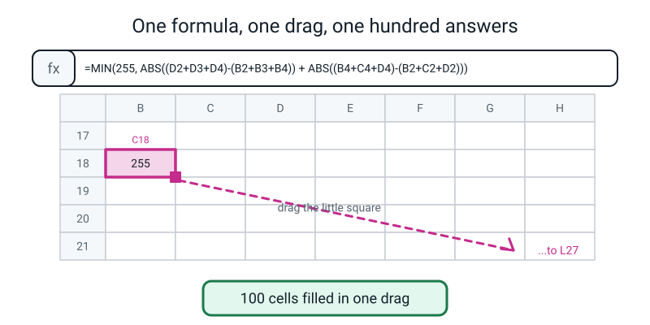
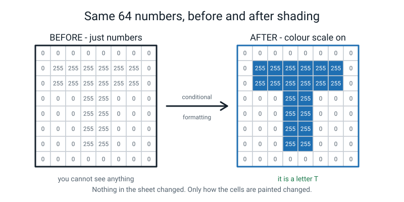
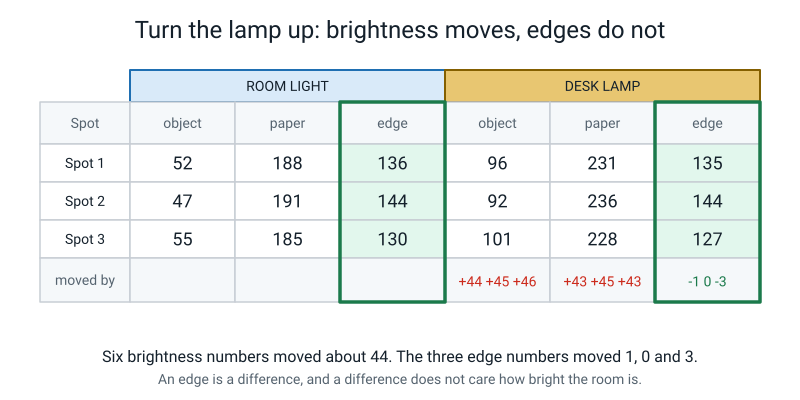
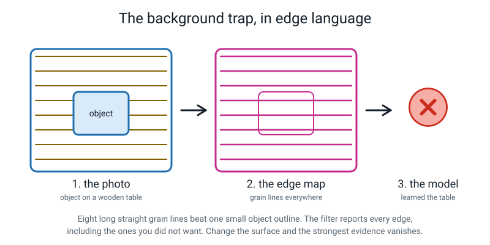
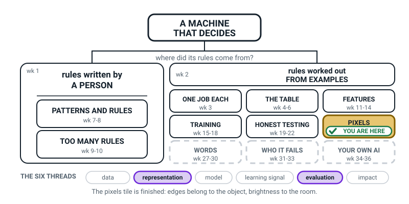
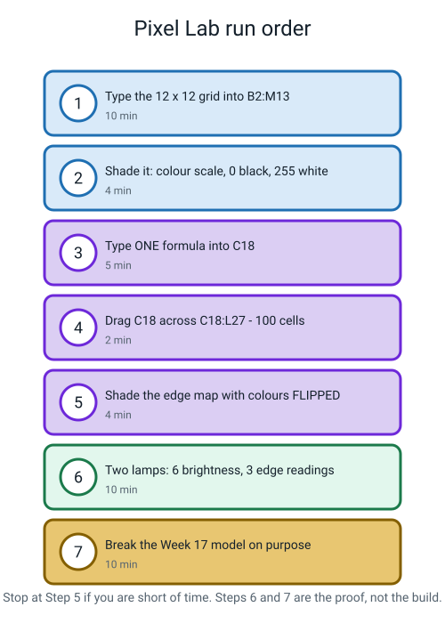

# Week 26 — Pixel Lab: Make the Outline Appear

[⬅ Week 25](week-25.md) · [Course Home](../README.md) · [Week 27 ➡](week-27.md) · [Student Guide](../student-guide/week-26.md) · [Workbook](../workbook/week-26.md)

---

## 📋 At a Glance

| | |
|---|---|
| **Duration** | 70 minutes |
| **Type** | 🟩 Lab |
| **Big idea** | Edges survive a change of lighting and raw brightness does not — which is why a real vision system looks for edges first. |
| **New vocabulary** | edge map |
| **Materials** | The student's own 12×12 letter grid from Week 25, a desk lamp, a small solid object (an eraser, a comb, a key), a sheet of white paper, pencil, the printed Lamp Data Sheet (in the answer key below, as a fallback) |
| **Tech needed** | A browser and a spreadsheet — Google Sheets, Excel Online, or LibreOffice Calc. Optionally Scratch (browser) for reading pixel brightness. Nothing to install. |
| **Prep time** | 15 minutes the night before + 5 minutes on the day |

---

## 🎯 Lesson Objectives

By the end of this lesson your student can:

1. **Build a working edge filter in a spreadsheet** by typing one formula into one cell and dragging
   it across a block of 100 cells.
2. **Use conditional formatting** to turn a grid of numbers back into a visible picture, and flip the
   colour scale so edges show as dark ink on white paper.
3. **Demonstrate experimentally** that edge values change far less than brightness values when the
   light changes — with their own six brightness numbers and three edge numbers.
4. **Connect the background trap** in their own Week 17 Teachable Machine model to what edges do and
   do not capture.
5. Say what an **edge map** is, without notes.

---

## 🧑‍🏫 What YOU Need to Know First

*About 12 minutes. Two ideas: how the spreadsheet formula works, and why edges beat brightness.
Neither needs any prior computing knowledge.*

### Idea 1 — a spreadsheet is a machine for doing the same sum a hundred times

This is the part that will impress your student most, and it has nothing to do with AI. It is worth
understanding properly because you may need to fix it live.

In a spreadsheet, every cell has an address: a column letter and a row number. `C18`. `D2`. When you
type a formula that mentions other cells, the spreadsheet remembers those addresses **relative to
where the formula is sitting** — not as fixed places, but as directions.

So if you put this in cell `C18`:

```text
   = D2 + D3 + D4
```

the spreadsheet does not really store "D2, D3, D4". It stores something more like *"one column to my
right, sixteen rows up — and the two cells below that"*. Now copy that formula one cell to the right,
into `D18`, and the spreadsheet re-reads the directions from the new position and gives you
`= E2 + E3 + E4`. Copy it one cell down and you get `= D3 + D4 + D5`.

**That is the whole trick, and it is the whole reason spreadsheets exist.** You write the sum once,
in words that mean "my neighbours", and then you drag it over a hundred cells and each one does the
same sum in its own place.

> **💡 Try this before class:** type `=B1+1` into cell `C1`, then drag `C1` down five rows and look at
> what each cell contains. You will see `=B2+1`, `=B3+1`, and so on. Ninety seconds, and you will
> never be confused by the drag again.

### Idea 2 — the formula, read in three pieces

Here is the formula the student types. It looks frightening. It is three small ideas glued together.

This is the whole formula:

```text
=MIN(255, ABS((D2+D3+D4)-(B2+B3+B4)) + ABS((B4+C4+D4)-(B2+C2+D2)))
```

Take it apart:

| Piece | What it is | Week 25 name |
|---|---|---|
| `(D2+D3+D4)-(B2+B3+B4)` | right column of the patch, minus left column | the **vertical** filter |
| `(B4+C4+D4)-(B2+C2+D2)` | bottom row of the patch, minus top row | the **horizontal** filter |
| `ABS(...)` | throws away the minus sign | **absolute value** |
| `MIN(255, ...)` | "give me the smaller of 255 and this number" | **clipping** |

`MIN(255, x)` is worth one extra sentence, because it is the only genuinely unfamiliar bit. It means:
*compare 255 with x, and hand back whichever is smaller.* If x is 900, it hands back 255. If x is 0,
it hands back 0. That is exactly clipping — anything over 255 gets pinned to 255 — expressed as a
comparison instead of a rule.

**Where does the formula sit, and which pixel is it about?** If the image lives in `B2:M13`, then the
formula in `C18` is the edge value for image pixel `C3` — the top-left pixel that has a full ring of
neighbours. The output block sits 16 rows below the input block, which is just a convenient gap so
the two grids do not touch on screen.


*Figure 26.1 — Type the formula once into C18, grab the little square at the bottom-right corner, and drag out to L27.*

**Output size, again:** 12 − 2 = 10, so the output block is `C18:L27`. Ten columns (C to L), ten rows
(18 to 27). **100 cells.** Count them with your student; the number matters.

### Idea 3 — conditional formatting turns numbers back into a picture

A spreadsheet full of 0s and 255s looks like nothing at all. Conditional formatting paints each cell
according to the number inside it. Set a **colour scale** with the minimum at 0 and the maximum at
255, and the grid suddenly *is* the image.

You do this twice, with the colours the opposite way round each time:

| Grid | Minimum (0) | Maximum (255) | Why |
|---|---|---|---|
| **Input** (the letter) | black | white | 0 is black and 255 is white — that is the Week 23 rule |
| **Edge map** (the outline) | white | black | so edges look like pencil on paper, which is easier to read |

Flipping the second one is a presentation choice, not a maths one, and it is worth saying so out
loud. The numbers do not change; only the paint does.


*Figure 26.2 — Nothing in the sheet changed between these two pictures. Only how the cells are painted changed.*

### Idea 4 — why edges beat brightness (the heart of the lesson)

This is the idea the whole week exists for, and it is provable with two numbers.

Take a dark object at brightness **40** sitting on a bright wall at **200**. The difference between
them is **160**.

Now switch a lamp on so that every pixel gets 50 brighter. Here are the numbers before and after:

```text
   before:   object  40    wall 200    →   difference = 200 - 40  = 160
   after:    object  90    wall 250    →   difference = 250 - 90  = 160   ← IDENTICAL
```

Both raw brightness numbers moved by 50. **The difference did not move at all.**

And a difference is precisely what an edge filter computes. Look at the vertical filter's nine
weights: −1, 0, +1, −1, 0, +1, −1, 0, +1. Add them up: **they sum to zero**. Add the same amount *k*
to every pixel in the patch and the filter's answer changes by *k* × 0 = nothing.

> **A filter whose weights sum to zero is mathematically blind to how bright the room is.**

That is why a vision system looks for edges before it looks for anything else. Brightness is a
feature that moves whenever a cloud passes. An edge is a feature that holds much more still.


*Figure 26.3 — The measurement your student will reproduce today. Six brightness numbers all shift by about 44. The three edge numbers move by 1, 0 and 3.*

**Be honest about the limits.** Edges are *more* stable than brightness, not *perfectly* stable.
Four real reasons an edge value still wobbles:

1. **Real lamps are not even.** A desk lamp on the left brightens the left more than the right. That
   is not "add 50 to everything" — it creates brand-new edges that were never on the object.
2. **Pixels cannot go below 0 or above 255.** In a very dark or a blown-out photo, thousands of pixels
   get squashed onto the same value, and a real difference genuinely disappears.
3. **Dark photos are grainy**, and grain is random pixel-to-pixel change — which is exactly what an
   edge detector is built to notice.
4. **Real light mostly multiplies, it does not just add.** Brightness is roughly reflectance × light, so
   doubling the light roughly doubles an edge value too. The "add 50" proof is a toy model that holds
   for an even added change; do not let the student leave believing edges are lighting-invariant.
   (The workbook's Think Deeper T2 covers halving.)

Your student's numbers today will move by one or two. Do not tell them the numbers should be
identical; tell them the numbers should move *far less* than the brightness numbers, and then show
that they did.

### Idea 5 — the background trap, now explainable

Back in Week 17 the student trained a Teachable Machine model and then, in Week 18, broke it. The
classic break: photograph everything on the same wooden table, and the model scores beautifully on
that table and collapses at the sink.

Now you can explain **why**, in pixel language.

Wood grain produces long, straight, strong, repeated edges in every single photo.

The object
produces a smaller, shorter, wobblier set of edges — and it moves and rotates between shots, while
the table never does. So one likely reason is that the most reliable edge pattern associated with the label was **the table**,
and the model learned the table and you gave it the object's name. This is a hypothesis: nobody has
looked inside Teachable Machine to see what it used. If *every* class is photographed on the same
table, the table cannot separate the classes; the trap bites hardest when the background goes with one
label. With a shared background it still swamps the object and makes the model fragile when the scene changes.


*Figure 26.4 — Eight long grain lines beat one small object outline. The filter reports every edge, including the ones you did not want.*

> **The background rule:** a vision model learns whatever is most reliably associated with the label.
> If your background is more reliable than your object, you have trained a background detector and
> given it your object's name.

### The two misconceptions you will hit today

**Misconception 1: "Edges don't change *at all* when the light changes."**

Students over-learn the proof. They will get 136 under one lamp and 135 under the other and conclude
they made a mistake. They did not — real measurements wobble. The claim is *"edges change much less
than brightness"*, and 1 versus 44 is a fantastic demonstration of that. Make them compute both
changes and compare them side by side; the comparison is the finding, not either number alone.

**Misconception 2: "The spreadsheet is doing something clever."**

It is not. It is doing exactly the arithmetic they did by hand last week, one hundred times, very
fast, without complaining. Say this explicitly at least twice today. The moment a student decides
the machine is being clever is the moment they stop checking it. Have them verify one spreadsheet
cell against their own hand calculation — that single check is worth more than the whole lab.

### How deep to go, and where to stop

**Go this deep:** one formula, one drag, two conditional formats, two lamps, one model break.

**Stop here:**
- ❌ Do not teach absolute cell references (`$B$2`). Not needed, and it will confuse the drag.
- ❌ Do not explain *why* the model learned the table in terms of weights or learning. "The pattern
  that was most reliably there is the pattern it learned" is the whole explanation at Level 1.
- ❌ Do not attempt to compute edges from a real photograph inside the spreadsheet. Reading three
  brightness values off a photo is enough; the full pipeline is not a Level 1 job.

---

### 🧭 The Growing Map

**PIXELS** is tinted for the fourth and final time, and the thread strip pairs **representation** with
**evaluation**. That pairing is the whole reason this lesson exists: the claim *edges beat brightness*
was made in Week 25 and today it gets measured, by them, with two lamps and two columns of numbers.



*Figure 26.0 — Week 26's version. PIXELS tinted and badged for the last week of its run, with
**representation** and **evaluation** lit along the bottom.*

**What to do with it, in about two minutes at the end of the lesson:**

1. **Show it and ask:** *"which bit did we do today — and what did the spreadsheet actually add that
   your pencil could not?"* The answer you want is not *speed*, it is **enough cells to prove
   something**. Six cells is a demonstration; a hundred cells, twice, under two lamps, is evidence.
2. **Then the better question:** *"why is **evaluation** lit today, when we never scored a model?"*
   Because they tested a claim they had been given, and it could have come out the other way. That is
   evaluation in its purest form, and it is the same instinct as Week 22's envelope.
3. **Have them copy their two lamp numbers onto their map** beside PIXELS — the brightness change and
   the edge change, side by side. Then ask them to look across at WHO IT FAILS, still dashed, and say
   what those two numbers predict about a model trained in one room. That sentence is the bridge into
   Weeks 31 to 33.

> **🧑‍🏫 Why this is worth two minutes.** This is the week the pixels run pays its debts. The map lets
> you point backwards at Week 22 — the lamplight failure they measured on their own model — and forwards
> at Week 31, and show that both are the same fact about light. Without the map this lesson reads as a
> spreadsheet exercise; with it, it reads as the explanation for something that already annoyed them.

**The six threads** along the bottom are the spine of all four levels. **Representation** and
**evaluation** are lit this week. Do not quiz them on the threads; the map is orientation, never
assessment.

---

## 🧰 Prep Checklist

This section lists what to set up and test before class. Most of the work is the night before.

### 15 minutes, the night before

- [ ] **Open a blank spreadsheet and test three things.** This is the single highest-value ten minutes
      of prep in the whole term.
  1. Type `=MIN(255, ABS(5-9))` into any cell. It should give **4**. If it errors, your spreadsheet
     wants semicolons instead of commas — some European locales do. Write down which one yours needs.
  2. Type `=B1+1` into `C1`, drag it down four rows, and click on `C5`. It should say `=B5+1`. That
     is the drag working.
  3. Find the conditional-formatting menu. In Google Sheets: **Format → Conditional formatting →
     Colour scale**. In Excel: **Home → Conditional Formatting → Color Scales → More Rules**. Make a
     colour scale on any three cells so you know where the buttons are.
- [ ] **Build the whole thing once yourself**, with the 12×12 T from Week 25. Twenty minutes the first
      time, four minutes the second. Do it. You will hit the two errors your student will hit, and
      then you will know the fix.
- [ ] **Print the Lamp Data Sheet** from the answer key below. It is the fallback if you cannot read
      real pixel values.
- [ ] **Test the desk lamp.** You need two clearly different lighting conditions in the same room: room
      light only, and a desk lamp pointed at the object from about 30 cm. Check that the difference is
      obvious to the eye.

### 5 minutes, on the day

- [ ] Spreadsheet open, blank, zoomed so a 12×12 block fits on screen.
- [ ] Column widths set: select all, set column width to about **26 pixels** and row height to about
      **26**, so the cells are square. Doing this in advance saves five minutes of fiddling.
- [ ] The student's Week 25 letter grid on the table.
- [ ] The object, the paper, and the lamp set up in a corner and left alone.
- [ ] The Week 17 Teachable Machine model tab open and logged in.

### If something fails

| What fails | Fallback |
|---|---|
| **No internet** | Use LibreOffice Calc or Excel offline — the formula is identical. If you have no spreadsheet at all: do the lab on graph paper, computing 12 cells instead of 100, and use the printed Lamp Data Sheet for the lighting proof. The lesson survives; only the "one drag, a hundred answers" moment is lost, and you can describe it. |
| **Conditional formatting cannot be found / is greyed out** | Shade by hand. Select the cells that contain 255 and set the fill colour to dark grey with the paint-bucket button. Slower, identical result. Or print the numbers and shade with a pencil. |
| **The formula returns an error** (`#NAME?`, `#VALUE!`) | 99% of the time it is a comma-versus-semicolon locale problem, or a stray space. Retype it by hand rather than pasting. Check for a missing closing bracket — there are seven in that formula and it is easy to lose one. |
| **You cannot read pixel brightness from a photo** | Use the printed **Lamp Data Sheet** in the answer key. It contains example measurements (the lamp-lit values are unusually steady, so say so if a student notices). The student analyses given data instead of collecting it — which is a completely legitimate scientific activity, so do not apologise for it. |
| **The Week 17 model is gone** | Skip Segment 5's model demo and instead do it as a thought experiment using Figure 26.4. Ask: "what would happen, and why?" Then set retraining a quick two-class model as an optional extra. |

---

## ⏱️ The Lesson, Minute by Minute

This section is the plan for the whole lesson, one segment at a time. The table shows the timings.

| # | Segment | Minutes | Running total |
|---|---|---|---|
| 1 | 🪝 Hook — Six cells took you twenty minutes | 8 | 8 |
| 2 | 🧠 Concept — One formula, read in three pieces | 18 | 26 |
| 3 | 🔍 Worked example together — build it and check one cell by hand | 14 | 40 |
| 4 | 🎲 Activity — Pixel Lab, the two lamps, and breaking the model | 20 | 60 |
| 5 | 🔑 Wrap & assign | 10 | 70 |

---

### 1 · 🪝 Hook — Six cells took you twenty minutes (8 min)

**Say this:**

> "Last week you computed six cells. How long did it take? … About twenty minutes, with a calculator,
> and you were concentrating hard the whole time.
>
> Our little grid has one hundred output cells. At your speed, that's — let's do it — a hundred
> divided by six, times twenty minutes. About **five and a half hours**. Without a break, without a
> single mistake.
>
> Now. A real photo going into Teachable Machine is 224 by 224. That's 222 times 222 output cells,
> which is **49,284**. At your speed that's about … [work it out on the board: 49,284 ÷ 6 × 20 minutes
> ≈ 164,000 minutes] … a hundred and sixty-four thousand minutes. Which is about **114 days**. Working
> non-stop, day and night, no sleep.
>
> And that is for **one filter** on **one photo**. A real system runs hundreds of filters. And it does
> it while you're standing there holding your phone up.
>
> So today is not about learning something new. The arithmetic is exactly what you did last week —
> nothing more. Today is about the moment where you stop doing it one cell at a time."

**Do this:**

- Do the divisions on the board, out loud, letting them do the arithmetic. The numbers only land if
  they compute them.
- Then write the punchline on the board and leave it up:

```text
   6 cells by hand    =  20 minutes
   100 cells by hand  =  5.5 hours
   100 cells today    =  one drag
```

**Ask this:**

> **Q: "Before we start — is the spreadsheet going to do different maths from you, or the same maths?"**
>
> *Hoping for:* "the same maths."
>
> *If they say "different" or "cleverer":* this is the misconception to kill immediately. Say: "It's
> exactly the same. Right column minus left column. It just doesn't get bored. Later today we're
> going to check one of its answers against one of yours, by hand, to prove it."

> **Q: "If the spreadsheet gets an answer wrong, how would you ever find out?"**
>
> *Hoping for:* "check one by hand."
>
> *If they say "it can't be wrong":* "It absolutely can — if I type the formula wrong, it will do the
> wrong sum a hundred times, very confidently, very fast. A computer being fast doesn't make it
> right. So we check one."

---

### 2 · 🧠 Concept — One formula, read in three pieces (18 min)

**Say this:**

> "Here's the formula. I'm going to write it up and I want you to look at how long it is and then
> stop worrying about it, because it's three things you already know, glued together.
>
> [write it on the board in three colours if you have them]
>
> Piece one: `(D2+D3+D4) - (B2+B3+B4)`. Read it. Three cells added up, minus three other cells added
> up. What is that? … It's your **vertical filter**. Right column minus left column.
>
> Piece two: `(B4+C4+D4) - (B2+C2+D2)`. Same shape, but the cells go across instead of down. That's
> your **horizontal filter** — bottom row minus top row. The one you did for homework.
>
> Piece three: `ABS(...)` wrapped round each of them. ABS is short for absolute — it rubs out the
> minus sign. And `MIN(255, ...)` round the whole thing. MIN means 'give me the smaller of these two'.
> So if the total is 900, it compares 900 with 255 and hands you back 255. That's your **clipping**,
> written as a comparison.
>
> So the whole formula is: vertical filter, horizontal filter, rub out both minus signs, add them,
> pin at 255. Which is exactly, precisely, letter for letter what you did on paper for homework."

Then the drag:

> "Now here's the bit that's actually new, and it's not about AI at all — it's about spreadsheets.
>
> When I write `D2` in a formula, the spreadsheet doesn't really remember 'D2'. It remembers
> *directions*: 'one to my right, sixteen up'. So when I copy this formula to the cell next door, it
> follows the same directions from the new starting point, and it automatically points at `E2` instead.
>
> That means I write the sum **once**, and every copy of it does the same sum in its own place.
> One hundred cells. One formula. One drag."

**Do this:**

- **Demonstrate the drag on something trivial before the real thing.** Type `=B1+1` into `C1`. Type
  numbers into `B1:B5`. Drag `C1` down. Click on `C4` and show them the formula bar: it says `=B4+1`,
  not `=B1+1`. Ten seconds, and it removes all the mystery.
- Write the three pieces on the board separately, then together. They look like this:

```text
   V  =  (D2+D3+D4) - (B2+B3+B4)        right col - left col
   H  =  (B4+C4+D4) - (B2+C2+D2)        bottom row - top row

   ANSWER  =  MIN( 255 ,  ABS(V) + ABS(H) )
```

- Say the words "MIN means smaller-of-these-two" at least twice. It is the only genuinely new
  vocabulary in the formula.

**Ask this:**

> **Q: "The image is in B2 to M13. The output starts at C18. Why does the output not start at B17?"**
>
> *Hoping for:* "because the filter can't sit on the outside — it needs a ring of neighbours." Column
> B and row 2 are the border, so the first pixel with a full ring is `C3`.
>
> *If they don't know:* draw the 3×3 window over cell `B2` on the board. What's to the left of column
> B? Column A, which is empty. What's above row 2? Row 1, empty. So the filter has nothing to work
> with there.

> **Q: "How many cells will the output block be, and what are its corners?"**
>
> *Hoping for:* 10 × 10 = 100 cells, from `C18` to `L27`.
>
> *If they say 12 × 12:* back to **output = input − 2**. Count the columns out loud: C, D, E, F, G, H,
> I, J, K, L. Ten. Then the rows: 18 to 27. Ten.
>
> *If they get the size right but the corner wrong:* count the letters on your fingers with them. B is
> column 2 of the image; C to L is ten columns; M is the last. Skip B, skip M.

> **Q: "If I typed the formula slightly wrong, what would the edge map look like?"**
>
> *Hoping for:* something wrong but confident-looking — all zeros, or a smeared mess, or the outline
> in the wrong place.
>
> *If they say "it would show an error":* sometimes, yes — but often not. A formula pointing at `B1`
> instead of `B2` is perfectly valid arithmetic; it just answers the wrong question. "That's the
> dangerous kind of wrong: no error message, just a wrong picture. Which is exactly why we check one
> cell by hand."

---

### 3 · 🔍 Worked Example Together — build it and check one cell (14 min)

**Say this:**

> "Right. Build it with me, step by step. Don't run ahead.
>
> First, type your letter into B2 to M13. All one hundred and forty-four numbers. Yes, it's tedious.
> Do it anyway — after this you will never again wonder what 'a picture is a grid of numbers' means.
>
> Speed trick: type one full row, then select it, copy it, and paste it onto the rows that are the
> same. My T has four identical bar rows and six identical stem rows, so that's really only three
> different rows to type."

Then, once the grid is in:

> "Now select B2 to M13, and go to Format, Conditional formatting, Colour scale. Set the minimum to
> Number, zero, black. Set the maximum to Number, two hundred and fifty-five, white.
>
> Look at your screen. That's your letter. You just built an image viewer out of a spreadsheet."

Then the formula:

> "Click on C18. Type the formula exactly. Every bracket. Then press Enter, and read me the number.
>
> … Now grab the little square at the bottom-right corner of C18 — that's the drag handle — and drag
> it right, all the way to L18. Then, with that whole row still selected, drag *down* to row 27.
>
> That's it. A hundred cells. Look at them."

Then — and this is the important bit — the check:

> "Now stop. Before we shade anything, we're going to check the machine.
>
> Pick any cell in your output block. Read me its number. Now find the same cell on your paper grid
> from last week and do that sum by hand, on paper, right now, with a calculator.
>
> … Do they match? Good. **Now** you can believe the other ninety-nine."

**Do this:**

- Type alongside them on your own screen if you can. If you have only one screen, sit beside them and
  narrate; do not take the keyboard unless they are stuck for more than 30 seconds.
- **Do not skip the by-hand check.** It takes three minutes and it is the intellectual centre of the
  lesson. Pick a cell that is *not* zero — a zero matches by accident too easily.
- Recommended check cell: `D18`, which is the edge value for image pixel `D3`. For the Week 25 letter
  T that is output cell (3,3): |V| = 0, |H| = 0, total 0 — no, choose a better one. Use `C18`, which is
  pixel `C3` = cell (3,2): |V| = **765**, |H| = **0**, total 765, clipped to **255**. Full working is in
  the answer key.

**Ask this:**

> **Q: "The middle of your letter came out all zeros. Is the spreadsheet broken?"**
>
> *Hoping for:* "no — flat regions give zero, we knew that from last week."
>
> *If they think it is broken:* point at one of the zero cells and ask them to read out the nine pixel
> values around it in the input grid. All 255. "Nothing changed there. What should the filter say?"

> **Q: "Look at the two grids. What did the filter keep, and what did it throw away?"**
>
> *Hoping for:* it kept the outline / the boundary; it threw away the filling, and it threw away how
> bright the letter was.
>
> *If they say "it threw away the letter":* "Can you still tell what letter it is?" They can. "So it
> kept the thing that tells you which letter it is, and threw away everything else. That's not losing
> — that's the point."

---

### 4 · 🎲 Activity — Pixel Lab, two lamps, and breaking the model (20 min)

Full instructions in the next section. In the lesson flow this block is: finish the shading, then the
lighting proof, then the model demo.

**Say this:**

> "Three quick things and we're done.
>
> First: shade the edge map, but flip the colours this time. Minimum zero goes **white**, maximum 255
> goes **black**. That way edges look like pencil lines. There's your outline.
>
> Second: the lamp test. This is the bit that explains why anybody bothers with edges at all.
>
> Third: we're going to go back to your model from Week 17 and break it on purpose — and this time
> you'll be able to explain exactly why it broke."

**Do this — the lighting proof:**

1. Put the object on the white paper under **room light only**. Take a photo.
2. Switch on the desk lamp, 30 cm away, pointing at the object. Take a second photo, same angle.
3. Pick **three spots** where the object meets the paper. At each spot read **two** brightness values:
   one just inside the object, one just outside on the paper. That is 6 numbers per lamp.
4. The **edge value** at each spot is `outside − inside`. Three edge values per lamp.
5. Compare: how much did the brightness numbers move? How much did the edge values move?

**How to read a brightness value with no software to install** — two routes:

> **Route A — Scratch (browser, no install).** Go to scratch.mit.edu, start a new project, and upload
> your photo as a **costume**. In the paint editor, click the **Fill** colour swatch, then the
> **eyedropper** icon, then click on the spot in your photo. The **Brightness** slider now shows a
> number from **0 to 100**. Multiply by 2.55 to get a 0–255 value, or just leave everything in 0–100
> — the comparison works either way as long as you are consistent.
>
> **Route B — the printed Lamp Data Sheet.** In the answer key below there are example measurements
> from exactly this experiment. Hand them over and have the student do the analysis. Analysing
> someone else's data is real science; do not treat it as second best.

**Do this — breaking the model:**

- Open the Week 17 Teachable Machine model.
- Test 5 photos on the **same background as training**. Record how many were right.
- Now hold a sheet of coloured paper or a tea towel behind the object and test 5 more. Record.
- The second number will usually be much worse.

**Ask this:**

> **Q: "Your brightness numbers all moved by about the same amount. Look at the edge numbers. Did
> they move by the same amount?"**
>
> *Hoping for:* "no, they hardly moved at all."
>
> *If their edge numbers moved a lot:* good — that is real data and it needs explaining, not hiding.
> Most likely the lamp was to one side, so it did not add the same amount everywhere. Ask: "Was the
> lamp shining evenly on both spots, or more on one?" Then write the honest conclusion: *edges are
> more stable than brightness, but only when the light changes evenly.*

> **Q: "Your model got worse when I changed the background. In edge language — what happened?"**
>
> *Hoping for:* the strong edges it had been relying on belonged to the background, and when the
> background changed those edges vanished and new ones appeared.
>
> *If they say "the model got confused":* push once. "What exactly did it see that was different? The
> object is identical. Only the pixels behind it changed." Then hand them the sentence-starter:
> *"Accuracy dropped because the edges belonging to ______ disappeared and were replaced by edges
> belonging to ______."*

---

### 5 · 🔑 Wrap & Assign (10 min)

**Say this:**

> "Two grids on your screen. On the left, a solid letter. On the right, an outline. That right-hand
> grid has a name and it's your only new word this week: an **edge map**. A grid of numbers saying how
> strong the edge is at every place in the picture.
>
> And here is the sentence that ties this whole term together.
>
> When you turned the lamp up, every one of your brightness numbers moved by about forty-four. Your
> edge numbers moved by one, and zero, and three.
>
> That's why a vision system looks for edges first. Not because edges are beautiful. Because
> **brightness is mostly a fact about the room, and an edge is much more a fact about the object.** One of those is
> worth learning and one of them isn't.
>
> And one warning, from your own model: the filter reports **every** edge. Including the wood grain.
> Including the tea towel. It has no idea which ones you care about. If your background has stronger,
> more reliable edges than your object does, then the background is what your model will learn — and
> it will look brilliant right up until somebody moves the table."

**Do this:**

- Screenshot or photograph both grids side by side. That image is the homework evidence.
- Write the new word on the board with its definition and have them read it back. It looks like this:

```text
   EDGE MAP  =  the grid of numbers you get after running an edge filter.
                An outline drawing made of numbers.
```

- Point at Figure 26.5 and confirm what got done and what is left for homework.


*Figure 26.5 — Tick off what you finished. Anything unticked is homework.*

**Ask this:**

> **Q: "One sentence: why does a vision system look for edges instead of brightness?"**
>
> *Hoping for:* because edges barely change when the light changes, and brightness changes a lot.
>
> *If they give a vaguer answer ("edges show the shape"):* accept it, then ask for the evidence: "and
> what did your two lamps show?" You want the numbers attached to the claim.

---

## 🎲 The Activity, In Full

This section gives the seven steps of the Pixel Lab in order, with the variations.

### Pixel Lab

**Time:** 20 minutes in class, plus whatever spills into homework. Realistically most students finish
Steps 1–5 in class and do Steps 6–7 at home.
**Materials:** spreadsheet, the student's own 12×12 letter grid, desk lamp, object, white paper,
pencil, workbook.


*Figure 26.6 — The seven steps, with times. Steps 1–5 are the build. Steps 6–7 are the proof.*

### Setup

Sit side by side at one screen. Set the spreadsheet's column width to about 26 pixels and row height
to about 26 so the cells are square — otherwise the letter comes out stretched and unreadable.

### Step 1 — Type the grid (10 min)

Put the 12 × 12 letter into **B2:M13**. Twelve columns (B to M), twelve rows (2 to 13). 0 for paper,
255 for ink. All 144 cells.

**Speed trick:** type one complete row, select it, copy, and paste onto the rows that repeat.

### Step 2 — Shade the input (4 min)

Select **B2:M13** → Format → Conditional formatting → Colour scale.
- Minpoint: **Number, 0, black**
- Maxpoint: **Number, 255, white**
- Set the text colour to mid grey so the digits fade back.

**Checkpoint:** your letter is legible on screen. **If it is not, stop and fix the numbers now.** A
wrong image gives a wrong edge map and you will hunt the bug in the wrong place.

### Step 3 — One formula (5 min)

Click **C18**. Type this formula exactly:

```text
=MIN(255, ABS((D2+D3+D4)-(B2+B3+B4)) + ABS((B4+C4+D4)-(B2+C2+D2)))
```

### Step 4 — Drag (2 min)

Grab the small square at C18's bottom-right corner. Drag right to **L18**. Then select **C18:L18** and
drag down to row **27**. You now have **C18:L27** — a 10 × 10 block, **100 cells**.

### Step 5 — Shade the edge map, flipped (4 min)

Select **C18:L27** → Conditional formatting → Colour scale.
- Minpoint: **Number, 0, white**
- Maxpoint: **Number, 255, black**

**Checkpoint:** you are looking at the hollow outline of your letter.

### Step 6 — The two-lamp proof (10 min)

Three spots on the boundary between object and paper. At each, read the brightness just inside the
object and just outside on the paper. Do it under room light, then under the desk lamp.

| | Object | Paper | Edge = paper − object |
|---|---|---|---|
| Spot 1, room light | | | |
| Spot 2, room light | | | |
| Spot 3, room light | | | |
| Spot 1, desk lamp | | | |
| Spot 2, desk lamp | | | |
| Spot 3, desk lamp | | | |

Then two numbers: **average change in brightness** and **average change in edge value**.

### Step 7 — Break the model on purpose (10 min)

Open the Week 17 model. Five photos on the training background, five on a different background.
Record the score for each. Write one sentence explaining the difference **in edge language**.

### What "finished" looks like

- [ ] 144 numbers typed at B2:M13, shaded, letter clearly readable
- [ ] A 10 × 10 edge map at C18:L27 computed by **formula**, not typed by hand
- [ ] Edge map shaded with **flipped** colours, showing a recognisable hollow outline
- [ ] **One cell checked by hand** against a paper calculation, and it matched
- [ ] Six brightness values and three edge values recorded under two lamps
- [ ] Two accuracy numbers from the model test, and one sentence explaining the drop

### Variation — easier

- **Use an 8 × 8 grid instead of 12 × 12.** Put it in B2:I9, formula still in C18, drag to H24. That is
  64 numbers to type instead of 144, and a 6 × 6 output. Everything else is identical and the outline
  still appears.
- **Type the grid for them** before the lesson and let them start at Step 3. Typing is the boring bit;
  the formula is the lesson.
- **Skip the horizontal half of the formula.** Use just
  `=MIN(255, ABS((D2+D3+D4)-(B2+B3+B4)))`. The edge map will show only the left and right edges of the
  letter, which is genuinely interesting and half the typing.
- **Use the printed Lamp Data Sheet** rather than taking photos.

### Variation — harder

- **Split V and H into two separate maps.** Build a second block showing `ABS(V)` alone and a third
  showing `ABS(H)` alone. Shade all three. For a letter T the two maps look startlingly different —
  one finds the stem, the other finds the bar. This is the first real step toward a machine
  *describing* a shape rather than just outlining it.
- **The three-number classifier.** Do Pixel Lab for three different letters. For each, record exactly
  three numbers with `=SUM()`: total ink, total `|V|` edge strength, total `|H|` edge strength. Put
  them in a table. Can you write a Week 3 style if-then rule that tells the three letters apart using
  only those three numbers? If yes — you have just hand-built a feature extractor and a classifier
  with no machine learning at all.
- **Add a fake background.** Change ten random background pixels from 0 to 255, scattered outside the
  letter. That is your "wood grain". Predict first, then look: what does the edge map look like now,
  and would a machine still find your letter easily?

---

## ❓ Questions Students Ask This Week

This section gives short answers to questions students often ask in this lesson.

**1. "Why do we type the numbers in ourselves? Can't the spreadsheet just open a photo?"**

Not on its own, no — a spreadsheet has no idea how to read a JPEG. Real programs do this with a
couple of lines of code that unpack the image file into numbers, and you will write exactly that in
Level 2. Typing 144 numbers by hand is a one-time tax you pay for understanding what those two lines
of code are actually doing. Nobody who has typed a letter in by hand ever again thinks an image file
is magic.

**2. "Is my edge map the same as what Teachable Machine does inside?"**

The first step of it, yes, genuinely. Systems like that begin by running lots of small filters over
the image, and many of the very first ones turn out to be edge detectors — some for vertical edges,
some for horizontal, some for diagonals, some for colour boundaries. The difference is that yours
uses two filters you were handed, and theirs uses dozens, learned in advance on millions of photos (Teachable Machine borrows them rather than learning them from your photos), stacked in layers
so the later ones look at the output of the earlier ones. Same first rung, much taller ladder.

**3. "Why did my edge values change a little bit? You said they wouldn't change."**

I said they would change **much less**, and I should be careful about that, because "not at all" is
only true in the maths, not in a real room. Three things wobble a real measurement: a desk lamp
brightens one side more than the other (so it is not really "add the same amount everywhere"); pixels
cannot go above 255, so bright areas get squashed; and darker photos are grainier, and grain is
exactly the kind of small change an edge detector notices. A wobble of 1 against a shift of 44 is a
very strong result. Report both numbers honestly and say which is bigger.

**4. "If edges are so much better, why does anyone use brightness at all?"**

Because sometimes brightness is the answer to the question. If you are building a sensor that turns
a street light on at dusk, brightness is exactly what you want and edges are useless. The lesson is
not "brightness bad, edges good" — it is "**pick the feature that stays still when the things you
don't care about change**". For recognising an object under different lamps, that is edges. For
detecting nightfall, it is brightness.

**5. "My model still failed when I only changed the light, not the background. Why? Edges are supposed
to survive lighting."**

An excellent catch and worth taking seriously. Often the answer is that changing the light
did not just brighten things — it **created new edges**. A lamp from the side casts a hard shadow,
and the boundary of that shadow is a strong, sharp edge that was never in the training photos. The
model sees a big new edge that means nothing and gets pulled off course. The proof from today only
covers light that changes *evenly*; real light almost never does. (Uneven brightening, or light that scales values rather than adding to them, can also shift edge numbers.)

**6. "Could I just take training photos in every possible lighting so it never gets confused?"**

That is genuinely the standard fix, and it works. It is also expensive: every new condition you want
to cover means more photos, more time, more storage. And you can never cover *everything* — somebody
will always photograph your object somewhere you did not think of. So real teams do both: vary the
training photos as much as they can afford, **and** choose features that are stable to begin with.
Belt and braces.

**7. "How many filters does a real system use? Is there a right number?"**

**Nobody knows for sure, and here is why.** There is no formula that takes your problem and hands you
the correct number of filters. People find it by trying: build one with 32, build one with 64,
measure both on a hidden test set, keep the better one. The numbers you see in real systems are the
survivors of a lot of trial and error, not the output of a theory. There is real research trying to
predict the right size in advance and it does not work reliably yet. That is an honest state of the
art, and it is worth your student knowing that parts of this field are still guess-and-check.

**8. "Does the order matter — absolute value first, then clip? Or clip first?"**

It matters a lot. Clip first and a value of −765 stays −765, because clipping only pins the top end;
then you take the absolute value and get 765 and you have to clip *again*. Worse, if you clip
*both* ends first, −765 becomes 0 and you have deleted a perfectly good edge. **Absolute value first,
then clip.** The formula does it in that order for you: `ABS` is on the inside, `MIN` on the outside.

---

## ⚠️ Where This Lesson Goes Wrong

This section lists the problems you are most likely to meet, why they happen and what to do.

| What happens | Why | What to do right now |
|---|---|---|
| The whole edge map is zeros | The formula in C18 is pointing at the wrong cells — usually B1 instead of B2, or the grid got typed into A1 instead of B2 | Click C18 and read the formula aloud against the grid position. The formula's *top-left* reference must be `B2`, and `B2` must be the **top-left pixel of the image**. Retype rather than nudge |
| `#NAME?` or `#VALUE!` error | Comma/semicolon locale, a typo in `ABS` or `MIN`, or a missing bracket (there are seven) | Retype the formula by hand, slowly. Do not paste. If it still fails, try semicolons instead of commas |
| The letter looks stretched and unreadable on screen | Default cells are wide and short, so the "pixels" are rectangles | Select all, set column width ≈ 26 px and row height ≈ 26. Do this *before* typing, not after |
| The drag copies the *value* instead of the formula | The student copied and pasted as "values only", or dragged the wrong little square | Click the drag handle — the tiny solid square at the bottom-right *corner* of the selection, not the border. Check by clicking a filled cell: the formula bar must show a formula, not a number |
| The edge map shades as a solid block, not an outline | The student's letter has strokes only 1 or 2 pixels thick, so every cell touching it fires and there is no flat interior | Say so honestly: "your strokes are too thin for the filter to find a middle." Fix by thickening every stroke to at least 4 squares, or accept the solid block and explain *why* — it is a genuinely good lesson about resolution |
| Edge values in the lamp test move nearly as much as brightness | The lamp was off to one side, so it did not brighten both spots equally | Do not hide it. Move the lamp to shine straight down and repeat one spot. Then write the honest finding: edges are stable to *even* lighting changes, and real lamps are not always even |
| Student decides the spreadsheet must be right because it is a computer | Speed reads as authority | Do the by-hand check on one cell. Every time. Then optionally break it on purpose: change one reference so the map goes wrong, and ask "did it warn you?" It did not |
| Everything takes twice as long as planned | Typing 144 numbers is genuinely slow | Fall back to the 8 × 8 variation, or pre-type the grid before class. Protect Steps 6 and 7 — the lamp proof is the point of the week, and the build is only the way in |

---

## 🧭 Differentiation

This section gives ways to make the lab easier or harder for your student.

### If they are struggling

**Cut:**
- Move to the **8 × 8** grid. 64 numbers instead of 144.
- Use the **vertical-only** formula. Half the brackets, half the typos, and the edge map still shows
  something real.
- Use the **printed Lamp Data Sheet** instead of taking and reading photos.
- Skip Step 7 (breaking the model) entirely and do it as a two-minute discussion off Figure 26.4.

**Reteach:**
- If the drag is the sticking point, forget the edge filter completely for three minutes. Put 1, 2, 3,
  4, 5 down column A. Put `=A1*10` in B1. Drag down. Look at each formula. That is the whole concept,
  with no image in the way.
- If the *formula* is the sticking point, build it in three separate cells first: put the V part in
  one cell, the H part in another, and `=MIN(255,ABS(cell1)+ABS(cell2))` in a third. Slower, much
  clearer, and you can drag all three.

**Scaffold:**
- Pre-type the grid.
- Write the formula on a card in large print, in three coloured chunks, so they can copy it a piece at
  a time.

### If they are flying

1. **Split V and H into two maps** and compare them for a letter T. Ask: "Which map found the bar?
   Which found the stem? Could a machine tell a T from an L using only the totals of these two maps?"
2. **The three-number classifier** described in the harder variation. This is a genuinely rich task
   and can absorb an hour.
3. **Break it deliberately.** "Change one cell reference in the formula so the edge map is subtly
   wrong but has no error message. Then hand it to me and see if I can spot it." Teaching someone to
   build a convincing wrong answer is a very good way to teach them to distrust one.
4. **Predict, then measure.** Before the lamp test: "Predict the brightness numbers under the lamp, to
   within twenty. Predict the edge numbers, to within twenty." Write the predictions down first. A
   student who can predict a measurement has understood it.
5. **The multiply question.** "We proved edges survive when a lamp *adds* light. What if the light is
   *halved* instead — everything multiplied by 0.5? Work out what happens to an edge of 160." (It
   becomes 80. Edges survive addition perfectly but not multiplication. That is a real limitation and
   a very sharp student will enjoy finding it.)

### If they won't engage today

- **You drive, they direct.** You hold the keyboard; they tell you what to type. All of the thinking,
  none of the typing. Perfectly legitimate for a lab.
- **Do the lamp test only.** Skip the whole spreadsheet. Six numbers, three numbers, one comparison.
  Fifteen minutes, and it is the most important part of the week anyway.
- **Do the model break only.** Open Week 17's model, change the background, watch it fail. It is
  dramatic, it takes eight minutes, and the explanation from Figure 26.4 is enough. Then finish early
  and pick the spreadsheet up next week — Week 27 is a checkpoint and has room.

---

## ✅ Assessing Understanding

This section gives three checks to ask out loud and a scale for how well your student understood.

### Check 1 — the machine is not clever

> **Say exactly:** *"Is the spreadsheet doing different maths from you, or the same maths? And how do
> you know?"*

**A good answer:** the same maths — right column minus left column, plus bottom row minus top row —
and *"I checked one cell by hand and it matched."*

**A weak answer:** "it's the same" with no evidence. Push: "How would you prove it to somebody who
didn't believe you?"

### Check 2 — the evidence for edges

> **Say exactly:** *"Convince me that edges are a better thing to look at than brightness. Use your own
> numbers."*

**A good answer** quotes both changes: brightness moved about 44, edges moved about 1. And says why:
because both sides of the edge got the same bonus from the lamp, so the difference between them
survived.

**A weak answer:** "edges are better because they show the shape." True but unevidenced. Ask for the
two numbers.

### Check 3 — the background trap

> **Say exactly:** *"Your model got worse when I changed the background. The object was identical. In
> edge language, what happened?"*

**A good answer:** a likely reason is that the strong, reliable edges it had learned belonged to the background; when the
background changed, those edges disappeared and unfamiliar new ones appeared.

**A very good answer** adds *why* the model learned the background rather than the object: because the
background was in the same place in every photo while the object moved and rotated, so it was the
*more reliable* pattern.

### Mastery scale for this week

| Level | What it looks like |
|---|---|
| **1 — Not yet** | Cannot build the sheet even with step-by-step instruction. Cannot say what the edge map shows. Believes the spreadsheet is doing something different from last week's paper arithmetic. |
| **2 — Emerging** | Builds it with heavy help. Gets the outline on screen. Can say "this is the outline" but cannot explain the formula or interpret the lamp numbers. |
| **3 — Secure** ← *target* | Builds it with light help. Explains the formula as V, H, absolute value, clip. Verifies one cell by hand. Records the lamp numbers and states correctly which set moved more. Defines **edge map**. |
| **4 — Strong** | All of that, plus explains *why* the edge survives (both sides got the same bonus, so the difference is unchanged), and connects the model's background failure to edges without prompting. |
| **5 — Exceptional** | Predicts results before measuring and is roughly right; notices unprompted that a side-lamp creates *new* edges and so the proof only covers even lighting; or spots that multiplying the light (rather than adding) would shrink the edges too. |

---

## 📤 Homework to Assign

This section gives the homework, the words to say when you set it, and a map of the workbook.

**Workbook: Week 26, whole workbook** (`workbook/week-26.md`). Expect **50–60 minutes**. The workbook has
no numbered pages; it has named sections, and the four pieces below are its **Build It** section.

**Say this, word for word:**

> "Finish Pixel Lab and prove the lamp thing. Four pieces. They are the Build It section of your workbook.
>
> One: **two shaded 12 by 12 grids** — the original letter and the edge map — side by side. A
> screenshot is fine, or photograph the screen, or copy them onto graph paper by hand if the
> spreadsheet won't come home with you.
>
> Two: **one cell's arithmetic written out in full.** Pick an output cell that came out at 255 and
> sits on the edge of a stroke. Write down which cell it is, which pixel it belongs to, the nine
> pixel values as a little grid, the V calculation, the H calculation, the sum of the two absolute
> values, and the clipped result. Then one sentence saying what that number tells you about that spot.
>
> Three: **the lamp proof.** Six brightness values and three edge values, under two different lamps.
> Then say which moved more, with numbers, not adjectives.
>
> Four: **one paragraph** connecting the lamp result to your model. Why does a vision system look at
> edges first?
>
> The rest of the workbook, the warm-up, Practice Sets A and B, the puzzle, Think Deeper and Draw It, is
> there for you to work through as well. The one thing I'll be looking hardest at is number two. Anybody
> can screenshot a picture. Writing out one cell's arithmetic proves you know where the picture came from."

**Which workbook section is which** (the answers for every one of them are in the Answer Key below):

| Workbook section | What is in it | Key |
|---|---|---|
| ✅ Warm-Up (W1–W5) | Last week's filters: vertical filter in words, absolute value, output size, a zero, the two repairs | Part F |
| ✍️ Practice Set A (A1–A6) | Relative addresses, `MIN`, "no error means right?", matching, labelling the spreadsheet figure, output-block size | Part F |
| ✍️ Practice Set B (B1–B5) | One cell by hand, two "what would go wrong" grid/stroke cases, real comb data, the rug trap | Part F |
| 🧩 Puzzle of the Week (P1–P5) | The lamp detective: find the spot whose paper got darker | Part F |
| 🤔 Think Deeper (T1–T2) | Uneven light; halved light | Part F |
| 🛠️ Build It, Parts 1–4 + vocabulary box | **The four homework pieces**: two grids, one cell in full, lamp proof, paragraph; the word *edge map* | Parts B–E |
| 🎨 Draw It | The background trap in two panels | Part F |
| 📊 Self-Check | Five "I can…" rows, no right answers | none; read it for honesty |

**If they are short of time:** Build It Parts 2 and 3 are the essential ones. Part 1 can be a photo of the
screen.

---

## 🔑 Answer Key

This section holds every answer for the lesson, the workbook and the homework. Keep it away from the student.

### Part A — the formula, piece by piece

```text
=MIN(255, ABS((D2+D3+D4)-(B2+B3+B4)) + ABS((B4+C4+D4)-(B2+C2+D2)))
```

| Piece | Reads as | Week 25 name |
|---|---|---|
| `(D2+D3+D4)-(B2+B3+B4)` | right column of the patch − left column | vertical filter, **V** |
| `(B4+C4+D4)-(B2+C2+D2)` | bottom row of the patch − top row | horizontal filter, **H** |
| `ABS(…)` | drop the minus sign | absolute value |
| `MIN(255, …)` | give me the smaller of 255 and this | clipping |

Cell `C18` holds the edge value for image pixel `C3`. Output block `C18:L27` = **10 × 10 = 100 cells**,
because output = input − 2.

---

### Part B — the by-hand check (the reference letter T from Week 25)

The reference image, for teachers using the Week 25 letter rather than the student's own:

```text
        c1   c2   c3   c4   c5   c6   c7   c8   c9  c10  c11  c12
  r1     0    0    0    0    0    0    0    0    0    0    0    0
  r2     0  255  255  255  255  255  255  255  255  255  255    0
  r3     0  255  255  255  255  255  255  255  255  255  255    0
  r4     0  255  255  255  255  255  255  255  255  255  255    0
  r5     0  255  255  255  255  255  255  255  255  255  255    0
  r6     0    0    0    0  255  255  255  255    0    0    0    0
  r7     0    0    0    0  255  255  255  255    0    0    0    0
  r8     0    0    0    0  255  255  255  255    0    0    0    0
  r9     0    0    0    0  255  255  255  255    0    0    0    0
  r10    0    0    0    0  255  255  255  255    0    0    0    0
  r11    0    0    0    0  255  255  255  255    0    0    0    0
  r12    0    0    0    0    0    0    0    0    0    0    0    0
```

**Recommended check cell: `C18`**, which is the edge value for image pixel `C3`, i.e. cell (3,2). The working is below.

```text
   the 3x3 patch = rows 2-4, columns 1-3

        c1    c2    c3
   r2    0   255   255
   r3    0   255   255
   r4    0   255   255

   V  =  right column (c3) - left column (c1)
      =  (255 + 255 + 255) - (0 + 0 + 0)
      =  765 - 0  =  +765            |V| = 765

   H  =  bottom row (r4) - top row (r2)
      =  (0 + 255 + 255) - (0 + 255 + 255)
      =  510 - 510  =  0             |H| = 0

   |V| + |H|  =  765 + 0  =  765
   MIN(255, 765)  =  255
```

**So `C18` must show 255.** If it does not, the formula is pointing at the wrong cells.

**Second check cell, if you want a zero: `E19`**, the edge value for pixel `E4`, i.e. cell (4,4). The working is below.

```text
   patch = rows 3-5, columns 3-5.  All nine pixels are 255.
   V = 765 - 765 = 0        H = 765 - 765 = 0
   |V| + |H| = 0     ->    0
```

Flat ink. Zero. Correct.

---

### Part C — the full 10 × 10 edge map for the reference T

For teachers who want to check a student's whole grid at a glance. Rows are the output rows 18–27
(image rows 2–11); columns are C to L (image columns 2–11).

```text
        C    D    E    F    G    H    I    J    K    L
  18   255  255  255  255  255  255  255  255  255  255
  19   255    0    0    0    0    0    0    0    0  255
  20   255    0    0    0    0    0    0    0    0  255
  21   255  255  255  255    0    0  255  255  255  255
  22   255  255  255  255    0    0  255  255  255  255
  23     0    0  255  255    0    0  255  255    0    0
  24     0    0  255  255    0    0  255  255    0    0
  25     0    0  255  255    0    0  255  255    0    0
  26     0    0  255  255    0    0  255  255    0    0
  27     0    0  255  255  255  255  255  255    0    0
```

Read it as a picture: a hollow rectangle at the top (the bar), two vertical lines coming down (the
sides of the stem), and a line across the bottom (the foot of the stem). **A hollow letter T.**

*Teacher note:* the raw un-clipped values at the four true corners are **1020**, and along the straight
edges **765**. Clipping flattens all of them to 255, which is exactly the information loss discussed
in Week 25. If a strong student asks why the corners do not look stronger — that is why.

---

### Part D — the Lamp Data Sheet (example measurements, use as fallback)

*A dark blue eraser on a sheet of white paper, photographed twice from the same position: once under
room light, once with a desk lamp 30 cm away. Brightness values on the 0–255 scale.*

| Spot | Room light: object | Room light: paper | Desk lamp: object | Desk lamp: paper |
|---|---:|---:|---:|---:|
| Spot 1 | 52 | 188 | 96 | 231 |
| Spot 2 | 47 | 191 | 92 | 236 |
| Spot 3 | 55 | 185 | 101 | 228 |

**Edge value at each spot = paper − object:**

| Spot | Room light edge | Desk lamp edge | Change |
|---|---:|---:|---:|
| Spot 1 | 188 − 52 = **136** | 231 − 96 = **135** | −1 |
| Spot 2 | 191 − 47 = **144** | 236 − 92 = **144** | 0 |
| Spot 3 | 185 − 55 = **130** | 228 − 101 = **127** | −3 |

**Change in each of the six brightness values:**

The sums are below.

```text
   object 1:  96 - 52 = +44        paper 1:  231 - 188 = +43
   object 2:  92 - 47 = +45        paper 2:  236 - 191 = +45
   object 3: 101 - 55 = +46        paper 3:  228 - 185 = +43

   average change in brightness = (44+43+45+45+46+43) / 6 = 266 / 6 = 44.3
```

**Change in each of the three edge values:**

The average is below.

```text
   average change in edge = (1 + 0 + 3) / 3 = 4 / 3 = 1.3
```

**The finding, in one line:**

> Brightness moved by **44.3** on average. Edges moved by **1.3** on average. The brightness values
> moved about **34 times more** than the edge values.

*(44.3 ÷ 1.3 = 34.1)*

---

### Part E — model answers for the homework written work (workbook Build It, Parts 2 to 4)

**Homework 2 — one cell's arithmetic, model answer** (using the reference T and output cell `C21`,
which is image pixel `C5`, i.e. cell (5,2)):

```text
   1. Output cell: C21.  It is the edge value for image pixel C5 - grid cell (5,2).

   2. The nine pixels, rows 4-6, columns 1-3:

           c1    c2    c3
      r4    0   255   255
      r5    0   255   255
      r6    0     0     0

   3. V = right column (c3) - left column (c1)
        = (255 + 255 + 0) - (0 + 0 + 0)
        = 510 - 0 = +510                 |V| = 510

   4. H = bottom row (r6) - top row (r4)
        = (0 + 0 + 0) - (0 + 255 + 255)
        = 0 - 510 = -510                 |H| = 510

   5. |V| + |H| = 510 + 510 = 1020       clipped: MIN(255, 1020) = 255

   6. That number says: this spot is a corner. The brightness changes as you move
      sideways AND as you move downwards, so both filters fired at once. It is the
      bottom-left corner of the bar of the T.
```

**Homework 3 — which moved more?**

> The six brightness values all went **up by about 44** when I turned the desk lamp on. The three edge
> values changed by **−1, 0 and −3** — an average of about 1.3. So the brightness numbers moved about
> **34 times more** than the edge numbers.

**Homework 4 — model paragraph:**

> A vision system looks at edges first because an edge is a **difference between two places**, and when
> the light changes it usually changes both places by roughly the same amount — so the difference
> stays put. In my test, the object went from 52 to 96 and the paper went from 188 to 231. Both of
> them jumped by about 44, so the gap between them stayed at about 136. Raw brightness is mostly a
> fact about **the room**: it tells you how bright the lamp is. An edge is much more a fact about **the object**:
> it tells you where the object stops and the paper starts. Only one of those is worth learning, and
> the machine can only learn what is in the numbers. That is probably also why my model failed when I changed
> the background — a likely reason is that the edges it had been relying on belonged to the table, not to the object, so as
> soon as the table went away, so did its evidence.

---

### Part F — answers for the rest of the workbook

Values below are taken from the workbook's own Answers section. Build It (Parts 1 to 4 and the
vocabulary box) is answered in Parts B to E above; the reference T uses `C21`, and the student's own
grid and lamp numbers will differ.

**Warm-Up**

| Item | Answer | Watch for |
|---|---|---|
| W1 | "**right** column minus **left** column" | Numbers (`−1 0 +1`) instead of words. They look the same across or down; the words cannot rotate. |
| W2 | **660** | |
| W3 | **18 × 18**, because the filter needs a full ring of neighbours; output = input − 2 (324 cells) | 20 × 20 (forgot the border). |
| W4 | (i) all bright there (blank sky, middle of a white shape); (ii) all dark there (empty background, middle of a thick stroke). Either way flat. | "Nothing is there." Zero never means that. |
| W5 | 1. Absolute value → **900**; 2. Clip at 255 → **255**. In that order. | Clip first: a negative number is untouched by clipping. |

**Practice Set A**

| Item | Answer |
|---|---|
| A1 | It remembers **directions** (neighbours relative to itself). Right: `=E2+E3+E4`. Down: `=D3+D4+D5`. Write the sum **one** time, get **a hundred** answers. |
| A2 | **(b)**, whichever is smaller. |
| A3 | **FALSE.** A wrong-but-valid formula gives no error, just a wrong picture computed confidently; only a by-hand check catches it. |
| A4 | 1 → (b) vertical filter · 2 → (d) horizontal filter · 3 → (c) absolute value · 4 → (a) clipping |
| A5 | A = formula bar · B = input grid (the picture) · C = output block (the edge map) · D = drag handle · E = column letters and row numbers |
| A6 | (i) `=A4*10`. (ii) 8 − 2 = **6 × 6** (36 cells), last cell **`H23`**. |

**Practice Set B**

| Item | Answer |
|---|---|
| B1 | V = (0+0+0) − (0+255+255) = −510, \|V\| = 510. H = (255+255+0) − (0+0+0) = +510, \|H\| = 510. Sum 1020, `MIN(255, 1020)` = **255**. A **corner** (top-right: paper above and to the right, ink below and to the left), because both filters fired. |
| B2 | (i) The window is shifted one row up and one column left, so it reads a window partly off Priya's picture (empty cells in row 1 and column A) and misses her last row and column. (ii) A wrong but plausible-looking outline shifted by one cell, with a false bright line where real pixels meet empty cells. **No error message**, since empty counts as 0. |
| B3 | (i) **Not hollow: a thick, almost solid shape.** (ii) With a one-pixel stroke no window touching the stroke has all nine pixels equal, so there is no flat patch of ink to give a zero. A hollow interior needs a stroke at least 3 pixels thick (about 4 to look clearly hollow). (Extra oddity: directly on top of a one-pixel line the filter ignores the middle column and gives 0, so the line comes out as two lines with a gap.) |
| B4 | Edges: Spot 1 140 → 141 (+1); Spot 2 130 → 129 (−1); Spot 3 144 → 143 (−1). Six brightness changes +38, +39, +39, +38, +39, +38, average **38.5**. Edge changes 1, 1, 1, average **1.0**. Finding: brightness moved about 38.5, edges only 1, so about **38 times more**. The edges did not stay identical; the finding is the comparison. |
| B5 | (i) Probably clearly worse on the desk than on the rug; how much worse is something to test (about 50% for two classes is the worst case, not a certainty). (ii) A likely reason: the rug gave strong, repeated edges in the same places in every photo while the objects moved, so the model leaned on the rug. Because the rug is in *both* classes it cannot tell them apart by itself; it swamps the object and makes the model fragile when the scene changes. It is a hypothesis to check, not a proven cause. |

The lamp data in B4 is a comb; Part D's eraser sheet is the separate fallback for Build It Part 3.

**Puzzle of the Week**

| Item | Answer |
|---|---|
| P1 | A 140 → 140 (190−50, 235−95); B 140 → 140 (185−45, 230−90); C 140 → 140 (200−60, 245−105); D 140 → **50** (195−55, 150−100) |
| P2 | **Spot D** |
| P3 | In A, B, C both numbers rose by 45. In D the object rose 55 → 100 but the **paper fell** 195 → 150: it got darker while everything else got brighter. |
| P4 | Something came between lamp and paper at that spot, most likely a **shadow** (of the object, a hand or the lamp arm). Also acceptable: something moved onto the paper, or D was measured in a slightly different place. |
| P5 | **No, but it narrows the claim.** Edges survive light that changes *evenly*; D was not even (one side brighter, the other darker). Honest version: an edge survives light that changes by the same amount everywhere, not light that creates new shadows. |

**Think Deeper**

| Item | Answer |
|---|---|
| T1 | Any uneven light, for example a lamp to one side: it brightens the facing side more and casts a **shadow whose boundary is a brand-new fake edge**. Edges along the lamp's direction survive fairly well, edges across it change. The proof is **narrower, not worthless**: an even change cancels because both sides get the same bonus. |
| T2 | before: object 40, wall 200, edge 160; after: object **20**, wall **100**, edge **80**. The edge **halves**. Honest rewrite: edges survive light being *added* perfectly, and do not survive light being *multiplied*. (Reason: weights sum to zero, so adding k changes the answer by k × 0; multiplying by m multiplies the whole answer.) |

**Draw It**

A good drawing has all three: (1) background edges drawn **longer and stronger** than the object's; (2) background edges in the **same place in both panels** while the object moves; (3) an arrow to the **background**, with a reason that means *reliable* (a model learns whatever is most reliably next to the label). Common half-answer: only the object's outline in the right panel. Send them back to add the grain, since the filter reports all edges.

**Self-Check** has no right answers. A row of all 😀 next to a missing Part 2 is the thing to question.

---

### Answers to every question posed in the lesson

| Where | Question | Answer |
|---|---|---|
| Hook | 100 cells at 6 cells per 20 minutes? | 100 ÷ 6 × 20 ≈ **333 minutes ≈ 5.5 hours**. |
| Hook | 224 × 224 photo? | Output is 222 × 222 = **49,284 cells**. 49,284 ÷ 6 × 20 ≈ 164,280 minutes ≈ 2,738 hours ≈ **114 days**, non-stop. And that is one filter on one photo. |
| Hook | Is the spreadsheet doing different maths? | No — identical maths. Only faster and less bored. |
| Hook | How would you find out if it was wrong? | Check one cell by hand. There is no other way; a wrong formula produces no error message. |
| Concept | Why does the output start at C18, not B17? | Because column B and row 2 are the border of the image, and the filter needs a full ring of neighbours. `C3` is the first pixel that has one. |
| Concept | How big is the output, and where are its corners? | 10 × 10 = **100 cells**, from **C18 to L27**. |
| Concept | What if I typed the formula slightly wrong? | Usually no error at all — just a wrong picture, computed confidently 100 times. That is precisely why you hand-check one cell. |
| Worked ex. | The middle came out all zeros — is it broken? | No. Nine identical pixels means nothing changed, which means zero. Flat regions always give zero. |
| Worked ex. | What did the filter keep and what did it throw away? | Kept: the boundary — the outline that tells you which letter it is. Threw away: the filling, and the overall brightness. |
| Activity | Did the edge numbers move as much as the brightness numbers? | No. Brightness ≈ +44 each; edges changed by 1, 0 and 3. |
| Activity | The model got worse — what happened, in edge language? | The strong, repeated edges it had learned belonged to the background. Change the background and those edges vanish, and unfamiliar ones appear in their place. |
| Wrap | Why look for edges instead of brightness? | Because brightness is a fact about the room and moves whenever the light does; an edge is a difference between two nearby places, so an even change in light cancels out of it. |
| Harder | What if light is *halved* rather than added to? | The edge halves too: an edge of 160 becomes 80. Edges survive **addition** perfectly, but not **multiplication**. This is a real limitation and worth conceding. |
| Question 8 | Does the order of ABS and MIN matter? | Yes. **Absolute value first, then clip.** Clipping first leaves −765 untouched (clipping only pins the top) and clipping both ends first would delete it entirely. |

---

## 🔮 Next Week Preview

This section says what next week covers and what to prepare.

Next week is the **Term 3 Checkpoint** — a sixteen-question quiz covering Weeks 19 to 26, marked
together out loud with the week number written beside each question so you both know exactly what to
go back to. Then the term turns a corner: having spent six weeks turning pictures into numbers, your
student meets the same move applied to **words**. They will chop four sentences into pieces by hand,
argue about what to do with `don't`, `3.14`, `AI-powered` and an emoji, and write down the rules they
chose. The point they should walk out with is that a photo and a sentence are the same kind of problem
to a machine: both become numbers in a table before anything else can happen.

**Prep early:** nothing technical is needed — Week 27 is pencil and paper. But do two small things.
First, **print the checkpoint quiz** from next week's file before the lesson; marking it together goes
much better on paper than on a screen. Second, **ask your student to pick a book** they like and bring
it, with a paragraph of about 60 words flagged. That paragraph is their homework corpus, and choosing
it themselves makes the tokenizing far less of a chore.

---

[⬅ Week 25](week-25.md) · [Course Home](../README.md) · [Week 27 ➡](week-27.md) · [Student Guide](../student-guide/week-26.md) · [Workbook](../workbook/week-26.md) · [Orientation](00-orientation.md) · [Glossary](../../glossary.md)
