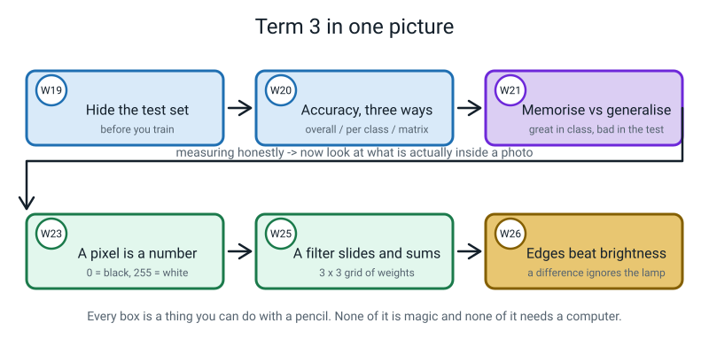
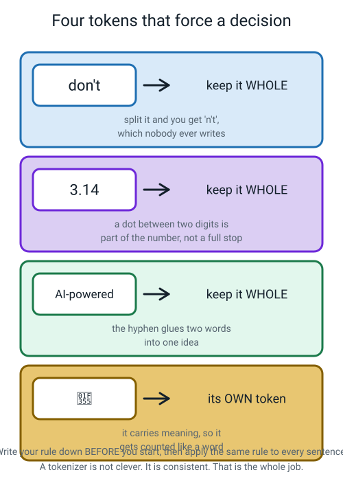
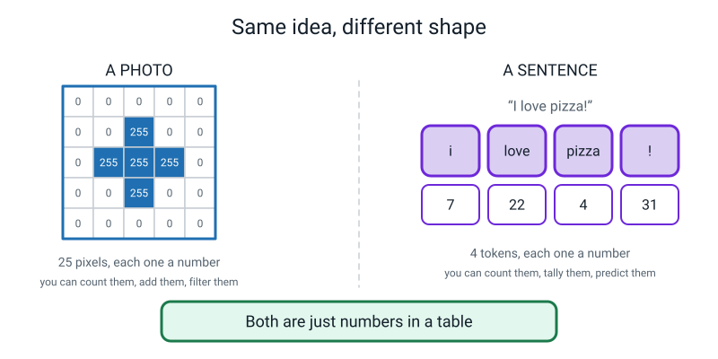
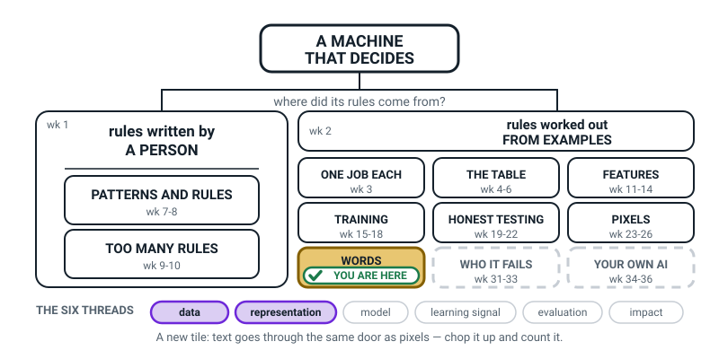
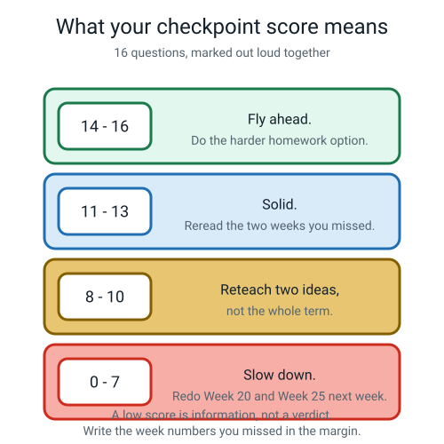
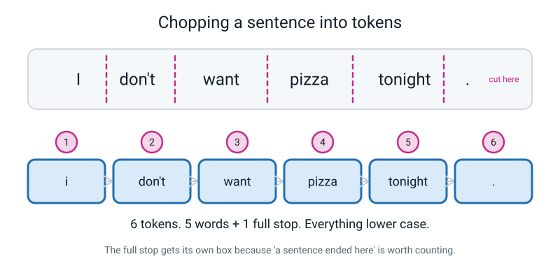

# Week 27 — Term 3 Checkpoint: From Pixels to Words

[⬅ Week 26](week-26.md) · [Course Home](../README.md) · [Week 28 ➡](week-28.md) · [Student Guide](../student-guide/week-27.md) · [Workbook](../workbook/week-27.md)

---

## 📋 At a Glance

| | |
|---|---|
| **Duration** | 70 minutes |
| **Type** | 🟦 Review + pivot |
| **Big idea** | Everything a machine handles — a photo, a message, a week of your life — first becomes numbers in a table, and text is no different. |
| **New vocabulary** | corpus · token · tokenize |
| **Materials** | The printed 16-question checkpoint quiz (in this file), the printed Chop the Sentence sheet (in this file), two coloured pens, the student's Week 25 and Week 26 work, a book the student likes with a ~60-word paragraph flagged, the student's Week 27 workbook (homework — answers in Part G of the Answer Key) |
| **Tech needed** | **None.** This week is pencil and paper start to finish. |
| **Prep time** | 20 minutes the night before + 5 minutes on the day |

---

## 🎯 Lesson Objectives

By the end of this lesson your student can:

1. **Recall and use the Term 3 vocabulary without notes** — test set, accuracy, confusion matrix,
   pixel, filter — scoring at least 11 of 16 on the checkpoint quiz.
2. **Tokenize a sentence by hand** and justify each decision about punctuation, capital letters and
   contractions by pointing at a written rule.
3. **Count tokens and unique tokens separately**, and explain in their own words why the two numbers
   differ.
4. **Explain in one sentence** why text and images are the same kind of problem to a machine.
5. Define **corpus**, **token** and **tokenize** without notes.

---

## 🧑‍🏫 What YOU Need to Know First

*About 12 minutes of reading. Two jobs today: run a checkpoint honestly, and open the door to
language. Neither needs any computing background. If you only have five minutes, read
"Idea 2" and "The two misconceptions".*

### Why a checkpoint week exists at all

A checkpoint is not a test in the school sense. Nothing is graded, nothing goes on a report. Its only
purpose is **to find out which weeks did not stick, so you can go back to those weeks and not the
others.**

That is why every question on the quiz has a week number printed beside it. When a question is
missed, you do not write "revise Term 3" — you write **"W20"** in the margin, and next week you spend
ten minutes on Week 20 and zero minutes on Week 23. A checkpoint that produces a score and nothing
else has wasted an hour. A checkpoint that produces a short list of week numbers has done its job.

Say this to your student out loud before you start, in these words or close to them: *"This is not for
marks. It is to find out what to go back to."* Eleven-year-olds relax visibly when told this, and a
relaxed student gives you far better information about what they actually know.


*Figure 27.1 — The eight weeks of Term 3, in the order they were taught. Every box is something your student can now do with a pencil.*

Here is the term you are checking, in one table. Keep it beside you while marking.

| Week | Title | The one thing it was for |
|---|---|---|
| **19** | The Test You Can't Study For | Hide some examples *before* training; look at them once, at the end |
| **20** | Accuracy, Three Ways | Fraction, decimal, percentage — and the baseline that stops the number lying |
| **21** | Memorizing vs Generalizing | 100% in training and 55% in the test means it learned the photos, not the object |
| **22** | The Hidden Ten (project) | Test your own model honestly and build the confusion matrix by hand |
| **23** | A Photo Is Just a Grid of Numbers | A pixel is one number: 0 is black, 255 is white |
| **24** | Colour Is Three Grids Stacked | Red, green and blue grids — three numbers per pixel |
| **25** | Filters: The Little Grid That Finds Edges | Slide a 3×3 grid, multiply nine pairs, add them up, take the absolute value, clip at 255 |
| **26** | Pixel Lab | Edges survive a lighting change; raw brightness does not |

### Idea 1 — text is data, and it has to be chopped before it can be counted

Back in Week 4 your student learned that a machine cannot handle "a school day" or "a dog". It can
only handle **rows and columns of numbers**. In Weeks 23 to 26 they saw that move applied to a
photograph: chop it into pixels, and each pixel is a number.

Today they meet exactly the same move applied to a sentence. And the move needs a name for the
pieces.

> **Corpus** — the pile of text you are learning from. It just means "a body of text". A book, a
> chat history, a paragraph. Plural: *corpora*.

> **Token** — one piece of text after chopping. Usually a word, but a punctuation mark counts as a
> token too.

> **Tokenize** — to chop text into tokens.

That is the whole vocabulary for today. Three words.

🍕 **The analogy to use, and it is a good one:** cutting a pizza. The pizza is the same either way,
but *how you slice it* decides what a "piece" is. Eight big slices: few pieces, lots on each.
Forty little squares: plenty of pieces, almost nothing on each. Tokenizing is choosing your slice
size for language. There is no correct slice size — only a choice you make on purpose and then stick
to.

### Idea 2 — the four decisions, and why "be consistent" is the whole job

This is the heart of the lesson, and it is the bit teachers usually skip because it looks trivial.
It is not trivial. Chopping a sentence forces four decisions, and each one quietly changes every
number you compute afterwards.

**Decision 1 — is punctuation its own token?**

```
   "I love pizza!"

   punctuation glued on    ->  [ I ] [ love ] [ pizza! ]         3 tokens
   punctuation split off   ->  [ I ] [ love ] [ pizza ] [ ! ]    4 tokens
```

If you glue it on, then `pizza!` and `pizza?` and `pizza.` are three completely different words as far
as the machine is concerned, each with its own separate count. Your table gets longer and every count
gets smaller. Splitting punctuation off keeps `pizza` as one word, and throws in a bonus: `.` becomes
a token that means *"a sentence ended here"*, which turns out to be enormously useful later.

**We split punctuation off in this course.** State it as a rule and never wobble on it.

**Decision 2 — does `Pizza` mean the same as `pizza`?**

To a computer, `Pizza` and `pizza` are as different as `Pizza` and `banana`. Different letters,
different word. So many real systems **lowercase everything first**:

```
   "Pizza is great. I love pizza."

   without lowercasing:   Pizza (1),  pizza (1)   <- counted as two different words
   with lowercasing:      pizza (2)               <- correctly counted as one word
```

(Not every system does: many modern chatbots keep capital letters and accept the extra pieces.)
But you pay for it. `Apple` the company and `apple` the fruit become identical. `Polish` from Poland
and `polish` for shoes merge into one. **There is no free choice here — only a trade you should make
deliberately.** We lowercase.

**Decision 3 — what about `don't`, `3.14`, `AI-powered`?**

These are the ones that will start an argument at your table, which is exactly why they are on the
sheet. `don't` could be one token, or two (`do` + `n't`), or three (`don` + `'` + `t`). Real systems
genuinely disagree. `3.14` contains a dot, and you just made a rule that says dots are their own
token — so does `3.14` become `3` / `.` / `14`? (No. But you have to *say* no, in writing.)


*Figure 27.3 — The four hard cases on today's sheet, with the decision we make and the reason for it. Your student writes these as rules before they chop anything.*

**Decision 4 — what about an emoji?**

An emoji carries meaning. 🍕 in a message means something. So it gets counted like a word: **its own
token.** Students find this one delightful and it is a genuinely correct answer — real systems do
treat emoji as tokens.

> **The point to land, and if they only remember one thing today let it be this:**
> **A tokenizer is not clever. It is consistent.** It follows the same written rule every single time,
> even when the rule gives a slightly silly answer. Writing the rules down *before* you start is not
> bureaucracy — it is the entire skill.

### Idea 3 — tokens versus unique tokens

Two different counts, and students merge them constantly.

- **Token count** = how many pieces you produced. Count every piece, including repeats.
- **Unique token count** = how many *different* pieces there are. Count each distinct piece once.

```
   "I love pizza. Do you love pizza?"

   tokens:   i / love / pizza / . / do / you / love / pizza / ?     =  9 tokens
   unique:   i, love, pizza, ., do, you, ?                          =  7 unique
```

Nine tokens, seven unique, because `love` and `pizza` each appeared twice.

**Why the difference matters:** the token count tells you *how much evidence you have*. The unique
count tells you *how many rows your table needs*. Next week your student builds a table with one row
per unique token, and fills it using all the tokens. So both numbers are real, and they measure
different things.

A quick rule of thumb worth saying out loud: **in normal English, the more text you collect, the
bigger the gap between these two numbers gets.** A sentence might be 9 tokens and 7 unique. A whole
book might be 80,000 tokens and 6,000 unique — because after a while you stop meeting new words and
just keep meeting `the` again.

### Idea 4 — the sentence that closes the term

This is the line the whole term has been building toward, and it deserves to be said slowly:

> **A photo becomes a grid of numbers. A sentence becomes a strip of numbers. To a machine they are
> the same kind of problem, in a different shape.**


*Figure 27.4 — Left: 25 pixels, each a number. Right: 4 tokens, each a number. The machine does not know which one is a picture.*

Once a thing is numbers in a table, everything your student learned in Terms 1 and 2 applies again
almost unchanged: you can count it, tally it, hide a test set from it, measure accuracy on it,
and get fooled by a background in it. Almost nothing about the tools is new, which is why the course is
arranged this way; the genuinely new thing is that word order matters in text, and next week's bigram
idea is the first way of using it.

### The two misconceptions you will hit today

**Misconception 1: "There's a right answer for how to chop."**

There is not, and pretending otherwise will damage next week. Real tokenizers disagree about `don't`.
They disagree about hyphens. They disagree about whether to lowercase. The thing that is *wrong* is
being **inconsistent** — chopping `don't` as one token in sentence A and two in sentence C. When your
student asks "but which is correct?", the honest answer is: *"Whichever you wrote down at the top of
the page, applied to all four sentences."* Say that; do not invent an authority.

**Misconception 2: "A token is a word."**

Close enough for this course, and wrong in general. Punctuation marks are tokens and are not words.
Emoji are tokens and are not words. And real chatbots do not slice into words at all — they slice into
**sub-word pieces**, so `unbelievable` might become `un` + `believ` + `able`. Why? Because a fixed
list of about 50,000 pieces can then spell *any* word ever written, including names and typos,
without needing an entry for each one.

You do not need to teach sub-word pieces today, but you should know the answer, because a curious
student will ask. The useful rule of thumb for English is **about 4 characters per token, so 100
tokens ≈ 75 words.**

### How deep to go, and where to stop

**Go this deep:** three words of vocabulary, six written rules, four sentences chopped, two counts
computed, one sentence about photos and text being the same problem.

**Stop here:**
- ❌ **Do not teach bigrams, next-word tables or prediction.** That is Week 28 and it is a whole
  lesson. If your student races ahead to "so how does it write a sentence?", say *"that is exactly
  next week"* and move on. Do not spoil it.
- ❌ **Do not teach sub-word tokenizing as a technique.** Mention it as a fact if asked, one sentence,
  then back to whole words.
- ❌ **Do not turn the quiz into a lesson.** If a question is missed, write the week number in the
  margin, give the one-line correct answer, and keep moving. Reteaching happens next week, not now.
  Marking sixteen questions properly takes eighteen minutes and you do not have thirty.
- ❌ **Do not discuss what words *mean*.** Meaning is not on the table this term. Today words are
  pieces you can count, and that is deliberately all.

---

### 🧭 The Growing Map

The student guide carries **Where This Fits** every week: the same picture, one more piece filled in.
This week a new tile shades in — **WORDS** — and it sits directly below **PIXELS**, which is the whole
argument of Term 3 made visible without a single word of explanation.



*Figure 27.0 — Week 27's version. WORDS newly tinted and badged on the bottom row, with **data** and
**representation** lit along the bottom.*

**What to do with it, in about two minutes at the end of the lesson:**

1. **Show it and ask:** *"which bit did we do today?"* Let them point. When they land on WORDS, ask the
   follow-up that does the real work: *"and why is it drawn underneath PIXELS rather than somewhere
   new?"* The answer you want is **same move, different material** — chop it up, count it.
2. **Then ask:** *"why is WHO IT FAILS still dashed, when we spent today looking at counts?"* Because
   nothing today asked *who* the sentences came from. Counting is not yet auditing. Leave it there.
3. **Have them shade WORDS on their own map** and write the two numbers from their best sentence next
   to it — total tokens and unique tokens. Two numbers, in their own handwriting, in the right box.

> **🧑‍🏫 Why this is worth two minutes.** A tokenizing lesson can feel like clerical work, and a
> student who cannot see where it sits will file it under "the boring week". The map shows them it is
> the same door they walked through in Week 23, which reframes two hours of chopping as the opening move
> of a language model rather than a spelling exercise.

**The six threads** along the bottom are the spine of all four levels. **Data** and **representation**
are lit this week — the tokens are the data, and the four chopping rules are the representation
decision. Do not quiz them on the threads; the map is orientation, never assessment.

---

## 🧰 Prep Checklist

### 20 minutes, the night before

- [ ] **Print the checkpoint quiz** (Answer Key, Part A below — the question text without the
      answers). Marking on paper, out loud, together, works far better than on a screen. Print two
      copies if you like: one to write on, one clean.
- [ ] **Print the Chop the Sentence sheet** (Answer Key, Part C). Big spaces between the lines — your
      student needs room to draw cut marks.
- [ ] **Do the quiz yourself.** All sixteen. It takes eight minutes and it is the difference between
      marking confidently and marking hesitantly. Check your answers against Part B.
- [ ] **Tokenize sentence 4 yourself** (`"Pizza 🍕 again? Yes!"`). Notice that you have to make a
      decision about the emoji before your student asks you about it.
- [ ] **Ask your student to pick a book** and flag a paragraph of roughly 60 words. If they forget,
      the reference paragraph in Part F of the answer key is your fallback and it is already fully
      worked out.
- [ ] **Get two coloured pens.** One for chopping, one for marking. Sounds fussy; it makes the
      finished sheet readable, and a readable sheet is what they revise from.

### 5 minutes, on the day

- [ ] Quiz printed and face down on the table. Face down matters — a visible quiz makes an
      eleven-year-old tense for ten minutes before you start.
- [ ] Chop the Sentence sheet underneath it.
- [ ] Week 25 and Week 26 work out on the table, visible. Seeing their own edge map beside them
      during the quiz is legitimate confidence, not cheating — the quiz asks them to *recall*, and
      their own work reminds them that they did all of this themselves.
- [ ] A blank sheet headed **"Weeks to go back to"** in the middle of the table.
- [ ] Their book, open at the flagged paragraph.

### If something fails

| What fails | Fallback |
|---|---|
| **No printer** | Read the sixteen questions aloud one at a time; the student writes answers on a numbered blank page. Slightly slower — budget 22 minutes rather than 18 — so drop Chop the Sentence to three sentences and set the fourth as homework. |
| **The student forgot their book** | Use the reference paragraph in **Part F** of the answer key. It is exactly 60 words, and its full tokenization and frequency count are already worked out for you. Nothing is lost. |
| **The student is upset by the score** | Stop marking. Turn the page over. Say: *"This tells us which two weeks to redo. That's all it does."* Then do Chop the Sentence, which is hands-on and has no score attached, and finish the marking next week. A distressed student learns nothing; a checkpoint is never worth that. |
| **You run out of time** | Cut the Activity to sentences 2 and 3, and set sentence 4 (the emoji) as the first homework question. Never cut the marking — an unmarked quiz is worse than no quiz, because it produces no list of weeks. |
| **You disagree with an answer in the key** | Your student's reasoning wins if it is *consistent with a written rule*. Tokenizing genuinely has no single right answer. Mark it correct, write their rule in the margin, and move on. This is not you being generous; it is the actual state of the field. |

---

## ⏱️ The Lesson, Minute by Minute

| # | Segment | Minutes | Running total |
|---|---|---|---|
| 1 | 🪝 Hook — Five words, no notes | 8 | 8 |
| 2 | 🧠 Concept — The Term 3 checkpoint, marked out loud | 18 | 26 |
| 3 | 🔍 Worked example together — Chop the first sentence, write the rules | 14 | 40 |
| 4 | 🎲 Activity — Chop the Sentence: three more, then count | 20 | 60 |
| 5 | 🔑 Wrap & assign | 10 | 70 |

---

### 1 · 🪝 Hook — Five words, no notes (8 min)

**Say this:**

> "Notes away. Pencil down. I am going to say five words and you are going to tell me what each one
> means. Not a definition out of a book — just say it however you say it.
>
> Test set. … Accuracy. … Confusion matrix. … Pixel. … Filter.
>
> That is Term 3. Eight weeks, five words. And you just did all five without looking anything up,
> which is worth noticing, because in Week 19 you had never heard three of them.
>
> Here is what today is. There is a sixteen-question quiz on the table and it is not for marks. It
> does not go anywhere. Nobody sees it. Its one job is to tell us **which weeks to go back to** — so
> that next week I spend ten minutes on the thing you missed instead of an hour on things you already
> know. Every question has a week number printed next to it. When you get one wrong, we write that
> week number on this sheet here, and that sheet is the whole point of the lesson.
>
> Then, in the second half, the term turns a corner. You have spent six weeks turning pictures into
> numbers. Today you are going to do the same thing to a sentence — and find out that, once both are
> numbers, a machine handles them in much the same way."

**Do this:**

- Say the five words at a real pace, with a genuine pause after each. Do not help. Silence is fine.
- If an answer is roughly right, say **"yes"** and move on. Do not upgrade their wording — you are
  measuring recall, not teaching.
- Put the blank **"Weeks to go back to"** sheet in the middle of the table where they can see it.
- Turn the quiz face up only at the end of the eight minutes.
- Draw this on the board and leave it up all lesson:

```
        TERM 3, IN FIVE WORDS
        ─────────────────────
        test set    hide it, look once
        accuracy    right ÷ total
        matrix      what got mistaken for what
        pixel       one number, 0 to 255
        filter      little grid, slide and sum

        TODAY:  find the weeks to go back to
                then do it all again -- to words
```

**Ask this:**

| Ask | Hoping for | If you get something else |
|---|---|---|
| "Test set — what is it?" | "Photos you hide before training and only look at once, at the end." | If they say "the photos you test on" — accept it, then add: *"and the important word is **hide**. Hidden before you train."* Do not mark this as a gap; it is close enough. |
| "Confusion matrix — what is it for?" | "Seeing what got mistaken for what." | If blank: write a 2×2 grid on the board with no numbers and ask *"what went in the boxes?"* Usually that unlocks it. If it stays blank, write **W20** on the sheet before the quiz even starts. |
| "Filter — what does it do?" | "A little grid of numbers you slide over the picture; you multiply and add and get one number." | If they say "it finds edges" — that is the *purpose*, not the *mechanism*. Say: *"Right, that's what it's for. What does it actually do?"* If the mechanism is missing, write **W25** on the sheet. |
| "Which of those five did you not know in Week 19?" | Any honest answer; usually "confusion matrix" and "filter". | If they say "all of them" — good. Say so: *"So you learned five new ideas in eight weeks. That's the whole term, and you can say all of it out loud."* |

---

### 2 · 🧠 Concept — The Term 3 checkpoint, marked out loud (18 min)

**Say this:**

> "Sixteen questions. Take about ten minutes. Short answers — a number, a word, a sentence. If a
> question wants arithmetic, show it, because I will give you the mark for correct arithmetic even
> if the final number slips.
>
> Two rules. One: you may look at your own Week 25 and Week 26 work if you want to. It is on the
> table for a reason. Two: if you genuinely do not know one, write the words **'don't know'** and go
> on. That is a real, useful answer — much more useful to me than a guess, because a guess I might
> mark right by accident and then we never find out.
>
> When you finish, we mark it together, out loud, and you tell me the answer before I do."

**Do this:**

- Hand over the quiz and get out of the way. Do not hover. Do not read over their shoulder.
- Give a **quiet warning at seven minutes**: *"about three minutes left."*
- **Then mark it together, aloud, one question at a time.** This is the important half of the
  segment. For each question:
  1. Ask *"what did you put?"*
  2. Say whether it is right.
  3. If it is wrong, give the correct answer in **one sentence** — and write the week number on the
     "Weeks to go back to" sheet.
  4. Move on. Do not reteach. This is the discipline that keeps you inside eighteen minutes.
- At the end, total the score and put it against the bands below. Say the band out loud.


*Figure 27.5 — What to do with the score. A low score is a list of week numbers, not a verdict.*

| Score | What it means | What you do next week |
|---|---|---|
| **14–16** | Flying. | Give the harder homework option. Move to Week 28 at full speed. |
| **11–13** | Solid — this is the normal, healthy result. | Reread the one or two weeks on the sheet. Ten minutes each. |
| **8–10** | Two ideas did not land. | Reteach **two** specific ideas, not the whole term. Use the week numbers on the sheet. |
| **0–7** | Slow down; something structural is missing. | Redo the Week 20 worked example and the Week 25 worked example properly before starting Week 28. Week 28 stands on neither of them directly, so you can afford the time. |

> **⚠️ Watch out:** the temptation to teach while marking is enormous, and it is the single most
> common way this lesson overruns. You feel a gap, you explain it, four minutes vanish, and now
> Chop the Sentence gets six minutes instead of twenty and the lesson's real payoff never arrives.
> **One sentence, a week number, next question.** Write "reteach this" in the margin if you must.

**Ask this:**

| Ask | Hoping for | If you get something else |
|---|---|---|
| "Before I tell you — what did you put?" (every question) | Them saying it out loud, right or wrong. | If they will not say it, read their answer off the page yourself and mark it. Saying it aloud is better, but it is not worth a standoff. |
| "That one's wrong — which week was it from?" | Them reading the week number off the question and writing it on the sheet themselves. | If they cannot find it, point at it. The physical act of *them* writing the number matters more than who found it. |
| "Which one of these sixteen felt hardest?" | Any honest answer. Usually Q12 (colour, 432 numbers) or Q16 (the lamp). | If "none" and they scored 15 — believe them, and give the harder homework. If "all of them", stop and ask which *word* was unfamiliar; often it is one word, not one idea. |

---

### 3 · 🔍 Worked Example Together — Chop the first sentence, write the rules (14 min)

**Say this:**

> "Quiz away. Different half of the lesson now.
>
> In Week 23 you took a photo and chopped it into pixels, because a machine cannot handle 'a photo' —
> it can only handle numbers in a table. Today, same move, different thing. Here is a sentence:
>
> **I don't want pizza tonight.**
>
> Chop it into pieces. And straight away we have a problem, which is that I did not tell you what a
> piece is. Is `don't` one piece or two? Is the full stop a piece at all? Is `I` the same word as `i`?
>
> These are real questions. Real computer scientists disagree about them, today, for money. So here
> is what we do — and it is the actual skill of this lesson: **we write our rules down first, and
> then we follow them even when we don't like the answer.**
>
> The pieces have a name. Each piece is a **token**. Chopping text into tokens is called
> **tokenizing**. And the pile of text you are chopping is called a **corpus** — that is just a fancy
> word for 'the text we're working from'. Three words. That's all the new vocabulary today.
>
> Right. Rules. I'll give you the first two and you'll see why the next four are needed."

**Do this:**

- Write the six rules on the board, in this order, with your student — do not just present them.
  Introduce rules 1 and 2 yourself, then hit `don't` and let the need for rule 3 emerge before you
  write it.

```
        OUR TOKENIZING RULES   (write these first, then obey them)
        ─────────────────────────────────────────────────────────
        R1  lowercase everything
        R2  . , ! ?  are each their own token
        R3  contractions stay whole      don't  isn't
        R4  a dot between two DIGITS stays in the number    3.14
        R5  hyphenated words stay whole  AI-powered
        R6  an emoji is its own token
```

- **Say out loud that R4 beats R2.** They are in conflict on purpose. R2 says dots are separate; R4
  says not this dot. Real tokenizers are full of exceptions like this, and noticing the conflict is a
  genuinely sophisticated thing for an eleven-year-old to do. Number the rules so precedence is
  visible.
- Now chop sentence 1 together on the board. Draw the cut marks first, as dashed vertical lines, then
  draw the boxes underneath and number them.


*Figure 27.2 — The finished board for sentence 1. Cut marks on top, numbered token boxes underneath. Six tokens.*

```
        I don't want pizza tonight.
        │     │    │     │       ││
        1     2    3     4       5 6

        [ i ] [ don't ] [ want ] [ pizza ] [ tonight ] [ . ]

        6 tokens.  6 unique.
```

- Point at each token and name which rule produced it:
  - `i` — R1 lowercased it.
  - `don't` — R3 kept it whole.
  - `.` — R2 made it its own token.
- Then do the two counts. Six tokens. Six unique, because nothing repeated. Write **both** numbers
  down even though they are equal here — you want the habit in place before sentence 2, where they
  come apart.

**Ask this:**

| Ask | Hoping for | If you get something else |
|---|---|---|
| "Is `don't` one token or two?" | Genuine hesitation, then a decision. | If they say "obviously one" — push back: *"Some real systems split it into `do` and `n't`, because `n't` means 'not'. So it isn't obvious. Pick one and write it down."* The hesitation is the learning. |
| "Why did we lowercase the `I`?" | "So `I` and `i` count as the same word." | If they don't know, do it on the board: write `Pizza is great. I love pizza.` and count `Pizza` and `pizza` separately. Two words with a count of 1 each, instead of one word with a count of 2. The waste is visible. |
| "What do we lose by lowercasing?" | Anything about names. `Apple` the company vs `apple` the fruit. | If nothing comes: give them `Polish` and `polish`, or `May` and `may`. Then say the honest line: *"We gain cleaner counts and we pay in confusion. It's a trade, not a free win."* |
| "Rules 2 and 4 disagree. Which wins?" | "R4 — the dot in `3.14` stays." | If they say R2, follow it through: *"Then `3.14` becomes three tokens: `3`, `.`, `14`. Is that a number any more?"* They will fix it themselves. Let them. |
| "Six tokens, six unique. Will those two numbers always be the same?" | "No — only if nothing repeats." | If "yes": say `pizza pizza pizza`. Three tokens, one unique. Instant. |

---

### 4 · 🎲 Activity — Chop the Sentence: three more, then count (20 min)

**Say this:**

> "Your turn. Three sentences, and I picked each one to break a rule you just wrote. Rules stay on the
> board — look at them as often as you like. That is not cheating; that is what a tokenizer does. It
> looks up the rule every single time.
>
> Do sentence 2 and then stop and show me. Then 3 and 4 together.
>
> When all three are done, we do two counts across the whole set: how many tokens altogether, and how
> many *different* tokens. Those are different numbers and I want them both."

**Do this:**

- Hand over the Chop the Sentence sheet. Sentences 2, 3 and 4:

```
        2.  Pi is about 3.14, isn't it?
        3.  My AI-powered pizza-oven is great!
        4.  Pizza 🍕 again? Yes!
```

- **Check after sentence 2**, then let them run 3 and 4 without interruption. Sentence 2 is the one
  with two traps in it (`3.14` and `isn't`) and it is worth a checkpoint.
- Watch for the three predictable stumbles and use the light-touch fix, not an explanation:
  - **They forget the comma in sentence 2.** Point at R2. Say nothing else.
  - **They split `pizza-oven`.** Point at R5. Say nothing else.
  - **They chop `Yes!` as one token.** Point at R2.
- When all four sentences are done, do the counting **on the board, together** — it is arithmetic
  worth being careful about:

```
        TOKENS PER SENTENCE
        1.  i don't want pizza tonight .                        6
        2.  pi is about 3.14 , isn't it ?                       8
        3.  my ai-powered pizza-oven is great !                 6
        4.  pizza 🍕 again ? yes !                              6
                                                              ────
                                                    TOTAL     26

        UNIQUE:  cross off repeats
                 is  (s2, s3)      pizza (s1, s4)
                 ?   (s2, s4)      !     (s3, s4)
                 4 repeats  ->  26 - 4 = 22 UNIQUE
```

- Make them find the four repeats themselves, by going through the list and crossing off. Do not hand
  them the number 22. The crossing-off *is* the activity's payoff — it is the moment "unique" stops
  being a word and becomes a thing they did.
- **Finish with the sentence of the day.** Put Figure 27.4 on the table, point at the two halves, and
  say the line:

> **"A photo is a grid of numbers. A sentence is a strip of numbers. To a machine, the same kind of
> problem in a different shape."**

**Ask this:**

| Ask | Hoping for | If you get something else |
|---|---|---|
| "Sentence 2 — how many tokens?" | 8. | If 7, they dropped the comma. If 9 or 10, they split `3.14` or `isn't`. Ask *"which rule number did you use for the dot?"* — this makes them find their own error against the written rule, which is the habit you want. |
| "Why does the emoji get to be a token?" | "Because it means something." | If "because it isn't a word": that is the wrong reason for the right answer. Say: *"So does a full stop get to be a token? It isn't a word either."* Steer to **it carries meaning, so we count it**. |
| "26 tokens but only 22 unique. Why the gap?" | "Because four things appeared twice." | If they say "because some are punctuation": no — punctuation are tokens too. Point at `pizza` in sentences 1 and 4. That fixes it in one move. |
| "If I gave you a whole book, which number would grow faster?" | "The token count." | If "the unique count": ask *"how many brand-new words are on page 300 of a book?"* Almost none — it is `the` again. This is a strong extension question and worth two minutes if you have them. |
| "Would a different person get 26 tokens?" | "Only if they used our rules." | If "yes, 26 is the answer": push. *"What if they glued the punctuation on?"* Then 26 drops to 20. Different rules, different number, neither wrong. |

---

### 5 · 🔑 Wrap & Assign (10 min)

**Say this:**

> "Two things happened today and I want you to say both back to me.
>
> One: we found out which weeks to go back to. That sheet in the middle of the table — read me the
> week numbers on it. Those are the only weeks we revisit. Everything else in Term 3 you have got.
>
> Two: you turned a sentence into numbers, the same way you turned a photo into numbers. And the point
> is not that tokenizing is clever. It is not clever at all. The point is that a machine cannot handle
> 'a sentence' any more than it can handle 'a dog'. It needs a table. So the first thing anybody does
> with text — the very first thing, before any of the impressive stuff — is chop it into pieces and
> count them.
>
> Which is exactly what you did next to `pizza`. Twice, apparently.
>
> Next week you take that same pile of tokens and count something new: not how often each word turns
> up, but **which word tends to follow which**. And that is the basic idea behind
> the thing on your phone that finishes your sentences. Real phones use bigger, cleverer versions."

**Do this:**

- Have them read the week numbers off the sheet aloud. Then fold that sheet and put it inside next
  week's file, physically. It must not get lost — it is the output of the lesson.
- Write the three vocabulary words on the board and have them say each definition once, unprompted:

```
        corpus     the pile of text we're learning from
        token      one piece after chopping
        tokenize   to chop text into tokens
```

- Assign the homework (below) and read the two parts out loud.
- Ask them to keep their book and their tokenized paragraph — Week 28 uses the **same** paragraph, so
  a paragraph they enjoyed choosing is worth more than a random one.

**Ask this:**

| Ask | Hoping for | If you get something else |
|---|---|---|
| "One sentence: why are a photo and a sentence the same kind of problem?" | "Because both turn into numbers in a table before anything else happens." | If they describe only one side, hold up Figure 27.4 and ask *"and the other half?"* This is the week's assessment question — get a real answer. |
| "Read me the week numbers on the sheet." | Them reading two or three numbers. | If the sheet is blank because they scored 16 — say so explicitly: *"Nothing to go back to. That is the best possible result."* Then give the harder homework option. |
| "What's a corpus?" | "The text we're learning from." | If "a body" — that is literally the Latin, so accept it and add *"a body of text, yes. The pile you're working from."* |

---

## 🎲 The Activity, In Full

### Chop the Sentence

**Goal:** tokenize four sentences by hand under written rules, then count tokens and unique tokens
separately.

**Time:** 14 minutes with the teacher (sentence 1) + 20 minutes independent (sentences 2–4 and the
counts).

**Materials:**
- The printed Chop the Sentence sheet, with the four sentences widely spaced and a blank rules box
  at the top.
- Two coloured pens: one for cut marks, one for token boxes.
- The board with the six rules on it, left visible the whole time.

**Grouping:** one student, one teacher, side by side. Both reading the sheet the same way up.

### Setup

1. Write the rules box **first**, at the top of the sheet, before any sentence is touched. This is
   non-negotiable and it is the point of the activity. A student who chops first and rationalises
   afterwards has done a different, less useful exercise.
2. Sentence 1 is done **together**, fully, on the board and on the sheet.
3. Sentences 2, 3 and 4 are done **alone**, with the rules visible.
4. The two counts are done **together**, on the board.

### The four sentences, and why each one is on the list

| # | Sentence | The decision it forces | Rule it tests |
|---|---|---|---|
| 1 | `I don't want pizza tonight.` | A contraction, and a capital `I` | R1, R2, R3 |
| 2 | `Pi is about 3.14, isn't it?` | A dot inside a number — **and** a comma, **and** a second contraction | R2, R3, **R4** |
| 3 | `My AI-powered pizza-oven is great!` | Two hyphenated words, one of them invented | R1, R5 |
| 4 | `Pizza 🍕 again? Yes!` | An emoji | R6, R2 |

### The rules

1. Write the six rules at the top of the sheet before chopping anything.
2. Draw cut marks in pen 1 as dashed vertical lines, *before* drawing any boxes.
3. Draw numbered token boxes underneath in pen 2.
4. Write the token count at the end of every sentence line.
5. Do the unique count last, across all four sentences, by listing and crossing off.

### What "finished" looks like

- Six rules written at the top of the sheet, numbered.
- Four sentences with cut marks and numbered token boxes.
- Four token counts: **6, 8, 6, 6**.
- A total: **26 tokens**.
- A crossed-off unique list arriving at **22 unique tokens**.
- Two sentences written out: why the emoji is a token, and why 26 and 22 differ.

### Variation — easier

Cut it to three sentences and drop sentence 3 (the hyphens). Give the six rules **pre-printed** at
the top rather than written out. Do the cut marks yourself on sentence 2 while the student writes the
boxes, so they get the shape of the task without the load of both halves.

For the unique count, make it physical: write each token on a small slip of paper, then sort the
slips into piles. Piles with more than one slip in them are the repeats. Count the piles — that is
the unique count. Slower, and it makes "unique" impossible to misunderstand.

### Variation — harder

Add these three and ask for a **new rule** for each, written down before chopping:

```
        5.  It cost $3.50 -- wasn't that a lot?
        6.  Email me at ramana@example.com!
        7.  She said "no", then "NO!!!"
```

Then the real question: **retokenize all seven sentences with punctuation glued on instead of split
off, and report both totals.** For the original four, gluing punctuation on gives:

```
        1.  i  don't  want  pizza  tonight.                 5
        2.  pi  is  about  3.14,  isn't  it?                6
        3.  my  ai-powered  pizza-oven  is  great!          5
        4.  pizza  🍕  again?  yes!                         4
                                                          ────
                                                  TOTAL   20   (was 26)
```

Unique under the glued rule: `i, don't, want, pizza, tonight., pi, is, about, 3.14,, isn't, it?, my,
ai-powered, pizza-oven, great!, 🍕, again?, yes!` = **18 unique** (was 22). Only **two** things repeat
now — `is` and `pizza` — instead of four, because `?` and `!` no longer exist as tokens at all: they
have been swallowed into `it?`, `again?`, `great!` and `yes!`, which are four different pieces rather
than two repeats. `20 − 2 = 18`.

The finding to draw out: **gluing punctuation on gives you fewer tokens and fewer unique tokens, and
that sounds tidier, but it is worse** — because `tonight.` and `great!` are now words that will never
appear in that exact form again, so their counts are stuck at 1 forever. Fewer, and less useful.

---

## ❓ Questions Students Ask This Week

**"Is there a right way to chop a sentence?"**

No — and this is the honest answer, not a dodge. Real systems built by real companies disagree about
`don't`, about hyphens, about whether to lowercase. What *is* wrong is being inconsistent: chopping
`don't` as one token on line 1 and two on line 4. Your rules are correct if they are written down and
you follow them.

**"Do real chatbots chop into words like we did?"**

No, and it is worth knowing. They chop into **sub-word pieces**: `unbelievable` might become `un` +
`believ` + `able`. The reason is clever and simple — with a fixed list of about 50,000 pieces you can
spell *any* word ever written, including names, made-up words and typos, without needing a separate
entry for each. If you tokenized by whole words, the first name it had never met would break it. Rule
of thumb for English: about 4 characters per token, so 100 tokens is roughly 75 words.

**"What about languages that don't put spaces between words?"**

Great question, and this is one of the reasons sub-word pieces are popular. Chinese, Japanese and Thai are written
without spaces, so "split on spaces" produces one enormous token for the whole sentence. Sub-word
tokenizing does not care about spaces at all — it just finds pieces that turn up a lot. That is one
real reason the technique was adopted, alongside handling rare words and names.

**"Does the machine know what the words mean?"**

Not this term, and honestly not in the way you mean. Right now the words are just pieces you can
count, like pixels. Next week you will see a machine produce a fluent-sounding (if often nonsensical) sentence
using nothing but tally marks and no understanding whatsoever. Whether something that big and that
good at prediction ends up with something you would fairly call *understanding* — that is argued about
seriously by serious people, and we will come back to it.

**"Why is `.` a token? It's not a word."**

Because it carries information: it tells you a sentence ended. That turns out to be one of the more
useful pieces in the whole corpus — next week you will need to know where sentences stop, and the `.`
tokens are how you know. Being a word was never the requirement. Carrying meaning is.

**"What's the best tokenizer? Which one wins?"**

**Nobody knows for sure, and here is why.** You cannot work it out on paper. The only way to compare
two tokenizers is to build a whole system with each one, train both, and see which behaves better —
which costs a fortune and takes weeks, and then the answer might be different for a different
language or a different job. So research teams pick one that has worked before, and the question stays
genuinely open. This is normal in AI: quite a lot of it is "this worked, we are not fully sure why."

**"Why do I have to do a quiz? You said no marks."**

Because I do not know which weeks to go back to, and guessing would waste your time. Sixteen
questions in ten minutes tells us both. The score goes nowhere; the list of week numbers is the
only thing we keep.

**"Could I tokenize into single letters?"**

Yes, and it works — some real systems do exactly that. You would get very few unique tokens (about
26 letters plus punctuation, instead of thousands of words), which sounds great. The cost is that each
token tells you almost nothing: knowing the last letter was `e` barely narrows down what comes next,
whereas knowing the last word was `pizza` narrows it a lot. That is the pizza-slice trade-off from
today, at its most extreme end.

---

## ⚠️ Where This Lesson Goes Wrong

| What happens | Why | What to do right now |
|---|---|---|
| **The marking eats the lesson.** Twenty-eight minutes gone, Chop the Sentence gets six. | You explained each wrong answer properly instead of moving on. It feels like good teaching and it costs you the lesson's payoff. | Set a visible timer for the marking. One sentence per wrong answer, write the week number, next question. Reteaching is *next* week's job — that is what the sheet is for. |
| **The student chops first and writes the rules afterwards.** | Rules feel like pointless admin to an eleven-year-old, and chopping looks obvious. | Take the sheet back. Hand it over again only when the rules box is filled in. Then show them the cost: chop `3.14` under R2 alone and ask *"is that still a number?"* One demonstration is enough, permanently. |
| **The two counts get merged into one.** "26 unique tokens." | The words *token* and *unique token* sound like the same thing said twice. | Physical fix, thirty seconds: `pizza pizza pizza`. Three tokens. One unique. Then go straight back to their sheet and cross off the four repeats by hand. |
| **A wrong answer is defended, and it is defensible.** They split `don't` into `do` + `n't`. | Because that is genuinely what some real tokenizers do. | **Mark it correct** — if it matches a rule they wrote. Write their rule in the margin and say so: *"That's a real choice; some systems do it. It's right because you wrote it down and stuck to it."* Do not overrule a consistent student to match this file. |
| **A low score flattens the mood, and the second half is lost.** | Eleven-year-olds hear a score as a judgement no matter what you said beforehand. | Stop marking. Turn it over. Say: *"This is a list of two weeks. That's all it is."* Then go straight into Chop the Sentence, which is hands-on and unscored. Finish the marking next week. Never trade the student's willingness for a completed mark sheet. |
| **They race ahead to "so how does it write sentences?"** | It is the obvious next question and it is a good one. | Say: *"That is literally next week, and you'll build it with tally marks."* Write their question on a sticky note and put it on next week's file. Do not start bigrams — you have neither the time nor the segment for it. |
| **The emoji derails everything into a discussion of emoji.** | Emoji are fun and `🍕` is on the sheet. | Give it ninety seconds and one clear ruling: *"it carries meaning, so it's its own token"* — then point at the rule number on the board and move to the counts. |

---

## 🧭 Differentiation

### If they are struggling

**Cut, in this order:**
1. The harder homework option — gone.
2. Sentence 3 (the hyphens) — set as optional.
3. The unique count across all four sentences — do it for sentences 1 and 2 only, where the numbers
   are small enough to hold in your head.

**Reteach, not everything:** look at the "Weeks to go back to" sheet and pick the **two** most-missed
weeks. Two. Not four. If the sheet says W20 and W25, then next week opens with ten minutes on
accuracy-three-ways and ten minutes on one filter cell, and nothing else.

**The one thing to protect:** the sentence *"a photo is numbers, a sentence is numbers, same problem."*
If everything else falls over today, get that sentence said out loud, in their words, before they
leave. Week 28 rests on it and nothing else from today.

**Scaffold that works:** pre-chop sentence 2 for them with the cut marks already drawn, and have them
only draw and number the boxes. The task halves in load and loses nothing conceptual.

### If they are flying

Extension questions, in rising difficulty:

1. **"Tokenize `Don't` at the start of a sentence and `don't` in the middle. Under our rules, same
   token or different?"** — Same, because R1 lowercases first. Then: *"and if we dropped R1?"*
   Different, and the count of a very common word gets split in half. This is the single most common
   reason a beginner's frequency table looks strange.
2. **"Our rules say `.` is its own token, but `3.14` keeps its dot. Write R4 so precisely that a
   machine could follow it with no judgement at all."** — Something like: *a `.` stays inside the
   token if and only if there is a digit immediately before it and a digit immediately after it.*
   That is a genuinely good piece of specification writing and it is hard.
3. **"Which is bigger for a whole book: token count or unique token count? By roughly how much?"** —
   Tokens, by a lot. A book might be 80,000 tokens and 6,000 unique. The reason: new words run out
   fast, `the` never does.
4. **"Retokenize all four sentences with punctuation glued on. Both totals."** — 20 tokens, 18 unique
   (working in the harder variation above). Then: which rule is better, and better *for what*?
5. **"Here is a sentence with no spaces: `ilovepizza`. Write a rule that chops it correctly, then find
   a sentence where your rule fails."** — Any rule based on a dictionary of known words will do it,
   and it will fail on names, or on something like `pizzaoven` where two chops are both plausible.
   This is the actual open problem, handed to them straight.

### If they won't engage today

Some days the answer is not more encouragement.

**Do this instead, in this order:**

1. **Skip the quiz entirely.** Do it next week. A checkpoint done resentfully produces false
   information — they will write "don't know" for things they know perfectly well — and false
   information is worse than no information, because you will reteach the wrong week.
2. **Go straight to chopping, out loud, no writing.** You hold the pen; they say where the cuts go.
   Ninety per cent of the thinking, ten per cent of the effort.
3. **Use their own sentence.** Ask them to say any sentence at all — about football, a game, a
   sibling, anything — and tokenize *that* on the board. Engagement problems on a review week are
   almost always ownership problems, and this hands ownership straight back.
4. **Two minutes of the phone keyboard.** Type one word, tap the middle suggestion twenty times, read
   the nonsense aloud. It is next week's hook, it takes two minutes, and it is genuinely funny. If
   you get a laugh you have the room back — and if you don't, you have lost two minutes and set up
   Week 28.
5. **Take the win and stop.** If they can say *"a sentence becomes numbers, like a photo did"*, the
   lesson has done its structural job. The quiz can wait a week. Do not spend forty minutes buying
   compliance.

---

## ✅ Assessing Understanding

Three checks. All three fit in five minutes and none of them needs a written answer.

### Check 1 — the three words

**Say exactly this:** *"Corpus, token, tokenize. Give me each one in under ten words."*

**A good answer:**
- *Corpus* — "the text we're learning from" / "the pile of writing".
- *Token* — "one piece after chopping" / "a word, or a full stop".
- *Tokenize* — "chop text into tokens".

**Not good enough:** "corpus is a body" with no mention of text; "a token is a word" with no
acknowledgement that punctuation counts. For that second one, ask *"is a full stop a token?"* — if
yes, they are fine and the definition was just loose.

### Check 2 — the two counts

**Say exactly this:** *"`pizza pizza pizza`. How many tokens? How many unique tokens?"*

**A good answer:** "Three tokens, one unique." Instantly, with no hesitation.

**If they hesitate**, or say three and three: this is the week's most likely gap and it is worth two
extra minutes right now. Write the three words on paper, physically cross out two of them, and say:
*"three pieces, one different piece."* Then ask again with `dog dog cat` (three tokens, two unique).

### Check 3 — the sentence of the term

**Say exactly this:** *"Why are a photo and a sentence the same kind of problem to a machine?"*

**A good answer** names both halves and the shared destination: "because a photo turns into a grid of
numbers and a sentence turns into a strip of numbers, and a machine only works on numbers in a table."

**Half an answer** — describing only pixels, or only tokens — gets one follow-up: *"and the other
half?"* Do not let this one go with half. It is the load-bearing idea of the week and Week 28 opens
on top of it.

### Mastery scale for this week

| Level | What it looks like |
|---|---|
| **1** | Can say what a token is when prompted. Cannot chop a sentence without the rules being read aloud to them. Merges token count and unique count. |
| **2** | Chops a simple sentence correctly with the rules visible. Handles punctuation as separate tokens. Still needs help with `don't` and `3.14`. Gets the two counts right for a short sentence when reminded they are different. |
| **3** | **Target.** Chops all four sentences correctly under written rules, including the contraction, the decimal and the hyphen. Produces 26 tokens and 22 unique unaided. Says the photo-and-sentence line in their own words. |
| **4** | Explains *why* each rule exists, not just what it says — can say what lowercasing costs you, and why splitting punctuation off is worth the extra tokens. Retokenizes under a different rule set and reports both totals. |
| **5** | Writes a new rule precisely enough for a machine to follow, spots that R2 and R4 conflict without being told, and predicts that the token/unique gap widens with a bigger corpus — with a reason. |

Most students land at **3** on this week, and 3 is a full pass. Level 5 needs the harder variation and
a genuinely strong day; do not chase it.

---

## 📤 Homework to Assign

**Say this:**

> "Two parts, about fifty minutes altogether, and neither one needs a screen.
>
> **Part 1 — the Term 3 reflection sheet.** One page, three boxes. In each box write **one thing you
> can do now that you could not do in Week 19**. Not 'I learned about pixels' — something you could
> actually *do* if I asked you right now. 'I can work out the output size of a filter.' 'I can build a
> confusion matrix.' One sentence each. It should take you five minutes and it is worth doing
> honestly, because in nine weeks you present this stuff to real people.
>
> **Part 2 — tokenize your paragraph.** Take the paragraph you flagged in your book, about sixty
> words. At the **top** of the page, write your tokenizing rules — you may use ours, you may change
> them, but they must be written down before you start chopping. Then tokenize the whole thing. Then
> count: total tokens, unique tokens, and a frequency table of every word with how many times it
> appears, sorted with the most common at the top.
>
> Keep that paragraph. Next week we use the same one, and you will be glad you picked one you
> actually like."

**Workbook:** Week 27 (`workbook/week-27.md`). It has no numbered pages — it is a run of named
sections. The two parts you read out loud above are **Build It, Part 1** and **Build It, Parts 2–3**;
the sections before them are the rest of the homework. Answers for every section are in **Part G**
of the Answer Key.

| Workbook section | Items | What is on it | Rough time |
|---|---|---|---|
| **✅ Warm-Up** | W1–W5 | Recall from Week 26 (Pixel Lab): edge map, cell addresses, the lamp, clipping, checking one cell by hand | 5 min |
| **✍️ Practice Set A — Understand It** | A1–A6 | Vocabulary blanks, which thing is never a token, "one correct way?", match rules to decisions, chop one sentence into boxes, count tokens and unique tokens | 10 min |
| **✍️ Practice Set B — Use It** | B1–B5 | Tokenize three sentences and count; what goes wrong with no written rules, with no lowercasing, with punctuation glued on, with no spaces in the text | 15 min |
| **🧩 Puzzle of the Week** | P1–P5 | Three people, one sentence, three token counts — find each one's rules | 5 min |
| **🤔 Think Deeper** | T1–T2 | Write R4 for a machine and break it; token count versus unique count for a whole book | optional |
| **🛠️ Build It** | Parts 1–3, vocabulary boxes | Term 3 reflection sheet; tokenize your own paragraph (rules first, numbered tokens, two counts, frequency table, arithmetic check); two written questions; corpus / token / tokenize | the main job |
| **🎨 Draw It** | one drawing | A 5 × 5 grid of numbers beside a strip of numbered token boxes, with a banner | 5 min |
| **📊 Self-Check** | 5 rows | Yes / Nearly / Not yet ticks | 2 min |

**Total: about 50 minutes** (the workbook's own estimate). The fill-in sections are quick; the time
goes on Build It, Part 2. If it is running past an hour, cut **Think Deeper** first and then the
**Puzzle** — they are the stretch items, and Think Deeper is the one to set for students who scored
14 or more. Never cut Build It: Week 28 is built on the tokenized paragraph.

---

## 🔑 Answer Key

### Part A — the checkpoint quiz (print this half)

> **Term 3 Checkpoint — 16 questions, about 10 minutes.**
> Not for marks. The week number beside each question tells us what to go back to.

| # | Week | Question |
|---|---|---|
| 1 | W19 | What is a **test set**? Two things must be in your answer. |
| 2 | W19 | You test your model, tweak the photos, retrain, and test again — five times. What have you damaged? |
| 3 | W20 | A model got **12 out of 15** right. Write the accuracy as a fraction, a decimal and a percentage. |
| 4 | W20 | Three classes, roughly equal. What score does **blind guessing** get? What is that number called? |
| 5 | W20 | A test set of 100 animal photos is 90 cats. A model answers "cat" every single time. What is its accuracy, and is the model any good? |
| 6 | W20 | In a **confusion matrix**, where do the correct answers sit? |
| 7 | W22 | Using the matrix below: what is the **per-class accuracy for comb**, and what is the model's most common single mistake? |
| 8 | W21 | Training accuracy 100%, test accuracy 55%. What is happening, in one sentence? |
| 9 | W21 | Which of those two numbers do you report to someone else, and what must you write beside it? |
| 10 | W23 | A pixel value of **0** means what? A pixel value of **255**? |
| 11 | W23 | A grey image is 12 × 12. How many numbers is that? |
| 12 | W24 | A **colour** image is 12 × 12. How many numbers now? Show why. |
| 13 | W25 | What is a **filter**? Say what it *is* and what it *does*. |
| 14 | W25 | A 12 × 12 image, a 3 × 3 filter. How big is the output grid, and why? |
| 15 | W25 | A filter output comes out as **−765**. What two repairs do you do, in which order, and what is the final number? |
| 16 | W26 | A lamp adds 50 to every pixel in the photo. What happens to the brightness numbers? What happens to the edge numbers? |

**The matrix for question 7:**

```
                     said      said          said
                     spoon     toothbrush    comb     total
   true spoon          5           0           0        5
   true toothbrush     0           4           1        5
   true comb           1           2           2        5
```

### Part B — quiz answers, with marking notes

| # | Answer | Mark it right if… |
|---|---|---|
| **1** | Examples you **hide before you train**, and look at **once**, at the end. | Both ideas are there: hidden beforehand, used once. "The photos you test on" alone = half; prompt for the word *hide* and accept it. |
| **2** | You have **leaked** the test set. Every tweak was chosen *because* of the test score, so the score no longer tells you about fresh data. | Any wording that gets at "the test set isn't fresh any more" / "you cheated by accident". |
| **3** | `12/15` = `0.8` = **80%**. | All three forms present. Correct division shown earns the mark even if a form is missing. |
| **4** | 1 in 3 = **33.3%**. It is called the **baseline**. | Both the number and the word *baseline*. |
| **5** | `90/100` = **90%** — and the model is **useless**. It scores exactly the baseline and gets every single non-cat wrong. | The number *and* the judgement. 90% alone is only half the answer, because the whole point of the question is that the number lies. |
| **6** | On the **diagonal** — the cells where the true class and the predicted class are the same. | "The diagonal" or a correct description of it. |
| **7** | Comb: **2/5 = 40%**. Most common mistake: **true comb called toothbrush** (2 photos) — the biggest number off the diagonal. | Both parts. Half a mark each; do not require the percentage if `2/5` is written. |
| **8** | It **memorised** the training photos instead of learning the object. (Also correct: overfitting.) | The idea "learned the photos, not the thing". The word *overfitting* is a bonus, not a requirement. |
| **9** | Report the **test** number — 55% — with the **baseline** written beside it. | Both. Reporting 100% is the mistake this question exists to catch. |
| **10** | 0 = **black**. 255 = **white**. | Both. Reversed = wrong, and worth writing W23 on the sheet, because everything in Weeks 25–26 depends on it. |
| **11** | 12 × 12 = **144**. | The number. |
| **12** | 144 × 3 = **432**, because there are three grids stacked — red, green and blue — and each pixel needs one number in each. | The number *and* the reason. 432 with no reason = half; ask *"why three?"* and accept the spoken answer. |
| **13** | A small grid of numbers (here 3 × 3) that you slide over the image. At each stop you multiply the nine filter numbers by the nine pixels under them and add the results, giving one output number. | Both halves. "It finds edges" is the *purpose*, not the answer — prompt once for the mechanism. |
| **14** | **10 × 10**, because the filter's centre cannot sit on the border row or column, so you lose one from each side: `12 − 2 = 10`. | The number with any correct version of the reason. |
| **15** | **Absolute value first** → 765. **Then clip at 255** → **255**. Order matters: clipping first would leave −765 alone, because clipping only pins the top. | The order must be right. Getting 255 by the wrong route is not the mark. |
| **16** | Every **brightness** number goes up by 50. Every **edge** number stays the **same**, because a filter whose weights add to zero is blind to an even change in light — the +50s cancel. | Both halves. "Edges change less" is acceptable and honest; "edges change too, by 50" is wrong and worth writing W26 on the sheet. |

**Marking arithmetic:** 16 questions, one mark each. Questions 3, 7, 12 and 16 have two parts; award
the mark for one correct part if the other is only slightly off, and note it. Do not use half marks —
the score is not the output of this lesson, the week numbers are.

### Part C — the Chop the Sentence sheet (print this)

> **Chop the Sentence.** Write your rules in the box **first**. Then chop.

```
        MY TOKENIZING RULES
        ┌──────────────────────────────────────────────┐
        │ R1                                           │
        │ R2                                           │
        │ R3                                           │
        │ R4                                           │
        │ R5                                           │
        │ R6                                           │
        └──────────────────────────────────────────────┘

        1.  I don't want pizza tonight.

            _______________________________  tokens: ____

        2.  Pi is about 3.14, isn't it?

            _______________________________  tokens: ____

        3.  My AI-powered pizza-oven is great!

            _______________________________  tokens: ____

        4.  Pizza 🍕 again? Yes!

            _______________________________  tokens: ____

        TOTAL TOKENS: ____        UNIQUE TOKENS: ____
```

### Part D — Chop the Sentence, full answers

**The rules (any consistent set is acceptable; this is ours):**

```
   R1  lowercase everything
   R2  . , ! ?  are each their own token
   R3  contractions stay whole                      don't   isn't
   R4  a dot between two digits stays in the number  3.14     (R4 beats R2)
   R5  hyphenated words stay whole                  ai-powered
   R6  an emoji is its own token
```

**Sentence 1 — `I don't want pizza tonight.`**

```
   i / don't / want / pizza / tonight / .                      6 tokens
```
Rules used: R1 on `I`, R3 on `don't`, R2 on the final stop. Nothing repeats, so 6 unique within this
sentence.

**Sentence 2 — `Pi is about 3.14, isn't it?`**

```
   pi / is / about / 3.14 / , / isn't / it / ?                  8 tokens
```
Rules used: R1 on `Pi`, **R4** keeps `3.14` whole (this is the one everybody gets wrong first time),
R2 splits off the comma and the question mark, R3 keeps `isn't` whole.

Common wrong answers: **7** (comma forgotten), **10** (`3.14` split into `3` `.` `14`), **9** (`isn't`
split).

**Sentence 3 — `My AI-powered pizza-oven is great!`**

```
   my / ai-powered / pizza-oven / is / great / !                6 tokens
```
Rules used: R1 lowercases `My` and `AI`, R5 keeps both hyphenated words whole, R2 splits the `!`.

Note for you: `ai-powered` becoming lowercase is a small real loss — `AI` is a name and the capitals
carried information. That is exactly the trade described in Idea 2, and it is worth pointing at if
your student notices. Many do.

**Sentence 4 — `Pizza 🍕 again? Yes!`**

```
   pizza / 🍕 / again / ? / yes / !                             6 tokens
```
Rules used: R1 on `Pizza` and `Yes`, R6 makes the emoji its own token, R2 splits `?` and `!`.

**The totals:**

```
   TOKENS      6 + 8 + 6 + 6  =  26

   REPEATS     is      s2, s3
               pizza   s1, s4
               ?       s2, s4
               !       s3, s4
                                4 repeated occurrences

   UNIQUE      26 - 4  =  22
```

**The full list of 22 unique tokens**, in order of first appearance:

```
   i, don't, want, pizza, tonight, .,
   pi, is, about, 3.14, ",", isn't, it, ?,
   my, ai-powered, pizza-oven, great, !,
   🍕, again, yes
```

Count them: 6 + 8 + 5 + 3 = **22**. ✓

**The two written questions on the sheet:**

*Why is the emoji a token?* — Because it carries meaning. A `🍕` in a message tells you something,
the same way a word does. Being a word was never the test; carrying meaning is. (Note: real systems
do treat emoji as tokens, so this is not a simplification for children.)

*Why are 26 and 22 different?* — Because four tokens turned up twice. 26 counts every piece including
repeats; 22 counts how many *different* pieces there are. The first number tells you how much
evidence you have; the second tells you how many rows a table would need.

### Part E — Term 3 reflection sheet, model answers

Any three that are genuinely **doable actions** are correct. These are the calibre to look for:

| Good | Not good enough | Why |
|---|---|---|
| "I can work out that a 12×12 image with a 3×3 filter gives a 10×10 output, and say why." | "I learned about filters." | The first names an action with a number in it. The second names a topic. |
| "I can build a confusion matrix from a list of results and find the worst class." | "I know what a confusion matrix is." | Same distinction: build versus know. |
| "I can say why 90% accuracy can be a rubbish result." | "I learned about accuracy." | The first shows the *point* of the week, not the label. |
| "I can prove edges beat brightness with two lamps and six numbers." | "Edges are better than brightness." | The first is a thing they did. The second is a claim they are repeating. |

If all three answers are topic labels rather than actions, hand it back once with: *"Start each one
with the words **I can**, and put a number in at least one of them."* That single instruction fixes it
almost every time.

### Part F — the homework paragraph, fully worked (your fallback and your calibration)

Use this if the student forgot their book, and use it either way to see what a complete answer looks
like. It is exactly 60 words.

> The dog ran down the lane and stopped at the gate. It was a small gate, painted green, and it did
> not open. The dog sat down. It waited for a long time. Then the boy came out of the house with a
> key, opened the gate, and the dog ran through it without looking back at the green gate.

**Counts first, so you can check a student's work in ten seconds:**

```
   words                      60
   punctuation tokens          9        ( 5 full stops, 4 commas )
                            ────
   TOTAL TOKENS               69

   UNIQUE TOKENS              38        ( 36 different words + "." + "," )
```

**The full frequency table**, most common first:

| Token | Count |
|---|---:|
| the | 9 |
| **.** | 5 |
| gate | 4 |
| it | 4 |
| **,** | 4 |
| dog | 3 |
| and | 3 |
| a | 3 |
| ran | 2 |
| down | 2 |
| at | 2 |
| green | 2 |
| lane, stopped, was, small, painted, did, not, open, sat, waited, for, long, time, then, boy, came, out, of, house, with, key, opened, through, without, looking, back | 1 each (26 tokens) |

**Check the arithmetic with your student, out loud:**

```
   tokens appearing more than once:
     9 + 5 + 4 + 4 + 4 + 3 + 3 + 3 + 2 + 2 + 2 + 2   =  43
   tokens appearing exactly once:                        26
                                                       ────
                                                         69   ✓

   unique tokens:  12 (the multi-count ones)  +  26  =  38   ✓
```

**Three things worth pointing out on this paragraph:**

1. **`the` is nine times more common than almost everything else**, and it means nothing on its own.
   That is true of nearly every English text, and it is why the most common words are the least
   interesting ones.
2. **The full stop is the second most common token.** Punctuation is not a footnote in the table — it
   is right at the top. Good evidence for why R2 was worth having.
3. **`open` and `opened` are two different tokens**, with a count of 1 each. Obviously the same idea to
   you. Not to the machine, because different letters means a different token. Real systems have
   tricks for this (stemming, sub-words) that work well but not perfectly.

**The two written questions in workbook Build It, Part 3 (Q1 and Q2):**

*Which word is most common, and does it mean anything on its own?* — `the`, nine times. On its own it
means almost nothing. The words that carry the meaning of the paragraph — `dog`, `gate`, `green` —
appear two, four and two times.

*If you had glued punctuation onto the words instead, how would the total change?* — The 9
punctuation tokens vanish as separate pieces, so the total drops from 69 to 60. But you gain new
look-alike words: `gate.` (2) and `gate,` (2) become two separate entries instead of one
`gate` with a count of 4. Fewer tokens, and less useful ones.

### Part G — the student workbook, section by section (mark the homework from this)

Every section and item of `workbook/week-27.md`, in workbook order, under the six rules used in class
(R1 lowercase · R2 `. , ! ?` their own tokens · R3 contractions whole · R4 a dot between two digits
stays · R5 hyphenated words whole · R6 an emoji is a token). **Build It** is answered in Parts E and F
above; Part G adds what those parts do not cover. The student's own workbook also has an Answers
section at the end — do not let them open it before you have marked.

**✅ Warm-Up (Week 26 recall)**

| Item | Answer | Marking tip |
|---|---|---|
| **W1** | An edge map shows how strong the edge is at every place in the picture — an outline made of numbers. The middles come out as 0 because they never change. | "An outline / where the edges are" is enough. |
| **W2** | It remembers **directions** — which cells are its neighbours, relative to where the formula sits. | This is why one formula dragged over a hundred cells does a hundred different sums. "Relative" is the word to listen for. |
| **W3** | Brightness numbers all go **up by 50**. Edge numbers stay the **same** (as long as nothing hits 255). | Both halves. "Edges change much less" is acceptable. Same item as quiz Q16 — if they missed one, they missed both; write W26. |
| **W4** | **255**; the step is **clipping**. | Both. Same idea as quiz Q15. |
| **W5** | A wrong formula is still valid arithmetic: no error message, just a wrong picture computed a hundred times. Checking one cell by hand is the only way to catch it. | Any wording of "it would not tell you it was wrong". |

**✍️ Practice Set A — Understand It**

| Item | Answer | Wrong answers to expect |
|---|---|---|
| **A1** | **corpus · token · tokenize.** A machine can only handle **numbers** in a **table**. | Swapping token and tokenize; "words" for "numbers". Send them back to the three vocabulary words on the board. |
| **A2** | **(c) `3`** (out of `3.14`). R4 keeps `3.14` whole, so `3` never appears alone. | Picking (b) the emoji — they think only words count. Being a word was never the test. |
| **A3** | **FALSE.** Real systems disagree about `don't`, hyphens and lowercasing. The thing that is really wrong is **being inconsistent**. | "True" with a reason like "the rules are the rules" — ask who wrote them. Mark correct any answer that says inconsistency is the error. |
| **A4** | 1 → **(c)** · 2 → **(e)** · 3 → **(f)** · 4 → **(a)** · 5 → **(d)** · 6 → **(b)** | Confusing R3 and R5 (both "stay whole") — contractions versus hyphens. |
| **A5** | Sentence in the figure: `Pi is about 3.14, isn't it?` → `pi / is / about / 3.14 / , / isn't / it / ?` — **8 tokens, 8 unique.** Rule questions: `Pi` → **R1**, 1 token · `3.14` → **R4** (beats R2), 1 token · `,` → **R2**, 1 token · `isn't` → **R3**, 1 token. | 10 tokens means `3.14` was split into `3` / `.` / `14` — R2 applied without R4. 7 means the comma was dropped. Any consistent rules at the bottom are acceptable. |
| **A6** | `A pizza is a pizza.` → `a / pizza / is / a / pizza / .` — **6 tokens, 4 unique.** `a` appears twice and `pizza` appears twice. | 5 tokens means the full stop was dropped; 6 unique means they did not notice the repeats of `a` and `pizza`. Recount together, listing the repeats first. |

**✍️ Practice Set B — Use It**

| Item | Answer |
|---|---|
| **B1** | S1 `don't / panic / ! / it's / only / 2.5 / km / .` — **8**. S2 `our / ai-powered / oven / cooks / pizza / in / 3.5 / minutes / !` — **9**. S3 `yes / ! / yes / ! / pizza / again / ?` — **7**. **Total 24.** Repeats: `!` four times (S1 once, S2 once, S3 twice → 3 extra), `pizza` twice (1 extra), `yes` twice (1 extra) = 5 extra. **Unique: 24 − 5 = 19.** |
| **B2** | (i) His table is nonsense for that word and he cannot tell how much: `don't` has only page 1's count, `do` and `n't` only half of page 2's, and it all looks tidy. (ii) Not really — he does not know exactly where he switched. Re-tokenize everything under one rule. This is why rules are written first. |
| **B3** | (i) `the` splits into two rows, `The` and `the`, each with a fraction of the real count. (ii) Every sentence starts with a capital, so the commonest words (`the`, `it`, `a`, `and`, `I`) keep appearing in two forms, and more sentences make it worse. |
| **B4** | Glued on: S1 `don't / panic! / it's / only / 2.5 / km.` — **6**. S2 `our / ai-powered / oven / cooks / pizza / in / 3.5 / minutes!` — **8**. S3 `yes! / yes! / pizza / again?` — **4**. Table: split off **24 tokens / 19 unique**; glued on **18 tokens / 16 unique** (`yes!` and `pizza` each twice). **Glued is smaller; split off is more useful**, because `panic`, `minutes` etc. can be counted whenever they turn up (glued forms like `panic!` never recur), and the `.` token keeps the information that a sentence ended. Smaller is not the goal; useful is. |
| **B5** | (i) No spaces, so nothing to split on: he gets one enormous token, the whole sentence. (ii) No use: one row with a count of 1 for a "word" that will never appear again. |

Marking B1: the two usual slips are forgetting that `2.5` and `3.5` are *different* tokens, and
missing that `!` is the commonest token in the set. If their total is 24 but unique is not 19, they
have miscounted the repeats — have them list the repeats first, as the sheet says.

**🧩 Puzzle of the Week** (`Don't stop, it's fine!`)

| Item | Answer |
|---|---|
| **P1** | **Ana (6):** `don't / stop / , / it's / fine / !` — punctuation split off, contractions whole (our R2 + R3). **Ben (4):** `don't / stop, / it's / fine!` — punctuation glued on, contractions whole. **Cleo (8):** `do / n't / stop / , / it / 's / fine / !` — punctuation split off *and* contractions split. |
| **P2** | **None — zero are wrong.** Each followed a consistent rule all the way through. Only chopping `don't` one way and `it's` the other in the same text would be wrong. |
| **P3** | `stop,` and `fine!` will hardly ever recur in that form, so their counts are stuck at 1; and he has lost the punctuation as information (where the sentence ended). One of the two is enough. |
| **P4** | `n't` means *not*, which reverses a sentence; as its own piece, `don't`, `isn't`, `wasn't`, `can't` all share one "negative" piece and a machine learns from all four at once. |
| **P5** | **Ana 6 · Ben 4 · Cleo 8.** Nothing repeats, so tokens and unique tokens are equal for all three. The two counts only come apart when something appears twice. |

**🤔 Think Deeper**

- **T1.** Accept any version of *"a `.` stays inside the token if and only if there is a digit immediately before it and a digit immediately after it, with no space either side; otherwise it is its own token."* The second half matters more: good breaking strings are `Mr. Smith`, `etc.`, `U.K.`, `12.3.2026`, `£4.50` (currency symbol covered by no rule), a web address. The lesson: every rule precise enough for a machine has cases where it is wrong, and real tokenizers are long lists of such special cases.
- **T2.** The **token count** grows faster. Every word adds 1 to the token count, but adds to the unique count only if it is new — and new words run out while `the` never does. (Model figures: about 80,000 tokens and 6,000 unique for a whole book, versus 9 and 7 for a sentence; these are illustrative, not measured.) For a machine: the table stops growing much wider but the evidence in each row keeps piling up, so more text makes the counts more trustworthy; common words get huge counts and most words are seen once or twice. Accept "token count" plus any correct version of "new words run out"; the consequence is a Level 5 answer.

**🛠️ Build It**

- **Part 1 — reflection sheet:** Part E above. The "weeks to go back to" line is copied from the sheet on the table, or **"nothing to go back to"** for a score of 16.
- **Part 2 — their paragraph:** no fixed answer; mark the **method** against Part F. Rules written before chopping; tokens numbered as they go; the frequency table's "how many times" column must add up to the total tokens (**Step 5**) and the number of rows must equal the unique tokens. If the student used the fallback paragraph the answers are **69 tokens, 38 unique**, with the full table in Part F.
- **Part 3 — Q1 and Q2:** the model answers are in Part F ("The two written questions"). For the fallback paragraph the most common token is `the` (9). In Q2 the strong point is that glued punctuation makes look-alike entries (`gate.` (2) and `gate,` (2) instead of one `gate` (4)) and throws away the sentence-end information. (Check the fallback paragraph by hand before you quote counts for the glued entries: `gate` appears four times, twice before a full stop and twice before a comma.)
- **Vocabulary boxes:** **corpus** — the pile of text you are learning from (a body of text); **token** — one piece of text after chopping, usually a word but punctuation and emoji count too; **tokenize** — to chop text into tokens following written rules. Any paraphrase that is in their own words is correct.

**🎨 Draw It**

A good answer has all three: (1) **real numbers** in the left-hand 5 × 5 grid, not just a nice picture (typically a few cells of 255 and the rest 0, with a shape you can just about see); (2) **numbered token boxes** in the right-hand strip, including a box for any punctuation (for example `[i]` `[love]` `[pizza]` `[.]` numbered 1–4); (3) a **banner** saying what the two have in common — both are just numbers in a table, and the machine cannot tell which one used to be a picture. A lovely photo and a lovely sentence with no numbers is the *before* without the *after*; send it back.

**📊 Self-Check**

Not marked. Read the ticks against the quiz: a 😕 on "define corpus, token and tokenize" means ask for the three definitions aloud; a 😕 on "why text and images are the same kind of problem" is the week's assessment question (Check 3) — do not let it pass.

### Answers to every question posed in the lesson

| Where | Question | Answer |
|---|---|---|
| Hook | "Test set — what is it?" | Examples hidden before training, looked at once, at the end. |
| Hook | "Confusion matrix — what is it for?" | Seeing what got mistaken for what; correct answers sit on the diagonal. |
| Hook | "Filter — what does it do?" | A small grid of numbers slid over the image; at each stop, multiply the nine pairs and add them into one number. |
| Hook | "Which of those five did you not know in Week 19?" | Any honest answer. Typically *confusion matrix* and *filter*; often all five. |
| Concept | "Which one felt hardest?" | Usually Q12 (432 numbers) or Q16 (the lamp). No wrong answer; it goes on the sheet. |
| Worked ex. | "Is `don't` one token or two?" | Either, if written down. Ours is one. Some real systems use `do` + `n't`. |
| Worked ex. | "Why did we lowercase the `I`?" | So `I` and `i` count as the same word instead of two words with a count of 1 each. |
| Worked ex. | "What do we lose by lowercasing?" | Names. `Apple` the company vs `apple` the fruit; `Polish` vs `polish`; `May` vs `may`. It is a trade. |
| Worked ex. | "R2 and R4 disagree. Which wins?" | R4. Otherwise `3.14` becomes `3` / `.` / `14` and stops being a number. |
| Worked ex. | "Will tokens and unique tokens always be equal?" | No — only when nothing repeats. `pizza pizza pizza` is 3 tokens, 1 unique. |
| Activity | "Sentence 2 — how many tokens?" | **8.** 7 means the comma was dropped; 9 or 10 means `isn't` or `3.14` got split. |
| Activity | "Why does the emoji get to be a token?" | It carries meaning, so it gets counted like a word. Not being a word is not a disqualification — nor is it for `.`. |
| Activity | "26 tokens, 22 unique — why the gap?" | Four tokens appeared twice: `is`, `pizza`, `?`, `!`. |
| Activity | "For a whole book, which number grows faster?" | The token count, by a huge margin. New words run out; `the` never does. |
| Activity | "Would a different person get 26?" | Only under our rules. Glue punctuation on and the same four sentences give 20 tokens and 18 unique. |
| Wrap | "Why are a photo and a sentence the same kind of problem?" | Both become numbers in a table before anything else can happen, so everything from Terms 1 and 2 applies again unchanged. |
| Wrap | "What's a corpus?" | The pile of text you are learning from. |
| Extension | "`Don't` at the start vs `don't` in the middle — same token?" | Same, because R1 lowercases first. Drop R1 and they split, halving the count of a very common word. |
| Extension | "Write R4 precisely enough for a machine." | A `.` stays inside the token if and only if there is a digit immediately before it **and** a digit immediately after it. |
| Extension | "Retokenize glued — both totals?" | **20 tokens, 18 unique** (was 26 and 22). Fewer pieces, and the pieces are worse, because `tonight.` and `great!` will never recur in that exact form. |
| Extension | "Chop `ilovepizza`." | Any dictionary-based rule works here and then fails on names, or on genuinely ambiguous strings where two different chops are both sensible. That is the real open problem. |
| Q&A | "What's the best tokenizer?" | **Nobody knows.** You cannot settle it on paper — you must build and train a whole system with each candidate and compare, which is slow and expensive, and the winner can differ by language and by task. |

---

## 🔮 Next Week Preview

Next week the tally marks arrive. Your student takes the paragraph they tokenized for homework and
counts something new: not how often each word appears, but **which word tends to follow which**. Those
counts go into a next-word table, and that table — built by hand, on paper, from about seventy tokens
— is the basic idea behind the thing on a phone that finishes your sentences (real keyboards use bigger, cleverer versions). The
hook is the best one in the course: type one word into a messaging app, tap the middle suggestion
twenty times without thinking, and read the fluent nonsense you just produced. Nobody wrote that
sentence.

**Prep early:** three small things. First, **check the "weeks to go back to" sheet** and put ten
minutes of reteaching at the front of next week for each week number on it — Week 28 does not depend
directly on filters or accuracy, so this is a cheap and good place to spend the time. Second, **make
sure the tokenized paragraph survives the week**; the whole of Week 28 is built on it and
re-tokenizing from scratch would cost twenty minutes. Third, **find a phone with a predictive
keyboard** and do the twenty-taps trick yourself once, so you know what your keyboard produces before
you ask your student to try it.

---

[⬅ Week 26](week-26.md) · [Course Home](../README.md) · [Week 28 ➡](week-28.md) · [Student Guide](../student-guide/week-27.md) · [Workbook](../workbook/week-27.md) · [Orientation](00-orientation.md) · [Glossary](../../glossary.md)
