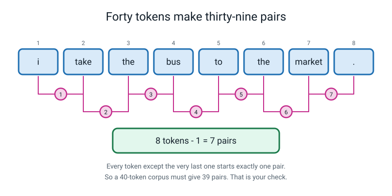
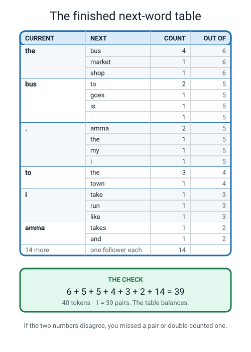
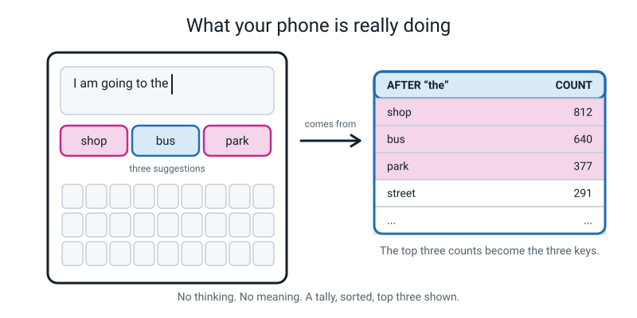
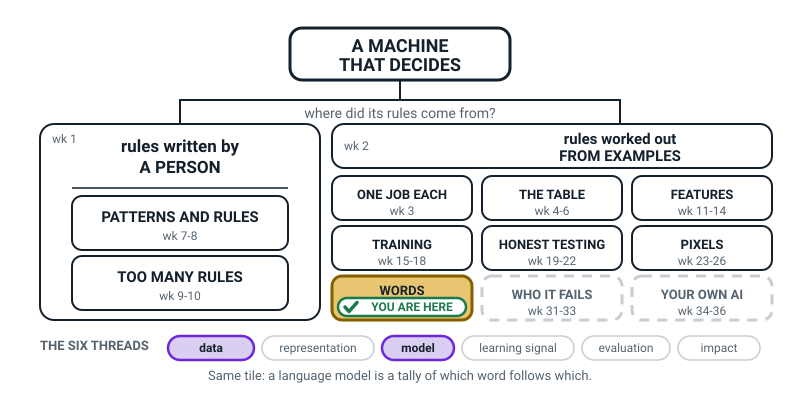
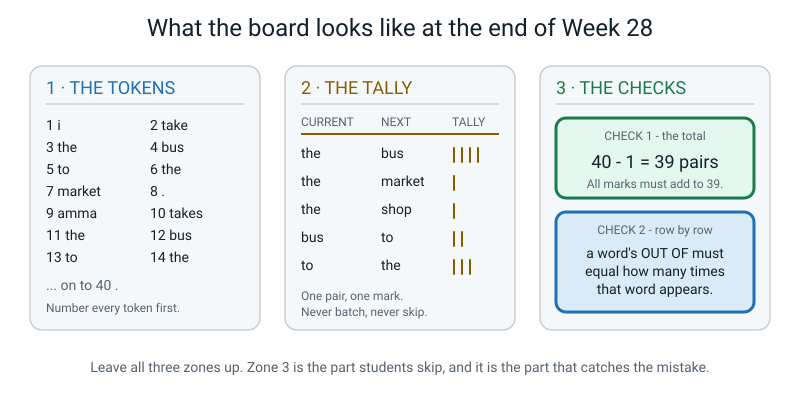
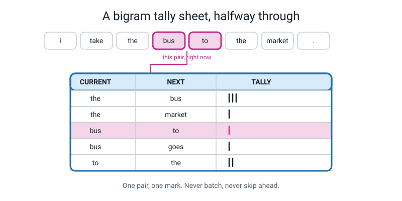
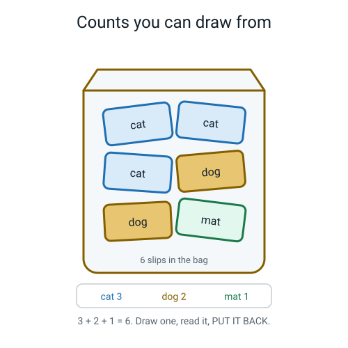

# Week 28 — Counting Word Pairs: The Whole Engine

[⬅ Week 27](week-27.md) · [Course Home](../README.md) · [Week 29 ➡](week-29.md) · [Student Guide](../student-guide/week-28.md) · [Workbook](../workbook/week-28.md)

---

## 📋 At a Glance

| | |
|---|---|
| **Duration** | 70 minutes |
| **Type** | 🟦 Teach |
| **Big idea** | A language model is a giant tally of which word tends to follow which — nothing more mysterious than that. |
| **New vocabulary** | word frequency · bigram · next-word prediction · language model |
| **Materials** | Pencil, eraser, 3 sheets of lined or squared paper, a ruler, the printed Bus Corpus sheet and the blank Tally Sheet (both in the Answer Key below), a phone or tablet with any typing app |
| **Tech needed** | One phone or tablet with a normal keyboard — that is all. No browser needed. No account, no install. |
| **Prep time** | 15 minutes the night before + 5 minutes on the day |

---

## 🎯 Lesson Objectives

By the end of this lesson your student can:

1. **Tally every bigram in a 40-token corpus by hand**, working strictly left to right, and finish with
   39 tally marks and no pair missed or double-counted.
2. **Turn a raw tally into a next-word table** with CURRENT, NEXT, COUNT and OUT OF columns, and use
   two arithmetic checks to prove the table is complete.
3. **Read a next-word table to answer questions** about what the model is likely to produce — which
   word is most common, which word has the most different followers, what will probably come next.
4. **Explain, out loud and unprompted, what a phone keyboard is doing** when it offers three
   suggestions above the keys.
5. Say what **word frequency**, a **bigram**, **next-word prediction** and a **language model** are,
   without notes.

---

## 🧑‍🏫 What YOU Need to Know First

*Read this once, slowly. About 15 minutes. It assumes you know nothing about AI. When you finish you
will genuinely understand how autocomplete works, and you will be able to teach it cold.*

### Idea 1 — the thing you already have: a list of tokens

Last week your student chopped sentences into **tokens**. A token is one countable piece of text —
usually a word, but a full stop counts as a token too. That is all "tokenize" means: chop text into
countable pieces and write down the rules you used.

This week we take that numbered list of tokens and do exactly one thing to it: **count**.

Nothing else. No cleverness is added. That is the honest, slightly astonishing point of the whole
lesson: everything your phone's keyboard does, and a very large part of what a chatbot does, is
counting, followed by looking the count up.

### Idea 2 — word frequency: the count that is not enough

> **Word frequency** — how many times each word appears in the text.

If you count words in almost any piece of English, the winners are always the same:
`the`, `and`, `a`, `to`, `of`, `i`. These are the words that carry almost no meaning on their own.

Word frequency is genuinely useful — it tells you what a text is about, it powers search engines, it
is how spam filters started. But it can **never** write a sentence, and it is worth being clear why.

Suppose you know that in some text `the` appeared 6 times, `bus` 5 times and `market` once. Now write
a sentence. You cannot. You know how often each word turned up, but you have no idea what sat *next
to* what. `bus the market` uses exactly the right words in exactly the right amounts and is nonsense.

Frequency knows *how much*. It does not know *where*.

### Idea 3 — bigrams: counting pairs instead of words

So count pairs.

> **Bigram** — two tokens that appeared next to each other, in that order.
> ("Bi" means two. "Gram" means a written thing. A bigram is a written two-some.)

The phrase `the bus` is a bigram. So is `bus to`. So is `to the`. Note carefully that **order
matters**: `hot dog` and `dog hot` are two different bigrams, and only one of them ever shows up in a
recipe. This is the entire reason pairs work where frequency fails — a pair carries a direction.

Here is the move that makes it work. Walk along your numbered token list, and every time you step from
one token to the next, that step is one bigram. Mark it. Step again. Mark again.


*Figure 28.1 — Every token except the very last one starts exactly one pair. That gives you a check you can do arithmetic on.*

**The check in that figure is the most valuable thing in this lesson**, so make sure you have it:

> **Number of bigrams = number of tokens − 1.**

Why? Because each token starts exactly one pair — the pair made of itself and the token after it. The
only token that cannot do this is the very last one, because there is nothing after it. So 8 tokens
give 7 pairs. 40 tokens give 39 pairs. 200 tokens give 199 pairs.

That single line of arithmetic is what turns a messy hand tally into something you can trust. Your
student will make a mistake today — everybody does — and this is what catches it.

> **🧑‍🏫 A decision we have made for you, and why:** we let pairs cross a full stop. So in
> `... the market . amma takes ...` we count `market → .` **and** `. → amma`. Some textbooks stop
> pairs at sentence boundaries instead. Both are defensible, but crossing has two real advantages for
> an 11-year-old. First, the arithmetic check stays beautifully simple: tokens − 1, full stop. Second,
> the `.` row of your table becomes genuinely interesting — its followers are exactly the words that
> start sentences, which is real, useful information the other method throws away. If your student
> asks whether that is "allowed", the honest answer is: it is a choice, we wrote it down, and we
> followed it consistently. That is the whole standard.

### Idea 4 — the next-word table

A raw pile of tally marks is not usable yet. Sort it, group it by the first word of each pair, and you
get the object that this entire lesson is about.


*Figure 28.2 — The finished next-word table for our 40-token corpus, with both checks written beside it.*

Read one group out of that figure slowly, because if you can read one group you can read any language
model ever built:

```
   CURRENT   NEXT      COUNT   OUT OF
   the       bus         4       6
             market      1       6
             shop        1       6
```

In plain English: *"In this text, the word `the` was followed by something six times. Four of those
times the next word was `bus`. Once it was `market`. Once it was `shop`."*

That is it. That is the whole data structure. A chatbot's version of this table is unimaginably bigger
and is stored as numbers rather than tally marks, but it answers the same question and it was built
the same way: by counting what followed what, in a very large amount of text.

**The second check.** There is a subtler check than tokens − 1, and it is the one that catches errors
the first check misses. For any word, its **OUT OF** number must equal **how many times that word
appears in the corpus** — minus one if that word happens to be the very last token. So if `bus` shows
up 5 times in the text, the `bus` group must have exactly 5 tally marks in it. If it has 4, you missed
a pair starting with `bus`. If it has 6, you counted one twice.

Run both checks and your table is almost certainly right. Run neither and it is almost certainly wrong.

### Idea 5 — next-word prediction, and why this counts as "a model"

> **Next-word prediction** — given the words so far, guess which word comes next.
> **Language model** — any system that predicts likely next words. Your tally sheet is one. So is a
> chatbot; it is just enormously bigger.

Now look at the table again and notice that you can *use* it. You are at the word `the`. You look up
the `the` group. Four out of six times, `bus` came next. So the best single guess for the next word is
`bus`. Say `bus`. Now you are at `bus`. Look up the `bus` group. Guess again.

That loop — guess a word, add it to the text, guess again — is the engine. Not an illustration of the
engine. The engine. Next week your student will run that loop with dice and produce sentences that
were never in the text.

**Why we are allowed to call a tally sheet a "model".** In Week 2 you and your student agreed on a
definition: a model is a thing that was built by looking at examples, which then makes guesses about
new cases. Your tally sheet qualifies on both counts. Nobody wrote its rules; it was built by counting
examples. And it makes guesses about text it has never seen. It is a small, honest, completely
transparent machine-learned model — the only one in this course whose insides you can read with your
eyes.

### Idea 6 — the phone keyboard, explained for good

This is the moment the lesson lands, so be ready for it.


*Figure 28.3 — The three keys above the keyboard are the top three rows of a next-word table, sorted by count.*

When your student types `I am going to the` and three suggestions appear, here is what happened:

1. Someone counted word pairs in an enormous amount of English text.
2. Your phone holds the resulting next-word table.
3. It looked up the group for the current word, `the`.
4. It sorted that group by count, biggest first.
5. It printed the top three onto three keys.

**No understanding. No meaning. No sentence plan.** A tally, sorted, top three shown. The reason
`shop` and `bus` and `park` come up after `the` is not that your phone knows anything about shops. It
is that in the text it counted, `the shop` happened 812 times and `the aardvark` happened never.

Two extra details worth having, because your student will ask:

- **Your keyboard also counts *your* messages.** That is why your best friend's name, your street, and
  your family's private nicknames start appearing as suggestions. Your own typing is a second, small
  corpus mixed into the big one. This is also, incidentally, a privacy question, and Week 32 handles it
  properly.
- **Tapping the middle suggestion repeatedly nearly always ends in a loop.** Something like
  *"...to the shop and get a new one for me to be able to see you and I will be there in a bit and I
  will be there in a bit and..."*. That loop is not a bug, and next week your student will prove
  exactly why it happens. This week, just get them to notice it and write it down.

### The two misconceptions you will hit today

**Misconception 1: "the machine understands the sentence, and the table is just a shortcut."**

This is the big one, and it is very hard to shake because the output is so convincing. The cure is not
argument, it is the tally sheet. Have your student point at the row that produced a word. There is
nothing else there. No meaning is stored anywhere on the page. If they say "but a real chatbot has more
than a table" — the honest answer is: it has a much better way of storing and blending the counts, and
it looks back at thousands of words instead of one, and it still has no step anywhere in it that checks
what is true. Concede the scale gap loudly. Do not concede the mechanism.

**Misconception 2: "a bigger count means a better word."**

Students slide from "`bus` has 4 marks" to "`bus` is the right answer" to "`bus` is a better word than
`market`". It is not. Four marks means *more common in this particular text*, and nothing else. `the`
is the most common word in English and it is the least informative. Say this out loud: **frequency
measures how often, never how good.**

### How deep to go, and where to stop

**Go this deep:**
- Tokens → pairs → grouped table → look up a group → read off the counts.
- Both arithmetic checks, done for real, on a real tally the student made.
- The keyboard explanation, in the student's own words, with no prompting.

**Stop before all of these — they are later weeks:**
- Generating sentences, dice, randomness, greedy versus sampling → **Week 29**. If a student starts
  making sentences early, that is wonderful; write it on the board as "next week" and move on.
- Hallucination and fluent-but-false → **Week 29**. Do not spoil it. The trap only bites if they walk
  into it themselves.
- Trigrams and longer memory → **Week 30**.
- Whose words the table learned from, and privacy → **Weeks 31 and 32**.

**Do not attempt today:** probabilities as percentages. The workbook deliberately asks for "4 out of 6"
and never for "67%". Counts are concrete; percentages add arithmetic that gets in the way of the idea.
Percentages arrive naturally next week when they start rolling dice.

---

### 🧭 The Growing Map

The tinted tile stays on **WORDS** for a second week, and the change is entirely in the thread strip:
**model** has joined **data**. That is a precise description of today — last week they collected, today
they build, and the thing they build turns out to be a table.



*Figure 28.0 — Week 28's version. WORDS still tinted and badged, with **data** and **model** lit along
the bottom.*

**What to do with it, in about two minutes at the end of the lesson:**

1. **Show it and ask:** *"which bit did we do today — we're still in the same shaded box, so what
   changed?"* Point at the strip. **Model** is new. Then the payoff question: *"so where is the model
   in what we made today?"* The answer is *the table is the model*, and it is worth waiting for.
2. **Then the better question:** *"why is TRAINING already finished and plain, when we just made
   something that predicts?"* Because nobody trained this one — you **counted** it. Tallying and
   training are two different ways to end up with a model, and they have now met both.
3. **Have them shade WORDS again** and write one bigram from their own tally, with its count, in the
   margin of their map. A pair plus a number is the entire week in six characters.

> **🧑‍🏫 Why this is worth two minutes.** This is the week the word "model" stops being mystical, and
> that only lands if they can see the tally sheet sitting on the same branch as TRAINING and FEATURES
> rather than in a world of its own. Students who miss this connection spend the rest of the year
> believing language models are a separate kind of magic.

**The six threads** along the bottom are the spine of all four levels. **Data** and **model** are lit
this week. Do not quiz them on the threads; the map is orientation, never assessment.

---

## 🧰 Prep Checklist

### 15 minutes, the night before

- [ ] **Print two sheets** from the Answer Key at the bottom of this file: the **Bus Corpus sheet**
      (the 40 tokens, numbered, with plenty of space) and a **blank Tally Sheet** (three ruled columns:
      CURRENT · NEXT · TALLY). Print two copies of the tally sheet — the first one always gets messy.
- [ ] **Do the tally yourself.** Yes, really — all 39 marks, by hand. It takes eleven minutes and it is
      the difference between teaching this well and reading it aloud. You will discover where it gets
      confusing, which is exactly the part your student will hit.
- [ ] **Check your answer against Figure 28.2** and against the full table in the Answer Key.
- [ ] **Decide which pair you will deliberately get wrong.** The lesson plan uses the pair
      `. → the` (tokens 16 → 17, the jump from the end of sentence 2 into sentence 3). Skipping a pair
      that crosses a full stop is the mistake real people actually make, which is why we stage it.
- [ ] **Test the phone.** Open a messaging or notes app, type `I am going to the`, and check that three
      suggestions appear above the keys. On some devices the suggestion strip is switched off — find
      Settings → Keyboard → Predictive / Suggestions and turn it on now, not in the lesson.

### 5 minutes, on the day

- [ ] Rule up the board in three zones, left to right, exactly as in Figure 28.4 below.
- [ ] Put the pencil, eraser, ruler and both printed sheets on the desk.
- [ ] Put the phone face down on the desk. Do not hand it over until minute 48. It is the reward.


*Figure 28.4 — The board plan. Three zones, left to right, all three still visible at the end.*

### If something fails

| If this fails | Do this instead |
|---|---|
| **No phone available at all** | Use Figure 28.3 as the phone. It shows a real suggestion strip and the counts behind it. Ask the student to read the three suggestions off the picture and explain where they came from. You lose the delight of the fifteen taps; you lose none of the concept. |
| **The phone shows no suggestion strip and you cannot turn it on** | Use Figure 28.3 as the phone — read the three drawn suggestions off it and have the student explain where they came from. Then do the fifteen taps on your own phone with the student watching over your shoulder and calling out each word as it appears. They still get the loop, and they still write down the sentence. |
| **The student's hand tally collapses into a mess** | Stop. Hand them the second blank tally sheet. Restart from token 1, and this time *you* read the token numbers aloud one at a time while they mark. Pace beats independence today. |
| **You are running badly over time** | Cut the phone segment to three minutes: type the prompt, tap five times not fifteen, and set "tap it fifteen times and write the sentence" as extra homework. Never cut the two checks. |

---

## ⏱️ The Lesson, Minute by Minute

| # | Segment | Minutes | Running total |
|---|---|---|---|
| 1 | 🪝 Hook — Predict my next word | 8 | 8 |
| 2 | 🧠 Concept — Frequency is not enough, so count pairs | 18 | 26 |
| 3 | 🔍 Worked example together — the first eight tokens, on the board | 14 | 40 |
| 4 | 🎲 Activity — Tally a Paragraph by Hand, then the phone | 20 | 60 |
| 5 | 🔑 Wrap & assign | 10 | 70 |

---

### 1 · 🪝 Hook — Predict my next word (8 min)

**Say this:**

> "I am going to say a sentence, and I am going to stop in the middle. Your job is to shout the next
> word. Ready.
>
> *Once upon a…*
>
> Right — 'time'. Everybody says 'time'. Now this one: *I need to catch the…*
>
> You said 'bus'. Some people say 'train'. Nobody says 'aardvark'. Here is my question, and I want you
> to be honest: **how did you know?** You didn't understand my sentence — I hadn't finished it. You
> didn't know what I meant, because I hadn't said it yet. So what did you actually use?"

Let them flounder for a moment. Then:

> "Here's my guess about what you used. You have heard 'once upon a time' about four hundred times in
> your life, and 'once upon a banana' zero times. You weren't thinking. You were **counting**, without
> noticing, using a tally you have been building since you were two years old.
>
> Today we build that tally on paper. And by the end of the hour you are going to know exactly what
> your phone is doing when it offers you three words above the keyboard — not roughly, exactly."

**Do this:**

- Write on the far left of the board, in big letters: `Once upon a ____` and `catch the ____`.
- Under them write: **"How did you know?"** Leave it up all lesson. You will come back to it in the wrap.
- Do **not** show the phone yet. Do not mention the tally sheet yet.

**Ask this:**

| Ask | Hoping for | If they say something else |
|---|---|---|
| "What's the next word: *once upon a…*?" | "time" | Any answer is fine — even a silly one proves the point. Ask "would most people say that?" and they will say no, which is the same insight arriving from the other direction. |
| "How did you know it was 'time'?" | "Because that's how the sentence goes" / "I've heard it before" | If they say "because I understood it" — push gently: "but I hadn't finished the sentence, so what was there to understand?" That is the whole hook in one question. |
| "Could you predict the next word in a language you don't speak?" | "No" | If they say yes, ask them to try one. They can't. Then: "so prediction needs experience of that language. It needs having heard a lot of it. Hold on to that." |

---

### 2 · 🧠 Concept — Frequency is not enough, so count pairs (18 min)

**Say this — part one, frequency:**

> "Here is a short story. It is our text for today. In this course we call the text you learn from a
> corpus, which just means a body of text.
>
> *I take the bus to the market. Amma takes the bus to the shop. The bus goes to town. My bus is very
> late. Amma and I run to the bus. I like it.*
>
> Last week you learned how to chop that into tokens. Lowercase everything, and the full stop is its
> own token. If you do that you get exactly **40 tokens**. I've printed them out, numbered, so we don't
> have to argue about it.
>
> Now. The first thing anyone does with a list is count it. Let's count how many times each word turns
> up. That's got a name: **word frequency** — how many times each word appears.
>
> `the` appears 6 times. `.` appears 6 times. `bus` appears 5 times. `to` appears 4 times. `i` appears
> 3 times. `amma` appears twice. And then fourteen words appear exactly once each.
>
> Six plus six plus five plus four plus three plus two is twenty-six, plus fourteen is forty. Good —
> our frequencies add up to the number of tokens, so we didn't lose anything.
>
> Now here is a challenge. Using only that frequency list — only *how often* each word appears — write
> me a sentence."

Wait. Let them try. They will produce something like `the bus the to bus`.

> "Right. It's rubbish, and it's not your fault. Frequency tells you **how much** of each word there
> is. It tells you absolutely nothing about **where** each word goes. It's like being handed the
> shopping list for a cake with no recipe. All the right stuff, no idea of the order."

**Say this — part two, pairs:**

> "So we count something better. We count **pairs**.
>
> A pair of words that turned up next to each other has a name: a **bigram**. 'Bi' means two, 'gram'
> means a written thing. `the bus` is a bigram. `bus to` is a bigram. `to the` is a bigram.
>
> And here is the bit that makes pairs work where single words failed: **a pair has a direction.**
> `hot dog` is a thing. `dog hot` is not a thing. `ice cream` is a thing. `cream ice` is not. The order
> is half the information, and frequency threw it away.
>
> Now, how do you find all the bigrams? You don't hunt for them. You walk. Put your finger on token 1.
> Token 1 and token 2 together — that's a bigram. Slide your finger to token 2. Tokens 2 and 3 — that's
> the next bigram. Slide again. You never skip, you never jump, you never go backwards. Left to right,
> one step at a time, all the way to the end.
>
> How many will you get? Let's think, not guess. Every token starts one pair — itself, plus whatever
> comes after it. Every token except… which one?"

**Ask this:**

| Ask | Hoping for | If they say something else |
|---|---|---|
| "Which token can't start a pair?" | "The last one" | If they say "the first one" — hand them the sheet and point at token 1 (`i`) and token 2 (`take`). "Does `i take` exist? Then token 1 did start a pair." Then ask about token 40 and they will get it. |
| "So how many pairs from 40 tokens?" | "39" | If they say 40, ask them to try it on a tiny example: hold up two fingers. "Two tokens. How many pairs?" One. "Three tokens?" Two. The pattern arrives on its own. |
| "Why does that number matter to us?" | "So we can check we didn't make a mistake" | If they shrug, say it plainly: "Because in nine minutes you are going to make 39 tally marks by hand and you will get one of them wrong. This number is how we find out." Say it as a promise, not a warning. |

**Do this:**

- Write in zone 3 of the board, boxed: **`40 tokens − 1 = 39 pairs`**. Box it. It is the check.
- Write in zone 2 of the board the three column headings, wide apart: **CURRENT · NEXT · TALLY**.
- Say out loud, pointing at the headings: *"CURRENT is where you are. NEXT is where you went. Never
  write a pair without both headings in front of you, or you will get the direction backwards."*
- Hand over the printed Bus Corpus sheet with the 40 numbered tokens.

---

### 3 · 🔍 Worked Example Together — the first eight tokens, on the board (14 min)

This is the segment where the deliberate error happens. Do not rush it and do not skip the error — the
error *is* the teaching.

**Say this:**

> "I'll do the first sentence on the board, out loud, and you tell me if I go wrong. Sentence one is
> tokens 1 to 8: `i take the bus to the market .`
>
> Finger on token 1. `i`, then `take`. So CURRENT is `i`, NEXT is `take`. New row. One mark.
>
> Slide. Token 2 to token 3: `take` then `the`. New row: CURRENT `take`, NEXT `the`. One mark.
>
> Slide. `the` then `bus`. New row: `the` → `bus`. One mark.
>
> Slide. `bus` then `to`. New row. One mark.
>
> Slide. `to` then `the`. New row. One mark.
>
> Slide. `the` then `market`. Now careful — I already have a row starting with `the`. But that row says
> `the → bus`, and this pair is `the → market`. Different pair, different row. `the` gets **two** rows,
> because `the` was followed by two different things. That's normal. Common words get lots of rows.
>
> Slide. `market` then `.` — yes, the full stop counts, it's a token like any other. One mark.
>
> That's seven marks, from eight tokens. Eight minus one is seven. Sentence one checks out."


*Figure 28.5 — Mid-tally. The pointer shows the pair being counted right now, and the arrow shows which row gets the mark.*

**Say this — the deliberate error:**

> "Right, sentence two. `amma takes the bus to the shop .` — tokens 9 to 16. I'll go faster.
>
> `.` then `amma` — wait, no. We're at token 9 now, so… let's start at `amma`. `amma → takes`, mark.
> `takes → the`, mark. `the → bus` — already have that row, second mark on it. `bus → to`, second mark.
> `to → the`, second mark. `the → shop`, new row, mark. `shop → .`, new row, mark.
>
> Seven more marks. Fourteen so far. On to sentence three: `the bus goes to town .`"

Now go quiet and wait. If your student catches it — brilliant, celebrate loudly. If not, finish all
six sentences at speed, tally them up, and let the check do the work:

> "Let's add up every mark on the board… I get **38**. But we predicted **39**.
>
> One of those numbers is wrong, and it isn't the 39, because 40 minus 1 is 39 no matter how tired I am.
> So I dropped a pair. Where?"

**Do this:**

- Walk back through the token list with your finger, out loud, at the sentence joins: *"…token 8 is
  `.`, token 9 is `amma` — did I count `. → amma`? Yes, there it is. Token 16 is `.`, token 17 is
  `the` — did I count `. → the`?"* Silence. Then: *"No. I jumped from the end of sentence two straight
  into sentence three and skipped straight over the join."*
- Add the missing mark to the `. → the` row. Re-total. **39.**
- Then write on the board, and make them copy it: **"Pairs cross full stops. The join is a pair too."**

**Say this — the second, sneakier error:**

> "Now here's the uncomfortable part. That check found a **missing** pair. But suppose instead of
> missing one, I had written a pair backwards — say I'd written `bus → to` when I should have written
> `to → the`. How many marks would be on the board?"

**Ask this:**

| Ask | Hoping for | If they say something else |
|---|---|---|
| "How many marks if I write a pair backwards?" | "Still 39" | If they're not sure, count it with them: one mark went down either way. The total is blind to direction. |
| "So does our check catch it?" | "No!" | Let this land. It should feel slightly alarming. "A check that passes doesn't mean you're right. It means you didn't fail *that particular* check." |
| "What could catch it, then?" | Anything in the right direction | Give them the second check: "`bus` appears 5 times in the text. So the `bus` group must have exactly 5 marks. If it has 6, I put a mark in the wrong group. Every word, checked against its own frequency." Write it in zone 3. |

**Do this:**

- Write in zone 3, boxed, under check 1: **"CHECK 2 — a word's OUT OF = how many times that word
  appears."**
- Then run check 2 on the board for two groups: `the` should have 6 marks (it does: 4 + 1 + 1), `bus`
  should have 5 (it does: 2 + 1 + 1 + 1).
- Finish the table on the board for the six busy words only — `the`, `.`, `bus`, `to`, `i`, `amma` —
  and write "14 more words, one follower each" underneath, exactly as in Figure 28.2. Copying out all
  20 groups on a board wastes eight minutes you need for the activity.

---

### 4 · 🎲 Activity — Tally a Paragraph by Hand, then the phone (20 min)

Full instructions are in the next section. In the lesson flow it runs like this:

**Minutes 0–12 — the tally.** The student does the whole 40-token corpus themselves, on their own
sheet, from token 1. Yes, you just did some of it on the board; doing it again with their own hand is
the point. Your job for twelve minutes is to sit next to them, say nothing, and resist fixing things.

> **💡 Try this:** if they get stuck or messy, do not take the pencil. Instead read the token numbers
> aloud in a steady rhythm — *"nine… ten… eleven…"* — and let them mark. Almost every tally failure is
> a pacing failure, not an understanding failure.

**Minutes 12–15 — the two checks.** Total the marks. Compare with 39. Then check three groups against
their frequencies. If a check fails, they find the error themselves, using the same finger-walk you
demonstrated. Do not tell them where it is. Finding your own error is a skill, and this is the safest
possible place to practise it.

**Minutes 15–20 — the phone.** Now the reward.

**Say this:**

> "Put your pencil down. Take the phone. Open the notes app.
>
> Type exactly this: `I am going to the` — and then stop typing. Don't press anything else.
>
> Look above the keyboard. Three words. Read them out.
>
> Now: tap the **middle** one. Don't choose it, don't think about it — just tap the middle. Tap the
> middle again. And again. Fifteen times. Write down the sentence it produces, exactly, including
> anything stupid.
>
> Now the real question. **That phone has a tally sheet inside it. What is on the tally sheet?**"

**Do this:**

- Hold up their tally sheet in one hand and the phone in the other. Physically, side by side.
- Show Figure 28.3 and let them match the three suggestions on their phone to the three top rows in the
  drawn table.
- Have them write the fifteen-tap sentence into the workbook, unedited.

**Ask this:**

| Ask | Hoping for | If they say something else |
|---|---|---|
| "What's on the phone's tally sheet?" | "Word pairs and counts" / "which word comes after which" | If they say "the whole internet" — good instinct, wrong object. "Close. Somebody read an enormous amount of text and *counted pairs* in it. What's stored isn't the text, it's the counts." |
| "Why are there exactly three suggestions?" | "It shows the top three counts" | If they don't know, ask: "if a word had eight different followers, which three would you print?" They'll say the biggest three. Correct — and that is literally the rule. |
| "Did the sentence you made say anything true?" | "No" / "sort of" | Whatever they say, write their sentence on the board and leave it. Do not explain it. This is next week's hook and you want it sitting there, unresolved. |
| "Did it start repeating itself?" | "Yes, it went round in a circle" | If it didn't loop, ask them to tap fifteen more times; it almost always will. Write the loop on the board too. Also next week. |

---

### 5 · 🔑 Wrap & Assign (10 min)

**Say this:**

> "Back to the question I put on the board at the start: *how did you know* the next word was 'time'?
>
> You now have a much better answer than you did an hour ago. You have heard a huge amount of English,
> and somewhere in your head is something behaving like a tally of what follows what. You didn't build
> it on purpose. It got built by exposure.
>
> And the four words we learned today are the whole thing:
>
> **Word frequency** is how often each word appears. Useful, but it can't write a sentence.
>
> A **bigram** is two words that appeared next to each other, in order. Direction included.
>
> **Next-word prediction** is guessing what comes next from what came before. That's what your phone
> did fifteen times in a row.
>
> And a **language model** is any system that predicts likely next words. Here is the thing I want you
> to say out loud: *the sheet of paper in front of you is a language model.* It's tiny, it's made of
> pencil marks, and it works. A chatbot is the same idea with more counting.
>
> One last thing. Look at the row that made your phone say a word. Look at it hard. Is there anything
> on that row about what the word **means**?"

Let them look. There isn't.

> "No. There's a word, another word, and a number. That's all a next-word table has ever had. Remember
> that, because next week we're going to make it say something that sounds perfect and is completely
> untrue — and you'll be able to point at exactly which two rows did it."

**Do this:**

- Have the student write the four vocabulary words and their own one-line definitions in the workbook
  glossary box. Their own words, not yours. If a definition is wrong, ask a question rather than
  correcting it.
- Leave all three board zones up if you can, or photograph them. Week 29 uses this exact table.
- Assign the homework as written in the Homework section below.

---

## 🎲 The Activity, In Full

### Tally a Paragraph by Hand

**What it is:** the student converts a 40-token text into a complete next-word table using nothing but
a pencil, a ruled sheet and their own finger, then proves the table is correct with two arithmetic
checks, then explains a phone keyboard using what they just built.

**Time:** 20 minutes (12 tally · 3 checks · 5 phone)

**Materials:**
- The printed **Bus Corpus sheet** — 40 numbered tokens (in the Answer Key)
- A printed **blank Tally Sheet** — three ruled columns: CURRENT · NEXT · TALLY. Print two.
- Pencil with a working eraser. Not a pen. They will need to erase.
- A ruler, for ruling the columns if you would rather they drew their own
- A phone or tablet with a keyboard suggestion strip

### Setup

1. Corpus sheet on the left of the desk, tally sheet on the right, pencil in hand.
2. Before a single mark is made, the student writes at the top of the tally sheet:
   **`40 tokens − 1 = 39 pairs`**. The prediction goes down *before* the work. This is not decoration;
   a prediction you wrote afterwards is not a prediction.
3. Phone face down, out of reach.

### The rules, read aloud before starting

1. **Start at token 1.** Not wherever looks easiest.
2. **One pair, one mark.** Never two marks at once, never a mark "for later".
3. **Never skip a full stop.** The `.` is a token. The join between two sentences is a pair.
4. **Never jump backwards.** If you lose your place, go back to the last token number you are certain
   of and restart from there.
5. **Same pair, same row.** If `the → bus` already has a row, add a mark to it. Do not start a new one.
6. **Different next word, different row** — even if the current word is the same.

### The corpus

```
   I take the bus to the market. Amma takes the bus to the shop.
   The bus goes to town. My bus is very late.
   Amma and I run to the bus. I like it.
```

Tokenizing rules, printed at the top of the corpus sheet:

```
   1. Lowercase everything.
   2. The full stop is its own token.
   3. There is no other punctuation in this text.
   4. Pairs may cross a full stop. The corpus is one long stream of 40 tokens.
```

### Step by step

**Step 1 (1 min) — write the prediction.** `40 − 1 = 39`. At the top. In ink if you like.

**Step 2 (12 min) — walk and mark.** Finger on token 1. Read tokens 1 and 2 aloud. Find or create the
row. One mark. Slide to token 2. Repeat 38 more times.

**Step 3 (2 min) — total the marks.** Count every mark on the sheet. Write the total next to the
prediction. If it is 39, say so out loud. If it is not, go to step 4.

**Step 4 (2 min, only if needed) — hunt the error.** Two techniques, in this order:
- Walk the six sentence joins first: tokens 8→9, 16→17, 22→23, 28→29, 36→37. Missed joins are the
  commonest error by a distance.
- Then check each group against the word's frequency: `the` must have 6, `.` must have 5, `bus` 5,
  `to` 4, `i` 3, `amma` 2. The group that is short or long tells you where to look.

**Step 5 (1 min) — add the OUT OF column.** For each group, write the group total beside every row in
it. `the → bus  4  out of 6`. This is what makes the table readable next week.

**Step 6 (5 min) — the phone.** Type `I am going to the`. Read out the three suggestions. Tap the
middle one fifteen times. Write the resulting sentence, unedited. Then answer out loud: *what tally
must be sitting behind those three keys?*

### What "finished" looks like

- 39 tally marks, and the student **knows** there are 39 because they counted, not because they hoped.
- 20 row groups (or the 6 big ones plus a written note that 14 words have one follower each).
- Every group has an OUT OF number, and every OUT OF number matches that word's frequency.
- A fifteen-word-or-so nonsense sentence from the phone, written down unedited.
- The student can answer "what's inside the phone?" in one sentence without looking at their notes.

### Variation — easier

Use only the **first three sentences** — tokens 1 to 22. The prediction becomes `22 − 1 = 21 pairs`,
which is a nine-minute job instead of a twelve-minute one, and the resulting table still has a `the`
group with three different followers, so nothing conceptually is lost.

Two further supports, use either or both:
- **Pre-rule the rows.** Hand them a tally sheet with `the`, `bus`, `to`, `i`, `amma` and `.` already
  written in the CURRENT column. Deciding *whether to start a new row* is the hardest micro-skill in
  this activity, and removing it lets them practise the marking.
- **You read, they mark.** You call token numbers and words in a steady rhythm; they only make marks.
  This is not cheating. It is scaffolding, and it usually gets removed by itself after a dozen pairs.

### Variation — harder

Three genuine extensions, in increasing order of difficulty:

1. **The sorted table.** Rewrite the finished table with the groups in order of size, biggest first,
   and each group's followers in order of count. Then answer: which three words would a phone
   keyboard offer after `the`? (Answer: `bus`, then `market` and `shop` tied for second and third.)
2. **The dead ends.** Find every word in the table whose only follower is `.`. What do those words
   have in common? (`market`, `shop`, `town`, `late`, `it` — they are all the last word of a sentence.
   A next-word table quietly learns which words end sentences, without ever being told what a sentence
   is.)
3. **The other rule.** Redo the tally with the *other* choice: pairs may **not** cross a full stop.
   Predict the new pair count first. (Answer: 40 tokens − 6 sentences = 34 pairs. The `.` group
   disappears entirely, and with it all the information about which words start sentences.) Then write
   two sentences on which rule you prefer and why. This is a genuinely open question and a good answer
   can go either way.

---

## ❓ Questions Students Ask This Week

**1. "Does my phone store every message I've ever sent?"**

Not as messages, no — but it does keep counts drawn from them, and that is why your friends' names and
your family's private words show up as suggestions. On most modern phones that personal tally lives on
the phone itself rather than on a company's computer, which is better than the alternative but is not
the same as nothing. This is a real question with real stakes and we spend a whole lesson on it in
Week 32. Good instinct for asking now.

**2. "Why only three suggestions? Why not ten?"**

Because three is about how many you can read without slowing down your typing, and because the fourth
guess is nearly always much weaker than the third. Look at Figure 28.3: `shop` 812, `bus` 640, `park`
377, `street` 291. The gap from first to third is big; after that the counts trail off into a long tail
of hundreds of possible words with tiny counts each. Printing them wouldn't help you. It's a design
choice about screens and thumbs, not a mathematical law.

**3. "What if a word appears in the text but never has anything after it?"**

Then it has no group at all, and if a generator ever lands on it, it is stuck. In our corpus exactly
one token has this problem: the final `.`, token 40. It is the last thing in the text, so nothing ever
followed it. Notice that `.` still *has* a group — five marks' worth — because the other five full
stops all had words after them. It is the specific final one that contributes nothing. This is why the
check is tokens − 1 and not tokens.

**4. "Is the phone's table bigger than mine?"**

Yes, by an amount that is hard to make feel real. Your sheet has 20 different words. A phone keyboard
knows tens of thousands. A large chatbot was built from text containing hundreds of billions of tokens.
But — and this is the part worth saying slowly — **it is the same kind of object**. Rows, followers,
counts. If you understand your sheet you understand the shape of the big one. The gap is size, not
mystery.

**5. "Could I make a tally of a whole book?"**

By hand, no — you would die of boredom first. Two hundred pages is roughly 60,000 tokens, so about
59,999 pairs, at maybe three seconds a pair. That is fifty hours of tallying without a single break.
A computer does it in under a second, and that is genuinely the only thing the computer is better at
here: it is not smarter, it is just not bored. Doing forty by hand and then imagining sixty thousand
is exactly the right way to feel what a computer adds.

**6. "Does the tally know what a bus is?"**

No. And this is worth being blunt about, because the output is so convincing that people slide into
assuming otherwise. Look at your own sheet: there is a word, a second word, and a number of marks.
Nothing about wheels, nothing about being late, nothing about buses at all. If we replaced every word
in the corpus with a nonsense syllable, the table would be exactly as good at its job. Meaning was
never in the table, so it was never lost from the table.

**7. "How does the phone know what *I* am about to say, not just what people in general say?"**

Partly it doesn't, and partly it does. Most of its table came from an enormous pile of general text —
that part treats you like an average English speaker. On top of that it keeps a smaller tally of your
own typing, and when a pair you use often disagrees with the general table, yours can win. That is why
your best friend's unusual name eventually beats a common word. Two tables, blended, with the personal
one gradually earning influence.

**8. "Do brains actually do this? Is my head really counting words?"**

**Nobody knows for sure, and it is worth understanding why not.** We know something in your head
predicts upcoming words, because it is measurable — your reading slows down at unexpected words, and
you can hear a wrong note in a familiar phrase instantly. So prediction is definitely happening. But
whether your brain stores anything like counts of pairs is genuinely unsettled. Nobody can open a brain
and read the table off, the way you can read yours off a sheet of paper. Brains also do plenty that
next-word counting obviously cannot: you know what a bus *is*, you can ride one, you can be annoyed
when it's late. So the honest answer is: prediction, yes, certainly. Counting pairs, maybe something
distantly like it. The same table? No evidence at all. When somebody tells you confidently that
"chatbots work just like the brain", they are going well past what anyone actually knows.

---

## ⚠️ Where This Lesson Goes Wrong

| What happens | Why | What to do right now |
|---|---|---|
| The student skips the pairs that cross a full stop and lands on 34 marks instead of 39 | The full stop looks like a wall, not a token. Every human reader has been trained since infancy to stop there | Do not just tell them. Have them walk the five joins with a finger — 8→9, 16→17, 22→23, 28→29, 36→37 — and count how many marks they add. Five. Then write "pairs cross full stops" on the board and make them copy it |
| Total comes to 39 but the table is wrong, because a pair was written backwards | The total check is blind to direction — one mark either way | Introduce check 2 immediately: each group's size must equal that word's frequency. Then have them fix the group that is one too big and the one that is one too small. This pair of errors always comes together |
| The student starts a second row for `the → bus` instead of adding a mark to the existing one | The rows aren't sorted, so the existing row is halfway up the page and easy to miss | Stop and reorganise: leave four blank lines under each CURRENT word so its followers cluster. Ten seconds of layout saves five errors. Better still, hand them the pre-ruled sheet from the "easier" variation |
| They batch — reading five pairs and then making five marks | It feels faster and grown-up | It is the single most reliable way to lose a pair. Say the rule out loud as a chant: "one pair, one mark." Then have them redo the last sentence at the slow pace so they can feel the difference in accuracy |
| The phone shows no suggestion strip and the segment dies | Predictive text is off by default on some devices, and some keyboard apps hide it in a submenu | This is why it is on the prep list. If it happens anyway, use Figure 28.3 as the phone and demonstrate on your own device. Do not spend lesson minutes in Settings |
| They start writing sentences from the table and stop tallying | The generation idea is far more exciting than the counting idea, and they have spotted it early | This is a good problem. Say: "You've just found next week. Write your sentence on the board with your name on it and we'll check it in Week 29." Then get them back on the tally. Do not teach sampling today — the dice and the loops need a full lesson |
| They conclude `bus` is a "better" word than `market` because it has more marks | The number sits right there looking like a score | Say it flatly: "frequency measures how often, never how good." Then the killer example: `the` is the most common word in English and means almost nothing. More marks means more common in this text. Nothing else |
| Twelve minutes in, the sheet is an unreadable mess and morale is gone | Hand-tallying is genuinely hard and nobody warned them | Hand over the second blank sheet without commentary, switch to the "you read, they mark" mode, and shorten to tokens 1–22. Getting 21 pairs right beats getting 39 pairs into a state nobody can check |

---

## 🧭 Differentiation

### If they are struggling

**Cut:** the second, sneakier error (backwards pairs and check 2). It is a beautiful idea and it can
wait for Week 29, where the trace tables make it concrete again. Cut also the OUT OF column — counts
alone carry today's objective.

**Shrink:** run the activity on tokens 1–22 only, with the prediction `22 − 1 = 21`.

**Reteach, in this order:**
1. **Two tokens, one pair.** Hold up two objects on the desk — a pencil and an eraser. "Pencil then
   eraser. That's one pair. Now add a ruler. Pencil-eraser, eraser-ruler. Two pairs." Build to five
   objects physically before touching any words.
2. **Then a three-word sentence.** `i like it` — three tokens, two pairs, done in twenty seconds on a
   scrap of paper. Success at tiny scale first.
3. **Then one sentence of the corpus.** Eight tokens, seven pairs, with you calling the numbers.
4. **Then the rest.** By now the motion is automatic and the rest is stamina, not thinking.

**Non-negotiable:** they must finish with a table they made themselves, however small, and be able to
point at the row that made their phone say a word. Everything else is optional today.

### If they are flying

Do not hand them more tallying. Hand them these, in order:

1. **"Which word in the table is the most *unpredictable*?"** They will need to define unpredictable
   themselves — the word with the most different followers, or the one whose biggest count is the
   smallest share of its group. Both are defensible and the argument is the exercise. (`the` has three
   different followers but is 4-out-of-6 predictable; `i` has three followers each 1-out-of-3, so `i`
   is far less predictable. That is a real and slightly surprising result.)
2. **"Which words can only ever appear at the end of a sentence?"** Then: how did the table learn that,
   given nobody told it what a sentence is?
3. **"Invent a sentence my table could make that is not in the corpus."** Do not let them write it
   down and do not discuss whether it is true — say "hold that thought for exactly one week". This is
   the Week 29 hook and them arriving at it early is a gift, not a problem.
4. **"How many rows would a table need to cover every pair in English?"** Rough numbers: perhaps 50,000
   common words, so 50,000 × 50,000 = **2.5 billion** possible pairs. Then the interesting part: almost
   all of those pairs never occur, so the real table is far smaller than the theoretical one — but the
   ones that do occur are still in the hundreds of millions. This connects straight back to Week 10's
   rule explosion and it is worth naming that connection out loud.

### If they won't engage today

Lead with the phone, not the pencil. Reverse the whole lesson.

Hand it over in the first minute. "Type `I am going to the` and tap the middle word twenty times.
Read me what you get." It is genuinely funny, it needs no buy-in, and it produces something absurd they
will want to show someone.

Then: "Bet you can't guess how it did that." Take a guess. Take a second guess. Then: "It's simpler
than anything you just said, and I can prove it in six words on paper."

Do the first sentence of the corpus with them — seven pairs, three minutes, you holding the pencil and
them telling you what to write. That is a complete lesson on a bad day: they have seen the mechanism,
they have laughed at the output, and they can say what is inside a keyboard. The 39-pair tally can move
to homework, or to the start of next week, or be dropped in favour of the 21-pair version. It is not
worth a fight.

---

## ✅ Assessing Understanding

Three checks, last five minutes, exact wording given. Do all three; each takes about ninety seconds.

### Check 1 — read the table

**Say exactly:** *"Look at your own table. I'm at the word `bus`. Tell me every word that could come
next, and how likely each one is."*

**A good answer:** "`to`, `goes`, `is`, and a full stop. `to` happened twice out of five, the other
three happened once each out of five." They may say "2 out of 5" or "twice" — both fine. What you need
is (a) all four followers named, and (b) the counts attached to them, and (c) an awareness that the
group total is 5.

**Not yet:** naming only `to`, or naming followers with no counts. Prompt with: "Is `to` the *only*
thing that ever came after `bus`?"

### Check 2 — the check that catches mistakes

**Say exactly:** *"Your friend tallied a 100-token story and got 105 tally marks. Without looking at
their sheet, what do you know?"*

**A good answer:** "They're wrong. It should be 99, because 100 tokens minus 1. They double-counted
six pairs, or they counted some pairs twice, or they invented some." The key phrase you are listening
for is **tokens minus one**. Bonus credit if they add "and even if they'd got 99 I still couldn't be
sure they were right" — that is check 2 understood.

**Not yet:** "they should check their work." Prompt: "But what number *should* it be? Can you work it
out without seeing their story?"

### Check 3 — the keyboard, in their own words

**Say exactly:** *"Explain to me, in about three sentences, what your phone is doing when it shows you
three words above the keyboard. Pretend I have never used a phone."*

**A good answer:** "Somebody counted which word follows which word in a huge amount of text. My phone
has that table. It looks up the word I just typed, finds the three followers with the biggest counts,
and puts them on the keys." Three moving parts: a count that was made earlier, a lookup on the current
word, top-three-by-count.

**Not yet:** "It knows what I want to say" or "it guesses using AI". Both are the misconception, not
the answer. Prompt: "Where did the guess come from? What did somebody have to do first?"

### Mastery scale for this week

| Level | What it looks like |
|---|---|
| **1 — Not yet** | Can tally a pair when told exactly which pair, but loses the place, skips full stops, and cannot say what the table is for. |
| **2 — Emerging** | Tallies a short corpus with support and gets close. Knows `tokens − 1` when reminded. Says "it predicts the next word" but cannot say what it uses to do it. |
| **3 — Meeting** | Tallies all 40 tokens independently, lands on 39, builds a grouped table with OUT OF numbers, and explains the phone keyboard correctly in their own words. **This is the target.** |
| **4 — Strong** | All of level 3, plus catches their own error using check 2 without being told which check to run, and can say why a total of 39 does not prove the table is right. |
| **5 — Exceptional** | All of the above, plus notices unprompted that the table could be run *forwards* to make new sentences, and can name a word that can only end a sentence and explain how the table learned that without being told what a sentence is. |

---

## 📤 Homework to Assign

**Say this:**

> "Your job this week is to do what you just did, but on a text **you** choose, and about half again
> as long. Sixty words. Not two hundred — sixty. Pick something with a voice you like: song lyrics you
> know, a recipe, a match report, a paragraph from a book, the rules of a game.
>
> One piece of advice from someone who has done this badly: **avoid anything stuffed with names and
> numbers.** A team sheet full of eleven names is miserable to tally and tells you nothing, because
> every single name appears exactly once.
>
> Write your tokenizing rules at the top of the page before you start. Then predict your pair count
> before you make a single mark — tokens minus one. Then tally. Then run both checks.
>
> Then answer four questions off your own table. Not off mine. Off yours."

**Workbook pages:** Week 28, pages 1–5.

- **Page 1** — your tokenizing rules, your chosen text copied out, tokens numbered, total written down.
- **Page 2** — the prediction box (`tokens − 1 = ___ pairs`), then the tally sheet: CURRENT · NEXT ·
  TALLY.
- **Page 3** — the finished next-word table with COUNT and OUT OF columns, and both checks ticked off.
- **Page 4** — the four questions:
  1. Which word appears most often in your text, and how many times?
  2. Which word has the most **different** followers? How many?
  3. What is the most likely word to come after your text's **first** word?
  4. Find one pair that appears **exactly once**. Write it out.
- **Page 5** — the phone task written up: the three suggestions after `I am going to the`, your
  fifteen-tap sentence unedited, and two lines on what tally must be sitting behind it.

**How long it should take:** 45–60 minutes. Roughly 10 minutes choosing and tokenizing, 25 minutes
tallying, 10 minutes on the table and the checks, 10 minutes on the questions and the phone write-up.
If it is running well over an hour, they picked a text with too many one-off words — let them switch
to something more repetitive, which is a real and useful finding to write down.

---

## 🔑 Answer Key

### Part A — the Bus Corpus sheet (print this)

```
   MY TOKENIZING RULES
   1. Lowercase everything.
   2. The full stop is its own token.
   3. There is no other punctuation in this text.
   4. Pairs may cross a full stop. This is one stream of 40 tokens.

   THE TEXT
   I take the bus to the market. Amma takes the bus to the shop.
   The bus goes to town. My bus is very late.
   Amma and I run to the bus. I like it.

   THE 40 TOKENS

    1  i          11  the        21  town       31  i
    2  take       12  bus        22  .          32  run
    3  the        13  to         23  my         33  to
    4  bus        14  the        24  bus        34  the
    5  to         15  shop       25  is         35  bus
    6  the        16  .          26  very       36  .
    7  market     17  the        27  late       37  i
    8  .          18  bus        28  .          38  like
    9  amma       19  goes       29  amma       39  it
   10  takes      20  to         30  and        40  .

   PREDICTION:  40 tokens - 1 = 39 pairs
```

### Part B — word frequency (used for check 2)

| Word | Count | | Word | Count |
|---|---:|---|---|---:|
| the | 6 | | take, takes | 1 each |
| . | 6 | | market, shop | 1 each |
| bus | 5 | | goes, town | 1 each |
| to | 4 | | my, is, very, late | 1 each |
| i | 3 | | and, run | 1 each |
| amma | 2 | | like, it | 1 each |

Check: 6 + 6 + 5 + 4 + 3 + 2 = 26, plus 14 words appearing once = **40 tokens** ✓

### Part C — all 39 bigrams, in order

```
    1  i -> take            14  the -> shop         27  late -> .
    2  take -> the          15  shop -> .           28  . -> amma
    3  the -> bus           16  . -> the            29  amma -> and
    4  bus -> to            17  the -> bus          30  and -> i
    5  to -> the            18  bus -> goes         31  i -> run
    6  the -> market        19  goes -> to          32  run -> to
    7  market -> .          20  to -> town          33  to -> the
    8  . -> amma            21  town -> .           34  the -> bus
    9  amma -> takes        22  . -> my             35  bus -> .
   10  takes -> the         23  my -> bus           36  . -> i
   11  the -> bus           24  bus -> is           37  i -> like
   12  bus -> to            25  is -> very          38  like -> it
   13  to -> the            26  very -> late        39  it -> .
```

**39 pairs.** ✓ The five joins that cross a full stop are pairs 8, 16, 22, 28 and 36. Those are the
ones students miss.

### Part D — the complete next-word table (all 20 groups)

| CURRENT | NEXT | COUNT | OUT OF |
|---|---|---:|---:|
| **the** | bus | 4 | 6 |
| | market | 1 | 6 |
| | shop | 1 | 6 |
| **.** | amma | 2 | 5 |
| | the | 1 | 5 |
| | my | 1 | 5 |
| | i | 1 | 5 |
| **bus** | to | 2 | 5 |
| | goes | 1 | 5 |
| | is | 1 | 5 |
| | . | 1 | 5 |
| **to** | the | 3 | 4 |
| | town | 1 | 4 |
| **i** | take | 1 | 3 |
| | run | 1 | 3 |
| | like | 1 | 3 |
| **amma** | takes | 1 | 2 |
| | and | 1 | 2 |
| **take** | the | 1 | 1 |
| **takes** | the | 1 | 1 |
| **market** | . | 1 | 1 |
| **shop** | . | 1 | 1 |
| **goes** | to | 1 | 1 |
| **town** | . | 1 | 1 |
| **my** | bus | 1 | 1 |
| **is** | very | 1 | 1 |
| **very** | late | 1 | 1 |
| **late** | . | 1 | 1 |
| **and** | i | 1 | 1 |
| **run** | to | 1 | 1 |
| **like** | it | 1 | 1 |
| **it** | . | 1 | 1 |

**Check 1:** 6 + 5 + 5 + 4 + 3 + 2 = 25, plus 14 groups of 1 = **39** ✓ = 40 − 1 ✓

**Check 2, group by group:** `the` group has 6 marks and `the` appears 6 times ✓ · `.` group has 5
marks and `.` appears 6 times, but one of those is token 40 with nothing after it, so 5 is correct ✓ ·
`bus` 5 and 5 ✓ · `to` 4 and 4 ✓ · `i` 3 and 3 ✓ · `amma` 2 and 2 ✓ · every singleton 1 and 1 ✓

> **🧑‍🏫 Note for you:** the `.` group is the one place where check 2 needs its caveat — a word that is
> the final token of the corpus has one appearance that contributes no pair. If your student spots that
> without help, that is level 5 on the mastery scale.

### Part E — the blank Tally Sheet (print this)

```
   TEXT: ______________________________   TOKENS: ____   PREDICTION: ____ - 1 = ____ pairs

   ┌──────────────────┬──────────────────┬────────────────────────────┬───────┬────────┐
   │ CURRENT          │ NEXT             │ TALLY                      │ COUNT │ OUT OF │
   ├──────────────────┼──────────────────┼────────────────────────────┼───────┼────────┤
   │                  │                  │                            │       │        │
   │                  │                  │                            │       │        │
   │                  │                  │                            │       │        │
   └──────────────────┴──────────────────┴────────────────────────────┴───────┴────────┘
   (about 24 rows, and leave 4 blank lines under each CURRENT word)

   CHECK 1  total marks = ______   should be ______   ☐ pass
   CHECK 2  every group's OUT OF = that word's frequency   ☐ pass
```

### Part F — model answers for the homework, on a worked 60-token corpus

Use this as the marking reference. The student's corpus will differ; what must match is the *method*
and the *checks*.

**The reference corpus** (a match report, 60 tokens, 8 sentences):

```
   India won the toss and chose to bat. Rohit hit the first ball for four.
   He hit the next ball for six. The crowd stood up and cheered.
   India scored two hundred runs. Australia needed two hundred and one runs to win.
   They lost by four runs. It was a great match.
```

**Tokens, numbered:**

```
    1 india      13 first      25 .          37 runs       49 they
    2 won        14 ball       26 the        38 .          50 lost
    3 the        15 for        27 crowd      39 australia  51 by
    4 toss       16 four       28 stood      40 needed     52 four
    5 and        17 .          29 up         41 two        53 runs
    6 chose      18 he         30 and        42 hundred    54 .
    7 to         19 hit        31 cheered    43 and        55 it
    8 bat        20 the        32 .          44 one        56 was
    9 .          21 next       33 india      45 runs       57 a
   10 rohit      22 ball       34 scored     46 to         58 great
   11 hit        23 for        35 two        47 win        59 match
   12 the        24 six        36 hundred    48 .          60 .
```

**Prediction:** 60 − 1 = **59 pairs.**

**The groups with more than one follower:**

| CURRENT | NEXT | COUNT | OUT OF |
|---|---|---:|---:|
| **.** | rohit | 1 | 7 |
| | he | 1 | 7 |
| | the | 1 | 7 |
| | india | 1 | 7 |
| | australia | 1 | 7 |
| | they | 1 | 7 |
| | it | 1 | 7 |
| **the** | toss | 1 | 4 |
| | first | 1 | 4 |
| | next | 1 | 4 |
| | crowd | 1 | 4 |
| **and** | chose | 1 | 3 |
| | cheered | 1 | 3 |
| | one | 1 | 3 |
| **runs** | . | 2 | 3 |
| | to | 1 | 3 |
| **india** | won | 1 | 2 |
| | scored | 1 | 2 |
| **to** | bat | 1 | 2 |
| | win | 1 | 2 |
| **hit** | the | 2 | 2 |
| **ball** | for | 2 | 2 |
| **for** | four | 1 | 2 |
| | six | 1 | 2 |
| **four** | . | 1 | 2 |
| | runs | 1 | 2 |
| **two** | hundred | 2 | 2 |
| **hundred** | runs | 1 | 2 |
| | and | 1 | 2 |

**Plus 26 groups with exactly one follower:** won→the, toss→and, chose→to, bat→., rohit→hit,
first→ball, he→hit, next→ball, six→., crowd→stood, stood→up, up→and, cheered→., scored→two,
australia→needed, needed→two, one→runs, win→., they→lost, lost→by, by→four, it→was, was→a, a→great,
great→match, match→.

**Check 1:** 7 + 4 + 3 + 3 + 2 + 2 + 2 + 2 + 2 + 2 + 2 + 2 = 33, plus 26 singleton groups = **59** ✓
= 60 − 1 ✓

**Check 2 spot checks:** `runs` appears 3 times and has 3 marks ✓ · `two` appears twice, 2 marks ✓ ·
`the` appears 4 times, 4 marks ✓ · `.` appears 8 times but token 60 is the last, so 7 marks ✓

**The four homework questions, answered off this table:**

**1. Which word appears most often, and how many times?**
The full stop, **8 times**. If we count only real words, **`the`, 4 times**. Both answers are right and
a strong student gives both. Worth noting out loud: the top word in a match report is `the`, exactly as
predicted in the lesson — the most common word carries almost no meaning.

**2. Which word has the most different followers? How many?**
The full stop, with **7 different followers** — `rohit`, `he`, `the`, `india`, `australia`, `they`,
`it`. Among real words, **`the`, with 4** — `toss`, `first`, `next`, `crowd`.
The interesting bit, and worth writing in the margin: the followers of `.` are exactly the words that
*start sentences*. Nobody told the table what a sentence is. It counted, and the information appeared.

**3. What is the most likely word after your text's first word?**
The first word is `india`. It appears twice, followed once by `won` and once by `scored`. So there is
**no single most likely word — it is a dead tie, 1 and 1.** This is the best possible outcome for this
question and you should make a fuss of it: the honest answer to "what comes next?" is sometimes "the
table genuinely does not know". A generator here is a coin flip. If the student's own corpus gives a
clear winner instead, that is fine too — ask them what the second-place word was and how close it came.

**4. Find one pair that appears exactly once.**
Many. Clean examples: `hundred → and` (once), `runs → to` (once), `four → runs` (once), `crowd → stood`
(once). Any of the 26 singleton groups qualifies, as do several rows inside the bigger groups. Accept
any correct pair; check it against Part F's list rather than trusting memory.

### Part G — the phone write-up (page 5)

The exact sentence will differ on every device, so mark the *reasoning*, not the output. A full-credit
answer has three parts:

1. **The three suggestions**, written down as they appeared. Common results after `I am going to the`
   are `shop`, `store`, `hospital`, `gym`, `park`, `bus`, `same`, `end`. Any three are fine.
2. **The fifteen-tap sentence, unedited.** Typically something like *"I am going to the shop and get a
   new one for me to be able to see you soon and I will be there in a bit and I will be there in a
   bit."* Look for two features and praise them if present: it is grammatical, and it goes round in a
   circle near the end.
3. **The explanation.** Full credit needs all three of: (a) somebody counted word pairs in a large
   amount of text beforehand, (b) the phone looks up the word just typed, (c) it shows the three
   followers with the biggest counts. Half credit for "it has a table of what follows what" without the
   lookup or the top-three rule.

### Answers to every question posed in the lesson

| Where | Question | Answer |
|---|---|---|
| Hook | "Once upon a ___" | `time`. The point is not the answer but that they produced it without understanding an unfinished sentence. |
| Hook | "How did you know?" | Because they have heard the phrase very many times and never heard the alternatives. Exposure, not comprehension. |
| Hook | "Could you predict the next word in a language you don't speak?" | No. Prediction requires having heard a lot of that language, which is exactly what a corpus is. |
| Concept | "Write a sentence using only the frequency list" | Impossible. Frequency records how much of each word, never where it goes. The direction is the missing information. |
| Concept | "Which token can't start a pair?" | The last one, token 40, because nothing follows it. |
| Concept | "How many pairs from 40 tokens?" | 39. Every token starts one pair except the last. |
| Concept | "Why does that number matter?" | It is the check. A hand tally with no arithmetic check on it is not evidence of anything. |
| Worked ex. | "How many marks if I write a pair backwards?" | Still 39. One mark went down either way. |
| Worked ex. | "Does the total check catch a backwards pair?" | No. Passing a check means you did not fail *that* check — not that you are right. |
| Worked ex. | "What could catch it?" | Check 2: each group's size must equal that word's frequency. A backwards pair makes one group too big and another too small. |
| Activity | "What's on the phone's tally sheet?" | Word pairs and their counts, drawn from an enormous amount of text — plus a smaller tally of the owner's own typing. |
| Activity | "Why exactly three suggestions?" | Three fit on a strip and can be read without slowing your thumbs; the fourth guess is usually much weaker. A design choice, not a law. |
| Activity | "Did the sentence say anything true?" | Almost certainly not — and deliberately left unresolved. This is the Week 29 hook. |
| Activity | "Did it start repeating?" | Nearly always yes, usually within a dozen taps. Also deliberately left unexplained until Week 29. |
| Wrap | "Is there anything on that row about what the word means?" | No. A word, another word, and a number. Meaning was never stored, so it was never lost. |
| Harder 1 | "Which three words would a keyboard offer after `the`?" | `bus` (4), then `market` and `shop` tied on 1 each. A real keyboard breaks such ties with extra information; ours cannot, and admitting that is the right answer. |
| Harder 2 | "Which words only ever come before a full stop?" | `market`, `shop`, `town`, `late`, `it`. They are the last words of sentences. The table learned which words end sentences without ever being told what a sentence is. |
| Harder 3 | "New pair count if pairs may not cross a full stop?" | 40 tokens − 6 sentences = 34 pairs. You also lose the entire `.` group, and with it every clue about which words start sentences. |
| Flying 1 | "Which word is the most unpredictable?" | `i`. It has three followers, each with 1 mark out of 3, so no follower is better than a one-in-three guess. `the` has three followers too, but `bus` is 4 out of 6 — so `the` is much more predictable than `i`. Many students expect the commonest word to be the least predictable; the opposite is true here. |
| Flying 4 | "How many rows to cover all of English?" | Around 50,000 common words gives 50,000 × 50,000 = 2.5 billion possible pairs. Most never occur, so a real table is far smaller — but still hundreds of millions of rows. Same shape as the Week 10 rule explosion. |

---

## 🔮 Next Week Preview

Next week the table stops being a record and starts being a machine. Your student takes this exact
next-word table, adds a six-sided die, and generates sentences — real sentences, in order, one word at
a time, with every roll written down so you can check the whole thing afterwards. They will produce one
sentence that reads beautifully and is flatly untrue about the corpus, and they will be able to point
at the two specific rows that combined to produce it. That moment has a name — **hallucination** — and
the entire design of Week 29 is that they arrive at it themselves rather than being told about it. They
will also see why always taking the biggest count sends the generator round in a circle forever, which
finally explains the loop their phone produced today.

The bridge between this week and next is one small idea, and it is worth looking at now so it is not a
surprise: a row that says **3** is the same thing as **three paper slips**.


*Figure 28.6 — A count of 3, 2 and 1 is a bag of six slips. Draw one without looking and the chances come out right on their own, with no arithmetic at all.*

That is the whole trick of next week. Tally marks are hard to pick from fairly; slips in a bag are easy.
So we turn each row group into a bag, one slip per tally mark, and let a die choose the slip.


**Prep early:** you need **one ordinary six-sided die**. A board-game die is perfect; a dice app on a
phone works but is less satisfying, and paper slips in a cup work fine too. Second, and more important:
**keep this week's next-word table.** Photograph the board and keep the student's own tally sheet
somewhere safe. Week 29 opens by putting it back on the desk, and rebuilding it costs twelve minutes
you will not have.

---

[⬅ Week 27](week-27.md) · [Course Home](../README.md) · [Week 29 ➡](week-29.md) · [Student Guide](../student-guide/week-28.md) · [Workbook](../workbook/week-28.md) · [Orientation](00-orientation.md) · [Glossary](../../glossary.md)
