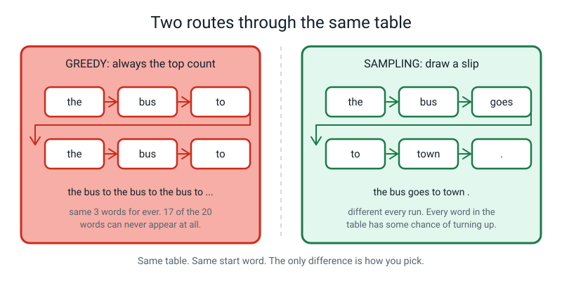
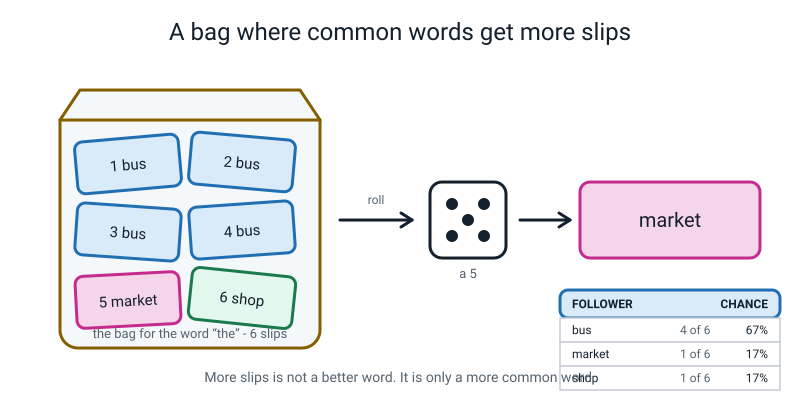
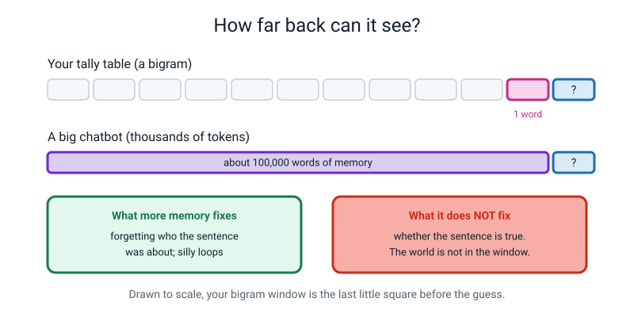
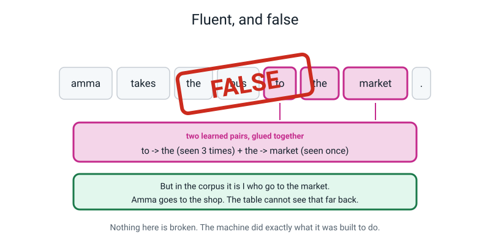
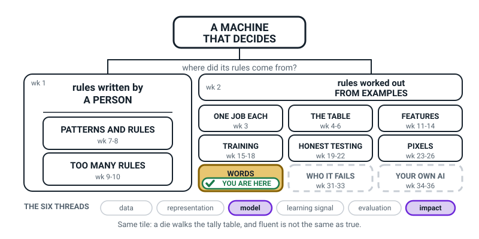
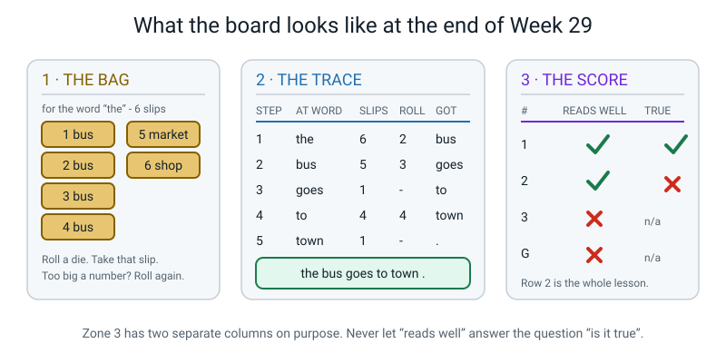
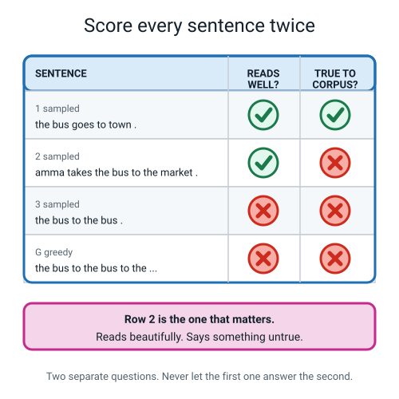

# Week 29 — Dice, Fluency, and Making Things Up

[⬅ Week 28](week-28.md) · [Course Home](../README.md) · [Week 30 ➡](week-30.md) · [Student Guide](../student-guide/week-29.md) · [Workbook](../workbook/week-29.md)

---

## 📋 At a Glance

| | |
|---|---|
| **Duration** | 70 minutes |
| **Type** | 🟦 Teach |
| **Big idea** | Randomness is why the same prompt gives different answers — and a sentence can be perfectly fluent and completely false. |
| **New vocabulary** | sampling · greedy · prompt · context · hallucination |
| **Materials** | **The student's next-word table from Week 28** (essential), one ordinary six-sided die, pencil, the printed Bag Sheet, Trace Sheet and Score Sheet (all in the Answer Key below), a red pencil or red pen |
| **Tech needed** | None. Zero. This is a dice-and-paper lesson. |
| **Prep time** | 15 minutes the night before + 5 minutes on the day |

---

## 🎯 Lesson Objectives

By the end of this lesson your student can:

1. **Generate a sentence by sampling** from a next-word table, using a die, writing down the bag
   contents and the roll at every single step, so the whole run can be checked afterwards.
2. **Generate a sentence greedily** from the same table and explain, pointing at specific rows, why
   greedy output loops forever and why most of the table can never be reached.
3. **Score a generated sentence on two separate axes** — does it read well, and is it true according to
   the corpus — and keep the two judgements apart.
4. **Trace a hallucination back to its cause**: name the two bigrams that combined, and say why the
   table could not have known better.
5. Say what **sampling**, **greedy**, **prompt**, **context** and **hallucination** mean, without notes.

---

## 🧑‍🏫 What YOU Need to Know First

*Read this once. About 15 minutes. It builds directly on last week's tally sheet and needs nothing else.
By the end you will understand where AI "making things up" actually comes from, well enough to explain
it to an adult who is frightened of it.*

### Idea 1 — the table can be run forwards

Last week your student built a next-word table: for each word, a list of what followed it and how often.
So far it has been a *record* — a description of a text that already exists.

This week we run it in the other direction. Pick a starting word. Look up its group. Choose one of the
followers. Say it. Now that follower is your current word — look *it* up, choose again. Repeat until you
hit a full stop.

That loop is called **generation**, and it is the same loop chatbots use to produce text, one word at
a time. Real chatbots work out the chances with a much bigger and cleverer method than a counted table,
but the loop itself is the real thing, not a toy.

The only interesting question in the whole loop is the word **choose**. There are exactly two honest
ways to do it, and they behave so differently that they are worth treating as two separate machines.

### Idea 2 — greedy: always take the biggest count

> **Greedy** — always pick the single follower with the highest count.

It sounds obviously correct. Take the best option every time; how could that be wrong?

Try it on last week's table. Start at `the`. The `the` group is `bus` 4, `market` 1, `shop` 1. Biggest
count is `bus`, so say `bus`. Now look up `bus`: `to` 2, `goes` 1, `is` 1, `.` 1. Biggest is `to`, so
say `to`. Now look up `to`: `the` 3, `town` 1. Biggest is `the`.

You are back at `the`. And the table has not changed. So it will pick `bus` again. Then `to`. Then
`the`. Then `bus`.

```
   the -> bus -> to -> the -> bus -> to -> the -> bus -> to -> ...
```

Forever. Not because anything is broken — because greedy is **deterministic**. Same row, same decision,
every time. And a machine that makes the same decision every time, walking round a finite table, must
eventually come back to a word it has already visited, and from that moment onward it is trapped in a
circle it cannot leave.


*Figure 29.1 — Same table, same start word. The only difference is how you pick.*

Two consequences worth having ready, because they are the ones students find striking:

- **The loop is short.** In our 20-word table it is 3 words long. Your phone's keyboard loop is
  longer, because its table is bigger. It is the same phenomenon at a different scale.
- **Greedy throws away most of the table.** Starting from `the`, greedy can only ever reach `the`, `bus`
  and `to`. That is three words out of twenty. **Seventeen of the twenty words can never appear at all,
  no matter how long you run it.** `amma`, `market`, `late` — all permanently unreachable. Greedy is not
  a cautious version of the model. It is a version of the model with 85% of it amputated.

That is also, incidentally, the answer to the puzzle your student walked out with last week: their phone
looped because tapping the middle suggestion fifteen times *works like* greedy generation, done by hand.

### Idea 3 — sampling: draw a slip from a bag

> **Sampling** — pick randomly, but give each follower a chance in proportion to how often it actually
> occurred.

The cleanest way to do this by hand is the bag of slips. For each word, write one slip for every single
tally mark in its group. `the` had 6 marks, so the bag for `the` holds six slips: four saying `bus`, one
saying `market`, one saying `shop`.


*Figure 29.2 — Number the slips, roll a die, take that slip. The chances come out right without any arithmetic.*

Shake the bag, take one slip without looking, read it, **put it back**. Because there are four `bus`
slips out of six, you get `bus` four times out of six over the long run — automatically, with no
percentages to calculate. The counts *are* the probabilities.

Since a die is easier to manage than actual paper slips, we number the slips instead:

> **The rolling rule:** number the slips in the bag 1, 2, 3, and so on. Roll the die. If that number is
> on a slip, take it. **If you roll a number bigger than the number of slips, that roll doesn't count —
> roll again.**

So for `the` (6 slips) every roll counts. For `bus` (5 slips) a 6 means roll again. For `i` (3 slips)
anything from 4 to 6 means roll again. For a word with only one follower, there is nothing to choose —
we call that **forced** and no roll happens at all. A bag whose slips all name the same word (like `i`: eat, eat) has nothing to choose either. Example 2 skips the roll for those; Examples 1 and 3 roll anyway so you can see the bag. The word you get is identical either way; only which die numbers get used up differs, so follow the example's own way when it gives you a list of rolls.

**Why this matters far beyond the classroom:** sampling is the answer to a question every single person
asks about chatbots. *"Why did it give me a different answer when I asked the same thing twice?"*

Because it is drawing slips. Same bag, different draw. It is not in a mood, it did not think harder on
Tuesday, it has not changed its mind. It made a weighted random choice, several hundred times, and got a
different sequence. Real systems have a dial that slides between greedy and sampling; turn it toward
greedy and answers become repetitive and safe, turn it the other way and they become adventurous and
start talking nonsense.

### Idea 4 — prompt and context: two words that sound technical and are not

> **Prompt** — the text you give the model to start from.

In today's activity the prompt is **one word**: the word you begin at. That is genuinely all a prompt
is. When you type "write me a poem about rain" into a chatbot, you have not given it an instruction in
the way you would instruct a person. You have given it the *beginning of a text* and asked it to carry
on. Underneath, a chatbot produces its answer by continuing the text. (Chatbots are also trained to follow
instructions, so a clear request works far better than a random beginning, but the machinery is still
continuing.)

> **Context** — how many previous words the model is allowed to look at when it makes its guess.

Our table has a context of **one word**. When it stands at `the` and chooses `market`, the word `the` is
literally the entire world it can see. Whatever came before is gone.


*Figure 29.3 — A bigram sees one word. A big chatbot sees roughly a hundred thousand. More memory fixes forgetting. It does not fix truth.*

This is the figure to look at hardest, because it contains the honest version of the scale gap. A large
modern chatbot can look back over something like a hundred thousand words at once — a whole novel — and
the biggest can manage several times that. That gigantic window does real work: it is why a chatbot
remembers your name from twenty minutes ago, keeps track of who is doing what in a story, and does not
produce the crude loops your table produces.

And it changes nothing at all about truth, because **the world is not in the window.** A big context can
enforce consistency with the text so far. It cannot check reality. There is no step in our procedure
where reality gets consulted. Real chatbots can be tuned to be right more often, and some look things up,
but fluent text still needs checking. That is not a small missing feature; it is a different question
from fluency.

### Idea 5 — hallucination, arrived at rather than announced

Here is the most important thing in the module, and it is not technical.

Take last week's table and generate: **`amma takes the bus to the market .`**

Check every step against the table. `amma → takes`, legal. `takes → the`, legal. `the → bus`, legal.
`bus → to`, legal. `to → the`, legal. `the → market`, legal. `market → .`, legal. Every single step is
something that genuinely happened in the corpus.

Now read the sentence as a claim about the world. In the corpus, **I** take the bus to the market.
**Amma** takes the bus to the **shop**. The sentence the table just produced states, confidently and
fluently, something the source text does not say and in fact contradicts.


*Figure 29.4 — Two learned pairs glued together produce a claim the corpus never made.*

> **Hallucination** — when an AI produces something that sounds right but isn't true.

Three things to be precise about, because the word gets thrown around loosely:

**It is not lying.** Lying requires knowing the truth and choosing to say something else. There is
nothing in the table that could know.

**It is not a bug.** Nothing malfunctioned. Every step obeyed the rules perfectly. Look at the caption
on Figure 29.4: *nothing here is broken; the machine did exactly what it was built to do.* Sit with that
sentence, because it is the uncomfortable heart of the topic. The output is wrong and the machine is
working correctly. Both at once.

**It comes from gluing.** The falseness lives at a *join*. The pair `to → the` was learned three times.
The pair `the → market` was learned once. Both are real. Glue them together and you get a claim about
Amma that nobody ever made. The generator had no way to notice, because at the moment it chose `market`
its entire visible world was the single word `the`. The word `amma` was six tokens back — completely
outside the window.

**Why fluency and truth come apart.** The machine is optimising for exactly one thing: *does this word
plausibly follow those words?* Truth is a different question — *does this match the world?* — and no
step anywhere checks it. A well-formed false sentence and a well-formed true sentence look identical to
a next-word predictor, because they are both well-formed.

🍕 **The analogy to use in class — the confident tour guide.** Imagine a guide who has read thousands of
tour scripts and never visited the city. Ask about any building and out comes a fluent, well-paced,
confident answer in perfect tour-guide rhythm. Most of it is right, because most tour scripts are right.
But when they don't know, they don't stop — they produce more tour-guide-shaped sentences, at the same
confidence, in the same voice. **There is no wobble in their voice when they cross from true to false.**
That missing wobble is the whole danger.

### The two misconceptions you will hit today

**Misconception 1: "the AI made a mistake."**

Students want the wrong sentence to be an error, because errors can be fixed. Push back gently and
specifically: which step was against the rules? None. Every pair was real. So what would you fix? There
is no broken line to repair. What is missing is a step our procedure never had — a step that asks "is this
true?" — and adding that step is a genuinely unsolved problem, not an oversight.

**Misconception 2: "a bigger table would stop this."**

This one is seductive because more data feels like more truth. It is not. A bigger table makes text more
*likely-sounding*. Nothing in the counting procedure checks reality, so multiplying the counts by a
million mainly adds fluency. Bigger models do get facts wrong less often, but they still can, so
checking is still needed. Bigger context
does help with a different problem — forgetting — and it is worth conceding that clearly, using
Figure 29.3, before restating the limit.

### How deep to go, and where to stop

**Go this deep:** run the loop by hand with dice; write the bag and the roll at every step; see greedy
loop; score two axes separately; trace the falseness to a join between two real pairs.

**Stop before these:**
- **Percentages.** Say "4 out of 6". Do not convert to 67%. The arithmetic distracts from the idea, and
  the counts are the honest form anyway.
- **Multiplying probabilities** to get the chance of a whole sentence. Beautiful, and it belongs to
  Level 2.
- **Trigrams and longer memory.** Named in passing via Figure 29.3, taught properly in **Week 30**.
- **Rule-based bots.** That is next week's contrast; do not pre-empt it.
- **Who wrote the training text, and privacy.** **Weeks 31 and 32.**
- **"Temperature."** The real name for the greedy-to-sampling dial. Mention it only if asked, in one
  sentence, and move on.

---

### 🧭 The Growing Map

Third week in the same tinted tile, and the thread strip does something worth pointing at: **impact**
lights up next to **model**. Not evaluation. The lesson is half mechanism and half consequence, and the
strip says so before you do.



*Figure 29.0 — Week 29's version. WORDS still tinted and badged, with **model** and **impact** lit
along the bottom.*

**What to do with it, in about two minutes at the end of the lesson:**

1. **Show it and ask:** *"which bit did we do today — same box again, so what's new down the bottom?"*
   They will spot **impact**. Then ask *"why would rolling a die count as impact?"* and let them get to
   it: because the sentence it produced was smooth, confident, and not true, and somebody could believe
   it.
2. **Then the better question:** *"why is WHO IT FAILS still dashed when today was about a machine
   being wrong?"* Because today the machine was wrong about a **fact**. Weeks 31 to 33 are about it
   being wrong about a **group of people**. Wrong-for-everyone and worse-for-some are different
   problems, and saying that sentence out loud is the door into Term 3's last block.
3. **Have them shade WORDS a third time** and write their own fluent-and-false sentence beside it,
   underlined. Their own made-up sentence is stickier than any example you give them.

> **🧑‍🏫 Why this is worth two minutes.** This is the week that explains every headline they will ever
> read about chatbots making things up, and it is easy for it to land as "the AI is broken". The map
> puts it on the **impact** thread instead, which frames it correctly: the machine did exactly what it
> was built to do, and the problem is what a person does with the output.

**The six threads** along the bottom are the spine of all four levels. **Model** and **impact** are lit
this week. Do not quiz them on the threads; the map is orientation, never assessment.

---

## 🧰 Prep Checklist

### 15 minutes, the night before

- [ ] **Find last week's table.** The student's own tally sheet, or your photograph of the board. This
      lesson does not work without it. If it is genuinely lost, print the complete table from Part D of
      last week's Answer Key and use that.
- [ ] **Find a six-sided die.** A board-game die. A dice app works but is much less fun and invites
      arguments about whether it is "really" random. Six paper slips numbered 1–6 in a cup also works.
- [ ] **Print three sheets** from the Answer Key below: the **Bag Sheet** (the six bags, slips already
      numbered), the **Trace Sheet** (STEP · AT WORD · SLIPS IN BAG · ROLL · GOT), and the **Score
      Sheet** (two tick-or-cross columns).
- [ ] **Do the three generations yourself** with the fixed rolls in the Answer Key. Twelve minutes. This
      is the single highest-value item on this list — the traces are fiddly and doing them once means you
      will spot your student's slip instantly instead of both of you getting lost.
- [ ] **Do the greedy run too**, twelve tokens. It takes ninety seconds and the loop is genuinely
      satisfying to watch appear under your own pencil.
- [ ] **Find a red pencil.** The FALSE stamp in Figure 29.4 wants to be drawn in red by hand, across the
      student's own sentence. Do not skip this; it is theatre, and theatre is what makes it stick.

### 5 minutes, on the day

- [ ] Rule the board in three zones exactly as in Figure 29.5 below: THE BAG · THE TRACE · THE SCORE.
- [ ] Last week's next-word table on the desk, visible, at the student's left hand.
- [ ] Die, pencil, red pencil, three printed sheets.


*Figure 29.5 — The board plan. The two score columns must stay visually separate; that separation is the lesson.*

### If something fails

| If this fails | Do this instead |
|---|---|
| **Last week's table is lost** | Print the full table from Week 28's Answer Key, Part D. Spend two minutes having the student check three groups against the corpus so it feels like theirs, then carry on. Do not re-tally; you do not have the time. |
| **No die anywhere** | Write 1 to 6 on six scraps of paper, fold, put in a mug. Draw and replace. This is arguably better — it is literally the bag-of-slips idea — and it removes the "are dice really random" argument entirely. |
| **The student wants to use their own rolls, not the fixed ones** | Let them, *after* they have done sentence 1 with the fixed rolls. The fixed rolls exist so the answer key can check the work and so the hallucination reliably appears. Their own rolls are excellent for sentences 2 and 3, but then you cannot mark them against Part F — you mark the method instead. |
| **The hallucination does not appear** | It will if the fixed rolls are used; that is why they are fixed. If you have gone off-script and the three sentences all come out true, use Part G: construct the false sentence by hand from the table and ask the student to check every step is legal. Discovering it was constructible is nearly as good as drawing it. |
| **You are badly over time** | Cut sentence 3. Do sentence 1 (clean), sentence 2 (the lie) and greedy. Never cut greedy — it is half the objectives — and never cut the red FALSE stamp. |

---

## ⏱️ The Lesson, Minute by Minute

| # | Segment | Minutes | Running total |
|---|---|---|---|
| 1 | 🪝 Hook — Ask it twice, get two answers | 8 | 8 |
| 2 | 🧠 Concept — Two ways to pick a word | 18 | 26 |
| 3 | 🔍 Worked example together — sentence 1, every roll on the board | 14 | 40 |
| 4 | 🎲 Activity — Three Sentences and a Lie | 20 | 60 |
| 5 | 🔑 Wrap & assign | 10 | 70 |

---

### 1 · 🪝 Hook — Ask it twice, get two answers (8 min)

**Say this:**

> "Last week your phone made a sentence by itself and it went round in a circle. Remember? Something
> like *'I will be there in a bit and I will be there in a bit and'*. We didn't explain it. I said wait
> a week. It has been a week.
>
> Here is a second puzzle to go with it. When people use a chatbot, and they ask it the exact same
> question twice, they usually get two different answers. Same words typed in, different words coming
> out. Why?
>
> Have a guess. Any guess."

Common guesses, all worth taking seriously for thirty seconds each: *it's learning as it goes* (no — the
table doesn't change while you talk to it), *it's got a different mood* (no, and it is worth being firm:
there is no mood in there), *it remembers what I asked before* (sometimes true, but it happens with a
fresh conversation too).

> "Every one of those is a reasonable guess and every one is wrong. The real answer is much more boring
> and much more useful, and by the end of today you will have done it yourself with a die.
>
> One more thing. By the end of today you are going to write a sentence that reads beautifully — proper
> grammar, sounds exactly like our story — and is completely untrue. And you will be able to point at
> the two rows on your own tally sheet that did it. Not guess at them. Point at them."

**Do this:**

- Write on the far left of the board: **"Why two different answers to the same question?"** and
  underneath, **"Why did my phone go round in a circle?"** Leave both up. You will tick them off in the
  wrap.
- Put the die on the desk where they can see it and not touch it.
- Put last week's table in front of them. Say: *"That sheet is doing all the work today. We're not
  making a new one."*

**Ask this:**

| Ask | Hoping for | If they say something else |
|---|---|---|
| "Why two different answers to the same question?" | Any guess at all | Take every guess seriously and briefly. What you are building is the itch, not the answer. If they say "I don't know" — perfect: "Good. Neither did I until someone showed me a bag of paper." |
| "Does the chatbot change while you're talking to it?" | "No" or uncertainty | The honest answer is no, not the part that produces words — its table is fixed for months at a time. If they insist, ask: "If it learned from you, would it get better at your questions during one afternoon?" It doesn't. |
| "Do you think the sentence your phone made was true?" | "No" / "it was nonsense" | Whatever they say, do not resolve it. Say: "Hold that. We're going to make it precise today, and 'nonsense' is not going to be precise enough." |

---

### 2 · 🧠 Concept — Two ways to pick a word (18 min)

**Say this — part one, greedy:**

> "Your table tells you what *can* come next and how often each one did. It does not tell you which one
> to pick. That's our job, and there are exactly two sensible ways to do it.
>
> Way one is the obvious one. **Always take the biggest count.** That's got a name: **greedy**. Greedy
> means always grab the best-looking option, right now, every time.
>
> Let's run it. Start at the word `the`. Look up the `the` group on your sheet. Read me the counts."

Let them read: `bus` 4, `market` 1, `shop` 1.

> "Biggest is `bus`, four marks. So greedy says `bus`. Write it: `the bus`.
>
> Now we're at `bus`. Look up `bus`. Read the counts."

`to` 2, `goes` 1, `is` 1, `.` 1.

> "Biggest is `to`, two marks. Write it: `the bus to`.
>
> Now `to`. Read them."

`the` 3, `town` 1.

> "Biggest is `the`. Write it: `the bus to the`.
>
> Now we're at `the` again. What does greedy pick?"

**Ask this:**

| Ask | Hoping for | If they say something else |
|---|---|---|
| "We're back at `the`. What does greedy pick now?" | "`bus`… wait, it's going to do the same thing again" | If they just say "bus" flatly, ask "and after that?" and "and after that?" until the penny drops. Let them run it four more words themselves. The realisation should be theirs. |
| "Will it ever stop?" | "No, it goes round forever" | If they say "when it hits a full stop" — good thinking, wrong here. Ask: "Does greedy ever choose a full stop? Look at the `bus` group. `.` has one mark, `to` has two. Which does greedy take?" Never the full stop. It cannot ever end. |
| "Which words can greedy *never* say?" | Lots of them / "most of them" | Have them list what greedy can reach: `the`, `bus`, `to`. Three. Then count the table: 20 words. So **17 words can never appear at all**. Write "3 of 20" on the board and circle it. |
| "Has anything gone wrong here?" | "No, it's just doing what we told it" | This is a lovely question to ask because the answer is no. Greedy is working perfectly. Best-at-each-step is simply not the same thing as best-overall, and that is a real and general idea worth naming. |

**Do this:**

- Write the loop on the board as an actual circle: `the → bus → to →` and an arrow curving back to
  `the`. A circle is far more persuasive than a line of words.
- Then write in zone 3: **"greedy = repeatable + boring + stuck"**.
- Then say the punchline: *"Tapping the middle suggestion on your phone fifteen times works like greedy
  generation, done with your thumb. That's why it went round in a circle. Puzzle two: solved."* Tick it
  off on the board.

**Say this — part two, sampling:**

> "Way two. Don't always take the biggest — take one **at random**, but give the common ones more
> chance. That's called **sampling**.
>
> Here's how to do it so the chances come out exactly right, with no maths. For the word `the`, we had
> six tally marks. So make six paper slips — one slip for every mark. Four of them say `bus`, one says
> `market`, one says `shop`. Put them in a bag, shake, take one without looking, read it, **put it
> back**.
>
> Notice what happened there. You didn't have to calculate anything. Four `bus` slips out of six *is*
> four-out-of-six odds. The counts turned themselves into chances just by becoming slips."

Show Figure 29.2.

> "Paper slips are a nuisance to make, so we use a die instead. Number the slips 1 to 6. Roll the die,
> take that slip. For `the` that works perfectly, six slips, six faces.
>
> But `bus` only had five marks, so it has five slips. What if I roll a 6?"

**Ask this:**

| Ask | Hoping for | If they say something else |
|---|---|---|
| "The `bus` bag has 5 slips. I roll a 6. What now?" | "Roll again" | If they say "use slip 5" or "use slip 1" — ask "would that be fair to slip 5? It would get picked twice as often as the others." The fairness argument lands quickly. Then state the rule: too big, roll again. |
| "The `market` group has only one follower. Do I roll?" | "No, there's only one thing it can be" | If they want to roll anyway, let them roll once and point out that all six faces mean the same word. Then name it: **forced**. No roll, no choice. |
| "Does sampling get stuck in a loop?" | "No, because it can pick different things" | Push for precision: "It *can* still say `the bus to the bus` — it just doesn't have to. Every word in the table has some chance of turning up. Greedy gives 17 words zero chance. Sampling gives them a small chance. That's the whole difference." |

**Do this:**

- Hand over the printed **Bag Sheet** — all six bags, slips already numbered. Making the bags from
  scratch costs eight minutes and teaches nothing new; last week's tallying already did that job.
- Write the rolling rule on the board, boxed: **"Number the slips. Roll. Too big? Roll again. One
  option? Forced, no roll."**
- Write the two new words in zone 3: **sampling** and **greedy**, with one-line definitions.
- Then introduce the other two words quickly and concretely: *"The word you start from is called your
  **prompt** — that's all a prompt is, the beginning of the text. And how far back the machine can look
  is called its **context**. Our table's context is one word. One. When it's standing at `the`, the word
  `the` is the whole universe."* Show Figure 29.3 for fifteen seconds and move on; it gets its proper
  moment in the wrap.

---

### 3 · 🔍 Worked Example Together — sentence 1, every roll on the board (14 min)

**Say this:**

> "We'll do the first one together, on the board, and I'll write down absolutely everything — because
> the only way anyone can check a random process afterwards is if you wrote down every roll as it
> happened.
>
> I'm using **fixed rolls** today rather than really rolling. Two reasons, and they're both honest ones.
> First, it means the answer key can check your work. Second, it means we'll definitely get to the
> interesting sentence instead of maybe getting there. Real rolls are for homework.
>
> Prompt: the word `the`. Rolls for this sentence: **2, then 3, then 4.**"

**Do this** — build this table on the board, one row at a time, saying each row aloud as you write it:

```
   STEP   AT WORD   SLIPS IN BAG                    ROLL      GOT
   ────   ───────   ─────────────────────────────   ──────    ──────
    1     the       1 bus  2 bus  3 bus  4 bus        2       bus
                    5 market  6 shop
    2     bus       1 to  2 to  3 goes  4 is  5 .     3       goes
    3     goes      1 to                            forced    to
    4     to        1 the  2 the  3 the  4 town       4       town
    5     town      1 .                             forced    .
   ────────────────────────────────────────────────────────────────
   OUTPUT:   the bus goes to town .
```

Narrate it exactly like this:

> "Step 1. I'm at `the`. Six slips: four say `bus`, then `market`, then `shop`. I roll a 2. Slip number
> 2 says `bus`. So the sentence starts `the bus`.
>
> Step 2. I'm at `bus`. Five slips: `to`, `to`, `goes`, `is`, full stop. I roll a 3. Slip 3 says `goes`.
> `the bus goes`.
>
> Step 3. I'm at `goes`. How many slips?" *(one)* "So no roll. Forced. `to`. `the bus goes to`.
>
> Step 4. I'm at `to`. Four slips: `the`, `the`, `the`, `town`. I roll a 4. Slip 4 says `town`. `the bus
> goes to town`.
>
> Step 5. I'm at `town`. One slip, a full stop. Forced. And a full stop is where we stop.
>
> **`the bus goes to town .`** There it is. A sentence, produced by a die and a tally sheet."

**Ask this:**

| Ask | Hoping for | If they say something else |
|---|---|---|
| "Is that a good sentence?" | "Yes, it's fine" | If they hesitate, read it aloud in a normal voice. It is completely fine English. That is the point: the machine is good at this. |
| "Is it in our original story?" | "Yes! It's sentence three, word for word" | Many students expect novelty and are slightly disappointed. Reframe it: "Sampling doesn't avoid the original. It can copy it. It can also make something new. It doesn't know or care which it's doing — and that turns out to matter enormously." |
| "Is it true, as far as our story goes?" | "Yes" | Good — record a tick in both score columns. You need one clean, honest row before the interesting row means anything. |
| "What if I'd rolled a 5 at step 1?" | "It would have said `market`" | Then follow it: `the market .` — a two-word sentence that isn't really a sentence. Worth doing; it shows that sampling can produce rubbish as easily as it produces gold, with no idea which. |

**Do this:**

- Write the output in a green-ish box in zone 2 of the board.
- Start the Score Sheet in zone 3 with this one row: **`1 · the bus goes to town .` → reads well ✓ →
  true ✓**.
- Say clearly, pointing at the two columns: *"Two separate questions. Does it read well. Is it true.
  We're going to keep them apart all lesson, and by the end you'll see why I'm making such a fuss."*

---

### 4 · 🎲 Activity — Three Sentences and a Lie (20 min)

Full instructions in the next section. The lesson flow:

**Minutes 0–6 — sentence 2, the important one.** Prompt: `amma`. Rolls: **1, 4, 2, 3, 5**. The student
fills the trace sheet themselves; you say nothing except the roll numbers.

They will get: **`amma takes the bus to the market .`**

**Say this** — and slow down here, this is the sixty seconds the whole lesson exists for:

> "Read it out loud. Read it like a newsreader.
>
> Good, isn't it? Better than my one. Proper grammar, right rhythm, sounds exactly like the rest of the
> story.
>
> Now, second question, and only the second question: **is it true?** Go back to our original story and
> find out who goes to the market."

Let them find it. `I take the bus to the market.` And Amma? `Amma takes the bus to the shop.`

> "So this sentence says Amma goes to the market. Our story says Amma goes to the shop, and it's *me*
> who goes to the market. The sentence is beautifully written and it is **false** (according to the story).
>
> Take the red pencil. Write FALSE across it. Big."

**Do this:**

- Have them draw the red FALSE stamp across their own sentence, by hand. Then show Figure 29.4 so they
  can see it is not just their sentence — it is the designed outcome.
- Record the row on the Score Sheet: **reads well ✓ · true ✗**. Point at the mismatch between the two
  columns. That mismatch is the entire lesson.

**Minutes 6–11 — the trace.** Now find the exact cause. This is the part that must not be skipped.

**Ask this:**

| Ask | Hoping for | If they say something else |
|---|---|---|
| "Was any single step against the rules? Check all seven." | "No, they're all real pairs" | If they think one was illegal, check it together against the table. All seven are genuinely there. This has to be established firmly before the rest works. |
| "So if every step was legal, where did the lie come in?" | "Where two of them join up" | If stuck, point at the two steps around `the`: "`to → the` came from one sentence. `the → market` came from a different sentence. What happens when you glue them?" |
| "Which two pairs did it? Point at them on your sheet." | `to → the` (3 marks) and `the → market` (1 mark) | Accept any two adjacent pairs that straddle the join. The behaviour you want is the finger landing on rows, not the exact pair. |
| "At the moment it chose `market`, what could it see?" | "Just the word `the`" | This is the killer question. If they say "the whole sentence" — go back to Figure 29.3. Context is one word. `amma` was six words back and completely invisible. |
| "So could the table have known better?" | "No" | Push it one step further: "So is this a mistake?" The right answer is no, and it should feel strange. It followed every rule and produced something false. |

**Do this:**

- On the board, write the two culprit pairs side by side with an arrow between them, and above the
  arrow write **"the join"**. Circle it.
- Then write the definition where they can copy it: **"Hallucination — when an AI produces something
  that sounds right but isn't true."** And underneath, in their own handwriting: **"It happens at the
  joins."**

**Minutes 11–16 — sentence 3, and greedy.**

Sentence 3, prompt `the`, rolls **1, 2, 6, 1, 3, 5**. Note the 6 — it lands on the `to` bag, which has
only four slips, so it doesn't count and you roll again. That is deliberate; they need to meet the
re-roll rule once with someone watching.

They will get: **`the bus to the bus .`** Score it: reads well ✗ (it isn't a sentence — no verb),
true — not applicable, because it doesn't claim anything.

Then greedy, twelve tokens, prompt `the`. No die needed. They should produce:

```
   the bus to the bus to the bus to the bus to
```

Score it: reads well ✗ · true, not applicable.

**Minutes 16–20 — the completed score sheet.** All four rows in front of them.


*Figure 29.6 — The finished score sheet. Row 2 is the one that matters.*

**Ask this:**

| Ask | Hoping for | If they say something else |
|---|---|---|
| "Which row is the dangerous one?" | Row 2 | If they pick row 3 or the greedy row, ask: "If I showed you row 3 with no explanation, would you believe it?" No — it's obviously broken. "Would you believe row 2?" Yes. **The dangerous one is the one you'd believe.** |
| "Could the machine tell you which row was which?" | "No" | This is the sentence to get them to say out loud: all four came out of the same bags by the same procedure with the same enthusiasm. It has no idea which of its outputs are true. |
| "So who has to check?" | "A person" / "me" | Land it: "And that stays true when the table has a trillion counts in it instead of thirty-nine." |

---

### 5 · 🔑 Wrap & Assign (10 min)

**Say this:**

> "Two puzzles were on the board when we started. Let's close them.
>
> *Why did my phone go round in a circle?* Because tapping the middle suggestion works like **greedy** — always
> the biggest count. Greedy is deterministic: same row, same choice, every time. So it walks into a
> circle and cannot climb out. Your table's circle was `the bus to`. Your phone's was longer. Same
> thing.
>
> *Why do you get two different answers to the same question?* Because it is **sampling** — drawing a
> slip from a bag. Same bag, different draw. Not a mood. Not learning. A weighted coin flip, made
> hundreds of times per reply.
>
> And then the third thing, which nobody asked about but which matters more than either.
>
> Your sentence — `amma takes the bus to the market` — was perfect English and it was false. It was not
> a mistake. Every step obeyed every rule. It went wrong at a **join**: two real pairs, glued together,
> making a claim that neither of them made on its own.
>
> That has a name: a **hallucination**. And here is the part I want you to keep: **the machine's voice
> does not change when it stops being right.** Your true sentence and your false sentence came out of
> the same bags, in the same handwriting, with the same confidence. There was no wobble.
>
> So when something sounds fluent and confident, you have learned exactly nothing about whether it is
> true. Fluent is easy. Fluent is what the machine is *for*."

Then the honest scale conversation, using Figure 29.3:

> "One fair objection. My table looks back one word. A real chatbot looks back about a hundred thousand
> words — a whole novel. Doesn't all that memory fix this?
>
> Partly, and this matters, so I'm not going to pretend otherwise. All that memory genuinely fixes
> **forgetting**. A big model wouldn't forget that we were talking about Amma. It wouldn't produce silly
> loops. The crude errors we made today mostly don't survive at that scale.
>
> But look at the right-hand box on that picture. What it does **not** fix is whether the sentence is
> true. Because the world is not in the window. There is no step, anywhere in our procedure, where
> anybody checks reality. More memory is a bigger window onto the *text*. It is not a window onto the
> world."

**Do this:**

- Have them write the five vocabulary words with their own one-line definitions on a sheet of paper. Their
  own words. Practice Set A1 in the workbook tests the same words, so this is a rehearsal for it.
- Have them write one sentence, in their own handwriting, answering: *where exactly did the falseness
  come from?* This is the homework's central question and a rehearsal now makes it much better later.
- Keep the table, the bag sheet and the die. Next week uses the generator one more time, as the thing a
  Scratch bot gets compared against.

---

## 🎲 The Activity, In Full

### Three Sentences and a Lie

**What it is:** the student runs the generation loop by hand on last week's table, three times with
supplied fixed rolls and once greedily, writing every bag and every roll. Then all four outputs are
scored on two separate axes. At least one comes out fluent and false, and the student traces the exact
two bigrams that produced it.

**Time:** 20 minutes (6 · sentence 2 — 5 · the trace — 5 · sentence 3 and greedy — 4 · scoring)

**Materials:**
- Last week's next-word table
- The printed **Bag Sheet** (six bags, slips numbered) — Answer Key Part B
- The printed **Trace Sheet** (STEP · AT WORD · SLIPS IN BAG · ROLL · GOT) — Answer Key Part C
- The printed **Score Sheet** (two tick-or-cross columns) — Answer Key Part D
- A pencil, and a **red** pencil
- A die, for the homework version. Not needed for the fixed rolls.

### Setup

1. Table at the left hand, trace sheet in the middle, score sheet at the right. Physically in that
   order, because that is the order of the thinking.
2. Bag sheet propped up where it can be read without moving anything.
3. The fixed roll lists written on the board before you start, so there is no suspicion that you are
   choosing rolls to make a point. (You are, of course. But it was decided in advance and in public,
   which is the difference between a demonstration and a trick.)

### The rules, read aloud before starting

1. **Write the bag before you roll.** Every step, write out what is in the bag. It is slow and it is the
   only reason anyone can check your work later.
2. **One roll, one step.** Take the rolls off the list in order, left to right.
3. **Too big, roll again.** If the number is bigger than the number of slips, that roll does not count.
   Cross it out on your sheet and take the next number.
4. **One slip means forced.** No roll. Write "forced" in the ROLL column.
5. **Stop at a full stop.** Or after 20 words, whichever comes first.
6. **Do not edit the output.** Not a word. Not even when it is embarrassing, and especially not when it
   is wrong.

### The fixed rolls

```
   SENTENCE 1   prompt: the      rolls:  2  3  4                  (done together, in segment 3)
   SENTENCE 2   prompt: amma     rolls:  1  4  2  3  5
   SENTENCE 3   prompt: the      rolls:  1  2  6  1  3  5         (the 6 is a re-roll - watch for it)
   GREEDY       prompt: the      no rolls. Always the biggest count. Stop after 12 words.
```

### The scoring, which is the real activity

Two columns, and they must be judged **separately and in this order**:

| Column | The question | How to decide |
|---|---|---|
| **READS WELL?** | Would a person write this? | Read it aloud in a normal voice. If you stumble or it isn't a sentence, ✗. Do not think about meaning at all. |
| **TRUE TO CORPUS?** | Does the original story actually say this? | Go back to the six original sentences and look. If the story says something different, ✗. If the sentence doesn't claim anything, write n/a. |

> **⚠️ Watch out:** the temptation is to fill both columns at once from a general feeling of "was that a
> good one". Do not allow it. Fill the whole first column, then go back to the top and fill the whole
> second column. The gap between the two columns only becomes visible if you make them separately.

### What "finished" looks like

- Four trace tables, each with a bag written out at every step and a roll (or "forced") recorded.
- Four outputs, unedited, including the ugly ones.
- A completed score sheet with **at least one row that is ✓ for reads-well and ✗ for true**.
- A red FALSE stamp, drawn by hand, across that sentence.
- Two pairs circled on the student's own table, and one sentence in their own words saying why the table
  could not have known better.
- The greedy run, twelve tokens, visibly looping, plus the number 3-out-of-20 written down.

### Variation — easier

**Do sentences 1 and 2 only, plus greedy.** Drop sentence 3. Every objective is still met — sentence 3
only demonstrates that sampling can also produce rubbish, which is a nice extra rather than a core idea.

Two more supports:
- **You keep the trace table, they choose the slip.** You write the bag contents and the step numbers;
  they read the roll and find the slip. This removes all the copying and keeps all the thinking.
- **Pre-write the bags** on the trace sheet for the specific words that will come up, so no lookup is
  needed. The bag sheet in Part B already helps, but writing them straight into the trace rows helps
  more.

### Variation — harder

1. **Find another lie.** Using only the table, construct a second sentence that is fluent and false, and
   prove every step is legal. (Several exist. `i takes the bus to the shop .` is not legal — check why.
   `amma takes the bus to the market .` we have. `i take the bus to the shop .` is legal and false: in
   the corpus *I* go to the market, Amma goes to the shop. That is a good find.)
2. **Prove greedy can never say `amma`.** Not "it probably won't" — prove it. Write the set of words
   greedy can reach from `the`: it picks `bus`, then `to`, then `the`, and now it is at a word it has
   already been to, so no new word can ever enter the set. The set is `{the, bus, to}` and it is closed.
   `amma` is not in it, therefore `amma` is impossible. That is a real mathematical argument and an
   11-year-old can absolutely make it.
3. **Change one count and break the loop.** What is the smallest change to the table that would let
   greedy escape? (Add two marks to `to → town`, making it 3 versus `the`'s 3 — no, a tie is not an
   escape. Add three, making `town` 4 and `the` 3: now greedy goes `the → bus → to → town → .` and
   terminates. One change, three marks, and the machine stops looping. Worth noticing that the fix was
   to the *data*, not to the procedure.)
4. **The two-word memory question.** If the machine could see **two** words back instead of one, would
   `amma takes the bus to the market` still be possible? Work it out. (Yes — at the critical moment its
   two words are `to the`, and `amma` is still four words back and still invisible. This is exactly the
   idea Week 30 opens with, so if they get here, they are ready.)

---

## ❓ Questions Students Ask This Week

**1. "If the machine can't tell true from false, why does anyone use it?"**

Because a very large amount of useful work has no truth in it to get wrong. Rewriting a paragraph more
simply, making up a story, suggesting names for a pet, drafting something you are then going to read and
fix — all fine, because either there is no fact involved or you can check the result in five seconds.
The danger sits exactly where the claim is specific, checkable, and expensive to get wrong: a phone
number, a medicine, a page reference, something about a real person. Week 32 turns this into a proper
tool you can use.

**2. "Is a hallucination the same as a lie?"**

No, and the difference is worth being careful about. Lying means you know the truth and choose to say
something else — it needs an intention. There is nothing in a tally sheet that could hold an intention.
The machine is not deceiving you; it produced likely-sounding text, which is the only thing it does.
That is also why "it lied to me" is the wrong complaint to make, and why "I trusted it without checking"
is the right one.

**3. "Why don't they just add a truth-checker?"**

People are trying very hard, and some of it works — some systems now search the web and quote sources,
which genuinely helps. But it is much harder than it sounds, for two reasons. First, to check a claim you
need a trustworthy list of true things, and no such list exists for most of the world. Second, the
checker would have to work on *every one of the hundreds of words* in every answer, in a fraction of a
second. This is one of the genuinely open problems in the field. Nobody has solved it, and being able to
say that clearly is worth more than a false reassurance.

**4. "Could I get a different sentence with the same rolls?"**

No — and that is the whole reason we used fixed rolls. Same table, same prompt, same rolls, same output,
every time. That is worth pausing on, because it says something precise: the machine is not
unpredictable *in itself*. It is unpredictable only because the die is. Take the randomness away and it
becomes perfectly repeatable. Which is exactly what greedy is, and look what greedy costs you.

**5. "What if I roll a 6 on a bag with only two slips?"**

Roll again. And notice the cost: for a two-slip bag you will waste four rolls out of six on average,
which feels stupid. Real computers don't use dice — they use a random number between 0 and 1 and scale
it to the bag, so nothing is ever wasted. Same idea, better tool. Our way is slower and you can see it
working, which today is the point.

**6. "How big is a real chatbot's table?"**

Nobody can give you an honest single number, and here is the interesting part: it isn't stored as a table
of pairs at all. If it were, English would need something like 2.5 billion rows just for pairs (assuming a vocabulary of about 50,000 words, 50,000 × 50,000), and
you'd need far more for longer contexts than that — the numbers explode exactly the way the rulebook
exploded in Week 10. So real systems store something cleverer that behaves *like* a gigantic table
without ever writing one out. That "something cleverer" is Level 2's territory. What survives from
today: however it is stored, there is still no built-in step in it that guarantees the answer is true.

**7. "Does the machine know it's making things up?"**

**Nobody knows for sure, and it is one of the most argued-about questions in the whole field.** Here is
what can be said honestly. Our tally sheet definitely does not know, and we can be certain because we
can read the whole thing — there is nowhere for knowing to hide. With a big chatbot it is genuinely
murkier. There are measurements suggesting that something inside a large model behaves differently when
it is about to produce something unsupported, which sounds a lot like a signal that it "knows". But that
is not the same as the system being *aware* of anything, and researchers disagree — sharply — about what
those measurements mean. What everybody agrees on: whatever is or isn't happening inside, it does not
reliably *tell you*, so from where you are sitting you must assume it will not warn you.

**8. "Which is better, greedy or sampling?"**

Neither, and that is not a dodge — they are for different jobs. You want greedy when the same input must
give the same output and variety would be harmful: turning a form into a standard sentence, or a
keyboard strip you're building thumb-memory for, or anything where two people comparing results must see
the same thing. You want sampling when variety is the product: story ideas, names, practice questions,
anything where the user might press "try again" and would be annoyed by an identical answer. Real
systems have a dial between the two, and choosing where to set it is a real design decision with real
consequences.

---

## ⚠️ Where This Lesson Goes Wrong

| What happens | Why | What to do right now |
|---|---|---|
| The student judges "reads well" and "true" as one question and gives one verdict | These feel like the same question, because in ordinary life a fluent sentence usually *is* true. That habit is exactly what the lesson is attacking | Physically separate them. Fill the entire first column down all four rows, put the pencil down, then start again at the top for the second column. If they still merge them, cover the second column with a card while the first is filled |
| The output is checked against "the world" instead of against the corpus | "Amma might well go to the market in real life" — and yes, she might | Be strict about the scope: the corpus is the whole world today. The only thing the table could ever know is what is in those six sentences. Judging against real life makes the exercise unmarkable and hides the actual finding |
| They decide the machine "made a mistake" and want to fix it | Wrong output implies broken machine — a very reasonable expectation from every other machine they have used | Go step by step and ask which step broke a rule. None did. Then ask what they would change. There is no broken line to repair. What's missing is a step that never existed. This is uncomfortable and it is supposed to be |
| The trace sheet becomes an unreadable mess and the run can't be checked | Writing out a whole bag at every step feels like pointless copying, so they abbreviate | Insist on one step, one row, bag written out. Then demonstrate the cost of not doing it: pick one of their steps at random and ask them to prove it was legal. Without the bag written down, they can't |
| Greedy is run with a die anyway | Momentum. They have been rolling for ten minutes | Take the die off the desk before greedy starts. Physically remove it. Then: "Greedy never rolls. Greedy has no choice to make. That's why it's boring, and that's why it's stuck" |
| They conclude that sampling is "the good one" and greedy is broken | Greedy produced the obviously worse output today | Concede the output, reject the conclusion. Greedy is repeatable, and repeatable is exactly what you want in plenty of situations. What today shows is that best-at-each-step is not best-overall. That is the finding, not "greedy is bad" |
| The fixed rolls feel like cheating and trust drops | It is a fair suspicion. You did choose rolls that produce a false sentence | Get ahead of it: write the roll lists on the board *before* you start, and say plainly that you picked them so the answer key could check the work. Then offer the proof — sentence 2 is one of many false sentences the table can make; the homework variation asks them to find another with their own rolls |
| Sentence 3 comes out and they want to score it as "true" | It contains no falsehood, so "true" feels right | Ask what claim it makes. `the bus to the bus .` claims nothing at all. Write **n/a**. Learning that some outputs are not truth-apt is a genuine bit of clear thinking |
| They generalise to "AI is always wrong" and lose interest in it | Today's demo is a hard hit, and eleven-year-olds are absolutists | Correct it firmly. Most of what these systems produce is fine, and much of it is genuinely useful. What today proves is narrower and more useful: **fluency is not evidence.** You have to check specific, checkable, consequential claims — not everything, and not nothing |

---

## 🧭 Differentiation

### If they are struggling

**Cut:** sentence 3, and cut the "harder" variations entirely. Cut the re-roll rule if it is causing
grief — just pick rolls that always fit the bag.

**Reteach in this order:**

1. **Draw real slips out of a real cup.** Do not go near the die. Six paper slips for `the`: four `bus`,
   one `market`, one `shop`. Draw ten times, replacing each time, and tally what you got. It will be
   roughly six or seven `bus`. Feeling the weighting physically is worth more than understanding it
   abstractly.
2. **Then a two-step sentence only.** Start at `market`. Forced to `.`. Done. A one-step generation. Then
   `town`. Then `my` → `bus` → then one real choice. Build up one step at a time.
3. **Then greedy, which needs no die.** Greedy is much easier than sampling — no rolling, no re-rolls,
   just "biggest number wins". Do greedy *first* if sampling isn't landing. The loop is the most
   visually satisfying result in the week and it is available to everyone.
4. **Then the two-column score on just two sentences.** One true, one false. That is the objective. Two
   rows is enough to see a mismatch.

**Non-negotiable:** they must produce at least one fluent-and-false sentence and be able to say, in any
words at all, that it sounded fine and wasn't true. That is the week. Everything else can go.

### If they are flying

Give them the four "harder" variations above, then these:

1. **"Rig the table."** Change exactly one count in the table so that greedy produces a sentence that
   actually ends. Smallest change wins. (Adding three marks to `to → town` does it — greedy then runs
   `the bus to town .` and stops. The instructive part: the fix was to the data, not the machinery.)
2. **"Which prompt is the most dangerous?"** Which starting word makes a false sentence most likely?
   This needs them to think about which words sit at joins between sentences — `amma` and `i` are the
   interesting ones, because both appear in two different situations in the corpus, so both invite
   crossing over.
3. **"How would you make the table honest?"** Design an addition that would make the generator refuse to
   say things the corpus doesn't support. They will typically invent something like "only allow whole
   sentences that were actually in the text" — which works, and also destroys the entire point, because
   then it can never say anything new. Sit in that trade-off with them for two minutes. That trade-off
   is a real, current, unsolved research problem and they have just walked straight into it.
4. **"Write the warning label."** Two sentences that should appear on the side of every chatbot. Then:
   would anybody read it? Would it change anything? (This lands directly in Week 32.)

### If they won't engage today

Skip everything and go straight to the die.

"Roll it. Whatever you rolled, look at slip number that-many in this bag. What does it say? Right,
that's the first word. Roll again." Do not explain sampling, do not use the word "sampling", do not
mention tables. Just generate. It is a game — a slightly absurd, mildly addictive game — and it
generates sentences whether or not anyone has agreed to learn something.

Then, when a false one turns up (it will within four or five sentences), say only this: *"Hang on. Is
that true? Check the story."* That single question, asked once about their own output, is enough. If all
you get today is a student who has watched their own dice produce a confident lie and noticed it, the
lesson has worked. Greedy, the trace, the scoring and the vocabulary can move to next week's warm-up.

---

## ✅ Assessing Understanding

Three checks, last five minutes, exact wording. About ninety seconds each.

### Check 1 — the two axes

**Say exactly:** *"Give me a sentence from today that reads perfectly and is false. Then tell me
which of those two things the machine was trying to do."*

**A good answer:** "`amma takes the bus to the market .` — and it was trying to make it read well. It
wasn't trying to make it true at all, because there's nothing in the table about true." Both halves are
needed: the example, and the recognition that only one of the two axes is even a goal.

**Not yet:** giving the sentence but saying the machine "got it wrong" or "was trying to be right".
Prompt: "Show me the part of the table that's about being true." There isn't one.

### Check 2 — greedy

**Say exactly:** *"Why does greedy generation go round in a circle? And name two words in our table
that greedy can never say."*

**A good answer:** "Because it always picks the same follower for the same word, so once it comes back
to a word it's already been to, it repeats forever. It can never say `amma`, or `market`, or `late`, or
anything except `the`, `bus` and `to`." You want the word *same* (or *always*) doing the causal work, and
at least two correctly named unreachable words.

**Not yet:** "because it's greedy" or "because it's a loop". Prompt: "We're at `the`. What does it pick?
And the time after that?"

### Check 3 — the join

**Say exactly:** *"Point at the two rows on your table that made the false sentence, and tell me why the
table couldn't have known better."*

**A good answer:** a finger on `to → the` and a finger on `the → market`, plus: "because when it chose
`market` all it could see was the word `the`. It had already forgotten `amma`." The physical pointing
matters; this is the difference between having understood the mechanism and having remembered the story.

**Not yet:** naming the sentence but not the rows. Prompt: "Which step went wrong?" — then, when they
say none did: "Right. So it's not a step, it's a *join*. Show me the join."

### Mastery scale for this week

| Level | What it looks like |
|---|---|
| **1 — Not yet** | Can roll and find a slip when told which bag to use, but cannot run a whole sentence unaided or say what the die is standing in for. |
| **2 — Emerging** | Generates a sentence with heavy support. Knows greedy loops but explains it as "it just does". Judges fluent-and-true as a single verdict. |
| **3 — Meeting** | Runs a full trace independently with bags and rolls recorded, produces the fluent-and-false sentence, scores two axes separately, and explains greedy's loop by pointing at rows. **This is the target.** |
| **4 — Strong** | All of level 3, plus traces the falseness to a specific join between two named bigrams, and can say why more context would not fix it. |
| **5 — Exceptional** | All of the above, plus constructs a *second* false sentence from the table unprompted and proves every step legal — or proves that greedy's reachable set is closed and therefore that certain words are impossible, not merely unlikely. |

---

## 📤 Homework to Assign

**Say this:**

> "This week you do what we did today, but on **your own** table — the one you built from your own
> sixty-word text last week. Not mine. Yours.
>
> Three sentences by sampling, and one greedily. Write down the bag and the roll at every single step.
> If your trace can't be checked by somebody else, it doesn't count.
>
> You can roll a real die, or use this strip of numbers if you don't have one. Take them left to right:
>
> **4 · 1 · 3 · 6 · 2 · 5 · 1 · 4 · 2 · 6 · 3 · 1 · 5 · 2 · 4 · 1 · 6 · 3 · 2 · 5**
>
> If a number is bigger than the bag, cross it out and take the next one. If you run out of numbers,
> start the strip again. If you have numbers left over at the end, that's normal.
>
> Then score all four on the two-column sheet. Then find the hallucination — the one that reads well and
> isn't true. Then write **one sentence**, and make it a good one, saying exactly where the falseness
> came from: which two pairs combined, and why the table could not have known better.
>
> One warning. If none of your three happens to come out false, don't fake it. Say so, then build one by
> hand from your table and show that every step is legal. That counts for full marks — arguably more,
> because constructing one deliberately is harder than stumbling into one."

**Workbook:** Week 29, `workbook/week-29.md`. The sections, in order, and where each is marked in the key:

- **✅ Warm-Up** (W1–W5) — five questions about last week's bigrams and tally sheets, notebook closed.
- **✍️ Practice Set A — Understand It** (A1–A6) — vocabulary blanks, the roll-of-6 question, three
  true-or-false items, the matching, labelling one trace row, and two short traces on the bus table.
- **✍️ Practice Set B — Use It** (B1–B5) — the two-answers explanation, the "trillion counts" objection,
  the attendance register, the story app, and the proof that greedy can never say `amma`.
- **🧩 Puzzle of the Week** (a–d) — let greedy out of the circle.
- **🤔 Think Deeper** (T1–T2) — "fluent is easy", and a design that refuses unsupported claims.
- **🛠️ Build It** — the homework this script describes, done on **your own** table: your bags, three
  sampled traces, the greedy run, the score sheet and the hallucination write-up, with the roll strip above.
- **🎨 Draw It** — where a hallucination comes from.
- **📊 Self-Check** — six I-can statements. Nothing to mark; read the 😕 column and re-teach from it.

The workbook has its own Answers section at the end; the key below carries the same answers (Part I)
plus the wrong-answer notes. The **Build It** section is the part the homework speech above asks for, and
Part H is its model answer on the bus table.

**How long it should take:** the **Build It** section is 45–60 minutes. About 10 minutes writing out the
bags, 20 on the three traces, 5 on greedy, 5 on scoring, 10 on the hallucination write-up. If they are
much over an hour they are probably writing out bags for every single word rather than only the ones
with a choice in them — one-follower words are forced and need no bag at all. The rest of the workbook
(Warm-Up, Practice Sets A and B, Puzzle, Think Deeper, Draw It) is about another 45 minutes; assign it in
the same sitting or as a second one, as suits the week.

---

## 🔑 Answer Key

### Part A — the table this week uses (from Week 28)

The groups with a genuine choice in them, and their sizes:

| CURRENT | Followers and counts | Bag size |
|---|---|---:|
| **the** | bus 4 · market 1 · shop 1 | 6 |
| **.** | amma 2 · the 1 · my 1 · i 1 | 5 |
| **bus** | to 2 · goes 1 · is 1 · . 1 | 5 |
| **to** | the 3 · town 1 | 4 |
| **i** | take 1 · run 1 · like 1 | 3 |
| **amma** | takes 1 · and 1 | 2 |

Every other word has exactly one follower and is **forced**: take→the, takes→the, market→., shop→.,
goes→to, town→., my→bus, is→very, very→late, late→., and→i, run→to, like→it, it→.

The original corpus, for truth-checking:

```
   I take the bus to the market. Amma takes the bus to the shop.
   The bus goes to town. My bus is very late.
   Amma and I run to the bus. I like it.
```

### Part B — the Bag Sheet (print this)

```
   BAG FOR "the"  - 6 slips              BAG FOR "."  - 5 slips
     1 bus    2 bus    3 bus               1 amma   2 amma   3 the
     4 bus    5 market 6 shop              4 my     5 i

   BAG FOR "bus"  - 5 slips              BAG FOR "to"  - 4 slips
     1 to     2 to     3 goes              1 the    2 the    3 the
     4 is     5 .                          4 town

   BAG FOR "i"  - 3 slips                BAG FOR "amma"  - 2 slips
     1 take   2 run    3 like              1 takes  2 and

   EVERY OTHER WORD IS FORCED - one follower, no roll:
     take->the  takes->the  market->.  shop->.  goes->to  town->.
     my->bus  is->very  very->late  late->.  and->i  run->to  like->it  it->.

   THE ROLLING RULE
     Roll the die. If that number is on a slip, take it.
     If the number is bigger than the number of slips, it does not count. Roll again.
     One slip only = FORCED. No roll.
```

### Part C — the Trace Sheet (print this)

```
   PROMPT (start word): __________     ROLLS: ______________________

   ┌──────┬───────────┬──────────────────────────────────┬────────┬──────────┐
   │ STEP │ AT WORD   │ SLIPS IN BAG                     │ ROLL   │ GOT      │
   ├──────┼───────────┼──────────────────────────────────┼────────┼──────────┤
   │  1   │           │                                  │        │          │
   │  2   │           │                                  │        │          │
   │  3   │           │                                  │        │          │
   │  4   │           │                                  │        │          │
   │  5   │           │                                  │        │          │
   │  6   │           │                                  │        │          │
   │  7   │           │                                  │        │          │
   └──────┴───────────┴──────────────────────────────────┴────────┴──────────┘

   OUTPUT: ______________________________________________________
```

### Part D — the Score Sheet (print this)

```
   ┌────┬──────────────────────────────────────────┬─────────────┬──────────────────┐
   │ #  │ THE SENTENCE                             │ READS WELL? │ TRUE TO CORPUS?  │
   ├────┼──────────────────────────────────────────┼─────────────┼──────────────────┤
   │ 1  │                                          │             │                  │
   │ 2  │                                          │             │                  │
   │ 3  │                                          │             │                  │
   │ G  │                                          │             │                  │
   └────┴──────────────────────────────────────────┴─────────────┴──────────────────┘

   Fill the WHOLE "reads well" column first. Then go back to the top and fill "true".
   Never let the first column answer the second.
```

### Part E — the three in-class traces, fully worked

**Sentence 1 — prompt `the`, rolls 2, 3, 4**

| STEP | AT WORD | SLIPS IN BAG | ROLL | GOT |
|---:|---|---|---|---|
| 1 | the | 1 bus · 2 bus · 3 bus · 4 bus · 5 market · 6 shop | **2** | bus |
| 2 | bus | 1 to · 2 to · 3 goes · 4 is · 5 . | **3** | goes |
| 3 | goes | 1 to | forced | to |
| 4 | to | 1 the · 2 the · 3 the · 4 town | **4** | town |
| 5 | town | 1 . | forced | . |

**Output: `the bus goes to town .`**
Reads well **✓**. True **✓** — this is sentence 3 of the corpus, word for word.

**Sentence 2 — prompt `amma`, rolls 1, 4, 2, 3, 5**

| STEP | AT WORD | SLIPS IN BAG | ROLL | GOT |
|---:|---|---|---|---|
| 1 | amma | 1 takes · 2 and | **1** | takes |
| 2 | takes | 1 the | forced | the |
| 3 | the | 1 bus · 2 bus · 3 bus · 4 bus · 5 market · 6 shop | **4** | bus |
| 4 | bus | 1 to · 2 to · 3 goes · 4 is · 5 . | **2** | to |
| 5 | to | 1 the · 2 the · 3 the · 4 town | **3** | the |
| 6 | the | 1 bus · 2 bus · 3 bus · 4 bus · 5 market · 6 shop | **5** | market |
| 7 | market | 1 . | forced | . |

**Output: `amma takes the bus to the market .`**
Reads well **✓**. True **✗** — the corpus says *Amma takes the bus to the **shop***, and it is **I** who
go to the market. **This is the hallucination.**

**Sentence 3 — prompt `the`, rolls 1, 2, 6, 1, 3, 5**

| STEP | AT WORD | SLIPS IN BAG | ROLL | GOT |
|---:|---|---|---|---|
| 1 | the | 6 slips | **1** | bus |
| 2 | bus | 5 slips | **2** | to |
| 3 | to | 4 slips | ~~6~~ too big, roll again → **1** | the |
| 4 | the | 6 slips | **3** | bus |
| 5 | bus | 5 slips | **5** | . |

**Output: `the bus to the bus .`**
Reads well **✗** — it is not a sentence; there is no verb. True **n/a** — it makes no claim.

**Greedy — prompt `the`, no rolls, 12 words**

| At word | Followers and counts | Biggest | Picks |
|---|---|---|---|
| the | bus **4** · market 1 · shop 1 | 4 | bus |
| bus | to **2** · goes 1 · is 1 · . 1 | 2 | to |
| to | the **3** · town 1 | 3 | the |
| the | *(same row as before, unchanged)* | 4 | bus |

**Output: `the bus to the bus to the bus to the bus to`**
Reads well **✗**. True **n/a**.
Reachable set from `the` is **{the, bus, to}** — 3 words of 20, so **17 of the 20 words can never
appear.**

### Part F — the hallucination trace, in full

**The sentence:** `amma takes the bus to the market .`

**Step 1 — is any step illegal?** No. Check all seven against the table:

| Pair | Legal? | Where it came from in the corpus |
|---|---|---|
| amma → takes | ✓ | sentence 2, tokens 9→10 |
| takes → the | ✓ | sentence 2, tokens 10→11 |
| the → bus | ✓ | four separate places |
| bus → to | ✓ | sentences 1 and 2 |
| to → the | ✓ | three separate places |
| **the → market** | ✓ | **sentence 1 only, tokens 6→7** |
| market → . | ✓ | sentence 1, tokens 7→8 |

**Step 2 — where is the join?** Between steps 5 and 6. The pair `to → the` was learned three times, most
of them from sentences about buses generally. The pair `the → market` was learned **exactly once**, from
sentence 1 — the sentence about **me**. Gluing those two together carries `market` out of my sentence and
into Amma's.

**Step 3 — could the table have known?** No. At step 6 the generator's current word was `the`. That was
its entire context: one word. The word `amma` was six tokens back and had been discarded five steps
earlier. There is no mechanism in a bigram table for remembering the subject of a sentence, because there
is no mechanism in a bigram table for remembering anything at all beyond one word.

**Step 4 — the one-sentence answer (model):**

> *"The falseness came from gluing `to → the` onto `the → market`: both pairs really happened in the
> story, but they happened in different sentences about different people, and because the table can only
> see one word back it had already forgotten that this sentence was about Amma."*

Full credit needs three things: **the two pairs named**, **the observation that both are real**, and
**the one-word context as the reason**. A common near-miss is "because it doesn't understand" — true but
useless, because it does not identify the mechanism. Push for the window.

### Part G — a second false sentence, if you need one

`i take the bus to the shop .` — every step legal:

```
   i -> take     (1 of 3 slips)
   take -> the   (forced)
   the -> bus    (4 of 6)
   bus -> to     (2 of 5)
   to -> the     (3 of 4)
   the -> shop   (1 of 6)
   shop -> .     (forced)
```

Fluent, legal, and false: in the corpus *I* go to the **market** and **Amma** goes to the shop. Exactly
the same failure as sentence 2, with the two people swapped — which is a nice demonstration that the
problem is structural, not a one-off.

### Part H — model answers for the homework, worked on the bus table

If your student's own table is unusable, or you want a reference for what a full-credit answer looks
like, here is the workbook's **Build It** section (the homework) done on the bus table with the supplied roll strip
`4 1 3 6 2 5 1 4 2 6 3 1 5 2 4 1 6 3 2 5`, taken left to right.

**Sentence 1 — prompt `the`. Uses strip numbers 1–4.**

| STEP | AT WORD | Bag | ROLL | GOT |
|---:|---|---:|---|---|
| 1 | the | 6 | **4** | bus |
| 2 | bus | 5 | **1** | to |
| 3 | to | 4 | **3** | the |
| 4 | the | 6 | **6** | shop |
| 5 | shop | 1 | forced | . |

**Output: `the bus to the shop .`** Reads well **✗** (no verb — it is a fragment). True **n/a**.

**Sentence 2 — prompt `amma`. Uses strip numbers 5–13.**

| STEP | AT WORD | Bag | ROLL | GOT |
|---:|---|---:|---|---|
| 1 | amma | 2 | **2** | and |
| 2 | and | 1 | forced | i |
| 3 | i | 3 | ~~5~~ too big → **1** | take |
| 4 | take | 1 | forced | the |
| 5 | the | 6 | **4** | bus |
| 6 | bus | 5 | **2** | to |
| 7 | to | 4 | ~~6~~ too big → **3** | the |
| 8 | the | 6 | **1** | bus |
| 9 | bus | 5 | **5** | . |

**Output: `amma and i take the bus to the bus .`** Reads well **✗** — it falls apart at "to the bus".
True **n/a** for the broken part, though note the first half, *"amma and i take the bus"*, is already
a small falsehood: in the corpus Amma and I **run to** the bus, and it is only **I** who **take** it.
A strong student spots that and it deserves credit.

**Sentence 3 — prompt `i`. Uses strip numbers 14–15.**

| STEP | AT WORD | Bag | ROLL | GOT |
|---:|---|---:|---|---|
| 1 | i | 3 | **2** | run |
| 2 | run | 1 | forced | to |
| 3 | to | 4 | **4** | town |
| 4 | town | 1 | forced | . |

**Output: `i run to town .`** Reads well **✓**. True **✗**. **This is the hallucination.**

Strip numbers 16–20 (`1 6 3 2 5`) are left over and unused. That is expected; say so.

**Greedy — prompt `the`, 12 words:**

```
   the bus to the bus to the bus to the bus to
```

Reads well **✗**. Reachable set `{the, bus, to}` — 3 of 20 words, so **17 words are impossible**.

**The score sheet:**

| # | Sentence | Reads well? | True to corpus? |
|---|---|---|---|
| 1 | the bus to the shop . | ✗ | n/a |
| 2 | amma and i take the bus to the bus . | ✗ | ✗ (first half) |
| 3 | **i run to town .** | **✓** | **✗** |
| G | the bus to the bus to the bus to the bus to | ✗ | n/a |

**The hallucination write-up (model, full credit):**

> *"The falseness in `i run to town .` came from gluing `run → to` onto `to → town`. Both pairs are real
> — `run to` came from 'Amma and I run to the bus', and `to town` came from 'The bus goes to town' — but
> they came from two different sentences about two different things, and nobody in the story ever runs to
> town. The table could not know, because when it chose `town` the only word it could see was `to`, and
> `run` had already been forgotten."*

### Part I — the workbook, section by section

These are the workbook's own answers, in workbook order. The **Build It** section is marked from Part H
above. Items marked "own table" have no single right answer; mark them against the method.

**✅ Warm-Up**

| Item | Answer | Marking note |
|---|---|---|
| W1 | **50 bigrams.** Every token starts one pair except the last, so it is always tokens − 1. | Wrong answer 51 means they counted tokens, not pairs. |
| W2 | **Order is part of what a bigram is.** `hot dog` records A followed by B; `dog hot` records the opposite. | Direction is what word frequency threw away. |
| W3 | A pair written **backwards**, or filed in the **wrong group**: one mark goes down either way, so the total is unchanged. | A misfiled pair makes one group too big and another too small, which is why check 2 exists. |
| W4 | `the` was followed by something **six times**, so the group has six marks. It also equals how many times `the` appears. | |
| W5 | (1) Somebody counted word pairs in a huge amount of text; (2) the phone **looks up** the word you typed; (3) it shows the **three followers with the biggest counts**. | In simple terms, and real keyboards add extras. No understanding anywhere in it. |

**✍️ Practice Set A — Understand It**

| Item | Answer |
|---|---|
| A1 | (a) **greedy** · (b) **sampling** · (c) **prompt** · (d) **context** · (e) **hallucination** · (f) **forced** |
| A2 | **C** — the roll doesn't count, roll again. **A is unfair** because slip 5 would then be picked on a 5 **and** a 6, twice as often as slips 1 to 4, so its word becomes twice as likely as the data says. The counts are supposed to *be* the chances. (B is unfair for the same reason, with slip 1.) |
| A3 | (a) **False.** Greedy works perfectly; the loop is a consequence of working correctly. Best-at-each-step is not best-overall. (b) **False.** Reading well and being true are separate questions, and nothing in the procedure checks reality. (c) **True.** `the bus goes to town .` is sentence 3 of the corpus, produced on rolls 2-3-4. Sampling can copy, can invent, and has no idea which it did. |
| A4 | 1 → **C** · 2 → **E** · 3 → **D** · 4 → **A** · 5 → **B** |
| A5 | 1 **STEP** · 2 **AT WORD** · 3 **SLIPS IN BAG** · 4 **ROLL** · 5 **GOT**. The die decides column 4. Whole bag, not just the roll: it is the only thing that makes a random process **checkable afterwards**. |
| A6 (i) | Prompt `my`, roll 4: my → bus (forced) · bus → **is** (roll 4, bag `1 to · 2 to · 3 goes · 4 is · 5 .`) · is → very (forced) · very → late (forced) · late → `.` (forced). **Output `my bus is very late .`** Reads well ✓, True ✓ (sentence 4 of the corpus). Only one roll was needed. |
| A6 (ii) | Prompt `.`, rolls 1, 2, 3: `.` → amma (roll 1) · amma → **and** (roll 2) · and → i (forced) · i → **like** (roll 3) · like → it (forced) · it → `.` (forced). **Output `amma and i like it .`** Reads well ✓, True ✗ (nobody said Amma liked anything). Pairs that joined: **`and → i`** and **`i → like`**. |

Marking A6: a student who rolls on a forced step, or who writes only the roll and not the bag, has the
method wrong even if the output is right.

**✍️ Practice Set B — Use It**

| Item | Answer |
|---|---|
| B1 | Needs **sampling** (or the bag idea) **and** the point that nothing changed between the two tries. Half credit for "it's random" — it misses the *weighting*. |
| B2 | (a) **Right:** a bigger table and a bigger **context** fix **forgetting**; a large model would not lose track that we were talking about Amma. (b) **Wrong:** it does not fix **truth**. Nothing in the counting checks reality, so a million times the counts is a million times the fluency. The world is not in the window. |
| B3 | (a) **"is here"** for every pupil, for ever — the biggest count in the `is` group never changes. (b) Never **`absent`**: greedy is deterministic and `absent` has a smaller count in the only group that could produce it, so its chance is zero, not small. (c) **No**, nothing is broken: every step obeyed every rule. What is missing is a step that checks whether the claim is true. |
| B4 | (a) **One story**: readable at first, dull, repeating for ever. (b) **Exactly the same story**, word for word. (c) Any job where the same input must give the same output: a form turned into a standard sentence, a keyboard strip built for thumb-memory. Greedy is the right tool for a different job. |
| B5 | From `the`, greedy goes `bus`, then `to`, then `the` — already visited. Reachable set **`{the, bus, to}`**, 3 words. It can never grow because greedy's choice depends only on the current word and the table never changes, so the set is closed. **`amma` is impossible, not merely unlikely.** So are 16 others: **17 of the 20 words.** |

**🧩 Puzzle of the Week**

| Item | Answer |
|---|---|
| (a) | Add **3** marks. New counts: `town` **4** vs `the` **3**. |
| (b) | `the bus to town .` — greedy takes `bus`, then `to`, then `town` (4 beats 3), then `town` is forced to `.` and it stops. |
| (c) | **A tie is not an escape.** With 3 versus 3 greedy has no answer in the data and needs a written tie-break rule. The tie-break "first in the corpus wins" gives `to → the` (tokens 5→6) over `to → town` (tokens 20→21), so it is back in the circle. Accept a different tie-break that escapes, if the student notices they had to add a rule that was not in the data. |
| (d) | They changed the **data**, not the procedure. The machine was stuck and the fix was in what it was given to count (same pattern as Week 17; it returns in Week 31). |

**🤔 Think Deeper**

| Item | Answer |
|---|---|
| T1 | Full credit explains the quote (the machine is built to produce text that reads like text, so "convincing" says nothing about truth), names a job to trust straight away (nothing to get wrong, or checkable in seconds: simplifying, suggesting names, practice questions), and a job to check every claim (specific, checkable, expensive if wrong: a date, a page number, a quote from a real person). The test is "what does it cost me if this sentence is wrong?" |
| T2 | No single design; the marks are in the cost. Typical: (1) only allow whole sentences from the text — works, but can never say anything new (a slow photocopier); (2) check each sentence against a list of true things — works in principle, but no trustworthy list exists for most of the world and the check would run on every word. Full marks for sitting honestly in the trade-off. This is a real unsolved research problem. |

**🛠️ Build It** — own table, marked from Part H (model answer on the bus table), Part E (reference traces)
and Part F (the hallucination in full). The items to mark, in workbook order:

| Workbook item | What a full-credit answer has |
|---|---|
| Step checklist (1–9) | All nine ticked, in order. |
| My bags | A bag only for words with more than one follower, slips numbered; the **forced** words listed separately. A bag for every word means they have missed the point of forced. |
| My traces (three) | Every row has the bag written out and the roll; rolls bigger than the bag crossed out and the next taken; strip numbers used left to right. |
| My greedy run | Twelve words, no rolls, biggest count each step; "words greedy can reach: __ out of __" computed from their own table (bus table: 3 of 20, 17 impossible). |
| My score sheet | READS WELL column filled completely before TRUE. A student whose TRUE answers follow their READS WELL answers has let one column answer the other. |
| My hallucination write-up | The sentence, whether any step broke a rule (**no**), the two pairs named, where each came from, and the one sentence. Needs the two pairs, both real, and the one-word context. If none came out false, a hand-built false sentence with every step shown legal earns full marks (Part G is a spare). |

**🎨 Draw It**

No single right drawing. Full credit has both real pairs (ticked), the join marked and circled, the false
sentence stamped, a window frame round the **one** word the machine could see, and the label **"nothing
here is broken"**. A drawing that lets a reader think a bug caused it has told the wrong story.

**📊 Self-Check**

Not marked. Count the 😕 column: "Name words greedy can never produce" and "Trace a hallucination to the
two pairs" are the two most likely to need a second go.

### Answers to every question posed in the lesson

| Where | Question | Answer |
|---|---|---|
| Hook | "Why two different answers to the same question?" | Sampling. It draws a slip from a bag, and the same bag gives different draws. Not learning, not mood. |
| Hook | "Does the chatbot change while you're talking to it?" | Not the part that produces words. Its table is fixed for months at a time. |
| Concept | "We're back at `the`. What does greedy pick?" | `bus`, again, and forever — the table has not changed, and greedy makes the same choice on the same row every time. |
| Concept | "Will greedy ever stop?" | No. It never chooses `.` either, because in the `bus` group `to` has 2 marks and `.` has 1. It cannot even end a sentence. |
| Concept | "Which words can greedy never say?" | Everything except `the`, `bus` and `to`. That is 17 of the 20. |
| Concept | "Has anything gone wrong with greedy?" | No. It works perfectly. Best-at-each-step simply is not best-overall. |
| Concept | "5-slip bag, I roll a 6 — what now?" | Roll again. Using slip 5 or slip 1 instead would give that slip double the chance of the others, which is unfair. |
| Concept | "One follower — do I roll?" | No. Forced. All six faces would mean the same word. |
| Concept | "Does sampling get stuck in a loop?" | It *can* repeat, but it is not forced to. Every word has some chance; greedy gives 17 words zero chance. |
| Worked ex. | "Is `the bus goes to town .` a good sentence?" | Yes — completely fine English. That is the point: the machine is good at fluency. |
| Worked ex. | "Is it in the original story?" | Yes, it is sentence 3 verbatim. Sampling can copy as easily as it can invent, and has no idea which it just did. |
| Worked ex. | "What if I'd rolled a 5 at step 1?" | `the market .` — a two-word fragment. Sampling produces rubbish as readily as gold. |
| Activity | "Was any step in sentence 2 against the rules?" | No. All seven pairs genuinely occur in the corpus. |
| Activity | "So where did the lie come in?" | At the join between `to → the` and `the → market` — two real pairs from two different sentences about two different people. |
| Activity | "At the moment it chose `market`, what could it see?" | The single word `the`. `amma` was six tokens back and gone. |
| Activity | "Could the table have known better?" | No. There is no mechanism for remembering the subject, because there is no mechanism for remembering anything beyond one word. |
| Activity | "Which row on the score sheet is dangerous?" | Row 2. Not because it is the most wrong, but because it is the one you would believe. |
| Activity | "Could the machine tell you which row was which?" | No. All four came out of the same bags by the same procedure with the same confidence. |
| Activity | "So who has to check?" | A person. And that stays true at a trillion counts. |
| Harder 1 | "Find another fluent, false sentence." | `i take the bus to the shop .` — every step legal, and it swaps the two people over. See Part G. |
| Harder 2 | "Prove greedy can never say `amma`." | From `the`, greedy reaches `bus`, then `to`, then `the` — a word already visited. The reachable set `{the, bus, to}` is closed, so no new word can ever enter it. `amma` is impossible, not merely unlikely. |
| Harder 3 | "Smallest change that lets greedy escape?" | Add three marks to `to → town`, making it 4 against `the`'s 3. Greedy then runs `the bus to town .` and terminates. Note that the fix was to the data, not to the procedure. |
| Harder 4 | "Would two words of memory fix sentence 2?" | No. At the critical step the two visible words are `to the`, and `amma` is still four words back and still invisible. This is exactly where Week 30 starts. |
| Wrap | "Does a hundred thousand words of memory fix this?" | It fixes **forgetting** — no more loops, no more losing track of who the sentence is about. It does not fix **truth**, because the world is not in the window and no step checks reality. |

---

## 🔮 Next Week Preview

Next week is a lab, and it is the week the two halves of this term get put side by side. Your student
builds a working chatbot in Scratch — in the browser, nothing to install — using two lists and a
keyword match. It takes four stages with a test after each, and the third stage is the one everybody
forgets to build: the **fallback**, the reply the bot gives when nothing matches. Then comes the actual
lesson. They ask the bot ten questions, log its failures, and set that log next to the bigram
generator's failures from today. One of them says *"I don't know that one."* The other invents. Your
student writes down which failure they would rather have, and why — and having built both machines with
their own hands, they will have a real answer rather than an opinion.

**Prep early:** three things. First, **check scratch.mit.edu opens** on the device you will use, and that
sound and typing work — no account is needed, but if you have one, signing in makes saving much easier.
Second, **keep this week's table, bag sheet and score sheet** — the comparison at the end of next week
needs them on the desk. Third, **ask your student to choose a topic** for their bot before the lesson:
their school, a game they play, a pet, a team, a shop. Ten questions someone might genuinely ask about
that topic, jotted on a scrap of paper, saves ten minutes of blank-page paralysis in the lab.

---

[⬅ Week 28](week-28.md) · [Course Home](../README.md) · [Week 30 ➡](week-30.md) · [Student Guide](../student-guide/week-29.md) · [Workbook](../workbook/week-29.md) · [Orientation](00-orientation.md) · [Glossary](../../glossary.md)
