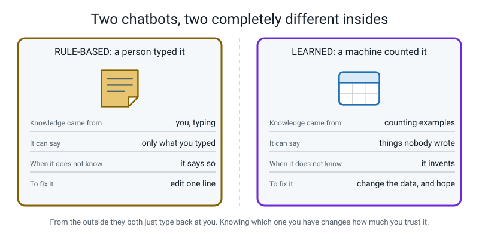
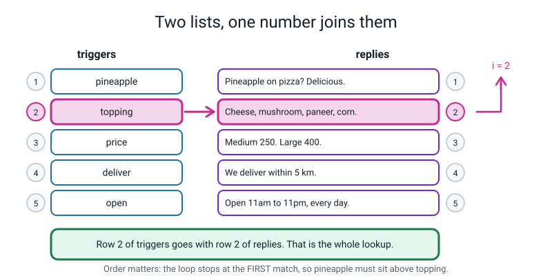
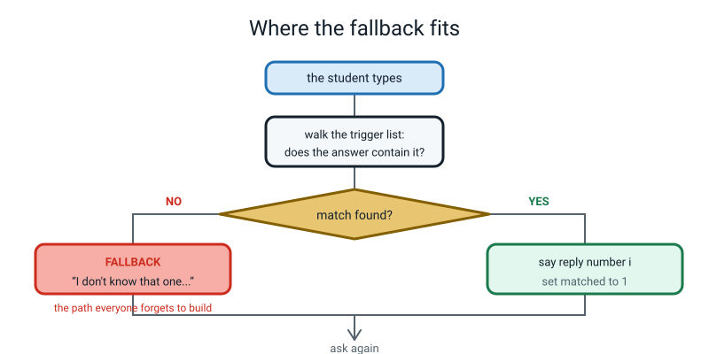
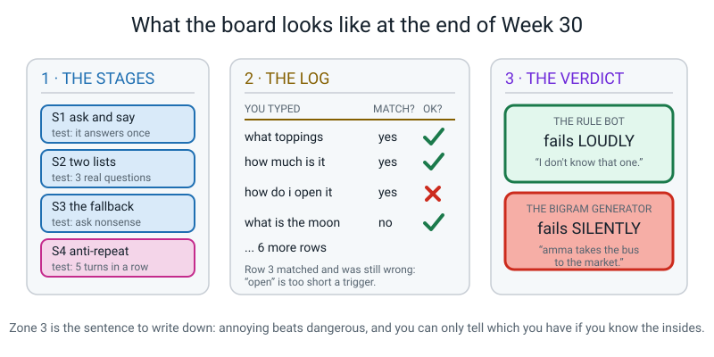
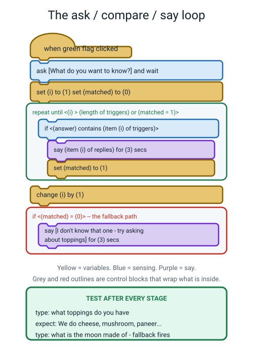
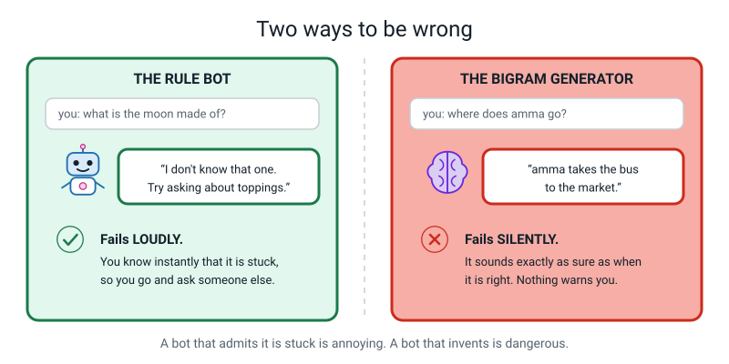

# Week 30 — Build a Chatbot in Scratch

[⬅ Week 29](week-29.md) · [Course Home](../README.md) · [Week 31 ➡](week-31.md) · [Student Guide](../student-guide/week-30.md) · [Workbook](../workbook/week-30.md)

---

## 📋 At a Glance

| | |
|---|---|
| **Duration** | 70 minutes |
| **Type** | 🟩 Lab |
| **Big idea** | A rule-based bot and a learned language model fail in completely different ways, and knowing which one you are talking to changes how much you should trust it. |
| **New vocabulary** | n-gram · trigram · fallback |
| **Materials** | **Week 29's score sheet and next-word table** (essential for the comparison at the end), the printed Trigger Planning Sheet and Ten-Question Log (both in the Answer Key), pencil, a USB stick or a folder you can find again |
| **Tech needed** | A browser at **scratch.mit.edu**. Nothing to install. An account is optional but makes saving easier. Keyboard required; a mouse or trackpad strongly preferred over a touchscreen for dragging blocks. |
| **Prep time** | 25 minutes the night before + 5 minutes on the day |

---

## 🎯 Lesson Objectives

By the end of this lesson your student can:

1. **Build a working Scratch chatbot** using two lists, an ask-and-wait loop and a contains-check, and
   demonstrate it answering three different real questions.
2. **Add a fallback reply** in the bot's own honest voice, so that input matching nothing gets an
   admission rather than silence or a wrong answer.
3. **Diagnose and fix the repeat bug** — identify which of the three causes their bot has, and fix it so
   the bot does not give the same answer over and over.
4. **Compare the two failure modes with a real example of each**: what happens when a rule-based bot
   meets something outside its list, versus what happens when a next-word model does.
5. Say what an **n-gram**, a **trigram** and a **fallback** are, without notes.

---

## 🧑‍🏫 What YOU Need to Know First

*Read this once. About 15 minutes. Two thirds of it is about the difference between the two kinds of bot;
one third is Scratch mechanics you will need in order to fix things live. No prior programming knowledge
is assumed.*

### Idea 1 — the whole point of the week, in one picture

Your student has now built two things: a next-word table that **learned** by counting (Weeks 28 and 29),
and — in the next hour — a chatbot whose every reply **was typed in by them**. From the outside these two
machines look identical. You type, they type back. Inside they could not be more different, and the
difference decides how much you should trust each one.


*Figure 30.1 — The comparison this whole lesson is building towards. Read it row by row.*

The row that matters most is the fourth one. **When a rule-based bot doesn't know, it says so. When a
learned generator doesn't know, it invents.** That single asymmetry is worth an hour of anybody's time,
and the only way an 11-year-old will believe it is if they build both machines themselves and watch each
one fail in front of them.

### Idea 2 — what a rule-based chatbot actually is

Here is the entire architecture, and it is genuinely this small:

1. Two lists, side by side. One holds **triggers** — words to look for. The other holds **replies**.
2. Ask the person a question. Wait for their answer.
3. Walk down the trigger list from the top. For each one, ask: does the person's answer *contain* this
   word?
4. The moment one matches, say the reply that sits at **the same position** in the other list. Stop
   walking.
5. If you reach the bottom with no match, say the **fallback**.


*Figure 30.2 — The two lists are joined by nothing but a position number. That is the whole lookup.*

Three consequences follow, and all three will bite in the lab:

**Order is a rule.** Because the loop stops at the first match, `pineapple` beats `topping` only because
it sits higher in the list. Move it to the bottom and the pineapple joke becomes permanently
unreachable — the word "pineapple" appears in questions about toppings, so `topping` will always grab
those questions first. Your student met this exact idea in Week 8 with first-match-wins rule ladders;
name that connection out loud, because recognising an old idea in new clothes is worth a lot.

**`contains` is generous, sometimes too generous.** The trigger `open` matches "what time do you open"
— good — and also "how do I open the box" and "are you opening a new branch" — bad. Short triggers cause
false matches. The rule of thumb to give them: **no trigger shorter than four letters**, and prefer the
longest trigger that still catches real questions.

**It is not machine learning.** Look at Figure 30.1's first row. This bot's knowledge came from a person
typing. Nothing was learned from anything. It belongs to the rule-based family from Week 1, and being
able to tell the two families apart on sight is one of Level 1's headline objectives.

### Idea 3 — the fallback, which everybody forgets to build

> **Fallback** — the reply a rule-based bot gives when nothing in its list matches.


*Figure 30.3 — The path everyone forgets to build.*

Without a fallback, a bot that finds no match does one of two things, and both are bad: it says nothing
at all (which looks broken and makes the user assume the program crashed), or — if the code is written
carelessly — it says whatever reply happened to be sitting in the variable from the previous turn, which
looks like a confident wrong answer.

A good fallback does three jobs at once. It **admits** the bot is stuck. It **does not pretend**. And it
**steers** — it tells the user what the bot *can* do. So:

> ❌ *"Error."* — true, useless, frightening.
> ❌ *"Interesting question! Tell me more."* — dodging. This is the worst option, because it hides the
> failure behind friendliness.
> ✅ *"I don't know that one — try asking about toppings, price, delivery or opening time."*

Have your student write the fallback **in the bot's own voice**, and be quite fussy about it. Writing an
honest error message is a real skill, it takes thirty seconds, and it is a small piece of ethics
disguised as a piece of programming.

### Idea 4 — n-grams: how much memory a model has

Three words, one idea, and it closes the loop on last week.

> **N-gram** — n tokens in a row. A **bigram** is 2. A **trigram** is 3.

Last week's table was a bigram table: it looked at pairs, which means it could see **one** word before
the guess. A trigram table is keyed on the previous **two** words. The pattern:

| Name | Tokens in the group | Words of memory before the guess | Groups from 40 tokens |
|---|---:|---:|---:|
| bigram | 2 | 1 | 39 |
| trigram | 3 | 2 | 38 |
| 4-gram | 4 | 3 | 37 |
| n-gram | n | n − 1 | 40 − (n − 1) |

Does more memory help? On our bus corpus, genuinely yes — and the result is checkable, so here it is in
full, because a student will ask and you want to be able to answer rather than wave.

Under **bigrams**, greedy generation from `the` loops forever: `the bus to the bus to …`

Under **trigrams**, follow it through:

- Context `(the, bus)` occurs 4 times, followed by `to` twice, `goes` once, `.` once. Greedy takes `to`.
- Context `(bus, to)` occurs twice, followed by `the` both times. Forced: `the`.
- Context `(to, the)` occurs three times, followed by `market` once, `shop` once, `bus` once. **A
  three-way tie**, broken by whichever appeared first in the corpus: `market`.
- Context `(the, market)` occurs once, followed by `.`. Forced.

Output: **`the bus to the market .`** — and it *ends*. One extra word of memory broke the loop.

So more context genuinely fixes forgetting and loops. Now the sting, which is the honest part:

**`amma takes the bus to the market .` is still perfectly legal under trigrams.** Check it: `(amma,
takes) → the`, `(takes, the) → bus`, `(the, bus) → to`, `(bus, to) → the`, `(to, the) → market`, `(the,
market) → .` Every step legal. The hallucination survives, because at the critical moment the two
visible words are `to the`, and `amma` is still four words back and still invisible.

How much memory *would* fix it? You would need the group `(amma, takes, the, bus, to, the)` to exist as
its own row — a **7-gram** — and in our corpus that phrase occurs exactly once and is followed by
`shop`, so a 7-gram model would forbid `market` outright.

And that is where the trade-off appears. Our corpus contains that six-word phrase because our corpus is
six sentences about the same bus. **In real text, almost no six-word phrase ever repeats.** So a 7-gram
model has almost nothing to count: each group has one member, the "choice" is forced, and the generator
just quotes its source text back at you word for word. That is a real, named phenomenon, it has a proper
treatment in Level 2, and the shape of it is exactly the Week 10 rule explosion again — more precision,
exponentially more rows, exponentially less evidence per row.

**The one-line version for the student:** more memory fixes forgetting. It does not fix truth, and past a
point it stops being affordable.

### Idea 5 — Scratch mechanics you will need to fix things live

You do not need to know Scratch. You need to know five things.

1. **No account is required.** Go to scratch.mit.edu, click **Create**, and you are in the editor. Work
   lives in the browser tab, which means **a closed tab is lost work**. This matters; see the prep list.
2. **Blocks are dragged from the left palette into the middle.** They snap together like Lego. Colour
   tells you the category: yellow = Events and Control, orange = Variables, light blue = Sensing,
   purple = Looks, green = Operators.
3. **Lists live under Variables.** Scroll down in the Variables palette to **Make a List**. Once a list
   exists you get blocks for `add … to`, `item ( ) of`, `length of`, `delete all of`. Untick the
   checkbox next to a list's name to stop it covering the stage.
4. **`ask … and wait` is in Sensing**, and it puts whatever was typed into a block called `answer`,
   also in Sensing. `answer` is not a variable you make; it already exists.
5. **`contains` is in Operators** — the block reads `< [apple] contains [a] ? >`. Two facts about it
   that matter today: it is **case-insensitive**, so `HOW MUCH` matches a trigger of `how much`; and it
   matches anywhere inside the text, so `open` matches `opening`.

The one Scratch behaviour that will confuse you if nobody warns you: **`say … for (2) seconds` blocks the
script**. Nothing else happens during those two seconds. So if a bot appears to be ignoring you, it is
often just mid-`say`. Keep the durations at 2 or 3 seconds, never longer.

### The two misconceptions you will hit today

**Misconception 1: "this bot is AI, so it must be learning from me."**

It is not. It cannot. There is no line anywhere in the project that changes the lists. Ask your student
to find it — the search itself is the lesson. Then the sharper question: *"What would you have to add for
it to learn?"* They will invent something like "add a block that adds a new trigger when it doesn't
know". That is a real answer, and it is worth pointing out that they have just designed a learning
system, and that the hard part is not the adding — it is deciding what the reply should be.

**Misconception 2: "the fallback means the bot failed, so the fallback is bad."**

Backwards, and this is the most valuable thing in the lesson to correct. The fallback firing is the bot
**succeeding at being honest**. Compare with last week: the generator, faced with something it didn't
know, produced `amma takes the bus to the market` in a confident voice. Which of those two behaviours
would you rather have from something you are relying on? *Annoying beats dangerous.* Make them say it
out loud.

### How deep to go, and where to stop

**Go this deep:** two lists joined by an index; ask-and-wait; contains; first-match-wins ordering; a
fallback in the bot's own voice; the three causes of the repeat bug; the ten-question log; and the
side-by-side comparison of the two failure modes.

**Stop before these:**
- **Any code outside Scratch.** Level 1 has zero programming languages. Scratch blocks are the ceiling.
- **Real chatbot architecture** — transformers, attention, training. Level 2, all of it.
- **Bias, missing groups, who is in the data** — **Week 31**, which is next week and needs its own hour.
- **Privacy, fakes, over-trust** — **Week 32**.
- **Building a *learning* bot in Scratch.** Discuss it as a design idea if it comes up, and do not build
  it. It cannot be done well in the time and a half-built one teaches the wrong lesson.

---

## 🧰 Prep Checklist

### 25 minutes, the night before

- [ ] **Open scratch.mit.edu on the actual device** you will use. Click **Create**. Check the editor loads
      and that you can drag a block. School networks sometimes block it; find out tonight, not tomorrow.
- [ ] **Build the whole bot yourself, all four stages.** Twenty minutes. This is not optional. You will be
      asked "why isn't it working" at least twice, and the only way to answer in ten seconds is to have
      made the same mistakes yourself the night before.
- [ ] **Deliberately break it three ways and fix each**, so you recognise the symptoms instantly:
      (a) drag `set i to 1` and `set matched to 0` *above* the `forever` block — the bot will fall back to
      "I don't know that one" on every turn after the first;
      (b) delete `set matched to 1` from inside the `if` — a question containing two triggers gets two
      replies stacked;
      (c) add a trigger of just `is` at the top of the list — almost every question now gets reply 1.
- [ ] **Decide the saving plan.** Signed in: `File → Save now` works. Not signed in:
      `File → Save to your computer` downloads a `.sb3` file. Decide **which folder** it goes in and write
      the path on a sticky note. "Downloads" is where student work goes to die.
- [ ] **Print two sheets** from the Answer Key: the **Trigger Planning Sheet** and the **Ten-Question
      Log**.
- [ ] **Find Week 29's score sheet and next-word table.** The final ten minutes of this lesson do not work
      without them physically on the desk.

### 5 minutes, on the day

- [ ] Browser open at the Scratch editor, already on a new blank project.
- [ ] Week 29's score sheet and table on the desk, to the right of the keyboard.
- [ ] The board ruled in three zones as in Figure 30.4 below: THE STAGES · THE LOG · THE VERDICT.
- [ ] The student's chosen topic and their jotted list of ten likely questions, from last week's prep.


*Figure 30.4 — The board plan. Zone 3 is the sentence they take away.*

### If something fails

| If this fails | Do this instead |
|---|---|
| **Scratch will not load, or the network is down** | Run the whole thing unplugged as **Human Bot**. You hold the two printed lists and play the computer, strictly and stupidly: read the triggers from the top, take the first match, say that reply word for word, and say the fallback if nothing matches. Your student asks the ten questions and fills the log exactly as planned. Every single objective is still reachable — the comparison at the end is the lesson, not the software. Honestly, some teachers get a better lesson this way. |
| **Dragging blocks is painful (touchscreen, trackpad trouble)** | Build stages 1 and 2 yourself with the student directing you block by block — "now get the orange one, now put it inside" — then hand over for stages 3 and 4, which need far less dragging. Directing is genuine understanding; do not treat it as second best. |
| **The project is lost mid-lesson** | Do not rebuild from scratch. Rebuild only stage 2 with three triggers, then jump straight to stage 3 and 4. You need a *working* bot to log, not a complete one. Three triggers is enough for a ten-question log. |
| **The bot works and there are 20 minutes left** | Do not add more triggers — that is homework. Go straight to the comparison, then the "harder" variations, then the trigram question from Idea 4. Understanding is worth more than list length. |
| **Time is gone and the log is unfinished** | Five questions instead of ten, and do the comparison anyway. The comparison is the objective. A log with three failures in it is plenty of evidence. |

---

## ⏱️ The Lesson, Minute by Minute

| # | Segment | Minutes | Running total |
|---|---|---|---|
| 1 | 🪝 Hook — Ask both machines the same question | 8 | 8 |
| 2 | 🧠 Concept — Two lists, one number, and how much a model remembers | 18 | 26 |
| 3 | 🔍 Worked example together — stages 1 and 2, built live | 14 | 40 |
| 4 | 🎲 Activity — stages 3 and 4, then the ten-question log | 20 | 60 |
| 5 | 🔑 Wrap & assign | 10 | 70 |

---

### 1 · 🪝 Hook — Ask both machines the same question (8 min)

**Say this:**

> "Last week your tally sheet and a die produced this sentence: *amma takes the bus to the market.*
> Perfect English. Completely untrue. You stamped FALSE across it in red.
>
> Today you're going to build a second chatbot — a completely different kind — and then we're going to
> ask both of them a question they cannot answer, and watch what each one does about it. That comparison
> is the entire lesson. Everything before it is just getting the second machine built.
>
> Here's the question I'm going to ask both of them at the end: **'What is the moon made of?'**
>
> Your tally sheet has never heard of the moon. Your Scratch bot will only know about five things and
> the moon won't be one of them. So neither of them knows. Same ignorance, both machines.
>
> Now guess. Will they behave the same way?"

Take the guess. Most students say yes, or "they'll both be wrong". Both answers are useful.

> "They won't behave the same way at all. They will fail so differently that one of them is annoying and
> the other one is genuinely dangerous. And you won't have to take my word for it — you'll have built
> both."

**Do this:**

- Write on the far left of the board, big: **"What is the moon made of?"** and under it two empty boxes
  labelled **RULE BOT** and **BIGRAM GENERATOR**. Leave them empty all lesson. You will fill them in the
  wrap and it should feel like a punchline landing.
- Put Week 29's score sheet next to the keyboard where they can see the red FALSE stamp.
- Ask what topic they chose for their bot last week, and get it said out loud now. If they didn't choose
  one, give them a pizza shop and move on — the topic is not the point and choosing takes six minutes if
  you let it.

**Ask this:**

| Ask | Hoping for | If they say something else |
|---|---|---|
| "Will the two machines fail the same way?" | Any guess | Do not correct. Write their prediction on the board with their name on it. A prediction they wrote themselves is far more powerful to be right or wrong about than one you offered. |
| "What should a machine do when it doesn't know?" | "Say it doesn't know" | This is the answer you want in the room early. If they say "guess" — ask "what if it's about medicine?" That reframes it instantly and they usually change their mind unprompted. |
| "Which machine you built last week counts as AI?" | "The tally sheet" | If they're unsure, go back to the Week 2 definition: was it built by counting examples, or did a person write its rules? The tally sheet counted. Today's bot will be typed. Different families. |

---

### 2 · 🧠 Concept — Two lists, one number, and how much a model remembers (18 min)

**Say this — part one, the two lists:**

> "A rule-based chatbot is smaller than you think. It's two lists and a number.
>
> The first list is called `triggers` — words to look for. The second is called `replies`. They sit side
> by side, and they're joined by nothing except the **position**. Row 2 of triggers goes with row 2 of
> replies. That's the whole lookup. There's no cleverness holding them together — just a number."

Show Figure 30.2 and let them read it for fifteen seconds.

> "So here's the bot's whole thinking process. You type something. It starts at row 1 and asks: *does
> what they typed contain the word in row 1?* If yes, it says row 1's reply and stops. If no, it goes to
> row 2. And so on down the list.
>
> Notice the word **stops**. It takes the *first* match, not the best match. Which means the order of the
> list is a rule in itself. Where have you met that before?"

**Ask this:**

| Ask | Hoping for | If they say something else |
|---|---|---|
| "Where have you met first-match-wins before?" | Week 8's rule ladder | If they don't remember, remind them of the height-sign rule ladder: the first rule that fitted decided the answer, so putting a general rule at the top made the specific ones below it unreachable. Same idea, new clothes. |
| "My triggers are `pineapple` and `topping`, in that order. I type 'do you have pineapple as a topping?' Which reply do I get?" | The pineapple one | If they say the topping one, walk the list with them out loud: row 1 is `pineapple`, does the sentence contain it, yes, stop. The word "stop" is the whole answer. |
| "Now I swap them so `topping` is row 1. What happens to the pineapple reply?" | "It never gets used" | If they say "it still works sometimes", ask them to find a question with `pineapple` in it that does *not* mention toppings. Possible but rare. The pineapple reply is now nearly dead, and it wasn't deleted — it was just demoted. |
| "My trigger is `open`. I type 'how do I open the box?' What happens?" | It gives the opening hours — wrong | If they don't see it, type it out: does "how do i open the box" contain "open"? Yes. So it matches. Then say the rule: **no trigger shorter than four letters**, and even four is risky. |

**Say this — part two, the fallback:**

> "Now the important bit. What if it gets to the bottom of the list and nothing matched?
>
> If you don't handle that, one of two bad things happens. Either it says nothing at all — looks broken,
> and the person thinks the program crashed — or it says whatever it said last time, which looks like a
> confident wrong answer. Both are worse than useless.
>
> So you build a **fallback**: the reply the bot gives when nothing matches. And you're going to write
> it, in the bot's own voice, and I'm going to be fussy about it.
>
> Which of these three is the good one?
>
> One: *'Error.'*
> Two: *'Interesting question! Tell me more.'*
> Three: *'I don't know that one — try asking about toppings, price, delivery or opening time.'*"

**Ask this:**

| Ask | Hoping for | If they say something else |
|---|---|---|
| "Which fallback is best, and why?" | The third one | If they pick the second, ask what the bot has actually told the user. Nothing. It hid the failure behind being friendly. Name that: **dodging is worse than admitting, because it stops the user going somewhere else.** |
| "What three jobs does a good fallback do?" | Admits · doesn't pretend · steers | Pull them out one at a time if needed. Write all three on the board. This list is what you will mark their fallback against in twenty minutes. |
| "Is the fallback firing a failure or a success?" | Ideally "a success" | Most students say failure. Push: "Last week, when your table hit something it didn't know, what did it do?" It invented. "And this one?" It admits. "So which behaviour is better?" This is the moment the whole week's thesis first appears, and it should come out of their mouth. |

Show Figure 30.3, trace both paths with a finger, and move on.

**Say this — part three, n-grams, in four minutes:**

> "Before we build, one loose end from last week. Your table looked at pairs — two words — so it could
> see exactly **one** word before its guess. Pairs have a name: bigrams. Three in a row is a **trigram**,
> and in general n in a row is an **n-gram**. So:
>
> A bigram sees one word of memory. A trigram sees two. A 5-gram sees four.
>
> Would a trigram fix your loop? Actually yes, on our corpus — I've checked it and I'll show you the
> trace if you want it. Greedy on trigrams goes `the bus to the market` and *stops*. One extra word of
> memory killed the loop.
>
> Would a trigram fix `amma takes the bus to the market`?"

**Ask this:**

| Ask | Hoping for | If they say something else |
|---|---|---|
| "Would two words of memory fix the Amma sentence?" | "No — `amma` is further back than that" | If they say yes, count the words with them on their sheet. At the moment it picks `market`, the two visible words are `to the`. `amma` is four words further back. Still invisible. |
| "How far back would it need to see?" | "All the way back to `amma`" — six words | Then name it: that's a 7-gram. And in our corpus that exact six-word phrase does occur once, followed by `shop`, so a 7-gram genuinely would forbid `market`. |
| "So why doesn't everyone just use 7-grams?" | Anything about it being too big / not enough examples | Give it to them straight if needed: in real text, almost no six-word phrase ever repeats. So every group has exactly one member, there's no choice to make, and the generator just quotes its source back at you. Same shape as the Week 10 rule explosion. |

**Do this:**

- Write in zone 3: **"bigram = 1 word of memory · trigram = 2 · n-gram = n − 1"**.
- Under it: **"more memory fixes forgetting. It does not fix truth."**
- Then close the palette and open Scratch. Do not let the n-gram conversation run past four minutes; it
  is a bridge, not a destination, and you need the clock for the build.

---

### 3 · 🔍 Worked Example Together — stages 1 and 2, built live (14 min)

The rule for this segment: **test after every stage.** Not at the end. After every stage. A bot that
worked five minutes ago and doesn't now has a bug in the last five minutes of work, and that is a
findable amount of code. This habit is worth more to your student than anything else they will learn from
Scratch.

**Stage 1 — ask and say (4 min).**

**Say this:**

> "Three blocks. That's stage 1. From Events, `when green flag clicked`. From Sensing, `ask [What do you
> want to know?] and wait`. From Looks, `say ( ) for 2 seconds` — and inside the say, we want what they
> typed, which is a Sensing block called `answer`. Drag `answer` right into the say slot.
>
> Green flag. Type something. It should repeat your words back at you."

```
   when green flag clicked
     ask [What do you want to know?] and wait
     say (answer) for (2) seconds
```

**Do this:** run it. Type "hello". It says "hello". Say out loud: *"That's a chatbot. A stupid one, but
the plumbing is done — it can hear you and it can talk. Everything from here is deciding what to say."*

**Stage 2 — the two lists and the loop (10 min).**

**Say this:**

> "Now the lists. Variables category, scroll to the bottom, **Make a List**. Call the first one
> `triggers`. Make another called `replies`. Untick both checkboxes so they don't cover the stage.
>
> Then two variables — **Make a Variable** — called `i` and `matched`. `i` is which row we're checking.
> `matched` is whether we found anything yet. Untick those too.
>
> Now we fill the lists. Ten blocks, alternating: add a trigger, add its reply, add a trigger, add its
> reply. **Specific things go above general things** — so `pineapple` goes above `topping`."

Here is the target stack. Build it a block at a time, saying each line as you place it.


*Figure 30.5 — The finished block stack. Grey and red outlines are Control blocks that wrap what sits inside them.*

```
   when green flag clicked

     delete all of [triggers v]
     delete all of [replies v]

     add [pineapple] to [triggers v]
     add [Pineapple on pizza? Delicious.]      to [replies v]
     add [topping]   to [triggers v]
     add [Cheese, mushroom, paneer, corn.]     to [replies v]
     add [price]     to [triggers v]
     add [Medium 250. Large 400.]              to [replies v]
     add [deliver]   to [triggers v]
     add [We deliver within 5 km.]             to [replies v]
     add [open]      to [triggers v]
     add [Open 11am to 11pm, every day.]       to [replies v]

     say [Hi, I am PizzaBot. Ask me something.] for (2) seconds

     forever
       ask [What do you want to know?] and wait

       set [i v] to (1)
       set [matched v] to (0)

       repeat until <<(i) > (length of [triggers v])> or <(matched) = (1)>>
         if <(answer) contains (item (i) of [triggers v]) ?> then
           say (item (i) of [replies v]) for (3) seconds
           set [matched v] to (1)
         end
         change [i v] by (1)
       end
     end
```

Narrate the loop like this, because this is the part that is genuinely new:

> "`set i to 1` — start at the top of the list. `set matched to 0` — we haven't found anything yet.
>
> `repeat until i is bigger than the length of triggers, OR matched equals 1` — keep going until either
> we run off the end of the list, or we found something.
>
> Inside: `if what they typed contains item i of triggers` — then say item i of replies, and set matched
> to 1 so the loop knows to stop. Then, outside the if but inside the repeat: `change i by 1`, move to
> the next row.
>
> That `change i by 1` has to be *outside* the if. If you put it inside, then whenever a row doesn't
> match, `i` never moves, and it checks the same row forever. Scratch will look frozen."

**Do this:** run it and test three questions immediately:

| Type this | Expect |
|---|---|
| `what toppings do you have` | Cheese, mushroom, paneer, corn. |
| `HOW MUCH IS THE PRICE` | Medium 250. Large 400. — proving `contains` ignores capitals |
| `do you have pineapple as a topping` | the pineapple reply, because row 1 wins |

**Ask this:**

| Ask | Hoping for | If they say something else |
|---|---|---|
| "Why does 'HOW MUCH IS THE PRICE' work when the trigger is lowercase?" | "`contains` ignores capitals" | If surprised, try `PINEAPPLE` too. Note the contrast with Week 27: when they tokenized by hand, they had to lowercase everything deliberately. Scratch does it for them here, and other systems do not. |
| "Now type 'what is the moon made of'. What happens?" | Nothing — it goes silent | Let the silence sit for a few seconds. It is genuinely uncomfortable, and that discomfort is why stage 3 exists. Then: "It walked the whole list, found nothing, and had nothing to say. That's the hole we're filling next." |
| "Why is `change i by 1` outside the if?" | So it moves on even when a row doesn't match | If they can't say, break it deliberately: drag it inside the if, run it, type something that doesn't match row 1. Scratch freezes. Undo. Three seconds of broken beats a paragraph of explanation. |

---

### 4 · 🎲 Activity — Stages 3 and 4, then the ten-question log (20 min)

Full instructions in the next section. Lesson flow:

**Minutes 0–5 — stage 3, the fallback.** One `if` block, and a sentence they write themselves.

```
     if <(matched) = (0)> then
       say [I don't know that one - try asking about toppings, price, delivery or opening time.] for (3) seconds
     end
```

It goes **inside the forever loop, after the repeat-until block**, not inside it. Test immediately with
"what is the moon made of". The bot should now answer honestly.

Be fussy about the wording. Mark it against the three jobs on the board: does it admit, does it avoid
pretending, does it steer? Make them rewrite it if it fails any of the three. This is thirty seconds well
spent.

**Minutes 5–10 — stage 4, the repeat bug.**

**Say this:**

> "Now ask it five different questions in a row without stopping the program. Go.
>
> If it gives you the same answer to all five, or falls back on everything after the first one, you have
> the repeat bug. There are exactly three things that cause it. Find yours."

The three causes, which the student diagnoses rather than being told:

| Symptom | Cause | Fix |
|---|---|---|
| Turn 1 works, then everything gets the fallback | `set i to 1` and `set matched to 0` are **above** the `forever` block, so `i` is stuck past the end of the list | Drag both `set` blocks **inside** the forever loop, directly under `ask and wait` |
| A question containing two trigger words gets two replies stacked on top of each other | `set matched to 1` is missing from inside the `if`, so the loop never stops early | Add `set matched to 1` immediately after the `say` inside the `if` |
| Almost every question gets the *same* reply, from near the top of the list | A trigger is too short or too general and sits too high — `open`, `is`, `to`, `a` | Lengthen it, or move it below the specific triggers, or both. **No trigger shorter than four letters** |

Then re-test five turns in a row. Do not move on until five different questions get five appropriate
responses.

**Minutes 10–18 — the ten-question log.** This is the actual assessment of the week, disguised as
testing.

**Say this:**

> "Ten questions. Type each one, write down what the bot said, and tick two boxes: did a trigger match,
> and was the reply sensible? Those are two different questions and I want them kept apart — just like
> 'reads well' and 'is it true' last week.
>
> Include at least two questions you know it can't answer. A test suite made only of questions you know
> it can pass tells you nothing."

Use the printed Ten-Question Log. The reference set is in the Answer Key, Part D.

**Minutes 18–20 — first look at the comparison.** Put the log next to last week's score sheet.

**Ask this:**

| Ask | Hoping for | If they say something else |
|---|---|---|
| "How many of your ten did the bot get sensibly right?" | Any honest number | Do not react to the number at all. The point is the failures, and if they think you want a high score they will fudge the log. Say so explicitly: "The failures are the valuable rows." |
| "For every failure, could you tell instantly that it had failed?" | "Yes" | This is the key question of the entire week. If they say no, look at the row together — a fallback reply is unmistakable, and a false match like "how do i open it" → opening hours is obviously off-topic. |
| "Now look at last week's row 2. Could you tell instantly that *that* had failed?" | "No" | Let the contrast do all the work. Say nothing for a moment. Then: "One of your machines is annoying. The other one is dangerous. Which is which?" |

---

### 5 · 🔑 Wrap & Assign (10 min)

**Say this:**

> "The two empty boxes on the board. Let's fill them.
>
> *What is the moon made of?*
>
> Your Scratch bot says: **'I don't know that one — try asking about toppings.'** Useless. Slightly
> irritating. And **completely honest**. You know instantly that it can't help you, so you go and ask
> someone else. It failed **loudly**.
>
> Your bigram generator says: **'amma takes the bus to the market.'** Fluent. Confident. In exactly the
> same voice it uses when it's right. Nothing warned you. It failed **silently**.
>
> Now — which of those two machines is more dangerous?"

Show Figure 30.6 and let them sit with it.


*Figure 30.6 — A bot that admits it is stuck is annoying. A bot that invents is dangerous.*

> "Here's the sentence I want you to leave with. **A bot that admits it is stuck is annoying. A bot that
> invents is dangerous.** And notice: the annoying one is the *worse* machine. It's simpler, it knows
> less, it can only say five things. And in one specific and important way it is safer, because it cannot
> pretend.
>
> That's not an argument for building stupid bots. It's an argument for knowing which kind you're
> talking to."

Then the second thing, which is a Level 1 objective in its own right:

> "You have now built one of each family, with your own hands.
>
> Your tally sheet **learned**. Nobody wrote its rules. You counted examples and the rules appeared. It
> can say things nobody ever wrote — that's why it produced a sentence about Amma that wasn't in the
> story. That is **machine learning**.
>
> Your Scratch bot was **told**. Every single word it can say, you typed. It can never say anything you
> didn't type. That is a **rule-based system** — Week 1's other family.
>
> From the outside they look the same. You type, they type back. Being able to tell which one you're
> facing, and knowing what each one does when it gets stuck — that's a real skill, and most adults
> don't have it."

**Do this:**

- Have them write the three vocabulary words with their own definitions in the workbook glossary.
- Have them write, in their own handwriting, the one sentence that is the week's homework centre: *which
  failure would you rather have, and why?* Any answer that engages with visibility earns full marks. An
  answer of "the rule bot, because at least you know" is exactly right. So, interestingly, is "the
  generator, because it's more useful and I'll just check it" — provided they say *how* they'd check.
- **Save the project, twice, now.** Do not leave this to the end of homework. `File → Save to your
  computer`, into the folder you named last night. Then either `File → Save now` if signed in, or take a
  photo of the block stack and both lists. Say why out loud: *"A browser tab is not a saved file. Close
  the tab and this is gone."*
- Keep the log, the score sheet and the table together. Weeks 33 and 34 come back to all three.

---

## 🎲 The Activity, In Full

### The Scratch Bot

**What it is:** a working keyword chatbot, built in four stages with a test after each, then tested
against ten questions with the failures logged, then set side by side with last week's generator so the
two failure modes can be compared with real evidence rather than opinion.

**Time:** 20 minutes in class (5 · fallback — 5 · repeat bug — 8 · log — 2 · first comparison), plus
homework to extend it to ten trigger/reply pairs on their own topic.

**Materials:**
- A browser at scratch.mit.edu, on a device with a keyboard and ideally a mouse
- The printed **Trigger Planning Sheet** — Answer Key Part C
- The printed **Ten-Question Log** — Answer Key Part D
- **Week 29's score sheet** — essential for the last two minutes
- Somewhere to save a file that is not the Downloads folder

### Setup

1. Scratch editor open on a blank project. Stage 1 and 2 already built from the previous segment.
2. Trigger Planning Sheet to the left of the keyboard, Ten-Question Log to the right.
3. Week 29's score sheet visible, red FALSE stamp facing up.

### The four stages, and the test after each

| Stage | Build | Test immediately with | Passes when |
|---|---|---|---|
| **1** | `when green flag clicked` · `ask and wait` · `say (answer)` | anything at all | it repeats your words back |
| **2** | two lists · two variables · the repeat-until loop with the contains check | `what toppings do you have` · `HOW MUCH IS THE PRICE` · `do you have pineapple as a topping` | all three get the right reply, and the pineapple one wins over topping |
| **3** | the `if matched = 0` fallback, in the bot's own voice | `what is the moon made of` | it admits it doesn't know, and steers you to what it does know |
| **4** | the anti-repeat fix | five different questions in a row, without stopping | five appropriate responses, no repeats, no stacked replies |

> **⚠️ Watch out:** the single most common Scratch error today is a block placed **inside** a wrapper
> instead of **after** it, or vice versa. Two to watch: `change i by 1` must be *inside* the repeat-until
> but *outside* the if. The fallback `if` must be *inside* the forever but *after* the repeat-until. If
> something behaves impossibly, check nesting before checking anything else.

### The rules for the log

1. **Ten questions, written down before you type them.** Deciding what to test after seeing the answer
   is not testing.
2. **At least two must be questions you know it cannot answer.** A test set that only contains passes
   tells you nothing.
3. **Two separate columns: did a trigger match, and was the reply sensible.** They come apart, and the
   rows where they come apart are the interesting ones.
4. **Write down what the bot actually said**, not a summary. Exact words.
5. **Do not fix the bot while logging.** Finish the log first. Fixing as you go destroys the record.

### What "finished" looks like

- A bot that answers five different questions in a row appropriately.
- A fallback the student wrote themselves, which admits, does not pretend, and steers.
- A ten-row log with at least two failures in it, each with the bot's exact words.
- For each failure, one of three labels written beside it: **gap** (nothing matched but it should have
  been able to answer), **false match** (a trigger matched something it shouldn't), or **honest
  fallback** (it genuinely didn't know and said so — which is a pass, not a failure).
- The project saved two ways.
- One sentence, in their handwriting, about which failure mode they would rather have and why.

### Variation — easier

**Three trigger/reply pairs instead of five, and a five-question log.** Every objective survives. Three
pairs is enough to demonstrate ordering (put two of them so one is a subset of the other), enough to
produce a false match, and enough to produce a fallback.

Two further supports:
- **You drive the mouse, they direct.** They say which block, from which colour category, and where it
  goes. All the thinking, none of the dragging. Do not treat this as a lesser version.
- **Give them the fallback sentence** and have them improve one word of it, rather than writing it from
  a blank page. Blank pages are where lab time goes to die.

### Variation — harder

1. **The subset trap.** Add two triggers where one is contained inside the other — `open` and `opening
   time`. Predict which one can never fire, then test the prediction. (`opening time` is unreachable if
   `open` sits above it, because any question containing "opening time" also contains "open".) Then fix
   it. This is Week 8's rule ladder with real consequences.
2. **The two-reply trigger.** Make one trigger give a different reply the second time it is asked. This
   needs a third variable as a counter and an `if` inside the `if`. It is genuinely fiddly and it is the
   first honest taste of why real bots are hard.
3. **The hybrid.** Add an eleventh trigger, `story`, whose reply is one of the sentences their bigram
   generator produced last week. Now the project has a rule-based shell with one machine-generated line
   inside it. Then the sharp question: **if a visitor reads that line, can they tell which part of the
   bot made it?** No. That mixture — hand-written scaffolding around a generated core — is how a
   surprising number of real products are actually built, and the fact that you cannot tell from the
   outside is exactly the problem.
4. **The trigram trace.** Using last week's table, work out what greedy generation does under
   **trigrams** instead of bigrams. Full worked answer in Answer Key Part F. Then the follow-up: does it
   fix `amma takes the bus to the market`? (No. And working out how far back you *would* need to see —
   six words, a 7-gram — is the best possible ending to Term 4's first half.)

---

## ❓ Questions Students Ask This Week

**1. "Is my Scratch bot AI?"**

It depends entirely on what you mean, and the honest answer is worth more than a yes or no. If AI means
"a machine doing something that looks like thinking", then yes, it's the oldest kind — bots exactly like
this one were doing this in the 1960s and people found them uncanny. If AI means **machine learning** —
a system that learned its behaviour from examples — then no, definitely not. Every word it can say, you
typed. Your tally sheet, which nobody wrote rules for, is the machine-learning one of your two projects.
Being able to make that distinction is more useful than the label.

**2. "Why doesn't it learn from me when I ask it something new?"**

Because there is no block anywhere in your project that changes the lists. Go and look — the only `add`
blocks run once, at the green flag. And here is the interesting part: you *could* add a block that pushes
a new trigger onto the list when nothing matches. The hard bit isn't adding the trigger. It's deciding
what the **reply** should be. Where would it come from? You'd have to ask the user, and then you have a
bot that believes whatever the last person told it, which is a genuinely bad idea for reasons that
Week 32 covers.

**3. "Could I make it answer anything?"**

No, and this is the rule explosion from Week 10 arriving in a new place. Every question needs a trigger,
and people can phrase the same question forty ways: "how much", "what's the price", "is it expensive",
"cost", "how much does it cost", "£?". You would be typing triggers forever and still missing things.
That gap — the impossibility of writing down every rule — is exactly the reason people started building
systems that learn from examples instead. Your two projects are the two answers to the same problem.

**4. "The bot answered 'how do I open it' with opening hours. Is that a bug?"**

Not in the sense of something being broken — it did precisely what you told it. The trigger `open`
appears inside the sentence, so it matched. This has a name worth knowing: a **false match**. It happens
because `contains` looks anywhere inside the text and doesn't care about meaning. The fix is a longer
trigger — `what time do you open` — but notice the cost: now "when are you open?" won't match either.
Every tightening loses something. That is the same tighten-versus-loosen trade-off from Week 8, and it
never fully goes away.

**5. "Which one would a real company use?"**

Both, usually in the same product, and knowing that is genuinely useful. A bank's chat window very often
has a rule-based layer in front that handles the twenty most common questions with hand-written,
lawyer-approved answers — because for "what's my balance?" you want the *exact* right words every time,
not a fluent guess. Behind that sits something learned, for the questions the rules don't cover. And
usually there is a third path: a button that gets you a human. That layered design exists precisely
because the two kinds of system fail differently, which is what you proved today.

**6. "If the generator is more dangerous, why is everyone using it?"**

Because it is enormously more useful, and pretending otherwise would be dishonest. Your Scratch bot can
say five things. A learned generator can answer questions nobody has ever typed, in any language, about
almost anything. That is not a small advantage — it is the whole reason this technology matters. The
answer isn't to go back to keyword lists. It is to know which one you're talking to, and to check the
specific, checkable, consequential claims. Week 32 turns that into a tool you can actually use.

**7. "Could you build a bot that knows when it doesn't know?"**

**Nobody knows how to do this reliably, and it is one of the most actively worked-on problems in the
field.** Your Scratch bot *does* know, perfectly — but only because "not in my list" is a completely
clear test, and it has a list of five things. A learned generator has no equivalent test. There's no
place in it where "in my knowledge" ends and "made up" begins; it is producing likely words either way.
Some current systems will refuse, or hedge, or cite a source, and those help. But none of them is
reliable, and researchers disagree — genuinely, in print — about whether the problem is a missing piece
that can be added or something built into how these systems work. So when a chatbot sounds certain, you
have learned nothing about whether it should be.

**8. "Is the tally-sheet generator smarter than the Scratch bot?"**

Interesting question, and it depends what "smarter" measures. The generator can produce sentences nobody
wrote, so it's more *flexible* and more *general*. The Scratch bot is more *reliable*, more
*controllable*, and knows exactly where its own edges are. If "smarter" means flexible, the generator
wins easily. If it means trustworthy, the bot wins easily. That is not a fudge — it is the actual state
of affairs, and noticing that "smart" was doing two different jobs in your question is a genuinely good
piece of thinking.

---

## ⚠️ Where This Lesson Goes Wrong

| What happens | Why | What to do right now |
|---|---|---|
| A block ends up inside a wrapper instead of after it, and the bot behaves impossibly | Scratch's drop zones are small, and `if` and `repeat` blocks look similar when collapsed | Check nesting before anything else. Two specifics: `change i by 1` must be inside the repeat-until but outside the if. The fallback `if` must be inside the forever but after the repeat-until. Drag the suspect block out to a blank area and re-drop it — that is usually faster than squinting |
| Scratch appears to freeze the moment a question doesn't match row 1 | `change i by 1` is inside the `if`, so `i` never advances and the same row is checked forever | Drag it out of the if, still inside the repeat. Then have the student explain what was happening. This one is worth understanding, not just fixing |
| A single question gets two replies stacked on top of each other | `set matched to 1` is missing inside the `if`, so the loop keeps walking after a match | Add it directly under the `say`. Then test with a question containing two trigger words, so they see it fixed |
| After turn 1, everything gets the fallback | `set i to 1` and `set matched to 0` sit above the `forever` loop, so they only ever run once | Drag both inside the forever, directly under `ask and wait`. This is the classic bug and worth staging deliberately if it doesn't happen naturally |
| Almost every question gets the same reply from near the top of the list | A short or general trigger is sitting too high — `open`, `is`, `to` | Lengthen it or demote it. Then state the rule: no trigger shorter than four letters, specific above general. Then re-run the failing questions |
| The whole hour goes into typing ten replies and the comparison never happens | Writing replies is fun, feels productive, and has no natural end | Cap it at **five** pairs in class, hard. Extending to ten is homework. Set a timer if you must. The comparison is the objective; the bot is only the apparatus |
| The log gets filled in with only questions the bot can answer | Nobody enjoys writing down their own project failing | Require at least two questions you know it will fail, agreed *before* typing. Then reframe: "the failures are the data. A log of ten passes proves nothing about anything" |
| The student concludes rule-based bots are better than learned ones | Today's demo makes the rule bot look honest and the generator look shifty | Correct it firmly. The rule bot can say five things. The generator can answer questions nobody ever typed. The finding is narrower: **they fail differently, and you must know which you have.** Not "one is better" |
| The project is lost because the tab was closed | A Scratch project in a browser tab is not a saved file, and nothing warns you loudly enough | Save at minute 40 and again at minute 68, both times to a named folder. Say the sentence out loud: "A tab is not a file." If it is already lost, rebuild stage 2 only, with three triggers |
| The fallback comes out as "Interesting question!" | It sounds friendly, and friendly feels like good design | Mark it against the three jobs on the board. It admits nothing and steers nowhere — it hides the failure behind politeness, which stops the user going to find a real answer. Make them rewrite it |

---

## 🧭 Differentiation

### If they are struggling

**Cut:** stage 4's second and third causes (keep only "move the two `set` blocks inside the loop"). Cut
the n-gram segment down to one sentence: *"a bigram remembers one word, a trigram remembers two, more
memory helps with loops and not with truth."* Cut the log to five questions.

**Shrink:** three trigger/reply pairs, not five.

**Reteach in this order:**

1. **Be the bot, on paper, before touching Scratch.** You hold the two printed lists. They ask a
   question. You walk the trigger list aloud with your finger — "row 1, pineapple, is 'pineapple' in
   what you said? no. row 2, topping, is 'topping' in there? yes — reply row 2." Do this four times. The
   algorithm becomes obvious, and everything in Scratch afterwards is just typing.
2. **Then stage 1 only.** Three blocks. It echoes you. Stop and admire it; that is a working program.
3. **Then two triggers, no loop at all.** Just two `if` blocks in a row, hard-coded. It works, it is
   ugly, and it makes the *point* of the loop obvious when you then ask "what if you had fifty?"
4. **Then the loop**, replacing the ifs.
5. **Then the fallback**, which is one block and the most satisfying moment in the build.

**Non-negotiable:** they must have a bot that says "I don't know that one" to something, and they must be
able to say that last week's generator would have made something up instead. That is the week. Everything
else is apparatus.

### If they are flying

Give them the four "harder" variations, then these:

1. **"Break your own bot in three ways and write the symptom for each."** They now know three bugs. Have
   them induce each one deliberately, record the exact symptom, and fix it. Deliberately breaking
   something and predicting the symptom is a higher-order skill than building it in the first place.
2. **"How many triggers would you need to cover every way of asking one question?"** Have them actually
   write out every phrasing of "how much does it cost" they can think of. They will get eight or ten and
   run out, and they will not have covered "is it dear", "what's the damage", or a typo. Then: what
   would you build instead? They will invent learning from examples, unprompted.
3. **"Design the layered bot."** Which questions should go to hand-written rules, which to a learned
   generator, and which straight to a human? Give them a specific setting — a doctor's surgery, a school
   office, a game's help chat. Their reasoning should hinge on cost-of-being-wrong, which is Week 32's
   central tool arriving early.
4. **"Write the label."** Two sentences that should appear at the top of any chat window, telling the user
   which kind of machine they are talking to and what it does when it doesn't know. Then: would anyone
   read it? Would it change anything? This lands squarely in Week 32 and it is a good place to leave them.

### If they won't engage today

Build stage 1 yourself in ninety seconds and hand over the keyboard. "Type something rude at it." It
repeats it back. That is usually enough to buy four minutes.

Then: "Right. Make it answer one question about something you actually care about." One trigger, one
reply, on their topic — a game, a team, a pet. Their choice, their words, no planning sheet. Test it.
Then add a second. Then, when they type something that matches nothing and it goes silent, say only:
*"Huh. It's got nothing. What should it say?"* They will write a fallback, in their own voice, without
being asked to, and it will be better than the one on the planning sheet.

That is a complete lesson on a bad day: a bot that works, a fallback they wrote, and the observation that
it admits when it's stuck. The log, the four stages and the n-gram vocabulary can go to homework or to
next week's warm-up. Do not fight for the log.

---

## ✅ Assessing Understanding

Three checks, last five minutes, exact wording. About ninety seconds each.

### Check 1 — the two failure modes

**Say exactly:** *"Ask your Scratch bot something it can't answer, and tell me what it does. Then tell me
what your tally sheet did when it hit something it didn't know."*

**A good answer:** "The bot says 'I don't know that one, try asking about toppings.' The tally sheet made
up 'amma takes the bus to the market', which wasn't true." Then, ideally, unprompted: "so you can tell
when the bot fails and you can't tell when the table fails."

**Not yet:** naming only one of the two, or describing both as "getting it wrong". Prompt: "Would you
*know* it had got it wrong, in each case?"

### Check 2 — which family is which

**Say exactly:** *"You've built two machines this term. Which one learned, and which one was told? How do
you know?"*

**A good answer:** "The tally sheet learned — I counted examples and nobody wrote the rules. The Scratch
bot was told — I typed every reply myself." The evidence matters more than the labels. Full credit for
"the bot can only say things I typed; the table said something nobody wrote."

**Not yet:** "the Scratch one is AI because it talks." Prompt: "Where did each one's knowledge come
from?" That question does the work.

### Check 3 — the fallback

**Say exactly:** *"Read me your fallback. Now tell me why it's better than 'Error' and better than
'Interesting question, tell me more.'"*

**A good answer:** their own sentence, plus two of these three reasons: it admits it doesn't know, it
doesn't pretend, it tells you what to ask instead. Extra credit for spotting that "Interesting question"
is the worst of the three because it disguises the failure and stops you looking elsewhere.

**Not yet:** "because it's more polite." Prompt: "What does the person now know that they didn't know
with 'Error'? And what do they *not* know with 'Interesting question'?"

### Mastery scale for this week

| Level | What it looks like |
|---|---|
| **1 — Not yet** | Can drag blocks with direction but cannot say what the loop does. No fallback, or a fallback that dodges. Cannot describe either failure mode. |
| **2 — Emerging** | Bot works with support. Has a fallback. Can say the bot says "I don't know" but cannot contrast that with the generator's behaviour. |
| **3 — Meeting** | Builds all four stages with a test after each, writes a fallback that admits and steers, fixes the repeat bug, completes a ten-question log with at least two failures, and states both failure modes with a real example of each. **This is the target.** |
| **4 — Strong** | All of level 3, plus diagnoses *which* of the three repeat-bug causes their bot had and explains the mechanism, and articulates why the more dangerous machine is also the more useful one. |
| **5 — Exceptional** | All of the above, plus predicts a false match before testing it and explains the tighten-versus-loosen cost of fixing it — or works out the trigram trace unprompted and shows that more memory would not have prevented last week's hallucination. |

---

## 📤 Homework to Assign

**Say this:**

> "This week you finish the whole thing. It's called **The Human Language Model**, it's been three weeks
> in the making, and it has three parts plus a write-up.
>
> **Part 1 — the tally sheet.** Your bigram table from your own sixty-word text. Tidy it up so somebody
> else could read it. Both checks ticked.
>
> **Part 2 — three generated sentences.** From last week. Every bag, every roll, unedited output. Plus
> the greedy run, and the hallucination with FALSE stamped across it.
>
> **Part 3 — the Scratch bot.** Take today's five pairs up to **ten**, on your own topic. Specific
> triggers above general ones. No trigger shorter than four letters. A fallback in the bot's own voice.
> And one reply that uses a sentence your bigram generator actually produced.
>
> Then **save it two ways.** File, Save to your computer — that gives you a file ending `.sb3`, and put
> it in the folder we named, not Downloads. Then either File, Save now if you're signed in, or take a
> photo of your block stack and both lists. I'm asking for two because a browser tab is not a saved
> file, and every year somebody loses three weeks of work to a closed tab.
>
> **Then the write-up: three sentences.** Compare how the rule-based bot fails with how the bigram
> generator fails, and give a **real example of each, from your own logs.** Not from mine. Yours."

**Workbook pages:** Week 30, pages 1–6.

- **Page 1** — the Trigger Planning Sheet, filled in: ten triggers, ten replies, in the order they will
  sit in the lists, with a note beside any pair where order matters and why.
- **Page 2** — your fallback, written out, plus one line on how it does each of the three jobs.
- **Page 3** — the Ten-Question Log, complete, each failure labelled **gap** / **false match** /
  **honest fallback**.
- **Page 4** — the repeat bug: which of the three causes yours had, the symptom you saw, and the fix.
- **Page 5** — the three-sentence comparison, with one real example of each failure taken from your own
  log and your own score sheet.
- **Page 6** — the mini-project checklist, ticked, and where the two saved copies of your bot are.

**How long it should take:** 45–60 minutes, *assuming Parts 1 and 2 are already done* — they were the
last two weeks' homework. Budget 20 minutes extending the bot to ten pairs, 10 minutes on the log and
the bug write-up, 10 minutes on the three-sentence comparison, 10 minutes tidying and saving. If Parts 1
or 2 are unfinished, deal with that first and let the bot stay at five pairs; the tally sheet is the
foundation and the bot is the contrast.

---

## 🔑 Answer Key

### Part A — the complete Scratch project

```
   LISTS:      triggers, replies          (Variables > Make a List)
   VARIABLES:  i, matched                 (Variables > Make a Variable)
   Untick all four checkboxes so they do not cover the stage.

   when green flag clicked

     delete all of [triggers v]
     delete all of [replies v]

     add [pineapple] to [triggers v]
     add [Pineapple on pizza? Delicious.]      to [replies v]
     add [topping]   to [triggers v]
     add [Cheese, mushroom, paneer, corn.]     to [replies v]
     add [price]     to [triggers v]
     add [Medium 250. Large 400.]              to [replies v]
     add [deliver]   to [triggers v]
     add [We deliver within 5 km.]             to [replies v]
     add [open]      to [triggers v]
     add [Open 11am to 11pm, every day.]       to [replies v]

     say [Hi, I am PizzaBot. Ask me something.] for (2) seconds

     forever
       ask [What do you want to know?] and wait

       set [i v] to (1)                      <-- INSIDE the forever. This is the bug everyone hits.
       set [matched v] to (0)                <-- INSIDE the forever.

       repeat until <<(i) > (length of [triggers v])> or <(matched) = (1)>>
         if <(answer) contains (item (i) of [triggers v]) ?> then
           say (item (i) of [replies v]) for (3) seconds
           set [matched v] to (1)            <-- inside the if. Stops the loop early.
         end
         change [i v] by (1)                 <-- inside the repeat, OUTSIDE the if.
       end

       if <(matched) = (0)> then             <-- inside the forever, AFTER the repeat.
         say [I don't know that one - try asking about toppings, price, delivery or opening time.] for (3) seconds
       end
     end
```

**Where each block lives in the palette:**

| Block | Category |
|---|---|
| `when green flag clicked` | Events (yellow) |
| `forever`, `repeat until`, `if … then` | Control (gold) |
| `ask … and wait`, `answer` | Sensing (light blue) |
| `say … for … seconds` | Looks (purple) |
| `set`, `change`, `add … to`, `item … of`, `length of`, `delete all of` | Variables (orange) |
| `contains`, `>`, `=`, `or` | Operators (green) |

### Part B — the three repeat-bug causes, symptoms and fixes

| Cause | Exact symptom | Fix |
|---|---|---|
| `set i to 1` and `set matched to 0` are **above** the `forever` block | Turn 1 works normally. Every turn after that gets the fallback, no matter what you type — because `i` is stuck at 6 (past the end of a 5-item list) so the repeat-until exits before checking anything | Drag both `set` blocks inside the forever loop, directly under `ask and wait` |
| `set matched to 1` is **missing** from inside the `if` | A question containing two trigger words gets two replies, one after the other. The loop walks the whole list every time instead of stopping at the first match | Add `set matched to 1` immediately after the `say`, still inside the `if` |
| A trigger is too short or too general and sits too high | Almost every question gets the same reply, from a row near the top | Lengthen the trigger, demote it below the specific ones, or both. No trigger shorter than four letters |

A fourth, related error worth knowing: `change i by 1` placed **inside** the `if`. Symptom: Scratch
appears to freeze the moment a question doesn't match row 1, because `i` never advances and row 1 is
checked forever. Fix: move it out of the if, still inside the repeat.

### Part C — the Trigger Planning Sheet (print this)

```
   MY BOT'S TOPIC: ______________________________     BOT'S NAME: ______________

   Rules:  specific triggers ABOVE general ones.  No trigger shorter than 4 letters.
           The loop stops at the FIRST match, so row order is a rule.

   ┌────┬──────────────────────┬────────────────────────────────────────┬───────────────┐
   │ #  │ TRIGGER              │ REPLY                                  │ order matters?│
   ├────┼──────────────────────┼────────────────────────────────────────┼───────────────┤
   │  1 │                      │                                        │               │
   │  2 │                      │                                        │               │
   │  3 │                      │                                        │               │
   │  4 │                      │                                        │               │
   │  5 │                      │                                        │               │
   │  6 │                      │                                        │               │
   │  7 │                      │                                        │               │
   │  8 │                      │                                        │               │
   │  9 │                      │                                        │               │
   │ 10 │                      │                                        │               │
   └────┴──────────────────────┴────────────────────────────────────────┴───────────────┘

   MY FALLBACK: _______________________________________________________________

     Does it ADMIT it does not know?     ☐
     Does it avoid PRETENDING?           ☐
     Does it STEER to what I can answer? ☐
```

### Part D — the Ten-Question Log, with a fully worked reference set

Print the blank version:

```
   ┌────┬──────────────────────────┬──────────────────────────────┬────────┬─────────┬──────────────┐
   │ #  │ I TYPED                  │ THE BOT SAID (exact words)   │ MATCH? │ SENSIBLE│ LABEL        │
   ├────┼──────────────────────────┼──────────────────────────────┼────────┼─────────┼──────────────┤
   │  1 │                          │                              │        │         │              │
   └────┴──────────────────────────┴──────────────────────────────┴────────┴─────────┴──────────────┘
   LABELS:  gap  |  false match  |  honest fallback  |  correct
```

The reference set, for the five-trigger PizzaBot above:

| # | I typed | The bot said | Match? | Sensible? | Label |
|---:|---|---|---|---|---|
| 1 | `hello` | I don't know that one — try asking about toppings… | no | **✗** | **gap** — there is no greeting trigger, so a perfectly normal opening gets a brush-off |
| 2 | `what toppings do you have` | Cheese, mushroom, paneer, corn. | yes | ✓ | correct |
| 3 | `HOW MUCH IS A LARGE` | I don't know that one — try asking about toppings… | no | **✗** | **gap** — the bot *does* know the price; the trigger is `price` and this question never says the word |
| 4 | `what is the price` | Medium 250. Large 400. | yes | ✓ | correct |
| 5 | `do you have pineapple as a topping` | Pineapple on pizza? Delicious. | yes | ✓ | correct — and it proves order works: `pineapple` is row 1 and wins over `topping` |
| 6 | `do you deliver to my house` | We deliver within 5 km. | yes | ✓ | correct |
| 7 | `what time do you open` | Open 11am to 11pm, every day. | yes | ✓ | correct |
| 8 | `how do i open it` | Open 11am to 11pm, every day. | yes | **✗** | **false match** — `open` appears inside the question but means something else entirely |
| 9 | `what is the moon made of` | I don't know that one — try asking about toppings… | no | ✓ | **honest fallback** — a pass, not a failure. It genuinely doesn't know and said so |
| 10 | `are you a robot` | I don't know that one — try asking about toppings… | no | ✓ | **honest fallback** — same |

**Score: 7 sensible out of 10.** Three failures: two gaps (rows 1 and 3) and one false match (row 8).

**The observation that matters, and it must be drawn out explicitly:** in **all three** failures the
student could tell instantly that something had gone wrong. Rows 1 and 3 announce the failure in words.
Row 8 gives opening hours to a question about a box, which is visibly off-topic. **Every failure was
visible.** Set that against Week 29's score sheet row 2, where the failure was completely invisible.

**Fixes for the three failures, if there is time:**
- Row 1: add a trigger `hello` with reply "Hello! Ask me about toppings, price, delivery or opening time."
- Row 3: add a trigger `how much` with the same reply as `price`. Two triggers, one reply, is perfectly
  normal and good practice.
- Row 8: change `open` to `what time do you open`. Then notice the cost: "when are you open?" no longer
  matches. Tighten-versus-loosen, exactly as in Week 8. There is no setting that gets both.

### Part E — model answers for the three-sentence comparison

Full credit needs: both failure modes named, a real example of each from the student's own work, and the
visibility point. Three model answers at different levels:

**Full marks:**

> *"When my Scratch bot doesn't know something, it says 'I don't know that one, try asking about
> toppings' — like it did when I asked what the moon is made of. When my bigram generator doesn't know
> something, it makes it up: it told me 'i run to town' when nobody in my story runs to town. The
> difference that matters is that I could see the bot failing straight away, and I only found the
> generator's mistake because I went back and checked the story."*

**Solid, missing the sharpest point:**

> *"My bot says 'I don't know that one' when nothing matches, like with 'what is the moon made of'. My
> generator invented 'i run to town', which wasn't true. The bot is more honest but it can only say ten
> things, while the generator can make up new sentences."*

(Correct, with real examples, but it never says that one failure is visible and the other isn't. Prompt
with: "Which mistake would you have missed?")

**Not yet:**

> *"The bot fails because it doesn't have enough triggers. The generator fails because it's random. They
> both get things wrong."*

(No examples, and "they both get things wrong" is exactly the flattening the week exists to prevent.
Send them back to their two sheets and require one quoted example from each.)

### Part F — the trigram trace, worked in full (for the "harder" variation)

Using Week 28's 40-token corpus. A trigram group is keyed on the previous **two** words. A 40-token
corpus gives 40 − 2 = **38 trigrams.**

The four groups needed:

| Context | Occurs | Followed by | Counts |
|---|---:|---|---|
| **(the, bus)** | 4 | to, to, goes, . | to 2 · goes 1 · . 1 |
| **(bus, to)** | 2 | the, the | the 2 — **forced** |
| **(to, the)** | 3 | market, shop, bus | market 1 · shop 1 · bus 1 — **three-way tie** |
| **(the, market)** | 1 | . | . 1 — **forced** |

**Greedy under trigrams, starting from `the bus`:**

```
   (the, bus)     -> to      (2, the biggest)
   (bus, to)      -> the     (forced)
   (to, the)      -> market  (a 1-1-1 tie, broken by first appearance in the corpus)
   (the, market)  -> .       (forced)

   OUTPUT:  the bus to the market .      -- and it ENDS.
```

Compare with bigram greedy, which produced `the bus to the bus to the bus to …` forever. **One extra
word of memory broke the loop.** That is a genuine, checkable win for more context.

**Does it fix the hallucination? No.** Trace `amma takes the bus to the market .` under trigrams:

```
   (amma, takes)  -> the      forced      ("amma takes" occurs once, at tokens 9-10)
   (takes, the)   -> bus      forced      (tokens 10-11)
   (the, bus)     -> to       2 of 4
   (bus, to)      -> the      forced
   (to, the)      -> market   1 of 3
   (the, market)  -> .        forced

   Every step legal. The false sentence survives.
```

Why: at the critical step the two visible words are `to the`. The word `amma` is **four** words further
back and still completely invisible.

**How much memory would fix it?** You would need the group `(amma, takes, the, bus, to, the)` — a
**7-gram**. In this corpus that six-word phrase occurs exactly once, at tokens 9–14, and is followed by
`shop`. So a 7-gram model would forbid `market` outright.

**And the sting.** Our corpus contains that phrase only because it is six sentences about one bus. In
real text almost no six-word phrase ever repeats, so a 7-gram model would find one example per group,
have no choice to make, and simply quote its source text back word for word. More precision buys
exponentially more groups and exponentially less evidence in each. That is the Week 10 rule explosion
wearing a different hat, and it is the honest reason nobody builds language models out of long n-grams.

### Answers to every question posed in the lesson

| Where | Question | Answer |
|---|---|---|
| Hook | "Will the two machines fail the same way?" | No. One admits and steers; the other invents in a confident voice. Same ignorance, opposite behaviour. |
| Hook | "What should a machine do when it doesn't know?" | Say so. And say what it *can* do. The stakes make this obvious — nobody wants a guess about medicine. |
| Hook | "Which machine you built counts as AI?" | The tally sheet, if AI means machine learning: nobody wrote its rules. The Scratch bot is rule-based — every word was typed by a person. |
| Concept | "Where have you met first-match-wins before?" | Week 8's rule ladders. A general rule placed above specific ones makes them unreachable. |
| Concept | "'do you have pineapple as a topping' — which reply?" | The pineapple one. Row 1 matches, the loop stops, row 2 is never reached. |
| Concept | "Swap them — what happens to the pineapple reply?" | It becomes nearly unreachable. Any question with "pineapple" in it almost always mentions toppings too, so `topping` grabs it first. It wasn't deleted, it was demoted. |
| Concept | "Trigger `open`, I type 'how do I open the box'" | It gives opening hours. A **false match** — `contains` looks anywhere in the text and knows nothing about meaning. |
| Concept | "Which fallback is best?" | The third. It admits, doesn't pretend, and steers. "Error" is useless; "Interesting question!" is worst of all because it hides the failure behind friendliness. |
| Concept | "Three jobs of a good fallback?" | Admit · don't pretend · steer. |
| Concept | "Is the fallback firing a failure or a success?" | A success. It is the bot being honest. Compare with last week's generator, which invented instead. |
| Concept | "Would two words of memory fix the Amma sentence?" | No. At the deciding step the visible words are `to the`; `amma` is four words further back. |
| Concept | "How far back would it need to see?" | Six words — a 7-gram. In our corpus that phrase occurs once and is followed by `shop`, so it would forbid `market`. |
| Concept | "So why doesn't everyone use 7-grams?" | Because in real text almost no six-word phrase repeats. Every group would have one member, no choice, and the model would just quote its source. Week 10's explosion again. |
| Worked ex. | "Why does 'HOW MUCH IS THE PRICE' work with a lowercase trigger?" | Scratch's `contains` is case-insensitive. Worth contrasting with Week 27, where lowercasing had to be done deliberately by hand. |
| Worked ex. | "Type 'what is the moon made of' — what happens?" | Nothing at all. It walks the whole list, finds nothing, and has nothing to say. That silence is why stage 3 exists. |
| Worked ex. | "Why is `change i by 1` outside the if?" | So `i` advances even when a row doesn't match. Inside the if, a non-matching row leaves `i` unchanged and the same row is checked forever — Scratch looks frozen. |
| Activity | "How many of your ten did it get sensibly right?" | 7 of 10 on the reference set. The number is not the point; the three failures are the data. |
| Activity | "For every failure, could you tell instantly?" | Yes, all three. Two announced themselves in words; the third gave opening hours to a question about a box. |
| Activity | "Could you tell instantly with last week's row 2?" | No. It read perfectly and only checking the corpus revealed it. That contrast is the entire week. |
| Wrap | "Which machine is more dangerous?" | The generator. Not because it is wrong more often, but because its failures are invisible and its voice does not change. |
| Harder 1 | "Which of `open` / `opening time` can never fire?" | `opening time`, if `open` sits above it — any question containing "opening time" also contains "open", so row `open` always wins. |
| Harder 3 | "Can a visitor tell which part of the hybrid bot spoke?" | No. And that is exactly the problem with hand-written scaffolding around a generated core, which is how a great many real products are actually built. |
| Harder 4 | "Trigram greedy on our table?" | `the bus to the market .` — it terminates. See Part F for the full trace, and for why it still does not prevent the hallucination. |

---

## 🔮 Next Week Preview

Term 4 turns its second corner next week, and the question changes from *how does it work* to *who does
it work for*. Your student has spent three weeks building models out of data they chose themselves — a
paragraph they picked, a topic they liked, a set of replies in their own voice. Next week asks the
question that has been waiting since Week 6: **who is missing from the photos?** They will look at a
training set with a slice cut out of it, measure the accuracy gap that appears between groups, and trace
that gap directly back to a count in the data — not to anybody's opinion, and not to anybody's malice. It
is the same skill as this week's failure log, pointed at a harder and more consequential target.

**Prep early:** two things. First, **keep everything from the last three weeks together in one folder** —
the tally sheet, the score sheet, the ten-question log, and the two saved copies of the Scratch bot.
Weeks 33, 34 and 35 all come back to them, and the capstone booth in Week 34 is assembled partly out of
this material. Second, if you still have your student's Week 17 Teachable Machine model, **find it**.
Next week is much more powerful when the accuracy gap can be measured on a model they trained
themselves, rather than one they read about.

---

[⬅ Week 29](week-29.md) · [Course Home](../README.md) · [Week 31 ➡](week-31.md) · [Student Guide](../student-guide/week-30.md) · [Workbook](../workbook/week-30.md) · [Orientation](00-orientation.md) · [Glossary](../../glossary.md)
