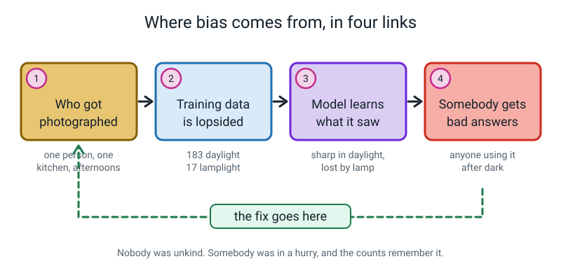
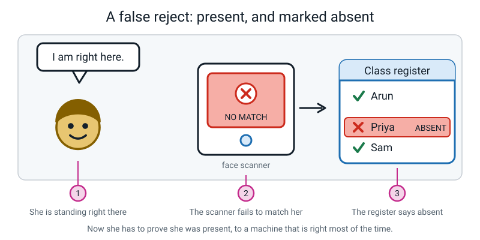
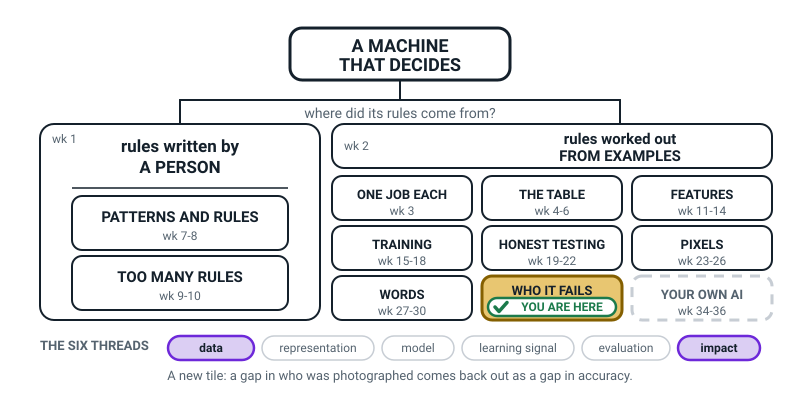
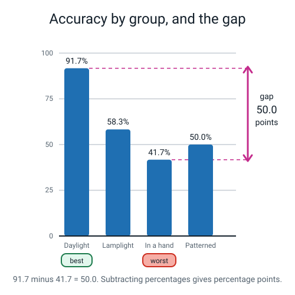
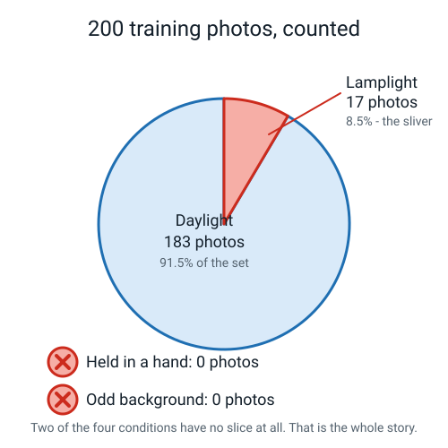
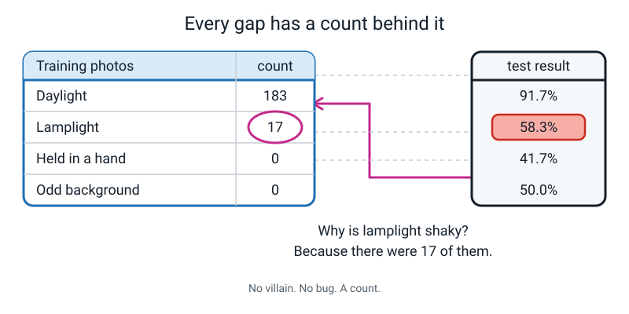
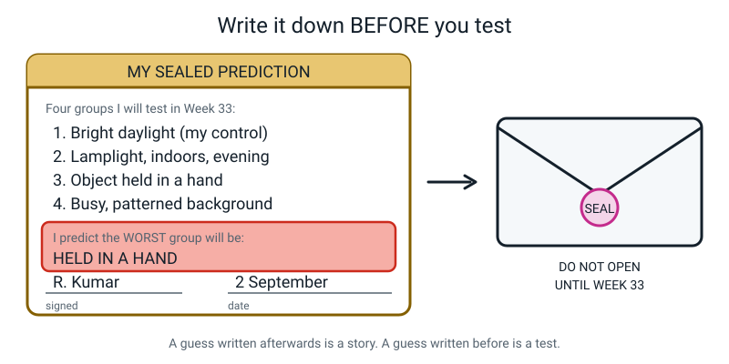

# Week 31 — Who Is Missing From the Photos?

[⬅ Week 30](week-30.md) · [Course Home](../README.md) · [Week 32 ➡](week-32.md) · [Student Guide](../student-guide/week-31.md) · [Workbook](../workbook/week-31.md)

---

## 📋 At a Glance

| | |
|---|---|
| **Duration** | 70 minutes |
| **Type** | 🟦 teach |
| **Big idea** | Bias is not the machine being mean. It is a gap in who was in the training data, showing up later as a gap in accuracy. |
| **New vocabulary** | bias · accuracy gap · fairness audit · false reject |
| **Materials** | Printed audit sheet (Workbook W31.1), a calculator, a pen, one envelope, sticky tape or a stapler, the student's Week 17 model notes |
| **Tech needed** | **None.** Everything this week is on paper. A calculator app is fine. |
| **Prep time** | 20 minutes: read §"What YOU Need to Know First", print two pages, find an envelope |

> **💡 Try this:** This is the last pure paper-and-pencil lesson of the year. Sit at a table, not at a
> screen. The whole lesson is arithmetic and honesty, and both go better without a laptop open.

---

## 🎯 Lesson Objectives

By the end of the lesson the student can, and you will have seen them do it:

1. **Compute per-group accuracy** from a scored test set of 48 photos — writing the division for
   each group — and state each result as a fraction, a decimal and a percentage.
2. **Find the accuracy gap** between the best and worst group and write it with the correct unit:
   *percentage points*, not percent.
3. **Trace a measured gap back to a specific count** in the training data table, and say the
   sentence "the gap in the results is the same shape as the gap in the data" in their own words.
4. **Explain why the groups must be chosen before the results are looked at**, using the phrase
   "otherwise I could quietly drop the batch that looked bad".
5. **Write and seal a dated prediction** naming which group their own Week 17 model will fail on,
   with the reason.

---

## 🧑‍🏫 What YOU Need to Know First

*Read this once. It takes about twelve minutes and it is everything you need. There is no outside
reading, and there is nothing in the lesson that is not explained here.*

### The one sentence

**A machine-learning model gets good at whatever it saw a lot of, and stays bad at whatever it
barely saw.** That is it. That is the entire content of Week 31. Everything else below is
consequences of that sentence.

### What "bias" means here — and what it does not

In everyday English, calling someone biased is an accusation about their character. It means they
hold an unfair opinion.

**That is not what the word means in this lesson, and the difference matters enormously**, because
if the student thinks bias is an accusation they will get defensive about their own model and stop
measuring.

> **Bias**, in machine learning — when a model works noticeably worse for some group of inputs than
> for others, in a way that matters.

A model has no opinions. It has counts. Nobody has to have done anything wrong, or thought anything
unkind, for a model to be badly biased. In fact:

**Bias is the default outcome, not the unlucky one.** You have to do extra work to avoid it. If you
photograph 200 things in your kitchen on sunny afternoons, you have built a biased model. Not
because you are a bad person — because it was sunny, and that is when you were free.

### The four links, and where the fix lives

Every case of bias you will ever meet has the same four-link shape.


*Figure 31.1 — The chain runs left to right, but the repair happens at link 1.*

Read the chain out loud once:

1. **Who got photographed.** Somebody, somewhere, decided what to collect. Usually by convenience.
2. **The training data is lopsided.** 183 photos in daylight, 17 by lamplight, 0 of anything else.
3. **The model learns what it saw.** It is now excellent in daylight and lost by lamplight.
4. **Somebody gets bad answers.** Specifically: the person using it after dark.

The part that surprises adults is the dashed arrow: **the fix is at link 1.** Not at link 3. You do
not repair a biased model by making the model cleverer. You repair it by going back and taking the
photos you did not take. That is why this whole lesson is about counting photos rather than about
computers.

### Why one accuracy number hides people

Here is the number that makes this land. A voice assistant is trained on 10,000 recordings:

| Speaker group | Training recordings | Share | Words it gets wrong |
|---|---:|---:|---:|
| Adults, standard accent | 8,500 | 85% | 5% |
| Adults, regional accent | 1,200 | 12% | 14% |
| Children under 12 | 300 | 3% | 31% |

If you test it on a crowd mixed the same way, the headline comes out at about **93% of words
correct**. That is a genuinely good-looking number, and it is not a lie. It is an average.

And a child using that product gets **nearly one word in three wrong, all day**, in something
advertised as working for everyone.

> **The rule to carry: a single accuracy number is a summary, and every summary hides somebody.
> Always ask "for whom?"**

### Percentage points — the one unit thing you must get right

This trips up adults constantly, so let me be precise.

If group A scores 91.7% and group C scores 41.7%, then:

- The difference is **50.0 percentage points**. (You subtracted two percentages.)
- It is *also* true that 91.7 is about **120% more** than 41.7 (50 ÷ 41.7 ≈ 1.20).

Both sentences are true and they mean different things. **When you subtract two percentages you
always get percentage points.** Insist on the unit. It takes ten seconds to teach and it is the
kind of precision that makes a young person sound like they know what they are doing.

> **⚠️ Watch out:** If the student writes "the gap is 50%", do not let it slide. Ask: "50% of what?"
> There is no answer, and that is the point. It is 50 **points**.

### Pre-registration: why the order of operations is the whole game

Here is the part of this lesson that is real science, and it is the part most likely to be
skipped.

If you run a test on four groups, look at the results, and *then* decide which groups were
interesting, you have not run a test. You have told a story. Two specific failures follow:

- You spot a batch that came out embarrassingly badly and quietly drop it — "oh, those photos were
  blurry anyway".
- You go hunting through the numbers for a group that makes you look good, and report that one.

Neither requires dishonesty. Both happen to careful, well-meaning people, constantly, in real
laboratories. The defence is stupidly simple: **write down which groups you will test, and which
one you think will be worst, BEFORE you collect a single result. Then seal it.**

That sealed slip is what turns Week 33 from a demonstration into an experiment. If the student is
right, they get to say so with evidence. If the student is wrong, **they report it anyway**, and
that is the more valuable outcome, because it means the world surprised them and they told the
truth about it.

### False reject — the vocabulary word that has a human in it

> **False reject** — the system fails to recognise someone who really is there.

The three other words this week are about numbers. This one is about a person. It is worth spending
a minute on because it is the most common shape real bias takes in the wild: not the machine saying
something rude, but the machine **failing to notice someone**.


*Figure 31.2 — She is standing right there. The register says otherwise.*

Notice the second harm in that picture, the one that is not the wrong tick. **The burden of proof
has flipped.** Normally the school has to show a child was absent. Now the child has to prove they
were present, arguing against a machine that has been right many times before, to a busy adult.
A child who has to argue every week eventually stops arguing.

### The two misconceptions you will actually meet

**Misconception 1: "The model is being unfair on purpose / the programmers were prejudiced."**

This is the big one, and it will come up in the first ten minutes. The student maps "biased" onto
"mean", looks for a villain, and stops looking at the data.

*How to handle it:* do not argue about intentions at all. Point at the counts. "Show me where the
unkindness is. Here is 183. Here is 17. Here is 0. Which of these numbers is being mean?" Then the
harder half of the same move: "and nobody being unkind is exactly why it is hard to fix — there is
nobody to tell off. You have to go and take 30 photographs."

**Misconception 2: "So we just need a smarter model / more computer power."**

The student assumes the machine is the broken part. It usually is not. A model trained on zero
examples of an object being held cannot become good at held objects by thinking harder; it has
never seen a hand. Point at the dashed arrow in Figure 31.1 every time this comes up.

There is a third, smaller one worth naming: **"the overall accuracy is the real number and the
group numbers are extra detail."** It is exactly backwards. The overall number can be shoved around
by 16 points just by choosing how many photos of each kind to test — you will demonstrate this
during the worked example, with arithmetic. The per-group table is the property of the model. The
overall number is a property of your test.

### How deep to go — and where to stop

**Go this deep:** counts in, gaps out. Four groups. One division per group. A gap in percentage
points. One arrow back to one count. That is a complete, correct, professional-grade fairness
audit, and it is entirely within reach of an eleven-year-old with a calculator.

**Stop before all of these:** named fairness metrics (demographic parity, equalised odds);
statistical significance and confidence intervals; legal frameworks; and naming real companies that
behaved badly. On sample size, one honest sentence is enough: *"twelve photos per group is not many,
so treat this as a strong hint rather than a final number."*

If the student pushes past all that and asks *"can a model be fair to everybody at once?"*, the
honest answer is in the Questions section below, and it is **"no — that is a proved mathematical
fact, and people argue about what to do about it."** You get there by saying "I don't know, let's
think", not by knowing it in advance.

**The entire mathematical requirement on you:** divide, and turn the result into a percentage.

```
   11 ÷ 12 = 0.9166...  ×100 → 91.7%      5 ÷ 12 = 0.4166...  ×100 → 41.7%
   gap = 91.7 − 41.7 = 50.0 percentage points
```

---

### 🧭 The Growing Map

Two changes on the map this week, and both are worth ten seconds each. **WORDS** has gone plain with
its full range, weeks 27 to 30, because it is finished — and **WHO IT FAILS** shades in beside it. It
is the first tile on the whole map that is about people rather than machinery.



*Figure 31.0 — Week 31's version. WORDS turned plain and done, WHO IT FAILS newly tinted and badged,
and only one dashed tile left. **Data** and **impact** are lit along the bottom.*

**What to do with it, in about two minutes at the end of the lesson:**

1. **Show it and ask:** *"which bit did we do today?"* They will find the new tile. Then the question
   that carries the lesson: *"we didn't build anything today, so why is this a box of its own?"* Because
   the four-link chain — who got photographed, lopsided data, the model copies it, a person gets bad
   answers — runs through every box on the right-hand branch at once.
2. **Then the better question:** *"why are **data** and **impact** lit, and not model?"* Because nothing
   was wrong with the model. The gap arrived in the photographs and came out the far end as somebody
   else's bad afternoon. If a student says "we need a better model", this is the picture that answers
   them.
3. **Have them shade WHO IT FAILS** and write their own gap from the activity next to it, in percentage
   **points**, with the count that caused it underneath. Their number, their units, their box.

> **🧑‍🏫 Why this is worth two minutes.** This is the week most at risk of being heard as a lecture
> about being nice. The map refuses that reading: the tile sits on the same branch as THE TABLE, HONEST
> TESTING and FEATURES, which tells them fairness is measured with the same arithmetic they have been
> doing since October, not with an opinion.

**The six threads** along the bottom are the spine of all four levels. **Data** and **impact** are lit
this week — a count at one end of the chain, a person at the other. Do not quiz them on the threads; the
map is orientation, never assessment.

---

## 🧰 Prep Checklist

**10 minutes, the night before**

- [ ] Read the section above. Once is enough.
- [ ] Print **Workbook page W31.1** (the 48-photo audit sheet) — the student writes on this in class.
- [ ] Print **Workbook page W31.4** (the sealed prediction slip) — or copy it onto plain paper by hand,
      it is only six lines.
- [ ] Find one envelope. Any envelope. A folded sheet of paper with tape on it works.
- [ ] Do the four divisions yourself on a calculator so the numbers are in your hand:
      11÷12, 7÷12, 5÷12, 6÷12. It takes ninety seconds and it means you will not be doing arithmetic
      in front of the student.

**5 minutes, just before class**

- [ ] Put out: the audit sheet, the prediction slip, a calculator, a pen, the envelope, and the
      student's Week 17 notes (they will need to remember roughly how they took their training photos).
- [ ] Write nothing on the board yet. The hook works better on a blank board.

**If something fails**

There is no tech to fail this week — that is deliberate, it is the week before the practical audit.
Two other things can go wrong:

| If | Then |
|---|---|
| You cannot find the Week 17 model notes | Fine. The student writes their prediction from memory of how they took the photos. Memory is the honest input here anyway; the exact counting happens in Week 33. |
| The printer is dead | Draw the audit table on paper by hand. It is four rows. The numbers are in the Answer Key below and in Figure 31.4. |
| The student has no calculator | Long division by hand is entirely fine and arguably better. 11 ÷ 12 to three decimal places is a good Year 7 exercise. |

---

## ⏱️ The Lesson, Minute by Minute

| Minutes | Segment | What happens |
|---|---|---|
| 0–8 | 🪝 **Hook** — The mask | The true story of a face system that could not see one person's face |
| 8–26 | 🧠 **Concept** — Counts, not villains | Bias defined, the four-link chain, percentage points |
| 26–40 | 🔍 **Worked Example** — Batch A together | Compute the first group, then show the overall number is a trick |
| 40–60 | 🎲 **Activity** — The Missing Group | Student computes B, C, D, finds the gap, traces it, then pre-registers |
| 60–70 | 🔑 **Wrap & Assign** | Seal the envelope, three takeaways, homework |

---

### 🪝 Hook — 8 minutes

**Say this:**

> "In 2017 a researcher called Joy Buolamwini was building an art project. It needed a computer to
> notice that there was a human face in front of the camera. Simple job. The software worked fine
> for everyone else in her lab.
>
> It would not see her at all. She sat right in front of it. Nothing.
>
> So she picked up a white plastic Halloween mask that was lying on the desk, and held it in front
> of her own face. Instantly — a face. It found the mask straight away. She takes the mask down: no
> face. Mask up: face."

Pause here. Let that sit for a second. Then:

> "Now, here is what she did next, and this is the part I actually want you to remember. She did
> not shrug. She did not tweet about it. **She built a test set.** She collected 1,270 photographs
> of members of parliament from three African countries and three European countries, and she
> sorted them by skin tone and by whether the person was a man or a woman. Then she ran three
> face-analysis products that companies were already selling to real customers.
>
> The best of those three products got lighter-skinned men wrong about **0.8%** of the time. One
> mistake in every hundred and twenty-five.
>
> The same product, same day, same test — got darker-skinned women wrong **34.7%** of the time.
> One mistake in every three."

**Do this:** write only these four things on the board, nothing else:

```
        0.8%          34.7%
    lighter men    darker women
```

**Ask this:** *"What do you think was broken inside that computer?"*

- **Hoped-for answer:** something about the photos it learned from. Brilliant — say "hold that
  thought, you are about a week ahead of most adults" and go straight into the Concept segment.
- **Likely answer:** "the code had a bug" or "the camera was bad" or "the programmers were
  racist". All three are reasonable guesses. Do not correct them yet. Say: *"Every single one of
  those is a sensible guess, and the true answer is stranger than all of them. Nothing was broken.
  No bug. No crash. Nobody sabotaged it. Every one of those products had been tested before it was
  sold, and every one had a headline accuracy number that looked great."*
- **If the student says nothing:** offer the three guesses yourself as a multiple choice — "bug,
  camera, or people?" — then reveal that it is none of them.

Close the hook with:

> "Somebody gathered a pile of training faces. That pile had far more of some kinds of people in it
> than others. The model learned exactly what it was shown. And then the testing was done as one
> big average, so the hole never showed up. That is all it takes. That is the whole disaster.
>
> Your model — the one you trained in Week 17 — has this problem right now. You just have not
> measured it yet. In two weeks you will. Today we practise on somebody else's."

---

### 🧠 Concept — 18 minutes

**Say this (part 1, the definition):**

> "Here is the word for today, and I want to get the meaning nailed down before we go any further,
> because the everyday meaning will send you in the wrong direction.
>
> **Bias**, when we are talking about a model, means: **the model works noticeably worse for some
> group than for others, in a way that matters.**
>
> That is not the everyday meaning. In everyday English, 'biased' is an insult — it means someone
> holds an unfair opinion. A model does not hold opinions. A model does not think anything about
> anybody. What a model has is **counts**."

**Do this:** draw this on the board while you talk. Three columns, nothing else:

```
   WHAT IT SAW A LOT OF   →   it gets good at
   WHAT IT SAW A LITTLE   →   it stays shaky
   WHAT IT NEVER SAW      →   it has no idea
```

**Say this (part 2, the chain):**

> "So where does a gap come from? Always the same four steps. Watch."

Show Figure 31.1 (or draw the four boxes — they are just four boxes and three arrows).


*Figure 31.3 — Same figure as the teacher notes. Show it to the student now.*

> "One: somebody decides what to photograph, usually whatever is convenient. Two: the pile of
> training photos is now lopsided — and nobody notices, because nobody counted it. Three: the model
> learns the lopsidedness, because learning from examples is *exactly* copying whatever the
> examples were like. Four: somebody, a real person, gets bad answers — and it is always the person
> who was missing from step one.
>
> Now look at the dashed arrow. Where do you fix it?"

**Ask this:** *"If the model is bad at photos taken by lamplight, what would you change?"*

- **Hoped-for answer:** take more lamplight photos. Say: "Yes. Link one. Go and take the pictures
  you did not take."
- **Common answer:** "make the model better / train it for longer / get a better computer." Reply:
  *"That is the most natural guess in the world and it is wrong, and here is why. The model has
  never seen a photo taken by lamplight. Not one. Thinking harder about zero examples still gives
  you zero. It is like revising for a decimals test by re-reading your fractions notes very
  slowly."*
- **If the student says "delete the daylight photos so it's even":** that is genuinely clever and
  half right — it does balance the set — but it throws away real information and makes the model
  worse at everything. Say so, and note that the professional name for that idea is *downsampling*,
  and it is a real technique people really use when they cannot collect more data.

**Say this (part 3, why the average lies):**

> "Last piece before we do the numbers. A voice assistant was trained on ten thousand recordings.
> Eight and a half thousand of them were adults with a standard accent. Twelve hundred were adults
> with a regional accent. Three hundred were children.
>
> Test it, and the headline is about ninety-three percent of words correct. Ninety-three! That
> would look wonderful on a box.
>
> But split it up: the standard-accent adults get five percent of words wrong. The regional-accent
> adults, fourteen percent. And the children — thirty-one percent. **Nearly one word in three,
> wrong, all day**, in a product sold as working for everybody.
>
> Ninety-three percent was not a lie. It was an average. And every average hides somebody."

**Do this:** write on the board, and leave it up for the whole lesson:

```
   ALWAYS ASK:  93% ... for WHOM?
```

**Say this (part 4, the unit):**

> "One last thing, and it is small but it makes you sound like you know what you are doing. When
> you subtract one percentage from another percentage, the answer is not a percentage. It is
> **percentage points**. If one group scores 91.7% and another scores 41.7%, the gap is 50.0
> **percentage points**. Not fifty percent. Fifty points."

**Ask this:** *"If I say the gap is 50%, what's the trouble with that?"*

- **Hoped-for answer:** 50% of what? Exactly. There is no "of what". So it must be points.
- **If they shrug:** ask "half of what?" and let them fail to answer. That failure is the lesson.

---

### 🔍 Worked Example Together — 14 minutes

**Do this:** hand over Workbook page W31.1. Read the setup aloud.

**Say this:**

> "Here is a real audit somebody else has already done the boring part of. A team of Year 9 students
> built an app called **WhatIsIt?** It looks through a phone camera and says out loud what object
> you are pointing at. They trained it on three things: a mug, a spoon and a fork. The idea was to
> help someone who cannot see well find things in a kitchen. Genuinely nice idea.
>
> They tested it on 48 photos the model had never seen. Twelve photos in each of four situations.
> Every photo is of the same three objects — only the surroundings change. They have already ticked
> each photo right or wrong. Your job is the arithmetic and the thinking."

The test sheet the student is holding:

| Batch | Condition | Correct | Total |
|---|---|---:|---:|
| **A** | Bright daylight, plain table | 11 | 12 |
| **B** | Lamplight, indoors, evening | 7 | 12 |
| **C** | Object held in a hand | 5 | 12 |
| **D** | Busy patterned cloth | 6 | 12 |

**Say this:**

> "We will do batch A together and then you do the other three. Batch A: eleven right out of twelve.
> Say that as a fraction first — eleven twelfths. Now divide."

**Do this:** on the board, write it out fully. Do not skip the decimal.

```
   Batch A:   11 ÷ 12 = 0.91666...
              0.91666... × 100 = 91.666...
              rounded to one decimal place:  91.7%
```

**Ask this:** *"Why am I writing three lines instead of just 91.7?"*

- **Hoped-for answer:** so you can see it is real arithmetic / so someone can check it.
- **If they say "you don't need to":** agree that you don't *need* to, then say: *"Here is why I
  do it anyway. When you put a number on a poster and an adult asks 'where did that come from?',
  the answer 'eleven divided by twelve' takes two seconds and ends the conversation. 'The app said
  so' does not."*

**Say this (the trick with the overall number):**

> "Now watch me do something slightly sneaky. Add up all the correct ones: eleven plus seven plus
> five plus six. That is twenty-nine. Out of forty-eight photos. Twenty-nine divided by
> forty-eight is 0.604, so **60.4% overall**.
>
> Fine. Now suppose I had taken **thirty** daylight photos instead of twelve, and only six of each
> of the other three. Same app. Same weaknesses. Same objects. Nothing about the model changes at
> all. Watch what happens to the headline."

**Do this:** write this on the board slowly. This is the single most important board work of the
week.

```
   30 daylight   × 0.917  = 27.5 correct
    6 lamplight  × 0.583  =  3.5
    6 in a hand  × 0.417  =  2.5
    6 patterned  × 0.500  =  3.0
   ──────────────────────────────────
                   36.5 correct out of 48   →   76.0%
```

**Say this:**

> "Sixty point four percent, or seventy-six percent. Same model. Same photos of the same objects.
> The only thing I changed was **how many of each kind I chose to take**. If I can move a number
> sixteen points by a decision I make with my own hands, that number is not telling you about the
> model. It is telling you about me.
>
> So: report the per-group table, or report nothing."

**Ask this:** *"Which of those two numbers would the company put on their website?"*

- **Hoped-for answer:** 76%, the flattering one. Say: "Of course. And they would not even be lying.
  That is what makes it hard."

---

### 🎲 Activity — 20 minutes

Full instructions in the next section. In outline: the student computes batches B, C and D, finds
the gap, is handed the training-data counts and traces the gap back to them, and then writes and
seals their own prediction for Week 33.

---

### 🔑 Wrap & Assign — 10 minutes

**Do this:** the student seals the envelope, writes the date on the outside, and puts it somewhere
you will both find it in two weeks. You write "OPEN IN WEEK 33" on it in large letters. Take it
seriously and slightly theatrically; the ceremony is doing real work.

**Say this:**

> "Three things to take away, and then one job.
>
> One: bias is a **count**, not an attitude. Nobody in the WhatIsIt team was unkind to anybody.
> They took 183 photos in daylight because it was daytime.
>
> Two: a single accuracy number hides people. Always split it up and always report the **gap**, in
> percentage points.
>
> Three — and this is the one I care most about — you wrote your guess down **before** you tested.
> In two weeks we open that envelope. If you were right, you get to say so with evidence. If you
> were wrong, you write that down too, in the same size letters. That is not a punishment. That is
> the entire difference between doing science and telling a story afterwards."

**Ask this (exit question):** *"In one sentence: why is 'we removed the bad batch because those
photos were blurry' a problem?"*

- **Hoped-for answer:** because you decided that after seeing the result, so you can make any
  result you want.
- **If they struggle:** offer the concrete version — "if I test four groups and only report the
  three that went well, what have I actually told you?" — and let them finish it.

---

## 🎲 The Activity, In Full

### **The Missing Group**

**Time:** 20 minutes (8 + 6 + 6) · **Group size:** 1 (notes for 2–6 at the end)

**Materials**

| Item | Notes |
|---|---|
| Workbook page W31.1 | The 48-photo audit table, with space to show each division |
| Workbook page W31.2 | The training-count table — **keep this face down until part 2** |
| Workbook page W31.4 | The prediction slip |
| Calculator | Or long division, if you are feeling strong |
| One envelope | Plus tape or a stapler |

**Setup**

Put W31.2 face down on the table where the student can see it but not read it. Tell them what it is:
"that is the training data. You do not get it yet." The suspense is not a gimmick — the order is the
lesson. An auditor computes the results first, then goes looking for the cause.

---

### Part 1 — The arithmetic (8 minutes)

**The rule:** every group gets its own line, and every line shows the division. No mental
arithmetic straight to a percentage.

The student fills in:

| Batch | Condition | Correct | Total | Fraction | Decimal | Percentage |
|---|---|---:|---:|---|---|---:|
| A | Bright daylight | 11 | 12 | 11/12 | 0.9167 | 91.7% |
| B | Lamplight | 7 | 12 | | | |
| C | Held in a hand | 5 | 12 | | | |
| D | Patterned cloth | 6 | 12 | | | |

Then, underneath:

```
   best group  = ________  at ______%
   worst group = ________  at ______%

   accuracy gap = ______ − ______ = ______ percentage points
```

> **🧑‍🏫 If a student asks:** *"Why do I round to one decimal place?"* — Because 91.666666% is not
> more truthful than 91.7%, it is just longer, and we only tested twelve photos. Pretending to
> six decimal places of precision from twelve photos is its own kind of dishonesty.

**"Finished" for Part 1 looks like:** four percentages, each with a visible division, and the line
`91.7 − 41.7 = 50.0 percentage points` with the unit written out in words.


*Figure 31.4 — Show this only after the student has computed all four numbers themselves.*

---

### Part 2 — The trace (6 minutes)

**Now turn over W31.2.** This is the reveal.

> **Say this:** "Right. You have found a fifty-point hole. Now we find out where it came from. This
> is the WhatIsIt team's training data. Two hundred photos. Here is how they break down."

| Condition | Training photos |
|---|---:|
| Bright daylight, plain table | 183 |
| Lamplight | 17 |
| Held in a hand | **0** |
| Patterned background | **0** |


*Figure 31.5 — Two of the four conditions have no slice at all.*

**Ask this:** *"Put the two tables side by side. What do you notice?"*

- **Hoped-for answer:** the more training photos, the better the accuracy. Push for the strong
  version: "the gap in the results is the same shape as the gap in the data."
- **If the answer is "the team was lazy":** redirect to the counts. "Maybe. But suppose they were
  the hardest-working people on earth and they took every photo in the afternoon because that is
  when they are not at school. Does the model come out any different?" (No.)

Then have the student draw the arrow themselves — literally draw it on the page, from the 58.3%
result back to the 17.


*Figure 31.6 — Every gap has a count behind it. This one is 17.*

**"Finished" for Part 2 looks like:** an arrow drawn on the page and one written sentence in the
form *"Lamplight scored 58.3% because there were only 17 lamplight photos out of 200."*

---

### Part 3 — The pre-registration (6 minutes)

This is the half that makes Week 33 possible, so protect the time for it.

**Say this:**

> "Now your own model. The one you trained in Week 17. You are going to test it for real in two
> weeks. Before you do, you are going to write down what you think will happen. Four groups you
> will test, and which one you think will be worst, and why."

The slip has exactly this on it:

```
   MY SEALED PREDICTION

   Four groups I will test in Week 33:
     1. ______________________________  (my control — matches training)
     2. ______________________________
     3. ______________________________
     4. ______________________________

   I predict the WORST group will be: ______________________________

   Because: ______________________________________________________

   Signed ____________________     Date ____________________
```


*Figure 31.7 — A guess written afterwards is a story. A guess written before is a test.*

**Coaching, if the student is stuck on the four groups:** the first one is always the *control* —
whatever matches how they took the training photos. The other three should be things they suspect
were rare or absent. The usual four are: bright daylight (control), lamplight, held in a hand, and
an odd background. But if their objects are different, adapt: for a hand-gesture model it might be
different hands, sleeves, distances.

> **⚠️ Watch out:** Do **not** let them go and count their training photos now. That happens in
> Week 33, and it happens *after* the prediction is sealed in the same way the results come after
> the groups. This prediction is from memory of how they took the photos, which is exactly the
> honest input.

**"Finished" for Part 3 looks like:** a slip with four named groups, one named worst group, a
reason that mentions how the photos were taken, a signature, and today's date — inside a sealed
envelope labelled OPEN IN WEEK 33.

---

### Variation — easier

Cut Part 3 to two groups instead of four ("your normal way, and one thing you never did") and do
Part 1 with only batches A and C, so the gap arithmetic is 91.7 − 41.7 with only two divisions to
perform. Everything essential survives: a division, a gap, a unit, a sealed guess.

### Variation — harder

Hand over the class-by-class grid as well (it is printed in **Answer Key W31.7**, and each batch of
12 was 4 mugs, 4 spoons and 4 forks). Ask for the three column totals as percentages, then the
question: *"what does the grid show that the condition table could not?"* Fully worked in W31.7.

### If you have 2–6 students

Give each pair a different batch to compute, then pool the four percentages on a shared board
before anyone computes the gap. Then run Part 2 as a whole group. Part 3 is always individual —
nobody sees anybody else's prediction, or they will converge on one answer and you lose the
independence that makes it interesting in Week 33.

---

## ❓ Questions Students Ask This Week

**1. "So the people who made it were racist?"**

Almost never, and getting stuck on that question is how the problem stays unfixed. Somebody
assembled a pile of training photos out of what was easy to get. The pile was lopsided. The model
copied the pile. You can produce a badly biased system with nothing but a cheerful person in a
hurry. That said — and this is the honest other half — *"nobody meant it"* does not make the harm
smaller for the person it lands on. Intent and impact are two different questions. We are measuring
impact.

**2. "Can't you just tell the model to be fair?"**

No, and it is worth understanding why not. The model has no place to put an instruction. It is a
big pile of numbers that were adjusted by looking at examples. There is no "be fair" dial inside
it, in the same way there is no "be fair" dial inside a photograph. The only lever you have is
what you show it.

**3. "Twelve photos isn't very many. Can you really trust this?"**

Excellent question, and no — not completely. Twelve is a small sample. If one photo out of twelve
had gone the other way, that group would move by more than eight points. What twelve photos *can*
do is tell the difference between 91.7% and 41.7%, because that gap is far too big to be luck. Rule
of thumb for this course: **small samples can spot big gaps but not small ones.** If two groups come
out three points apart, do not claim a gap; go and take more photos.

**4. "What if the group that's missing is genuinely rare? Like, there just aren't many of them."**

Then you have found the nastiest loop in the whole field, and it has a shape: fewer examples exist,
so fewer get collected, so the model stays bad for that group, so that group stops using the
product, so even fewer examples get collected. It gets worse on its own unless somebody deliberately
goes out and over-collects. "There weren't many available" is a true explanation and it is not an
excuse, because the person on the receiving end still gets a broken product.

**5. "Is 60.4% good or bad?"**

Wrong question, and I mean that in the nicest way. Compared to what? If the app has three classes,
guessing at random gets you about 33%, so 60.4% is better than a coin. Compared to a human glancing
at the photo, which is near 100%, it is terrible. And compared to what it needs to be for somebody
who cannot see well to rely on it in their own kitchen — it is nowhere near. **A number on its own
is never good or bad. It is good or bad against a baseline and a job.**

**6. "Could a model be fair to everyone at the same time?"**

**Nobody knows what the right answer is, and here is why that is not a cop-out.** The mathematics
part is settled: people have *proved* that several sensible definitions of "fair" cannot all be
satisfied at once, except in special cases that almost never happen in real life. So you must
choose which fairness you want — equal accuracy for every group? equal numbers of people helped
from every group? equal error rates? — and choosing one means failing another.

What nobody knows is **which one you should choose**, because that is not a maths question. It is a
question about values, and it depends on what the system is for and who gets hurt when it is wrong.
Reasonable, thoughtful people land in different places. The thing you can do at eleven, which most
adults do not do, is notice that a choice is being made at all, and ask **who is making it**.

**7. "What if I test my model and find a huge gap? Doesn't that mean I failed?"**

The opposite. Finding the gap *is* the skill. Anyone can train a model; almost nobody bothers to
find out who it fails. "91.7% in daylight, 33.3% by lamplight, here is why, here is the fix" is a
better piece of work than "my model is 92% accurate" with nobody having looked closer. And you will
not remember what you predicted unless you wrote it down — memory quietly rewrites expectations to
match outcomes. Paper is the only witness in the room that cannot be got at.

---

## ⚠️ Where This Lesson Goes Wrong

| What happens | Why | What to do right now |
|---|---|---|
| The student writes "the gap is 50%" | Both numbers had a % sign, so the answer feels like it should too | Ask "50% of what?" and wait. There is no answer. Then write **percentage points** on the board and make them copy it once. Takes 20 seconds, sticks for a year |
| The whole lesson turns into "who is to blame" | "Biased" is an accusation word in every other context they have met it in | Stop arguing about people. Point at 183, 17, 0, 0 and ask "which of these numbers is being unkind?" Then: "nobody being unkind is exactly what makes it hard to fix" |
| The student wants to fix it by improving the model | The machine is the impressive part, so it feels like the part with the problem | Zero examples means zero, no matter how clever the model. Go back to the dashed arrow in Figure 31.1. "You cannot revise for a test on a topic you have no notes for" |
| The prediction gets written after glancing at the training photos | It feels more accurate that way, and being right feels good | Take the photos away. Say plainly: "a good guess made afterwards is worth nothing, and a bad guess made before is worth a lot." The Week 33 comparison is the point, not the accuracy of the guess |
| Part 3 gets squeezed out because Part 1 ran long | Arithmetic always overruns and the prediction feels optional | It is not optional — Week 33's activity does not work without it. If you are at minute 54 and Part 1 is unfinished, **stop the arithmetic**, finish batches C and D as homework, and do the prediction now |
| The student rounds 0.9166 to 92% and then to "about 90%" | Rounding feels tidy | One decimal place, every time. The difference between 91.7 and 90 is the difference between a measurement and a vibe. Also: they will need these exact numbers again in Week 33 |
| "This is all obvious" | The chain *is* obvious once stated, which is exactly why it goes unchecked | Agree, then ask the killer question: "so how many of your Week 17 training photos were taken by lamplight?" They will not know. That is the lesson |

---

## 🧭 Differentiation

### If the student is struggling

**Cut:** the class-by-class grid entirely (it is the "harder" variation anyway), and the
reweighting demonstration in the worked example (76.0% vs 60.4%). Both are enrichment.

**Keep, non-negotiably:** one division written out, the gap with its unit, one arrow from a result
to a count, and a sealed prediction.

**Reteach like this:** drop the percentages and use whole photos. "Out of twelve daylight photos it
got eleven right. Out of twelve held-in-a-hand photos it got five right. Which is better? By how
many photos?" Six photos. Then: "now let's say that in percentages, because percentages let you
compare groups that aren't the same size." The percentage becomes a tool for a job they can already
feel, instead of a hoop.

If arithmetic is the barrier rather than the idea, do the divisions *for* them and let them do the
thinking. The thinking is what is being taught this week.

### If the student is flying

Extension questions, in increasing order of nastiness:

1. Compute the class-by-class grid (the "harder" variation) and name the surprise. → W31.7
2. "The WhatIsIt team want one number for their website. Write a two-sentence reply explaining why
   you will not give them one."
3. **Price the fix.** How many held-in-a-hand photos must be added to the 200 so that held-in-hand
   is 25% of the training set? → W31.6, the answer is 67 and the algebra is worth doing.
4. "Suppose they fix the held-in-hand gap perfectly and every group now scores 91.7%. Name one
   thing that could still be wrong with this app." *(It may be hopeless on objects that are not
   mugs, spoons or forks; the user may not be able to see the screen to know it even answered; the
   four groups they chose might not include the group that actually matters.)*

### If the student won't engage today

Run **only** the false-reject picture and the envelope. Ten minutes total.

Show Figure 31.2. Ask one question: *"She is standing right there and it has marked her absent.
What happens next in her house tonight?"* Let them talk. That conversation is the emotional core of
the whole unit, and it needs no arithmetic at all.

Then do the prediction slip, seal the envelope, and stop. The arithmetic becomes the homework and
you have lost nothing that matters — Week 33 still works, because the envelope exists.

---

## ✅ Assessing Understanding

Three checks, five minutes, in this order.

**Check 1 — the unit.**
> Say: *"Group A gets 80%. Group B gets 55%. What is the gap?"*

- **Excellent:** "25 percentage points."
- **Good enough:** "25 points."
- **Not yet:** "25 percent." Re-ask "25 percent of what?" and let them repair it themselves.

**Check 2 — the trace.**
> Say: *"A model is great at cats and terrible at rabbits. Give me your first guess as to why, and
> tell me the number you'd want to see to check it."*

- **Excellent:** "There were probably far fewer rabbit photos. I'd want the count of cat photos and
  the count of rabbit photos in the training set."
- **Good enough:** anything that reaches for the training data rather than the model.
- **Not yet:** "rabbits are harder to see" or "the model doesn't like rabbits". Redirect: "maybe —
  what could you count to find out?"

**Check 3 — the order.**
> Say: *"Why did we write the prediction before testing instead of after?"*

- **Excellent:** anything containing the idea that afterwards you could pick whichever answer made
  you look right, or quietly drop a bad batch.
- **Good enough:** "so you can't cheat."
- **Not yet:** "because you told me to." Give the concrete version: "if I test four groups and only
  show you the three that went well, what have I told you about my model?"

### Mastery scale for this week

| Level | What it looks like |
|---|---|
| **1** | Can read a percentage off the table but cannot produce one. Thinks bias means someone was unkind. |
| **2** | Computes per-group accuracy correctly with prompting. Says "50%" for the gap. Sees the training counts as unrelated to the results. |
| **3** | Computes all four groups unaided, gets the gap right **with the unit**, and connects a low score to a low count when asked. |
| **4** | Does all of level 3 unprompted, and explains without help why the overall 60.4% should not be quoted on its own. Writes a specific, reasoned prediction about their own model. |
| **5** | All of the above, plus finds something nobody asked for — e.g. spots from the class grid that fork and spoon are being confused with each other, or asks whether twelve photos is enough to trust. Can argue both sides of "was anyone to blame?" |

**Target for a typical student: 3, moving to 4 during Week 33.** Level 5 is not expected this week.

---

## 📤 Homework to Assign

**Say this:**

> "Two jobs, about fifty minutes. The first one is arithmetic and you already know how to do it —
> finish the audit properly, showing every division, because in two weeks you will be doing exactly
> this for your own model and I want your hand to already know the shape of it.
>
> The second one is the important one. You are writing down a prediction about your own model that
> we are going to check, out loud, in front of each other, in Week 33. You will be held to it. That
> is the deal, and it works both ways: if you are right, I will say so, and if you are wrong, we
> write that down too and it counts just as much."

**Workbook pages: W31.1 – W31.5.**

| Page | Task | Time |
|---|---|---|
| **W31.1** | The 48-photo audit: four per-group accuracies, each with the division shown; the overall accuracy; the gap in percentage points | 15 min |
| **W31.2** | The trace: match each accuracy to its training count and write one sentence per row | 10 min |
| **W31.3** | The school gate: false-reject arithmetic, 180 days, two groups, four years | 15 min |
| **W31.4** | Your own group list and your dated prediction — copied neatly from the sealed slip, so there is a record outside the envelope of *the groups* (but **not** the predicted worst group, which stays sealed) | 5 min |
| **W31.5** | Vocabulary: four words, one sentence each, in the student's own words | 5 min |

Total: about 50 minutes. If they run out of steam, W31.3 is the one to cut.

---

## 🔑 Answer Key

### W31.1 — The 48-photo audit

**(a) Per-group accuracy.**

```
   Batch A  (daylight)      11 ÷ 12 = 0.916666...  × 100 = 91.666...  →  91.7%
   Batch B  (lamplight)      7 ÷ 12 = 0.583333...  × 100 = 58.333...  →  58.3%
   Batch C  (held in hand)   5 ÷ 12 = 0.416666...  × 100 = 41.666...  →  41.7%
   Batch D  (patterned)      6 ÷ 12 = 0.500000     × 100 = 50.000     →  50.0%
```

| Batch | Fraction | Decimal | Percentage |
|---|---|---|---:|
| A — bright daylight | 11/12 | 0.9167 | **91.7%** |
| B — lamplight | 7/12 | 0.5833 | **58.3%** |
| C — held in a hand | 5/12 | 0.4167 | **41.7%** |
| D — patterned cloth | 6/12 | 0.5000 | **50.0%** |

**(b) Overall accuracy.**

```
   correct = 11 + 7 + 5 + 6 = 29
   total   = 12 × 4 = 48

   29 ÷ 48 = 0.604166...  →  60.4%
```

**(c) The accuracy gap.**

```
   best  = Batch A, bright daylight   = 91.7%
   worst = Batch C, held in a hand    = 41.7%

   gap = 91.7 − 41.7 = 50.0 percentage points
```

The unit must be written. "50.0%" is marked wrong here, and it is worth being firm about it: 50.0%
would mean "half of something", and there is nothing it is half of.

**(d) "Should WhatIsIt put 60.4% on their website?"**

No. Two reasons, and the student needs at least the first:

1. It hides a group that gets a wrong answer nearly six times out of ten.
2. It is not even a stable number. Change how many photos you take of each kind and it moves.
   Thirty daylight photos and six of each other condition gives:

```
   30 × 0.9167 = 27.5        6 × 0.5833 = 3.5
    6 × 0.4167 =  2.5        6 × 0.5000 = 3.0
   ─────────────────────────────────────────────
   36.5 correct out of 48  →  76.0%
```

Same model, same objects, **60.4% or 76.0% depending only on a decision the tester made.** A number
that can be moved 15.6 points by the tester is a fact about the test, not about the model.

**(e) "Write the one line WhatIsIt must put in their instructions."**

Any answer of this shape is correct:

> *Do not use this app to name an object you are holding, or in anything dimmer than daylight. In
> those situations it is wrong more often than it is right.*

Marks are for **specificity and a number**, not for style. "Be careful using this app" scores zero.

---

### W31.2 — The trace

| Condition | Training photos | Share of 200 | Test accuracy | Verdict |
|---|---:|---:|---:|---|
| Bright daylight | 183 | 91.5% | 91.7% | Well covered → works |
| Lamplight | 17 | 8.5% | 58.3% | Barely covered → shaky |
| Held in a hand | **0** | 0.0% | 41.7% | Never seen → fails |
| Patterned background | **0** | 0.0% | 50.0% | Never seen → fails |

**One sentence per row** — accept anything with the right causal direction:

- *Daylight scored 91.7% because 183 of the 200 training photos were taken in daylight.*
- *Lamplight scored 58.3% because there were only 17 lamplight photos.*
- *Held-in-a-hand scored 41.7% because there were zero training photos with a hand in them, so the
  model has never seen fingers wrapped around an object.*
- *Patterned background scored 50.0% because there were zero patterned backgrounds, so all those
  extra edges in the background are new to it.*

**"Describe the relationship in one sentence."**

> Accuracy goes up and down with the training count almost exactly: 183 photos gives 91.7%, 17
> photos gives 58.3%, and zero photos gives 41.7% and 50.0%.

**"Why is held-in-a-hand worse than patterned, when both had zero photos?"**

This one is a genuine judgement question and any reasoned answer earns full marks. The best answer:
a hand does two things at once — it adds a large new region of skin-coloured pixels with strong
edges, *and* it hides part of the object. A patterned background only adds distraction; it does not
cover the object up. Also fair: with twelve photos, a one-photo difference is within luck, so we
should not make too much of 41.7 versus 50.0.

**"Whose fault is this?"**

Full marks for refusing the question and re-framing it: nobody was unkind; somebody took the photos
that were convenient. The fix is not an apology, it is 67 more photographs.

---

### W31.3 — The school gate

A face scanner at the school gate marks attendance. The company advertises **"98% accurate"**. An
independent test finds it wrongly marks a present student absent — a **false reject** — at these
rates: overall 2%, students wearing a headscarf 8%.

**(a) Wrongly marked absent in one 180-day school year.**

```
   average student:    0.02 × 180 = 3.6 days
   headscarf student:  0.08 × 180 = 14.4 days
```

**(b) The difference, and four years of school.**

```
   difference in one year:  14.4 − 3.6 = 10.8 days

   over four years:
      average student:    3.6 × 4  = 14.4 days
      headscarf student: 14.4 × 4  = 57.6 days
      difference:        57.6 − 14.4 = 43.2 days
```

Say it in human units before moving on: **57.6 days is more than eleven school weeks** of being
marked absent while sitting in the classroom.

**(c) The school has 600 students. How much work does this create?**

```
   600 × 0.02 = 12 wrong marks every day
   12 × 4 minutes = 48 minutes of staff time every day

   48 × 180 = 8,640 minutes per year
   8,640 ÷ 60 = 144 hours  →  about 18 full working days
```

The system was sold as saving administrative time. On its own numbers it creates 144 hours a year
of new administrative work — and only if every single error is noticed and corrected, which it will
not be.

**(d) Three harms that are not the number itself.**

1. **An automatic message goes to a parent.** The child says they were there. The parent has to
   choose between believing their child and believing the school's computer, and that argument
   happens at home, repeatedly, with no way to settle it.
2. **The record follows the student** into reports and references, and in some places attendance
   figures have legal consequences for families.
3. **The burden of proof flips.** The child now has to prove they were present, to a busy adult,
   against a machine that has been right many times. Most children lose that argument, and a child
   who loses it every week stops trying.

**(e) The company says the gap is "only 6 percentage points". Reply in two sentences.**

> Six percentage points means a student who wears a headscarf is wrongly marked absent 14.4 days a
> year against 3.6 — four times as often, and 57.6 days across four years of school. A difference
> that lands on one identifiable group, generates a letter to their parents every time, and follows
> them into their record is not "only" anything.

**(f) Where does the phrase "98% accurate" come from, and what does it hide?**

It is the overall average. It hides that the errors are not spread evenly: one identifiable group
carries four times the load. It is the voice-assistant problem again, with a person in it.

---

### W31.4 — Your own groups and prediction

There is no single right answer; this is the student's own model. Mark the **shape**, using this
worked example as the standard:

| Group | Why I suspect it | What I remember about my training photos |
|---|---|---|
| 1. Bright daylight at the kitchen table (control) | Matches how I took nearly everything | Almost all of them |
| 2. Lamplight in the evening | I do not think I took any at night | Maybe none |
| 3. Object held in my hand | I always put things down to photograph them | Probably zero |
| 4. On a patterned cloth | Everything was on the same plain table | Probably zero |

> **Prediction (sealed):** *"I predict the worst group will be **held in a hand**, because I always
> put the object down on the table before taking the photo, so my model has probably never seen
> fingers, and fingers cover up part of the object."*

**Full marks require:** four named groups, one of which is a control; a single named worst group;
and a reason that refers to **how the photos were taken**, not to how hard the task looks.

**No marks for:** "I predict it will be worst at the hard one" (which one?), or "I predict it will
be about 80%" (that is not a group).

> **🧑‍🏫 A note for you:** in the reference audit we will run in Week 33, this exact prediction turns
> out to be **wrong** — lamplight is worse than held-in-a-hand. That is not a problem with the
> prediction. It is the best thing that can happen, and Week 33 is built around reporting it.

---

### W31.5 — Vocabulary

| Term | A correct student answer looks like |
|---|---|
| **bias** | When a model is much worse for one group than another, because it saw far fewer examples of that group. Not the model being mean. |
| **accuracy gap** | The best group's accuracy minus the worst group's, written in percentage points. Here: 91.7 − 41.7 = 50.0 points. |
| **fairness audit** | Deliberately testing a model group by group, with the groups chosen first, to find out who it fails. |
| **false reject** | When a system fails to recognise someone who really is there — like a student marked absent while standing at the gate. |

---

### W31.6 — Extension: price the fix (for the "flying" path)

*How many held-in-a-hand photos must WhatIsIt add so that held-in-a-hand is 25% of the training set?*

```
   Currently: 200 photos, 0 of them held-in-hand.
   Let x = the number of held-in-hand photos to add.

        x / (200 + x) = 0.25
                    x = 0.25 × (200 + x)
                    x = 50 + 0.25x
            x − 0.25x = 50
                0.75x = 50
                    x = 50 ÷ 0.75
                    x = 66.67  →  round up to 67
```

**Add 67 photos.** Check: 267 total, 67 held-in-hand, 67 ÷ 267 = 0.251, so just over 25%. ✓

Worth saying out loud: sixty-seven extra photographs to close **one** of the three holes in a
200-photo set. That is the honest price of the shortcut taken at collection time — and taking the
original 200 across varied conditions would have cost nothing extra at all.

---

### W31.7 — Extension: the class-by-class grid (the "harder" variation)

| | mug | spoon | fork | batch total |
|---|---:|---:|---:|---:|
| A — daylight | 4/4 | 4/4 | 3/4 | 11/12 |
| B — lamplight | 3/4 | 2/4 | 2/4 | 7/12 |
| C — in a hand | 3/4 | 1/4 | 1/4 | 5/12 |
| D — patterned | 3/4 | 2/4 | 1/4 | 6/12 |
| **class total** | **13/16** | **9/16** | **7/16** | 29/48 |

```
   mug:    13 ÷ 16 = 0.8125  →  81.3%
   spoon:   9 ÷ 16 = 0.5625  →  56.3%
   fork:    7 ÷ 16 = 0.4375  →  43.8%

   check:  13 + 9 + 7 = 29 ✓      16 × 3 = 48 ✓
```

**What the grid shows that the condition table could not:** mug holds up everywhere (81.3%) while
spoon and fork both collapse. That is not about the lighting at all — it is that a mug is a chunky
round shape with a handle, whereas a spoon and a fork are both thin shiny metal objects of roughly
the same length and outline. As soon as conditions get hard the model falls back on "long thin
shiny thing" and cannot separate the two.

The condition table blamed the lighting. The grid says the app also has a spoon-versus-fork problem
that exists in *every* condition, including bright daylight. **That is why an audit uses a grid, not
a list.**

---

### Answers to the questions posed during the lesson

| Where | Question | Answer to steer toward |
|---|---|---|
| Hook | "What do you think was broken inside that computer?" | Nothing was broken. The training faces were lopsided, the model copied them, and the testing was done as one average so nobody saw it. |
| Concept | "If the model is bad by lamplight, what would you change?" | Go back and take lamplight photos. Link 1, not link 3. |
| Concept | "If I say the gap is 50%, what's the trouble?" | 50% of what? There is no answer, so the unit must be percentage points. |
| Worked example | "Why write three lines instead of just 91.7?" | So that when an adult asks where the number came from, you can show them in two seconds. |
| Worked example | "Which number would the company put on the website?" | 76.0% — and they would not even be lying, which is what makes it hard. |
| Activity Pt 2 | "Put the two tables side by side. What do you notice?" | Accuracy tracks the training count. The gap in the results is the same shape as the gap in the data. |
| Wrap | "Why is dropping the blurry batch a problem?" | You decided that after seeing the result, so you could manufacture any conclusion you liked. |

---

## 🔮 Next Week Preview

Week 32 is the other half of the human side of AI, and it is the week most students go home and
repeat at the dinner table. Three short rounds: we take five completely anonymous facts and narrow
eight hundred people down to one person in about ninety seconds; we open up a photo file and read
out the time, the device and — usually — the exact location hidden inside it; and we put three
confident AI answers on the table, two true and one entirely invented, and refuse to let anyone
guess from tone.

**Prep early:** for Round 2 you will need **one photo taken on a phone, with location services on**,
copied to the computer you will use. Do this before class — a photo sent through a chat app usually
has its metadata stripped, which ruins the demonstration. Email it to yourself as a file
attachment, or use a USB cable. There is a full fallback in next week's prep checklist if it does
not work, but it is much better live.

---

[⬅ Week 30](week-30.md) · [Course Home](../README.md) · [Week 32 ➡](week-32.md) · [Student Guide](../student-guide/week-31.md) · [Workbook](../workbook/week-31.md) · [Orientation](00-orientation.md) · [Glossary](../../glossary.md)
