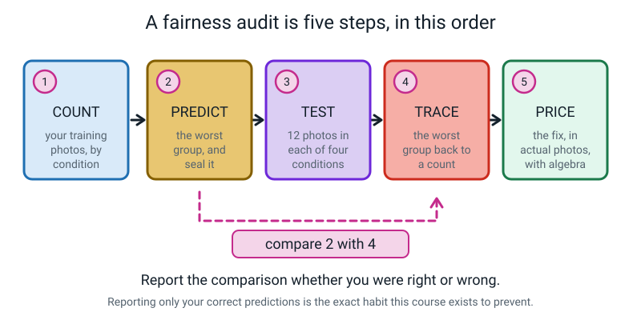
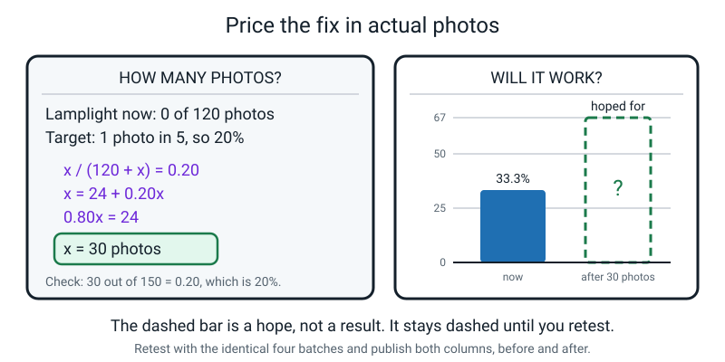
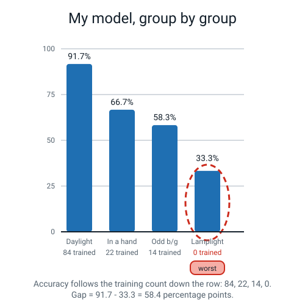
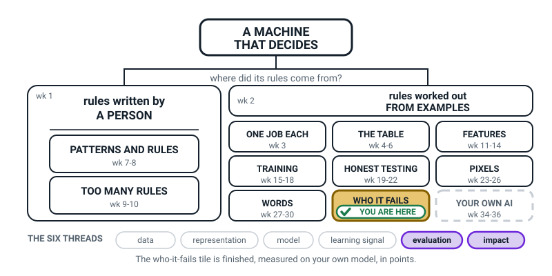
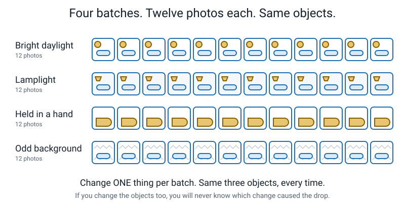
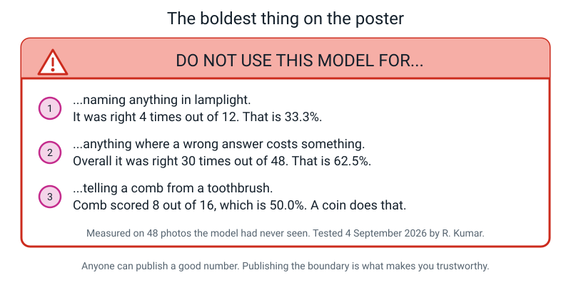
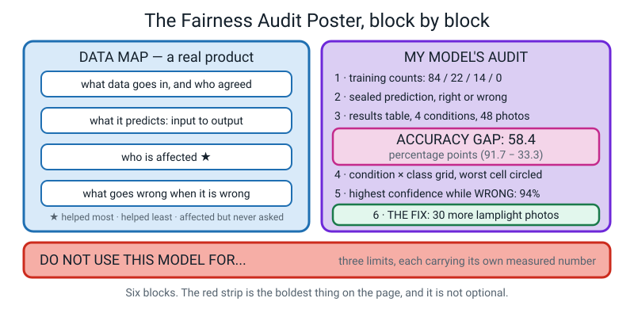

# Week 33 — Audit Your Own Model

[⬅ Week 32](week-32.md) · [Course Home](../README.md) · [Week 34 ➡](week-34.md) · [Student Guide](../student-guide/week-33.md) · [Workbook](../workbook/week-33.md)

---

## 📋 At a Glance

| | |
|---|---|
| **Duration** | 70 minutes (works in 60 if you cut Batch D to 8 photos; runs happily to 75) |
| **Type** | 🟩 Lab — the student produces a measured, defensible result about their own work |
| **Big idea** | The most trustworthy thing you can do with your own model is show, with numbers, the group it fails on. |
| **New vocabulary** | attribution · misinformation · disinformation |
| **Materials** | The **sealed Week 31 envelope** (unopened) · the four batches of 12 photos, **shot before class** · printed 48-row scoring sheet (Workbook W33.2) · printed training-count sheet (W33.1) · a **pen**, not a pencil · a calculator · a ruler · one large sheet of paper or card for the poster · coloured pens |
| **Tech needed** | A laptop, a browser, [teachablemachine.withgoogle.com](https://teachablemachine.withgoogle.com), and the student's saved model file **`baseline-v1.tm`** from Week 17. Nothing to install. No account. |
| **Prep time** | 15 minutes the night before, **plus** one 25-minute photo shoot with the student earlier in the week |

> **⚠️ Two things will sink this lesson, and both are avoidable.** (1) **The photos must already
> exist** when class starts. Four batches of twelve, shot in four different conditions. You cannot
> shoot a daylight batch and a lamplight batch in the same 70 minutes — the sun does not cooperate.
> (2) **The Week 31 envelope must still be sealed.** If you opened it, read the fallback in the Prep
> Checklist. There is an honest repair and it starts with telling the student what you did.

---

## 🎯 Lesson Objectives

By the end of today the student can, and you will have watched them do it:

1. **Count their own training data** into four condition buckets and write the four numbers down
   before testing anything.
2. **Run a four-condition fairness audit** on their own model with at least eight photos per
   condition — scoring every photo on paper, one attempt each, as they go.
3. **Report the accuracy gap in percentage points**, with the subtraction visible, and state the
   overall accuracy beside it while explaining why the overall number is the weaker of the two.
4. **Open the sealed prediction and compare it against the result — and report it either way**,
   in the same size letters, right or wrong.
5. **Trace their worst group back to a specific count** in their own training data.
6. **Price the fix in actual photographs**, showing the algebra, and name the retest that would
   prove the fix worked.
7. **Write one line of attribution** for every photo in their dataset — where it came from, who took
   it, and whether the person in it (if any) said yes.

---

## 🧑‍🏫 What YOU Need to Know First

*Read this once. About twelve minutes. It contains everything you need, including all the arithmetic,
and there is nothing in the lesson that is not explained here.*

### The one sentence

**Last week the student learned what a fairness audit is. Today they run one on themselves, and the
number that comes out will not flatter them — and publishing it anyway is the entire point.**

That is the whole lesson. Everything below is how to make it happen without it turning into either
a maths worksheet or a therapy session.

### The five steps, in this order, and why the order is not negotiable


*Figure 33.1 — Steps 2 and 4 are the ones that make it science rather than a story.*

1. **COUNT.** Count your own training photos, by condition. Today, for real, with tally marks.
2. **PREDICT.** Already done — it is inside the sealed envelope from Week 31.
3. **TEST.** Twelve photos in each of four conditions. Scored on paper, as you go.
4. **TRACE.** Take the worst group and find the count in the training data that explains it.
5. **PRICE.** Say how many photographs the fix costs. A number, with the arithmetic shown.

Step 3 must come **after** step 2 and step 4 must come **after** step 3. If you look at the results
and *then* decide which groups mattered, you have not measured anything — you have selected a story.
Week 31 covered why. Today you simply hold the line on the order.

There is one wrinkle worth knowing in advance. **Step 1 happens today, and step 2 happened two weeks
ago.** That is deliberate and it is not an error. In Week 31 the student predicted from *memory* of
how they took their photos. Today they *count*. Memory and counting frequently disagree, and when
they do, that disagreement is the most interesting thing in the room. Do not smooth it over. Say:
"you thought you never held anything up. Turns out you did, twenty-two times. What else do you think
you remember?"

### Why this is a hard lesson emotionally, and what to do about it

The student trained this model in Week 17. They were proud of it. Today they are going to produce a
number like 62.5% and a headline like *"my model is right one time in three by lamplight"*.

Some students take that as a report card on themselves. It is not, and you need a sentence ready:

> **"You are not being marked on your model's accuracy. You are being marked on whether the number
> you report is true."**

Say that early, say it once more at the end, and mean it. The best possible outcome today is a
student who is visibly pleased to have found their own worst result. That reflex — *"look what I
found wrong with my own thing"* — is worth more than any accuracy figure and it is very rare in
adults.

### The three new words, and where each one lands today

> **Attribution** — saying where something came from and who made it.

This is the one with a job in today's lesson. Every dataset is made of somebody's work, somebody's
face, or somebody's life. The student's 120 photos have an origin. If they took all 120 themselves,
of their own spoon, the attribution line is short and they still write it. If a friend took some, or
a friend's hand is in some, the line has a name and a permission in it.

Three cases, and the third one is the hard one:

| Case | Example | What you owe |
|---|---|---|
| **You made it** | Your own 40 photos of your own comb | Nothing to anyone else. Write the line anyway. |
| **Someone gave permission** | 12 photos where your brother held the object | Name him, use it only for what you agreed, delete it if he asks |
| **You just took it** | 300 images pulled off a search engine | The hard case. *"It was on the internet"* is not an answer. |

Why the third is genuinely hard: a human artist who studies 500 paintings and develops a style owes
nobody anything — that is how art has always worked. A system trained on 500 paintings can produce
work "in the style of" that artist thousands of times an hour, competing with them, without ever
naming them. Is that the same activity at a bigger scale, or a different activity? Reasonable people
disagree, real lawsuits are running right now, and an eleven-year-old is not required to settle it.
They **are** required to notice that somebody is there. The trap is not getting it wrong. The trap is
not seeing anyone.

> **Misinformation** — false information spreading, whether or not anyone meant to deceive.
> **Disinformation** — false information spread deliberately.

These two arrived in Week 32 attached to deepfakes. Today they attach to something much closer to
home, and this is the connection that makes them stick:

**If the student publishes only their best number, they have produced misinformation about their own
model.** Nobody lied. "My model is 91.7% accurate" is a true sentence about Batch A. Quoted on its
own it will leave every reader with a false belief. And if they did it *on purpose*, knowing the
lamplight figure, that is disinformation — from the sweetest possible person, in a school project.

That is the whole reason the warning sign at the bottom of the poster is compulsory.

### The arithmetic you need — all of it, worked

You need exactly two operations. Division, and subtraction.

**Per-condition accuracy.** Correct ÷ total, then ×100, then round to one decimal place.

```text
   11 ÷ 12 = 0.916666...  →  ×100 = 91.66...  →  91.7%
    8 ÷ 12 = 0.666666...  →  ×100 = 66.66...  →  66.7%
    7 ÷ 12 = 0.583333...  →  ×100 = 58.33...  →  58.3%
    4 ÷ 12 = 0.333333...  →  ×100 = 33.33...  →  33.3%
```

**Overall accuracy.** Add all the corrects, divide by all the photos.

```text
   11 + 8 + 7 + 4 = 30        12 × 4 = 48
   30 ÷ 48 = 0.625  →  62.5%
```

**The accuracy gap.** Best minus worst. The unit is **percentage points**, never percent.

```text
   91.7 − 33.3 = 58.4 percentage points
```

**Pricing the fix.** One equation, and it is the only algebra in Level 1.

```text
   Lamplight photos now: 0 out of 120.
   Target: 1 photo in 5, which is 20%.

   Let x = the number of lamplight photos to add.

        x / (120 + x) = 0.20
                    x = 0.20 × (120 + x)
                    x = 24 + 0.20x
                0.80x = 24
                    x = 30

   Check: 30 out of 150 is 0.20, which is 20%. ✓
```

That is the entire mathematical demand on you. If the student can divide 11 by 12 and subtract two
decimals, they can do everything in this lesson. The algebra step you may do *with* them, line by
line, out loud — it is not assumed knowledge.


*Figure 33.2 — The dashed bar on the right is a hope, not a result. It stays dashed until you retest.*

### The demonstration audit you have in your pocket

Numbers help, so here is a complete finished audit from a student called Rohan Kumar. **Use it as the
"what finished looks like" reference, and nothing more** — the student's own numbers will be
different and that is correct. Every figure in this file comes from Rohan's audit.

His training data, counted into four buckets:

| Condition | Training photos | Share |
|---|---:|---:|
| Bright daylight, plain table | 84 | 70.0% |
| Held in a hand | 22 | 18.3% |
| Odd, patterned background | 14 | 11.7% |
| Lamplight / after dark | **0** | **0.0%** |
| **Total** | **120** | 100% |

His results, on 48 photos the model had never seen:


*Figure 33.3 — Accuracy follows the training count straight down the row: 84, 22, 14, 0.*

His sealed prediction said **"held in a hand"**, because he remembered always putting objects down.
He was **wrong**. Held-in-a-hand came second at 66.7%, because he had in fact taken 22 such photos.
The worst group was lamplight, at 33.3%, because he had taken **zero** photos after dark. He wrote
"MY PREDICTION WAS WRONG" on his poster in the same size letters as everything else, which is the
single most impressive thing on it.

### The two misconceptions you will meet today

**Misconception 1: "A bad number means I did a bad job."**

This is the big one and it will show up around minute 50, usually as the student going quiet.

The fix is a reframe, delivered flatly and without sympathy-voice: *"Every model on earth has a worst
group. Yours has one. The difference between you and most people shipping software is that you know
what yours is and you can say the number."* Then, immediately, give them something to do: the fix,
priced. Agency cures embarrassment faster than reassurance does.

**Misconception 2: "So I should retrain it right now / add more photos and it'll be fixed."**

Enthusiasm, not error, but it costs you the lesson. Two things to say. First, the fix is a *plan with
a number*, and today the plan is the deliverable — 30 photos is a real answer, "more photos" is not.
Second, and this is the part adults skip: **a fix you did not measure is a hope, not a fix.** If they
retrain, they must re-run the *identical* four batches — the same 48 photos — and publish both
columns side by side, including the possibility that the daylight number got slightly *worse*, which
genuinely happens and is itself a finding worth explaining.

### How deep to go — and where to stop

**Go this deep:** four conditions, twelve photos each, one division per condition, a gap in
percentage points, one arrow back to one count, one priced fix, one warning sign with three specific
numbers on it. That is a complete, professional-shaped audit.

**Stop before all of these:** statistical significance and confidence intervals; named fairness
metrics; whether 12 photos is "enough" in any formal sense; re-training today. On sample size, one
honest sentence covers it: *"twelve photos per group is a strong hint, not a final number — and
writing down that it is only twelve is part of being honest."*

If the student asks *"how many photos would be enough to be sure?"*, the answer is in the Questions
section and it begins with **"nobody knows for sure."** That is not a dodge; it is the truth, and
saying so is a better lesson than a number would be.

---

### 🧭 The Growing Map

The map looks identical to last week's, and that is the honest picture: **WHO IT FAILS** is shaded for
the third and last time. What changed is not the geometry but the ownership — the gap on the poster
came out of a model the student built, not a case study.



*Figure 33.0 — Week 33's version. The same tinted, badged tile, closing its run; one dashed tile left;
**evaluation** and **impact** lit along the bottom.*

**What to do with it, in about two minutes at the end of the lesson:**

1. **Show it and ask:** *"which bit did we do today?"* They will point at the shaded tile. Then the
   question that carries the whole lesson: *"we scored 36 photos, divided twice, subtracted, and opened
   an envelope — which of those four made the poster trustworthy?"* The answer is *all four, in that
   order*, and the envelope is the one people would skip.
2. **Then the better question:** *"why is **evaluation** lit today when it wasn't last week?"* Because
   last week the gap was a story about someone else's data, and this week it is a measurement with a
   subtraction you can check. That distinction is the entire step from Week 31 to Week 33.
3. **Have them copy it** and write their own gap — in **percentage points**, with the count underneath
   — inside the WHO IT FAILS box. Then write *"done"* beside it, because from next week that tile goes
   plain and their number is what finished it.

> **🧑‍🏫 Why this is worth two minutes.** Today can feel like a bad-news lesson: the student measures
> their own model failing. The map reframes it as completion — a tile closing, with their arithmetic in
> it. That is the difference between *"my model is biased"* and *"I am the person who found and priced
> the bias in my model"*, and the second sentence is the one you want them carrying to the fair.

**The six threads** along the bottom are the spine of all four levels. **Evaluation** and **impact** are
lit this week: a measured gap at one end, a named person at the other. Do not quiz them on the threads;
the map is orientation, never assessment.

---

## 🧰 Prep Checklist

This section lists what to do before class: the photo shoot, the night before, and the morning of. Tick each box as you go.

### Earlier in the week — the photo shoot (25 minutes, non-negotiable)

This is the one piece of prep the lesson cannot survive without. Do it with the student — it is
enjoyable and it is not really prep, it is step 3 of the audit.

- [ ] **Same three objects every time.** Their spoon, their toothbrush, their comb — the actual three
      classes of the Week 17 model. In every batch, 4 photos of each object = 12 photos.
- [ ] **Batch A — bright daylight, plain surface.** This is the **control**: shoot it as close as
      possible to how the training photos were taken.
- [ ] **Batch B — lamplight, after dark.** Curtains shut, one lamp on, overhead light off.
- [ ] **Batch C — held in a hand.** Object held up, fingers visible, about 30 cm from the camera.
- [ ] **Batch D — odd background.** A patterned cloth, a busy rug, a magazine cover. Something loud.
- [ ] **Change ONE thing per batch.** If the objects change too, the audit cannot tell you which
      change caused the drop.
- [ ] **Put each batch in its own folder**, named `A-daylight`, `B-lamplight`, `C-hand`,
      `D-background`. Sorting 48 loose photos during the lesson will eat fifteen minutes.


*Figure 33.4 — Four strips of twelve. The only thing that changes between strips is the condition.*

### 15 minutes, the night before

- [ ] Read the section above. Once is enough.
- [ ] **Find the sealed Week 31 envelope. Do not open it.** Put it on the table where the lesson will
      happen, face up, so it is visible from minute one. It does its job just by sitting there.
- [ ] **Find `baseline-v1.tm`** — the Week 17 model file, almost certainly in Downloads. Confirm it
      exists. If it does not, read the fallback table below **now**, not tomorrow.
- [ ] **Test the reload, tonight.** Open [teachablemachine.withgoogle.com](https://teachablemachine.withgoogle.com)
      → **Get Started** → **Image Project** → **Standard image model** → then the **☰ menu**
      (top-left) → **Open project from file** → choose `baseline-v1.tm`. The three classes and their
      photos should reappear. If the Preview panel is blank or asks you to train, click **Train
      Model** and wait about two minutes. Leave it trained and the tab open if you can.
- [ ] **Test the File input, tonight — this is the bit people get caught by.** In the **Preview**
      panel on the right there is an **Input** dropdown that says *Webcam*. Change it to **File**.
      Now drag one photo in. You should get three percentage bars. **That is the scoring mechanism
      for the whole lesson.** Confirm it works before class.
- [ ] Print **W33.1** (training count sheet), **W33.2** (48-row scoring sheet), **W33.3** (accuracy
      and gap), **W33.4** (prediction vs result), **W33.5** (trace and fix).
- [ ] Do the four divisions on a calculator so they are in your hand and you are not doing arithmetic
      in front of the student.

### 5 minutes, on the day

- [ ] Laptop open, model loaded, Preview set to **File**, one test photo already dropped in and
      working.
- [ ] The four photo folders open, or at least findable in two clicks.
- [ ] On the table: the sealed envelope, the printed sheets, a **pen** (not a pencil — see below), a
      calculator, a ruler, the poster paper, coloured pens.
- [ ] Board blank.

> **💡 Why a pen:** a scoring sheet filled in pen cannot be quietly improved after the totals are
> known. This is the same reason Week 22 used a pen. Say it out loud when you hand it over — it takes
> five seconds and it is a real professional habit.

### If something fails

| If | Then |
|---|---|
| **`baseline-v1.tm` is missing** | Rebuild it. Fifteen minutes with the 120 photos already sorted, exactly as in Week 17. Save it again immediately. If the photos are also gone, use Rohan's numbers from the Answer Key and run today as a full worked example — the student computes every figure themselves from a supplied scoring sheet. It is a genuinely good lesson; it is just not *theirs*. |
| **Teachable Machine will not load, or the internet is down** | Run the whole lesson on Rohan's supplied 48-row scored sheet (**Answer Key W33.2b**), which is complete and printable. You read the rows out, the student fills the sheet, and every step after that — arithmetic, gap, envelope, trace, pricing, poster — is completely unaffected. Do the live scoring as homework when the connection is back. |
| **The Preview "File" input does not appear** | Display the photos full-screen on a phone and hold it in front of the webcam with Preview on **Webcam**. It works, it is slightly slower, and you must hold the phone steady and read the top bar when it settles. |
| **The envelope was opened early** | Tell the student, in plain words, that you opened it and when. Then run today as normal and write on the poster: *"prediction was seen by the teacher before testing — treat the comparison as weak evidence."* That sentence is worth more than a clean result. Do not pretend. |
| **The photos were not shot** | Shoot Batch A and Batch C live (both are indoor-any-time), score 24 photos, and report a two-group gap. Batches B and D become homework with a promise to add them to the poster. Two groups still produce a real gap in real percentage points. |
| **Only 8 photos per batch exist** | Fine, and stated in the objectives. 8 is the floor. The divisions become ÷8, which is easier. Write "8 photos per group" on the poster next to the gap. |

---

## ⏱️ The Lesson, Minute by Minute

This section is the plan for the whole lesson. The table gives the shape of the lesson; the parts below give the words to say.

| Minutes | Segment | What happens |
|---|---|---|
| 0–8 | 🪝 **Hook** — the soap dispenser | A machine that worked perfectly for one hand and not the other |
| 8–26 | 🧠 **Concept** — count first, and the words | The five steps, counting their own 120 photos, attribution, misinformation |
| 26–40 | 🔍 **Worked Example** — Batch A together | Set up the File input, score 12 photos together, do the first division |
| 40–60 | 🎲 **Activity** — the audit | Batches B, C, D · the gap · **open the envelope** · trace · price |
| 60–70 | 🔑 **Wrap & Assign** | The warning sign, three takeaways, the poster |

---

### 🪝 Hook — 8 minutes

**Say this:**

> "A few years ago two colleagues were standing at the same sink in the same hotel bathroom. One of
> them put his hand under the automatic soap dispenser. Soap. Perfect. His friend put his hand under
> the same dispenser, in the same place, at the same angle. Nothing.
>
> He tried again. Nothing. He tried slowly. Nothing. Then he laid a white paper towel over his hand
> and put it under the sensor, and out came the soap immediately.
>
> The sensor worked by bouncing a little beam of light off your hand and measuring how much came
> back. It was most likely tuned and tested on hands that bounced back plenty of light. Nobody in the
> factory hated anybody. There was no line of code that said 'refuse this person'. The machine had
> simply been checked against a narrow set of hands, and it passed, and it shipped."

Pause. Then the turn:

> "Now. That dispenser had almost certainly been tested. Somebody signed it off, and it passed. What it
> very likely did not have was a **second** number — the number for the hands it was
> bad at. Nobody ever measured that, so nobody ever knew.
>
> Today you are going to do the thing that factory did not do. You are going to take your own
> model — the one you built, the one you liked — and you are going to go looking for the group it
> fails. On purpose. And whatever you find, you publish."

**Do this:** write only this on the board, and nothing else:

```text
        WORKS            DOESN'T WORK
        ______           _____________

        my model:  ?              ?
```

**Ask this:** *"Why did nobody at that factory find this?"*

- **Hoped-for answer:** they only tested it on the kinds of hands they had around / they never split
  the result up. Excellent — that is exactly the Week 31 lesson coming back. Say so.
- **Likely answer:** "they were lazy" or "they didn't care". Accept it and push: *"Maybe. But suppose
  they cared enormously and worked eighty-hour weeks. They test it on the twelve people in the
  office, it works twelve times out of twelve, and they ship it. Does the customer's experience come
  out any different?"* (No.) *"So caring is not the defence. Splitting the number up is the defence."*
- **If the student says nothing:** point at the board. *"They had one number. How many numbers did
  they need?"* Four, or eight, or one per group. That gets you moving.

Close with the promise:

> "One rule for today, and I'll say it again at the end. **You are not being marked on your model's
> accuracy. You are being marked on whether the number you report is true.**"

---

### 🧠 Concept — 18 minutes

**Say this (part 1 — the shape of the day, 3 minutes):**

> "An audit is five steps and they only work in this order."

**Do this:** put Figure 33.1 up, or draw the five boxes on the board:

```text
   1 COUNT  →  2 PREDICT  →  3 TEST  →  4 TRACE  →  5 PRICE
   training     the worst    12 photos   worst group   the fix, in
   photos, by   group, and   in each of  back to a     actual photos,
   condition    seal it      4 conditions  count       with algebra
                    └────── compare ───────┘
```

> "Step 2 you already did. It is in that envelope and we are not opening it until minute fifty.
> Step 3 is the photos you took this week. So we start with step 1, which is the step almost
> everybody skips — and it is the step where the answer usually already is."

**Say this (part 2 — count your own data, 7 minutes):**

> "Get your 120 training photos up. We are going to put every single one into exactly one of four
> buckets: bright daylight, lamplight, held in a hand, odd background. If a photo could go in two
> buckets, pick the one that describes it best and move on — don't agonise, we need counts, not
> philosophy. Tally marks. Go."

**Do this:** hand over **W33.1** and let them tally. Sit next to them; do not do it for them. This
takes five to seven minutes for 120 photos if they work in blocks of ten. If their photos are in one
big folder, switching the file browser to large thumbnails makes it much faster.

Then have them turn the four tallies into shares. They fill in this layout:

```text
   daylight    ____ / 120  =  ____%
   lamplight   ____ / 120  =  ____%
   in a hand   ____ / 120  =  ____%
   odd b/g     ____ / 120  =  ____%
```

**Ask this:** *"Look at your four numbers. Which bucket is smallest?"*

- **Hoped-for answer:** a specific number, ideally a zero, and a slightly startled face. Say:
  *"Write that number down and circle it. We are going to come back to it in about forty minutes and
  I want you to remember that you found it before you tested anything."*
- **If all four are similar:** brilliant, and rare. Say so honestly: *"Then you shot better training
  data than most professionals, and my prediction is that your gap will be small. Let's find out —
  that is a real result too."*
- **If they say "I can't tell, they all look the same":** offer a sharper bucket. *"Fine. How many
  were taken after dark? How many have a person's hand in them?"* Those two questions are almost
  always answerable and almost always produce a zero.

> **🧑‍🏫 If a student asks:** *"What if a photo is daylight AND held in a hand?"* — Put it in the
> bucket you care most about and write a note saying you did. Real audits count each dimension
> separately, in its own table. We are doing one table today because four buckets is enough to find
> the hole, and a note explaining your choice is what makes it honest.

**Say this (part 3 — the three words, 8 minutes):**

> "Three words before we start testing. The first one is about your photos.
>
> **Attribution** means saying where something came from and who made it. Every photo in your
> training set came from somewhere. If you took all 120 yourself, of your own toothbrush, then your
> attribution line is one sentence and you still write it: '120 photos, all taken by me, 14 March,
> my own objects.' Ten seconds. It makes your project auditable.
>
> But if someone else's hand is in Batch C — say your brother held the spoon — then the line has his
> name in it, and it has a permission in it. 'Four photos taken with my brother's hand, with his
> permission.' Not because a law says so at your age. Because it is his hand."

**Ask this:** *"Is there anybody in your photos who never agreed to be in them?"*

- **Hoped-for answer:** an honest audit of their own dataset — a hand, a reflection, a sibling in the
  background, a family photo on a wall behind the spoon. Any of those is a great catch.
- **If the answer is a flat no:** accept it, then probe once. *"Nothing reflected in the spoon? No
  window with a neighbour's house in it?"* Reflections in shiny objects are a real and delightful
  find.

> **Say this (the other two words):**
>
> "The other two words you met last week, and today they come home.
>
> **Misinformation** is false information spreading, whether or not anyone meant it.
> **Disinformation** is false information spread on purpose.
>
> Here is why they are on today's list. Suppose at the end of today your daylight number is 91.7%,
> and suppose you go and tell everybody 'my model is 91.7% accurate'. Every word of that is true.
> And every person who hears it now believes something false — that it works. You will have created
> **misinformation about your own model**, without telling a single lie.
>
> And if you say it *knowing* the lamplight number is 33.3%? That is **disinformation**. Made by a
> perfectly nice person, in a school project, with true sentences. That is how easy it is."

**Ask this:** *"So what has to go on the poster to stop that happening?"*

- **Hoped-for answer:** the bad number too / all four numbers / the gap / a warning.
- **If they only say "the bad number":** push one step. *"Where on the poster? In small print at the
  bottom, or in the biggest letters on the page?"* Biggest. That is the warning sign, and it is
  compulsory.

---

### 🔍 Worked Example Together — 14 minutes

This segment has one purpose: **get the scoring machinery working and do the first division
together**, so that when the student is alone with 36 photos they are not also fighting the software.

**Do this (setup, 4 minutes):** you drive, they watch, and you narrate every click.

1. **☰ menu** (top-left) → **Open project from file** → `baseline-v1.tm`.
2. Wait for the three classes to reappear with their photo counts. Read the counts out loud.
3. If the Preview panel asks for training, click **Train Model** and let it run. Do not touch the tab.
4. In the **Preview** panel, change **Input** from **Webcam** to **File**.
5. Drag in one photo from Batch A. Three bars appear.

**Say this:**

> "Read me the top bar. Name and number.
>
> Right. Now the rule for the next thirty minutes, and it is the same rule as Week 22. **One attempt
> per photo.** You drop it in, you read the top bar, you write it down, you move on. No 'let me try
> that one again'. No 'that one doesn't count, it was a bit blurry'. If you re-drop photos until you
> like the answer, the number you end up with is a number about your patience, not about your model."

**Do this (score Batch A together, 8 minutes):** hand over **W33.2**, the 48-row sheet, and the pen.
Twelve rows for Batch A. You drag the files; the student writes. Aim for about 30 seconds a photo.

The sheet looks like this. Fill it in *as you go*, never afterwards:

```text
   #  | batch | TRUE label  | model said  | conf % | right?
   ---+-------+-------------+-------------+--------+-------
    1 |   A   | spoon       | spoon       |   96   |   ✓
    2 |   A   | spoon       | spoon       |   91   |   ✓
    3 |   A   | toothbrush  | toothbrush  |   88   |   ✓
   ...
   12 |   A   | comb        | toothbrush  |   71   |   ✗
```

**Ask this (after row 12):** *"Count the ticks. What's the fraction?"*

- Whatever it is, make them write it three ways, on **W33.3**:

```text
   Batch A:   11 / 12   =  0.9167   =  91.7%
```

- **If they jump straight to the percentage:** send them back. *"Show me the division. When an adult
  asks where 91.7 came from, you want to be able to point at it in two seconds."*
- **If they get a low number on the control batch:** that is a real and interesting finding — it
  means their model is weaker than they thought even on home turf. Do not soften it. Write it down
  and carry on; it will make the gap smaller, and a small gap with a low control is its own honest
  story.

**Do this (show the target, 2 minutes):** put Figure 33.3 up.


*Figure 33.5 — Rohan's finished grid. This is what you are building. His numbers are not yours.*

**Say this:**

> "That is somebody else's finished audit — Rohan, last year. Four bars, worst one circled, and the
> training count written under every bar. Notice the row along the bottom: 84, 22, 14, 0. Now look at
> the bars above them. They go down in the same order. Your grid will have different numbers. It will
> probably have the same general *shape*."

---

### 🎲 Activity — 20 minutes

Full instructions in the next section. In outline: the student scores Batches B, C and D alone,
computes three more percentages plus the overall, writes the gap in percentage points, **opens the
Week 31 envelope**, compares, traces the worst group to a count, and prices the fix.

---

### 🔑 Wrap & Assign — 10 minutes

**Do this (the warning sign, 5 minutes):** hand over a strip of card and a thick pen. The student
writes three lines. Not four, not one. Each line must name a **specific** thing and carry a
**measured number**.

Show them Figure 33.6 as a finished example, then take it away before they write.


*Figure 33.6 — Anyone can publish a good number. Publishing the boundary is the skill.*

Reject, kindly but firmly, anything of this shape. This table shows what they might write and what to say:

| They write | Say |
|---|---|
| "Don't use it in bad light" | "How bad? Give me the number." → *"...in lamplight. Right 4 times out of 12, which is 33.3%."* |
| "It's not perfect" | "Nothing is. That sentence tells a reader nothing. What is the actual boundary?" |
| "Don't use it for important things" | Good instinct, needs the number: *"...anything where a wrong answer costs something. Overall 30 out of 48, which is 62.5%."* |

**Say this:**

> "Three things to take away.
>
> One: **you found your own worst group and you wrote the number down.** Most software that gets sold
> to real people has never had this done to it. You did it at eleven with a pen and a calculator.
>
> Two: **your prediction.** You were right or you were wrong, and either way it went on the page in
> the same size letters. That is the difference between measuring something and telling a story about
> it afterwards, and it is a habit, not a talent.
>
> Three: **the fix is a number.** Thirty photos, or however many yours came out at. Not 'more data'.
> A number, with the arithmetic next to it, and a retest named. A fix you did not measure is a hope."

**Ask this (exit question):** *"Somebody reads only the biggest number on your poster and walks away
thinking your model works. Whose fault is that?"*

- **Hoped-for answer:** mine — I chose what to make biggest. That is exactly the point of the warning
  sign.
- **If they say "theirs, they should read properly":** push back gently. *"Partly. But you chose the
  layout. If the true thing is in small print and the flattering thing is in bold, you designed the
  misunderstanding."*

---

## 🎲 The Activity, In Full

This section gives the full instructions for the audit activity, part by part, with what "finished" looks like.

### **The Audit**

**Time:** 20 minutes (10 scoring · 4 arithmetic · 3 envelope and trace · 3 pricing) ·
**Group size:** 1 (notes for 2–6 at the end)

**Materials**

| Item | Notes |
|---|---|
| The four photo folders | 12 photos each, shot before class, in separate folders |
| Laptop with `baseline-v1.tm` loaded | Preview panel input set to **File** |
| Workbook W33.2 | The 48-row scoring sheet. Rows 1–12 already done together |
| Workbook W33.3 | Accuracy and gap |
| Workbook W33.4 | Prediction vs result |
| Workbook W33.5 | The trace, and the fix priced |
| **The sealed Week 31 envelope** | Stays sealed until Part 3. Visible the whole time |
| A pen, a calculator, a ruler | Pen. Not pencil. |

**Setup**

Envelope on the table, sealed, in plain sight. Scoring sheet in front of the student. You sit beside
them, not opposite — today you are the timekeeper and the person who says "one attempt", not the
teacher at the front.

---

### Part 1 — Score 36 photos (10 minutes)

The student now runs the machinery themselves: drag photo in, read top bar, write the row, next.

**The three rules, said once, out loud, before they start:**

1. **One attempt per photo.** No re-drops.
2. **Write the row before you drag the next photo in.** Not in batches from memory.
3. **Write down the confidence even when it is right.** You need both columns later.

**Your job during these ten minutes** is to say almost nothing and to count. Two things only:

- If they start re-dropping a photo: *"one attempt."* Nothing else.
- At minute 5: *"halfway — you should be around row 30."*

> **⚠️ Watch out:** the most common derailment here is the student wanting to discuss each wrong
> answer as it happens. It is a great instinct and it will cost you the whole segment. Say: *"put a
> star next to it, we'll talk about every starred row at the end."* Then actually do that, in the
> Wrap if there is time or in the poster homework if not.

**"Finished" for Part 1 looks like:** 48 filled rows, in pen, with a confidence number on every row.

---

### Part 2 — The arithmetic (4 minutes)

On **W33.3**, one line per batch, division visible:

| Batch | Condition | Correct | Total | Fraction | Decimal | Percentage |
|---|---|---:|---:|---|---|---:|
| A | Bright daylight | | 12 | | | |
| B | Lamplight | | 12 | | | |
| C | Held in a hand | | 12 | | | |
| D | Odd background | | 12 | | | |

Then, underneath, add these lines:

```text
   overall  =  (____ + ____ + ____ + ____) ÷ 48  =  ______  =  ______%

   best group  = ____________  at ______%
   worst group = ____________  at ______%

   ACCURACY GAP  =  ______  −  ______  =  ______ percentage points
```

**Ask this:** *"You have five numbers now. Which one would a company put on its website?"*

- **Hoped-for answer:** the best one, or the overall.
- Then the follow-up that matters: *"and which one would the person using it after dark experience?"*
  The worst one. Every day. That contrast is the whole audit in one exchange.

> **🧑‍🏫 If a student asks:** *"Why percentage points and not percent?"* — Because you subtracted two
> percentages. If you say "the gap is 58 percent", the honest question back is "58 percent *of
> what?*" — and there is no answer. Points. (This was Week 31; a ten-second reminder is enough.)

---

### Part 3 — Open the envelope (3 minutes)

Make a small ceremony of it. Hand it over. Let them tear it, not you.

They read their Week 31 prediction aloud, then fill in **W33.4**:

```text
   I PREDICTED the worst group would be: _______________________
   Because: ____________________________________________________

   THE WORST GROUP ACTUALLY WAS: _______________________ at ______%

   My prediction was:   RIGHT  /  WRONG      (circle one, in pen)

   What I got wrong about my own data: _________________________
```

**Say this if they were right:**

> "You called it two weeks ago, before you had a single result, and you were right. Write that on the
> poster. That is not luck — you reasoned from how you took the photos."

**Say this if they were wrong — and this is the more valuable case, so do not rush it:**

> "You were wrong. Write it down, in the same size letters as everything else. Now the interesting
> question: **why** were you wrong? Look at your count sheet."

Almost always the answer is that their *memory* of their own data was wrong. Rohan was certain he had
never held an object up; he had done it 22 times. That is a genuinely great thing to discover about
yourself at eleven: **you cannot audit from memory, you have to count.**

- **If they want to change their prediction:** absolutely not, and say why with a smile. *"Then it
  was never a prediction. It was a summary of the results with a hat on."*

---

### Part 4 — Trace, then price the fix (3 minutes)

**The trace.** On **W33.5**, they physically draw an arrow from their worst percentage back to the
count on W33.1 that explains it, and write one sentence in this exact shape:

> *"Lamplight scored 33.3% probably because only 0 of my 120 training photos were taken in lamplight."*

Say why it is "probably": one model, twelve photos per group, and lamplight is hard in other ways too (noise, colour cast). The retest is what tests the explanation.

**The price.** Then the algebra, which you do line by line together, out loud:

```text
   Worst condition: ______________     Photos of it now: ____ of 120

   Target: 1 photo in 5, which is 20%.

   Let x = photos to add.

        x / (120 + x) = 0.20
                    x = 24 + 0.20x
                0.80x = 24
                    x = ____ photos

   Check: ____ out of ____ = ______, which is ____%.  ✓
```

Then the sentence people forget. Have them complete it on the sheet:

```text
   How I would know the fix worked:
   Re-run the IDENTICAL four batches — the same 48 photos — and publish
   both columns, before and after. I want lamplight above ______%
   and the gap below ______ percentage points, AND the daylight number
   no worse than it was.
```


*Figure 33.7 — The dashed bar is a prediction. It stays dashed until it is measured.*

**"Finished" for the whole activity looks like:** 48 scored rows in pen, four percentages each with a
visible division, an overall, a gap in percentage points, a circled RIGHT or WRONG on the prediction,
an arrow drawn to a training count, a specific number of photos with the algebra beside it, and a
named retest.

---

### Variation — easier

**Two batches instead of four.** Batch A (control) and Batch B (lamplight), 8 photos each. That is
16 photos to score, two divisions, and one subtraction — and it still produces a real accuracy gap in
real percentage points, a real trace, and a real priced fix. Everything essential survives. Skip the
per-class grid entirely.

Also allowed: you drag every file and read every bar aloud; the student only writes and computes. The
learning is in the arithmetic and the honesty, not in the mouse.

### Variation — harder

**Build the condition × class grid**, 4 rows by 3 columns, and hunt for the surprise you were not
testing for. Rohan's looked like this:

| | spoon | toothbrush | comb | batch total |
|---|---:|---:|---:|---:|
| A — daylight | 4/4 | 4/4 | 3/4 | 11/12 |
| B — lamplight | 2/4 | 1/4 | 1/4 | 4/12 |
| C — in a hand | 4/4 | 2/4 | 2/4 | 8/12 |
| D — odd b/g | 3/4 | 2/4 | 2/4 | 7/12 |
| **class total** | **13/16 = 81.3%** | **9/16 = 56.3%** | **8/16 = 50.0%** | 30/48 |

Then ask the question the condition table alone could never have answered: *"which of your three
objects is the model worst at, across every condition?"* For Rohan it is the comb — and the reason is
that a comb and a toothbrush are both long, thin, dark plastic things, so the moment conditions get
hard the model falls back on "long thin thing" and cannot separate them. The spoon has a bright
reflective bowl and a chunky outline, and it survives everywhere.

Second extension: from the confidence column, find **the highest confidence the model gave on a photo
it got wrong.** Rohan's was **94%** on a comb in lamplight, called `toothbrush`. Write that number
large. It is the exact reason you cannot use a confidence threshold as a safety net — an app that
only spoke above 90% would still have said that wrong answer out loud, confidently.

### If you have 2–6 students

Give each pair one batch to score, then pool the four percentages on a shared board before anyone
computes the gap — nobody should know the whole picture until all four numbers are up. Envelopes are
always individual and always opened privately first, then shared by choice. Ask for a show of hands
on "who was wrong?" and make sure your own hand goes up about something.

---

## ❓ Questions Students Ask This Week

This section has short answers to the questions students are likely to ask. Read them once before class.

**1. "How many photos would be enough to be sure?"**

**Nobody knows for sure, and here is why.** It depends on how varied the group is, how similar your
classes are to each other, and how big a difference you are trying to detect — and those three things
interact in ways that even professional researchers argue about. There is no number you can look up.

What people actually do is: test, look at the size of the gap, add data, retest, and watch whether
the gap closes. It is a loop, not a formula.

What you *can* say honestly today is: "this is twelve
photos per group, so it is a strong hint, not a final number" — and writing that sentence down is
part of the audit, not an apology for it.

**2. "Does a big gap mean my model is bad?"**

It means your model is *narrow*, which is not the same thing. Rohan's model is genuinely good in
bright daylight on a plain table — 91.7% against a 33.3% baseline is real skill, not luck. It is
simply useless after dark. A tool that works brilliantly in one situation and fails in another is not
a bad tool; it is a tool with a boundary. The failure is not having the boundary. The failure is not
knowing where it is, or knowing and not saying.

**3. "Can I just add the 30 photos now and fix it?"**

You can, and you should, and not today. Two reasons. First, today's deliverable is the *measured*
result and the priced plan — that is a complete piece of work and diluting it with a rebuild leaves
you with neither. Second, and more importantly: if you retrain, you must re-run the **identical** 48
photos and publish both columns. Otherwise you have swapped a measured number for a hopeful one.
There is a real chance that adding 30 lamplight photos makes lamplight much better *and* makes
daylight slightly worse — that happens, it is called a trade-off, and it is fascinating. But you can
only see it if you kept the same test.

**4. "Whose fault is it if my model gets someone's thing wrong?"**

Yours, and that is not a scolding — it is the good news. If it were nobody's fault there would be
nothing to do. You chose the photos, so you own the gap, so you are the person who can close it.

The
uncomfortable version of the question is worth asking too: what if a company builds something like
this, knows the gap, and ships it anyway with the good number on the box? Then it is theirs, and the
person harmed usually never finds out why. That is exactly what the warning sign exists to prevent,
at your scale, with a pen.

**5. "If I took all the photos myself, why do I need attribution?"**

Two reasons, and neither is about rules. First, in six months you will not remember whether Batch C
had your brother's hand in it, and *the count is what explains your gap* — an unattributed dataset is
an un-auditable dataset. Second, the habit. Writing "120 photos, all mine, my own objects, 14 March"
costs ten seconds now. The day you use somebody else's 300 photos, the line will already be a reflex
instead of a decision, and that is the day it matters.

**6. "The model said 94% and it was wrong. Isn't that lying?"**

No, and this is worth getting exactly right. That 94% never meant "I am 94% likely to be correct." It
means "of my three boxes, this one fits best, by a lot." The model has no fourth box called
"something I've never seen" and no box called "I don't know". So a comb in the dark, which looks like
nothing it was trained on, still has to land in one of three boxes — and it can land there hard. It
is not lying. It is answering the only question it was ever built to answer. You met this in Week 16
and it does not stop being true.

**7. "Why does everyone always say 'more data' if the real answer is a number?"**

Because "more data" is free to say and 30 photographs are not. Naming the number is what turns a
complaint into a plan, and it has a second effect people underrate: once the fix has a price, you can
compare it to the cost of *not* fixing it. Thirty photos is about twenty minutes of your evening. If
the alternative is a tool that fails one person in three after dark, twenty minutes is very cheap —
and now that is an argument you can actually make to somebody.

**8. "What if my prediction was right? Do I still have to write anything?"**

Yes, and write it the same size. Here is the trap: a person who publishes only their correct
predictions looks like a genius after ten predictions, five of which they quietly forgot. The only
way anyone can trust your hit rate is if you published the misses too. Being right is nice. Having a
record is what makes being right mean something.

---

## ⚠️ Where This Lesson Goes Wrong

This table lists the usual problems, why each happens, and what to do right then.

| What happens | Why | What to do right now |
|---|---|---|
| **The photos were never shot, and the lesson stalls at minute 26** | It is the one prep item that cannot be done in class, and it does not feel like homework | Shoot Batch A and Batch C live — both work indoors at any hour — score 24 photos, report a two-group gap, and make B and D homework. Do **not** try to fake a lamplight batch by dimming the screen. |
| **The student re-drops photos until the answer improves** | It does not feel like cheating; it feels like being careful | Say "one attempt" and nothing else, every time, without irritation. If several rows are already contaminated, draw a line, write "rows 13–18 re-tested, treat as unreliable" on the sheet, and carry on. Naming it beats hiding it. |
| **The student goes quiet and flat when the worst number appears** | They read it as a verdict on themselves | Reframe once, flatly: "every model has a worst group; you know yours and can say the number." Then give them the pricing arithmetic immediately. Doing something about it fixes the mood faster than reassurance. |
| **They want to change the sealed prediction after reading it** | Genuine, and almost irresistible | "Then it was never a prediction." Say it warmly, do not budge, and let them write the wrong prediction and the reason it was wrong side by side. That pair of sentences is the best thing on the poster. |
| **The whole segment turns into a discussion of every wrong photo** | Each mistake is genuinely interesting | "Star it, we'll come back." Then honour that — the starred rows are excellent poster material and a five-minute conversation at the end. |
| **`baseline-v1.tm` will not open, or Teachable Machine is down** | No autosave, browser changes, school Wi-Fi | Switch to Rohan's printed scored sheet (Answer Key W33.2b) and run every step on his data. The arithmetic, the trace, the pricing and the poster all work identically. Re-shoot the live scoring as homework. |
| **Overall accuracy gets quoted as the headline** | It is one number and it feels like *the* answer | Ask "how many photos of each condition did you take? Who chose that?" They did. A number they can move by choosing how many photos to take is a property of their test, not of their model. |
| **The warning sign comes out vague** | Vague is comfortable | Refuse it kindly and ask for the number. Three lines, three numbers. The table in the Wrap segment has the exact rewrites. |

---

## 🧭 Differentiation

This section helps you change the lesson for a student who is struggling, flying or not engaging.

### If the student is struggling

**Cut, in this order:** the per-class grid (drop it entirely), then Batch D, then Batch C. Two
batches of eight photos is a legitimate audit and it keeps every single idea intact: a division, a
gap, a unit, a trace, a price.

**Reteach, if the gap idea is not landing:** go back to two numbers only and make them physical. Draw
two bars on paper with a ruler, one 91.7 mm tall and one 33.3 mm tall, and measure the difference with
the ruler. It is 58.4 mm. *"That distance is what 'gap' means. It is a distance between two numbers,
so it is measured in points, not in percent."*

**Take over the mouse.** Scoring 36 photos with a trackpad is a real physical burden and it is not
what is being assessed today. You drag, they read and write. Nothing is lost.

**Do the algebra as fill-in-the-blanks.** Print the five lines with only the final number blank. The
skill today is *that the fix has a price*, not solving for x.

### If the student is flying

1. **Build the condition × class grid** and find the surprise (see the harder variation above). Ask:
   "what does the grid tell you that the condition table could not?"
2. **Find the highest confidence on a wrong answer.** Then: *"if you built an app that only spoke
   above 90% confidence, how many of your wrong answers would it still have said out loud, and how
   many correct ones would it have stayed silent on?"* Both numbers are countable from their own
   sheet.
3. **Price all three fixes, in order, using the new total each time.** The answer key has this worked
   for Rohan (30, then 20, then 15 — sixty-five photos in total). Then the killer question: *"shooting
   the original 120 photos across varied conditions would have cost how much extra?"* Nothing at all.
4. **Audit somebody else's model blind.** They write a prediction about a model whose training data
   they are not allowed to see, run four conditions, report a gap, and only then look at the counts.
   That is precisely what a real independent auditor does, and discovering how hard it is from the
   outside is the lesson.
5. **The uncomfortable question:** *"your model is 91.7% in daylight and 33.3% in lamplight. Is it
   fairer to publish the model with a warning, or to not publish it at all?"* There is no clean
   answer and they should not be given one.

### If the student won't engage today

**Plan A — make it a race against you.** You score Batch A on one laptop, they score Batch B on
another, first to twelve rows. Scoring is a physical, fast, slightly competitive task and it often
restarts a stalled day all by itself.

**Plan B — do the envelope first.** Break the order, deliberately, and say you are breaking it. Open
the Week 31 prediction, read it aloud, and say *"so — were you right? There is exactly one way to
find out and it takes ten minutes."* Curiosity about your own past guess is a strong hook.

**Plan C — the floor for today.** If nothing works, get these three things and stop:
one batch scored (12 rows, in pen), one percentage with the division shown, and one sentence naming
the condition they think will be worst and the training count behind it. That is enough for Week 34
to stand on. The poster becomes the homework and you have lost nothing structural.

**Never cut:** the pen rule, and opening the envelope. Those are the two things this week exists for.

---

## ✅ Assessing Understanding

This section gives three quick checks and a scale for judging the week.

Ask the three checks in the last five minutes, exactly like this.

**Check 1 — the unit and the trace.**
> *"Say your headline result in one sentence, with the gap and the reason."*

A good answer has three parts and sounds like: *"My worst group was lamplight at 33.3%, my best was
daylight at 91.7%, so the gap is 58.4 percentage points — and it is lamplight because zero of my 120
training photos were taken after dark."* Accept any order. **Listen for "percentage points" and for a
count.** If either is missing, ask one prompting question: *"points or percent?"* / *"how many
lamplight photos did you have?"*

**Check 2 — the honesty check.**
> *"Was your prediction right or wrong, and where is that written down?"*

A good answer names it without hedging and points at the page. **The right answer to "were you
wrong?" is "yes, and here it is" said calmly.** Watch for the tell of a student who wants to explain
why the prediction was *nearly* right — that is the exact instinct this week is built to interrupt.
Say: "nearly right is not a category. Circle one."

**Check 3 — the price.**
> *"How many photos does your fix cost, and how would you know it worked?"*

A good answer has a specific number and a named retest: *"Thirty lamplight photos. Then I re-run the
same 48 photos and publish both columns, and I want lamplight above 66.7% with daylight no worse."*
If they say "more photos", ask "how many?" until a number appears. If they cannot say how they would
check, offer the phrase and make them repeat it: *"the identical four batches."*

### Mastery scale for this week

| Level | What it looks like |
|---|---|
| **1** | Scores photos when the files are dragged for them. Reads the top bar. Cannot yet turn 4/12 into a percentage without help. |
| **2** | Computes per-condition accuracy with a calculator when prompted. Says "the gap is 58%". Can name the worst group but not the count behind it. |
| **3** | Computes all four percentages with the division shown, writes the gap correctly as **percentage points**, and traces the worst group to a specific training count. Reports the prediction honestly when asked. |
| **4** | All of level 3, unprompted, **plus** prices the fix with the algebra and names the retest. Volunteers that the overall number is the weak one and explains why. Reports a wrong prediction without being asked. |
| **5** | All of level 4, **plus** builds the condition × class grid and finds a pattern nobody was testing for, **or** identifies the highest confidence on a wrong answer and explains why a confidence threshold is not a safety net. Writes a warning sign in which all three lines carry their own measured number. |

**Target for Week 33: level 3.** Level 4 is a strong week. Level 5 is a portfolio piece and should be
photographed.

---

## 📤 Homework to Assign

This section tells you what to set for homework and how to say it.

**Say this:**

> "One job: finish the Fairness Audit Poster. It has six blocks and a red strip, and the red strip is
> the boldest thing on the page.
>
> Two of the blocks are new tonight. The first is the **data map** of a real AI product you actually
> use — where its data comes from, what it predicts, who is affected, and what goes wrong when it is
> wrong. Mark every guess with a question mark; an honest guess clearly labelled beats a confident
> invention every time. The second is the **attribution** line for your own photos: where every one
> of your 120 came from, who took them, and whether anybody in them said yes.
>
> Everything else you already have on your sheets. Copy it over neatly — the results grid, the gap in
> percentage points, the prediction right or wrong, the fix with the arithmetic, and the warning sign.
>
> Then one last thing, and it is the part I will read first. Write the warning sign **for a real
> person** — imagine your cousin is about to use this to name objects in her kitchen tonight. Plain
> words. Three limits. A number on each one."

**Workbook pages:** W33.5 (finish the fix, if unfinished in class), **W33.6** (the poster: data map,
attribution and assembly), **W33.7** (warning sign, final version), and **A6** in Practice Set A
(vocabulary, which the workbook labels "page W33.8"; there is no separate page by that name).

**Also in the workbook, not part of the script above:** Warm-Up, Practice Set A (A1–A5), Practice Set B
(B1–B5), Puzzle of the Week, Think Deeper, Draw It and Self-Check. Assign any of them as extra practice
if you wish; every item has its answer in the Answer Key below, in workbook order. Do not hand the
student this guide, which holds the answers.

**How long it should take:** 45–60 minutes. The data map is about 15 minutes, attribution 5, copying
the results across 20, and the warning sign 10. If it is running past an hour, the copying is being
done too beautifully — say so, and tell them a poster is evidence, not art.


*Figure 33.8 — Six blocks and a red strip. The strip is not optional.*

---

## 🔑 Answer Key

*Where a page depends on the student's own model, the answer given is Rohan Kumar's complete audit
plus a description of what a good answer of any shape must contain. Use the first to check arithmetic
and the second to mark.*

**Where to find things.** The workbook (`workbook/week-33.md`) runs in this order: Warm-Up · Practice
Set A (A1–A6) · Practice Set B (B1–B5) · Puzzle of the Week · Think Deeper · Build It (pages W33.1 to
W33.7) · Draw It · Self-Check. **There is no separate page W33.8:** the "page W33.8" label sits on
**A6, Vocabulary**. This key follows the workbook order, so every section and item has an answer here.
The student's own Answers section at the end of the workbook agrees with everything below.

### Warm-Up (last week's ideas, five items)

| Item | Answer | What to watch for |
|---|---|---|
| 1 | **Yes**, personal data. Year 7 + postcode area 3 + left-handed identifies somebody *in combination*, with no name | "No, there is no name." The name is not what makes data personal |
| 2 | Any three of: date and time · device make and model · camera settings · exact location · whether it was edited | Only "the picture" or "the file name" |
| 3 | Who posted it **first** · **when**, and how fast it spread · **who else** has it · **what was around it** (reverse-search a frame). Fifth, if offered: who benefits if I pass it on? | Listing "does it look real?" The four checks are about provenance, not looks |
| 4 | Automation bias: trusting a machine's answer more than your own judgement, especially when tired or rushed. **The flaw lives in the person**, not the machine | Saying the flaw is in the machine |
| 5 | **No.** No other source is strong evidence, not proof. **Do not share it, and wait** | "Yes, so it is fake", or "share it, to ask if it is real" |

### Practice Set A — Understand It

**A1 (fill in the blanks).** *came from* … *made it*. Misinformation: *whether*. Disinformation:
*deliberately* (or *on purpose*). Last sentence: **true** sentences, saying which one **loudest**.

**A2 (multiple choice).** The answer is **(c)**: two conditions, the gap with its unit
(91.7 − 33.3 = 58.4 points), and how many unseen photos. Reasons for the other three:

- **(a)** true but misleading: the best of four numbers, quoted as if it were all of them. Misinformation
  made from a true sentence.
- **(b)** true, but the weaker number, because it moves just by choosing how many photos of each
  condition to test. A fact about the test, not the model.
- **(d)** contains no numbers, so it tells a reader nothing. "Not perfect" is true of everything.

**A3 (true or false).**

| Item | Answer | Why |
|---|---|---|
| (i) | **FALSE** | 8 out of 8 means the mistake has not been found yet, with only eight photos. Write "8 out of 8, but that is only 8 photos" |
| (ii) | **FALSE** (the one most students get wrong) | Re-run the **identical** 48 photos and publish both columns. A new test set swaps a measured number for a hopeful one, and you cannot tell whether the model improved or the new photos were easier |
| (iii) | **FALSE** | "Nearly right" is not a category. A prediction you can change after the results is a summary of the results. Circle one, in pen |

**A4 (match).** **1 → C · 2 → E · 3 → A · 4 → B · 5 → D**

**A5 (label the diagram).** 1 **COUNT** the training photos by condition · 2 **PREDICT** the worst group
and seal it · 3 **TEST** twelve photos in each of four conditions · 4 **TRACE** the worst group back to
a count · 5 **PRICE** the fix in actual photos, with the algebra. **Pink box:** *compare* the sealed
prediction with the measured result, and *report it either way, right or wrong.* **Which two before
any testing?** Steps **1 and 2**, the count and the sealed prediction.

**A6 (vocabulary, the workbook's "page W33.8").** See **W33.8 (A6) — Vocabulary** later in this key.

### Practice Set B — Use It (Aisha's audit)

**B1.**

```text
(a)  A:  11 ÷ 12 = 0.916666...  →  91.7%      B:  6 ÷ 12 = 0.5  →  50.0%
     C:   8 ÷ 12 = 0.666666...  →  66.7%      D:  3 ÷ 12 = 0.25 →  25.0%

(b)  11 + 6 + 8 + 3 = 28        12 × 4 = 48
     28 ÷ 48 = 0.583333...  →  58.3%

(c)  best  = A, bright daylight at 91.7%
     worst = D, odd background  at 25.0%
     ACCURACY GAP = 91.7 − 25.0 = 66.7 percentage points
```

**(d)** She predicted lamplight, which came third at 50.0%. The worst was odd background at 25.0%.
Poster wording: **"My prediction was WRONG. I said lamplight; the worst group was odd background, at
25.0%."** What she got wrong about her own data: she had 12 lamplight photos but **zero** patterned
backgrounds. *Watch for:* "nearly right" (reject), or putting the gap as "66.7%" without "points".

**B2.** Shares and accuracies, in table order:

| Condition | Training photos | Share of 140 | Test accuracy |
|---|---:|---:|---:|
| Bright daylight | 96 | 96 ÷ 140 = 68.6% | 91.7% |
| Lamplight | 12 | 12 ÷ 140 = 8.6% | 50.0% |
| Held in a hand | 32 | 32 ÷ 140 = 22.9% | 66.7% |
| Odd background | **0** | 0.0% | 25.0% |

The shares sum to 100.1% through rounding; say so. The accuracy follows the count down the table.

- **(a)** *"Odd background scored 25.0% probably because 0 of my 140 training photos had a patterned background."*
- **(b)** `x / (140 + x) = 0.20` → `x = 28 + 0.20x` → `0.80x = 28` → `x = 28 ÷ 0.80 = 35 photos`.
  Check: 35 out of 175 = 0.20 = 20%.
- **(c)** 35 does not divide by 3: **12 hair clip, 12 pencil, 11 rubber** (any split within one of each
  other, as long as the student says which).
- **(d)** Re-run the **identical** 48 photos and publish both columns. Target: odd background above
  58.3%, gap below 30 points, daylight no worse than 91.7%.

**B3.** **(a)** She changed two things at once, the model and the test, so the jump from 58.3% to 71%
could be a better model or an easier set of photos. She should have re-run the identical 48 photos and
published both columns. **(b)** Daylight (or any strong condition) might have got worse. That is a
trade-off, and a brand-new test set hides it.

**B4.** **(a)** The student's fault: they chose the layout, and a flattering number in the biggest
letters with the limits missing designs the misunderstanding. **(b)** **Misinformation.** It becomes
**disinformation** when the student does it *knowing* the lamplight number, because the poster looks
better.

**B5.** Full-marks rewrites (any wording with a specific use and a measured number):

| What they wrote | A full-marks rewrite |
|---|---|
| "Don't use it in bad light" | "…naming anything in lamplight. It was right **4 times out of 12**, which is **33.3%**." |
| "It's not perfect" | "…anything where a wrong answer costs something. Overall it was right **30 times out of 48**, which is **62.5%**." |
| "Don't use it for important things" | "…deciding on your own. In lamplight it was right only **33.3%** of the time, and on an odd background only **58.3%**, against 91.7% in daylight." |

"Be careful" with no use and no number scores zero.

### Puzzle of the Week — The snowball

```text
(a)  0.80x = 24  →  x = 30 photos.   NEW TOTAL = 120 + 30 = 150
(b)  (14 + y) / (150 + y) = 0.20  →  14 + y = 30 + 0.20y
     0.80y = 16  →  y = 20 photos.   NEW TOTAL = 150 + 20 = 170
(c)  (22 + z) / (170 + z) = 0.20  →  22 + z = 34 + 0.20z
     0.80z = 12  →  z = 15 photos.   NEW TOTAL = 170 + 15 = 185
(d)  30 + 20 + 15 = 65 new photographs
(f)  lamplight = 30 out of 185 = 0.1622 = 16.2%
```

**(e)** **Nothing extra.** Shooting the original 120 across all four conditions would have cost the same
120 photographs; the 65 are the price of a shortcut that saved no time. **(f)** No, lamplight has
slipped to 16.2%: every fix dilutes the one before it, so plan all the fixes together. (Harder version:
with 84 daylight fixed, the final total for three conditions at 20% each is 84 ÷ 0.4 = 210, so 42 of
each: 42 lamplight, 28 more odd background, 20 more held in a hand, 90 photos in all.) This is the same
arithmetic as the Extension under W33.5.

### Think Deeper

**1. Publish with a warning, or not at all?** No clean answer; full marks needs both sides plus a
commitment and who is helped and who is risked. Publish with a warning helps the people it works for
(9 in 10 in daylight) but risks people who do not read warnings, often those in a hurry, when automation
bias bites hardest. Not publishing misleads nobody but helps nobody. Most professionals land on
*publish, with the limit built into the product* (the app refuses to answer in low light).

**2. How many photos is enough?** Honest answer: nobody knows for sure; it depends on how varied the
group is and how big a difference you want to detect, and in practice it is a loop (test, look at the
gap, add data, retest). One photo changing side moves a group by 1/12 = **8.3 points**, so a gap of one to three
photos (8 to 25 points) could easily be luck; a **58-point** gap is very unlikely to be luck; a **3-point** gap claims
nothing. The sentence for the poster: *"Twelve photos per group, so this is a strong hint rather than a
final number."*

### Build It

The seven pages below are the workbook's **Build It** section.

### W33.1 — Count your own training data

Four buckets, every photo in exactly one, total must equal their training-set size.

**Rohan's, worked:**

| Condition | Tally | Count | Share (count ÷ 120 × 100) |
|---|---|---:|---:|
| Bright daylight, plain table | ‖‖‖ … | 84 | 84 ÷ 120 = 0.700 → **70.0%** |
| Lamplight / after dark | — | **0** | 0 ÷ 120 = 0 → **0.0%** |
| Held in a hand | ‖‖ … | 22 | 22 ÷ 120 = 0.1833 → **18.3%** |
| Odd, patterned background | ‖ … | 14 | 14 ÷ 120 = 0.1167 → **11.7%** |
| **Total** | | **120** | 100.0% |

**Marking:** the four counts must sum to the training-set total. The shares must sum to 100% (±0.1
for rounding). A zero anywhere is a *finding*, not a mistake — it should be circled.

**"Which bucket is smallest?"** → Lamplight, with zero. The correct follow-on sentence is *"so I
expect lamplight to be my worst group."*

### W33.2 — The 48-row scoring sheet

Not a right-answer page; a procedure page. It is correct when:

- 48 rows are filled, in pen, with no gaps and no erasures.
- Every row has a confidence number, on right answers as well as wrong ones.
- The batch letters run A, A, A… B, B, B… in blocks, matching the folders.
- The ticks per batch match the counts carried to W33.3.

Any row re-tested must be annotated, not tidied away.

### W33.2b — Rohan's scored sheet (the fallback dataset)

Use this if the model or the photos are unavailable. Read the rows out; the student fills the sheet
and does every subsequent step for real.

| Batch A — bright daylight | true | said | conf | ✓/✗ |
|---|---|---|---:|---|
| 1 | spoon | spoon | 96 | ✓ |
| 2 | spoon | spoon | 91 | ✓ |
| 3 | spoon | spoon | 88 | ✓ |
| 4 | spoon | spoon | 94 | ✓ |
| 5 | toothbrush | toothbrush | 90 | ✓ |
| 6 | toothbrush | toothbrush | 84 | ✓ |
| 7 | toothbrush | toothbrush | 79 | ✓ |
| 8 | toothbrush | toothbrush | 88 | ✓ |
| 9 | comb | comb | 81 | ✓ |
| 10 | comb | comb | 73 | ✓ |
| 11 | comb | comb | 77 | ✓ |
| 12 | comb | toothbrush | 71 | ✗ |

**Batch A: 11 ✓ out of 12.**

| Batch B — lamplight | true | said | conf | ✓/✗ |
|---|---|---|---:|---|
| 13 | spoon | spoon | 82 | ✓ |
| 14 | spoon | toothbrush | 67 | ✗ |
| 15 | spoon | spoon | 74 | ✓ |
| 16 | spoon | comb | 58 | ✗ |
| 17 | toothbrush | toothbrush | 69 | ✓ |
| 18 | toothbrush | comb | 61 | ✗ |
| 19 | toothbrush | spoon | 55 | ✗ |
| 20 | toothbrush | comb | 72 | ✗ |
| 21 | comb | toothbrush | **94** | ✗ |
| 22 | comb | comb | 64 | ✓ |
| 23 | comb | toothbrush | 80 | ✗ |
| 24 | comb | spoon | 59 | ✗ |

**Batch B: 4 ✓ out of 12.** Row 21 is the important one: **94% confident and wrong.**

| Batch C — held in a hand | true | said | conf | ✓/✗ |
|---|---|---|---:|---|
| 25 | spoon | spoon | 89 | ✓ |
| 26 | spoon | spoon | 84 | ✓ |
| 27 | spoon | spoon | 91 | ✓ |
| 28 | spoon | spoon | 78 | ✓ |
| 29 | toothbrush | toothbrush | 76 | ✓ |
| 30 | toothbrush | comb | 68 | ✗ |
| 31 | toothbrush | toothbrush | 81 | ✓ |
| 32 | toothbrush | spoon | 63 | ✗ |
| 33 | comb | comb | 74 | ✓ |
| 34 | comb | toothbrush | 70 | ✗ |
| 35 | comb | comb | 69 | ✓ |
| 36 | comb | toothbrush | 66 | ✗ |

**Batch C: 8 ✓ out of 12.**

| Batch D — odd background | true | said | conf | ✓/✗ |
|---|---|---|---:|---|
| 37 | spoon | spoon | 85 | ✓ |
| 38 | spoon | spoon | 79 | ✓ |
| 39 | spoon | comb | 62 | ✗ |
| 40 | spoon | spoon | 88 | ✓ |
| 41 | toothbrush | toothbrush | 72 | ✓ |
| 42 | toothbrush | comb | 65 | ✗ |
| 43 | toothbrush | toothbrush | 77 | ✓ |
| 44 | toothbrush | spoon | 60 | ✗ |
| 45 | comb | comb | 71 | ✓ |
| 46 | comb | toothbrush | 69 | ✗ |
| 47 | comb | comb | 66 | ✓ |
| 48 | comb | toothbrush | 74 | ✗ |

**Batch D: 7 ✓ out of 12.**

### W33.3 — Per-condition accuracy, overall, and the gap

| Batch | Condition | Correct | Total | Fraction | Decimal | Percentage |
|---|---|---:|---:|---|---|---:|
| A | Bright daylight | 11 | 12 | 11/12 | 0.9167 | **91.7%** |
| B | Lamplight | 4 | 12 | 4/12 | 0.3333 | **33.3%** |
| C | Held in a hand | 8 | 12 | 8/12 | 0.6667 | **66.7%** |
| D | Odd background | 7 | 12 | 7/12 | 0.5833 | **58.3%** |

Here are the divisions, written out as the sheet demands:

```text
   11 ÷ 12 = 0.916666...  →  ×100 = 91.66...  →  91.7%
    4 ÷ 12 = 0.333333...  →  ×100 = 33.33...  →  33.3%
    8 ÷ 12 = 0.666666...  →  ×100 = 66.66...  →  66.7%
    7 ÷ 12 = 0.583333...  →  ×100 = 58.33...  →  58.3%
```

Here is the overall figure:

```text
   11 + 4 + 8 + 7 = 30 correct
   12 × 4 = 48 photos
   30 ÷ 48 = 0.625  →  62.5%
```

Here is the gap:

```text
   best  = Batch A, bright daylight  = 91.7%
   worst = Batch B, lamplight        = 33.3%

   ACCURACY GAP = 91.7 − 33.3 = 58.4 percentage points
```

**"Which number would a company put on the website?"** → 91.7%, or possibly 62.5%. Both are true
sentences. **"Which does the person using it after dark experience?"** → 33.3%. Two out of every
three answers wrong, all evening.

**Common errors to look for:** writing the gap as "58.4%" (it is points); rounding 0.9167 to 92%
(one decimal place is the house rule); computing the overall as the *average of the four
percentages* — which here gives (91.7 + 33.3 + 66.7 + 58.3) ÷ 4 = 62.5% and happens to agree, but
only because all four batches have exactly 12 photos. Say so: *"it matches today because your
batches are equal sizes. Make one batch 30 photos and the two methods disagree. Add the corrects and
divide once — that always works."*

### W33.4 — Prediction vs result

**Rohan's, worked:**

```text
   I PREDICTED the worst group would be:  held in a hand
   Because:  I never held anything up, I always put it flat on the table.

   THE WORST GROUP ACTUALLY WAS:  lamplight  at  33.3%

   My prediction was:   RIGHT  /  (WRONG)

   What I got wrong about my own data:
   I did hold things up — 22 times out of 120. What I never once did was
   take a photo after dark. Zero. I trusted my memory instead of counting.
```

**Marking, and this is the only page where the mark does not depend on the answer:** full credit for
any honestly reported comparison, right or wrong. Zero credit for a blank, a hedge ("sort of right"),
or a prediction visibly rewritten after the fact. The sentence *"what I got wrong about my own data"*
is the one to read carefully — a good one names a count.

### W33.5 — The trace, and the fix priced

**The trace sentence.** Required shape: *worst condition + its percentage + "because" + a count out
of the training total.*

> **Rohan:** "Lamplight scored 33.3% probably because 0 of my 120 training photos were taken in lamplight."

Accept any wording that contains all four elements. Reject anything with no number in it, and reject
anything blaming the model, the camera or the software rather than the count.

**The fix, priced:**

```text
   Worst condition: lamplight.    Photos of it now: 0 of 120.
   Target: 1 photo in 5, which is 20%.

   Let x = lamplight photos to add.

        x / (120 + x) = 0.20
                    x = 0.20 × (120 + x)
                    x = 24 + 0.20x
                    x − 0.20x = 24
                0.80x = 24
                    x = 24 ÷ 0.80
                    x = 30 photos

   Check: 30 out of (120 + 30) = 30/150 = 0.20 = 20%.  ✓

   Spread across the three classes: 10 spoon, 10 toothbrush, 10 comb.
```

**How I would know the fix worked:**

> "Re-run the identical four batches — the same 48 photos — and publish both columns, before and
> after. I want lamplight above 66.7% and the gap below 25 percentage points, **and** the daylight
> number no worse than 91.7%. If lamplight improves but daylight drops, that is a trade-off and I
> have to report both."

**Extension — all three gaps priced in order, using the new total each time:**

```text
   1. LAMPLIGHT (0 now).            x/(120+x) = 0.20
                                    0.80x = 24     →  x = 30      total 150
   2. ODD BACKGROUND (14 now).      (14+y)/(150+y) = 0.20
                                    14 + y = 30 + 0.20y
                                    0.80y = 16     →  y = 20      total 170
   3. HELD IN A HAND (22 now).      (22+z)/(170+z) = 0.20
                                    22 + z = 34 + 0.20z
                                    0.80z = 12     →  z = 15      total 185

   Total new photos to collect: 30 + 20 + 15 = 65
```

Check the last one: 22 + 15 = 37 held-in-hand photos out of 185, and 37 ÷ 185 = 0.20 = 20% ✓.

**The closing question for this extension:** *"how much extra would it have cost to shoot the
original 120 across varied conditions in the first place?"* **Nothing at all.** Sixty-five extra
photographs is the price of a shortcut that saved zero time.

### W33.6 — The Fairness Audit Poster

**Six blocks and a red strip.** Marked on completeness, not beauty.

**Block 1 — the data map of a real product.** Six rows in the workbook's table, guesses marked
`?`. A good example, for a video recommender:

| Stage | A good answer |
|---|---|
| What data goes in | What I watched, how long before I stopped, what I skipped, what I searched, time of day, my device `?`, what people similar to me watched `?` |
| What it predicts (input → output) | Input: everything above. Output: an ordered list of what I am most likely to keep watching |
| Who is helped **most** | People with common taste, who get good suggestions immediately |
| Who is helped **least** | People with unusual taste, who get pushed toward the popular thing |
| Who is affected **but was never asked** | Every creator whose video was or was not recommended. They did not agree to be ranked and cannot see why they were |
| What goes wrong (small harm, big harm, **who finds out**) | Small harm: a boring evening. Big harm: hours vanish, or it keeps feeding something that is making me feel worse. Who finds out? Usually nobody — there is no one to complain to |

The **"affected but never asked"** row is the one that earns the marks. Most AI systems affect far
more people than use them.

**Block 2 — attribution and permission.** A good answer for a home-made dataset:

> "120 photos, all taken by me on my own phone, 14 March, of my own spoon, toothbrush and comb.
> Batch C for the test contains my brother's hand in 4 photos — he said yes on 2 September and knows
> the photos are only for this school project. No photos from the internet. No other person's face
> in any photo. One photo (row 39) has a neighbour's window reflected in the spoon, so I am not
> putting that one on the poster."

Full credit needs: who took them, when, of what, whose hands or faces appear, whether they agreed,
and one sentence about anything they will *not* publish. That last clause is a level-5 move.

**Blocks 3–6** are copied from W33.1, W33.3, W33.4 and W33.5: the training counts, the results grid
with the gap in percentage points, the prediction reported right or wrong, and the fix with its
algebra. At least one full division must be visible so a reader can see it is real arithmetic.

**The red strip** is W33.7, below.

### W33.7 — The warning sign

Three lines. Each must name a specific use and carry a measured number. **Rohan's, in full:**

> **DO NOT USE THIS MODEL FOR…**
> 1. …naming anything in lamplight. It was right 4 times out of 12. That is 33.3%.
> 2. …anything where a wrong answer costs something. Overall it was right 30 times out of 48. That
>    is 62.5%.
> 3. …telling a comb from a toothbrush. Comb scored 8 out of 16, which is 50.0%. A coin does that.
>
> *Measured on 48 photos the model had never seen. Tested 4 September 2026 by R. Kumar.*

**Why line 3 says "a coin does that":** across all four conditions the comb was right 8 times out of
16, and almost every miss was called `toothbrush`. On those two long, thin, dark plastic objects the
model is doing no better than tossing a coin. Note that 50.0% is *above* the three-class blind-guess
baseline of 33.3% — so the model has learned something — but it is not usable for that particular
distinction, and the honest sign says which distinction.

**Marking rubric:**

| | |
|---|---|
| **Not yet** | Fewer than three lines, or any line with no number in it ("don't use it in bad light") |
| **Good** | Three lines, three numbers, each naming a specific use |
| **Excellent** | Good, plus the footer: how many unseen photos, the date, and who tested it — and written in words a real person who has never heard of a model would understand |

### Extension answers — the "flying" path

**1. The condition × class grid.** Worked in full in the harder variation above. Rohan's class
totals are spoon 13/16 = **81.3%**, toothbrush 9/16 = **56.3%**, comb 8/16 = **50.0%**, and
13 + 9 + 8 = 30 ✓ with 16 × 3 = 48 ✓. What the grid shows that the condition table could not: **the
model is not evenly weak — it is specifically weak on the comb**, in every condition including the
control. The cause is shape, not lighting: a comb and a toothbrush are both long, thin, dark plastic
objects, so as soon as conditions get hard the model falls back on "long thin thing". The spoon has a
bright reflective bowl and a chunky outline and survives everywhere.

**2. The confidence threshold.** From Rohan's sheet, counting only rows above 90%:

```text
   WRONG answers with confidence above 90%:    1   (row 21, comb → toothbrush, 94%)
   CORRECT answers with confidence above 90%:  4   (rows 1, 2, 4, 27)
   CORRECT answers it would have SILENCED:    26   (30 correct − 4 above 90%)
```

So an app that only spoke above 90% would have thrown away 26 of its 30 correct answers **and still
said one wrong answer out loud, confidently.** That is the whole argument in two numbers: a confidence
threshold is not a safety net. It is a gag with a hole in it.

**3. The blind audit of somebody else's model.** There is no fixed answer — the finding is how it
feels. Expect the auditor to be wrong about the worst condition more often than not, and expect them
to say "I couldn't tell without seeing the training photos." That *is* the result. It is why real
auditors demand access to the data and why "trust us, we tested it" is not an acceptable answer from a
company.

**4. "Is it fairer to publish with a warning, or not publish at all?"** There is no clean answer and
they should not be handed one. The honest shape of it: publishing with a warning helps the people it
works for and risks the people who do not read warnings — and the people who do not read warnings are
often the people in a hurry, which is exactly when automation bias bites hardest (Week 32). Not
publishing helps nobody at all. Most professionals land on *publish, with the limitation built into
the product itself* — a refusal to answer rather than a note in the instructions. A student who gets
as far as "the warning should be in the app, not on the poster" has arrived somewhere real.

### W33.8 (A6) — Vocabulary

| Word | Answer | A good example from their own work |
|---|---|---|
| **Attribution** | Saying where something came from and who made it | "4 photos with my brother's hand, with his permission, 2 September" |
| **Misinformation** | False information spreading, whether or not anyone meant to deceive | Telling people "my model is 91.7% accurate" and leaving out the 33.3% |
| **Disinformation** | False information spread deliberately | Doing the same thing *knowing* the lamplight number, so the poster looks better |

**The sentence to look for in the "why does it matter" box:** something equivalent to *"you can
create misinformation using only true sentences, by choosing which true sentence to say loudest."*

### Draw It

Marked on four things: four bars against a ruled baseline in a sensible order; every bar labelled with
its **percentage above** and its **training count below** (Rohan's counts are 84, 22, 14 and 0); the
worst bar **circled** and the gap arrowed in **percentage points** (58.4); and a **dashed** fifth bar
for the hoped-for result, labelled "hoped for, not measured yet" (the workbook's model answer: 66.7%
after 30 more lamplight photos). A dashed bar drawn solid publishes a hope as a result, which is the
mistake the whole week exists to prevent. A weak answer has no counts under the bars.

### Self-Check

Nine "I can…" rows, each ticked easy, with help, or not yet. Not marked. Read the "not yet" column: any
tick against *report my prediction honestly* or *name the retest* is the thing to revisit, because those
two carry the week.

### Answers to the questions posed during the lesson

| Where | Question | Answer to steer toward |
|---|---|---|
| Hook | "Why did nobody at that factory find this?" | They had one number and never split it up. Caring is not the defence; splitting the number is. |
| Concept | "Which bucket is smallest?" | A specific count, ideally a zero — found *before* any testing. Circle it. |
| Concept | "Is there anybody in your photos who never agreed to be in them?" | A hand, a reflection, a sibling in the background, a window. Any catch counts. |
| Concept | "What has to go on the poster to stop that happening?" | The worst number, in the biggest letters — not in small print. |
| Worked example | "Count the ticks. What's the fraction?" | 11/12 → 0.9167 → 91.7%, with the division visible. |
| Activity Pt 2 | "Which number would a company put on the website?" | 91.7%, or 62.5%. Both true. The user after dark gets 33.3%. |
| Activity Pt 2 | "Why percentage points, not percent?" | Because you subtracted two percentages. "58 percent of what?" has no answer. |
| Activity Pt 3 | "Why were you wrong?" | Because memory of your own data is unreliable. Rohan thought he had 0 held-in-hand photos; he had 22. |
| Wrap | "Somebody reads only the biggest number and thinks it works. Whose fault?" | Mine — I chose the layout. If the flattering number is bold and the true one is small, I designed the misunderstanding. |

---

## 🔮 Next Week Preview

This section tells you what next week asks of you, so you can prepare early.

Week 34 begins the capstone, and the tone changes completely: it is a **build session with a clock on
the wall**, not a lesson. The student designs an AI Fair booth around a real annoyance in their own
house, trains a fresh four-class model, splits the photos into a sealed envelope *before* training,
scores the held-out photos on paper, and builds a 4×4 confusion matrix by hand. Your job stops being
explanation and becomes timekeeping — saying "eleven minutes left on Milestone 3" and refusing to let
the paperwork get skipped. Everything they audited today is what makes the paperwork feel worth doing.

**Prep early:** Week 34 needs **a new photo shoot** — around 40 minutes, four classes including an
`other` class — and it must happen before class day. Read Week 34's Prep Checklist now, not the night
before; the shoot is the long pole. Also keep today's poster somewhere safe and flat. It goes on the
booth table in Week 36, and a student who can point at their own measured gap while a visitor is
standing there is the whole course arriving at once.

---

[⬅ Week 32](week-32.md) · [Course Home](../README.md) · [Week 34 ➡](week-34.md) · [Student Guide](../student-guide/week-33.md) · [Workbook](../workbook/week-33.md) · [Orientation](00-orientation.md) · [Glossary](../../glossary.md)
