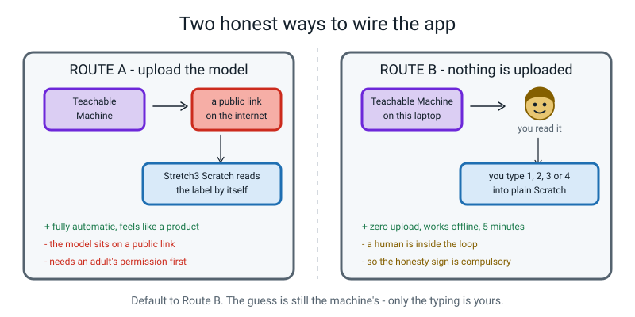
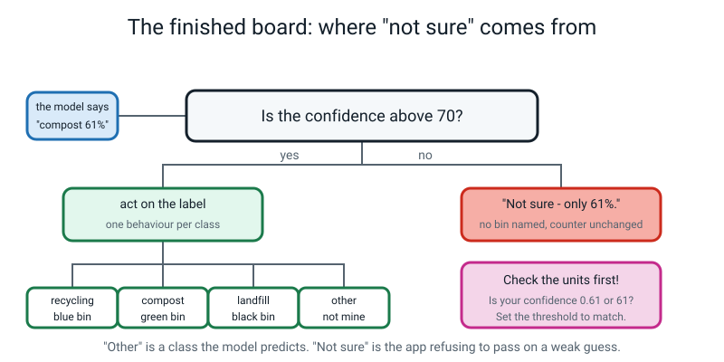
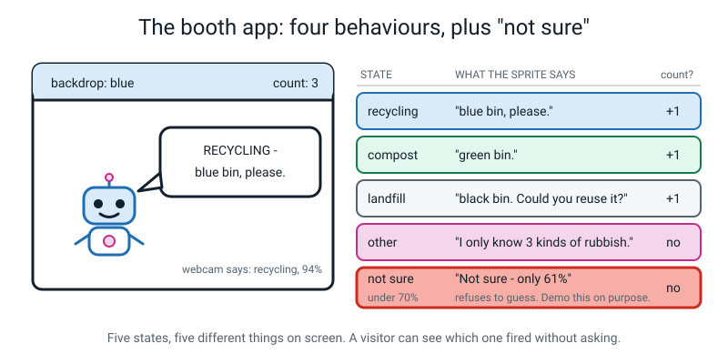
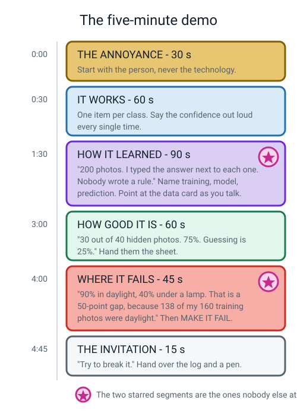
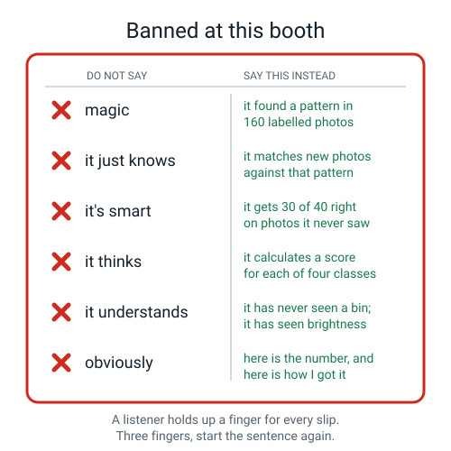
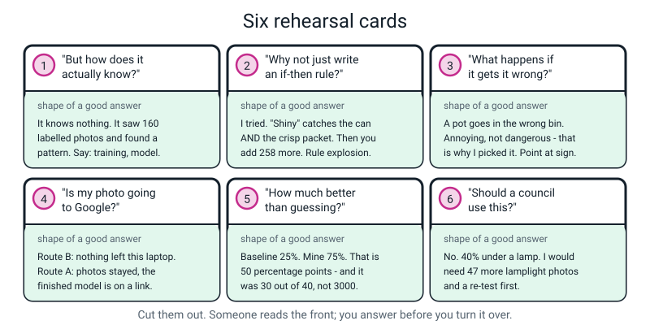

# Week 35 — The AI Fair Booth, Part 2: The App, the Report, the Demo

[⬅ Week 34](week-34.md) · [Course Home](../README.md) · [Week 36 ➡](week-36.md) · [Student Guide](../student-guide/week-35.md) · [Workbook](../workbook/week-35.md)

---

## 📋 At a Glance

| | |
|---|---|
| **Duration** | 70 minutes (75 if the app fights you; see the timing box before you start) |
| **Type** | 🎪 Capstone — build session, part 2 of 2 |
| **Big idea** | If you can show your model **failing** and explain why, you understand it. Anyone can show it working. |
| **New vocabulary** | None. This is a consolidation week. Everything today was taught in Weeks 16, 20, 30, 31 and 32. |
| **Materials** | The booth folder from Week 34 (brief, counts, `booth-v1.tm` record card, scoring sheet, matrix, data card draft), the **four scored bias sheets** from the pre-class session, poster paper, one thick marker, scissors, printed rehearsal cards, a stopwatch or phone timer, the break-it log |
| **Tech needed** | Laptop with webcam · browser · [teachablemachine.withgoogle.com](https://teachablemachine.withgoogle.com) · [scratch.mit.edu](https://scratch.mit.edu) (Route B) **or** [stretch3.github.io](https://stretch3.github.io) (Route A, adult permission required). No installs. |
| **Prep time** | 20 minutes the night before, **plus** one 45-minute pre-class session with the student (shoot and score the four bias batches) |

> **🧑‍🏫 Read this box first — the honest timing.** Milestones 5, 6 and 7 are 165 minutes of work in
> the capstone plan. They do **not** fit in 70 minutes, and no lesson plan can make them. So here is
> the split this file uses, and it is deliberate:
>
> - **Pre-class session (45 min, with you):** shoot the four bias batches and score them on paper.
>   That is measurement, and it must be the student's own hands — but it does not need the class hour.
> - **Today's 70 minutes:** the Scratch app (the hardest milestone, needs you in the room), the bias
>   report arithmetic, the signs, and **one** timed rehearsal.
> - **Homework / a second sitting:** rehearsals two and three, out loud, to a human.
>
> If you skip the pre-class session, today collapses. Put it in the diary now.


*Figure 35.1 — Two honest ways to wire the app. Default to Route B.*

---

## 🎯 Lesson Objectives

By the end of today the student can:

1. **Build a Scratch app** in which each of the four classes triggers a **different** behaviour — a different backdrop, a different sentence, a different effect on the counter — and which keeps running without being nursed.
2. **Add a confidence threshold** so that below the cut-off the app says *"not sure"* instead of naming a bin, and **demonstrate that case on purpose**.
3. **Explain the difference** between the `other` class (a prediction the model makes) and *"not sure"* (the app refusing to pass on a weak guess).
4. **Produce a bias report** containing a measured **gap in percentage points**, a **named** failing group, and a **priced fix** with the photo arithmetic written out.
5. **Deliver the five-minute demo once, timed**, covering the annoyance, it working, how it learned, how good it is, and where it fails — with zero banned words.

---

## 🧑‍🏫 What YOU Need to Know First

*Read this once. About fifteen minutes. There are three things in it, and none of them need any AI
knowledge you don't already have from Week 34.*

### Thing one: the model and Scratch are strangers

The student has a trained model. It lives in a browser tab on Teachable Machine's website. Scratch
is a **different** browser tab, made by a different organisation, and the two do not talk to each
other by default. There is no button labelled "send my model to Scratch".

So you need a **bridge**. There are exactly two, and both are legitimate engineering choices. Look
at Figure 35.1 while you read this.

**Route A — upload the model.** In Teachable Machine you click *Export Model → Tensorflow.js →
Upload my model*. Google puts your finished model on a public web address that looks like
`https://teachablemachine.withgoogle.com/models/AbCdEf123/`. Then you open **Stretch3**
(`stretch3.github.io`) — a modified copy of Scratch that has an extra extension for exactly this —
paste the link in, and Scratch can now read the model's prediction all by itself.

> **⚠️ Watch out:** Route A puts the **model** (not the photos) on a public link that anyone with the
> address could open. That is a real privacy decision, and it is an adult's decision, not an
> 11-year-old's. **If you have not actively decided to allow it, use Route B.**

**Route B — nothing is uploaded.** Teachable Machine stays open on the laptop with the webcam
preview running. Scratch runs beside it, in plain `scratch.mit.edu`, with no extensions at all. The
student reads the model's prediction off the Teachable Machine panel and types it into Scratch: `1`
for recycling, `2` for compost, `3` for landfill, `4` for other, then the confidence number.

Route B takes five minutes to build, works with no internet once the pages are loaded, and uploads
nothing. It has one cost: **there is a human inside the loop.** That is fine — but it must be said
out loud at the booth, on a printed sign, in ordinary-sized text:

```
   ┌────────────────────────────────────────────────────────────┐
   │  HOW THIS BOOTH WORKS: the model runs on this laptop and   │
   │  makes the prediction. I type the prediction into Scratch  │
   │  because I chose not to upload my model to the internet.   │
   │  The guess is the machine's. The typing is mine.           │
   └────────────────────────────────────────────────────────────┘
```

A knowledgeable adult respects that sign far more than a slicker demo. **Default to Route B.** This
file gives the full block-by-block build for both.

### Thing two: the threshold, and why "not sure" is the grown-up bit

Every time the model looks at a photo it produces four numbers that always add up to 100% — one per
class. The biggest one wins. That is all "the prediction" is.

Here is the problem the student met in Week 16: those four numbers can be `26, 25, 25, 24`. Something
still wins. The model announces `recycling` with the same voice it uses when the numbers are
`96, 2, 1, 1`. **A model with no threshold is incapable of hesitating.**

A **confidence threshold** is one line of arithmetic that fixes this. Pick a number — 70 is a good
default. Then:

```
   if the winning confidence is ABOVE 70   →   act on the label (four behaviours)
   if it is 70 or BELOW                    →   say "not sure", name no bin, count nothing
```

That is the whole idea. No new AI, just an `if`. And it is the single most professional thing in the
entire project, because it turns the machine from something that always answers into something that
knows when to shut up.


*Figure 35.2 — The flowchart you will draw on the board in the Concept segment.*

### The distinction you must get right today

This one trips up adults, so read it twice.

| | **`other`** | **"not sure"** |
|---|---|---|
| What is it? | A **class**, like the other three. The model predicts it. | An **app decision**. The model didn't say it; the app refused to pass the guess on. |
| Where does it live? | In the training data — 50 photos of hands, the bare table, car keys, a shoe. | In one `if` block in Scratch. |
| What makes it happen? | The model scores `other` highest. | The winning score, whatever the class, is too low. |
| What does the booth say? | "I don't recognise that. I only know three kinds of rubbish." | "Not sure — only 61% confident." |

So the app has **five** states, not four. And the two "I can't help you" states are genuinely
different: `other` means *the machine is confident this is none of my three bins*; "not sure" means
*the machine has no real opinion about anything*.


*Figure 35.3 — Five states, five visibly different things on screen.*

> **🧑‍🏫 The units trap — the number one bug of this lesson.** Some versions of the Scratch extension
> report confidence as `0.61`; others report `61`. If the student sets `threshold` to `70` and the
> extension is handing over `0.61`, then `0.61 > 70` is *never* true and the app says "not sure"
> forever. If they set it to `0.7` and the extension hands over `61`, the threshold *never* fires and
> the app always answers. **Fix: print the raw value once with a `say` block, look at it, and set the
> threshold to match.** Do this before you debug anything else.

### Thing three: what makes a bias report a report

The student has, from the pre-class session, four batches of ten photos, each scored on paper:

```
   control          — same room, same lamp-off daylight, same hands as training
   new-lighting     — a lamp, after dark
   new-hands        — somebody else holding the items
   new-background   — a different room
```

Four accuracies come out of that. A **bias report** is not those four numbers. It is four things:

1. **The gap**, in **percentage points** — best condition minus worst condition. "90% down to 40%" is
   a **50 percentage point** gap. Not "50%". Subtracting two percentages gives points. Week 31.
2. **A named group.** Not "it's worse sometimes". *"It fails on rubbish photographed under a lamp
   after dark."* A stranger must be able to reproduce the failure from the sentence.
3. **The chain back to the data.** Four links, and it always ends in a countable number:
   *I only shot in the afternoon → 138 of my 160 training photos are daylight → the model learned
   daylight patterns → anyone using this in the evening gets bad answers.* Nothing broke. The model
   learned exactly what it was shown. **Bias is the default outcome of learning from examples**, not
   bad luck and not anybody being unkind.
4. **A priced fix.** "Collect more data" is not a plan. "I need 47 more lamplight photos, and here
   is the arithmetic" is a plan. The arithmetic is in the Worked Example below and again in the
   Answer Key.

### The two misconceptions you will meet today

**Misconception 1: "Saying *not sure* means my model is broken / weak / worse."**

It is the exact opposite, and this is worth two minutes of your time. A model that says "not sure"
at 61% has not lost any accuracy — it still knew what it knew. It has gained the ability to tell you
*when to stop trusting it*. Ask the student: "Would you rather have a friend who answers every
question, or a friend who says 'I don't actually know' sometimes? Which one's answers do you
believe?" That lands every time.

**Misconception 2: "The bias gap is a mistake I should hide, or fix before the fair."**

The gap is a **finding**. It is the most valuable object on the booth. Twenty other stalls will have
a demo that works; nobody else will be able to say "here is exactly who I fail, here is the number,
and here is what it would cost to fix." If the student tries to bury it, remind them of the two
booths from last week — and then make the DO NOT USE sign the biggest thing on the table, which is
Milestone 6's actual requirement.

### How deep to go, and where to stop

**Go this deep:** confidences add to 100% · biggest wins · a threshold is one `if` · a gap is
measured in points · the chain from collection habit to countable skew to bad predictions for a
named group · a fix is priced in photos.

**Stop here.** Do **not** get into: how a neural network computes those four numbers; whether
confidence can be "calibrated" (a genuinely hard idea, and Level 3's); why 70 rather than 65 (the
honest answer is *you choose it, and you say you chose it*); or anything about probability theory.
If the student asks why 70, the correct answer is: *"Nothing special. I picked it. If I move it to
85 the app says 'not sure' more often and is wrong less often when it does answer. That trade is
mine to make, and I should write down that I made it."* That sentence is a Level 3 idea delivered at
Level 1 depth, and it is enough.

---

## 🧰 Prep Checklist

### 🗓️ Earlier in the week — the pre-class session (45 minutes, with the student)

This is Milestone 6's measurement. It has to happen before class.

1. **Write the prediction first (3 min).** Before shooting anything, the student writes one sentence
   in the workbook: *"I think it will be worst at ______, because only ___ of my 160 training photos
   were ______."* Sealed intent. You report it either way afterwards — that is what makes it a
   prediction rather than fishing.
2. **Shoot four batches of ten (25 min).** `control` (same conditions as training) · `new-lighting`
   (a lamp, after dark) · `new-hands` (somebody else holding the items) · `new-background` (a
   different room). Ten photos each, spread across all four classes. **These are new photos, taken
   after training, on purpose.**
3. **Score all forty on paper (15 min).** Four sheets, ten rows each: true label · prediction ·
   top % · ✓/✗. One attempt per photo. No retakes. Also circle **the highest confidence the model
   gave while being wrong** — that number goes on the poster, large.
4. Bring the four scored sheets to class. Do not compute the percentages yet; that is today.

### 🌙 The night before (20 minutes)

1. **Decide Route A or Route B, in your head, finally.** If you have not actively approved an upload,
   it is Route B. Say so at the start of class so it isn't a negotiation.
2. **If Route A:** open `stretch3.github.io`, add the Teachable Machine extension, confirm it loads.
   If it doesn't load tonight it will not load tomorrow — switch to Route B now, calmly.
3. **If Route B:** open `scratch.mit.edu`, click *Create*, confirm you can add a variable and a
   backdrop. Five minutes, and it means you can help instead of hunting.
4. **Print:** the rehearsal cards (Figure 35.6), the banned-words sign (Figure 35.5), the finished
   data card from Week 34's homework, the break-it log with the top filled in.
5. **Find the marker.** The DO NOT USE sign must be the boldest thing on the booth, and that needs a
   real marker on poster paper, not a biro on lined paper.
6. **Put the four scored bias sheets and the Week 34 booth folder in one place** so nothing is hunted
   for during a 20-minute sprint.

### 🛟 Fallbacks

| If this fails | Do this instead |
|---|---|
| **No internet at class time** | Scratch needs the page loaded, so if it never loads: build the app **on paper**. Five state cards, one per state, and the student performs the app — reads the prediction, holds up the right card, says the line. This teaches the state logic completely, and the typing is 20 minutes at the weekend. |
| **Route A: the extension won't load, or the label reporter stays empty** | Do not spend the lesson debugging. Switch to Route B, which needs no extension. Say out loud: "we are choosing the private route", write it in the data card, print the honesty sign. You have lost nothing that matters. |
| **The threshold never fires (or always fires)** | It is the units. `say (image label confidence)` once, read the number, set `threshold` to `70` or `0.7` to match. Two minutes. |
| **Teachable Machine won't reopen the saved model** | ☰ → *Open project from file* → `booth-v1.tm`. If the file is genuinely gone, retrain from the `train/` folders — 3 minutes, the folders are still there — and download it **first** this time. |
| **The bias sheets never got scored** | Score `control` and `new-lighting` only, in class, 20 photos, 7 minutes. You still get a gap, just from two conditions. Write "only 2 of 4 conditions tested" on the report, because that is true. |
| **No poster paper** | The back of a cereal box and the marker. Boldness is the requirement, not stationery. |

---

## ⏱️ The Lesson, Minute by Minute

| Minutes | Segment | What happens |
|---|---|---|
| 0–8 | 🪝 **Hook** | Hold up something ambiguous. What *should* a good machine say? |
| 8–26 | 🧠 **Concept** | The bridge · the threshold flowchart · `other` vs "not sure" · what a bias report is |
| 26–40 | 🔍 **Worked Example** | The five-state table, then the bias arithmetic and the priced fix on my numbers |
| 40–60 | 🎲 **Activity** | The Booth Sprint: the app (10) · report + signs (5) · rehearsal one, timed (5) |
| 60–70 | 🔑 **Wrap & Assign** | The threshold flowchart on the board, the banned words, homework |

---

### 🪝 Hook — The Squashed Carton (8 minutes)

**Do this first:** before you say anything, find something genuinely ambiguous from the kitchen — a
yoghurt pot with a foil lid still on, a squashed carton, a crisp packet, a paper cup with a plastic
rim. Hold it up.

**Say this:**

> "Right. Two things happen today, and they are the two things nobody else at the fair will have.
> First, the app. Second, the sign that says who your model fails.
>
> But before either — look at this. What bin does it go in?"

Let them actually answer. Let them hesitate. Most people do.

> "You hesitated. That's the right answer, by the way. Now here's the question I actually care about.
> If I hold this up to your model, what will happen?"

Wait. They will usually say "it'll say something."

> "It will say something. It has to. Remember what those four numbers do — they add up to a hundred,
> every single time, so *something* always comes first. If the numbers are ninety-six, two, one, one,
> the model is genuinely sure. If the numbers are twenty-six, twenty-five, twenty-five, twenty-four,
> it hasn't got a clue — and it says `recycling` in exactly the same voice. Same words. Same
> confidence in its tone. That is the problem.
>
> Today you are going to build the thing that fixes it. One line of arithmetic in Scratch, and your
> booth becomes the only one in the hall that can say *'I'm not sure'*. When a stranger holds up
> their car keys and your machine admits it doesn't know — that is the moment they believe
> everything else you told them."

**Ask this:**

- *"Would you rather have a friend who has an answer for every single question, or a friend who
  sometimes says 'honestly, I don't know'? Whose answers do you actually believe?"*
  → **Hoping for:** the second one, because you can trust the answers they *do* give.
  → **If they say the first one:** push once. "Your friend says the capital of Australia is Sydney,
    very confidently. It's Canberra. Now they tell you the capital of Peru. Do you believe them?"
- *"Your model already has an `other` class. Isn't that the same as saying 'not sure'?"*
  → **Hoping for:** no — hold this one open. It is the core of the Concept segment. Say: "That is
    exactly the right question and I'm going to answer it properly in five minutes, because the
    difference is the whole point of today."
  → **If they say yes and look certain:** don't correct it yet. Write "other = not sure?" on the
    board with a question mark and come back to it.

---

### 🧠 Concept — The Bridge, the Threshold, and the Report (18 minutes)

**Say this — part one, the bridge (5 minutes):**

> "Your model is in one browser tab. Scratch is in another tab. They are made by completely
> different people and they do not talk to each other. There's no 'send to Scratch' button. So we
> need a bridge, and there are exactly two.
>
> Route A: you upload your finished model to Google, you get a public web link, and a special version
> of Scratch reads your model's answer all by itself. Fully automatic. Feels like a real product.
> The cost is that your model now sits on a link anybody could open.
>
> Route B: nothing is uploaded, ever. Teachable Machine stays open right here on this laptop. Scratch
> sits next to it. You read the prediction off the screen and you type it in — one, two, three or
> four, then the confidence number. Five minutes to build. Works with the wifi off.
>
> The cost of Route B is that there's a human in the loop — you. And that is completely fine, as long
> as you *say so*. Which is why Route B booths get this sign."

**Do this:** show Figure 35.1. Then announce the decision you already made last night, as a
decision, not an offer: *"We're using Route ___ today, and here's why."* Then write the honesty sign
sentence on the board if it is Route B: **"The guess is the machine's. The typing is mine."**

**Ask this:**

- *"Which route is more honest?"*
  → **Hoping for:** a real argument either way. The good answer is "neither — they're honest about
    different things, as long as you say which one you did."
  → **If they say Route A because it's automatic:** "Automatic isn't honest. A booth that hides a
    human in the loop is dishonest; a booth with a sign about it isn't."

**Say this — part two, the threshold (7 minutes):**

> "Now the important bit. Every time your model looks at a photo it makes four numbers that add up to
> a hundred. Biggest one wins, and that's the prediction. That's genuinely all it is.
>
> So here's the fix, and it is one question. Before the app says anything at all, it asks: *is the
> winning number above seventy?* If yes — go ahead, name the bin, do the behaviour, add one to the
> counter. If no — say 'not sure, only sixty-one percent', name no bin, count nothing.
>
> Why seventy? No reason. I picked it. And that's an honest answer — if we moved it to eighty-five,
> the app would say 'not sure' more often, and it would be wrong less often when it *did* answer.
> That's a trade, and it's ours to make. What matters is that we write down that we made it."

**Do this:** draw the flowchart from Figure 35.2 on the board, live, in this order — the confidence
number, then the one diamond question, then the *no* branch on the left going to a single "not sure"
box, then the *yes* branch on the right fanning out to four boxes. Draw the *no* branch **first**, so
it doesn't look like an afterthought. Leave it up for the whole lesson.

**Say this — part three, the distinction (3 minutes):**

> "Back to your question from the hook. Is `other` the same as 'not sure'? No — and this is the
> smartest thing you'll be able to say at your booth.
>
> `other` is a class. It's one of your four. It has fifty training photos of hands and the bare table
> and a shoe. When the model picks `other`, the model is being *confident*: it is saying 'I'm sure
> this is none of my three bins.'
>
> 'Not sure' isn't a class at all. The model can't say it. It's your app refusing to repeat a weak
> guess. Whatever won, it won by too little to be worth passing on.
>
> So: `other` is the machine being confident about nothing-of-the-above. 'Not sure' is the machine
> having no real opinion at all. Five states, not four."

**Do this:** show Figure 35.3 and read the five rows across. Point out that each state changes
something *visible* — backdrop, sentence, counter — so a visitor can see which one fired without
asking.

**Say this — part four, what a bias report actually is (3 minutes):**

> "Last thing before we build. You've got four scored sheets from Tuesday: normal conditions, lamp
> after dark, someone else's hands, a different room. Four accuracies.
>
> Those four numbers are **not** a bias report. A report is four different things: the **gap** in
> percentage points, the **name** of the group that fails, the **chain** back to a countable number
> in your data, and a **priced fix** — how many photos, with the arithmetic. We're doing all four on
> my numbers in a minute, then you'll do it on yours."

**Ask this:**

- *"If it's 90% in daylight and 40% under a lamp, what's the gap?"*
  → **Hoping for:** 50 **percentage points**.
  → **If they say "50%":** accept the arithmetic, fix the unit immediately. "50% of what? Points.
    When you subtract two percentages you get percentage points." This was Week 31 and it matters.
- *"Whose fault is the gap?"*
  → **Hoping for:** nobody's — it's the data. Only 22 of 160 training photos were lamplight.
  → **If they say "the model's fault" or "I did it wrong":** "Nothing broke. The model learned
    exactly what you showed it. That's what makes bias the *normal* result, not the unlucky one."

---

### 🔍 Worked Example Together — Five States, Then the Arithmetic (14 minutes)

#### Part A — The five-state table, out loud (6 minutes)

**Do this:** hand them the blank five-state table (workbook page W35-1) and fill it in together,
speaking each row. Do not write it for them; ask and record.

| State | Backdrop | What the sprite says | Counter |
|---|---|---|---|
| `recycling` | blue | "RECYCLING — blue bin, please." | +1 |
| `compost` | green | "COMPOST — green bin." | +1 |
| `landfill` | grey | "LANDFILL — black bin. Could you reuse it?" | +1 |
| `other` | white | "I don't recognise that. I only know 3 kinds of rubbish." | no change |
| **not sure** | white + big `?` | "Not sure — only 61% confident." | no change |

**Ask this:**

- *"Why does the counter not move for `other` and 'not sure'?"*
  → **Hoping for:** because nothing got sorted. The counter counts *items put in a bin*.
  → **If they say "it should still count, it did something":** ask what the number on the poster
    would mean then. "Twelve" has to mean twelve items sorted, or it means nothing.
- *"Why do `other` and 'not sure' need different sentences even though both mean 'no bin'?"*
  → **Hoping for:** because they are different situations, and the visitor should be able to tell
    which one happened.

#### Part B — The bias arithmetic, on my numbers (8 minutes)

**Do this:** write these four results on the board. Tell them plainly these are *your* made-up
numbers, so nobody's real result gets contaminated by expectation.

```
   condition           correct / 10     fraction   decimal   percent
   ─────────────────   ────────────     ────────   ───────   ───────
   control                  9              9/10      0.9        90%
   new-hands                8              8/10      0.8        80%
   new-background           6              6/10      0.6        60%
   new-lighting             4              4/10      0.4        40%   ← worst
```

Then, step by step, out loud:

```
   1. THE GAP
      best 90%  −  worst 40%  =  50 percentage points

   2. THE NAMED GROUP
      "Rubbish photographed under a lamp after dark."
      (Not "sometimes it's worse". A stranger must be able to reproduce it.)

   3. THE CHAIN — four links, ending in a number
      I only shot in the afternoon, because that's when I was free
          ↓
      138 of my 160 training photos are daylight; only 22 are lamplight
          ↓
      the model learned daylight patterns and never learned lamplight ones
          ↓
      anyone using this in the evening gets bad answers — which for a
      kitchen bin is most of the time it matters

   4. THE PRICED FIX
      I want lamplight to be at least one third of my training photos.
      I keep all 138 daylight photos.  Let L = total lamplight photos.

          L  ≥  1/3 × (138 + L)
         3L  ≥  138 + L            (multiply both sides by 3)
         2L  ≥  138                (subtract L from both sides)
          L  ≥  69

      Check:  69 ÷ (138 + 69) = 69 ÷ 207 = 0.333… = 33.3%  ✓

      I already have 22, so photos still to take = 69 − 22 = 47.
      Then retrain, and rerun the IDENTICAL lamplight batch.
```

**Ask this:**

- *"Why do I have to rerun the identical batch afterwards, and not a fresh one?"*
  → **Hoping for:** because otherwise you can't tell whether the fix worked or the new photos were
    just easier. Same test, before and after.
  → **If they don't get it:** "If I score 70% on a different set of photos, did I improve, or did I
    just pick nicer photos? You can't tell. Same test."
- *"After the fix, what might happen to my daylight number?"*
  → **Hoping for:** it might go **down** slightly.
  → **If they're surprised:** that is a real thing, it is called a trade-off, and reporting it rather
    than hiding it is exactly what makes the report honest. This is Level 3 territory; name it and
    move on.
- *"The model was 88% confident on one photo it got wrong. Where does that number go?"*
  → **Hoping for:** on the poster, large.
  → **If they want to leave it off:** "It is the single most convincing number you own. It proves
    confidence isn't correctness, and you measured it yourself."

---

### 🎲 The Activity — The Booth Sprint (20 minutes)

Visible clock. You call the time. Three stations, back to back, no drifting.

| Minutes | Station | What the student does | What you do |
|---|---|---|---|
| 0–10 | **M5 — the app** | Build the five states in Scratch, then the threshold wrapper. Test all four classes plus one unknown object. Save as `booth-app.sb3`. | Sit on your hands. Read block names aloud if asked. At minute 8 say "threshold test now" whatever state they're in. |
| 10–15 | **M6 — report + signs** | Write the four bias percentages, the gap, the named group, the chain and the priced fix onto the report page. Then the DO NOT USE sign, in marker, on poster paper. | Check the unit is "percentage points". Check the sign is the biggest text on the table. |
| 15–20 | **M7 — rehearsal one** | Lay the booth out. Deliver the five-minute demo once, timed, to you. | Hold up a finger for every banned word. Do not interrupt. Write the time and the finger count down. |

Full instructions, both routes, in the next section.

**Say this at minute 0:**

> "Twenty minutes, three things. Ten minutes on the app — and the app is not finished until it has
> said 'not sure' to me at least once on purpose. Five minutes on the report and the sign. Five
> minutes for your first run at the demo, timed, and I'll be counting your banned words on my
> fingers. Go."

---

### 🔑 Wrap & Assign (10 minutes)

**Do this:** stand at the board with the threshold flowchart still on it (Figure 35.2). Add the
banned-words list beside it from Figure 35.5.

**Say this:**

> "Look at the flowchart. That one diamond — 'is it above seventy?' — is the difference between a
> machine that always answers and a machine you can trust. Twenty stalls at that fair will have a
> machine that always answers.
>
> And look at the sign you just made. Nobody makes a sign about what their thing *can't* do. You did,
> in marker, in the biggest letters on the table. That is the single most grown-up object in the
> hall."

**Say this — the banned words, out loud:**

> "Six phrases. Magic. It just knows. It's smart. It thinks. It understands. Obviously. Every one of
> them is a way of not explaining. Here's what you say instead: *it found a pattern in 160 labelled
> photos*. *It matches new photos against that pattern*. *It gets 30 out of 40 right on photos it has
> never seen.* Those sentences are longer and they are true, and true is what wins a fair."

**Ask this:**

- *"Say back to me, in one sentence, the difference between `other` and 'not sure'."*
  → **Hoping for:** `other` is the model confidently saying none-of-these; "not sure" is the app
    refusing to pass on a weak guess.
  → **If it's muddled:** point at the two rows of Figure 35.3 and have them read them aloud, then ask
    again. This one must be secure before next week's questions.
- *"What is your gap, in the right unit, and who does it fail?"*
  → **Hoping for:** a number in percentage points and a named, reproducible group.
- *"When somebody asks how it knows, what are the two words you must use?"*
  → **Hoping for:** **training** and **model** (or *pattern*).

Then assign the homework below, and read the first line of it out loud so it doesn't become optional.

---

## 🎲 The Activity, In Full

### The Booth Sprint — Milestones 5, 6 and 7

**Materials:** laptop with both tabs already open · the four scored bias sheets · the Week 34 booth
folder · poster paper and a thick marker · scissors · printed rehearsal cards · a timer · the
break-it log · a pen for visitors.

**Setup (do this before the student sits down):** Teachable Machine open with `booth-v1.tm` loaded
and the webcam preview running, on the left half of the screen. Scratch open, new project, on the
right half. Four items — one per real class — and one unknown object (car keys are perfect) in a
line on the table.

---

### Station 1 — the app (10 minutes)

#### Route B — the no-upload build (recommended; every block is plain Scratch)

Build it in this order. The threshold goes in **first**, before the four behaviours, so it can never
become an afterthought.

```
when green flag clicked

    set [threshold v] to (70)          · my cut-off, in percent
    set [count v] to (0)               · items actually sorted
    say [Show me an item.] for (2) seconds

    forever

        ask [Prediction? 1=recycling 2=compost 3=landfill 4=other] and wait
        set [choice v] to (answer)

        ask [Confidence %?] and wait
        set [conf v] to (answer)

        ┌── THE THRESHOLD — this block is the whole point ──┐
        if <(conf) < (threshold)> then

            switch backdrop to [white v]
            say (join [Not sure - only ] (join (conf) [%.])) for (3) seconds

        else

            if <(choice) = [1]> then
                switch backdrop to [blue v]
                say [RECYCLING - blue bin, please.] for (3) seconds
                play sound [Bell v]
                change [count v] by (1)
            end

            if <(choice) = [2]> then
                switch backdrop to [green v]
                say [COMPOST - green bin.] for (3) seconds
                play sound [Bird v]
                change [count v] by (1)
            end

            if <(choice) = [3]> then
                switch backdrop to [grey v]
                say [LANDFILL - black bin. Could you reuse it?] for (3) seconds
                play sound [Low Boop v]
                change [count v] by (1)
            end

            if <(choice) = [4]> then
                switch backdrop to [white v]
                say [I do not recognise that. I only know 3 kinds of rubbish.]
                    for (3) seconds
            end

        end
    end
```

Then print and mount the Route B honesty sign (the wording is in *What YOU Need to Know*).

#### Route A — the automatic build (only with adult approval)

Same shape, three differences: the URL goes in at the top, the label comes from a reporter block
instead of `ask`, and you need a change-guard so it doesn't repeat itself forty times a second.

```
when green flag clicked

    set image classification model URL [https://teachablemachine.withgoogle.com/models/AbCdEf123/]
    toggle video [on v]
    set video transparency to (0)

    set [threshold v] to (70)
    set [last v] to [none]
    set [count v] to (0)

    forever

        wait (0.5) seconds                       · FIX: don't hammer the CPU

        if <not <(image label) = (last)>> then   · FIX: only act on a CHANGE
            set [last v] to (image label)

            if <(image label confidence) > (threshold)> then
                ... the same four IF blocks as Route B, matching on
                    (image label) = [recycling] and so on ...
            else
                switch backdrop to [white v]
                say (join [Not sure - only ] (join (image label confidence) [% confident.]))
                    for (3) seconds
            end
        end
    end
```

> **⚠️ Watch out (Route A only):** without the `if <not <(image label) = (last)>>` guard the sprite
> repeats itself endlessly and the counter races to 40 off one can. That is the single most common
> bug in this whole project, and the student already debugged it on paper in Week 30.

#### "Finished" for Station 1 means all five of these, demonstrated to you

```
   □ recycling item  → blue backdrop,  right sentence, counter +1
   □ compost item    → green backdrop, right sentence, counter +1
   □ landfill item   → grey backdrop,  right sentence, counter +1
   □ unknown object  → white backdrop, "I only know 3 kinds of rubbish", counter unchanged
   □ LOW CONFIDENCE  → "Not sure - only __%", no bin named, counter unchanged
```

The last box is the one that gets skipped. Do not let it be skipped. With Route B, type a low number
on purpose. With Route A, hold up the squashed carton from the hook.

---

### Station 2 — the report and the signs (5 minutes)

Three objects come out of this station:

1. **The bias report** (workbook page W35-4): four condition percentages, the gap in percentage
   points, the named group in one reproducible sentence, the four-link chain ending in a count, the
   priced fix with the arithmetic, and the highest confidence recorded while wrong.
2. **The printed data card** — the Week 34 draft, finished, with box 7 now carrying the real bias
   numbers and box 8 the real warning.
3. **The DO NOT USE THIS FOR sign** — marker, poster paper, biggest text on the booth:

```
   ┌──────────────────────────────────────────────────────────┐
   │                                                          │
   │        DO  NOT  USE  THIS  FOR                           │
   │                                                          │
   │   ·  a real recycling bin                                │
   │   ·  anything photographed after dark                    │
   │      (40% correct under a lamp — I measured it)          │
   │   ·  glass — I have no glass photos at all                │
   │                                                          │
   └──────────────────────────────────────────────────────────┘
```

---

### Station 3 — rehearsal one, timed (5 minutes)

Booth laid out: laptop, poster, data card, scoring sheet, matrix, bias report, DO NOT USE sign,
break-it log, pen. Then one full run of the demo, to you, timed, following the timeline exactly.


*Figure 35.4 — The timeline. The two starred segments are the ones nobody else at the fair has.*

Your job during the run is narrow and you must stick to it: **do not interrupt**. Hold up one finger
for every banned word. At the end, report three numbers — the total time, the finger count, and
whether the failure was actually demonstrated or only described.


*Figure 35.5 — Six banned phrases and the honest sentence for each. Print it and put it where the presenter can see it.*

### Variation — easier

Cut the app to **three** states: one real class, `other`, and "not sure". The threshold is the thing
that must survive, not the number of behaviours. Then use the rehearsal cards (below) and only
rehearse the middle 90 seconds — *how it learned* — because that is the segment the questions come
from. Add the other classes at the weekend.

### Variation — harder

Three extensions, in order of value:

1. **Replace `ask` with key presses** in Route B — `when [1 v] key pressed` broadcasts to the sprite
   — so the booth never blocks waiting for typing and a visitor can drive it themselves.
2. **Log every prediction to a list** (`add (join (choice) (conf)) to [log v]`) and show the list on
   the stage. Now the booth keeps its own record and you can count "not sure" events at the end.
3. **Two thresholds.** Above 85 say it plainly; between 70 and 85 say "probably"; below 70 say "not
   sure". Then justify the two numbers out loud. That is a genuinely professional design decision.

---

## ❓ Questions Students Ask This Week

**1. "Why seventy? Why not sixty, or ninety?"**

No deep reason — you choose it, and choosing it is the job. Move it up to 85 and the app says "not
sure" more often, but when it *does* answer it is right more often. Move it down to 50 and it answers
almost everything, and more of those answers are rubbish. That trade is a real engineering decision
and there is no correct number; there is only a number you can defend. Write down which one you
picked and why. Grown-up engineers argue about this for weeks.

**2. "Isn't saying 'not sure' just admitting my model is bad?"**

The opposite. Your model didn't get any worse — it still knows what it knew. You added the ability to
tell people *when to stop trusting it*, which is a thing your model could not do before. A doctor who
says "I need to send you for a scan" is better than one who always has an instant answer.

**3. "Can I just not do the bias report? My model works fine."**

Every model fails on somebody. If you haven't found who yet, that means you haven't measured yet — it
does not mean there's nobody. And the report is the reason your booth beats the other nineteen. You
already have the four sheets; the report is arithmetic you can do in five minutes.

**4. "The model was 88% confident and it was wrong. Is it broken?"**

No, and this is the most important sentence you can say at the fair. Confidence is the model's guess
*strength* — how much it prefers one class over the other three. It is not a measured hit rate.
Nothing in the machine ever checks the answer against reality; the only thing that ever did that was
you, with a pen, in Week 34. So a confident wrong answer is completely normal, and it is why you
report accuracy from held-out photos and not from confidence.

**5. "Everyone at the fair will think Route B is cheating."**

Some will, until they read the sign. Then the smart ones will realise you made a privacy decision on
purpose and can explain it, while the stall next door uploaded a model to a public link without
thinking about it once. The guess is still the machine's. Only the typing is yours, and you said so
in writing.

**6. "If I collect the 47 lamplight photos, will it definitely go up from 40%?"**

**Nobody knows for sure, and here is why.** You can predict the direction — more lamplight examples
should mean better lamplight performance — but nobody can tell you the number in advance. It depends
on things nobody can see from outside: whether your 47 new photos are genuinely varied or 47 shots of
the same pot, whether lamplight makes two of your classes look nearly identical, whether the model
has enough to work with at all. This is not you being a beginner. Professional teams cannot predict
it either, which is exactly why the plan always ends with "retrain, then rerun the identical test".
You find out by measuring. That is the entire method.

**7. "Can I add a fifth class so it stops saying `other` so much?"**

You can, but it costs 50 photos and a full retrain, and your held-out test would have to be redone
from scratch because the classes changed — so all your Week 34 numbers would become out of date. Put
it on the poster as "what I'd do next" instead. Naming the next version is a strength, not a
weakness.

**8. "What if a visitor breaks it in a way I can't explain?"**

That is the best thing that can happen to you all day. Write exactly what they did in the break-it
log, thank them, and say: "I don't know why that worked. My guess is ___, and the way I'd find out is
___." An honest "I don't know, here's how I'd check" beats a confident wrong answer at any age, and
adults know it.

---

## ⚠️ Where This Lesson Goes Wrong

| What happens | Why | What to do right now |
|---|---|---|
| The threshold never fires — the app either always answers, or always says "not sure" | Units. The extension reports `0.61` and the threshold is `70` (or vice versa) | `say (image label confidence)` once, read the raw number, set `threshold` to `70` or `0.7` to match. Two minutes. Check this **before** anything else. |
| The sprite repeats the same line endlessly and the counter races to 40 (Route A) | The `forever` loop re-fires the matching `if` on every pass, and there is no `wait` | Add `wait (0.5) seconds` and the `if <not <(image label) = (last)>>` guard. This is exactly the Week 30 bug; remind them they already fixed it once on paper. |
| The whole 20 minutes goes on making the sprite dance | The animation gives instant feedback; a bias report doesn't | Stop it at minute 10 on the clock, out loud, whatever state the app is in. The rubric weights honesty above polish, and Station 2 cannot be homework — the sign has to exist before the booth does. |
| The low-confidence case never gets demonstrated | It requires deliberately making your own project look unsure, which feels wrong | Make it a hard gate: the app is not finished until it has said "not sure" to you once. With Route B, type `61` on purpose. With Route A, hold up the ambiguous item from the hook. |
| `other` and "not sure" get merged into one state, or one sentence | They feel like the same thing, and merging them makes the code shorter | Reopen Figure 35.3 and read the two rows out loud. Then ask which one a car key triggers and which one a squashed carton triggers. Next week a visitor will ask this. |
| The gap is written as "50%" instead of "50 percentage points" | It's how adults talk on the news | Fix it every single time, in one word: "points". It was Week 31's whole lesson and it is a mark on the rubric. |
| The bias report becomes "it's a bit worse in the dark" | Naming your own failure precisely feels like confessing | Demand the reproducible sentence: *who*, in *what condition*, at *what number*. "A stranger has to be able to break it using only your sentence." |
| The demo is delivered sitting down, reading the script | Nerves, and the script is right there | Rehearsal one is allowed to be rough — but standing, and looking up. Take the script away for rehearsal two. Reading it aloud from paper does not count as a rehearsal. |
| The DO NOT USE sign ends up small, or in biro, or tucked behind the laptop | Nobody wants their warning to be the loudest thing on the table | It is Milestone 6's actual requirement: **boldest text on the booth**. Marker, poster paper, front and centre. If it isn't the first thing you see, it isn't done. |

---

## 🧭 Differentiation

### If they are struggling

Cut, in this order, and do not feel bad about any of it:

1. **Cut Route A completely.** Route B, plain Scratch, no extensions. Five minutes instead of twenty.
2. **Cut to three states** — one real class, `other`, "not sure". The threshold survives; the other
   two classes are a copy-paste job at the weekend.
3. **Cut the four-condition bias report to two** — control and new-lighting. You still get a gap from
   the two conditions that produce it. Write "2 of 4 conditions tested" on the report, honestly.
4. **Cut rehearsal one to the middle 90 seconds** — *how it learned*. That is where the questions
   come from and it is the segment worth the most.

**Reteach, if the threshold makes no sense:** do it with no computer. You say four numbers out loud;
they hold up a green card if the biggest is over 70 and a red card if it isn't. Ten rounds, thirty
seconds each. `96,2,1,1` → green. `26,25,25,24` → red. `71,20,5,4` → green. `70,20,6,4` → red, and
argue about that one, because arguing about the edge case *is* understanding the threshold.

### If they are flying

- *"Your threshold is 70. Find me, from your own scoring sheet, one photo the app would now refuse to
  answer that it previously got RIGHT. What did the threshold cost you?"* (This is the real trade-off,
  discovered from their own data.)
- *"Count them. How many of your 40 held-out photos were below 70? How many of those were wrong? So
  of the answers the app still gives, what fraction is correct now?"*
- *"Two thresholds: plain above 85, 'probably' between 70 and 85, 'not sure' below. Now defend both
  numbers to me."*
- *"Your model is 40% under a lamp. Which two classes get confused under the lamp specifically — build
  the little confusion matrix for the lamplight batch alone."*
- *"Write the version-2 plan: 47 lamplight photos, retrain, rerun the identical batch, and one
  sentence on what you'd do if the daylight number drops."*

### If they won't engage today

This week is a real risk for this, because it comes after a heavy Week 34 and the fair is looming.
Two things are true: the app is the fun part, and the demo is the frightening part. So invert the
order.

Start with the app and nothing else. Do not mention the report, the sign or the demo. Build the four
behaviours, make the sprite say something rude about landfill, add a silly sound. Get the low-
confidence case working because it is genuinely funny to watch a machine dither. Twenty minutes of
that is a good lesson and it moves the hardest milestone.

Then take the last five minutes and do only this: *"Say the how-it-learned bit. Ninety seconds. Just
that bit."* Nothing else. The sign and the report move to the weekend.

If even that is a no: the salvage task is Station 2's sign, in marker, on poster paper, big. It takes
four minutes, it is oddly satisfying, and it is a Must-have. Then stop the lesson early on purpose
and cheerfully. A grim 70 minutes the week before the showcase costs you more than it buys.

---

## ✅ Assessing Understanding

Three checks. Last five minutes. Nothing to print.

**Check 1 — the distinction.** Say exactly: *"I hold up a car key. Then I hold up a squashed yoghurt
pot with the foil still on. Tell me which one makes the app say `other`, which one makes it say 'not
sure', and why."*

> **A good answer:** the car key → `other`, because the model is confidently sure it's none of the
> three bins (it saw hands, tables and keys in the `other` training photos). The squashed pot →
> probably "not sure", because it looks part-way between recycling and landfill, so the four numbers
> come out close together and nothing wins by enough. **Weak answer:** treats them as the same, or
> says "the app decides" without naming confidence.

**Check 2 — the unit and the group.** Say exactly: *"Tell me your bias finding in one sentence, with
the number in it."*

> **A good answer:** *"It's 90% in normal light and 40% under a lamp — a 50 percentage point gap — so
> it fails on rubbish photographed after dark, because only 22 of my 160 training photos were
> lamplight."* Number ✓ correct unit ✓ named group ✓ chain to a count ✓. **Weak answer:** "it's worse
> in the dark" (no number), or "a gap of 50%" (wrong unit — one word to fix).

**Check 3 — the banned words, live.** Say exactly: *"Explain how your model knows what a can is. You
have thirty seconds and I'm counting on my fingers."*

> **A good answer:** uses **training**, **model**, **pattern**, **160 labelled photos**, and gets to
> the end with zero fingers up. **Weak answer:** any of the six banned phrases, or a shrug. If a
> finger goes up, don't explain — just say the finger count and ask them to run the sentence again.
> They fix it themselves in one attempt, almost every time.

### Mastery scale for this week

| Level | What it looks like |
|---|---|
| **1 — Not yet** | The app shows a prediction but nothing changes on screen. No threshold. Bias described with no number. |
| **2 — Emerging** | Two or three behaviours work with help. A threshold exists but was never seen to fire. Reports "it's worse in the dark". |
| **3 — Developing** | Four behaviours work and the app runs unattended. Threshold fires when prompted. Gap computed, unit needs correcting. Demo delivered with the script in hand. |
| **4 — Secure** | Five states, all visibly different. Low-confidence case demonstrated **on purpose**. Gap in percentage points with a named group and the chain back to a count. Demo timed under five minutes, one banned word or fewer. |
| **5 — Mastery** | All of level 4, plus: prices the fix with the arithmetic shown · explains what the threshold **cost** in correct answers · defends the choice of 70 as a trade rather than a fact · volunteers the highest-confidence-while-wrong number without being asked. |

---

## 📤 Homework to Assign

**Say this, word for word:**

> "Four things, and the first one is the one that actually matters. Rehearse the demo three more
> times — and at least twice to a real live human who is allowed to interrupt you and ask anything.
> Out loud, standing up, timed. Reading it silently in your head does not count and you will be able
> to tell.
>
> Second: the six question cards. Cut them out. Get someone to read the front, you answer, then turn
> it over and see whether you had the numbers.
>
> Third: print and mount the signs — the DO NOT USE sign, the data card, and if we're on Route B the
> honesty sign.
>
> Fourth: fill in the top of the break-it log so it's ready for strangers. It should be sitting on
> the table, open, with a pen next to it. An open log with a pen invites people. A closed one on a
> shelf doesn't."


*Figure 35.6 — Cut these out. Someone reads the front; you answer before you turn it over.*

| Page | What it is | Time |
|---|---|---|
| W35-1 | The five-state table, completed and matching the built app | 5 min |
| W35-2 | The threshold, written out as blocks, plus the units check ("my confidence reads as ___, so my threshold is ___") | 6 min |
| W35-3 | The four bias scoring sheets, tidied, with each condition's fraction → decimal → percentage | 8 min |
| W35-4 | The bias report: gap in points · named group · four-link chain · priced fix with arithmetic · highest confidence while wrong | 12 min |
| W35-5 | The final data card, all 8 boxes, boxes 7 and 8 now carrying the real numbers | 8 min |
| W35-6 | The DO NOT USE THIS FOR sign, drafted before it goes on poster paper | 4 min |
| W35-7 | The demo script, minute by minute, plus the rehearsal log: three rows of time · banned words · did the failure get shown | 10 min |
| W35-8 | The six question-bank answers, in the student's own words, with the numbers filled in | 8 min |

**Total: about 60 minutes** of writing, plus the three rehearsals. If time is short, W35-4 and W35-7
are the two that cannot be dropped — the report is a Must-have and the rehearsals are what next week
is made of.

---

## 🔑 Answer Key

### Lesson questions

| Question asked in the lesson | The worked answer |
|---|---|
| **Hook** — what will the model say to the ambiguous carton? | Something, always. The four confidences must add to 100%, so one of them is biggest even when the model has no real opinion. Without a threshold the app announces `26%`-confident guesses in exactly the same voice as `96%` ones. |
| **Hook** — friend who always answers, or friend who sometimes says "I don't know"? | The second. If someone answers everything, you can't tell their real answers from their bluffs, so *all* of their answers lose value. This is precisely what a threshold buys the booth. |
| **Hook** — isn't `other` the same as "not sure"? | No. `other` is a class the model predicts confidently (none of my three bins). "Not sure" is the app refusing to pass on a weak winner. Different causes, different sentences, different states. |
| **Concept** — which route is more honest? | Neither, inherently. Route A is honest if you say the model sits on a public link; Route B is honest if you say a human types the prediction. Dishonesty is hiding whichever one you did. |
| **Concept** — 90% and 40%, what's the gap? | **50 percentage points.** Not "50%". Subtracting two percentages yields percentage points. |
| **Concept** — whose fault is the gap? | Nobody's, in the sense the student means. The data was skewed (138 daylight vs 22 lamplight) and the model learned exactly what it was shown. Bias is the default outcome of learning from examples. |
| **Worked example** — why no counter change for `other` / "not sure"? | Because nothing was sorted. If the counter counts loop events rather than items, the number on the poster means nothing — the Week 30 bug in another costume. |
| **Worked example** — why different sentences for `other` and "not sure"? | So a visitor can tell which of two different situations happened without asking. Five states, five visibly different screens. |
| **Worked example** — why rerun the *identical* batch after the fix? | Otherwise you cannot separate "the fix worked" from "the new photos were easier". Same test before and after is the only comparison that means anything. |
| **Worked example** — what might happen to daylight after the fix? | It may drop a little. That is a genuine **trade-off**, and reporting it rather than hiding it is what makes the before/after table trustworthy. |
| **Worked example** — where does 88%-confident-and-wrong go? | On the poster, large. It is the student's own measured proof that confidence is guess strength, not correctness. |
| **Wrap** — `other` vs "not sure" in one sentence? | "`other` is the model being sure it's none of my bins; 'not sure' is my app refusing to repeat a guess that won by too little." |
| **Wrap** — the two words for "how does it know?" | **Training** and **model** (plus *pattern* and the photo count). Never the six banned phrases. |

### Workbook answers

#### W35-1 — The five-state table

Exactly the table from the Worked Example. Marking points, in order of importance: **five** rows not
four · each row changes something *visible* · the counter changes on exactly the three real classes ·
the two no-bin sentences are different from each other · the "not sure" row quotes the actual
confidence number rather than saying only "not sure".

#### W35-2 — The threshold, written out

```
   set [threshold v] to (70)

   if <(conf) < (threshold)> then
       say (join [Not sure - only ] (join (conf) [%.]))
   else
       ... the four class behaviours ...
   end
```

Units check, both legal answers:

> "My confidence reads as **61**, a whole number, so my threshold is **70**."
> "My confidence reads as **0.61**, a decimal, so my threshold is **0.7**."

Marking: full credit needs the threshold check **wrapping** the four behaviours (not sitting beside
them), and a units line that matches what the student's own screen actually showed. A common wrong
answer puts the threshold check *inside* one of the four `if` blocks — then three of the four classes
have no threshold at all.

#### W35-3 — The four bias sheets

Forty rows total, ten per condition, each `true label · prediction · top % · ✓/✗`. Model version:

| Condition | Correct | Fraction | Decimal | Percentage |
|---|---|---|---|---|
| control | 9 | 9/10 | 0.9 | 90% |
| new-hands | 8 | 8/10 | 0.8 | 80% |
| new-background | 6 | 6/10 | 0.6 | 60% |
| **new-lighting** | **4** | **4/10** | **0.4** | **40%** ← worst |

Check the student did the division rather than moving the decimal point by habit: 9/10 → 9 ÷ 10 =
0.9 → 90%. It is easy arithmetic on purpose; the habit is what's being marked.

#### W35-4 — The bias report

All five parts must be present.

**1. The gap.** 90% − 40% = **50 percentage points**. (Unit is a mark on its own.)

**2. The named group.**

> "It fails on rubbish photographed under a lamp after dark."

Reproducible by a stranger. "It's worse sometimes" earns nothing.

**3. The four-link chain.**

```
   COLLECTION HABIT          →   THE DATA IS SKEWED
   I only shot in the            138 of 160 training photos are
   afternoon, because that       daylight; only 22 are lamplight
   is when I was free            (86% vs 14%)
              ↓
   THE MODEL LEARNS THE      →   WHO GETS BAD PREDICTIONS
   SKEW                          Anyone using it in the evening,
   It learned daylight           under a lamp, or in winter — which
   patterns and never            for a kitchen bin is most of the
   learned lamplight ones        time it actually matters
```

The sentence that earns the last mark: **nothing broke.** No bug, no crash. The model learned exactly
what it was shown.

**4. The priced fix.** Lamplight to be at least one third of training, keeping all 138 daylight:

```
   L ≥ 1/3 × (138 + L)   →   3L ≥ 138 + L   →   2L ≥ 138   →   L ≥ 69
   check:  69 ÷ 207 = 0.333… = 33.3%  ✓
   already have 22  →  47 more photos to take
   then retrain, and rerun the IDENTICAL lamplight batch
```

*(If a student sets a different target — say "half" — the method is what's marked, not the target.
Half would be L ≥ 138, so 116 more. Both are correct if the algebra is shown.)*

**5. Highest confidence while wrong.** A single number from the sheets, e.g. **88% on a lamplight
photo of a carton it called `compost`.** It goes on the poster, large. Marking point: the student can
say in one line *why* that number matters — confidence is guess strength, not a hit rate.

#### W35-5 — The final data card

All eight boxes. The three that were still drafts last week:

> **Box 5, What's in it.** "160 training photos: 138 daylight, 22 lamplight, 0 dark. 92 held in a
> hand, 68 on the table. One kitchen, one tablecloth, one photographer."
>
> **Box 7, Known limits.** "30 of 40 held-out photos = 75%. Baseline 25%, so a gain of 50 percentage
> points. Worst class: landfill, 6 of 10, usually called recycling. Worst condition: lamplight, 40%,
> a gap of 50 percentage points from the 90% control. Highest confidence while wrong: 88%."
>
> **Box 8, Do not use this for.** "A real recycling bin; anything photographed after dark; glass —
> there is no glass in my training data at all."

Also required if Route B was used: one line naming the route and the reason. *"Route B: the model
runs on this laptop and I type the prediction, because I chose not to upload the model."*

#### W35-6 — The DO NOT USE sign

Three requirements, all of them marked: it names at least one **measured** limit with the number
attached (40% under a lamp) · it names at least one **absent** category (glass — zero photos) · it is
physically the biggest text on the booth. A sign that says only "do not use for important things"
scores nothing, because it tells a visitor nothing they could check.

#### W35-7 — The demo script and the rehearsal log

Script must hit all six segments in order and within five minutes: annoyance 30s · it works 60s · how
it learned 90s · how good it is 60s · where it fails 45s · the invitation 15s. Two segments carry the
most weight, and both are the ones people cut when they run over: **how it learned** and **where it
fails**.

Model version of the two starred segments:

> **How it learned (90s).** "I took 200 photos of our rubbish and typed the right answer next to each
> one. Nobody wrote a rule — I tried that first and 'shiny' catches the tin can *and* the crisp
> packet. The program looked at 160 of those photos and found its own pattern. That part is called
> **training**, and what comes out is the **model** — the guessing machine. This is the data card; it
> says exactly what's in those 200 photos and what isn't."
>
> **Where it fails (45s).** "It's 90% in normal light and 40% under a lamp. That's a 50 percentage
> point gap, and it's because 138 of my 160 training photos were daylight. Watch —" *[turns the lamp
> on, holds up the carton, lets it get it wrong]* "— and see that? 88% confident, and wrong."

Rehearsal log: three rows of `time · banned words · was the failure actually demonstrated`. A good
log shows the time coming **down** and the finger count going **down** across the three runs. If the
time went up, that is usually a good sign in run two (they stopped reading and started explaining)
and a bad sign in run three.

#### W35-8 — The six question-bank answers

Every answer must contain a number the student measured.

| Question | The shape of a good answer |
|---|---|
| "How does it actually know?" | It doesn't know anything. It saw **160 labelled photos** and found which patterns of light and dark went with which answer, then matches new photos against those patterns. Must contain **training** and **model**; must contain none of the six banned phrases. |
| "Why not just write an if-then rule?" | Tried it. "Shiny" catches the can *and* the crisp packet, which is landfill. Then you add a rule, then another, and each one interacts with all the rest — **rule explosion**. Week 10's number: 258 rules and still wrong. That is why people train from examples instead. |
| "What if it's wrong?" | A yoghurt pot goes in the wrong bin. Annoying, nobody hurt — and that is *why* I picked this problem rather than something medical. Then point at the DO NOT USE sign. |
| "Is my photo going to Google?" | Route B: "Nothing has left this laptop, including the model. I type the prediction in myself, and that sign says so." Route A: "My photos never left this laptop — training happened in the browser — but the finished model is on a Google link, and I decided that with an adult." Precision matters more than reassurance. |
| "How much better than guessing?" | "Baseline for four classes is 25%. Mine is 75% — 30 out of 40 photos it had never seen. That's a **50 percentage point** gain, and here's the sheet so you can see it was 40 photos and not 4,000." |
| "Should a council use this?" | "No, and here's the number: 40% under a lamp. A bin sensor in a dark kitchen would be wrong more than half the time. To make it usable I'd need 47 more lamplight photos, a retrain, and the identical test rerun — and the daylight number might drop when I do." |

#### Reflection

**"Which part of your booth would be hardest for another student to copy?"**

> The honest answer is never the app. It is the 40-photo scoring sheet, the confusion matrix and the
> bias report — because those took measurement, not clicking, and there is no shortcut to them.

**"What is the one sentence you most want a visitor to remember?"**

> Accept anything containing a measured number and a named limit. The strongest versions sound like:
> *"It gets 30 out of 40 right on photos it has never seen, and it fails after dark — I measured
> both."*

---

## 🔮 Next Week Preview

Next week is Showcase Day, and it is three things in one sitting: the paper, the booth, and the
reckoning. The paper is the full Level 1 assessment — 20 multiple choice, 8 short answers and 4
debug problems, closed book, calculator allowed but the division written down. The booth goes up for
a real audience of at least two adults, the five-minute demo is delivered **without notes**, and
visitors are actively invited to break the model with the log open on the table. Then the paper is
marked together, the six Level 1 outcomes are ticked honestly, and the six-point Level 2 gate is
answered with "not yet" allowed and respected.

**Prep early, this week:**

1. **Invite the audience now.** Two adults minimum, neither of whom has heard the demo. Grandparents,
   a neighbour, a sibling's parent — anyone who will ask a real question. A booth with no strangers
   at it is not a showcase.
2. **Decide how the paper runs.** In full it is about 90 minutes and needs its own sitting. If you
   only have the one 70-minute class, set the **short form** (Part A plus B1, B6, B8 plus C3) as
   homework the night before and mark it in class. Both are legitimate; decide now, not on the day.
3. **Print the assessment pack, the six-outcome checklist and the certificate** — with blank lines
   where the real held-out accuracy and the real bias gap get written in by hand.
4. **Buy or borrow one nice pen** for the break-it log and the certificate signature. It sounds
   trivial. It is not: this is the last week of Level 1, and the ceremony is part of the lesson.

---

[⬅ Week 34](week-34.md) · [Course Home](../README.md) · [Week 36 ➡](week-36.md) · [Student Guide](../student-guide/week-35.md) · [Workbook](../workbook/week-35.md) · [Orientation](00-orientation.md) · [Glossary](../../glossary.md)
