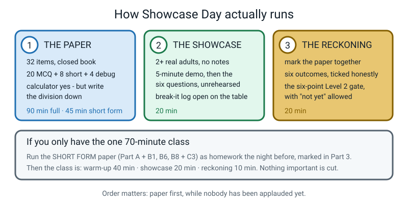
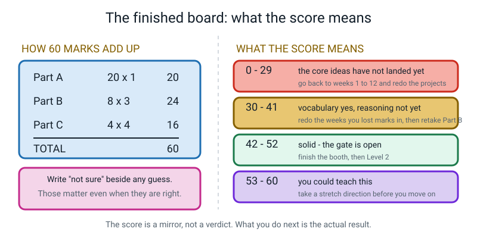
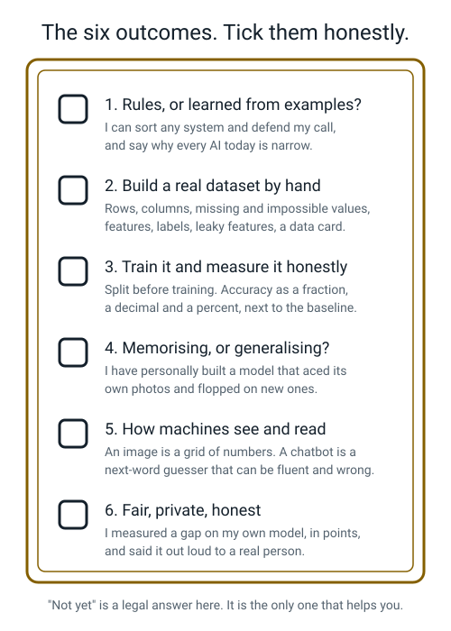
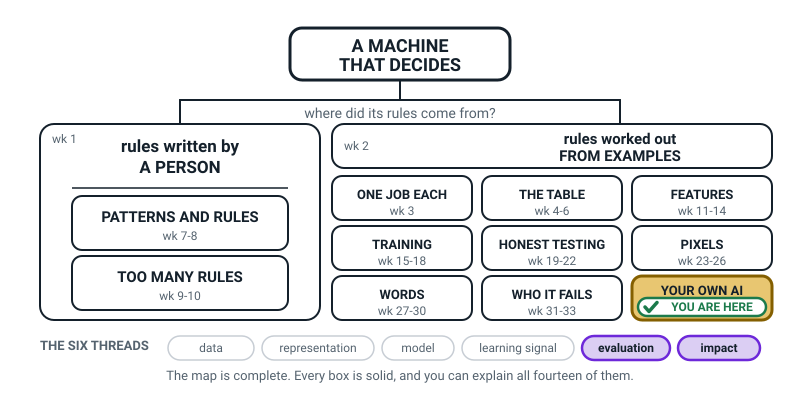
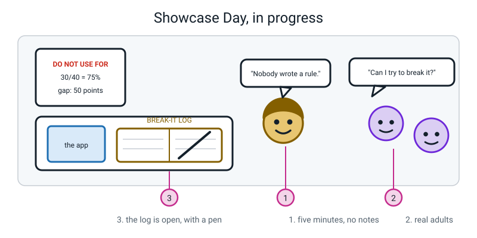
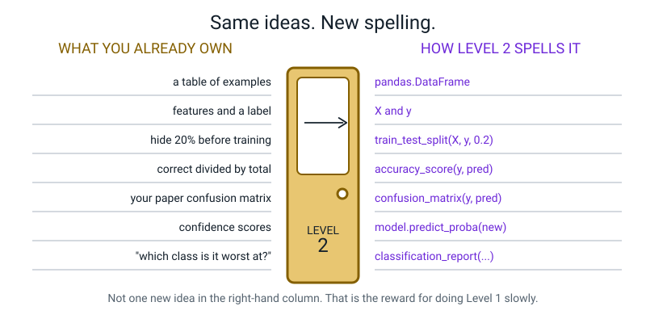
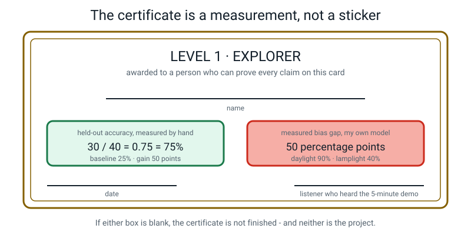

# Week 36 — Showcase Day: Prove It, Present It, Celebrate It

[⬅ Week 35](week-35.md) · [Course Home](../README.md) · [What's Next ➡](../README.md) · [Student Guide](../student-guide/week-36.md) · [Workbook](../workbook/week-36.md)

---

## 📋 At a Glance

| | |
|---|---|
| **Duration** | 70 minutes for the class described here — **plus** the assessment paper, which is a separate 90-minute sitting or a short-form homework the night before (see the box below) |
| **Type** | 🏁 Assessment + showcase — the last week of Level 1 |
| **Big idea** | You can build a guessing machine, measure it honestly, find out who it fails, and explain every bit of it without once saying "magic". |
| **New vocabulary** | None. Nothing new is introduced today. Today is proof. |
| **Materials** | Printed assessment pack (32 items) · pencil, eraser, spare paper · a calculator · the whole booth from Weeks 34–35 (laptop, poster, data card, scoring sheet, confusion matrix, bias report, DO NOT USE sign) · the break-it log and a good pen · printed six-outcome checklist · printed certificate · one envelope for the sealed letter · the Week 36 workbook (revision sections before the paper, W36-4 to W36-9 after) |
| **Tech needed** | Whatever the booth already needs. Nothing new. The paper is pencil and paper on purpose. |
| **Prep time** | 25 minutes the night before, plus inviting two adults earlier in the week |

> **🧑‍🏫 Read this box before you plan the day.** The Level 1 assessment is 32 items and takes about
> **90 minutes** done properly. It does not fit inside a 70-minute class that also contains a
> showcase. You have two honest options, and you should pick one now rather than on the day:
>
> - **Option 1 — two sittings.** The paper gets its own 90 minutes (a weekend morning is ideal),
>   closed book, then this 70-minute class is the showcase and the reckoning.
> - **Option 2 — short form.** Set **Part A (20 items) plus B1, B6, B8 plus C3** as homework the night
>   before, closed book, sealed and handed to you unmarked. Then today runs: warm-up and specimen
>   marking 40 minutes · showcase 20 minutes · reckoning 10 minutes.
>
> **Order matters either way: the paper comes before the applause.** A student who has just been
> clapped at by two adults will not mark themselves honestly.


*Figure 36.1 — The three parts, in order, with both timing options.*

---

## 🎯 Lesson Objectives

By the end of today the student can:

1. **Complete the Level 1 assessment** — 20 multiple choice, 8 short answer, 4 applied debug problems — closed book, with every division written down.
2. **Deliver the five-minute booth demo to a real audience** of at least two adults, without notes, and answer questions nobody rehearsed with them.
3. **Invite visitors to break the model** and record at least one genuine finding in the break-it log.
4. **Self-assess against all six Level 1 outcomes** and the six-point Level 2 gate, marking "not yet" where "not yet" is the true answer.
5. **State their own headline numbers unprompted** — held-out accuracy as a fraction and a percentage, the baseline, and the measured bias gap in percentage points.

---

## 🧑‍🏫 What YOU Need to Know First

*Read this once. About twelve minutes. There is almost no new content — your job today is
different from every other week, and this section is about that job.*

### Your job today is not to teach

For 35 weeks you explained things. Today you do three completely different jobs, and they are all
harder than explaining:

1. **Invigilate without rescuing.** During the paper you say nothing helpful. Not one hint. If the
   student is stuck, the correct response is *"leave it, write 'not sure' next to it, come back."*
   Every hint you give converts a diagnosis into a nice feeling, and the diagnosis is the whole point.
2. **Host without performing.** During the showcase, you are furniture. You do not fill silences, you
   do not finish sentences, you do not explain what your student meant. If an adult asks a hard
   question, you let the silence run.
3. **Mark honestly, together, out loud.** Afterwards you mark the paper *with* the student, item by
   item, saying the answer and the reason. Not a score handed down — a walk through.

### What the paper is, and what the score means

Sixty marks, three parts.

```text
   Part A   20 multiple choice   × 1 mark   =  20
   Part B    8 short answer      × 3 marks  =  24
   Part C    4 applied / debug   × 4 marks  =  16
                                              ───
                                               60
```

Four bands. Say the band out loud with the sentence next to it, never the band alone.

| Score | What it means | What to do |
|---|---|---|
| **0–29** | The core ideas have not landed yet | Go back to Weeks 1–12 and redo the *projects*, not the reading |
| **30–41** | Vocabulary yes, reasoning not yet | Redo the weeks the marks were lost in, then retake Part B only |
| **42–52** | Solid. The gate is open | Finish the booth, then Level 2 |
| **53–60** | You could teach this | Take a stretch direction, then Level 2 |


*Figure 36.2 — What the board looks like during the Concept segment.*

Three rules of the paper that are not negotiable, and each has a reason worth saying aloud:

- **Closed book.** No module files, no glossary, no workbook. The point is to find the holes.
- **A calculator is allowed, but the division must be written down.** Because "0.75" with no working
  is not evidence of anything, and half the marks in Part B are for the arithmetic being visible.
- **"Not sure" written beside any guess.** Those items matter *even when the guess is right*. A lucky
  right answer that goes unmarked is a hole that survives into Level 2.

### Every "not yet" needs a week number

This is the single most useful thing you will produce today. When the student marks something wrong,
or ticks "not yet" on the checklist, it must be turned into **a week to go back to**. Here is the map
from the assessment's module tags to this course's weeks — keep it beside you while marking.

| Assessment tag | The weeks that own it | The idea |
|---|---|---|
| `Module 1` | **W1, W2, W3** | Rules vs learned from examples; narrow AI; the word *judgement* |
| `Module 2` | **W4, W5, W6** | Rows and columns; missing / duplicate / impossible values; provenance and data cards |
| `Module 3` | **W7, W8, W10** | Patterns; edge cases; rule explosion; why 18/20 on your own examples is meaningless |
| `Module 4` | **W11, W12, W13, W14** | Features and labels; useful / useless / leaky; classification vs regression; baselines |
| `Module 5` | **W15, W16, W17** | Training; class balance; confidence is not correctness; the margin |
| `Module 6` | **W19, W20, W21, W22** | Hold out before training; accuracy three ways; overfitting; confusion matrices |
| `Module 7` | **W23, W24, W25, W26** | Pixels as numbers; RGB as three grids; 3×3 filters and `ABS` |
| `Module 8` | **W28, W29, W30** | Tokens; bigram counts; sampling; hallucination; the Scratch app |
| `Module 9` | **W31, W32, W33** | Bias chains; gaps in percentage points; personal data; over-trust |

### The six outcomes, and why the checklist beats the score

The score is one number. The checklist is 31 specific sentences, and every one of them is either
true of this student or not. That is far more useful.


*Figure 36.3 — The six outcomes. "Not yet" is a legal answer and the only one that helps.*

Two of the 31 items cannot be faked, and they are the two that actually matter:

> - *"I have personally made a model that scored well on its own photos and failed on new ones."*
> - *"I have said out loud, to a real person, something my own model is bad at."*

If those two are ticked truthfully, this student has done two things that many people who talk about
machine learning have never done themselves. That is not flattery; those are the steps that often get skipped.

### The two misconceptions you will meet today

**Misconception 1: "The score is the result."** It is not. The result is what happens next. A 38 that
turns into "I'm going back to Week 20 and redoing the accuracy project" is a better outcome than a 47
that turns into nothing. Say this before the paper, not after — after, it sounds like consolation.

**Misconception 2: "Ticking 'not yet' means I failed Level 1."** It means the opposite: it means the
student can assess their own understanding, which is a skill most people never acquire. The gate has
six points, and *"not yet, and here's the week I'm going back to"* is a completed gate, not a failed
one. Level 2 assumes the Level 1 ideas are automatic and moves fast; walking through the door with a
hole in Week 20 costs far more than one extra fortnight.

### How deep to go, and where to stop

**Go this deep:** every wrong answer gets its correct answer, its reason, and a week number. Every
tick on the checklist is defended with an example ("show me where you did that").

**Stop here.** Do not turn the marking into a re-teach of the whole level — you will run out of time
and goodwill. Two or three items get a proper conversation; the rest get the answer, the reason, and
the week number, and move on. And do not do any Level 2 material today, not even a taste of Python.
Today's job is to close Level 1 cleanly.

---

### 🧭 The Growing Map

This is the last time you will show this figure, and today it is not orientation — it is the syllabus,
finished. **Every box is solid.** Both branches, all nine tiles, nothing dashed, nothing outstanding.
Show it before the showcase, not after. It is also the best possible prompt sheet for the
five-minute demo.



*Figure 36.0 — Week 36's version. Fourteen solid boxes, no dashed line left on the map, and
**evaluation** and **impact** lit along the bottom.*

**What to do with it, in about two minutes at the end of the lesson:**

1. **Show it and ask the year's version of the question:** *"which bit did we do today?"* The honest
   answer is *all of it*, and that is the first time that has ever been true. Then: *"a stranger asked
   you about your booth today — point at the boxes your answers came from."* Watch the finger travel
   the whole right-hand branch. That is the assessment, and it takes twenty seconds.
2. **Then the better question, and it is the closing question of Level 1:** *"there are no dashed boxes
   left — so what is next?"* The answer you want is **not** "harder AI". It is *"the same six threads,
   with code underneath"*. New spelling, not new ideas.
3. **Have them copy it one final time — from memory, no reference.** Fourteen boxes, one sentence
   inside each. Anything they cannot fill in is a genuinely useful gap, it has a week number attached,
   and it is a far better summer task than any worksheet.

> **🧑‍🏫 Why this is worth two minutes.** A learner who can draw this map can explain their whole year
> to a grandparent in three minutes. That is the single most durable outcome of Level 1 — more durable
> than any individual model, poster or accuracy figure — and today is the day it becomes visible to
> them. Let them notice that the picture used to be almost entirely dashes.

**The six threads** along the bottom are the spine of all four levels, and they are the thing that
actually carries into Level 2. **Evaluation** and **impact** are lit today: an honest number, and a
stranger it was told to. Do not quiz them on the threads, not even now; the map is orientation, never
assessment.

---

## 🧰 Prep Checklist

This section lists what to do before the day, and what to do if something fails.

### 🗓️ Earlier in the week

1. **Invite the audience.** At least two adults, neither of whom has heard the demo. Grandparent,
   neighbour, a friend's parent, an older sibling's teacher. Brief them in one message: *"Please ask
   real questions. Please try to break the model. Please do not just say it's amazing."* That last
   sentence is the important one.
2. **Decide Option 1 or Option 2** from the box at the top, and if Option 2, set the short-form paper
   as homework the night before.
3. **Confirm the booth is complete** — all eleven Must-haves. Anything missing gets fixed this week,
   not on the day.

### 🌙 The night before (25 minutes)

1. **Print the assessment pack**, questions only, answer key kept separately and out of sight. Check
   the tables in A15, B2 and B6 have printed legibly — they carry the question.
2. **Print** the six-outcome checklist, the Level 2 gate, and the certificate with **blank lines**
   where the real held-out accuracy and the real bias gap get written in by hand.
3. **Set out** pencil, eraser, spare paper, calculator, and a clock the student can see.
4. **Read this week's Answer Key once.** Not to memorise it — so that when you mark, you are reading
   confidently rather than deciphering. Fifteen minutes, and it changes the whole tone of Part 3.
5. **Lay the booth out tonight, not tomorrow.** Ten minutes now removes the worst twenty minutes of
   tomorrow.
6. **Find an envelope** for the sealed letter, and the good pen for the certificate.

### 🛟 Fallbacks

| If this fails | Do this instead |
|---|---|
| **Only one adult can come** | One is enough for the gate. Add a second listener by phone or video call, on speaker, positioned so the student presents to a face rather than to you. |
| **No adult can come at all** | Postpone the showcase by a week — do not do it to an empty room. Run the paper and the reckoning today, and give the demo slot to a full third rehearsal, recorded on a phone. Then watch the recording together with the banned-word count. |
| **The internet is down and the app won't run** | Present with the paper artefacts and the printed screenshots: scoring sheet, matrix, bias report, data card, sign. The demo's two starred segments — *how it learned* and *where it fails* — need no computer at all. Say so out loud; it is a fair point about what the project actually is. |
| **The laptop dies mid-demo** | Have the student carry on. "The model is on this laptop; here's the sheet of every photo it scored." A presenter who keeps going without the screen is demonstrating exactly what the rubric's top band describes. |
| **The paper takes far longer than 90 minutes** | Stop at 90, mark what was attempted, and note which items were unreached. An unfinished paper marked honestly is worth more than a rushed complete one. |
| **The student refuses the paper on the day** | Do the showcase first, then the paper on the following day. The order is better the other way round, but a paper done tomorrow beats a paper never done. |

---

## ⏱️ The Lesson, Minute by Minute

This section is the plan for the 70-minute class, segment by segment. The paper itself is Option 1's separate sitting, or Option 2's homework from last night.

| Minutes | Segment | What happens |
|---|---|---|
| 0–8 | 🪝 **Hook** | Thirty-six weeks ago you couldn't do any of this. Today, three parts. |
| 8–26 | 🧠 **Concept** | How the 60 marks add up · the four bands · the six outcomes · what "not yet" means |
| 26–40 | 🔍 **Worked Example** | Mark three specimen items together, out loud, before marking the real paper |
| 40–60 | 🎲 **Activity** | The showcase: five minutes, no notes, real adults, break-it log open |
| 60–70 | 🔑 **Wrap & Assign** | The reckoning: score, six outcomes, the six-point gate, the door, the letter |

---

### 🪝 Hook — What You Could Not Do In September (8 minutes)

**Do this:** put the Week 34 booth folder and the finished booth in front of them, closed. Do not open
either. Then read this list slowly, pausing after each line.

**Say this:**

> "Before anything happens today, I want to read you a list. These are things you could not do at the
> start of this course.
>
> You couldn't look at a machine and say whether a person wrote its rules or a machine learned them
> from examples. You couldn't turn a pile of real things in your kitchen into a table with rows and
> columns. You'd never trained a model. You'd certainly never *tested* one — and that's the rare one.
> You didn't know that a photo is a grid of numbers, or that a chatbot is a next-word guesser that
> can be beautifully fluent and completely wrong. And you had never, not once, measured the group
> that your own machine treats badly and then written the number on a sign in the biggest letters on
> the table.
>
> Many people who talk about AI have never done the fourth and the sixth of those themselves.
>
> So today isn't about finding out whether you learned anything. That question is already settled —
> the booth is sitting right there. Today is about *proving* it, three ways."

**Do this:** show Figure 36.1 and point at each panel as you name it.

> "Part one: the paper. Thirty-two questions, closed book. It is not a test somebody is grading you
> on. It's a mirror — its whole job is to show us which weeks didn't stick, so we can fix them before
> Level 2 instead of discovering the hole in the middle of Python.
>
> Part two: the showcase. Two adults who have never seen this. Five minutes, no notes, then they ask
> you whatever they want, and then you *invite them to break it*.
>
> Part three: the reckoning. We mark the paper together, we go through the six outcomes one at a
> time, and we answer six questions about whether you're ready for Level 2 — and 'not yet' is a legal
> answer that I will respect completely."

**Ask this:**

- *"Which of the three do you think is hardest?"*
  → **Hoping for:** any answer with a reason. Most say the showcase.
  → **If they say the paper:** "Then that's useful information already — it means the ideas are
    solid in your hands and shakier in words. That's very common and completely fixable."
- *"What would a bad outcome today look like?"*
  → **Hoping for:** something like "pretending I understand something I don't."
  → **If they say "a low score":** correct it directly and kindly. "No. A low score I can fix in two
    weeks. The bad outcome is a *guessed right answer we don't notice*, because that hole walks into
    Level 2 with you. That's why you write 'not sure' next to every guess."

---

### 🧠 Concept — How This Is Marked, and What "Not Yet" Means (18 minutes)

**Say this — part one, the marks (6 minutes):**

> "Sixty marks. Part A is twenty multiple choice, one mark each. Part B is eight short answers, three
> marks each — twenty-four. Part C is four broken things you have to diagnose and fix, four marks
> each — sixteen. Twenty plus twenty-four plus sixteen is sixty.
>
> Notice where the marks actually are. Part A is a third of the paper and it's the easy third. Two
> thirds of this paper is *explaining and fixing*, and in Part B and Part C you get marks for the
> arithmetic being **visible**. A calculator is fine. Writing '0.75' with nothing above it is not,
> because I can't tell whether you divided or guessed."

**Do this:** draw Figure 36.2 on the board — the marks arithmetic on the left, the four bands on the
right. Leave it up all lesson.

**Say this — part two, the bands (4 minutes):**

> "Four bands, and every one of them comes with an instruction, not a verdict. Under thirty means the
> core ideas haven't landed and we go back to the early weeks and redo the *projects* — not the
> reading, the building. Thirty to forty-one means you've got the words and the reasoning is still
> coming; we redo whichever weeks the marks fell out of. Forty-two to fifty-two means solid, the gate
> is open. Fifty-three plus means you could teach this.
>
> And the sentence I want you to remember over all of it: **the score is a mirror, not a verdict.**
> What you do next is the actual result."

**Say this — part three, the six outcomes (5 minutes):**

> "Underneath the score there's something more useful. Level 1 had six outcomes — six things you were
> meant to be able to do by the end. There are thirty-one specific sentences under them, and each one
> is either true about you or it isn't."

**Do this:** show Figure 36.3 and read the six headings out loud. Then read these two sentences from
the list, slowly, and stop:

> - *"I have personally made a model that scored well on its own photos and failed on new ones."*
> - *"I have said out loud, to a real person, something my own model is bad at."*

> "Those two are the ones you can't fake and can't revise for. You either did them or you didn't. And
> you did — Week 18 and today. Hold on to that."

**Say this — part four, "not yet" (3 minutes):**

> "One rule for the checklist, and it is the whole reason it works. Every box has three legal
> answers: yes, no, and **not yet**. 'Not yet' is not a soft way of saying no. It means *I know
> exactly what this is asking and I know I can't do it, and I know where to go and get it.*
>
> So every 'not yet' gets a week number written next to it. That's the deal. A checklist with four
> 'not yets' and four week numbers is a finished checklist. A checklist with every box ticked and no
> examples is worth nothing at all — and I will ask you to show me where you did each one."

**Ask this:**

- *"Where are two thirds of the marks?"*
  → **Hoping for:** Parts B and C — explaining and fixing.
  → **If they say Part A:** count it on the board. 20 versus 40.
- *"A calculator is allowed. Why do I still want the division written down?"*
  → **Hoping for:** because the marks are for showing you knew *which* division to do; the number
    alone proves nothing.
  → **If they shrug:** "If you write 0.75 and it's wrong, I can't tell whether you divided upside
    down or pressed the wrong key. With the working, I can — and that's the difference between a
    diagnosis and a shrug."
- *"What do you write next to a question you guessed?"*
  → **Hoping for:** "not sure".
  → **If they say "nothing, it might be right":** "It might be. And then the hole stays. Those are the
    most valuable marks on the paper *because* they're the ones we can fix."

---

### 🔍 Worked Example Together — Marking Three Specimen Items (14 minutes)

The point of this segment: the student learns the mark scheme **before** their own paper is marked, so
that Part 3 is a walk-through rather than a verdict. Use these three, in this order — one from each
part. Do these on the board, not on their paper.

#### Specimen 1 — a Part A item (3 minutes)

> **A14.** A model gets **27 correct out of 36** held-out photos. Express this as a decimal and a
> percentage. (a) 0.75 and 75% · (b) 0.72 and 72% · (c) 0.27 and 27% · (d) 1.33 and 133%

Work it on the board with them:

```text
   FRACTION     27/36
   DECIMAL      27 ÷ 36 :  36 × 0.7 = 25.2 → remainder 1.8 ; 1.8 ÷ 36 = 0.05
                0.7 + 0.05 = 0.75
                check: 27/36 divides by 9 → 3/4 = 0.75  ✓
   PERCENTAGE   0.75 × 100 = 75%      →  answer (a)
```

**Ask this:** *"Where does 1.33 come from, and what does getting it tell me?"*
→ **Hoping for:** 36 ÷ 27 — the division upside down. Accuracy can never exceed 1.00, so it is
catchable without a calculator. **If they don't see it:** point at the ceiling. "You cannot get more
right than you attempted."

#### Specimen 2 — a Part B item, 3 marks (5 minutes)

> **B8(a) and (c).** Trained on 183 daylight photos and 17 lamplight. Scores 91% daylight, 42%
> lamplight. (a) State the gap in the correct unit. (c) You want lamplight to be at least one third of
> the training data, keeping all 183 daylight photos. How many lamplight photos in total, and how many
> more must you take?

Here is the working to put on the board.

```text
   (a)   91% − 42% = 49 PERCENTAGE POINTS      ← "49%" loses the mark

   (c)   Let L = total lamplight photos.
             L  ≥  1/3 × (183 + L)
            3L  ≥  183 + L
            2L  ≥  183
             L  ≥  91.5   →  round UP to 92
         check: 92 ÷ (183 + 92) = 92 ÷ 275 = 0.3345 = 33.5%  ✓ just over a third
         already have 17  →  92 − 17 = 75 more photos to take
```

**Say this:**

> "Notice this is your own booth's arithmetic with different numbers. Yours was 138 daylight, 22
> lamplight, and you needed 47 more. Same three lines of algebra. Round **up**, always — 91.5 photos
> is not a thing you can take."

**Ask this:** *"Why round up rather than to the nearest whole number?"*
→ **Hoping for:** because 91 would be just under a third, and the requirement says *at least*.

#### Specimen 3 — a Part C item, 4 marks (6 minutes)

> **C3(b).** A report says: trained on all 611 photos (300 cat, 300 dog, 11 hamster), then tested on
> 20 photos picked at random *from those same 611*, and got 19 right. "ACCURACY: 95%. Could be used by
> a vet's office." Why can the 95% not be trusted?

Build the answer with them in two moves, and make them say the first one:

```text
   MOVE 1 — the test photos were training photos.
            A model that had done nothing but MEMORISE those 611 images
            would score at least this well here (probably 100%). So the number cannot tell
            "learned what a cat looks like" apart from "recognised photo
            number 418". A measurement that can't tell success from
            failure is not a measurement.

   MOVE 2 — look at WHICH 20.  10 cats, 9 dogs, 1 hamster.
            Always guessing "cat" scores 10/20 = 50%, so the baseline is
            50%, not 0%. And the hamster class — the one with 11 photos,
            the one everything will fail on — is measured by ONE photo.
            That single photo makes hamster accuracy either 0% or 100%,
            and either way the headline barely moves.
```

**Ask this:**

- *"What's the very first thing you'd change about this project?"*
  → **Hoping for:** hold out photos **before** training. Other flaws can be fixed by adding photos or tests; this
    one forces a retrain from scratch.
- *"Write the DO NOT USE line for this model."*
  → **Hoping for:** something naming the untested part and the 11 photos, e.g. *"Do not use this for
    identifying any animal in a real vet's office, or any animal that isn't a cat, dog or hamster. It
    has seen 11 hamster photos and has never been tested on a photo it did not train on."*

---

### 🎲 The Activity — The Showcase (20 minutes)

Full instructions in the next section. Shape of the twenty minutes:

| Minutes | What happens | Your job |
|---|---|---|
| 0–2 | Visitors arrive, sit or stand at the booth. Student is standing, notes **away**. | Introduce nobody. Hand the visitors the brief: real questions, try to break it. |
| 2–7 | The five-minute demo, no notes, following the six segments. | Time it silently. Count banned words on your fingers, out of the student's sight. |
| 7–13 | The questions. Visitors ask whatever they like. | Say nothing. Let silences run. Do not translate. |
| 13–18 | **"Try to break it."** The log is open, the pen is out. Visitors hold things up. | Make sure every attempt gets written down, fooled or not. |
| 18–20 | Student's closing line: what they'd build next, and what they'd fix first. | Thank the visitors in front of the student. Then be quiet again. |


*Figure 36.4 — Three things make it a showcase: five minutes with no notes, real adults, and an open log with a pen beside it.*

---

### 🔑 Wrap & Assign — The Reckoning (10 minutes)

Three things, in this order. Ten minutes is enough if you keep moving.

**1. The score (3 minutes).** Mark the paper together, out loud. Part A first — read the letter, say
the answer, say the reason in one sentence, move on. Where it's wrong, write the **week number** in
the margin. Then total it and say the band *with* its instruction.

**2. The six outcomes (4 minutes).** Work down Figure 36.3, outcome by outcome. For every tick, ask
*"show me where"*. For every "not yet", write a week number. Do not soften a "not yet" and do not
challenge an honest one.

**3. The gate, and the door (3 minutes).**

**Say this:**

> "Six questions. Yes or not-yet, and I want the true answer, not the nice one.
>
> One: forty-two or more on the paper, or you've fixed what you missed and can explain it without
> notes. Two: you have a trained model of your own and a held-out accuracy you computed **by hand**.
> Three: you've finished the capstone and presented it to an adult for five minutes without saying
> 'magic'. Four: somebody asked 'but how does it know?' and you answered with training, examples and
> a pattern — not a shrug. Five: you can name, without being asked, one group of inputs your own
> model handles badly, *and* how many photos it'd take to fix, *and* how you'd check the fix worked.
> Six: when you hear '95% accurate', your first two questions are 'out of how many?' and 'what's the
> baseline?' — automatically, before you decide whether to be impressed.
>
> Every not-yet gets a week number. Then here's what's on the other side of that door."

**Do this:** show Figure 36.5 and read three rows across, no more.


*Figure 36.5 — Same ideas, new spelling. Not one new idea in the right-hand column.*

> "Your table of examples becomes `pandas.DataFrame`. Your features and label become `X` and `y`.
> 'Hide twenty percent before training' becomes `train_test_split`. Your hand-drawn confusion matrix
> becomes `confusion_matrix`. There is not one new *idea* in that column — only new spelling. That is
> the reward for doing Level 1 slowly."

**Then the certificate.** Fill it in, by hand, in front of them: the real held-out accuracy as a
fraction *and* a percentage, the baseline, and the measured bias gap in percentage points. Sign it.
Have a listener sign it.


*Figure 36.6 — If either number box is blank, the certificate is not finished — and nor is the project.*

> "This isn't a sticker. It's a measurement. Anybody can print a certificate. Yours has two numbers on
> it that you personally measured with a pencil, and you can defend both."

---

## 🎲 The Activity, In Full

This section gives the full instructions for the showcase, the visitors' question bank, and two variations.

### The Showcase — a real audience, five minutes, no notes

**Materials:** the complete booth · the break-it log, open, with a good pen resting on it · a timer
you can see and the student cannot · at least two adults who have not heard the demo · six or seven
objects for breaking attempts, including something with no class at all.

**Setup (10 minutes, ideally the night before):**

```text
   ┌──────────────────────────────────────────────────────────────────────┐
   │                                                                      │
   │      ╔══════════════════════════════════════════════════╗            │
   │      ║   D O   N O T   U S E   T H I S   F O R  . . .   ║  ← biggest │
   │      ╚══════════════════════════════════════════════════╝    thing   │
   │                                                                      │
   │   [ 30/40 = 75% ]   [ baseline 25% ]   [ gap: 50 points ]            │
   │                                                                      │
   │   ┌─────────────┐   ┌──────────┐  ┌──────────┐  ┌────────────────┐   │
   │   │   laptop    │   │   data   │  │  scoring │  │  BREAK-IT LOG  │   │
   │   │  (the app)  │   │   card   │  │  sheet + │  │   open, pen    │   │
   │   └─────────────┘   └──────────┘  │  matrix  │  │   beside it    │   │
   │                                   └──────────┘  └────────────────┘   │
   │        items in a line ►  ●  ●  ●  ●  ?                              │
   └──────────────────────────────────────────────────────────────────────┘
```

**Brief the visitors, in front of the student, out loud** — this is not a secret:

> "Two things I'd love from you. Ask real questions, including hard ones — 'but how does it actually
> know?' is very welcome. And please try to break it: hold up something odd and see what happens.
> Whatever you manage gets written in that log, and that's a *good* outcome, not a rude one. What
> won't help is telling them it's amazing."

**The rules for the student:**

1. **Notes away.** In a pocket, or face down and out of reach. Not held.
2. **Standing up**, facing the visitors, not the screen.
3. **Five minutes**, six segments, in order. Overrunning is normal; skipping *how it learned* or
   *where it fails* is not.
4. **The failure gets demonstrated**, not described. Turn the lamp on. Hold up the squashed pot.
5. **Every break attempt gets logged** — what they showed it, what it said, the confidence, whether
   they fooled it, and one line of "my guess why".
6. **"I don't know" is allowed**, with a follow-up: *"my guess is ___, and the way I'd find out is
   ___."*

**The six segments (the timeline from Week 35):** the annoyance 30s · it works 60s · **how it
learned 90s** · how good it is 60s · **where it fails 45s** · the invitation 15s.

**"Finished" looks like this:**

```text
   □ Delivered in 5 minutes (± 60 seconds), with no notes in hand
   □ All six segments happened, in order
   □ The words "30 out of 40", "75%" and "25% baseline" were all said out loud
   □ The bias gap was stated in percentage POINTS and the group was NAMED
   □ The model was made to fail, deliberately, in front of the visitors
   □ Zero banned words (one is a pass; three means rehearse again)
   □ At least three break attempts logged, at least one with "my guess why" filled in
   □ At least one question was answered that nobody had rehearsed
```

### The question bank — hand this to the visitors

Six questions. Give the printed cards from Week 35 to the visitors so the questions come from *them*.

| They ask | What a good answer contains |
|---|---|
| "But how does it actually know?" | It doesn't *know*. 160 labelled photos, a pattern found by the program, matching new photos to it. Must contain **training** and **model**. |
| "Couldn't you just write an if-then rule?" | Tried it: "shiny" catches the can *and* the crisp packet. Then 258 more rules. **Rule explosion.** |
| "What happens when it's wrong?" | A pot in the wrong bin — annoying, nobody hurt, which is *why* this problem was chosen. Then point at the sign. |
| "Is my photo going to Google?" | Precisely, whichever route: Route B, nothing left the laptop; Route A, the photos stayed but the model is on a link. |
| "How much better than guessing?" | 25% baseline, 75% measured, 50 percentage points, 30 out of 40 — "so you can see it was 40 photos, not 4,000." |
| "Should a council use this?" | No, with the number: 40% under a lamp; 47 more lamplight photos; retrain; rerun the identical batch. |

### Variation — easier

Cut the audience to one adult, and cut the demo to the three segments that carry the meaning: **the
annoyance** (30s), **how it learned** (90s), **where it fails** (45s). Under three minutes. Allow one
index card with six words on it — one per segment — but not sentences. Then do the break-it invitation
in full, because that part is fun and requires no performance.

### Variation — harder

1. **The hostile question.** Brief one visitor, privately, to say: *"I don't believe your 75%."* The
   student must respond by handing over the scoring sheet and walking them through three rows.
2. **The unrehearsed seventh question.** Brief a visitor to ask something outside the bank entirely,
   e.g. *"What would happen if I photographed rubbish in a completely different country?"* Top-band
   answers reason from the data card: *"My 200 photos are one kitchen and one tablecloth, so probably
   badly — and I'd test it before claiming anything."*
3. **Demo the model twice** — once at the booth's own table, once against a different background — and
   report both, live. That is a bias test performed in public, in ninety seconds.
4. **Let a visitor drive the app** while the student narrates. Much harder than it sounds, and it
   proves the app runs unattended.

---

## ❓ Questions Students Ask This Week

These are eight questions students tend to ask, with an answer for each.

**1. "Do I have to get 42 to be allowed into Level 2?"**

Forty-two is the line where the gate opens with no extra work. Below it, the door isn't locked — it's
just that walking through with a hole costs you more than a fortnight of fixing does.

The gate's own
wording covers this: *42 or more, **or** you fixed what you missed and can now explain it without
notes.* Fixing counts. Pretending doesn't.

**2. "Can I look something up if I can't remember a word?"**

No, and not because of fairness. If you look it up, we both learn that you can *find* it, which we
already knew. Leave it blank, write "not sure", and we'll know exactly which week to reopen this
afternoon. That's worth more than the mark.

**3. "Why do I have to write the division out if I'm allowed a calculator?"**

Because the marks in Part B are for knowing *which* division to do. "0.75" on its own could be a
right answer, a lucky guess, or 36 ÷ 27 rounded. With `27 ÷ 36 = 0.75` written down, it's evidence.
Every professional report you'll ever write has this property: the number is worth what its working
is worth.

**4. "What if a visitor asks something I genuinely can't answer?"**

Say so, then say how you'd find out. *"I don't know. My guess is that it fails because my photos were
all on one tablecloth. The way I'd check is ten photos on a different surface, scored on paper."*
That answer is in the top band of the rubric on purpose. A confident wrong answer is worse than an
honest gap, and every adult in the room knows it.

**5. "Is this certificate real?"**

More real than most. It has two numbers on it that nobody gave you: your held-out accuracy, measured
by hand on 40 photos your model had never seen, and your bias gap in percentage points, measured on
photos you took after training on purpose. If somebody challenges it, you can hand them the sheet.
Try that with most certificates.

**6. "Am I actually good at AI now?"**

You're good at the part almost everyone skips. You can build a small model, measure it honestly, find
who it fails, and explain it — and the measuring and the explaining are the rare bits. What you have
not done yet is type a line of code in a text language, and Level 2 is where that starts.

Both things are true at once and neither cancels the other.

**7. "What will AI be able to do by the time I'm grown up?"**

**Nobody knows for sure, and here's why.** People have been predicting this for seventy years and
they have been wrong in *both* directions — some things arrived decades late (machines holding a
conversation), and some arrived far earlier than expected (machines beating the world's best Go
player, which many experts had expected to be at least a decade away right up until it happened). The honest position
is that experts today disagree with each other loudly, and anybody who tells you a confident
timetable is selling something.

What is *not* a guess is the thing you already own: whatever gets
built, the questions "what was it trained on?", "out of how many?", "what's the baseline?" and "who
does it fail?" will still be the right questions. Those don't go out of date.

**8. "If I tick 'not yet' on the gate, does that mean I failed?"**

No. It means you can assess your own understanding, which is genuinely rarer than a good score. A
gate with two "not yets" and two week numbers written next to them is a *completed* gate. A gate with
six ticks and no examples is an unfinished one.

---

## ⚠️ Where This Lesson Goes Wrong

This table lists the common traps today and what to do about each.

| What happens | Why | What to do right now |
|---|---|---|
| You give a hint during the paper | It is almost impossible not to; watching a stuck child is horrible | Have one sentence ready and say only it: *"Leave it, write 'not sure', come back at the end."* Then look at your own paper. Every hint deletes a diagnosis. |
| The visitors say "wow, amazing!" and ask nothing | Adults are being kind, and they are frightened of asking a stupid question about AI | Brief them out loud beforehand, and if it still stalls, hand them a printed question card and say "would you read that one out?" A card gives a nervous adult permission. |
| The five-minute demo becomes twelve minutes | Nerves make people add, and the student knows a lot | Let the first run overrun — do not interrupt mid-demo. Afterwards, name the two segments that must survive (*how it learned*, *where it fails*) and have them redo it in three minutes for the second visitor. |
| Nobody actually tries to break the model | It feels rude to break a child's project | The student must issue the invitation *themselves*, holding out the pen: "Please try to break it — I'll write down what you did." Then go first yourself with the car keys, so the first attempt has already happened. |
| The break-it log stays empty even though things were tried | Everyone is talking; nobody is writing | Log it as it happens, one line, mid-conversation. If the student is mid-answer, you hold the pen and write while they talk — that is the one moment you're allowed to help. |
| Marking turns into an argument about a mark | The score suddenly feels like a judgement of them | Concede the mark, immediately and cheerfully, and move to the reason. "Have the mark. Now tell me the answer and the week." The reason is the thing you actually wanted. |
| The student ticks every box on the checklist | The list is right there and ticking feels like passing | Ask *"show me where"* on three of them, chosen at random. One honest "not yet" appearing is a better result than 31 ticks. |
| A "not yet" gets no week number | The list feels finished once the box is marked | No number, not finished. Use the module-to-week table above. A "not yet" with a week number is a plan; without one it's just a mood. |
| The whole thing turns into a party and the paper never happens | It is the last week and everyone wants it to be nice | Paper first, always, before any applause. The celebration is better afterwards anyway — and it is a genuinely good day, so let it be one **after** part one. |
| You mark generously because it's the last week | You want them to feel good, and they've worked hard | Generous marking is the one thing today that can actively hurt them, because Level 2 assumes these ideas are automatic. Mark straight, then celebrate loudly. The two are not in conflict. |

---

## 🧭 Differentiation

This section shows how to adjust the day for a student who is struggling, flying, or not engaging.

### If they are struggling

- **Use the short form and say so plainly:** Part A plus B1, B6, B8 plus C3. That is 20 + 9 + 4 = 33
  marks, and it covers all nine modules. Scale the bands by 33/60 (23+ = solid, since 42 × 33/60 ≈ 23) and write "short form"
  on the paper so nobody misreads it later.
- **Read the questions aloud** for Part B and C if reading is the obstacle rather than the ideas. It
  is a machine-learning assessment, not a reading test.
- **Cut the showcase to one adult and three minutes** — the annoyance, how it learned, where it fails.
- **Reteach, if the paper goes badly:** do not reteach today. Pick the single lowest-scoring module
  tag, write the week number on a card, and do that week's *project* again this weekend. One project,
  not nine. The ideas live in the building.
- **Protect the certificate.** It gets filled in regardless of score, because the two numbers on it
  are true regardless of score. A 31 with a real 75% held-out accuracy is still a real 75%.

### If they are flying

- *"Take question A20 — the face-detection product with a 33.9 point gap. Write the paragraph the
  company should have printed on the box, in the same shape as your own DO NOT USE sign."*
- *"Your model is 75%. A professional model on a similar task might be 97%. Name three things they
  have that you don't — and which of the three you could actually get."* (Answers worth having:
  hundreds of thousands of photos; thousands of different photographers, rooms and cameras; and a
  test set collected by someone else entirely.)
- *"Do the auditor swap: take somebody else's model, without seeing their training photos, and
  predict its weakest condition in writing. Then test it with four batches of ten and report the
  gap."* That is literally a real job.
- *"Write the version-2 brief. Not the fix — the next problem. What annoyance would you take on now
  that you know how long the paperwork takes?"*
- *"Answer this in writing: your accuracy came from 40 photos. How would your confidence in that
  number change if it came from 400? And what would stay exactly the same?"* (The percentage could
  easily move by several points on 40; the *method* stays identical. This is the seed of sample size,
  which Level 2 makes formal.)

### If they won't engage today

The last week is a real risk for this. There are two very different reasons for it. Diagnose
first.

**If it's nerves about the audience:** cut the audience, not the day. One adult, three minutes, or
even a phone recording delivered to a camera with nobody in the room. Then let a visitor watch the
recording with the student sitting beside them. The gate says "presented to an adult for five
minutes" — a recording the adult watches while the student answers questions afterwards satisfies
what the gate is actually for.

**If it's end-of-course flatness:** skip the paper today entirely and do the showcase, which is the
part that gets remembered. Set the paper for the weekend in its own sitting. Nothing is lost — the
ordering rule (paper before applause) matters within a single sitting, but a paper three days later
is fine as long as it is closed book.

**If it's a flat refusal of everything:** do one thing only, and pick the certificate. Fill in the
two numbers together — the held-out accuracy and the bias gap — and ask them to say each number out
loud once. Four minutes. Then stop and be genuinely warm about it. Thirty-five weeks of work does not
evaporate because week thirty-six was a bad Tuesday, and a sour final lesson is the one thing that
could sour the memory of the whole thing.

---

## ✅ Assessing Understanding

Today *is* the assessment, so these three checks are different: they are the things that must be
true **unprompted**, in ordinary conversation, after everything else is over.

**Check 1 — the headline, unprompted.** Say exactly: *"Tell me about your model."* Nothing more. Then
be silent.

> **A good answer** contains, without being asked: a fraction (30 out of 40), a percentage (75%), and
> the baseline (25%). **Weak answer:** "it's pretty good, like 75 percent." Follow up with the two
> questions you want to become automatic — "out of how many?" and "what's the baseline?" — and note
> whether they were needed.

**Check 2 — the reflex.** Say exactly: *"I read that a new app is 95% accurate at spotting fake
reviews. Impressed?"*

> **A good answer:** "Out of how many? And what's the baseline?" — asked *before* any opinion is
> offered. That is gate point six, and it is the most transferable thing in Level 1. **Weak answer:**
> "wow" or "that's good" without the two questions.

**Check 3 — the failure, unprompted.** Say exactly: *"What's your model bad at?"*

> **A good answer:** a named group, a number, the correct unit, and a priced fix — *"rubbish under a
> lamp after dark, 40% versus 90%, a 50 percentage point gap, and I'd need 47 more lamplight photos
> and a retest."* **Weak answer:** "some things" or "the lighting". Ask "which lighting, and what
> number?" and note that it needed asking.

### Mastery scale for this week

| Level | What it looks like |
|---|---|
| **1 — Not yet** | Under 30 on the paper. Cannot deliver the demo without reading it. No number offered when asked what the model can do. |
| **2 — Emerging** | 30–41. Demo delivered with notes in hand. Quotes a percentage but not the fraction or the baseline. Names a weakness only when asked, without a number. |
| **3 — Developing** | 42–52. Demo delivered without notes, roughly to time. Fraction, percentage and baseline given when prompted. Bias gap stated, unit sometimes wrong. Answers four of the six bank questions. |
| **4 — Secure** | 42+ with Part C attempted properly. Five minutes, no notes, all six segments, failure demonstrated deliberately. All three headline numbers offered unprompted, correct units. Six-outcome checklist completed honestly with week numbers on every "not yet". |
| **5 — Mastery** | All of level 4, plus: answers an unrehearsed question by reasoning from the data card · volunteers a limitation before being asked · fields "I don't believe your 75%" by handing over the scoring sheet · asks "out of how many?" reflexively about somebody else's claim · can say what would stay the same and what would change if the test had been 400 photos. |

---

## 📤 Homework to Assign

This section says what to assign and where each workbook part fits. There is no new content homework. There are two pieces of writing, and they close the level.

**Say this, word for word:**

> "Two things, and neither is long.
>
> First: the Level 2 gate self-check. Six points, and for each one you write yes or not-yet. For every
> not-yet, write the week you're going back to — the week number, in ink. That page is your plan for
> the next fortnight, and it's yours, not mine. I'm not marking it.
>
> Second: write a letter to yourself. One page, by hand. What you want to build next, and what you
> want to be able to do that you can't do yet. Then put it in this envelope, seal it, write today's
> date on the front, and don't open it until you finish Level 2. Then you get to find out whether the
> person who wrote it was right about you."

The workbook has two halves, and the order matters. The **revision sections** are "Different numbers,
same ideas" and are meant to be done *before* the paper if the student can; they are not the paper
and they are not marked for marks. The **Build It** pages (W36-4 to W36-9) are records of what
actually happened today, so they come *after* the paper and the showcase.

| Workbook section | What it is | When |
|---|---|---|
| ✅ Warm-Up (5 questions) | Five quick recalls from Week 35: the 31/25/23/21 "not sure" app, `other` vs "not sure", the 88% vs 51% gap with its unit, the 0.83 vs 70 units mismatch, two banned phrases | before the paper, 5 min |
| ✍️ Practice Set A (A1-A6) | Understand It: A1 fill the blanks, A2 the 21 out of 28 division, A3 true/false on a "not yet", A4 match "not yet" to weeks, A5 label the Level 1 to Level 2 door, A6 spot the uncopied band instruction | before the paper |
| ✍️ Practice Set B (B1-B5) | Use It: B1 the "97% accurate" report, B2 the lamplight algebra, B3 the 420-photo test that was never a test, B4 marking after applause, B5 a DO NOT USE line | before the paper |
| 🧩 Puzzle of the Week | The Broken Bigram Table: count the pairs, find two mistakes, correct the table, generate a sentence, bonus count | before the paper |
| 🤔 Think Deeper (T1, T2) | T1 40 photos vs 400; T2 what a professional team has that you do not | before the paper, or any spare time |
| W36-1, W36-2, W36-3 | The paper itself: Part A answer grid, Part B 8 short answers, Part C 4 debug problems, closed book, "not sure" beside every guess | *in the paper sitting* |
| W36-4 | Score tally: A + B + C, the total out of 60, the band, and the band's instruction copied out | 5 min |
| W36-5 | Showcase record: demo time, banned-word count, which six questions were asked, which one was unrehearsed | 5 min |
| W36-6 | The break-it log, completed: attempts, successful fools, and the single most useful thing a visitor found | 5 min |
| W36-7 | The six-outcome checklist (32 boxes in the workbook), ticked honestly, with a week number beside every "not yet" | 12 min |
| W36-8 | The six-point Level 2 gate: yes / not-yet, plus a week number for every not-yet, plus the plan for the next fortnight | 8 min |
| W36-9 | The letter to yourself, sealed and dated | 15 min |
| 🎨 Draw It | Draw your own door: what you can do now (with at least one real number from your own booth) on the left, what you want to build next on the right | any time after the showcase |
| 📊 Self-Check | Eight "I can..." rows, 😀 / 🙂 / 😕; anything at 😕 is a "not yet" on the gate, with a week number | last, 2-3 min |

**Build It total: about 50 minutes**, not counting the paper or the revision sections. W36-8 and W36-9
are the two that matter; the rest is recording.

---

## 🔑 Answer Key

This section holds every answer: the lesson questions, the paper, and the workbook. Keep it away from the student.

### Lesson questions

| Question asked in the lesson | The worked answer |
|---|---|
| **Hook** — which of the three parts is hardest? | Any answer with a reason. Most say the showcase, because it's public. The paper is usually harder than expected in Part C. |
| **Hook** — what would a bad outcome look like? | A guessed right answer that goes unmarked, because that hole travels into Level 2 unseen. Not a low score — a low score is a two-week fix. |
| **Concept** — where are two thirds of the marks? | Parts B and C: 24 + 16 = **40 of 60**. Part A is only 20. Two thirds of this paper is explaining and fixing, not choosing. |
| **Concept** — why write the division if a calculator is allowed? | Because the mark is for knowing *which* division to do. "0.75" alone can't be told apart from a lucky guess or an upside-down division. |
| **Concept** — what goes beside a guessed answer? | "Not sure". Those items matter **even when the guess is right**, because an unmarked lucky answer stays a hole. |
| **Specimen 1** — where does 1.33 come from? | 36 ÷ 27 — the division upside down. Catchable with no calculator: accuracy can never exceed 1.00 or 100%. |
| **Specimen 2** — why round 91.5 **up**? | The requirement is "at least one third". 91 photos gives 91 ÷ 274 = 33.2%, just under. 92 gives 33.5%, just over. Round up whenever the requirement says "at least". |
| **Specimen 3** — first thing to change about the vet report? | Hold photos out **before** training. Other flaws can be fixed by adding photos or tests; this one means throwing away the score and retraining on a fresh split or new unseen photos, because there is no way to make a model un-see a photo. |
| **Specimen 3** — the DO NOT USE line | "Do not use this for identifying any animal in a real vet's office, or any animal that is not a cat, a dog or a hamster. It has seen 11 hamster photos and has never been tested on a photo it did not train on." |
| **Wrap** — the six gate points | Answered by the student, honestly, with a week number beside every "not yet". There is no model answer; there is only a true one. |

### The assessment — Part A (1 mark each, 20 marks)

| # | Tag → weeks | Answer | The reason, in one line |
|:--:|---|:--:|---|
| A1 | M1 → W1 | **b** | AI = a machine doing a job that used to need a person's **judgement**. "Smart" and "brain" are the two banned words; speed is not judgement. |
| A2 | M1 → W1–2 | **c** | A human wrote the approved list and the if-then, so it is **rule-based** — even though the plate *reader* inside it is almost certainly learned. Real products are stacks; saying so is a top answer. |
| A3 | M1 → W1 | **a** | Every AI today is **narrow** — no human-like general ability (a chatbot does many language tasks, but that is not the same as a person's general ability; narrow does not mean literally one task). AlphaGo cannot play checkers. |
| A4 | M2 → W4 | **b** | With a `date` column, one row = one student on one day. 30 × 7 = 210 rows. |
| A5 | M2 → W5 | **b** | `(blank)` is **missing**; `88` hours of sleep is **impossible** (a day has 24). An outlier is a *legal* extreme value; this isn't one. |
| A6 | M3 → W10 | **b** | **Rule explosion.** 30 yes/no checks = 2³⁰ ≈ 1.07 **billion** situations. This is why ML exists. |
| A7 | M3 → W8, W19 | **b** | 18/20 was measured on the very messages the rules were written from, so it measures description, not detection. The 5/10 is the honest number. |
| A8 | M4 → W11 | **c** | `fruit` is the **label** — the answer you want out. Everything else is a feature. |
| A9 | M4 → W12 | **c** | **Leaky**: the sticker already contains the answer and won't exist when you need a prediction. Recognised by a suspiciously good score. |
| A10 | M4 → W13 | **b** | Minutes of homework is a number on a sliding scale → **regression**. Bucket it and it becomes classification. |
| A11 | M5 → W16 | **c** | Confidence = guess **strength**, and the four scores must sum to 100%. It says nothing about correctness. |
| A12 | M5 → W15 | **b** | **Class imbalance**: (200 − 8) ÷ 200 = **96%**, target under 20%. The model barely saw combs and learns not to bet on them. |
| A13 | M6 → W19 | **c** | A memorising model scores 100% on its training photos, and a learning one can score high too — the score cannot tell them apart, so it isn't a measurement. |
| A14 | M6 → W20 | **a** | 27 ÷ 36 = 0.75 = 75%. Check: 27/36 ÷ 9 = 3/4. |
| A15 | M6 → W21 | **b** | Model Q: 100% train, 41% test = a **59-point gap** = overfitting. R's 3-point gap at 55% is *underfitting*, a different disease. |
| A16 | M7 → W23–24 | **b** | `0` = black (no light). RGB needs **3** numbers per pixel — three stacked channel grids. |
| A17 | M7 → W25 | **c** | (12 − 3 + 1) = **10**, so 10 × 10. You lose one pixel from *each* edge. |
| A18 | M8 → W28 | **b** | `the · cat · sat · .` = **4** tokens. Lowercase, and the full stop is its own token. |
| A19 | M8 → W29 | **b** | 2 ÷ 8 = **25%**. Divide by the number of *times* (8), not the number of *different* followers (6). |
| A20 | M9 → W31 | **c** | 99.2 − 65.3 = **33.9 percentage points**, and the cause is a skewed training set, not a bug. Nothing broke. |

### The assessment — Part B (3 marks each, 24 marks)

**B1 — calculator vs photo app.** The **photo app** is the AI. A square root needs no **judgement**:
one exact answer, one exact method, nobody could reasonably disagree. Deciding whether *this* blurry
photo shows your dog is a case-by-case judgement, and nobody wrote if-then rules for it — the system
was shown huge numbers of labelled photos and found the pattern. That is **machine learning**.
*(Marks: 1 picking the photo app · 1 using *judgement* correctly · 1 naming machine learning and "nobody wrote the rules". Bonus insight: a handwriting-input calculator is a stack — learned reader, rule-based maths.)*

**B2 — the messy table.** Any three of: **duplicate** (rows 1 and 3, identical Asha — check it is
truly the same measurement, then delete one and *note* the deletion) · **impossible value**
(`age = 211`, row 4 — go back to the source; if you can't, mark it missing rather than inventing) ·
**inconsistent category** (`blue` vs `Blue`, row 2 — a computer sees two categories; fix with a
controlled vocabulary) · **missing value** (`screen_min` blank, row 4 — mark it `NA` explicitly so it
is never read as zero). Not about the values at all: the **`name` column is personal data** — with
age and colour it identifies a real child, so replace names with IDs and keep the mapping separately.
*(Also accepted: there is no data card, so provenance and permission are unknown.)*
*(Marks: 1 three problems named and located · 1 a sensible action each, with "never silently delete or invent" · 1 the structural issue.)*

**B3 — "ML is just lazy rule-writing".** Rules don't add, they **multiply**: each new condition
combines with all the existing ones, so 30 yes/no checks already give 2³⁰ ≈ **1.07 billion**
situations — **rule explosion**, which is a wall rather than a time problem. Second problem time
cannot fix: for many jobs nobody can *state* the rule at all — write the if-then rules separating a
wolf from a husky in pixel values. So the **trade** is: give up writing rules, hand over labelled
examples, lose explainability (nobody can point at line 47), gain the jobs where rules can't be
written.
*(Marks: 1 *rule explosion* used correctly · 1 a concrete number · 1 naming what is **given up**.)*

**B4 — homework features.** Useful: `minutes_of_homework_set` (plausible link, known before the
deadline) · `day_of_week` (Fridays and match days genuinely differ) · `teacher_name` (**useful with a
warning** — it may predict well, but a model that labels one teacher's students "probably late" is
judging people, so flag it). Useless: `student_shoe_size` (no plausible link, adds noise) ·
`student_id_number` (an ID, not a measurement — a model can memorise which IDs were late, which is
overfitting wearing a disguise). **Leaky:** `was_it_handed_in_late` — that *is* the answer, and it
doesn't exist until the deadline has passed. Task: **classification** (binary, on-time vs late).
**Baseline: 80%** — always guess the majority class, so a model scoring 82% has achieved almost
nothing.
*(Marks: 1 the leaky one · 1 the two useless ones with reasons · 1 "classification, baseline 80%".)*

**B5 — why confidence fell with 5 photos.** With 40 photos per class, a pattern has to survive many
angles, distances, backgrounds and lightings to be found at all, so what survives is genuinely about
the object. With 5, almost anything looks "consistent" because there is nothing to be inconsistent
with, so the learned pattern is thin and a real object matches it only weakly — belief spreads across
all three classes instead of concentrating. The **margin** must have collapsed, and you can prove it
without being told the runner-up: three scores sum to 100%, so with a top score of 54% the other two
share 46%, so the runner-up is **at least 23%** (an even split) and the margin is **at most 31 points**
(it could be as low as 8). At 91% the other two share 9%, so the margin is **at least 82 points**. The
margin has gone from "at least 82" to "at most 31". That is why margin beats top score: the top
score says who won, the margin says how close the race was — and a narrow race is close to a coin toss
wearing a percentage sign.
*(Marks: 1 thinner pattern from fewer examples · 1 deducing margin ≤ 31 points (versus ≥ 82 before) from the sum-to-100 rule · 1 why margin is more informative.)*

**B6 — the confusion matrix.**

```text
   (a)  diagonal = 5 + 4 + 2 = 11
        FRACTION 11/15 · DECIMAL 11 ÷ 15 = 0.7333 · PERCENTAGE 73.3%
        baseline (3 equal classes) = 1/3 = 33.3%  →  gain 40.0 points

   (b)  spoon      5 of 5  = 100%
        toothbrush 4 of 5  =  80%
        comb       2 of 5  =  40%
        check: 5+4+2 = 11 ✓   (100+80+40) ÷ 3 = 73.3% ✓ (equal class sizes)
```

**(c)** The hidden sentence: *"It is useless at combs — 2 out of 5 — and when it gets a comb wrong it
usually calls it a toothbrush."* 73.3% sounds decent; it is a perfect spoon detector welded to a
coin-flip comb detector, and only the **off-diagonal** cells reveal it.
*(Marks: 1 accuracy three ways with the division shown · 1 the three per-class figures · 1 a sentence naming **comb** *and* what it is confused with.)*

**B7 — the penguin and the wolf.** Both produced a **confident output with no connection to truth**,
because neither system checks truth at all. The chatbot picks likely next words; "penguins live in
the ___" is often followed by a place name and "Sahara" fits the shape perfectly — fluency and truth
are separate, and Module 8 calls this a **hallucination**. The vision model never sees "a wolf"; it
sees a grid of brightness numbers, and wolf patterns sit extremely close to the thousands of huskies
it saw labelled `dog`, so out comes `dog` at 94% — guess strength, not a promise. The shared lesson:
**confidence is produced by the same machinery as the answer**, so it cannot be a guarantee: a confident answer can still be wrong. (Low confidence is still a useful warning, which is why the Scratch app in C2 uses a threshold.)
*(Marks: 1 "confident but not truth-checking" · 1 naming **hallucination** · 1 confidence = guess strength.)*

**B8 — the lamplight gap.**

**(a)** 91% − 42% = **49 percentage points** (not "49%").

**(b)** The four links: *who/what got collected* — nearly all photos taken in the afternoon, because
that's when there was time → *the training data is skewed* — 183 daylight vs 17 lamplight, 91.5% vs
8.5% → *the model learns the skew* — good at daylight patterns, never learned warm indoor light →
*who gets bad predictions* — anyone using it under lamplight, for example in the evening. And the honest line: **nothing broke.** Bias is the default
outcome of learning from examples.

**(c)**

```text
   L ≥ 1/3 × (183 + L)  →  3L ≥ 183 + L  →  2L ≥ 183  →  L ≥ 91.5  →  92
   check: 92 ÷ 275 = 0.3345 = 33.5%  ✓
   already have 17  →  92 − 17 = 75 more to take
   then retrain and rerun the IDENTICAL lamplight batch; the daylight
   number may drop slightly, which is a real trade-off worth reporting
```

*(Marks: 1 the correct unit · 1 all four links named · 1 L = 92 and 75 more, algebra shown.)*

### The assessment — Part C (4 marks each, 16 marks)

**C1 — the broken edge filter.**

**(a)** The two **`ABS()`** calls are missing. Correct:
`=MIN(255, ABS((D2+D3+D4)-(B2+B3+B4)) + ABS((B4+C4+D4)-(B2+C2+D2)))`

**(b)** `F12` covers image patch rows 2–4, columns E–G:

The arithmetic for this cell is below.

```text
   V filter = (G2+G3+G4) − (E2+E3+E4) = (0+0+0) − (0+255+255) = −510
   H filter = (row 4)    − (row 2)    = (255+255+0) − (0+0+0) = +510
   sum with no ABS = −510 + 510 = 0    →  MIN(255, 0) = 0
```

The two edges **cancelled**. `F3` is a corner — a vertical edge on its right *and* a horizontal edge
above — so it is one of the strongest edge points in the image, and the broken formula reports
nothing there at all. `ABS` exists because a filter measures *change*; whether it goes dark→bright or
bright→dark is only which way you slid the filter. An edge is an edge.

**(c)** With `ABS`, `C12:F15` reads a **hollow square**:

```text
      255   255   255   255
      255     0     0   255
      255     0     0   255
      255   255   255   255
```

Interior 0 because nothing changes inside a flat white region; the 255s are `MIN` clipping raw totals
that reach 1020 at the corners.

**(d)** Every reference locked with `$`, so all 16 cells compute the *same* patch (around `C3`) and
you get a solid block of 255 — no outline, no information. Remove every `$`: relative references are
what make the spreadsheet **slide** the filter across the image, and that sliding *is* the filter.
*(Marks: 1 missing `ABS` · 1 the F12 arithmetic showing ±510 cancelling · 1 the hollow square · 1 "all 16 identical, remove the `$`".)*

**C2 — the spamming Scratch bot.**

**(a)** Two bugs: **no change-detection guard** (the `forever` loop re-fires the matching `if` on
every pass, and with no `wait` it runs as fast as the machine allows — hence the sluggish stage); and
**no `other` class and no threshold** (a three-class model *must* pick one of its three, because the
confidences sum to 100%, so car keys become `landfill` and a 38% guess is announced as loudly as a
96% one).

**(b)** `say [...] for (3) seconds` pauses that script, but `change [count] by (1)` fires once per
pass through the matching `if` — and the label is still `recycling` on the next pass, so it fires
again, and again, plus extra passes as the label flickers while the can moves. `count` is counting
**loop passes while an item is visible**, not items sorted. One can shows up as forty.

**(c)** The fixed script needs, in this order: `wait (0.5) seconds` at the top of the loop · a guard
`if <not <(image label) = (last)>>` with `set [last v] to (image label)` inside it · a threshold
wrapper `if <(image label confidence) > (threshold)>` around all four class blocks, with an `else`
that says "Not sure — only __% confident" · and a fourth block for `other`. **And a fix that is not
in Scratch at all:** retrain with a real `other` class of ~40 photos of the bare table, hands and
random objects. No amount of Scratch can make a three-class model able to say "none of these" — that
fix lives in the data. Also check the confidence units (`0.85` or `85`) or the comparison silently
never fires.
*(Marks: 1 the change-guard · 1 the missing `other`/threshold · 1 `count` counts loop passes · 1 a corrected script with both guard and threshold.)*

**C3 — the report that proves nothing.**

**(a)** Four problems: **1. Tested on training data** — the 20 came from the same 611, so there is no
held-out set at all. **2. Severe class imbalance** — 300/300/11; (300 − 11) ÷ 300 = **96%**, against a
20% target. **3. No baseline, and a test set that hides the problem** — 10 cats, 9 dogs, 1 hamster
means "always guess cat" scores 50%, and the hamster class is measured by a single photo, so its
accuracy is either 0% or 100%. **4. A deployment claim with nothing behind it** — "a vet's office" is
a real setting with real consequences, and there is no per-class accuracy, no confusion matrix, no
`other` class for the animals a vet actually sees, and no limits. *(Fifth, also accepted: no data
card — and the 11 hamster photos are possibly 11 shots of the same hamster.)*

**(b)** See Specimen 3 above: a purely memorising model would score at least 95% (probably 100%) on those photos, so the
number cannot distinguish learning from memorising — and 19 of the 20 came from the two easy
300-photo classes.

**(c)** The rewritten process: name four classes including `other` and report the counts and the
balance check · **split 20% of each class before any training** and say how many photos that is ·
train on the training folder only and save the project file · score every held-out photo once, on
paper, no retakes, and report accuracy as fraction → decimal → percentage, the baseline (25% for four
balanced classes), per-class accuracy, and a confusion matrix · name the worst class and what it is
confused with · run a bias test across lighting, background and holder and report the gap in
percentage points · make no deployment claim the per-class numbers don't support.

**(d)** *"**DO NOT USE THIS FOR:** identifying any animal in a real vet's office, or any animal that
is not a cat, a dog or a hamster. It has seen 11 hamster photos and has never been tested on a photo
it did not train on."*
*(Marks: 1 "tested on training data" · 1 the imbalance with a number · 1 the missing baseline / 1-hamster test set · 1 a rewrite with a pre-training split, per-class accuracy and limits.)*

**C4 — the bigram table.**

**(a)** `the·dog·ran·. · the·dog·ate·. · the·cat·ran·.` = **12 tokens** (3 sentences × 4).

**(b)** pairs = tokens − sentences = 12 − 3 = **9 bigrams**. The learner's table sums to
2+1+1+1+1+1+1+2 = **10** — one too many, which is the signal.

**(c)** **Error 1:** the `. → the` row must not exist — pairs are not counted across a full stop.
Deleting it removes 2, giving 8. **Error 2:** `ran → .` is undercounted — `ran` ends sentences 1 *and*
3, so it happened **twice**. 10 − 2 + 1 = **9** ✓. Corrected table: `the→dog 2/3` · `the→cat 1/3` ·
`dog→ran 1/2` · `dog→ate 1/2` · `cat→ran 1/1` · `ran→. 2/2` · `ate→. 1/1`. Every group's chances sum
to 100% ✓

**(d)** From `the`: two followers, `dog` (2/3) or `cat` (1/3) → **random** (three slips in a bag: dog,
dog, cat) — drew `dog`. From `dog`: `ran` or `ate`, 1/2 each → **random**, coin flip — drew `ate`.
From `ate`: exactly one follower, `.` → **forced**. Result: **"the dog ate."** Two random draws, one
forced step. This is exactly why the same prompt gives different answers each time — and note that
with a table this small, every sentence it can produce is one the corpus already contained.
*(Marks: 1 12 tokens and 9 expected bigrams with the check · 1 deleting `. → the` with the crossing rule as the reason · 1 correcting `ran → .` to 2 · 1 a generated sentence with forced and random labelled.)*

### Workbook answers

The workbook's revision sections come first, in workbook order (they are done before the paper). Then
the paper pages and the W36-4 to W36-9 records.

#### Warm-Up

| # | Answer | Watch for |
|:--:|---|---|
| 1 | **"Not sure, only 31% confident."** No bin named, counter unchanged: 31 is nowhere near 70, so the app refuses to pass the guess on. (31 + 25 + 23 + 21 = 100.) | "Recycling", because it had the biggest number. That is the whole point of the threshold. |
| 2 | `other` is a **class the model predicts**: it has real training photos, and picking it means the model is confident this is none of the three bins. "Not sure" is an **app decision**: the model did not say it; the app refused to repeat a winner that won by too little. | Both described as "the model being unsure". Only one of them is the model's. |
| 3 | **37 percentage points** (88 - 51). Not "37%". | The unit. "37%" loses the mark. |
| 4 | The app says "not sure" **every time, forever**, even on a 99%-confident answer, because `0.83 < 70` is always true: the extension reports a decimal between 0 and 1 and the threshold sits on a 0-100 scale. Fix: look at the raw number on screen and set the threshold to `0.7`. Do this before debugging anything else; a units mismatch looks exactly like a broken model. | "Retrain it." Wrong tool for a units problem. |
| 5 | Any two of the six banned phrases with a replacement: "magic" / "it found a pattern in 160 labelled photos"; "it just knows" / "it matches a new photo against that pattern"; "it's smart" / "it gets 30 out of 40 right on photos it has never seen"; "it thinks" / "it produces four numbers that add to 100 and the biggest wins"; "it understands" / "it has never seen a bin, it has seen numbers that came from photos"; "obviously" / delete it. | A replacement that is just a synonym ("it knows"). The replacement must say what actually happens. |

#### Practice Set A

| Item | Answer | Wrong-answer map |
|:--:|---|---|
| A1 | **32** items worth **60** marks; Part A is **20** multiple choice; Parts B and C are **40** of the 60 (two thirds); about **explaining** and **fixing**; the **division** must be written down. | "Choosing" for explaining and fixing: the student has not taken in where the marks are. |
| A2 | **(a) 0.75 and 75%.** Division: 28 x 0.7 = 19.6, 21 - 19.6 = 1.4, 1.4 / 28 = 0.05, so 0.75. Simplify check: 21 and 28 both divide by 7, 21/7 = 3, 28/7 = 4, so 3/4 = 0.75. Both roads agree. | (b) 70% is an estimate, not a division; Road 2 catches it (3/4 is not 0.70). (c) 133% is 28 / 21, upside down; accuracy can never exceed 100%. (d) 21% is the 21 with a decimal point stuck on; nothing was divided. |
| A3 | **False.** A "not yet" means I know what the question asks, I know I cannot do it yet, and I know where to go. What makes it **complete** is a week number next to it; without one it is "just a mood". A gate with two "not yets" and two week numbers is a completed gate. | "True" because of the word "failed". Also: a correct "False" with no mention of the week number loses the second sentence's mark. |
| A4 | 1 to **(b)** W1-W3 · 2 to **(d)** W11-W14 · 3 to **(a)** W19-W22 · 4 to **(e)** W23-W26 · 5 to **(c)** W31-W33 · 6 to **(f)** W28-W30 | Swapped pairs are usually a sign the student is matching by week order, not by topic. |
| A5 | Table of examples = `pandas.DataFrame` · features and a label = `X` and `y` · "hide 20% before training" = `train_test_split(X, y, test_size=0.2)` · paper confusion matrix = `confusion_matrix(y_test, y_pred)` · the model = `model.fit(...)` then `model.predict(...)`. | None of this is code the student writes in Level 1; they only match the names. Point out that `test_size=0.2` is the sealed envelope written as one number. **Not one new idea in the right-hand column, only spelling.** |
| A6 | The band's **instruction** was not copied out, only the word "solid". It should read: *"42-52: Solid. The gate is open. Finish the booth, then Level 2."* A circled band is a label; an instruction is a next action. | Hunting for an arithmetic error. The brief says the arithmetic and the band are right. |

#### Practice Set B

| Item | Answer |
|:--:|---|
| B1 | In order: (i) **"Out of how many?"** (97% of 30 parcels and 97% of 30,000 are different claims). (ii) **"What's the baseline?"** (if 96% of parcels are undamaged, "always say undamaged" scores 96%, so 97% is worth one percentage point). (iii) **"Were the test parcels in the training data?"** (if yes, the number measures memory, not learning). Also excellent as a third: "what is the per-class accuracy?", because the headline hides a poor score on the rare damaged ones. |
| B2 | (a) 88 - 46 = **42 percentage points**. (b) L >= 1/4 x (240 + L), so 4L >= 240 + L, 3L >= 240, **L >= 80** (already whole, no rounding needed). Check: 80 / (240 + 80) = 80 / 320 = 0.25 = 25%. Already have 30, so **50 still to take**. (c) The requirement says **at least** a quarter: if the algebra gave 79.5, then 79 photos would land just under and fail, so you always round **up**. (Here it came out exactly 80; the habit is what is marked.) |
| B3 | (a) **The test photos were training photos**: the 15 came from the same 420, so there is no held-out set, and 93% cannot tell learning from memorising. (b) (200 - 20) / 200 = 180 / 200 = **0.9 = 90%**; the target is under 20%, so this is severe. (c) The test set is 7 shirts, 7 shorts, 1 cap; always guessing "shirt" gets 7 of 15, so the baseline is **7/15 = 46.7%** and the claimed 93% is **46.3 percentage points** above a do-nothing strategy, on a test that was never a test. (d) The cap class was measured by **one photo**, so its accuracy is either 0% or 100% and the headline barely moves; and caps (20 training photos) are exactly where the model is weakest. |
| B4 | (a) They will **mark generously**: benefit of the doubt on half-answers, no "not sure" beside guesses, "basically right" for a wrong answer. (b) It is not dishonesty: after praise a wrong answer feels small. Marking first, while the answers are cold, keeps the diagnosis intact, and the celebration lands on something real. |
| B5 | *DO NOT USE THIS FOR: stocking the school shop, or identifying any item of uniform that is not a shirt, shorts or a cap. It has seen **20 cap photos**, and it has never been tested on a single photo it did not train on.* Both marks: an **absent category** (jumpers, ties, PE bags) and a **measured number** (20) a stranger could check. |

#### Puzzle of the Week: The Broken Bigram Table

```text
   the·sun·set·.   = 4 tokens
   the·sun·rose·.  = 4 tokens
   the·moon·rose·. = 4 tokens
   tokens: 12     sentences: 3
   pairs = tokens - sentences = 12 - 3 = 9
   The learner's counts add up to 2+1+1+1+1+1+1+2 = 10, which is 1 too many.
```

- **Mistake 1:** the `. -> the` row must not exist. Pairs are never counted across a full stop. Deleting it removes 2.
- **Mistake 2:** `rose -> .` is undercounted. `rose` ends sentences 2 and 3, so it is **2**, not 1. Adds 1.
- Check: 10 - 2 + 1 = 9. The total is only one out although there are two mistakes, because they pull in opposite directions.

| word pair | times seen | chance |
|---|---|---|
| the -> sun | 2 | 2/3 = 66.7% |
| the -> moon | 1 | 1/3 = 33.3% |
| sun -> set | 1 | 1/2 = 50% |
| sun -> rose | 1 | 1/2 = 50% |
| moon -> rose | 1 | 1/1 = 100% |
| set -> . | 1 | 1/1 = 100% |
| rose -> . | 2 | 2/2 = 100% |

Every group sums to 100%, and the counts sum to 2+1+1+1+1+1+2 = 9. Step 4 has many correct answers; one run is `the` (random, sun or moon) then `sun` (random, set or rose) then `rose` (forced, `.`), giving "the sun rose." Mark the forced/random labels, not the sentence: only `the` and `sun` have more than one option. **Bonus: 3 sentences** (the sun set. / the sun rose. / the moon rose.), all already in the training text, so with a table this small the generator cannot say anything new.

#### Think Deeper

| Item | What a strong answer does |
|:--:|---|
| T1 | **Quantifies** what one photo is worth (40 photos: one photo = 2.5 percentage points, so 75% is "somewhere around 75"; 400 photos: 0.25 points, the second digit becomes trustworthy). Says the **method** stays exactly the same (split before training, one attempt per photo, fraction plus baseline, matrix). Does **not** claim 400 photos would make a bad model good. |
| T2 | Three things a professional team has, with "could I get it?" for each: hundreds of thousands of photos (not alone); thousands of photographers, rooms, cameras and lighting conditions (partly: more variety is cheap and helps the worst condition); a test set collected by somebody else (**yes, almost free**: ask a friend to shoot the held-out batch). The strongest answer spots that the third is the one they can actually get. "More data and better computers" is true but unactionable. |

#### W36-1 / W36-2 / W36-3 — the paper

Marked from the three sections above. Two marking habits worth keeping: write the **week number** in
the margin of every wrong item, and put a small star next to every item the student marked "not sure"
*and got right* — those are the ones to revisit first, because luck ran out at exactly the wrong
moment on someone else's test.

#### W36-4 — Score tally

The score tally looks like this.

```text
   Part A  ___ / 20      Part B  ___ / 24      Part C  ___ / 16
   TOTAL   ___ / 60      BAND ______________
   The band's instruction, copied out in the student's own hand: ______________
```

Marking point: the instruction must be **copied out**, not just the band circled. "42–52: solid, the
gate is open" is a sentence with a next action in it; a circled band is not.

#### W36-5 — Showcase record

A complete record contains: demo time in minutes and seconds · banned-word count · which of the six
bank questions were actually asked · at least one **unrehearsed** question written down verbatim ·
one line on how it was answered. Model version:

> *"4 min 40 s. One banned word ('it just knows' — restarted the sentence). Asked: how does it know,
> what if it's wrong, how much better than guessing, should a council use it. Unrehearsed: 'what if
> you photographed rubbish in another country?' — I said probably badly, because all 200 of my photos
> are one kitchen and one tablecloth, and I'd test it before claiming anything."*

#### W36-6 — The break-it log

A model log looks like this.

```text
   #  what they showed it     model said   conf  fooled?  my guess why
   ─  ─────────────────────   ──────────   ────  ───────  ──────────────────────────
   1  a car key               other         71    no      the other class did its job
   2  a squashed can          landfill      58    YES     all my cans were round
   3  a glass jar             recycling     83    YES     I have NO glass photos
   4  a banana peel in a bag  recycling     64    YES     two classes in one photo

   END OF FAIR: 4 attempts, 3 successful fools.
   Most useful thing a visitor found: the glass jar — it is confident and wrong on a
   whole category that isn't in my data at all. That goes on the sign in version 2.
```

Marking point: **"my guess why" filled in on at least one row.** Logging the fool is recording;
explaining it from the data card is the skill. And a log with three successful fools is a *better*
artefact than a log with none — it means real attempts were made.

#### W36-7 — The six-outcome checklist

There is no right answer, only a true one. What you check as the teacher:

| | What you look for |
|---|---|
| Ticks | Can they show you where? Ask on three at random. Outcome 3's "confusion matrix by hand" and outcome 6's "gap in percentage points" both have a physical page to point at. |
| "Not yets" | Does each one have a week number beside it? Use the module-to-week table. |
| The two unfakeable items | *"a model that scored well on its own photos and failed on new ones"* → Week 18. *"said out loud, to a real person, something my own model is bad at"* → today. If either is untrue, that is the most important finding on the page. |
| Suspiciously perfect | A full sheet of ticks with no examples is a red flag, not a triumph. One honest "not yet" is worth more than a full sheet. |

#### W36-8 — The six-point Level 2 gate

| # | The point | What a completed answer looks like |
|:--:|---|---|
| 1 | 42+, or fixed what was missed and can explain it | "Yes, 47" — or "Not yet, 38. Going back to W20 and W22 and redoing the accuracy project." |
| 2 | A trained model of their own, held-out accuracy computed **by hand** | "Yes — `booth-v1.tm`, 30/40 = 75%, worked out on paper on the scoring sheet." |
| 3 | Capstone presented to an adult for 5 minutes with no "magic" | "Yes — today, to two adults, one banned word." Honest: "one" is still a yes. |
| 4 | Answered "but how does it know?" with training, examples, a pattern | "Yes — I said it saw 160 labelled photos and found a pattern, and I named training and model." |
| 5 | Names a failing group unprompted, **and** the photo count to fix, **and** how to check | "Yes — lamplight, 40% vs 90%, 50 points; 47 more lamplight photos; then rerun the identical batch." All **three** parts required. |
| 6 | "95% accurate" triggers "out of how many?" and "what's the baseline?" | "Yes" only if it happened *reflexively* in Check 2. If it needed prompting, the honest answer is "not yet — W20." |

Every "not yet" carries a week number. A gate with two not-yets and two week numbers is **complete**.

#### W36-9 — The letter to yourself

Not marked, not read by you unless offered. Say only this: it should contain one thing they want to
**build** and one thing they want to be able to **do** that they can't do yet. Sealed, dated, opened
after Level 2. If they ask what to write, offer the one prompt that always unlocks it: *"What would
you build if nobody was going to mark it?"*

#### Draw It

Marking point: something must **cross** the door (an arrow, or the same idea written twice with different names); otherwise it is two lists. The left-hand side must carry a **real number from the student's own booth**, not "I can measure models" but, for example, "30/40 = 75%, baseline 25%". The best versions put a `?` on the right and are honest that it is a question, not a promise.

#### Self-Check

Not marked. Read the 😕 rows: each is a "not yet" on the gate and must carry a week number on the line beneath the table. Eight ticks of 😀 with nothing to show is the same red flag as a full checklist.

---

## 🔮 Next Week Preview

There is no next week. Level 1 is finished, and it is worth saying that out loud rather than letting
the course just stop. What happens next is Level 2, and it hands over a keyboard: the table becomes
`pandas`, the split becomes one line, the confusion matrix becomes one function call. Not one new
idea, only new spelling, which is exactly why this level was taken slowly.

**Before that door, two things:**

1. **Clear every "not yet" first.** Go to the week written beside it and redo the **project**, not the
   reading. One project a weekend. Level 2 moves fast and assumes these ideas are automatic; the
   fortnight spent here is the cheapest fortnight in the whole curriculum.
2. **Keep the booth folder.** All eleven artefacts, in one wallet, on a shelf. In Level 2 the very
   first exercise reproduces that hand-computed accuracy in three lines of Python — and the moment
   the computer prints `0.75` and it matches the number the student worked out with a pencil in Week
   34 is the single best moment in Level 2. It only works if the folder still exists.

**And then, before anything else: say congratulations, and mean it.** Thirty-six weeks, one model, 200
photos, 40 held-out scores, a hand-drawn confusion matrix, a measured bias gap and a five-minute demo
delivered to strangers without once saying "magic". That is a real piece of work.

---

[⬅ Week 35](week-35.md) · [Course Home](../README.md) · [Assessments ➡](../assessments/README.md) · [Student Guide](../student-guide/week-36.md) · [Workbook](../workbook/week-36.md) · [Orientation](00-orientation.md) · [Glossary](../../glossary.md)
