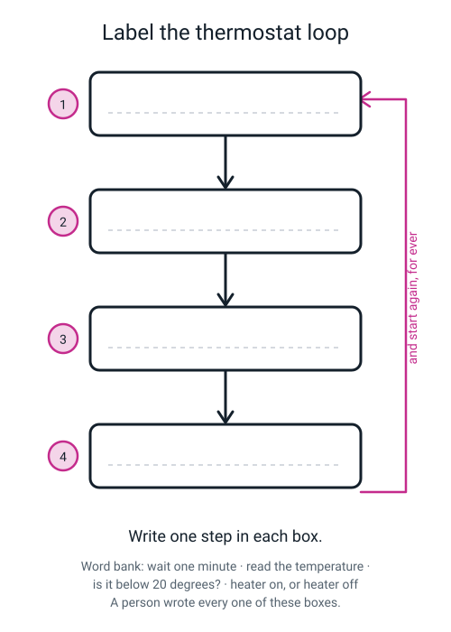
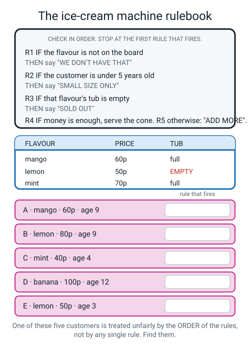
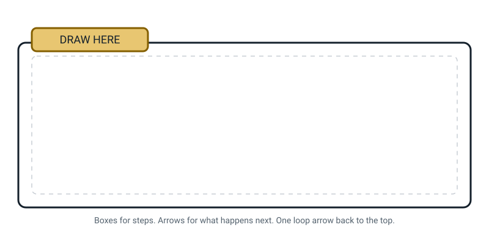

# Workbook — Week 1: Is It Smart, or Is It Just Following Orders?

**Name:** ________________________________  **Date:** ______________

[📖 Read the chapter first](../student-guide/week-01.md) · [Course Home](../README.md)

---

## ✅ Warm-Up (5 min)

This is week one, so there is nothing to remember yet. Instead: **what do you already think?**

Answer these **before** you read the chapter, in pen, and do not change them later. In nine weeks
you will come back and read them, and that is the whole point.

**W1.** Right now, before anybody explains anything — what do you think **AI** means?

________________________________________________________________

**W2.** Name one machine in this room you would call **smart**. Why that one?

________________________________________________________________

**W3.** Your gut answer: is a **calculator** AI? Circle one → **YES** / **NO** / **NOT SURE**

Because: _________________________________________________________

**W4.** Which is doing something more interesting — a program that beat the world's best Go player,
or the **thermostat** on the wall? Circle one and give a reason.

**GO PROGRAM** / **THERMOSTAT**

Because: _________________________________________________________

**W5.** Do you think a person sat down and wrote the rules for your email's **spam folder**?

Circle → **YES** / **NO** / **NO IDEA**

---

## ✍️ Practice Set A — Understand It

**A1. Fill in the blanks.**

Artificial intelligence is a machine doing a ____________________ that used to need a person's
____________________.

Judgement means a choice where two ____________________ people could ____________________ about the
answer.

A **rule-based system** is one where a ____________________ wrote the decision steps by hand,
____________________ the machine ever ran.

An **if-then rule** is one instruction shaped like *"____________________ this is true,
____________________ that."*

---

**A2. Circle every one that is doing AI.** (There is more than one.)

&nbsp;&nbsp;&nbsp;(a) A calculator app on a phone
&nbsp;&nbsp;&nbsp;(b) An email spam folder
&nbsp;&nbsp;&nbsp;(c) A microwave timer
&nbsp;&nbsp;&nbsp;(d) Face unlock
&nbsp;&nbsp;&nbsp;(e) A factory arm doing the same weld 1,000 times a day
&nbsp;&nbsp;&nbsp;(f) Deciding which video to show you next

For **one** you did *not* circle, write the reason it fails the judgement test:

________________________________________________________________

---

**A3. True or false — and explain.**

**(a)** *If a machine gives a stupid answer, it must be broken.*

Circle: **TRUE** / **FALSE**. Why?

________________________________________________________________

**(b)** *A hard job always needs judgement.*

Circle: **TRUE** / **FALSE**. Why?

________________________________________________________________

---

**A4. Match the pairs.** Draw a line, or write the letter in the box.

| Machine | | The if-then rule inside it |
|---|:--:|---|
| 1. Thermostat | ☐ | **A.** `IF the time = 07:00 THEN ring` |
| 2. Old spell-checker | ☐ | **B.** `IF coins inserted ≥ price THEN drop the item` |
| 3. Traffic light on a timer | ☐ | **C.** `IF room temperature < 20°C THEN turn on the heater` |
| 4. Vending machine | ☐ | **D.** `IF the word is not in my list THEN underline it in red` |
| 5. Alarm clock | ☐ | **E.** `IF 30 seconds have passed THEN switch to amber` |

---

**A5. Label the diagram.**

Write one step in each numbered box. Use the word bank underneath the picture. Then answer the two
questions below it.


*Figure W1.1 — Everything a thermostat will ever do. Four boxes, and a loop.*

**(a)** Which box is the **if-then rule**? Box number: ________

**(b)** Who wrote these four boxes? ________________________________

---

**A6. Judgement, or not?** Tick one column for each row.

| The job | Needs judgement | Doesn't need judgement |
|---|:--:|:--:|
| How many chairs are in this room? | ☐ | ☐ |
| Is this room tidy? | ☐ | ☐ |
| Add 47 + 88 | ☐ | ☐ |
| Is this text message from a scammer? | ☐ | ☐ |
| Is the traffic light red? | ☐ | ☐ |
| Is this joke funny? | ☐ | ☐ |

Pick **one row you ticked "needs judgement"** and finish this sentence properly:

Two sensible people could disagree about this because ____________________________________

________________________________________________________________

---

## ✍️ Practice Set B — Use It

**B1. Write Rule 6 — then watch it break.**

Last week's vending machine had no rule for the customer with the burst crisp packet. Write one.

`RULE 6: IF ` ______________________________________________________

`         THEN ` _____________________________________________________

Now here comes a customer who says **every** packet is broken, every single day, for ever.

**(a)** What does your machine do?

________________________________________________________________

**(b)** Add a condition to Rule 6 to stop them:

________________________________________________________________

**(c)** Now find the honest customer your new condition accidentally punishes:

________________________________________________________________

---

**B2. What would go wrong here?** A cinema ticket machine.

```
CINEMA RULEBOOK — check in order, STOP at the first rule that fires

  RULE 1: IF age is under 3        THEN free
  RULE 2: IF age is under 16       THEN child price, £5
  RULE 3: IF age is 60 or over     THEN senior price, £5
  RULE 4: OTHERWISE                THEN adult price, £9
```

**(a)** Trace three customers. Write the rule number **and** the price.

| Customer | Rule that fires | Price |
|---|:--:|---|
| Aged 2 | | |
| Aged 14 | | |
| Aged 67 | | |

**(b)** Somebody now swaps Rule 1 and Rule 2, so the "under 16" check happens first. **Who gets hurt,
and by how much?**

________________________________________________________________

**(c)** A school group arrives: 30 pupils and 2 teachers, and the school has been promised a group
deal. Which rule fires? ____________

What would deciding this properly actually need? _________________________________

---

**B3. The dog flap.** A cat flap in a back door opens whenever something warm pushes against it.

**(a)** Input: ______________________  **(b)** Output: ______________________

**(c)** Does the job need judgement? Circle → **YES** / **NO**

**(d)** Is it AI? Circle → **YES** / **NO** / **NOT SURE**, and give the evidence — think about what
it does when the neighbour's cat pushes on it.

________________________________________________________________

---

**B4. What would go wrong here?** Write a rulebook of your own.

Write **three** if-then rules for **when a phone is allowed out in a classroom**.

`RULE 1: IF ` ______________________________ ` THEN ` ______________________

`RULE 2: IF ` ______________________________ ` THEN ` ______________________

`RULE 3: IF ` ______________________________ ` THEN ` ______________________

Now find the case that breaks it — a real situation where following your rules gives a clearly bad
answer. **Name the rule that causes it.**

________________________________________________________________

________________________________________________________________

---

**B5. Sort five more.** Write **R** (a human wrote the steps), **W** (it worked it out itself), or
**?** (not sure), plus a one-line reason.

| System | R / W / ? | Reason |
|---|:--:|---|
| Washing machine "cotton 40°" cycle | | |
| Bus arrival board saying "3 mins" | | |
| Searching your photos for the word "dog" | | |
| A smart speaker waking up when you say its name | | |
| A plagiarism checker at school | | |

---

## 🧩 Puzzle of the Week

### The Ice-Cream Machine


*Figure W1.2 — Five rules, three flavours, five customers.*

```
CHECK IN ORDER. STOP AT THE FIRST RULE THAT FIRES.

  R1  IF the flavour is not on the board    THEN say "WE DON'T HAVE THAT"
  R2  IF the customer is under 5 years old  THEN say "SMALL SIZE ONLY"
  R3  IF that flavour's tub is empty        THEN say "SOLD OUT"
  R4  IF the money is enough                THEN serve the cone
  R5  OTHERWISE                             THEN say "ADD MORE"

  FLAVOUR   PRICE   TUB
  mango      60p    full
  lemon      50p    EMPTY
  mint       70p    full
```

**P1.** Fill in the table. Be the machine: obedient, not sensible.

| Customer | Rule that fires | What the machine says |
|---|:--:|---|
| **A** · mango · 60p · age 9 | | |
| **B** · lemon · 80p · age 9 | | |
| **C** · mint · 40p · age 4 | | |
| **D** · banana · 100p · age 12 | | |
| **E** · lemon · 50p · age 3 | | |

**P2.** One customer is treated badly by the **order** of the rules, not by any single rule — the
machine promises them something it cannot possibly deliver. Which customer?

Customer ________ , because __________________________________________

**P3.** Fix it by **moving one rule**. Which rule, and where does it go?

Move rule ________ to sit ________________________________________

**P4.** After your fix, re-answer customer **E**. Rule ________ → the machine says
______________________

**P5.** Even after the fix, customer **C** still gets a reply that doesn't really help her. What is
the machine unable to do?

________________________________________________________________

---

## 🤔 Think Deeper

**T1.** A woman comes back to the vending machine. *"I put 30p in, I pressed A1, I got my crisps —
but the bag was already burst and they're stale. Can I have another packet?"*

Write a paragraph (4+ sentences). Why can a rulebook **never** handle this properly — not even with
Rule 6, Rule 7 and Rule 8 added? What would deciding it actually need, and what does that have to do
with the word *judgement*?

________________________________________________________________

________________________________________________________________

________________________________________________________________

________________________________________________________________

---

**T2.** Your school is thinking about replacing the person on the front desk with a machine that
decides who is allowed into the building.

Write a paragraph (4+ sentences). Would you want that? Say what could go **right**, what could go
**wrong**, and — this is the important bit — **who a visitor could argue with** when the machine says
no.

________________________________________________________________

________________________________________________________________

________________________________________________________________

________________________________________________________________

---

## 🛠️ Build It

### Page 1.4 — AI Spotter's Log, part 1

**This one cannot be done at a desk.** Over the next day, log **eight** systems you actually
**touched**. Not eight you can think of — eight you touched. There is a difference, and the
difference is the whole exercise. Fill in a row the moment you meet one.

**Rules for the table:**
- **Be specific.** Not "my phone" — "my phone's keyboard suggestion bar".
- Every reason must say either *a person wrote it down* **or** *it must have learned it*.
- If you honestly don't know, write **?** in the middle column. That is allowed and it scores.

| # | System (be specific) | Where / when | R / W / ? | Why — one sentence |
|:--:|---|---|:--:|---|
| 1 | | | | |
| 2 | | | | |
| 3 | | | | |
| 4 | | | | |
| 5 | | | | |
| 6 | | | | |
| 7 | | | | |
| 8 | | | | |

**R** = a human wrote the steps · **W** = it worked it out itself · **?** = not sure yet

**Now count them up:** R: ______ W: ______ ?: ______

**And the best question on the page:** pick one row you marked **?**. What is the **one fact** you
would need to look up to be certain, and who could you ask?

________________________________________________________________

---

### Page 1.5 — Kill the magic word

Here is a sentence people say all the time:

> **"My phone magically knows my face."**

Rewrite it **honestly**. One sentence. No magic.

________________________________________________________________

________________________________________________________________

**Now check your own sentence against all three tests. Tick each one.**

☐ It says **what actually happens** — something is compared, measured, matched or decided.
☐ It contains **none** of these words: *magic, smart, clever, knows, thinks, understands, just does*.
☐ It would **not** still be true if you said it about a wizard.

If you ticked fewer than three, write it again underneath. It is normal to need two goes.

________________________________________________________________

---

### Page 1.6 — Be the computer

Run the vending machine rulebook from the chapter on all eight requests. **Rule number first, then
what the machine does.** No being sensible.

| # | Request | Rule that fires | What the machine does |
|:--:|---|:--:|---|
| 1 | A1, 30p | | |
| 2 | A2, 45p | | |
| 3 | C7, 30p | | |
| 4 | B1, 20p | | |
| 5 | B2, 60p | | |
| 6 | B1, 25p | | |
| 7 | A2, 20p | | |
| 8 | A1, 100p | | |
| 9 | "The bag was burst, can I have another?" | | |

**One sentence on request 9:** __________________________________________

---

## 🎨 Draw It

Pick **one rule-following machine in your own home** — a microwave, a kettle, an alarm, a washing
machine, an automatic light, a fridge. Draw its decision as a loop: **3 to 5 boxes, arrows between
them, and one loop arrow going back to the top.** Label every box, and mark the box that is the
if-then rule with a star.


*Figure W1.3 — Your page.*

> **What a good answer might look like:** a kettle. Box 1: *heat the water.* Box 2: ⭐ *is the water
> at 100°C?* Box 3 (if no): *keep heating* → arrow back to box 1. Box 4 (if yes): *click off, stop.*
> Underneath, one line: *"a person wrote all four boxes, and 'is it 100 degrees' is not a judgement —
> nobody disagrees about it."*
>
> **What a weak answer looks like:** a lovely drawing of a kettle with steam coming out, and no boxes,
> no arrows and no decision anywhere. The picture is not the point — **the decision** is the point. If
> your drawing has no arrows in it, you have drawn the object instead of the thinking.

---

## 📊 Self-Check

| I can… | 😀 got it | 🙂 nearly | 😕 not yet |
|---|---|---|---|
| Say what AI is in one sentence, with no *robot*, *brain* or *magic* | ☐ | ☐ | ☐ |
| Decide if a job needs judgement by asking "could two sensible people disagree?" | ☐ | ☐ | ☐ |
| Take a rulebook, run one case through it, and name the rule that fired | ☐ | ☐ | ☐ |
| Explain why the **order** of the rules changes the answer | ☐ | ☐ | ☐ |
| Say which of AlphaGo and the thermostat is doing the interesting thing — **and why** | ☐ | ☐ | ☐ |
| Use "not sure" properly — and say what fact would settle it | ☐ | ☐ | ☐ |

One thing I'd like explained again:

________________________________________________________________

---

## ✅ Answers

<details>
<summary>Check your answers</summary>

### Warm-Up

These five are **predictions**, not tests. Nobody marks them. But here is what to notice when you
come back to them.

**W1.** Most first answers contain *robots*, *thinking* or *ChatGPT*. That's not embarrassing — it's
what nearly every adult says too, and you'll prove that yourself in Week 3 when you interview one.
The chapter's answer: *a machine doing a job that used to need a person's judgement.*

**W2.** Whatever you picked, ask the follow-up now: **does its job need judgement?** A phone is
impressive and most of what it does — timers, alarms, arithmetic — needs no judgement at all.

**W3.** **No.** A calculator is not AI. It is fast and you can't do it in your head, but speed isn't
judgement: nobody sensible disagrees about 47 + 88. If you circled YES, you made the most common
mistake in the world, and you now have the test that fixes it.

**W4.** No right answer — you were making a bet. The strongest version: *"the Go program, because
nobody could write down every Go move, but you could write everything the thermostat does on one
page."* If you picked the thermostat because *"it works with nobody there"* — that's a genuinely
thoughtful answer, and the reply is that a person **is** there. They came earlier and left four
if-then boxes behind.

**W5.** **No** — and that fact is so strange it gets a whole lesson next week. Nobody wrote those
rules. Not a secret team. Nobody.

---

### Practice Set A

**A1.** **job** · **judgement** · **sensible** · **disagree** · **human** (or *person*) · **before**
· **IF** · **THEN**.

**A2.** Circle **(b), (d) and (f)** — spam folder, face unlock, choosing your next video.

Why the others fail: **(a)** a calculator has one right answer and one exact method, so no
judgement. **(c)** counting down to zero is not a decision. **(e)** the welding arm has a big
impressive body and repeats one motion a thousand times a day — a body is a *robot* question, not an
*AI* question, and repeating a fixed motion needs no judgement.

**A3. (a) FALSE.** A rule-based system that meets a case nobody imagined does not break — it gives a
confident, technically-correct, useless answer. The vending machine saying SOLD OUT when you hadn't
put enough money in was Rule 2 working *perfectly*. **Rulebooks fail quietly.**

**(b) FALSE.** Hard and judgement are different things. Finding one tiny bird in a photo of a forest
is hard, and there is still exactly one right answer that everybody agrees on once you point at it.
Judgement means there is **no single right answer** — like *is this room tidy?*, which isn't hard at
all.

**A4.** 1 → **C** · 2 → **D** · 3 → **E** · 4 → **B** · 5 → **A**.

**A5.** Box 1: **read the temperature.** Box 2: **is it below 20 degrees?** Box 3: **heater on, or
heater off.** Box 4: **wait one minute** — then the loop arrow takes you back to box 1, for ever.

**(a)** Box **2** is the if-then rule — it is the only box with a *condition* in it. (Full credit also
for saying "boxes 2 and 3 together", since the IF and the THEN are split across them.)

**(b)** **A person did** — probably in about ten minutes, years before the thermostat was fitted.
Every box. There is nothing else in there.

**A6.**

| The job | Answer | The reason that matters |
|---|---|---|
| How many chairs? | Doesn't need judgement | Count them. One answer. |
| Is this room tidy? | **Needs judgement** | Two people genuinely sort this differently |
| Add 47 + 88 | Doesn't need judgement | 135, and anyone who says otherwise is wrong |
| Is this message from a scammer? | **Needs judgement** | Depends on the specific message; people sort these differently |
| Is the traffic light red? | Doesn't need judgement | One fixed right answer |
| Is this joke funny? | **Needs judgement** | No right answer exists at all |

A passing sentence looks like: *"…because two people could look at exactly the same thing and give
different answers, and neither of them would be wrong."* A sentence that says *"because it's hard"*
has not got it yet.

---

### Practice Set B

**B1.** A typical Rule 6: `IF the customer says the item is broken THEN give them another one.`

**(a)** It hands out free crisps for ever. The rule has no way to check anything — it only reads what
the customer *says*.

**(b)** Typical fix: `...AND they have not already claimed one today`, or `...AND they show the burst
bag to a member of staff`.

**(c)** And here's the trap. *"Not already claimed today"* punishes the person who genuinely gets two
burst bags on the same unlucky afternoon. *"Show it to staff"* punishes anyone using the machine at
9pm when there is no staff. **Every condition you add to protect the machine also catches somebody
honest.** That's not you writing bad rules — that's what rules *are*. Week 8 and Week 10 are built on
this exact feeling.

**B2. (a)**

| Customer | Rule | Price |
|---|:--:|---|
| Aged 2 | **R1** (under 3) | **free** |
| Aged 14 | **R2** (under 16) | **£5** |
| Aged 67 | **R3** (60 or over) | **£5** |

**(b)** Swap R1 and R2 and the **2-year-old now pays £5**, because "under 16" is checked first and 2
is under 16, so the machine stops there and never reaches the free rule. **Same child, same rules,
different order, £5 worse off.** Notice that *nobody edited a rule* — the wording is identical.

**(c)** **No rule fires** for a group deal — well, R2 and R4 fire one pupil at a time, and each
person just pays the normal price. There is no group anywhere in the rulebook. Deciding it properly
needs somebody to judge whether this counts as a school group and whether the promise applies, and
two sensible people could disagree about a "group" of three cousins. **That is judgement.**

**B3. (a)** Input: something warm pressing on the flap. **(b)** Output: `open` or `stay shut`.

**(c) NO** — the job needs no judgement.

**(d) NO, it is not AI**, and the evidence is the neighbour's cat: **it opens for anything warm that
pushes.** A system making a case-by-case decision would sometimes decline. This one never declines,
which tells you there is no decision inside it at all — just `IF pushed THEN open`. Full marks if you
wrote **rule-based, and probably not AI**.

**B4.** Answers vary. A typical set:

```
RULE 1: IF the lesson has started        THEN phones stay in bags
RULE 2: IF the teacher says "phones out" THEN phones may come out
RULE 3: IF a phone rings                 THEN it is taken to the office
```

Good breaking cases, and the rule that causes each:

- A pupil's parent is in hospital and might ring. **Rule 1** keeps the phone in the bag. A human
  teacher would grant an exception in one second; the rulebook has no idea what an emergency is.
- A pupil uses a phone as a medical alarm — a diabetes monitor that beeps. **Rule 3** sends the
  medical alert to the office.
- The teacher says "phones out" and *then* the lesson starts. Rules 1 and 2 now contradict each
  other, and the machine needs a rule about which rule wins.

**Marking your own answer:** you pass if you named a real situation **and** pointed at the specific
rule. "It might not work sometimes" is not an answer.

**B5.**

| System | Answer | Reason |
|---|:--:|---|
| Washing machine "cotton 40°" cycle | **R** | A fixed sequence of times and temperatures an engineer wrote. Identical every time. |
| Bus arrival board "3 mins" | **?** | If it's a fixed timetable, that's rules. If it uses where the bus actually is right now, something learned is involved. **The fact that would settle it:** does the number ever change while you stand there? |
| Photo search for "dog" | **W** | Nobody could write if-then rules over coloured dots. Trained on millions of already-tagged photos. |
| Smart speaker waking on its name | **?** | Genuinely both. Recognising a sound pattern is learned; what happens *after* it wakes may be either. |
| Plagiarism checker | **?** | Comparing text against a database of documents can be done with rules. Judging whether reworded text counts as copying cannot. |

Three question marks with reasons on this table is a **better** answer than five confident letters.

---

### Puzzle of the Week

**P1.**

| Customer | Rule | What the machine says |
|---|:--:|---|
| **A** · mango · 60p · age 9 | **R4** | Serves the cone. 60p is enough for a 60p mango. |
| **B** · lemon · 80p · age 9 | **R3** | "SOLD OUT" — the lemon tub is empty. Money never gets checked. |
| **C** · mint · 40p · age 4 | **R2** | "SMALL SIZE ONLY" — and it stops there, so it never mentions that 40p isn't enough for a 70p mint. |
| **D** · banana · 100p · age 12 | **R1** | "WE DON'T HAVE THAT" — banana isn't on the board. |
| **E** · lemon · 50p · age 3 | **R2** | "SMALL SIZE ONLY" — for a flavour that is **completely sold out**. |

**P2. Customer E.** Rule 2 fires before Rule 3 ever gets looked at, so the machine cheerfully offers
a three-year-old a small lemon ice cream that does not exist. It has promised something it cannot
deliver, and no single rule is wrong — the **order** is wrong.

*(If you answered **C**, that's the second-best answer and worth most of the marks: C also gets a
reply that ignores her real problem. But C's answer is at least *possible* — she really could buy a
small mint if she had the money. E's is impossible.)*

**P3.** Move **R3** (tub empty) to sit **above R2** (under 5) — so the order becomes R1, R3, R2, R4,
R5. Check stock before you check the customer.

**P4.** Customer **E** now hits **R3** → **"SOLD OUT"**. Correct, honest, and the machine stops
promising things it hasn't got.

**P5.** The machine can only ever say **one** thing. Customer C needs to hear *two* facts — "small
size only" **and** "that's 70p, you have 40p" — and a rulebook that stops at the first rule that
fires physically cannot say both. That is not a bug you can fix by reordering. It's a limit of the
shape.

---

### Think Deeper

**T1. Model answer.**

> A rulebook can never handle the burst crisp packet, and adding Rule 6, 7 and 8 does not help,
> because the problem is not a missing rule — it is that you cannot list every possible thing a
> person might say to a vending machine. There is no end to that list. And look at what deciding this
> case actually needs: somebody has to **look at the bag** and decide whether it counts as burst. A
> slightly split corner? A bag that was already open? Two sensible people would give different
> answers, which is exactly what the word *judgement* means. Rules work when there is one right
> answer that can be checked with a comparison, like `is 60 more than 50`. There is no comparison
> that settles "is this bag burst enough". So the machine sits there in silence, not because it is
> broken, but because nobody could ever have written the line it would need.

**Mark yourself on three things:** (1) did you say the list of possible situations has no end?
(2) did you point at what deciding it needs — somebody *looking* and *deciding*? (3) did you connect
that to two sensible people disagreeing?

**T2. Model answer.**

> I would not want it, or at least not on its own. What could go right is real: a machine never gets
> tired, never gets distracted at 8:45am when forty people arrive at once, and it treats the
> hundredth visitor exactly like the first. What could go wrong is also real. Somebody whose face
> doesn't match — a new haircut, a hood up, a cousin collecting a little brother — gets refused for a
> reason nobody in the building can explain. And that's the bit that decides it for me: **who does
> the visitor argue with?** With a person on the desk, you can say "look, my son is in Year 7, ring
> the office" and a human can weigh it up and choose. A machine has nobody to appeal to, and the
> question *is this person allowed inside* is a judgement — two sensible receptionists really would
> disagree about a stranger with no ID. I would keep a person there and let the machine handle the
> boring half: checking the list of expected visitors.

**Mark yourself on:** did you name a real *right*, a real *wrong*, and — the one most people skip —
**who a person can argue with**?

---

### Build It

**Page 1.4 — the Spotter's Log.** Answers differ; the **shape** is what counts. Here is a log at the
standard you're aiming for:

| # | System | R/W/? | Why |
|:--:|---|:--:|---|
| 1 | The alarm on my phone, 06:45 | R | Somebody typed `IF time = 06:45 THEN ring`. It does the same thing every day and has never surprised anyone. |
| 2 | My phone's face unlock | W | Nobody could write down rules for my face from every angle in every light. |
| 3 | The keyboard's suggested-word bar | W | Nobody listed every three words I might type next. It must have studied real writing. |
| 4 | The microwave's 30-second button | R | `IF pressed THEN add 30 seconds`. Not close to a judgement. |
| 5 | YouTube's home page | W | It changes every time and matches what I watched. No person is choosing them for me personally. |
| 6 | The school bell | R | A clock with a speaker. |
| 7 | My email's spam folder | W | Some of the spam it catches uses wording nobody could have listed in advance. |
| 8 | The automatic doors at the shop | R | `IF something moves THEN open`. **It opens for a cat**, which is how I know it isn't judging anything. |

Row 8 is the best kind of answer in the whole exercise, because it uses the system's **failure** as
evidence. If you wrote anything like that, say so out loud to somebody.

**Marking yourself:** eight rows · every system **specific** (not "my phone") · every reason
mentioning *a person wrote it* or *it must have learned it*. A wrong letter with a real reason beats
a right letter with none.

**Page 1.5 — kill the magic word.** Model answer:

> **"My phone compares the camera picture to a stored pattern of my face and decides whether it's
> close enough to unlock."**

Also good:
- *"My phone was shown my face lots of times, and now it can guess whether a new picture is me."*
- *"My phone measures the face in front of the camera and checks how well it matches the saved one."*

What to reject in your own writing, and why:

| Attempt | Problem |
|---|---|
| "My phone is smart enough to know my face." | *Smart* is doing exactly the job *magic* was. Try again. |
| "My phone recognises my face." | True but empty. It hasn't said what happens. Ask yourself *how?* |
| "My phone scans my face and unlocks." | Better — but there's no **decision** in it. What if it's your cousin? |

**The tell you're looking for** is one of these words: **decides · compares · matches · measures ·
guesses**. Any of those means you've swapped magic for a mechanism, which is the entire point.

**Page 1.6 — be the computer.**

| # | Request | Rule | What the machine does | The common wrong answer |
|:--:|---|:--:|---|---|
| 1 | A1, 30p | **R4** | Drops the crisps, no change | R3 — reading "less than" as "less than or equal to" |
| 2 | A2, 45p | **R2** | SOLD OUT, returns 45p | R4 — comparing the money and forgetting stock comes first |
| 3 | C7, 30p | **R1** | UNKNOWN CODE, returns 30p | Guessing crisps because C7 "looks like" A1 |
| 4 | B1, 20p | **R3** | ADD MORE. Waits, and **keeps** the 20p | Saying it returns the coins — it doesn't, R3 says *wait* |
| 5 | B2, 60p | **R5** | Drops the juice, returns 10p | — |
| 6 | B1, 25p | **R4** | Drops the water, no change | R5 — counting *equal* as *more* |
| 7 | A2, 20p | **R2** | SOLD OUT, returns 20p | **R3 "ADD MORE" — about two out of three people say this** |
| 8 | A1, 100p | **R5** | Drops the crisps, returns 70p | Arithmetic: 100 − 30 = 70 |
| 9 | Burst bag | **none** | Nothing at all | Inventing a rule — go back and read Rule 2 aloud |

**Request 7 is the one to understand.** 20p is obviously not enough for 45p chocolate, so any human
says "put more money in". The machine says SOLD OUT, because Rule 2 comes before Rule 3 and fires
first. **The machine isn't broken.** Whoever ordered the rules made that choice, and the machine will
make it for ever.

**One sentence on request 9:** *"No rule fires, and answering it would need somebody to look at the
bag and judge whether it counts as burst — which two sensible people would disagree about."*

---

### Draw It

There is no single right drawing. A good one has **all four** of these:

1. **Boxes**, not just a picture of the object.
2. **Arrows** showing what happens next.
3. **A loop arrow** going back to the top — because these machines never stop checking.
4. **A star on the box with a condition in it** (the one with a question or a comparison inside).

The commonest slip by a long way is drawing a beautiful microwave and no decision. If your page has
no arrows, you drew the object instead of the thinking. Add the boxes and you're done.

</details>

---

[⬅ Start of course](../README.md) · [📖 Week 1 chapter](../student-guide/week-01.md) · [Course Home](../README.md) · [Week 2 workbook ➡](week-02.md) · [Glossary](../../glossary.md)
