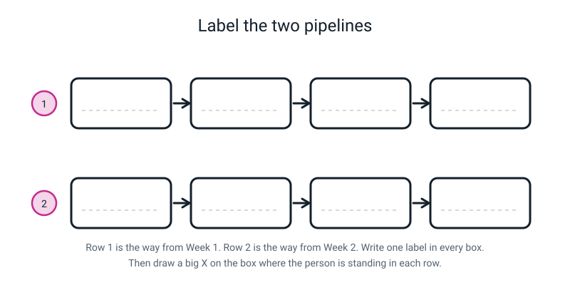
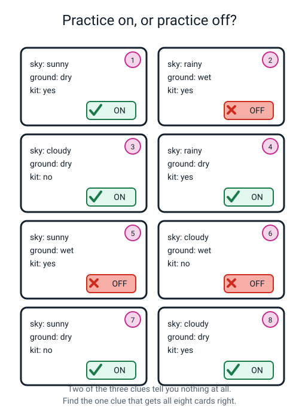
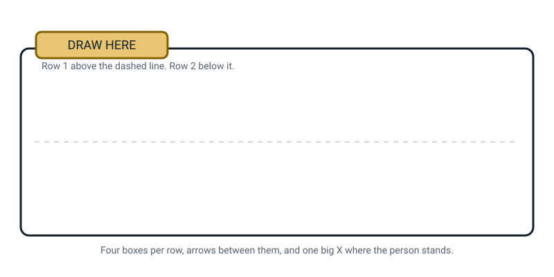

# Workbook — Week 2: The Machine That Learns the Rule By Itself

**Name:** ________________________________  **Date:** ______________

[📖 Read the chapter first](../student-guide/week-02.md) · [Course Home](../README.md)

---

## ✅ Warm-Up (5 min)

Five quick questions about **last week**. Try all five before you look anything up.

**W1.** Finish the definition: artificial intelligence is a machine doing a ______________ that used
to need a person's ______________.

**W2.** What is the one-question test for judgement?

________________________________________________________________

**W3.** A vending machine's rulebook says: `R2: IF stock is 0 THEN say SOLD OUT` and
`R3: IF coins < price THEN say ADD MORE`. Somebody asks for the sold-out chocolate and puts in far too
little money. Which rule fires, and why that one?

Rule ________ , because __________________________________________

**W4.** True or false: *a rule-based system that meets a situation nobody planned for will crash or
show an error.*

Circle: **TRUE** / **FALSE**. Why?

________________________________________________________________

**W5.** Name one thing in your house that is definitely **not** AI, and say what makes you sure.

________________________________________________________________

---

## ✍️ Practice Set A — Understand It

These six questions check that you know the new words and can use them.

**A1. Fill in the blanks.**

**Machine learning** is when the machine finds the ____________________ itself, by studying
____________________ that already have the right answers attached.

An **example** is one thing you show the machine, **with the** ____________________ attached.

A **label** is written by a ____________________ , and it is written ____________________ training
starts.

A **model** is what is left over when training ____________________ . You put a new thing in and a
____________________ comes out.

---

**A2. Circle every one that is a proper labelled example.** (There is more than one.)

&nbsp;&nbsp;&nbsp;(a) A photo of a cat
&nbsp;&nbsp;&nbsp;(b) A photo of a cat with the word `cat` written on the back
&nbsp;&nbsp;&nbsp;(c) A folder of 1,000 emails
&nbsp;&nbsp;&nbsp;(d) One email plus a note saying `spam`
&nbsp;&nbsp;&nbsp;(e) The rule `IF the message says FREE THEN spam`
&nbsp;&nbsp;&nbsp;(f) A mango card with *green · hard · none* on the front and `UNRIPE` on the back

For **one** you did *not* circle, say what is missing:

________________________________________________________________

---

**A3. True or false — and explain.**

**(a)** *After training has finished, all the examples are stored inside the model.*

Circle: **TRUE** / **FALSE**. Why?

________________________________________________________________

**(b)** *The machine writes the labels itself as it learns.*

Circle: **TRUE** / **FALSE**. Why?

________________________________________________________________

---

**A4. Match the pairs.** Write the letter in the box.

| Word | | What it means |
|---|:--:|---|
| 1. machine learning | ☐ | **A.** The correct answer a person attaches to one thing, before training |
| 2. example | ☐ | **B.** A system where a human wrote the if-then steps by hand |
| 3. label | ☐ | **C.** The machine finds the rule itself by studying answered examples |
| 4. model | ☐ | **D.** One thing shown to the machine, with its answer attached |
| 5. rule-based system | ☐ | **E.** The guessing machine training leaves behind |

---

**A5. Label the diagram.**

Write one label in every box, using the word bank under the picture. Then do the two extra jobs.

*Figure W2.1 — Row 1 is Week 1's way. Row 2 is this week's way.*

**Word bank (row 1):** a person · writes the IF-THEN rule · computer follows it · answer
**Word bank (row 2):** a person collects labelled examples · training · model · answer

**(a)** Draw a big **X** on the box where the person is standing, in **each** row.

**(b)** In row 2, who wrote the rule? ____________________________________

---

**A6. Do the counting yourself.** Here are four messages a person has already labelled.

| # | Message | Label |
|:--:|---|---|
| 1 | "You have WON a prize, claim NOW" | **spam** |
| 2 | "Can you bring my racket tomorrow" | **not spam** |
| 3 | "CLAIM your prize NOW!!!" | **spam** |
| 4 | "Practice is at 4 tomorrow" | **not spam** |

Count each clue and fill in the table. Then decide.

| Clue | In the 2 spam | In the 2 not-spam | Useful? |
|---|:--:|:--:|---|
| the word **prize** | ___ of 2 | ___ of 2 | |
| the word **tomorrow** | ___ of 2 | ___ of 2 | |
| the word **you** (count *your* too) | ___ of 2 | ___ of 2 | |

**(a)** One clue points *towards* "not spam" and is still a good clue. Which one, and why is pointing
the other way not a problem?

________________________________________________________________

**(b)** Which clue is the weakest, and what exactly is wrong with it?

________________________________________________________________

---

## ✍️ Practice Set B — Use It

These five questions ask you to use this week's ideas on new situations.

**B1. What would go wrong here?** A shop wants an app that tells you if a mango is ripe **from a
photo**. Their team found the *feel* rule — "if it isn't hard, it's ripe" — from the eight cards, and
it scored 8 out of 8.

**(a)** What goes wrong when they build the photo app?

________________________________________________________________

**(b)** Which of the two correct rules from the deck should they have used, and why?

________________________________________________________________

**(c)** Finish the sentence: a clue is only useful if it is ____________________ at the moment you
need to make the guess.

---

**B2. What would go wrong here?** A teacher collects 10 photos of school lunch trays and labels each
one `finished` or `not finished`, so a machine can spot which pupils aren't eating. She is in a hurry
and gets **2 of the 10 labels the wrong way round**.

**(a)** Does the training crash, or complain, or warn her? ____________

**(b)** What does the finished model do?

________________________________________________________________

**(c)** She tests the model, and it gets those same 2 trays "wrong". Is the model wrong, or is she?

________________________________________________________________

**(d)** Write the one sentence that this whole question exists to teach:

________________________________________________________________

---

**B3. Rules, or learning?** For each job, circle the better choice and give a **reason**, not a
feeling.

| Job | Choose | Reason |
|---|---|---|
| Ring a bell at 15:30 every day | rules / learning | |
| Decide if a photo shows your own dog | rules / learning | |
| Charge 50p a day for a late library book | rules / learning | |
| Spot a kind of scam text nobody has seen before | rules / learning | |

---

**B4. A ninth card arrives.** Somebody brings one more mango card:

> **Card 9: red · gives a little · no smell at all → UNRIPE**

**(a)** Does the **feel** rule ("if it isn't hard, it's ripe") still get every card right? ____________

**(b)** Does the **smell** rule ("if it smells sweet, it's ripe") still get every card right? __________

**(c)** So which rule survived, and what does that tell you about having more examples?

________________________________________________________________

________________________________________________________________

---

**B5. Design a test.** Someone insists their phone's face unlock "gets better at recognising me every
day". You think training finished at the factory.

Describe a test you could actually run to find out who is right. Say what you would **do**, and what
you would **look for**.

I would do: _______________________________________________________

I would look for: _________________________________________________

What result would prove *me* wrong? ______________________________

---

## 🧩 Puzzle of the Week

### Practice On, or Practice Off?

This puzzle gives you eight cards to score, rule by rule. Work with a pencil.

*Figure W2.2 — Eight cards from eight cricket practices. Three clues on each. One of them decides
everything.*

Here is the same deck written out:

| Card | sky | ground | kit | **label** |
|:--:|---|---|---|---|
| 1 | sunny | dry | yes | **ON** |
| 2 | rainy | wet | yes | **OFF** |
| 3 | cloudy | dry | no | **ON** |
| 4 | rainy | dry | yes | **ON** |
| 5 | sunny | wet | yes | **OFF** |
| 6 | cloudy | wet | no | **OFF** |
| 7 | sunny | dry | no | **ON** |
| 8 | cloudy | dry | yes | **ON** |

**P1.** Score each rule out of 8. Go card by card — no guessing.

| The rule | Cards it gets right | Cards it gets wrong | Score |
|---|---|---|:--:|
| **Sky:** if it's sunny, practice is ON | | | ___ / 8 |
| **Ground:** if the ground is dry, practice is ON | | | ___ / 8 |
| **Kit:** if kit was brought, practice is ON | | | ___ / 8 |

**P2.** Which clue is the real rule? ____________________

**P3.** Two single cards do all the damage to the "sky" idea. Name them.

The card that kills *"rainy means off"* is card ________

The card that kills *"sunny means on"* is card ________

**P4.** Now three cards you have never seen. Use the rule that scored 8 out of 8.

| Test | sky | ground | kit | Your answer |
|:--:|---|---|---|---|
| **X** | rainy | dry | no | |
| **Y** | sunny | wet | yes | |
| **Z** | cloudy | **frozen solid** | yes | |

**P5.** One of those three is not really answerable from these eight cards. Which one, and what
exactly is missing?

________________________________________________________________

**P6.** The sky is the first thing anybody looks at, and it scored 4 out of 8 — the same as flipping a
coin. Why is it so tempting?

________________________________________________________________

---

## 🤔 Think Deeper

These two questions need a whole paragraph each. Take your time.

**T1.** Imagine all eight mango cards came from **one farm, in one country, in one week**, and they
were all the same variety of mango.

Write a paragraph (4+ sentences). What would a model trained on those eight be bad at? Would it
*tell* you it was out of its depth? And what would you change about the examples?

________________________________________________________________

________________________________________________________________

________________________________________________________________

________________________________________________________________

---

**T2.** A model decides which pupils get invited to an after-school maths club. It gets it unfair. Now
nobody wrote the rule — so it feels like nobody's fault.

Write a paragraph (4+ sentences). Name the **human jobs** that were done before that model existed,
and say who you would hold responsible and why.

________________________________________________________________

________________________________________________________________

________________________________________________________________

________________________________________________________________

---

## 🛠️ Build It

Three short pages: rewrite sentences, write the definition from memory, and pick jobs.

### Page 2.4 — Rewrite five magic sentences

**Here is the worked example. Read it first.**

> **Magic version:** *"YouTube magically knows what I want to watch."*
>
> **Honest version:** *"YouTube was shown huge numbers of examples of what people watched next, and it
> guesses which video I am most likely to click and keep watching."*
>
> **Why it's better:** it says **where the ability came from** (examples), **what the machine actually
> produces** (a guess), and **what it's guessing about** (a click, which is a thing you can measure).

Now do these five, in the same shape.

**2.** "The spam folder just knows which emails are junk."

________________________________________________________________

________________________________________________________________

**3.** "Google Translate understands Spanish."

________________________________________________________________

________________________________________________________________

**4.** "My camera is smart enough to find faces."

________________________________________________________________

________________________________________________________________

**5.** "The music app reads my mind and plays the right song."

________________________________________________________________

________________________________________________________________

**6.** "Alexa figured out what I said."

________________________________________________________________

________________________________________________________________

**Check every one of your five against all three tests:**

☐ Does it say **where the ability came from**? (examples · training · being shown things)
☐ Does it say the output is a **guess**, not a fact?
☐ **Would it still be true of a wizard?** If yes, it isn't finished.

---

### Page 2.5 — The definition, twice, an hour apart

**Now, from memory. No looking. No checking your notebook.** Write the one-sentence definition of AI.

**Attempt 1** (time: ______)

________________________________________________________________

**Now close the book. Go and do something else for a whole hour.** Anything. Then come back.

**Attempt 2** (time: ______)

________________________________________________________________

Nobody is marking whether they match. Circle what happened:

**identical** / **shorter but same idea** / **rougher wording, same idea** / **the idea changed**

---

### Page 2.6 — One job for rules, one job for learning

**A job that is EASY to write rules for:** ____________________________________

**Why** — your reason must mention a number and a comparison:

________________________________________________________________

**A job that is IMPOSSIBLE to write rules for:** _______________________________

**Why** — your reason must say either *"the same input can have two different right answers"* or
*"the machine only receives numbers and the thing that matters isn't one of them"*:

________________________________________________________________

---

## 🎨 Draw It

This page is for drawing this week's picture from memory.

Draw **the two pipelines**, from memory, in the frame below. Row 1 above the dashed line, row 2 below
it. Four boxes each, arrows between them, and a big **X** on the box where the person is standing in
each row.

*Figure W2.3 — Your page.*

> **What a good answer might look like:** **Row 1:** `a person` → `writes the IF-THEN rule` →
> `computer follows it` → `answer`, with the **X** on box 2. **Row 2:** `a person collects labelled
> examples` → `training` → `model` → `answer`, with the **X** on box 1. Underneath, one line: *"same
> number of boxes — the person moved."*
>
> **What a weak answer looks like:** two rows drawn correctly with the **X** in row 2 sitting on
> `model`. That's the commonest mistake there is, because `model` is the clever-looking box. But no
> person is standing there — that box is what the machine produced. Ask yourself: *which box did a
> human physically do work in?*

---

## 📊 Self-Check

Tick one face in each row to show how you feel about it.

| I can… | 😀 got it | 🙂 nearly | 😕 not yet |
|---|---|---|---|
| Draw both pipelines and point at where the human is standing | ☐ | ☐ | ☐ |
| Say what a labelled example is, and why the label goes on **before** training | ☐ | ☐ | ☐ |
| Say what a model is, and what happened to the examples | ☐ | ☐ | ☐ |
| Find a rule from a small pile of labelled cards by counting | ☐ | ☐ | ☐ |
| Name one job that suits rules and one that suits learning, with reasons | ☐ | ☐ | ☐ |

One thing I'd like explained again:

________________________________________________________________

---

## ✅ Answers

Stop here until you have tried every page. Then open the box to check your work.

Check your answers

### Warm-Up

**W1.** …a **job** that used to need a person's **judgement**.

**W2.** **"Could two sensible people disagree about the answer?"** If yes, it needs judgement. If no,
it doesn't.

**W3.** **Rule 2** — SOLD OUT. Because the rules are checked **in order** and you stop at the first
one that fires. Rule 2 sits above Rule 3, so the machine never even looks at the money. The *sensible*
answer is ADD MORE; the *rulebook* answer is SOLD OUT; and the rulebook wins for ever.

**W4.** **FALSE.** It often does not crash and does not warn you. Either no rule fires and it does
nothing at all, or the wrong rule fires first and it gives a confident, technically-correct, useless
answer. **Rulebooks fail quietly** — that's the whole danger.

**W5.** Any of: a light switch, a kettle, a bicycle bell, a stapler, a microwave timer. **What makes
you sure:** the job has no judgement in it — one input, one fixed response, nobody could disagree
about the right answer.

---

### Practice Set A

**A1.** **rule** · **examples** · **correct answer** (accept *label*) · **person** (or *human*) ·
**before** · **finishes** (accept *stops*) · **guess**.

**A2.** Circle **(b), (d) and (f)**.

What's missing from the others: **(a)** a photo with no answer attached is just a photo — there's
nothing to be right or wrong about. **(c)** a folder of 1,000 unlabelled emails is a pile of emails,
not 1,000 examples. **(e)** that's a **rule**, which is the *output* of learning, not an input to it.

**A3. (a) FALSE** (for the kind of model in this course; a few simple methods do keep their examples).

The examples are gone. What's left is a rule. You showed it yourself: the eight mango cards were in a
pocket when you answered the test cards, so your answer cannot have come from the cards.

The model we built is not a filing cabinet — it's a rule that came out of a filing cabinet that has
since been thrown away.

**(b) FALSE.** A **person** writes every label, by hand, **before** training. And that's not a small
detail — it's the reason this kind of learning works at all. With no answers attached, the machine has
nothing to be right or wrong about, so it cannot score itself, so it cannot improve.

**A4.** 1 → **C** · 2 → **D** · 3 → **A** · 4 → **E** · 5 → **B**.

**A5.** **Row 1:** `a person` → `writes the IF-THEN rule` → `computer follows it` → `answer`.
**Row 2:** `a person collects labelled examples` → `training` → `model` → `answer`.

**(a)** Row 1: the **X** goes on box 2 (*writes the IF-THEN rule*). Row 2: the **X** goes on box 1
(*collects labelled examples*). If you put row 2's X on `model`, reread §3 of the chapter — no human
stands there.

**(b)** **Nobody.** Not "a secret team", not "the training company". A person collected the examples
and wrote the labels; a program found the rule; no human ever typed it, and often no human can read it
back afterwards.

**A6.**

| Clue | In the 2 spam | In the 2 not-spam | Useful? |
|---|:--:|:--:|---|
| **prize** | 2 of 2 (msgs 1, 3) | 0 of 2 | ✅ perfect split |
| **tomorrow** | 0 of 2 | 2 of 2 (msgs 2, 4) | ✅ perfect split, pointing the other way |
| **you / your** | 2 of 2 (msgs 1, 3) | 1 of 2 (msg 2) | ❌ appears on both sides |

**(a)** **tomorrow.** Pointing the other way is not a problem at all — a clue that appears in *none*
of the spam and *all* of the not-spam separates the two piles just as cleanly as one that does the
opposite. What matters is the **split**, not the direction.

**(b)** **you / your** is the weakest. It's in every spam *and* in half the not-spam, so knowing a
message contains it barely moves your guess. A clue that shows up on both sides, without a clean split,
tells you very little, no matter how common it is.

---

### Practice Set B

**B1. (a)** You cannot feel a photo. The app has no way to find out whether the mango is hard or
gives a little, so the rule it was built on cannot be used at all. The model would be perfectly
correct and completely useless.

**(b)** Neither of them, honestly — **you can't smell a photo either.** The best available answer is:
they would have to find a *third* rule based on something visible, and the eight cards say colour
scores only 4 out of 8. So the honest conclusion is that **eight cards with these three clues cannot
build a photo app**, and they need to go and collect different examples — ones that record what a
camera can actually see.

*(If you answered "the smell rule, because smell is more reliable" — good reasoning, wrong
conclusion, and worth half marks for spotting that the two rules aren't interchangeable.)*

**(c)** …a clue is only useful if it is **available** (accept: *measurable*, *possible to collect*) at
the moment you need to make the guess. You have just invented an idea that gets a whole lesson in
Week 12.

**B2. (a) No.** Nothing crashes, nothing complains, and nothing warns her. Training counts labels; it
does not check them.

**(b)** It may learn the mistake, and it cannot notice it. With only 10 trays, two flipped labels can
easily bend the rule, and whatever pattern those wrong labels created, the model treats as truth.

**(c)** **She is,** most likely. The model did what the examples told it to do. Copying the examples,
mistakes included, is what it is built to do.

**(d)** **"Almost everything the model knows, and many of its mistakes, came from the examples it was
given."** Learn that sentence — it comes back in Week 31 and it never stops being true.

**B3.**

| Job | Answer | The reason that matters |
|---|---|---|
| Ring a bell at 15:30 | **rules** | One number, one comparison: `IF time = 15:30 THEN ring`. Learning would be slower, dearer and worse. |
| Decide if a photo shows your own dog | **learning** | Nobody can write if-then rules over two million coloured dots — and "your dog vs a dog that looks like your dog" has no describable rule. |
| 50p a day for a late library book | **rules** | Arithmetic. There is one exactly correct answer and a person already decided what it is. |
| Spot a scam text nobody has seen before | **learning** | You cannot write a rule for wording that doesn't exist yet. |

"Because it's easy" is not a reason. "Because there's one number and one comparison" is.

**B4. (a) No.** Card 9 *gives a little* but is UNRIPE, so the feel rule now gets **8 out of 9**.

**(b) Yes.** Card 9 has no smell, and the smell rule says no sweet smell → unripe. Still **9 out of
9**.

**(c)** The **smell** rule survived. And here's the deep bit: **the eight cards could not tell those
two rules apart.** They both scored 8 out of 8, so nothing in that pile said which one was really
right. One extra example separated them. **More examples don't just make a model better — sometimes
they change which rule was correct all along.** That is exactly what Week 15 is about.

**B5.** Model answer:

> **I would do this:** set up face unlock, then deliberately make myself a bit harder to recognise —
> a hood up, or glasses, or a room with the lights low — and count how many attempts out of ten it
> takes to unlock. Write the number down. Then use the phone normally for two weeks, in that same
> awkward way, and repeat the exact same test.
>
> **I would look for:** the score changing. If it goes from 4 out of 10 to 9 out of 10 with no update
> installed, something has changed. It might be the phone refreshing the saved data about my face,
> or it might be me learning how to hold the phone — so I would also need to hold it the same way
> each time.
>
> **What would prove me wrong:** exactly that improvement. And what would prove **them** wrong is the
> score staying flat — plus checking whether a software update was installed in between, because a new
> model arriving in an update is a *replacement*, not the old one growing.

Full marks for any test with a **before number**, an **after number**, and an awareness that an
update would spoil the experiment.

---

### Puzzle of the Week

**P1.**

| The rule | Gets right | Gets wrong | Score |
|---|---|---|:--:|
| **Sky:** sunny → ON | 1, 2, 6, 7 | 3, 4, 5, 8 | **4 / 8** |
| **Ground:** dry → ON | 1, 2, 3, 4, 5, 6, 7, 8 | none | **8 / 8** |
| **Kit:** kit brought → ON | 1, 4, 6, 8 | 2, 3, 5, 7 | **4 / 8** |

Notice that 4 out of 8 is exactly what a coin flip gets. Two of the three clues carry **no
information at all**.

**P2.** **The ground.** Dry → ON, wet → OFF, all eight times.

**P3.** *"Rainy means off"* is killed by **card 4** (rainy, but the ground was dry, and practice went
ahead). *"Sunny means on"* is killed by **card 5** (sunny, but the ground was still wet from before,
and practice was cancelled).

**P4.**

| Test | Answer | Why |
|:--:|---|---|
| **X** — rainy, dry, no | **ON** | The ground is dry. The sky and the kit don't decide anything. |
| **Y** — sunny, wet, yes | **OFF** | The ground is wet. |
| **Z** — cloudy, **frozen solid**, yes | **The eight cards do not tell you.** | Every card said *dry* or *wet*. Not one said *frozen*. Nothing you learned covers it. |

**P5.** **Test Z.** What's missing is an **example**: no card in the training set was ever frozen, so
the rule has no idea which side of the line "frozen" falls on.

The cards only said dry or wet, so a rule built on them has no answer for frozen ("not wet" might make
it say ON). It is also solid ice, which any real coach would say is far more dangerous than a wet
outfield. A real model would answer Z **confidently anyway**, and it would be guessing.

**P6.** Because the sky is the loudest, most obvious thing on the card, and because there is a real
story attaching it to the answer — *rain makes grounds wet*. That story is true and it still isn't the
rule. The ground is what actually decides, and the ground can be dry in the rain (card 4) or wet in
the sunshine (card 5). **The most visible clue is very often not the deciding one.**

---

### Think Deeper

**T1. Model answer.**

> A model trained on eight cards from one farm, one country, one week and one variety would be good at
> exactly that farm and much worse at anything else. Mango varieties ripen differently — some stay
> green when they're perfectly ripe, some go soft long before they're sweet — so a rule squeezed out of
> one variety may point the wrong way for another. The frightening part is that it would not tell me.
> It would answer every new mango confidently, because a model has no way of noticing that a mango is
> unlike anything it studied. To fix it I would collect examples across several varieties, several
> countries and several weeks of the season, and I would deliberately include the awkward ones — the
> green-when-ripe kind — because a pile of easy examples produces a model that only handles easy cases.

**Mark yourself on:** (1) naming what it would be bad at, (2) saying it would **not** warn you, (3)
saying *what you would change about the examples* — not about the machine.

**T2. Model answer.**

> It feels like nobody's fault because nobody wrote the rule, and that is exactly the trick this
> question is playing. Four human jobs happened before that model existed. Somebody **chose which
> examples to collect** — which pupils, from which years, over how long. Somebody **wrote every
> label** by hand, deciding for each pupil whether they "should" have been invited. Somebody
> **decided what counted as the right answer** in the first place — is it exam marks? attendance? who
> looks keen? Somebody **decided training was good enough to stop** and shipped it. Every one of those
> is a choice a person made, and every one of them can be unfair. I'd hold the school responsible,
> because the school chose to use it and the school is who a parent can actually argue with — and I'd
> want to see the labels, because that's where the unfairness almost certainly came from.

**Mark yourself on:** did you name at least **three** of the four human jobs, and did you say who a
person could complain to?

---

### Build It

**Page 2.4 — the five rewrites.** Model answers:

| # | Honest version |
|:--:|---|
| 2 | "The spam folder was trained on millions of emails that people marked as spam, and it guesses whether a new email looks more like the spam ones or the ordinary ones." |
| 3 | "Google Translate was shown millions of documents that already existed in both languages, and it produces the English words most likely to go with the Spanish ones. It doesn't understand either language." |
| 4 | "My camera compares patches of the picture against a pattern it learned from lots of labelled face photos, and it marks the patches that score highly." |
| 5 | "The music app was shown what millions of people played after each song, and it guesses which song I am least likely to skip." |
| 6 | "Alexa was trained on huge numbers of recordings with the matching written words attached, and it produces its best guess at which words the sound matches." |

**Reject in your own writing:** *magic, smart, clever, knows, understands, thinks, figures out,
obviously, it just does.* Also reject **"it uses AI"**, which explains nothing at all — ask yourself
*which bit?*

**Page 2.5 — the definition twice.** There's no right answer; you're checking what survived. The
target sentence is *"AI is a machine doing a job that used to need a person's judgement."*

| What you see | What it means |
|---|---|
| Both attempts contain a decision word (*decide, choose, judge, work out*) | ✅ It stuck. This is the win. |
| Attempt 2 is **shorter and rougher** but still has the decision word | ✅ **Best outcome.** The idea stuck rather than the wording. |
| Attempt 2 has drifted to "a computer that learns" | ⚠️ You've merged Week 1 and Week 2. Learning is *one way* to do AI, not the definition of it. |
| Both attempts word-perfect and identical | Probably copied. Try again with the book shut and someone listening. |

**Page 2.6 — one job each way.** See the B3 table above for the standard. Mark the **reason**, not the
example. A passing reason for the easy job names a number and a comparison. A passing reason for the
hard job says either *"the same input can have two different right answers"* or *"the machine only
receives numbers, and the thing that matters isn't one of them."*

---

### Draw It

A good page has **all four** of these:

1. **Two rows** of four boxes.
2. **Row 1** ends at `answer` and row 2 ends at `answer` — both pipelines produce the same *kind* of
   thing.
3. **One X per row**, on box 2 in row 1 and box 1 in row 2.
4. Somewhere on the page, in your own words: **nobody wrote the rule in row 2.**

The single commonest error is putting row 2's X on `model`. If you did that, the test is: *which box
did a human physically do work in?* A person collected things and wrote answers on them. Nobody stood
at the model.

---

[⬅ Week 1 workbook](week-01.md) · [📖 Week 2 chapter](../student-guide/week-02.md) · [Course Home](../README.md) · [Week 3 workbook ➡](week-03.md) · [Glossary](../../glossary.md)
