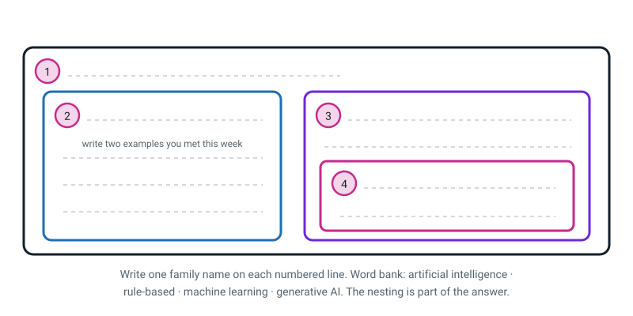
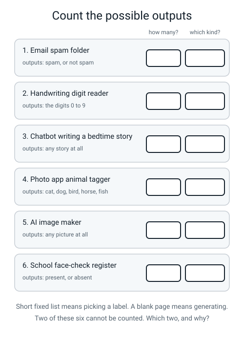
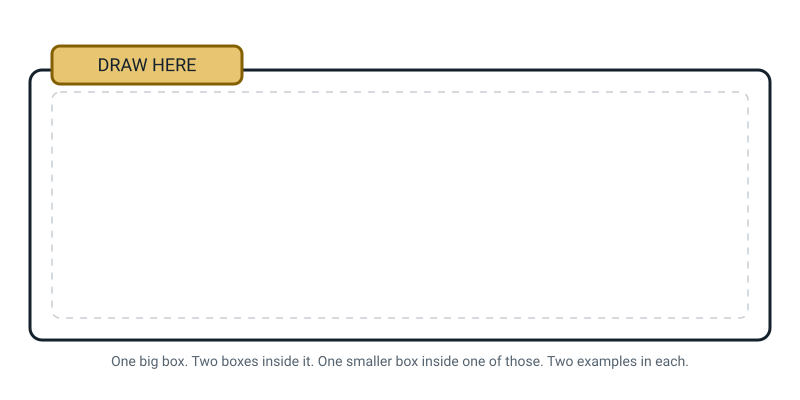

# Workbook — Week 3: AI Detective — Find 15 in Your Own Day

**Name:** ________________________________  **Date:** ______________

[📖 Read the chapter first](../student-guide/week-03.md) · [Course Home](../README.md)

---

## ✅ Warm-Up (5 min)

Five quick questions about **last week**.
Try all five before you look anything up.

**W1.** In machine learning, who writes the rule? ____________________

**W2.** An example has two halves. Name them both.

________________________ and ________________________

**W3.** True or false: *the examples are stored inside the finished model.*

Circle: **TRUE** / **FALSE**. Why?

________________________________________________________________

**W4.** In the mango deck, the **colour** rule scored 4 out of 8. What is 4 out of 8 the same as?

________________________________________________________________

**W5.** Finish the sentence that explains almost every model mistake ever made:

Everything the model knows, and every mistake it makes, came from ____________________________

---

## ✍️ Practice Set A — Understand It

These questions check that you know the new words and ideas from this week's chapter.

**A1. Fill in the blanks.**

**Generative AI** is a system that makes new ____________________ instead of picking an answer off a
fixed ____________________.

**Narrow AI** does exactly ____________________ job and is ____________________ outside it.

**General AI**, or ____________________ , could do any job a person can. It does
____________________ exist.

A **confidence score** says how strongly the model ____________________ its answer. It is a number,
not a ____________________.

---

**A2. Circle every one that is generating.** (There is more than one, and one of them is genuinely
arguable.)

&nbsp;&nbsp;&nbsp;(a) An email spam folder
&nbsp;&nbsp;&nbsp;(b) A chatbot writing a poem
&nbsp;&nbsp;&nbsp;(c) Face unlock
&nbsp;&nbsp;&nbsp;(d) An AI image maker
&nbsp;&nbsp;&nbsp;(e) Music autoplay picking the next song
&nbsp;&nbsp;&nbsp;(f) The suggestion bar above your keyboard

For **one** you did *not* circle, write down how many possible outputs it has:

________________________________________________________________

---

**A3. True or false — and explain.**

**(a)** *A model that says "wolf, 96%" will be right about 96 times out of 100.*

Circle: **TRUE** / **FALSE**. Why?

________________________________________________________________

**(b)** *Generative AI is a separate family, sitting beside machine learning.*

Circle: **TRUE** / **FALSE**. Why?

________________________________________________________________

---

**A4. Match the pairs.** How many different things could ever come out? Write the letter.

| System | | Number of possible outputs |
|---|:--:|---|
| 1. Handwriting digit reader | ☐ | **A.** 2 |
| 2. Face unlock | ☐ | **B.** 5 |
| 3. Photo animal tagger (cat, dog, bird, horse, fish) | ☐ | **C.** 10 |
| 4. A chatbot writing a paragraph | ☐ | **D.** can't be counted — a blank page |
| 5. An AI image maker | ☐ | **E.** can't be counted — a blank page |

---

**A5. Label the diagram.**

Write one family name on each numbered dashed line.

Then fill in the extra lines with real examples, and answer the question underneath.


*Figure W3.1 — Boxes inside boxes. The nesting is part of the answer.*

**Word bank:** artificial intelligence · rule-based · machine learning · generative AI

**(a)** Why is one of those four boxes drawn **inside** another one?

________________________________________________________________

**(b)** Which box would you put **face unlock** in? ____________________

---

**A6. Read the confidence properly.**

While you were drawing a clock, Quick, Draw! called out: **"circle … wheel … clock!"**

**(a)** At the moment it said "circle", what was its **top** answer? ____________________

**(b)** Was it hedging — being careful, listing maybes? Circle: **YES** / **NO**

Why? ____________________________________________________________

Now a different model looks at a photo and reports:

```text
   dog  94%        fox  4%        cat  2%
```

**(c)** What do those three numbers add up to? ________ Is that a coincidence? ________

**(d)** Finish this sentence honestly: *"94% means the model…"*

________________________________________________________________

**(e)** The photo was a **fox**. Was the model broken? ____________ Why?

________________________________________________________________

---

## ✍️ Practice Set B — Use It

These questions ask you to use the ideas on situations you have not seen before.

**B1. What would go wrong here?** A school buys a photo sorter that was trained on cats and dogs only,
and points it at the whole school photo library — which contains cats, dogs, buses, cakes, 300 pupils
and a fire drill.

**(a)** What does it say about a photo of a **bus**?

________________________________________________________________

**(b)** Will it warn anybody? ____________ Why not?

________________________________________________________________

**(c)** Name the one thing today's AI genuinely cannot do, which this question is about:

________________________________________________________________

---

**B2. What would go wrong here?** A pupil asks a chatbot to write the *"books and websites I used"*
section of a history project, and pastes the answer straight in.

**(a)** What is likely to be in that list?

________________________________________________________________

**(b)** Will it look convincing? ____________ What does it look exactly like?

________________________________________________________________

**(c)** Write down the **two-step check** you would run before pasting anything like that in:

1. ____________________________________________________________

2. ____________________________________________________________

---

**B3. Design a narrowness proof.** Your target: **Google Translate**.

Two tests have been suggested. Judge them.

| Test | Is it a good proof of narrowness? | Why? |
|---|---|---|
| "Ask it to make me a sandwich" | | |
| "Ask it whether the sentence it just translated is polite" | | |

**Now design your own.** It must be **one small step sideways** from translating text.

My test: _________________________________________________________

What I expect to happen: __________________________________________

What it would prove: _____________________________________________

---

**B4. Count the outputs.** Fill in both columns.

| System | How many possible outputs? | Picking a label, or generating? |
|---|---|---|
| A smart speaker deciding whether you said its wake word | | |
| A chatbot writing a birthday message for your gran | | |
| A school register marking present or absent from a face | | |
| A weather app choosing an icon from sunny/cloudy/rain/snow | | |

---

**B5. Tear one note in half.** A **video doorbell** does not belong in one column. Split it.

**Part 1** — what it does: ____________________________________________

Family: ____________________  Because: ______________________________

**Part 2** — what it does: ____________________________________________

Family: ____________________  Because: ______________________________

**The one fact I'd need to look up to be sure about part 2:**

________________________________________________________________

---

## 🧩 Puzzle of the Week

This puzzle is a short challenge about counting what a system can output.

### Count the Possible Outputs


*Figure W3.2 — Six systems. Two of them cannot be counted at all.*

**P1.** Fill in the table. In the last column write **picking** or **generating**.

| # | System | Its outputs | How many? | Which kind? |
|:--:|---|---|:--:|---|
| 1 | Email spam folder | spam, or not spam | | |
| 2 | Handwriting digit reader | the digits 0 to 9 | | |
| 3 | Chatbot writing a bedtime story | any story at all | | |
| 4 | Photo app animal tagger | cat, dog, bird, horse, fish | | |
| 5 | AI image maker | any picture at all | | |
| 6 | School face-check register | present, or absent | | |

**P2.** Which two cannot be counted, and what do they have in common?

________________________________________________________________

**P3.** **The trap.** Music autoplay picks your next song from about **100 million** songs. A hundred
million is a huge number. Is it generating?

Circle: **YES** / **NO**. Explain your answer using the word *list*:

________________________________________________________________

**P4.** Now invent a **seventh** system that is genuinely hard to place — one where you could argue for
either answer. Write it down, and write the argument for **both** sides.

My system: _______________________________________________________

The case for **picking**: __________________________________________

The case for **generating**: _______________________________________

---

## 🤔 Think Deeper

These two questions need a written paragraph each. Take your time with them.

**T1.** AlphaGo could only play Go. A chatbot writes poems, explains photosynthesis, translates
Spanish and plans a party.

Write a paragraph (5+ sentences). Argue **both** sides of *"is a chatbot really narrow?"* — properly,
so that someone reading it can't tell which side you're on until the last sentence. Then pick one and
say why.

________________________________________________________________

________________________________________________________________

________________________________________________________________

________________________________________________________________

________________________________________________________________

---

**T2.** "It sounded confident, so I believed it."

Write a paragraph (4+ sentences) about the places in **your own life** where you decide something is
true because of *how it sounded* rather than *what you checked*. A teacher's voice? A friend who is
never unsure? A website that looks official? Then write down one habit you could actually keep.

________________________________________________________________

________________________________________________________________

________________________________________________________________

________________________________________________________________

---

## 🛠️ Build It

This is where you finish your AI Spotter's Log, defend your hardest choices, and interview an adult.

### Page 3.4 — Finish the AI Spotter's Log (15 rows)

Copy your fifteen sticky notes in. **Every row needs a one-line reason**, and every reason must
mention either *a person wrote the steps* or *it must have learned it from examples*.

**Rules:** specific systems only ("my phone's keyboard bar", not "my phone") · aim for at least 3 rows
from each zone · star ⭐ your three hardest calls.

| # | ⭐ | System (be specific) | Zone | Family | Why — one line |
|:--:|:--:|---|---|---|---|
| 1 | | | | | |
| 2 | | | | | |
| 3 | | | | | |
| 4 | | | | | |
| 5 | | | | | |
| 6 | | | | | |
| 7 | | | | | |
| 8 | | | | | |
| 9 | | | | | |
| 10 | | | | | |
| 11 | | | | | |
| 12 | | | | | |
| 13 | | | | | |
| 14 | | | | | |
| 15 | | | | | |

**Zones:** 🏠 home · 📱 phone · 🏫 school · 🛣️ street
**Families:** rules · learned · generating · not AI

**Count them up.** rules: ____ learned: ____ generating: ____ not AI: ____

If **generating** is zero, that's an honest finding, not a failure. Write it as a sentence here:

________________________________________________________________

---

### Page 3.5 — Defend your three hard calls

Every defence needs **all four** of these, or it isn't finished:

1. What made it hard to classify.
2. The evidence **for** your answer.
3. The evidence **against** your answer — the honest case for the other side.
4. What **one fact** you'd need to look up to be certain.

**Read this model defence first. Copy its shape, not its words.**

> ⭐ **My phone's keyboard suggestion bar.**
>
> **(1) What made it hard.** I couldn't decide between *learned* and *generating*, and I ended up
> thinking it's genuinely both, which felt like cheating until I wrote it out.
>
> **(2) Evidence for *generating*.** It produces words, and words are content. There's no fixed menu —
> over a week it has suggested hundreds of different words to me, including names and slang that
> aren't in a standard word list (though it may simply keep a personal list of what I type). When I try
> to count the possible outputs the way we did in class, I can't, but a very big vocabulary is still a
> vocabulary, so this evidence is weaker than it looks.
>
> **(3) Evidence against — the honest case for *learned*.** It only ever shows me **three** options at
> a time, and three is a menu. It also definitely learned: it started suggesting my friend's name after
> I'd typed it about five times, which is picking up a pattern from examples (though that could also be a simple personal-dictionary lookup). And everything in the
> generating column is *also* in the learned column, since generative AI lives inside machine learning
> — so "learned" isn't even wrong.
>
> **(4) The one fact I'd need.** Whether those three words come off a fixed list the phone keeps, or
> whether it builds each word up letter by letter. If it's a list, it's picking. If it builds them,
> it's generating. **A made-up-word test would not settle it:**
> phones keep a personal dictionary of what you type, so the bar offering my invented word back is
> exactly what a learned list would do. I would have to look up how my keyboard works.
>
> **My call: generating** — but I've written it in the *learned* column too, with an arrow, because
> both are true.

**Defence 1 — system: ______________________________  My call: ______________**

________________________________________________________________

________________________________________________________________

________________________________________________________________

________________________________________________________________

________________________________________________________________

**Defence 2 — system: ______________________________  My call: ______________**

________________________________________________________________

________________________________________________________________

________________________________________________________________

________________________________________________________________

________________________________________________________________

**Defence 3 — system: ______________________________  My call: ______________**

________________________________________________________________

________________________________________________________________

________________________________________________________________

________________________________________________________________

________________________________________________________________

---

### Page 3.6 — Interview an adult

Ask any adult: **"What is AI?"** Write down **exactly** what they said. Word for word. Even if it's
short. Even if you think it's wrong. Do not tidy it up.

**Who I asked:** ______________________  **What they actually said:**

________________________________________________________________

________________________________________________________________

**Now rewrite it honestly** — same rules as last week, no magic words:

________________________________________________________________

________________________________________________________________

**One more thing.** Circle any of these that appeared in their answer:

**robots** · **thinking** · **ChatGPT** · **smart** · **learning** · **none of these**

---

## 🎨 Draw It

You draw this week's big picture from memory.

Draw the **three families** as boxes inside boxes, from memory. One big box. Two boxes inside it. One
smaller box inside one of those. Put **two real examples** in each — real ones, from your own log.


*Figure W3.3 — Your page.*

> **What a good answer might look like:** a big box labelled **ARTIFICIAL INTELLIGENCE**. Inside it,
> on the left, **RULE-BASED** — *thermostat, school bell* — with a note: *"a person wrote the
> if-then steps."* Inside it, on the right, **MACHINE LEARNING** — *spam folder, face unlock* — with a
> note: *"found the rule from examples."* And inside **that** box, a smaller one: **GENERATIVE AI** —
> *chatbot, image maker* — with a note: *"blank page, no menu."*
>
> **What a weak answer looks like:** three boxes drawn **side by side** in a row. That's the mistake
> the whole figure exists to prevent. Generative AI is not a third family sitting next to machine
> learning — it is **inside** it, because a chatbot learned from examples exactly like a spam filter
> did. If your three boxes are in a row, redraw one of them inside another.

---

## 📊 Self-Check

Use this table to tell yourself honestly how the week went. Tick one box in each row.

| I can… | 😀 got it | 🙂 nearly | 😕 not yet |
|---|---|---|---|
| Tell picking-a-label from generating, by counting the possible outputs | ☐ | ☐ | ☐ |
| Design a test one small step sideways, run it, and record the failure | ☐ | ☐ | ☐ |
| Say what a confidence score does and does **not** promise | ☐ | ☐ | ☐ |
| Say why "it sounded confident" is worth nothing as evidence | ☐ | ☐ | ☐ |
| Sort fifteen real systems and defend the three hardest in writing | ☐ | ☐ | ☐ |

One thing I'd like explained again:

________________________________________________________________

---

## ✅ Answers

This section is for checking your work after you have finished every page above. Open it only then.

<details>
<summary>Check your answers</summary>

### Warm-Up

**W1.** **Nobody.** A person collected the examples and wrote the labels; a program found the rule; no
human typed it and often no human can read it back.

**W2.** **The thing** (the input — a message, a photo, a mango) and **the label** (the correct answer,
attached by a person before training).

**W3.** **FALSE.** They're gone. What's left is a rule. The eight mango cards were in a pocket when
you answered the test cards — so the answer cannot have come from the cards.

**W4.** **Exactly the same as flipping a coin.** 4 out of 8 is 50%, which is what pure guessing gets
on a two-way choice. So colour carried **no information at all** — while being the loudest thing on
the card.

**W5.** …came from **the examples it was given** (accept: *the examples and the labels people wrote*).

---

### Practice Set A

**A1.** **content** · **list** · **one** · **blank** · **AGI** · **not** · **prefers** · **promise**.

**A2.** Circle **(b) and (d)** for certain, and **(f)** is the genuinely arguable one — full marks
either way *if you gave the reason*. The keyboard bar produces words (content, no fixed menu) but only
ever shows three at a time (which looks like a menu). That exact argument is the model defence on
page 3.5.

The others, counted: **(a)** spam folder = **2**. **(c)** face unlock = **2**. **(e)** music autoplay
picks from an enormous but **fixed list of songs that already exist** — it composed nothing.

**A3. (a) FALSE.** 96% means *"wolf is the answer I'm leaning towards hardest"* — it's the biggest
number in a list that adds up to 100. It is not a prediction about how often the model is correct.
Models are often **confidently wrong**, especially on things unlike anything they trained on.

**(b) FALSE.** Generative AI is **inside** machine learning. A chatbot learned from examples in
exactly the same way a spam filter did — it just produces a blank page instead of a two-item menu.
Same family, different output shape.

**A4.** 1 → **C** (10) · 2 → **A** (2) · 3 → **B** (5) · 4 → **D** · 5 → **E**.
*(D and E are interchangeable — both are blank pages, and noticing that they're the same answer is the
point.)*

**A5.** Line **1** = **artificial intelligence** (the big outer box) · line **2** = **rule-based** ·
line **3** = **machine learning** · line **4** = **generative AI** (the small box inside machine
learning).

Examples: rule-based → *thermostat, alarm clock, school bell, vending machine*. Machine learning →
*spam filter, face unlock, translate, photo search*. Generative → *chatbot, image maker*.

**(a)** Because generative AI **is a kind of** machine learning, not a rival to it. It learned from
examples like everything else in that box; the only difference is that its output is a blank page
instead of a fixed list.

**(b)** **Machine learning** — and *not* the generative box, because face unlock has exactly two
possible answers.

**A6. (a)** **Circle.** At that moment, circle was its **top** answer.

**(b) NO — it was not hedging.** It wasn't listing maybes or being careful. It was confident about
*circle*, out loud. Then more strokes appeared and its top answer changed. **Confidence moves around,
and at every single moment it sounds certain.**

**(c)** They add up to **100**, and **no, that's not a coincidence** — the numbers always add up to
100, because the model has to spread its preference across every option on its menu.

**(d)** *"94% means the model **prefers dog more strongly than anything else on its list**."* Reject
your own answer if it says *nearly certainly right* or *right 94 times in 100*.

**(e)** **No, it wasn't broken.** It did exactly what it was built to do: give a number to every option
and hand you the biggest one. `fox` was on its list and scored 4. At the moment it answers, nothing in the machine
compares its answer to reality. **A model can be confident and wrong at the same time, and it feels
identical from the outside.**

---

### Practice Set B

**B1. (a)** It says **cat** or **dog**, with a confidence score — probably something like *"dog,
71%"*. Those are the only two things it can say.

**(b) No.** Because there is no option for *"that's outside my world"*. Its whole menu is two items.
It cannot output *"bus"*, and it cannot output *"I don't know"*, because neither of those is on the
list it was built to choose from.

**(c)** **Today's AI cannot reliably know when it doesn't know.**

**B2. (a)** Invented sources: books with real-sounding titles by real-sounding authors, page numbers,
and website names — none of which exist.

**(b) Yes, extremely convincing** — because it looks **exactly like** a real bibliography. That's the
whole problem: the machine's job is to produce text of the right *shape*, and a sources list has
titles and authors in it, so it produces titles and authors. Being shaped right and being true are
different things.

**(c)** The two-step check:

1. **Search for each title and author** — one at a time. A real book has more than one trace.
2. **Ask whether you can actually find and open the thing.** If you cannot get to the page, you cannot
   cite it. *(And notice: asking the chatbot "are these real?" is **not** a check. It will happily
   answer either way, and it doesn't know.)*

**B3.**

| Test | Good proof? | Why |
|---|---|---|
| "Make me a sandwich" | ❌ **No** | It's miles away from the job. Nobody ever claimed it could, so failing proves nothing. Anyone can reply "well, it wasn't designed for that." |
| "Is the sentence it just translated polite?" | ✅ **Yes** | One small step sideways. It's about the *same sentence* it just handled, a person would find it easy, and it is obviously related — so the failure tells you exactly where the edge is. |

Other good tests of your own: ask what the sentence *means*; ask whether the sentence is *true*; ask
it to translate a **photo** of a sign; ask whether the sentence would be rude to say to a teacher.

**B4.**

| System | How many | Kind |
|---|---|---|
| Smart speaker: did you say the wake word? | **2** (yes / no) | picking |
| Chatbot writing a birthday message | **can't be counted** | **generating** |
| School register: present or absent from a face | **2** | picking |
| Weather app choosing an icon | **4** (sunny, cloudy, rain, snow) | picking |

**B5.** Model answer:

- **Part 1** — *notices that something moved and starts recording.* Family: **rules**. Because it's
  `IF the pixels change THEN record`, a line somebody wrote, and it triggers for a moth, a shadow or a
  passing car. No judgement anywhere in it.
- **Part 2** — *decides "that's a person, not a cat"* (and on some doorbells, *"that's a parcel"*).
  Family: **learned**. Because nobody can write if-then rules over camera pixels for every person in
  every coat in every light.
- **The one fact I'd need:** does the app actually **distinguish people from animals** in the alerts it
  sends me? If it can say "person at your door" rather than just "movement", the learned part is
  confirmed. I can check that in the app's settings in about a minute.

---

### Puzzle of the Week

**P1.**

| # | System | How many | Kind |
|:--:|---|:--:|---|
| 1 | Spam folder | **2** | picking |
| 2 | Digit reader | **10** | picking |
| 3 | Chatbot bedtime story | **can't be counted** | **generating** |
| 4 | Animal tagger | **5** | picking |
| 5 | Image maker | **can't be counted** | **generating** |
| 6 | Face-check register | **2** | picking |

**P2.** **Numbers 3 and 5.** What they have in common: there is **no list**. Both can produce
something that has never existed before — a story nobody has written, a picture nobody has drawn — so
there is nothing to count. Everything else picks off a menu that was fixed before it ever ran.

**P3.** **NO — it is not generating.** A hundred million is enormous and it is still a **list**. Every
one of those songs already existed; a human being recorded each one. The system chose from a list, and
it did not compose a single note. **Big list, still a list.** Generating means the thing that comes out
did not exist until it came out.

**P4.** Answers vary — here are three that work, with both sides:

| System | The case for picking | The case for generating |
|---|---|---|
| Keyboard suggestion bar | It shows exactly 3 options. Three is a menu. | It produces words, and it can offer words no list contains. |
| A photo app's "auto-enhance" button | It picks a setting out of a handful of presets. | The picture that comes out never existed before. |
| A satnav choosing a route | It picks from the roads that already exist. | That exact route may never have been driven by anyone. |

Full marks for **any** system where you wrote a genuine argument on both sides. A one-sided answer
missed the point of the question.

---

### Think Deeper

**T1. Model answer.**

> The case that a chatbot is **not** narrow is strong at first glance: it writes poems, explains
> photosynthesis, translates Spanish and plans parties, and no other machine has ever done a spread
> like that. AlphaGo could do one thing; this thing seems to do hundreds, and it switches between them
> without being retrained, which looks a lot like what a person does. But the case that it **is**
> narrow is stronger once you look at what it is actually doing: one job, over and over — guess what
> chunk of text comes next. A poem is text. An explanation is text. A translation is text. Those
> hundred jobs are what one job looks like from the outside. And the limits show immediately: it cannot
> learn to ride a bicycle, it cannot check whether what it said was true, and it cannot do anything at
> all that isn't producing text. **My call: it is still narrow** — but the word is straining, and I'd
> rather say "it does one job that happens to cover an enormous amount of ground" than pretend it's the
> same kind of narrow as AlphaGo.

**Mark yourself on:** did you argue **both** sides properly before choosing? An answer that only
argues one side scores half, however good it is.

**T2. Model answer.**

> I do this constantly. If a teacher says something in a certain voice I write it down without
> checking, and if a friend who is never unsure tells me a fact about a footballer I just believe her,
> because being unsure is what usually warns me. Websites do it with layout — a page with a serious
> font and a logo feels checked, and it might be one person typing whatever they like. The chatbot was
> a shock because it had **all** of those signals at once: fluent, calm, detailed, no hedging, and
> completely wrong. **The habit I'm keeping is one question:** *which bit of this could I look up?* If
> the answer is "a name, a date or a number", I look it up, because those are the easy ones to check
> and they're exactly the bits that get invented.

**Mark yourself on:** did you name a real example from your own life, and did you write down a habit
you could actually do — not just "be more careful"?

---

### Build It

**Page 3.4 — the fifteen rows.** Yours will differ. **The reasons are what get marked, not the
notes.** Tick yourself against these six:

- [ ] Fifteen rows, no blanks
- [ ] Every system **specific** ("my phone's keyboard bar", not "my phone")
- [ ] At least three rows from each of the four zones
- [ ] At least two rows in each of rules / learned / generating — **or** a written sentence saying why
      a column is empty
- [ ] Every reason mentions either *a person wrote the steps* or *it learned from examples*
- [ ] Three rows starred

A model board, for the standard:

**RULES (5):** alarm clock at 07:00 (`IF time = 07:00 THEN ring`) · microwave 90-second timer
(counting down is not a decision) · traffic light on a timer · automatic shop doors (*it opens for a
stray cat, which is how you know it isn't judging*) · calculator app.

**LEARNED (7):** face unlock (nobody can write rules over two million coloured dots) · spam folder
(catches wording nobody could have listed) · video home feed (the pairings came from what billions of
people watched) · maps arrival time (uses how long cars actually took just now) · photo search for
"dog" (trained on already-tagged photos) · music autoplay (learned which song people don't skip) ·
voice dictation (nobody can write rules over sound waves).

**GENERATING (3):** chatbot writing a poem (blank page, no menu) · AI image maker (unlimited possible
pictures) · keyboard next-word bar (produces words rather than picking a label — a small blank page,
but a blank page).

**Not-AI notes are fine and expected.** A light switch, a kettle, a bicycle bell. Write **NOT AI**
beside them — that's a correct answer to a question nobody asked, which is still worth having.

**Page 3.5 — the three defences.** Mark each one against the four required points. **A defence missing
point 4 is incomplete** — go back and add only point 4.

Two more worked calls, for the standard:

| Note | The call | The reasoning |
|---|---|---|
| **Automatic shop doors** | **Rules** — and arguably **not AI at all** | `IF motion detected THEN open` is a line somebody wrote. The deciding question is whether the job needs judgement, and "did something move?" doesn't — the sensor fires for a stray cat or a blown crisp packet. **The fact that would settle it:** does the door ever *decline* to open for something that moved? If it never declines, there is no decision in there. |
| **Maps arrival time** | **Learned** | A rules version is easy to imagine — distance ÷ speed limit — but the estimate changes minute by minute and gets rush hour right, so it must be using how long real cars actually took just now. Nobody hand-wrote a rule for "Tuesday, 8:40am, raining, roadworks". **Evidence against:** part of it genuinely is arithmetic, since the distance is just measured. **A fact that would help (not settle it, since a rule using live speeds would also change):** does the estimate change if I ask twice, ten minutes apart, for the same route? |

**The best defences use the system's failures as evidence.** *"It opens for a cat, so it isn't
judging"* is worth more than any amount of confident assertion.

**Page 3.6 — interview an adult.** There is no wrong answer to record. What gets marked is the honest
rewrite. Typical answers and their rewrites:

| What the adult said | The honest rewrite |
|---|---|
| "AI is computers that can think for themselves." | "AI is machines doing jobs that used to need a person's judgement. They don't think — they either follow rules someone wrote or find patterns in examples." |
| "It's robots, basically." | "Robots are about having a body. AI is about a kind of decision. Most AI has no body at all — the spam filter is AI and it's just software." |
| "It's ChatGPT and all that." | "ChatGPT is one kind of AI. Spam filters, face unlock and video recommendations are all AI too, and they're older and used by more people." |
| "It's a computer that learns." | "Some AI learns from examples. Some AI is if-then rules a person wrote. Learning is one way of doing AI, not the definition of it." |
| "Honestly, I don't really know." | **The most honest answer on this list.** Write it down exactly as they said it, and then write the definition underneath as a gift. |

**The thing to notice:** most adults reach for *robots*, *thinking* or *ChatGPT* — the three ideas you
have personally worked past in three weeks. The honest way to write that up is *"this is what nearly
everyone thinks, including me three weeks ago."* Never *"the adult was stupid."*

---

### Draw It

A good page has **all four** of these:

1. **One outer box** labelled artificial intelligence.
2. **Two boxes inside it** — rule-based and machine learning.
3. **One smaller box inside machine learning** — generative AI. Not beside it. **Inside** it.
4. **Two real examples in each box**, taken from your own log rather than from the chapter.

The one mistake worth checking for: three boxes drawn **in a row**. If yours are in a row, the fix is
one line — redraw the generative box inside the machine learning box, because a chatbot learned from
examples exactly like a spam filter did.

</details>

---

[⬅ Week 2 workbook](week-02.md) · [📖 Week 3 chapter](../student-guide/week-03.md) · [Course Home](../README.md) · [Week 4 workbook ➡](week-04.md) · [Glossary](../../glossary.md)
