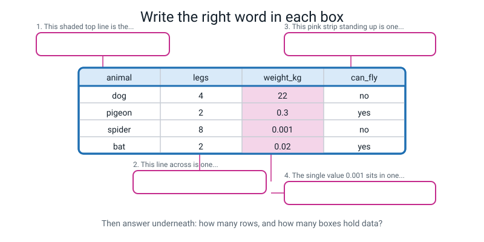
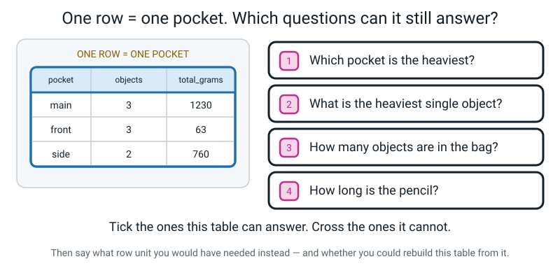
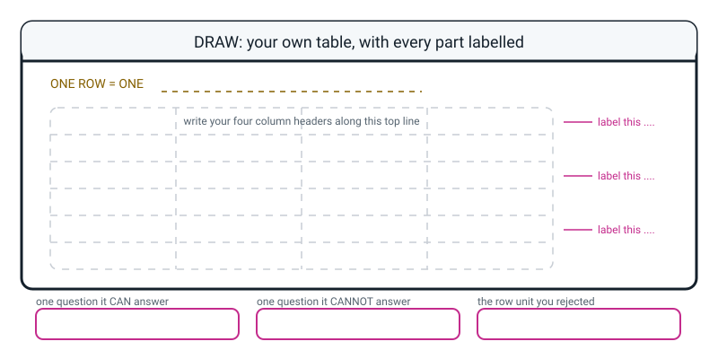

# Workbook — Week 4: Everything a Machine Knows Arrived as a Table

**Name:** ________________________________  **Date:** ______________

[📖 Read the chapter first](../student-guide/week-04.md) · [Course Home](../README.md)

> Work through the pages in order. Total time: **45–60 minutes**, and it works much better spread
> across the week than crammed into one sitting. Every question has a full worked answer at the
> bottom — but do the whole page before you look.

---

## ✅ Warm-Up (5 min) — What do you remember from Week 3?

**W1.** Last week you learned one test that tells a system that **picks a label** apart from one that **generates new content**. What is the test?

`________________________________________________________________`

**W2.** True or false — and explain in one line. *"A confidence score of 94% means the system will be right 94 times out of 100."*

Circle one: **TRUE** / **FALSE**

Because: `_____________________________________________________________`

**W3.** One line each.

- **Narrow AI** is: `_______________________________________________`
- **General AI (AGI)** is: `_________________________________________`

**W4.** Describe one **sideways step** task — something one small step away from a system's real job — that you think would break Quick Draw.

`________________________________________________________________`

**W5.** Put one example from your own day in each family.

| Family | My example |
|---|---|
| Rules — a human wrote the instructions | |
| Learned — it found the rule from examples | |
| Generating — it makes new content | |

---

## ✍️ Practice Set A — Understand It

**A1. Fill in the blanks.**

Rows go `____________`. Columns `____________ ____`. The top line of a table is called the
`____________`, and it is **not** `__________`.

A single box, where one row meets one column, is called a `____________`.

**A2. Multiple choice.** This table is put in front of you:

| animal | legs | weight_kg | can_fly |
|---|---|---|---|
| dog | 4 | 22 | no |
| pigeon | 2 | 0.3 | yes |
| spider | 8 | 0.001 | no |
| bat | 2 | 0.02 | yes |

How many **rows** does it have?

- [ ] (a) 3
- [ ] (b) 4
- [ ] (c) 5
- [ ] (d) 16

And how many boxes hold **data**? `__________`

**A3. True or false, and explain.** *"The computer understands what the word `weight_kg` means, because it says kilograms."*

Circle one: **TRUE** / **FALSE**

Because: `_____________________________________________________________`

`_____________________________________________________________________`

**A4. Match the pairs.** Draw a line, or write the letter in the box.

| Word | | Box | What it means |
|---|---|---|---|
| 1. data | | ☐ | A. One measurement, taken for every single row |
| 2. table | | ☐ | B. The top line that names the columns |
| 3. row | | ☐ | C. Things you noticed, written down so a machine can read them |
| 4. column | | ☐ | D. One example — one single thing you observed |
| 5. header | | ☐ | E. Data set out in rows and columns |

**A5. Label the diagram.** Write the right word in each of the four boxes on the picture, then answer the two questions underneath.


*Figure W4.1 — Four boxes, four leader lines. Name the shaded top line last — it is the one that catches people.*

1. The shaded top line is the `________________`
2. The line across is one `________________`
3. The pink strip standing up is one `________________`
4. The single value 0.001 sits in one `________________`

How many rows? `______`   How many boxes hold data? `______`

**A6. Name the row unit.** For each project, write "one row = one ______" and then name **three** columns.

**(a) Predicting whether it will rain tomorrow**

One row = one `______________________`

Columns: `_____________`  `_____________`  `_____________`

**(b) Deciding if a text message is spam**

One row = one `______________________`

Columns: `_____________`  `_____________`  `_____________`

**(c) Predicting how much a house sells for**

One row = one `______________________`

Columns: `_____________`  `_____________`  `_____________`

**(d) Recognising handwritten digits**

One row = one `______________________`

Columns: `_____________`  `_____________`  `_____________`

**(e) Recommending a film to somebody**

One row = one `______________________`

Columns: `_____________`  `_____________`  `_____________`

---

## ✍️ Practice Set B — Use It

**B1. The bakery.** A bakery wants to know **which cake sells best on which day of the week.**

One row = one `______________________`

Name four columns, and next to each one write **the measuring instruction** — how you would get that value the same way every time.

| Column | Measuring instruction |
|---|---|
| | |
| | |
| | |
| | |

**B2. What would go wrong?** Somebody hands a machine this table to learn from:

| object | grams |
|---|---|
| pencil | 6 |
| book | 340 |
| bottle | 500 |
| ball | 45 |
| **TOTAL** | **891** |

What will the machine believe, and which golden rule was broken?

`_____________________________________________________________________`

`_____________________________________________________________________`

Write one silly question that proves the TOTAL row does not belong:

`_____________________________________________________________________`

**B3. What would go wrong?** Two people fill in one table together. Person 1 measures in centimetres. Person 2 has an old ruler and measures in inches. Nobody writes down which is which.

| object | length |
|---|---|
| pencil | 18 |
| book | 10 |
| bottle | 24 |
| ball | 9 |

Which golden rule was broken? `____________________________________`

What is the worst part about this table — the part that makes it dangerous rather than just wrong?

`_____________________________________________________________________`

`_____________________________________________________________________`

Can you fix it by looking at the table? `______` Why not? `_______________`

**B4. Design it, and throw something away.** You want to find out **whether your school bus is usually late.**

One row = one `______________________`

Write four columns you would keep:

`_____________`  `_____________`  `_____________`  `_____________`

Now write **one column you rejected**, and the reason:

Rejected: `_______________` because `_____________________________`

**B5. The friend who chose wrong.** Your friend built a table of the videos they watched, but they chose **one row = one channel.** It has four rows.

They now want to know: *"How long was the third video I watched?"*

Can their table answer it? Circle one: **YES** / **NO**

Explain: `___________________________________________________________`

What should they have chosen instead, and why does that choice let them answer **both** questions?

`_____________________________________________________________________`

`_____________________________________________________________________`

---

## 🧩 Puzzle of the Week — The Squashed Table


*Figure W4.2 — One row is one pocket. Four questions, and one of them cannot be answered from this table at all.*

Somebody emptied a backpack and built this table. One row = one pocket.

| pocket | objects | total_grams |
|---|---|---|
| main | 3 | 1230 |
| front | 3 | 63 |
| side | 2 | 760 |

**Tick the questions this table can answer. Cross the ones it cannot.**

| | Question | ✓ or ✗ |
|---|---|---|
| 1 | Which pocket is the heaviest? | ☐ |
| 2 | What is the heaviest single object? | ☐ |
| 3 | How many objects are in the bag altogether? | ☐ |
| 4 | How long is the pencil? | ☐ |

For every question you crossed, write **what row unit you would have needed**:

`_____________________________________________________________________`

**The last part, and it is the real puzzle.** Could you build this three-row pocket table starting from a table where one row = one object? Could you go the other way?

`_____________________________________________________________________`

`_____________________________________________________________________`

---

## 🤔 Think Deeper

**T1.** In class you met a professional's rule: **"you can always add rows up, but you can never split them apart."** Explain in your own words *why* that is true, and give one example of your own — not the backpack and not the videos.

`_____________________________________________________________________`

`_____________________________________________________________________`

`_____________________________________________________________________`

`_____________________________________________________________________`

`_____________________________________________________________________`

**T2.** Whoever chooses the columns decides what a machine can ever notice. Describe one real situation where **leaving a column out** would actually matter to a person's life — and say who would be affected.

`_____________________________________________________________________`

`_____________________________________________________________________`

`_____________________________________________________________________`

`_____________________________________________________________________`

`_____________________________________________________________________`

---

## 🛠️ Build It — Your Life In 30 Rows, Part 1

This is the start of a three-week project. You finish it in Week 6, and in Week 7 you will use the same table to hunt for patterns. **About 20 minutes this week, spread across several days.**

### Step checklist

- [ ] **1. Choose your row unit.** Pick something that happens **three or four times a day**, not once. Meals works. Times you picked up your phone works. Journeys work. *One row = one day does not work* — you would only get seven rows.
- [ ] **2. Count it.** How many times did your chosen thing happen **yesterday**? If the answer is 1, choose again now.
- [ ] **3. Write your four column headers**, and the **measuring instruction** for each. Use lowercase with underscores: `main_food`, not `Main Food`.
- [ ] **4. Test one instruction on a person.** Read it to someone and ask them to follow it. If they hesitate, rewrite it.
- [ ] **5. Collect 7 rows.** Written down **at the time**, not on Sunday from memory.
- [ ] **6. If you miss a row, leave it blank and write why.** A blank with a reason beats a made-up number.
- [ ] **7. Write one sentence** saying why you chose that row unit, and **naming the one you rejected.**

### My row unit

```
ONE ROW = ONE ______________________________

Yesterday this happened _______ times.
```

### My four columns and their measuring instructions

| # | Column name | The measuring instruction — precise enough for a stranger |
|---|---|---|
| 1 | | |
| 2 | | |
| 3 | | |
| 4 | | |

### My first seven rows

| row_id | date | | | | |
|---|---|---|---|---|---|
| 1 | | | | | |
| 2 | | | | | |
| 3 | | | | | |
| 4 | | | | | |
| 5 | | | | | |
| 6 | | | | | |
| 7 | | | | | |

*(Write your four column names into the empty header boxes above before you start.)*

### Blanks log

| Row | Column | Why it is blank |
|---|---|---|
| | | |
| | | |

### My row-unit sentence

`_____________________________________________________________________`

`_____________________________________________________________________`

---

## 🎨 Draw It

Draw your **own** table — any subject you like, at least four rows and four columns — and label every part with a leader line: the header, one row, one column, one cell.


*Figure W4.3 — Your page. Write the row unit on the top line before you draw a single cell.*

**An example of a good answer.** A student drew a table of five pet fish:

```
ONE ROW = ONE FISH

  fish_name | length_cm | colour | tank
  ----------+-----------+--------+------
  spot      |    4      | orange | big     <-- one ROW (one fish)
  stripe    |    6      | white  | big
  tiny      |    2      | orange | small
  bubble    |    5      | black  | small
  flash     |    3      | orange | big
              ^^^^^^^^^
              one COLUMN (the same measurement, every fish)

  the top line "fish_name | length_cm | colour | tank" = the HEADER (not a fish)
  the box where "stripe" meets "length_cm" = one CELL, meaning "stripe is 6 cm long"

  CAN answer:    which fish is longest?
  CANNOT answer: how heavy is the big tank's fish in total? (there is no weight
                 column - nobody wrote it down)
  Row unit I rejected: one row = one tank. Then a fish has nowhere to put its length.
```

Notice what makes it good: the row unit is written **first**, the header is explicitly marked as *not a fish*, the cell is explained as a whole sentence, and the rejected row unit has a **reason** attached.

---

## 📊 Self-Check

Tick the face that is honest. Nobody is marking this, and 😕 is a completely useful answer.

| I can... | 😀 easily | 🙂 with a think | 😕 not yet |
|---|---|---|---|
| Name the row unit for a dataset, and say why a different choice gives a different table | ☐ | ☐ | ☐ |
| Point at the header, a row and a column on any table put in front of me | ☐ | ☐ | ☐ |
| Turn a pile of real objects into a table of 8 rows and 4 columns, all measured | ☐ | ☐ | ☐ |
| Explain why "one row is one example" is the rule that makes the rest of AI work | ☐ | ☐ | ☐ |
| Write a measuring instruction a stranger could follow | ☐ | ☐ | ☐ |

One thing I still want to ask about:

`_____________________________________________________________________`

---

## ✅ Answers

<details>
<summary>Check your answers</summary>

### Warm-Up

**W1.** **Count the possible outputs.** If the system can only reply with something from a **short fixed list**, it is *picking a label*. If it could reply with anything at all — a blank page's worth of possibilities — it is *generating*.
*Why this test and not "does it seem clever":* the number of possible answers is something you can actually count, and cleverness is not.

**W2. FALSE.** A confidence score is how strongly the system **prefers** one answer over the others. It is not a promise about how often it will be right. A system can be 94% confident and wrong, and it can be 94% confident about a picture that contains nothing it has ever seen. *Confidence is not correctness.*

**W3.**
- **Narrow AI** — a system that does **one** job. It is not "a bit of an AI"; it is a complete system with one task, and it fails the moment you step sideways out of that task.
- **General AI (AGI)** — a system that could turn its hand to any job a person can, the way you can. **Nobody has built one.** It does not exist today.

**W4.** Any task one small step sideways from "draw the thing, roughly centred, in one continuous style". Full-credit examples: draw the object *upside down*; draw only *half* of it; draw it *very small in one corner*; draw two of them; draw it with the lines deliberately wobbly. Marking point: the task must still be obviously the right object **to a human**. "Draw something random" is not a sideways step — that is just a different task.

**W5.** Any correct classification. Model answers:

| Family | Example | Why |
|---|---|---|
| Rules | A microwave timer; a vending machine; a lift | A person wrote every instruction; nothing was learned |
| Learned | Spam filter; video recommendations; face unlock | It found the rule from lots of examples |
| Generating | A chatbot; an image maker; predictive text | It produces new content, not a label from a list |

### Practice Set A

**A1.** Rows go **across**. Columns **stand up**. The top line is called the **header**, and it is **not data**. A single box is called a **cell**.

**A2. (b) 4.** There are four animals, so four rows. The answer is not 5 — that counts the header, and the header is not an animal. (Test it: could you put `legs` on a weighing scale?)
**Boxes that hold data: 16.** Four rows × four columns = 16. The four header words are labels, not data. (16 is also offered as option (d) — a deliberate trap for anybody skim-reading.)

**A3. FALSE.** To the machine, `weight_kg` is a **meaningless label** sitting on top of a column of numbers. It does not know what weight is, or that kilograms measure mass. It would behave **identically** if you renamed the column `banana`.
The header exists so *you* remember what the numbers mean. Which is exactly why the person who chooses the columns has so much power — and nothing checks them.

**A4.** 1 → **C** · 2 → **E** · 3 → **D** · 4 → **A** · 5 → **B**

**A5.**
1. **header**
2. **row**
3. **column**
4. **cell**
**Rows: 4.** **Boxes holding data: 16** (4 rows × 4 columns).
*Common slip:* answering "5 rows" because the header is a line on the page. Point at `can_fly` and ask whether it can fly.

**A6.**

**(a) Rain tomorrow.** One row = **one day at one place**.
Columns: `date`, `city`, `temperature_at_noon_c`, `humidity_percent`, `rained_next_day`.
⚠️ "One row = one day" on its own is not quite enough. Record Mumbai and Delhi on the same date and you get two rows for one day. The row is really the **pair** (date, city).

**(b) Spam or not.** One row = **one message**.
Columns: `sender_saved_in_contacts`, `number_of_links`, `word_count`, `is_spam`.

**(c) House price.** One row = **one sale**.
Columns: `area_sq_ft`, `bedrooms`, `age_years`, `sale_price`.
⚠️ **Not** "one house". A house sold three times over ten years is **three examples at three prices**. Choose "one house" and you throw two of them away.

**(d) Handwritten digits.** One row = **one image of one digit**.
Columns, at Level 1: `image_file`, `true_digit`. (In Week 23 you find out that `image_file` is secretly hundreds of number columns.)

**(e) Film recommendation.** One row = **one rating** — one person rating one film.
Columns: `person_id`, `film_id`, `rating_1to5`, `date_rated`.
⚠️ Neither "one film" nor "one person" works, because the thing being predicted **joins** a person *to* a film.

**The pattern across all five, and this is the actual answer to the question:** find what you are trying to predict, and **the row is whatever that prediction is about.**

### Practice Set B

**B1. The bakery.** One row = **one sale** (or, just as good, **one cake sold on one day** — a `cake × day` pair).

| Column | Measuring instruction |
|---|---|
| `cake_type` | ONE of exactly: `chocolate`, `vanilla`, `fruit`, `cheese` — the shop's four products, nothing else |
| `date` | The calendar date off the till, written `2026-09-03` |
| `day_of_week` | ONE of: `Mon` `Tue` `Wed` `Thu` `Fri` `Sat` `Sun` |
| `price_rupees` | Whole rupees actually charged, after any discount, off the receipt |

⚠️ **Why not "one row = one cake type"?** Because then you would have four rows for the whole year and nowhere to put the day of the week. And ⚠️ **why not "one row = one day"?** Because then you cannot tell which cake sold. **The question mentions both cake and day, so the row has to be the pair** — or one sale, which is finer still and from which you can build the pair.

**B2. The TOTAL row.**
The machine will believe there is a **fifth object in the bag called "Total" that weighs 891 grams**. It has no way of knowing that row is different; every row looks the same to it.
**Golden rule 1 was broken:** every row must be the same kind of thing, and a total is not a thing.
Silly questions that prove it: *"What colour is the total?"* · *"Which pocket did the total come out of?"* · *"Can I hold the total?"*
**The fix:** move the total **beside** the table, off the grid, in a note. Totals are useful — they just are not rows.

**B3. Mixed units.**
**Golden rule 2 was broken:** every column must be measured the same way in every row.
**The worst part** is that the table **looks completely fine**. Four rows, four numbers, no blanks, nothing red. It does not warn you. A table full of tidy numbers measured inconsistently is *worse* than no table at all, because it looks trustworthy.
**Can you fix it by looking at the table? No.** The number `10` could be 10 cm or 10 inches, and both are plausible for a book. The information about which one it was **never existed on the page**, so there is nothing to recover. The only fix is to go back to the objects and measure again — and this time write the instruction down first.

**B4. The school bus.** One row = **one journey** (one bus, on one day).
Four columns to keep: `date`, `scheduled_time`, `actual_arrival_time`, `minutes_late`.
Also fully correct: `date`, `stop_name`, `minutes_late`, `weather`.
**A rejected column with a good reason:** `was_it_crowded` — because "crowded" means something different every morning depending on your mood, so two people would never agree. Also acceptable: `was_the_driver_nice` (an opinion about a person, not a measurement); `did_it_feel_slow` (a feeling).
⚠️ Note that `minutes_late` can be **negative** if the bus is early — and that is a real value, not an impossible one. That distinction is next week's lesson.

**B5. The friend who chose wrong.**
**NO.** Their table has one row per channel, so every video from the same channel got squashed into a single line. Video 3's length was added into a channel total and it is **gone**.
**They should have chosen one row = one video.** That choice lets them answer **both** questions, because you can build the channel table from the video table just by adding rows together — count the videos per channel, add up the minutes. You cannot go the other way.
The sentence to remember: **record the smallest thing you care about.**

### Puzzle — The Squashed Table

| | Question | Answer | Why |
|---|---|---|---|
| 1 | Which pocket is heaviest? | **✓ YES** | `main`, at 1230 g. Read it straight off the column. |
| 2 | Heaviest single object? | **✗ NO** | Individual weights were added away. `main` holds 1230 g across 3 objects — could be 410 each, could be 1200 + 20 + 10. |
| 3 | How many objects altogether? | **✓ YES** | 3 + 3 + 2 = **8**. Adding rows up is always allowed. |
| 4 | How long is the pencil? | **✗ NO** | Twice impossible: length was never a column, **and** a pocket does not have a length anyway. |

**Row unit needed for questions 2 and 4:** one row = **one object**, with a `pocket` column and a `length_cm` column.

**The real puzzle.**
**Object table → pocket table: YES.** Group the object rows by `pocket`, count them, add up the grams. That is exactly the arithmetic in the class activity: 380 + 640 + 210 = 1230 for `main`, and so on.
**Pocket table → object table: NO.** The pocket table only ever knew the totals. You would have to go back to the actual bag.

**The principle, in one line:** you can always squash rows together. You can never pull them apart. So when you are not sure, **record the finest grain you care about.**

### Think Deeper

**T1. Why you can add up but not split.**
Full-credit answer, in the student's own words, containing this idea: **adding is a calculation, splitting is a guess.**
When you add rows together, everything you need is already written down — the answer is determined. When you try to split one row back into several, the information about *how* it was divided was never recorded, so you would have to invent it. `1230` across three objects has infinitely many possible splits and the table contains no clue about which one really happened.
Model answer with a fresh example:
> *"My mum's shopping receipt shows one line: `vegetables ₹240`. I can add that to the fruit line and get the total for food. But I can't work out how much the onions cost, because the till never wrote it down. If the receipt had one line per item, I could get both — the onions AND the vegetable total."*
Other good examples: a school report showing one grade per subject (you cannot recover individual test marks); a monthly electricity bill (you cannot recover Tuesday); a team's total score (you cannot recover one player's runs).

**T2. A missing column that matters.**
There are many correct answers. What earns full credit is naming (a) a specific missing column, (b) a specific decision, and (c) **who** gets affected.
Model answers:
> *"A hospital records a patient's temperature, blood pressure and age, but nobody records whether the patient can afford the medicine. The machine suggests treatments the patient will never be able to buy, so the poorest patients get advice that is useless to them — and nothing in the table shows anything is wrong."*
> *"A school's attendance table has `present` and `absent` but no `reason`. A child who missed twelve days because they were caring for a sick parent looks identical to a child who bunked off twelve times. Whoever reads the table treats them the same, and the first child gets in trouble for something that was not their fault."*
> *"A shop's recommendation table records what you bought but not what you looked at and put back. Somebody who nearly bought a wheelchair ramp and decided against it gets shown ramps for months."*
**What does not earn full credit:** "if you leave out a column the machine won't work properly." That is true and it names nothing. The question asks *who is affected*.

### Build It

There is no single right answer; here is what a full-credit page looks like.

**A good row unit** produces 3–5 rows a day:

| Row unit | Rows per day | 7 days gives |
|---|---|---|
| one meal or snack | 3–5 | 21–35 ✅ |
| one time I picked up my phone (for over 5 minutes) | 4–8 | 28–56 ✅ |
| one journey from A to B | 4–6 | 28–42 ✅ |
| one homework sitting | 2–4 | 14–28 ⚠️ tight — allow it, with a note |
| one day | 1 | 7 ❌ — reject, or make it a 30-day project |

**Four columns with real measuring instructions**, for the "one meal" row unit:

| Column | Instruction |
|---|---|
| `meal_type` | One of exactly: `breakfast`, `lunch`, `dinner`, `snack` |
| `minutes_eating` | Clock time from first bite to last bite, rounded to whole minutes |
| `main_food` | The biggest single item, lowercase with underscores, from my written list |
| `sleepy_after_1to5` | Rated exactly one hour later. 1 = wide awake, 5 = could fall asleep now |

⚠️ **Marking point.** "How sleepy I was" **fails** — it is not repeatable. "Rated exactly one hour later, 1 = wide awake, 5 = could fall asleep now" **passes**, because a stranger could do it and get your number.

**Seven rows of real data** — a model answer:

| row_id | date | meal_type | minutes_eating | main_food | sleepy_after_1to5 |
|---|---|---|---|---|---|
| 1 | 2026-09-03 | breakfast | 8 | idli | 2 |
| 2 | 2026-09-03 | lunch | 25 | rice_dal | 5 |
| 3 | 2026-09-03 | dinner | 15 | roti_sabzi | 2 |
| 4 | 2026-09-04 | breakfast | 10 | dosa | 2 |
| 5 | 2026-09-04 | lunch | 22 | rice_dal | 4 |
| 6 | 2026-09-04 | snack | 4 | biscuits | 1 |
| 7 | 2026-09-04 | dinner | 18 | rice_curry | 3 |

**The row-unit sentence.** Full credit **names the alternative it beat**:
> *"One row = one meal, because I want to find out which meals make me sleepy, and if one row were one day I couldn't tell which meal did it — the whole day would be squashed into a single line."*

Half credit states the choice but not the rejected alternative: *"One row = one meal because I eat several meals a day."* True, and it does not show the reasoning. Go back and add the comparison.

**Checklist for marking your own page:**
- [ ] Row unit written **at the top**, before the columns
- [ ] It happens 3+ times a day, and you counted yesterday to check
- [ ] Four instructions, each precise enough for a stranger
- [ ] 7 rows, real, written at the time
- [ ] Any blank has a reason beside it
- [ ] The sentence names a rejected alternative

### Draw It

Marked on five things, not on artistic skill:
- [ ] `ONE ROW = ONE ______` written **before** the grid
- [ ] At least 4 rows and 4 columns, filled in
- [ ] Four leader lines, labelling the **header**, one **row**, one **column**, one **cell**
- [ ] The header explicitly marked as *not data* — e.g. "not a fish"
- [ ] One question it can answer, one it cannot, and a rejected row unit **with a reason**

**The single most common mistake:** labelling the header as "the first row". It is not a row. Write "not one of the things being measured" next to it and the point is made.

</details>

---

[⬅ Week 3 workbook](week-03.md) · [📖 Week 4 chapter](../student-guide/week-04.md) · [Course Home](../README.md) · [Week 5 workbook ➡](week-05.md) · [Glossary](../../glossary.md)
