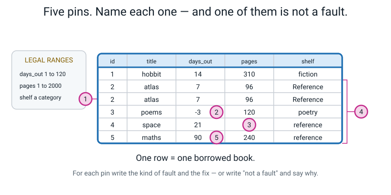
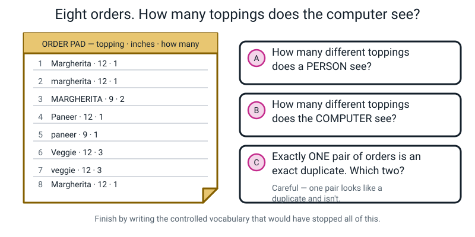
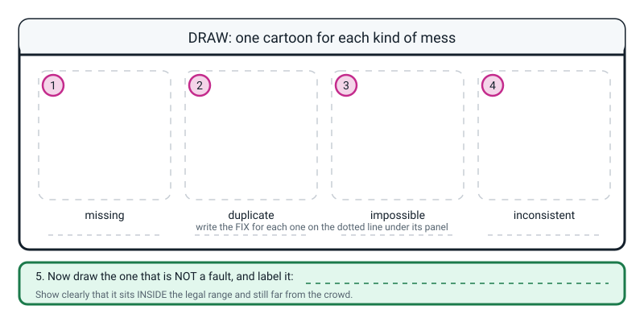

# Workbook — Week 5: Numbers, Names, and Broken Boxes

**Name:** ________________________________  **Date:** ______________

[📖 Read the chapter first](../student-guide/week-05.md) · [Course Home](../README.md)

> Total time: **45–60 minutes** across the week, including more data collection for your 30-row
> project. Every question has a full worked answer at the bottom. Do the page before you look.

---

## ✅ Warm-Up (5 min) — What do you remember from Week 4?

**W1.** In a table, rows go `____________` and columns `____________ ____`.

**W2.** This table is put in front of you. How many **rows** does it have?

| fruit | grams | colour |
|---|---|---|
| apple | 152 | red |
| banana | 121 | yellow |
| orange | 198 | orange |

Rows: `______`   Boxes holding data: `______`

**W3.** Somebody wants to know **which pocket of a bag is the heaviest**. What is one row?

One row = one `______________________`

**W4.** Write the two golden rules of a table.

Rule 1: `_______________________________________________________`

Rule 2: `_______________________________________________________`

**W5.** True or false, and explain in one line. *"If I build a table where one row is one pocket, I can work out the weight of the pencil later."*

Circle one: **TRUE** / **FALSE**  Because: `_________________________`

---

## ✍️ Practice Set A — Understand It

**A1. Fill in the blanks.** There are four kinds of mess, and each has a different fix.

| Kind of mess | The fix |
|---|---|
| ______________ value — an empty box | Leave it ______________ and write a note. **Never a** ______ |
| ______________ — the same example twice | ______________ it is really the same, then delete one |
| ______________ value — reality does not allow it | ______________ it and note what it was. **Never** ______________ |
| ______________ category — the same thing spelled several ways | Standardise, then write a ______________ ______________ |

And the test for a column's data type is one question:

*If I `______` two of these values together, does the answer `____________________`?*

**A2. Multiple choice.** Which of these columns is a **category**, even though every value is made of digits? Tick **all** that apply.

- [ ] (a) `bus_route_number`
- [ ] (b) `temperature_celsius`
- [ ] (c) `student_id`
- [ ] (d) `race_finish_seconds`
- [ ] (e) `house_number`
- [ ] (f) `weight_g`

For **one** of the ones you ticked, prove it by writing out the addition and saying why the answer is nonsense:

`_____________________________________________________________________`

**A3. True or false, and explain.** *"An empty box in a number column should be filled with 0, because 0 is the closest you can get to nothing."*

Circle one: **TRUE** / **FALSE**

Because: `_____________________________________________________________`

`_____________________________________________________________________`

**A4. Match the fault to the fix.**

| Fault | | Box | The fix |
|---|---|---|---|
| 1. A dog's age is listed as 45 | | ☐ | A. Leave it blank and add a note. Never a 0 |
| 2. Two rows are identical, same date and all | | ☐ | B. Keep it, and write a note about why that day was different |
| 3. The breed column has `Beagle` and `beagle` | | ☐ | C. Blank it, note `was 45, impossible`. Do not guess |
| 4. Row 5's weight box is empty | | ☐ | D. Standardise to one spelling, then write the allowed list |
| 5. Screen time reads 480 in a week of 95–150 | | ☐ | E. Check it is genuinely the same event, then delete one |

**A5. Name the fault at each pin.** Five pins are marked on the table below. For each one, write **what kind of fault it is** and **what you would do** — or write "not a fault" and say why.


*Figure W5.1 — Five pins, five faults. The legal ranges are printed beside the table on purpose — use them.*

| Pin | Kind of fault | What I would do |
|---|---|---|
| 1 | | |
| 2 | | |
| 3 | | |
| 4 | | |
| 5 | | |

How many different values does a computer see in the `shelf` column? `______`
And after you fix it? `______`

**A6. Type the column.** For each one, write **number**, **category**, **text** or **time** — and say whether averaging it would mean anything.

| Column | Type | Average it? (✅ / ❌ / ⚠️) | Why |
|---|---|---|---|
| `shoe_size` | | | |
| `favourite_colour` | | | |
| `bus_route_number` | | | |
| `temperature_celsius` | | | |
| `text_message_body` | | | |
| `date_of_birth` | | | |
| `student_id` | | | |
| `race_finish_seconds` | | | |
| `house_number` | | | |
| `mood_1to5` | | | |

Which three of those are **numbers on the outside and categories on the inside**?

`____________________`  `____________________`  `____________________`

---

## ✍️ Practice Set B — Use It

**B1. Write the legal ranges.** You cannot spot an impossible value if you never said what was possible. Write a smallest and biggest for each column, and one line saying why you chose it.

| Column | Legal range: from | to | Why those numbers |
|---|---|---|---|
| `sleep_hours` | | | |
| `homework_minutes` | | | |
| `height_cm` (for a class of 11-year-olds) | | | |
| `bag_kg` | | | |

Which one was hardest to decide, and why?

`_____________________________________________________________________`

**B2. What would go wrong?** A machine is trained on a table where the `day` column contains `Monday`, `monday`, `MON` and `Mon.` — four spellings of the same day.

How many different days does the machine think there are? `______`

What will it learn about Mondays, and why will nobody notice?

`_____________________________________________________________________`

`_____________________________________________________________________`

Write the controlled vocabulary that would have stopped it:

```
ALLOWED VALUES for day: ____________________________________________

____________________________________________________________________
```

**B3. What would go wrong?** Here are ten nights of sleep. Three were never recorded.

```
7.5   8.0   6.5   ____   8.5   ____   9.0   7.0   8.0   ____
```

(a) The honest average — add the **seven** real values and divide by 7:

Sum = `__________`   Average = `__________`   *(round to 2 decimal places)*

(b) Now suppose you typed `0` in all three blanks. Add all **ten** values and divide by 10:

Sum = `__________`   Average = `__________`

(c) How much did the average move? `__________`

(d) Here is the important question. **Three weeks later, could anybody looking at the table tell that the three zeros were made up?**

Circle one: **YES** / **NO**   Why? `_______________________________`

**B4. Write three controlled vocabularies.** Each one must be a **short, closed list** — plus a rule for the awkward case, which is worth as much as the list.

| Column | ALLOWED VALUES (nothing else, ever) | Rule for the awkward case |
|---|---|---|
| `weather` | | a day that is sunny and THEN rains: |
| `meal_type` | | a snack eaten instead of dinner: |
| `how_i_travelled` | | a journey that was half walk, half bus: |

**B5. Impossible, or outlier?** The legal ranges are printed for you. For each value, circle one and say what you would do.

```
sleep_h    0 to 16       screen_min   0 to 1440      bag_kg   0.1 to 12
age_years  5 to 19       jump_cm     50 to 900       temp_c    -10 to 50
```

| # | The value | Circle one | What I would do |
|---|---|---|---|
| 1 | `sleep_h` = 19 | IMPOSSIBLE / OUTLIER | |
| 2 | `screen_min` = 600, in a week where everything else is 90–140 | IMPOSSIBLE / OUTLIER | |
| 3 | `bag_kg` = 0 | IMPOSSIBLE / OUTLIER | |
| 4 | `age_years` = 19, in a class where everyone else is 11 | IMPOSSIBLE / OUTLIER | |
| 5 | `jump_cm` = 892, at a primary school sports day | IMPOSSIBLE / OUTLIER | |
| 6 | `temp_c` = 51 | IMPOSSIBLE / OUTLIER | |

One of those six needs a completely different kind of note from all the others. Which, and why?

`_____________________________________________________________________`

---

## 🧩 Puzzle of the Week — The Pizza Order Pad


*Figure W5.2 — Eight orders, one topping spelled several ways. A person sees one topping; a computer counts several.*

Here are the eight orders written out:

| # | topping | inches | how many |
|---|---|---|---|
| 1 | Margherita | 12 | 1 |
| 2 | margherita | 12 | 1 |
| 3 | MARGHERITA | 9 | 2 |
| 4 | Paneer | 12 | 1 |
| 5 | paneer | 9 | 1 |
| 6 | Veggie | 12 | 3 |
| 7 | veggie | 12 | 3 |
| 8 | Margherita | 12 | 1 |

**A.** How many different toppings does a **person** see? `______`

**B.** How many different toppings does the **computer** see? `______`

List them: `_____________________________________________________`

**C.** Exactly one pair of orders is an **exact duplicate**. Which two? `______ and ______`

**D.** One other pair *looks* like a duplicate and is not. Which two, and why not?

`_____________________________________________________________________`

**E.** Write the controlled vocabulary that would have stopped all of this:

```
ALLOWED VALUES for topping: __________________________________________
______________________________________________________________________
```

---

## 🤔 Think Deeper

**T1.** In class you met a hard truth: **sometimes you genuinely cannot tell an outlier from a mistake.** Explain why that is true for the 480-minute screen day, and then say what somebody could have done — at the moment they wrote it down — that would have settled it forever.

`_____________________________________________________________________`

`_____________________________________________________________________`

`_____________________________________________________________________`

`_____________________________________________________________________`

`_____________________________________________________________________`

**T2.** Design a collection sheet that makes each of the four faults **physically impossible to commit** in the first place. One idea per fault, and say how each one physically stops the fault.

| Fault | What I would print on the sheet | How that physically stops it |
|---|---|---|
| Missing value | | |
| Duplicate | | |
| Impossible value | | |
| Inconsistent category | | |

Which of your four ideas is the strongest, and why?

`_____________________________________________________________________`

`_____________________________________________________________________`

---

## 🛠️ Build It — Run All Four Checks on Your Own Table

**About 20 minutes, plus keep collecting rows.** You should be at **14 rows** by now. Get to **21** by next week — in Week 6 you finish at 30.

### Step checklist

- [ ] **1. Write your legal ranges first**, at the top of your own sheet — before you look for anything.
- [ ] **2. Pass 1 — MISSING.** Go column by column. Find every empty box. Do **not** fill any of them with 0.
- [ ] **3. Pass 2 — IMPOSSIBLE.** Column by column, compare every number against your legal range.
- [ ] **4. Pass 3 — INCONSISTENT.** Read each category column out loud, top to bottom. Hearing it finds spellings that reading misses.
- [ ] **5. Pass 4 — DUPLICATE.** Read the dates or times out loud, top to bottom. This is the hardest one and reading aloud is the trick.
- [ ] **6. Log every fault you find**, one line per fault, in the table below.
- [ ] **7. Write your controlled vocabulary** at the top of your table, for every category column.
- [ ] **8. Answer the last question** — which fault would have been most dangerous.

### My legal ranges

| Column | From | To | Why |
|---|---|---|---|
| | | | |
| | | | |
| | | | |

### My controlled vocabularies

| Column | ALLOWED VALUES — nothing else goes in this column, ever |
|---|---|
| | |
| | |

### My fault log

| # | Row | Column | Kind of fault | What I did about it |
|---|---|---|---|---|
| 1 | | | | |
| 2 | | | | |
| 3 | | | | |
| 4 | | | | |
| 5 | | | | |
| 6 | | | | |

**Row count check.** Rows before: `______`  Rows after: `______`

**Did you find any outlier that is NOT a fault?** If so, write it here **and keep it in the table**:

Value: `____________`  Row: `______`  Why it might be real: `_________`

> **⚠️ Watch out:** you might find **zero faults**. Do not invent one. Write "no faults found" and
> then list which four checks you ran, so it is clear you actually looked. Four real checks finding
> nothing is a respectable result. A fake fault is not.

### The question I will read first

**Of all the faults you found, which one would have been the most *dangerous* if a machine had trained on your table — and why?** Two or three sentences. There is more than one good answer; I want the reasoning.

`_____________________________________________________________________`

`_____________________________________________________________________`

`_____________________________________________________________________`

`_____________________________________________________________________`

---

## 🎨 Draw It

Draw one small cartoon for each of the four kinds of mess, write its fix on the dotted line, and then draw the fifth thing — **the one that is not a fault** — showing clearly that it sits *inside* the legal range.


*Figure W5.3 — Four panels, four kinds of mess. The bottom strip is for the one that is hardest to spot.*

**An example of a good answer.** A student drew:

```
1. MISSING       an empty box with a big "?" and a sticky note: "forgot Tuesday"
                 FIX: leave blank + note. NOT a zero.
2. DUPLICATE     identical twins side by side, both holding a card reading
                 "Wed Aug 26 - 8.0 - 125"
                 FIX: check it's really one day, then delete one.
3. IMPOSSIBLE    a person asleep, clock showing 88 HOURS, big red cross over it
                 FIX: blank it + note "was 88, original lost". Never guess.
4. INCONSISTENT  four characters arguing - "Monday!" "monday!" "MON!" "Mon.!" -
                 and a computer behind them holding up FOUR separate boxes
                 FIX: standardise to Mon + write the allowed list.
5. NOT A FAULT   a fenced field labelled "0 to 1440". Five sheep bunched in one
                 corner (95, 105, 110, 120, 150) and one sheep grazing far away
                 at the other end (480) - but STILL INSIDE THE FENCE.
                 Label: "OUTLIER. Legal. Keep it and write a note."
```

Notice what makes it good: **the fence is drawn**, so you can see the outlier is inside it. That single detail is the whole difference between an outlier and an impossible value, and a drawing shows it better than a sentence can.

---

## 📊 Self-Check

| I can... | 😀 easily | 🙂 with a think | 😕 not yet |
|---|---|---|---|
| Decide a column's data type by asking whether averaging it would mean anything | ☐ | ☐ | ☐ |
| Find and name all four kinds of mess in a wrecked table | ☐ | ☐ | ☐ |
| Explain the difference between an impossible value and an outlier, and say what I do with each | ☐ | ☐ | ☐ |
| Write a controlled vocabulary that would have prevented a mess I found | ☐ | ☐ | ☐ |
| Say why a blank must never be filled with 0 | ☐ | ☐ | ☐ |

One thing I still want to ask about:

`_____________________________________________________________________`

---

## ✅ Answers

<details>
<summary>Check your answers</summary>

### Warm-Up

**W1.** Rows go **across**. Columns **stand up**.

**W2.** **3 rows** (three fruits — the header is not a fruit) and **9 boxes** holding data (3 × 3).

**W3.** One row = one **pocket**. The question is about pockets, so the row has to be a pocket. Columns: `pocket`, `total_grams`, `how_many_objects`.

**W4. Rule 1:** every row is the same kind of thing — never a mix, and never a TOTAL row. **Rule 2:** every column is measured the same way, in every single row.

**W5. FALSE.** The pocket table only recorded totals; the pencil's weight was added in and it is gone. You would have to go back to the actual bag. *You can always add rows up; you can never split them apart.*

### Practice Set A

**A1.**

| Kind of mess | The fix |
|---|---|
| **Missing** value — an empty box | Leave it **blank** and write a note. **Never a 0** |
| **Duplicate** — the same example twice | **Check** it is really the same, then delete one |
| **Impossible** value — reality does not allow it | **Blank** it and note what it was. **Never guess** |
| **Inconsistent** category — the same thing spelled several ways | Standardise, then write a **controlled vocabulary** |

The test: *if I **add** two of these values together, does the answer **mean anything**?*

**A2.** Tick **(a) `bus_route_number`**, **(c) `student_id`** and **(e) `house_number`**.

Proofs, any one of which is full credit: bus route 7 + route 12 = route 19, which is a different bus or no bus. Student ID 1001 + ID 1002 = student 2003 — a different person, or nobody. House number 12 + number 40 = number 52, a different house down the road.

Not ticked, and why: `temperature_celsius`, `race_finish_seconds` and `weight_g` are all **real measurements on real scales** — 200 g + 340 g = 540 g means exactly what it says. *(If you also argued for `shoe_size`, that is worth credit: sizes are a manufacturing scale, not a physical measurement, and mixing UK, US and EU numbering ruins them.)*

**A3. FALSE**, and this is the most important false in the whole week.

A **blank** says *"I don't know."* A **0** says *"I know, and it was zero."* Those are **opposite sentences.**

Put a 0 in a sleep column and you have claimed the person did not sleep at all that night. The average drops, and — the part that really matters — **nothing on the page will ever record that you made it up.** Three weeks later that 0 looks exactly as measured as the 7.5 beside it.

There is a second half. **No data is not the same as no event.** A shop that was closed on Sunday genuinely sold 0 items — a real measurement of zero. A Sunday you forgot to check is blank. Only a note tells them apart.

**A4.** 1 → **C** · 2 → **E** · 3 → **D** · 4 → **A** · 5 → **B**

**A5.** The table is a library borrowing log; one row = one borrowed book.

| Pin | Kind of fault | What to do |
|---|---|---|
| **1** | **Duplicate** — the `atlas` row appears twice, identical in every column including the id `2` | Check it is really one borrowing, then delete one. The repeated `id` is the giveaway: ids are supposed to be unique |
| **2** | **Impossible** — `days_out = -3`, outside the range 1 to 120 | Blank it, note `was -3, impossible`. Do **not** guess 3 |
| **3** | **Missing** — the `pages` box for `space` is empty | Leave blank, add a note. **Not 0** — a 0-page book would wreck any average |
| **4** | **Inconsistent** — `shelf` has both `Reference` and `reference` | Standardise to `reference`, then write the allowed list |
| **5** | **NOT A FAULT** — `days_out = 90` is inside the range 1 to 120, so it is legal | It is an **outlier**. Keep it and annotate: *"kept over the summer holiday — check, then keep"* |

**Different `shelf` values a computer sees: 4** — `fiction`, `Reference`, `poetry`, `reference`. After fixing: **3**.

*The most common mistake here is crossing out pin 5. Look at the range before you look at the number.*

**A6.**

| Column | Type | Average it? | Why |
|---|---|---|---|
| `shoe_size` | Number (ordered) | ⚠️ sort of | Evenly spaced and ordered, so "average 7.4" is usable — but mixing UK, US and EU scales ruins it |
| `favourite_colour` | Category | ❌ no | Red + blue is not a colour, and blue is not "more" than green |
| `bus_route_number` | **Category** | ❌ no | A name printed with digits |
| `temperature_celsius` | Number | ✅ yes | A real measurement on a real scale |
| `text_message_body` | Text | ❌ no | You cannot average sentences. You *can* count the characters — but that is a new number column you created |
| `date_of_birth` | Time | ⚠️ technically | The average of two birthdays is a real date. Usually convert to `age_years` first |
| `student_id` | **Category** | ❌ no | The classic trap: ID 1001 + ID 1002 means nothing |
| `race_finish_seconds` | Number | ✅ yes | Real measurement; the average is a real time |
| `house_number` | **Category** | ❌ no | Number 12 plus number 40 is not number 52 |
| `mood_1to5` | Ordered category | ⚠️ commonly done | 5 really is happier than 4, so it sorts. Averaging is standard and slightly fake |

**The three number-looking categories: `bus_route_number`, `student_id`, `house_number`.**

### Practice Set B

**B1. Legal ranges.** There is no single correct set — what is marked is whether you can *defend* each one.

| Column | A defensible range | The reasoning |
|---|---|---|
| `sleep_hours` | 0 to 16 | You cannot sleep negative hours. Sixteen is generous but reachable when ill |
| `homework_minutes` | 0 to 300 | Zero is a real value (no homework set). Five hours is already extraordinary |
| `height_cm` (11-year-olds) | 120 to 180 | Both ends are possible in the world but not in a Year 6 class |
| `bag_kg` | 0.1 to 12 | An empty bag still weighs something, so not 0. Twelve kg is more than a child should carry |

**The hardest one is `height_cm`**, and here is the good answer: a range that is *too tight* flags real children as impossible, and one that is *too loose* lets a typo through. There is no perfect answer, only a written-down one — so the honest move is to write "flagged for checking" rather than "impossible" for anything just outside.

**B2. Four spellings of Monday.**
The machine thinks there are **4** different days.
It will learn **almost nothing about Mondays**, because instead of one group of four Mondays it has four groups of one. A group of one tells you nothing — there is no pattern in a single example.
**And nobody will notice**, because the table looks perfectly fine. There is no blank, no red cell, no absurd number. This is the most dangerous kind of fault precisely because it is **silent**.

```
ALLOWED VALUES for day:  Mon · Tue · Wed · Thu · Fri
Nothing else may be typed in this column.
```
Also full credit with `Monday · Tuesday · …`, as long as it is an explicit closed list. **Not** full credit: "be consistent", "use three letters", "write it the same each time" — none of those is a list, and none can be checked.

**B3. Three blanks versus three zeros.**

**(a) The honest average.** The seven real values are 7.5, 8.0, 6.5, 8.5, 9.0, 7.0, 8.0.

```
7.5 + 8.0 + 6.5 + 8.5 + 9.0 + 7.0 + 8.0 = 54.5
54.5 ÷ 7 = 7.7857... = 7.79 hours      "average of 7 values, 3 blank"
```

**(b) With three fake zeros.** The sum is unchanged — adding zero adds nothing — but the **count** changes from 7 to 10.

```
54.5 ÷ 10 = 5.45 hours
```

**(c) The move: 7.79 → 5.45, a drop of 2.34 hours.** Almost two and a half hours a night, invented out of nothing.

**(d) NO.** Nobody could tell, and that is the entire point. Once a 0 is typed into a box it looks **exactly** as measured and exactly as trustworthy as every other number in the column. There is no mark on the page, no colour, no footnote. And you will not remember either — not in three weeks. *A visible hole keeps you honest; an invented number does not.*

**B4. Three controlled vocabularies.** A controlled vocabulary must be **(a)** a list, **(b)** short, **(c)** closed, and **(d)** come with a rule for the awkward case. The rule for the awkward case is worth as much as the list.

| Column | ALLOWED VALUES | Rule for the awkward case |
|---|---|---|
| `weather` | `sunny · cloudy · rain · storm` | "whatever it was at 8 a.m." — or add a fifth value, `mixed` |
| `meal_type` | `breakfast · lunch · dinner · snack` | "write `dinner`, because the slot is what I am tracking, not the size" — or write `snack` and add a `note` column |
| `how_i_travelled` | `walk · bus · car · cycle · train` | "whichever took MORE MINUTES" — or add `walk_and_bus` as its own value |

For each one, **either** solution is right. **Naming the ambiguity is what earns the credit**, not which fix you pick.

⚠️ What fails: "Anything I eat" (not closed). "Be consistent" (not a list). And having **no rule at all** — because then on Tuesday you write `bus` and on Thursday you write `walk` for the identical journey, and you have created an inconsistency with your own hands.

**B5. Impossible, or outlier?**

| # | Value | Answer | What to do |
|---|---|---|---|
| 1 | `sleep_h` = 19 | **IMPOSSIBLE** | 19 is outside the range 0–16. Blank it, note `was 19, impossible`. Do not guess 9 or 1.9 |
| 2 | `screen_min` = 600 | **OUTLIER** | 600 is inside 0–1440, so it is legal — 10 hours is possible. **Keep it** and note why that day was different |
| 3 | `bag_kg` = 0 | **IMPOSSIBLE** | Outside 0.1–12. An empty bag still weighs something. Blank it — **and strongly suspect somebody filled a blank with 0** |
| 4 | `age_years` = 19 | **OUTLIER** | Inside 5–19, so legal. Unusual in a class of 11-year-olds, so **keep it and check it** — it is far more likely a typo (for 9 or 11) than a real 19-year-old, but only a check can say |
| 5 | `jump_cm` = 892 | **OUTLIER** | Inside 50–900, so legal by our own rule — but the world record is about 895 cm, so at a primary school this is almost certainly wrong. **Keep it, flag it hard, and go and ask.** This is the honest hard case: our range was too loose |
| 6 | `temp_c` = 51 | **IMPOSSIBLE** | Outside −10 to 50. Blank it and note it |

**The one needing a different kind of note is number 3, `bag_kg` = 0.** All the others are notes about *the value*. This one is a note about *the person who typed it*: `was 0 — suspect a blank was filled with a zero, original measurement may never have been taken`. It is the only one where the fault might be a **second, hidden fault** — a missing value in disguise. *(Number 5 is the second-best answer and deserves credit: it is legal by our range and nearly certainly wrong, which means the honest note is about **our range**, not the value.)*

### Puzzle — The Pizza Order Pad

**A. A person sees 3 toppings:** margherita, paneer, veggie.

**B. The computer sees 7.** Count them one at a time — this is the whole point of the puzzle, and rushing it is how you get 6.

| # | What the computer sees | Which orders |
|---|---|---|
| 1 | `Margherita` | 1, 8 |
| 2 | `margherita` | 2 |
| 3 | `MARGHERITA` | 3 |
| 4 | `Paneer` | 4 |
| 5 | `paneer` | 5 |
| 6 | `Veggie` | 6 |
| 7 | `veggie` | 7 |

**A person sees 3. A computer sees 7.** Now imagine the shop owner asking "which topping is most popular?" — the answer comes back as seven products, none of them selling much. The question has been made **unanswerable**, and nothing looks broken.

**C. The exact duplicate is orders 1 and 8.** `Margherita · 12 · 1` and `Margherita · 12 · 1` — identical in every single column, spelling included.

**D. Orders 6 and 7 look like a duplicate and are not.** `Veggie · 12 · 3` and `veggie · 12 · 3` have the same size and the same quantity — but **different spellings**, so they are not identical, and two different tables really could both have ordered three 12-inch veggies.

*(Orders 1 and 2, and orders 2 and 8, differ only in capital letters and fit the same description, so accept either of them as an answer too.)*

This is the trap and it cuts both ways:
- To a **computer** they are not duplicates (the text differs), so a duplicate-checking program will miss them.
- To a **person** they look like duplicates, so a person might delete one — and might be deleting a real order.

**The honest answer is that you cannot be sure**, and the reason is the one from class: nobody gave the rows unique IDs at collection time. With `order_id` on every line, orders 1 and 8 would be obviously separate and this whole problem would evaporate.

**E.**
```
ALLOWED VALUES for topping:  margherita · paneer · veggie
Nothing else may be written in this column. All lowercase.
Every order also gets its own order_id, so two identical orders
are two orders and not one mistake.
```
The second half of that — the unique ID — is the extra credit, and it is the part a professional would insist on.

### Think Deeper

**T1. Why you cannot always tell.**
Full-credit answer contains this idea: **480 is legal, so the table cannot rule it out — and 48 is also legal, so the table cannot rule that out either.** Both are inside the range 0–1440. The number itself carries no evidence about which one was intended.

Model answer:
> *"480 minutes is 8 hours, which is completely possible if I was home sick. But 48 minutes is also completely possible, and 480 is what you get if your finger slips on the 0. Nothing in the table can tell those apart, because both numbers are legal. The information about what really happened only ever existed in the head of the person typing, for about four seconds."*

**What they could have done at the moment:** written a **note**, at the time — `home sick, watched films all day`. That is the only defence, and it costs six words. Also correct: writing the start and stop times instead of just the total, so the number can be checked against a clock.

The general rule: **notes get written at the moment of collection, because they answer a question you will not be able to answer later.**

**T2. A sheet that prevents the faults.** Many correct answers. Full credit needs the *physical* mechanism, not just good intentions.

| Fault | What to print | How it physically stops it |
|---|---|---|
| Missing value | A tick box beside every number box labelled **"not measured — why?"** with a line to write on | You cannot leave the row looking finished without ticking something, so a blank becomes a *deliberate* blank with a reason |
| Duplicate | A **pre-printed row ID** on every line, 1 to 30, already numbered | Two rows can never carry the same ID, so a copy-paste is visible instantly. Coincidences stay safe |
| Impossible value | The **legal range printed in small grey text inside each number box** — e.g. `(0–16)` | You read the range while your pen is in the box. You cannot write 88 without seeing "0–16" under your own hand |
| Inconsistent category | A row of **tick boxes** instead of a writing line: `☐ Mon ☐ Wed ☐ Fri` | There is no space to write anything else. You physically cannot type `MON.` |

**The strongest of the four is the tick-box vocabulary**, because it is the only one that makes the fault **impossible** rather than merely *visible*. The others help you notice. That one removes the option.

*(This is real professional thinking. In a spreadsheet the same four ideas become a required-field rule, an auto-numbered ID column, a data-validation range, and a dropdown list. You meet the dropdown next week.)*

### Build It

No single answer. Mark your own page against these: legal ranges written **before** the checks · all four checks run as **four separate passes** · one log line per change, with all four boxes filled · **zero** blanks filled with 0 · any outlier **kept and annotated** · a controlled vocabulary for every category column · row count recorded before and after. "No faults found" is accepted **only** if the four checks are listed.

**The last question — "which fault would have been most dangerous?"** There is no single right answer. Two that earn full credit:

> **The inconsistent spellings.** *"The impossible values are loud — 88 hours makes you stop and look. The four Mondays are silent. Nothing warns you, the table looks perfectly fine, and the machine quietly thinks there are four different days that each happened once. It would never learn anything about Mondays, and I would never find out why."*

> **A blank filled with a zero.** *"If I had put 0 in the empty sleep box, I would have claimed I did not sleep at all that night. The average would drop and nothing on the page would say it was made up. It is the only fault that actively **lies** rather than just being absent."*

A well-argued case for the **duplicate** also earns full credit — it is the only fault where every value in the row is legal and sensible, so nothing but a specific duplicate check would ever see it.

**What does not earn full credit:** *"the 88, because it is the biggest."* **Size is not danger.** The 88 shouted and got caught; the number that looked fine went into the report. Ask instead: *which fault is hardest to notice?*

### Draw It

Marked on five things, not on artistic skill: four panels, one per kind of mess, each recognisably that kind · the **fix** on the dotted line under each, and all four fixes **different** · the missing-value panel says **not a zero** · the impossible-value panel says **do not guess** · the fifth drawing shows the outlier **inside a drawn fence** labelled with the legal range, and says *keep it*.

**The single most common mistake:** drawing the outlier the same way as the impossible value — far off to one side with a cross through it. If there is no fence in your fifth drawing, it has not said the thing it needed to say. **The fence is the answer.**

</details>

---

[⬅ Week 4 workbook](week-04.md) · [📖 Week 5 chapter](../student-guide/week-05.md) · [Course Home](../README.md) · [Week 6 workbook ➡](week-06.md) · [Glossary](../../glossary.md)
