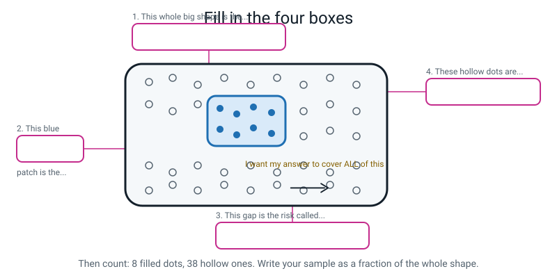
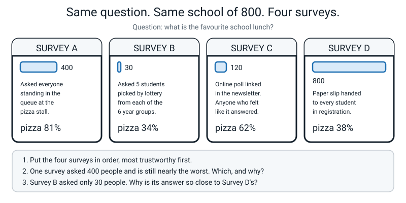
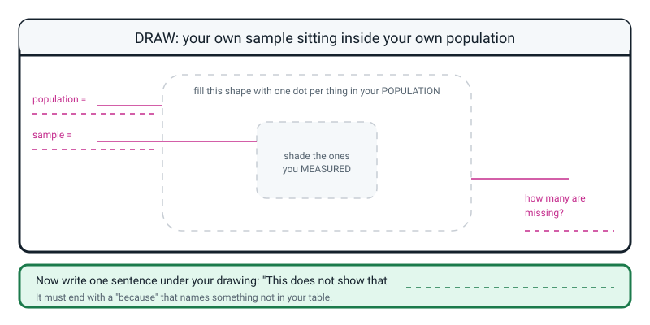

# Workbook — Week 6: Where Did This Data Come From?

**Name:** ________________________________  **Date:** ______________

[📖 Read the chapter first](../student-guide/week-06.md) · [Course Home](../README.md)

> Total time: **45–60 minutes** across the week. This is the **last** instalment of Your Life In 30
> Rows. Every question has a full worked answer at the bottom — do the page before you look.

---

## ✅ Warm-Up (5 min) — What do you remember from Week 5?

**W1.** What is the one-question test that tells you a column's data type?

`________________________________________________________________`

**W2.** Is `student_id` a number or a category? Circle one: **NUMBER** / **CATEGORY**

Prove it: `_______________________________________________________`

**W3.** You find an empty box in a number column. What do you do — and what must you never do?

Do: `___________________________________________________________`

Never: `_______________________________________________________`

**W4.** Impossible value, or outlier? The legal range for `sleep_h` is 0–16 and for `screen_min` is 0–1440.

- `sleep_h` = 88 → `________________________` What I do: `_____________`
- `screen_min` = 480 → `______________________` What I do: `_____________`

**W5.** Write the controlled vocabulary that would have stopped `Monday`, `monday`, `MON` and `Mon.`

```
ALLOWED VALUES for day: _____________________________________________
_____________________________________________________________________
```

---

## ✍️ Practice Set A — Understand It

**A1. Fill in the blanks.**

The `______________` is everything you would like your answer to be true about. The
`______________` is the smaller set you actually managed to measure.

The origin story of a dataset — who collected it, from whom, when, how and with whose permission —
is called its `______________`.

A short honest note describing a dataset **and its limits** is called a `______ ______`. It has
`______` lines, and the last two are the ones that count.

If you cannot find the answer to a provenance question, you write the word `______________`.

**A2. Multiple choice.** Dataset A got 5.9 hours of sleep because its thousand teenagers were all recruited **at a sleep-problems clinic**. Which of the five provenance questions would have caught that?

- [ ] (a) 1 — Who collected it?
- [ ] (b) 2 — From whom?
- [ ] (c) 3 — When?
- [ ] (d) 4 — How, exactly?
- [ ] (e) 5 — With whose permission?

Which one is the *second*-best answer, and why? `_____________________`

`_____________________________________________________________________`

**A3. True or false, and explain.** *"Asking 300 people at cricket practice instead of 30 makes the survey much more accurate."*

Circle one: **TRUE** / **FALSE**

Because: `_____________________________________________________________`

Now say it in soup words: `___________________________________________`

**A4. Match the question to a good answer.**

| Provenance question | | Box | A good answer sounds like |
|---|---|---|---|
| 1. Who collected it? | | ☐ | A. "3 to 28 August 2026" |
| 2. From whom? | | ☐ | B. "My own data. A parent checked it. No names, no address" |
| 3. When? | | ☐ | C. "Me, by hand, in a notebook" |
| 4. How, exactly? | | ☐ | D. "One person, age 11" |
| 5. With whose permission? | | ☐ | E. "Written down at 21:00 each night, off a phone timer" |

**A5. Label the diagram.** Write the right word in each of the four boxes.


*Figure W6.1 — The big outline, the small shaded patch, and the arrow between them. Four boxes to fill.*

1. The whole big shape is the `________________`
2. The blue patch is the `________________`
3. The gap between them is the risk called `________________`
4. The hollow dots are `______________________________________`

8 filled dots, 38 hollow. Write your sample as a fraction of the whole: `______ / ______`

**A6. Put the data card in order.** These seven lines belong on a data card, but they are jumbled. Number them 1 to 7.

| Line | Number |
|---|---|
| Who it is about — which people or things, how many, and who | ☐ |
| **Do NOT use for** — the claims this data cannot support | ☐ |
| What it is — one sentence, including what one row is | ☐ |
| Permission — whose data, who agreed, what was left out on purpose | ☐ |
| **Known gaps** — blanks, deletions, faults found | ☐ |
| How much — rows × columns, and the real dates | ☐ |
| Who collected it — a person, **and how** | ☐ |

Which **two** lines are the ones that separate a real data card from a list of facts?

Line `______` and line `______`

---

## ✍️ Practice Set B — Use It

**B1. Two honest datasets.** Both were measured correctly. Write, for each one, the question it **honestly answers**.

| | Dataset A — 1,000 visitors to a sleep-problems clinic. Average 5.9 h | Dataset B — every student in 4 randomly chosen schools. Average 7.8 h |
|---|---|---|
| The question it honestly answers | | |

Somebody suggests averaging the two, to get about 6.85 hours. Is that a good idea?

Circle one: **YES** / **NO**   Why? `_______________________________`

`_____________________________________________________________________`

**B2. What would go wrong?** A company trains a face-unlock model. Its training photos are:

```
2,000 adult faces        30 child faces
```

Nobody was cruel. Nobody typed anything wrong. All four of last week's checks pass.

What will happen when a child tries to unlock a phone? `_______________`

`_____________________________________________________________________`

Which word from this week names the problem? `______________________`

Would collecting 20,000 more **adult** faces help? Circle: **YES** / **NO**

Why? `_______________________________________________________________`

**B3. What would go wrong?** A teacher wants to know whether the class enjoys maths. She puts a paper on her desk and says *"fill this in if you want to."* Eleven students out of thirty do. The average enjoyment is **2.1 out of 5**.

Population: `________________________` Sample: `________________________`

Which of the three ways a sample goes wrong is this? `_______________`

Who is most likely to have walked up to that desk, and why does that move the answer?

`_____________________________________________________________________`

`_____________________________________________________________________`

Write the one sentence the teacher should add to make this an **honest limited finding**:

`_____________________________________________________________________`

**B4. Repair the sentences.** Each of these is meant to be a "This does not show that…" sentence and each one fails. Say **why** it fails and rewrite it properly.

| The bad sentence | Why it fails | My repaired version |
|---|---|---|
| "This might be wrong." | | |
| "This does not prove anything." | | |
| "This does not show that everyone eats like me." | | |

**B5. The average that quietly divided by 28.** Your `minutes` column has 30 rows. Two boxes are blank.

(a) If **no** boxes were blank and the thirty values summed to 492:

`492 ÷ ______ = ____________ minutes`

(b) In reality two are blank, and the 28 remaining values sum to 461. `=AVERAGE(D2:D31)` reports:

`461 ÷ ______ = ____________ minutes`  *(2 decimal places)*

(c) Which formula would have told you it used 28 and not 30? `_______________`

(d) Now suppose you had typed `0` into the two blank boxes instead. The sum stays 461, but:

`461 ÷ ______ = ____________ minutes`

(e) Write, on one line, exactly what your paper should say next to the answer from (b):

`_____________________________________________________________________`

---

## 🧩 Puzzle of the Week — Four Surveys, One School


*Figure W6.2 — Four surveys, one school of eight hundred. Only one of these four numbers is worth anything.*

A school of **800** students. One question: *what is the favourite school lunch?*

| Survey | Asked | How | Result |
|---|---|---|---|
| **A** | 400 | Everyone standing in the queue at the pizza stall | pizza 81% |
| **B** | 30 | 5 students picked by lottery from each of the 6 year groups | pizza 34% |
| **C** | 120 | An online poll linked in the newsletter; anyone who felt like it answered | pizza 62% |
| **D** | 800 | A paper slip handed to every student in registration | pizza 38% |

**1.** Put the four surveys in order, **most trustworthy first**.

`______ → ______ → ______ → ______`

**2.** One survey asked 400 people and is still nearly the worst. Which, and why?

`_____________________________________________________________________`

**3.** Survey B asked only 30 people. Why is its answer so close to Survey D's?

`_____________________________________________________________________`

**4.** For **Survey D only**, what is the population and what is the sample?

Population: `________________________` Sample: `________________________`

Anything unusual about that pair? `_______________________________`

**5.** Name the way each survey goes wrong: `wrong place`, `self-selection`, `too small`, or `nothing wrong`.

A: `______________` B: `______________` C: `______________` D: `______________`

---

## 🤔 Think Deeper

**T1.** Dataset A was collected at a sleep clinic, which made it useless for "how much do teenagers sleep?" **Invent a question for which Dataset A is the *better* dataset** — better than Dataset B — and explain why.

`_____________________________________________________________________`

`_____________________________________________________________________`

`_____________________________________________________________________`

`_____________________________________________________________________`

**T2.** You want the real favourite lunch of all 800 students. You get **one hour** and **no help**. Write your plan. Then — and this is the part that counts — **name one thing that is still wrong with your own plan.**

My plan:

`_____________________________________________________________________`

`_____________________________________________________________________`

`_____________________________________________________________________`

Still wrong with it:

`_____________________________________________________________________`

`_____________________________________________________________________`

---

## 🛠️ Build It — Finish Your Life In 30 Rows

**About 20 minutes.** After this the table is finished and it is yours. In Week 7 you use it to hunt for patterns.

### Step checklist

- [ ] **1. Finish the rows.** Get to 30. If you cannot, get as close as you honestly can and **write the real number on your card.** Do not invent rows — an invented row is worse than a missing one, because a missing one is visible.
- [ ] **2. Type it into a spreadsheet.** Headers in row 1, data from row 2 down.
- [ ] **3. Compute both averages** with `=AVERAGE(...)`, in empty cells **below** the data.
- [ ] **4. Run `=COUNT(...)` on both columns** and write down what it says.
- [ ] **5. Write both averages on paper**, each with the count it came from.
- [ ] **6. Write the seven-line data card, on paper.** Line 6 comes straight from your Week 5 fault log.
- [ ] **7. Write three "This does not show that…" sentences**, each naming what is missing.
- [ ] **8. Read one sentence to an adult** and write down what they actually said.

### My two averages

| Column | Average | How many values it came from | Rows blank |
|---|---|---|---|
| | | | |
| | | | |

Written as a full sentence, with **whose** and **when** in it:

`_____________________________________________________________________`

### My data card

| # | Line | What I wrote |
|---|---|---|
| 1 | What it is (including what one row is) | |
| 2 | How much — rows × columns, real dates | |
| 3 | Who collected it, **and how** | |
| 4 | Who it is about | |
| 5 | Permission | |
| 6 | **Known gaps** (from my Week 5 fault log) | |
| 7 | **Do NOT use for** (at least two claims) | |

### My three sentences

**1.** This does not show that `_______________________________________`

because `___________________________________________________________`

**2.** This does not show that `_______________________________________`

because `___________________________________________________________`

**3.** This does not show that `_______________________________________`

because `___________________________________________________________`

### The adult check

I read sentence number `______` to `________________________`.

They said, in their own words: `_____________________________________`

`_____________________________________________________________________`

> **💡 Try this:** if they looked confused, your sentence is not finished — and writing down
> "my dad said he didn't understand it" is a **better** answer than "my mum said it was very good."
> It means you actually tested it.

---

## 🎨 Draw It

Draw your own sample sitting inside your own population — one dot per thing — and shade the ones you actually measured. Then write one "This does not show that…" sentence underneath.


*Figure W6.3 — Your own sample and population. Draw the big outline first, then the patch inside it.*

**An example of a good answer.** A student drew:

```
POPULATION: every meal I will eat this year.  Drew a big blob and wrote
            "about 1,100 meals" inside it, with lots of tiny hollow dots.

SAMPLE:     shaded a small patch of 30 dots in one corner - deliberately
            in a CORNER, not the middle, and labelled it
            "30 meals, 3-12 September, school days only".

MISSING:    an arrow to the rest of the blob: "about 1,070 meals never
            measured - including every single weekend and all of December."

SENTENCE:   "This does not show that I eat like this all year, because my
            sample is ten school days in September and there is not one
            weekend or holiday meal in it."
```

Notice what makes it good: the sample patch is drawn **in a corner**, not spread evenly — which honestly shows that the thirty meals came from one narrow slice of the year, not a stirred spoonful. And the sentence names something **specific and absent**: weekends.

---

## 📊 Self-Check

| I can... | 😀 easily | 🙂 with a think | 😕 not yet |
|---|---|---|---|
| Tell the population I care about from the sample I actually measured | ☐ | ☐ | ☐ |
| Ask the five provenance questions of any dataset, and write "unknown" without embarrassment | ☐ | ☐ | ☐ |
| Write a seven-line data card, including known gaps and what it must not be used for | ☐ | ☐ | ☐ |
| State three specific things my own data does **not** prove | ☐ | ☐ | ☐ |
| Explain why more data does not fix a badly chosen sample | ☐ | ☐ | ☐ |

One thing I still want to ask about:

`_____________________________________________________________________`

---

## ✅ Answers

<details>
<summary>Check your answers</summary>

### Warm-Up

**W1.** *If I **add** two of these values together, does the answer **mean anything**?* If yes, it is a number. If no, it is a category — no matter how many digits it is made of.

**W2. CATEGORY.** ID 1001 + ID 1002 = 2003, which is a different person, or nobody. The digits are a **name**, not an amount.

**W3. Do:** leave it visibly blank and write a note saying why. **Never:** put a 0 in it. A blank says *I don't know*; a 0 says *I know, and it was zero.* Opposite sentences, and no machine can tell them apart afterwards.

**W4.**
- `sleep_h` = 88 → **IMPOSSIBLE** (outside 0–16). Blank it, note `was 88, impossible, original lost`. Do **not** guess 8 or 8.8.
- `screen_min` = 480 → **OUTLIER** (inside 0–1440, so legal). **Keep it** and write a note about why that day was different.

**W5.**
```
ALLOWED VALUES for day:  Mon · Wed · Fri
Nothing else may be typed in this column.
```
It has to be a **list**, **short**, and **closed**. "Be consistent" fails — it is not a list and it cannot be checked.

### Practice Set A

**A1.** The **population** is everything you would like your answer to be true about. The **sample** is the smaller set you actually measured. The origin story is its **provenance**. The short honest note is a **data card**, and it has **seven** lines. If you cannot find an answer, you write **unknown**.

**A2. (b) Question 2 — "From whom?"** The answer "visitors to a sleep-problems clinic" gives the whole game away instantly.

**Second best: (d) question 4, "How, exactly?"** — a proper description of the method would have had to mention recruiting people at a clinic. Questions 1, 3 and 5 would **not** have caught it, because an honest, recent, fully consented study can still measure the wrong people.

**A3. FALSE.** All 300 are still cricket people. Increasing the size of a badly chosen sample narrows the **luck** while leaving the **lean** exactly where it was — so the wrong answer just looks more scientific, which is worse than a small wrong answer.

In soup words: **an unstirred ladle is not better than an unstirred teaspoon. Stirring matters more than spoon size.**

**A4.** 1 → **C** · 2 → **D** · 3 → **A** · 4 → **E** · 5 → **B**

**A5.**
1. **population**
2. **sample**
3. **bias** — or, equally correct at this level, *the gap between what I measured and what I am talking about*
4. **the things I never measured** — the rest of the population

**Sample as a fraction: 8 / 46.** Careful — the denominator is the **whole** population, which is the 8 filled dots **plus** the 38 hollow ones. Writing 8/38 is the common slip; that would be "measured versus unmeasured", not "measured versus everything".

*(8 out of 46 is about 17%. So 83% of that population was never looked at.)*

**A6.**

| Line | Number |
|---|---|
| Who it is about | **4** |
| Do NOT use for | **7** |
| What it is | **1** |
| Permission | **5** |
| Known gaps | **6** |
| How much | **2** |
| Who collected it | **3** |

**The two that matter: lines 6 and 7.** Anybody can count rows and write a date. **Saying what is missing, and what you are not allowed to claim, is the skill** — and it is the only part a careless person would leave off.

### Practice Set B

**B1.**

| Dataset | The question it honestly answers |
|---|---|
| **A** (sleep clinic) | *"How much sleep do teenagers **who already have a sleep problem** get?"* — because having a sleep problem is the entry ticket to the clinic |
| **B** (4 random schools) | *"How much sleep do teenagers in these four schools get?"* — much closer to the question that was asked, though still not "all teenagers everywhere" |

**Averaging them: NO.** Averaging answers to two **different questions** gives you an answer to **no** question. 6.85 hours describes neither the clinic population nor the school population.

The line to use: *the average of a giraffe and a mouse is not a useful animal.*

**B2. Face unlock.**
It will work **noticeably worse on children's faces** — failing to unlock, or taking several tries — while working fine for adults. And nothing in the training table looks broken: no blanks, no duplicates, nothing impossible, no inconsistent spellings. All four of Week 5's checks pass. **Clean is not the same as trustworthy.**

The word is **sample** — or more precisely, the sample does not match the population it gets used on. Children were a thin layer of the spoonful. *(You will measure exactly this gap on your own model in Week 31.)*

**Would 20,000 more adult faces help? NO.** That is more unstirred ladle. It makes the model even better at the thing it was already good at, and does not add a single child. **The fix is not more data — it is more of the missing kind of data.**

**B3. The volunteer survey.**
Population: **all 30 students in the class.** Sample: **the 11 who chose to walk up to the desk.**
This is **self-selection**.
The people most likely to volunteer are those with a **strong feeling** — usually the ones who dislike maths and want to say so, and sometimes the ones who love it. The 19 who thought maths was fine did not bother, and "fine" is exactly the answer that never gets recorded. So a 2.1 out of 5 is not the class's opinion — it is the opinion of the people who cared enough to walk over.

The honest sentence to add:
> *"This is 11 students out of 30 who chose to answer. It under-represents students who feel neutral about maths, because neutral people do not usually volunteer."*

**B4. Repairing the sentences.**

| The bad sentence | Why it fails | A repaired version |
|---|---|---|
| "This might be wrong." | **Anything** might be wrong. It names nothing, costs nothing to write, and tells a reader precisely zero | *"This does not show that my sleepiness comes from the food, because I never recorded how much homework I had that night."* |
| "This does not prove anything." | An **over-correction**. It does prove something small and true — that these 30 meals took this long | *"This does prove that my own 30 meals in September took about 16 minutes. It does not show that anyone else's do, because my sample is one person."* |
| "This does not show that everyone eats like me." | Right **idea**, but "everyone" is doing no work and there is no reason attached | *"This does not show that other children in my class eat for 16 minutes, because I measured one person — me — and one person tells you nothing about anyone else, however many meals I record."* |

**The rule this teaches:** every good sentence names **a specific claim** and ends with a **because** that points at something **absent from the table**.

**B5. The average that divided by 28.**

(a) `492 ÷ 30 = 16.4 minutes`

(b) `461 ÷ 28 = 16.4642... = 16.46 minutes` — and note that `AVERAGE` did this **silently**. It never mentioned the 28.

(c) **`=COUNT(D2:D31)`**. It reports how many boxes actually held a number. If it says 28, the machine has just told you something it would never have volunteered.

(d) `461 ÷ 30 = 15.3666... = 15.37 minutes` — a drop of more than a minute, for a reason that never happened. **A blank gets honestly skipped. A fake zero gets honestly believed.**

(e) `16.46 minutes — average of 28 values, 2 rows blank`

Writing "16.5, average of 30" would record something that did not happen.

### Puzzle — Four Surveys

**1. Order, most trustworthy first: D → B → C → A.**

| Rank | Survey | Why |
|---|---|---|
| 1st | **D** | It measured the **whole population** — all 800. There is no sample and therefore no sampling error at all |
| 2nd | **B** | Only 30, but **stirred**: a lottery pick from every year group, so no group can dominate. Its 34% is within 4 points of the true 38% |
| 3rd | **C** | 120 people, but **self-selected** — only those who felt like answering. Off by 24 points |
| 4th | **A** | 400 people, but every one of them was **in the pizza queue**. Off by 43 points |

**2. Survey A**, with 400 people. It is nearly the worst because the sample came from the **one place in the school where pizza-lovers had collected**. Being in the pizza queue was the entry ticket — exactly like walking into the sleep clinic. **More rows from the wrong place is not more truth; it is a wrong answer that looks scientific.**

**3.** Because **B was stirred and A and C were not.** B took 5 students from each of the 6 year groups, chosen by lottery, so no single group could take over. That is the whole idea: **a well-stirred teaspoon beats an unstirred ladle.** B used 13 times less data than A and landed 39 points closer to the truth.

**4. For Survey D:** population = **all 800 students**; sample = **all 800 students**.

What is unusual is that **they are the same thing.** When your sample *is* the whole population you have measured everything, and the result is not an estimate — it is a fact. That is a lovely position to be in and it is almost never available. *(Careful, though: it is only a fact **about that question**. Ask "what is the favourite lunch of students in this town?" and those same 800 rows become a sample again — the rows did not change, the question did.)*

**5.**
- **A: wrong place** — one part of the pot, unstirred
- **B: nothing wrong** *(accept "too small" as a fair worry, but the numbers show it landed closest of the three samples — stirring beat size)*
- **C: self-selection** — only people who cared answered
- **D: nothing wrong** — the whole population was measured

### Think Deeper

**T1. When the biased dataset is the better one.**
Full credit needs a question where the clinic's entry condition is a **feature, not a flaw**. Model answers:
> *"How well are the treatments at this clinic working? Dataset A is the only one that can answer that, because everyone in it is a patient at that clinic. Dataset B does not contain a single one of those patients."*
> *"How little sleep do teenagers with sleep problems actually get? That is exactly what Dataset A measures, and Dataset B would mostly measure people who sleep fine, so it would hide the answer."*

**The big idea, and it is a genuinely sophisticated one:** the dataset was never bad. **It was matched to the wrong question.** Every dataset is the right dataset for *something*, and the skill is knowing which something.

**T2. Designing a stirred sample.** Plans vary; what is marked is (a) some mechanism for **stirring** and (b) finding your **own** flaw.

A strong plan:
> *"I'd go to six registration classes, one from each year group, at the same time on the same morning. In each class I'd ask the teacher to read out five names from a list I'd shuffled beforehand, and only those five answer. That is 30 people, spread across every year, and I never get to choose who — so I cannot accidentally pick my friends."*

Now the flaws — and **every plan has one.** Full-credit self-criticism:
- *"I only get one class per year group, and classes are often grouped by ability or by which language they take, so one class is not a fair slice of a year."*
- *"Anyone absent that morning is invisible, and the people who are often absent might eat differently."*
- *"I am standing in front of them when they answer, so somebody might say what they think I want to hear."*
- *"One morning is one day. If it is chips day, chips will win."*

⚠️ The most common weak answer is *"nothing is wrong with my plan."* **Something always is.** A student who finds their own flaw has arrived somewhere real; a student who cannot has not finished the question.

### Build It

No single answer. Mark your own page against these:

- [ ] The **row count on the card matches the actual number of rows.** Check this first — it takes five seconds and it is the most common failure. If line 2 says 30 and the table has 22, that is exactly the fault the whole card exists to prevent
- [ ] Both averages on **paper**, each with the count it came from
- [ ] Line 1 says **what one row is**
- [ ] Line 3 says **how** it was collected, not just "me"
- [ ] Line 6 is traceable to the **Week 5 fault log** — blanks, deletions, any outlier kept
- [ ] Line 7 names **at least two** forbidden claims, and is not "anything"
- [ ] All three sentences name something **specific and absent**, not just doubt
- [ ] The adult's **actual words** are written down

**A full-credit card, for a meals dataset:**

> **DATA CARD — My Meals & Sleepiness, September 2026**
> **What it is:** 30 meals I ate, with what I ate, how long I took, and how sleepy I felt one hour later. One row = one meal.
> **How much:** 30 rows × 5 columns, 3 to 12 September 2026.
> **Who collected it:** Me, by hand, in a notebook — time at the first bite and the last bite, and the sleepiness exactly one hour later with a phone timer.
> **Who it is about:** One person: me, age 11. Nobody else appears.
> **Permission:** My own data. A parent read it before I shared it. No names, no address, no photos.
> **Known gaps:** 2 meals blank (forgot to record). 1 sleepiness value of 9 deleted as impossible on a 1–5 scale. 1 meal of 47 minutes kept — it was a birthday lunch, not an error. No weekend meals at all.
> **Do NOT use for:** Guessing anyone else's eating or sleepiness. Any claim about children in general. Deciding what anybody should eat.

**Three full-credit "does not show that" sentences:**

> **1.** *"This does not show that other children eat for 16 minutes. My sample is one person — me — and one person tells you nothing about anyone else, however many meals I record."*

> **2.** *"This does not show that big meals make me sleepy. Every big meal in my table was also a rice meal, so I cannot tell whether it is the size or the rice. I would need a big meal that was not rice, and I do not have one."*

> **3.** *"This does not show anything about weekends. I only recorded school days, so Saturday and Sunday are not in the table at all — and those are the days I eat most differently."*

**A note on honest unknowns.** A card with unknowns on it scores **full marks** if they are specific. *"Who collected it: mostly me, but my little brother wrote three of the rows and cannot remember how he measured them"* is an **excellent** line 3. It is honest, and it tells a reader exactly which rows to distrust.

### Draw It

Marked on four things, not on artistic skill: the population is drawn **much bigger** than the sample and labelled with a real number or a real description · the sample patch is **shaded** and labelled with the actual rows and dates · the **missing** part is labelled, ideally with a count · one sentence underneath naming something **specific and absent**.

**The single most common mistake:** drawing the sample as a neat patch in the **middle** of the population, evenly spread. That quietly claims your spoonful was stirred, and for a one-person, ten-school-day table it was not. **Draw it in a corner.** Where you put the patch is an honest claim about how you sampled.

</details>

---

[⬅ Week 5 workbook](week-05.md) · [📖 Week 6 chapter](../student-guide/week-06.md) · [Course Home](../README.md) · [Week 7 workbook ➡](week-07.md) · [Glossary](../../glossary.md)
