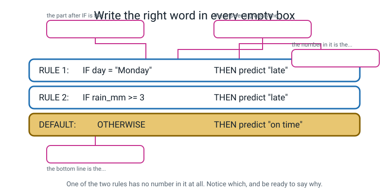
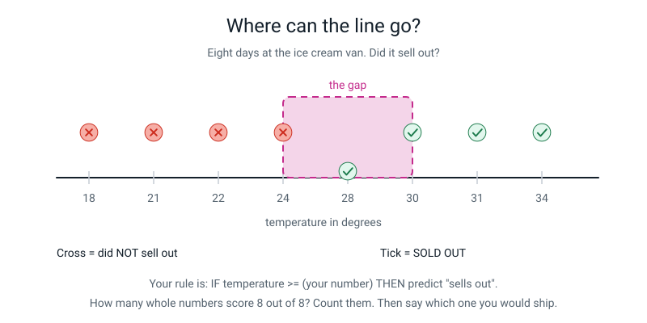
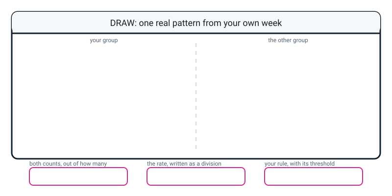

# Workbook — Week 7: Patterns: Things That Repeat Enough to Bet On

**Name:** ________________________________  **Date:** ______________

[📖 Read the chapter first](../student-guide/week-07.md) · [Course Home](../README.md)

---

## ✅ Warm-Up (5 min)

Five quick questions about **last week**. Try all five before you look anything up.

**W1.** Name **three** of the five provenance questions you should ask about any dataset.

1. ________________________  2. ________________________  3. ________________________

**W2.** What is the difference between a **sample** and a **population**?

________________________________________________________________

________________________________________________________________

**W3.** True or false: *collecting ten times more data fixes a badly chosen sample.*

Circle: **TRUE** / **FALSE**. Why?

________________________________________________________________

**W4.** Which line of a **data card** is the one that says what the data must **not** be used for? ____________

**W5.** A table has passed all four of Week 5's cleaning checks — no blanks, no duplicates, no impossible values, no inconsistent spellings. Can it still be lying to you? How?

________________________________________________________________

________________________________________________________________

---

## ✍️ Practice Set A — Understand It

These questions check that you know the words and ideas from the chapter.

**A1. Fill in the blanks.**

A **pattern** is something that repeats often enough that betting on it beats ____________________.

The part of a rule that comes after IF is the ____________________.

The cut-off number inside it is the ____________________.

An ordered list of rules plus a bottom line is a ____________________, and that bottom line is called the ____________________.

---

**A2. Multiple choice.** A table has 20 school days in it. On 12 of them somebody was late; on 8 they weren't. What is the best score you can get **without using any pattern at all**?

&nbsp;&nbsp;&nbsp;(a) 50% — you flip a coin
&nbsp;&nbsp;&nbsp;(b) 60% — you say "late" every single day
&nbsp;&nbsp;&nbsp;(c) 40% — you say "on time" every single day
&nbsp;&nbsp;&nbsp;(d) 0% — with no pattern you can't answer at all

Circle one. Then write the division you used: ______ ÷ ______ = ______ = ______ %

---

**A3. True or false — and explain.**

> "Mondays were late 3 times and Tuesdays were late 3 times, so Monday and Tuesday are equally strong patterns."

Circle one: **TRUE** / **FALSE**

Explain, and say what extra number you would need to decide:

________________________________________________________________

________________________________________________________________

---

**A4. Match the pairs.** Write the letter of the meaning next to each word.

| Word | Letter | | | Meaning |
|---|---|---|---|---|
| pattern | ______ | | **A** | The answer a rulebook gives when no rule fires at all |
| condition | ______ | | **B** | An ordered list of rules with a bottom line |
| threshold | ______ | | **C** | Something that repeats often enough that betting on it beats guessing |
| rulebook | ______ | | **D** | The testable part of a rule — the bit after IF |
| default | ______ | | **E** | The cut-off number inside a condition |

---

**A5. Label the diagram.**

Four empty boxes. Write the right word in each one.


*Figure W7.1 — The same rulebook you wrote in class, with the names taken off.*

**Bonus:** one of the two rules has **no threshold at all.** Which one, and why not?

________________________________________________________________

---

**A6. Sort them.** Tick one column for each line. A machine can only run a condition if it would get the **same answer every time, for everybody.**

| The condition | A machine can test this | Not yet — it's an adjective |
|---|---|---|
| `rain_mm >= 3` | ☐ | ☐ |
| if it looks like rain | ☐ | ☐ |
| `day = "Monday"` | ☐ | ☐ |
| if the queue is really long | ☐ | ☐ |
| `queue_length >= 21` | ☐ | ☐ |
| if the message is a bit dodgy | ☐ | ☐ |
| `character_count > 100` | ☐ | ☐ |
| if the child is quite tall | ☐ | ☐ |

Pick **one** from the right-hand column and fix it:

`________________________` becomes `________________________________________`

---

## ✍️ Practice Set B — Use It

These questions give you real tables and rulebooks to count, score and mark.

**B1. Three little tables.** For each one: fill the counting grid, work out **both** rates as divisions, and say whether there is a pattern worth betting on.

> **⚠️ One of these three has no pattern in it at all. Saying so is the right answer. Do not invent one to be polite.**

**(a) Was the homework handed in on time?**

| # | subject | on time? |
|---|---|---|
| 1 | maths | yes |
| 2 | english | no |
| 3 | maths | yes |
| 4 | english | no |
| 5 | maths | yes |
| 6 | english | yes |
| 7 | maths | yes |
| 8 | english | no |

| group | pieces | late | rate late |
|---|---|---|---|
| english | | | ______ ÷ ______ = ______ % |
| maths | | | ______ ÷ ______ = ______ % |

Pattern worth betting on? **YES** / **NO**. Your rule:

`IF ________________________________ THEN predict ______________`
`DEFAULT: ______________`

Score on all 8: ______ out of 8. Best you could do by guessing: ______ out of 8.

**(b) Is the phone battery dead by 6pm?**

| # | screen_min | dead by 6pm? |
|---|---|---|
| 1 | 40 | no |
| 2 | 210 | yes |
| 3 | 65 | no |
| 4 | 180 | yes |
| 5 | 90 | no |
| 6 | 250 | yes |
| 7 | 120 | no |
| 8 | 160 | yes |

Sort the eight numbers along this line and mark where the gap is:

```text
____  ____  ____  ____  │  ____  ____  ____  ____
```

Your rule: `IF screen_min >= ________ THEN predict "dead"`   `DEFAULT: ______________`

Score: ______ out of 8. **Where did your threshold come from?**

________________________________________________________________

**(c) Do the lucky socks work?**

| # | wore_lucky_socks | score over 70? |
|---|---|---|
| 1 | yes | yes |
| 2 | no | yes |
| 3 | yes | no |
| 4 | no | no |
| 5 | yes | yes |
| 6 | no | no |
| 7 | yes | no |
| 8 | no | yes |

| group | tests | over 70 | rate |
|---|---|---|---|
| socks yes | | | ______ ÷ ______ = ______ % |
| socks no | | | ______ ÷ ______ = ______ % |

Pattern worth betting on? **YES** / **NO**. Say why in one sentence:

________________________________________________________________

---

**B2. A rulebook with no default.** Here is somebody's whole rulebook:

```text
RULE 1: IF temperature >= 30 THEN "hot"
RULE 2: IF temperature <= 5  THEN "cold"
```

(a) The temperature today is **18 degrees**. What does this rulebook say? ____________________

(b) Which inputs reach the bottom of this rulebook and find nothing there?

________________________________________________________________

(c) Write the missing line: `DEFAULT: OTHERWISE THEN ______________`

(d) Is the default the *rare* case here or the *ordinary* case? Explain:

________________________________________________________________

---

**B3. Here is a situation — what goes wrong, and why?**

> Priya's rulebook is:
> ```
> RULE 1:  IF weather = "sunny"  THEN predict "on time"
> RULE 2:  IF day = "Monday"     THEN predict "late"
> DEFAULT: OTHERWISE             THEN predict "on time"
> ```
> She runs it on the class bus table. Rows 1 and 11 are **sunny Mondays**, and the bus was **LATE** on both.

(a) Which rule fires first on row 1? ____________________

(b) What does the rulebook answer, and is it right? ____________________

(c) Priya's Rule 2 is a genuinely good rule — 3 out of 3. Why is it not helping her?

________________________________________________________________

(d) What is the smallest change that fixes it — **without deleting any rule**?

________________________________________________________________

---

**B4. Here is a situation — what goes wrong, and why?**

> Sam is scoring his rulebook on his own table. He gets to a row where his rule predicts "tired" and the truth column says "not tired". He thinks: *"that day was weird, I'd had a nap"* — so he ticks it and moves on.

(a) What is Sam's score measuring now? ____________________

(b) Why is this **worse** than writing the cross?

________________________________________________________________

________________________________________________________________

(c) What should Sam do with the thought about the nap? ____________________

---

**B5. Mark somebody else's work.** Here is a rulebook handed in by another student. Find **three** faults and write the fix.

```text
RULEBOOK — will the canteen run out of chips?

RULE 1:  IF the queue is huge          THEN "runs out"
RULE 2:  IF dish = "chips"             THEN "runs out"
DEFAULT:
```

| Fault | Why it's a fault | The fix |
|---|---|---|
| | | |
| | | |
| | | |

Which fault would cause a machine to **stop working completely**, rather than just answer badly?

________________________________________________________________

---

## 🧩 Puzzle of the Week

A puzzle about picking a threshold. Take your time.

### The Mystery Threshold


*Figure W7.2 — Eight days at the ice cream van. The tick means it sold out.*

Here is the same data written out:

| # | temperature | sold out? |
|---|---|---|
| 1 | 18 | no |
| 2 | 21 | no |
| 3 | 22 | no |
| 4 | 24 | no |
| 5 | 28 | **YES** |
| 6 | 30 | **YES** |
| 7 | 31 | **YES** |
| 8 | 34 | **YES** |

Your rule is `IF temperature >= (your number) THEN predict "sells out"`, with the default `doesn't sell out`.

**P1.** Fill in the counting grid for the threshold **28**.

| group | days | sold out | rate |
|---|---|---|---|
| temp 28 or more | | | ______ ÷ ______ = ______ % |
| temp under 28 | | | ______ ÷ ______ = ______ % |

**P2.** Score the rule at threshold 28: ______ out of 8.

**P3.** Now the real puzzle. **How many different whole numbers can you put in that rule and still score 8 out of 8?** List them all.

________________________________________________________________

**P4.** Which one would you actually ship, and why? *(There is no data-based answer. Any honest reasoning wins.)*

________________________________________________________________

________________________________________________________________

**P5.** A ninth day turns up: **26 degrees, and it SOLD OUT.** Cross out the thresholds from P3 that no longer score perfectly. How many are left?

________________________________________________________________

**P6.** What does P5 tell you about **which new day would be most useful to collect**?

________________________________________________________________

---

## 🤔 Think Deeper

Two questions that need a paragraph each. Write in full sentences.

**T1.** The class rulebook said "Monday means late", built from exactly **three** Mondays.

Write a paragraph about how much that rulebook actually knows. What is it fair to claim? What is not fair to claim? What would change your mind — in either direction? And what would happen to the rulebook if the roadworks near that bus stop finished tomorrow, and how long would it take anybody to notice?

________________________________________________________________

________________________________________________________________

________________________________________________________________

________________________________________________________________

________________________________________________________________

________________________________________________________________

---

**T2.** In the class table, the threshold `3` was chosen from a hole in the data — nothing measured between 2 mm and 4 mm, so 3, 3.5 and 4 all fit identically.

Write a paragraph about what that means. Who chose the number? Could somebody sensible have chosen differently? Does the data "contain" the threshold at all? And here is the sharp question to finish on: **which single new measurement would make the choice suddenly matter a great deal?**

________________________________________________________________

________________________________________________________________

________________________________________________________________

________________________________________________________________

________________________________________________________________

---

## 🛠️ Build It

Here you find a pattern in your own table and write a rulebook for it.

### Page 7.4 — Find one real pattern in your own table

**Step checklist. Tick in order, and do not skip ahead.**

- [ ] Got out my own table from Weeks 4–6 (at least 10 rows, ideally 15+)
- [ ] Picked one column that could be an **answer** — a yes/no or a two-way outcome
- [ ] Picked one column that might **predict** it
- [ ] **Counted** both halves of the pair, with a finger on the page and tally marks in the margin
- [ ] Worked out **both** rates, written as divisions
- [ ] Worked out what **guessing** would score, so I have a bar to beat
- [ ] Written the rule with a real threshold, and one sentence on where the threshold came from
- [ ] Run the rule on the **last five rows** and recorded the score honestly, crosses included

**My answer column** (the thing I'm predicting): ______________________________

**My predicting column:** ______________________________

**My table has ______ rows.**

**Step 1 — the counting grid.** Two passes. First pass: how many rows are in the group? Second pass: how many of *those* got the answer I'm looking for?

| group | rows | hits | rate |
|---|---|---|---|
| | | | ______ ÷ ______ = ______ % |
| | | | ______ ÷ ______ = ______ % |

**The gap between my two rates:** ______ percentage points.

**Step 2 — the bar to beat.** How many rows have each answer?

Answer A: ______ rows.  Answer B: ______ rows.  Total: ______ rows.

Always saying the commonest answer scores ______ ÷ ______ = ______ %. **That is my bar.**

**Step 3 — my rule.**

```text
RULE 1:  IF ______________________________  THEN predict ______________

DEFAULT: OTHERWISE                          THEN predict ______________
```

**Where my threshold came from** (one sentence — "I made it up because it looked like the gap" is an honest and acceptable answer):

________________________________________________________________

________________________________________________________________

**Step 4 — run it on the last five rows.** Fill this in one row at a time. **Write the crosses.**

| row # | the predicting value | Rule fires? | Says | Truth | ✓/✗ |
|---|---|---|---|---|---|
| | | | | | |
| | | | | | |
| | | | | | |
| | | | | | |
| | | | | | |

**Score: ______ out of 5** = ______ ÷ ______ = ______ = ______ %

**Does it beat my bar from Step 2?** **YES** / **NO** — by how many points? ______

---

### Page 7.5 — The question I will read first

Those last five rows were **part of the data you found the pattern in.** You had already seen them when you chose your threshold.

**So is your score out of five actually good news, or is it just you marking your own homework?** One or two sentences. There is no wrong answer this week — I want to know what you honestly think.

________________________________________________________________

________________________________________________________________

________________________________________________________________

---

## 🎨 Draw It

Here you show one pattern as a picture.

Draw **one real pattern from your own week** — anything at all. Two groups, side by side, with the counts and the rates written on them. Then fill in the three boxes underneath.


*Figure W7.3 — Your page.*

> **What a good answer might look like:** two tally columns labelled **PE DAYS** and **NOT PE DAYS**. Under PE days, 5 tally marks with 4 of them circled and the words *"forgot water bottle"*. Under not-PE days, 9 tally marks with 2 circled. Written on each column: `4 ÷ 5 = 80%` and `2 ÷ 9 = 22%`. A 58-point gap. In the three boxes at the bottom: **both counts** — "4 out of 5, and 2 out of 9"; **the rate as a division** — "4 ÷ 5 = 0.8 = 80%"; **the rule** — `IF day_has_PE = "yes" THEN predict "will forget water bottle"`, default "won't forget".
>
> **What a weak answer looks like:** one big tally column with 4 marks in it and the words "I always forget on PE days". That has no second group, no bottom number, and no rate — so there is nothing to compare it to and it cannot possibly beat guessing, because you never worked out what guessing scores.

---

## 📊 Self-Check

Tick one face for each line. Be honest.

| I can… | 😀 got it | 🙂 nearly | 😕 not yet |
|---|---|---|---|
| Find a pattern in a two-column table by **counting**, not by eyeballing | ☐ | ☐ | ☐ |
| Compare **rates**, not counts, and say "out of how many?" without being reminded | ☐ | ☐ | ☐ |
| Point at any rule and name its condition, its threshold and its action | ☐ | ☐ | ☐ |
| Explain what a **default** is and why a rulebook without one has no answer | ☐ | ☐ | ☐ |
| Run a rulebook by hand on rows it has never seen, and write down the wrong answers | ☐ | ☐ | ☐ |
| Say where a threshold came from, and admit when a human made it up | ☐ | ☐ | ☐ |

One thing I'd like explained again:

________________________________________________________________

---

## ✅ Answers

This section is for checking your work after you have tried every question.

<details>
<summary>Check your answers</summary>

### Warm-Up

**W1.** Any three of: **who** collected it · **from whom** (or from what) it was collected · **when** · **how** exactly — the method or instrument · **with whose permission**.

**W2.** The **population** is every single thing you want your answer to be true about (all 800 students in the school). The **sample** is the smaller set you actually managed to measure (the 30 you asked). They are almost never the same, and the gap between them is what makes an answer wobbly.

**W3.** **FALSE.** More data does not fix a badly chosen sample — it just makes a wrong answer look more scientific. If you only ever ask people in the queue for the football club, asking three hundred of them instead of thirty gives you a much more confident answer about football club members and still tells you nothing about the school. **Stirring beats spoon size.**

**W4.** **Line 7** — the line saying what the data must **not** be used for.

**W5.** **Yes, easily.** Clean is not the same as trustworthy. All four Week 5 checks are about whether the numbers are *tidy*. None of them ask where the numbers came *from*. A perfectly clean table of thirty answers collected only from your own friends is spotless and still says nothing about your school.

---

### Practice Set A

**A1.** guessing · **condition** · **threshold** · **rulebook** · **default**.

**A2.** **(b) 60%.** Twelve of the twenty days were late, so if you say "late" every single day you are right 12 times.

```text
12 ÷ 20 = 0.6 = 60%
```

*Why not (a)?* A coin gets about 50%, which is worse than 60%. *Why not (c)?* Saying "on time" every day gets 8 ÷ 20 = 40%, which is worse still. *Why not (d)?* You can always answer — you just say the same lazy word every time. **That lazy word is the bar every pattern has to clear**, and here it is a surprisingly high 60%.

**A3.** **FALSE.**

Three each is the same **count**, and counts tell you nothing on their own. You need the **denominator** for each group — how many Mondays were there altogether, and how many Tuesdays? If there were 3 Mondays and 15 Tuesdays, then Monday is 3 ÷ 3 = 100% and Tuesday is 3 ÷ 15 = 20%, which are wildly different. **The extra number you need is the size of each group.**

**A4.** pattern = **C** · condition = **D** · threshold = **E** · rulebook = **B** · default = **A**.

**A5.**

1. The part after IF is the **condition**.
2. The answer it gives is the **action**.
3. The number inside the condition is the **threshold**.
4. The bottom line is the **default**.

**Bonus:** **Rule 1**, `IF day = "Monday"`, has no threshold. Monday is not a number — it is a **category**, so the condition is an *exact match* rather than a cut-off. **Every condition has a test; only some have a number.** Writing "no threshold" here is a sign you have understood the word properly rather than just memorised it.

**A6.**

| The condition | Verdict | Why |
|---|---|---|
| `rain_mm >= 3` | **can test** | A gauge gives one number |
| if it looks like rain | **not yet** | Two people at the same window disagree |
| `day = "Monday"` | **can test** | An exact match on a category |
| if the queue is really long | **not yet** | "Really long" is not a number |
| `queue_length >= 21` | **can test** | Count the people |
| if the message is a bit dodgy | **not yet** | Pure opinion |
| `character_count > 100` | **can test** | Count the characters |
| if the child is quite tall | **not yet** | Tall compared with whom? |

Model fix: `if the queue is really long` → `queue_length >= 21`, where `queue_length` means the number of people standing between the door and the serving hatch at 12:30. **Notice what happened: you did not capture "really long". You replaced it with something measurable that goes along with it.** That is always the honest trade, and it is worth saying out loud what you gave up.

---

### Practice Set B

**B1 (a) — homework.**

| group | pieces | late | rate late |
|---|---|---|---|
| english | 4 (rows 2, 4, 6, 8) | 3 (rows 2, 4, 8) | 3 ÷ 4 = **75%** |
| maths | 4 (rows 1, 3, 5, 7) | 0 | 0 ÷ 4 = **0%** |

**Pattern: YES.** A 75-point gap.

```text
RULE 1:  IF subject = "english"  THEN predict "late"
DEFAULT: OTHERWISE               THEN predict "on time"
```

**Score:** rows 2, 4, 8 predicted late and were late ✅✅✅. Row 6 predicted late and was on time ❌. Rows 1, 3, 5, 7 predicted on time and were ✅✅✅✅. **7 out of 8 = 87.5%.**

**Guessing:** 5 on time, 3 late, so always saying "on time" scores 5 ÷ 8 = **62.5%.** The rule beats it by **25 points**. Worth betting on.

**B1 (b) — battery.**

Sorted, this is a perfectly clean split:

```text
 40   65   90  120  │  160  180  210  250
 no   no   no   no  │  yes  yes  yes  yes
                    ▲
      the gap sits between 120 and 160
```

Any threshold from **121 to 160** scores 8 out of 8. A tidy choice is **150**:

```text
RULE 1:  IF screen_min >= 150  THEN predict "dead"
DEFAULT: OTHERWISE             THEN predict "not dead"
```

**Score: 8 out of 8 = 100%.** **Guessing:** 4 and 4, so 4 ÷ 8 = **50%.** The rule beats it by **50 points.**

**Where the threshold came from — and full credit needs this said out loud:** it came from the **gap between 120 and 160**. Nothing in the data measured anything in that range, so every number from 121 to 160 fits the eight rows identically. 150 was **chosen inside a hole, not discovered.**

**B1 (c) — lucky socks.**

| group | tests | over 70 | rate |
|---|---|---|---|
| socks yes | 4 | 2 | 2 ÷ 4 = **50%** |
| socks no | 4 | 2 | 2 ÷ 4 = **50%** |

**Pattern: NO.** The rates are identical, so the gap is **zero**. A socks rule scores 4 out of 8 = 50%, which is exactly what a coin gets and exactly what "always say no" gets.

**"There is no pattern here" is the correct and complete answer.** If you invented one to fill the space, that is the one thing this question was testing. Well spotted is better than well filled in.

**B2 — the rulebook with no default.**

(a) **Nothing.** Rule 1 doesn't fire (18 is not ≥ 30). Rule 2 doesn't fire (18 is not ≤ 5). There is no third line. The rulebook is **silent** — it does not say "cold", it does not say "no", it does not guess. It has no answer. And a machine handed no answer does not shrug politely; it stops, or it passes nothing to the next program and something breaks somewhere untraceable.

(b) **Everything from 6 to 29 degrees** reaches the bottom and finds nothing.

(c) `DEFAULT: OTHERWISE THEN "mild"`

(d) It is the **ordinary** case, by an enormous margin. 6 to 29 degrees covers most temperatures that ever actually happen. **The default is not the leftovers — it is usually the busiest line in the rulebook.**

**B3 — Priya's rulebook.**

(a) **RULE 1** fires first. Row 1 is sunny, so Rule 1 matches, and first match wins.

(b) It answers **"on time"**. The truth is **LATE**. So it is **wrong** — and it is wrong on both row 1 and row 11.

(c) Because Rule 2 **never gets a turn** on those rows. It is not outvoted; it is never read. Rule 1 catches every sunny day first, and both of Priya's late Mondays happen to be sunny. **Her best rule is sitting underneath a weaker one that keeps answering before it.**

(d) **Swap the order** — move Rule 2 above Rule 1. Nothing about either rule changes; only their positions do, and the answers on rows 1 and 11 flip from wrong to right. **The order of the rules is part of the rulebook**, and this question is the proof.

**B4 — Sam's tick.**

(a) His score is now measuring **Sam**, not the rulebook. It records what he thinks the answer should have been, which he already knew.

(b) Because the cross was the only **information** in the whole exercise. A rulebook that scores 15 out of 15 by having its mistakes quietly ticked tells you nothing at all, and — worse — **it looks exactly like a rulebook that genuinely got 15 out of 15.** Nothing on the page records the difference, and in three weeks Sam will not remember. He has not improved his rulebook; he has destroyed his ability to measure it.

(c) **Write it in the margin.** The nap is a real and possibly excellent idea — it might be a whole new column worth collecting. Margin notes are how you keep a good thought without corrupting a score. **The score is what the rules give, not what you would like.**

**B5 — marking somebody else's rulebook.**

| Fault | Why it's a fault | The fix |
|---|---|---|
| `IF the queue is huge` | "Huge" is an adjective. Two people would disagree, and a machine cannot disagree — it needs one answer, the same every time | `IF queue_at_1230 >= 21` |
| The **default line is empty** | With no default, the rulebook has *no answer* for every row where neither rule fires — which here is about half of them | `DEFAULT: OTHERWISE THEN "doesn't run out"` |
| Rule 2 is the **weaker** pattern and sits below the stronger one — but more importantly, it fires on chips days with short queues and gets them wrong | From the class example, chips is 75% against 17%; queue is 100% against 0%. Rule 2 wrongly flags row 9 (Thu, chips, queue 19, didn't run out) | Either delete Rule 2, or accept the false alarm on purpose and write down that you chose it |

**The fault that stops a machine working completely: the empty default.** A vague condition gives *bad* answers, which is survivable and detectable. A missing default gives *no* answer, and no answer is not a value the next piece of software can do anything with.

---

### Puzzle of the Week

**P1.**

| group | days | sold out | rate |
|---|---|---|---|
| temp 28 or more | 4 (days 5, 6, 7, 8) | 4 | 4 ÷ 4 = **100%** |
| temp under 28 | 4 (days 1, 2, 3, 4) | 0 | 0 ÷ 4 = **0%** |

A perfect split — the biggest gap possible, 100 points.

**P2.** **8 out of 8.** Every warm day is predicted to sell out and did; every cool day is predicted not to and didn't.

**P3.** The highest "no" is **24** and the lowest "yes" is **28**, so the hole runs from 25 to 28. Any threshold that is **above 24 and at most 28** puts the line inside the hole:

```text
25, 26, 27, 28    ->  four whole numbers, all scoring 8 out of 8
```

Check the ends, because that is where people slip. Threshold **24** would flag day 4 (24 degrees, didn't sell out) → a false alarm, 7 out of 8. Threshold **29** would miss day 5 (28 degrees, sold out) → 7 out of 8. So 25 to 28 inclusive, and no wider.

**P4.** There is **no data-based answer**, and saying so earns most of the credit. Some honest reasonings:

- **"28, the lowest observed sell-out."** It is the only one of the four that any real day actually demonstrated.
- **"26 or 27, the middle of the hole."** If a new day lands anywhere in the hole, a middle line is least likely to be caught out.
- **"25, the cautious one."** Stocking extra ice cream costs a little; running out costs a customer. Cheap error, so lean towards flagging.

Any answer that names a **reason** wins. A bare number wins nothing, because the whole point is that the data cannot choose for you.

**P5.** A ninth day at **26 degrees that SOLD OUT** means the threshold must now be **26 or lower** to catch it. So:

- **25** ✅ still perfect (9 out of 9)
- **26** ✅ still perfect (26 ≥ 26 fires)
- **27** ❌ now misses day 9 → 8 out of 9
- **28** ❌ now misses day 9 → 8 out of 9

**Two are left: 25 and 26.** One new day cut the field from four to two.

**P6.** **The most useful new day to collect is one sitting inside the hole** — between 25 and 28 degrees — because those are the only days that can tell the four candidate thresholds apart. Days at 18 or 34 degrees add nothing at all; every candidate already agrees about them.

> **This is a genuinely professional idea and it is worth keeping.** The most valuable new data always sits right next to your threshold. Collecting more of what you already understand feels productive and teaches you nothing.

---

### Think Deeper

**T1. Model answer:**

> The rulebook knows one small thing: on the three Mondays somebody happened to watch, the bus was late all three times. That is enough to say **"late is the better bet on a Monday"** and it is nowhere near enough to say **"the bus will be late on Monday"**. Those two sentences sound almost the same and they are not, and almost everybody says the second when the evidence only supports the first.
>
> What would change my mind upwards: ten more Mondays, all late. What would change my mind downwards: two Mondays on time — which would take Monday from 3 out of 3 to 3 out of 5, i.e. 60% — no longer the strongest pattern, because the rain pattern's 75% would now be higher. **One or two rows can move the whole conclusion, and that fragility is the honest state of a three-row group.**
>
> If the roadworks finished tomorrow, the pattern would vanish overnight and the rulebook would carry on confidently announcing "late" every Monday, wrong every single time, with no signal that anything had changed. Nobody would notice until a person happened to count again — which might be never, because the rulebook does not complain and its output looks identical either way.

*Full credit needs:* the difference between **"the better bet"** and **"will happen"** · that three rows is very little · a named thing that would change your mind · and the point that the rulebook **cannot notice its own pattern dying.**

**T2. Model answer:**

> Nobody discovered the 3. The rainy days measured 4, 5, 6 and 9 millimetres and the dry days measured 0, 1 and 2, so there is a hole between 2 and 4 with nothing in it. Every number in that hole splits the fourteen rows identically, so 3, 3.5 and 4 are equally justified by the data. A person picked 3 because it is tidy.
>
> So the data does not "contain" the threshold at all. **The data gives you a gap; a human turns the gap into a number.** Somebody sensible could absolutely have chosen 4, and their rulebook would score exactly the same, and neither of us could point to any evidence that the other was wrong.
>
> The single measurement that would make the choice matter: **a day with about 3 millimetres of rain.** One day at 3.2 mm and the two rulebooks would disagree for the first time, and the data would finally have something to say.

*Full credit needs:* the word **hole** or **gap** · that a **person** chose · that several numbers are equally justified · and a **new measurement inside the gap** as the thing that would resolve it.

---

### Build It

There is no single right answer, because it is your own table. Here is a **fully worked model** on a fifteen-row table, so you can mark any version against the same standard.

| # | day | sleep_h | screen_min | tired at school? |
|---|---|---|---|---|
| 1 | Mon | 6.5 | 150 | **yes** |
| 2 | Tue | 7.5 | 90 | no |
| 3 | Wed | 8.0 | 60 | no |
| 4 | Thu | 6.0 | 200 | **yes** |
| 5 | Fri | 7.0 | 120 | no |
| 6 | Mon | 6.5 | 180 | **yes** |
| 7 | Tue | 8.5 | 45 | no |
| 8 | Wed | 7.5 | 100 | no |
| 9 | Thu | 5.5 | 240 | **yes** |
| 10 | Fri | 7.0 | 130 | **yes** |
| 11 | Mon | 8.0 | 70 | no |
| 12 | Tue | 6.5 | 160 | **yes** |
| 13 | Wed | 7.5 | 85 | no |
| 14 | Thu | 9.0 | 30 | no |
| 15 | Fri | 6.5 | 200 | no |

**Step 1 — the counting grid.**

| group | days | tired | rate |
|---|---|---|---|
| `sleep_h` under 7 | 6 (rows 1, 4, 6, 9, 12, 15) | 5 (rows 1, 4, 6, 9, 12) | 5 ÷ 6 = **83%** |
| `sleep_h` 7 or more | 9 | 1 (row 10) | 1 ÷ 9 = **11%** |

**The gap: 72 percentage points.**

**Step 2 — the bar.** 6 tired, 9 not tired, 15 rows. Always saying "not tired" scores 9 ÷ 15 = **60%.**

**Step 3 — the rule.**

```text
RULE 1:  IF sleep_h < 7   THEN predict "tired"
DEFAULT: OTHERWISE        THEN predict "not tired"
```

**Where the 7 came from:** the values under 7 are 5.5, 6.0, 6.5, 6.5, 6.5, 6.5; the values at or above are 7.0, 7.0, 7.5, 7.5, 7.5, 8.0, 8.0, 8.5, 9.0. There is a hole between 6.5 and 7.0, so any threshold in it works identically. 7 was chosen because it is a whole number of hours. **Invented, in a gap.**

**Score on all fifteen:** correct on rows 1–9, 11, 12, 13, 14 — thirteen of them — and wrong on row 10 (slept 7.0, predicted not tired, was tired) and row 15 (slept 6.5, predicted tired, wasn't). **13 out of 15 = 87%.** Against the bar of 60%, the rule earns **27 points**. ✅

**Step 4 — run it on the last five rows (11–15).**

| row # | sleep_h | Rule fires? | Says | Truth | ✓/✗ |
|---|---|---|---|---|---|
| 11 | 8.0 | no → DEFAULT | not tired | no | ✅ |
| 12 | 6.5 | RULE 1 | tired | yes | ✅ |
| 13 | 7.5 | no → DEFAULT | not tired | no | ✅ |
| 14 | 9.0 | no → DEFAULT | not tired | no | ✅ |
| 15 | 6.5 | RULE 1 | tired | **no** | ❌ |

**4 out of 5 = 4 ÷ 5 = 0.8 = 80%.** The bar on those five rows: 4 not tired, 1 tired (only row 12), so always saying "not tired" scores 4 ÷ 5 = 80%. So 80% only **ties** the bar on these five rows — it does not beat it.

**Marking criteria — tick all six:**

- [ ] Both halves of the counting grid filled, with counts **and** rates
- [ ] Rates written as **divisions**, not just as words
- [ ] The guessing bar worked out, so the score has something to be compared to
- [ ] A rule containing a **number** or an exact category match — no adjectives anywhere
- [ ] One sentence saying **where the threshold came from**
- [ ] The last-five score recorded **honestly**, out of five, crosses included

**Page 7.5 — the honesty sentence. What full credit looks like:**

> "Four out of five looks good, but those five rows were part of the data I counted, so I already knew the answers when I chose my threshold. It isn't a real test. To test it properly I'd need five days I hadn't looked at yet."

Any sentence containing that suspicion earns full credit, even hedged, even uncertain.

And if you wrote *"80%, so my rule is good"* — that is not a disaster and you should not feel got at. You did the arithmetic correctly. Write **"hold this thought — Week 9"** beside it and carry on, because Week 9 exists to fix exactly that, and it is much more powerful once you have made the mistake yourself.

---

### Draw It

There is no single right drawing. A strong answer has:

- **two groups**, not one — a pattern with no comparison group is not a pattern
- **both counts**, each with its bottom number visible
- **both rates**, written as divisions
- **a gap** between the rates, stated in percentage points
- **a rule** with a real condition and a real action, and a default

If your drawing has one tally column and a confident sentence, it is not finished — it is the thing the whole week was warning about. Ask it the two words: **out of how many?**
</details>

---

[⬅ Week 6 workbook](week-06.md) · [📖 Week 7 chapter](../student-guide/week-07.md) · [Course Home](../README.md) · [Week 8 workbook ➡](week-08.md) · [Glossary](../../glossary.md)
