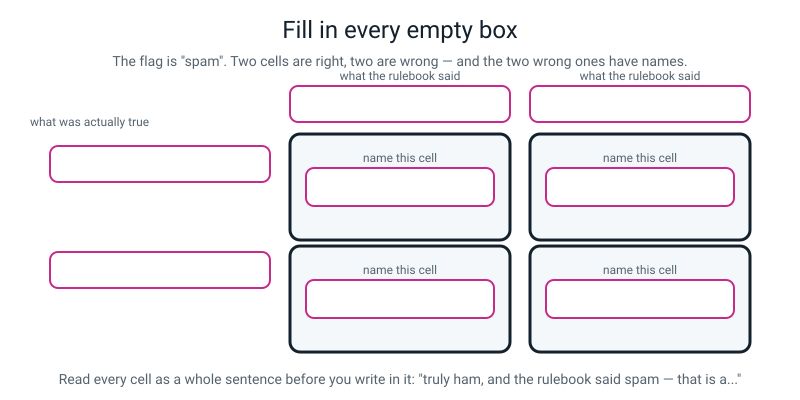
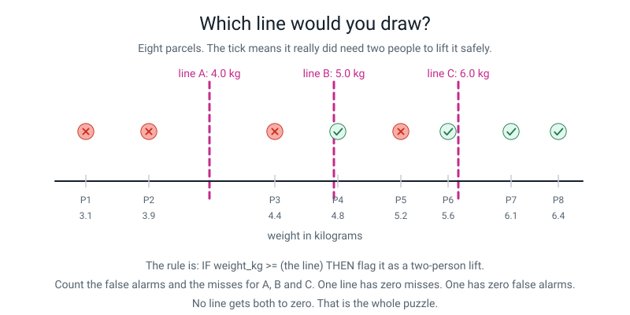
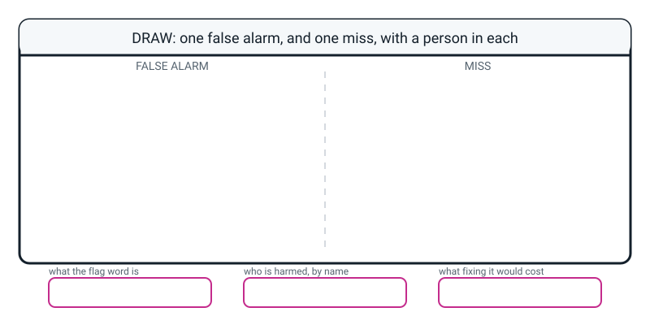

# Workbook — Week 8: Where Rules Break: Edge Cases and False Alarms

**Name:** ________________________________  **Date:** ______________

[📖 Read the chapter first](../student-guide/week-08.md) · [Course Home](../README.md)

---

## ✅ Warm-Up (5 min)

Five quick questions about **last week**. Try all five before you look anything up.

**W1.** Finish the definition: a **pattern** is something that repeats often enough that…

________________________________________________________________

**W2.** A rule has three parts. Name all three.

1. ________________________  2. ________________________  3. ________________________

**W3.** Mondays: 4 days, 4 late. Fridays: 4 days, 1 late. Write both **rates** as divisions and say which is the stronger pattern.

Monday: ______ ÷ ______ = ______ %   Friday: ______ ÷ ______ = ______ %

Stronger: ____________________

**W4.** True or false: *if no rule in a rulebook fires and there is no default, the rulebook answers "no".*

Circle: **TRUE** / **FALSE**. Why?

________________________________________________________________

**W5.** In the class bus table, the threshold in Rule 2 was `3` millimetres. Where did the number 3 come from?

________________________________________________________________

---

## ✍️ Practice Set A — Understand It

**A1. Fill in the blanks.**

An ____________________ is an example a rule gets wrong, usually right at its boundary.

A ____________________ is when the rule raises the flag and it shouldn't have — it says **yes** and the truth was **no**.

A ____________________ is when the rule stays quiet and it shouldn't have — it says **no** and the truth was **yes**.

The convention that you read rules top to bottom and the first one to match decides is called ____________________.

A piece of data with the correct answer written next to it is a ____________________.

---

**A2. Multiple choice.** A rule says `IF height_cm >= 140 THEN allow on the ride`. What is the fastest way to build an edge case for it?

&nbsp;&nbsp;&nbsp;(a) Find somebody 210 cm tall
&nbsp;&nbsp;&nbsp;(b) Find somebody 60 cm tall
&nbsp;&nbsp;&nbsp;(c) Find somebody 139 cm tall and somebody 141 cm tall
&nbsp;&nbsp;&nbsp;(d) Ask ten people what they think of the rule

Circle one. Then say **why** the other three don't do the job:

________________________________________________________________

________________________________________________________________

---

**A3. True or false — and explain.**

> "A false alarm is always better than a miss."

Circle one: **TRUE** / **FALSE**

Explain, and give **two** jobs where the answer is different:

________________________________________________________________

________________________________________________________________

________________________________________________________________

---

**A4. Match the pairs.** Write the letter of the meaning next to each word.

| Word | Letter | | | Meaning |
|---|---|---|---|---|
| edge case | ______ | | **A** | Says no when the truth was yes |
| false alarm | ______ | | **B** | Data with its correct answer attached |
| miss | ______ | | **C** | Something you *can* measure, used in place of what you actually care about |
| first match wins | ______ | | **D** | An example a rule gets wrong, right at its boundary |
| labelled example | ______ | | **E** | Says yes when the truth was no |
| stand-in | ______ | | **F** | Read top to bottom; the first rule that matches decides |

---

**A5. Label the diagram.**

Eight empty boxes: two column headings, two row headings, and the four cells. **The flag is "spam".**


*Figure W8.1 — The same grid you filled in class, with everything taken off.*

**Bonus:** two of the four cells are the error cells. Which two, and what are their names?

________________________________________________________________

---

**A6. Say the flag.** For each job, write which answer counts as **raising the flag** — the one that means "the alarm has gone off".

| The job | The flag is... |
|---|---|
| Spam filter | |
| Smoke detector | |
| The ride's height sign | |
| Your phone's face unlock | |
| A shop's security tag at the door | |
| A school rule that phones home about lateness | |

Why does getting the flag wrong ruin everything you write down afterwards?

________________________________________________________________

---

## ✍️ Practice Set B — Use It

**B1. The parcel rule.** A courier's rule is `IF weight_kg >= 5 THEN charge extra postage`. Eight parcels went out today, and later somebody checked which ones genuinely needed two people to carry.

| # | weight_kg | rule says | truly needed two people? |
|---|---|---|---|
| P1 | 3.1 | no extra | no |
| P2 | 3.9 | no extra | no |
| P3 | 4.4 | no extra | no |
| P4 | 4.8 | no extra | **YES** |
| P5 | 5.2 | extra | **no** |
| P6 | 5.6 | extra | YES |
| P7 | 6.1 | extra | YES |
| P8 | 6.4 | extra | YES |

(a) **The flag is:** ____________________

(b) Fill the grid.

|  | Rule charged extra (flag raised) | Rule didn't (no flag) |
|---|---|---|
| **Truly needed two people** | ✅ caught: | ❌ **MISS**: |
| **Didn't need two people** | ❌ **FALSE ALARM**: | ✅ fine: |

(c) Score: ______ out of 8. False alarms: ______. Misses: ______.

(d) Build the edge case: name the two parcels that sit closest to the threshold on opposite sides.

______ and ______ — they are ______ kg apart, and they get opposite treatment.

---

**B2. Here is a situation — what goes wrong, and why?**

> Ravi's rulebook is:
> ```
> RULE 1:  IF the message has 30 or more characters   THEN spam
> RULE 2:  IF the message contains "?"                THEN ham
> DEFAULT: OTHERWISE                                  THEN ham
> ```
> His friend sends: `Are you free on Saturday afternoon?` — 35 characters, and it has a question mark.

(a) Which rule fires **first**? ____________________

(b) What does the rulebook answer? ____________________ Is it right? ____________________

(c) Ravi's Rule 2 was written specifically to protect messages like this one. Why did it not help?

________________________________________________________________

(d) What is the smallest change that fixes it, **without deleting or rewriting either rule**?

________________________________________________________________

(e) After that change, what happens to `You have been selected for a reward, click the link?` — a 52-character scam ending in a question mark?

________________________________________________________________

---

**B3. Here is a situation — what goes wrong, and why?**

> A school buys an app that flags essays as "possibly copied". It is set very strict, because the school does not want any cheating to get through. In the first term it flags 40 essays. 34 of them turn out to be honest students.

(a) Which error is the app making a lot of? ____________________

(b) Name the specific person harmed, and say what it costs them:

________________________________________________________________

(c) The school says "but it's better to be safe". What is the flaw in that sentence here?

________________________________________________________________

________________________________________________________________

(d) If the school loosens the setting, what will happen — and who pays *then*?

________________________________________________________________

---

**B4. Move the threshold and predict.** A spam rule says `IF the message has 30 or more characters THEN spam`.

Fill in what happens to each error type. Write **more**, **fewer** or **about the same** in every box.

| The change | False alarms | Misses | Total mistakes |
|---|---|---|---|
| Loosen it to 60 characters | | | |
| Leave it at 30 | (that's the baseline) | (baseline) | (baseline) |
| Tighten it to 15 characters | | | |

Now write the single sentence this table is trying to teach you:

________________________________________________________________

---

**B5. Mark somebody else's work.** Another student was asked to sharpen a vague rule and give an edge case. Here is what they handed in. Find **three** faults.

```
VAGUE RULE:   "If the photo is blurry, reject it."

SHARPENED:    IF the photo looks a bit fuzzy THEN reject it
WHERE THE NUMBER CAME FROM:  (blank)
MY EDGE CASE: a photo of a completely black wall
```

| Fault | Why it's a fault | The fix |
|---|---|---|
| | | |
| | | |
| | | |

Their edge case is a real awkward case, but it is **not** an edge case for their rule. Why not?

________________________________________________________________

---

## 🧩 Puzzle of the Week

### Three Thresholds, One Parcel Belt


*Figure W8.2 — The same eight parcels from B1, with three candidate lines drawn on.*

The rule is `IF weight_kg >= (the line) THEN flag it as a two-person lift`.

**P1.** Fill in the whole table. Use the eight parcels from B1.

| Line | Which parcels get flagged | False alarms | Misses | Score out of 8 |
|---|---|---|---|---|
| **A — 4.0 kg** | | | | |
| **B — 5.0 kg** | | | | |
| **C — 6.0 kg** | | | | |

**P2.** Which line has **zero misses**? ____________________

**P3.** Which line has **zero false alarms**? ____________________

**P4.** Which line has the **best score**? ____________________

**P5.** Is the best-scoring line the one you would choose? The flag means "warn the driver that this needs two people to lift". Argue it in two or three sentences, and name who gets hurt by each choice.

________________________________________________________________

________________________________________________________________

________________________________________________________________

**P6.** Here is the puzzle's real question. **Is there any line at all — including numbers not on the picture — that gets both false alarms and misses to zero?** Try it. Then explain what you found.

________________________________________________________________

________________________________________________________________

---

## 🤔 Think Deeper

**T1.** Somebody chose the threshold on the spam filter that handles your messages. They did it in a meeting, once, probably years ago, and they did not tell you.

Write a paragraph about that. Which error did they choose to have more of, and how would you find out? Who else is using the same setting — and did anybody ask *them*? Is there any way you could ever discover a message you never received? And finish on this: **is it possible to build a spam filter that lets every single user choose their own setting, and what would go wrong if you did?**

________________________________________________________________

________________________________________________________________

________________________________________________________________

________________________________________________________________

________________________________________________________________

________________________________________________________________

---

**T2.** In class, a rulebook that scored **10 out of 10** scored **1 out of 5** four minutes later, because the five new messages were written *after* somebody had read the rules.

Write a paragraph about whether that was fair. Was it a **test** or an **attack**? Is there a difference? Who, in real life, writes messages specifically designed to get around a spam filter — and how does that change your answer? And the honest last bit: **if the breakers were unfair, what would a fair set of five messages have looked like, and would it have taught you anything?**

________________________________________________________________

________________________________________________________________

________________________________________________________________

________________________________________________________________

________________________________________________________________

---

## 🛠️ Build It

### Page 8.3 — The 138 centimetre argument, both sides

You were the one turned away, so you have the easy half. Write the **ride operator's** side *properly* — their best possible argument, in their own words. Not a straw man. Not a cartoon villain. If your version of them sounds stupid, you have not done the job.

**The ride operator's best argument** (aim for four or five sentences):

________________________________________________________________

________________________________________________________________

________________________________________________________________

________________________________________________________________

________________________________________________________________

**The fourteen-year-old's best argument** (four or five sentences):

________________________________________________________________

________________________________________________________________

________________________________________________________________

________________________________________________________________

________________________________________________________________

**Is there any rule that would have been fair to both of you?** One honest sentence.

________________________________________________________________

________________________________________________________________

**Now: who pays?** Name a *person* each time, not "people".

| The sign says | Who pays, and what it costs them |
|---|---|
| **140 cm** | |
| **130 cm** | |

**One of those two costs is small, frequent and visible. The other is rare, severe and hidden.** Which is which, and what does that tell you about how safety rules get set?

________________________________________________________________

________________________________________________________________

---

### Page 8.4 — Sharpen five vague rules

**Step checklist for every single one. Tick all three before you move on.**

- [ ] Contains a **number** or an **exact match**. No adjectives. Ever.
- [ ] One sentence on **where the number came from.** *"I made it up, it seemed about right"* is honest and acceptable — and much better than pretending.
- [ ] **One edge case your new rule creates**, built by stepping one unit either side of your own threshold.

**(a) "If the email looks dodgy, mark it as spam."**

```
SHARPENED:  IF ____________________________________________ THEN spam

WHERE MY NUMBER CAME FROM: ______________________________________

MY EDGE CASE: ___________________________________________________

Is that edge case a FALSE ALARM or a MISS?  ______________
```

**(b) "If the student is often late, phone home."**

```
SHARPENED:  IF ____________________________________________ THEN phone home

WHERE MY NUMBER CAME FROM: ______________________________________

MY EDGE CASE: ___________________________________________________

Is that edge case a FALSE ALARM or a MISS?  ______________
```

**(c) "If the photo is blurry, reject it."**

```
SHARPENED:  IF ____________________________________________ THEN reject

WHERE MY NUMBER CAME FROM: ______________________________________

MY EDGE CASE: ___________________________________________________

Is that edge case a FALSE ALARM or a MISS?  ______________
```

**(d) "If the parcel is heavy, charge extra."**

```
SHARPENED:  IF ____________________________________________ THEN charge extra

WHERE MY NUMBER CAME FROM: ______________________________________

MY EDGE CASE: ___________________________________________________

Is that edge case a FALSE ALARM or a MISS?  ______________
```

**(e) "If the video is too long, don't watch it."**

```
SHARPENED:  IF ____________________________________________ THEN don't watch

WHERE MY NUMBER CAME FROM: ______________________________________

MY EDGE CASE: ___________________________________________________

Is that edge case a FALSE ALARM or a MISS?  ______________
```

**Last question, and it is the interesting one.** Which of your five rules has **two** thresholds in it? What does that do to the number of edges it has?

________________________________________________________________

---

### Page 8.5 — And leave the envelope alone

- [ ] The sealed envelope is still sealed
- [ ] I have not opened it, held it up to the light, or asked anybody what is in it
- [ ] My rulebook has not been changed since the lesson

**Why does it matter?** One sentence, in your own words:

________________________________________________________________

---

## 🎨 Draw It

Draw **one false alarm and one miss**, side by side, with a **person** in each. Then fill in the three boxes underneath.


*Figure W8.3 — Your page.*

> **What a good answer might look like:** on the left, a phone showing a junk folder with one message in it reading *"I MADE THE TEAM!!"*, and a friend standing next to it looking hopeful, with a speech bubble saying *"did you get my message?"* Labelled **FALSE ALARM**. On the right, the same phone showing an inbox with a polite message reading *"Verify your account now"*, and a grandmother reading it, labelled **MISS**. In the three boxes: **the flag** — "spam"; **who is harmed** — "my friend Aisha, who thinks I ignored her, and Nani, who might lose money"; **what fixing it costs** — "if I loosen the filter to save Aisha's message, more scams reach Nani."
>
> **What a weak answer looks like:** two phones with crosses drawn on them and the words "wrong" and "also wrong". That has no people in it, so it cannot show the thing this week is about — **the two errors are only different because different people pay.**

---

## 📊 Self-Check

| I can… | 😀 got it | 🙂 nearly | 😕 not yet |
|---|---|---|---|
| Build an edge case for any rule by stepping either side of its threshold | ☐ | ☐ | ☐ |
| Tell a **false alarm** apart from a **miss**, and name who is harmed by each | ☐ | ☐ | ☐ |
| Say the **flag** out loud before I use those two words | ☐ | ☐ | ☐ |
| Fill a two-by-two grid and read the two error cells off it separately | ☐ | ☐ | ☐ |
| Sharpen a vague rule into a condition with a real number in it | ☐ | ☐ | ☐ |
| Explain why tightening a rule cannot remove mistakes, only swap them | ☐ | ☐ | ☐ |
| Explain why every rule has edge cases, using the word **stand-in** | ☐ | ☐ | ☐ |

One thing I'd like explained again:

________________________________________________________________

---

## ✅ Answers

<details>
<summary>Check your answers</summary>

### Warm-Up

**W1.** …**betting on it beats guessing.** ("It happens a lot" is not enough — the bar is a comparison, and you have to work out what guessing scores first.)

**W2.** The **condition** (the part after IF) · the **threshold** (the cut-off number inside the condition) · the **action** (the answer it gives).

**W3.** Monday: 4 ÷ 4 = **100%.** Friday: 1 ÷ 4 = **25%.** **Monday** is much stronger — a 75-point gap. Betting "late" every Monday wins four times out of four; betting "late" every Friday loses three times out of four.

**W4.** **FALSE.** It answers **nothing at all** — not "no", not "on time", not a blank meaning no. It simply has no answer, and a machine handed no answer either stops or passes nothing on to the next program, where something breaks in a place nobody can trace.

**W5.** **A human made it up, inside a gap.** The rainy days measured 4, 5, 6 and 9 mm; the dry days measured 0, 1 and 2. Nothing measured 3. So any threshold from 3 to 4 fits the data identically, and 3 was picked because it is tidy. **The data gave a gap; a person turned the gap into a number.**

---

### Practice Set A

**A1.** **edge case** · **false alarm** · **miss** · **first match wins** · **labelled example**.

**A2.** **(c).**

- **(a) 210 cm** — the rule gets that one right, easily and correctly. Nothing to learn.
- **(b) 60 cm** — same problem, other end. Also correct.
- **(d) Asking ten people** — collects opinions about the rule, not examples the rule gets wrong.
- **(c)** is right because **139 and 141 sit either side of the threshold**, and there is no real difference between those two people. That is exactly where a rule stops agreeing with reality. **Edge cases live at the boundary, not at the extremes.**

**A3.** **FALSE.**

It depends entirely on who gets hurt and how badly. Two jobs where the answer flips:

- **A spam filter:** the false alarm is worse. You can delete a scam in two seconds; you can never read a message you did not know arrived.
- **A smoke detector:** the miss is catastrophically worse. A false alarm shrieks during toast. A miss means the house burns down.

A third, and it is the most interesting: **your phone's face unlock.** The flag is "this is the owner". A miss just makes you type your code. A false alarm unlocks your phone for your brother. So here you avoid the **false alarm** — the *opposite* of the spam answer, with identical maths.

**A4.** edge case = **D** · false alarm = **E** · miss = **A** · first match wins = **F** · labelled example = **B** · stand-in = **C**.

**A5.**

- **Column headings:** "the rulebook said **spam**" and "the rulebook said **ham**".
- **Row headings:** "**truly spam**" and "**truly ham**".
- **Top-left cell:** ✅ **caught it** — a scam correctly blocked.
- **Top-right cell:** ❌ **MISS** — truly spam, called ham. A scam sitting in your inbox.
- **Bottom-left cell:** ❌ **FALSE ALARM** — truly ham, called spam. Your friend's message in the junk bin.
- **Bottom-right cell:** ✅ **fine** — a real message left alone.

**Bonus:** the two error cells are **top-right (miss)** and **bottom-left (false alarm)**. The two correct cells sit on the other diagonal.

*Common mistake:* filling the grid in **transposed** — truth across the top, prediction down the side. The mechanical fix that works every time: **write the flag word on the grid first**, then read each cell out as a full sentence — *"truly ham, and the rulebook said spam: that's the friend in the bin."* Never write in a cell without saying its sentence.

**A6.**

| The job | The flag |
|---|---|
| Spam filter | "this is spam" |
| Smoke detector | "there is a fire" |
| The ride's height sign | "refuse this person — they are unsafe" |
| Your phone's face unlock | "this is the owner" |
| A shop's security tag | "this person is carrying something unpaid for" |
| The lateness rule | "phone home — something may be wrong" |

**Why it matters:** if you get the flag backwards, **false alarms and misses swap places**, and every count, every grid and every "which is worse" argument you write afterwards is inverted. It is the single most common mistake in the whole week, and four seconds of saying the flag out loud prevents all of it.

---

### Practice Set B

**B1 — the parcel rule.**

(a) **The flag is "charge extra"** — that is the rule's alarm going off, i.e. "this one is heavy enough to need special handling."

(b)

|  | Rule charged extra | Rule didn't |
|---|---|---|
| **Truly needed two people** | ✅ caught: **P6, P7, P8** (3) | ❌ **MISS: P4** (1) |
| **Didn't need two people** | ❌ **FALSE ALARM: P5** (1) | ✅ fine: **P1, P2, P3** (3) |

(c) **Score: 6 out of 8.** False alarms: **1** (P5). Misses: **1** (P4).

(d) **P4 (4.8 kg) and P5 (5.2 kg)** — they are **0.4 kg** apart, which is roughly the weight of a paperback, and one is charged extra and the other isn't. **Both of them are also the two rows the rule gets wrong**, which is not a coincidence: the errors cluster at the boundary because that is where the stand-in stops agreeing with the truth.

**B2 — Ravi's rulebook.**

(a) **RULE 1.** The message is 35 characters, which is 30 or more, so Rule 1 matches — and first match wins.

(b) It answers **spam.** That is **wrong** — the message is a friend asking about Saturday. A **false alarm.**

(c) Because Rule 2 **never gets a turn.** It is not outvoted, not overruled: it is never read. The machine stopped at Rule 1 and went no further, and the question mark that Rule 2 was watching for was never even looked at.

(d) **Swap the order — move Rule 2 above Rule 1.** Not one word of either rule changes. Now the question mark is checked first, Rule 2 fires, and the message is correctly called ham.

> **This is the whole point of first-match-wins.** A rule sitting below something that always catches its cases first is a **dead rule** — it exists, it looks reasonable, and it has never decided anything in its life.

(e) It comes out **ham** — which is **wrong**, and it is now a **miss**. The scam ends in a question mark, so the moved Rule 2 fires first and waves it straight through.

> **So the fix worked and also cost you something.** Ravi saved his friend's message and opened a hole that any scammer could walk through by adding one character. **Every patch is paid for somewhere**, and the only way to know where is to re-run the examples the old rule was protecting.

**B3 — the essay checker.**

(a) **False alarms**, in enormous numbers. 34 out of 40 flagged essays were honest.

(b) **A specific honest student** — say a girl who wrote her essay herself, is accused of copying, and has to prove she didn't. What it costs her: a formal accusation on her record, a meeting with her parents, and — worst of all — **she may not be believed**, because the app said so and the app sounds objective. An adult with a printout is very hard to argue with when you are eleven.

(c) The flaw is that **"safe" is doing two different jobs in one word.** Strict settings are safer *for the school's reputation* and much less safe *for honest students*. "Better to be safe" quietly assumes the only harm worth counting is cheating getting through — which means the 34 people who were harmed are not being counted at all. **You cannot say "better to be safe" until you have said safe for whom.**

(d) Loosening it means **more misses**: some genuine copying gets through. **Who pays then?** The students who did the work honestly and get the same mark as somebody who didn't, and — over time — everybody, because the qualification is worth a little less. That is a real cost. It is just a *diffuse* one, spread thinly, where the false alarm cost was concentrated on one frightened person.

> **There is no setting with no victim.** The only honest thing to do is name both victims, decide, and write down that you decided.

**B4 — moving the threshold.**

| The change | False alarms | Misses | Total mistakes |
|---|---|---|---|
| Loosen to 60 characters | **fewer** | **more** | about the same |
| Leave at 30 | baseline | baseline | baseline |
| Tighten to 15 characters | **more** | **fewer** | about the same |

**The sentence:** **you do not get to choose how many mistakes, only which kind.** Every threshold in the world is a position on that slider, and a person chose it — usually by deciding which error they could live with, and usually without writing down that a decision had been made at all.

**B5 — marking the sharpened rule.**

| Fault | Why it's a fault | The fix |
|---|---|---|
| `IF the photo looks a bit fuzzy` | Still an adjective. "A bit fuzzy" is not a number, and two people would disagree — which is the exact thing the exercise was asking them to remove | `IF the image is smaller than 400 x 400 pixels OR more than 60% of pixels are pure black or pure white THEN reject` |
| **"Where the number came from" is blank** | There is no number, so there is nothing to explain — and the blank hides that fact rather than admitting it | Write the origin: *"400 x 400 is about where a photo starts to look small on a laptop screen"* — or, honestly, *"I made it up"* |
| The edge case does not test the rule's boundary | A black wall is an awkward *photo*, but it is not sitting either side of any threshold, because the rule has no threshold to sit beside | Build it from the number: a photo at **401 x 401** pixels (accepted) against one at **399 x 399** (rejected) — indistinguishable to any human eye |

**Why the black wall isn't an edge case for their rule:** an edge case is an example the rule gets wrong **at its boundary**. Their rule has no boundary, so nothing can be near it. Once the rule *does* have a number in it, the black wall becomes something more interesting — it is a case where the **stand-in itself has failed**, like the mouldy apple with a small bruise. That is a real and harder problem, and it cannot be fixed by moving any threshold.

---

### Puzzle of the Week

**P1.** The eight parcels, with the truth: P1 3.1 no · P2 3.9 no · P3 4.4 no · P4 4.8 **YES** · P5 5.2 no · P6 5.6 YES · P7 6.1 YES · P8 6.4 YES.

| Line | Flagged | False alarms | Misses | Score |
|---|---|---|---|---|
| **A — 4.0** | P3, P4, P5, P6, P7, P8 | **2** (P3, P5) | **0** | **6 of 8** |
| **B — 5.0** | P5, P6, P7, P8 | **1** (P5) | **1** (P4) | **6 of 8** |
| **C — 6.0** | P7, P8 | **0** | **2** (P4, P6) | **6 of 8** |

Work one through slowly, line A, so you can check the others. At 4.0 kg, everything from P3 upwards gets flagged. P3 (4.4, didn't need two people) → false alarm. P4 (4.8, YES) → correctly flagged. P5 (5.2, no) → false alarm. P6, P7, P8 all YES → correctly flagged. P1 and P2 unflagged and correctly so. Two wrong, six right.

**P2.** **Line A (4.0 kg)** — zero misses. Every parcel that genuinely needed two people got flagged.

**P3.** **Line C (6.0 kg)** — zero false alarms. Nobody was warned unnecessarily.

**P4.** **All three tie at 6 out of 8.** That is deliberate, and it is the most useful thing in the puzzle: **the score cannot choose for you.** Three completely different policies, three completely different sets of victims, identical accuracy.

**P5.** A defensible answer must argue about **harm**, not about the score. The strongest case is for **line A**:

> The flag means "warn the driver this needs two people". A false alarm costs the driver about ten seconds of mild annoyance — they check, decide it's fine, and lift it alone. A miss means somebody lifts an awkward parcel on their own with no warning, and (in this made-up story) hurts their back. Two seconds of annoyance versus a back injury is not a close comparison, so I would take line A and accept the two false alarms.

A good answer for line C also exists, if it names its cost honestly: *"drivers who get warned about parcels that don't need it will stop reading the warnings, and then the warnings are worthless"* — which is exactly the smoke-alarm-battery problem. **Annoying errors cause dangerous ones**, and noticing that is excellent work.

An answer that just writes "A" or "C" with no reason earns nothing, because the whole puzzle is that the numbers do not decide.

**P6.** **No line works.** Here is the proof, and it is short.

Sort them: 3.1 no · 3.9 no · 4.4 no · **4.8 YES** · **5.2 no** · 5.6 YES · 6.1 YES · 6.4 YES.

Look at P4 (4.8, YES) and P5 (5.2, no). To catch P4 you need the line at **4.8 or lower**. But any line at 4.8 or lower also flags P5, which does not need flagging. **The two are the wrong way round**, so no single cut on the weight line can separate them.

> **This is the deepest idea in the puzzle.** It is not that we failed to find the right number. **There is no right number.** Weight is a **stand-in** for "does this need two people", and for P4 and P5 the stand-in has the order backwards — perhaps P4 is a big awkward box and P5 is a dense little one. To separate them you need a **different measurement** (size? shape? how it's packed?), which means a bigger, slower, more expensive system. Moving the threshold cannot help you, no matter how carefully you do it.

---

### Think Deeper

**T1. Model answer:**

> Somebody at the company chose it, and the choice is invisible from outside. The only way I could work out which error they preferred is by experiment: send myself borderline messages and see which folder they land in, or go through my own junk folder and count how many real messages are in it. That second one is easy and most people have never done it.
>
> Everyone using that app has the same setting — including my grandmother, who is far more likely to be harmed by a **miss** than I am, and who was never asked. So the choice was made once, by a small group, on behalf of millions of people with completely different amounts to lose.
>
> And there is no way at all to discover a message I never received. That asymmetry is the whole problem: **misses are visible and false alarms are invisible**, so the pressure on the company is always to be stricter than is good for me.
>
> Could every user choose their own setting? Technically yes, and some apps do let you. What goes wrong is that most people never open the setting, so the default still decides for almost everybody — and the people most at risk from a miss are exactly the people least likely to go looking for a slider. **Giving people a choice they will not use is not the same as asking them.**

*Full credit needs:* naming a way to **find out** · noticing that **other people share the setting** and were not asked · the point that **you cannot see a false alarm** · and some real difficulty with the "let everybody choose" fix.

**T2. Model answer:**

> The breakers were an **attack**, not a test, and those really are different things. A test is a set of examples chosen before anybody saw the rules. An attack is examples chosen *after*, specifically to walk around them. My 1 out of 5 measures how easy my rulebook is to defeat by somebody who has read it — which is a real and useful thing to know, but it is not "how well does my rulebook work".
>
> And the reason the attack is fair anyway is that **somebody does this for a living.** Real scammers test filters, find the boundary, and write the next message just outside it — which is partly why `Your parcel is delayed.` looks so ordinary. It looks ordinary partly *because* rulebooks like mine exist. So a rulebook that only survives examples nobody chose adversarially is not much use in a world where the other side is trying.
>
> A fair set of five would have been five ordinary messages picked at random from a real phone before anybody wrote a rule — and honestly, it probably would have scored 4 out of 5 and taught me nothing, because most messages are nowhere near the boundary. **The interesting messages are all near the line, and choosing interesting ones is what made it feel unfair.**

*Full credit needs:* the **test versus attack** distinction · that the attack is realistic because **scammers do it** · and an honest admission that a fair five would have scored higher and taught less.

---

### Build It

**Page 8.3 — the 138 cm write-up.**

**The ride operator's best argument.** Full credit needs it to be genuinely reasonable — if it sounds stupid, you have written a straw man and missed the point.

> "The harness on this ride was tested and certified at 140 centimetres. I did not choose that number and I cannot change it. If I let a 138 cm rider on because she looks strong, then tomorrow I have to decide about 137, and 135, and a child whose parent insists she is nearly 140 — and I will be making a safety judgement in four seconds with a queue of eighty people behind me. I am not qualified to do that and neither is anybody else at this gate. The line has to be somewhere, it has to be the same for everyone, and it has to be something I can measure in three seconds. Two centimetres is exactly where I have to stop, and it is not personal."

**The fourteen-year-old's best argument.**

> "I am fourteen years old. I am stronger than most of the people you just let on, and I understand the safety instructions better than the eight-year-olds in front of me. The number 140 is not measuring whether I am safe — it is measuring my height, and it is using my height to *guess* at my safety, and for me that guess is simply wrong. You can see with your own eyes that it is wrong. The rule was written for an average person and I am not average, and being punished for that is not the same thing as being kept safe."

**"Is there a rule fair to both?"** Full credit **requires** accepting that there is no perfect one, and then proposing something honest with its cost named:

> "There isn't a perfect rule. You could add a second route in — '140 cm **or** aged 12 and over' — which would have let me on. But then you need to know everybody's age, which means asking, which means being told the truth, which means somebody checking, and the edge case just moves: now it's the eleven-year-old who's 139 cm. Every fix trades one edge case for a different edge case plus more complexity. Sometimes worth it. Never free."

An answer that claims to have solved it completely has missed the lesson.

**Who pays:**

| The sign says | Who pays |
|---|---|
| **140 cm** | The 138 cm fourteen-year-old — a ruined afternoon, in public, in front of eighty people. Paid **immediately and visibly.** |
| **130 cm** | The 141 cm eight-year-old who gets on and is hurt. Paid **rarely, terribly, and invisibly until it happens.** |

**The marking point:** a *specific person* both times. "People who are too short" earns half credit.

**And the asymmetry question.** The 140 cost is **small, frequent and visible**. The 130 cost is **rare, severe and hidden**. That asymmetry is exactly why safety rules are set tight: you are trading a large number of small, recoverable, obvious harms against a small number of catastrophic, invisible ones — and a disappointed rider recovers by tomorrow while an injured child may not. **Saying that sentence is the best possible answer on this page.**

**Page 8.4 — sharpening the five rules.** Model answers. Yours will differ; check it against the three requirements, not against these words.

**(a) the dodgy email**

> **Sharpened:** `IF the sender is not in my contacts AND the message contains 2 or more links THEN spam`
> **Where the numbers came from:** ordinary personal messages almost never contain two links; scams usually do. Two is a guess sitting in that gap.
> **Edge case:** a real message from a **new classmate** sending you two links for a group project. Not in contacts, two links, straight to the junk bin. → **FALSE ALARM.**

**(b) the often-late student**

> **Sharpened:** `IF late 3 or more times in the last 20 school days THEN phone home`
> **Where the numbers came from:** three separates a bad week from a habit; twenty days is about a month of school, so the count cannot accumulate forever.
> **Edge case:** a student late exactly **twice**, both times because she takes her little brother to a different school first. Nobody phones, nobody finds out, and she is the one who most needed the call. → **MISS.**

**(c) the blurry photo**

> **Sharpened:** `IF the image is smaller than 400 x 400 pixels OR more than 60% of pixels are pure black or pure white THEN reject it`
> **Where the numbers came from:** 400 x 400 is about where a photo starts to look small on a laptop screen (a guess, not a standard); the black/white check catches photos taken with the lens covered or straight into a light.
> **Edge case:** a deliberately high-contrast black-and-white photograph — an excellent photo, rejected by the second clause. → **FALSE ALARM.**

**(d) the heavy parcel**

> **Sharpened:** `IF weight_kg >= 5 THEN charge extra`
> **Where the number came from:** the courier's own van-loading guidance says one person shouldn't repeatedly lift more than 5 kg. (In this lesson the 5 kg is an invented teaching number; real manual-handling guidance allows much heavier single-person lifts. If a number really is looked up, say so; it is rarer than you'd think and it's worth more.)
> **Edge case:** a 4.9 kg parcel goes free and a 5.0 kg parcel costs more. The two are identical to anybody carrying them. → **FALSE ALARM** for the 5.0 kg one (charged when it didn't need to be), and a **pure boundary case** found by stepping either side.

**(e) the too-long video**

> **Sharpened:** `IF duration_minutes > 20 AND minutes_until_bedtime < 40 THEN don't watch it`
> **Where the numbers came from:** both made up, honestly — 20 minutes is about one episode, and 40 leaves time to clean your teeth. A different person would pick different numbers and would not be wrong.
> **Edge case:** a 21-minute video with 45 minutes left is allowed. A 19-minute video with 35 minutes left is allowed. But a 21-minute video with **39** minutes left is banned — one minute either way on either number flips it. → **FALSE ALARM.**

**The last question: which rule has two thresholds?** **(e)**, with `20` and `40`. And (a) has two conditions but only one number, so (e) is the clean answer.

**What two thresholds does to the edges:** it gives the rule **two separate edges**, and cases can sit near either one — or near both at once. Instead of a line you now have a corner, and corners have more ways to be just-barely-on-the-wrong-side. **More thresholds means more edges, not fewer**, which is the first quiet hint of what happens in Week 10 when somebody tries to fix everything by adding conditions.

**Page 8.5 — the envelope.** A good sentence:

> "If I look at those ten messages, I might change my rules to fit them without even meaning to — and then scoring my rulebook on them wouldn't measure anything, because they'd have helped build it."

---

### Draw It

There is no single right drawing. A strong answer has:

- **a person in each panel**, not just a device — the two errors are only different because different people pay
- **the flag word written down somewhere**, because without it the two panels are interchangeable
- **something the person cannot see** in the false-alarm panel. That invisibility is the point: you never find out about a message you never received.
- **a cost written on the third box that hurts** — "more scams reach Nani" is a real cost; "it would be a bit worse" is not

If your two panels could be swapped over without the drawing making less sense, you have drawn "wrong" twice rather than two different kinds of wrong. Go back and put a different person in each one.
</details>

---

[⬅ Week 7 workbook](week-07.md) · [📖 Week 8 chapter](../student-guide/week-08.md) · [Course Home](../README.md) · [Week 9 workbook ➡](week-09.md) · [Glossary](../../glossary.md)
