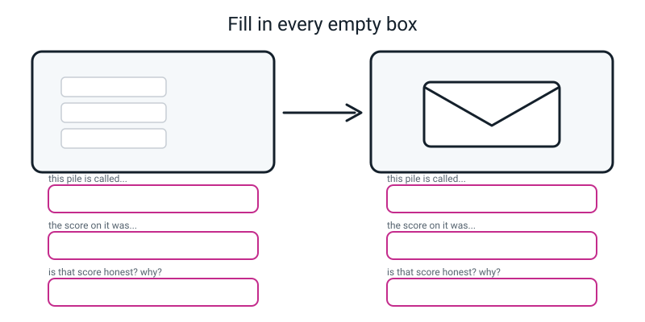
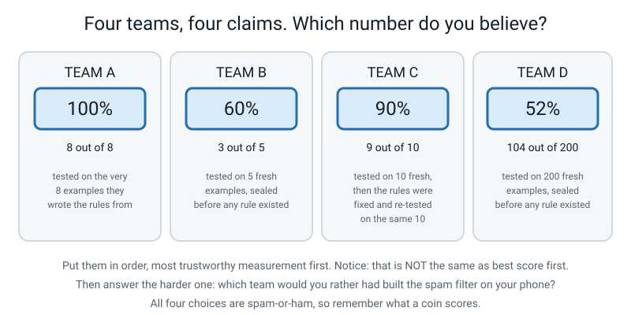
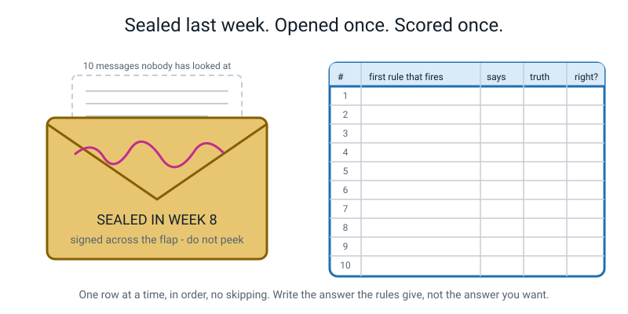
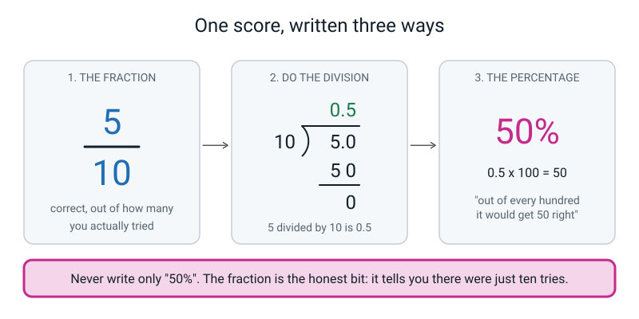
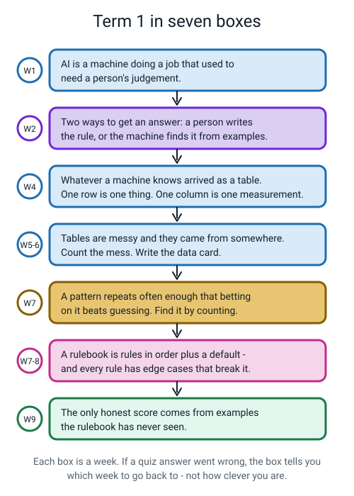
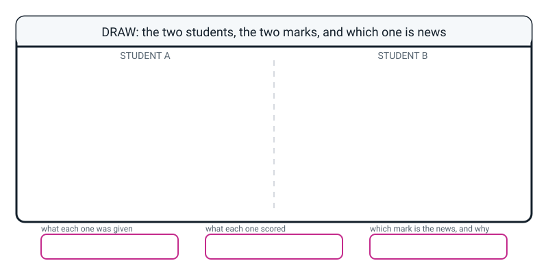

# Workbook — Week 9: Term 1 Checkpoint — Rules on Trial

**Name:** ________________________________  **Date:** ______________

[📖 Read the chapter first](../student-guide/week-09.md) · [Course Home](../README.md)

---

## ✅ Warm-Up (5 min)

Five quick questions about **last week**. Try all five before you look anything up.

**W1.** What is the difference between a **false alarm** and a **miss**?

________________________________________________________________

________________________________________________________________

**W2.** A rule says `IF bruise_cm2 >= 4 THEN bin the apple`. Build an edge case in ten seconds.

________________________________________________________________

**W3.** Finish the sentence: **first match wins** means…

________________________________________________________________

**W4.** True or false: *if I tighten a rule enough, I can get both false alarms and misses to zero.*

Circle: **TRUE** / **FALSE**. Why?

________________________________________________________________

**W5.** Why must you say the **flag** out loud before you start filling in a two-by-two grid?

________________________________________________________________

---

## ✍️ Practice Set A — Understand It

**A1. Fill in the blanks.**

The labelled examples you looked at while building your rules are the ____________________ examples.

Labelled examples the rulebook has never seen, set aside before any rule existed, are the ____________________ examples.

____________________ is the number you got right divided by the number you tried.

Once you have used a set of examples to **decide** something, you can never use them to ____________________ anything again.

---

**A2. Accuracy, three ways.** Fill in every box. Show the division.

| Score | The fraction | The decimal (show the division) | The percentage |
|---|---|---|---|
| 5 right out of 10 | | | |
| 7 right out of 8 | | | |
| 3 right out of 5 | | | |
| 4 right out of 6 | | | |
| 13 right out of 14 | | | |

Which of the three columns is the only one that tells you **how many tries there were**? ____________________

---

**A3. True or false — and explain.**

> "My rulebook scored 100% on the ten messages I wrote it from, so it is a good rulebook."

Circle one: **TRUE** / **FALSE**

Explain using the two-students story:

________________________________________________________________

________________________________________________________________

________________________________________________________________

---

**A4. Match the pairs.** Write the letter of the meaning next to each word.

| Word | Letter | | | Meaning |
|---|---|---|---|---|
| training examples | ______ | | **A** | What a coin scores on a two-way choice |
| fresh examples | ______ | | **B** | Correct answers divided by total answers |
| accuracy | ______ | | **C** | The ones you studied while building your rules |
| 50% | ______ | | **D** | Using your test examples to decide what to fix |
| contaminating your test | ______ | | **E** | Set aside before any rule existed, scored once |

---

**A5. Label the diagram.**

Six empty boxes: what each pile is called, what each pile scored, and whether each score is honest.


*Figure W9.1 — The two piles from class, with everything taken off.*

**Bonus:** the arrow between the piles only points one way. What would go wrong if it pointed both ways?

________________________________________________________________

---

**A6. Sort them.** Tick one column for each score. Ask yourself: *could the examples it was measured on have shaped the rules?*

| The score | Honest — worth putting on a poster | Not honest — measured on its own answers |
|---|---|---|
| 10 out of 10, on the ten messages the rules were written from | ☐ | ☐ |
| 5 out of 10, on ten messages sealed in an envelope last week | ☐ | ☐ |
| 8 out of 10, after fixing the rules using those same ten | ☐ | ☐ |
| 2 out of 5, on five messages nobody had ever looked at | ☐ | ☐ |
| 19 out of 20 on a past paper you have already done twice | ☐ | ☐ |
| 14 out of 20 on a paper you opened for the first time | ☐ | ☐ |

Write the one-line test you used to sort them:

________________________________________________________________

---

## ✍️ Practice Set B — Use It

**B1. The smoothie stall.** A stall built this rule from eight training days: `IF temp_c >= 28 THEN predict "sells out"`, default `doesn't sell out`. On those eight days it scored **8 out of 8**.

Then six fresh days, recorded before the rule existed:

| # | temp_c | Rule says | Truth |
|---|---|---|---|
| F1 | 27 | | **SOLD OUT** |
| F2 | 30 | | SOLD OUT |
| F3 | 26 | | didn't |
| F4 | 29 | | **didn't** |
| F5 | 35 | | SOLD OUT |
| F6 | 23 | | didn't |

(a) Fill in the "Rule says" column, then mark each row ✓ or ✗.

(b) Fresh score: ______ out of 6 = ______ ÷ ______ = ______ = ______ %

(c) Training score: ______ %.  **The gap: ______ percentage points.**

(d) On those six fresh days, how many sold out and how many didn't? ______ and ______. So always saying the same thing would score ______ ÷ ______ = ______ %. **Does the rule beat that?** By how many points? ______

(e) Look at where the **two mistakes** sit compared with the threshold of 28. What do you notice, and which week does that idea come from?

________________________________________________________________

---

**B2. Here is a situation — what goes wrong, and why?**

> Kavya opens her sealed envelope, scores her rulebook, and gets 5 out of 10. She then changes two rules to fix the mistakes she just saw, re-scores on the **same ten**, and gets 9 out of 10. She writes on her poster: **"My spam filter is 90% accurate."**

(a) Is her 9 out of 10 arithmetic wrong? ____________________

(b) So what exactly *is* wrong with the poster?

________________________________________________________________

________________________________________________________________

(c) What is the name for what she did to those ten messages? ____________________

(d) What would she have to do to get a number she could honestly put on the poster?

________________________________________________________________

(e) Predict: will her honest score on brand-new messages be **above** 90%, **below** 90%, or **about** 90%? Why?

________________________________________________________________

---

**B3. Here is a situation — what goes wrong, and why?**

> A company announces a machine that spots a disease from a photo. Their press release says **"97% accurate"**. It does not say how many photos were tested, where they came from, or whether the machine was adjusted after seeing them. Hospitals buy it. In real use it performs badly and is withdrawn.

(a) Name **three** questions you would have asked before the hospitals bought it.

1. ________________________________________________________________
2. ________________________________________________________________
3. ________________________________________________________________

(b) The 97% was almost certainly a **true** number. How can a true number cause this much harm?

________________________________________________________________

________________________________________________________________

(c) Who paid for this, and how? Name a specific person.

________________________________________________________________

(d) Which of this week's two rules would have prevented the whole thing? Write it out.

________________________________________________________________

---

**B4. Which number would you rather have?** For each pair, circle the score you would **trust more as a measurement**, and say why. *(Careful — that is not the same question as "which is higher".)*

| Pair | Which do you trust more? | Why |
|---|---|---|
| 5 out of 10, or 45 out of 100? | | |
| 3 out of 3, or 80 out of 100? | | |
| 100% on training, or 55% on fresh? | | |

Now the harder version of the same question: for the **first** pair, which rulebook would you rather actually *use*, and is that the same answer?

________________________________________________________________

________________________________________________________________

---

**B5. Mark somebody else's work.** Here is a results page handed in by another student. Find **three** faults.

```
MY RULEBOOK RESULTS

Score on my ten messages:        100%
Score on the sealed ten:         50%   (but they were trick questions)
Score after I fixed the rules:   80%   (measured on the sealed ten)

CONCLUSION: my rulebook is 80% accurate and better than a coin.
```

| Fault | Why it's a fault | The fix |
|---|---|---|
| | | |
| | | |
| | | |

Which single number on that page is the **only** one worth anything, and why?

________________________________________________________________

---

## 🧩 Puzzle of the Week

### Four Score Cards


*Figure W9.2 — Four teams built a spam filter. Four claims.*

Here are the four claims written out. **All four are spam-or-ham, so remember what a coin scores.**

| Team | Claim | Fraction | How it was measured |
|---|---|---|---|
| **A** | 100% | 8 out of 8 | on the very 8 examples the rules were written from |
| **B** | 60% | 3 out of 5 | on 5 fresh examples, sealed before any rule existed |
| **C** | 90% | 9 out of 10 | tested on 10 fresh, then the rules were fixed and re-tested on the same 10 |
| **D** | 52% | 104 out of 200 | on 200 fresh examples, sealed before any rule existed |

**P1.** For each team, tick whether the number is a **trustworthy measurement**.

| Team | Trustworthy? | The one-line reason |
|---|---|---|
| A | ☐ yes ☐ no | |
| B | ☐ yes ☐ no | |
| C | ☐ yes ☐ no | |
| D | ☐ yes ☐ no | |

**P2.** Put them in order, **most trustworthy measurement first**. *(This is not the same as best score first.)*

1st: ______  2nd: ______  3rd: ______  4th: ______

**P3.** A coin scores 50% on a two-way choice. Which team's honest score is closest to a coin? ______

**P4.** Which team would you rather had built the spam filter on your phone? And here is the trap: **is that the same as your answer to P2?** Explain.

________________________________________________________________

________________________________________________________________

________________________________________________________________

**P5.** Team B's 3 out of 5 could easily have been 2 out of 5 or 4 out of 5 if a different five had been sealed. Work out what those would be as percentages:

2 out of 5 = ______ %   3 out of 5 = ______ %   4 out of 5 = ______ %

So team B's real answer sits somewhere in a band roughly ______ % to ______ % wide. Now do the same for team D: 103 out of 200 = ______ %, 105 out of 200 = ______ %.

**What does that comparison tell you about the bottom number of a fraction?**

________________________________________________________________

**P6.** Team C's 90% is the highest honest-sounding number on the page. Explain, in one sentence, why it is worth exactly as little as team A's 100%.

________________________________________________________________

---

## 🤔 Think Deeper

**T1.** Every score you wrote down between Week 4 and last week was measured on the examples you built the thing from.

Write a paragraph about that. Were those numbers **lies**? If not, what were they? Is there anything a training score genuinely does tell you? And finish on the hardest bit: **why do you think you predicted 8 or 9 out of 10 before the envelope was opened — when the only evidence you had was a number that could not be trusted?**

________________________________________________________________

________________________________________________________________

________________________________________________________________

________________________________________________________________

________________________________________________________________

________________________________________________________________

---

**T2.** "Ten messages isn't very many" is the best objection anybody makes to the 50%.

Write a paragraph taking that objection completely seriously. How wobbly is a score measured on ten things? What is the highest the true value could plausibly be? Then the crucial move: **does the objection get you back to 100%?** And finally, the practical bit — **what would it actually take to narrow the answer down, and why does almost nobody do it?**

________________________________________________________________

________________________________________________________________

________________________________________________________________

________________________________________________________________

________________________________________________________________

---

## 🛠️ Build It

### Page 9.1 — The Sealed Envelope Trial (do this in class)


*Figure W9.3 — The scoring sheet. Ten rows, filled in one at a time.*

**My prediction, written before anything was opened:** ______ out of 10.

**The four rules. Tick each one as you agree to it.**

- [ ] One row at a time, **in order**, no skipping
- [ ] Write the prediction **before** the truth is revealed
- [ ] **I am the computer, not the judge** — daft answers get written down
- [ ] **No changing the rules** for ten minutes. Fixes go in the margin.

**My rulebook, copied out exactly as it was last week:**

```
RULE 1:  IF ______________________________  THEN ______________
RULE 2:  IF ______________________________  THEN ______________
RULE 3:  IF ______________________________  THEN ______________
DEFAULT: OTHERWISE                          THEN ______________
```

**The scoring sheet:**

| # | message | First rule to fire | Says | Truth | ✓/✗ | false alarm or miss? |
|---|---|---|---|---|---|---|
| 11 | | | | | | |
| 12 | | | | | | |
| 13 | | | | | | |
| 14 | | | | | | |
| 15 | | | | | | |
| 16 | | | | | | |
| 17 | | | | | | |
| 18 | | | | | | |
| 19 | | | | | | |
| 20 | | | | | | |

**Totals:** correct ______ · false alarms ______ · misses ______ · scams correctly caught ______

**Fixes I thought of but did NOT apply** (margin notes — you will need these for page 9.5):

________________________________________________________________

________________________________________________________________

---

### Page 9.2 — Accuracy three ways, and the gap


*Figure W9.4 — Write all three, in this order, every time.*

**My fresh score, all three ways. Show the division.**

```
THE FRACTION       ______ / ______

THE DIVISION       ______________________________________________

                   ______________________________________________

THE PERCENTAGE     ______ x 100 = ______ %
```

**My training score from last week:** ______ out of ______ = ______ %

**The gap:** ______ % − ______ % = **______ percentage points**

**The bar chart.** Draw two bars on this grid — one for your training score, one for your fresh score — and arrow the drop.

```
100 ┤
    │
 75 ┤
    │
 50 ┤
    │
 25 ┤
    │
  0 ┼──────────────────────────────
       training        fresh
```

**The sentence the page wants** — three or four lines. Say which number is the honest one and why, and say what your fresh score means on a two-way choice. **Do not explain the drop away.**

________________________________________________________________

________________________________________________________________

________________________________________________________________

________________________________________________________________

---

### Page 9.3 — The Term 1 checkpoint quiz

**Closed book. Nothing on the desk but this and a pen.** If you do not know one, write "don't know" — that is genuinely more useful than a guess.

> **This is not a grade.** Beside every wrong answer, write the **week number** in the margin. The output of this page is a **list of weeks**, not a mark.

**1.** What makes something count as AI, rather than just a machine following orders? **[W1]**

________________________________________________________________

**2.** Is a pocket calculator AI? Yes or no, and give your reason. **[W1]**

________________________________________________________________

**3.** There are two ways to get a computer to answer a question. In one, a person writes the rule. In the other, what does the machine get instead? **[W2]**

________________________________________________________________

**4.** What is a labelled example? Give one. **[W2, W8]**

________________________________________________________________

**5.** In a table of data, what does one row represent? **[W4]**

________________________________________________________________

**6.** `bus_route_number` is a column full of numbers. Should you ever average it? Why? **[W5]**

________________________________________________________________

**7.** A sleep column has an empty box. Why must you not write 0 in it? **[W5]**

________________________________________________________________

**8.** Name two of the questions you should ask about where a dataset came from. **[W6]**

________________________________________________________________

**9.** Finish the definition: a pattern is something that repeats often enough that… **[W7]**

________________________________________________________________

**10.** Mondays: 3 days, 3 late. Not-Mondays: 11 days, 3 late. Which is the stronger pattern, and how do you know? **[W7]**

________________________________________________________________

**11.** What is the difference between a false alarm and a miss? Give a person who is harmed by each. **[W8]**

________________________________________________________________

**12.** Your rulebook scores 100% on the ten messages you wrote it from. Why does that number prove nothing? **[W9]**

________________________________________________________________

**Now gather the week numbers from the margin. This is the output of the whole page:**

```
GO BACK TO:  ________________________________________________

SOLID:       ________________________________________________
```

---

### Page 9.4 — Term 1 reflection sheet


*Figure W9.5 — Nine weeks, seven ideas, one page. Use it to jog your memory.*

**1. The weeks on my list from the quiz:** ______________________________

**2. The idea from Term 1 I am most sure about.** *(Write it as a sentence, not a topic. "Patterns" is weak. "You find patterns by counting, not by looking" is strong.)*

________________________________________________________________

________________________________________________________________

**3. The idea I would most like to go back to** — even if it wasn't on the quiz list:

________________________________________________________________

**4. A moment when something clicked.** *(Usually an activity: the 480 outlier, the Fresh Four, the two chargers one character apart, opening the envelope.)*

________________________________________________________________

________________________________________________________________

**5. Something I now don't trust that I used to.**

________________________________________________________________

________________________________________________________________

**6. What I want to build at the AI fair in Week 34.** *(Anything at all. Write it down and keep this page — you will read it again in Week 34.)*

________________________________________________________________

________________________________________________________________

---

### Page 9.5 — Fix your rulebook. Then test it honestly.

**Step checklist. Tick in order. Do NOT skip ahead — the last step only works if you do the others first.**

- [ ] Read my margin notes from page 9.1
- [ ] Written out my **fixed** rulebook in full, below
- [ ] **Written the date next to it, in pen**
- [ ] Re-scored the fixed rulebook on the **original ten training messages**, to find what broke
- [ ] **Only then** turned over to the five new messages
- [ ] Scored the five, all three ways, with the division shown
- [ ] Answered both sentences honestly

**My fixed rulebook (v2):**

```
DATE: ______________

RULE 1:  IF ______________________________  THEN ______________
RULE 2:  IF ______________________________  THEN ______________
RULE 3:  IF ______________________________  THEN ______________
DEFAULT: OTHERWISE                          THEN ______________
```

**What I changed, and why:**

| # | The change I made | Which mistake it was meant to fix |
|---|---|---|
| 1 | | |
| 2 | | |
| 3 | | |

**v2 re-scored on the ORIGINAL ten training messages** — this is where "what broke" shows up:

| # | v2 first rule to fire | Says | Truth | ✓/✗ | changed from v1? |
|---|---|---|---|---|---|
| 1 | | | spam | | |
| 2 | | | spam | | |
| 3 | | | spam | | |
| 4 | | | spam | | |
| 5 | | | spam | | |
| 6 | | | ham | | |
| 7 | | | ham | | |
| 8 | | | ham | | |
| 9 | | | ham | | |
| 10 | | | ham | | |

**Score on the original ten:** ______ out of 10. **Last week it was 10 out of 10.**

---

#### ⚠️ STOP. Do not read past this line until your fixed rulebook is written above and dated.

The five messages below are **fresh**. Nobody is watching. If you read them before you write your fix, you will get a lovely score, learn absolutely nothing, and nobody will be able to tell. That is called **contaminating your test set**, real researchers do it by accident, and it wrecks real studies.

**Fix first. Date it. Then turn over.**

---

**The five further fresh messages:**

| # | message | truth |
|---|---|---|
| 21 | `Want a free phone?` | spam |
| 22 | `see you at the gate at 8` | ham |
| 23 | `YOU HAVE WON A CAR!! Reply YES` | spam |
| 24 | `Can you send me the geography homework please` | ham |
| 25 | `Your account will be closed, verify now` | spam |

| # | chars | First rule to fire | Says | Truth | ✓/✗ | false alarm or miss? |
|---|---|---|---|---|---|---|
| 21 | | | | spam | | |
| 22 | | | | ham | | |
| 23 | | | | spam | | |
| 24 | | | | ham | | |
| 25 | | | | spam | | |

**My honest score on the five, all three ways:**

```
THE FRACTION       ______ / 5

THE DIVISION       ______________________________________________

THE PERCENTAGE     ______ x 100 = ______ %
```

**Two sentences. These are the ones I will read first.**

**Which fix helped?** Name the specific message that went from wrong to right.

________________________________________________________________

________________________________________________________________

**Which fix broke something that used to work?** Name the specific message that went from right to wrong. *(At least one will have. If you cannot find one, check the original ten again.)*

________________________________________________________________

________________________________________________________________

---

## 🎨 Draw It

Draw **the two students and their two marks** — Student A with the answer sheet, Student B with the sealed paper. Make it obvious which mark is the news. Then fill in the three boxes underneath.


*Figure W9.6 — Your page.*

> **What a good answer might look like:** on the left, Student A at a desk with an open answer sheet propped up in front of them, a big **10/10** above their head, and a small thought bubble saying *"I've seen all of these before"*. On the right, Student B with a folded paper still sealed, two signatures across the flap, a **5/10** above their head, and a thought bubble saying *"I've never seen any of these"*. Between them, an arrow pointing at B's mark labelled **THIS ONE IS THE NEWS**. In the three boxes: **what each was given** — "A got the answer sheet the night before; B got a sealed paper nobody had opened"; **what each scored** — "A: 10/10 = 100%. B: 5/10 = 50%"; **which is news** — "B's, because it's the only one that measured anything A didn't already know the answer to. And it's the lower mark."
>
> **What a weak answer looks like:** two stick figures, one with 10/10 and one with 5/10, and the caption "A did better". That is exactly backwards, and the drawing has not recorded the one fact that decides it — **what each student was allowed to look at beforehand.**

---

## 📊 Self-Check

| I can… | 😀 got it | 🙂 nearly | 😕 not yet |
|---|---|---|---|
| Explain why scoring a rulebook on its own training examples is cheating | ☐ | ☐ | ☐ |
| Compute accuracy as a fraction, a decimal and a percentage, showing the division | ☐ | ☐ | ☐ |
| Say why I must never write a percentage without its fraction | ☐ | ☐ | ☐ |
| Compare a training score with a fresh score and describe the gap **without excusing it** | ☐ | ☐ | ☐ |
| Say what 50% means on a two-way choice | ☐ | ☐ | ☐ |
| Explain why fixing my rules using the sealed ten uses them up | ☐ | ☐ | ☐ |
| Recall the Term 1 vocabulary — AI, rules, data, tables, patterns, rulebooks — without notes | ☐ | ☐ | ☐ |

One thing I'd like explained again:

________________________________________________________________

---

## ✅ Answers

<details>
<summary>Check your answers</summary>

### Warm-Up

**W1.** A **false alarm** raises the flag when it shouldn't have — it says **yes** and the truth was **no** (your friend's message in the junk bin). A **miss** stays quiet when it should have raised the flag — it says **no** and the truth was **yes** (a scam sitting in your inbox looking normal). Full credit if you named a person harmed by each.

**W2.** Step either side of the 4: an apple with a bruise of **3.9 cm²** is sold and one with **4.1 cm²** is binned. Nobody could tell those two apart by looking, and they get opposite fates.

**W3.** …you read the rules **top to bottom, and the first one that matches decides.** Everything below it is skipped — not outvoted, **never read.**

**W4.** **FALSE.** Tightening a rule reduces misses **by causing false alarms**, and loosening it does the reverse. The total barely moves; only the mix does. **You do not get to choose how many mistakes, only which kind.**

**W5.** Because the two error words are defined relative to the flag. If you decide the flag is "ham" instead of "spam", **false alarms and misses swap places**, and every count, grid and argument you write afterwards is inverted. Four seconds of saying the flag out loud prevents the most common mistake in the topic.

---

### Practice Set A

**A1.** **training** · **fresh** · **Accuracy** · **test**.

**A2.**

| Score | Fraction | Division | Percentage |
|---|---|---|---|
| 5 out of 10 | 5/10 | 10 into 50 goes 5 → **0.5** | **50%** |
| 7 out of 8 | 7/8 | 8 into 70 goes 8 (r 6); into 60 goes 7 (r 4); into 40 goes 5 → **0.875** | **87.5%** |
| 3 out of 5 | 3/5 | 5 into 30 goes 6 → **0.6** | **60%** |
| 4 out of 6 | 4/6 | 6 into 40 goes 6 (r 4), forever → **0.666…** | **67%** (rounded — say so) |
| 13 out of 14 | 13/14 | 14 into 130 goes 9 (r 4); into 40 goes 2 (r 12); into 120 goes 8 → **0.928…** | **93%** (rounded) |

**Only the fraction** tells you how many tries there were. The decimal and the percentage both throw that away completely, which is why you never write one on its own.

**A3.** **FALSE.**

Two students sit the same test. **Student A** gets the answer sheet the night before, revises from it, scores 10 out of 10. **Student B** gets a sealed paper nobody has seen, scores 5 out of 10. B's mark tells you far more about what that person can do — **and it is the lower one.** A's 100% measures one thing only: that A can copy from an answer sheet.

Your rulebook was Student A. You had the ten messages in front of you **with the answers next to them** while you wrote the rules. They fit because fitting was the job. **You can always get 100% on a test you wrote after seeing the answers.**

**A4.** training examples = **C** · fresh examples = **E** · accuracy = **B** · 50% = **A** · contaminating your test = **D**.

**A5.**

- **Left pile:** **training examples.** Score on it: **10 out of 10 = 100%.** Honest? **No** — the rules were written while looking at these, with the answers showing.
- **Right pile:** **fresh examples.** Score on it: **5 out of 10 = 50%.** Honest? **Yes** — they were sealed before any rule existed, so they cannot possibly have shaped the rules.

**Bonus:** if the arrow pointed both ways, you would be using the fresh pile to **fix** your rules — which turns it into a second training pile. Every later score on it would be as meaningless as the 100%, **and nothing on the page would record that it had happened.** That is the whole reason the arrow is one-way.

**A6.**

| The score | Verdict | Why |
|---|---|---|
| 10/10 on the ten it was written from | **not honest** | Saw the answers |
| 5/10 on the sealed ten | **honest** | Sealed before any rule existed |
| 8/10 after fixing using those same ten | **not honest** | Used to decide, so used up |
| 2/5 on five nobody had looked at | **honest** | Genuinely fresh |
| 19/20 on a paper you have done twice | **not honest** | You already know the answers |
| 14/20 on a paper opened for the first time | **honest** | Never seen |

**The one-line test:** *"Could these examples have shaped the thing I'm scoring?"* If yes — either by being studied, or by being used to choose a fix — the score is not evidence.

---

### Practice Set B

**B1 — the smoothie stall.**

(a) and (b):

| # | temp_c | Rule says | Truth | ✓/✗ | Error |
|---|---|---|---|---|---|
| F1 | 27 | doesn't sell out | **SOLD OUT** | ❌ | miss |
| F2 | 30 | sells out | SOLD OUT | ✅ | — |
| F3 | 26 | doesn't sell out | didn't | ✅ | — |
| F4 | 29 | sells out | **didn't** | ❌ | false alarm |
| F5 | 35 | sells out | SOLD OUT | ✅ | — |
| F6 | 23 | doesn't sell out | didn't | ✅ | — |

**Fresh score: 4 out of 6 = 4 ÷ 6 = 0.666… = 67%** (rounded, and you must say so).

(c) Training score **100%.** **The gap: 33 percentage points.**

(d) Three sold out, three didn't. Always saying the same thing scores **3 ÷ 6 = 50%.** The rule got 67%, so it beats the bar by **17 percentage points.** Not nothing. Not impressive. And you only know it because you worked the 50% out too.

(e) **Both mistakes sit one or two degrees from the threshold** — F1 at 27 and F4 at 29, with the line at 28. Days far from the line (23, 35) are easy; days near it are a coin toss with consequences. **That is Week 8's edge-case idea arriving inside a Week 9 calculation**, and no threshold you pick will change it. What it tells you: to improve, you need a **different measurement** (was it raining? was it a school day?), not a better number.

**B2 — Kavya's poster.**

(a) **No, the arithmetic is fine.** 9 ÷ 10 really is 0.9 really is 90%.

(b) The **90% was measured on the same ten messages she used to decide what to fix.** She looked at them, saw the mistakes, changed the rules specifically to fix those mistakes, and then marked herself on the same paper. It is the identical problem to the original 100%, one layer down — a **true number answering a useless question.** Putting it on a poster tells a reader something that isn't true: that the filter will get 9 out of 10 on messages it has never seen.

(c) **Contaminating her test set.** The sealed ten have been *used up*.

(d) She needs **more messages she has never touched** — five, ten, ideally a hundred — written or collected without reference to her rules, scored once. That is her only route to a poster number.

(e) **Below 90%,** and you can say why with some confidence. The fixes were chosen to suit those exact ten, so a good chunk of the improvement from 50% to 90% is fitting those particular rows rather than getting better at spam. In Worked Example 3 in the chapter, exactly this happened: a "fixed" 75% on the contaminated batch became **60%** on genuinely fresh data.

**B3 — the disease machine.**

(a) Any three of:

1. **97% of how many photos?** (What is the fraction?)
2. **Were those photos sealed away before the machine was built and adjusted?**
3. **Where did the photos come from** — one hospital, one camera, one group of patients?
4. **What does a lazy answer score?** If 97% of people in the test set were healthy, saying "healthy" every time also scores 97%.
5. **How many false alarms and how many misses**, counted separately?

(b) Because **a true number can be a true answer to the wrong question.** "97% correct on the photos we used to build and tune this machine" is honest and worthless. Nobody lied; they measured the wrong thing and reported it without the words that would have let anybody notice.

(c) **A specific patient** — somebody whose photo was taken, told they were fine, and wasn't. Or somebody told they might be ill, who wasn't, and spent three weeks frightened waiting for a second test. Both are real people, and neither of them chose to be part of anybody's accuracy figure.

(d) **"Never write a percentage on its own — write the fraction."** One number, the denominator, would have started every one of the questions in (a). The second rule that would have saved them: **the only honest score comes from examples the machine has never seen.**

**B4 — which number would you rather have?**

| Pair | Trust more | Why |
|---|---|---|
| 5/10 or 45/100 | **45 out of 100** | It is a *lower* score and a far more trustworthy measurement. 5/10 could swing 10 or 20 points if a different ten had been chosen; 45/100 barely moves. |
| 3/3 or 80/100 | **80 out of 100** | 3 out of 3 is a perfect score and almost no evidence — three tries. Getting three in a row happens by luck constantly. |
| 100% on training or 55% on fresh | **55% on fresh** | The 100% was measured on its own answers, so it is not evidence at all. The 55% is the only measurement in the room. |

**The harder version:** which rulebook would you rather *use*? **Genuinely, you cannot be sure** — and noticing that is the best answer. The 50% one *might* be better than the 45% one, and you have no way to tell, because 10 tries cannot distinguish 50% from 45%. **Trusting a measurement and preferring a system are two different questions**, and the honest answer to the second is often "I would need more data to say."

**B5 — marking the results page.**

| Fault | Why it's a fault | The fix |
|---|---|---|
| Bare percentages with no fractions | 100%, 50% and 80% all hide how many tries there were — and one of them was measured on eight rows and one on ten | Write every score as `5 out of 10 = 0.5 = 50%` |
| **"(but they were trick questions)"** | This explains the drop away instead of reading it. Every one of the ten is a message a real phone actually receives; if the rulebook can't handle real messages, **that is the finding**, not an excuse | Delete the excuse. Write instead: *"the 50% is the honest number"* |
| The 80% is presented as the conclusion, but it was **measured on the sealed ten after being fixed against them** | Same contamination as the original 100%. It cannot support any claim about future messages | Score v2 on five **further** messages never used for anything, and put that number in the conclusion |

**A fourth fault, if you spotted it, and it is excellent:** *"better than a coin"* is asserted, not shown. Spam-or-ham is a two-way choice, so a coin scores 50%. The only honest number on the page **is** 50% — exactly a coin.

**The only number worth anything: the 50%.** It is the single score on the page that was measured on examples that could not possibly have shaped the rules. It is also the lowest number there, which is precisely why it got an excuse written next to it.

---

### Puzzle of the Week

**P1.**

| Team | Trustworthy? | Reason |
|---|---|---|
| **A** | **no** | Measured on the very 8 examples the rules were written from — it saw the answers |
| **B** | **yes** | Sealed before any rule existed. Trustworthy, but only 5 tries, so it wobbles a lot |
| **C** | **no** | The 10 were fresh **once**, then used to choose fixes, then re-used. Contaminated |
| **D** | **yes** | Sealed before any rule existed, and 200 tries, so it barely wobbles |

**P2.** **1st D · 2nd B · 3rd C · 4th A.**

D and B are the only two that measured anything at all, and D has forty times the evidence. Between the two worthless ones, **C is marginally ahead of A** — for an interesting reason. Team C *did* produce one honest number at some point (their first score on the fresh ten) and then threw it away by fixing against it. Team A never had one. Either order for 3rd and 4th is acceptable **if you argue it**; what is not acceptable is putting A first because 100% is the biggest number.

**P3.** **Team D.** 52% against a coin's 50% — a difference of two percentage points on 200 tries, which is very close to nothing.

**P4.** **This is the trap, and the point of the puzzle: the answer is not simply "D".**

> D's 52% is honest and is almost exactly what a coin gets, so D's filter is genuinely nearly worthless — we just happen to *know* that. B's 60% might be genuinely better than a coin or might be luck on five messages; there is not enough evidence to say. A's and C's filters could be brilliant or dreadful, and their own teams have no idea, because neither of them ever measured honestly.
>
> So the honest answer is: **B, tentatively** — it has the highest honest score, though on five tries even that is not evidence of beating a coin (a coin gets 3 or more right out of 5 half the time). And **I cannot choose A or C at all**, not because their filters are bad but because they have told me literally nothing about them.

**Is that the same as P2?** **No** — and that is the whole insight. P2 ranks *measurements*. P4 asks about *filters*. A trustworthy measurement of something poor (D) and an untrustworthy claim about something unknown (A) are different problems, and the second one is worse, because you cannot even begin.

**P5.**

```
2 out of 5 = 40%      3 out of 5 = 60%      4 out of 5 = 80%
```

So team B's real answer sits somewhere in a band roughly **40% to 80%** — forty percentage points wide. One message either way moves it by 20 points.

Team D:

```
103 out of 200 = 51.5%      105 out of 200 = 52.5%
```

**One message either way moves D's answer by half a percentage point.**

**What that tells you about the bottom number:** the denominator is not decoration — **it decides how much the score is allowed to wobble.** A small denominator means the number could easily have come out very differently by chance, and 60% from five tries and 52% from two hundred are not remotely comparable claims even though 60 is bigger than 52. **This is exactly why you never write a percentage without its fraction.**

**P6.** Because Team C **chose their fixes by looking at those ten**, so the ten stopped being able to test anything the moment they were used to decide something — which makes the 90% a true answer to the same useless question as A's 100%, just one layer further down.

---

### Think Deeper

**T1. Model answer:**

> They were not lies. Every one of them was arithmetically correct. They were **honest measurements of the wrong thing** — they measured whether my rules fitted the rows I was staring at while I wrote them, which was never the question I cared about.
>
> A training score does tell you one real thing: that your rules are at least **consistent** with the examples you had. If a rulebook cannot even fit its own training examples, something is badly broken and you should stop and look. So it is a useful check, and it is not evidence about the future.
>
> As for why I predicted 8 or 9: because the only number I had was 100%, and I had nothing else to anchor to. That is the genuinely uncomfortable part — **a bad measurement misleads the person who made it just as much as everybody else.** I wasn't being over-confident on purpose. I was reasoning correctly from the only evidence in front of me, and the evidence was pointing at the wrong question. Professionals do this constantly, which is why they build the sealed-envelope habit into how they work rather than trusting themselves to remember.

*Full credit needs:* **not lies but the wrong question** · the one genuine use of a training score · and the point that **you are fooled by your own bad measurement**, not just other people.

**T2. Model answer:**

> Ten is very few. If a different ten had been sealed I might easily have got 3 or 7 instead of 5, so the true value is somewhere in a fuzzy band — roughly 25% to 75%. Taking the objection as far as it will go: even at the very top of that band, the honest score is about **75%.**
>
> Which is the crucial move. The objection makes the 50% wobbly; **it does not get me anywhere near 100%.** The gap between the two bars is fifty points and the wobble in the fresh bar is about twenty-five, so the finding — that the training score was wildly optimistic — survives the objection completely. Being uncertain about *how* bad it is is not the same as being uncertain about *whether* the drop is real.
>
> To narrow it down I would need more fresh examples. A hundred would give a much tighter answer; two hundred tighter still. And almost nobody does it because writing and **labelling** a hundred messages by hand is about an hour of tedious work with nothing to show at the end, and the temptation to reuse the ten you already have is enormous. **The reason honest testing is rare is not that it is difficult. It is that it is boring and it makes your number worse.**

*Full credit needs:* an actual **band** with numbers · the sentence that the objection **cannot reach 100%** · comparing the size of the gap with the size of the wobble · and a real, practical reason people skip it.

---

### Build It

**Pages 9.1 and 9.2 — the trial.** The full trace, for the standard Week 8 rulebook:

```
RULE 1:  IF contains "!!"                   THEN spam
RULE 2:  IF contains "free" (any capitals)  THEN spam
RULE 3:  IF 30 or more characters           THEN spam
DEFAULT: OTHERWISE                          THEN ham
```

| # | message | chars | First rule | Says | Truth | ✓/✗ | Error |
|---|---|---|---|---|---|---|---|
| 11 | `Reminder: dentist at 4pm` | 24 | DEFAULT | ham | ham | ✅ | — |
| 12 | `WINTER SALE! 70% off everything` | 31 | RULE 3 | spam | spam | ✅ | right, on length only |
| 13 | `I won the match!! So happy` | 26 | RULE 1 | spam | **ham** | ❌ | **false alarm** |
| 14 | `Are you free after school?` | 26 | RULE 2 | spam | **ham** | ❌ | **false alarm** |
| 15 | `Verify your account now` | 23 | DEFAULT | ham | **spam** | ❌ | **miss** |
| 16 | `Click the link I sent for the project` | 37 | RULE 3 | spam | **ham** | ❌ | **false alarm** |
| 17 | `U have won 5000!! Reply CLAIM` | 29 | RULE 1 | spam | spam | ✅ | — |
| 18 | `whats the answer to q7` | 22 | DEFAULT | ham | ham | ✅ | — |
| 19 | `Congratulations on your exam results!` | 37 | RULE 3 | spam | **ham** | ❌ | **false alarm** |
| 20 | `Your parcel could not be delivered, click here` | 46 | RULE 3 | spam | spam | ✅ | right, on length only |

**Score: 5 out of 10.** False alarms **4** (#13, #14, #16, #19) · misses **1** (#15) · scams correctly caught **2** (#17, #20).

```
THE FRACTION      5 / 10

THE DIVISION      10 into 5 won't go  ->  0 and a point
                  10 into 50 goes 5 times exactly  ->  0.5

THE PERCENTAGE    0.5 x 100 = 50%

Training accuracy = 10 / 10 = 1.0 = 100%
The gap                             50 percentage points
```

**The sentence — full credit for anything with this shape:**

> "The rulebook scored 100% on the messages it was written from and 50% on ten it had never seen. The 50% is the honest number, because those ten couldn't have shaped the rules. On a two-way choice 50% is what a coin gets, so my rulebook isn't worth anything yet."

**Not full credit:** *"it did worse on the new ones because they were harder."* That explains the drop away instead of reading it.

**Page 9.3 — the twelve quiz answers.** All twelve model answers are printed in the chapter, in the *What We Did In Class* section. Mark yourself against those, and **write the week number in the margin, not a cross.** Then gather the week numbers into a list. **Do not total the quiz and do not turn it into a percentage** — this page is a map, not a mark.

**Page 9.4 — the reflection sheet.** No right answers. What a useful response looks like:

- **Q2 strong:** *"You find patterns by counting, not by looking."* **Weak:** *"Patterns."* A sentence, not a topic.
- **Q5 strong:** *"Percentages without the fraction."* · *"A high score."* · *"My own memory of what usually happens."*
- **Q6:** anything at all. Keep this page. Comparing it with what you actually build in Week 34 is genuinely worth doing.

**Page 9.5 — fix the rulebook.** Your fixed rulebook will differ. Here is **one worked all the way through**, so you can mark any version against the same standard.

**A model v2:**

```
RULE 1:  IF contains "!!" AND has an ALL-CAPS word of 3+ letters  THEN spam
RULE 2:  IF contains "free" AND the message has no "?"            THEN spam
RULE 3:  IF 40 or more characters                                 THEN spam
DEFAULT: OTHERWISE                                                THEN ham
```

Three fixes: tighten Rule 1 with a capitals requirement · add a "not a question" condition to Rule 2 · raise the length threshold from 30 to 40.

**v2 on the sealed ten** (which you may compute, but must understand is **no longer a fair test**):

| # | v2 first rule | Says | Truth | ✓/✗ | change |
|---|---|---|---|---|---|
| 11 | DEFAULT | ham | ham | ✅ | same |
| 12 | DEFAULT (31 < 40) | ham | spam | ❌ | **broke** — was right |
| 13 | DEFAULT (no caps word) | ham | ham | ✅ | **fixed** |
| 14 | DEFAULT (has "?") | ham | ham | ✅ | **fixed** |
| 15 | DEFAULT | ham | spam | ❌ | still a miss |
| 16 | DEFAULT (37 < 40) | ham | ham | ✅ | **fixed** |
| 17 | RULE 1 (`!!` + `CLAIM`) | spam | spam | ✅ | same |
| 18 | DEFAULT | ham | ham | ✅ | same |
| 19 | DEFAULT (37 < 40) | ham | ham | ✅ | **fixed** |
| 20 | RULE 3 (46 ≥ 40) | spam | spam | ✅ | same |

**8 out of 10 = 80%** — up from 50%. **And this number cannot be trusted**, because the fixes were chosen by looking at these ten. Write that down next to it.

**v2 on the ORIGINAL ten training messages — this is where "what broke" shows up.**

Messages 1 and 2 still fire Rule 1 (both have ALL-CAPS words). Message 3 (`Free entry to win cash`) still fires Rule 2 — no question mark. Message 4 is 51 characters, still fires Rule 3. **But message 5 (`URGENT: verify your bank account today`) is 38 characters — under the new threshold of 40 — has no `!!` and no `free`, so it now falls to the default and is called ham. It used to be right.** All five hams are still right.

**9 out of 10 on training, down from 10 out of 10. That is the fix that broke something.**

**v2 on the five further fresh messages:**

| # | message | chars | First rule | Says | Truth | ✓/✗ | Error |
|---|---|---|---|---|---|---|---|
| 21 | `Want a free phone?` | 18 | DEFAULT (has "?") | ham | spam | ❌ | **miss** |
| 22 | `see you at the gate at 8` | 24 | DEFAULT | ham | ham | ✅ | — |
| 23 | `YOU HAVE WON A CAR!! Reply YES` | 30 | RULE 1 | spam | spam | ✅ | — |
| 24 | `Can you send me the geography homework please` | 45 | RULE 3 (45 ≥ 40) | spam | ham | ❌ | **false alarm** |
| 25 | `Your account will be closed, verify now` | 39 | DEFAULT (39 < 40) | ham | spam | ❌ | **miss** |

```
THE FRACTION      2 / 5

THE DIVISION      5 into 2 won't go  ->  0 and a point
                  5 into 20 goes 4 times exactly  ->  0.4

THE PERCENTAGE    0.4 x 100 = 40%
```

**Score: 2 out of 5 = 0.4 = 40%.** Two misses, one false alarm.

**And here is the punchline, which will feel unfair.** The fixed rulebook scored **80%** on the ten it was fixed against, and **40%** on five it had never seen. The 80% was contaminated in exactly the same way the original 100% was. **Same trap, one week later, with your own hands on it.**

**The two sentences — what full credit looks like:**

> **Which fix helped:** "Adding the capitals condition to Rule 1 fixed message 13 — my friend's football news — without losing message 17, which still gets caught because CLAIM is in capitals. That fix cost me nothing."
>
> **Which fix broke something:** "Raising the length threshold from 30 to 40 fixed messages 16 and 19, but it broke message 5 in my original ten — `URGENT: verify your bank account today` is 38 characters, so it now slips under 40 and gets called ham. It also broke message 12. I fixed two things and broke two things."

**Also full credit** for spotting that the "no question mark" fix on Rule 2 created message 21: `Want a free phone?` is obvious spam and now sails straight through, purely because it ends in a question mark. **Every patch opened a hole somewhere else.** Saying that in your own words means you have understood the whole term.

**Marking criteria for page 9.5 — tick all five:**

- [ ] The fixed rulebook written out **in full**, and **dated**
- [ ] Re-scored on the original ten, so "what broke" could actually be found
- [ ] Scored on five genuinely fresh messages, all three forms, division shown
- [ ] "Which fix helped" names a **specific message** that went from wrong to right
- [ ] "Which fix broke something" names a **specific message** that went from right to wrong

---

### Draw It

There is no single right drawing. A strong answer records **what each student was allowed to look at beforehand** — because that one fact, and nothing about the marks, is what decides which number is worth anything.

Check your drawing against three things:

- Is it **obvious** which student had the answer sheet? An open sheet, a peeking eye, a "seen it before" bubble — anything that shows it.
- Is the **lower mark** the one being pointed at as the news? If your arrow points at the 10/10, the drawing says the opposite of what you meant.
- Does the third box name **why**, not just which? "B's, because it's lower" is wrong reasoning that happens to land on the right answer. "B's, because it's the only mark measured on something B hadn't already seen the answers to" is the actual idea.

If your two students could be swapped without the drawing making less sense, the marks are doing all the work and the answer sheet — the only thing that matters — has not been drawn at all.
</details>

---

[⬅ Week 8 workbook](week-08.md) · [📖 Week 9 chapter](../student-guide/week-09.md) · [Course Home](../README.md) · [Week 10 workbook ➡](week-10.md) · [Glossary](../../glossary.md)
