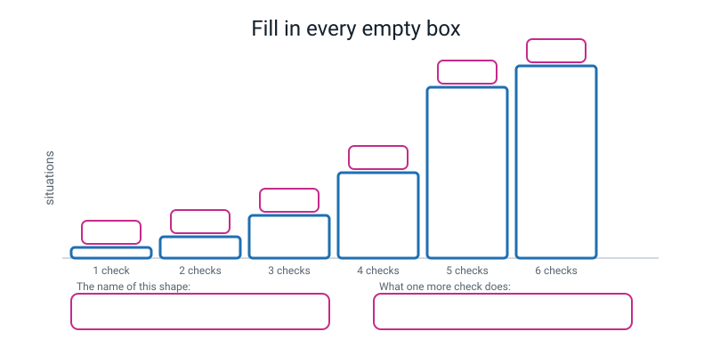
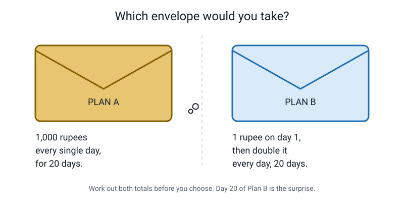
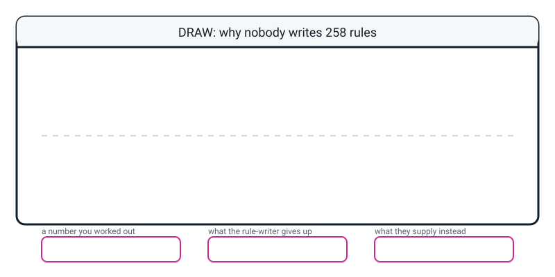

# Workbook — Week 10: The Rule Explosion: Why Nobody Writes 258 Rules

**Name:** ________________________________  **Date:** ______________

[📖 Read the chapter first](../student-guide/week-10.md) · [Course Home](../README.md)

---

## ✅ Warm-Up (5 min)

Five quick questions about **last week**. No looking back until you've tried all five.

**W1.** What is a **training score**?

________________________________________________________________

**W2.** What is a **fresh score**, and why is it usually lower?

________________________________________________________________

________________________________________________________________

**W3.** Why did we seal the ten fresh messages in an envelope instead of just leaving them on the table?

________________________________________________________________

**W4.** Fill in the two words:

- A real message that your rulebook marks as spam is a ________________________.
- A spam message that your rulebook lets through is a ________________________.

**W5.** Your rulebook has five rules. One message matches **both rule 2 and rule 4**. Which one decides the answer, and why?

________________________________________________________________

---

## ✍️ Practice Set A — Understand It

**A1. Fill in the blanks.**

A **check** is a question with a ________________ answer.

If a rulebook has *n* checks, the number of different situations it must cover is ________________.

Three checks give ________ situations. Six checks give ________ situations.

---

**A2. Circle the right answer.**

A program uses **12 checks**. How many different situations are there?

&nbsp;&nbsp;&nbsp;(a) 24 &nbsp;&nbsp;&nbsp; (b) 144 &nbsp;&nbsp;&nbsp; (c) 2,048 &nbsp;&nbsp;&nbsp; (d) 4,096

Now show your working — the doubling, not a formula:

________________________________________________________________

---

**A3. True or false — and explain.**

> "Adding the 10th check creates more new situations than checks 1 to 9 created between them."

Circle one: **TRUE** / **FALSE**

Explain with numbers:

________________________________________________________________

________________________________________________________________

________________________________________________________________

---

**A4. Match the pairs.** Write the letter of the meaning next to each word.

| Word | Letter | | | Meaning |
|---|---|---|---|---|
| check | ______ | | **A** | You give up writing rules and supply labelled examples instead |
| exponential growth | ______ | | **B** | One thing with the correct answer written next to it |
| rule explosion | ______ | | **C** | One question with a yes/no answer |
| the machine learning trade | ______ | | **D** | A quantity that multiplies by the same amount each step (for example, doubling) |
| labelled example | ______ | | **E** | The rules you need grow far faster than the cases you were handling |

---

**A5. Label the diagram.**

Write the number of situations in every empty pink box on the treads. Then fill in the two boxes at the bottom.


*Figure W10.1 — Six treads, six numbers, two sentences.*

---

**A6. Finish the fold table.**

You already know it up to 7 folds. Do the next three rows.

| folds | layers | thickness (1 sheet = 0.1 mm) |
|---|---|---|
| 7 | 128 | 12.8 mm |
| 8 | ____________ | ____________ mm |
| 9 | ____________ | ____________ mm |
| 10 | ____________ | ____________ mm |

Which fold first makes the paper thicker than **10 cm** (100 mm)? Fold number ________

---

## ✍️ Practice Set B — Use It

**B1. The ice cream shop.** A shop offers **8 toppings**, each one a yes/no choice.

(a) How many different ice creams can a customer build? ____________________

(b) The owner wants a printed price card with one line per possible ice cream. At 2 minutes a line, how long is that job?

```
______________ lines  x 2 min  =  ______________ minutes
                                =  ______________ hours
```

(c) The shop adds a **ninth** topping. How many *extra* ice creams does that one topping create? ____________________

---

**B2. Testing a game.** A game has **15 yes/no settings** (sound on/off, subtitles on/off, and so on).

(a) How many different combinations of settings exist? ____________________

(b) A tester can test 100 combinations a day. How many days to test them all?

```
______________ / 100  =  ______________ days
```

(c) One more setting is added. How many days now? ____________________

---

**B3. Here is a situation — what goes wrong, and why?**

> A school spends a whole year writing **400 rules** that check, from a photo, whether a student is in correct uniform. It finally works. In September the school changes the uniform: the shirt goes from white to pale blue and the tie is dropped.

What goes wrong? Name **two** separate problems.

1. ________________________________________________________________

________________________________________________________________

2. ________________________________________________________________

________________________________________________________________

---

**B4. Here is a situation — what goes wrong, and why?**

> A team takes the machine learning trade. They collect **5,000 labelled messages**. The person doing the labelling was in a hurry on the last afternoon and mislabelled about **300** of them.

(a) What fraction of the examples are wrong? ______________ = ______________%

(b) What will the machine do with those 300?

________________________________________________________________

(c) Why is this harder to fix than a mistake in a hand-written rulebook?

________________________________________________________________

________________________________________________________________

---

**B5. Rules, or learning?** For each job, circle one and give a one-line reason.

| Job | Circle one | Reason |
|---|---|---|
| Work out how much income tax someone owes | rules / learning | ________________________ |
| Recognise your best friend's voice on the phone | rules / learning | ________________________ |
| Decide whether a chess move is legal | rules / learning | ________________________ |
| Decide whether a photo shows a cat | rules / learning | ________________________ |
| Check a drug dose is below the safe maximum | rules / learning | ________________________ |

What do all the **rules** answers have in common?

________________________________________________________________

---

## 🧩 Puzzle of the Week


*Figure W10.2 — Two envelopes. Choose carefully.*

You are offered pocket money for **20 days**, and you must pick one plan and stick with it.

- **Plan A:** 1,000 rupees every single day.
- **Plan B:** 1 rupee on day 1, and every day after that you get **double** what you got the day before.

**P1.** How much do you get on **day 20** under each plan?

```
Plan A, day 20 =  ______________________
Plan B, day 20 =  ______________________
```

**P2.** What is the **total** over all 20 days?

```
Plan A total =  ______________________
Plan B total =  ______________________
```

**P3.** Plan B looks pathetic for the first week. **On which day does Plan B's running total finally overtake Plan A's?**

Fill this in until you find the crossover:

| day | Plan A total | Plan B total | who's ahead? |
|---|---|---|---|
| 10 | ______________ | ______________ | ______________ |
| 12 | ______________ | ______________ | ______________ |
| 13 | ______________ | ______________ | ______________ |
| 14 | ______________ | ______________ | ______________ |

Crossover day: ____________

**P4.** In one sentence: what does this puzzle have to do with writing rules?

________________________________________________________________

________________________________________________________________

---

## 🤔 Think Deeper

**T1.** In the chapter there's a sentence: *"You are always, at every moment, only halfway."*

Write a paragraph explaining what that means for somebody writing a rulebook. Use at least one number you worked out yourself.

________________________________________________________________

________________________________________________________________

________________________________________________________________

________________________________________________________________

________________________________________________________________

________________________________________________________________

---

**T2.** The machine learning trade costs you the ability to **explain** a decision.

Describe **one** situation where losing the explanation would be completely unacceptable, and **one** where you honestly wouldn't care. Say what makes them different.

________________________________________________________________

________________________________________________________________

________________________________________________________________

________________________________________________________________

________________________________________________________________

________________________________________________________________

---

## 🛠️ Build It

### Page 10.3 — Write down the trade

In your own words, no copying from the chapter.

**What I give up:**

________________________________________________________________

________________________________________________________________

**What I supply instead:**

________________________________________________________________

**How many of those I would need for a spam detector:**

________________________________________________________________

**The price I pay for it:**

________________________________________________________________

**What I gain:**

________________________________________________________________

**The whole trade in ONE sentence:**

________________________________________________________________

---

### Page 10.4 — Rulebook vs Reality: the scoring

**Before you open the envelope, write your prediction.** I think I will get ______ out of 10.

**The three rules, and tick each one when you've agreed to it:**

- [ ] I am the computer, not the judge. I write down whatever the rules say, even when I know it's wrong.
- [ ] I will not change a single rule until all ten are scored. Fixes go in the margin.
- [ ] I will write down **which rule number** fired, not just the verdict.

Now open the envelope and fill this in.

| # | Message (first few words) | First rule to fire | Verdict | Truth | ✓/✗ | Error type |
|---|---|---|---|---|---|---|
| 21 | | | | | | false alarm / miss / — |
| 22 | | | | | | false alarm / miss / — |
| 23 | | | | | | false alarm / miss / — |
| 24 | | | | | | false alarm / miss / — |
| 25 | | | | | | false alarm / miss / — |
| 26 | | | | | | false alarm / miss / — |
| 27 | | | | | | false alarm / miss / — |
| 28 | | | | | | false alarm / miss / — |
| 29 | | | | | | false alarm / miss / — |
| 30 | | | | | | false alarm / miss / — |

**The arithmetic. Both scores as a fraction AND a percentage.**

```
Training accuracy = ______ correct out of 20 = ______ = ______ %

Fresh accuracy    = ______ correct out of 10 = ______ = ______ %

The gap           = training % - fresh %     = ______ percentage points

False alarms      = ______

Misses            = ______
```

Was your prediction right? ________ How far out were you? ________

---

### Page 10.5 — "Why I stopped adding rules"

One page. It must contain all three of these.

**1. Which rule broke first, and on which exact message?**

________________________________________________________________

________________________________________________________________

**2. Was that rule one of your STRONGEST on the training messages? How do you know?**

________________________________________________________________

________________________________________________________________

**3. What would you do next if you were building this for real?** ("Add more rules" is not allowed.)

________________________________________________________________

________________________________________________________________

________________________________________________________________

**Bonus, worth having:** which error type did you have more of — false alarms or misses — and which would matter more on a real phone?

________________________________________________________________

________________________________________________________________

---

### Page 10.6 — The unwritable rule: is this a photo of a cat?

Write **five real rules**. Not silly ones. Try to actually succeed. Then find something each one gets wrong.

| # | My rule | A real thing it gets wrong |
|---|---|---|
| 1 | `IF ______________________ THEN cat` | |
| 2 | `IF ______________________ THEN cat` | |
| 3 | `IF ______________________ THEN cat` | |
| 4 | `IF ______________________ THEN cat` | |
| 5 | `IF ______________________ THEN cat` | |

**Which rule broke FIRST?** ____________ **On what?** ____________________

**The closing question: why did adding more rules not help?**

________________________________________________________________

________________________________________________________________

________________________________________________________________

________________________________________________________________

---

## 🎨 Draw It

Draw a picture that would make a 9-year-old understand why nobody writes 258 rules. Anything goes — a cartoon, a diagram, a staircase, two shopkeepers. Fill in the three small boxes at the bottom.


*Figure W10.3 — Your page.*

> **What a good answer might look like:** a cartoon of a person at a desk with a rulebook that has grown taller than they are, and a speech bubble saying *"I've written 258 rules and it's still wrong."* Beside them, a second person calmly stacking photos into a crate labelled *300 examples, 50 minutes*, with a small sign underneath: *"but I can't tell you why it works."* Bottom boxes: **1,073,741,824** · *writing the rules, and knowing the reason* · *labelled examples, thousands of them.*
>
> A diagram works just as well: the doubling staircase with a tiny stick figure standing on step 8 looking up at step 30 disappearing off the top of the page.

---

## 📊 Self-Check

Tick one box per line. Be honest — this page is for you, not for marks.

| I can… | 😀 got it | 🙂 nearly | 😕 not yet |
|---|---|---|---|
| Fill in the doubling table from 1 check to 30 checks without being told the numbers | ☐ | ☐ | ☐ |
| Explain rule explosion in my own words, using a number I worked out myself | ☐ | ☐ | ☐ |
| State the machine learning trade — what I give up and what I supply instead | ☐ | ☐ | ☐ |
| Name one job I cannot write rules for, and say exactly where my rules broke | ☐ | ☐ | ☐ |
| Explain why 100 more rules can buy almost no extra accuracy | ☐ | ☐ | ☐ |

One thing I'd like explained again:

________________________________________________________________

---

## ✅ Answers

<details>
<summary>Check your answers</summary>

### Warm-Up

**W1.** The **training score** is how well your rules do on the *same* messages you used to write them. It is always the friendlier of the two numbers, because those messages are exactly the ones you were staring at when you invented the rules.

**W2.** The **fresh score** is how well your rules do on messages they have never seen. It is usually lower because your rules were shaped by the training messages — they fit those particular examples, not spam in general. *Why this matters:* only the fresh score tells you anything about tomorrow.

**W3.** Because once you have read them, you cannot un-read them. Even without meaning to, you would write rules that happen to work on those ten, and the score would then be measuring your memory instead of your rulebook. Sealing it is how you protect yourself from fooling yourself.

**W4.** A false alarm · a miss. *(Worth remembering which is worse: a miss means one scam message reaches you, so you must not click or reply, and you should show an adult; whether a miss or a false alarm is worse depends on the job. A false alarm means a real message from a friend is hidden in a junk folder you never open.)*

**W5.** **Rule 2** — because the convention is **first match wins, checked top to bottom.** The order you write your rules in is itself part of the rulebook, which is why every rulebook needs a line saying which rule wins.

---

### Practice Set A

**A1.** yes/no · **2ⁿ** (two to the power n) · 3 checks give **8** · 6 checks give **64**.

**A2.** **(d) 4,096.**

Working by doubling: 2, 4, 8, 16, 32, 64, 128, 256, 512, 1,024, 2,048, 4,096 — that's twelve doublings.
*Why (c) 2,048 is the tempting wrong answer:* it's 2¹¹, which is what you get if you stop one doubling short (11 doublings instead of 12). Count the doublings, not the numbers.

**A3.** **TRUE.**

```
After 9 checks  : 2^9  = 512 situations
So checks 1-9 created:  512 - 1 = 511   (you start with 1 situation: nothing asked yet)
After 10 checks : 2^10 = 1,024
So check 10 created:  1,024 - 512 = 512
512 is one more than 511.
```

**Why:** every doubling step adds exactly as much as everything before it, plus the 1 you started with. It is true at every single step, not just at 10 and 30.

**A4.** check = **C** · exponential growth = **D** · rule explosion = **E** · the machine learning trade = **A** · labelled example = **B**.

**A5.** The six treads, left to right: **2, 4, 8, 16, 32, 64.**

- The name of this shape: **exponential growth** (accept "doubling").
- What one more check does: **it doubles the number of situations** — every situation you already had splits into two, because the new question can be answered either way.

**A6.**

| folds | layers | thickness |
|---|---|---|
| 7 | 128 | 12.8 mm |
| 8 | **256** | **25.6 mm** |
| 9 | **512** | **51.2 mm** |
| 10 | **1,024** | **102.4 mm** |

**Fold 10** is the first one over 100 mm. *Notice:* ten folds of one sheet of paper would be a block over 10 cm thick. That is why your hands stopped at six.

---

### Practice Set B

**B1.**
(a) **2⁸ = 256** different ice creams.
(b) `256 × 2 = 512 minutes = 512 / 60 = 8.5 hours.` Over a full working day, to print a menu.
(c) **256 extra.** The ninth topping doubles 256 to 512, so it adds 256 — which is more than toppings 1 to 8 created between them (255). One topping, more work than all eight before it.

**B2.**
(a) **2¹⁵ = 32,768** combinations.
(b) `32,768 / 100 = 327.68`, so **328 days** — nearly a year of full-time testing for one game's settings menu.
(c) **656 days**, because setting 16 doubles it to 65,536. Adding one checkbox to a settings screen doubles the testing job. This is a real reason software has bugs: nobody can test all the combinations, so they test the likely ones and hope.

**B3.** Two problems, and you needed both:

1. **Every rule that mentions the white shirt is now wrong, and every rule that mentions the tie is now wrong** — so you have to go through all 400 by hand and work out which ones are affected. There is no shortcut: only a human who understands each rule can decide.
2. **The rules will now contradict each other.** Some rules will pass a pale blue shirt (because they only check the trousers) while others fail it, and the answer will depend on which rule happens to fire first. You now need rules about which rule wins — a second rulebook on top of the first.

*The one-sentence version:* **a rulebook is frozen the moment you finish it, and the world isn't.**

**B4.**
(a) `300 / 5,000 = 0.06 = **6%**` of the examples teach the wrong thing.
(b) They **can be learned, and systematic mistakes especially are.** A few random errors may barely matter, but the machine has no way to know that Tuesday afternoon's labels were rushed. Those 300 messages are, as far as it is concerned, exactly as true as the other 4,700.
(c) In a rulebook you can *read* the rules and spot the wrong one. In a learned system there is no rule to read — the mistake is spread invisibly through the whole thing. You can only find it by testing on fresh examples and noticing the score is worse than it should be, and even then nobody can point at *which* labels were the bad ones.

**B5.**

| Job | Answer | Reason |
|---|---|---|
| Income tax | **rules** | A parliament already wrote the bands down. Two people with identical incomes must get identical bills. |
| Recognise a friend's voice | **learning** | You can do it instantly and cannot explain how. There is nothing to write down. |
| Is a chess move legal | **rules** | The rules are complete, finite and published on two pages. |
| Is this photo a cat | **learning** | You know a cat when you see one and cannot say how. Nothing your rules can talk about is actually in the photo. |
| Drug dose below the safe maximum | **rules** | The limit comes from published trials. A 99.9% accurate model is still wrong one time in a thousand, and a wrong dose can harm a patient; a comparison against a number is right by construction. |

**What the rules answers have in common:** in every one, **the correct answer already exists in written form** — a law, a game's rulebook, a published safety limit. Learning can only ever make a fuzzy copy of something that is already exact. Use rules when somebody already wrote the answer down; use learning when the answer only lives in people's ability to recognise something without explaining it.

---

### Puzzle of the Week

**P1.**
Plan A, day 20 = **1,000 rupees**.
Plan B, day 20 = **2¹⁹ = 524,288 rupees**. *(Day 1 is 2⁰ = 1, so day 20 is 2¹⁹.)*

**P2.**
Plan A total = `1,000 × 20 =` **20,000 rupees**.
Plan B total = `1 + 2 + 4 + … + 524,288 = 2²⁰ − 1 =` **1,048,575 rupees**.

*The shortcut worth knowing:* adding up a doubling run always gives you **one less than the next number**. 1+2+4 = 7, which is 8−1. That is the same fact as "check n adds more than all the checks before it, by exactly one," seen from the other side.

**P3.**

| day | Plan A total | Plan B total | ahead |
|---|---|---|---|
| 10 | 10,000 | 1,023 | **A** |
| 12 | 12,000 | 4,095 | **A** |
| 13 | 13,000 | 8,191 | **A** |
| 14 | 14,000 | 16,383 | **B** |

**Crossover: day 14.** For thirteen days Plan B looks like a joke. Then it wins by fifty times over.

**P4.** Because doubling spends most of its time looking harmless. For thirteen days Plan B is obviously the worse deal, and then it isn't. A rulebook feels exactly the same: five rules is easy, ten rules is fine, and the wall you hit at twenty was already coming the whole time — you just couldn't see it from where you were standing.

---

### Think Deeper

**T1. Model answer:**

> When I filled in my doubling table I had 536,870,912 situations after 29 checks. Check 30 added another 536,870,912 all by itself — more than all twenty-nine earlier checks had added between them, which was 536,870,911. So even after twenty-nine checks' worth of work, I still had more than half the job left. And that isn't special about 30: after 9 checks I'd done 511 and check 10 added 512, so I was only halfway there too. Whatever step I'm standing on, the work still ahead of me is bigger than all the work behind me. For somebody writing rules that means there is no point at which it starts getting easier — the feeling of "I'm nearly done" is always false, and that's exactly why people wrote rulebooks for years before admitting they were losing.

*Full marks needs:* a number they computed themselves, and the idea that the remaining work always exceeds the finished work.

**T2. Model answer:**

> **Unacceptable:** a system that decides whether someone gets a bank loan, or whether a patient gets a particular treatment. If you are refused, you have a right to know why, and you cannot argue against a decision nobody can explain. Being unable to explain it also means nobody can check whether it was unfair.
>
> **Wouldn't care:** which song plays next in a playlist, or which of two thumbnail pictures a video uses. If it's wrong, I press skip and nothing has been lost.
>
> **What makes them different:** the **cost of being wrong, and who pays it.** In the first pair, one specific person is harmed and cannot appeal. In the second, the cost is two seconds of mild annoyance for me, and I can fix it myself instantly.

*Full marks needs:* the two examples plus a stated difference that is about **consequences**, not about difficulty.

---

### Build It

**Page 10.3 — the trade.** Accept any wording carrying these five points:

> **What I give up:** writing the rules myself, and the ability to read the rule and see why it decided.
> **What I supply instead:** labelled examples — a message with the right answer written next to it.
> **How many I'd need:** for spam, thousands. Not five, not fifty.
> **The price:** labelling is slow, boring human work, and every mistake I make gets learned perfectly.
> **What I gain:** it can look at every word in the language instead of the ten things I can hold in my head, and when the world changes I add examples instead of rewriting by hand.

**One sentence:** *"You swap thinking for collecting — because thinking doesn't scale and collecting does."*

**Page 10.4 — the scoring.** Your messages are your own, so here is a complete model to mark against. If your structure matches this and your arithmetic is right, it is correct.

Model rulebook, first match wins:

```
RULE 1: IF the message contains "free" (any capitalisation)   THEN spam
RULE 2: IF it contains "win", "won" or "prize"                THEN spam
RULE 3: IF it contains [LINK]                                 THEN spam
RULE 4: IF it contains a question mark                        THEN ham
RULE 5: IF it has 2 or more ALL-CAPS words of 3+ letters      THEN spam
DEFAULT: OTHERWISE                                            THEN ham
```

| # | Message | Rule fired | Verdict | Truth | ✓/✗ | Error type |
|---|---|---|---|---|---|---|
| 21 | Congratulations! You have WON a FREE holiday. Claim at [LINK] | 1 | spam | spam | ✓ | — |
| 22 | Your parcel could not be delivered. Update your address here [LINK] | 3 | spam | spam | ✓ | — |
| 23 | Are you free after school? | 1 | spam | ham | ✗ | false alarm |
| 24 | URGENT: your bank account is LOCKED. Verify now. | 5 | spam | spam | ✓ | — |
| 25 | Can you bring my maths book tomorrow? | 4 | ham | ham | ✓ | — |
| 26 | Dinner at 7 | DEFAULT | ham | ham | ✓ | — |
| 27 | You have been selected for a cash reward. Reply YES to claim. | DEFAULT | ham | spam | ✗ | miss |
| 28 | Match is cancelled, pitch flooded | DEFAULT | ham | ham | ✓ | — |
| 29 | WIN an iPhone! Just tap [LINK] before midnight | 2 | spam | spam | ✓ | — |
| 30 | Did you finish the science poster? I'm stuck on question 3 | 4 | ham | ham | ✓ | — |

```
Training accuracy = 19/20 = 0.95 = 95%
Fresh accuracy    =  8/10 = 0.80 = 80%
The gap           = 95 - 80 = 15 percentage points
False alarms      = 1   (message 23)
Misses            = 1   (message 27)
```

**Right for the wrong reason — worth spotting.** Message 21 was scored by Rule 1 ("free"), but Rules 2, 3 and 5 would all have caught it too. That looks like a triumph for Rule 1 and it is really just a very obvious spam message being obvious four times over. This is exactly why you write down which rule fired.

**Page 10.5 — model write-up:**

> **Which rule broke first, and where.** Rule 1 — `IF contains "free" THEN spam` — broke on message 23, "Are you free after school?". The word "free" was doing two completely different jobs and my rule could only see the letters.
>
> **Was it one of my strongest?** Yes, my strongest. On my 20 training messages "free" appeared in 7 of the 10 spam and 0 of the 10 ham — the biggest gap in my whole tally table, which is exactly why I put it first. Being the rule that fitted my training messages best is a likely reason it broke first: it was tuned hardest to the twenty messages I happened to have.
>
> **Which error type worries me more.** I had one of each, but the false alarm is worse. A miss means one scam reaches me, and I must not click or reply and should show an adult. A false alarm means a real message from a friend is sitting in a junk folder I never open.
>
> **One message no rule of mine could catch.** Message 27: "You have been selected for a cash reward. Reply YES to claim." No unusual word, no link, no exclamation marks. Everything that makes it a scam lives in the *meaning* — that strangers do not give people money — and my rulebook has no word for it yet. A rule on "reward" or "claim" could catch this one, but it would also hit real messages ("Reply YES to claim your school photo").
>
> **What the gap tells me.** Fifteen points of gap hints that my rules fitted my exact 20 messages, not spam in general (with only 10 fresh messages, one message is 10 points, so it is a hint, not proof). I didn't discover how spam works. I discovered how *my twenty messages* work.
>
> **What I'd do next.** Not add rules. Collect a few thousand labelled messages from lots of different phones, not just mine, and let a machine find the rule — accepting that I then couldn't explain any single decision it made.

**Marking note:** if your write-up boils down to "rules are bad, machine learning is good", it isn't finished. Answer this before you hand it in: *name three jobs where machine learning would be a stupid choice.*

**Page 10.6 — the unwritable rule.** Model answer:

| # | Rule | A real case it gets wrong |
|---|---|---|
| 1 | `IF it has pointed triangular ears THEN cat` | A German Shepherd. A fox. A bat. |
| 2 | `IF it has whiskers THEN cat` | Dogs have whiskers. So do rats, seals and walruses. |
| 3 | `IF it is furry AND smaller than a shoebox THEN cat` | A Chihuahua is smaller. A Maine Coon is much bigger. A guinea pig is both. |
| 4 | `IF the pupils are vertical slits THEN cat` | The same cat in a dark room has round pupils. A photo of its back has no eyes at all. |
| 5 | `IF it has a long tail with a curl at the tip THEN cat` | A Manx cat has no tail. A photo cropped at the shoulders has no tail. A squirrel has a better one. |

**Which broke first?** Usually rule 1, because the first non-cat photo anybody tries is a dog, and plenty of dogs have pointed ears.

**Why more rules cannot help:**

> Every rule failed for the same reason, and it isn't that I picked bad rules. **None of the things my rules talk about are actually in the photo.** A photo is a grid of coloured dots. "Pointed ear" is not in that grid — it's something my eyes assemble out of the grid without telling me how. To write rule 1 as an instruction a computer could run, I'd first need a rule for "is this shape an ear", which needs a rule for "where does this shape end", which needs a rule for "is this dot part of an edge" — and that never bottoms out into anything I can write down.
>
> So more rules can only look harder at what is already there. They cannot fetch what is not there. And what is not there is the enormous amount of recognising my eyes do in a twentieth of a second without ever reporting how.
>
> That's the sharpest test I know for when to stop writing rules: **if you can do the task instantly but cannot explain how, rules will fail and learning will work.**

---

### Draw It

There is no single right drawing. A strong answer does three things: it shows something **doubling** (a staircase, folded paper, splitting boxes, a rulebook growing), it shows the **human losing** the race rather than just working hard, and it names the **trade** somewhere — rules going one way, labelled examples coming back.

The three bottom boxes should read something like: **1,073,741,824** (or any big number you actually calculated) · *writing the rules myself, and being able to point at the reason* · *thousands of labelled examples.*

If your drawing only shows a big pile of rules, add one thing: what the other person is doing instead.

</details>

---

[⬅ Week 9 workbook](week-09.md) · [📖 Week 10 chapter](../student-guide/week-10.md) · [Course Home](../README.md) · [Week 11 workbook ➡](week-11.md) · [Glossary](../../glossary.md)
