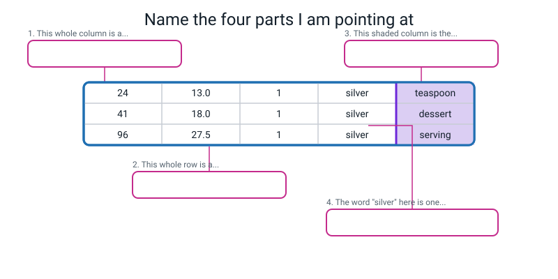
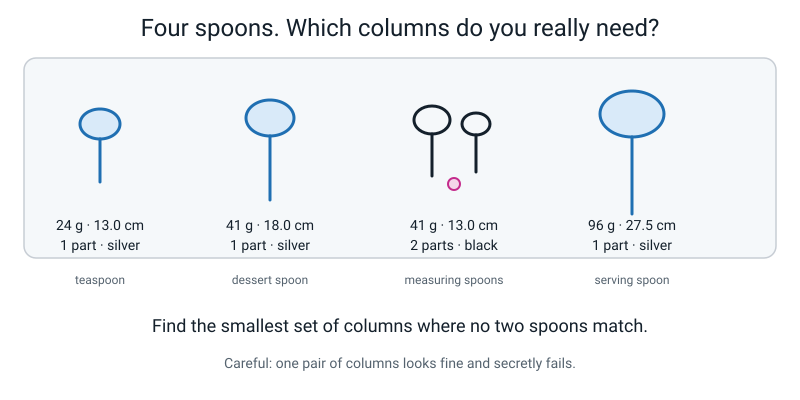
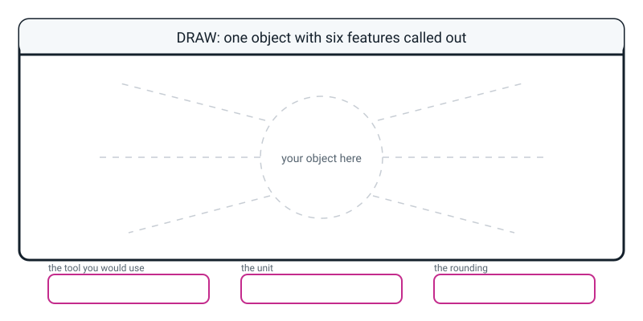

# Workbook — Week 11: How a Machine Describes Your Dog

**Name:** ________________________________  **Date:** ______________

[📖 Read the chapter first](../student-guide/week-11.md) · [Course Home](../README.md)

---

## ✅ Warm-Up (5 min)

Five quick questions about **last week**. Try all five before you look anything up.

**W1.** A rulebook has **6 checks**. How many different situations must it cover? ____________

**W2.** Finish the sentence: **rule explosion** means…

________________________________________________________________

**W3.** In the machine learning trade, what do you give up and what do you supply instead?

Give up: ________________________________________________________

Supply: _________________________________________________________

**W4.** True or false: *adding one more check to a rulebook adds one more situation.*

Circle: **TRUE** / **FALSE**. Why?

________________________________________________________________

**W5.** Name one job where hand-written rules are clearly the right choice, and say why.

________________________________________________________________

---

## ✍️ Practice Set A — Understand It

These questions check the words from this week's chapter.

**A1. Fill in the blanks.**

A **feature** is one ____________________ description of one example. It is one ____________________ in your table.

The **label** is the answer you want the machine to give back. It is the column you ____________________.

A **class** is one of the ____________________ the label is allowed to be.

---

**A2. Circle every one that is already a feature.** (There may be more than one.)

&nbsp;&nbsp;&nbsp;(a) "it's quite heavy"
&nbsp;&nbsp;&nbsp;(b) `mass_g = 340`
&nbsp;&nbsp;&nbsp;(c) "a really nice colour"
&nbsp;&nbsp;&nbsp;(d) `parts_count = 3`
&nbsp;&nbsp;&nbsp;(e) "it looks old"
&nbsp;&nbsp;&nbsp;(f) `colour = blue`, chosen from a list of ten colours

For **one** of the ones you did *not* circle, write the measuring instruction that would turn it into a real feature:

________________________________________________________________

---

**A3. True or false — and explain.**

> "The label is always the last column in the table."

Circle one: **TRUE** / **FALSE**

Explain:

________________________________________________________________

________________________________________________________________

---

**A4. Match the pairs.** Write the letter of the meaning next to each word.

| Word | Letter | | | Meaning |
|---|---|---|---|---|
| feature | ______ | | **A** | The wording that says how something is measured, so two people get the same number |
| label | ______ | | **B** | One measured description of one example |
| class | ______ | | **C** | A table where every row is one example and exactly one column is the answer |
| measuring instruction | ______ | | **D** | The answer you want back — the column you cover up |
| feature table | ______ | | **E** | One of the answers the label is allowed to be |

---

**A5. Label the diagram.**

Four things are being pointed at. Write what each one is in the pink box.


*Figure W11.1 — Same table you built in class, with the headings taken off.*

---

**A6. Sort them.** Tick one column for each phrase.

| Phrase | A machine can use this | Not yet |
|---|---|---|
| `weighs 340 g` | ☐ | ☐ |
| quite big | ☐ | ☐ |
| `18.5 cm long` | ☐ | ☐ |
| nice colour | ☐ | ☐ |
| `3 separate parts` | ☐ | ☐ |
| looks expensive | ☐ | ☐ |
| `colour: blue` (from a fixed list of ten) | ☐ | ☐ |
| feels nice to hold | ☐ | ☐ |

Pick **one** from the "Not yet" column and fix it:

`________________________` becomes `________________________________________`

---

## ✍️ Practice Set B — Use It

These questions use this week's words on tables and situations.

**B1. Same table, three questions.** Here is a record of four school days.

| id | sleep_hours | screen_minutes | homework_minutes | mood_1to5 | felt_tired |
|---|---|---|---|---|---|
| 1 | 8.5 | 40 | 45 | 4 | no |
| 2 | 5.0 | 180 | 20 | 2 | yes |
| 3 | 7.0 | 90 | 60 | 4 | no |
| 4 | 5.5 | 150 | 30 | 2 | yes |

For each question, name the **label**, the **classes**, and how many **features** are left over.

| The question | Label | Classes | How many features |
|---|---|---|---|
| "Will I feel tired tomorrow?" | | | |
| "What will my mood be?" | | | |
| "How long will my homework take?" | | | |

What changed about the table between the three rows above? ____________________

---

**B2. Write three measuring instructions.** You are describing **school bags**. Each instruction needs a **tool (or a fixed list)**, a **unit**, and a **rounding**.

```text
f1  height_cm     ____________________________________________________

f2  mass_g        ____________________________________________________

f3  pockets_count ____________________________________________________
```

Now the test question: **if I followed your f1 exactly, would I get your number?** What could I still do differently?

________________________________________________________________

---

**B3. Here is a situation — what goes wrong, and why?**

> Rohan measures five mugs. For the first three he measures `height_cm` **with the lid on**. Then he gets distracted, and for the last two he measures **with the lid off**. All five numbers look completely normal — 11.0, 12.5, 10.5, 9.0, 9.5 — and he writes them all in the table.

(a) Which is the more honest description of this column: "slightly inaccurate" or "meaningless"? Why?

________________________________________________________________

________________________________________________________________

(b) Why is this **worse** than leaving the column blank?

________________________________________________________________

________________________________________________________________

(c) What is the fix — the number, or the sentence? ____________________

---

**B4. Here is a situation — what goes wrong, and why?**

> Meera builds a machine with two classes: `dog` and `cat`. It works beautifully. Then her cousin holds up a photo of a **rabbit**.

(a) What does the machine say? ____________________

(b) How confident will it be? ____________________

(c) Whose mistake is this, and what exactly was the mistake?

________________________________________________________________

________________________________________________________________

(d) Meera says "I'll just add a rule that says if it's not a dog or a cat, say 'I don't know'." What is she actually asking for?

________________________________________________________________

---

**B5. Mark somebody else's work.** Here is a feature sheet handed in by another student. Find **three** faults and write the fix.

```text
FEATURE SHEET
label question: which drink bottle is it?

f1  size      how big it is
f2  weight    weigh it
f3  colour    bluey-green
f4  age       it's quite old
```

| Fault | Why it's a fault | The fix |
|---|---|---|
| | | |
| | | |
| | | |

Which of the four features **cannot honestly be fixed at all**, and why? ____________________

________________________________________________________________

---

## 🧩 Puzzle of the Week

This puzzle uses a small table of four spoons.


*Figure W11.2 — Four spoons. Four columns each.*

Here is the table drawn out:

| id | mass_g | longest_cm | parts_count | colour | **label** |
|---|---|---|---|---|---|
| 1 | 24 | 13.0 | 1 | silver | **teaspoon** |
| 2 | 41 | 18.0 | 1 | silver | **dessert spoon** |
| 3 | 41 | 13.0 | 2 | black | **measuring spoons** |
| 4 | 96 | 27.5 | 1 | silver | **serving spoon** |

**The challenge:** find the **smallest set of columns** where no two spoons have exactly the same values. If two rows match, your machine can never tell those two apart, no matter how clever it is.

**P1.** Can any **single** column do it on its own? Test all four.

| column | the four values | any two the same? | works alone? |
|---|---|---|---|
| mass_g | 24, 41, 41, 96 | | |
| longest_cm | | | |
| parts_count | | | |
| colour | | | |

**P2.** Now try **pairs**. Tick the ones that work.

| pair | the four value-pairs | works? |
|---|---|---|
| mass + longest | (24, 13.0) (41, 18.0) (41, 13.0) (96, 27.5) | ☐ |
| mass + parts | | ☐ |
| longest + parts | | ☐ |
| longest + colour | | ☐ |
| mass + colour | | ☐ |
| parts + colour | | ☐ |

**P3.** What is the smallest number of columns you need? ____________

**P4.** One pair looks perfectly reasonable and secretly fails. Which pair, and which two spoons does it confuse?

________________________________________________________________

---

## 🤔 Think Deeper

These two questions ask you to write longer answers.

**T1.** Somebody chose the six features that describe the dog: mass, shoulder height, ear length, coat colour, white paws, tail length. Breed, age, name and temperament were left off.

Write a paragraph about what that choosing means. Was anything *lost*? Who is responsible for what got left off? Can the machine ever find out what it's missing?

________________________________________________________________

________________________________________________________________

________________________________________________________________

________________________________________________________________

________________________________________________________________

________________________________________________________________

---

**T2.** Name something genuinely important about a person that **cannot** be turned into a feature.

Then say which of these three reasons it is, and why:

- **(i)** no instrument exists yet
- **(ii)** it's private, and measuring it would be wrong
- **(iii)** it's a feeling, and no two people would ever score it the same

________________________________________________________________

________________________________________________________________

________________________________________________________________

________________________________________________________________

________________________________________________________________

---

## 🛠️ Build It

In these pages you build your own feature table and test it with an adult.

### Page 11.4 — The kitchen feature table

**Step checklist. Tick in order, and don't skip ahead.**

- [ ] Chosen **five kitchen objects that are similar enough to be confusable** (five spoons, five bottles, five mugs — NOT a spoon, a fridge and a banana)
- [ ] Written the **label question** at the top, before touching anything
- [ ] Written all **five measuring instructions** — before measuring anything at all
- [ ] Checked each instruction names a **tool or a fixed list**, a **unit**, and a **rounding**
- [ ] Measured all five objects: **25 values, no blanks**
- [ ] Marked which column is the label

**My label question:**

```text
label question: ______________________________________________________
```

**My five measuring instructions:**

```text
f1  ________________    ____________________________________________

f2  ________________    ____________________________________________

f3  ________________    ____________________________________________

f4  ________________    ____________________________________________

f5  ________________    ____________________________________________
```

**My feature table:**

| id | f1 ________ | f2 ________ | f3 ________ | f4 ________ | f5 ________ | **label** |
|---|---|---|---|---|---|---|
| 1 | | | | | | |
| 2 | | | | | | |
| 3 | | | | | | |
| 4 | | | | | | |
| 5 | | | | | | |

**Cover the label column with your hand and read row 3 aloud.** Could you guess it? ______

Which feature do you think separates your five objects best? ____________________

*(Write that down. You'll test it with actual numbers next week.)*

---

### Page 11.5 — The adult re-measure test

**The rules:**

- [ ] Give the adult your **feature sheet** and **one** object
- [ ] Your table stays **face down**. They must not see your numbers
- [ ] They follow only what you wrote. Ask them to be **literal, not helpful**
- [ ] You write down whatever they say, even if it's wrong

| feature | my number | their number | match? | what I'd change in the sentence |
|---|---|---|---|---|
| f1 ________ | | | ☐ ✓ ☐ ✗ | |
| f2 ________ | | | ☐ ✓ ☐ ✗ | |
| f3 ________ | | | ☐ ✓ ☐ ✗ | |
| f4 ________ | | | ☐ ✓ ☐ ✗ | |
| f5 ________ | | | ☐ ✓ ☐ ✗ | |

**Score:** ______ out of 5 matched.

**My closing sentences.** Which mismatch was the worst, and why? (Hint: the worst mismatch is the one where the error is *bigger than the difference between two of your objects.*)

________________________________________________________________

________________________________________________________________

________________________________________________________________

**Now re-test.** Pick your worst instruction, rewrite it, and have them measure that one feature again.

Rewritten instruction: __________________________________________________

Their new number: ________ Mine: ________ Match now? ______

---

### Page 11.6 — Sharpen the vague descriptions

Turn each vague phrase into a real measuring instruction with a tool-or-list, a unit and a rounding. **One of the six cannot be done honestly. Find it.**

| Vague description | My measuring instruction |
|---|---|
| "It's quite heavy" | |
| "It's a nice blue" | |
| "It's really long" | |
| "It's got loads of bits" | |
| "It's old" | |
| "It smells nice" | |

**Which one could not be converted?** ____________________

**Why not?**

________________________________________________________________

________________________________________________________________

---

## 🎨 Draw It

This page is for a drawing of one object and its features.

Draw **one object from your own home** with six measurable features called out on leader lines. Then fill in the three boxes underneath: the tool, the unit, the rounding — for whichever feature you think is hardest to measure honestly.


*Figure W11.3 — Your page.*

> **What a good answer might look like:** a drawing of a bicycle, with six lines pointing out: `wheel_diameter_cm` (66.0) · `mass_kg` (11.4) · `gears_count` (7) · `frame_colour` (blue, from a list) · `has_bell` (yes) · `saddle_height_cm` (82.0). Underneath, for the hardest one — `mass_kg` — the three boxes read: *bathroom scale* · *kilograms* · *nearest 0.1 kg, with the bike lifted clear of the floor (stand on the scale holding it, then subtract your own mass).*
>
> **What a weak answer looks like:** six lines pointing at *fast*, *cool*, *comfy*, *nearly new*, *good brakes*, *big*. None of those are features yet. If you catch yourself writing those, ask each one: with what tool, in what unit, rounded how?

---

## 📊 Self-Check

Tick the face that matches how you feel about each line.

| I can… | 😀 got it | 🙂 nearly | 😕 not yet |
|---|---|---|---|
| Turn a real object into a row of measured features | ☐ | ☐ | ☐ |
| Write a measuring instruction precise enough that someone else gets my number | ☐ | ☐ | ☐ |
| Point at any table and say which columns are features and which is the label | ☐ | ☐ | ☐ |
| Explain why a machine cannot use a description that hasn't been measured | ☐ | ☐ | ☐ |
| Explain why a dog-or-cat machine calls a rabbit a dog or a cat | ☐ | ☐ | ☐ |

One thing I'd like explained again:

________________________________________________________________

---

## ✅ Answers

<details>
<summary>Check your answers</summary>

### Warm-Up

**W1.** **2⁶ = 64** situations. Doubling: 2, 4, 8, 16, 32, 64.

**W2.** The number of rules you need grows far faster than the number of cases you were trying to handle, until the rulebook becomes impossible for a human to maintain. *(8 checks already needs 258 lines.)*

**W3.** **Give up:** writing the rules yourself, and the ability to explain why a decision was made. **Supply:** labelled examples — the thing with the correct answer written next to it — and a lot of them.

**W4.** **FALSE.** It **doubles** the situations, because every situation you already had can now go two ways. One more check on top of 10 doesn't add 1 — it adds 1,024.

**W5.** Any of: income tax, chess legality, a maximum safe drug dose, a speed limit. **Why:** the correct answer was already written down by somebody — a parliament, a rulebook, a medical trial — so learning could only ever make a fuzzy copy of something already exact.

---

### Practice Set A

**A1.** **measured** · **column** · you **cover up** (or "hide") · a class is one of the **answers** (accept "possible answers", "allowed answers") the label is allowed to be.

**A2.** Circle **(b), (d) and (f).**

(a), (c) and (e) are **descriptions, not features** — two people would give two different answers and neither would be wrong. Notice (f) only counts as a feature *because* it comes from a fixed list; "a nice blue" from nobody's list would not.

A model conversion of one of the others:

- "it's quite heavy" → `mass_g` — kitchen scale, dry and empty, nearest gram
- "it looks old" → `visible_wear_1to3` — 1 = looks new, 2 = scratched or faded, 3 = chipped or cracked. Judged by two people; if they disagree, take the lower.

**A3.** **FALSE.**

The label is whichever column **you decided to cover up** — it's a choice about your question, not a fact about the table. Put `animal` at the front instead of the end and nothing about the table changes. We *usually* put it last as a tidy habit, so that future-you remembers which column was the answer. That's the same reason you write the date on your homework.

**A4.** feature = **B** · label = **D** · class = **E** · measuring instruction = **A** · feature table = **C**.

**A5.**

1. This whole column is **a feature** (this one is `mass_g` — one measured description, one column).
2. This whole row is **one example** — one spoon. One row = one thing.
3. This shaded column is **the label** — the answer you want back, the column you cover up.
4. The word "silver" is **one value of the feature `colour`** — one cell, one measurement, for one example.

*Common mistake:* calling the row "a feature". A row is an *example*; a column is a *feature*. Rows are things, columns are measurements.

**A6.**

| Phrase | Verdict | Why |
|---|---|---|
| `weighs 340 g` | **can use** | Number with a unit |
| quite big | **not yet** | Bigger than what? |
| `18.5 cm long` | **can use** | Number with a unit |
| nice colour | **not yet** | "Nice" is about the person looking |
| `3 separate parts` | **can use** | A count |
| looks expensive | **not yet** | A guess about price, not a measurement |
| `colour: blue` from a fixed list | **can use** | One word from a short fixed list |
| feels nice to hold | **not yet** | A feeling, and hands differ |

Model fix: `feels nice to hold` → `handle_width_cm` — ruler across the handle at its widest point, nearest 0.5 cm. **Notice what happened:** you didn't capture "nice". You replaced it with something measurable that is *related* to it. That is always the honest trade, and you should say out loud what you gave up.

---

### Practice Set B

**B1.**

| The question | Label | Classes | Features left |
|---|---|---|---|
| "Will I feel tired tomorrow?" | `felt_tired` | 2 — yes, no | **4** |
| "What will my mood be?" | `mood_1to5` | 5 — 1, 2, 3, 4, 5 | **4** |
| "How long will my homework take?" | `homework_minutes` | Not a short list — any number of minutes | **4** |

**What changed about the table:** **nothing at all.** Not one number moved. Only the *question* changed, and the label follows the question. In row 2, `felt_tired` demoted itself from being the answer to being just another feature.

**B2.** Model answers:

```text
f1  height_cm      ruler, floor to the top of the closed main zip, bag standing
                   upright and empty, nearest 0.5 cm
f2  mass_g         kitchen or luggage scale, bag completely empty, all pockets
                   emptied, nearest gram
f3  pockets_count  count every opening that closes with a zip, popper or velcro,
                   including the main compartment
```

**What could I still do differently on f1?** Lots — and finding these is the point. Standing on the base or hanging from the strap? Straps included, or just the bag body? "Empty" — does the built-in laptop sleeve count? A good instruction anticipates the awkward question; a great one has already been tested on somebody.

**B3.**
(a) **Meaningless**, and it's important to say the harsher word. "Slightly inaccurate" would mean every number is a bit off in the same direction — you could still compare them. Here, three numbers mean one thing and two mean a different thing, so **comparing any two rows tells you nothing.** The column looks tidy and is not measuring one quantity at all.
(b) Because **a blank column is honestly useless and this column is dishonestly useful.** A blank you would notice and either fill in or delete. This one you'd trust, and it would quietly give a machine false information — and neither you nor the machine could ever tell which rows were which.
(c) **The sentence.** Rewrite the instruction to say `lid ON`, then **re-measure the two rows that were done the other way.** Never adjust a number to fit an instruction — that's how you end up with a table that agrees with itself and disagrees with the world.

**B4.**
(a) **"dog" or "cat"** — one of the two, never anything else.
(b) **It can look very confident.** That's the disturbing part: it must pick one of its two boxes, and nothing in it can say "this is neither".
(c) **Meera's mistake, and it was made before the machine ever ran:** she chose two classes. The machine is doing exactly what it was built to do. It is not being stupid — **there is no rabbit box, and she is the one who didn't make one.**
(d) She is asking for **a third class**, called something like `other` or `neither`. That's a perfectly reasonable thing to build — but notice it isn't a patch on the end, it's a change to the *design*, and you'd have to collect examples of "other" too. (This comes back properly in Week 16.)

**B5.**

| Fault | Why it's a fault | The fix |
|---|---|---|
| `f1 size — how big it is` | Not an instruction at all. No tool, no unit, no rounding, and "big" could mean height, width or volume | `height_cm` — ruler, base to top of the closed lid, nearest 0.5 cm |
| `f2 weight — weigh it` | Names no unit and no rounding, and doesn't say empty or full | `empty_mass_g` — kitchen scale, empty and dry, lid ON, nearest gram |
| `f3 colour — bluey-green` | Not from a fixed list, and a compound colour is exactly what a list prevents. Two people would write two different things | `colour` — ONE of: red / orange / yellow / green / blue / black / white / grey / brown / silver |

**The one that cannot honestly be fixed: `f4 age`.** You cannot measure how old a bottle is by looking at it — the information simply isn't on the object. You *can* build something related, like `visible_wear_1to3` scored by two people, but be honest about what happened: **you did not measure age, you measured wear.** A brand-new bottle that got dragged across gravel would score 3. Naming a column `age` when it measures scratches is how a table starts telling lies.

---

### Puzzle of the Week

**P1.** No single column works.

| column | the four values | any two the same? | works alone? |
|---|---|---|---|
| mass_g | 24, 41, 41, 96 | yes — rows 2 and 3 both 41 | **no** |
| longest_cm | 13.0, 18.0, 13.0, 27.5 | yes — rows 1 and 3 both 13.0 | **no** |
| parts_count | 1, 1, 2, 1 | yes — rows 1, 2 and 4 all 1 | **no** |
| colour | silver, silver, black, silver | yes — rows 1, 2 and 4 all silver | **no** |

**P2.**

| pair | the four value-pairs | works? |
|---|---|---|
| mass + longest | (24, 13.0) (41, 18.0) (41, 13.0) (96, 27.5) | ✅ all four different |
| mass + parts | (24, 1) (41, 1) (41, 2) (96, 1) | ✅ all four different |
| longest + parts | (13.0, 1) (18.0, 1) (13.0, 2) (27.5, 1) | ✅ all four different |
| longest + colour | (13.0, silver) (18.0, silver) (13.0, black) (27.5, silver) | ✅ all four different |
| mass + colour | (24, silver) (41, silver) (41, black) (96, silver) | ✅ all four different |
| parts + colour | (1, silver) (1, silver) (2, black) (1, silver) | ❌ **fails** |

**P3.** **Two columns.** Five of the six pairs do the job, so you can throw away half your table and lose nothing.

**P4.** **`parts_count` + `colour`** is the pair that fails. Rows 1 and 2 — the **teaspoon and the dessert spoon** — are both `(1, silver)`. Identical rows, different labels.

**And this is the whole point of the puzzle:** when two rows are identical in the columns you kept, **no machine can ever tell those two apart.** Not a cleverer model, not more training, not more time. It is not a bug you can fix with effort — it is a fact about the table you built. Your only options are to add a column that does separate them, or accept that those two will be confused forever. Real systems hit this constantly.

*Notice too:* `parts_count` and `colour` are the two columns that hardly ever change (three 1s and three silvers). **A column that barely varies can barely separate anything.** Hold that thought — next week you'll put a number on it.

---

### Think Deeper

**T1. Model answer:**

> Six things went in and everything else fell off. Breed, age, name, temperament, the bark, the smell — none of those are "less important" to the machine, they don't exist. And they weren't lost by accident: a person sat down and picked six, and that person is responsible for every one of the things they didn't pick.
>
> The frightening part is that **the machine can never discover what it's missing.** It has no way to notice that a column called `temperament` was never created. It will happily be confident about a dog whose whole story is in the missing column. If somebody had chosen `is_it_friendly` instead of `tail_cm`, it would be a completely different machine, and neither version would ever know the other was possible.
>
> That means every feature table quietly contains somebody's opinion about what matters, wearing the costume of a number.

*Full marks needs:* that nothing is "lost" so much as **never present**, that a **person chose**, and that the machine **cannot know what it is missing.**

**T2. Model answers — any one of these is full marks if the reason is argued:**

> **How much someone is loved** — reason **(iii)**. You could count messages received, or how many people came to their birthday, and both of those are real measurements. But they are measurements of *contact*, not of love. Two people scoring "how loved is this person, out of 10" would disagree and neither could be shown to be wrong, because there's no instrument to appeal to.
>
> **What someone believes in private** — reason **(ii)**. This one is genuinely measurable in principle: you could ask them, or read their messages. It should not be measured, and that is a different kind of impossible from "we don't know how". Confusing "we shouldn't" with "we can't" is how a lot of real harm gets done.
>
> **Exactly how much pain someone is in** — reason **(i)**, mostly. Doctors use a 1-to-10 scale precisely because no instrument exists. Notice it's *nearly* (iii) as well, and telling the two apart is genuinely hard — which is the honest state of the world.

*The distinction that earns the marks:* "no instrument exists **yet**" might be solved by science next year. "It shouldn't be measured" will never be solved by science, because it isn't a science question. "No two people would score it the same" may mean the thing isn't a hidden quantity at all.

---

### Build It

**Page 11.4 — model answer**, using five drinking bottles:

```text
FEATURE SHEET
label question: water bottle / flask / juice bottle / baby bottle / sports bottle?

f1 height_cm        ruler, base to top of the closed lid, nearest 0.5 cm
f2 widest_cm        ruler, widest point of the body, nearest 0.5 cm
f3 empty_mass_g     kitchen scale, empty and dry, lid ON, nearest gram
f4 material         ONE of {plastic, steel, glass}
f5 lid_type         ONE of {screw, flip, push, straw}
```

| id | height_cm | widest_cm | empty_mass_g | material | lid_type | **label** |
|---|---|---|---|---|---|---|
| 1 | 24.0 | 7.0 | 92 | plastic | screw | **water bottle** |
| 2 | 27.5 | 8.0 | 410 | steel | screw | **flask** |
| 3 | 19.0 | 6.5 | 265 | glass | push | **juice bottle** |
| 4 | 16.0 | 6.0 | 78 | plastic | screw | **baby bottle** |
| 5 | 23.5 | 7.5 | 118 | plastic | straw | **sports bottle** |

**Full marks needs:** five instructions each naming a **tool or a fixed list**, a **unit** and a **rounding** · twenty-five values, no blanks · the label column named · five objects that are genuinely confusable.

**Common faults, and what to do:**

| Fault | What it's missing |
|---|---|
| `mass — weigh it` | Unit and rounding. "In what? Rounded to what?" |
| `size — how big it is` | Everything. Not an instruction at all. |
| `colour — blue-green` | A fixed list. Compound colours are exactly what a list prevents. |
| One row clearly measured lid-off when the instruction says lid-on | Re-measure the row. **Never** adjust the number to match. |
| Five objects that are wildly different | The table becomes trivial. Swap to five of one kind. |

**Page 11.5 — model answer:**

| feature | mine | adult's | match? | what I'd change |
|---|---|---|---|---|
| height_cm | 24.0 | 24.0 | ✓ | — |
| widest_cm | 7.0 | 7.5 | ✗ | "widest point of the body **not counting the grip ridges**, nearest 0.5 cm" |
| empty_mass_g | 92 | 74 | ✗ | "empty and dry, **lid ON**, nearest gram" — they took the lid off |
| material | plastic | plastic | ✓ | — |
| lid_type | screw | screw | ✓ | — |

**Model closing sentences:**

> Three out of five matched. Both mismatches were my fault, not theirs — I knew what I meant and didn't write it down. **The mass one is the worse mistake**, because an 18-gram error is bigger than the gap between two of my own bottles (92 g and 78 g are only 14 g apart). So that column would have told the machine something false about which bottle was which — not just imprecise, actually wrong.

**If you scored 5 out of 5 on the first attempt:** possible, but uncommon. Ask yourself honestly — did they measure it, or did they glance at your number first? A helpful adult produces a perfect score and teaches you nothing. Ask them to be a literalist next time: if your sentence says "the length", they should measure the shortest thing they can defend calling a length.

**Page 11.6 — model answers:**

| Vague | Measuring instruction |
|---|---|
| "It's quite heavy" | `mass_g` — kitchen scale, nearest gram |
| "It's a nice blue" | `colour` — ONE of {red, orange, yellow, green, blue, black, white, grey, brown, silver} |
| "It's really long" | `longest_cm` — ruler along the longest straight line between any two points, nearest 0.5 cm |
| "It's got loads of bits" | `parts_count` — count the pieces that come apart without breaking it |
| "It's old" | `visible_wear_1to3` — 1 = looks new, 2 = scratched or faded, 3 = chipped or cracked. Judged by two people; if they disagree, take the lower |
| "It smells nice" | **Cannot be converted honestly** |

**Which one, and why:** **"It smells nice."** The other five are facts about the object. "Nice" is a fact about the *person smelling it* — two people genuinely disagree and neither is wrong, so no instruction can ever make them agree. You could build `contains_perfume` (yes/no, from the packaging), but be honest: that is a different thing being measured. **That is the difference between a hard measurement and an impossible one.**

**Bonus — why does `visible_wear_1to3` need the two-person rule?** Because it's a judgement, not a reading off an instrument. Writing "1, 2 or 3" makes it *look* like a measurement; the two-person rule is what makes it *behave* like one. Whenever you meet a 1-to-5 score in a real dataset, ask who scored it and whether anybody checked.

---

### Draw It

There's no single right drawing. A strong answer has **six leader lines, every one landing on something measurable**, with a unit written on it. If any of your six lines says *nice*, *cool*, *fast* or *big*, that line is not finished — ask it the three questions: with what tool, in what unit, rounded how?

The three boxes at the bottom must be **specific**: not "a scale" but *bathroom scale*; not "grams-ish" but *nearest 0.1 kg*; not "carefully" but *bike lifted clear of the floor*. If somebody could follow your three boxes and still get a different number from yours, keep writing.

</details>

---

[⬅ Week 10 workbook](week-10.md) · [📖 Week 11 chapter](../student-guide/week-11.md) · [Course Home](../README.md) · [Week 12 workbook ➡](week-12.md) · [Glossary](../../glossary.md)
