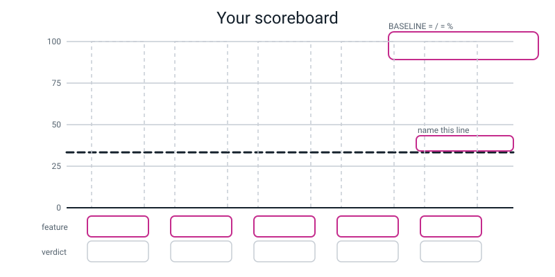
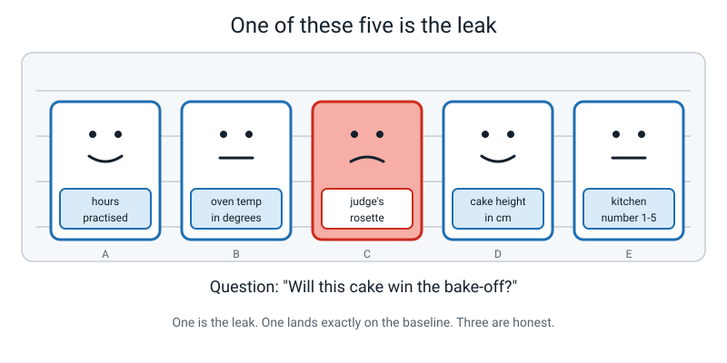
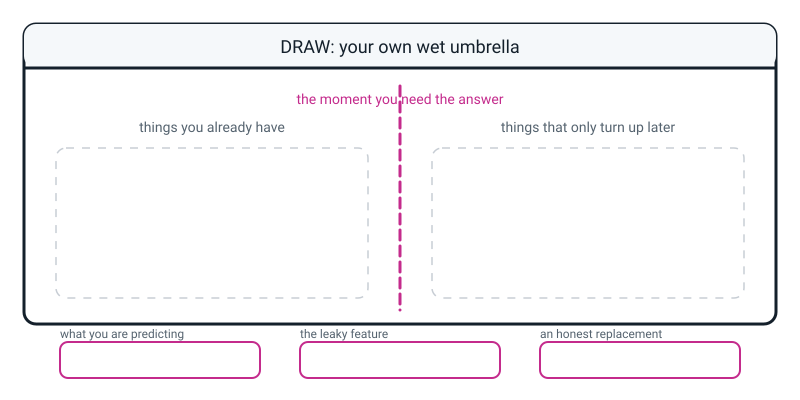

# Workbook — Week 12: Useful, Useless, and Sneaky Features

**Name:** ________________________________  **Date:** ______________

[📖 Read the chapter first](../student-guide/week-12.md) · [Course Home](../README.md)

---

## ✅ Warm-Up (5 min)

Five quick questions about **last week**.

**W1.** What is a **feature**? (The definition has one word doing all the work — make sure it's in there.)

________________________________________________________________

**W2.** In a table of five spoons with a `label` column saying which spoon it is, which columns are the features and which is the label?

________________________________________________________________

**W3.** Two people measure the same apple. One writes 7 cm, one writes 9 cm. Who measured it wrong?

________________________________________________________________

**W4.** Name the three things every good **measuring instruction** must contain.

1. ______________________ 2. ______________________ 3. ______________________

**W5.** You build a machine with two classes, `dog` and `cat`, and show it a rabbit. What does it say, and whose fault is that?

________________________________________________________________

---

## ✍️ Practice Set A — Understand It

**A1. Fill in the blanks.**

The **baseline** is how well you would do by ignoring every feature and always guessing the ____________________ label.

A feature that cannot beat the baseline is worth ____________________.

A feature that scores **100%** is usually a ____________________ feature, which means it already contains the ____________________.

You must compute the baseline ____________________ you score any feature.

---

**A2. Circle the right answer.**

A table has 20 animals: **12 dogs, 5 cats, 3 rabbits**. What is the baseline?

&nbsp;&nbsp;&nbsp;(a) 33.3% &nbsp;&nbsp;&nbsp; (b) 50.0% &nbsp;&nbsp;&nbsp; (c) 60.0% &nbsp;&nbsp;&nbsp; (d) 12.0%

Show your working: ____________________________________________

---

**A3. True or false — and explain.**

> "A feature that scores 58% is a good feature, because 58% is over half."

Circle one: **TRUE** / **FALSE**

Explain, and give an example of a table where 58% would be terrible:

________________________________________________________________

________________________________________________________________

---

**A4. Match the pairs.**

| Word | Letter | | | Meaning |
|---|---|---|---|---|
| baseline | ______ | | **A** | Knowing it makes no difference at all — it lands exactly on the line |
| useful feature | ______ | | **B** | Stand at the moment you need the answer and ask: do I have this yet? |
| useless feature | ______ | | **C** | How well you'd do by always guessing the most common label |
| leaky feature | ______ | | **D** | Knowing it makes your guess better than the baseline |
| the three-second test | ______ | | **E** | It already contains the answer, so it scores 100% and is worthless |

---

**A5. Label the diagram.**

The baseline for this table is **4/12 = 33.3%**. Fill in the box at the top. Then draw and label the five bars using the scores below, name the dashed line, and write a verdict under each one.

| feature | score |
|---|---|
| `sticker_says` | 12/12 = 100% |
| `colour` | 11/12 = 91.7% |
| `mass_g` | 10/12 = 83.3% |
| `length_cm` | 8/12 = 66.7% |
| `quadrant` | 4/12 = 33.3% |


*Figure W12.1 — Your scoreboard. Baseline box first, then the line, then the bars.*

---

**A6. Compute five baselines.** Fraction and percentage for each.

| # | The table | Baseline (fraction) | Baseline (%) |
|---|---|---|---|
| (a) | 4 apples, 4 oranges, 4 bananas | ____________ | ____________ |
| (b) | 12 dogs, 5 cats, 3 rabbits | ____________ | ____________ |
| (c) | 95 ordinary emails, 5 spam | ____________ | ____________ |
| (d) | 7 pass, 7 fail | ____________ | ____________ |
| (e) | 30 red, 12 blue, 5 green, 3 yellow | ____________ | ____________ |

In table **(c)**, a spam detector scores **94%**. Is it any good? Explain.

________________________________________________________________

________________________________________________________________

---

## ✍️ Practice Set B — Use It

**B1. Score a feature by counting.** Ten school mornings. The label is `bus_late`.

| id | weather | bus_late |
|---|---|---|
| 1 | rain | yes |
| 2 | rain | yes |
| 3 | rain | yes |
| 4 | rain | no |
| 5 | dry | no |
| 6 | dry | no |
| 7 | dry | no |
| 8 | dry | no |
| 9 | dry | yes |
| 10 | rain | yes |

**Step 1 — the baseline, before anything else.**

```
late = ______   not late = ______   Baseline = ______ / 10 = ______ %
```

**Step 2 — group the rows and take the commonest label in each group.**

| weather | late: yes | late: no | best guess | gets right |
|---|---|---|---|---|
| rain | ______ | ______ | ______________ | ______ of ______ |
| dry | ______ | ______ | ______________ | ______ of ______ |

**Step 3 — add up and divide.**

```
______ + ______ = ______   →   ______ / 10 = ______ %
```

**Step 4 — the verdict.** ______ percentage points above the baseline, so `weather` is ____________________.

---

**B2. Score a number feature by banding.** Eight pets. The label is `animal`.

| id | mass_g | animal |
|---|---|---|
| 1 | 3,200 | cat |
| 2 | 4,100 | cat |
| 3 | 4,800 | cat |
| 4 | 5,500 | cat |
| 5 | 6,000 | dog |
| 6 | 12,400 | dog |
| 7 | 18,000 | dog |
| 8 | 5,200 | dog |

(a) **Baseline:** ______ / 8 = ______ %

(b) **Sort by class.** Cats: ______________________________ Dogs: ______________________________

(c) **Where do they overlap?** Which cat is heavier than which dog? ______________________________

(d) **Try the rule `IF mass_g < 5350 THEN cat ELSE dog`.** Score it:

| id | mass_g | predicted | true | ✓/✗ |
|---|---|---|---|---|
| 1 | 3,200 | | cat | |
| 2 | 4,100 | | cat | |
| 3 | 4,800 | | cat | |
| 4 | 5,500 | | cat | |
| 5 | 6,000 | | dog | |
| 6 | 12,400 | | dog | |
| 7 | 18,000 | | dog | |
| 8 | 5,200 | | dog | |

Score: ______ / 8 = ______ %

(e) **Now try to beat it.** Move the threshold and see what happens. Best score you can find: ______ / 8 = ______ %

(f) **Can you get 8 out of 8?** ______ Why not?

________________________________________________________________

---

**B3. Here is a situation — what goes wrong, and why?**

> A hospital builds a system to spot flu from patient records. One of its features is `flu_tablets_prescribed`. The system scores **100% accuracy** on ten years of records. Everyone is delighted. It gets switched on in the waiting room.

(a) What happens on the very first real patient?

________________________________________________________________

(b) When does `flu_tablets_prescribed` actually become known?

________________________________________________________________

(c) Give a non-leaky replacement feature that would genuinely be available in the waiting room:

________________________________________________________________

(d) Why did nobody spot this during ten years of testing?

________________________________________________________________

________________________________________________________________

---

**B4. Here is a situation — what goes wrong, and why?**

> Anika scores a feature and gets **15%**. The baseline for her table is **60%**. She says "I've broken the maths — a feature can't be worse than guessing."

(a) Has she broken the maths? ____________________

(b) What has she actually done wrong? (Hint: look at what she predicted *inside each group*.)

________________________________________________________________

________________________________________________________________

(c) Suppose one of her groups has 8 dogs and 2 cats in it. What should she predict for everything in that group, and what did she probably predict instead?

Should predict: ____________________ Probably predicted: ____________________

(d) After she fixes it, what is the **lowest** score a properly-scored feature can possibly get? ____________________ Why?

________________________________________________________________

---

**B5. The same column, twice.** In the fruit bowl, `sticker_says` was a fatal leak. At a supermarket self-checkout, the very same column is a perfectly good feature.

(a) What makes the difference? ______________________________________

(b) Give **two more** columns that would be honest in one place and a leak in another. Say where each is which.

| The column | Honest here | A leak here |
|---|---|---|
| | | |
| | | |

---

## 🧩 Puzzle of the Week


*Figure W12.2 — Five suspects. One is the leak.*

**Twenty cakes were entered in a bake-off. Five won a prize; fifteen didn't.** The label is `won_a_prize`.

Somebody scored all five features and wrote down the numbers, but forgot to write the verdicts:

| | feature | score |
|---|---|---|
| **A** | `hours_practised` | 17/20 |
| **B** | `oven_temperature_c` | 16/20 |
| **C** | `judges_rosette_on_the_plate` | 20/20 |
| **D** | `cake_height_cm` | 18/20 |
| **E** | `kitchen_number_1to5` | 15/20 |

**P1.** What is the baseline?

```
Most common label = ______________   Baseline = ______ / 20 = ______ %
```

**P2.** Convert every score to a percentage and to a gap above the baseline.

| | feature | score | % | gap vs baseline | verdict |
|---|---|---|---|---|---|
| A | `hours_practised` | 17/20 | ______ | ______ | ______________ |
| B | `oven_temperature_c` | 16/20 | ______ | ______ | ______________ |
| C | `judges_rosette_on_the_plate` | 20/20 | ______ | ______ | ______________ |
| D | `cake_height_cm` | 18/20 | ______ | ______ | ______________ |
| E | `kitchen_number_1to5` | 15/20 | ______ | ______ | ______________ |

**P3.** Which one is the **leak**? Write one sentence saying **when** that value becomes known.

________________________________________________________________

**P4.** Which one is **useless**? How can you tell instantly, without reading the feature name at all?

________________________________________________________________

**P5.** One of the three honest features is barely worth keeping. Which one, and by how much does it beat the baseline? ______________________

**P6.** Write the final feature list, ranked, with the two removals crossed out.

________________________________________________________________

---

## 🤔 Think Deeper

**T1.** In the chapter there's a claim that sounds ridiculous: *"a hard job should produce some wrong answers."*

Write a paragraph explaining why. Use the green apple and the green banana, or the 190 g apple and the 185 g orange, as your example.

________________________________________________________________

________________________________________________________________

________________________________________________________________

________________________________________________________________

________________________________________________________________

________________________________________________________________

---

**T2.** How far above the baseline does a feature have to be before it's "good enough"?

**Nobody knows, and there's no formula.** Write about two systems where the answer is completely different: one where barely above baseline is fine, and one where it isn't nearly good enough. Say what actually decides it.

________________________________________________________________

________________________________________________________________

________________________________________________________________

________________________________________________________________

________________________________________________________________

________________________________________________________________

---

## 🛠️ Build It

### Page 12.4 — The leak hunt

Six real jobs. Each has four candidate features and **exactly one leak**. Circle the leak, then write **when that value becomes known** — and "it's cheating" does not count.

**1. Will this parcel arrive late?**
`distance_km` · `courier_late_rate_last_month` · `parcel_mass_kg` · `customer_complaint_filed`

Leak: ____________________ When does it become known? ____________________________

**2. Will this student join the football team?**
`sport_played_last_year` · `attended_the_trial` · `height_cm` · `team_shirt_number`

Leak: ____________________ When does it become known? ____________________________

**3. Will it rain tomorrow?**
`today_pressure_change_over_6h` · `today_humidity_percent` · `month` · `tomorrow_umbrella_sales`

Leak: ____________________ When does it become known? ____________________________

**4. Is this song going to be a hit?**
`artist_followers_at_release` · `playlist_adds_in_first_week` · `tempo_bpm` · `weeks_in_top_10`

Leak: ____________________ When does it become known? ____________________________

**5. Does this patient have flu?**
`days_of_symptoms_so_far` · `temperature_c` · `age_years` · `flu_tablets_prescribed`

Leak: ____________________ When does it become known? ____________________________

**6. Will this customer cancel this month?**
`days_since_last_login` · `support_tickets_last_30_days` · `months_subscribed` · `cancellation_reason_text`

Leak: ____________________ When does it become known? ____________________________

**(g) What do all six leaks have in common?**

________________________________________________________________

**(h) How would you check that a replacement feature is honest?**

________________________________________________________________

________________________________________________________________

---

### Page 12.5 — Score your own kitchen table

Get out your **Week 11 kitchen table** — the five objects with the five features.

**Before you start, make a prediction.** Which of your five features do you think will win? ____________________

**Step 1 — the baseline goes in the box FIRST.**

```
┌──────────────────────────────────────────┐
│  BASELINE = ______ / 5 = ______ %        │
└──────────────────────────────────────────┘
```

How did you get it? ______________________________________________

**Step 2 — score each feature by counting.** One grid per feature.

**Feature 1: ____________________**

| group | how many of each label | best guess | gets right |
|---|---|---|---|
| | | | |
| | | | |
| | | | |

Score: ______ / 5 = ______ %

**Feature 2: ____________________**

| group | how many of each label | best guess | gets right |
|---|---|---|---|
| | | | |
| | | | |
| | | | |

Score: ______ / 5 = ______ %

**Feature 3: ____________________**

| group | how many of each label | best guess | gets right |
|---|---|---|---|
| | | | |
| | | | |
| | | | |

Score: ______ / 5 = ______ %

**Feature 4: ____________________**

| group | how many of each label | best guess | gets right |
|---|---|---|---|
| | | | |
| | | | |
| | | | |

Score: ______ / 5 = ______ %

**Feature 5: ____________________**

| group | how many of each label | best guess | gets right |
|---|---|---|---|
| | | | |
| | | | |
| | | | |

Score: ______ / 5 = ______ %

**Step 3 — the scoreboard, ranked.**

| rank | feature | score | vs baseline | verdict |
|---|---|---|---|---|
| 1 | | | | |
| 2 | | | | |
| 3 | | | | |
| 4 | | | | |
| 5 | | | | |

**(a) Did any feature score 100%? Is it a leak?** ____________________

Explain how you decided:

________________________________________________________________

**(b) Was your prediction right?** ______ If not, which feature actually won? ____________________

**(c) Did any feature land exactly on the baseline? Which, and why?**

________________________________________________________________

---

### Page 12.6 — Why 100% is bad news

Write **at least five sentences.** You must cover all four of these:

- what a perfect score actually measures
- the usual reason a feature scores 100%
- the three-second test, in your own words
- why a hard job should produce some wrong answers

________________________________________________________________

________________________________________________________________

________________________________________________________________

________________________________________________________________

________________________________________________________________

________________________________________________________________

________________________________________________________________

________________________________________________________________

---

## 🎨 Draw It

Invent your **own wet umbrella** — a leaky feature nobody has used in this course. Draw the moment of prediction as a line down the middle: what you already have on the left, what only turns up later on the right. Fill in the three boxes.


*Figure W12.3 — Your page.*

> **What a good answer might look like:** the question is **"will my little brother finish his dinner?"** and the drawing shows a kitchen table with the dashed line running down the middle of it.
>
> On the **left** (things you have at the moment you need the answer): how many hours since he last ate · whether it's a food he asked for · what time it is · whether he's already asked for pudding.
>
> On the **right** (things that only turn up later): **an empty plate** · a clean fork in the sink · him asking for seconds · Mum saying "good boy".
>
> Bottom boxes: *will he finish his dinner?* · *the empty plate — 100% accurate and completely useless* · *whether it's a food he asked for.*
>
> **What a weak answer looks like:** putting something on the right just because it's about the future — like *tomorrow's weather*. A leak isn't just "later", it's **later AND it's a record of the outcome.** Tomorrow's weather is a bad feature for predicting dinner because it's irrelevant, not because it leaks.

---

## 📊 Self-Check

| I can… | 😀 got it | 🙂 nearly | 😕 not yet |
|---|---|---|---|
| Compute the baseline for a table by counting the labels | ☐ | ☐ | ☐ |
| Score a single feature by counting, as a fraction and a percentage | ☐ | ☐ | ☐ |
| Rank features as useful, useless or leaky using numbers, not feelings | ☐ | ☐ | ☐ |
| Spot a leak with the three-second test, and say *when* the value becomes known | ☐ | ☐ | ☐ |
| Explain why a score below the baseline means my rule is wrong, not my feature | ☐ | ☐ | ☐ |

One thing I'd like explained again:

________________________________________________________________

---

## ✅ Answers

<details>
<summary>Check your answers</summary>

### Warm-Up

**W1.** A feature is **one measured description of one example** — one column in your table. The word doing all the work is **measured**: "quite heavy" is not a weak feature, it is not a feature at all.

**W2.** The five measurement columns are the features. The `label` column — which spoon it is — is the label. *(And it's the label because you chose to cover it, not because it's last.)*

**W3.** **Neither.** One measured top to bottom, one measured across the widest point. The **instruction** was missing, and the fix is to rewrite the sentence, not to blame a person.

**W4.** A **tool** (or a fixed list) · a **unit** · a **rounding**. For example: *kitchen scale · grams · nearest gram.*

**W5.** It says **dog or cat**, confidently, every time. **It's your fault, not the machine's** — you built two classes and there is no rabbit box. A machine can only ever answer with a class you gave it.

---

### Practice Set A

**A1.** most common · **nothing at all** · **leaky** · the **answer** · **before**.

**A2.** **(c) 60.0%.**

```
Biggest group = dogs, 12 of them.
12 / 20 = 0.60 = 60%
```

*Why (a) 33.3% is the tempting wrong answer:* it's 1 ÷ 3 classes. The baseline is **not** one over the number of classes — it's the size of the **biggest group** over the total. Those only match when the groups are all the same size.

**A3.** **FALSE.**

58% only means something next to the baseline. If the baseline is 33.3%, then 58% is decent. If the baseline is 60% — as in question A2's animal table — then **58% is worse than guessing**, and the feature is not merely weak, it's actively worse than not asking.

A table where 58% is terrible: **95 ordinary emails and 5 spam.** The baseline is 95%. A detector scoring 58% is catastrophically worse than a machine that says "ordinary" to everything and has never read an email in its life.

**A4.** baseline = **C** · useful feature = **D** · useless feature = **A** · leaky feature = **E** · the three-second test = **B**.

**A5.** Baseline box: **BASELINE = 4/12 = 33.3%.** The dashed line is **the baseline**. The five bars and verdicts:

| feature | bar height | verdict to write |
|---|---|---|
| `sticker_says` | 100% — top of the chart | 🚨 **LEAKY — remove** |
| `colour` | 91.7% | ✅ very useful (+58.4) |
| `mass_g` | 83.3% | ✅ useful (+50.0) |
| `length_cm` | 66.7% | ✅ useful (+33.4) |
| `quadrant` | 33.3% — flat on the line | ❌ **useless — remove** |

The two things to check on your drawing: `quadrant` must sit **exactly** on the dashed line, not just near it. And `sticker_says` must be marked as a problem despite being the tallest bar.

**A6.**

| # | Baseline (fraction) | Baseline (%) |
|---|---|---|
| (a) | 4/12 | **33.3%** — three-way tie, pick any one and say so |
| (b) | 12/20 | **60.0%** |
| (c) | 95/100 | **95.0%** |
| (d) | 7/14 | **50.0%** — a tie |
| (e) | 30/50 | **60.0%** |

**Is a 94% spam detector any good in table (c)?** **No — it is worse than useless.** A machine that says "ordinary" to every single email, and has never looked at one, scores 95%. This is exactly why the baseline goes first: 94% sounds excellent right up until you know the floor.

---

### Practice Set B

**B1.**

**Step 1:** late = **5** (ids 1, 2, 3, 9, 10), not late = **5** (ids 4, 5, 6, 7, 8). It's a tie, so pick one and say so. **Baseline = 5/10 = 50%.**

**Step 2:**

| weather | late: yes | late: no | best guess | gets right |
|---|---|---|---|---|
| rain | 4 | 1 | **late** | 4 of 5 |
| dry | 1 | 4 | **not late** | 4 of 5 |

**Step 3:** `4 + 4 = 8` → `8 / 10 = **80%**`

**Step 4:** **30 percentage points** above the baseline, so `weather` is **a useful feature.**

*Notice where it fails:* id 4 (rain, not late) and id 9 (dry, late). Two rows out of ten go against the pattern — and that is a feature doing an honest job on a real problem, not a broken one.

**B2.**

(a) 4 cats and 4 dogs — a tie. **Baseline = 4/8 = 50%.**

(b) Cats: **3,200 · 4,100 · 4,800 · 5,500.** Dogs: **5,200 · 6,000 · 12,400 · 18,000.**

(c) **The 5,500 g cat is heavier than the 5,200 g dog.** They overlap between 5,200 and 5,500. No single threshold can put both of them on the correct side.

(d) Rule `IF mass_g < 5350 THEN cat ELSE dog`:

| id | mass_g | predicted | true | ✓/✗ |
|---|---|---|---|---|
| 1 | 3,200 | cat | cat | ✓ |
| 2 | 4,100 | cat | cat | ✓ |
| 3 | 4,800 | cat | cat | ✓ |
| 4 | 5,500 | dog | cat | ✗ |
| 5 | 6,000 | dog | dog | ✓ |
| 6 | 12,400 | dog | dog | ✓ |
| 7 | 18,000 | dog | dog | ✓ |
| 8 | 5,200 | cat | dog | ✗ |

**6 / 8 = 75%.**

(e) You can do better. **Push the threshold below 5,200** — for example `IF mass_g < 5100 THEN cat ELSE dog`. Now the 5,200 g dog is correctly called a dog, and only the 5,500 g cat is wrong: **7 / 8 = 87.5%.**

Or **push it above 5,500** — `IF mass_g < 5600 THEN cat ELSE dog`. Now the 5,500 g cat is right and the 5,200 g dog is wrong: also **7 / 8 = 87.5%.**

(f) **No, 8 out of 8 is impossible.** Whichever side of the overlap you put the boundary, one of those two rows lands on the wrong side. **Moving the threshold just swaps which row you get wrong** — it never fixes both. That isn't a failure of your arithmetic; it's a fact about a world in which some cats really are heavier than some dogs.

**B3.**
(a) **The feature is blank.** The patient has just walked in; nobody has prescribed anything. The system has no value to read, and its 100% accuracy is worth precisely nothing.
(b) **Only after a doctor has already diagnosed flu** and decided to treat it. The feature is a record of the answer, arriving after the answer.
(c) `days_of_symptoms_so_far` — known the moment the patient sits down. Also fine: `temperature_c`, `is_it_flu_season`, `household_member_already_diagnosed`.
(d) Because **in ten years of records, every flu patient already had the tablets column filled in.** In the past, the future has already happened. The leak is invisible when you test on history, and only appears the moment you use the system for real. That is exactly why the three-second test asks about **the moment of prediction**, not about the data.

**B4.**
(a) **No.** The maths is fine.
(b) She predicted **the less common label inside each group** — she wrote her rule the wrong way round. Scoring a feature properly means: inside each group, predict whichever label is actually commonest *in that group.*
(c) Should predict **dog** (8 of 10 right). She probably predicted **cat** (2 of 10 right).
(d) The lowest a properly-scored feature can get is **exactly the baseline.** Why: the worst possible case is that every group's commonest label is the same as the whole table's commonest label — and that is the baseline by definition. So **a score below the baseline is always a message about your rule, never about your feature.**

**B5.**
(a) **Whether the value exists at the moment you need the prediction.** At a self-checkout every item genuinely carries a sticker when it's scanned. Holding a plum from someone's garden, it doesn't. The column didn't change — the *moment* did.
(b) Two more, and any well-argued pair is right:

| The column | Honest here | A leak here |
|---|---|---|
| `barcode_scanned` | A shop till, where every item is scanned before the price is decided | Identifying an unknown object from a photo — no barcode in the photo |
| `ticket_number` | A cloakroom, where the ticket is issued before you collect the coat | Predicting who will attend an event — tickets are issued after they decide |
| `bank_transaction_description` | Sorting your own past spending into categories | Predicting whether a payment *will* happen — it doesn't exist yet |

---

### Puzzle of the Week

**P1.** Most common label = **did not win a prize**, 15 of 20. **Baseline = 15/20 = 75%.**

*(Careful — the tempting mistake is to see "five won" and reach for 5/20 = 25%. The baseline uses the **biggest** group.)*

**P2.**

| | feature | score | % | gap | verdict |
|---|---|---|---|---|---|
| A | `hours_practised` | 17/20 | **85.0%** | **+10.0** | ✅ useful |
| B | `oven_temperature_c` | 16/20 | **80.0%** | **+5.0** | ✅ useful, but only barely |
| C | `judges_rosette_on_the_plate` | 20/20 | **100%** | +25.0 | 🚨 **LEAKY — remove** |
| D | `cake_height_cm` | 18/20 | **90.0%** | **+15.0** | ✅ very useful — the best honest one |
| E | `kitchen_number_1to5` | 15/20 | **75.0%** | **0.0** | ❌ **useless — remove** |

**P3.** **C — `judges_rosette_on_the_plate`.** The rosette is only put on the plate **after the judges have already decided the winners.** At the moment you want the prediction — cake on the table, judging not started — every plate is bare. It isn't a clue about winning, it's a copy of winning.

**P4.** **E — `kitchen_number_1to5`.** You can tell **without reading the name at all**, just from the number: 15/20 is **exactly** the baseline. Landing precisely on the line means the feature carries no information about this label whatsoever. Which kitchen you were given was pure luck of the draw, and luck doesn't bake.

**P5.** **B — `oven_temperature_c`**, at 80% against a 75% baseline: only **+5.0 percentage points.** It's above the line, so it isn't useless — but with twenty rows, five points is one single cake. You'd want a lot more evidence before trusting it.

**P6.**

```
1. cake_height_cm          18/20 = 90.0%   (+15.0)  keep
2. hours_practised         17/20 = 85.0%   (+10.0)  keep
3. oven_temperature_c      16/20 = 80.0%   (+5.0)   keep, but barely

~~judges_rosette_on_the_plate  20/20 = 100%   LEAK — remove~~
~~kitchen_number_1to5          15/20 = 75.0%  USELESS — remove~~
```

**Final feature list: `cake_height_cm`, `hours_practised`, `oven_temperature_c`.** Note that you removed the highest-scoring feature in the table, and the table got better for it.

---

### Think Deeper

**T1. Model answer:**

> Telling apples from oranges by weight is genuinely difficult, because one 190 g apple really does weigh more than one 185 g orange. That's not a mistake anybody made — nobody measured badly, and no threshold exists that fixes it. It's just what fruit is like. So if I built something that got all twelve right by weight alone, I shouldn't be pleased. I should be suspicious, because I know for a fact that rows 4 and 6 sit inside each other's territory, and something claiming otherwise has stopped describing the fruit.
>
> Same with the green apple and the green banana. Colour gets 11 out of 12 and loses exactly one, on the one row where the world genuinely doesn't cooperate. **Getting that row wrong is evidence colour is doing the real job.** A feature that never gets anything wrong on a hard problem isn't being cleverer than the problem — it's not doing the problem. It has found a shortcut, and the shortcut is usually that somebody left the answer lying around in a column.

*Full marks needs:* a specific overlapping pair, and the conclusion that **perfection on a hard job is evidence of a shortcut, not of skill.**

**T2. Model answer:**

> **Barely above baseline is fine:** an app that suggests which song to play next. If it's wrong, I press skip. It cost me two seconds and I fixed it myself. It only has to be a bit better than shuffle to be worth having, and nobody is harmed when it's wrong.
>
> **Barely above baseline is nowhere near good enough:** a system that decides whether someone gets a bank loan. Every wrong answer is one specific person refused money they should have had, and they can't press skip. It would need to be far better than baseline before anyone should switch it on — and even then, "far better" doesn't tell you how much better, because the real question is what it costs the person who gets refused unfairly.
>
> **What actually decides it: the cost of being wrong, and who pays that cost.** Not the mathematics. There is no number that comes out of the arithmetic and tells you the threshold; it's a judgement about consequences, made by people, and people who do this for a living argue about it constantly.
>
> **The one thing you can always say:** below or on the baseline is never good enough, because you could have got that by guessing.

*Full marks needs:* two examples with genuinely different stakes, plus the recognition that the deciding factor is **consequences**, not maths — and the easy half at the end.

---

### Build It

**Page 12.4 — the leak hunt:**

| # | Job | The leak | When does it become known? | An honest replacement |
|---|---|---|---|---|
| 1 | Parcel arriving late | `customer_complaint_filed` | Only **after** the parcel was already late — a complaint is a reaction to the outcome | `distance_km` with `courier_late_rate_last_month`, both known the moment it's posted |
| 2 | Joining the football team | `team_shirt_number` | Only after they have **already joined**. Nobody is issued a shirt number in advance | `attended_the_trial` (yes/no), known before the decision |
| 3 | Rain tomorrow | `tomorrow_umbrella_sales` | **Tomorrow.** It is literally from the future | `today_pressure_change_over_6h` — a genuine early signal available today |
| 4 | Song becoming a hit | `weeks_in_top_10` | Only after it has already been a hit. It **is** the answer | `playlist_adds_in_first_week`, known early and honestly predictive |
| 5 | Patient has flu | `flu_tablets_prescribed` | Only after a doctor has already diagnosed flu. At prediction time it is always blank | `days_of_symptoms_so_far`, known the moment they walk in |
| 6 | Customer cancelling | `cancellation_reason_text` | Only for people who have **already cancelled**. For everyone else it's empty — so the model learns "if this box has any text in it, they cancelled" | `days_since_last_login`, which exists for every customer at any moment |

**(g) What they have in common:** every single one is **a record of the outcome, or of a decision made after the outcome.** They are all in the future relative to the moment of prediction. None of them is a clue; each is a copy of the answer with a different name on it.

**(h) How to check a replacement is honest:** point at a clock. **At this exact moment, does this value already exist — for *every* example, including the ones where nothing has happened yet?** If some rows would be blank, it is still a leak in disguise. That blankness is itself information the model will use, which is precisely what went wrong in number 6.

**Page 12.5 — model answer**, using the five-bottle table from Week 11:

**Baseline:** five bottles, five different labels — one of each. The most common label appears **once**. So **1/5 = 20%.**

| feature | grouping | score | vs baseline 20% | verdict |
|---|---|---|---|---|
| `empty_mass_g` | 92 / 410 / 265 / 78 / 118 — all different | 5/5 = 100% | +80 | separates perfectly — but see the note |
| `height_cm` | 24.0 / 27.5 / 19.0 / 16.0 / 23.5 — all different | 5/5 = 100% | +80 | same |
| `widest_cm` | 7.0 / 8.0 / 6.5 / 6.0 / 7.5 — all different | 5/5 = 100% | +80 | same |
| `material` | plastic ×3, steel ×1, glass ×1 | 3/5 = 60% | +40 | ✅ useful |
| `lid_type` | screw ×3, push ×1, straw ×1 | 3/5 = 60% | +40 | ✅ useful |

> **⚠️ The honest note you should write on your own page:** *"My table is too small to trust these scores. Four of my five features look brilliant on five rows, and that is evidence about the size of my table, not about my features."* With five rows and five different labels, almost **any** feature separates them, because almost any two objects differ in almost any measurement. That is worth more than the marks.

**(a) Did any feature score 100%? Is it a leak?** Almost certainly yes, and almost certainly **no** — and this is the important distinction on the page. A feature is leaky when it **contains the answer**: a sticker, an outcome, a decision made afterwards. `empty_mass_g` scoring 5/5 is not a leak, it's a five-row table where every object happens to weigh something different.

**Test it properly:** *would this value exist for a brand-new bottle I picked up in a shop and had never seen?* Yes — you can weigh it. **Not a leak. Just a tiny table.**

**(b) Prediction.** Whatever you wrote, what's being marked is the **honesty**, not the accuracy. A student who predicted wrong and says so has understood the point of counting better than one who happened to guess right.

**(c) Anything on the baseline?** The common answer is a column where **every row says the same thing** — `parts_count` all 1, or `colour` all silver. Those score exactly the baseline and are useless, for the simplest possible reason: **a column that never changes can never separate anything.**

**Page 12.6 — model write-up:**

> A hundred percent means my system got every single row right on the table I built it from — but I already knew the answers for those rows, so it isn't the achievement it looks like. What I actually want to know is whether it works on the next piece of fruit, and a perfect score on old data tells me nothing at all about that. A score measures my table, not the world.
>
> The usual reason for a perfect score is that one of my columns secretly contains the answer. In the fruit table it was `sticker_says`, which reads APPLE for every apple. It scored twelve out of twelve and it is worthless, because at the moment I need a prediction I'm holding an unknown fruit with no sticker on it.
>
> The test I use takes three seconds: stand at the moment I need the answer and ask whether I have this value yet. If it only turns up later — a diagnosis, a final score, a complaint, a shirt number, a rosette on a plate — it's a leak, and I cross it out no matter what it scored.
>
> The last part is the bit I found hardest to accept: a hard job should produce some wrong answers. If telling apples from oranges by weight is genuinely difficult, and one heavy apple weighs the same as one light orange, then a feature that never gets anything wrong isn't being cleverer than the problem. It isn't doing the problem.

**Marking:** all four points present = full marks. Three = nearly there. If the write-up says only "100% means it's cheating", it isn't finished — the missing piece is always **when** the value becomes known.

---

### Draw It

There is no single right drawing. A strong answer does three things:

1. The **dashed line is the moment of prediction**, and it's a moment in time — not a wall between "good" and "bad" features.
2. Everything on the **right** is both **later** *and* **a record of the outcome**. Just being in the future isn't enough: tomorrow's weather is later, but it's irrelevant rather than leaky.
3. The **honest replacement** in the third box captures *some* of the same information from something you actually have. If your replacement is unrelated to the leak, you haven't finished the thinking.

Test your own drawing with one question: *at the exact moment the dashed line marks, could I look up every single thing on the left-hand side?* If the answer is no for even one of them, that item belongs on the right.

</details>

---

[⬅ Week 11 workbook](week-11.md) · [📖 Week 12 chapter](../student-guide/week-12.md) · [Course Home](../README.md) · [Week 13 workbook ➡](week-13.md) · [Glossary](../../glossary.md)
