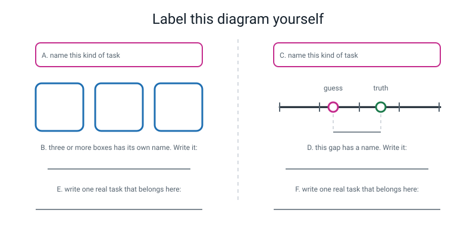
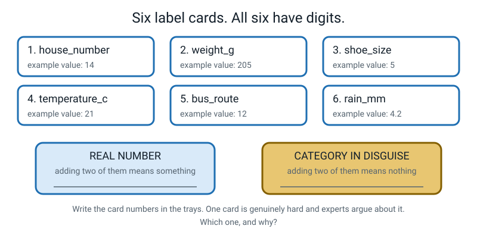
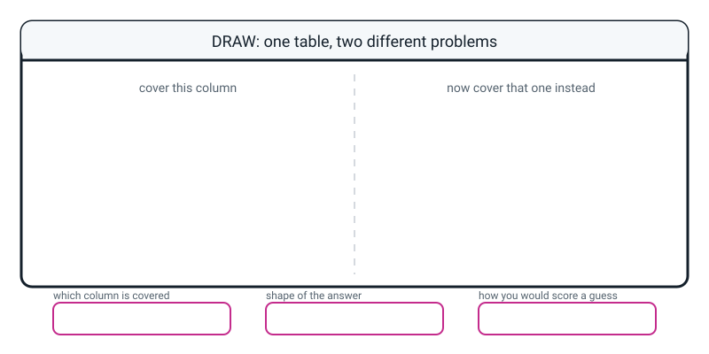

# Workbook — Week 13: Which One? or How Much?

**Name:** ________________________________  **Date:** ____________________

[📖 Student Guide for this week](../student-guide/week-13.md) · [Course Home](../README.md)

> Write in this book. Cross things out. If an answer changes your mind, leave the old one visible and write the new one underneath — that's a record of thinking, and it's worth more than a tidy page.

---

## ✅ Warm-Up (5 min)

Five questions from **last week**. No looking back until you've tried all five.

**W1.** Fill in the blank. A **feature** is one ________________ description of one example, and a **label** is the ________________ you want the machine to produce.

**W2.** Circle the one that describes a **useless** feature.

- (a) It tells you the answer straight away
- (b) It has almost the same value for every single example
- (c) It is hard to measure with a ruler
- (d) It is a word rather than a number

**W3.** You put `has_price_sticker` on your fruit table, and every apple in your bowl came from a shop with stickers. Why is that a **leaky** feature and not just a lucky one?

________________________________________________________________

________________________________________________________________

**W4.** Your fruit bowl has 4 apples, 4 oranges and 4 bananas. Somebody guesses `apple` every single time without looking. What score do they get, as a fraction **and** a percentage?

```
fraction: ______ / ______        percentage: ______ %
```

**W5.** True or false, **and explain**: "My feature got 100% right, so it must be a brilliant feature."

`TRUE  /  FALSE`  because ______________________________________

________________________________________________________________

---

## ✍️ Practice Set A — Understand It

**A1. Fill in the blanks.**

**Classification** predicts ________________ — the answer is a ________________ from a short, fixed list.

**Regression** predicts ________________ — the answer is a ________________ on a sliding scale.

**A2. Multiple choice.** Which one of these is **binary classification**? Circle one.

- (a) Which of the four school houses is this student in?
- (b) Will it rain tomorrow — yes or no?
- (c) How many millimetres of rain will fall tomorrow?
- (d) Which fruit is this: apple, orange or banana?

Now say what the other three are: (a) ________________ (c) ________________ (d) ________________

**A3. True or false, and explain.** "If the label is written with digits, the task is regression."

`TRUE  /  FALSE`

Explain with an example of your own: ____________________________

________________________________________________________________

**A4. Match the pairs.** Draw a line, or write the letter in the right-hand column.

| Task | | Kind of task |
|---|---|---|
| 1. Is this photo a cat or a dog? | ____ | (a) regression |
| 2. How many grams does this fruit weigh? | ____ | (b) binary classification |
| 3. Which country is this flag from? | ____ | (c) multi-class classification |
| 4. What price should this bike be? | ____ | |
| 5. Will the kitchen run out of lunches? | ____ | |
| 6. Which of three bus routes is fastest? | ____ | |

**A5. Label the diagram.** Write in the boxes and on the lines.


*Figure W13.1 — Bins on the left, ruler on the right. Label both, then write what each one is for.*

Fill in **A**, **C** (the two task names), **B** and **D** (the two other words), and then **E** and **F** — one real task of each kind, from your own life.

**A6. Work out the errors.** Bigger minus smaller, every time.

| | predicted | true | error |
|---|---|---|---|
| 1 | 120 g | 133 g | ________ |
| 2 | 150 g | 141 g | ________ |
| 3 | 480 g | 512 g | ________ |
| 4 | 205 g | 205 g | ________ |

Which prediction was **best**? ________ Which was **worst**? ________

Now the mean error of all four:

```
add the four errors:  ______ + ______ + ______ + ______  =  ______

divide by how many:   ______ ÷ 4  =  ______

MEAN ERROR = ______ g
```

---

## ✍️ Practice Set B — Use It

**B1.** Your school wants to predict **how many people will come to the summer fair**.

What kind of task is it? ________________

How do you know? Use the "nearly right" test in a full sentence:

________________________________________________________________

Last year 410 people came. The model said 400. What is the error, and is that a good prediction?

________________________________________________________________

**B2. What would go wrong?** A delivery company builds a model to predict a **house number** from a photo of a street. They treat it as regression, so the model is allowed to answer any number, and they score it with the error.

The true answer is house 14. The model says 15.5. Their scoring says: error = 1.5, which is excellent.

Name **two** things that are wrong here.

1. ______________________________________________________________

2. ______________________________________________________________

What should they have done instead? ____________________________

**B3. What would go wrong?** A teacher stops recording marks out of 100 and records only grades:

| grade | range |
|---|---|
| A | 80–100 |
| B | 60–79 |
| C | under 60 |

Two students score **79** and **80**.

What happens to them? __________________________________________

Two students score **80** and **99**. What happens to them?

________________________________________________________________

Name one person for whom the **grades** are more useful than the marks, and one person for whom the **marks** are more useful.

grades: ____________________  marks: ____________________

**B4.** A photo app currently answers "cat or dog". Somebody suggests flipping it to regression: **"what fraction of 100 people would call this a cat?"**

What do you **gain**? ____________________________________________

What does it **cost**? Be specific about the work somebody has to do.

________________________________________________________________

Is this flip worth it for a photo album app? `YES / NO` because __________________

________________________________________________________________

**B5.** Four predictions from a fruit-weight model. The errors were:

```
1 g   ·   1 g   ·   1 g   ·   40 g
```

Work out the mean error:

```
1 + 1 + 1 + 40 = ______        ______ ÷ 4 = ______ g
```

Somebody reports: *"our model is off by about eleven grams on average."* That sentence is true. Explain in two sentences why it is also **misleading**.

________________________________________________________________

________________________________________________________________

---

## 🧩 Puzzle of the Week — Six Cards, and Two Are Lying


*Figure W13.2 — Six cards, six numbers. Two of these columns are categories wearing number clothes.*

All six cards below hold digits. Sort them.

| card | column | your tray: **real number** or **category in disguise**? |
|---|---|---|
| 1 | `house_number` (14) | ________________________ |
| 2 | `weight_g` (205) | ________________________ |
| 3 | `shoe_size` (5) | ________________________ |
| 4 | `temperature_c` (21) | ________________________ |
| 5 | `bus_route` (12) | ________________________ |
| 6 | `rain_mm` (4.2) | ________________________ |

**The test to use on each one:** add two of them together and read the result out loud. If it means something, it's a real number.

Now the hard part. **One of these six is genuinely arguable, and grown-ups who do this for a living disagree about it.** Which card, and what are the two sides of the argument?

card: ______   side 1: ______________________________________________

side 2: ______________________________________________________

---

## 🤔 Think Deeper

**T1.** Your student guide says: *"the task type isn't a property of the data. It's a property of your question."*

Take **your own** Week 12 table. Name two different prediction tasks you could build from it — one classification, one regression — and say which column you would cover for each. Then say which of the two you would actually build, and who would use it. Write a paragraph.

________________________________________________________________

________________________________________________________________

________________________________________________________________

________________________________________________________________

________________________________________________________________

________________________________________________________________

**T2.** Somebody tells you: *"regression is the more advanced one, because a number tells you more than a word."*

Give **two** reasons why that is wrong. At least one of your reasons must be about the **work somebody has to do** before any machine can learn anything.

________________________________________________________________

________________________________________________________________

________________________________________________________________

________________________________________________________________

---

## 🛠️ Build It

### Part 1 — All ten tasks, both ways

For every card, write the **other** version, name the **new label column**, and add one line: **which version is more useful in real life, and who for?**

| # | Original task | Kind | Flipped version | New label column | More useful for… |
|---|---|---|---|---|---|
| 1 | Is this message spam? | | | | |
| 2 | How many mm of rain tomorrow? | | | | |
| 3 | Which fruit: apple/orange/banana? | | | | |
| 4 | How many minutes will homework take? | | | | |
| 5 | Is this photo a cat or a dog? | | | | |
| 6 | How many runs will this batter score? | | | | |
| 7 | Which bus route is fastest: A, B or C? | | | | |
| 8 | What price for this second-hand bike? | | | | |
| 9 | Will the kitchen run out of lunches? | | | | |
| 10 | How many plays in the first week? | | | | |

**Checklist before you call this finished:**

- [ ] All ten flipped, including the one done in class
- [ ] Every flip is a **real, sayable question** — not "how much cat is this?"
- [ ] Every flip has a **named label column**, e.g. `spam_score`, not "a number"
- [ ] Every row says which version is more useful **and names a person**
- [ ] At least one row where you decided the **original** was better

### Part 2 — Bucket a number from your own table

Go back to your Week 12 table. Find a column that holds a number.

**The column I chose:** ________________  **Its unit:** ________________

**All its values, written out in order, smallest first:**

________________________________________________________________

**My three buckets.** Put the boundaries in the **empty gaps** between your numbers, not in the middle of a cluster.

| bucket name (a word a human would say) | range | which rows land here | how many |
|---|---|---|---|
| | | | |
| | | | |
| | | | |
| | | **total** | |

**Check:** does every row from your table appear exactly once? `YES / NO`

**What the bucketing threw away.** Two sentences, with the **actual numbers from your own table**.

Loss 1 — two values inside the same bucket that are now the identical answer:

________________________________________________________________

Loss 2 — two values that were **close together** but landed in **different** buckets:

________________________________________________________________

---

## 🎨 Draw It

Draw **one table, two problems.** On the left, your table with one column covered by a flap and the task named underneath. On the right, the *same* table with a *different* column covered, and *that* task named.


*Figure W13.3 — One table, two problems. Fill the three reminder boxes before you draw.*

**What a good answer looks like.** One student drew a six-row cricket scorecard twice. On the left they covered `result` (won/lost/drew) and wrote *"multi-class classification — 3 boxes — score it with ticks."* On the right they covered `runs` and wrote *"regression — any number — score it with the gap."* Underneath, in the three boxes at the bottom, they wrote `result`, `a word from 3`, and `count the ticks` on the left half, and then crossed out and rewrote all three for the right half. The crossings-out were the best part of it.

---

## 📊 Self-Check

Tick one box per line. Be honest — a 😕 tells you exactly what to reread.

| I can… | 😀 easily | 🙂 with a bit of thought | 😕 not yet |
|---|---|---|---|
| Sort a task into classification or regression by the shape of its answer | ☐ | ☐ | ☐ |
| Say what binary and multi-class mean without looking | ☐ | ☐ | ☐ |
| Spot a number that is really a category in disguise | ☐ | ☐ | ☐ |
| Work out an error, and a mean error, on my own | ☐ | ☐ | ☐ |
| Flip a task from classification to regression, and back | ☐ | ☐ | ☐ |
| Say what bucketing threw away, using real numbers | ☐ | ☐ | ☐ |

**The one thing I still find confusing is:** ____________________

________________________________________________________________

---

## ✅ Answers

<details>
<summary>Check your answers</summary>

### Warm-Up

**W1.** A feature is one **measured** description of one example. A label is the **answer** you want the machine to produce.

**W2.** **(b)** — a feature with almost the same value for every example is **useless**, because it never helps you tell anything apart. (a) is a *leaky* feature, which is a different problem. (c) and (d) are not problems at all: plenty of good features are words, and plenty are hard to measure.

**W3.** Because the sticker isn't part of what an apple *is* — it's a trace of where this particular apple came from. It would separate your apples from your bananas perfectly in **your bowl**, and then fail completely on an apple from a tree, or a banana that happens to have a sticker. A leaky feature works brilliantly on the examples you happen to have and tells you nothing real. That's exactly what makes it dangerous: it *looks* like your best feature.

**W4.** 4 / 12 = **33%** (0.333, so 33%). That's the baseline, and it's the number any real model has to beat.

**W5.** **FALSE.** 100% can happen two completely different ways: your feature is genuinely excellent, **or** your feature is leaky and is really just reading the answer. It can also happen because your examples were too easy to tell apart. A perfect score is a reason to investigate, not to celebrate.

### Practice Set A

**A1.** Classification predicts **which one** — the answer is a **word (or category)** from a short, fixed list. Regression predicts **how much** — the answer is a **number** on a sliding scale.

**A2.** **(b)** is binary classification — exactly two boxes.
- (a) is **multi-class classification** — four boxes. The houses might be numbered 1 to 4, and they are still categories.
- (c) is **regression** — 4 mm is nearly 4.5 mm.
- (d) is **multi-class classification** — three boxes.

**A3.** **FALSE.** Bus route 12 is written with digits and is not nearly bus route 13. Shirt numbers, house numbers, postcodes and phone numbers are all categories wearing digits. The test that works: **try adding two of them.** 150 g + 200 g = 350 g and that means something. Player 7 + player 8 = player 15 and that means nothing. Accept any example where adding or averaging produces nonsense.

**A4.**

| Task | Answer | Why |
|---|---|---|
| 1. Cat or dog? | **(b)** binary | Two boxes |
| 2. How many grams? | **(a)** regression | 204 g is nearly 205 g |
| 3. Which country's flag? | **(c)** multi-class | About 195 boxes — still classification |
| 4. What price? | **(a)** regression | £4,400 is nearly £4,500 |
| 5. Run out of lunches? | **(b)** binary | Yes or no — even though lunches get counted, the *answer* is not a count |
| 6. Which of three routes? | **(c)** multi-class | Three named boxes; A, B, C are labels, not a scale |

**A5. The labelled diagram.**

- **A** = **classification** (the three bins — the answer is one of a short list)
- **B** = **multi-class classification** (three or more boxes)
- **C** = **regression** (the ruler — any number on a scale)
- **D** = **error** (the gap between the guess and the truth)
- **E** — any real classification task, e.g. "is this message from someone in my contacts?" or "which of my three water bottles is this?"
- **F** — any real regression task, e.g. "how many minutes until the bus comes?" or "how heavy is my school bag today?"

If your **E** or **F** is a number-shaped category (like "which bus route"), that belongs in **E**, not **F**. Check it with the addition test.

**A6.**

| | predicted | true | error | working |
|---|---|---|---|---|
| 1 | 120 | 133 | **13 g** | 133 − 120 |
| 2 | 150 | 141 | **9 g** | 150 − 141 — the guess was **above** the truth this time, so bigger − smaller goes the other way round |
| 3 | 480 | 512 | **32 g** | 512 − 480 |
| 4 | 205 | 205 | **0 g** | Exactly right. Error 0 is allowed — but be a bit suspicious if it happens over and over |

Best: **row 4** (error 0). Worst: **row 3** (error 32).

```
13 + 9 + 32 + 0  =  54
54 ÷ 4           =  13.5

MEAN ERROR = 13.5 g
```

### Practice Set B

**B1.** **Regression.** The test in a sentence: *"if 410 people came and the model said 400, that is nearly right — so the answer is a number on a scale, not a box."*

Error = 410 − 400 = **10 people**.

Is that good? **It depends what the number is for.** For deciding roughly how many chairs to put out: excellent. For ordering exactly enough food so nothing is wasted and nobody misses out: 10 people is 10 lunches, which might matter a lot. Any answer that doesn't ask "good for what?" is incomplete — that's the habit this question is building.

**B2. Two things wrong:**

1. **A house number is a category, not a measurement.** House 14 and house 15 are next-door neighbours, but house 14 and house 15.5 don't exist as "nearly the same house" — 15.5 isn't a house at all. The model is allowed to produce answers that cannot exist.
2. **The error is meaningless as a score.** "Off by 1.5" sounds tiny, but a parcel delivered to the wrong house is 100% wrong, exactly as wrong as delivering it to house 90. There is no partial credit for nearly finding somebody's front door.

**What they should have done:** treat it as **classification** — the answer is one of the house numbers that actually exist on that street — and score it with ticks and crosses. Full marks if you also noticed that the list of boxes changes street by street, which is a real practical difficulty and worth saying.

**B3.**

- **79 and 80:** one mark apart, and they get **different grades** (B and A). The bucketing has turned a one-mark difference into the biggest visible difference on the report.
- **80 and 99:** nineteen marks apart, and they get **the same grade** (A). Those two students are now literally the same answer.

That is both losses of bucketing, in one question.

**Who wants which:** the **grades** are more useful to somebody scanning two hundred reports quickly, or to a form that only has room for one letter — and to a student who just wants to know "did I pass?". The **marks** are more useful to the teacher deciding who needs help, to the student who wants to know they improved from 62 to 78 (both B), and to anyone comparing two students inside the same grade. Accept any sensible named person with a reason.

**B4.**

**You gain:** the ability to express doubt. A photo that is 50/50 gets a genuinely different answer from one that is obvious, and a person could set their own cut-off, or flag the uncertain ones for a human to check.

**It costs:** somebody has to **produce those numbers for every training photo.** There is no cat-o-meter. To get an honest "fraction of 100 people" you would have to ask a hundred people about every single photo — a hundred times the labelling work — and even then you would be measuring *what people think*, not what is true.

**Worth it for a photo album app? NO.** Nobody sorting their holiday photos will ever look at "63% cat". You'd pay a hundred times the cost for information that never gets used. It *would* be worth it somewhere ambiguity matters — for example a vet's record system flagging photos a human should re-check.

**B5.**

```
1 + 1 + 1 + 40 = 43
43 ÷ 4         = 10.75 g
```

Why "about eleven grams on average" is misleading: **it describes a model that doesn't exist.** It sounds like a model that is consistently a bit off, when in fact this model was **superb three times out of four and catastrophic once.** The mean cannot tell those two stories apart, and the one huge error is hiding inside it.

What you should report instead: the mean **and** the worst single error, or the list. (You'll meet a much sharper version of this problem in Week 20, where a single number lies about a whole model.)

### Puzzle of the Week

| card | column | tray | why |
|---|---|---|---|
| 1 | `house_number` | **category in disguise** | House 14 + house 16 = house 30, which means nothing. The numbers order the street; they don't measure anything |
| 2 | `weight_g` | **real number** | 150 g + 200 g = 350 g, and that's a real weight |
| 3 | `shoe_size` | **arguable — see below** | |
| 4 | `temperature_c` | **real number** | You can average temperatures and the answer means something |
| 5 | `bus_route` | **category in disguise** | Route 12 + route 13 = route 25, which means nothing |
| 6 | `rain_mm` | **real number** | 2 mm + 2 mm = 4 mm of rain |

**The arguable one is card 3, `shoe_size`.**

- **Side 1 — it's a real number.** The sizes are in order and roughly evenly spaced: the gap from size 4 to 5 is about the same amount of foot as the gap from 8 to 9. Averaging a family's shoe sizes gives you something meaningful-ish.
- **Side 2 — it's a category.** Sizes are whole steps with nothing in between, they're different in different countries (a UK 5 is not a US 5), and "size 5.5" exists in some brands and not others. A shoe is not 5 of anything.

**The honest answer is that nobody has settled this, and that's true of a whole family of data like this** — star ratings, school grades, "how much do you agree, 1 to 5". They're in order, so they're not pure categories. The gaps aren't equal, so they're not proper numbers. What people actually do is **try both and see which works better for their problem.** If you argued for `temperature_c` being tricky instead — because 20°C isn't "twice as hot" as 10°C — that's a genuinely good objection and you should be credited for it. It's still a real number for our purposes: you can add and average it sensibly.

### Think Deeper

**T1. A model answer**, using the ten-object writing-implements table from Week 12:

> *My table has ten writing things with columns `weight_g`, `length_cm`, `is_hollow`, `main_colour` and `kind` (pen / pencil / marker).*
>
> *Classification: cover `kind`. The answer is one of three words, so it's multi-class classification, and I'd score it by counting ticks.*
>
> *Regression: cover `weight_g`. The answer is a number — 5.5 g is nearly 6 g — so it's regression, and I'd score it with the error in grams.*
>
> *I'd build the classification one, because the person who'd use it is somebody tidying the pencil case: they need to know which drawer it goes in. Nobody needs to know that a pen weighs 6 grams. But if I worked in a shop that posted parcels, the weight one would suddenly be the useful one and the kind wouldn't matter at all.*

Marking yourself: full credit needs (1) two different named columns, (2) the correct task type for each, with the "nearly right" test applied, (3) a named **person** who would use one of them, and (4) — for top marks — a situation where the *other* one becomes the useful one. That last part is the actual idea.

**T2. Two reasons regression is not "more advanced":**

1. **Somebody has to produce the numbers.** For fruit weight we had a scale, so it was easy. For "how much of a cat is this photo?" there is no instrument, so you'd need a hundred human opinions per photo. When there's no honest way to produce the label, regression isn't available at all — however much you'd like it.
2. **A number often doesn't match the decision.** If all you need to know is "can I finish this homework before dinner?", then `quick / normal / long` answers it perfectly and 43.6 minutes doesn't answer it any better. The right task type is the one that matches the decision, and sometimes that's the word.

A third reason, if you want it: **in classification "nearly right" doesn't exist, which is sometimes exactly what you want.** A parcel goes to one house. A bus goes on one route. Being 90% of the way to the right answer is worth nothing in those jobs, and pretending otherwise would make the system worse, not more advanced.

### Build It — Part 1: all ten flips

**1 — Is this text message spam?** *Binary classification.*
→ **"How spammy is this message, from 0 to 100?"** New label `spam_score`, any number 0–100.
*More useful:* the **flipped** one, for the person **building the phone's filter** — with a score they can set their own line, binning anything over 90 and warning between 60 and 90. With yes/no they get somebody else's line and can't move it. But for the person **reading their inbox**, yes/no is what they want; nobody wants a percentage beside every message.

**2 — How many millimetres of rain tomorrow?** *Regression.*
→ **"Will it rain tomorrow — yes or no?"** New label `rain_tomorrow`, two values.
*More useful:* the **flipped** one for **anyone deciding whether to take a coat**, which is nearly everybody. The millimetres matter to a **farmer** deciding whether to irrigate and a **council** deciding whether the drains will cope. Same forecast, different users, different right answer.

**3 — Which fruit: apple, orange or banana?** *Multi-class classification.*
→ **"How heavy is this fruit in grams?"** New label `weight_g`, any number.
*More useful:* the **original**, for the **supermarket till**, which needs to know what it is to charge for it — the weight alone doesn't give you the price. This is a flip that loses the thing you actually wanted. (Note that the flipped version is exactly the task from the worked example; it's a perfectly good question, just not the till's question.)

**4 — How many minutes will this homework take?** *Regression.*
→ **"Quick (under 30), normal (30–60), or long (over 60)?"** New label `duration_bucket`, three values.
*More useful:* usually the **flipped** one, for the **student**, because the real decision is "can I do this before dinner?" The cost: 29 and 31 minutes now get different answers while 31 and 59 get the same one.

**5 — Is this photo a cat or a dog?** *Binary classification.*
→ **"What fraction of 100 people would call this a cat?"** New label `percent_saying_cat`, 0–100.
*More useful:* the **original** — this is the **bad flip**. Teaching the flipped version needs a hundred human opinions on every training photo, for information nobody sorting a photo album will look at. Only worth it where genuine ambiguity matters, like a vet's system flagging photos for a human to recheck.

**6 — How many runs will this batter score?** *Regression.*
→ **"Will they score a fifty — yes or no?"** New label `scored_fifty`, two values.
*More useful:* depends sharply on the user. For a **team selector** planning a batting order, the original number is far richer. For a **broadcaster** putting a milestone graphic on screen, the flipped one is exactly right. The flip's cost is brutal: 49 and 0 become the same answer, and so do 50 and 200.

**7 — Which bus route is fastest: A, B or C?** *Multi-class classification.*
→ **"How many minutes will each route take?"** — predict `minutes` once per route, then pick the smallest.
*More useful:* the **flipped** one, clearly, and it's the best flip on the list. You learn *by how much* one route wins, and winning by 2 minutes leads to a different decision from winning by 25 if the other route is more comfortable. And if a **fourth route** opens tomorrow you just predict it too — a three-box classifier cannot handle a route it has never heard of. The cost: you now need three good predictions instead of one choice.

**8 — What price for this second-hand bike?** *Regression.*
→ **"Cheap (under £2,000), mid (£2,000–£6,000) or pricey (over £6,000)?"** New label `price_band`.
*More useful:* the **original**, for the **person selling the bike**, who has to type an actual number into the listing. The bands are useful for a **buyer using a search filter**, who just wants to narrow the page. Same data, two different jobs.

**9 — Will the kitchen run out of lunches?** *Binary classification.*
→ **"How many lunches will be sold tomorrow?"** New label `lunches_sold`, a count.
*More useful:* the **flipped** one, for the **cook**, who has to decide how much food to prepare and cannot act on "yes". "Will you run out?" only becomes useful if you already know how many you cooked. This is the flip where the classification version quietly hides the number you actually needed.

**10 — How many plays in the first week?** *Regression.*
→ **"Will this song be a hit — yes or no?"** (Define "hit" as over 100,000 plays in week one.) New label `is_hit`.
*More useful:* the **original**, for anyone making a decision about money, because 99,000 plays and 5,000 plays are both "no" and they are not remotely the same outcome. The flipped version is useful only for a headline. And notice you had to **invent a threshold** to do the flip at all — whoever picks that threshold quietly controls the answer.

**Which flip is genuinely a bad idea?** Card 5. If you argued for card 3 or card 7 with a solid reason, take the credit — the argument is the point, not the card.

### Build It — Part 2: bucketing your own table

There's no single right answer, because it's your table. Here is a full model answer, then the marking criteria.

**Model answer.** My table has ten writing implements with a `weight_g` column: 4, 4, 5, 5, 6, 6, 7, 16, 18, 20.

| bucket name | range | which rows land here | how many |
|---|---|---|---|
| `feather` | under 5.5 g | 4, 4, 5, 5 | 4 |
| `normal` | 5.5 g to 10 g | 6, 6, 7 | 3 |
| `chunky` | over 10 g | 16, 18, 20 | 3 |
| | | **total** | **10** |

I put the boundaries in the empty gaps rather than in the middle of a cluster: there is a real gap between 7 and 16, and a smaller one between 5 and 6.

**Loss 1 — differences inside a bucket vanish.** The 16 g marker and the 20 g marker are now the identical answer, `chunky`, even though one is 25% heavier than the other. If I later wanted to tell my two markers apart, this column cannot help me at all any more.

**Loss 2 — differences that weren't really there got invented.** The 5 g pencil and the 6 g pen are **one gram apart** — closer to each other than the 16 g and 20 g markers are — and they land in **different** buckets, so they now look completely unrelated. Bucketing didn't just blur the small differences; it made one small difference look enormous, purely because of where I happened to draw a line.

**Marking criteria:**
- Three buckets with **named** ranges. Names must be words a person would say — not "1, 2, 3".
- Boundaries stated in actual numbers, **with units**.
- Every row assigned, none missing, none in two buckets, and the total matching your table.
- At least one loss identified **with the actual numbers from your own table**, not a generic sentence.
- Full credit needs **Loss 2** as well. Most people find Loss 1 and stop. Loss 2 is the interesting one.

### Draw It

There is no single right drawing. A good one has: the **same** table drawn twice, two **different** columns covered, both task types named correctly, and the scoring method written under each. If your two halves show two *different* tables, redraw it — the whole point is that nothing changed except your question.

</details>

---

[⬅ Week 12 workbook](week-12.md) · [📖 Week 13 chapter](../student-guide/week-13.md) · [Course Home](../README.md) · [Week 14 workbook ➡](week-14.md) · [Glossary](../../glossary.md)
