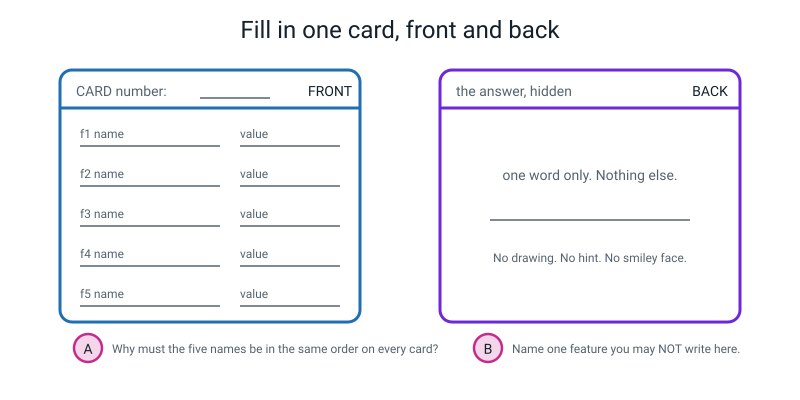
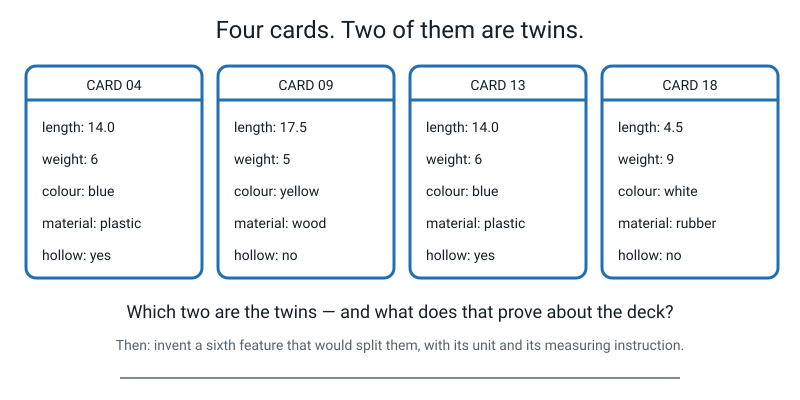
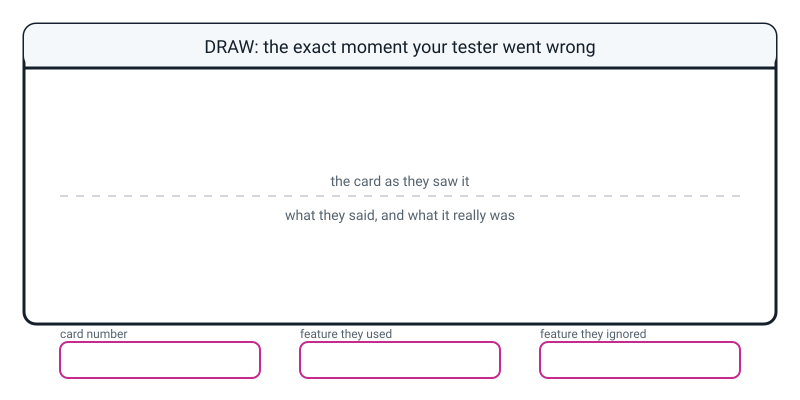

# Workbook — Week 14: Feature Card Deck: Make a Human Be the Model

**Name:** ________________________________  **Date:** ____________________

[📖 Student Guide for this week](../student-guide/week-14.md) · [Course Home](../README.md)

> This week your homework includes a real experiment on a real person. Write down what actually happened, not what you hoped would happen. An honest 6 out of 20 is worth more than a flattering 18.

---

## ✅ Warm-Up (5 min)

Five questions from **last week**. Try all five before looking anything up.

**W1.** Fill in the blanks. **Classification** predicts ________________ . **Regression** predicts ________________ .

**W2.** Which kind of task is each of these? Write `binary`, `multi-class` or `regression`.

| Task | Kind |
|---|---|
| Which of the four school houses is this student in? | ________________ |
| How heavy is this parcel? | ________________ |
| Is this email spam? | ________________ |

**W3.** A model predicted a parcel would weigh **480 g**. It actually weighed **512 g**.

```
error = ______ g
```

Was the model good? ____________________________________________

**W4.** True or false, **and explain**: "Bus route 12 is written with digits, so predicting it is regression."

`TRUE  /  FALSE`  because ______________________________________

**W5.** You bucket homework minutes into `quick` (under 30), `normal` (30–60) and `long` (over 60). Name **one** specific pair of times that the bucketing has now made look wrongly different, and one pair it has made look wrongly the same.

wrongly different: ______ and ______  wrongly the same: ______ and ______

---

## ✍️ Practice Set A — Understand It

**A1. Fill in the blanks.**

Every card has exactly ________ features on the front, in the ________ order on every single card, and ________ word on the back.

The leak test, word for word: *"Could a ________________ name the object from this ________________ alone? Then it's banned."*

**A2. Multiple choice.** Which one of these features is **banned** from a card front? Circle one.

- (a) `number_of_holes: 2`
- (b) `is_shiny: yes`
- (c) `found_in_the_kitchen: yes`
- (d) `weight_g: 6`

Now say **why** each of the other three is allowed:

(a) ______________________________________________________________

(b) ______________________________________________________________

(d) ______________________________________________________________

**A3. True or false, and explain.** "My tester got 18 out of 20, so my five features are excellent."

`TRUE  /  FALSE`

Name the **other** thing that could explain a score of 18/20:

________________________________________________________________

What question would you ask to find out which it was?

________________________________________________________________

**A4. Match the pairs.** Write the letter in the middle column.

| Word or rule | | What it means |
|---|---|---|
| 1. baseline | ____ | (a) turning a number into a named range |
| 2. bucketing | ____ | (b) working out what somebody used by checking their wrong answers |
| 3. leaky feature | ____ | (c) the score you'd get knowing nothing at all |
| 4. the elimination hunt | ____ | (d) no talking, no faces, no sounds during the test |
| 5. the silence rule | ____ | (e) a feature that hands over the answer |

**A5. Label the diagram.** Fill in the blank card, front and back, for a real object near you right now — and answer the two lettered questions at the bottom.


*Figure W14.1 — Five feature lines on the front, one label on the back. Fill the front; keep the back hidden.*

**A** — Why must the five names be in the same order on every card?

________________________________________________________________

**B** — Name one feature you may **not** write on this card, and why.

________________________________________________________________

**A6. Baseline arithmetic.** Fill in the whole table. Remember: matching names at random gets about **one** card right, whatever the deck size.

| deck size | tester's score | score as % | baseline as a fraction | baseline as % | gap in points |
|---|---|---|---|---|---|
| 10 cards | 7 correct | ______ | ______ | ______ | ______ |
| 12 cards | 8 correct | ______ | ______ | ______ | ______ |
| 20 cards | 13 correct | ______ | ______ | ______ | ______ |
| 20 cards | 6 correct | ______ | ______ | ______ | ______ |

Look at the last two rows. Both decks have 20 cards. Which one is a **better result**, and is the worse one still worth anything?

________________________________________________________________

---

## ✍️ Practice Set B — Use It

**B1.** Your friend built a **15-card** deck. Her tester got **9** right.

```
score    = ______ / 15  =  ______ %
baseline = ______ / 15  =  ______ %
gap      = ______ minus ______  =  ______ percentage points
```

Write the one-sentence result the way it should be written:

________________________________________________________________

**B2. What would go wrong?** You cannot find anybody, so you use your older brother as the tester. He has lived in your house all his life and has seen every one of your twenty objects hundreds of times.

What will happen to the score? ____________________________________

Why does that make the score **meaningless** rather than just high?

________________________________________________________________

________________________________________________________________

What are the **two** honest things to do about it?

1. ______________________________________________________________

2. ______________________________________________________________

**B3. What would go wrong?** In a rush, you build twenty cards but you (i) don't number them and (ii) write `weight_g` second on some cards and fourth on others.

What does (i) make impossible later? ______________________________

What does (ii) do to your experiment? Be precise about **what you end up measuring instead.**

________________________________________________________________

________________________________________________________________

**B4. Run an elimination hunt.** A tester got three cards wrong. Here they are.

| card | length_cm | weight_g | colour | material | truth | tester said |
|---|---|---|---|---|---|---|
| 05 | 18.0 | 45 | red | plastic | red ruler | red pen |
| 11 | 6.0 | 8 | blue | plastic | blue eraser | blue marble |
| 16 | 22.0 | 190 | green | metal | green tin | green bottle |

The objects they *named* have these values: red pen (14.0, 6, red, plastic) · blue marble (1.5, 5, blue, glass) · green bottle (24.0, 310, green, metal).

For each card, tick which features **would have got it right**:

| card | colour? | length? | weight? | material? |
|---|---|---|---|---|
| 05 | ☐ | ☐ | ☐ | ☐ |
| 11 | ☐ | ☐ | ☐ | ☐ |
| 16 | ☐ | ☐ | ☐ | ☐ |

Which feature was the tester using, and how do you know?

________________________________________________________________

Write the conclusion in the proper shape, with card numbers:

*"The tester was using ______________, and cards ____, ____ and ____ prove it because ____________________________________________."*

**B5.** You have to decide how to write weight on your cards. Your objects weigh: 4, 5, 6, 22, 38, 44, 62, 180, 240, 310 grams.

Option 1: write the raw number, e.g. `weight_g: 38`.
Option 2: bucket them into `light` / `medium` / `heavy` and write `weight: medium`.

Where would you put the two boundaries, and why there? ______________

________________________________________________________________

Name one pair of objects that Option 2 would stop your tester telling apart:

______ g and ______ g, both `________________`

Which option do you choose, and what do you **predict** will happen to the score?

________________________________________________________________

---

## 🧩 Puzzle of the Week — Find the Twins


*Figure W14.2 — Four card fronts. Two of them are identical on every single line — which is fatal, and why?*

**Part 1.** Which two cards are the twins? Cards ______ and ______

**Part 2.** What does that prove? Finish the sentence properly — the answer is about the **deck**, not about the tester.

*"No tester and no machine could ever ____________________________*

*____________________________________________________________."*

**Part 3.** What would be the wrong fix? Circle it.

- (a) Find a better tester
- (b) Explain to the tester which one is which
- (c) Add a sixth feature that separates them
- (d) Run the test again and hope

**Part 4.** Design the sixth feature. It must be measurable **without knowing what the object is**, and it must pass the leak test.

| feature name | unit | how exactly you'd measure it | value on the two twin cards |
|---|---|---|---|
| | | | ______ / ______ |

---

## 🤔 Think Deeper

**T1.** Your tester tells you, sincerely, *"I was mostly going on the weight."* Your elimination hunt says they were going on the colour.

Which do you believe, and why? Then say what you would write in a report where somebody else has to trust your answer. Write a paragraph.

________________________________________________________________

________________________________________________________________

________________________________________________________________

________________________________________________________________

________________________________________________________________

**T2.** Somebody says: *"a machine has thousands of features, so this whole five-card thing is nothing like a real machine."*

Argue back. Name at least **two** things about your deck that are genuinely the same as what a real machine faces, and **one** thing that is genuinely different.

________________________________________________________________

________________________________________________________________

________________________________________________________________

________________________________________________________________

---

## 🛠️ Build It

### Step 1 — The feature sheet (write this before you measure anything)

```
FEATURE SHEET     name: ______________________   date: ______________

f1  ________________  how:  _______________________________________
f2  ________________  how:  _______________________________________
f3  ________________  how:  _______________________________________
f4  ________________  how:  _______________________________________
f5  ________________  how:  _______________________________________
```

**Banned check** — read each one aloud. Could a stranger name the object from that one line?

f1 ☐ clear  f2 ☐ clear  f3 ☐ clear  f4 ☐ clear  f5 ☐ clear

### Step 2 — Build the deck to twenty cards

- [ ] 20 cards, **numbered 1 to 20**, no gaps
- [ ] Same five features, same order, on all twenty fronts
- [ ] One word on each back, nothing else
- [ ] No blanks — a measurement you couldn't take is written as blank and flagged, **never invented**
- [ ] At least two objects that are genuinely hard to tell apart
- [ ] Cards are opaque (held one up to the light and checked)

### Step 3 — Before the trial: your sealed prediction

Write it now, then fold this corner over.

*"I predict cards ______ and ______ will be got wrong, because ______________*

*____________________________________________________________."*

### Step 4 — The trial

**Tester's name:** ____________________  **Had they seen the objects?** `YES / NO`

**Did you break the silence rule?** `YES / NO`  If yes, on which card? ______

| card | tester's guess | truth | ✓/✗ | | card | tester's guess | truth | ✓/✗ |
|---|---|---|---|---|---|---|---|---|
| 01 | | | | | 11 | | | |
| 02 | | | | | 12 | | | |
| 03 | | | | | 13 | | | |
| 04 | | | | | 14 | | | |
| 05 | | | | | 15 | | | |
| 06 | | | | | 16 | | | |
| 07 | | | | | 17 | | | |
| 08 | | | | | 18 | | | |
| 09 | | | | | 19 | | | |
| 10 | | | | | 20 | | | |

### Step 5 — The three numbers

```
correct  = ______ out of 20   =  ______ %
baseline = 1 out of 20        =       5 %
gap      = ______ minus 5     =  ______ percentage points
```

**Bonus, if your objects fall into categories:** how many categories, how big is the biggest, and what is the category baseline?

```
categories: ______   biggest group: ______   category baseline = ______ / 20 = ______ %
category correct = ______ / 20 = ______ %
```

### Step 6 — The elimination hunt

One row per card the tester got **wrong**.

| card | truth | tester said | colour would be right? | weight? | length? | material? | f5? |
|---|---|---|---|---|---|---|---|
| | | | | | | | |
| | | | | | | | |
| | | | | | | | |
| | | | | | | | |
| | | | | | | | |

**The feature with the most "no"s:** ________________

**My conclusion, with card numbers:**

*"The tester was using ______________, and cards ____, ____ and ____ prove it, because ______________________________________________________*

*____________________________________________________________."*

**What the tester said they used:** ______________  **Do the cards agree?** `YES / NO`

### Step 7 — What would make the tester's job harder?

Name **one specific change** and **predict what happens to the score**. "Make it harder" with no mechanism is not an answer.

change: ________________________________________________________

prediction: _____________________________________________________

---

## 🎨 Draw It

Draw **the exact moment your tester went wrong.** On the left, the card as they saw it — five lines, no answer. On the right, what they said and what it really was. Then fill in the three boxes at the bottom.


*Figure W14.3 — The moment your tester got it wrong. Card number, feature used, and what the card actually said.*

**What a good answer looks like.** One student drew card 12 exactly as the front had it — `length: 7.5`, `weight: 30`, `colour: yellow`, `material: paper`, `hollow: no` — and beside it two little sketches: a sticky pad with a tick and a pencil with a cross, and a speech bubble saying "pencil". Underneath they wrote the three boxes: `card 12`, `colour — both yellow`, `length — 10 cm apart and ignored`. Then they added an arrow from `length` to the pencil sketch with the words *"this alone would have saved her"*. That arrow is what made it a good drawing rather than a neat one.

---

## 📊 Self-Check

| I can… | 😀 easily | 🙂 with a bit of thought | 😕 not yet |
|---|---|---|---|
| Build a card with five features in a fixed order and the label hidden | ☐ | ☐ | ☐ |
| Spot a leaky feature before it gets onto a card | ☐ | ☐ | ☐ |
| Run a test on a person without leaking the answer | ☐ | ☐ | ☐ |
| Work out the score, the baseline and the gap without being reminded | ☐ | ☐ | ☐ |
| Say in one sentence why a score means nothing without a baseline | ☐ | ☐ | ☐ |
| Work out which feature the tester used, using card numbers as evidence | ☐ | ☐ | ☐ |

**The one thing I still find confusing is:** ____________________

________________________________________________________________

---

## ✅ Answers

<details>
<summary>Check your answers</summary>

### Warm-Up

**W1.** Classification predicts **which one** (a category from a short, fixed list). Regression predicts **how much** (a number on a sliding scale).

**W2.** Houses = **multi-class** (four boxes — and they're categories even if they're numbered 1 to 4). Parcel weight = **regression**. Spam = **binary**.

**W3.** 512 − 480 = **32 g**.
Was it good? **It depends what it's for.** 32 g is nothing for a parcel and everything for a letter being weighed for postage. Any answer that doesn't ask "good for what?" is incomplete. And note: 32 g is *not* "32% wrong" — that's a units confusion worth catching.

**W4.** **FALSE.** Route 12 is not *nearly* route 13 — you'd get on the wrong bus and end up somewhere else entirely. The test: route 12 + route 13 = route 25, which means nothing. It's a category wearing digits, so it's classification.

**W5.** Wrongly **different**: any pair straddling a boundary, e.g. **29 and 31** (two minutes apart, different buckets), or **59 and 61**. Wrongly **the same**: any pair inside one bucket, e.g. **31 and 59** (28 minutes apart, both `normal`), or **12 and 29** (both `quick`).

### Practice Set A

**A1.** Exactly **five** features, in the **same** order on every card, and **one** word on the back.

The leak test: *"Could a **stranger** name the object from this **one line** alone? Then it's banned."*

**A2.** **(c)** `found_in_the_kitchen: yes` is banned — it hands over a whole category in one line.

- **(a)** `number_of_holes: 2` is allowed, and it's a good one: a real count that names nothing, and it separates things most features can't — a button from a coin, a colander from a bowl.
- **(b)** `is_shiny: yes` is allowed. Loads of things are shiny. It narrows the field, which is exactly what a feature is supposed to do; it doesn't hand the answer over.
- **(d)** `weight_g: 6` is allowed. Nobody can name a 6-gram object from that line alone.

**A3.** **FALSE** — or at least, not proven. The other explanation is that **your objects were too easy to tell apart.** Five shoes, five apples, five books and five spoons will score almost perfectly and prove nothing, because the categories don't overlap at all.

The question to ask: **"which two of my objects were hardest to tell apart, and did the tester get both of them right?"** If there wasn't a genuinely hard pair, the deck was too easy and the score can't be trusted. Swap in three near-identical things and watch the score fall — **that fall is the real measurement.**

**A4.** 1 → **(c)** · 2 → **(a)** · 3 → **(e)** · 4 → **(b)** · 5 → **(d)**

**A5.** Your card will be your own, but check it against these:
- Five feature **names** and five **values**, in the order from your sheet.
- A card **number** at the top.
- **One word** on the back and nothing else — no drawing, no hint, no smiley face.

**A** — Because if the tester has to hunt for the line each time, they get slow, then sloppy, then bored, and your test stops measuring your **features** and starts measuring their **patience**. Every real dataset in the world has fixed columns for the same reason.

**B** — Any feature that names the object, what it's used for, or what category it's in: `is_used_for_writing`, `found_in_the_kitchen`, `can_you_eat_it`, `shape: spoon-shaped`. The reason must be the leak test, not "because it's a word".

**A6.**

| deck size | score | score % | baseline | baseline % | gap |
|---|---|---|---|---|---|
| 10 cards | 7 | 7 ÷ 10 = **70%** | **1/10** | **10%** | **60 points** |
| 12 cards | 8 | 8 ÷ 12 = 0.667 = **67%** | **1/12** | 0.083 = **8%** | **59 points** |
| 20 cards | 13 | 13 ÷ 20 = **65%** | **1/20** | **5%** | **60 points** |
| 20 cards | 6 | 6 ÷ 20 = **30%** | **1/20** | **5%** | **25 points** |

The **13/20** result is better — a 60-point gap against a 25-point gap.

But **6 out of 20 is still worth a lot.** It is six times the baseline of one, so the features carry real information. If the wrong guesses also stayed inside the right category, the honest way to write it is: *"my five features identify the category reliably and the individual object unreliably."* (6 out of 20 alone does not show that; the wrong cards do.) Either way it is a finding, not a failure. The useful next question is: which pairs got confused, and what one feature would separate them?

### Practice Set B

**B1.**

```
score    = 9 / 15  = 0.60  = 60%
baseline = 1 / 15  = 0.067 =  7%
gap      = 60 − 7  = 53 percentage points
```

*"The deck beat blind guessing by 53 percentage points."* (Note it's percentage **points**, not percent — a small distinction worth getting right.)

**B2.** The score will be **too high**.

Why it's meaningless rather than just high: he isn't guessing **from the card** — he's **recognising your things**. When he reads `24.0, 310, silver, metal, hollow` he doesn't think "a tall metal container"; he thinks "that's your water bottle, the one with the dent". You have measured his memory of your house, not the quality of your five features, and your five features were the entire thing you were trying to measure.

**Two honest things to do:**
1. **Say so in the write-up.** Name the tester and note that they had seen the objects. Honesty about a contaminated test earns full marks; hiding it doesn't.
2. **Find a second tester who has never been in your house, and report both numbers.** Two honest numbers beat one flattering one.

**B3.**

**(i) No numbers** makes the **elimination hunt impossible.** You can't write "cards 3, 11 and 17 prove it" if the cards have no names, and you can't line the scoring sheet up with the deck. Numbering feels like admin while you're building and it is the one piece of admin you cannot add afterwards.

**(ii) A wandering feature order** means the tester has to re-read the labels on every card. They get slower, then careless, then they start skipping lines. So **you end up measuring their patience and their reading speed instead of your features** — and worst of all, you can't tell afterwards which it was. Your experiment has quietly changed subject without telling you.

**B4.**

| card | colour? | length? | weight? | material? |
|---|---|---|---|---|
| 05 (ruler 18.0/45/red/plastic vs pen 14.0/6/red/plastic) | **no** — both red | **yes** — 4 cm apart | **yes** — 39 g apart | **no** — both plastic |
| 11 (eraser 6.0/8/blue/plastic vs marble 1.5/5/blue/glass) | **no** — both blue | **yes** — 4.5 cm apart | maybe — only 3 g apart | **yes** — plastic vs glass |
| 16 (tin 22.0/190/green/metal vs bottle 24.0/310/green/metal) | **no** — both green | no — 2 cm apart | **yes** — 120 g apart | **no** — both metal |

**The tester was using colour.** On all three cards, the object they named shares its **colour** with the object on the card, and colour is the only feature that is the same on all three. Meanwhile the **length** would have got cards 05 and 11 right, and the **weight** would have got 05 and 16 right — so they can't have been reading either of those.

**The conclusion in the proper shape:**

> *"The tester was using **main_colour**, and cards 05, 11 and 16 prove it, because on every one of them the object they named is the same colour as the object on the card, and on every one of them at least one other feature — the length by 4 cm on card 05, the weight by 120 g on card 16 — would have given the right answer."*

**B5.**

**Boundaries:** put them in the **empty gaps**. Looking at 4, 5, 6, 22, 38, 44, 62, 180, 240, 310 there are two obvious chasms: between **6 and 22**, and between **62 and 180**. So `light` = under 15 g, `medium` = 15–100 g, `heavy` = over 100 g. Any boundaries that sit in real gaps and are stated with units earn full marks; boundaries that slice through a cluster (say, at 40) should be corrected.

**A pair Option 2 would hide:** **38 g and 44 g**, both `medium` — six grams apart and now the identical answer. Also acceptable: 22 and 62, or 180 and 310 (both `heavy`, 130 g apart).

**Which and why — both answers can be right, as long as you predict something.**
- Choosing the **raw number** and predicting *"the score will be higher, because 38 and 44 stay separate"* is good — with the risk that the tester ignores a number with a unit, exactly as happened in the demo deck.
- Choosing the **bucket** and predicting *"the tester will actually read it, so the score will go up even though the column is less precise"* is equally good.

The marking is not on which you chose. It's on whether you made the choice **on purpose**, wrote down **why**, and made a **prediction** you can check.

### Puzzle of the Week

**Part 1.** Cards **04** and **13**. Both read: length 14.0, weight 6, colour blue, material plastic, hollow yes. Every single line is identical.

**Part 2.**

> *"No tester and no machine could ever **separate those two objects using this feature set** — the two rows are identical, so there is nothing to separate them **with**."*

The best a tester can do on that pair is a coin flip, and getting one of them right is luck rather than skill.

**Part 3.** The wrong fixes are **(a)**, **(b)** and **(d)**. The right fix is **(c) — add a sixth feature.** A better tester cannot extract information that is not on the card. This is exactly the situation a real machine learning team calls *"the features are not separable"*, and the only cure is more or better measurement.

**Part 4. Model answers for the sixth feature** — a blue pen and a blue mechanical pencil, say:

| feature name | unit | how exactly you'd measure it | values |
|---|---|---|---|
| `has_a_clip` | yes/no | Is there a clip for a pocket? Look and answer | yes / no |
| `writes_in_ink` | yes/no | Press it on paper. Is the mark greasy ink or grey graphite? | ink / graphite |
| `number_of_pieces` | count | How many parts come apart without breaking it? | 3 / 2 |
| `tip_width_mm` | mm | Measure the writing tip with a ruler, nearest 0.5 mm | 1.0 / 0.5 |

**Marking:** the feature must be (1) measurable **without** knowing what the object is, (2) not a leak — `is_it_a_pen` fails both, and so does `used_for_writing`, and (3) given with a **unit and a measuring instruction**, not just a name. Note that `writes_in_ink` is borderline: it's a real physical test, but it is edging towards naming what the object is *for*. Say so if you chose it — spotting your own borderline case is worth more than picking a safe one.

### Think Deeper

**T1. A model answer:**

> *I believe the cards. Not because my tester was being dishonest — she genuinely thought it was the weight — but because people are bad at knowing why they did things, and that's one of the most solid findings in psychology, not a criticism of her. Her belief and the evidence are two different pieces of information, and only one of them can be checked.*
>
> *In the report I'd write both, and I'd say which one I'm relying on and why. Something like: "Tester 2 said she was mostly going on weight. The evidence says colour: on cards 3, 12 and 19 the object she named had the same colour as the object on the card, and on all three the weight would have separated them by at least 20 grams. I'm going with colour, because if she had been reading the weight she could not have made those three mistakes."*
>
> *That way somebody who disagrees with me can check my working instead of having to trust me.*

**Marking:** full credit needs (1) siding with the evidence, (2) a reason that is **not** an accusation against the tester, (3) reporting **both** the claim and the evidence rather than silently dropping the claim, and (4) — for top marks — the point that a reader can then check your working.

**T2. Two things that are genuinely the same:**

1. **The row is all there is.** Your tester never sees the object, never holds it, never smells it. Five values arrive and a decision goes out. That's the machine's situation exactly, and it's the entire reason we did this with a human.
2. **Whoever chose the features decided what was knowable.** If you didn't measure it, it does not exist as far as the tester is concerned — and if two rows come out identical, no amount of cleverness recovers the difference. That constraint is identical for a machine with five features and one with five thousand.

A third, if you want it: **you can only find out what was used by testing, not by asking.** For a machine you literally cannot ask, and grown-ups often solve it the same way you did (one of several methods) — remove a feature, retrain, see how much worse it gets. That has a name: an **ablation study**.

**One thing that is genuinely different:**

Your tester brings a **lifetime of knowledge about the world** to the row. When they read `weight: 6 g, hollow: yes` they know what kinds of thing weigh six grams, because they've picked up thousands of objects. A machine trained on twenty cards knows nothing except those twenty cards. So your tester is doing *better* than a fair comparison — and if anything, your five features are being flattered.

(Also acceptable: a machine never gets tired, bored or generous, and never quietly gives up on card 17.)

### Build It — marking your own work

**Step 2 — the deck.**
- 20 numbered cards, no gaps in the numbering.
- The same five features in the same order on all 20 fronts.
- No blanks. A missing measurement must be **written as blank and flagged**, never invented — that's Week 5's rule and it still applies.
- Nothing on the front except the five values.
- One name on each back, nothing else.
- The feature sheet attached, with a measuring instruction for all five and the banned-check ticked.

**Step 4 — the trial.** All 20 rows filled in, **including the ones they got right.** A sheet with only the mistakes on it cannot be scored.

**Step 5 — a model set of numbers**, for a deck of 20 in 4 categories of 5:

```
correct  = 13 out of 20        13 ÷ 20 = 65%
baseline =  1 out of 20         1 ÷ 20 =  5%
gap      = 65 − 5 = 60 percentage points

categories: 4    biggest group: 5    category baseline = 5/20 = 25%
category correct = 20/20 = 100%
```

Those last two lines are worth having, because **20/20 on category and 13/20 on object describe different things.** A shop sorting deliveries into four bins cares about the first number. A lost-property desk trying to find *your* pen cares about the second.

Marking: score as **both** a fraction and a percentage; baseline stated as 1/20 = 5%; gap in **percentage points**, not percent; and a note on who the tester was and whether they'd seen the objects.

**Step 6 — a model conclusion:**

> *"I think both testers used `main_colour`. They got seven cards wrong between them: 3, 6, 11, 12, 14, 17 and 19. On five of those seven — 3, 6, 12, 14 and 19 — the object they named has the same colour as the object on the card. On card 3 the truth was my green sock and they said 'green pencil'. On card 12 the truth was the blue mug and they said 'blue toothbrush'. Every time they got it wrong, they got the colour right and the object wrong.*
>
> *`weight_g` would have separated four of those five pairs — the sock is 22 g and the pencil is 5 g and they still swapped them — so they were not reading the weight.*
>
> *Tester 2 told me she was 'mostly going on size'. The evidence says colour. Cards 3 and 12 are both cases where size would have been right and colour was wrong, so she can't have been going on size."*

Marking: names **one** feature, not a vague list · gives **at least three specific card numbers** · explains for at least one card *why* those numbers prove it, i.e. that another feature would have given the right answer · bonus credit for noticing a disagreement between what the tester said and what the cards show, **and siding with the cards.**

**Step 7 — what to change.** Any one of these, with a prediction:

| Change | Why it makes it harder |
|---|---|
| Remove the strongest feature | Forces the tester onto the weaker ones and reveals whether they were carrying anything |
| Bucket a number feature (`38 g` → `medium`) | Deliberately throws away the precision that was separating two objects |
| Add three near-identical objects (three blue pens) | Creates a group the current features cannot split at all |
| Replace `main_colour` with `is_shiny` | Removes the easy feature people reach for first |
| Add an object with the same colour, weight and material as an existing one | Manufactures a genuine tie and exposes the deck's ceiling |

Marking: *"make it harder"* with no mechanism is not an answer. *"Remove colour, and I predict the score rises from 13 to about 17, because five of the seven errors were colour-driven and length would have got them right"* is a very good one. And a prediction that turns out **wrong** but was properly reasoned is worth just as much — write down what actually happened underneath it.

### Draw It

No single right drawing. A good one shows the card **exactly as the tester saw it** (five lines, no answer visible), what they said, what it really was, and — the bit that makes it good — an arrow to the feature that **would** have saved them. If your drawing shows the object rather than the card, redraw it: the tester never saw the object, and that's the whole point.

</details>

---

[⬅ Week 13 workbook](week-13.md) · [📖 Week 14 chapter](../student-guide/week-14.md) · [Course Home](../README.md) · [Week 15 workbook ➡](week-15.md) · [Glossary](../../glossary.md)
