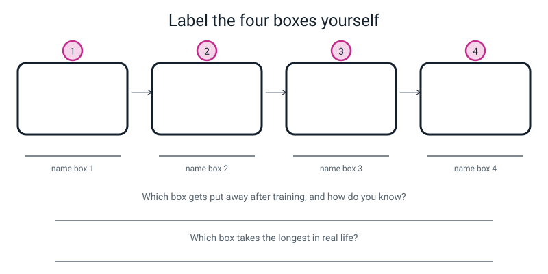
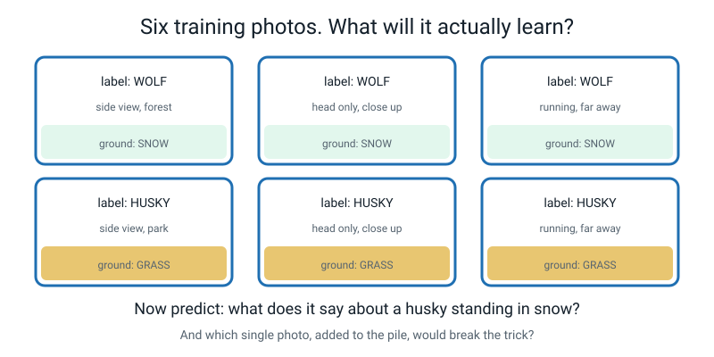
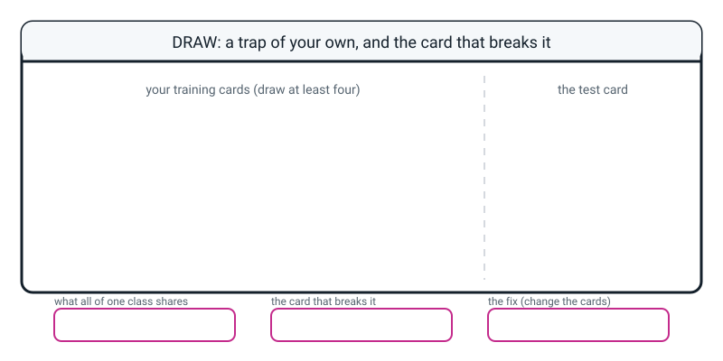

# Workbook — Week 15: Training: Turning 120 Photos Into a Guessing Machine

**Name:** ________________________________  **Date:** ____________________

[📖 Student Guide for this week](../student-guide/week-15.md) · [Course Home](../README.md)

> This week's Build It needs a camera and about half an hour. Everything else can be done at a table with a pencil. Do the writing **before** the shooting — that's the whole point of the week.

---

## ✅ Warm-Up (5 min)

Five questions from **last week**. All five before you look anything up.

**W1.** How many features go on the front of a card, and what goes on the back?

front: ______ features    back: ______________________________

**W2.** The leak test, from memory: *"Could a ________________ name the object from ________________ alone? Then it's banned."*

**W3.** A tester got **7 out of 10** on a friend's deck. Fill in all three numbers.

```
score = ______ %      baseline = ______ / 10 = ______ %      gap = ______ points
```

**W4.** Your tester got card 8 wrong. On card 8 the object was **red**, and they named a **blue** object. Were they using colour? Explain.

________________________________________________________________

**W5.** Circle the feature that is **banned** from a card front, then say why.

`weight_g: 38`  ·  `is_hollow: yes`  ·  `can_you_eat_it: yes`  ·  `number_of_holes: 4`

because ________________________________________________________

---

## ✍️ Practice Set A — Understand It

**A1. Fill in the blanks.**

**Training** is the ________-off process where a machine looks at ________________ examples over and over and adjusts itself, and what comes out is called a ________________ .

An **epoch** is one complete ________________ through ________________ training example.

**A2. Multiple choice.** After training has finished, what happens to the 120 photos? Circle one.

- (a) They live inside the model, and every new photo gets compared against them
- (b) They are put away. The model does not contain them and does not look them up
- (c) Half of them stay in the model and half are deleted
- (d) They get squashed small enough that the model can still read them one by one

Now give the **arithmetic** that proves your answer:

```
120 photos from a phone ≈ ______ MB       the model ≈ ______ MB
```

so ____________________________________________________________

**A3. True or false, and explain.** "My model is weak. I've got 10 photos, so I'll run 500 epochs to fix it."

`TRUE  /  FALSE`

The one question to ask: *"how many ________________ did that add?"*  Answer: ______

What does she actually need? ____________________________________

**A4. Match the pairs.** Write the letter in the middle column.

| Word | | What it means |
|---|---|---|
| 1. training | ____ | (a) one complete pass through every example |
| 2. epoch | ____ | (b) the first honest version, that later tries get compared against |
| 3. variety | ____ | (c) the one-off process that turns labelled examples into a model |
| 4. baseline model | ____ | (d) one thing with the correct answer written next to it |
| 5. labelled example | ____ | (e) how much your examples differ in the ways that shouldn't matter |

**A5. Label the diagram.** Name the four boxes, then answer the two questions underneath.


*Figure W15.1 — Four boxes, three arrows. Then the two lines at the bottom: what gets put away, and what gets kept.*

**A6. Count the distinct situations.** Multiply across each row.

| photo set | backgrounds | lighting | angles | distances | distinct situations |
|---|---|---|---|---|---|
| A — 40 photos on one table | 1 | 1 | 2 | 1 | ______ |
| B — 40 photos, planned | 5 | 3 | 8 | 2 | ______ |
| C — **400** photos on one table | 1 | 1 | 2 | 1 | ______ |
| D — 30 photos, half planned | 3 | 2 | 5 | 1 | ______ |

Look at rows A and C. What did taking ten times as many photos buy?

________________________________________________________________

---

## ✍️ Practice Set B — Use It

**B1.** You trained a model on 500 photos of dogs and cats. Tonight you delete all 500 photos.

Does the model still work? `YES / NO`

Give **two** separate pieces of evidence for your answer — one an arithmetic fact, one something that happened in class.

1. ______________________________________________________________

2. ______________________________________________________________

**B2. What would go wrong?** A student photographs three objects. Every **spoon** photo is on the kitchen table. Every **comb** photo is on the bathroom floor. Every **toothbrush** photo is on the bathroom floor too.

What is the easiest pattern available to the machine? ________________

What will it do with a **spoon photographed on the bathroom floor**?

________________________________________________________________

What will it do with a **comb photographed on the kitchen table**?

________________________________________________________________

The student's model scores 100% when they test it. Why is that score worthless?

________________________________________________________________

The fix, in as few photos as possible — say exactly which photos to take:

________________________________________________________________

**B3. What would go wrong?** A student gets bored and ends up with:

| class | photos |
|---|---|
| `glue_stick` | 40 |
| `marker` | 40 |
| `whiteboard_eraser` | 8 |
| **total** | **88** |

Suppose the model decides never to say `whiteboard_eraser` at all. Work out its score.

```
glue sticks right = ______   markers right = ______   erasers right = ______

correct = ______ out of 88   =   ______ ÷ 88 = ______ %
```

Its accuracy on erasers alone is ______ %.

Why does training find that a **good deal**? ______________________

________________________________________________________________

What is the fix, in numbers? _____________________________________

**B4.** Two people each take **60** photos of their cat. Ravi shoots all 60 on the sofa in the evening. Meera uses 4 rooms, 3 kinds of light and 5 angles.

```
Ravi:  ______ × ______ × ______  = about ______ situations
Meera: ______ × ______ × ______  =       ______ situations
```

Whose model is better, and by how much variety? __________________

Here is the nasty bit. If they **only ever test on the sofa in the evening**, whose model will score higher? ______________ Why?

________________________________________________________________

**B5.** Somebody hands you this shot list. Check it and fix it.

| # | background | light | how far | shots |
|---|---|---|---|---|
| 1 | desk | window | close | 6 |
| 2 | desk | low lamp | far | 6 |
| 3 | carpet | ceiling | close | 7 |
| 4 | tiles | ceiling | far | 7 |
| 5 | wood table | window | close | 5 |
| | | | **total** | ______ |

The shots add to ______, and the target is 40, so it is ______ short.

Count the backgrounds: ______  Count the lighting kinds: ______  Count the distances: ______

Which of the four variety rules is **broken**? ____________________

Write the row you would add to fix **both** problems at once:

| # | background | light | how far | shots |
|---|---|---|---|---|
| 6 | | | | |

---

## 🧩 Puzzle of the Week — Six Photos, One Thing In Common


*Figure W15.2 — Six photo cards. Every wolf has snow; every husky has grass. So what did the machine actually learn?*

**Part 1.** Name the one thing that is in **100%** of the WOLF photos and **0%** of the HUSKY photos.

________________________________________________________________

**Part 2.** Write the rule the machine will actually learn. Write it as a sentence starting with "if".

*"If ____________________________________ then say ______________."*

**Part 3.** Predict three test results. Be specific.

| test photo | what the model says | why |
|---|---|---|
| a husky standing in snow | ______________ | ______________________ |
| a wolf standing on grass | ______________ | ______________________ |
| a wolf in snow | ______________ | ______________________ |

Which of those three does the model get **right for the wrong reason**? ______________

**Part 4.** You may add **only two** photos to the training pile. Which two, and what does each one break?

photo 1: ______________________________  breaks: ______________________

photo 2: ______________________________  breaks: ______________________

**Part 5.** The researchers who really did this showed their model to some people and asked "do you trust this?" Some said **yes**. Why couldn't they tell just from its answers?

________________________________________________________________

________________________________________________________________

---

## 🤔 Think Deeper

**T1.** In class you got test cards 4 and 5 wrong. Somebody says: *"you just weren't concentrating properly."*

Explain, in a paragraph, why that is the wrong diagnosis — and what the right one is. Then connect it to the wolves. Use the words **easiest pattern** somewhere.

________________________________________________________________

________________________________________________________________

________________________________________________________________

________________________________________________________________

________________________________________________________________

________________________________________________________________

**T2.** Does a machine learn the way you do? Give **one** genuine similarity and **two** genuine differences. Then say why nobody can settle the question — and note that "nobody knows" is a real answer here, not a dodge.

________________________________________________________________

________________________________________________________________

________________________________________________________________

________________________________________________________________

________________________________________________________________

---

## 🛠️ Build It

### Step 1 — Your three objects (they must be similar)

```
object 1: ________________________   class name: ________________________
object 2: ________________________   class name: ________________________
object 3: ________________________   class name: ________________________
```

- [ ] All three are the **same kind of thing** (three toothbrushes, three spoons, three socks)
- [ ] Class names are real words, not `A`, `B`, `C`

### Step 2 — Your variety checklist, with real named places

```
BACKGROUNDS (5)
  1. ______________________  2. ______________________  3. ______________________
  4. ______________________  5. ______________________

LIGHTING (3)
  1. ______________________  2. ______________________  3. ______________________

ANGLES (8):     turn the object one notch between every single shot
DISTANCES (2):  close  ·  far
```

- [ ] Every background is a **named place** — "the blue rug in the hall", not "carpet"

### Step 3 — Your numbered shot list

| # | background | light | how far | shots |
|---|---|---|---|---|
| 1 | | | | |
| 2 | | | | |
| 3 | | | | |
| 4 | | | | |
| 5 | | | | |
| 6 | | | | |
| | | | **total** | |

**Check it three ways, not one:**

```
by shots:       ____ + ____ + ____ + ____ + ____ + ____   = ______   (must be 40)
by background:  ______________________________________    = ______
by lighting:    ______________________________________    = ______
by distance:    close ______  ·  far ______               = ______
```

Write this at the bottom in your own handwriting: ☐ *"Identical list for all three objects."*

**Predict your own laziness.** *"The row I'm most likely to skip is ______ because ______________________________________."*

### Step 4 — Shoot it

- [ ] 40 photos of object 1
- [ ] 40 photos of object 2
- [ ] 40 photos of object 3
- [ ] Object turned between **every** shot
- [ ] Followed the list — didn't improvise
- [ ] Sorted into three folders, named with the class names

### Step 5 — The tally sheet: planned against actual

**By background**

| background | planned | actual |
|---|---|---|
| | | |
| | | |
| | | |
| | | |
| | | |
| **total** | | |

**By lighting**

| lighting | planned | actual |
|---|---|---|
| | | |
| | | |
| | | |
| **total** | | |

**By class** (these should be within about 20% of each other)

| class name | photos |
|---|---|
| | |
| | |
| | |

### Step 6 — The shortfall line (this is the one that gets read first)

**Which condition did you come up short on?** ______________ Planned ______, got ______.

**Why?** Be honest. "I got bored" is a perfectly good reason.

________________________________________________________________

**And the consequence — what will my model now be bad at?**

________________________________________________________________

________________________________________________________________

**Did you predict this row back in Step 3?** `YES / NO`

### Step 7 — The arithmetic, for your own set

```
my photos per object  = ______     × 3 objects  = ______ labelled examples
my examples × 50 epochs                         = ______ looks
my distinct situations: ____ × ____ × ____ × ____ = ______
```

---

## 🎨 Draw It

Draw **a trap of your own.** On the left, at least four training cards for two made-up creatures — and hide something in them that the rules never mention. On the right, the one test card that breaks it.


*Figure W15.3 — Draw your own trap. What do all your photos of one class secretly share?*

**What a good answer looks like.** One student invented two creatures, `Nub` (two eyes) and `Gorp` (three eyes), and then drew **every Nub on lined paper and every Gorp on plain paper.** Their test card was a Nub drawn on plain paper. In the three boxes at the bottom they wrote: `lines under all the Nubs`, `a Nub on plain paper — I bet you say Gorp`, and `redraw half the Nubs on plain paper and half the Gorps on lined`.

Then they tested it on their dad, who said "Gorp", and they wrote **"it worked"** in the corner and underlined it twice. That's the whole objective, and it took them nine minutes.

---

## 📊 Self-Check

| I can… | 😀 easily | 🙂 with a bit of thought | 😕 not yet |
|---|---|---|---|
| Describe training as examples in, model out — and say where the examples go | ☐ | ☐ | ☐ |
| Explain what an epoch is, and why passes repeat, without saying "to learn it better" | ☐ | ☐ | ☐ |
| Plan a photo shoot in writing, on paper, before touching a camera | ☐ | ☐ | ☐ |
| Count distinct situations and use the number as evidence | ☐ | ☐ | ☐ |
| Explain why 40 varied photos beat 400 near-identical ones | ☐ | ☐ | ☐ |
| Say why cards 4 and 5 went wrong, and whose fault it was | ☐ | ☐ | ☐ |

**The one thing I still find confusing is:** ____________________

________________________________________________________________

---

## ✅ Answers

<details>
<summary>Check your answers</summary>

### Warm-Up

**W1.** **Five** features on the front, in the same order every time. On the back: **one word — the name of the object**, and nothing else.

**W2.** *"Could a **stranger** name the object from **that one line** alone? Then it's banned."*

**W3.**

```
score = 7 ÷ 10 = 70%       baseline = 1 / 10 = 10%       gap = 60 percentage points
```

**W4.** **No, they were not using colour.** If they had been reading the colour line, it would have told them `red`, and they could not then have named a blue object. They got it wrong, so they weren't reading it. (Next step: check which *other* feature would have produced the blue object they named — that one is the suspect.)

**W5.** **`can_you_eat_it: yes`** is banned. It is a genuine physical property you could check, which is exactly why it's tempting — but if any of your objects are food, that one line hands over a whole category and makes the other four features irrelevant for those cards. The leak test isn't "is this measurable?", it's "could a stranger name it from this one line?"

### Practice Set A

**A1.** Training is the **one**-off process where a machine looks at **labelled** examples over and over and adjusts itself, and what comes out is called a **model**.

An epoch is one complete **pass** through **every** training example.

**A2.** **(b)** — they are put away. The model does not contain them and does not look them up. The arithmetic: **120 phone photos ≈ 40 MB, the model ≈ 3 MB**, so the photos cannot possibly be inside it — there is nowhere to put them. The model is about a thirteenth of the size of the data that made it, and what it kept was the **pattern** the photos had in common, not the pictures.

If you chose (d), that's a good guess and worth a mark for reasoning — but it squashed them so hard that the individual pictures are unrecoverable. What survived is what they had in common.

**A3.** **FALSE.**

The question: *"how many **photos** did that add?"* Answer: **none.** Epochs are re-reads. 500 passes over 10 photos is still 10 photos' worth of information, tuned very hard. Reading the same page fifty times does not put a second page in the book.

What she actually needs: **more *different* photos** — new backgrounds, new lighting, new angles, new distances. Extra credit if you added that too many epochs eventually makes things **worse**, because the machine starts memorising those exact ten photos instead of the general idea. (That's a real problem with a real name, and it's Week 21.)

**A4.** 1 → **(c)** · 2 → **(a)** · 3 → **(e)** · 4 → **(b)** · 5 → **(d)**

**A5. The four boxes:** **1 — labelled examples** (120 photos, each with a name attached) · **2 — training** (the process; about 20 seconds, and it happens **once**) · **3 — the model** (the guessing machine that comes out; a file of about 3 MB, and the bit you keep) · **4 — guesses** (show it a photo it has never seen, as often as you like, for ever).

**Which box gets put away after training?** **Box 1.** Two ways to know: the arithmetic (40 MB of photos, a 3 MB model — no room), and the envelope in class (twelve cards in a drawer, and you still classified six new ones).

**Which box takes the longest in real life?** **Box 1**, by miles. Collecting and sorting 120 photos is an afternoon of *your* work; training is about twenty seconds of the machine's. Almost everybody guesses the other way round.

**A6.**

| photo set | working | distinct situations |
|---|---|---|
| A | 1 × 1 × 2 × 1 | **2** |
| B | 5 × 3 × 8 × 2 | **240** |
| C | 1 × 1 × 2 × 1 | **2** |
| D | 3 × 2 × 5 × 1 | **30** |

Rows A and C: taking ten times as many photos bought **nothing at all.** Still two situations, now photographed 200 times each instead of 20. No third scene appeared. That single comparison is the whole argument of the week — count situations, not shutter clicks.

### Practice Set B

**B1.** **YES**, it still works, completely unchanged.

1. **The arithmetic:** 500 phone photos are far bigger than the model they made, so the photos are not in there. There is nowhere to keep them.
2. **What happened in class:** the twelve training cards were sealed in an envelope and put in a drawer, and you still got the easy brand-new cards right. The cards were in the drawer. Something else did the work.

**B2.**

**The easiest pattern:** the **floor or surface** — wood grain versus bathroom tiles. It appears in 100% of one class and 0% of another, and it is far easier to spot than a thin object's shape.

**A spoon on the bathroom floor** → it says `comb` or `toothbrush`, because tiles have always meant "not spoon". **A comb on the kitchen table** → it says `spoon`, because wood grain has always meant spoon.

**Why 100% is worthless:** the student tested on photos taken in the same places as the training photos, so the shortcut worked perfectly. They have measured a **floor-covering classifier** and called it an object classifier. The score is real; the thing it measured isn't what they think.

Notice too that combs and toothbrushes were *both* on the bathroom floor — so for that pair the shortcut isn't available and the model has to do real work. **This model may be honest about one pair and cheating on the other**, and a single accuracy number cannot tell you that.

**The fix, in as few photos as possible:** take the **missing** photos, not more of the same — 8 spoons on the bathroom floor, 8 combs on the kitchen table, 8 toothbrushes on the kitchen table. **24 photos.** Those 24 are the only ones that break the surface pattern, and twenty-four well-chosen shots beat four hundred more of the same.

**B3.** If the model never says `whiteboard_eraser` at all (the worst case, which training is tempted towards): 40 glue sticks right, 40 markers right, 0 erasers right.

```
correct = 80 out of 88   =   80 ÷ 88 = 0.909 = 90.9%      erasers alone: 0%
```

**Why training finds that a good deal:** training reduces the **total** number of mistakes across all examples, and it does not care which pile they come from. Abandoning the eraser entirely costs only **8 mistakes out of 88** — cheap. Nobody told it that erasers matter as much as markers, so it quietly stops believing in them.

Look at what that produces: a model that reports **91%** and is **completely broken** on one of its three jobs. This is the first time this year you've seen an average hide a disaster. It won't be the last — Week 20 is built on this number.

**The fix:** take **32 more eraser photos**, so the counts are 40 / 40 / 40. The working rule: keep your class counts within about **20%** of each other.

**B4.**

```
Ravi:  1 background × 1 lighting × about 2 angles  = about 2 situations
Meera: 4 rooms      × 3 lightings × 5 angles       =       60 situations
```

**Meera's model is better** — the same 60 shutter clicks, about **thirty times** the coverage.

**But if they only ever test on the sofa in the evening, Ravi's may well score higher.** His model may well have fitted that exact scene very closely, and the test *is* that exact scene. Meera's model saw four rooms and three lights, so it may be slightly less perfect on the sofa and is likely to be much better everywhere else. That is the genuinely nasty part: **the worse model can produce the better number if you choose the test badly.** Which is exactly what Week 19 is about.

**B5.** 6 + 6 + 7 + 7 + 5 = **31**, against a target of 40, so it is **9 short**. Backgrounds: **4** (desk, carpet, tiles, wood table) · lighting kinds: **3** · distances: **2**.

**The broken rule: five backgrounds.** There are only four. (Lighting and distance are both fine.)

**The row that fixes both at once:**

| # | background | light | how far | shots |
|---|---|---|---|---|
| 6 | bed sheet | low lamp | far | 9 |

That adds the fifth background **and** takes the total to 40. Any fifth, genuinely different, named background works — and it must be a background not already in the list. Nine shots in one row is a bit heavy; splitting it into two rows of 4 and 5 with different lights is even better, and you should be credited for spotting that.

### Puzzle of the Week

**Part 1.** **Snow.** It is in 100% of the WOLF photos and 0% of the HUSKY photos. (Equally correct: **grass**, in 100% of the huskies and 0% of the wolves. It's the same fact seen from the other side.)

**Part 2.**

> *"If **there is white stuff at the bottom of the picture** then say **wolf**."*

Notice how little that rule has to do with wolves. It never mentions ears, eyes, snout or size — because it never needed to.

**Part 3.**

| test photo | says | why |
|---|---|---|
| a husky in snow | **wolf** | Snow present → wolf. Confidently, and completely wrong |
| a wolf on grass | **husky** | No snow → husky. Also confidently wrong |
| a wolf in snow | **wolf** | Correct — **but for entirely the wrong reason**. It read the ground, not the animal |

The one that is **right for the wrong reason** is the third. That is the most dangerous row in the table, because it's the one that makes the model look like it works.

**Part 4. Two photos that break the trick:** (1) **a husky standing in snow, labelled HUSKY** — this breaks "snow → wolf", because snow now appears in both piles and stops being a separator; (2) **a wolf standing on grass, labelled WOLF** — same thing from the other side. With those two added, the ground can no longer separate the piles at all, so the only thing left to learn is the animal. (Two photos won't be *enough* to learn a wolf properly, but they are enough to destroy the shortcut, which is what was asked.)

**Part 5. Why people could be fooled:** because **the model got mostly right answers.** They were shown its predictions, not its reasoning, and its predictions were right on the photos they tried — which came from the same collection, with the same snow and the same grass. You cannot see a shortcut by looking at a score. You can only see it by testing the model on the one case the shortcut gets wrong — a husky in snow — and nobody had tested that photo yet.

**That is the whole lesson:** you cannot read a model, so the only window you get is testing it, and a test that looks like the training data will lie to you.

### Think Deeper

**T1. A model answer:**

> *It's the wrong diagnosis because I wasn't careless — I did exactly what training does. Every single Blorb I was shown was large and every single Zunk was small, so "big means Blorb" separated the twelve training cards perfectly, and it was much easier to notice than counting three legs against three spikes. I picked up the **easiest pattern** that separated the piles, which is not a mistake; it's the mechanism.*
>
> *The right diagnosis is that the training cards were the problem. Nobody ever said size mattered — the three rules were legs, spikes and tail — but the examples said it silently, without permission. The fix is the cards, not me: draw Blorbs at mixed sizes and Zunks at mixed sizes and size stops being a separator, so the only thing left to learn is legs versus spikes. Saying "I'll try harder" is arguing with a baked cake.*
>
> *The wolves were the same story with better funding. Every wolf photo had snow and no husky photo did, so "white stuff at the bottom" was the **easiest pattern** available and the machine took it. My Blorbs were size. Their wolves were snow. Nobody wrote either rule and nobody wanted it — it came out of the examples.*

Marking: full credit needs (1) rejecting the blame, (2) naming **size** specifically as a perfect separator in training, (3) the fix being the **cards**, not the learner, and (4) the connection to the wolves using the phrase **easiest pattern**. Card 3 is worth a bonus mark if you mention it: Fip was drawn at mixed sizes and Fip was fine, which proves the trap was about size and not about being generally confused.

**T2. One genuine similarity:** nobody gave you a rule for recognising your best friend, and nobody gave the machine a rule for recognising a spoon. Both of you learned from **thousands of examples with names attached**, and neither of you can read out what you ended up with.

**Two genuine differences:** (1) **how many examples you need** — you learned "dog" from far fewer dogs than a from-scratch model needs (many thousands of pictures); (2) **how fast you can learn from one event** — you can touch something hot once and never do it again, in one second, from one example, and no model can do that. (Also acceptable: you can explain *some* of your reasoning and the machine can explain none; or you keep learning while you're being used and a trained model is frozen.)

**Why nobody can settle it:** because **we cannot read either one.** We can't read the thousands of dials inside a trained model — the person who wrote the training program can't either — and we can't read the connections inside your head. Two things nobody can inspect, being compared. Scientists in two different fields argue about it and they haven't finished.

That is a real answer, not a dodge. "Nobody knows" is what an honest person says when the evidence isn't in yet, and telling the difference between *"I don't know"* and *"nobody knows"* is a genuinely useful skill.

### Build It — marking your own work

**Step 1 — the objects.** Three genuinely similar things. If you can tell them apart from across the room in a bad photo, they're too different, and a model that separates them proves nothing. Three toothbrushes beats a toothbrush, a chair and a dog.

**Step 2 — the checklist.** Five **named places**, not categories. "The blue rug in the hall" is a plan; "carpet" is a wish. Same for lighting: "the desk lamp with the shade off" beats "lamp".

**Step 3 — the shot list.** The model list is the six-row one in Worked Example 1 of your student guide: 6 + 6 + 7 + 7 + 7 + 7 = 40, across 5 backgrounds, 3 lighting kinds and 2 distances. Check yours **three ways**, not one — by shots, by background and by lighting — because a column that adds to 40 can still be missing a background entirely.

In that model list the desk appears twice, so it carries 12 photos against 7 for the others. Acceptable at 30% of the set; **not** acceptable at 100%. Evening it out to 8/8/8/8/8 is better, and you should say so if you spotted it.

**Do not let a wrong total go home.** If the column adds to 31 you will follow the list literally, end up with 31 photos, and never see the shortfall.

**Step 5 — the tally.** A model tally from a real student who came up short in a predictable place: desk 12 planned / 15 actual · carpet 7 / 8 · tiles 7 / **3** · wood 7 / 9 · bed sheet 7 / **5**. And by lighting: window 13 / **20** · ceiling 14 / 15 · low lamp 13 / **5**. Both totals still 40, which is why planned-against-actual is the only version that shows anything.

**Step 6 — the shortfall line, written well:**

> *"I came up short on low lamp light — I planned 13 and got 5. The lamp photos looked dark and blurry so I kept redoing them under the ceiling light instead. That means most of my photos are bright, so I think my model will be bad at guessing anything photographed in a dim room in the evening. Also tiles: 3 instead of 7, because the bathroom floor is cold and I gave up."*

Marking: **planned and actual side by side** — actual alone cannot show a shortfall · totals honest, even if they don't reach 40 · one **named** short condition with the real numbers · an honest **reason** ("I got bored" is fine and should be praised, not marked down) · and, for full credit, the **consequence**: *what will my model now be bad at?* That last sentence turns a tally into a prediction, and it is the one thing worth insisting on.

**If you predicted the low-lamp row back in Step 3 and it *was* the low-lamp row — say so loudly.** Predicting your own future laziness correctly is a real skill, and it is exactly the same skill as predicting a model's failure before you test it.

**Step 7 — your arithmetic**, for a full 40-per-object set:

```
40 photos × 3 objects   = 120 labelled examples
120 examples × 50 epochs = 6,000 looks
5 × 3 × 8 × 2            = 240 distinct situations
```

And the ratio worth remembering: **one afternoon of your work, twenty seconds of the machine's.**

### Draw It

No single right drawing. A good trap has three properties, and you can check your own against them: (1) the hidden thing is a feature the **rules never mention** — size, paper, background, which pen you used; (2) it is present in **100%** of one class and **0%** of the others, because a trap that's in half the cards isn't a trap, it's noise; (3) you can say **in advance** which test card will break it.

If you actually ran your trap on somebody and it worked, write down what they said. If it *didn't* work, write down why not — that's a better result, because it means you now know what makes a trap fire.

</details>

---

[⬅ Week 14 workbook](week-14.md) · [📖 Week 15 chapter](../student-guide/week-15.md) · [Course Home](../README.md) · [Week 16 workbook ➡](week-16.md) · [Glossary](../../glossary.md)
