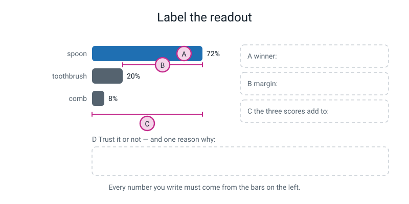
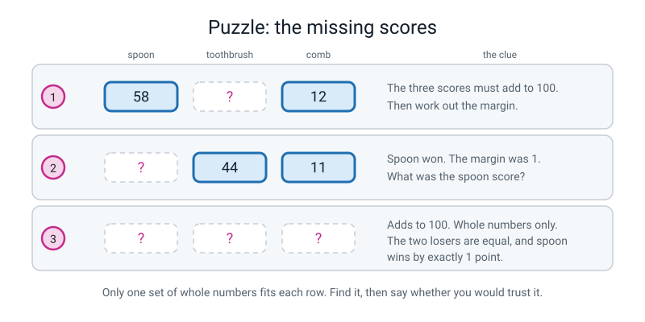
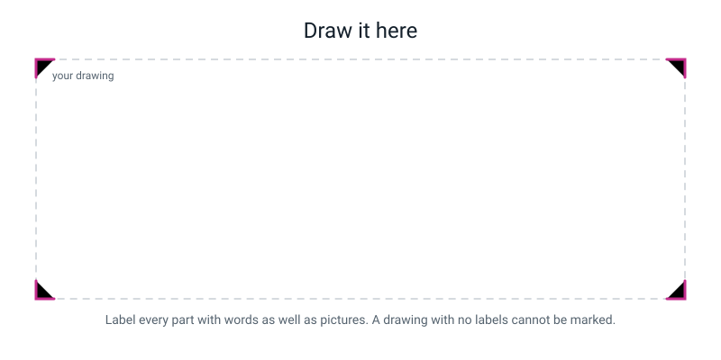

# Workbook — Week 16: Confidence Is Not Correctness

**Name:** ________________________________  **Date:** ______________

[📖 Read the chapter first](../student-guide/week-16.md) · [Course Home](../README.md)

---

## ✅ Warm-Up (5 min)

Five quick questions about **last week** — training. Notebook closed.

**W1.** In one sentence: what does **training** actually do?

________________________________________________________________

________________________________________________________________

**W2.** One complete pass through every single training photo is called an ______________.

**W3.** You have 120 photos and the software does 50 passes. How many photo-examinations is that? Show the multiplication.

________________________________________________________________

**W4.** True or false: *"Forty photos of the same spoon on the same table in the same light is forty good examples."* Explain your answer in one line.

________________________________________________________________

________________________________________________________________

**W5.** Your friend's model is bad. She says "I'll press Train again." What do you tell her, and what should she do instead?

________________________________________________________________

________________________________________________________________

---

## ✍️ Practice Set A — Understand It

**A1. Fill in the blanks.**

(a) The confidence scores for all the classes always add up to __________.

(b) The **margin** is the __________ score minus the __________ score.

(c) A margin under __________ is basically a coin toss.

(d) A model has exactly __________ points of belief, and it must give every point to one of the boxes __________ gave it.

---

**A2. Multiple choice.** Circle **one**. Which of these readouts should you trust *least*?

| | readout | |
|---|---|---|
| **A** | 97 / 2 / 1 | |
| **B** | 62 / 21 / 17 | |
| **C** | 45 / 44 / 11 | |
| **D** | 15 / 71 / 14 | |

Why? ________________________________________________________________

---

**A3. True or false — and explain.**

> *"A model that says 99% confident will be right about 99 times out of 100."*

Circle one:  **TRUE**  /  **FALSE**

Explain in two lines. Your explanation must include an example.

________________________________________________________________

________________________________________________________________

---

**A4. Match the pairs.** Draw a line from each margin to the right reading, and to the right action.

| Margin | | Reading | | Action |
|---|---|---|---|---|
| 1 | | Reasonably clear | | Do not act on it |
| 22 | | A coin toss | | Act on it |
| 41 | | Not even close | | Check it another way |
| 86 | | Shaky — could flip | | Act, but write it down |

Write your four answers out as sentences here:

1. Margin 1 is ______________________ so I would ______________________
2. Margin 22 is ______________________ so I would ______________________
3. Margin 41 is ______________________ so I would ______________________
4. Margin 86 is ______________________ so I would ______________________

---

**A5. Label the readout.** Write your answers in the four empty boxes on the diagram, and copy them onto the lines below.


*Figure W16.1 — A is the winner, B is the gap, C is the total, D is your decision.*

**A** — the winner is: ________________________________

**B** — the margin is: ________________  (show the subtraction: ________ − ________ = ________)

**C** — the three scores add to: ________________

**D** — trust it or not, and one reason why:

________________________________________________________________

________________________________________________________________

---

**A6. Spot the misread.** One of these four readouts cannot be real. Find it, and say how you know.

| # | readout | sum (work it out) | real or misread? |
|:--:|---|:--:|---|
| 1 | 74 / 15 / 11 | __________ | __________ |
| 2 | 50 / 30 / 25 | __________ | __________ |
| 3 | 34 / 33 / 33 | __________ | __________ |
| 4 | 88 / 9 / 3 | __________ | __________ |

The impossible one is #________ because ________________________________

What should you do about it? ________________________________________________

---

## ✍️ Practice Set B — Use It

**B1.** A recycling machine has three classes: **glass**, **plastic**, **paper**. Somebody drops in an empty **crisp packet**. Write down what the machine will do and why. Include a made-up but sensible readout.

My readout: glass ________ · plastic ________ · paper ________  (must add to 100)

What will happen and why:

________________________________________________________________

________________________________________________________________

---

**B2.** A school builds a "who is this teacher?" model with these photos:

| class | photos |
|---|---|
| Mr Ahmed | 60 |
| Ms Bell | 60 |
| Mr Chen | 4 |

(a) Total photos: ________ + ________ + ________ = ________

(b) Is this balanced? Show the check: (________ − ________) ÷ ________ = ________ %

(c) Predict, in one sentence, what this model will do. **Write this before you do part (d).**

________________________________________________________________

(d) Suppose it never says "Mr Chen". How many of its own training photos does it get right, and what is that as a percentage? Show your working.

```
   got right  =  ________ + ________ + ________  =  ________

   accuracy   =  ________ ÷ ________  =  ____________  ≈  ________ %
```

(e) What is its accuracy on photos of Mr Chen specifically? ________ ÷ ________ = ________ %

(f) Was your prediction in (c) right? ______________

---

**B3. What would go wrong?** Your friend writes this policy:

> *"Trust the answer if the top score is over 40%."*

Find **one** readout that his policy lets through but should definitely be blocked. Write the readout and explain the problem.

Readout: ________ / ________ / ________     (sum: ________)

Why his policy fails on it:

________________________________________________________________

________________________________________________________________

What would you add to his policy to fix it? ________________________________

---

**B4. What would go wrong?** A company builds a plant-identifying app that shows the user **only the winning name** — never the percentages, never the runner-up.

Name **two** separate problems this causes, and say who gets hurt by each one.

Problem 1: ________________________________________________________________

Who gets hurt: ________________________________________________________

Problem 2: ________________________________________________________________

Who gets hurt: ________________________________________________________

---

**B5.** You are building a camera for a bird feeder with three classes: **robin**, **sparrow**, **blue tit**. On the third day a **squirrel** sits on the feeder for ten minutes.

(a) What will your model report? (Give a plausible readout.) ________ / ________ / ________

(b) What should you add to the model, and what exactly would you put in it?

________________________________________________________________

________________________________________________________________

(c) What does adding it **cost** you? (There is a real cost. Name it.)

________________________________________________________________

---

## 🧩 Puzzle of the Week

Three readouts have had numbers rubbed out. Every row has exactly **one** possible answer in whole numbers. Find them.


*Figure W16.2 — Three rows, one solution each. Then say whether you'd trust each one.*

**Row 1.** spoon 58 · toothbrush ______ · comb 12

Working: ________________________________________________

Margin: ________ − ________ = ________     Trust it? ______________

**Row 2.** spoon ______ · toothbrush 44 · comb 11 — spoon won, and the margin was 1.

Working: ________________________________________________

Trust it? ______________  Why: ________________________________

**Row 3.** All three rubbed out. Clues: the three add to 100 · they are whole numbers · the two losers are **equal** · spoon wins by exactly **1** point.

Let each loser be `L`. Then the winner is `L + 1`, so:

```
   (L + 1)  +  L  +  L  =  100

   ________ L  +  1  =  100

            L  =  ________
```

So the readout is ________ / ________ / ________

**The bonus question:** with three classes, what score would you get by guessing blind, every time, with no model at all? ________ %

What does that tell you about Row 3? ________________________________________

---

## 🤔 Think Deeper

**T1.** A model reports 45 / 44 / 11. Your friend says: *"That model is broken — it can't even make its mind up."* Write a paragraph arguing the opposite: that this readout is the model being **more** useful than a 99% one would be. Use the words *margin* and *shrug*.

________________________________________________________________

________________________________________________________________

________________________________________________________________

________________________________________________________________

________________________________________________________________

________________________________________________________________

---

**T2.** Two machines both use a confidence policy. One is a music app guessing what song you hummed. The other is a hospital machine looking at scans for something dangerous.

Should they use the **same** threshold? Write a paragraph. You must mention **false alarms** (saying yes when it should be no) and **misses** (saying no when it should be yes), and say which one is worse in each case, and why.

________________________________________________________________

________________________________________________________________

________________________________________________________________

________________________________________________________________

________________________________________________________________

________________________________________________________________

---

## 🛠️ Build It

### Part 1 — Eight readouts, four steps each (25 min)

Classes are always **spoon / toothbrush / comb**, in that order. For every row: check the sum, name the winner, compute the margin, and make a call **with a reason**.

> **⚠️ Watch out:** one of these eight has a sum that is **not 100**. Do not come and ask which. Deal with it and write down what you did.

| # | held up | spoon | tbrush | comb | sum | winner | margin | trust? |
|:--:|---|:--:|:--:|:--:|:--:|---|:--:|---|
| H1 | a spoon | 93 | 5 | 2 | ______ | __________ | ______ | __________ |
| H2 | a toothbrush | 47 | 46 | 7 | ______ | __________ | ______ | __________ |
| H3 | a spoon | 62 | 21 | 17 | ______ | __________ | ______ | __________ |
| H4 | a comb | 55 | 40 | 5 | ______ | __________ | ______ | __________ |
| H5 | a spoon | 100 | 0 | 0 | ______ | __________ | ______ | __________ |
| H6 | a comb | 38 | 36 | 24 | ______ | __________ | ______ | __________ |
| H7 | a toothbrush | 15 | 71 | 14 | ______ | __________ | ______ | __________ |
| H8 | **a banana** | 88 | 7 | 5 | ______ | __________ | ______ | __________ |

**Now write one reason per row.** One line each. "Don't trust it" with no reason scores nothing.

H1: ____________________________________________________________

H2: ____________________________________________________________

H3: ____________________________________________________________

H4: ____________________________________________________________

H5: ____________________________________________________________

H6: ____________________________________________________________

H7: ____________________________________________________________

H8: ____________________________________________________________

**The pattern question.** Which **two** rows have the biggest margins? ________ and ________

Are those the two you trust most? ______________ Explain in two lines:

________________________________________________________________

________________________________________________________________

---

### Part 2 — Your confidence policy (15 min)

```
   MY CONFIDENCE POLICY
   ──────────────────────────────────────────────────────────
   If the top score is below ________ %,

   OR the margin is below ________ points,

   my model must say  "not sure"  instead of guessing.
```

**Reason 1 — about FALSE ALARMS** (the model saying "spoon" when it isn't one). Use a real row number from the table above.

________________________________________________________________

________________________________________________________________

________________________________________________________________

**Reason 2 — about MISSES** (the model saying "not sure" about a perfectly good spoon). Use a real row number.

________________________________________________________________

________________________________________________________________

________________________________________________________________

**Why OR and not AND?** ________________________________________________

________________________________________________________________

**Now test it.** Run your own policy down the eight rows and tick what it does.

| # | top score | passes the top-score test? | margin | passes the margin test? | policy says | right call? |
|:--:|:--:|---|:--:|---|---|---|
| H1 | 93 | | | | | |
| H2 | 47 | | | | | |
| H3 | 62 | | | | | |
| H4 | 55 | | | | | |
| H5 | 100 | | | | | |
| H6 | 38 | | | | | |
| H7 | 71 | | | | | |
| H8 | 88 | | | | | |

How many did your policy block? ________  How many of those blocks were the right call? ________

---

### Part 3 — Vocabulary, in your own words (10 min)

Do **not** copy the chapter. Your own wording, and a different example from the one in the book.

| Word | What it means (your words) | Your own example |
|---|---|---|
| **confidence score** | | |
| **margin** | | |
| **class balance** | | |
| **`other` class** | | |

---

## 🎨 Draw It

**Your task:** draw the **100 points of belief** being shared out between three boxes — and then draw what happens when someone holds up a **fork**.

You must label: the three boxes, the pile of 100 points, where the points end up, and one arrow showing what the model *cannot* do.


*Figure W16.3 — Draw inside the frame. Labels are not optional.*

> **💡 What a good answer looks like:** a heap of 100 small dots or beans on the left; three labelled boxes (spoon / toothbrush / comb) on the right; arrows showing 74 dots going to spoon, 15 to toothbrush, 11 to comb; a fork drawn in front of the camera; and — the part that earns the marks — a **fourth box drawn with a dashed outline, crossed out, labelled "none of the above — DOESN'T EXIST"**, with an arrow pointing to it that has been blocked. If your drawing shows the model *choosing* to give the points to spoon, add a note: it didn't choose. It had nowhere else to put them.

---

## 📊 Self-Check

Tick one box per line. Be honest — this page is for you, not for a mark.

| I can… | 😀 easily | 🙂 with a bit of thought | 😕 not yet |
|---|:--:|:--:|:--:|
| read a set of confidence scores and check they add up to 100% | ☐ | ☐ | ☐ |
| work out the margin between the top two classes | ☐ | ☐ | ☐ |
| say in one sentence what a small margin means | ☐ | ☐ | ☐ |
| explain why 99% confident can still be 100% wrong | ☐ | ☐ | ☐ |
| predict what 200 / 200 / 8 will do, and prove it with arithmetic | ☐ | ☐ | ☐ |
| write a confidence policy with two numbers and defend both | ☐ | ☐ | ☐ |

**One thing I want to ask about next lesson:**

________________________________________________________________

---

## ✅ Answers

<details>
<summary>Check your answers</summary>

### Warm-Up

**W1.** Training is the one-off process where the machine looks at all the labelled examples over and over, checks how many it got wrong, and nudges thousands of its own internal numbers until its guesses on those examples are as good as it can get them. *Any version of "studied the examples and tuned itself" is right. "It figured it out" or "it's smart" is not — those words explain nothing.*

**W2.** An **epoch**.

**W3.** `120 × 50 = 6,000` photo-examinations. *(At one photo per second a human would need 6,000 seconds = 100 minutes. Your browser does it in about twenty seconds.)*

**W4.** **False.** Forty near-identical photos teach the model roughly what **one** photo teaches it — while making you feel like you did forty times the work. What matters is the number of genuinely **different situations**: different backgrounds, lights, angles and distances. Count distinct situations, not shutter clicks.

**W5.** Retraining on the same photos gives you essentially the same model. Training has a little randomness in it, so the numbers wobble by a point or two — and that wobble is very tempting to read as improvement. It isn't. **You cannot fix a model by retraining it; you fix it by changing the photos.** She should add photos in new backgrounds, new lights and new angles.

---

### Practice Set A

**A1.**
(a) **100** (or 100%).
(b) The **top** score minus the **second-highest** score. *(Not the lowest. Second place, not last place.)*
(c) **15**.
(d) **100** points of belief, and it must give every point to one of the boxes **you** gave it.

**A2.** **C — 45 / 44 / 11.**
Why: it has a winner, but the margin is only `45 − 44 = 1`. One point of separation is not a preference — it is a coin toss that happened to land on spoon. Change the angle by a centimetre and the answer flips.
*Why the others are better: A has a margin of 95 (as clear as these ever get). B has 41 (reasonably clear). D has `71 − 15 = 56` (a comfortable win).*
*Common wrong answer: picking **A**, on the grounds that 97% "looks too good to be true." That instinct is worth something — but this question asks which readout the **numbers** tell you to distrust, and A's numbers are the strongest of the four.*

**A3.** **FALSE.**
Confidence is how strongly the model **prefers** one class among the boxes you gave it. It is not a count of how often it has been right. Example: a model that knows only spoon / toothbrush / comb is shown a **stapler**. It reports 99 / 1 / 0 — 99% confident, margin 98, and 100% wrong, because there is no stapler box and it had to put its 100 points somewhere.

**A4.**
1. Margin **1** is **a coin toss**, so I would **not act on it**.
2. Margin **22** is **shaky — it could flip**, so I would **check it another way**.
3. Margin **41** is **reasonably clear**, so I would **act, but write it down**.
4. Margin **86** is **not even close**, so I would **act on it**.

**A5.** From Figure W16.1 (spoon 72, toothbrush 20, comb 8):
- **A — winner:** **spoon** (it has the biggest score, 72).
- **B — margin:** `72 − 20 = **52**`.
- **C — the three scores add to:** `72 + 20 + 8 = **100**` ✓ so the bars were read correctly.
- **D — call:** **trust it.** A margin of 52 is in the 30–59 band: reasonably clear, act on it but log it. *Full credit also requires the honest caveat: this only tells you the model prefers spoon strongly. If the object held up were something with no class at all, 72% would mean nothing.*

**A6.**

| # | readout | sum | real or misread? |
|:--:|---|:--:|---|
| 1 | 74 / 15 / 11 | **100** | real |
| 2 | 50 / 30 / 25 | **105** | **misread** |
| 3 | 34 / 33 / 33 | **100** | real |
| 4 | 88 / 9 / 3 | **100** | real |

The impossible one is **#2**, because the three scores add to **105** and there are only ever 100 points of belief. There is no extra 5 anywhere for them to have come from.
**What to do:** do **not** guess and do **not** average. Write down "sum = 105, so I misread a bar," and **read it again**. A student who computed a margin for #2 and never noticed the 105 has missed the point of the sum check — the sum check only ever tells you something when it **fails**.

---

### Practice Set B

**B1.** A sensible readout: **glass 12 · plastic 71 · paper 17** (sum 100 ✓).
What happens and why: a crisp packet is not glass, not plastic bottle, not paper — there is **no crisp-packet class**. But the machine has 100 points of belief and exactly three boxes, and no way to say "none of these", so it must hand all 100 points out. A crisp packet is shiny and flexible, which is nearer to plastic than to glass or paper, so most of the belief lands on plastic. **The margin here is `71 − 17 = 54`, which looks respectable — and the answer is still wrong.** It is not broken; it is stuck.
*Any readout adding to 100 with a sensible reason gets full credit. What does **not** get credit: "it will say it doesn't know" (it can't) or "it will say error" (nothing is wrong).*

**B2.**
(a) `60 + 60 + 4 = **124**`
(b) `(60 − 4) ÷ 60 = 56 ÷ 60 = 0.9333… ≈ **93%**`. We want under 20%, so this is **badly imbalanced**.
(c) Prediction: *"It will get very good at Mr Ahmed and Ms Bell and will almost never say Mr Chen, because giving up on 4 photos out of 124 costs it almost nothing."*
(d)
```
   got right  =  60 + 60 + 0  =  120

   accuracy   =  120 ÷ 124  =  0.96774…  ≈  96.8 %
```
(e) Accuracy on Mr Chen: `0 ÷ 4 = 0 = **0%**`.
(f) The prediction was right — and the important thing is that the arithmetic in (d) and (e) *proves* it rather than just agreeing with it. **96.8% overall, 0% on one of the three people it was built to recognise.** Nobody lied; the 96.8% just answers a question nobody should have asked.

**B3.** Any readout with a top score over 40 and a tiny margin works. The cleanest example: **45 / 44 / 11** (sum 100).
Why his policy fails: 45 is over 40, so his policy waves it through — but the margin is `45 − 44 = 1`. His rule cannot see the difference between 45 / 44 / 11 and 45 / 30 / 25, and one of those is a coin toss.
Even worse: **34 / 33 / 33** has a top score of 34, so his rule blocks it — but **41 / 30 / 29** passes, and its margin of 11 is still a coin toss.
**The fix:** add a **second threshold about the margin**, joined with **OR** — e.g. *"...or the margin is below 25 points."* One number about the top score can never catch a close race.

**B4.** Any two genuinely different problems, each with a person attached. Model answers:
- **Problem 1: users cannot tell a 97 / 2 / 1 from a 45 / 44 / 11.** Both just say "foxglove." **Who gets hurt:** the user, who eats or touches a plant on the strength of a coin toss. (Foxglove is poisonous. Some of its lookalikes are far less dangerous.)
- **Problem 2: the app cannot tell you when the plant isn't in its list at all.** With no `other` class and no visible scores, a plant it has never seen still produces a confident name. **Who gets hurt:** the user again, and also the developers, who never find out their app is failing because nobody can see the low margins.
- *Also accepted:* nobody can report a bug usefully ("it said X and was wrong" vs "it said X at 41% with a margin of 3"); and the company can't tell which classes need more photos.

**B5.**
(a) A plausible readout: **robin 52 · sparrow 31 · blue tit 17** (sum 100 ✓, margin 21). *Any readout adding to 100 is fine.*
(b) Add an **`other` class**, and fill it with about forty photos of everything that is **not** one of the three birds: the empty feeder, the feeder with a squirrel on it, a branch, a leaf, a passing cat, the fence, the sky. The point is that it must contain the *kinds* of things the camera will actually see.
(c) **The cost:** adding one big messy class usually steals a few points of belief from the real classes, so **margins often get smaller**. Your robin might drop from 88% to 79%. That is a genuine trade: you give up a little sharpness in exchange for the ability to say "none of these." *Answers saying "it costs nothing" are wrong. Answers saying "it takes time to photograph" are true but not the point being asked about.*

---

### 🧩 Puzzle of the Week

**Row 1.** The three must add to 100, so:
```
   58 + ? + 12 = 100
        ? + 70 = 100
             ? = 30
```
Readout: **58 / 30 / 12.** Winner spoon. Margin `58 − 30 = **28**`.
28 is in the **15–29 shaky** band, so: **don't act on it without checking another way.** A change of angle could easily close a 28-point gap.

**Row 2.** Spoon won with a margin of 1, and second place is toothbrush on 44, so spoon = `44 + 1 = **45**`.
Check: `45 + 44 + 11 = 100` ✓
Readout: **45 / 44 / 11.** **Do not trust it.** A one-point win is not a preference. And note what a margin of 1 does *not* tell you: it doesn't tell you the answer is wrong — it tells you the answer is **unstable**, which is a different and more useful warning.

**Row 3.** Let each loser be `L`, so the winner is `L + 1`:
```
   (L + 1)  +  L  +  L  =  100
              3L  +  1  =  100
                    3L  =  99
                     L  =  33
```
So the winner is **34** and the readout is **34 / 33 / 33.** Margin `34 − 33 = 1`.

**Bonus.** With three classes, blind guessing gets you **1 in 3 = 33.3%**.
What that tells you about Row 3: **this readout IS the blind-guessing rate.** The model has learned nothing usable about this particular input and is splitting its belief almost perfectly evenly. It is the purest shrug there is — and it is exactly the reading you would most want a product to show a human instead of hiding.

---

### 🤔 Think Deeper

**T1 — model answer.**

> 45 / 44 / 11 is not a broken model. It is a model being unusually honest. The **margin** here is 1 point, and the model is using that to tell me something specific and true: it genuinely cannot separate spoon from toothbrush on this particular photo. That is real information about the world, and I can act on it — I can take a second photo from another angle, or turn a light on, or hand the item to a person.
>
> Compare that with a model that reports 99% on everything, including a stapler it has never seen. That model is confidently wrong and gives me nothing to work with. The **shrug** is the useful part, and almost every real product throws it away and shows you only the winning word — which means it hides its 45 / 44 from you and looks more reliable than it is.
>
> The broken model is not the one that hesitates. It is the one that never does.

**T2 — model answer.**

> No, they should not use the same threshold, because the two mistakes cost completely different amounts.
>
> The music app's **false alarm** is naming the wrong song. You laugh, you hum again, it costs you four seconds. Its **miss** — refusing to answer when it actually had it right — is more annoying than the false alarm, because a music app that says "not sure" half the time feels broken and you delete it. So the music app should have a **low** threshold: answer often, be wrong sometimes, keep the user happy.
>
> The hospital machine is the other way round. Its **miss** — saying "nothing here" when there really is something dangerous — could cost somebody their life, and nobody may find out for months. Its **false alarm** — flagging a healthy scan — costs a frightened person and a doctor's time, which is bad but recoverable and gets noticed immediately. So the hospital machine should have a **low bar for flagging** — that is, it should send far more cases to a human, accepting lots of false alarms to avoid misses.
>
> The rule underneath both: **set your threshold by asking which mistake is harder to undo.** And somebody has to actually decide that number and be accountable for it — it should not be left to whoever happened to be writing the code that afternoon.

---

### 🛠️ Build It — Part 1: the eight readouts

| # | held up | readout | sum | winner | margin | call |
|:--:|---|---|:--:|---|:--:|---|
| H1 | a spoon | 93 / 5 / 2 | 100 ✓ | spoon | `93 − 5 = 88` | **trust it** |
| H2 | a toothbrush | 47 / 46 / 7 | 100 ✓ | spoon | `47 − 46 = 1` | **don't trust — and wrong** |
| H3 | a spoon | 62 / 21 / 17 | 100 ✓ | spoon | `62 − 21 = 41` | **trust, with a note** |
| H4 | a comb | 55 / 40 / 5 | 100 ✓ | spoon | `55 − 40 = 15` | **don't trust — and wrong** |
| H5 | a spoon | 100 / 0 / 0 | 100 ✓ | spoon | `100 − 0 = 100` | **suspicious** |
| H6 | a comb | 38 / 36 / 24 | **98** ✗ | — | — | **misread — read it again** |
| H7 | a toothbrush | 15 / 71 / 14 | 100 ✓ | toothbrush | `71 − 15 = 56` | **trust it** |
| H8 | a banana | 88 / 7 / 5 | 100 ✓ | spoon | `88 − 7 = 81` | **confidently wrong** |

**The reasons, one per row:**

**H1.** Right answer, margin 88, nothing else in the race. This is what a good reading looks like — and you need to have seen one, or you will start believing every model is useless.

**H2.** Correct-looking winner, terrible margin. **And it is wrong** — a toothbrush was held up and lost by a single point. Watch out for writing the winner as "toothbrush" because that's what was held up: the winner is always the **biggest number**, which here is spoon on 47.

**H3.** Right answer, solid margin of 41. But notice that 38 points of belief went elsewhere, so this is not a model that finds spoons easy. Trust it and write it down.

**H4.** Margin 15 sits right on the boundary of the shaky band — and it turns out to be a miss. Look at the third number: comb, the **true** answer, got 5 points. The model isn't merely unsure between two options; it has essentially ruled the correct one out.

**H5.** Technically perfect, and worth a second look. A real model's 100 / 0 / 0 is usually something like 99.6% rounded up. It can happen on a genuinely easy spoon, but it is also what you would see if you were testing on a photo the model was **trained** on, in which case you are not testing anything at all. Either way, a clean 100 proves nothing: card 6's stapler got 99.

**H6. ⚠️ The broken sum.** `38 + 36 + 24 = 98`, not 100, so **one bar was misread**. The correct handling: do not guess and do not average — write "sum = 98, so I misread a bar; I need to read it again." **Full credit requires spotting the 98.** *(If you must proceed: the missing 2 points belong to whichever bar you misread, and you cannot tell which without looking again; if it were the comb bar, re-reading would give 38 / 36 / 26 = 100 — winner spoon, margin 2, don't trust it, and it's wrong.)*

**H7.** Right answer, good margin of 56. Note that the two losers are almost level (15 and 14) — that is completely normal and means nothing. **The margin is only ever about first versus second.**

**H8.** A **banana** was held up. There is no banana class. A banana is long, curved and smooth, so of the three boxes it lands nearest spoon, and 100 points of belief had to go somewhere. Margin 81 and 100% wrong. The model is not malfunctioning; it has three boxes and no way to say "none of these."

**The pattern question.** The two biggest margins are **H5 (100)** and **H1 (88)**; H8 (81) is third.
Are those the two you trust most? **Only partly.** H1 is a genuinely good reading. H5 deserves a second look: a margin of 100 can come from a test that was not valid (for example a training photo). And the very next margin, H8's 81, belongs to a banana that wasn't in any class at all, so the model committed to the nearest shape. A big margin alone is never the whole story. The lesson, written out: **margin is necessary but not sufficient. You also have to know what was held up.**

---

### 🛠️ Build It — Part 2: the confidence policy

There is no single correct policy. **The defence is what gets marked, not the number.** A full-credit answer has: two thresholds, one reason about false alarms, one reason about misses, an explanation of OR, and numbers that survive a counter-example.

**Model answer:**

```
   MY CONFIDENCE POLICY
   ──────────────────────────────────────────────────────────
   If the top score is below 65%,
   OR the margin is below 25 points,
   my model must say "not sure" instead of guessing.
```

> **Reason 1 — about false alarms.** A false alarm here means saying "spoon" when it isn't one. Every wrong row in my table except H8 had a margin under 25: H2 had 1, H4 had 15, H6 was a misread. So a 25-point margin rule catches my false alarms **without me needing to know the true answer first** — which is the whole trick, because in real use nobody tells you the true answer. H8 (margin 81 on a banana) still gets through, and I have to be honest that no threshold catches that one; only an `other` class would.
>
> **Reason 2 — about misses.** A miss here means saying "not sure" about a perfectly good spoon and making a person do work that didn't need doing. H3 was a real spoon at 62% with a margin of 41 — and my 65% threshold **blocks it**, which is a miss I have chosen to accept. If I set the threshold at 80% instead I'd block H3 *and* probably half of my correct answers, and a model that says "not sure" half the time is a model nobody uses. If I dropped the margin rule from 25 to 10, I'd let H4 (a wrong answer, margin 15) through. 65 is my chosen trade.
>
> **Why OR, not AND.** With **OR**, failing *either* test blocks the answer. 45 / 44 / 11 has a middling top score and a terrible margin — with AND it would need to fail *both* to be blocked, so it would sneak through. OR is stricter, and stricter is right here.

**Testing the model policy (65% and 25 points) against all eight rows:**

| # | top | ≥ 65? | margin | ≥ 25? | policy says | right call? |
|:--:|:--:|---|:--:|---|---|---|
| H1 | 93 | yes | 88 | yes | **answer: spoon** | ✓ correct answer let through |
| H2 | 47 | **no** | 1 | **no** | **not sure** | ✓ blocked a wrong answer |
| H3 | 62 | **no** | 41 | yes | **not sure** | ✗ blocked a *correct* answer — an accepted miss |
| H4 | 55 | **no** | 15 | **no** | **not sure** | ✓ blocked a wrong answer |
| H5 | 100 | yes | 100 | yes | **answer: spoon** | ✓ right, though the test was invalid |
| H6 | 38 | **no** | — | — | **not sure** | ✓ and the sum was wrong anyway |
| H7 | 71 | yes | 56 | yes | **answer: toothbrush** | ✓ correct answer let through |
| H8 | 88 | yes | 81 | yes | **answer: spoon** | ✗ let a confidently wrong answer through |

**Blocked: 4 of 8** (H2, H3, H4, H6). **Three of those four blocks were the right call**; H3 was a correct answer sacrificed. **One wrong answer got through** (H8) — and no threshold could have stopped it, which is exactly the argument for an `other` class.

**Common wrong answers:**

| Written | The problem | Ask yourself |
|---|---|---|
| "Trust anything over 50%" | H4 was 55 and wrong. | "Do you want H4 through?" |
| One threshold only | 45 / 44 / 11 has no defence at all. | "Show me how your policy handles a margin of 1." |
| "Trust anything over 95%" | Blocks nearly every real answer (only H5 gets through), and a 99% wrong answer like card 6's stapler would still pass. | "How many of the eight does this let through? Is that a useful machine?" |
| Two numbers, no reasons | The defence is the task, not the number. | "Why 70 and not 60?" |
| "Never trust it" | Consistent, and useless. | "H1 was 93 / 5 / 2 on a real spoon. What's wrong with that one?" |

---

### 🛠️ Build It — Part 3: vocabulary

Your own wording is required. These are the targets.

| Word | Target definition | An acceptable example |
|---|---|---|
| **confidence score** | How strongly the model prefers each class; the scores always add to 100. | robin 52, sparrow 31, blue tit 17 |
| **margin** | Top score minus second score — how close the race was. | `52 − 31 = 21`, so shaky |
| **class balance** | Whether each class has roughly the same number of examples; check `(biggest − smallest) ÷ biggest` is under 20%. | 60 / 60 / 4 is not balanced (93%) |
| **`other` class** | An extra box for "none of the above", filled with photos of things that aren't any of your real classes. | empty feeder, branch, squirrel, sky |

**Rejected:** "confidence = how right it is" (that's the misconception, not the definition) · "margin = the difference between the numbers" (*which* numbers?) · "class balance = when it's fair" (balance is measured with a subtraction and a division, not felt) · "`other` = the wrong answers" (it's a class you build on purpose and fill with photos).

---

### 🎨 Draw It

There is no single right drawing. A strong answer does **four** things:

1. **The 100 points are drawn as countable things** — dots, beans, coins, squares — not as a vague cloud. The whole idea is that there is a fixed amount of belief.
2. **All 100 points end up somewhere.** If your arrows account for 74 + 15 + 11, that's 100. Nothing is left over in the middle and nothing is held back.
3. **The fork is drawn in front of the camera**, and the arrows still go to the three real boxes. The fork's own box does not exist.
4. **The missing box is drawn and marked as missing** — a dashed, crossed-out fourth box labelled something like *"none of the above — no such box"* with a blocked arrow. This is the part that turns a picture of a readout into a picture of the **idea**.

Test your own drawing with one question: *looking only at my drawing, could someone explain why 74% on a fork is not a fault?* If not, the missing piece is almost always number 4.

</details>

---

[⬅ Week 15 workbook](week-15.md) · [📖 Week 16 chapter](../student-guide/week-16.md) · [Course Home](../README.md) · [Week 17 workbook ➡](week-17.md) · [Glossary](../../glossary.md)
