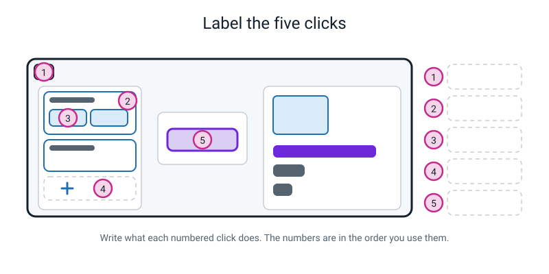
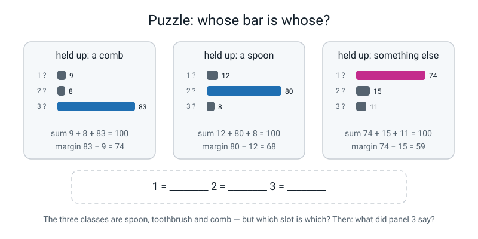
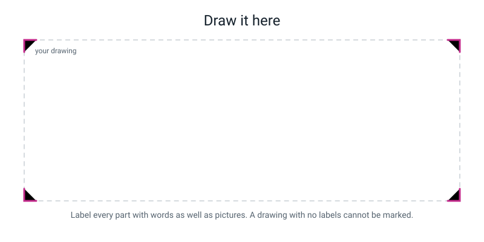

# Workbook — Week 17: Train Your First Real Model

**Name:** ________________________________  **Date:** ______________

[📖 Read the chapter first](../student-guide/week-17.md) · [Course Home](../README.md)

---

## ✅ Warm-Up (5 min)

Five quick questions about **last week** — confidence. Notebook closed.

**W1.** A model reports spoon 68, toothbrush 30, comb 2. What is the **margin**? Show the subtraction.

________________________________________________________________

**W2.** What must those three numbers always add up to, and why?

________________________________________________________________

________________________________________________________________

**W3.** Your model says 99% and it is completely wrong. Give one reason this can happen with nothing broken.

________________________________________________________________

________________________________________________________________

**W4.** Photo counts are 200 spoons, 200 toothbrushes, 8 combs. What will the model do about combs, and what accuracy does it get on its own photos if it never says "comb"?

________________________________________________________________

________________________________________________________________

**W5.** What is an **`other` class**, and name three things you would put in it?

________________________________________________________________

________________________________________________________________

---

## ✍️ Practice Set A — Understand It

**A1. Fill in the blanks.**

(a) The balance check is `( ____________ − ____________ ) ÷ ____________`, and the answer must be under ________ %.

(b) One complete pass through every training photo is an ____________. Teachable Machine does ________ of them by default.

(c) The only way to save your model is **☰ menu → ____________________________**.

(d) Your model is exactly as good as the ____________ you gave it.

---

**A2. Multiple choice.** Circle **one**. You close the browser tab without downloading anything. What happens to your model?

| | | |
|---|---|---|
| **A** | It's saved in your Google account | |
| **B** | It's saved in the browser and comes back when you reload | |
| **C** | It is gone completely, and nothing warned you | |
| **D** | It's saved but the class names are lost | |

How long would it take to rebuild it, if your photos are already sorted? ________________

---

**A3. True or false — and explain.**

> *"My 120 photos are stored inside the model file."*

Circle one:  **TRUE**  /  **FALSE**

Explain, and your explanation must use **two numbers**:

________________________________________________________________

________________________________________________________________

---

**A4. Match the pairs.** Write the correct letter beside each click.

| Click | | | What it does |
|---|---|---|---|
| the **pencil** beside a class name | ______ | **P** | saves the project to your disk |
| **+ Add a class** | ______ | **Q** | opens the camera, or lets you drag photo files in |
| **Webcam** / **Upload** | ______ | **R** | the twenty seconds |
| **Train Model** | ______ | **S** | renames it from `Class 1` to something useful |
| **☰ → Download project as file** | ______ | **T** | gives you the third box |

---

**A5. Label the five clicks.** Write into the five boxes on the diagram, then copy them here **in the order you use them**.


*Figure W17.1 — Five numbered markers. Write what each one does.*

1 = ____________________________________________________________

2 = ____________________________________________________________

3 = ____________________________________________________________

4 = ____________________________________________________________

5 = ____________________________________________________________

---

**A6. Do the balance check on all three of these.** Show the working; then write PASS or FIX.

| | counts | `(biggest − smallest) ÷ biggest` | % | PASS or FIX? |
|---|---|---|:--:|---|
| (a) | 41 / 40 / 39 | | | |
| (b) | 52 / 40 / 33 | | | |
| (c) | 8 / 8 / 8 | | | |

Row (c) passes the check. Why is it still a bad idea? ________________________________

________________________________________________________________

---

## ✍️ Practice Set B — Use It

**B1. What would go wrong?** Your friend loads her spoon class by holding *Hold to Record* down for a full twenty seconds. The counter reads **214 samples** and she is delighted.

(a) How many genuinely different situations has she captured? ________________

(b) What will happen to her model, and why?

________________________________________________________________

________________________________________________________________

(c) What should she do instead? Be specific about timings.

________________________________________________________________

---

**B2. What would go wrong?** Another friend trains a model with **cat / dog / rabbit**, 40 photos each. Every single photo was taken **on his blue bedspread**. He tests it on his blue bedspread and gets 96%.

(a) What is he entitled to claim from that number?

________________________________________________________________

(b) What is he **not** entitled to claim?

________________________________________________________________

(c) Design a two-minute test that would show up the problem. Say exactly what you would do.

________________________________________________________________

________________________________________________________________

---

**B3.** Here are nine baseline rows from a **mug / plate / bowl** model.

| object | position | mug % | plate % | bowl % | sum | margin |
|---|---|:--:|:--:|:--:|:--:|:--:|
| mug | flat on | 94 | 3 | 3 | ______ | ______ |
| mug | tilted | 90 | 4 | 6 | ______ | ______ |
| mug | far away | 82 | 7 | 11 | ______ | ______ |
| plate | flat on | 5 | 87 | 8 | ______ | ______ |
| plate | tilted | 7 | 79 | 14 | ______ | ______ |
| plate | far away | 12 | 52 | 36 | ______ | ______ |
| bowl | flat on | 9 | 15 | 76 | ______ | ______ |
| bowl | tilted | 11 | 24 | 65 | ______ | ______ |
| bowl | far away | 14 | 41 | 45 | ______ | ______ |

(a) Fill in every sum and every margin.

(b) Which row has the **smallest** margin? ________________________________

(c) Which **pair of classes** is this model worst at telling apart? How do you know?

________________________________________________________________

(d) Every object got its answer **right**. So why is this table still worrying?

________________________________________________________________

________________________________________________________________

---

**B4.** You train a three-class model and every single thing you hold up gives you roughly **33 / 33 / 34**. Nothing is ever clearly won.

(a) Is the software broken? ________________

(b) What is almost certainly wrong? Name the cause.

________________________________________________________________

(c) What is the fix? Be specific — a number and a description.

________________________________________________________________

(d) With three classes, what score do you get by guessing blind? ________ % — and what does that tell you about a model sitting at 33%?

________________________________________________________________

---

**B5.** Your friend spent an hour building a beautiful model, then closed the laptop lid to go for dinner. When he came back the tab had reloaded and the model was gone.

(a) Explain what happened, in one sentence, without blaming him.

________________________________________________________________

(b) What should he have done, and at exactly which moment?

________________________________________________________________

(c) He asks: "can't I just press Train again to get it back?" Answer him properly.

________________________________________________________________

________________________________________________________________

---

## 🧩 Puzzle of the Week

Somebody trained a three-class model — **spoon**, **toothbrush**, **comb** — and then lost the note saying which name went in which slot. All you have are three readouts.


*Figure W17.2 — Three readouts. Work out which slot is which class.*

| held up | slot 1 | slot 2 | slot 3 |
|---|:--:|:--:|:--:|
| a comb | 9 | 8 | 83 |
| a spoon | 12 | 80 | 8 |
| something else | 74 | 15 | 11 |

**Step 1 — what does the first row tell you?**

________________________________________________________________

**Step 2 — what does the second row tell you?**

________________________________________________________________

**Step 3 — so what must slot 1 be, and how do you know without a third clue?**

________________________________________________________________

**The answer:**  slot 1 = ______________  slot 2 = ______________  slot 3 = ______________

**Step 4 — so what did the model say about the mystery object in row 3?** ______________

Margin: ________ − ________ = ________

**The hard part — should you believe row 3?** Think carefully before you answer.

________________________________________________________________

________________________________________________________________

---

## 🤔 Think Deeper

**T1.** Teachable Machine trains a working model from 40 photos in twenty seconds. A team of researchers might need a million photos and a week. Write a paragraph explaining **how both of those things can be true at once.** Use the phrase *starts from a model that was already trained*.

________________________________________________________________

________________________________________________________________

________________________________________________________________

________________________________________________________________

________________________________________________________________

________________________________________________________________

---

**T2.** You built your model from photos you took yourself, and nothing left your laptop. Now imagine you wanted to build a model that recognises **your friends' faces**.

Write a paragraph. Where exactly does it stop being fine, and what changed at that point? Deal with at least three cases: your own face, a friend's face with permission, and photos of people taken off the internet.

________________________________________________________________

________________________________________________________________

________________________________________________________________

________________________________________________________________

________________________________________________________________

________________________________________________________________

---

## 🛠️ Build It

> **First:** re-open your model. Teachable Machine → **☰ menu** → **Open project from file** → `baseline-v1.tm`.
> **Do not** overwrite or delete that file. Week 18 opens it four times.

### Part 1 — Five objects it has never seen (25 min)

Find **five objects that are not** your spoon, toothbrush or comb. A pencil. A key. A sock. Your empty hand. A fork. Anything.

**Write your prediction FIRST**, before you hold each one up. Then hold it up, freeze, count to two, and read all three numbers.

| # | object | I predict it will say… | class 1 % | class 2 % | class 3 % | sum | winner | margin |
|:--:|---|---|:--:|:--:|:--:|:--:|---|:--:|
| 1 | | | | | | | | |
| 2 | | | | | | | | |
| 3 | | | | | | | | |
| 4 | | | | | | | | |
| 5 | | | | | | | | |

**Check:** every sum should be 100. If one isn't, you misread a bar — freeze the object and read again.

**Count them up.**

How many of the five objects were in one of your classes? ________

How many of the five answers were **right**? ________

How many had a margin **over 40**? ________

**Write the summary sentence.** One line, with numbers in it:

________________________________________________________________

---

### Part 2 — The surprise paragraph (20 min)

Pick the **one** prediction that surprised you most. Write a paragraph that does four things:

1. What you **expected** — and it must be what you wrote in the table *before* the test
2. What **actually happened**, with all three numbers and the margin
3. Your **best guess at why** — something about shape, shine, edges, colour, size, or your training photos
4. An honest admission that (3) is a guess

________________________________________________________________

________________________________________________________________

________________________________________________________________

________________________________________________________________

________________________________________________________________

________________________________________________________________

________________________________________________________________

________________________________________________________________

> **⚠️ Watch out:** "it was surprising because the AI is dumb" is a judgement, not an explanation. So is "it said spoon because it thought it was a spoon" — that's circular. You need a **mechanism**: what about the object made it answer that way?

---

## 🎨 Draw It

**Your task:** draw the whole journey, from you taking photos to the model putting a number on the screen.

You must label: your photos, the three named classes, the Train Model button, the model itself, the live preview, and the **one thing that is no longer there after training**.


*Figure W17.3 — Draw inside the frame. Labels are not optional.*

> **💡 What a good answer looks like:** left to right, four stages. (1) You, with a camera, and a note saying "40 each, lots of backgrounds." (2) Three labelled boxes — spoon, toothbrush, comb — with the sample count written under each and the balance sum `(41−39)÷41 = 4.9%` beside them. (3) A machine with **Train Model** on it, labelled "50 passes × 120 photos = 6,000". (4) A screen with three bars and a number. Then the part that earns the marks: **the photos drawn with a dashed line and a note "gone after this point — 40 MB in, 3 MB out"**, and an arrow from the *model* box back to the *photos* box drawn crossed out, labelled "you cannot get them back."

---

## 📊 Self-Check

| I can… | 😀 easily | 🙂 with a bit of thought | 😕 not yet |
|---|:--:|:--:|:--:|
| create three properly named classes and load photos into each | ☐ | ☐ | ☐ |
| do the balance check before I press Train, without being told | ☐ | ☐ | ☐ |
| train a model and read all three live confidence bars out loud | ☐ | ☐ | ☐ |
| record a baseline row with the sum checked and the margin computed | ☐ | ☐ | ☐ |
| explain why the photos are not inside the model | ☐ | ☐ | ☐ |
| save the project as a file and find it on the disk | ☐ | ☐ | ☐ |

**One thing I want to ask about next lesson:**

________________________________________________________________

---

## ✅ Answers

<details>
<summary>Check your answers</summary>

### Warm-Up

**W1.** `68 − 30 = **38**`. *(Not 68 − 2 = 66. Second place, not last place.)* A margin of 38 is in the 30–59 band: reasonably clear, act on it but log it.

**W2.** They must always add to **100**. The model has exactly 100 points of belief and has to give every point to one of the boxes you gave it — it cannot hold any back and it cannot put points into a box that doesn't exist. **If your three numbers don't make 100, you misread a bar.**

**W3.** Because the object in front of the camera is in **none** of its classes. A three-class model that knows spoon / toothbrush / comb, shown a stapler, reports something like 99 / 1 / 0 — it has 100 points, three boxes, and no way to say "none of these," so it gives nearly everything to the closest shape. Nothing is broken. *(Also acceptable: you are testing on a photo it was trained on, so the 99% tells you nothing about new objects.)*

**W4.** It will mostly stop saying "comb" altogether, because combs are only 8 of 408 photos and abandoning them barely affects total mistakes.
```
   200 + 200 + 0 = 400 correct out of 200 + 200 + 8 = 408
   400 ÷ 408 = 0.98039… ≈ 98.0%
```
**98.0% overall, and 0% right on every single comb.**

**W5.** An extra class for "none of the above." Three things to put in it: an empty hand, a bare table, a fork. *(Also fine: a wall, a pen, the floor, a book — anything the camera will realistically see that isn't one of your real classes.)*

---

### Practice Set A

**A1.**
(a) `(biggest − smallest) ÷ biggest`, and it must be under **20**%.
(b) An **epoch**. Teachable Machine does **50** by default.
(c) **Download project as file**.
(d) The **photos**.

**A2.** **C — it is gone completely, and nothing warned you.** There is no autosave at all. Refreshing the page loses it too, and on some machines letting the laptop sleep long enough loses it.
Rebuild time: about **15 minutes**, if the photos are already sorted. *(Which is exactly why "I'll save it later" is such an expensive sentence.)*

**A3.** **FALSE.** The two numbers: the model file is about **3 megabytes**; the 120 photos that made it are about **40 megabytes**. The model is much *smaller* than the data that made it, so it cannot possibly be storing them. Training squeezed the photos into a pattern and then let them go — like a cake, where you can't get the eggs back out. *(This is about the trained model. The saved `.tm` project file also keeps a copy of your photos so you can reopen and edit it, which is why Week 18 can delete samples from it.)*

**A4.**

| Click | Answer | What it does |
|---|:--:|---|
| the **pencil** beside a class name | **S** | renames it from `Class 1` to something useful |
| **+ Add a class** | **T** | gives you the third box |
| **Webcam** / **Upload** | **Q** | opens the camera, or lets you drag photo files in |
| **Train Model** | **R** | the twenty seconds |
| **☰ → Download project as file** | **P** | saves the project to your disk |

**A5.** In the order you use them:

1. **the pencil beside a class name** — renames `Class 1` to `spoon`. The step everybody skips and everybody regrets.
2. **+ Add a class** — gives you the third box, which you also name properly.
3. **Webcam / Upload** — loads photos into that class. Upload lets you drag a whole folder in; Webcam records live in 2-second bursts.
4. **Train Model** — the twenty seconds. Don't touch anything while it runs.
5. **the ☰ menu** — top-left. **Download project as file** saves it (and next week **Open project from file** brings it back).

*Full credit needs the five things named. Getting the exact order slightly different is fine as long as **Train Model comes after the classes and photos are set up** and the **save** is identified as its own separate thing that nothing else does for you.*

**A6.**

| | counts | working | % | verdict |
|---|---|---|:--:|---|
| (a) | 41 / 40 / 39 | `(41 − 39) ÷ 41 = 2 ÷ 41 = 0.0487…` | **4.9%** | **PASS** |
| (b) | 52 / 40 / 33 | `(52 − 33) ÷ 52 = 19 ÷ 52 = 0.3653…` | **36.5%** | **FIX** |
| (c) | 8 / 8 / 8 | `(8 − 8) ÷ 8 = 0 ÷ 8 = 0` | **0%** | PASS (see below) |

Why (c) is still a bad idea: **8 photos is far too few for any class.** It is perfectly balanced and completely useless — the model will see almost no variety, so the pattern it finds will be thin and every margin will collapse. **Balance is necessary, not sufficient. You need balance *and* enough examples.** About 40 each is the sensible target.

---

### Practice Set B

**B1.**
(a) **One.** Possibly two if her hand drifted. 214 samples, one situation.
(b) 214 near-identical frames teach the model roughly what **one** frame teaches it. Worse, her spoon class now has 214 samples against about 40 in the others, so her counts are wildly **imbalanced** — `(214 − 40) ÷ 214 = 81%` — and the model will lean towards spoon on everything.
(c) Delete the whole batch. Then: **two seconds of recording, stop, move the object** — new angle, new distance, new background, hand in shot / hand out of shot — **two seconds, stop, move it again.** About twenty bursts gives roughly 40 samples across 20 genuinely different situations.

**B2.**
(a) He is entitled to claim: **"my model scores 96% on cats, dogs and rabbits photographed on my blue bedspread."** That is a true statement and it is the only one he has evidence for.
(b) He is **not** entitled to claim that he has a cat/dog/rabbit classifier. He has no evidence at all about how it behaves anywhere else — and the blue bedspread appears in every single training photo, so "blue fuzzy background" may well have become part of what the model thinks all three animals look like.
(c) A two-minute test: **pick up the same rabbit, carry it to the kitchen floor, and hold it up in exactly the same way.** Change **one** thing — the background — and nothing else. If the score collapses, the bedspread was doing the work. *(This is exactly next week's experiment 2. If you wrote something like this, you have invented the lesson.)*

**B3.**
(a) Every sum is **100**. Margins, in order: **91, 84, 71, 79, 65, 16, 61, 41, 4**.

| object | position | margin |
|---|---|:--:|
| mug | flat on | `94 − 3 = 91` |
| mug | tilted | `90 − 6 = 84` |
| mug | far away | `82 − 11 = 71` |
| plate | flat on | `87 − 8 = 79` |
| plate | tilted | `79 − 14 = 65` |
| plate | far away | `52 − 36 = 16` |
| bowl | flat on | `76 − 15 = 61` |
| bowl | tilted | `65 − 24 = 41` |
| bowl | far away | `45 − 41 = 4` |

*(Careful with "plate, flat on": second place is bowl on 8, not mug on 5, so the margin is `87 − 8 = 79`.)*

(b) The smallest margin is **bowl, far away — margin 4.**
(c) The worst pair is **plate and bowl.** How you know: in every row where the margin is small, the *runner-up* is the other one of those two. "Plate far away" has bowl second on 36. "Bowl far away" has plate second on 41. Mug is never the runner-up in a close row. That makes sense — a plate and a bowl are both round and flat-ish from a distance, and a mug has a handle.
(d) It is worrying because **the score column tells you nothing at all.** Nine out of nine correct. But two rows have margins of 16 (shaky) and 4 (a coin toss) — those answers are right **by a hair**, and a centimetre of movement would flip them. **The margin found the weak spot before anything actually went wrong.** That is the whole reason the margin column exists.

**B4.**
(a) **No, the software is not broken.**
(b) Most likely, **the three classes look identical to the model** — the same background, the same light, the same distance in every photo of all three classes. There is nothing in the photos that separates the classes except the object itself, and if the object is small and the background is dominant, the model has nothing to key on. *(Second most likely cause: one class has almost no samples, or all three classes were accidentally loaded with the same photos.)*
(c) The fix is a data fix, not a software fix: **retake about 10 photos per class in three genuinely different places** — a different surface, a different light, a different distance — reload, and retrain. Do not press Train again on the same photos.
(d) Blind guessing with three classes gives **33.3%**. So a model sitting at 33% has learned **nothing usable at all** — it is performing exactly as well as a coin (well, a three-sided one). That's not "a weak model", it's "no model."

**B5.**
(a) There is **no autosave** in Teachable Machine, and nothing on the page warns you. Reloading the tab — which happens by itself on some machines after sleeping — throws the model away.
(b) He should have used **☰ menu → Download project as file** the moment training finished and the model worked, *before* testing anything, *before* dinner. Save first, admire later.
(c) No. Pressing Train again would build a **new** model. If his photos are still sorted it would take about fifteen minutes and give an almost identical model — but "almost" matters: training has some randomness in it, so his baseline numbers would shift slightly and any comparison against the old table would be worthless. The saved `.tm` file is the only way to get **the same model** back.

---

### 🧩 Puzzle of the Week

**Step 1.** A **comb** was held up and slot 3 scored 83 — a margin of `83 − 9 = 74`. A confident, clear win. The most likely explanation by far is that **slot 3 is the comb class.**

**Step 2.** A **spoon** was held up and slot 2 scored 80 — margin `80 − 12 = 68`. Again a clear win. So **slot 2 is the spoon class.**

**Step 3.** There are only three classes: spoon, toothbrush, comb. Slot 2 is spoon and slot 3 is comb, so by elimination **slot 1 must be toothbrush.** No third clue needed — three slots, three names, two of them pinned down.

**The answer:** slot 1 = **toothbrush** · slot 2 = **spoon** · slot 3 = **comb**

**Step 4.** In row 3, slot 1 has the top score (74), and slot 1 is toothbrush. So the model said **toothbrush**. Margin: `74 − 15 = **59**`.

**Should you believe row 3?** **No — and this is the whole point of the puzzle.**

A margin of 59 is in the 30–59 "fine" band, which *looks* trustworthy. But look at what the row actually says: *"held up: something else."* We do not know what the object was, and there is a very good chance it was **not one of the three classes at all** — in which case 74% is a confidently wrong answer with a healthy-looking margin, exactly like the fork and the stapler.

**The rule this puzzle is really teaching:** you cannot judge a readout from the numbers alone. **You must also know what was put in front of the camera.** Rows 1 and 2 are trustworthy because we were told the object was a real class. Row 3 is unjudgeable, and "unjudgeable" is not the same as "fine."

---

### 🤔 Think Deeper

**T1 — model answer.**

> Both are true because Teachable Machine is not building a model from scratch. It **starts from a model that was already trained** by Google on millions of everyday photographs — a model that already knows about edges, curves, shine, fur, wood grain and fabric texture. That is where the million photos and the week of work went: somebody else already did it, once, and the result is baked into the page.
>
> My forty photos per class only have to teach the very last small step: **which of those already-known patterns go with which of my three names.** That is a tiny job compared with learning what an edge is, which is why forty photos is enough and why it finishes in twenty seconds.
>
> So the two facts aren't in competition. The million photos are still there — they're just in somebody else's twenty seconds, not mine. If I genuinely wanted to build the underneath part myself, I would need the million photos and the week.

**T2 — model answer.**

> **My own face, model stays on my laptop:** completely fine. It's my face, my laptop, my decision, and nothing is uploaded — training happens in the browser tab.
>
> **A friend's face, with permission:** mostly fine, but "permission" has to mean something real. She needs to know what the photos are for, where they will be stored, how long I'm keeping them, and that she can ask me to delete them. If she says yes to "can I take three photos for a school project" and I later put the model on the internet, I've broken the deal even though she did say yes. **Permission is specific, not general.**
>
> **Photos of strangers off the internet:** this is where it stops being fine. Those people never agreed to anything. A photo being public doesn't mean it was offered for training a face model — somebody posting a picture of themselves at a party did not consent to being in my dataset, and they cannot ask me to remove them because they don't know I exist.
>
> What changed along that line is **who gets to decide**. In case one it's me, about me. In case two it's my friend, about herself, for one stated purpose. In case three, nobody decided — I just took it. That's the difference, and it's not really a technical question at all.

---

### 🛠️ Build It — Part 1: the five unseen objects

Your five objects will differ. Here is a model answer so you can see the shape and, more importantly, the **reasoning**.

| # | object | predicted | spoon % | tbrush % | comb % | sum | winner | margin | in a class? |
|:--:|---|---|:--:|:--:|:--:|:--:|---|:--:|---|
| 1 | a pencil | toothbrush | 14 | **72** | 14 | 100 | toothbrush | 58 | no |
| 2 | a door key | spoon | **63** | 22 | 15 | 100 | spoon | 41 | no |
| 3 | an empty hand | no idea | 31 | 26 | **43** | 100 | comb | 12 | no |
| 4 | a sock | comb | **48** | 30 | 22 | 100 | spoon | 18 | no |
| 5 | a fork | spoon | **81** | 12 | 7 | 100 | spoon | 69 | no |

**The counts:** objects in a class: **0 of 5.** Right answers: **0 of 5.** Margins over 40: **3 of 5.**

**The summary sentence:** *"The model named a winner five times out of five and was wrong five times out of five, and three of those wrong answers had margins over 40."*

**Row-by-row reasoning to check yours against:**

- **Pencil → toothbrush, margin 58.** A pencil is a long thin stick with a differently-coloured tip. That is almost exactly the shape of a toothbrush. A sensible failure.
- **Key → spoon, margin 41.** Small, metal, shiny, with a rounded head on a narrow shaft — spoon-shaped enough. Note the lower margin: the model was *less* sure here, correctly.
- **Empty hand → comb, margin 12.** The most interesting row. A margin of 12 is a shrug, and a shrug is the **right** response to an object with no class. If your model does this, praise it — it is behaving better here than in the other four rows.
- **Sock → spoon, margin 18.** Soft, no straight edges, nothing shiny, nothing to key on. Low margin again, and again that is the model being honest.
- **Fork → spoon, margin 69.** The **worst** row, precisely because it is the most confident. A fork is probably spoon-shaped enough, to this model, that it commits hard.

**Marking:** full credit needs all three numbers per row, every sum checked, every margin computed, the prediction written *before*, and the observation that **all five were wrong**. A row with only the winner written down is a third of the work.

---

### 🛠️ Build It — Part 2: the surprise paragraph

**Model answer:**

> The one that surprised me most was the **empty hand**. I predicted "no idea", but honestly I expected it to do what everything else did and commit to something with a big number, like the fork did at 81%. Instead it said comb 43, spoon 31, toothbrush 26 — a margin of only **12**, which is the smallest margin anywhere in my table including all nine baseline rows.
>
> My best guess at why is that a hand doesn't resemble any of my three objects at all. It has no straight edges and nothing shiny, and it fills a lot of the frame. My spoon, toothbrush and comb are all long, thin and hard, so whatever the model is keying on — edges, thin bright shapes, that kind of thing — a hand hasn't got any of it. With the fork it *did* have something to grab: a fork is thin and metal with a rounded end, so it committed to spoon.
>
> So I think the size of the margin isn't about how wrong the model is. It's about **how much the object resembles one of the boxes**. The fork resembled one, so it was confidently wrong. The hand resembled none of them, so it was un-confidently wrong. Both were wrong. Only one of them warned me. I can't prove any of this — I can't look inside the model — so it's my best guess from the numbers.

**What a full-credit paragraph contains:**

- [ ] What you expected, and it was written **before** the result
- [ ] What actually happened, **with numbers** — all three scores and the margin
- [ ] A **mechanism** for why: shape, colour, shine, edges, size, background, or the training photos
- [ ] Honesty that it is a guess

**What gets handed back:**

| Written | Why it isn't enough |
|---|---|
| "It was surprising because the AI is dumb" | A judgement, not an explanation. What about the *object* made it answer that way? |
| "It said spoon because it thought it was a spoon" | Circular. Why did it think that? What do a fork and a spoon share that a comb doesn't? |
| "Because it wasn't trained on forks" | True, but only half. Right — so why *spoon* and not comb? It had to pick one. |
| No numbers | Numbers are not optional in this course. |

---

### 🎨 Draw It

There is no single right drawing. A strong answer does **four** things:

1. **Four stages, left to right, in order:** photographing → three named class boxes → training → live prediction. If a reader can't follow the arrows in one direction, redraw it.
2. **Real class names on the boxes**, and a **sample count under each** — plus, ideally, the balance sum written beside them. `Class 1 / Class 2 / Class 3` in a drawing loses marks for exactly the reason it loses you time on the real screen.
3. **Something showing that training is repeated** — "50 passes", or a loop arrow around the machine, or `120 × 50 = 6,000`. A single arrow through the machine misses the whole idea of an epoch.
4. **The photos marked as gone after training.** A dashed outline, a crossed-out backwards arrow, "40 MB in, 3 MB out" — anything that shows the model is not a photo album.

Test your own drawing with one question: *could somebody who missed the lesson build a model using only my picture?* If they'd end up with classes called `Class 1` or no idea when to save, add those bits.

</details>

---

[⬅ Week 16 workbook](week-16.md) · [📖 Week 17 chapter](../student-guide/week-17.md) · [Course Home](../README.md) · [Week 18 workbook ➡](week-18.md) · [Glossary](../../glossary.md)
