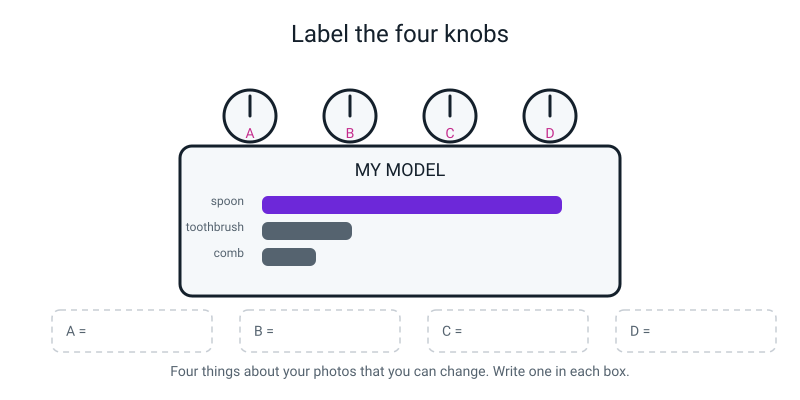
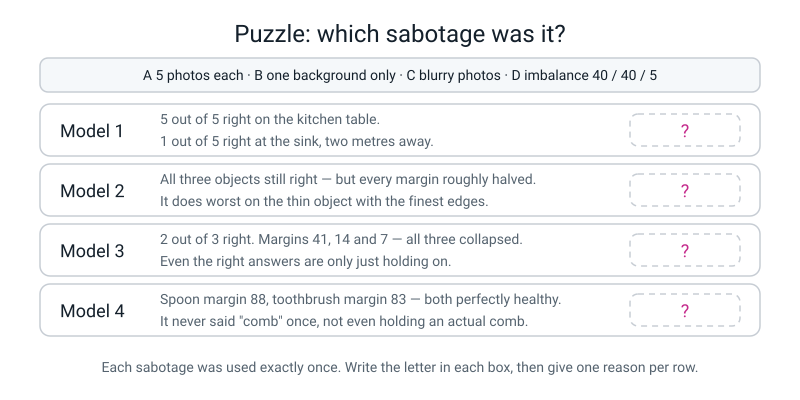
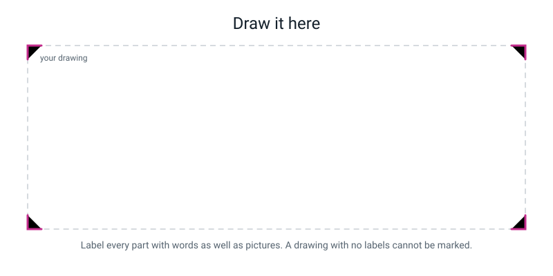

# Workbook — Week 18: Term 2 Checkpoint — Break Your Own Model on Purpose

**Name:** ________________________________  **Date:** ______________

[📖 Read the chapter first](../student-guide/week-18.md) · [Course Home](../README.md)

---

## ✅ Warm-Up (5 min)

This warm-up checks what you remember from **last week**, when you built the model. Keep your notebook closed.

**W1.** Your class counts are 44 / 40 / 36. Do the balance check and say whether you may train.

________________________________________________________________

**W2.** How many photo-examinations happen if you have 120 photos and the software does 50 passes?

________________________________________________________________

**W3.** Are your photos inside the model file? Give the reason with two numbers in it.

________________________________________________________________

________________________________________________________________

**W4.** What is the **only** way to save a Teachable Machine project, and what did you call your file?

________________________________________________________________

**W5.** Your model said 74% on a fork. Was it broken? Answer in one sentence that mentions boxes.

________________________________________________________________

________________________________________________________________

---

## ✍️ Practice Set A — Understand It

These questions check that you understand this week's ideas.

**A1. Fill in the blanks.**

(a) A **controlled experiment** means you change exactly ____________ thing and keep everything ____________ the same.

(b) A **sabotage test** means deliberately ____________ your training data to find out what the model had been ____________ on.

(c) After every single experiment you must reload ______________________________.

(d) The margin moves ____________ the verdict does.

---

**A2. Multiple choice.** Circle **one**. You retrain with fewer photos **and** move to a different room, and the score drops 20 points. What can you conclude?

| | | |
|---|---|---|
| **A** | Fewer photos caused it | |
| **B** | The room caused it | |
| **C** | They each caused about 10 points | |
| **D** | Nothing at all — the experiment cannot answer the question | |

Explain your choice in one line: ________________________________________________

---

**A3. True or false — and explain.**

> *"A model that scores 95% is better than a model that scores 91%."*

Circle one:  **TRUE**  /  **FALSE**  /  **CAN'T TELL**

Explain, and your explanation must contain the word **where**:

________________________________________________________________

________________________________________________________________

---

**A4. Match the pairs.** Write the correct letter beside each sabotage.

| Sabotage | | | What it suggests |
|---|---|---|---|
| 5 photos per class instead of 40 | ______ | **P** | the model never saw the background change, so a new background throws it off |
| one background only | ______ | **Q** | training reduces *total* mistakes, so it abandons the cheap class |
| blurry training photos | ______ | **R** | too few examples produces *unstable* answers before wrong ones |
| imbalance 40 / 40 / 5 | ______ | **S** | blur may be hiding edges, a useful signal in a small-object photo (a likely but untested explanation) |

---

**A5. Label the four knobs.** These are four things about your **photos** that you can change. Write one on each knob in the diagram, then copy them here.


*Figure W18.1 — Four knobs. One gets turned; the other three get taped down.*

A = ____________________________________________________________

B = ____________________________________________________________

C = ____________________________________________________________

D = ____________________________________________________________

Now list **six** things you must hold fixed (tape down) while you turn one knob:

1. ________________________________  4. ________________________________

2. ________________________________  5. ________________________________

3. ________________________________  6. ________________________________

---

**A6. Term 2 vocabulary, no notes.** One sentence each. If you have to look one up, put a star beside it and come back to it tomorrow.

| Word | Your one sentence |
|---|---|
| **feature** | |
| **label** | |
| **baseline** | |
| **training** | |
| **confidence** | |

---

## ✍️ Practice Set B — Use It

These questions ask you to use the ideas on new situations.

**B1. What would go wrong?** Your friend says: *"Four experiments takes ages. I'll do the 5-photo one and the blurry one together — that's one retrain instead of two."*

(a) What will he be able to conclude from his result?

________________________________________________________________

(b) Suppose his score drops from 5/5 to 2/5. Write down the question he cannot answer.

________________________________________________________________

(c) Is there **any** situation where a scientist changes two things on purpose? Say what for.

________________________________________________________________

________________________________________________________________

---

**B2. What would go wrong?** You run experiment 1 (five photos per class), and then go straight into experiment 2 (one background) **without reloading the baseline first.** Suppose, as a shortcut, you carry on from the classes as experiment 1 left them (5 photos each) and swap in only the one-background photos, 5 per class, instead of loading the full set.

(a) How many photos per class does experiment 2 actually end up with? ________________

(b) How many things have you changed by the time you test experiment 2? Name them.

________________________________________________________________

(c) What should you do about the experiment-2 numbers you wrote down?

________________________________________________________________

(d) Why is this mistake so easy to make? (There is a specific reason.)

________________________________________________________________

---

**B3. Term 2 review — the sneaky column.** Somebody is building a model to tell apples from oranges from pears, and one of their table columns is:

```text
   sticker_says  =  APPLE
```

(a) What is wrong with that feature? Name it properly.

________________________________________________________________

(b) What will it score in testing? ________________  And in real use? ________________

(c) The three fruits are equally common. What is the **baseline** — the score you'd get just by always guessing the same fruit?

________ in ________ = ________ %

(d) Their model scores 34%. What has it learned?

________________________________________________________________

---

**B4. Two questions, two shapes of answer.**

(a) *"Will it rain tomorrow — yes or no?"* Is that **classification** or **regression**? ________________

(b) *"How many millimetres of rain will fall tomorrow?"* ________________

(c) Your model scores **95%** on the table it was trained on and **34%** at the sink. You have to write one line in a report. What do you write, and why is writing only the 95% dishonest even though the number is true?

________________________________________________________________

________________________________________________________________

________________________________________________________________

---

**B5. Design your own fifth sabotage.** Not one of the four we did.

(a) My sabotage: ____________________________________________________

(b) The **one** thing I am changing: __________________________________

(c) Everything I am holding fixed: ____________________________________

________________________________________________________________

(d) **My prediction, written before I run it** — score out of 5, and *why*:

________________________________________________________________

________________________________________________________________

(e) What would this sabotage **prove**, if my prediction turns out to be right?

________________________________________________________________

---

## 🧩 Puzzle of the Week

This puzzle is a detective game. Four models were damaged. You are told only their **results**.

Work out which sabotage was done to each one. Each sabotage was used exactly **once**.


*Figure W18.2 — Four results, four sabotages, one each. Give a reason for every answer.*

**The four sabotages:**  **A** 5 photos each · **B** one background only · **C** blurry photos · **D** imbalance 40 / 40 / 5

| Model | The evidence | Which sabotage? | My reason |
|:--:|---|:--:|---|
| **1** | 5 of 5 right on the kitchen table. 1 of 5 right at the sink, two metres away. | ______ | |
| **2** | All three objects still right — every margin roughly halved. Worst on the thin object with the finest edges. | ______ | |
| **3** | 2 of 3 right. Margins 41, 14 and 7 — all three collapsed. Even the right answers are only just holding on. | ______ | |
| **4** | Spoon margin 88, toothbrush margin 83 — both healthy. Never said "comb" once, not even holding a comb. | ______ | |

**The bonus question.** Two of these four could be done **without taking any new photos at all.** Which two, and how?

________________________________________________________________

________________________________________________________________

---

## 🤔 Think Deeper

These two questions need a written paragraph each.

**T1.** You cannot just read the answer off the numbers inside a model — not you, not the people who built Teachable Machine.

Write a paragraph explaining how you can still end up **trusting** one. What would you need to have done first? Use the phrase *tested in enough different situations*, and finish by saying what kind of trust that is — and whether it is weaker or stronger than a model that could explain itself.

________________________________________________________________

________________________________________________________________

________________________________________________________________

________________________________________________________________

________________________________________________________________

________________________________________________________________

---

**T2.** The husky-and-wolf model **worked**. It passed its tests, and a good score hid its problem. Its snow was only found because the researchers already knew it was there.

Write a paragraph: whose **job** is it to go looking for the snow in a real product, and how would you make sure it actually gets done? Say what you would insist on before letting a model be used on real people.

________________________________________________________________

________________________________________________________________

________________________________________________________________

________________________________________________________________

________________________________________________________________

________________________________________________________________

---

## 🛠️ Build It

Here you record your own experiment results and explain them. There are three parts.

### Part 1 — The five-row results table (15 min)

Copy **row 0** across from your Week 17 baseline table.

Do **not** re-measure it. Re-measuring would change a variable.

Test items, in the **same order every single run**: ____________ , ____________ , ____________ , ____________ , ____________

> **⚠️ Watch out:** if two of your test items are in no class at all (the fork, your empty hand), then a *perfect* score is **3 out of 5**, not 5 out of 5. That isn't a mistake in the lab — it's the point. If you used only your three real objects, score out of 3.

| # | what I changed | score | margin 1 | margin 2 | margin 3 | verdict |
|:--:|---|:--:|:--:|:--:|:--:|---|
| 0 | baseline: 40 each, full variety | ______ | ______ | ______ | ______ | ____________ |
| 1 | 5 photos per class | ______ | ______ | ______ | ______ | ____________ |
| 2 | one background — **on that surface** | ______ | ______ | ______ | ______ | ____________ |
| 2 | one background — **somewhere else** | ______ | ______ | ______ | ______ | ____________ |
| 3 | blurry training photos | ______ | ______ | ______ | ______ | ____________ |
| 4 | imbalance 40 / 40 / 5 | ______ | ______ | ______ | ______ | ____________ |

> **📏 Size note:** rows 2 and 3 use about 15 photos per class, not 40. That is deliberate, to keep the photo-taking short, but it means those runs change two things at once (the photos *and* how many). Row 1 already showed that fewer photos can shrink margins alone. So compare the two row-2 tests with each other, and treat a comparison with row 0 as a hint, not proof.

**Which experiment hurt the most?** ______________________________

**Did you predict that one?** ______________  If not, which did you predict? ______________

---

### Part 2 — One explanation per row (25 min)

Every row gets **three** things:

1. the sentence frame filled in
2. whether your prediction was right
3. if it was wrong, what you'd predict next time

> **The frame, and you must use it:** *"The margin fell from ______ to ______ because ______."*
>
> "It got worse" is an observation. You were asked for a reason.

**Row 1 — five photos per class.**

________________________________________________________________

________________________________________________________________

My prediction was ______________ . I was **right / wrong** because ________________

________________________________________________________________

**Row 2 — one background, tested on that surface.**

________________________________________________________________

________________________________________________________________

My prediction was ______________ . I was **right / wrong** because ________________

________________________________________________________________

**Row 2 — one background, tested somewhere else.**

________________________________________________________________

________________________________________________________________

**And the question that matters:** if I had *only* tested on the surface it was trained on, what would I have concluded about this model?

________________________________________________________________

**Row 3 — blurry photos.**

________________________________________________________________

________________________________________________________________

My prediction was ______________ . I was **right / wrong** because ________________

________________________________________________________________

**Row 4 — imbalance 40 / 40 / 5.**

________________________________________________________________

________________________________________________________________

The arithmetic: a model that never says "comb" gets (fill in the blanks):

```text
   ________ + ________ + ________  =  ________  correct

   out of  ________ + ________ + ________  =  ________  photos

   ________ ÷ ________  =  ____________  ≈  ________ %
```

My prediction was ______________ . I was **right / wrong** because ________________

________________________________________________________________

---

### Part 3 — Term 2 reflection (15 min)

**Three things you can do now that you could not do in Week 10.**

Not "I learned about AI." Not "I got better at computers."

Write **three specific things you can DO**. Give each one an example with numbers or names in it.

**1. I can** ______________________________________________________

My example: ____________________________________________________

________________________________________________________________

In Week 10 I would have ________________________________________

**2. I can** ______________________________________________________

My example: ____________________________________________________

________________________________________________________________

In Week 10 I would have ________________________________________

**3. I can** ______________________________________________________

My example: ____________________________________________________

________________________________________________________________

In Week 10 I would have ________________________________________

**And the one from minute one.** You wrote a guess at the start of the lesson: *does my model have a snow?* Look at your table.

What I guessed: ______________  What the table says: ______________

________________________________________________________________

---

## 🎨 Draw It

This section is for showing your idea as a picture.

**Your task:** draw **what your model was really looking at.**

Draw the same object twice — once where the model gets it right, and once where it gets it wrong — and make it obvious what changed. You must label: the object, what changed, the readout in each case, and (your best guess) the thing the model was actually keying on.


*Figure W18.3 — Draw inside the frame. Labels are not optional.*

> **💡 What a good answer looks like:** two panels side by side, same spoon in both. Left panel: the spoon on the wooden table, with the wood **shaded or hatched and labelled** "in every single training photo", and a readout `spoon 95 · margin 92 ✓`. Right panel: the identical spoon over the white sink, the wood gone, readout `toothbrush 39 · margin 5 ✗`. Then the part that earns the marks: an arrow pointing not at the spoon but at the **table**, labelled *"this is what it was using"* — and one line underneath: *"if I'd only tested on the table I'd have called this my best model."*

---

## 📊 Self-Check

Tick one box on each row to show how sure you feel.

| I can… | 😀 easily | 🙂 with a bit of thought | 😕 not yet |
|---|:--:|:--:|:--:|
| design a controlled experiment and list what I'm holding fixed | ☐ | ☐ | ☐ |
| write a prediction down first and report it honestly when I was wrong | ☐ | ☐ | ☐ |
| explain a drop by pointing at the exact change in the data | ☐ | ☐ | ☐ |
| say why a higher score can mean a worse model | ☐ | ☐ | ☐ |
| define feature, label, baseline, training and confidence with no notes | ☐ | ☐ | ☐ |
| remember to reload the baseline between experiments | ☐ | ☐ | ☐ |

**Weeks I want to go back over:** ______________________________________

**One thing I want to ask about next lesson:**

________________________________________________________________

---

## ✅ Answers

Use this section to mark your own work, after you have finished everything above.

<details>
<summary>Check your answers</summary>

### Warm-Up

**W1.** `(44 − 36) ÷ 44 = 8 ÷ 44 = 0.1818… ≈ **18.2%**`. That is under 20%, so **yes, you may train** — though it's close enough that it's worth noting in your log.

**W2.** `120 × 50 = **6,000**` photo-examinations. At one photo per second a person would need 100 minutes.

**W3.** **No.** The model file is about **3 MB**; the photos that made it were about **40 MB**. Something 3 MB in size cannot be storing 40 MB of pictures, so the photos are not in there. Training compressed them into a pattern and then let them go.

**W4.** **☰ menu → Download project as file.** There is no autosave of any kind. The file was called **`baseline-v1.tm`**.

**W5.** **No, it was not broken** — it had only three boxes (spoon, toothbrush, comb), 100 points of belief to give away, and no box for "none of these", so it handed nearly all its belief to the closest-shaped box it had.

---

### Practice Set A

**A1.**
(a) exactly **one** thing, keeping everything **else** the same.
(b) deliberately **damaging** your training data to find out what the model had been **depending** (or relying) on.
(c) **`baseline-v1.tm`** — the saved project file.
(d) The margin moves **before** the verdict does.

**A2.** **D — nothing at all. The experiment cannot answer the question.**
Why: with two things changed, no amount of staring at a 20-point drop can tell you how the drop divides between them. **C is the tempting wrong answer** — splitting it 10 and 10 *feels* fair, but you have invented that number; the experiment contains no evidence for it. The information was never collected, so it cannot be recovered later.

**A3.** **CAN'T TELL** is the best answer. (**FALSE** with a good explanation also gets full credit.)
Explanation: a score means nothing until you know **where** it was measured. Our one-background model scored 95% on the wooden table it trained on and 34% two metres away at the sink, while the baseline scored 91% **everywhere we tried it**. So the 95% model is the worse model *and* the more dangerous number — because it was measured honestly and points the wrong way.

**A4.**

| Sabotage | Answer | What it suggests |
|---|:--:|---|
| 5 photos per class | **R** | too few examples produces *unstable* answers before wrong ones |
| one background only | **P** | the model never saw the background change, so a new background throws it off |
| blurry training photos | **S** | blur may be hiding edges, a useful signal in a small-object photo (a likely but untested explanation) |
| imbalance 40 / 40 / 5 | **Q** | training reduces *total* mistakes, so it abandons the cheap class |

**A5.** The four knobs are the four things about your **photos** you can change:

- **A = how many photos per class** (40, or 5)
- **B = how many different backgrounds** (five surfaces, or one)
- **C = how sharp the photos are** (held still, or waved about)
- **D = whether the classes are balanced** (40 / 40 / 40, or 40 / 40 / 5)

*Any four sensible photo properties get credit — lighting, angle and distance are all legitimate knobs too. What does **not** count as a knob: "how clever the computer is", "how long I train for", or "the Advanced settings". Those aren't the photos, and the photos are the whole model.*

The six things taped down:

1. the same three objects
2. the same five test items, **in the same order**
3. the same room, the same spot, the same light
4. the same distance from the camera
5. the same person holding them
6. the same way of reading the numbers (freeze, count to two, read)

*"Same order" is the one people think is fussy. It isn't: if you always test the spoon first with a steady hand and the comb last when you're bored, you have added a variable.*

**A6. Term 2 vocabulary.**

| Word | Target answer |
|---|---|
| **feature** | One measured description of one example — one column in the table. Example: `weight_g = 150`. |
| **label** | The answer you want the machine to produce — the column you cover up and try to predict. |
| **baseline** | The score you'd get by always guessing the most common answer; the thing you compare every result against. |
| **training** | The one-off process where the machine studies labelled examples over and over and tunes its own internal numbers. |
| **confidence** | How strongly the model prefers a class. **Not** the chance of being right. |

**Three out of five with no notes is a solid pass for a term checkpoint.** Star the misses and reteach them as next week's warm-up — a checkpoint's output is a list of weeks, not a grade.

---

### Practice Set B

**B1.**
(a) **Nothing useful.** He'll know that "fewer photos *and* blur, together" made it worse, which he could have guessed without doing the experiment.
(b) The question he cannot answer: **"which of the two caused it, and how much of the 3-mark drop belongs to each?"** He cannot answer it now and he cannot answer it later — the information isn't in the run. To find out he'd have to do the two experiments separately, which is exactly the work he was trying to skip.
(c) **Yes** — a scientist changes two things on purpose to find out whether the two **together** do something neither does alone. (For example: maybe blur alone is survivable and few photos alone is survivable, but both together collapse completely.) That's a real and more advanced design — but **it only means anything once you already have the one-at-a-time results to compare it with.**

**B2.**
(a) **Five.** Experiment 1 deleted the samples down to 5 per class, and nothing put them back; in this shortcut you only swapped in 5 one-background photos per class, so the count stays 5. (If you loaded the full set instead, the count would be different — which is why the method must be stated and the baseline reloaded.)
(b) You have changed **two** things: the number of photos (still 5 from the last run) **and** the number of backgrounds. Possibly a third, if the one-background set has a different count again.
(c) **Cross them out. That experiment is void.** Reload `baseline-v1.tm` and run it again properly. Do not quietly keep the number — a number from a broken experiment is worse than no number, because you'll believe it.
(d) It's easy to make because **step 7 has no button of its own and nothing warns you.** The tab looks completely fine; the model is loaded; everything works. Every other step in the loop has something on screen that tells you it happened. This one only exists in your head, which is exactly why you say it out loud every time.

**B3.**
(a) It is a **leaky feature** (a leak). It already contains the answer.
(b) In testing: about **100%** — it will look like the best feature anyone has ever built. In real use: **useless**, because at the moment you actually need a prediction, the sticker either isn't there yet or is the very thing you were trying to work out. *The three-second test: stand at the moment you need the answer and ask whether you have this value yet.*
(c) Three fruits, equally common, so the baseline is `1 in 3 = **33.3%**`.
(d) A model scoring **34%** has learned **essentially nothing** — it is doing no better than always guessing the same fruit. Not "a weak model": no model.

**B4.**
(a) **Classification** — the answer is one item from a short fixed list (yes / no).
(b) **Regression** — the answer is a number on a sliding scale (3 mm, 11.5 mm, 0 mm).
(c) You write **both numbers**: *"95% on the surface it was trained on; 34% on a surface it had never seen."*
Why reporting only the 95% is dishonest even though it's true: **a number without a "where" attached invites the reader to assume it applies everywhere.** The 95% is a true statement about one wooden table and the reader will hear it as a true statement about spoons. If you were forced to report only one number, the honest one is the **34%**, because that's the one that tells you what happens somewhere the model hasn't already seen.

**B5.** There is no single right answer. A full-credit design has all five parts, and the marks are in (b), (c) and (d) — **not** in whether the prediction came true.

**Model answer:**

> (a) **My sabotage:** photograph one class — the comb — only at night under a lamp, and the other two in daylight as usual.
> (b) **The one thing I am changing:** the lighting of a single class.
> (c) **Held fixed:** same three objects, same 40 photos per class, same five test items in the same order, same test spot in daylight, same distance, same person holding, same reading method.
> (d) **Prediction: 2 out of 3.** I think the comb will be wrong in daylight, because if every comb photo is dim and orange, then "dim and orange" becomes part of what the model thinks a comb is — and in daylight that evidence has gone. I also predict the *spoon and toothbrush* margins will barely move, because I haven't touched their photos.
> (e) **What it would suggest:** that a model can key on the **lighting** of a class just as readily as on the background — the same mechanism as experiment 2, with a different variable. It would also suggest something sharper: the damage is confined to the class I damaged, which you cannot say about the imbalance experiment.

*Other good fifth sabotages: mislabel five photos on purpose · put your own hand in every photo of one class · photograph one class through a window · photograph everything upside down · use only close-ups for one class.*

---

### 🧩 Puzzle of the Week

| Model | Answer | Reason |
|:--:|:--:|---|
| **1** | **B — one background only** | The giveaway is that the *place* changed and nothing else. 5/5 on the surface it trained on, 1/5 two metres away. If the problem were the photos themselves, it would be bad in both places. Only a background-dependent model is brilliant in one spot and broken in another. |
| **2** | **C — blurry photos** | Two clues. First, "all three still right but margins halved" — that's damage to the *quality* of the evidence, not to how much of it there is. Second, and decisive: **worst on the thin object with the finest edges.** Blur destroys edges, so the class that depends most on edges suffers most. |
| **3** | **A — 5 photos each** | *Every* margin collapsed at once (41, 14, 7) across all three classes equally, and the score only fell a little. That even, across-the-board fragility is what too few examples does: the pattern it found is thin, so nothing is held confidently, but it isn't wrong yet either. |
| **4** | **D — imbalance 40 / 40 / 5** | The two big classes are completely healthy (88 and 83) and one class has effectively vanished. Damage confined to exactly one class, with the others untouched, is the signature of imbalance — nothing else does that. |

**The bonus question.** **A** and **D** need **no new photos at all** — both are done purely by **deleting samples** from the model you already have. A: delete until every class has 5. D: delete comb photos until 5 remain and leave the other two alone. (B and C both need photographs you don't already own: a set taken on one surface, and a set taken while waving the object.)

*This is worth noticing for a practical reason: if you're short of time, A and D are the two you can always run.*

---

### 🤔 Think Deeper

**T1 — model answer.**

> You can end up trusting a model without ever seeing inside it, but only if you have done the work first. What you need is to have **tested it in enough different situations** that you know where it works and where it doesn't — not one test in the room where you built it, but tests on other surfaces, in other lights, at other distances, on objects it has never seen, and on the classes you care about *separately* rather than only as an overall score. You also need the failures written down, not just the successes, because a list of successes is an advertisement and a list of failures is a map.
>
> That is a completely different kind of trust from a model that could explain itself. It's the difference between somebody **telling** you they're reliable and you having **watched** them be reliable over a fortnight. And honestly it's the stronger of the two, because an explanation can be wrong or invented, whereas a result on a test the model had never seen is a fact. A model that says "I used the shape of the handle" might be making that up; a model that still works at the sink is working at the sink.
>
> What it does mean is that trust is **local**. I don't trust my model. I trust my model on these three objects, in these five places, in daylight — and I can tell you what happens outside that.

**T2 — model answer.**

> The honest answer is that it's the job of the people **building and selling** the product, and the reason snow keeps getting shipped is that nobody is made to go looking for it. Finding your own snow is unpleasant work: it makes your good number smaller, it delays the launch, and nobody is rewarded for it. A team that never checks gets to keep its 95%.
>
> So I don't think "whose job is it" is enough — it has to be made to happen. Before letting a model be used on real people I'd insist on three things. **First, test somewhere the model has never been**: different backgrounds, different lights, different equipment, and if it involves people, different groups of people. **Second, publish the results split up, not averaged** — one number for each group and each condition, because an average hides exactly the failure you're looking for. **Third, say plainly what the model was trained on**, so anyone can see what's missing. The husky model would have failed all three the moment somebody wrote down "all wolf photos: snowy" — the information was sitting there.
>
> And I'd add one more, which is the one from this week: **whoever signs it off should have to run a sabotage test and report it.** If you can't say what your model falls apart without, you don't know what it's using — and if you don't know what it's using, you can't promise anybody anything.

---

### 🛠️ Build It — Part 1: the five-row results table

Your numbers will differ. **The shape is what matters.** This is what a typical set looks like:

| # | what I changed | score | spoon margin | tbrush margin | comb margin | verdict |
|:--:|---|:--:|:--:|:--:|:--:|---|
| 0 | baseline: 40 each, full variety | 3/3 real | 86 | 82 | 66 | works |
| 1 | 5 photos per class | 2/3 real | 41 | 14 | 7 | fragile |
| 2 | one background — **on the table** | 3/3 real | 92 | 88 | 71 | looks great |
| 2 | one background — **at the sink** | 1/3 real | 5 | 11 | 9 | broken elsewhere |
| 3 | blurry training photos | 3/3 real | 34 | 29 | 12 | weakened |
| 4 | imbalance 40 / 40 / 5 | 2/3 real | 88 | 83 | *comb never predicted* | blind spot |

**Which hurt most?** **Experiment 2** — and this is where most predictions go wrong. Most people predict experiment 1 (five photos), because five photos *sounds* obviously insufficient. Experiment 2 does more damage **and** does it in a nastier way, because on its own table it looks like an improvement. If you predicted experiment 2 and can say why, that is genuinely strong thinking and you should be told so.

*Size note for the answer:* rows 2 and 3 used about 15 photos per class against the baseline's 40, so those two runs changed the number of photos as well as the background or the blur. The table-against-sink comparison in row 2 is still clean (same model, same photos, only the place changed). The comparison with row 0 is a hint, not proof.

---

### 🛠️ Build It — Part 2: model explanations, one per row

**Row 1 — five photos per class.**

> The margins fell from 86, 82 and 66 to 41, 14 and 7 — every single one collapsed. It still got two of the three real objects right, so the score barely moved, but nothing is being held confidently any more. With five photos the model saw almost no variety — one or two angles, one background — so the pattern it found is thin. **Too few examples doesn't produce wrong answers so much as unstable ones**, and unstable answers become wrong ones the moment anything shifts. **My prediction was 3/3 and I was wrong** — five photos looks like plenty when you're looking at five photos. Next time I'd predict that the score roughly holds and the margins fall off a cliff, because that's what actually happened.

**Row 2 — one background, tested on that background.**

> The margin went **up**, from 86 to 92 — better than the baseline. That's the surprising bit. Because every training photo had the wooden table in it, the table was in every class, so it may have helped the model feel sure, and when I test on the table everything looks familiar, so the model is more sure than ever. **My prediction was "about the same" and I was right for the wrong reason** — I thought it would be fine because the objects hadn't changed, and actually it was fine because the *table* hadn't changed.

**Row 2 — one background, tested somewhere else.**

> Same spoon, same model, two metres away, and the margin fell from 92 to 5 — a coin toss that landed wrong. The wooden table appeared in every single training photo, so the model was never shown that backgrounds change, and it probably leaned on "warm brown texture in the background". At the sink the table is gone and a big chunk of the evidence may go with it (my one test does not prove that). This is a cousin of the husky-in-the-snow story, in my kitchen, in ten minutes.
>
> **And if I had only tested on the table, I would have concluded this was my best model** — 92 beats 86, honestly measured. That is the sentence I need to remember.

**Row 3 — blurry photos.**

> Still got all three right, but the margins fell from 86, 82 and 66 to 34, 29 and 12. Blur may be hiding **edges**, a useful signal in a photo of a small thin object (a likely explanation, not tested). The odd part is that I trained it on blurry photos and tested with everything held perfectly still and sharp, and it *still* struggled — which hints that a mismatch can hurt (I did not test the reverse direction). **Training photos need to look like the photos the model will actually meet.** A model trained only on perfect studio pictures may well struggle with the wobbly ones real people take.

**Row 4 — imbalance 40 / 40 / 5.**

> Spoon and toothbrush were fine (margins 88 and 83) and comb was never predicted at all — it got 11 points out of 100 while I was holding an actual comb. Training reduces **total** mistakes and doesn't care which class they come from, so with only 5 combs out of 85 photos the cheapest thing to do is give up on combs.
>
> ```
>    photos:      40 + 40 + 5  =  85
>    never says "comb":  40 + 40 + 0  =  80 correct
>    80 ÷ 85  =  0.94117…  ≈  94.1%
> ```
>
> **94% accurate and completely blind to one third of its job.** My prediction was right, and I'm only confident about that because I did the division *before* I ran it.

**Marking the predictions:** there is no correct prediction. Full credit = a number, a reason that names a mechanism, and an honest right/wrong verdict afterwards — including "I was wrong because…". No credit for a blank slip, or one written after the result, or one changed after the result. **A wrong prediction you have thought about is worth more than a right one you got lucky on**, and it is marked that way.

---

### 🛠️ Build It — Part 3: Term 2 reflection

**Model answer:**

> **1. I can work out a margin and say what it means.** Given spoon 62, toothbrush 21, comb 17, the winner is spoon and the margin is `62 − 21 = 41`, which is reasonably clear — whereas a margin of 4 would be a coin toss dressed up as an answer. In Week 10 I would have read the 62 and stopped.
>
> **2. I can train a real model and check it's fair before I press the button.** I named my three classes properly instead of leaving them as Class 1, counted the samples, and worked out `(41 − 39) ÷ 41 = 4.9%`, which is under 20%, *before* training. In Week 10 I didn't know a model was made of photos at all.
>
> **3. I can find out what a model is relying on by breaking it.** I changed one thing, taped everything else down, wrote my prediction in ink first, and then explained the drop by pointing at the data change: my one-background model scored 95% on the table and 34% at the sink, so it was using the table. In Week 10 I would have looked at 95% and said it was good.

**Not acceptable:** "I learned about AI." · "I learned how models work." · "I got better at computers." · "I can use Teachable Machine." *(That last one is closer — but what can you **do** with it? Name the step and give the numbers.)*

**The minute-one guess:** whatever you guessed about your model having a snow, the marks are for **comparing it honestly with your table**, not for having guessed right. "I said no and I was wrong — mine was using the table" is a full-credit answer.

---

### 🎨 Draw It

There is no single right drawing. A strong answer does **four** things:

1. **The same object appears twice.** If the object changes between panels, you've drawn two experiments instead of one controlled one.
2. **Exactly one thing differs between the panels**, and it is **labelled as the thing that changed**. One arrow, one label: "only the background is different."
3. **Both readouts are shown with numbers** — not "good" and "bad", but `95, margin 92` and `39, margin 5`. Numbers are how this course argues.
4. **The arrow points at the background, not at the object.** This is the part that turns a picture of a result into a picture of the *idea*: the model was never looking at the spoon.

Test your own drawing with one question: *does my picture explain why a higher score can mean a worse model?* If someone could look at it and still think the 95% panel was the better model, add the line "if I'd only tested here, I'd have called this my best one."

</details>

---

[⬅ Week 17 workbook](week-17.md) · [📖 Week 18 chapter](../student-guide/week-18.md) · [Course Home](../README.md) · [Week 19 workbook ➡](week-19.md) · [Glossary](../../glossary.md)
