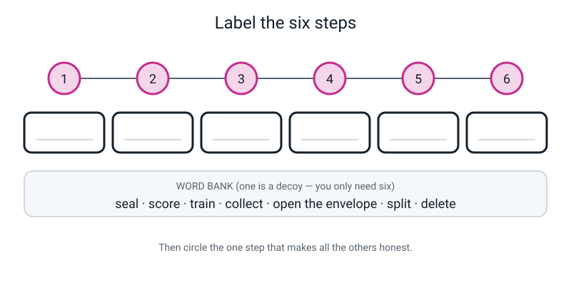
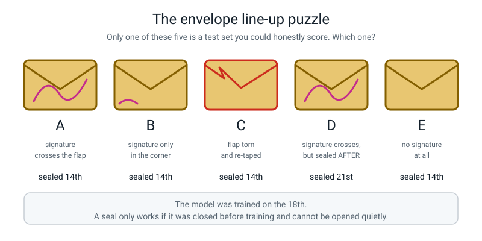
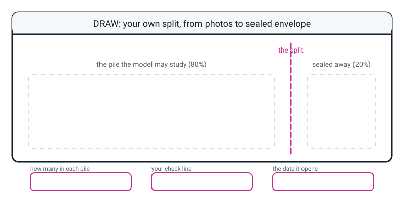

# Workbook — Week 19: The Test You Can't Study For

**Name:** ________________________________  **Date:** ______________

[📖 Read the chapter first](../student-guide/week-19.md) · [Course Home](../README.md)

---

## ✅ Warm-Up (5 min)

Five quick questions about **last week**.

**W1.** What is a **controlled experiment**? (One phrase is doing all the work — make sure it's in there.)

________________________________________________________________

**W2.** Why do you write your prediction down **in ink, before** you run the experiment?

________________________________________________________________

**W3.** In the husky-and-wolf story, what had the model actually learned to look for?

________________________________________________________________

**W4.** You retrain with fewer photos, **and** test in a different room, **and** hold the objects closer. The score drops 20 points. Which change caused the drop?

________________________________________________________________

**W5.** Your one-background model scored **95%** on the wooden table and **40%** at the sink. What does the 95% tell you about the model?

________________________________________________________________

---

## ✍️ Practice Set A — Understand It

These questions check the words and the steps of a split.

**A1. Fill in the blanks.**

The pile of examples the model is allowed to study is called the ____________________ ____________________.

The examples you hide *before* training, and look at once at the very end, are called the ____________________ ____________________.

The verb for putting examples aside before training is to ____________________ ____________________.

How you divided them, written as train / test, is called the ____________________ ____________________.

**A2. Multiple choice.** When must the split happen? Circle one.

```text
   (a)  after training, so the model has learned as much as possible
   (b)  before training, before the model has seen anything
   (c)  during training, halfway through
   (d)  it doesn't matter, as long as the two piles are separate
```

Now say **why** in one sentence: ____________________________________________

________________________________________________________________

**A3. True or false — and explain.**

> *"Hiding more photos always gives you a better model."*

Circle: **TRUE** / **FALSE**

Explain: ________________________________________________________

________________________________________________________________

**A4. Match the pairs.** Draw a line, or write the letter in the right-hand column.

| The cheat | | What leaked |
|---|---|---|
| **1.** Split after training | ____ | (a) The object itself — you measured "can it recognise *this* one" |
| **2.** Thirty frames from one 3-second video | ____ | (b) Everything. The model already studied all six |
| **3.** Peek at the test set, then retrain | ____ | (c) Near-duplicates. Each hidden frame has an almost-identical twin |
| **4.** Same physical object in both sets | ____ | (d) The *decision*. It leaked through the person's brain |

**A5. Label the diagram.** Write the six steps in the boxes, in the right order, using the word bank. One word in the bank is a decoy. Then circle the one step that makes all the others honest.


*Figure W19.1 — Six numbered steps in order. The word bank at the bottom has exactly the six words you need.*

**A6. Do the arithmetic.** 40 photos, 80/20 split. Show all three lines, including the check.

```text
   test  = 0.20 x 40 = ____________

   train = 40 - ____ = ____________

   check: ______ + ______ = ______     ✓
```

---

## ✍️ Practice Set B — Use It

These questions use splits on photo sets and on made-up situations.

**B1.** You have **60 photos** — 20 each of `mug`, `glass`, `bowl`. You decide on a **90/10** split, per class.

```text
   per class:   test  = 0.10 x 20 = ____________
                train = 20 - ____ = ____________

   x 3 classes: test = ____________     train = ____________

   check: ______ + ______ = ______     ✓
```

Now: **is 90/10 a good idea here?** One photo in your test set is worth how many points of that class's score?

________________________________________________________________

________________________________________________________________

**B2. Here is a situation. What would go wrong, and why?**

> *Your friend has 90 photos — 30 spoons, 30 forks, 30 knives. He shuffles all 90 together in one big pile and grabs the first 18 as his test set.*

What could go wrong: ____________________________________________

________________________________________________________________

What should he do instead: ______________________________________

________________________________________________________________

**B3. Here is a situation. What would go wrong, and why?**

> *A student takes 40 photos of her dog Bruno for the training set. Then, a week later, in a different room, in different light, she takes 10 more photos of Bruno and seals them in an envelope as the test set. She scores 10 out of 10 and writes "my model recognises dogs with 100% accuracy."*

What is wrong with her sentence: ________________________________

________________________________________________________________

What does her 10 out of 10 **actually** measure: ________________

________________________________________________________________

How would you fix it? (You may not say "take better photos.") ____

________________________________________________________________

**B4. Choose a ratio, and give a reason.** You have only **8 photos per class**, three classes.

The ratio I would choose: ______ / ______

My reason: ______________________________________________________

________________________________________________________________

How many test photos per class does that give you? ______  And one photo is worth how many points of that class's score? ______

**B5. Which direction is the error?** For each one, circle whether the reported score will come out **too high** or **too low**, and say what leaked in three words or fewer.

| Situation | Direction | What leaked |
|---|---|---|
| Trained on all 30, then picked 6 as the test set | too high / too low | ______________ |
| Took a photo of a training photo and used it as a test photo | too high / too low | ______________ |
| Held out 6 photos, all from the class it was best at | too high / too low | ______________ |
| Opened the envelope, changed things, tested again, reported the second score | too high / too low | ______________ |

**Now the question underneath all four:** they are all wrong in the same direction. Why is that not a coincidence?

________________________________________________________________

---

## 🧩 Puzzle of the Week

This puzzle is about five sealed envelopes.


*Figure W19.2 — Five envelopes, A to E. Only one of them was sealed honestly. Find the four faults first.*

Five people each sealed a test set. **The model was trained on the 18th.** Only **one** of these five envelopes holds a test set you could honestly score.

| Envelope | What it looks like | Sealed | Honest? Why / why not? |
|:--:|---|:--:|---|
| **A** | signature crosses the flap | 14th | ______________________________ |
| **B** | signature only in the corner | 14th | ______________________________ |
| **C** | flap torn and re-taped | 14th | ______________________________ |
| **D** | signature crosses the flap | **21st** | ______________________________ |
| **E** | no signature at all | 14th | ______________________________ |

**The honest one is envelope: ______**

**Bonus.** Envelope D looks perfect — a proper signature right across the flap. Explain in one sentence why the *date* ruins it.

________________________________________________________________

________________________________________________________________

---

## 🤔 Think Deeper

These two questions have no single clean answer. Argue for one side.

**T1.** A doctor has records for **12 patients** with a very rare illness. She wants to build a model that spots it. Hiding 20% means hiding **2** patients — and a test of two measures almost nothing. What should she do? There is no clean answer, so argue for one and say what it costs.

________________________________________________________________

________________________________________________________________

________________________________________________________________

________________________________________________________________

________________________________________________________________

**T2.** Your test photos are your hands, your kitchen, your light, your table. Your model might one day be used by other people, in other kitchens. **Is your test set honest?** Say what your score does predict well, and what it does not predict at all.

________________________________________________________________

________________________________________________________________

________________________________________________________________

________________________________________________________________

________________________________________________________________

---

## 🛠️ Build It

Here you do the splitting arithmetic, write up the cheats, and log your own photo sets.

### Page 19.1 — Five splitting problems

**The rule: show the multiplication and show the check, every time.** If the answer isn't a whole number, say which way you rounded **and why** — that's the marked part, not the number.

**(a) 3 classes, 30 photos each (90 total), 80/20.**

```text
   per class:  test  = ______________     train = ______________

   totals:     test  = ______________     train = ______________

   check: ______ + ______ = ______   ✓
```

**(b) 3 classes, 25 photos each (75 total), 80/20.**

```text
   per class:  test  = ______________     train = ______________

   totals:     test  = ______________     train = ______________

   check: ______ + ______ = ______   ✓
```

**(c) 4 classes with 50, 50, 50 and 18 photos (168 total), 80/20.**

```text
   class 1:  ______________ test,  ______________ train
   class 2:  ______________ test,  ______________ train
   class 3:  ______________ test,  ______________ train
   class 4:  0.20 x 18 = ______  →  I rounded ____________ to ______

   why I rounded that way: _______________________________________

   totals:  test = ______________     train = ______________

   check: ______ + ______ = ______   ✓
```

There is a **second** problem with class 4 that has nothing to do with the split. What is it?

________________________________________________________________

**(d) 2 classes, 200 photos each (400 total), 80/20.**

```text
   per class:  test  = ______________     train = ______________

   totals:     test  = ______________     train = ______________

   check: ______ + ______ = ______   ✓
```

Would you use 80/20 here, or something else? Give a reason either way.

________________________________________________________________

________________________________________________________________

**(e) 3 classes, 12 photos each (36 total), 80/20.**

```text
   per class:  0.20 x 12 = ______  →  I rounded to ______ test,  ______ train

   totals:  test = ______________     train = ______________

   check: ______ + ______ = ______   ✓
```

Now the honest bit. Work out your **real** split ratio:

```text
   ______ ÷ ______ = ____________ = ______%     →  so the real ratio is ______ / ______
```

### Page 19.2 — The four cheats, written up

| # | The cheat | What leaked? | Too high or too low? | The fix, in one sentence |
|:--:|---|---|:--:|---|
| 1 | Split after training | | | |
| 2 | Same 3-second video burst | | | |
| 3 | Peek, then retrain | | | |
| 4 | Same object in both sets | | | |

**Now invent a fifth cheat of your own.** Make it sound completely reasonable — the more innocent it looks, the better.

My cheat: ______________________________________________________

________________________________________________________________

________________________________________________________________

What leaks: ____________________________________________________

The fix: _______________________________________________________

### Page 19.3 — The photo plan and the envelope log

**Two sessions. Two different days.** Fill this in as you go, not afterwards.

```text
   SESSION 1  —  date: ______________   time: ________   place: ________________

                 light: ________________   surface: ________________

                 class 1 __________ = ______ photos
                 class 2 __________ = ______ photos
                 class 3 __________ = ______ photos
                                        total = ______   →  folder: TRAIN


   SESSION 2  —  date: ______________   time: ________   place: ________________

                 light: ________________   surface: ________________

                 class 1 __________ = ______ photos
                 class 2 __________ = ______ photos
                 class 3 __________ = ______ photos
                                        total = ______   →  the ENVELOPE
```

**What I changed for session 2** — tick every one you actually did:

```text
   ☐ different day        ☐ different room       ☐ different light
   ☐ different surface    ☐ different hand       ☐ different distance
```

**The arithmetic:**

```text
   split ratio:  ______ ÷ ______ = ____________ = ______%   →  ______ / ______

   check: ______ + ______ = ______   ✓
```

**The seal:**

```text
   Sealed and signed on: ______________

   Signature crosses the flap?     ☐ yes    ☐ no  (if no, do it again)

   Written on the front:  DATE ______________   "TEST SET — DO NOT OPEN"

   Do not open until:  Week 22, ______________

   Taped inside my notebook cover?  ☐ yes
```

**Two sentences to write out properly:**

**1.** Why must the split happen **before** training and not after?

________________________________________________________________

________________________________________________________________

**2.** What would you say to somebody who asked to open the envelope early?

________________________________________________________________

________________________________________________________________

> **⚠️ If the envelope gets opened early, write it here, honestly:** ______________________
>
> Nobody will be cross. Hiding it would be the actual problem, and it would only ever fool one person: you.

---

## 🎨 Draw It

Here you draw your own split as a picture.

Draw your **own** split — from the photos you took, through the split, to the sealed envelope. Show the two piles at their real relative sizes (the training pile should look obviously bigger), and write your numbers on it.


*Figure W19.3 — Your own split. Wide pile on the left the model may study; narrow pile on the right you seal away.*

> **What a good answer looks like:** a wide left pile drawn as a stack of 60 photo cards labelled `TRAIN 60`, a narrow right pile of 15 labelled `TEST 15`, an envelope drawn round the right pile with a signature scribbled across its flap, `15 + 60 = 75 ✓` written underneath, and `opens Week 22` with a date on the envelope. Arrows going **left to right** in the order: collect → split → seal → train.
>
> The one thing that must be in your drawing: **the seal happens before the arrow that says "train".**

---

## 📊 Self-Check

Tick one box per row. This page is for you, not for marking.

| I can... | 😀 easily | 🙂 with a bit of thought | 😕 not yet |
|---|:--:|:--:|:--:|
| Split a set of examples at a stated ratio, showing the multiplication and the check | ☐ | ☐ | ☐ |
| Explain why the split must happen **before** training, without just saying "because it's cheating" | ☐ | ☐ | ☐ |
| Spot all four ways of cheating on a split and say what leaked in each | ☐ | ☐ | ☐ |
| Say why the same object in both sets is a problem no amount of care can fix | ☐ | ☐ | ☐ |
| Seal and sign a held-out test set, and say who may open it and when | ☐ | ☐ | ☐ |
| Use the words *training set*, *test set*, *hold out* and *split ratio* correctly | ☐ | ☐ | ☐ |

---

## ✅ Answers

Check your work here after you finish the pages above.

<details>
<summary>Check your answers</summary>

### Warm-Up

**W1.** A **controlled experiment** is one where you change **exactly one thing** and keep everything else the same — so that anything that changes must have been caused by the one thing you changed. That last clause is the whole idea; an answer without it is only half right.

**W2.** Because if you decide afterwards what you "expected", you will always find that you expected whatever happened. Writing it in ink first means the result can surprise you — and **being wrong on the record is worth more than being vaguely right afterwards.**

**W3.** It learned **"white fuzzy stuff at the bottom of the picture → say wolf."** In that demonstration, every wolf photo had snow in the background and no husky photo did, so snow was an easy shortcut. A model like that cannot be trusted to have learned what makes a wolf a wolf.

**W4.** **You cannot say.** Not "you're not quite sure" — you *literally cannot say*, and no amount of staring at the numbers will help, because the information was never collected. The whole run is worthless. That is why you turn one knob at a time.

**W5.** Almost nothing useful. It tells you the model works **on the wooden table**, which is where it was trained. It is a training-conditions score dressed up as a result. The 40% at the sink is the number that carries information.

### Practice Set A

**A1.** **training set** · **test set** · **hold out** · **split ratio**

**A2.** **(b) before training, before the model has seen anything.**

*Why:* because after training the model has already studied every example, so there is nothing left that counts as hidden. Picking six of them afterwards only changes what you *call* them — it does not change what the model has seen. **You cannot un-train a photo.**

*Why (d) is wrong, since it looks reasonable:* the two piles being "separate" is not what makes a test set work. What makes it work is that the model has **never seen** the second pile. Separateness is a consequence, not the point.

**A3.** **FALSE.**

Hiding more photos gives you a **better measurement** of a **worse model**. Every test photo is a training photo you gave up, so the model has less to learn from. A 50/50 split gives you a very reliable score... of a badly trained model. You measured the wrong thing very precisely. The ratio is a **trade-off**, not a dial marked "better".

**A4.** **1 → (b)** · **2 → (c)** · **3 → (d)** · **4 → (a)**

**A5.** The six steps, in order:

```text
   1. collect  →  2. split  →  3. SEAL  →  4. train  →  5. open the envelope  →  6. score
```

The decoy word is **delete**. The step to circle is **3, seal** — because steps 4, 5 and 6 are only honest *because step 3 actually happened.* Move the seal to after step 4 and the whole timeline stops measuring anything.

**A6.**

```text
   test  = 0.20 x 40 = 8

   train = 40 - 8    = 32

   check: 32 + 8 = 40     ✓
```

If you got 8 and 32 but did not write the check line without being asked — write it next time. It is the habit that catches every mistake you are going to make in Week 22, and it costs four seconds.

### Practice Set B

**B1.**

```text
   per class:   test  = 0.10 x 20 = 2
                train = 20 - 2    = 18

   x 3 classes: test = 2 x 3 = 6      train = 18 x 3 = 54

   check: 6 + 54 = 60     ✓
```

**Is 90/10 a good idea here? No — and here is the number that proves it.** With **2** test photos per class, one photo is worth `1 ÷ 2 = 0.5 = 50 percentage points` of that class's score. That class can only ever score 0%, 50% or 100%. That is not a measurement, it is a coin toss with a decimal point.

**What to do instead:** 80/20 gives 4 test per class (one photo = 25 points) — still coarse, but usable. Or better: go and take more photos. 20 per class is thin, and no split can rescue thin data.

**B2.** He could easily end up with something like **12 knives, 5 forks and 1 spoon** in his test set. Then his "test" is basically a knife test, and it barely mentions spoons. Random does **not** mean even — the worst possible draw here is 18 photos all of the same class.

**What he should do instead:** split **each class separately**. `0.20 × 30 = 6`, so 6 spoons, 6 forks, 6 knives held out. Same total (18), completely different quality of measurement. And shuffle *within* each class before dealing, so he doesn't get six photos from the same minute.

**B3.** This is **cheat 4**, and it is the sneaky one, because she did everything visible right: different day, different room, different light, sealed envelope.

**What's wrong with her sentence:** she wrote *"recognises dogs"*, but she has never once tested it on a dog that isn't Bruno. Her experiment contains exactly one dog.

**What her 10 out of 10 actually measures:** *"can it recognise **Bruno**?"* — which is a genuine, useful question, and a much smaller one than the one she claimed to answer.

**The fix:** get a **different dog.** Borrow a neighbour's, use a cousin's, test on three dogs she has never photographed. And if she genuinely only has access to Bruno, then the honest report is: *"tested on new photos of the same dog, so this number does not tell you how it behaves on a dog it has never seen."*

*Why "take the test photos from further away" is not a fix:* that changes the **photo**. The problem is the **dog**.

**B4.** There is no single right answer here — **the reason is what's being marked.** Two strong answers:

> **"70/30, because with 8 photos per class, 20% is only 1.6 photos. Rounded up to 2, one photo would be worth 50 points. 30% gives me 3 test photos (one photo = 33 points), which is still coarse but less silly."** → 3 test per class, one photo = 33 points.

> **"80/20 → rounds up to 2 test per class, and I'd write next to my result that one photo is worth 50 points so nobody over-reads it. But honestly my real answer is: go and take 20 more photos per class first."** → 2 test per class, one photo = 50 points.

**A weak answer:** "80/20 because that's the rule." The number is fine; the missing reason is the problem.

**B5.**

| Situation | Direction | What leaked |
|---|---|---|
| Trained on all 30, then picked 6 as the test set | **too high** | all six |
| Photo of a training photo used as a test photo | **too high** | the photo / the object |
| Held out 6 photos, all from its best class | **too high** | the choice of which to hide |
| Opened envelope, changed things, tested again, reported the second score | **too high** | the decision |

**Why they're all in the same direction:** because every one of them lets the model see, or effectively see, something it should not have. **Extra information can only ever push a model's score up, never down.** Cheating on a test never accidentally *lowers* your mark — that is why "the score came out surprisingly high" is always worth investigating. A disappointingly low score is *not* a sign of cheating, but it is worth a look too: mislabelled photos or a slip in the setup can pull a score down.

### Puzzle of the Week

**The honest one is A.**

| Envelope | Verdict | Why |
|:--:|---|---|
| **A** | ✅ honest | Sealed on the 14th, four days before training on the 18th, with the signature crossing the flap so it cannot be opened quietly. Both conditions met. |
| **B** | ❌ | The signature does not cross the flap, so the flap can be lifted and pressed back down and nobody would ever know — **including the owner, ten minutes later.** A signature in the corner is decoration. |
| **C** | ❌ | It has already been opened. Whatever was inside has been seen, and you cannot un-see it. Those photos are spoiled as a test set. |
| **D** | ❌ | **Sealed on the 21st — three days *after* training on the 18th.** So those photos existed, unsealed, during training. This is cheat 1 with a beautiful signature on it. A perfect seal applied too late seals nothing. |
| **E** | ❌ | No signature means no evidence either way. It might be untouched. Nobody can ever show that, so nobody should believe the score. |

**Bonus — why the date ruins D:** a seal doesn't stop photos from having been trained on; it only proves nobody looked *after* it was closed. Sealing on the 21st proves nothing about the 18th. **The seal has to be earlier than the training, or it is theatre.**

### Think Deeper

**T1.** There is no clean answer, **and that is the answer.** Full credit for arguing one option clearly and naming what it costs. The three real options:

> **Option 1 — reuse the examples cleverly.** Train several times, each time holding out a different one or two patients, and average the results. (This is a real technique with a real name, and you meet it properly at Level 2.) **Cost:** it is fiddly, and it is still only 12 patients of evidence dressed up.

> **Option 2 — report a very wide range of uncertainty.** Build it, test on the 2, and say loudly *"this is based on 12 cases; the true accuracy could be anywhere between 30% and 90%."* **Cost:** almost nobody reads the small print, and the headline will get quoted without it.

> **Option 3 — refuse to deploy it, and go and collect more cases first**, perhaps by joining up with other hospitals. **Cost:** time, and people go untreated in the meantime.

**The one wrong move** is to build it, test it on 2 patients, report a lovely percentage, and let people assume it was properly measured. That is the actual danger, and it is not a maths error — it is a reporting error.

**T2.** **Partly honest, and it is worth being precise about which part.**

- **What your score does predict well:** how your model behaves **in your house**, with your light, your hands, your table, your three objects. That is a genuine result and you should say so.
- **What it does not predict at all:** how it behaves in somebody else's kitchen, with different lighting, different hands, different versions of the same objects.

A good answer says something like: *"my test set is honest about my own house and silent about everybody else's. If this were going to be used by a hundred people, I'd need photos from a lot of those people's homes before I could say 'it works'."*

We measure exactly this in **Week 31** and **Week 33** — so if this question bothered you, good. Hold on to it.

### Build It — Page 19.1

**(a) 3 classes × 30 (90 total), 80/20.**

```text
   per class:  test  = 0.20 x 30 = 6      train = 30 - 6 = 24
   totals:     test  = 6 x 3  = 18        train = 24 x 3 = 72
   check:      18 + 72 = 90     ✓
```

No rounding needed.

**(b) 3 classes × 25 (75 total), 80/20.**

```text
   per class:  test  = 0.20 x 25 = 5      train = 25 - 5 = 20
   totals:     test  = 15                 train = 60
   check:      15 + 60 = 75     ✓
```

**(c) 4 classes: 50, 50, 50, 18 (168 total), 80/20.**

```text
   class 1:  0.20 x 50 = 10 test,  40 train
   class 2:  0.20 x 50 = 10 test,  40 train
   class 3:  0.20 x 50 = 10 test,  40 train
   class 4:  0.20 x 18 = 3.6  →  round UP to 4 test,  18 - 4 = 14 train

   totals:  test = 10 + 10 + 10 + 4 = 34
            train = 40 + 40 + 40 + 14 = 134
   check:   34 + 134 = 168     ✓
```

**Why round UP (this is the marked part):** with only **3** test photos in a class, one photo is worth `1 ÷ 3 = 33` points of that class's score. Getting one wrong drops it by 33 points — far too coarse to mean anything. With 4, one photo is worth 25 points. The single training photo you give up matters much less than being able to measure the class at all.

**The second problem with class 4:** it has **18 photos against the others' 50**. That is a **class imbalance** (Week 16), and it will hurt this model however the split is done. Note carefully: the split arithmetic above is *correct*. It is the **collection** that needs fixing — go and take about 32 more photos of class 4. Two separate problems, and keeping them separate is the skill.

**(d) 2 classes × 200 (400 total).**

```text
   80/20:  per class  test = 0.20 x 200 = 40,   train = 160
           totals     test = 80,                train = 320
   check:  80 + 320 = 400     ✓
```

**Would you use 80/20?** A good answer argues either way *with a reason*. The strongest version of each:

> **"90/10 is also fine here.** 20 test per class, 40 in total, so one photo is worth `1 ÷ 40 = 2.5` points — plenty precise. And the 40 extra training photos per class are worth more to me than precision I don't need."

> **"Keep 80/20 if you intend to compare several models.** 80 test photos separates a 90% model from an 87% model far more reliably than 40 does, because one photo is worth 1.25 points instead of 2.5."

**The point:** the right ratio depends on **the question you're asking**, not on a rule.

**(e) 3 classes × 12 (36 total), 80/20.**

```text
   per class:  0.20 x 12 = 2.4  →  round UP to 3 test,  12 - 3 = 9 train
   totals:     test = 9,   train = 27
   check:      9 + 27 = 36     ✓
```

**The honest part, and full marks if you got this even if the rest was shaky:**

```text
   3 ÷ 12 = 0.25 = 25%       →  the real ratio is 75 / 25, NOT 80 / 20
```

Do **not** label this 80/20 just because that is what you set out to do. The whole point of writing a ratio down is so a reader knows what you *did*.

**Bonus, if you worked it out:** with 3 test photos per class, one photo is worth `1 ÷ 3 = 33` points of that class's score. That is a warning label, not a disaster — you just have to say it out loud whenever you quote the number.

### Build It — Page 19.2

**Every one of the four reports a score that is too high.** If you noticed that pattern by yourself, that is the single most valuable observation of the week.

| # | What leaked | Direction | The fix |
|:--:|---|---|---|
| **1** | Everything. The model studied all 30, so all six "test" photos are ones it has already seen. There is no hidden set — only a hidden *label*. | far too high, expect near 100% | Split first, then train on the 24 only. If you've already trained, start again from scratch — you cannot un-train a photo. |
| **2** | Near-duplicates. Frames about a third of a second apart share the angle, the shadow, the background and the smudge. Every held-out frame has an almost-identical twin in the training pile. | far too high — often 95–100% for a model that fails on anything genuinely new | Split by **session**, not by frame. Two clips, two places, two days; use one clip entirely for testing. Random splitting only works when the examples are genuinely independent of each other, and video frames are not. |
| **3** | The **decision**. Nothing was uploaded that shouldn't have been, but the choice of what to change came from looking at the test set — so the test set trained the model, through the person. Reporting 6/6 means reporting the best of two attempts at the same exam. | too high, and worse with every extra round of tweaking | A fresh set of photos, sealed *before* the changes. At minimum, report it honestly: *"4/6 first attempt; 6/6 second, after adding photos because of the first result."* |
| **4** | The **object itself**. It answers "does it recognise *this* bottle", which is not what anybody asked. It cannot answer "does it recognise bottles", because a bottle it has never met appears nowhere in the experiment. | too high — **and unfixable by care**, which is what makes it the sneakiest | Get a **different bottle**. Borrow one, use a sibling's, use three you've never photographed. If you truly own only one, write that in the report. |

**The thread through all four, and the sentence to look for on your page:**

> **A test set is only honest if it differs from the training set in the same ways the real world will differ.**

Frames, sessions, tweaking rounds and single objects are four different ways that quietly fails.

**Your invented fifth cheat.** No single right answer. Full credit needs **three** things: a scenario that sounds plausible, a named leak, and a fix. Strong examples people actually come up with:

- *"My friend took the test photos — on my phone, in my kitchen, on my table."* **Leak:** everything except the hands. **Fix:** change the room and the light too, and report exactly which one thing was actually tested.
- *"The test photos are of the same three objects, but I'd already trained on those objects last term."* **Leak:** the objects. This is cheat 4 wearing a hat.
- *"I took a photo of my training photo."* **Leak:** the photo. Same object, same angle, same shadow, one extra step. It would look like a new file and behave like an old one.
- *"I held out 6 photos but chose them from the class I knew it was good at."* **Leak:** the choice of which to hide. **Fix:** shuffle, and split each class separately.

### Build It — Page 19.3

**Model answer:**

```text
   SESSION 1  —  Saturday 14th, 3pm, kitchen table, afternoon daylight
                 spoon 20 · toothbrush 20 · comb 20      total 60   → folder TRAIN

   SESSION 2  —  Monday 16th, 7pm, bedroom desk, lamp only
                 spoon 5 · toothbrush 5 · comb 5         total 15   → ENVELOPE

   What I changed for session 2:
     ☑ different day       ☑ different room      ☑ different light
     ☑ different surface   ☑ different hand      ☐ different distance (forgot)

   split ratio:  15 ÷ 75 = 0.20 = 20%   →  80 / 20     ✓
   check: 60 + 15 = 75     ✓

   Sealed and signed: Monday 16th.   Do not open until Week 22.
```

**Sentence 1 — why must the split happen before training?**

> Because after training the model has already studied every photo, so there is nothing left that counts as hidden. Picking six of them afterwards and calling them a test set only changes what I **call** them — it does not change what the model has seen.

Any answer that gets **"it has already seen them"** in there is correct. *"Because that's cheating"* is **not** a complete answer — it names the crime without saying what was stolen.

**Sentence 2 — somebody asks to open the envelope early.**

> No, because once we've seen them we can't un-see them, and then any change we made afterwards would be a change we chose using the answers. If it does get opened, I have to write that on my results so whoever reads them knows how much to trust the number.

**Honest limit to write beside the score:** session 2 uses the *same three objects* as session 1, so it is new photos but not new objects (cheat 4). A good log says so, e.g. "same three objects" next to the Week 22 score.

**Marking note on the tick-list:** an honest ☐ **beats** a dishonest ☑. If you forgot to change the distance, leave it unticked and say so. Labelling the weakness *is* the skill.

**If the two sessions collapsed into one day:** that's a weak-but-usable fallback, and the correct move is to **write "same day, 8 hours apart" in the log**. Do not write "two days". The log is the one place where being unimpressive and accurate beats being impressive and wrong.

### Draw It

There is no single right drawing, but a good one has **five** things in it:

1. Two piles at obviously **different sizes** — the training pile visibly bigger.
2. **Numbers on both piles**, and they are your own real numbers (e.g. `TRAIN 60`, `TEST 15`).
3. An **envelope** drawn around the small pile, with a **signature crossing its flap**.
4. The **check line** written somewhere: `15 + 60 = 75 ✓`.
5. Arrows left to right in the order **collect → split → seal → train**, with the seal arrow **before** the train arrow.

**The one thing that must be right:** the seal happens *before* the box marked "train". If your drawing has training first and sealing second, you have drawn cheat 1 — which is a useful mistake to have made on paper rather than with real photos.

**A nice extra if you thought of it:** write the opening date on the envelope in your drawing, the way you did on the real one.

</details>

---

[⬅ Week 18 workbook](week-18.md) · [📖 Week 19 chapter](../student-guide/week-19.md) · [Course Home](../README.md) · [Week 20 workbook ➡](week-20.md) · [Glossary](../../glossary.md)
