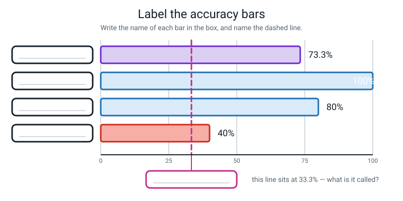
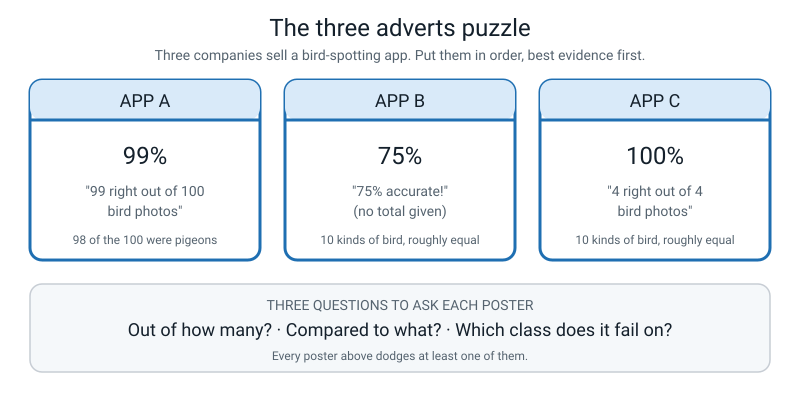
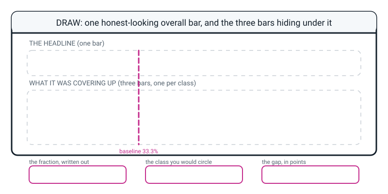

# Workbook — Week 20: Accuracy, Three Ways — and the Number That Lies

**Name:** ________________________________  **Date:** ______________

[📖 Read the chapter first](../student-guide/week-20.md) · [Course Home](../README.md)

> **⚠️ One rule covers this whole workbook: if a number appears with no division written above it, it does not count.** Messy working with a wrong answer beats a right answer that arrived by magic. **No calculator until the division is on the page.**

---

## ✅ Warm-Up (5 min)

Five quick questions about **last week**.

**W1.** What is a **test set**? (The word *before* has to be in your answer somewhere.)

________________________________________________________________

**W2.** You have 50 photos and want an 80/20 split. How many do you hide, how many do you train on, and what is the check line?

________________________________________________________________

**W3.** Why does the signature have to cross the **flap** of the envelope, rather than just being written in the corner?

________________________________________________________________

**W4.** Somebody trains on 24 photos of their blue bottle and tests on 6 more photos of **the same** blue bottle, a week later, in a different room. Is that a fair test? Say what it *does* measure.

________________________________________________________________

________________________________________________________________

**W5.** All four cheating splits from last week were wrong in the same direction. Which direction, and why is that not a coincidence?

________________________________________________________________

---

## ✍️ Practice Set A — Understand It

**A1. Fill in the blanks.**

Accuracy is the number of ____________________ guesses divided by the ____________________ number of guesses.

The one form of an accuracy that tells you **how many tries there were** is the ____________________.

Working out the accuracy separately for each class is called ____________________ accuracy.

When you subtract one percentage from another, the unit of the answer is ____________________ ____________________.

**A2. Multiple choice.** A model scores **95%**. Circle the one thing you must know before deciding whether that is impressive.

```
   (a)  who built it
   (b)  the baseline, and how many test examples there were
   (c)  how long it took to train
   (d)  whether it was 95.0% or 95.4%
```

Say why in one sentence: __________________________________________

________________________________________________________________

**A3. True or false — and explain.**

> *"73.3% means it gets about 73 out of every 100 right."*

Circle: **TRUE** / **FALSE**

Explain, using a number: __________________________________________

________________________________________________________________

**A4. Match the pairs.** Write the letter in the middle column.

| Form or term | | What it is |
|---|---|---|
| **1.** fraction | ____ | (a) what you'd score by ignoring everything and just guessing |
| **2.** percentage | ____ | (b) the score *and* how much evidence there was |
| **3.** baseline | ____ | (c) training accuracy minus test accuracy |
| **4.** the gap | ____ | (d) familiar and quotable, and hides the sample size |

**A5. Label the diagram.** Write the name of each bar in its box, and name the dashed line. The bars belong to the spoon / toothbrush / comb model you scored in class.


*Figure W20.1 — Four bars, percentages given, names missing. The dashed line needs a name too.*

**A6. Do the division.** 27 correct out of 36. Show every line.

```
   FRACTION:     ______ / ______

   DECIMAL:      36 x 0.7 = ____________     →  at least 0.7?  ______

                 27 - ____________ = ____________ left over

                 ____________ ÷ 36 = ____________

                 0.7 + ____________ = ____________

   PERCENTAGE:   ____________ x 100 = ______________%
```

---

## ✍️ Practice Set B — Use It

**B1.** A **dog / cat / rabbit** classifier is tested on 30 held-out photos, 10 of each. It gets **21** right.

```
   FRACTION:   ______ / ______

   DECIMAL:    30 x 0.7 = ______;   21 - ______ = ______;   ______ ÷ 30 = ______

               0.7 + ______ = ______________

   PERCENTAGE: ______________%

   BASELINE (3 roughly equal classes) = ______________%

   It beats the baseline by ______________ ______________ ______________.
                                (number)      (unit — two words!)
```

**B2. Here is a situation. What would go wrong, and why?**

> *A school builds a model to spot pupils who will need extra help in maths. It is tested on 200 pupils. **Ten** of them turned out to need help. The model says "does not need help" about all 200 pupils and reports **95% accuracy.***

Work out the accuracy: ______ ÷ ______ = ______ = ______%

Work out the two per-class accuracies:

```
   pupils who did NOT need help:   ______ / ______ = ______%

   pupils who DID need help:       ______ / ______ = ______%
```

What is the **baseline** for this test set? ______%

How many percentage points does the model beat the baseline by? ______

What goes wrong if the school actually uses this model?

________________________________________________________________

________________________________________________________________

**B3. Here is a situation. What would go wrong, and why?**

> *Two friends compare models on the same 15 held-out photos. Ali's scores 11/15. Bea's scores 12/15. Bea announces she has the better model.*

Convert both: Ali ______% · Bea ______%

How many photos is the difference? ______  How many percentage points? ______

What is wrong with Bea's announcement?

________________________________________________________________

________________________________________________________________

What would they need in order to settle it properly?

________________________________________________________________

**B4. Say it correctly.** Rewrite each sentence with the right unit. Do not change the number.

| What somebody said | What they should have said |
|---|---|
| "It went from 40% to 65%, so it's 25 percent better." | ______________________________________ |
| "The sale went from 20% off to 30% off — that's 10 percent more off." | ______________________________________ |
| "Guessing gets 25%, mine gets 60%, so mine is 35 percent better." | ______________________________________ |

**B5. Design a lopsided test set.** Build a **15-photo** test set on which a model that only ever says `spoon` would score **80%**.

```
   spoon photos: ______     toothbrush photos: ______     comb photos: ______

   check: ______ + ______ + ______ = 15   ✓

   the useless model's score: ______ ÷ 15 = ______ = ______%
```

Now the sting in the tail: what is the **baseline** for the test set you just designed? ______%

So what would a "80% accurate" report on this test set actually be telling you?

________________________________________________________________

---

## 🧩 Puzzle of the Week


*Figure W20.2 — Three adverts, three accuracy claims. Only one of them tells you enough to judge it.*

Three companies sell a bird-spotting app. **Nobody is lying.** Put them in order, **best evidence first**, and say what each poster is dodging.

| App | Claim | What it is dodging | Rank (1 = best evidence) |
|:--:|---|---|:--:|
| **A** | 99% — 99 right out of 100 bird photos, **98 of which were pigeons** | ________________________ | ______ |
| **B** | 75% — no total given, 10 kinds of bird roughly equal | ________________________ | ______ |
| **C** | 100% — 4 right out of 4, 10 kinds of bird roughly equal | ________________________ | ______ |

**Work out App A's baseline:** ______ ÷ ______ = ______% → so App A beats its own baseline by ______ percentage points.

**Work out the baseline for App B and App C** (10 roughly equal classes): ______%

**One sentence: which app would you actually buy, and what would you ask the company first?**

________________________________________________________________

________________________________________________________________

---

## 🤔 Think Deeper

**T1.** Write the **same result** twice: once as an advert that is technically true and makes the model sound as good as possible, and once as a lab-notebook entry that a hostile reader could not pick apart. Use the class result: 11/15, 73.3%, baseline 33.3%, per class 100% / 80% / 40%, training 100%.

**The advert:**

________________________________________________________________

________________________________________________________________

**The notebook entry:**

________________________________________________________________

________________________________________________________________

**Now compare your own two sentences.** What did the advert leave out, and was leaving it out *lying*?

________________________________________________________________

________________________________________________________________

**T2.** A film recommender that is 70% accurate is genuinely useful. A brake-light detector in a car that is 99.9% accurate is nowhere near good enough. **Same kind of number, opposite verdicts.** Explain why, and then say what question you have to answer *before* you can say whether any accuracy is "good enough".

________________________________________________________________

________________________________________________________________

________________________________________________________________

________________________________________________________________

---

## 🛠️ Build It

### Page 20.1 — Five accuracy problems

For each one: **fraction, then decimal to four places, then percentage to one place, with the division shown.** Then how many percentage points it beats a **33.3% baseline** by.

**(a) 9 correct out of 12**

```
   fraction:    ______ / ______

   decimal:     ________________________________________________

   percentage:  ______________%

   beats a 33.3% baseline by ______________ ______________ ______________
```

**(b) 17 correct out of 20**

```
   fraction:    ______ / ______

   decimal:     ________________________________________________

   percentage:  ______________%

   beats a 33.3% baseline by ______________ ______________ ______________
```

**(c) 23 correct out of 30**

```
   fraction:    ______ / ______

   decimal:     ________________________________________________

   percentage:  ______________%

   beats a 33.3% baseline by ______________ ______________ ______________
```

**(d) 4 correct out of 7**

```
   fraction:    ______ / ______

   decimal:     ________________________________________________

   percentage:  ______________%

   beats a 33.3% baseline by ______________ ______________ ______________
```

**(e) 45 correct out of 60**

```
   fraction:    ______ / ______

   decimal:     ________________________________________________

   percentage:  ______________%

   beats a 33.3% baseline by ______________ ______________ ______________
```

**Now look at (a) and (e) side by side.** Notice anything? Write it down.

________________________________________________________________

________________________________________________________________

### Page 20.2 — The number that lies

A **bike / scooter / skateboard** classifier was tested on **24 held-out photos**, 8 per class. It got **16** right. Broken down: bike **8** correct, scooter **6** correct, skateboard **2** correct.

**(a) Overall accuracy, three ways.**

```
   fraction:    ______ / ______

   decimal:     24 x 0.6 = ______;   16 - ______ = ______;   ______ ÷ 24 = ______

                0.6 + ______ = ______________

   percentage:  ______________%
```

**(b) Per-class accuracy.** Fill in the whole table.

| class | correct | total | fraction | decimal | percentage |
|---|:--:|:--:|---|---|---|
| bike | ______ | ______ | ______ | ______ | ______% |
| scooter | ______ | ______ | ______ | ______ | ______% |
| skateboard | ______ | ______ | ______ | ______ | ______% |
| **overall** | ______ | ______ | ______ | ______ | ______% |

**Both checks — write them out:**

```
   ______ + ______ + ______ = ______     ✓  (matches the correct count)

   ______ + ______ + ______ = ______     ✓  (matches the number of photos)
```

**(c) Which class was the average hiding?** ________________________

Say it as a full sentence, with the fraction in it:

________________________________________________________________

**(d) How does that class compare to blind guessing?**

```
   baseline (3 roughly equal classes) = ______%

   that class = ______%

   ______ - ______ = ______
```

So that class is ______ percentage points ____________ than guessing at random.
                                          (better / worse)

And the model **overall** beats the baseline by ______ percentage points — which is why the headline looks respectable while a third of the job is broken.

**(e) What would you investigate first?** One sentence. **"More photos" is not enough** — say *which* photos, *of what*, and *why*.

________________________________________________________________

________________________________________________________________

### Page 20.3 — The percentage-point drill

Write the subtraction, then say the whole answer out loud with the unit attached.

| # | The question | The subtraction | Say out loud |
|:--:|---|---|---|
| 1 | Blind guessing 33.3%, my model 73.3% | ______ − ______ = ______ | ________________ |
| 2 | Toothbrush 80%, comb 40% | ______ − ______ = ______ | ________________ |
| 3 | Training 100%, test 73.3% | ______ − ______ = ______ | ________________ |
| 4 | Last term 50%, this term 75% | ______ − ______ = ______ | ________________ |
| 5 | Model A 12%, model B 9% | ______ − ______ = ______ | ________________ |

**Two sentences to write out properly:**

**1.** What is a **percentage point**?

________________________________________________________________

________________________________________________________________

**2.** Why do we write the **fraction** first?

________________________________________________________________

________________________________________________________________

---

## 🎨 Draw It

Draw the number that lies. One honest-looking **overall** bar on top, and underneath it the **three per-class bars** that were hiding under it. Circle the worst one in red. Draw the baseline as a dotted line straight through all four.


*Figure W20.3 — One overall bar on top, three per-class bars underneath. That is how a number stops lying.*

> **What a good answer looks like:** the top bar reaching to about 73% with `11/15 = 73.3%` written on it — **the fraction, not just the percentage.** Three bars underneath at 100%, 80% and 40%, each labelled with its class name *and* its fraction (`5/5`, `4/5`, `2/5`). The 40% bar circled in red. A dotted vertical line at 33.3% labelled **baseline**, crossing all four bars — so the 40% bar visibly only just clears it. And written in the corner: `gap = 100 − 73.3 = 26.7 percentage points`.
>
> **The thing most people leave out:** the baseline line. Without it, the 40% bar looks merely small. With it, the 40% bar looks *alarming*, which is the truth.

---

## 📊 Self-Check

| I can... | 😀 easily | 🙂 with a bit of thought | 😕 not yet |
|---|:--:|:--:|:--:|
| Compute accuracy as a fraction, a decimal and a percentage, showing the division | ☐ | ☐ | ☐ |
| Explain why the fraction carries information the percentage hides | ☐ | ☐ | ☐ |
| Work out per-class accuracy and find the class the average was concealing | ☐ | ☐ | ☐ |
| Say "percentage points" correctly when subtracting two percentages, without being reminded | ☐ | ☐ | ☐ |
| Work out a baseline and write it next to every accuracy | ☐ | ☐ | ☐ |
| Explain why 100% on training photos is unremarkable | ☐ | ☐ | ☐ |

---

## ✅ Answers

<details>
<summary>Check your answers</summary>

### Warm-Up

**W1.** A **test set** is examples you hide **before** training, and look at once, right at the end, to find out how good the model really is. If your answer doesn't have "before" in it, it isn't finished — a set of photos put aside *after* training is not a test set, it's just a subfolder.

**W2.**
```
   test  = 0.20 x 50 = 10
   train = 50 - 10   = 40
   check: 40 + 10 = 50     ✓
```

**W3.** Because a signature across the flap **makes reopening an event.** If it were only in the corner, the flap could be lifted and pressed back down and nobody would ever know — including the owner, ten minutes later. A drawer lets you have a quick look; a signature across the flap does not.

**W4.** **No, it is not a fair test** — this is cheat 4. What it **does** measure is *"can it recognise **this particular** blue bottle?"*, which is a real question but a much smaller one than "can it recognise bottles". A bottle the model has never met appears nowhere in the whole experiment. The fix is not better photos; it is **a different bottle.**

**W5.** All four came out **too high.** That is not a coincidence, because every one of them let the model see — or effectively see — something it should not have, and **extra information almost always inflates a score.** Cheating on a test very rarely lowers your mark. Which is why a surprisingly *high* score is always worth investigating.

### Practice Set A

**A1.** **correct** · **total** · **fraction** · **percentage points**

**A2.** **(b) the baseline, and how many test examples there were.**

*Why:* 95% on a test set that is 95% spoons is exactly the baseline — "always say spoon" scores the same, so the model achieved nothing. And 95% out of 20 photos is one wrong answer away from 90%. Without those two facts, "95%" is a number with no meaning attached.

**A3.** **FALSE** — or at best "nearly, and misleadingly".

It got **11 out of 15** right. 73.3% is what that *would* be if it kept the same rate up over a hundred tries, which it might not. And here is the number that matters: **one photo is worth `1 ÷ 15 = 6.7 percentage points`.** If one comb had gone the other way, the headline would read 80%. So a one-photo difference (6.7 points) between two models measured on fifteen photos is well within noise: it tells you almost nothing.

**A4.** **1 → (b)** · **2 → (d)** · **3 → (a)** · **4 → (c)**

**A5.** From top to bottom, the bars are:

```
   73.3%  →  OVERALL (all three classes together)
   100%   →  spoon
   80%    →  toothbrush
   40%    →  comb
```

The dashed line at 33.3% is the **baseline** — what you'd score by blind guessing between three roughly equal classes.

**The thing to notice, and it is the whole week:** **no class scored 73.3%.** The overall bar describes nobody in this model. And the comb bar, at 40%, only just clears the baseline — which you can only see *because* the baseline line is drawn.

**A6.**
```
   FRACTION:     27 / 36

   DECIMAL:      36 x 0.7 = 25.2          →  at least 0.7?  yes
                 27 - 25.2 = 1.8 left over
                 1.8 ÷ 36 = 0.05
                 0.7 + 0.05 = 0.7500

   PERCENTAGE:   0.75 x 100 = 75.0%
```
**Bonus if you spotted it:** 27/36 simplifies to 3/4, so you could have said 75% instantly. That is a good instinct — but do the division anyway, because the *next* problem won't simplify.

### Practice Set B

**B1.**
```
   FRACTION:   21 / 30

   DECIMAL:    30 x 0.7 = 21;   21 - 21 = 0;   0 ÷ 30 = 0
               0.7 + 0 = 0.7000

   PERCENTAGE: 70.0%

   BASELINE (3 roughly equal classes) = 33.3%

   It beats the baseline by 36.7 percentage points.
```
This one comes out exactly on 0.7, which is a small gift — `30 × 0.7 = 21` with nothing left over. **Say "percentage points", both words.** "36.7 percent better" would mean something different and smaller.

**B2.**
```
   accuracy = 190 ÷ 200 = 0.95 = 95%

   pupils who did NOT need help:  190 / 190 = 100%
   pupils who DID need help:        0 / 10  =   0%

   baseline = "always say no help" = 190 ÷ 200 = 95%

   beats the baseline by  95 - 95 = 0 percentage points
```

**What goes wrong:** the model has **never once identified a pupil who needs help.** It cannot — it doesn't look. It scores exactly the baseline, so it has learned nothing at all.

And the consequence is the real answer: **the school would believe it had a working system, stop looking for those ten pupils, and those ten pupils would get no help.** The 95% would actively make things worse than having no model, because it replaces "we don't know" with a false "we've checked".

This is the spam filter, in a school, with real children in it.

**B3.**
```
   Ali:  11/15 = 73.3%      Bea:  12/15 = 80.0%
```
The difference is **one photo**, which is **6.7 percentage points.**

**What's wrong with Bea's announcement:** she has won by exactly one photo out of fifteen. If a single one of Ali's near-misses had gone the other way, they would be level; if one of hers had, she would be behind. **A one-photo lead on a fifteen-photo test is not evidence of a better model** — it is well inside the wobble.

**What they'd need to settle it:** a much bigger test set. On 15 photos one photo is 6.7 points; on 100 photos it is 1 point; on 1,000 it is 0.1. They should also compare **per-class** scores, because Ali might be steady across all three classes while Bea is perfect at two and terrible at one.

**B4.**

| What somebody said | What they should have said |
|---|---|
| "40% to 65%, so 25 percent better." | "That's **25 percentage points** better." |
| "20% off to 30% off — 10 percent more off." | "That's **10 percentage points** more off." *(It is also 50% more discount — a different, also-true sentence.)* |
| "Guessing 25%, mine 60%, so 35 percent better." | "Mine is **35 percentage points** better than guessing." |

**B5.**
```
   spoon 12,  toothbrush 2,  comb 1

   check: 12 + 2 + 1 = 15     ✓

   the useless model's score: 12 ÷ 15 = 0.8 = 80%
```
Any split with 12 spoons works; 12/2/1 and 12/3/0 both give 80%. *(12/3/0 is worse practice, though — a class with zero test photos cannot be measured at all.)*

**The baseline for this test set is also 80%**, because "always say spoon" *is* the best you can do without looking, and that is exactly what the useless model does.

**So an "80% accurate" report on this test set is telling you nothing whatsoever.** The model may as well be a sticky note reading "spoon". This is the whole reason the baseline has to travel next to the accuracy — the accuracy alone cannot distinguish a good model from a sticky note.

### Puzzle of the Week

**Ranking, best evidence first: B, then A, then C.** *(A reasonable case can also be made for A above B — see below. C is last on any reading.)*

| App | What it dodges | Rank |
|:--:|---|:--:|
| **B** | **"Out of how many?"** — no total at all. But its *test set* is the honest one: 10 roughly equal kinds, so its baseline is only 10%, and 75% is a genuine 65 percentage points above it. | **1** |
| **A** | **"Compared to what?"** and **"which class does it fail on?"** — its test set was 98% pigeons. | **2** |
| **C** | **"Out of how many?"** — and the answer is *four*. One photo is worth 25 percentage points. | **3** |

**App A's baseline:**
```
   "always say pigeon" = 98 ÷ 100 = 98%

   A scored 99%, so it beats its own baseline by  99 - 98 = 1 percentage point.
```
**One point.** App A's magnificent 99% is one percentage point better than a sticky note reading "pigeon". Its 100 photos are a real sample size — that part is genuinely good — but it measured almost nothing, because there was almost nothing there to measure. It has essentially never been tested on any bird except a pigeon.

**Baseline for B and C** (10 roughly equal classes): `1 ÷ 10 = 10%`.

- **B beats its baseline by 65 percentage points**, on an unknown number of photos.
- **C beats its baseline by 90 percentage points**, on **four photos.** Four. One photo is 25 points. 4/4 is encouraging and it is not evidence.

**Which would you buy, and what would you ask first?**

> "**B**, because it is the only one tested on a spread of birds — but I'd ask them *out of how many photos?* before paying. If the answer is 'twelve', it drops behind A instantly."

**The lesson of the puzzle:** each poster fails a *different* one of the three questions, and each one gets away with it because the number in big type is impressive. **Big number, small evidence** (C), **big number, meaningless test** (A), **big number, unknown total** (B).

### Think Deeper

**T1.** No single right answer, but a full-credit pair looks something like this.

> **The advert:** *"Our AI identifies household objects with 73% accuracy — more than double the accuracy of random guessing!"*
>
> **The notebook entry:** *"On 15 held-out photos taken on a different day in a different room, the model scored 11/15 = 73.3%, against a 33.3% baseline for three roughly equal classes. Per-class: spoon 5/5 = 100%, toothbrush 4/5 = 80%, comb 2/5 = 40%. Training accuracy 60/60 = 100%, so the gap is 26.7 percentage points. Note that one test photo is worth 6.7 percentage points."*

**What the advert left out:** the sample size (fifteen), the broken class (comb, at 40%, barely above the baseline), the gap (26.7 points, a sign of memorising), and the fact that one photo moves the headline by 6.7 points.

**Was leaving it out lying?** **No — and that is the uncomfortable and important answer.** Every word of the advert is true. "More than double" is even arithmetically generous to itself in a defensible way (73.3 ÷ 33.3 = 2.2). Nothing there could be called a lie. It is **selecting** which true things to say — which is how almost every real advert about AI works, and why you have spent a week learning to ask for the other three numbers.

**T2.** They are different because **what a mistake costs is different.**

- A bad film recommendation costs you about two minutes and mild annoyance. 70% is plenty — the other 30% you just scroll past.
- A missed brake light can cost somebody their life. 99.9% means one failure in a thousand, and a car sees thousands of brake lights a week.

**The question you must answer first: what does a mistake cost, and who pays it?** That is a question about **the world**, not about the data — which is why no threshold can be handed to you. "Is 90% good enough?" has no answer until somebody says what happens when the 10% goes wrong.

**A stronger answer also splits the mistakes by type:** for brake lights, *missing* a brake light and *imagining* one are both bad but not equally bad, and you'd want the per-class numbers, not the overall one.

### Build It — Page 20.1

**(a) 9 out of 12**
```
   fraction:   9/12   (= 3/4)
   decimal:    12 x 0.75 = 9 exactly  →  0.7500
   percentage: 75.0%
   beats a 33.3% baseline by 41.7 percentage points
```

**(b) 17 out of 20**
```
   fraction:   17/20
   decimal:    20 x 0.8 = 16;   17 - 16 = 1;   1 ÷ 20 = 0.05
               0.8 + 0.05 = 0.8500
   percentage: 85.0%
   beats a 33.3% baseline by 51.7 percentage points
```

**(c) 23 out of 30**
```
   fraction:   23/30
   decimal:    30 x 0.7 = 21;   23 - 21 = 2;   2 ÷ 30 = 0.0667
               0.7 + 0.0667 = 0.7667
   percentage: 76.7%
   beats a 33.3% baseline by 43.4 percentage points
```

**(d) 4 out of 7**
```
   fraction:   4/7
   decimal:    7 x 0.5 = 3.5;   4 - 3.5 = 0.5;   0.5 ÷ 7 = 0.0714
               0.5 + 0.0714 = 0.5714
   percentage: 57.1%
   beats a 33.3% baseline by 23.8 percentage points
```
This is the one that cannot be spotted by simplifying, which is exactly why it is here. If you got this one with the working shown, the method is yours.

**(e) 45 out of 60**
```
   fraction:   45/60   (= 3/4)
   decimal:    0.7500
   percentage: 75.0%
   beats a 33.3% baseline by 41.7 percentage points
```

**(a) and (e) side by side — and this is the best answer on the page if you spotted it:**

They are the **same percentage from wildly different amounts of evidence.** 12 photos versus 60.

```
   on 12 photos:  one photo is worth  1 ÷ 12 = 8.3 percentage points
   on 60 photos:  one photo is worth  1 ÷ 60 = 1.7 percentage points
```

Same headline. One of them is far more trustworthy than the other. **And once you convert them both to "75%", that difference is invisible.** That is why you write the fraction.

### Build It — Page 20.2

**(a) Overall accuracy.**
```
   fraction:   16/24   (= 2/3)
   decimal:    24 x 0.6 = 14.4;   16 - 14.4 = 1.6;   1.6 ÷ 24 = 0.0667
               0.6 + 0.0667 = 0.6667
   percentage: 66.7%
```

**(b) Per class.**

| class | correct | total | fraction | decimal | percentage |
|---|:--:|:--:|---|---|---|
| bike | 8 | 8 | 8/8 | 1.000 | **100.0%** |
| scooter | 6 | 8 | 6/8 | 0.750 | **75.0%** |
| skateboard | 2 | 8 | 2/8 | 0.250 | **25.0%** |
| **overall** | **16** | **24** | **16/24** | **0.667** | **66.7%** |

**Checks:** `8 + 6 + 2 = 16` ✓ and `8 + 8 + 8 = 24` ✓

**(c) The average was hiding skateboard.**

> **"Skateboard scored 2 out of 8, which is 25%."**

The overall 66.7% describes **no class in this model**: one is perfect, one is decent, and one is a real problem.

**(d) Compared to blind guessing.**
```
   baseline (3 roughly equal classes) = 1 in 3 = 33.3%
   skateboard = 25.0%
   25.0 - 33.3 = -8.3
```

> **On skateboards this model is 8.3 percentage points BELOW the guessing baseline — no better than guessing, and with only 8 photos we cannot tell the difference.**

That is the sentence to look for. One photo here is worth 12.5 points, so 2/8 against the 2.7 out of 8 that guessing would give is well within chance. A three-sided coin could easily have scored the same on skateboards.

**Overall** the model beats the baseline by `66.7 − 33.3 = 33.3 percentage points` (66.67 − 33.33 exactly), which is exactly why the headline looks respectable while a third of the job is **no better than guessing.**

**(e) What to investigate first.** Full credit needs something **specific and checkable.** Any of these:

> "I'd count the skateboard training photos first, because 25% smells like there were far fewer of them than the other two classes."

> "I'd look at whether all the skateboard photos were taken in the same place — if they were all on the same driveway, the model may have learned the driveway rather than the skateboard."

> "I'd check whether the skateboards were being confused with bikes specifically, because both have wheels — and if so I'd shoot ten photos of each at the same distance so that wheels aren't the only difference available."

**Not enough:** "get more data", "train it longer", "it needs to be better". Ask yourself the follow-up question: ***look at what, exactly?***

### Build It — Page 20.3

| # | Subtraction | Answer |
|:--:|---|---|
| 1 | 73.3% − 33.3% | **40 percentage points** |
| 2 | 80% − 40% | **40 percentage points** |
| 3 | 100% − 73.3% | **26.7 percentage points** |
| 4 | 75% − 50% | **25 percentage points** — and *also* "half as much again", i.e. 50% more. Two true sentences about the same pair. |
| 5 | 12% − 9% | **3 percentage points** — and *also* "a third more", since 3 ÷ 9 = 0.333. |

**Marking note on 4 and 5:** writing **only** the percentage-point answer gets full marks. The second sentence is a bonus. But writing **only** the "50% more" version is the exact misconception this drill exists to catch — go back and read **Figure 20.4 in the Week 20 chapter** (percent versus percentage point) again.

**Sentence 1 — what is a percentage point?**

> It is the unit you get when you subtract one percentage from another. A percentage is a share **of** something; a percentage point is the gap **between** two percentages. Going from 33.3% to 73.3% is 40 percentage **points**, not 40 percent — because 40 percent *of* 33.3 would only take you to 46.6%.

**Sentence 2 — why write the fraction first?**

> Because the fraction is the only one of the three forms that says **how many tries there were.** 75% could be 3 out of 4 or 300 out of 400, and those are very different amounts of evidence — but they look identical once you turn them into a percentage.

### Draw It

A good drawing has **five** things in it:

1. A top bar at about 73% labelled with **the fraction as well as the percentage**: `11/15 = 73.3%`.
2. Three bars underneath at 100%, 80% and 40%, each labelled with **its class name and its fraction** (`spoon 5/5`, `toothbrush 4/5`, `comb 2/5`).
3. The **40% bar circled in red.**
4. A **dotted baseline line at 33.3%** crossing all four bars, labelled `baseline`.
5. The gap written somewhere: `100 − 73.3 = 26.7 percentage points`.

**The thing most people leave out is number 4.** Without the baseline line, the 40% bar just looks short. With it, you can *see* that the comb class only barely clears random guessing — and that is the difference between a drawing that shows a number and a drawing that shows a problem.

**A nice extra:** write `one photo = 6.7 points` next to the top bar. It stops anyone reading the four bars as if they were precise.

</details>

---

[⬅ Week 19 workbook](week-19.md) · [📖 Week 20 chapter](../student-guide/week-20.md) · [Course Home](../README.md) · [Week 21 workbook ➡](week-21.md) · [Glossary](../../glossary.md)
