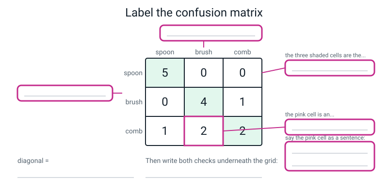
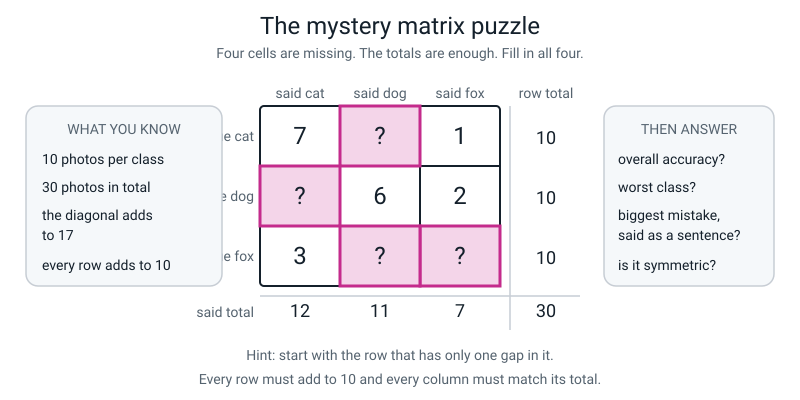
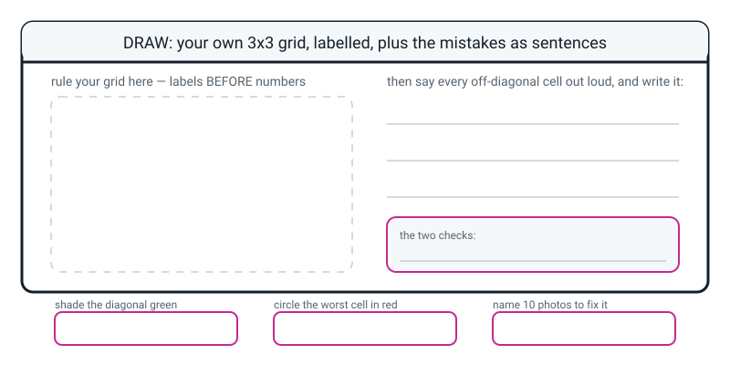

# Workbook — Week 21: Memorizing vs Generalizing

**Name:** ________________________________  **Date:** ______________

[📖 Read the chapter first](../student-guide/week-21.md) · [Course Home](../README.md)

> **⚠️ Three rules for this workbook.** Ruler out. **Labels before numbers** — truth down the side, said across the top. And **both checks written down as lines on the page**, not done in your head.

---

## ✅ Warm-Up (5 min)

Five quick questions about **last week**.

**W1.** Write the accuracy formula in words.

________________________________________________________________

**W2.** A model gets **18 out of 24**. Give the fraction, the decimal and the percentage, with the division shown.

________________________________________________________________

________________________________________________________________

**W3.** Why do we write the **fraction** first instead of just the percentage?

________________________________________________________________

**W4.** Guessing gets 25%. My model gets 60%. Say the difference in a full sentence, **with the right unit.**

________________________________________________________________

**W5.** A model scores **70% overall**. Its three classes score 100%, 90% and 20%. What should you be worried about, and how does that class compare to blind guessing?

________________________________________________________________

________________________________________________________________

---

## ✍️ Practice Set A — Understand It

These questions check that you know the new words. Write in the spaces.

**A1. Fill in the blanks.**

A model that works on examples it has never seen is ____________________.

A model that works only on the exact examples it studied is ____________________.

When a model learns its training examples so closely that it stops working on anything new, that is called ____________________.

In a confusion matrix, the cells where truth equals prediction are called the ____________________.

**A2. Multiple choice.** Which of these models would you rather have? Circle one.

```text
   (a)  training 100%,  test 40%
   (b)  training 100%,  test 96%
   (c)  training  55%,  test 52%
   (d)  training  82%,  test 74%
```

Work out all four gaps first:

```text
   (a) ______ pts     (b) ______ pts     (c) ______ pts     (d) ______ pts
```

Now: **which two have nearly the same gap, and why are they nowhere near equally good?**

________________________________________________________________

________________________________________________________________

**A3. True or false — and explain.**

> *"A small gap between training accuracy and test accuracy always means a good model."*

Circle: **TRUE** / **FALSE**

Explain, and name the row from the table that proves it:

________________________________________________________________

________________________________________________________________

**A4. Match the pairs.** Write the letter in the middle column.

| Term | | What it is |
|---|---|---|
| **1.** diagonal | ____ | (a) a grid: rows are the truth, columns are what the model said |
| **2.** off-diagonal cell | ____ | (b) training accuracy minus test accuracy |
| **3.** confusion matrix | ____ | (c) the correct answers, top-left to bottom-right |
| **4.** the gap | ____ | (d) a specific, nameable mistake with a number and a direction |

**A5. Label the diagram.** Fill in the four empty boxes, then write both checks underneath the grid.


*Figure W21.1 — The numbers are filled in; the labels are not. Truth down the side, said across the top.*

**A6. Explain overfitting.** In your own words, **without using the words "fit", "fitting" or "overfit".**

________________________________________________________________

________________________________________________________________

Now give one example from your own life — not about AI.

________________________________________________________________

---

## ✍️ Practice Set B — Use It

These questions use confusion matrices. Write in the spaces.

**B1.** A **cup / bowl / plate** model. Fill in the missing cells and the totals. Each class had 6 test photos.

| | said cup | said bowl | said plate | row total |
|---|:--:|:--:|:--:|:--:|
| **true cup** | 5 | 1 | 0 | ______ |
| **true bowl** | 0 | 4 | ______ | 6 |
| **true plate** | 1 | ______ | 3 | 6 |
| **total said** | ______ | ______ | ______ | ______ |

```text
   diagonal = ______ + ______ + ______ = ______

   all nine cells add to ______           ✓ same as the number of photos?  ______

   overall accuracy = ______ / ______ = ______ = ______%
```

Now say the **biggest** off-diagonal cell as a sentence:

________________________________________________________________

**B2. Here is a situation. What would go wrong, and why?**

> *A student builds their confusion matrix with **what the model said down the side** and **the truth across the top**. They run the diagonal check. It passes. They run the all-cells check. It passes. They conclude the grid is correct.*

Why do both checks pass on a wrong grid?

________________________________________________________________

________________________________________________________________

So how *would* you catch the mistake?

________________________________________________________________

How would you stop it happening in the first place?

________________________________________________________________

**B3. Here is a situation. What would go wrong, and why?**

> *A model scores 100% on its training photos. The student writes in her report: "My model is 100% accurate." She does not mention any other number.*

What is technically true about her sentence? ______________________

What is wrong with it? __________________________________________

________________________________________________________________

Which student from the hook is she at risk of being, and why can nobody tell yet?

________________________________________________________________

**B4. Read the columns.** A **bat / ball / stumps** model, 5 test photos per class.

| | said bat | said ball | said stumps | row total |
|---|:--:|:--:|:--:|:--:|
| **true bat** | 4 | 0 | 1 | 5 |
| **true ball** | 3 | 2 | 0 | 5 |
| **true stumps** | 1 | 0 | 4 | 5 |
| **total said** | 8 | 2 | 5 | 15 |

The model said `bat` ______ times, though only ______ bats existed → it is ____________________ about bat.

The model said `ball` ______ times, though ______ balls existed → it is ____________________ about ball.

What might being *reluctant* about a class be a hint about, in that class's training photos?

________________________________________________________________

**B5. Is the confusion symmetric?** Using the same bat / ball / stumps grid:

```text
   true ball → said bat:  ______        true bat → said ball:  ______

   true bat → said stumps: ______       true stumps → said bat: ______
```

Which pair is lopsided? ____________________

If two objects simply *looked alike*, roughly what would you expect the two directions to be?

________________________________________________________________

So what might lopsided confusion be a hint about instead?

________________________________________________________________

---

## 🧩 Puzzle of the Week

This puzzle has a confusion matrix with missing cells.


*Figure W21.2 — Four cells missing, but every total is given — so every missing cell can be worked out.*

A **cat / dog / fox** model, tested on 30 photos, 10 per class. **Four cells are missing.** You know: every row adds to 10, the column totals are given, and the diagonal adds to 17.

Fill in the grid:

| | said cat | said dog | said fox | row total |
|---|:--:|:--:|:--:|:--:|
| **true cat** | 7 | ______ | 1 | 10 |
| **true dog** | ______ | 6 | 2 | 10 |
| **true fox** | 3 | ______ | ______ | 10 |
| **total said** | 12 | 11 | 7 | 30 |

**Write down which cell you filled in first, and how you knew:**

________________________________________________________________

**Now answer the four questions:**

**(a) Overall accuracy, three ways, with the division shown.**

```text
   ________________________________________________________________

   ________________________________________________________________
```

**(b) Per-class accuracy, and the worst class.**

```text
   cat  ______ / 10 = ______%      dog ______ / 10 = ______%      fox ______ / 10 = ______%

   worst class: ____________________
```

**(c) The biggest off-diagonal cell, said as a sentence.** *(Careful — look closely before you answer.)*

________________________________________________________________

**(d) Is the confusion symmetric? Which way does the traffic run?**

________________________________________________________________

________________________________________________________________

---

## 🤔 Think Deeper

Two bigger questions. Take your time and write full answers.

**T1.** Both checks can pass on a grid that is completely wrong. So **what are the checks actually for**, and what does that tell you about checks in general — in maths, in science, anywhere?

________________________________________________________________

________________________________________________________________

________________________________________________________________

________________________________________________________________

**T2.** You could work out the **diagonal** of the class grid without ever seeing the sheet, just from the per-class percentages (100%, 80%, 40% of 5 photos each → 5, 4, 2). But you could **not** work out where the four mistakes went. Explain why one part is deducible and the other is not — and what that tells you about what per-class accuracy can and cannot do.

________________________________________________________________

________________________________________________________________

________________________________________________________________

________________________________________________________________

---

## 🛠️ Build It

Three pages. You score a sheet, build a matrix, then write what you found.

### Page 21.1 — Score somebody else's sheet

A **pen / pencil / marker** classifier, tested on 15 held-out photos, 5 per class. Fill in the `correct?` column yourself: Y if the prediction matches the truth, N if it doesn't. **All fifteen rows first, then count.**

| # | true | predicted | top conf. | correct? |
|:--:|---|---|:--:|:--:|
| 1 | pen | pen | 91% | ______ |
| 2 | pen | pen | 84% | ______ |
| 3 | pen | marker | 57% | ______ |
| 4 | pen | pen | 88% | ______ |
| 5 | pen | pen | 72% | ______ |
| 6 | pencil | pencil | 93% | ______ |
| 7 | pencil | pencil | 81% | ______ |
| 8 | pencil | pencil | 77% | ______ |
| 9 | pencil | pen | 61% | ______ |
| 10 | pencil | pencil | 86% | ______ |
| 11 | marker | marker | 89% | ______ |
| 12 | marker | marker | 74% | ______ |
| 13 | marker | pen | 55% | ______ |
| 14 | marker | marker | 68% | ______ |
| 15 | marker | pen | 52% | ______ |

**Overall accuracy, three ways:**

```text
   FRACTION:    ______ / ______

   DECIMAL:     15 x 0.7 = ______;   ______ - ______ = ______;   ______ ÷ 15 = ______

                0.7 + ______ = ______________

   PERCENTAGE:  ______________%

   BASELINE (3 roughly equal classes) = ______%

   beats the baseline by ______ ______________ ______________
```

**Per-class accuracy:**

| class | correct | total | fraction | decimal | percentage |
|---|:--:|:--:|---|---|---|
| pen | ______ | ______ | ______ | ______ | ______% |
| pencil | ______ | ______ | ______ | ______ | ______% |
| marker | ______ | ______ | ______ | ______ | ______% |
| **overall** | ______ | ______ | ______ | ______ | ______% |

**Both checks:**

```text
   ______ + ______ + ______ = ______     ✓

   ______ + ______ + ______ = ______     ✓
```

> **💡 One thing to compare.** Look at your overall percentage, then look back at the model you scored in class. **Notice anything?** Write it here: ____________________________________________
>
> ________________________________________________________________

### Page 21.2 — The confusion matrix

**Ruler out. Labels first.** Fill in every cell, both sets of totals, and both checks.

| | **said pen** | **said pencil** | **said marker** | row total |
|---|:--:|:--:|:--:|:--:|
| **true pen** | ______ | ______ | ______ | ______ |
| **true pencil** | ______ | ______ | ______ | ______ |
| **true marker** | ______ | ______ | ______ | ______ |
| **total said** | ______ | ______ | ______ | ______ |

**Shade the diagonal green. Then:**

```text
   diagonal:  ______ + ______ + ______ = ______

   correct count from page 21.1:  ______            ✓ do they match?  ______

   all nine cells:  ______ + ______ + ______ + ______ + ______
                  + ______ + ______ + ______ + ______  = ______      ✓

   column totals:  ______ + ______ + ______ = ______                 ✓
```

**Circle the biggest off-diagonal cell in red.**

**Now read down the columns:**

```text
   said pen:     ______ times, though ______ pens existed      →  ____________________

   said pencil:  ______ times, though ______ pencils existed   →  ____________________

   said marker:  ______ times, though ______ markers existed   →  ____________________
```

### Page 21.3 — Say it out loud, then say what you'd do

**Three sentences naming what got confused with what.** Shape: *"two markers were called pen."* Each sentence needs a **number**, a **true class** and a **predicted class**.

**1.** ______________________________________________________________

**2.** ______________________________________________________________

**3.** ______________________________________________________________

**Is anything ever wrongly called a pencil?** ______  Write that as a sentence too:

________________________________________________________________

**One sentence: what would you go and look at first?** Not "more photos" — *which* photos, *of what*, and *why*.

________________________________________________________________

________________________________________________________________

**Now the prediction about YOUR OWN model.** Next week the envelope opens.

```text
   I predict the worst cell of my grid will be:

        true ____________________  called  ____________________

   because ______________________________________________________

   ______________________________________________________________

   Date: ______________        Initials: ______________
```

> **⚠️ You cannot change this after today.** Next week starts by reading it out loud — **before** anything gets unsealed. Being wrong on the record is worth more than being vaguely right afterwards.

---

## 🎨 Draw It

This page is for drawing your own confusion matrix.

Draw your **own** confusion matrix — for your three objects, using your prediction from page 21.3 as the numbers. Label it properly, shade the diagonal, circle the worst cell, and write the mistakes as sentences.


*Figure W21.3 — Your own confusion matrix on the left, three sentences read off it on the right.*

> **What a good answer looks like:** a ruled 3×3 grid with **`TRUTH` written down the left edge** and **`SAID` across the top** before any numbers. Your three class names on both axes. Numbers in all nine cells that **add to 15** and whose **diagonal matches** the correct count you predicted. The diagonal shaded green with its sum written outside the grid. The biggest off-diagonal cell circled in red. Two or three sentences beside it in the shape *"two ___s were called ___."* And both check lines written out.
>
> **The one thing that must be right:** the labels, and they must be written *first*. If `TRUTH` ends up across the top, every sentence you read off the grid will describe something that never happened — and neither check will tell you.

---

## 📊 Self-Check

Tick one box on each row to show how sure you are.

| I can... | 😀 easily | 🙂 with a bit of thought | 😕 not yet |
|---|:--:|:--:|:--:|
| Tell memorizing from generalizing using the gap between training and test accuracy | ☐ | ☐ | ☐ |
| Say why a small gap is not automatically good news | ☐ | ☐ | ☐ |
| Define overfitting in plain words, without using the word "fit" | ☐ | ☐ | ☐ |
| Build a labelled 3×3 confusion matrix from a scoring sheet, unaided | ☐ | ☐ | ☐ |
| Run both checks, and say what has gone wrong when each one fails | ☐ | ☐ | ☐ |
| Read an off-diagonal cell as a sentence with a number and a direction in it | ☐ | ☐ | ☐ |
| Turn the biggest off-diagonal cell into a list of photos I'd actually go and take | ☐ | ☐ | ☐ |

---

## ✅ Answers

Check your work here after you finish. Open the box below.

<details>
<summary>Check your answers</summary>

### Warm-Up

**W1.** Accuracy is the number of **correct** guesses divided by the **total** number of guesses.

**W2.** Worked out:

```text
   fraction:   18/24   (= 3/4)
   decimal:    24 x 0.75 = 18 exactly  →  0.7500
   percentage: 75.0%
```

**W3.** Because the fraction is the **only** one of the three forms that says **how many tries there were.** 75% could be 3 out of 4 or 300 out of 400, and those are completely different amounts of evidence — but once you convert them, they look identical.

**W4.** *"My model is **35 percentage points** better than guessing."* Both words. "35 percent better" would mean something different and much smaller.

**W5.** The **20% class** — and the sharp part of the answer: with three roughly equal classes the baseline is 33.3%, so **on that class the model is 13.3 percentage points *worse* than guessing at random.** First action: look at that class's training photos, count them, and check whether they were all taken in the same place.

### Practice Set A

**A1.** **generalizing** · **memorizing** · **overfitting** · **diagonal**

**A2.** **(b) training 100%, test 96%.**

```text
   (a) 100 - 40 = 60 pts       (b) 100 - 96 =  4 pts
   (c)  55 - 52 =  3 pts       (d)  82 - 74 =  8 pts
```

**(b) and (c) have almost the same gap** — 4 points and 3 points — **and they are nowhere near equally good.** (b) gets 96% on photos it has never seen. (c) gets 52%, which against a 33.3% baseline is barely 19 points above blind guessing. (c) has a tiny gap because there was hardly anything to memorise: **it never learned much in the first place.**

**So you read the gap AND the level, together.** The gap tells you about memorising. The level tells you whether anything was learned at all.

*(If you circled (d), that is a defensible answer worth saying out loud: an 82/74 model is honest, ordinary and probably built on realistic data. But 100/96 is better on both counts.)*

**A3.** **FALSE.**

The row that proves it is **55% training / 52% test.** A 3-point gap and a completely useless model. A small gap only means *"not much memorising happened"* — which is also true of a model that learned nothing at all. **Gap and level are two separate questions and you always ask both.**

**A4.** **1 → (c)** · **2 → (d)** · **3 → (a)** · **4 → (b)**

**A5.** The four labels:

- Across the top: **what the model said** (or *predicted class* / *SAID*)
- Down the side: **the truth** (or *true class* / *TRUTH*)
- The three shaded corner-to-corner cells: **the diagonal** — all the correct answers
- The pink cell: **an off-diagonal cell** — a specific mistake

The pink cell as a sentence: **"Two combs were called toothbrush."**

The two checks:

```text
   diagonal =  5 + 4 + 2  =  11        ✓ matches the correct count
   all cells = 5+0+0 + 0+4+1 + 1+2+2 = 15    ✓ matches the number of photos
```

**A6.** **Overfitting** in plain words: **it learned the photos, not the object.**

Other correct versions people write: *"it memorised the pictures instead of the thing in them"*, *"it learned my table"*, *"it learned the background instead of the object"*. All fine.

**Not good enough:** *"it's when it does badly on new stuff."* That is the **symptom**, not the mechanism. Ask yourself: *why* does it do badly?

**An example from your own life** — any of these works: *"I memorised the spellings for the test and couldn't use any of those words a week later"*; *"I knew the route to my friend's house by the shops, and got lost when one closed down"*; *"I learned the boss's attack pattern in a game and died instantly in the sequel."*

### Practice Set B

**B1.**

| | said cup | said bowl | said plate | row total |
|---|:--:|:--:|:--:|:--:|
| **true cup** | 5 | 1 | 0 | **6** |
| **true bowl** | 0 | 4 | **2** | 6 |
| **true plate** | 1 | **2** | 3 | 6 |
| **total said** | **6** | **7** | **5** | **18** |

```text
   diagonal = 5 + 4 + 3 = 12

   all nine cells add to 18        ✓ yes, same as the number of photos

   overall accuracy = 12 / 18 = 0.6667 = 66.7%
```
*(Division: `18 × 0.6 = 10.8`; `12 − 10.8 = 1.2`; `1.2 ÷ 18 = 0.0667`; `0.6 + 0.0667 = 0.6667`.)*

**The biggest off-diagonal cell** is a **tie at 2** — bowl called plate, and plate called bowl. So:

> **"Two bowls were called plate, and two plates were called bowl."**

And that tie is itself informative: **the confusion is symmetric.** That is a hint that these two look alike to the model (both wide, both flat-ish, both round) rather than one class being starved of photos — a hint only, since two photos each way is a small count.

**B2.** Both checks pass because **the diagonal is exactly the same either way round.** If you flip a grid along its diagonal, the diagonal cells don't move — so `5 + 4 + 2 = 11` still works. And flipping doesn't add or lose any marks, so all nine cells still total 15. The grid is a **mirror image** of the truth and both safety nets sail straight past it.

**How you would catch it:** **read a cell out loud as a sentence** and notice it describes something that did not happen. Take the cell holding 2. In the wrong-way grid that 2 sits in the toothbrush row and the comb column, so read the standard way it says *"two toothbrushes were called comb"* — a perfectly sensible-sounding sentence, but the sheet shows only one toothbrush was called a comb. So the catch is: read a cell as a sentence **and check it against the sheet**.

**How to stop it happening:** write the words **`TRUTH` down the left** and **`SAID` across the top** *before a single number goes in.* Prevention, not detection — because detection is genuinely hard here.

**B3.** **Technically true:** it really did get 100% of its training photos right.

**What's wrong:** those are the photos it **studied.** 100% on your own study material is the most ordinary result in the world — you'd get it too if somebody gave you the exam paper to revise from. It is the number that **cannot tell a brilliant model from a memorising one**, because both score 100% there.

**Which student is she at risk of being: Ben.** And nobody can tell yet — including her — because **on the practice sheet Aisha and Ben looked identical.** She needs a test score on photos the model has never seen, and then the gap.

**B4.**

```text
   said bat:  8 times, though only 5 bats existed   →  OVER-EAGER about bat
   said ball: 2 times, though 5 balls existed       →  RELUCTANT about ball
```

**What "reluctant" might be a hint about in that class's training photos:** one hypothesis is that there were **too few of them, or they were all too similar to each other**; other causes are possible, and the way to find out is to go and check. The model barely uses the word "ball". That is a *different* question from "it's bad at balls": the column counts how often the model *chose* ball, not how often it was right.

**B5.**

```text
   true ball → said bat:   3        true bat → said ball:   0
   true bat → said stumps: 1        true stumps → said bat: 1
```

**The lopsided pair is ball / bat** — three one way, zero the other. *(bat / stumps is perfectly symmetric at 1 and 1.)*

**If two objects simply looked alike**, you might expect **similar** confusion in both directions — a couple each way, like the bat/stumps pair (though this is only a rule of thumb).

**So lopsided confusion is a hint to investigate**, not a diagnosis: one hypothesis is too few ball photos, or ball photos that were all too similar, so `bat` has become the model's habit whenever it isn't sure. Other causes are possible, and with so few photos the lopsidedness could be partly luck.

### Puzzle of the Week

**The filled grid:**

| | said cat | said dog | said fox | row total |
|---|:--:|:--:|:--:|:--:|
| **true cat** | 7 | **2** | 1 | 10 |
| **true dog** | **2** | 6 | 2 | 10 |
| **true fox** | 3 | **3** | **4** | 10 |
| **total said** | 12 | 11 | 7 | 30 |

**Which cell first, and how you knew:** either of the top two rows, because each has **only one gap**, and every row must add to 10.

```text
   cat row:  10 - 7 - 1 = 2
   dog row:  10 - 6 - 2 = 2
```

Then the fox row has two gaps, so use the **column totals**:

```text
   said dog column:  11 - 2 - 6 = 3
   said fox column:   7 - 1 - 2 = 4
   check the fox row: 3 + 3 + 4 = 10     ✓
```

And the diagonal check confirms it: `7 + 6 + 4 = 17` ✓ — exactly the number you were given.

**(a) Overall accuracy.**

```text
   fraction:   17 / 30

   decimal:    30 x 0.5 = 15;   17 - 15 = 2;   2 ÷ 30 = 0.0667
               0.5 + 0.0667 = 0.5667

   percentage: 56.7%

   baseline (3 equal classes) = 33.3%
   beats the baseline by 23.3 percentage points
```

**(b) Per class.**

```text
   cat  7 / 10 = 0.700 = 70.0%
   dog  6 / 10 = 0.600 = 60.0%
   fox  4 / 10 = 0.400 = 40.0%       ← the worst class
```

Checks: `7 + 6 + 4 = 17` ✓ and `10 + 10 + 10 = 30` ✓.

**(c) The biggest off-diagonal cell — and this is the catch.** There is a **tie at 3**:

> **"Three foxes were called cat, and three foxes were called dog."**

Both of the biggest mistakes are in the **fox row.** That is a much more useful finding than a single cell would have been: it says the model isn't confusing foxes with one particular animal, it is **failing on foxes generally** and scattering them between the other two. Six of the ten foxes went somewhere else.

*(If you wrote only one of the two sentences, that's a correct sentence — but the pattern is the prize. Look for a tie before you circle.)*

**(d) Symmetric?**

```text
   cat → dog  2  vs  dog → cat  2     symmetric
   cat → fox  1  vs  fox → cat  3     lopsided
   dog → fox  2  vs  fox → dog  3     mildly lopsided
```

**The traffic runs away from fox.** The model said `fox` only **7** times in 30 tries, though 10 foxes existed — it is **reluctant about fox** — while it said `cat` **12** times against 10 real cats.

**Put together, the diagnosis is:** *foxes are being lost, equally to cat and to dog (3 each).* And the action follows straight from it: count the fox training photos first, and if there are fewer or less varied than the others, that is your answer before you look at anything else.

### Think Deeper

**T1.** The checks are for catching **bookkeeping** errors — a mark in the wrong box, a row tallied twice, a row missed. They are extremely good at that, and it takes four seconds.

They are **not** for catching **set-up** errors — labelling the whole grid the wrong way round. No arithmetic check can catch that, because the arithmetic is all perfectly consistent; it is consistent *about the wrong thing.*

**What that tells you about checks in general:** a check that passes tells you *"nothing I was checking for has gone wrong."* It does **not** tell you *"nothing has gone wrong."* Checks are **necessary but not sufficient.** So you need two different kinds of safety net:

1. **Arithmetic checks** for slips (the two you did).
2. **Reading it out loud in plain words** for nonsense — because a sentence about real objects can be checked against the sheet, and no sum will ever do that.

That second habit — say your answer as a sentence about the real world and see whether it makes sense — is worth more than any formula in this book.

**T2.** **Why the diagonal is deducible:** per-class accuracy *is* the diagonal, in percentage form. "Comb 40%" with 5 test photos means 2 correct combs — and "2 correct combs" is exactly the comb/comb cell. So 100%, 80%, 40% of 5 gives you 5, 4, 2 with no extra information needed.

**Why the mistakes are not deducible:** per-class accuracy tells you *how many* a class got wrong, but says nothing about **where they went.** "Comb got 3 wrong" is consistent with 3 called toothbrush, or 3 called spoon, or 2 and 1 — and those are three different problems needing three different fixes.

**What that tells you about per-class accuracy:** it tells you **which class is broken** but not **what it is broken against.** That is precisely the gap the confusion matrix fills, and precisely why the grid is worth drawing even though it contains "the same" information at first glance. **It doesn't. It contains the directions.**

### Build It — Page 21.1

**Correct rows:** 1, 2, 4, 5, 6, 7, 8, 10, 11, 12, 14 → **11 correct out of 15.** Wrong rows: 3, 9, 13, 15.

```text
   FRACTION:    11 / 15

   DECIMAL:     15 x 0.7 = 10.5;   11 - 10.5 = 0.5;   0.5 ÷ 15 = 0.0333
                0.7 + 0.0333 = 0.7333

   PERCENTAGE:  73.3%

   BASELINE (3 roughly equal classes) = 33.3%
   beats the baseline by 40 percentage points
```

**Per class:**

| class | correct | total | fraction | decimal | percentage |
|---|:--:|:--:|---|---|---|
| pen | 4 | 5 | 4/5 | 0.800 | **80.0%** |
| pencil | 4 | 5 | 4/5 | 0.800 | **80.0%** |
| marker | 3 | 5 | 3/5 | 0.600 | **60.0%** |
| **overall** | **11** | **15** | **11/15** | **0.733** | **73.3%** |

Checks: `4 + 4 + 3 = 11` ✓ · `5 + 5 + 5 = 15` ✓

**The thing to compare — and this is the best answer on the page if you spotted it:**

> **This model also scores 11/15 = 73.3% overall — exactly the same as the one you scored in class.** But its per-class numbers are **80 / 80 / 60**, not **100 / 80 / 40**. And its mistakes land in completely different cells.

**Same headline. Different machine.** One had a class barely above the baseline; this one is fairly even across all three. If you only ever reported the overall number, these two models would be indistinguishable — and they would need completely different next steps. That is the whole argument for per-class numbers, in one comparison.

### Build It — Page 21.2

| | **said pen** | **said pencil** | **said marker** | row total |
|---|:--:|:--:|:--:|:--:|
| **true pen** | **4** | 0 | 1 | 5 |
| **true pencil** | 1 | **4** | 0 | 5 |
| **true marker** | 2 | 0 | **3** | 5 |
| **total said** | 7 | 4 | 4 | **15** |

**Checks:**

```text
   diagonal:  4 + 4 + 3 = 11        ✓ matches the correct count from page 21.1
   all nine cells:  4+0+1 + 1+4+0 + 2+0+3 = 15      ✓
   column totals:   7 + 4 + 4 = 15                  ✓
```

**The biggest off-diagonal cell** is the **2** in *true marker / said pen*. Circle that one.

**Reading down the columns:**

```text
   said pen:     7 times, though only 5 pens existed     →  OVER-EAGER about pen
   said pencil:  4 times, though 5 pencils existed       →  about right, very slightly shy
   said marker:  4 times, though 5 markers existed       →  about right, very slightly shy
```

`pen` is this model's comfortable default. Whenever it is unsure, it reaches for "pen".

### Build It — Page 21.3

**The three sentences** (in the right shape — a number, a true class, a predicted class):

1. **"Two markers were called pen."** *(the biggest off-diagonal cell — the one to circle)*
2. **"One pencil was called a pen."**
3. **"One pen was called a marker."**

**Refuse your own answer if it looks like** *"it mixed up pens and markers"* — that has no number and no direction, so you cannot act on it.

**Is anything ever wrongly called a pencil?** **No.** The whole `said pencil` column has zeros off the diagonal.

> **"Nothing was ever wrongly called a pencil."**

That is a real finding, and a good one — pencils are the one class this model never confuses anything *with*. Zeros are information.

**Bonus observation, worth extra credit:** the confusion is **not symmetric.** Two markers were called pen, but only **one** pen was called a marker. Together with the over-eager `pen` column, **the traffic runs towards `pen`.**

**What you'd look at first.** Full credit needs something specific and checkable. Any of these:

> "I'd look at whether the marker photos were taken **with the cap on**, because a capped marker is basically a fat pen — and the model called two markers 'pen' but only one pen 'marker'."

> "I'd count the training photos per class and check whether **pen had more than the others**, because the model said 'pen' seven times when only five existed — it's over-eager about that class."

> "I'd check **the distance** the objects were photographed at, because if the marker and the pen were shot from different distances then size isn't a reliable clue and the model has nothing else to go on."

**Not enough:** "get more marker photos", "train it longer", "make it better". Ask yourself: ***look at what, exactly?***

**The prediction about your own model.** No right answer. Full credit needs **three** things: a named pair (true class X will get called Y), a reason grounded in **your own photos**, and a date. Two strong examples:

> "I think **toothbrush will get called comb**, because they're the two thinnest objects and I took nearly all my toothbrush photos flat on the table, where it looks most like a comb."

> "I think **comb will be worst**, because I know I took fewer comb photos than the others — I got bored by the third class."

That second one is a superb answer, because it traces a prediction about a grid all the way back to a decision made with a camera. If you wrote something like it, say so out loud next week.

### Draw It

A good drawing has **six** things in it:

1. `TRUTH` down the left and `SAID` across the top — **written before any numbers.**
2. Your three real class names on both axes.
3. Nine numbers that **add to 15**.
4. A diagonal whose sum **matches** the correct count you predicted, with the sum written **outside** the grid.
5. The diagonal shaded green; the biggest off-diagonal cell circled red.
6. Two or three sentences beside it in the shape *"two ___s were called ___."*

**The one thing that must be right is the labels.** If `TRUTH` ends up across the top, every sentence you read off your grid describes an event that never happened — and neither check will warn you. That is exactly why you write the labels first, every single time, for the rest of your life.

</details>

---

[⬅ Week 20 workbook](week-20.md) · [📖 Week 21 chapter](../student-guide/week-21.md) · [Course Home](../README.md) · [Week 22 workbook ➡](week-22.md) · [Glossary](../../glossary.md)
