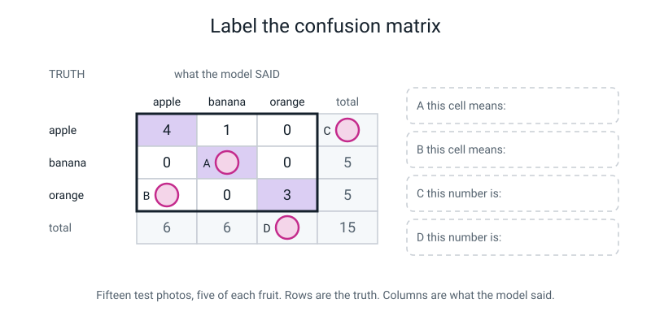
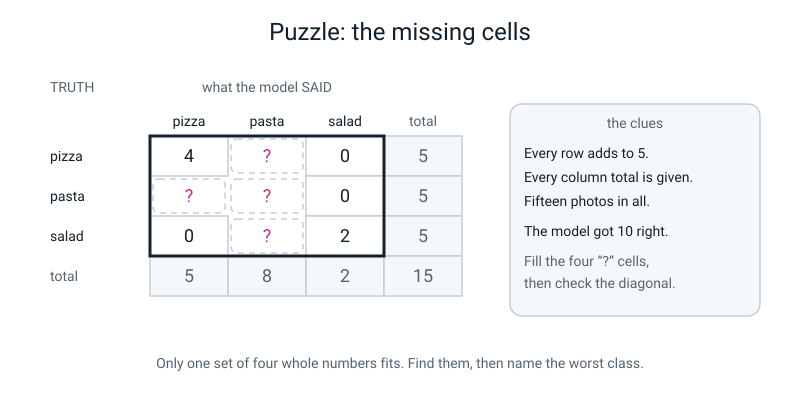
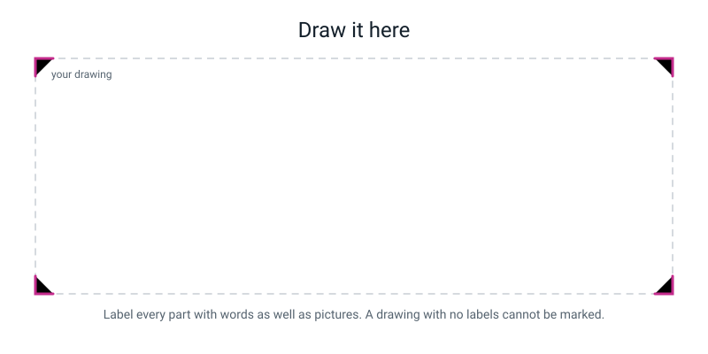

# Workbook — Week 22: The Hidden Ten: Test Your Own Model Honestly

**Name:** ________________________________  **Date:** ______________

[📖 Read the chapter first](../student-guide/week-22.md) · [Course Home](../README.md)

---

## ✅ Warm-Up (5 min)

Five quick questions about **last week**. Try all five before you look anything up.

**W1.** In one sentence each: what is the difference between **memorizing** and **generalizing**?

Memorizing: _____________________________________________________

Generalizing: ___________________________________________________

**W2.** A model scores **100%** on its training photos and **40%** on held-out photos. Which of the two happened, and what is the gap?

________________________________________________________________

**W3.** In a confusion matrix, what do the **rows** mean and what do the **columns** mean?

Rows: __________________________  Columns: __________________________

**W4.** True or false: *a small gap always means a good model.*

Circle: **TRUE** / **FALSE**. Why?

________________________________________________________________

**W5.** What does the **diagonal** of a confusion matrix count, and what must it equal?

________________________________________________________________

---

## ✍️ Practice Set A — Understand It

These six questions check that you know the words and ideas from this week's chapter.

**A1. Fill in the blanks.**

```text
   accuracy  =  the number it got ______________
                ─────────────────────────────────
                the number of ______________
```

Written three ways, 11 out of 15 is the fraction ____________, the decimal ____________ (to 4 places), and the percentage ____________ %.

The **baseline** is the score of the best strategy that ______________ the input completely.

---

**A2. Multiple choice — circle ONE.**

A test set has **3 classes with 5 photos each**. What is the baseline?

&nbsp;&nbsp;&nbsp;(a) 50%
&nbsp;&nbsp;&nbsp;(b) 33.3%
&nbsp;&nbsp;&nbsp;(c) 5%
&nbsp;&nbsp;&nbsp;(d) 100%

Now a second one. A test set has **8 pens, 4 pencils and 3 rubbers**. What is the baseline?

&nbsp;&nbsp;&nbsp;(a) 33.3%
&nbsp;&nbsp;&nbsp;(b) 53.3%
&nbsp;&nbsp;&nbsp;(c) 26.7%
&nbsp;&nbsp;&nbsp;(d) 20.0%

Explain in one line what changed between the two: ____________________

________________________________________________________________

---

**A3. True or false — and explain.**

> "The model said it was 94% confident, so it will be right about 94 times out of 100."

Circle one: **TRUE** / **FALSE**

Explain:

________________________________________________________________

________________________________________________________________

---

**A4. Match the pairs.** Write the letter of the meaning next to each word.

| Word | Letter | | | Meaning |
|---|---|---|---|---|
| held-out test set | ______ | | **A** | Training accuracy minus test accuracy, in percentage points |
| baseline | ______ | | **B** | Examples hidden before training and scored exactly once |
| per-class accuracy | ______ | | **C** | A grid where rows are the truth and columns are what the model said |
| confusion matrix | ______ | | **D** | The score of the best strategy that ignores the input |
| the gap | ______ | | **E** | The accuracy sum done separately for each class |

---

**A5. Label the diagram.**

Four things are being pointed at in this confusion matrix. Write what each one **means in words**, using the class names.


*Figure W22.1 — Fifteen held-out photos of fruit, five of each. Rows are the truth. Columns are what the model said.*

Then answer three more from the same grid:

(e) Overall accuracy as a fraction: ____________  as a percentage: ____________ %

(f) Which class was the model **worst** at, and what did it score? ____________________

(g) Does the diagonal check pass? Show it: ______ + ______ + ______ = ______

---

**A6. Sort them.** Tick one column for each statement.

| Statement | Honest reporting | Over-claiming |
|---|---|---|
| "11 out of 15, which is 73.3%" | ☐ | ☐ |
| "73% accurate" | ☐ | ☐ |
| "It beat the 33.3% baseline by 40 points" | ☐ | ☐ |
| "It's 40% better than guessing" | ☐ | ☐ |
| "Worst class was comb, at 2/5" | ☐ | ☐ |
| "Basically perfect" | ☐ | ☐ |
| "100% on training, 73.3% on 15 held-out photos" | ☐ | ☐ |
| "State of the art" | ☐ | ☐ |

Pick **one** from the "Over-claiming" column and rewrite it honestly:

`________________________________` becomes `________________________________________`

---

## ✍️ Practice Set B — Use It

These five questions give you real scoring sheets and reports to work through with a pencil.

**B1. Score this sheet.** A **bat / ball / stumps** classifier, 12 held-out photos, 4 of each.

| # | true | predicted | # | true | predicted |
|---|---|---|---|---|---|
| 1 | bat | bat | 7 | ball | ball |
| 2 | bat | bat | 8 | ball | stumps |
| 3 | bat | stumps | 9 | stumps | stumps |
| 4 | bat | bat | 10 | stumps | stumps |
| 5 | ball | ball | 11 | stumps | bat |
| 6 | ball | ball | 12 | stumps | stumps |

(a) Correct count: ______ out of ______

(b) Accuracy three ways — **show the division**:

```text
   fraction    ______ / ______

   decimal     ______ ÷ ______ = ______________

   percentage  ______________ %
```

(c) Baseline: ______ %   Beats it by: ______ percentage points

(d) Per class:

| class | correct | total | fraction | percentage |
|---|---|---|---|---|
| bat | | 4 | | |
| ball | | 4 | | |
| stumps | | 4 | | |
| **overall** | | **12** | | |

Check: the three correct counts add to ______, which must equal (a). ☐

---

**B2. Build the matrix for B1**, then run both checks.

| | said bat | said ball | said stumps | row total |
|---|---|---|---|---|
| **true bat** | | | | |
| **true ball** | | | | |
| **true stumps** | | | | |
| **column total** | | | | |

Diagonal check: ______ + ______ + ______ = ______ (must equal your correct count) ☐

Total check: all nine cells add to ______ (must equal your photo count) ☐

Biggest number **not** on the diagonal: ______, in the cell "true ______ → said ______"

Read the **columns**: how many times did the model say the word "stumps"? ______
How many real stumps photos were there? ______  What does that tell you?

________________________________________________________________

---

**B3. Here is a situation — what goes wrong, and why?**

> Ananya opens her envelope, which holds 14 photos. Photo 7 comes out and the model gets it wrong. She looks at the photo and says "that one's really dark, my lamp was off" — so she puts it back in the envelope, doesn't write it down, and carries on. She ends up with **13 photos scored, 10 correct**, and reports 10/13 = 76.9%.

(a) What is her score if the dropped photo is counted as wrong? ______ / ______ = ______ %

(b) What is her score *actually* measuring now, rather than the model?

________________________________________________________________

(c) She says "but it was genuinely an unfair photo". Is she right? What should she have done instead?

________________________________________________________________

________________________________________________________________

---

**B4. Here is a situation — what goes wrong, and why?**

> Dev builds a **cat / not-cat** classifier. His test set has **2 cat photos and 18 not-cat photos**. His model says "not cat" to absolutely everything. He reports **90% accuracy** and is delighted.

(a) Check his arithmetic. Is 90% correct? ______

(b) What is the baseline here? ______ %  Show your working: ____________________

(c) How much did his model beat the baseline by? ______ percentage points

(d) What is the per-class accuracy on **cat**? ______ %

(e) Write one sentence Dev should have written instead of "90% accurate":

________________________________________________________________

________________________________________________________________

---

**B5. Mark somebody else's verdict.** Here is what another student wrote up. Find **three** faults and write the fix.

```text
MY RESULTS
My model is 87% accurate.
It's 54% better than guessing.
It got everything right except a few.
Training accuracy was 100% so it works.
```

| Fault | Why it's a fault | The fix |
|---|---|---|
| | | |
| | | |
| | | |

Which of the four lines is the **most** misleading, and why? ____________________

________________________________________________________________

---

## 🧩 Puzzle of the Week

Four cells of a confusion matrix have gone missing. Use the clues to fill them in.


*Figure W22.2 — A **pizza / pasta / salad** classifier. Four cells have gone missing.*

Here it is written out:

| | said pizza | said pasta | said salad | row total |
|---|---|---|---|---|
| **true pizza** | 4 | **?₁** | 0 | 5 |
| **true pasta** | **?₂** | **?₄** | 0 | 5 |
| **true salad** | 0 | **?₃** | 2 | 5 |
| **column total** | 5 | 8 | 2 | **15** |

**The clues:** every row adds to 5 · every column total is given · fifteen photos in all · the model got **10** of the 15 right.

**P1.** Start with the row that has only **one** missing cell. Which row is it, and what must the missing number be?

Row: ____________  ?___ = ______  Working: ____________________

**P2.** Now find the second row with only one unknown left.

Row: ____________  ?___ = ______  Working: ____________________

**P3.** Now use a **column** total to get the third.

?___ = ______  Working: ____________________

**P4.** And finally the last one.

?___ = ______  Working: ____________________

**P5.** Check the diagonal: ______ + ______ + ______ = ______  Does it match the 10 in the clues? ______

**P6.** Name the **worst class** and its score: ____________ at ______ / ______ = ______ %

**P7.** Which cell is the biggest number off the diagonal, and what would you photograph tomorrow because of it?

________________________________________________________________

________________________________________________________________

---

## 🤔 Think Deeper

These two questions have no single right answer. Write a short paragraph for each.

**T1.** You are only allowed 15 test photos. Every photo you move into the envelope is a photo your model does not get to learn from.

Write a paragraph about that trade. What do you gain by hiding more photos? What do you lose? Is there a right answer, and if not, what should you *say* about the choice you made?

________________________________________________________________

________________________________________________________________

________________________________________________________________

________________________________________________________________

________________________________________________________________

________________________________________________________________

---

**T2.** Suppose the rules were relaxed and you *were* allowed to re-test any photo you thought was unfair, as long as you were honest with yourself about it.

Write a paragraph on what would go wrong. Would it go wrong straight away, or slowly? Would you be able to tell it was happening? And what does your answer say about why real scientists seal envelopes rather than simply promising to behave?

________________________________________________________________

________________________________________________________________

________________________________________________________________

________________________________________________________________

________________________________________________________________

---

## 🛠️ Build It

These pages are for your own model's hidden ten. Fill them in with your own photos and numbers.

### Page W22.1 — The completed scoring sheet

Copy up today's sheet neatly if it is messy, and **staple the original behind it.** Do not "improve" any row.

**Photos in the envelope:** ______   **My prediction before opening:** ______ / ______

| # | TRUE class | PREDICTED class | top conf. % | ✓ / ✗ | notes |
|:--:|---|---|:--:|:--:|---|
| 1 | | | | | |
| 2 | | | | | |
| 3 | | | | | |
| 4 | | | | | |
| 5 | | | | | |
| 6 | | | | | |
| 7 | | | | | |
| 8 | | | | | |
| 9 | | | | | |
| 10 | | | | | |
| 11 | | | | | |
| 12 | | | | | |
| 13 | | | | | |
| 14 | | | | | |
| 15 | | | | | |

**Correct:** ______ / ______

---

### Page W22.2 — Accuracy three ways

**Show the division longhand.** A calculator answer with no working scores nothing today.

```text
   FRACTION     ______ / ______

   DECIMAL      ______ x 0.___ = ______        remainder ______

                ______ ÷ ______ = 0.______

                0.___ + 0.______ = 0.________     (4 decimal places)

   PERCENTAGE   0.________ x 100 = ______ %       (1 decimal place)

   BASELINE     my classes and their test counts: ___ / ___ / ___

                baseline = ______ / ______ = ______ %

   BEATS BASELINE BY  ______ − ______ = ______ percentage POINTS

   ONE PHOTO IS WORTH  100 ÷ ______ = ______ percentage points
```

---

### Page W22.3 — Per-class accuracy

| class | correct | total | fraction | decimal | percentage |
|---|---|---|---|---|---|
| | | | | | |
| | | | | | |
| | | | | | |
| **overall** | | | | | |

**The check:** ______ + ______ + ______ = ______, which must equal my overall correct count. ☐

**My worst class is** ____________ **at** ______ / ______ = ______ %

Is that above or below my baseline? ____________________

---

### Page W22.4 — The confusion matrix

Rule it with a ruler. Rows `true ___`, columns `said ___`.

| | said ______ | said ______ | said ______ | row total |
|---|---|---|---|---|
| **true ______** | | | | |
| **true ______** | | | | |
| **true ______** | | | | |
| **column total** | | | | |

**Diagonal check:** ______ + ______ + ______ = ______ = my correct count ☐

**Total check:** all cells add to ______ = my photo count ☐

**Biggest off-diagonal cell:** ______ in "true ______ → said ______"

**Read down the columns.** Which class name did the model say **most** often? ____________
How many of that class actually existed? ______
Which class name did it say **least** often? ____________ ______ times.

---

### Page W22.5 — The gap

```text
   training accuracy (from Week 17)  =  ______ %
   test accuracy (today)             =  ______ %

   the gap  =  ______ − ______  =  ______ percentage points
```

**Two sentences about what that means for *my* model** — mention my own photos, not models in general:

________________________________________________________________

________________________________________________________________

________________________________________________________________

---

### Page W22.6 — The verdict

**Sentence 1 — the worst class.**
*"My worst class was ____________, at ______ out of ______, which is ______%."*

**Sentence 2 — what it got confused with.**
*"It got called ____________ ______ times, which is the biggest number in my grid that isn't on the diagonal."*

**Sentence 3 — the cause, as a guess about my own photos.**
*"I think that happened because ______________________________________________ in my training photos."*

**Now go and look at your training photos.** Then write the line that matters most:

*"I checked, and ______________________________________________________________."*

**My shot list — the exact ten photos I would take tomorrow.** Not "more combs". Be specific.

1. ______________________________________________________________
2. ______________________________________________________________
3. ______________________________________________________________
4. ______________________________________________________________
5. ______________________________________________________________

---

### Page W22.7 — Score somebody else's test

A **sock / glove / hat** classifier, 12 held-out photos, 4 of each. Its **training accuracy was 100%**.

| # | true | predicted | top conf. |
|---|---|---|---|
| 1 | sock | sock | 88% |
| 2 | sock | sock | 74% |
| 3 | sock | glove | 61% |
| 4 | sock | sock | 93% |
| 5 | glove | glove | 81% |
| 6 | glove | sock | 58% |
| 7 | glove | glove | 69% |
| 8 | glove | sock | 52% |
| 9 | hat | hat | 90% |
| 10 | hat | hat | 85% |
| 11 | hat | hat | 77% |
| 12 | hat | glove | 55% |

**(a)** Overall accuracy, three ways, with the division shown. Baseline, and the improvement in points.

```text
   ____________________________________________________________

   ____________________________________________________________

   ____________________________________________________________
```

**(b)** Per class:

| class | correct rows | fraction | percentage |
|---|---|---|---|
| sock | | | |
| glove | | | |
| hat | | | |

**(c)** The confusion matrix, with both checks:

| | said sock | said glove | said hat | row total |
|---|---|---|---|---|
| **true sock** | | | | |
| **true glove** | | | | |
| **true hat** | | | | |
| **column total** | | | | |

**(d)** Worst class: ____________  Biggest off-diagonal cell: ______ in "true ____ → said ____"

**(e)** Reading down the columns — which class is the model over-eager about? ____________
Which two classes are **never** confused in either direction? ____________ and ____________

**(f)** Confidence split. Mean confidence of the **correct** answers: ______ %
Mean confidence of the **wrong** answers: ______ %  Difference: ______ points

**(g)** The one-sentence verdict:

________________________________________________________________

________________________________________________________________

**(h)** The ten-photo fix, specific:

________________________________________________________________

________________________________________________________________

**(i)** The gap: ______ − ______ = ______ percentage points. Is that big or small? ____________

---

## 🎨 Draw It

This page is for turning your results into one picture.

Draw your model's **report card** — as a poster somebody else could read and check in twenty seconds. Include: the fraction, the percentage, the baseline drawn as a line, three per-class bars, and the confusion matrix with its worst cell circled.


*Figure W22.3 — Your page.*

> **What a good answer might look like:** a big **11/15** at the top with **73.3%** underneath it, and a dashed line labelled *baseline 33.3%* drawn straight across the three bars so you can see instantly which bars beat it. Three bars: spoon 5/5, toothbrush 4/5, comb 2/5 — with the comb bar sitting only just above the dashed line. To the right, a small 3 × 3 grid with the "true comb → said toothbrush" cell circled and an arrow pointing at it saying *"my next ten photos go here."* At the bottom, in one line: *"100% on training, 73.3% on 15 photos it had never seen. Gap 26.7 points."*
>
> **What a weak answer looks like:** one big number — **73%** — in a star shape, with nothing else. No fraction, so no sample size. No baseline, so no way to tell if 73 is good. No worst class, so no plan. That is a poster, not a report.

---

## 📊 Self-Check

Tick one face for each line. Be honest with yourself.

| I can… | 😀 got it | 🙂 nearly | 😕 not yet |
|---|---|---|---|
| Score every held-out example on paper without skipping or re-testing any | ☐ | ☐ | ☐ |
| Report accuracy as a fraction, a decimal and a percentage, with the division shown | ☐ | ☐ | ☐ |
| Work out the right baseline, including when my test classes are uneven | ☐ | ☐ | ☐ |
| Build a confusion matrix by hand and pass both checks | ☐ | ☐ | ☐ |
| Name my worst class and the biggest off-diagonal cell | ☐ | ☐ | ☐ |
| Write an honest verdict that does not over-claim | ☐ | ☐ | ☐ |

One thing I'd like explained again:

________________________________________________________________

---

## ✅ Answers

Finish the whole workbook first. Then open the box below to check your work.

<details>
<summary>Check your answers</summary>

### Warm-Up

**W1.** **Memorizing** = getting the *old* examples right, because it has effectively learned them by heart. **Generalizing** = getting *new* examples right, because it learned something about the object itself. The whole reason we hide photos is that only the second one is useful.

**W2.** **Memorizing.** The gap is 100 − 40 = **60 percentage points**, which is enormous. It learned the training photos — probably the table, the light and the background — rather than the objects.

**W3.** **Rows = the truth** (what the photo actually was). **Columns = what the model said.** Getting these the wrong way round makes every reading of the grid backwards, which is why you write "true ___" and "said ___" on the labels every single time.

**W4.** **FALSE.** A model scoring 55% on training and 52% on testing has a tiny 3-point gap and is useless — it barely learned anything at all. You read the **gap and the level together**, or you learn nothing from either.

**W5.** The diagonal counts the photos where the truth and the prediction **matched** — i.e. the correct ones. It must equal your **correct count** from the scoring sheet. (And every cell added together must equal your photo count.)

---

### Practice Set A

**A1.** got **right** · number of **tries** · fraction **11/15** · decimal **0.7333** · percentage **73.3%** · the baseline **ignores** the input.

**A2.** First: **(b) 33.3%** — three classes with equal numbers, so shouting a random name is right about one time in three.

Second: **(b) 53.3%** — the best strategy that ignores the photo is *"always say pen"*, and 8 of the 15 photos are pens, so 8/15 = 53.3%.

**What changed:** the test set stopped being **balanced**. The baseline is not always 1 ÷ number-of-classes. It is *the score of always naming the commonest class*, and that only equals 33.3% when the classes are even.

**A3.** **FALSE.**

A confidence score is **how strongly the model prefers that class over the others**. It is not a probability of being right. The model has no way of knowing what "wrong" even means — it can only tell you which of its options fits best. Show it something unlike anything it trained on and it will still pick one, and still pick it strongly. **Confident and wrong is completely normal**, and your own scoring sheet probably contains an example.

**A4.** held-out test set = **B** · baseline = **D** · per-class accuracy = **E** · confusion matrix = **C** · the gap = **A**.

**A5.**

1. **A** (the shaded diagonal cell holding 5) — *"all 5 real bananas were correctly called banana."* This is a diagonal cell, so it counts successes.
2. **B** (the cell holding 2) — *"2 real oranges were called apple."* It is the biggest number **off** the diagonal, so it is the model's single commonest mistake — and it is a mistake with **two names** attached, which is what makes it fixable.
3. **C** (the 5 at the end of the apple row) — *"there were 5 apple photos in the test set."* A row total is how many of that class existed.
4. **D** (the 3 at the foot of the orange column) — *"the model said the word 'orange' 3 times in 15 tries."* A column total is how often the model was **willing to use** that word — even though 5 oranges existed. That is reluctance, and it is a different diagnosis from simply being bad at oranges.

(e) 4 + 5 + 3 = **12 correct**, so **12/15**. Decimal: 15 × 0.8 = 12, so it is exactly 0.8 → **80.0%**.

(f) **orange**, at 3/5 = **60.0%**. (Apple is 4/5 = 80%, banana is 5/5 = 100%.)

(g) 4 + 5 + 3 = **12** ✓ — matches the correct count. All nine cells: 4+1+0+0+5+0+2+0+3 = **15** ✓.

**A6.**

| Statement | Verdict | Why |
|---|---|---|
| "11 out of 15, which is 73.3%" | **honest** | Fraction first, so you know the sample size |
| "73% accurate" | **over-claiming** | Out of how many? Against what baseline? |
| "It beat the 33.3% baseline by 40 points" | **honest** | Baseline named, and *points* used correctly |
| "It's 40% better than guessing" | **over-claiming** | Points, not percent. 33.3 → 73.3 is 40 **points** — but it is more than *double* |
| "Worst class was comb, at 2/5" | **honest** | Names the weakness and gives its fraction |
| "Basically perfect" | **over-claiming** | Not a measurement of anything |
| "100% on training, 73.3% on 15 held-out photos" | **honest** | Both numbers, so the gap is checkable |
| "State of the art" | **over-claiming** | Compared with what, measured how? |

Model rewrite: *"73% accurate"* → **"11 out of 15 held-out photos, which is 73.3%, against a 33.3% baseline."**

---

### Practice Set B

**B1.**

(a) Correct rows: 1, 2, 4, 5, 6, 7, 9, 10, 12 → **9 out of 12**.

(b)

```text
   FRACTION    9 / 12          (simplifies to 3/4)

   DECIMAL     12 x 0.7 = 8.4        remainder  9 − 8.4 = 0.6
               0.6 ÷ 12 = 0.05
               0.7 + 0.05 = 0.7500

   PERCENTAGE  75.0 %
```

(c) Baseline **33.3%** (three classes, four photos each). Beats it by 75.0 − 33.3 = **41.7 percentage points**.

(d)

| class | correct | total | fraction | percentage |
|---|---|---|---|---|
| bat | 3 | 4 | 3/4 | 75.0% |
| ball | 3 | 4 | 3/4 | 75.0% |
| stumps | 3 | 4 | 3/4 | 75.0% |
| **overall** | **9** | **12** | **9/12** | **75.0%** |

Check: 3 + 3 + 3 = **9** ✓. *(Notice: all three classes are equally good here. That is unusual and worth saying — most models have a clear worst class. This one's mistakes are spread evenly.)*

**B2.**

| | said bat | said ball | said stumps | row total |
|---|---|---|---|---|
| **true bat** | **3** | 0 | 1 | 4 |
| **true ball** | 0 | **3** | 1 | 4 |
| **true stumps** | 1 | 0 | **3** | 4 |
| **column total** | 4 | 3 | 5 | **12** |

Diagonal 3 + 3 + 3 = **9** ✓ matches the correct count. All cells = **12** ✓.

Biggest off-diagonal: there is a **three-way tie at 1** — "true bat → said stumps", "true ball → said stumps", and "true stumps → said bat". Say so; a tie is a real answer, and it means this model has no single dominant mistake.

Reading the columns: the model said **"stumps" 5 times** when only **4** stumps photos existed. It is slightly **over-eager** about stumps — both of its non-stumps mistakes went that way. If you were fixing this model, that is the direction to look: something about stumps photos is attracting bats and balls. (And it said "ball" only 3 times for 4 real balls, so it is mildly reluctant there.)

**B3.**

(a) Counting the dropped photo as wrong: **10 / 14 = 71.4%**. *(14, because she did open 14 — she dropped one of them. If the envelope held 15 and she also lost one, use the real count and say so.)*

(b) Her 76.9% is measuring **how many photos she was willing to remove**. She chose to drop that photo *because* the model failed on it — so the score is no longer a property of the model at all. If she dropped three more of the failures she would "score" 100%.

(c) She may be completely right that it was a hard photo — and that is **real information that belongs in the notes column**. What she should have done: write **"very dark, lamp off"** in the notes, mark it **wrong**, and keep it. The photo was chosen before she knew which ones would fail, and that is exactly what made it fair. *(And if lots of her failures are dark photos, she has just diagnosed her model — that is a finding, not an excuse.)*

**B4.**

(a) Yes, the arithmetic is right: 18 correct ÷ 20 = **90%**. Honest arithmetic, useless machine.

(b) Baseline = always say the commonest class = *"not cat"* = **18/20 = 90.0%**.

(c) 90.0 − 90.0 = **0 percentage points.** His model achieved **exactly nothing**. A brick with a label on it would score the same.

(d) Per-class on **cat**: 0 correct out of 2 = **0.0%**. It has never identified a cat in its life.

(e) Model sentence: *"On 20 held-out photos my model scored 18/20 = 90.0%, but the baseline was also 90.0% because 18 of the 20 photos were not-cat — so it beat guessing by 0 points, and it scored 0/2 = 0% on cats. My test set was far too unbalanced to measure anything."*

**B5.**

| Fault | Why it's a fault | The fix |
|---|---|---|
| "87% accurate" | No fraction, so no sample size and no baseline. 87% could be 13 out of 15 or 87 out of 100, and those are very different claims | Write the fraction first: *"13/15 = 86.7%, against a 33.3% baseline"* |
| "54% better than guessing" | Percent instead of **points**, and no baseline stated | *"It beat the 33.3% baseline by 53.3 percentage points"* |
| "Everything right except a few" | Not a measurement. Which class, how many, confused with what? | *"Worst class was salad at 2/5 = 40%, most often called pasta"* |
| "Training accuracy was 100% so it works" | Training accuracy shows nothing — most models get close to 100% on photos they studied. It is the **gap** that carries information | *"100% on training, 86.7% held out, so the gap is 13.3 points"* |

**The most misleading line is the last one**, "training accuracy was 100% so it works". The others are vague or badly worded; that one is actively wrong reasoning, and it is the exact mistake that lets people ship broken models believing they are perfect.

---

### Puzzle of the Week

**P1.** **The pizza row** — 4 + ?₁ + 0 = 5, so **?₁ = 1**.

**P2.** **The salad row** — 0 + ?₃ + 2 = 5, so **?₃ = 3**.

**P3.** **The "said pasta" column** totals 8. It contains ?₁ (= 1), ?₄, and ?₃ (= 3):
1 + ?₄ + 3 = 8, so **?₄ = 4**.

**P4.** **The pasta row** — ?₂ + 4 + 0 = 5, so **?₂ = 1**.

The finished grid:

| | said pizza | said pasta | said salad | row total |
|---|---|---|---|---|
| **true pizza** | **4** | 1 | 0 | 5 |
| **true pasta** | 1 | **4** | 0 | 5 |
| **true salad** | 0 | 3 | **2** | 5 |
| **column total** | 5 | 8 | 2 | **15** |

**P5.** Diagonal: 4 + 4 + 2 = **10** ✓ — matches the clue. And all nine cells add to 15 ✓. Both checks pass, which is how you know you did not just invent numbers that happened to fit one row.

**P6.** Worst class: **salad**, at **2/5 = 40.0%**. (Pizza 4/5 = 80%, pasta 4/5 = 80%.) Notice 40% is still above the 33.3% baseline — only just.

**P7.** The biggest off-diagonal cell is the **3** in *"true salad → said pasta"*. **Three of the five salads were called pasta.**

What to photograph tomorrow: not "more salad". Attack that specific confusion. Something like — *five photos of a salad with the leaves clearly separated and the bowl visible, so it cannot read as a heap of strands; and five photos of a salad and a plate of pasta side by side at the same distance and under the same lamp, so the only difference between them is the food.*

And look at the reverse cell: *"true pasta → said salad"* is **0**. Not one pasta was ever called salad. **The confusion runs one way only**, which is a hint to check the salad class itself — maybe too few salad photos, or all of them too similar — rather than the two foods looking alike. It is a guess to check, not a proof: with five photos per class the matrix cannot show the cause.

---

### Think Deeper

**T1. Model answer:**

> Every photo I put in the envelope is a photo the model never gets to learn from, so hiding more makes my *measurement* more trustworthy and my *model* worse. With 15 test photos, one photo is worth 6.7 points, so I can only take differences bigger than about 7 points seriously. If I hid 30 instead, one photo would only be worth 3.3 points and I could trust smaller differences — but I would have 15 fewer training photos, and with only 60 to begin with that is a quarter of my data gone.
>
> There is no right answer, and that is the honest part. It is a trade, not a puzzle with a solution. What I *can* do is say out loud where I sat on it: "15 held-out photos, so one photo is 6.7 points, so do not read anything into a 5-point difference." A number reported with its sample size lets somebody else judge the trade for themselves. A bare percentage hides it.

*Full marks needs:* that more test photos means a better measurement **and** a worse model · that there is no correct answer · and that the honest move is to **state** the choice and what one photo is worth.

**T2. Model answer:**

> It would go wrong slowly, which is what makes it dangerous. The first re-test would feel completely reasonable — the photo really was blurry. So would the second. But every re-test would happen for the same reason: the model got it wrong. I would never once re-test a photo the model got *right*, because I would have no reason to look twice at it. So the score would drift upwards, one small honest-feeling decision at a time.
>
> And I would not be able to tell. Each individual choice has a genuine excuse attached, so nothing ever feels like cheating. That is the whole point of the envelope: it is not there because I am dishonest, it is there because **being honest is not enough**. A sealed envelope removes the decision instead of asking me to make it well. Real scientists do not seal results because they distrust their own character — they do it because everybody's brain works like this, including theirs.

*Full marks needs:* that the drift is **one-directional** (you only ever re-test failures) · that it feels reasonable each time · and that sealing removes the decision rather than relying on willpower.

---

### Build It — W22.1 to W22.6

These depend on your own model, so check yourself against this list rather than against numbers:

- [ ] All fifteen rows present. None missing, none crossed out and rewritten.
- [ ] The TRUE column was filled in **before** any scoring.
- [ ] The correct count equals the number of ticks.
- [ ] Fraction, decimal to 4 places, percentage to 1 dp — **with the division written longhand**.
- [ ] Baseline correct for **your** class counts. Three even classes → 33.3%. For 6, 5 and 4 test photos, the baseline is 6/15 = **40.0%**, because always naming the commonest class scores that.
- [ ] Improvement written in **percentage points**, not "percent".
- [ ] Per-class table, with the check that the parts add to the whole.
- [ ] Confusion matrix ruled, with row totals, column totals, **and both checks written out**.
- [ ] The gap = training − test, in points, with two sentences that mention **your own photos**.
- [ ] Three-sentence verdict **plus** the "I checked, and ____" line — which may honestly report that your guess was wrong.
- [ ] Five specific shots on the shot list. "More combs" is not a shot.

**Model answer for the two gap sentences, to show the standard:**

> *"My training accuracy was 100% and my held-out accuracy was 73.3%, so the gap is 26.7 percentage points. That tells me the model learned something genuinely useful — 73.3% is forty points above the 33.3% baseline, which is not luck — but I suspect it also memorised some things specific to my kitchen table, because the room, the light and which hand I held things in all changed for the test photos and the score dropped by a quarter. I have not tested which of those mattered, so that is a guess I would go and check."*

---

### Build It — W22.7, sock / glove / hat

**(a)** Correct rows: 1, 2, 4, 5, 7, 9, 10, 11 → **8 correct**.

```text
   FRACTION    8 / 12       (simplifies to 2/3)

   DECIMAL     12 x 0.6 = 7.2        remainder  8 − 7.2 = 0.8
               0.8 ÷ 12 = 0.0667
               0.6 + 0.0667 = 0.6667

   PERCENTAGE  66.7 %

   BASELINE    3 equal classes -> 33.3%
   BEATS IT BY 66.7 − 33.3 = 33.3 percentage points
```

**(b)**

| class | correct rows | fraction | percentage |
|---|---|---|---|
| sock | 1, 2, 4 | 3/4 | 75.0% |
| glove | 5, 7 | 2/4 | **50.0%** |
| hat | 9, 10, 11 | 3/4 | 75.0% |

Check: 3 + 2 + 3 = **8** ✓ · 4 + 4 + 4 = **12** ✓

**(c)**

| | said sock | said glove | said hat | row total |
|---|---|---|---|---|
| **true sock** | **3** | 1 | 0 | 4 |
| **true glove** | 2 | **2** | 0 | 4 |
| **true hat** | 0 | 1 | **3** | 4 |
| **column total** | 5 | 4 | 3 | **12** |

Diagonal 3 + 2 + 3 = **8** ✓ · all cells = **12** ✓

**(d)** Worst class: **glove**, 2/4 = 50.0%. Biggest off-diagonal cell: **2**, in *"true glove → said sock"* — two of the four gloves were called socks.

**(e)** The model is over-eager about **sock**: it said "sock" 5 times when only 4 socks existed.

**Sock and hat are never confused in either direction** — both *"true hat → said sock"* and *"true sock → said hat"* are **0**. Perhaps they look quite different to the model (the matrix cannot tell us why). All the trouble sits between sock and glove.

**(f)**

```text
   correct answers (8):  88, 74, 93, 81, 69, 90, 85, 77
       sum  = 657
       mean = 657 ÷ 8 = 82.125  =  82.1%

   wrong answers (4):    61, 58, 52, 55
       sum  = 226
       mean = 226 ÷ 4 = 56.5%

   difference = 82.1 − 56.5 = 25.6 percentage points
```

So confidence carries real information here. **But look at the overlap:** the lowest confidence on a correct answer is **69%** (row 7) and the highest on a wrong answer is **61%** (row 3). In *this* sample they happen not to overlap, which is unusual and is a small-sample fluke rather than a property of the model. **With only twelve rows you must not build a "trust anything over 65%" rule and believe it.**

**(g)** *"On 12 held-out photos this model scored 8/12 = 66.7% against a 33.3% baseline; it was worst at **glove** (2/4 = 50.0%), and its most common mistake was calling a glove a sock."*

**(h)** Attack the *glove → sock* cell specifically: **five photos of a glove with the fingers clearly spread**, so the finger shape is unmistakable and it cannot read as a tube of fabric; and **five photos of a glove and a sock side by side at the same distance**, so shape is the only thing that differs. Simply adding ten more ordinary glove photos might not help — the existing glove photos may already look sock-like (a guess the matrix cannot confirm).

**(i)** 100.0 − 66.7 = **33.3 percentage points.** That is **large**. Real learning happened (66.7% is 33.3 points above baseline) but a substantial amount of what this model "knows" is memory of its own training photos rather than knowledge of socks, gloves and hats.

---

### Draw It

There is no single right poster. A strong answer has **all four numbers on it** — the fraction, the percentage, the baseline, and the gap — plus a worst-class marker and a circled matrix cell. The test is not whether it looks nice. **The test is whether a stranger could use your poster to catch you if you had made a mistake.** If your poster contains only numbers that make you look good, it is an advert, not a report.

If your baseline line is missing, add it now, as a dashed line straight across your bars. It is the single most useful mark on the page: any bar that does not clear it is a class your model performs worse-than-guessing on.

</details>

---

[⬅ Week 21 workbook](week-21.md) · [📖 Week 22 chapter](../student-guide/week-22.md) · [Course Home](../README.md) · [Week 23 workbook ➡](week-23.md) · [Glossary](../../glossary.md)
