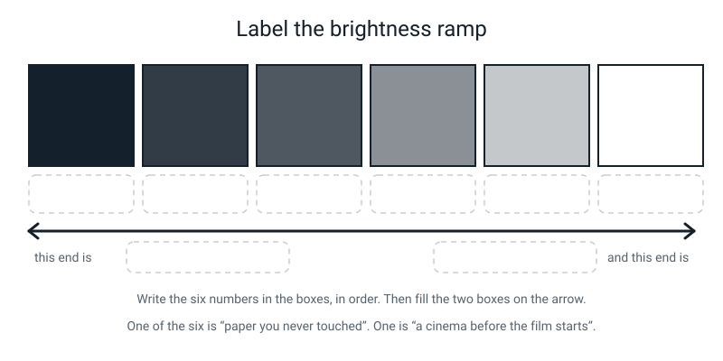
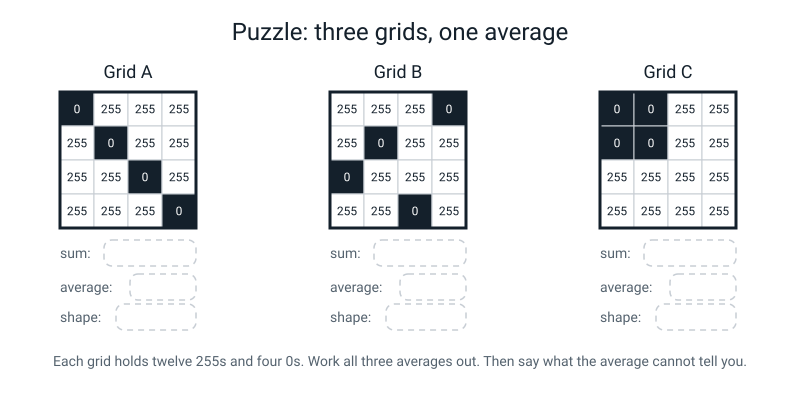
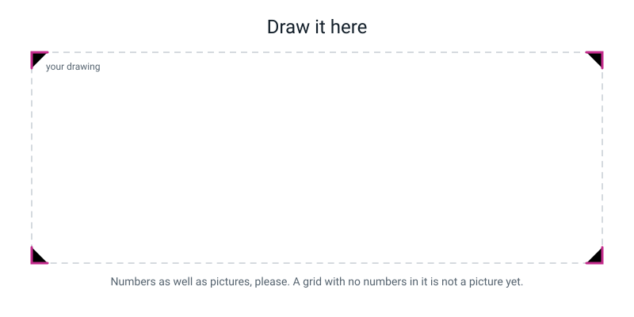

# Workbook — Week 23: A Photo Is Just a Grid of Numbers

**Name:** ________________________________  **Date:** ______________

[📖 Read the chapter first](../student-guide/week-23.md) · [Course Home](../README.md)

---

## ✅ Warm-Up (5 min)

Five quick questions about **last week**. Try all five before you look anything up.

**W1.** Write **9 out of 12** three ways.

Fraction: __________  Decimal (4 places): __________  Percentage (1 dp): __________ %

**W2.** A test set has 4 classes with 5 photos each. What is the baseline? __________ %

Now: a test set has 10 cats and 2 dogs. What is the baseline? __________ %

**W3.** In a confusion matrix, what does a **column total** tell you that a row total does not?

________________________________________________________________

**W4.** True or false: *going from 33% to 73% is "40 percent better".*

Circle: **TRUE** / **FALSE**. What is the correct wording?

________________________________________________________________

**W5.** Why is 100% on the training photos not worth reporting?

________________________________________________________________

---

## ✍️ Practice Set A — Understand It

**A1. Fill in the blanks.**

A **pixel** is one tiny ______________ of a picture, and the smallest piece a computer can ______________. The word is short for "______________ ______________".

In a grayscale picture each pixel holds one whole number from ______ to ______, and that number says how much ______________ comes out of that square.

0 means ______________ and 255 means ______________.

It stops at 255 because one ______________ of memory holds exactly ______ different values.

---

**A2. Multiple choice — circle ONE each time.**

(i) A pixel says **20**. It is:

&nbsp;&nbsp;&nbsp;(a) almost white &nbsp;&nbsp; (b) middle grey &nbsp;&nbsp; (c) almost black &nbsp;&nbsp; (d) impossible

(ii) A picture is 30 pixels across and 20 down. How many pixels?

&nbsp;&nbsp;&nbsp;(a) 50 &nbsp;&nbsp; (b) 60 &nbsp;&nbsp; (c) 600 &nbsp;&nbsp; (d) 6000

(iii) How many **numbers** do you need to store that picture in grayscale?

&nbsp;&nbsp;&nbsp;(a) 50 &nbsp;&nbsp; (b) 600 &nbsp;&nbsp; (c) 1800 &nbsp;&nbsp; (d) it depends on the picture

---

**A3. True or false — and explain.**

> "Grayscale means low quality."

Circle one: **TRUE** / **FALSE**

Explain:

________________________________________________________________

________________________________________________________________

---

**A4. Match the pairs.** Write the letter of the meaning next to each word.

| Word | Letter | | | Meaning |
|---|---|---|---|---|
| pixel | ______ | | **A** | How many pixels a picture has, written width × height |
| grayscale | ______ | | **B** | One million pixels |
| resolution | ______ | | **C** | One tiny square of a picture, holding one number |
| megapixel | ______ | | **D** | A unit of memory that holds exactly 256 different values |
| byte | ______ | | **E** | A picture where each pixel is a single brightness number |

---

**A5. Label the diagram.**

Write the number for each swatch in the box underneath it, in order. Then fill the two boxes on the arrow.


*Figure W23.1 — Six swatches, no labels. You supply the numbers.*

Then two more questions from the same figure:

(g) Which swatch is "a cinema before the film starts"? ____________

(h) Which swatch is "paper you never touched with the pencil"? ____________

---

**A6. Sort them.** For each way of shading a square, write the number from the five-step key.

| How the square is shaded | Number |
|---|---|
| Filled in solid, no white left | |
| Not touched at all | |
| Half-and-half | |
| A light touch of pencil | |
| Nearly filled, a bit of white showing | |

Now the check question: **in a drawing of a letter, whereabouts on the page do the middle three values live?**

________________________________________________________________

Why?

________________________________________________________________

---

## ✍️ Practice Set B — Use It

**B1. Read this grid.** Nobody is going to show you the picture.

```text
        c1   c2   c3   c4   c5   c6
   r1   255  255  255  255  255  255
   r2   255  255  255  255  255  255
   r3   128  128  128  128  128  128
   r4    0    0    0    0    0    0
   r5   128  128  128  128  128  128
   r6   255  255  255  255  255  255
```

(a) How many pixels? ______   How many numbers to store it in grayscale? ______

(b) Where is the darkest region? ____________________

(c) Is there a perfectly straight edge? Where, and **how do you know from the numbers**?

________________________________________________________________

(d) What is the picture? ____________________

(e) Where are the 128s, and why are they there rather than 0 or 255?

________________________________________________________________

________________________________________________________________

(f) The average brightness. Show the working:

```text
   ______ x   0  =  ________
   ______ x 128  =  ________
   ______ x 255  =  ________
                    ________   total

   average = ________ ÷ 36 = ________
```

(g) Every column of this grid is identical. What does that fact alone tell you about the picture?

________________________________________________________________

---

**B2. Resolution arithmetic.** Show the multiplication, not just the answer.

(a) A tablet screen is **2048 × 1536**. How many pixels?

```text
   2048 x 1536 = ______________ pixels  =  about ______ megapixels
```

(b) A grayscale thumbnail is **64 × 64**. How many pixels, and how many numbers?

```text
   64 x 64 = ________ pixels  ->  ________ numbers
```

(c) How many times more pixels does the tablet screen have than the thumbnail?

```text
   ______________ ÷ ________ = ________
```

(d) Writing the thumbnail's numbers out by hand at one per second would take ________ seconds, which is about ______ hour(s) and ______ minutes.

---

**B3. Here is a situation — what goes wrong, and why?**

> Priya numbers her 12 × 12 grid beautifully. But in row 5 she gets distracted and writes only **11** numbers instead of 12. Everything else is perfect. She copies it all onto a clean sheet and hands it over.

(a) How many numbers are on her sheet? ________

(b) What will the rebuilt picture look like? Be specific about **where** it goes wrong.

________________________________________________________________

________________________________________________________________

(c) What is the fastest way to find the mistake? ____________________

(d) Why can the person rebuilding it **not** spot the gap from the numbers alone?

________________________________________________________________

________________________________________________________________

---

**B4. Here is a situation — what goes wrong, and why?**

> Rohan is very neat. He lines his letter up *exactly* along the grid lines, so that every single square comes out either 0 or 255. His rebuild is perfect first time, with zero disagreements.

(a) How many greys are in his grid? ________

(b) His rebuild worked perfectly. So what did he actually lose?

________________________________________________________________

________________________________________________________________

(c) Is his grid **wrong**? Explain carefully.

________________________________________________________________

(d) What is the smallest change that would fix it? ____________________

---

**B5. Mark somebody else's work.** Here is the number grid another student handed in. They were copying a drawing of two dark pencil eyes on blank white paper, with the top row of the drawing blank. Find **three** faults and write the fix.

```text
NUMBER GRID
row 1:  0   0   0   0   0   0   0   0   0   0   0   0
row 2:  0   0  255 255  0   0   0   0  255 255  0   0
row 3:  0   0  255 255  0   0   0   0  255 255  0   0
row 4:  (same as above)
row 5:  (same as above)
...
```

| Fault | Why it's a fault | The fix |
|---|---|---|
| | | |
| | | |
| | | |

Which single fault makes the grid **completely unusable**, and why? ____________________

________________________________________________________________

---

## 🧩 Puzzle of the Week


*Figure W23.2 — Three 4 × 4 grids. Each holds twelve 255s and four 0s.*

Here the three grids are written out as numbers.

**Grid A**

```text
     0   255  255  255
   255    0   255  255
   255  255    0   255
   255  255  255    0
```

**Grid B**

```text
   255  255  255    0
   255    0   255  255
     0   255  255  255
   255  255    0   255
```

**Grid C**

```text
     0     0   255  255
     0     0   255  255
   255  255  255  255
   255  255  255  255
```

**P1.** Work out the sum and the average of each grid.

| Grid | sum | average |
|---|---|---|
| A | | |
| B | | |
| C | | |

**P2.** What do you notice about the three averages? ____________________

**P3.** Name the shape in each grid.

A: ____________________  B: ____________________  C: ____________________

**P4.** So what can an average brightness **never** tell you?

________________________________________________________________

**P5. The bonus round.** Shrink each grid to 2 × 2 by averaging each 2 × 2 block (add the four numbers, divide by 4, round .5 up). Fill in the results.

| Grid | top-left | top-right | bottom-left | bottom-right |
|---|---|---|---|---|
| A | | | | |
| B | | | | |
| C | | | | |

**P6.** One of the three grids is **completely destroyed** by shrinking — every square comes out the same. Which one, and why did that happen to it and not to the others?

________________________________________________________________

________________________________________________________________

---

## 🤔 Think Deeper

**T1.** A picture is numbers **plus their arrangement**. Shuffle the numbers and every one of them survives, while the picture does not.

Write a paragraph about that. If the arrangement matters as much as the numbers, is the arrangement "stored" anywhere? Where does it actually live? And what does your answer say about what a picture *is*?

________________________________________________________________

________________________________________________________________

________________________________________________________________

________________________________________________________________

________________________________________________________________

________________________________________________________________

---

**T2.** Teachable Machine threw away 242 out of every 243 pixels of your photos before it even started training.

Write a paragraph arguing whether that was a mistake. What did it gain? What did it cost you — and be specific about *your* model. Is there a version of this you would choose differently, and what would you have to give up for it?

________________________________________________________________

________________________________________________________________

________________________________________________________________

________________________________________________________________

________________________________________________________________

---

## 🛠️ Build It

### Part 1 — Do it again, better (15 min)

**The rules, ticked in order:**

- [ ] Write the **five-step key** at the top of the page. No key, no marks.
- [ ] Rule a **12 × 12** box and **number the rows and columns**.
- [ ] Pick a **different letter** from the one you did in class, and pick one with a **diagonal or a curve**: A, K, S, X, R, G.
- [ ] Draw it at least **two squares thick** everywhere, filling most of the box.
- [ ] **Let the outline fall wherever it falls.** Do not tidy it onto the grid lines.
- [ ] Number **every** square, row 1 left to right, then row 2. Never skip.
- [ ] Count each row as you finish it. **Twelve, or find the mistake now.**
- [ ] Glance at row 1. If your paper is blank up there, row 1 must be 255s.

**My letter (write it here only after you have finished the grid):** ____________

| | c1 | c2 | c3 | c4 | c5 | c6 | c7 | c8 | c9 | c10 | c11 | c12 |
|---|---|---|---|---|---|---|---|---|---|---|---|---|
| **r1** | | | | | | | | | | | | |
| **r2** | | | | | | | | | | | | |
| **r3** | | | | | | | | | | | | |
| **r4** | | | | | | | | | | | | |
| **r5** | | | | | | | | | | | | |
| **r6** | | | | | | | | | | | | |
| **r7** | | | | | | | | | | | | |
| **r8** | | | | | | | | | | | | |
| **r9** | | | | | | | | | | | | |
| **r10** | | | | | | | | | | | | |
| **r11** | | | | | | | | | | | | |
| **r12** | | | | | | | | | | | | |

**Count of each value in my grid:**

| value | 0 | 64 | 128 | 192 | 255 | **total** |
|---|---|---|---|---|---|---|
| how many | | | | | | **144** |

**One sentence: where did my greys end up, and why?**

________________________________________________________________

> **⚠️ Keep this page flat and safe.** Next week starts by shrinking this exact grid.

---

### Part 2 — Read the grid (20 min)

This part is for reading a picture you cannot see. Here is a number grid. **You will not be shown the picture.** Answer the six questions from the numbers alone, and for each one **point at the numbers that made you say it.**

```text
        c1   c2   c3   c4   c5   c6   c7   c8   c9  c10  c11  c12
   r1   255  255  255  255  255  255  255  255  255  255  255  255
   r2   255  255  255  255  255  255  255  255  255  255  255  255
   r3   255  255  255  255  128   0    0   128  255  255  255  255
   r4   255  255  255  128   0    0    0    0   128  255  255  255
   r5   255  255  255   0    0    0    0    0    0   255  255  255
   r6   255  255  255   0    0    0    0    0    0   255  255  255
   r7   255  255  255  128   0    0    0    0   128  255  255  255
   r8   255  255  255  255  128   0    0   128  255  255  255  255
   r9   255  255  255  255  255  255  255  255  255  255  255  255
   r10   64   64   64   64   64   64   64   64   64   64   64   64
   r11  255  255  255  255  255  255  255  255  255  255  255  255
   r12  255  255  255  255  255  255  255  255  255  255  255  255
```

**Q1.** Which square is the darkest in the whole grid, and how dark is it? Is there a tie?

________________________________________________________________

**Q2.** Where is the darkest **region**? Give the rows and columns it covers.

________________________________________________________________

**Q3.** Is there a perfectly straight edge anywhere? Where, and how do you know **from the numbers**?

________________________________________________________________

________________________________________________________________

**Q4.** What shape is the dark region? Give your reason from the numbers. *(Hint: count the run of 0s in each row and write the widths down.)*

| Row | columns holding 0 | width |
|---|---|---|
| r3 | | |
| r4 | | |
| r5 | | |
| r6 | | |
| r7 | | |
| r8 | | |

The widths are ____ , ____ , ____ , ____ , ____ , ____ so the shape must be ____________ because

________________________________________________________________

**Q5.** How many squares are pure white (255)? Show the working.

```text
   144 total  −  ______ zeros  −  ______ one-two-eights  −  ______ sixty-fours  =  ______
```

**Q6.** What do you think this picture is?

________________________________________________________________

**Bonus.** Why are the 128s found **only** around the edge of the dark region?

________________________________________________________________

---

### Part 3 — Three sums (10 min)

**S1.** A picture is 12 pixels across and 12 down.

```text
   12 x 12 = ________ pixels

   at one number per second, that is ________ seconds = ______ min ______ sec
```

**S2.** Teachable Machine shrinks every photo to 224 × 224.

```text
   224 x 224 = ____________ pixels

   at one number per second: ____________ ÷ 60 = ________ minutes
                                        ÷ 60 = ________ hours
```

**S3.** A phone camera shoots 4032 × 3024.

```text
   4032 x 3024 = ______________ pixels     (the "____ megapixels" on the box)

   ______________ ÷ ________ = ________     times more than the model sees
```

So the model sees **one pixel out of every ________** that the camera recorded.

---

## 🎨 Draw It

Draw the journey from a real photo to what the computer actually receives — **in three panels**, left to right, with numbers on the last one.


*Figure W23.3 — Your page.*

> **What a good answer might look like:** three boxes with arrows between them. **Panel 1:** a recognisable drawing of something — a face, a mug, a football — labelled *"what I see: 4032 × 3024 = 12,192,768 pixels"*. **Panel 2:** the same picture with one corner blown up so you can see the squares, labelled *"the squares were always there"*. **Panel 3:** a 4 × 4 grid of squares with real numbers written in them — 0s in the dark part, 255s in the light part, and a 128 sitting on the boundary with an arrow pointing at it saying *"half-covered, so halfway"*. Underneath the whole thing, one line: *"the numbers ARE the picture — plus the order they arrive in."*
>
> **What a weak answer looks like:** a drawing of an eye with the word "PIXELS!" next to it, and no numbers anywhere. If there is not a single 0, 128 or 255 on your page, you have drawn a poster about pixels rather than a diagram of one.

---

## 📊 Self-Check

| I can… | 😀 got it | 🙂 nearly | 😕 not yet |
|---|---|---|---|
| Say what a pixel is, and what 0, 128 and 255 mean, without thinking about it | ☐ | ☐ | ☐ |
| Turn a shaded drawing into numbers using the five-step key, with none skipped | ☐ | ☐ | ☐ |
| Rebuild a picture from numbers alone | ☐ | ☐ | ☐ |
| Explain why the *order* of the numbers matters as much as the numbers | ☐ | ☐ | ☐ |
| Work out how many pixels a picture has from its resolution | ☐ | ☐ | ☐ |
| Explain why the greys end up on the boundary of a shape | ☐ | ☐ | ☐ |

One thing I'd like explained again:

________________________________________________________________

---

## ✅ Answers

<details>
<summary>Check your answers</summary>

### Warm-Up

**W1.** Fraction **9/12** (or 3/4). Decimal: 12 × 0.7 = 8.4, remainder 0.6, 0.6 ÷ 12 = 0.05, so **0.7500**. Percentage **75.0%**.

**W2.** Four equal classes → **25.0%**. Ten cats and two dogs → always say "cat" → 10/12 = **83.3%**. The baseline is not 1 ÷ number-of-classes; it is *the score of always naming the commonest class*, and those two only agree when the classes are even.

**W3.** A **row** total tells you how many of that class **existed**. A **column** total tells you how many times the model was **willing to say** that word. A class the model under-says is a different problem from a class it gets wrong — and you can only see it by reading down.

**W4.** **FALSE.** It is **40 percentage points**. (It happens to be more than *double*, which is why "40% better" is not just imprecise but actively wrong.)

**W5.** Because the model was allowed to study those exact photos, fifty times over. Getting them right is like getting full marks on a test made entirely of questions you were handed the answers to. The useful number is the **gap** between that 100% and the held-out score.

---

### Practice Set A

**A1.** one tiny **square** · the smallest piece a computer can **store** · short for "**picture element**" · from **0** to **255** · how much **light** comes out of that square · 0 means **black** (no light at all), 255 means **white** (the most light) · one **byte** holds exactly **256** values.

**A2.** (i) **(c) almost black.** 20 is very near 0, and 0 is no light. (ii) **(c) 600** — 30 × 20, multiply, do not add. (iii) **(b) 600** — grayscale is **one number per pixel**, so numbers = pixels. *(1800 would be the answer in colour, and that is next week.)*

**A3.** **FALSE.**

Grayscale means **one number per pixel instead of three**. It is missing **colour**, not **detail**. A grayscale photo can be enormously detailed — hospital X-rays and scans and most of the history of photography are all grayscale. Quality and colour are two separate things: you can have a razor-sharp grey picture and a blurry colour one.

**A4.** pixel = **C** · grayscale = **E** · resolution = **A** · megapixel = **B** · byte = **D**.

**A5.** Left to right: **0 · 32 · 64 · 128 · 192 · 255**. The arrow reads **darker** on the left and **brighter** on the right.

(g) The **0** swatch — a cinema before the film starts has no light coming out of it at all.

(h) The **255** swatch — untouched paper reflects all the light that falls on it.

**A6.**

| How the square is shaded | Number |
|---|---:|
| Filled in solid, no white left | **0** |
| Not touched at all | **255** |
| Half-and-half | **128** |
| A light touch of pencil | **192** |
| Nearly filled, a bit of white showing | **64** |

**Where the middle three live:** on the **boundary** of the letter — tracing its outline — and essentially nowhere else.

**Why:** the middle of a stroke is unarguably all pencil (0) and the background is unarguably untouched paper (255). Doubt only exists where the drawn line **cuts through** a square, because then the square is genuinely part-covered and neither 0 nor 255 is honest. Real cameras have exactly this problem at every boundary in every photo.

---

### Practice Set B

**B1.**

(a) 6 × 6 = **36 pixels**, and **36 numbers** (grayscale is one per pixel).

(b) **Row 4**, all the way across. All six of its squares hold 0, which is the darkest a pixel can be. It is a tie between all six.

(c) **Yes — row 4.** How you know from the numbers: **a whole row holding one identical value, with different values in the rows above and below.** That is exactly what a perfectly straight horizontal line looks like written down. (Rows 3 and 5 are also perfectly straight lines of 128.)

(d) A **thick horizontal black stripe** across the middle of the picture — a shelf, a bar, a horizon, a line drawn with a marker.

(e) The 128s are in **rows 3 and 5, immediately above and below the black row.** They are there because the real edge of the stripe does not line up with the grid: the stripe's top edge falls partway through row 3, so row 3's squares are **half covered** — and halfway is the honest value for a half-covered square. Not 0 (they are not fully inked) and not 255 (they are not blank).

(f) Working:

```text
    6 x   0  =      0
   12 x 128  =  1,536
   18 x 255  =  4,590
                ──────
                6,126

   average = 6,126 ÷ 36 = 170.2
```

(g) That **every row is the same all the way across**, which means the picture has **no vertical detail at all** — nothing changes as you move left or right. Whatever it is, it must be made of horizontal bands. That single fact rules out letters, circles, faces and almost everything else, from twelve identical numbers.

**B2.**

(a) `2048 x 1536 = 3,145,728 pixels` ≈ **3.1 megapixels**.

(b) `64 x 64 = 4,096 pixels -> 4,096 numbers`.

(c) `3,145,728 ÷ 4,096 = 768` times more.

(d) 4,096 seconds. 4,096 ÷ 60 = 68.3 minutes = **1 hour and 8 minutes**. For a thumbnail the size of your fingernail.

**B3.**

(a) **143** numbers.

(b) It is **perfect down to the end of row 4.** From the missing square onwards, every number is one place too early: the rest of row 5 shifts one square left, and every row after it is shifted one square left too (the first square of each row is really the last square of the row above). The shift is one square, not a growing one, so the lower part is a recognisable but jogged and smeared copy of the picture, with the edges of strokes pulled to the wrong side. A second skipped square would shift it by two, and so on.

(c) **Count each row on the original.** Find the row with 11 instead of 12. It takes under a minute and it tells you exactly where the picture broke.

(d) Because **a number carries no record of where it belongs.** Position comes only from the order and the width. A list of 143 numbers with width 12 looks perfectly reasonable — there is nothing in it that says "one is missing here". This is precisely why "numbers plus their arrangement" is the whole idea, and why you count each row as you go rather than at the end.

**B4.**

(a) **Zero** greys. Every square is either 0 or 255.

(b) He lost **the entire interesting part of the exercise.** His rebuild works perfectly, so he never discovers *where* disagreement comes from, never sees the boundary squares, and has no reason to think about what a camera does at an edge. He also produced a picture unlike any real photograph — real photos are full of part-covered squares.

(c) **No, his grid is not wrong.** It is a completely valid picture and every number in it is correct. It is just an **unrealistic** one: it is what you get from a shape that happens to line up perfectly with the pixel grid, which essentially never happens outside of deliberately drawn pixel art. Correct, but not informative.

(d) **Add a diagonal or a curve to the letter** — or simply shift the whole letter half a square sideways so the strokes stop agreeing with the grid lines.

**B5.**

| Fault | Why it's a fault | The fix |
|---|---|---|
| **No key written at the top** | The numbers are meaningless without it. 64 could mean anything | Write the five-step key on the page: 0 solid · 64 nearly · 128 half · 192 light · 255 untouched |
| **The grid is inverted** — row 1 is all 0s while the top of the drawing (as the question tells you) is blank paper | 255 was written where the pencil was. It is a *meaning* mistake: the number counts **light**, and pencil blocks light | Swap the direction: pencil → small numbers, blank paper → 255. Row 1 should be twelve 255s |
| **"(same as above)" instead of writing the row out** | The person rebuilding it has a list of numbers, not a list of instructions. A missing row means a missing 12 numbers, and the whole picture below it collapses | Write all twelve numbers for every row. You may *note* "rows 4–7 are identical" as an observation, but the numbers still have to be there |
| *(also acceptable)* rows and columns not numbered | Nothing stops you losing your place, which is how squares get skipped | Number rows 1–12 down the left and columns 1–12 across the top |

**The fault that makes it completely unusable: no key.** Without the key you cannot even begin — you do not know which end is dark. The inversion is recoverable (you could flip every number) and "same as above" is recoverable if you ask the author. A grid with no key is just a list of numbers with no meaning at all.

---

### Puzzle of the Week

**P1.** Every grid holds twelve 255s and four 0s, so every grid has the same sum.

| Grid | sum | average |
|---|---|---|
| A | (12 × 255) + (4 × 0) = **3,060** | 3,060 ÷ 16 = **191.25** |
| B | **3,060** | **191.25** |
| C | **3,060** | **191.25** |

**P2.** **All three averages are identical.** Not close — exactly the same, to the last decimal place.

**P3.** **A** — a **diagonal line**, running from the top-left corner to the bottom-right. **B** — **four scattered dots**, no shape at all; noise. **C** — a **solid 2 × 2 dark block** in the top-left corner.

**P4.** An average can never tell you the **arrangement** — and the arrangement is where the picture lives. It tells you only how bright the picture is overall. Three completely different pictures, one identical number. *(This is exactly why, in two weeks' time, finding edges will need something cleverer than an average.)*

**P5.**

| Grid | top-left | top-right | bottom-left | bottom-right |
|---|---|---|---|---|
| **A** | (0+255+255+0) ÷ 4 = 510 ÷ 4 = 127.5 → **128** | (255+255+255+255) ÷ 4 = **255** | (255+255+255+255) ÷ 4 = **255** | (0+255+255+0) ÷ 4 = 510 ÷ 4 = 127.5 → **128** |
| **B** | (255+255+255+0) ÷ 4 = 765 ÷ 4 = 191.25 → **191** | (255+0+255+255) ÷ 4 = **191** | (0+255+255+255) ÷ 4 = **191** | (255+255+0+255) ÷ 4 = **191** |
| **C** | (0+0+0+0) ÷ 4 = **0** | **255** | **255** | **255** |

So:

```text
   A shrinks to:   128  255        B shrinks to:  191  191        C shrinks to:    0  255
                   255  128                       191  191                       255  255
```

**P6.** **Grid B is destroyed.** Every square of its 2 × 2 comes out as 191 — a flat, featureless rectangle with no pattern whatsoever.

Why it happened to B and not the others: **each of B's four dark squares falls in a different block.** So every block contains exactly one 0 and three 255s, every block averages to the same thing, and all the difference between the blocks vanishes.

A survives because its dark squares are **paired up inside blocks** — two in the top-left block, two in the bottom-right — so those two blocks come out darker than the other two and the diagonal is still visible. C survives best of all, because all four of its dark squares sit in **one single block**, which comes out as a pure 0 and keeps the corner exactly where it was.

**The general rule worth extracting:** shrinking destroys detail that is **spread out and fine**, and preserves detail that is **clumped and big**. That is next week's whole second half, discovered a week early.

---

### Think Deeper

**T1. Model answer:**

> The arrangement is not stored anywhere. That is the strange part. There is no extra list saying "this 255 belongs in row 2, column 5" — the numbers simply arrive in an agreed order, row by row, left to right, and the position is a consequence of that agreement. So the arrangement lives in a *rule* that both sides already know, not in the data.
>
> Which means a picture is really two things: a list of numbers, and a shared convention about how to read the list. If I send you the numbers but forget to say the grid is 12 wide, you have all my data and no picture. Nothing was lost or damaged and yet nothing works. That is quite unlike losing a photograph — it is more like being handed a book with the pages in a random pile.
>
> So "the numbers are the picture" is only true once you add "read in a known order". Both halves are load-bearing, and only one of them is written down.

*Full marks needs:* that the order is **not stored**, that it is an agreement between sender and receiver, and that the numbers alone are genuinely not enough.

**T2. Model answer:**

> It was not a mistake, but it was a real cost and it was hidden from me. What it gained is enormous: 12 million numbers per photo, times 60 photos, is far too much for a browser tab to hold, and my model trained in twenty seconds instead of hours. Almost all of the detail it deleted genuinely does not help tell a sock from a glove.
>
> What it cost me is specific. My worst class was comb, and the thing that makes a comb a comb is its **teeth** — thin, evenly spaced lines. At a shrink factor of 13.5, anything thinner than about 14 original pixels gets squeezed into less than one pixel, so it is blended with its neighbours and fades. So it is entirely possible my model never saw a single clear tooth. That is not the model being stupid; the information was deleted before it was born.
>
> Would I choose differently? I would keep 224 × 224 for training, because I do not have hours to spare — but I would change **my photos** instead: get much closer, so the teeth are big enough in the original that they survive being shrunk. That costs me nothing except walking two steps forward.

*Full marks needs:* a real gain named (memory or speed) · a **specific** cost tied to their own model and one of their own classes · and an honest trade rather than "they should have kept everything".

---

### Build It — Part 1

There is no single correct grid, because it is your own drawing. Check it against these five, in this order:

1. **The key is written on the page.** No key, no marks — the numbers mean nothing without it.
2. **Rows and columns are numbered.**
3. **All 144 squares hold a number.** Count row by row: twelve rows of twelve. This is the most common failure by a long way.
4. **The direction is right.** The darkest part of your drawing holds the **lowest** numbers. Check one square in the middle of the letter and one square of blank background — that is enough to catch an inverted grid.
5. **The greys sit on the boundary.** Your 64s, 128s and 192s should trace the outline. Greys scattered through the middle of a solid stroke means you were guessing rather than looking.

**A model answer, for comparison — a capital H.** The grid:

```text
        c1   c2   c3   c4   c5   c6   c7   c8   c9  c10  c11  c12
   r1   255  255  255  255  255  255  255  255  255  255  255  255
   r2   255  192   0    0   255  255  255  255   0    0   192  255
   r3   255  192   0    0   255  255  255  255   0    0   192  255
   r4   255  192   0    0   255  255  255  255   0    0   192  255
   r5   255  192   0    0   255  255  255  255   0    0   192  255
   r6   255  192   0    0    0    0    0    0    0    0   192  255
   r7   255  192   0    0    0    0    0    0    0    0   192  255
   r8   255  192   0    0   255  255  255  255   0    0   192  255
   r9   255  192   0    0   255  255  255  255   0    0   192  255
   r10  255  192   0    0   255  255  255  255   0    0   192  255
   r11  255  192   0    0   255  255  255  255   0    0   192  255
   r12  255  255  255  255  255  255  255  255  255  255  255  255
```

Counts: **48** squares of 0 (20 in the left upright, 20 in the right upright, 8 in the crossbar between them), **20** squares of 192 (the faint outer edge of each upright, ten rows × two), and 144 − 48 − 20 = **76** squares of 255.

The sums:

```text
   sum     = (20 x 192) + (76 x 255) = 3,840 + 19,380 = 23,220
   average = 23,220 ÷ 144 = 161.25
```

**Where the greys ended up:** down the outer edge of each upright, because that is where the pencil stroke ran out — nowhere in the middle of a stroke, and nowhere in the background.

*(A letter with a diagonal, like A, K or X, will have far more greys than this H does, and they will be scattered along the slopes. That is the right answer and it is why you were asked for one.)*

---

### Build It — Part 2

**Q1.** Any square holding **0** — for example row 5, column 4. 0 is pure black, the darkest a pixel can be. **There is a tie: 24 squares hold 0.** A complete answer names one and mentions the tie.

**Q2.** Rows **3 to 8**, columns **4 to 9**. Every 0 in the grid lives inside that block, and every square outside it is 64, 128 or 255.

**Q3.** Yes — **row 10**. All twelve of its squares hold exactly **64**, and rows 9 and 11 above and below it are 255 all the way across. **A whole row identical, with different rows either side, is what a perfectly straight horizontal line looks like in numbers.**

*(Also acceptable: the top and bottom edges of the picture are straight, being rows of identical 255s. But row 10 is the intended answer, because it is the only straight **dark** line.)*

**Q4.**

| Row | columns holding 0 | width |
|---|---|---:|
| r3 | c6–c7 | 2 |
| r4 | c5–c8 | 4 |
| r5 | c4–c9 | 6 |
| r6 | c4–c9 | 6 |
| r7 | c5–c8 | 4 |
| r8 | c6–c7 | 2 |

The widths are **2, 4, 6, 6, 4, 2** — narrow at the top, widest in the middle, narrow again at the bottom, and symmetrical left-to-right about the gap between columns 6 and 7. So the shape is **round** — a circle, disc or ball.

Why nothing else fits: a **square** would give 6, 6, 6, 6, 6, 6. A **triangle** would give 2, 3, 4, 5, 6, 7. A **diamond** would give 2, 4, 6, 6, 4, 2 as well — so a diamond is a reasonable answer *if* you say why you prefer a circle: the 128s sitting diagonally at the corners are what round the corners off. Only a round shape gives that pattern **with soft corners**.

**Q5.** **100** pure white squares.

```text
   144 total  −  24 zeros  −  8 one-two-eights  −  12 sixty-fours  =  100
```

The 24 zeros are the 2 + 4 + 6 + 6 + 4 + 2 counted in Q4. The 8 one-two-eights are r3c5, r3c8, r4c4, r4c9, r7c4, r7c9, r8c5, r8c8. The 12 sixty-fours are all of row 10.

**Q6.** A **dark round object sitting above a straight grey line** — a ball on a shelf, a ball above the ground, a full moon above the horizon, a dot over a line. Any of those is correct. What makes the answer *good* is the reasoning: a round dark blob (from Q4), a straight horizontal grey line below it (from Q3), and a clear gap of white between them (row 9 is all 255s).

**Bonus.** Because a circle's boundary is **curved** and the squares are **square**, so along the outline the curve cuts some squares roughly in half — and those get 128. Squares fully inside are 0; squares fully outside are 255. **Doubt only exists on the boundary** — which is exactly what happened in class when you and your teacher disagreed.

---

### Build It — Part 3

**S1.**

```text
   12 x 12 = 144 pixels
   144 seconds = 2 minutes 24 seconds
```

**S2.**

```text
   224 x 224 = 50,176 pixels
   50,176 ÷ 60 = 836.3 minutes
        ÷ 60 = 13.9 hours  ≈  14 hours
```

**S3.**

```text
   4032 x 3024 = 12,192,768 pixels     (the "12 megapixels" on the box)

   12,192,768 ÷ 50,176 = 243
```

So the model sees **one pixel out of every 243** the camera recorded. Writing all 12,192,768 out by hand at one per second would take 12,192,768 ÷ 60 ÷ 60 ÷ 24 = **141.1 days**, non-stop.

*Watch out for two common slips:* **adding instead of multiplying** (12 + 12 = 24, or 224 + 224 = 448), and writing **12,000,000** for S3. "12 megapixels" is the rounded number off the box; 12,192,768 is the real one. 12,000,000 is acceptable **only** if the multiplication 4032 × 3024 is shown correctly somewhere on the page.

---

### Draw It

There is no single right drawing. A strong answer has **three panels with arrows**, a real number written in at least four squares, and at least **one grey number sitting on a boundary** with a note explaining why it is neither 0 nor 255.

The test: could somebody who had never met this idea look at your three panels and explain to a third person what a computer receives when it "looks at" a photo? If your page has no numbers on it, the answer is no — you have drawn a poster, not a diagram.

</details>

---

[⬅ Week 22 workbook](week-22.md) · [📖 Week 23 chapter](../student-guide/week-23.md) · [Course Home](../README.md) · [Week 24 workbook ➡](week-24.md) · [Glossary](../../glossary.md)
