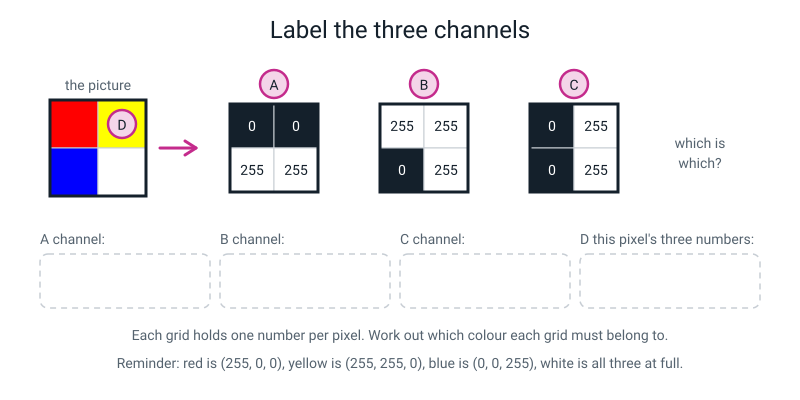
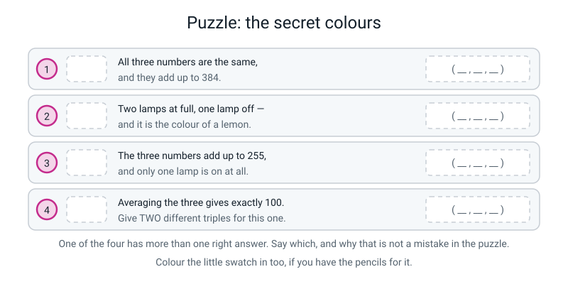
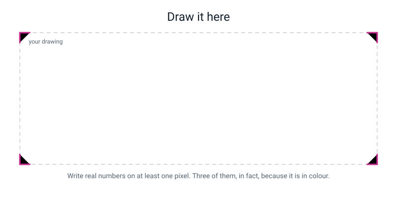

# Workbook — Week 24: Colour Is Three Grids Stacked

**Name:** ________________________________  **Date:** ______________

[📖 Read the chapter first](../student-guide/week-24.md) · [Course Home](../README.md)

---

## ✅ Warm-Up (5 min)

Five quick questions about **last week**. Try all five before you look anything up.

**W1.** A pixel holds **32**. Bright or dark? ____________  And a pixel holding **240**? ____________

**W2.** Why does a grayscale pixel stop at 255 and not 300?

________________________________________________________________

**W3.** A picture is 40 across and 25 down. How many pixels? ________ How many numbers in grayscale? ________

**W4.** True or false: *if you have all the numbers, you have the picture.*

Circle: **TRUE** / **FALSE**. What else do you need?

________________________________________________________________

**W5.** In a drawing of a letter, where do the grey in-between numbers end up, and why?

________________________________________________________________

---

## ✍️ Practice Set A — Understand It

**A1. Fill in the blanks.**

**RGB** stands for ______________, ______________ and ______________. A colour picture stores ______________ numbers for every pixel, and each one runs from ______ to ______.

One of the three grids on its own is called a ______________, and on its own it looks exactly like a ______________ picture.

```
   224 x 224 = ____________ pixels

   ____________ x 3 = ____________ numbers for one photo

   256 x 256 x 256 = ______________ possible colours for ONE pixel
```

When all three numbers are **equal**, the pixel is ______________ — which is not really a colour, it is a ______________.

---

**A2. Multiple choice — circle ONE each time.**

(i) (0, 255, 255) is:

&nbsp;&nbsp;&nbsp;(a) yellow &nbsp;&nbsp; (b) cyan / sky blue &nbsp;&nbsp; (c) magenta &nbsp;&nbsp; (d) dark green

(ii) A picture is 10 pixels across and 10 down, **in colour**. How many numbers?

&nbsp;&nbsp;&nbsp;(a) 100 &nbsp;&nbsp; (b) 30 &nbsp;&nbsp; (c) 300 &nbsp;&nbsp; (d) 1000

(iii) Shrinking a 12 × 12 grid by averaging 2 × 2 blocks gives you:

&nbsp;&nbsp;&nbsp;(a) 6 × 6 &nbsp;&nbsp; (b) 10 × 10 &nbsp;&nbsp; (c) 3 × 3 &nbsp;&nbsp; (d) 144 × 4

(iv) On a screen, (255, 255, 0) is:

&nbsp;&nbsp;&nbsp;(a) brown &nbsp;&nbsp; (b) white &nbsp;&nbsp; (c) yellow &nbsp;&nbsp; (d) orange

---

**A3. True or false — and explain.**

> "Your teacher is wrong: red and green make brown, not yellow."

Circle one: **TRUE** / **FALSE**

Explain — and be careful, because there is a right answer that says "both".

________________________________________________________________

________________________________________________________________

________________________________________________________________

---

**A4. Match the pairs.** Write the letter of the meaning next to each word.

| Word | Letter | | | Meaning |
|---|---|---|---|---|
| RGB | ______ | | **A** | Making a picture smaller by replacing each block with its average |
| channel | ______ | | **B** | The grey in-between pixels along a boundary |
| downsampling | ______ | | **C** | Three numbers per pixel: how much red, green and blue |
| anti-aliasing | ______ | | **D** | What you get when all three numbers are equal |
| grey | ______ | | **E** | One of the three grids, on its own |

---

**A5. Label the diagram.**

Three number grids came out of one colour picture, but nobody labelled them. Work out which channel each one is, and write the yellow pixel's three numbers.


*Figure W24.1 — A four-pixel colour picture: red, yellow, blue and white. Which grid is which?*

Then two more from the same figure:

(e) How did you work out grid **A**? Which pixel gave it away?

________________________________________________________________

(f) Two of the three grids contain a 0 in exactly **two** places. Pick one: which grid, and which two pixels?

________________________________________________________________

---

**A6. Sort them.** Tick one column for each triple.

| Triple | It's a grey | It has a colour |
|---|---|---|
| (128, 128, 128) | ☐ | ☐ |
| (255, 255, 0) | ☐ | ☐ |
| (30, 30, 30) | ☐ | ☐ |
| (200, 80, 40) | ☐ | ☐ |
| (200, 200, 200) | ☐ | ☐ |
| (0, 128, 128) | ☐ | ☐ |
| (99, 99, 99) | ☐ | ☐ |
| (100, 100, 101) | ☐ | ☐ |

The last one is a trick. Explain it: ____________________________________

________________________________________________________________

---

## ✍️ Practice Set B — Use It

**B1. Average four blocks.** Show the sum and the division. Round to the nearest whole number; **.5 rounds up.**

| Block | The four values | Sum | ÷ 4 | Rounded |
|---|---|---|---|---|
| (a) | 255, 255, 255, 255 | | | |
| (b) | 0, 0, 128, 128 | | | |
| (c) | 192, 64, 255, 0 | | | |
| (d) | 255, 128, 192, 64 | | | |

Which of the four needed **no arithmetic at all**, and why is skipping it legitimate rather than lazy?

________________________________________________________________

---

**B2. Shrink this grid twice.**

```
     0     0   255  255
     0     0   255  255
     0   128  255  255
   128  255  255  255
```

(a) Draw the block borders **before** you do any arithmetic. How many blocks? ________

(b) Work out the 2 × 2. Show every sum.

```
   top-left:      ______ + ______ + ______ + ______ = ______  ; ÷ 4 = ______  ->  ______

   top-right:     ______ + ______ + ______ + ______ = ______  ; ÷ 4 = ______  ->  ______

   bottom-left:   ______ + ______ + ______ + ______ = ______  ; ÷ 4 = ______  ->  ______

   bottom-right:  ______ + ______ + ______ + ______ = ______  ; ÷ 4 = ______  ->  ______
```

The 2 × 2 result:  ______  ______
&nbsp;&nbsp;&nbsp;&nbsp;&nbsp;&nbsp;&nbsp;&nbsp;&nbsp;&nbsp;&nbsp;&nbsp;&nbsp;&nbsp;&nbsp;&nbsp;&nbsp;&nbsp;&nbsp;&nbsp;&nbsp;&nbsp;&nbsp;&nbsp;&nbsp;&nbsp;&nbsp;&nbsp;______  ______

(c) Now shrink the 2 × 2 to a single number: ______ + ______ + ______ + ______ = ______ ; ÷ 4 = ______ → ______

(d) Name **one specific thing** that stopped existing at each step. Not "it got blurrier".

4 × 4 → 2 × 2: ____________________________________________________

2 × 2 → 1: ____________________________________________________

(e) Can you get the original 4 × 4 back from that single number? Prove your answer by writing **two different** 2 × 2 blocks that would both have produced it.

```
   ( ______ , ______ , ______ , ______ )  sum ______  ÷ 4 = ______

   ( ______ , ______ , ______ , ______ )  sum ______  ÷ 4 = ______
```

---

**B3. Here is a situation — what goes wrong, and why?**

> Maya is averaging blocks. For the block holding **255, 255, 0, 0** she writes:
> `(255 + 255) ÷ 2 = 255`
> and moves on. She does the same thing for every block on the grid.

(a) What did she actually do? ____________________________________

(b) What is the correct answer for that block? ______ + ______ + ______ + ______ = ______ ; ÷ 4 = ______ → ______

(c) How wrong is she, in numbers, and what did that mistake do to the picture?

________________________________________________________________

________________________________________________________________

(d) What single step, done **before** any arithmetic, would have prevented this?

________________________________________________________________

---

**B4. Here is a situation — what goes wrong, and why?**

> A shop's security camera records a face at very low resolution — the whole face covers about 3 × 3 pixels. The shop runs it through a phone app that produces a **sharp, clear, completely recognisable face**. They show it to the police and say "that's the person who took it."

(a) Is the app lying about what it is showing them? ____________

(b) So what is the app actually doing? ____________________________________

(c) Give the **arithmetic** reason why this cannot be a recovery of the original face:

________________________________________________________________

________________________________________________________________

(d) What is the honest thing for the shop to say about that picture?

________________________________________________________________

(e) Would a better computer help? Explain.

________________________________________________________________

---

**B5. Mark somebody else's work.** Here is another student's colour homework. Find **four** faults and write the fix.

```
COLOUR BY NUMBERS

1   (255, 255, 0)   = white,    because all the numbers are high
2   (150,  75, 0)   = orange,   because red is the biggest
3   brown           = (255, 140, 60)
4   pale blue       = (0, 0, 100)
```

| # | Why it's a fault | The fix |
|---|---|---|
| 1 | | |
| 2 | | |
| 3 | | |
| 4 | | |

Which one shows the **deepest** misunderstanding, and what is the misunderstanding?

________________________________________________________________

________________________________________________________________

---

## 🧩 Puzzle of the Week


*Figure W24.2 — Four clues. Colour the little swatch in too, if you have the pencils.*

**Clue 1.** All three numbers are the same, and they add up to 384.

( ______ , ______ , ______ ) = ____________________

Working: ____________________________________

**Clue 2.** Two lamps at full, one lamp off — and it is the colour of a lemon.

( ______ , ______ , ______ ) = ____________________

**Clue 3.** The three numbers add up to 255, and only one lamp is on at all.

( ______ , ______ , ______ ) = ____________________

**Clue 4.** Averaging the three numbers gives exactly 100. Give **two different** triples.

( ______ , ______ , ______ )   and   ( ______ , ______ , ______ )

Working: the three numbers must add up to ______

**P5.** One clue has **more than one right answer even though it does not say so.** Which one, and why is that not a mistake in the puzzle?

________________________________________________________________

________________________________________________________________

**P6.** Clue 4 is a tiny version of something big from this week. What?

________________________________________________________________

---

## 🤔 Think Deeper

**T1.** An app that "un-blurs" a photo is not lying about what it shows you — but it is not recovering anything either.

Write a paragraph about the difference between **generating** detail and **recovering** it. Where does that difference stop being interesting and start mattering? Name a situation where treating a generated picture as a real one would do actual harm.

________________________________________________________________

________________________________________________________________

________________________________________________________________

________________________________________________________________

________________________________________________________________

________________________________________________________________

---

**T2.** A screen can make 16,777,216 different colours, and nobody can see anywhere near that many.

Write a paragraph on why that is a sensible design rather than a waste. What would go wrong with, say, 32 levels per channel instead of 256? And what does your answer tell you about the reason 256 was chosen?

________________________________________________________________

________________________________________________________________

________________________________________________________________

________________________________________________________________

________________________________________________________________

---

## 🛠️ Build It

### Part 1 — Colour by numbers, both directions (15 min)

**Direction 1 — name the colour, and give one short reason.** The reason is half the mark: "yellow" earns nothing, *"yellow — red and green lamps both on"* is the answer.

| # | Triple | Colour | Reason (which lamps are on?) |
|---|---|---|---|
| 1 | (0, 255, 0) | | |
| 2 | (255, 128, 0) | | |
| 3 | (128, 0, 128) | | |
| 4 | (0, 0, 0) | | |
| 5 | (255, 255, 255) | | |
| 6 | (100, 100, 100) | | |
| 7 | (255, 200, 200) | | |
| 8 | (0, 128, 128) | | |

**Direction 2 — invent a plausible triple.** There is often **no single right answer**. What is being judged is the *shape* — which lamps are high, which are low.

| Colour | R | G | B | Why I chose those |
|---|---|---|---|---|
| red | | | | |
| cyan | | | | |
| magenta | | | | |
| middle grey | | | | |
| brown | | | | |
| pale blue | | | | |
| dark grey | | | | |
| yellow | | | | |

**Two rules to check yourself against before you hand this in:**

- Turning a colour **down** makes it browner. Brown must have **nothing near 255**.
- Turning the other two lamps **up** makes it paler. "Pale blue" means push R and G up — **not** turn B down.

---

### Part 2 — Shrink a grid (25 min)

Here is a 12 × 12 grid. It is the letter **T**, drawn with a soft pencil.

```
        c1   c2   c3   c4   c5   c6   c7   c8   c9  c10  c11  c12
   r1   255  255  255  255  255  255  255  255  255  255  255  255
   r2   255  128   0    0    0    0    0    0    0    0   128  255
   r3   255  128   0    0    0    0    0    0    0    0   128  255
   r4   255  255  192  192  192   0    0   192  192  192  255  255
   r5   255  255  255  255   64   0    0    64  255  255  255  255
   r6   255  255  255  255   64   0    0    64  255  255  255  255
   r7   255  255  255  255   64   0    0    64  255  255  255  255
   r8   255  255  255  255   64   0    0    64  255  255  255  255
   r9   255  255  255  255   64   0    0    64  255  255  255  255
   r10  255  255  255  255   64   0    0    64  255  255  255  255
   r11  255  255  255  255   64   0    0    64  255  255  255  255
   r12  255  255  255  255  255  255  255  255  255  255  255  255
```

**Step checklist. Tick in order and do not skip ahead.**

- [ ] Drawn the **heavy block borders** — every two columns and every two rows — **before any arithmetic**
- [ ] Numbered the block rows 1–6 and block columns 1–6
- [ ] Worked left to right, top row of blocks first, **skipping nothing**
- [ ] Written the sum **and** the division for every block that is not four identical numbers
- [ ] Rounded to the nearest whole number, **.5 rounds up**
- [ ] Stopped after each row of blocks and written down one specific thing that got worse

**How many blocks in a 12 × 12?** ______ × ______ = ________ blocks, so 144 numbers become ________.

**My 6 × 6 result:**

| | C1 | C2 | C3 | C4 | C5 | C6 |
|---|---|---|---|---|---|---|
| **R1** | | | | | | |
| **R2** | | | | | | |
| **R3** | | | | | | |
| **R4** | | | | | | |
| **R5** | | | | | | |
| **R6** | | | | | | |

**Full working for four blocks.** Pick **interesting** ones — the blocks on the edge of the letter, not four identical 255s.

```
   Block ______ :  ______ + ______ + ______ + ______ = ______  ;  ÷ 4 = ______  ->  ______

   Block ______ :  ______ + ______ + ______ + ______ = ______  ;  ÷ 4 = ______  ->  ______

   Block ______ :  ______ + ______ + ______ + ______ = ______  ;  ÷ 4 = ______  ->  ______

   Block ______ :  ______ + ______ + ______ + ______ = ______  ;  ÷ 4 = ______  ->  ______
```

**How many of the 36 blocks were four identical 255s?** ________ *(You may write those straight down.)*

**Now shrink the 6 × 6 to a 3 × 3.** Only nine blocks.

| | | | |
|---|---|---|---|
| | | | |
| | | | |
| | | | |

---

### Part 3 — What was lost (10 min)

**Going from 12 × 12 to 6 × 6 — write THREE specific losses.** "It got blurrier" earns nothing.

1. ______________________________________________________________

________________________________________________________________

2. ______________________________________________________________

________________________________________________________________

3. ______________________________________________________________

________________________________________________________________

**Going from 6 × 6 to 3 × 3 — write TWO specific losses.**

1. ______________________________________________________________

________________________________________________________________

2. ______________________________________________________________

________________________________________________________________

**And the one sentence that matters. Can you get the 12 × 12 back from the 3 × 3, and why?**

________________________________________________________________

________________________________________________________________

________________________________________________________________

---

## 🎨 Draw It

Draw **one single colour pixel** pulled apart into its three numbers — big enough to fill the frame — and then, beside it, the same pixel after it has been averaged together with three neighbours.


*Figure W24.3 — Your page.*

> **What a good answer might look like:** on the left, one large square coloured orange, with three arrows coming out of it leading to three small labelled boxes: **R = 255**, **G = 140**, **B = 0**, each box shaded to show that value as a grey. A caption underneath: *"one pixel, three numbers, each 0–255."* On the right, a 2 × 2 block of four orange-ish squares with their R values written in — 255, 200, 180, 165 — a big arrow, and one new square holding **200**, with the working shown: *255 + 200 + 180 + 165 = 800, ÷ 4 = 200*. Underneath, one line: *"four numbers became one, and there are about 1.8 million blocks that would give 200."*
>
> **What a weak answer looks like:** a rainbow, with the letters R, G and B written under it. There are no numbers, so nothing on the page can be checked, and a rainbow is not what RGB is — RGB is three lamps, not a spectrum. If your page has no number on it between 0 and 255, start again.

---

## 📊 Self-Check

| I can… | 😀 got it | 🙂 nearly | 😕 not yet |
|---|---|---|---|
| Explain RGB as three stacked channels, one number each per pixel | ☐ | ☐ | ☐ |
| Work out how many numbers a colour photo holds | ☐ | ☐ | ☐ |
| Name the colour a triple makes, and invent a triple for a named colour | ☐ | ☐ | ☐ |
| Explain the paint-versus-lamp difference in my own words | ☐ | ☐ | ☐ |
| Downsample a grid by averaging 2 × 2 blocks, showing the division | ☐ | ☐ | ☐ |
| Say exactly what downsampling destroys, and prove it cannot be undone | ☐ | ☐ | ☐ |

One thing I'd like explained again:

________________________________________________________________

---

## ✅ Answers

<details>
<summary>Check your answers</summary>

### Warm-Up

**W1.** 32 is **dark** — very dark, near black. 240 is **bright** — nearly white. The number counts light.

**W2.** Because one **byte** of memory holds exactly 256 different values: 0, 1, 2, … 255. It stops at 255 because that is where one byte runs out. If a calculation gives 300, the software squashes it back to 255.

**W3.** 40 × 25 = **1,000 pixels**, and **1,000 numbers** — grayscale is one number per pixel.

**W4.** **FALSE.** You also need **the order they come in and how wide the grid is.** A number carries no record of where it belongs. All the numbers with no arrangement is a pile, not a picture.

**W5.** On the **boundary** of the letter, tracing its outline — and essentially nowhere else. Because that is where the drawn line **cuts through** a square, leaving it genuinely part-covered, so neither 0 nor 255 is honest. The middle of a stroke is all pencil; the background is all paper. *(This week that grey got its name: anti-aliasing.)*

---

### Practice Set A

**A1.** **Red**, **Green**, **Blue** · **three** numbers per pixel · each from **0** to **255** · one grid is a **channel** · it looks like a **grayscale** picture.

```
   224 x 224 = 50,176 pixels
   50,176 x 3 = 150,528 numbers for one photo
   256 x 256 x 256 = 16,777,216 possible colours for ONE pixel
```

All three equal → the pixel is **grey**, which is not really a colour, it is a **tie**.

**A2.** (i) **(b) cyan / sky blue** — green and blue lamps both on, red off. (ii) **(c) 300** — 10 × 10 = 100 pixels, × 3 channels = 300 numbers. *(100 is the pixel count; a student who answers 100 has forgotten the three channels.)* (iii) **(a) 6 × 6** — each block is 2 across and 2 down, so 6 blocks across and 6 rows of blocks. *(3 × 3 is what you get if you do it **twice**.)* (iv) **(c) yellow** — red lamp full, green lamp full, blue off.

**A3.** **FALSE** — but the full answer is "**both are right, about different things**", and an answer that only says "no, it's yellow" has memorised the fact and not the argument.

**Paint takes light away.** White paper bounces back all the light landing on it. Red paint absorbs everything except the red; green paint absorbs everything except the green. Put both on the same spot and between them they absorb nearly everything, so hardly any light returns to your eye — dark, muddy brown. With paint, a second colour always means **less** light.

**A screen adds light.** It starts black and *makes* light. Red lamp on: red light arrives. Green lamp on as well: now red light **and** green light arrive at the same place and your eye adds them. Red plus green light is what your eye calls **yellow**. With lamps, a second colour always means **more** light.

Same two colours, opposite results, because one machine subtracts light and the other adds it.

**A4.** RGB = **C** · channel = **E** · downsampling = **A** · anti-aliasing = **B** · grey = **D**.

**A5.**

- **Grid A** (0, 0 / 255, 255) = the **BLUE** channel.
- **Grid B** (255, 255 / 0, 255) = the **RED** channel.
- **Grid C** (0, 255 / 0, 255) = the **GREEN** channel.
- **D**, the yellow pixel = **(255, 255, 0)**.

How to work it out: write the four colours out as triples first.

```
   red    = (255,   0,   0)        yellow = (255, 255,   0)
   blue   = (  0,   0, 255)        white  = (255, 255, 255)
```

Now read the **first** number of each: 255, 255, 0, 255 — that is grid B, so B is red. The **second** numbers: 0, 255, 0, 255 — that is grid C, so C is green. The **third** numbers: 0, 0, 255, 255 — that is grid A, so A is blue.

(e) The giveaway for grid A is the **blue pixel** (bottom-left). It is the only channel where the bottom-left cell is 255 while the top-left is 0. In the red channel the top-left is 255 (red uses full red); in the green channel it is 0 in both left-hand cells.

(f) The **green channel (grid C)** has a 0 in exactly two places — the **red** pixel and the **blue** pixel, because neither of those uses any green. *(The blue channel also has two 0s — the red and yellow pixels — so "grid A" is an equally correct answer if you name the right two pixels, and either grid earns the mark. The red channel has only one 0.)*

**A6.**

| Triple | Verdict | Why |
|---|---|---|
| (128, 128, 128) | **grey** | all three equal — middle grey |
| (255, 255, 0) | **has a colour** | blue is off, so it is yellow, not a tie |
| (30, 30, 30) | **grey** | equal, and very dark |
| (200, 80, 40) | **has a colour** | most red, some green, least blue — a warm brown-orange |
| (200, 200, 200) | **grey** | equal, and light |
| (0, 128, 128) | **has a colour** | green and blue tie with each other but red is off — teal |
| (99, 99, 99) | **grey** | equal |
| (100, 100, 101) | **has a colour** | *technically* — see below |

**The trick:** (100, 100, 101) is **not** a tie, so strictly it is not grey — the blue lamp is one step brighter than the others, so it is the faintest possible blue-grey. But **no human being alive could see the difference** between it and (100, 100, 100). Both answers earn the mark if you explain it. The useful lesson is that *"all three equal = grey"* is a rule about **numbers**, and your eye's version of the rule is much rougher than the arithmetic.

---

### Practice Set B

**B1.**

| Block | The four values | Sum | ÷ 4 | Rounded |
|---|---|---|---|---|
| (a) | 255, 255, 255, 255 | 1,020 | 255 | **255** |
| (b) | 0, 0, 128, 128 | 256 | 64 | **64** |
| (c) | 192, 64, 255, 0 | 511 | 127.75 | **128** |
| (d) | 255, 128, 192, 64 | 639 | 159.75 | **160** |

**(a) needed no arithmetic.** If all four numbers are identical, the average is that number — averaging four copies of something cannot possibly change it. That is not a shortcut being tolerated, it is **correct reasoning**, and noticing it is worth credit. (It also saves you about sixteen divisions in Part 2.)

*Handy trick for the rest:* ÷ 4 is halve, then halve again. 1020 → 510 → 255.

**B2.**

(a) 2 blocks across × 2 rows of blocks = **4 blocks**.

(b)
```
   top-left:        0 +   0 +   0 +   0 =    0  ; ÷ 4 =   0     ->    0
   top-right:     255 + 255 + 255 + 255 = 1020  ; ÷ 4 = 255     ->  255
   bottom-left:     0 + 128 + 128 + 255 =  511  ; ÷ 4 = 127.75  ->  128
   bottom-right:  255 + 255 + 255 + 255 = 1020  ; ÷ 4 = 255     ->  255
```

```
   2 x 2 result:      0   255
                    128   255
```

(c) 0 + 255 + 128 + 255 = **638** ; ÷ 4 = 159.5 → **160**

(d) Specific losses:

- **4 × 4 → 2 × 2:** the **staircase** on the diagonal edge is gone. The original had a stepped boundary running from bottom-left to top-right, with 128s marking where it cut through squares. Now there is a single 128 in one corner, and you cannot tell whether the edge was a step, a slope or a smudge.
- **2 × 2 → 1:** **the edge itself is gone.** 160 is a plain mid-grey. There is no dark side and no light side. A picture that was half black and half white has become one grey square — and 160 is not even halfway, because the dark corner was smaller than the light region.

(e) The single number is 160, so the four numbers must add to 4 × 160 = **640**. Two different blocks:

```
   ( 160, 160, 160, 160 )   sum 640   ÷ 4 = 160      a flat grey patch
   (   0, 130, 255, 255 )   sum 640   ÷ 4 = 160      a hard edge
```

Both give 160. So **no**, you cannot get the original back: the number does not carry enough information to say which of them it was. *(Any four numbers from 0 to 255 that add to 640 is a correct answer.)*

**B3.**

(a) She **averaged only the top pair**. She added two numbers and divided by two, forgetting that the block is 2 across **and** 2 down, so it holds **four** numbers.

(b) 255 + 255 + 0 + 0 = **510** ; ÷ 4 = 127.5 → **128**

(c) She wrote **255** where the answer is **128** — she is **127 too bright**, which is half the entire brightness range. And what it did to the picture is worse than the size of the error suggests: her block held a **hard edge**, half black and half white, and she recorded it as **pure white**. The whole dark half of that block vanished. Do that to every block and her shrunk picture is a blank white rectangle with the picture deleted.

(d) **Draw the heavy block borders on the grid before doing any arithmetic** — every two columns and every two rows. Then circle the four numbers before adding them. It is the step people skip and it is the step that prevents exactly this error.

**B4.**

(a) **No.** The app really is showing them a sharp picture, and it is not pretending to be anything other than an app that sharpens pictures.

(b) It is **inventing** plausible detail. A model that has seen millions of faces guesses what a face-ish blur was probably made of, and paints that in.

(c) Because a single shrunk number could have come from an enormous number of different blocks. A pixel holding 100 could have come from **8,752,741** different sets of four numbers between 0 and 255. Every one of them is equally consistent with the number that survived. **The app has no way to choose**, so it does not choose on evidence — it chooses on what is *typical*, which is a guess about faces in general, not about this face.

(d) Something like: *"this is a computer's guess at what a face like that might have looked like. It is not a photograph of anyone, and it must not be used to identify a person."*

(e) **No.** A faster computer would face exactly the same 8,752,741 options and have exactly the same no way of choosing. This is not a limit of computers; it is a fact about arithmetic. The information was **deleted**, not hidden — burnt, not locked in a drawer.

**B5.**

| # | Why it's a fault | The fix |
|---|---|---|
| 1 | (255, 255, 0) is **yellow**, not white. "All the numbers are high" is not true — blue is **0**. White needs all **three** at full | **yellow** — red and green lamps on, blue off. White is (255, 255, 255) |
| 2 | The *shape* of the reason is right (R biggest, G about half, B zero) but every lamp is **turned down** — nothing is near 255. A dimmed orange is **brown** | **brown** — a dark orange. Orange itself is about (255, 140, 0) |
| 3 | (255, 140, 60) is far too bright to be brown — it is a light orange. Brown must have **nothing near 255** | about **(150, 75, 0)** |
| 4 | (0, 0, 100) is a **dark** blue, not a pale one. "Pale" does not mean turning the colour down | about **(180, 220, 255)** — push R and G **up**, washing it towards white |

**The deepest misunderstanding is number 4.** Faults 1, 2 and 3 are all about reading numbers carefully. Fault 4 is a wrong idea about how colour *works*: it assumes "paler" means "less", when on a screen paler means **more light in the other two channels.** Get that wrong and you cannot produce pink, cream, pale blue, lilac or any pastel at all — a large part of the colour space is unreachable.

*(Fault 2 is a close second, and it is worth being kind about: (150, 75, 0) really is orange-shaped. The student just has not yet learned that brown **is** a dark orange.)*

---

### Puzzle of the Week

**Clue 1.** All three the same, adding to 384. So each one is 384 ÷ 3 = **128**.

**(128, 128, 128) = middle grey.** All three equal is a tie, and 128 is halfway up the range.

**Clue 2.** Two lamps at full, one off, colour of a lemon → **(255, 255, 0) = yellow.** Red and green at full, blue off. *(The other two "two-at-full" answers are cyan (0, 255, 255) and magenta (255, 0, 255) — the lemon is what rules those out.)*

**Clue 3.** Only one lamp is on, and the three add to 255, so that one lamp must be at **255** and the other two at 0. So it is one of:

```
   (255,   0,   0)  =  red
   (  0, 255,   0)  =  green
   (  0,   0, 255)  =  blue
```

**All three are correct.** The clue does not say which lamp.

**Clue 4.** Average 100 means the three add up to **300**. Any two different triples summing to 300, for example:

```
   (100, 100, 100)  ->  100      a middling grey
   (255,  45,   0)  ->  100      a bright orange-red
   (  0, 150, 150)  ->  100      a teal
```

**P5.** **Clue 3** is the one with more than one answer without saying so. It is not a mistake in the puzzle — it is the point. The clue genuinely does not contain enough information to pin down the answer, and **noticing that a clue is not enough is a real skill.** In science you meet under-specified questions constantly, and the correct response is "here are the three possibilities and here is what extra fact would decide it", not picking one and hoping.

*(Clue 4 also has many answers, but it says so — it asks you for two.)*

**P6.** Clue 4 is the **one-way door**, one pixel wide. Three numbers went in and one came out, and there is no way back: a grey pixel of 100 could have come from a grey, a bright orange-red or a teal. It is exactly the same argument as *"you cannot get the 12 × 12 back from the 3 × 3"*, just with three numbers instead of four.

---

### Think Deeper

**T1. Model answer:**

> **Recovering** means getting back what was actually there. **Generating** means producing something that could plausibly have been there. They can look identical on the screen, and that is exactly the problem — the picture does not come with a label saying which one it is.
>
> The arithmetic is what settles it. A shrunk pixel holding 100 is consistent with millions of different originals, so nothing can pick out the true one. An app that produces a sharp face is therefore not choosing on evidence about **this** face; it is choosing on what faces **usually** look like. It will fill in the commonest nose, the commonest eye shape, the commonest skin tone — which means it can be confidently, plausibly wrong.
>
> It stops being interesting and starts mattering the moment somebody uses the picture as **evidence about a person**. A sharpened CCTV face used to accuse somebody, or an invented number plate used to issue a fine, is a machine's guess about what is typical being treated as a fact about an individual. And the guess will be least reliable for whoever is least typical of the photos the app was trained on — which is not a random unfairness, it is a predictable one.

*Full marks needs:* the definition of both words · the arithmetic reason (many originals, one number) · and a **named** situation with real consequences, ideally noticing that the errors are not evenly spread.

**T2. Model answer:**

> The point is not that you can see 16.7 million colours. It is that you cannot see the **steps** between them.
>
> With only 32 levels per channel, a smooth sunset would come out as visible stripes — bands of flat colour with hard lines between them, where the real sky changes gradually. You would notice that instantly, and it would look broken. The eye is very bad at judging *which* grey a patch is on its own, and very good at spotting a **join** between two nearly identical greys sitting side by side. So the number of levels you need is set by that second ability, not the first.
>
> So 256 was not chosen to be impressive. It was chosen to be **enough for everyday pictures**, so that the steps nearly disappear and the sky looks smooth (in very smooth, dark gradients faint bands can still show, which is why some screens use more levels) — and because 256 values is exactly what one byte holds, which makes it free. The engineering and the eye happened to agree.

*Full marks needs:* that the eye detects **steps/joins** rather than absolute values · that too few levels produces visible banding · and that 256 is "enough on purpose", helped by the byte.

---

### Build It — Part 1

**Direction 1.** One reason each; the reason is half the mark.

| # | Triple | Colour | Reason |
|---|---|---|---|
| 1 | (0, 255, 0) | **green** | only the green lamp is on |
| 2 | (255, 128, 0) | **orange** | red full, green about halfway, blue off |
| 3 | (128, 0, 128) | **purple / violet** | red and blue equal and mid, green off |
| 4 | (0, 0, 0) | **black** | all three lamps off |
| 5 | (255, 255, 255) | **white** | all three at full |
| 6 | (100, 100, 100) | **mid-dark grey** | all three equal (a tie), a bit below halfway |
| 7 | (255, 200, 200) | **pale pink** | red full, green and blue high — a red washed towards white |
| 8 | (0, 128, 128) | **teal / dark cyan** | green and blue equal and mid, red off |

**Direction 2.** Model answers. Accept any triple with the right **shape** — these are one correct point in a correct range.

| Colour | Model triple | What must be true to be correct |
|---|---|---|
| red | (255, 0, 0) | R high, G and B at or near 0 |
| cyan | (0, 255, 255) | G and B high and roughly equal, R low |
| magenta | (255, 0, 255) | R and B high and roughly equal, G low |
| middle grey | (128, 128, 128) | all three equal, mid-range |
| brown | (150, 75, 0) | R largest, G roughly half of R, B lowest, **nothing near 255** |
| pale blue | (180, 220, 255) | B highest, **all three fairly high** — washed towards white |
| dark grey | (60, 60, 60) | all three equal and low, but not 0 |
| yellow | (255, 255, 0) | R and G high, B low |

**The two that reveal real understanding are brown and pale blue.** Brown requires you to know it is a *dimmed* orange. Pale blue requires you to know that "pale" means pushing the **other two** channels up, not turning blue down. Get those two right and you have understood additive colour; the rest can be read off the table of eight.

---

### Build It — Part 2

**36 blocks** (6 across × 6 down), so 144 numbers become **36**.

**All 36 block averages.** Blocks are named by block-row then block-column: B23 is block-row 2, block-column 3, covering image rows 3–4 and columns 5–6.

| Block | Four values | Sum | ÷ 4 | Rounded |
|---|---|---:|---:|---:|
| B11 | 255, 255, 255, 128 | 893 | 223.25 | **223** |
| B12 | 255, 255, 0, 0 | 510 | 127.5 | **128** |
| B13 | 255, 255, 0, 0 | 510 | 127.5 | **128** |
| B14 | 255, 255, 0, 0 | 510 | 127.5 | **128** |
| B15 | 255, 255, 0, 0 | 510 | 127.5 | **128** |
| B16 | 255, 255, 128, 255 | 893 | 223.25 | **223** |
| B21 | 255, 128, 255, 255 | 893 | 223.25 | **223** |
| B22 | 0, 0, 192, 192 | 384 | 96 | **96** |
| B23 | 0, 0, 192, 0 | 192 | 48 | **48** |
| B24 | 0, 0, 0, 192 | 192 | 48 | **48** |
| B25 | 0, 0, 192, 192 | 384 | 96 | **96** |
| B26 | 128, 255, 255, 255 | 893 | 223.25 | **223** |
| B31 | 255, 255, 255, 255 | 1020 | 255 | **255** |
| B32 | 255, 255, 255, 255 | 1020 | 255 | **255** |
| B33 | 64, 0, 64, 0 | 128 | 32 | **32** |
| B34 | 0, 64, 0, 64 | 128 | 32 | **32** |
| B35 | 255, 255, 255, 255 | 1020 | 255 | **255** |
| B36 | 255, 255, 255, 255 | 1020 | 255 | **255** |
| B41 | 255, 255, 255, 255 | 1020 | 255 | **255** |
| B42 | 255, 255, 255, 255 | 1020 | 255 | **255** |
| B43 | 64, 0, 64, 0 | 128 | 32 | **32** |
| B44 | 0, 64, 0, 64 | 128 | 32 | **32** |
| B45 | 255, 255, 255, 255 | 1020 | 255 | **255** |
| B46 | 255, 255, 255, 255 | 1020 | 255 | **255** |
| B51 | 255, 255, 255, 255 | 1020 | 255 | **255** |
| B52 | 255, 255, 255, 255 | 1020 | 255 | **255** |
| B53 | 64, 0, 64, 0 | 128 | 32 | **32** |
| B54 | 0, 64, 0, 64 | 128 | 32 | **32** |
| B55 | 255, 255, 255, 255 | 1020 | 255 | **255** |
| B56 | 255, 255, 255, 255 | 1020 | 255 | **255** |
| B61 | 255, 255, 255, 255 | 1020 | 255 | **255** |
| B62 | 255, 255, 255, 255 | 1020 | 255 | **255** |
| B63 | 64, 0, 255, 255 | 574 | 143.5 | **144** |
| B64 | 0, 64, 255, 255 | 574 | 143.5 | **144** |
| B65 | 255, 255, 255, 255 | 1020 | 255 | **255** |
| B66 | 255, 255, 255, 255 | 1020 | 255 | **255** |

**The 6 × 6 result:**

```
        C1   C2   C3   C4   C5   C6
   R1   223  128  128  128  128  223
   R2   223   96   48   48   96  223
   R3   255  255   32   32  255  255
   R4   255  255   32   32  255  255
   R5   255  255   32   32  255  255
   R6   255  255  144  144  255  255
```

**Blocks that were four identical 255s: 16 of the 36.** You may write those straight down with no working — and a student who *notices* that and says why should be credited for it.

**The four blocks worth showing full working for** (they are the only genuinely interesting ones):

```
   B11 (top-left corner):         255 + 255 + 255 + 128 = 893  ;  893 ÷ 4 = 223.25 -> 223
   B12 (middle of the crossbar):  255 + 255 +   0 +   0 = 510  ;  510 ÷ 4 = 127.5  -> 128
   B23 (just under the crossbar):   0 +   0 + 192 +   0 = 192  ;  192 ÷ 4 = 48
   B33 (middle of the stem):       64 +   0 +  64 +   0 = 128  ;  128 ÷ 4 = 32
```

**Then the 3 × 3**, averaging 2 × 2 blocks of the 6 × 6 above:

| Block | Four values | Sum | ÷ 4 | Rounded |
|---|---|---:|---:|---:|
| top-left | 223, 128, 223, 96 | 670 | 167.5 | **168** |
| top-middle | 128, 128, 48, 48 | 352 | 88 | **88** |
| top-right | 128, 223, 96, 223 | 670 | 167.5 | **168** |
| middle-left | 255, 255, 255, 255 | 1020 | 255 | **255** |
| centre | 32, 32, 32, 32 | 128 | 32 | **32** |
| middle-right | 255, 255, 255, 255 | 1020 | 255 | **255** |
| bottom-left | 255, 255, 255, 255 | 1020 | 255 | **255** |
| bottom-middle | 32, 32, 144, 144 | 352 | 88 | **88** |
| bottom-right | 255, 255, 255, 255 | 1020 | 255 | **255** |

```
   3 x 3 result:      168   88  168
                      255   32  255
                      255   88  255
```

---

### Build It — Part 3

**Going from 12 × 12 to 6 × 6 — any three of these, at this level of specificity:**

1. **The crossbar stopped being black.** It was solid 0 all along the top; it is now a row of **128s**. You can no longer tell whether the original bar was black or a medium grey.
2. **The ends of the crossbar disappeared.** The 128s that marked where the bar stopped (columns 2 and 11) got averaged in with the white paper either side and became **223** — nearly indistinguishable from blank background.
3. **The faint bottom edge of the bar is gone as a separate thing.** The 192s in row 4 got mixed into the 96s and 48s. No square any longer says "the bar's edge was here."
4. **The stem got thinner *and* lighter, and you cannot separate the two.** It was two columns of 0 with a 64 either side; it is now two columns of **32**. Nothing in the 32s tells you whether the original stem was narrow and black or wide and grey.
5. **The exact width of the stem is unknowable.** 32 could have come from 64+0+64+0, or 32+32+32+32, or 0+0+128+0.

**Going from 6 × 6 to 3 × 3 — any two:**

1. **The crossbar is gone entirely.** The top row reads 168, 88, 168 — which says only "slightly darker in the middle at the top". There is no bar.
2. **You can no longer tell a T from an I, a plus sign, or a lollipop.** All four would produce a very similar 3 × 3. The letter's identity has stopped existing.
3. **The stem is one column wide**, so its real width — and whether it was even straight — is unrecoverable.
4. **The difference between ink and boundary grey has vanished.** Every dark square is now a blend of real pencil and edge grey, and nothing in the numbers separates them.

**The final sentence — can you get the 12 × 12 back from the 3 × 3?**

**No.** Each number in the 3 × 3 is the average of **sixteen** of the original numbers, and an enormous number of different sets of sixteen numbers average to the same value — so the 3 × 3 cannot possibly tell you which set it came from. 144 numbers became 9, and the other 135 were not hidden, they were **thrown away**.

**An excellent answer adds the honest complication:** *a computer could invent a plausible 12 × 12 that would shrink to exactly this 3 × 3, and it might look convincing — but it would be a guess, not the original, and you must never treat it as evidence.*

---

### Draw It

There is no single right drawing. A strong answer has **one pixel with three labelled numbers**, and **one block-average with the sum and the division written out**. Both halves are needed: the first shows you understand what colour *is*, the second shows you understand what shrinking *does*.

The test: is there at least one number between 0 and 255 on your page, and at least one division? If not, you have drawn a picture *about* this week rather than a diagram *of* it. Add the arithmetic — it is the part that can be checked.

</details>

---

[⬅ Week 23 workbook](week-23.md) · [📖 Week 24 chapter](../student-guide/week-24.md) · [Course Home](../README.md) · [Week 25 workbook ➡](week-25.md) · [Glossary](../../glossary.md)
