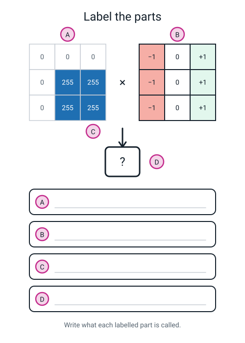
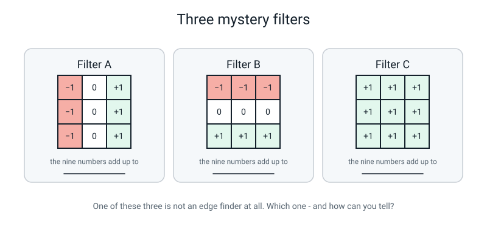
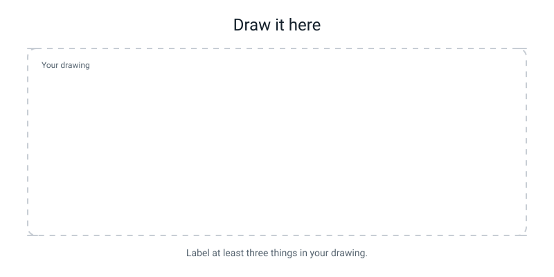

# Workbook — Week 25: Filters: The Little Grid That Finds Edges

**Name:** ________________________   **Date:** ______________

[📖 Read the chapter first](../student-guide/week-25.md) · [Course Home](../README.md)

> **What you need:** pencil, rubber, ruler, a calculator, and graph paper for the Build It task.
> **Time:** about 50 minutes. Do the Build It task last — it is the biggest piece.

---

## ✅ Warm-Up (5 min)

*From last week — colour, and the weeks just before it. No looking back.*

**W1.** A **colour** photo is 10 × 10 pixels. How many numbers is that altogether?

`________________________`

**W2.** Name the three grids that get stacked to make a colour image.

`________________`  `________________`  `________________`

**W3.** A pixel has red = 255, green = 255, blue = 0. What colour is it?

`________________________`

**W4.** You shrink a 12 × 12 photo down to 6 × 6 by averaging every 2 × 2 block. Can you turn the small one back into the original? **Yes / No** — and why?

`________________________________________________________`

**W5.** In a grey image, a pixel value of **0** means ______________ and a pixel value of **255** means ______________.

---

## ✍️ Practice Set A — Understand It

**A1. Fill in the blanks.**

A filter is a small grid of __________ numbers. You lay it on top of a patch of the picture, __________ each filter number by the pixel underneath it, and __________ up the nine answers.

The filter used in class says, in words: *"__________ column minus __________ column."*

The numbers in the middle column are all __________, which means those three pixels contribute exactly __________ to the answer.

**A2. Multiple choice.** A filter gives you an answer of **0**. Circle the best explanation.

- (a) There is nothing at all in that part of the picture.
- (b) The picture is *flat* there — the brightness did not change.
- (c) You have made an arithmetic mistake.
- (d) The pixel underneath the middle of the filter was 0.

**A3. True or false — and explain.** *"An answer of −600 is a weaker edge than an answer of +300."*

**TRUE / FALSE** (circle one)

Because: `________________________________________________________`

`________________________________________________________`

**A4. Match the pairs.** Draw a line from each patch to its answer. **Careful — two patches share an answer.**

| The 3 × 3 patch under the filter | | The vertical filter's answer |
|---|---|---|
| 1. All nine pixels are 255 | | (a) +765 |
| 2. Paper on the left, ink on the right, all three rows | | (b) −765 |
| 3. Ink on the left, paper on the right, all three rows | | (c) 0 |
| 4. All nine pixels are 0 | | (d) +510 |
| 5. Two ink pixels in the right column, none in the left | | |

**A5. Label the diagram.** Write the correct name in each lettered box.


*Figure W25.1 — Pixel patch, filter, and one output cell. Pin A to D, then write what each part does.*

Choose from: *the filter (kernel)* · *the nine pixels under the window* · *the column that gets subtracted* · *the one output cell*

**A6. Do the arithmetic.** Here is a 3 × 3 patch taken out of the class letter T. Fill in all three lines.

```
        c3    c4    c5
   r5   255   255   255
   r6     0     0   255
   r7     0     0   255
```

```
   right column (c5)  =  _____ + _____ + _____  =  __________

   left  column (c3)  =  _____ + _____ + _____  =  __________

   answer             =  __________ − __________  =  __________

   absolute value     =  __________        clipped  =  __________
```

---

## ✍️ Practice Set B — Use It

**B1. A new picture.** A camera looks at a dark stripe painted on a bright wall. The wall reads 220 and the stripe reads 20. The stripe is **two pixels wide**, in columns 2 and 3.

```
        c1    c2    c3    c4    c5
   r1  220    20    20   220   220
   r2  220    20    20   220   220
   r3  220    20    20   220   220
   r4  220    20    20   220   220
   r5  220    20    20   220   220
```

(i) How big is the answers grid? `_____ × _____`

(ii) Compute three cells using the shortcut:

| Cell | Right column sum | Left column sum | Answer | \|answer\| | Clipped |
|---|---|---|---|---|---|
| (3,2) | | | | | |
| (3,3) | | | | | |
| (3,4) | | | | | |

(iii) **Not one of those three came out as zero.** Why not? What is different about this stripe compared with the middle of the letter T?

`________________________________________________________`

`________________________________________________________`

**B2. What would go wrong?** Ravi has a 12 × 12 picture. He draws a 12 × 12 answers grid and starts filling it in from the very top-left corner.

What goes wrong, and at exactly which cell does he first get stuck?

`________________________________________________________`

`________________________________________________________`

**B3. What would go wrong?** Maya gets an answer of **−900**. She clips it first (anything over 255 becomes 255) and *then* takes the absolute value.

(i) What number does she end up with? `__________`

(ii) What number *should* she have? `__________`

(iii) Explain why clipping first does not work.

`________________________________________________________`

**B4. Predict.** Somebody photographs a plain white wall — nothing on it at all — twice. Once in a bright room, once in a dim room.

| | What the pixel values are roughly | What the filter gives, everywhere |
|---|---|---|
| Bright room | | |
| Dim room | | |

Why are the two filter answers the same even though the pixel values are completely different?

`________________________________________________________`

**B5. What would go wrong?** Sam says: *"The corners of the letter came out strongest because there is more ink in a corner."*

Sam is wrong twice over. Say why.

(i) About the ink: `________________________________________________`

(ii) About what the filter actually measures: `_____________________________`

`________________________________________________________`

---

## 🧩 Puzzle of the Week


*Figure W25.2 — Three filters. One finds vertical edges, one finds horizontal edges, and one finds no edges at all.*

**P1.** Add up the nine numbers in each filter and write the total on the line under it.

Filter A: `__________`  Filter B: `__________`  Filter C: `__________`

**P2.** One of these three is **not an edge finder at all**. Which one, and how can you tell just from the total?

`________________________________________________________`

**P3.** Which filter would find the **top edge of the bar** of the letter T — the place where paper meets ink going downwards?

`__________`

**P4.** Somebody switches a lamp on and every pixel in the picture gets 40 brighter. Which of the three filters give **exactly the same answer as before**, and which one changes?

Same as before: `__________`  Changes: `__________`

Why? `________________________________________________________`

---

## 🤔 Think Deeper

**T1.** We throw the minus sign away, and that really does destroy information — we can no longer tell which *direction* the brightness jumped. Was that a good trade? Write a paragraph. Say what we gained, what we lost, and describe one question you might want to ask a picture where you would need to *keep* the sign.

`________________________________________________________`

`________________________________________________________`

`________________________________________________________`

`________________________________________________________`

`________________________________________________________`

**T2.** Clipping makes a 1020 and a 765 both come out as 255, so on the shaded grid they look identical. Invent a different way of getting the answers onto a grid that would **keep** the difference between them. Then say honestly what your way would cost.

`________________________________________________________`

`________________________________________________________`

`________________________________________________________`

`________________________________________________________`

---

## 🛠️ Build It — The Horizontal Filter and Your First Edge Map

This is the main homework. Same picture, same six cells, **different filter**.

### The new filter

```
   -1   -1   -1
    0    0    0        "bottom row  minus  top row"
   +1   +1   +1
```

Everything you know still applies: multiply, add, absolute value, clip. The only change is which three pixels get added and which three get taken away.

### The picture (same as class)

```
        c1   c2   c3   c4   c5   c6   c7   c8   c9  c10  c11  c12
  r1     0    0    0    0    0    0    0    0    0    0    0    0
  r2     0  255  255  255  255  255  255  255  255  255  255    0
  r3     0  255  255  255  255  255  255  255  255  255  255    0
  r4     0  255  255  255  255  255  255  255  255  255  255    0
  r5     0  255  255  255  255  255  255  255  255  255  255    0
  r6     0    0    0    0  255  255  255  255    0    0    0    0
  r7     0    0    0    0  255  255  255  255    0    0    0    0
  r8     0    0    0    0  255  255  255  255    0    0    0    0
  r9     0    0    0    0  255  255  255  255    0    0    0    0
  r10    0    0    0    0  255  255  255  255    0    0    0    0
  r11    0    0    0    0  255  255  255  255    0    0    0    0
  r12    0    0    0    0    0    0    0    0    0    0    0    0
```

### Step checklist

- [ ] **Step 1.** Copy your six vertical answers from class into the `|V|` column of the table below.
- [ ] **Step 2.** For each of the six cells, find the 3 × 3 patch and write the **top row sum** and the **bottom row sum**.
- [ ] **Step 3.** Subtract: bottom − top. That is `H`.
- [ ] **Step 4.** Take the absolute value of each `H`. **Do not clip yet.**
- [ ] **Step 5.** Add `|V| + |H|` for each cell. **Now** clip at 255.
- [ ] **Step 6.** Shade the six clipped answers onto a blank 10 × 10 grid on graph paper.
- [ ] **Step 7.** Answer the written question below.

> **⚠️ Watch out:** combine **before** you clip. If you clip `|V|` and `|H|` separately first, you throw away the exact thing the written question is asking about.

### Results table

| Cell | Top row sum | Bottom row sum | H | \|H\| | \|V\| (from class) | \|V\| + \|H\| | Clipped | Shade |
|---|---|---|---|---|---|---|---|---|
| (2,2) | | | | | | | | |
| (2,11) | | | | | | | | |
| (3,5) | | | | | | | | |
| (8,4) | | | | | | | | |
| (8,8) | | | | | | | | |
| (10,2) | | | | | | | | |

### The written question

**Which parts of the letter came out strongest, and why does that make sense?** One paragraph. Your teacher wants a **reason**, not just a number.

`________________________________________________________`

`________________________________________________________`

`________________________________________________________`

`________________________________________________________`

`________________________________________________________`

### Vocabulary boxes

Write each one in your own words. One line each — no copying from the chapter.

| Word | Your definition |
|---|---|
| **filter (kernel)** | |
| **edge** | |
| **absolute value** | |
| **clipping** | |

### One prediction for next week

Next week you will do this in a spreadsheet, one hundred cells at once. **Predict:** will the finished edge map look like a *solid* letter T, or a *hollow outline* of a T? Say why.

`________________________________________________________`

`________________________________________________________`

---

## 🎨 Draw It

**Draw your own letter or simple shape on a small grid — 8 × 8 is plenty.** Then, without doing any arithmetic at all, mark it up:

- Put a **thick line** everywhere you think the vertical filter will give a **big** answer.
- Put a **0** in three places where you are sure it will give **zero** — and make one of those a zero because it is *all ink*, and another because it is *all paper*.


*Figure W25.3 — Your page. Draw the filter sliding one stop to the right.*

**What a good answer looks like:** for a capital **L**, the thick lines run down *both* sides of the tall stroke and down *both* ends of the foot — but there is **nothing along the top of the foot or the top of the stroke**, because those are up-and-down changes and the vertical filter is blind to them. A `0` sits in the middle of the thick stroke (all ink), a `0` sits in the empty top-right region (all paper), and a `0` sits in the middle of the foot (all ink again).

---

## 📊 Self-Check

Tick one box per row. Be honest — this is for you.

| I can… | 😀 Yes | 🙂 Nearly | 😕 Not yet |
|---|---|---|---|
| compute one output cell of a 3 × 3 filter by multiplying and adding nine pairs of numbers | | | |
| explain why a filter of minus-ones and plus-ones finds a vertical edge | | | |
| take the absolute value of a filter's answer and say why the minus sign gets thrown away | | | |
| clip a result back into 0–255, and say what clipping costs me | | | |
| explain why the answers grid is 10 × 10 when the picture is 12 × 12 | | | |

---

## ✅ Answers

<details>
<summary>Check your answers</summary>

### Warm-Up

**W1.** **300.** 10 × 10 = 100 pixels, and a colour pixel needs three numbers (red, green, blue), so 100 × 3 = 300.

**W2.** **Red, green and blue.** Three grids of exactly the same size, stacked on top of each other.

**W3.** **Yellow.** Red light plus green light makes yellow. This is *light*, not paint — mixing light adds up towards white, which is why red + green + blue all at 255 gives you white.

**W4.** **No.** Each small pixel is the *average* of four originals, and an average does not remember what it was made from. 100, 100, 100, 100 average to 100 — and so do 0, 200, 100, 100. Once you have averaged, those two blocks are the same number forever.

**W5.** 0 means **black**; 255 means **white**. Everything in between is a shade of grey.

### Practice Set A

**A1.** nine · multiply · add · **right** column minus **left** column · zero · zero.

The last one is worth saying out loud: whatever is under the middle column gets multiplied by 0, so it contributes exactly 0. The filter genuinely does not care what is in the middle — it only compares the two sides.

**A2. (b)** — the picture is flat there.

Why the others are wrong: **(a)** is the big misconception — solid ink gives zero too, because solid ink is flat. **(c)** is what most people think when they first see a zero in the middle of a letter, and it makes them "fix" a correct answer. **(d)** cannot matter at all, because the middle column is multiplied by zero.

**A3. FALSE.** The sign is a **direction**, not a size. Ask how far each answer is from zero: −600 is 600 away, +300 is only 300 away. So −600 is the *stronger* edge, by double. That is exactly why we take the absolute value before comparing anything.

**A4.** 1 → **(c) 0** · 2 → **(a) +765** · 3 → **(b) −765** · 4 → **(c) 0** · 5 → **(d) +510**

Both 1 and 4 give **0**, and that is the point of the question. All-ink and all-paper are opposite pictures with the same answer, because the filter measures *change*, not *quantity*.

**A5.**
- **A** = the nine pixels under the window
- **B** = the filter (kernel)
- **C** = the column that gets subtracted (the left column — the one with the −1s over it)
- **D** = the one output cell

**A6.**

```
   right column (c5)  =  255 + 255 + 255  =  765
   left  column (c3)  =  255 +   0 +   0  =  255
   answer             =  765 − 255  =  +510
   absolute value     =  510        clipped  =  255
```

This patch is cell **(6,4)** of the letter T — the row where the bar ends and the stem begins. It is a genuinely interesting cell: the left column is *half* ink, so you get 510 rather than the maximum 765.

### Practice Set B

**B1.**

(i) **3 × 3.** Output = input − 2, so 5 − 2 = 3.

(ii)

| Cell | Right column | Left column | Answer | \|answer\| | Clipped |
|---|---|---|---|---|---|
| (3,2) | c3 = 20+20+20 = **60** | c1 = 220+220+220 = **660** | **−600** | 600 | **255** |
| (3,3) | c4 = 220+220+220 = **660** | c2 = 20+20+20 = **60** | **+600** | 600 | **255** |
| (3,4) | c5 = 220+220+220 = **660** | c3 = 20+20+20 = **60** | **+600** | 600 | **255** |

(iii) **Because the stripe is only two pixels wide, it has no flat middle.** Wherever you put the filter, one side of the window is on the stripe and the other side is on the wall — so every cell finds a change. Compare that with the letter T, whose bar is ten pixels wide: there you can get the whole 3 × 3 window inside the ink, all nine pixels the same, and *then* you get a zero.

Useful thing to notice: cell (3,3) is sitting *on top of* the stripe and still gives a big answer, because it compares column 2 (stripe) with column 4 (wall). A thin stroke and a thick stroke behave completely differently, and that will matter next week.

**B2.** The filter needs a full ring of neighbours all the way round the pixel it is centred on. At the very top-left cell **(1,1)** there is nothing above it and nothing to its left, so there is nothing to multiply — **the filter cannot sit there at all.**

He gets stuck immediately, at cell (1,1), and again on the whole of row 1, column 1, row 12 and column 12. The answers grid should be **10 × 10**, covering rows 2–11 and columns 2–11. `Output = input − 2`.

**B3.**

(i) She ends up with **255**… but only by luck of the wording. Clipping only pins the **top** end, and −900 is not above 255, so clipping does nothing at all: she still has **−900**. Then the absolute value gives **900**, which is still outside the range, so her grid now contains a number she cannot shade.

(ii) She should have **255**: `|−900| = 900`, then `900 → 255`.

(iii) **Clipping only fixes numbers that are too big. It does not fix numbers that are negative.** So if you clip first you have to come back and clip again afterwards. And if you tried to clip *both* ends first — pinning anything below 0 up to 0 — you would turn −900 into 0 and **delete a perfectly good strong edge**. Absolute value first. Always.

**B4.**

| | Pixel values | Filter answer |
|---|---|---|
| Bright room | All roughly the same **high** number, e.g. 230 everywhere | **0** everywhere |
| Dim room | All roughly the same **low** number, e.g. 60 everywhere | **0** everywhere |

They are the same because the filter computes right side minus left side, and on a plain wall **both sides are the same number**. In the bright room it is 690 − 690 = 0. In the dim room it is 180 − 180 = 0. The wall is flat in both photos, so the honest answer in both photos is *nothing changed here*.

This is the whole idea of the week in one question: the raw numbers moved enormously and the filter's answer did not move at all.

**B5.**

(i) **There is less ink in a corner patch, not more.** A corner window is half in the shape and half out of it — often only four or six of its nine pixels are ink. The middle of the bar has all nine.

(ii) **The filter does not measure how much ink there is. It measures how much the picture is changing.** The middle of the bar is stuffed with ink and scores **zero**. The real reason corners come out strongest is that a corner is *two edges in the same place*: the picture changes sideways **and** downwards, so both filters fire at once and the answers add. That is what the Build It task is about to show you.

### Puzzle of the Week

**P1.** Filter A: `−1+0+1−1+0+1−1+0+1` = **0.** Filter B: `−1−1−1+0+0+0+1+1+1` = **0.** Filter C: nine ones = **9.**

**P2. Filter C is not an edge finder.** You can tell from the total. Its nine numbers add up to **9**, not 0, which means it just adds up all nine pixels — it reports the **total brightness** of the patch. That is the *opposite* of an edge detector: it tells you how bright the region is and nothing at all about whether it changed.

**P3. Filter B.** The top edge of the bar is a change going *downwards* — paper above, ink below. Filter B compares the bottom row with the top row, so it is the only one that can see it. Filter A is completely blind to it (proof: at cell (2,6), right column = 0+255+255 = 510 and left column = 0+255+255 = 510, so A gives exactly 0 sitting right on the edge).

**P4.** Same as before: **A and B.** Changes: **C.**

Because A and B have weights that add up to **zero**. Add 40 to every pixel in the patch and A's answer changes by 40 × 0 = nothing — the +120 the right side gains is exactly cancelled by the +120 the left side gains. Same for B.

Filter C's weights add up to 9, so its answer goes **up by 40 × 9 = 360**. C is a brightness meter, and brightness is a fact about the lamp.

### Think Deeper

**T1. Model answer.**

> Throwing the minus sign away really does lose something: we lose *which way round* the brightness jumped. `+765` means dark on the left and bright on the right; `−765` means the opposite. After the absolute value, both of them are just 765 and we can never get that back.
>
> What we gained is that we can now compare and shade the answers. Before the absolute value, `−765` looks smaller than `0` if you sort the numbers, even though it is a very strong edge — so the strongest edges in the whole picture would come out looking like the weakest ones. After it, big means strong and small means flat, which is the only thing we actually want to know today.
>
> A question where I *would* keep the sign: "which side of this object am I on?" If I am a robot following the edge of a table, `+` could mean the table is on my right and `−` could mean it is on my left. Then the direction is the whole answer and throwing it away would be useless.

**Accept:** any answer that names the loss (direction), names the gain (you can shade and compare, big = strong), and gives one sensible question where direction matters. Good alternatives for the last part: which way a shadow falls, which way something is moving, whether a line is the left or the right side of a road.

**T2. Model answer.**

> Instead of clipping, I would **divide every answer by 6 first** and then shade. The biggest possible combined answer is 1020 + 1020 = 2040… but with just two filters the biggest is 1020 + 765, and dividing 1020 by 6 gives 170 and dividing 765 by 6 gives about 128. Both of those fit inside 0–255 without any pinning, and 170 is clearly darker than 128, so the corners would come out visibly stronger than the straight edges — which is the truth.
>
> What it costs: every *small* answer gets squashed towards zero. A genuine weak edge of 30 becomes 5, which is nearly white and disappears from the picture. So I have kept the difference at the top by losing the detail at the bottom. Clipping keeps the bottom perfectly and destroys the top. There is no way to have both, because there are only 256 shades and I have more than 256 different answers.

**Accept:** dividing/scaling before shading, using a wider scale, printing the number in the cell alongside the shade, or using two grids (one for |V|, one for |H|). The essential part is the second half — **naming what the new method costs.** An answer with no cost named is only half done.

### Build It — full worked answers

**The horizontal filter, cell by cell.** `H = bottom row − top row`.

**Cell (2,2)** — patch rows 1–3, columns 1–3
```
   bottom row (r3) =   0 + 255 + 255 = 510
   top    row (r1) =   0 +   0 +   0 =   0
   H = +510        |H| = 510
```

**Cell (2,11)** — patch rows 1–3, columns 10–12
```
   bottom row (r3) = 255 + 255 +   0 = 510
   top    row (r1) =   0 +   0 +   0 =   0
   H = +510        |H| = 510
```

**Cell (3,5)** — patch rows 2–4, columns 4–6
```
   bottom row (r4) = 255 + 255 + 255 = 765
   top    row (r2) = 255 + 255 + 255 = 765
   H = 0           |H| = 0
```

**Cell (8,4)** — patch rows 7–9, columns 3–5
```
   bottom row (r9) =   0 +   0 + 255 = 255
   top    row (r7) =   0 +   0 + 255 = 255
   H = 0           |H| = 0
```

**Cell (8,8)** — patch rows 7–9, columns 7–9
```
   bottom row (r9) = 255 + 255 +   0 = 510
   top    row (r7) = 255 + 255 +   0 = 510
   H = 0           |H| = 0
```

**Cell (10,2)** — patch rows 9–11, columns 1–3
```
   bottom row (r11) = 0 + 0 + 0 = 0
   top    row (r9)  = 0 + 0 + 0 = 0
   H = 0            |H| = 0
```

**The finished table:**

| Cell | Top row | Bottom row | H | \|H\| | \|V\| | \|V\| + \|H\| | Clipped | Shade |
|---|---:|---:|---:|---:|---:|---:|---:|---|
| (2,2) | 0 | 510 | +510 | 510 | 510 | **1020** | 255 | dark |
| (2,11) | 0 | 510 | +510 | 510 | 510 | **1020** | 255 | dark |
| (3,5) | 765 | 765 | 0 | 0 | 0 | 0 | 0 | white |
| (8,4) | 255 | 255 | 0 | 0 | 765 | 765 | 255 | dark |
| (8,8) | 510 | 510 | 0 | 0 | 765 | 765 | 255 | dark |
| (10,2) | 0 | 0 | 0 | 0 | 0 | 0 | 0 | white |

Notice the pattern: the two cells that scored on **both** filters are the two **corners**. The two cells on the sides of the stem scored on the vertical filter only. And the two flat cells scored nothing on either.

**The written question — model answer:**

> The two strongest cells are **(2,2) and (2,11), both at 1020**, and they are the **top-left and top-right corners** of the letter.
>
> They came out strongest because a corner is **two edges in the same place**. At (2,2) the picture changes as you move sideways — paper on the left, ink on the right — so the vertical filter fires and gives 510. It *also* changes as you move downwards — paper above, ink below — so the horizontal filter fires and gives 510 as well. Add them and you get 1020.
>
> Compare that with (8,4), on the side of the stem. That is a straight up-and-down edge. The vertical filter fires hard (765) but the horizontal filter gives exactly 0, because as you move down the stem nothing changes. Total: 765.
>
> So corners beat straight edges, because at a corner both filters fire at once and a straight edge only sets off one of them. That makes sense, because a corner really *is* a more interesting place in a picture — every straight line looks like every other straight line, but a corner tells you something about the **shape**.

**What counts as right:** any answer that (i) names the two corners as strongest and (ii) explains it as *both filters fired*. You do not have to quote 1020, but you do have to give the reason.

**What is wrong:** "the corners are strongest because there's more ink there." There is *less* ink in a corner patch than in the middle of the bar. It is about change, not quantity.

**Vocabulary boxes — model answers (yours can be worded differently):**

| Word | Model definition | Also fine |
|---|---|---|
| **filter (kernel)** | A small grid of numbers, usually 3 × 3, that you slide over a picture; at each stop you multiply the filter's numbers by the pixels underneath and add the answers | "nine numbers you multiply and add" · "a little grid that looks for one thing" |
| **edge** | A place in the picture where the brightness suddenly changes | "where a dark bit meets a light bit" · "where the numbers jump" |
| **absolute value** | A number with its minus sign removed. \|−765\| = 765 | "how far it is from zero" · "the size without the sign" |
| **clipping** | Forcing numbers back into 0–255 so they can be shaded; anything 255 or above becomes 255 | "pinning big numbers down to 255" · "squashing it so it fits" |

**The prediction question — model answer:**

> A **hollow outline**. The inside of the letter is flat — every patch in there is nine 255s — so all of those cells come out as zero and get shaded white. Only the cells that straddle a boundary produce a big number. So you get the outline and you lose the filling.

**Accept:** "hollow", "just the outline", "like a drawing of a T instead of a filled-in T" — with any version of *"the middle is all the same, so it goes to zero"*.

**Common wrong answer:** "solid T, because the T is still there." Ask yourself: where is the ink? In the middle. Does the middle *change*? No. So what does the filter give you there?

### Draw It

There is no single right drawing, but a good one has all three of these:

1. **Thick lines only on the left and right sides of every stroke** — never along a top or a bottom, because the vertical filter cannot see up-and-down changes.
2. **A zero inside a thick stroke** (flat ink) and **a zero out in the empty space** (flat paper). Two zeros for two completely different reasons is the thing being tested.
3. **A thin stroke marked as "no zero in the middle"** if you drew one — because a 1- or 2-pixel stroke has no flat interior at all (see B1).

If your drawing has thick lines along the top of a letter, go back and check: what does the vertical filter compare? Only left to right. It never once looks up or down.

</details>

---

[⬅ Week 24 workbook](week-24.md) · [📖 Week 25 chapter](../student-guide/week-25.md) · [Course Home](../README.md) · [Week 26 workbook ➡](week-26.md) · [Glossary](../../glossary.md)
