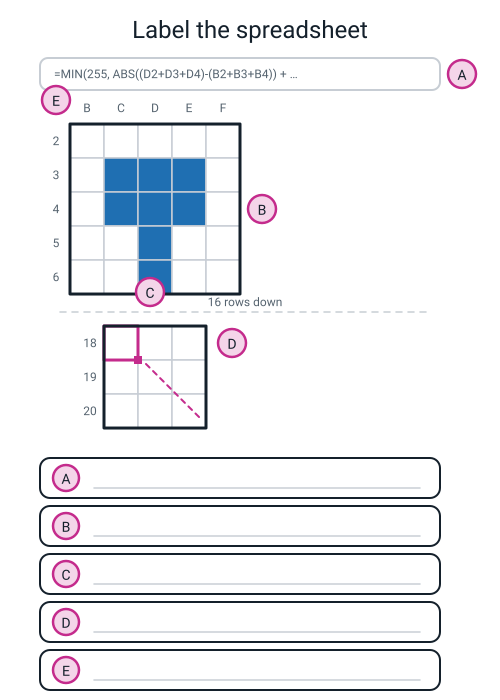
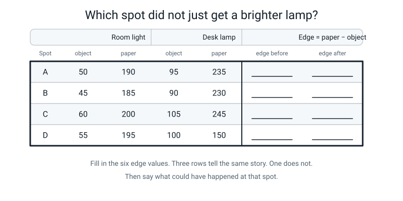
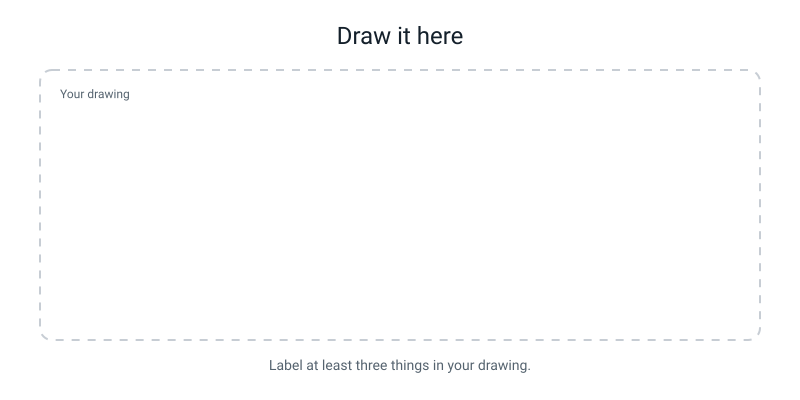

# Workbook — Week 26: Pixel Lab: Make the Outline Appear

**Name:** ________________________   **Date:** ______________

[📖 Read the chapter first](../student-guide/week-26.md) · [Course Home](../README.md)

> **What you need:** a spreadsheet (Google Sheets, Excel or LibreOffice Calc), your 12 × 12 letter grid, a desk lamp, a small solid object, a sheet of white paper, pencil and a calculator.
> **Time:** about 55 minutes. If the spreadsheet will not come home with you, the Build It task has a graph-paper version.

---

## ✅ Warm-Up (5 min)

*From last week — filters. No looking back.*

**W1.** Say what the vertical filter does, in the words we used in class — not in numbers.

`"________________  column  minus  ________________  column"`

**W2.** `|−660|` = `__________`

**W3.** A picture is **20 × 20** pixels and you run a 3 × 3 filter over it. How big is the answers grid, and why?

`__________ × __________` because `________________________________`

**W4.** A filter gives you **0**. Give **two completely different** things that could be going on in the picture at that spot.

(i) `________________________________________________`

(ii) `________________________________________________`

**W5.** A filter's answer is **−900**. Write the two repairs in the right order, with the number after each one.

1. ________________________ → `__________`
2. ________________________ → `__________`

---

## ✍️ Practice Set A — Understand It

**A1. Fill in the blanks.**

When you type `=D2+D3+D4` into a cell, the spreadsheet does not really remember the addresses `D2`, `D3` and `D4`. It remembers ________________________ from where the formula is sitting.

So when you copy that formula one cell to the **right**, it becomes `=____+____+____`. When you copy it one cell **down** instead, it becomes `=____+____+____`.

That is why you can write the sum __________ time and get __________ answers.

**A2. Multiple choice.** What does `MIN(255, x)` do? Circle one.

- (a) Makes x at least 255.
- (b) Hands back whichever is **smaller** — 255 or x.
- (c) Subtracts 255 from x.
- (d) Rounds x to the nearest 255.

**A3. True or false — and explain.** *"The spreadsheet showed no error message, so my formula must be right."*

**TRUE / FALSE** (circle one)

Because: `________________________________________________________`

`________________________________________________________`

**A4. Match the pairs.** Draw a line from each piece of the formula to what you called it last week.

| Piece of the formula | | Last week's name |
|---|---|---|
| 1. `(D2+D3+D4)-(B2+B3+B4)` | | (a) clipping |
| 2. `(B4+C4+D4)-(B2+C2+D2)` | | (b) the vertical filter |
| 3. `ABS( … )` | | (c) absolute value |
| 4. `MIN(255, … )` | | (d) the horizontal filter |

**A5. Label the diagram.** Write the correct name in each lettered box.


*Figure W26.1 — The formula bar, the input grid, the output block, and the drag handle. Five pins to name.*

Choose from: *the formula bar* · *the input grid (the picture)* · *the output block (the edge map)* · *the drag handle* · *the column letters and row numbers*

**A6. Work it out.**

(i) You type `=A1*10` into cell `B1` and drag it down to `B4`. What formula is in `B4`?

`________________`

(ii) Your picture is **8 × 8**, typed into `B2:I9`. Your first formula goes in `C18`. How big is the output block, and where does it end?

Size: `__________ × __________`   Last cell: `____________`

---

## ✍️ Practice Set B — Use It

**B1. Do the whole formula by hand.** Here are the nine pixels around one cell:

```
        c1    c2    c3
   r1     0     0     0
   r2   255   255     0
   r3   255   255     0
```

Fill in every line:

```
   V  =  right column (c3) − left column (c1)
      =  ( ____ + ____ + ____ ) − ( ____ + ____ + ____ )
      =  ______ − ______  =  ______            |V| = ______

   H  =  bottom row (r3) − top row (r1)
      =  ( ____ + ____ + ____ ) − ( ____ + ____ + ____ )
      =  ______ − ______  =  ______            |H| = ______

   |V| + |H|  =  ______        MIN(255, ______)  =  ______
```

What kind of place in the picture is this? `________________________________`

**B2. What would go wrong?** Priya types her 12 × 12 grid into `A1:L12` instead of `B2:M13`, but she types the formula into `C18` exactly as written.

(i) What does the formula end up pointing at?

`________________________________________________________`

(ii) What will the edge map look like, and will she get an error message?

`________________________________________________________`

`________________________________________________________`

**B3. What would go wrong?** Ben draws his letter with strokes only **one pixel** thick, then builds the edge map.

(i) What does his edge map look like — a hollow outline, or something else?

`________________________________________________________`

(ii) Explain it using what a 3 × 3 filter compares.

`________________________________________________________`

`________________________________________________________`

**B4. Analyse real data.** A plastic comb on white paper, photographed twice — once under room light, once under a desk lamp.

| Spot | Room: object | Room: paper | Lamp: object | Lamp: paper |
|---|---:|---:|---:|---:|
| 1 | 40 | 180 | 78 | 219 |
| 2 | 45 | 175 | 84 | 213 |
| 3 | 38 | 182 | 77 | 220 |

(i) Fill in the edge values (`paper − object`):

| Spot | Room edge | Lamp edge | Change |
|---|---|---|---|
| 1 | | | |
| 2 | | | |
| 3 | | | |

(ii) Average change in the **six brightness** numbers: `__________`

(iii) Average change in the **three edge** numbers: `__________`

(iv) Write the finding in one sentence, **with both numbers in it**.

`________________________________________________________`

**B5. What would go wrong?** Aisha trains a two-class model. Every single training photo of both objects is taken on the same bright red patterned rug.

(i) Predict what happens when she tests it on a plain wooden desk.

`________________________________________________________`

(ii) Explain it **in edge language** — what did the model actually learn?

`________________________________________________________`

`________________________________________________________`

---

## 🧩 Puzzle of the Week


*Figure W26.2 — Four spots, two lightings. Fill the edge columns, then find the spot that genuinely changed.*

**P1.** Fill in the six edge values in the figure's two blank columns (`paper − object`), then copy them here:

| Spot | Edge before | Edge after |
|---|---|---|
| A | | |
| B | | |
| C | | |
| D | | |

**P2.** Three of the four spots tell the same story. Which spot is the odd one out?

`__________`

**P3.** Look at that row's four numbers again. What is strange about them — and it is **not** the edge value, it is one of the brightness values.

`________________________________________________________`

**P4.** Suggest something that could really have happened at that spot to produce those numbers.

`________________________________________________________`

**P5.** Does the odd row prove that "edges survive a lighting change" is wrong? Explain carefully.

`________________________________________________________`

`________________________________________________________`

---

## 🤔 Think Deeper

**T1.** Our proof only covers light that changes **evenly** — the same amount added to every pixel. Describe a change of light in a real room that would **not** be even, and say exactly what it would do to the edge numbers. Then say whether the proof is worthless or just narrower than you thought.

`________________________________________________________`

`________________________________________________________`

`________________________________________________________`

`________________________________________________________`

**T2.** We proved edges survive when a lamp **adds** light. But what if the light is **halved** instead — every pixel multiplied by 0.5?

Work it out on an edge of 160 (object 40, wall 200):

```
   before:  object ______   wall ______   edge = ______
   after:   object ______   wall ______   edge = ______
```

Now rewrite the claim *"edges survive a lighting change"* so that it is honest.

`________________________________________________________`

`________________________________________________________`

---

## 🛠️ Build It — Finish Pixel Lab

### Step checklist

- [ ] **Step 1.** 144 numbers typed into `B2:M13`.
- [ ] **Step 2.** Input shaded with conditional formatting — minimum 0 **black**, maximum 255 **white**. Letter readable.
- [ ] **Step 3.** The formula typed by hand into `C18`. Five closing brackets counted.
- [ ] **Step 4.** Dragged right to `L18`, then down to row `27`. 100 cells.
- [ ] **Step 5.** Edge map shaded with the colours **flipped** — minimum 0 **white**, maximum 255 **black**.
- [ ] **Step 6.** **One cell checked by hand**, and it matched.
- [ ] **Step 7.** Six brightness values and three edge values recorded under two lamps.
- [ ] **Step 8.** The paragraph written.

> **💡 No spreadsheet at home?** Do it on graph paper. Compute any **twelve** cells rather than a hundred, shade them, and write "graph-paper version" at the top. Everything except the drag is identical, and the drag is the one thing you can honestly say you saw in class.

### Part 1 — Two grids, side by side

Tape in a screenshot, a photo of the screen, or shade them by hand on graph paper.

| The original letter (12 × 12) | The edge map (10 × 10) |
|---|---|
| | |
| | |

One sentence: what did the filter **keep**, and what did it **throw away**?

`________________________________________________________`

### Part 2 — One cell's arithmetic, in full

Pick an output cell that came out at **255 and sits on the edge of a stroke**. Not a zero — a zero matches by accident far too easily.

| | |
|---|---|
| Output cell (e.g. `C21`) | |
| Which image pixel is it for? | |
| Which grid cell is that, as (row, column)? | |

The nine pixel values:

```
        c___   c___   c___
   r___  ____   ____   ____
   r___  ____   ____   ____
   r___  ____   ____   ____
```

```
   V  =  ______ − ______  =  ______        |V| = ______

   H  =  ______ − ______  =  ______        |H| = ______

   |V| + |H|  =  ______        clipped  =  ______
```

One sentence: what does that number tell you about **that spot in the picture**?

`________________________________________________________`

### Part 3 — The lamp proof

| | Object | Paper | Edge = paper − object |
|---|---|---|---|
| Spot 1, room light | | | |
| Spot 2, room light | | | |
| Spot 3, room light | | | |
| Spot 1, desk lamp | | | |
| Spot 2, desk lamp | | | |
| Spot 3, desk lamp | | | |

Average change in the six **brightness** values: `__________`

Average change in the three **edge** values: `__________`

Which moved more, and by how many times? `________________________________`

### Part 4 — The paragraph

**Why does a vision system look at edges first?** Use your own numbers from Part 3, and connect it to what happened to your Week 17 model when the background changed.

`________________________________________________________`

`________________________________________________________`

`________________________________________________________`

`________________________________________________________`

`________________________________________________________`

### Vocabulary box

| Word | Your definition, in your own words |
|---|---|
| **edge map** | |

---

## 🎨 Draw It

**Draw the background trap.** Two panels, side by side:

- **Left:** your object sitting on a strongly patterned background — wood grain, a stripy tea towel, a tiled floor, brick.
- **Right:** the **edge map** of that same scene. Draw the background's edges as long, strong, straight lines. Draw the object's edges as a small, shorter, wobblier outline.

Then draw an arrow to whichever set of edges a model would find **easier to rely on**, and write one sentence saying why.


*Figure W26.3 — Your page. Draw the letter going in solid and coming out hollow.*

**What a good answer looks like:** the left panel shows a small eraser on a wooden table with six or seven grain lines running the full width. The right panel shows those grain lines as six long dark lines and the eraser as one small rectangle outline. The arrow points at the **grain lines**, with the sentence: *"The grain lines are longer, stronger, and in exactly the same place in every photo — while the eraser moves and turns. So the grain is the more reliable pattern, and reliable is what a model learns."*

---

## 📊 Self-Check

| I can… | 😀 Yes | 🙂 Nearly | 😕 Not yet |
|---|---|---|---|
| build a working edge filter in a spreadsheet with one formula dragged across a grid | | | |
| use conditional formatting to turn a grid of numbers back into a picture | | | |
| show with my own numbers that edge values change less than brightness values when the light changes | | | |
| explain the background trap in my own model in terms of edges | | | |
| say what an **edge map** is without looking it up | | | |

---

## ✅ Answers

<details>
<summary>Check your answers</summary>

### Warm-Up

**W1.** *"**right** column minus **left** column."* Say the words, not the numbers — `−1 0 +1` looks identical whether you read it across or down, and the words cannot rotate.

**W2.** **660.** The absolute value is just the size, with the sign thrown away.

**W3.** **18 × 18**, because the filter needs a full ring of neighbours, so it can never sit on the border row or column. `Output = input − 2`, and 20 − 2 = 18. (That is 324 cells — and 324 × 9 = 2,916 multiplications, by hand.)

**W4.** (i) It is all **bright** there — a blank sky, or the middle of a white shape. (ii) It is all **dark** there — an empty black background, or the middle of a thick black stroke. Either way it is **flat**, and flat means nothing changed. Zero never means "nothing is there".

**W5.** 1. **Absolute value** → **900.** 2. **Clip at 255** → **255.** In that order. Clipping first does nothing to a negative number, because clipping only pins the top end.

### Practice Set A

**A1.** …it remembers **directions** (which cells are its neighbours, relative to itself).

Copied one cell **right**: `=E2+E3+E4`. Copied one cell **down**: `=D3+D4+D5`.

That is why you write the sum **one** time and get **a hundred** answers.

**A2. (b)** — hands back whichever is smaller. If x is 900, `MIN(255, 900)` gives 255. If x is 0, it gives 0. That is clipping, written as a comparison instead of as a rule.

**A3. FALSE.** A formula that points at the wrong cells is still **perfectly valid arithmetic** — it just answers the wrong question. `B1` instead of `B2` produces no error at all: you get a wrong picture, computed confidently, a hundred times over.

That is the dangerous kind of wrong: silent. Error messages only catch *broken* formulas (a missing bracket, a misspelt `ABS`), never *incorrect* ones. The only way to catch an incorrect one is to check a cell by hand.

**A4.** 1 → **(b)** the vertical filter · 2 → **(d)** the horizontal filter · 3 → **(c)** absolute value · 4 → **(a)** clipping.

**A5.**
- **A** = the formula bar
- **B** = the input grid (the picture)
- **C** = the output block (the edge map)
- **D** = the drag handle
- **E** = the column letters and row numbers

**A6.**

(i) `=A4*10`. The formula means *"the cell one to my left, times ten"*, and it re-reads that from each new row.

(ii) 8 − 2 = **6**, so the output block is **6 × 6** = 36 cells, running from `C18` to **`H23`**. (Columns C, D, E, F, G, H — six of them. Rows 18 to 23 — six of them.)

### Practice Set B

**B1.**

```
   V  =  ( 0 + 0 + 0 ) − ( 0 + 255 + 255 )
      =  0 − 510  =  −510            |V| = 510

   H  =  ( 255 + 255 + 0 ) − ( 0 + 0 + 0 )
      =  510 − 0  =  +510            |H| = 510

   |V| + |H|  =  1020        MIN(255, 1020)  =  255
```

**What kind of place is this?** A **corner** — and specifically a top-right corner, with paper above and paper to the right, and ink below and to the left. You can tell it is a corner because **both** filters fired at full strength. A straight edge only ever sets off one of them.

**B2.**

(i) Everything is shifted one row up and one column left. The formula in `C18` was written for a picture whose top-left pixel is `B2`, so it is now reading a window that is **partly off the edge of Priya's picture** — it picks up empty cells from row 1 and column A on one side, and it misses the last row and column of her actual picture on the other.

(ii) She gets an edge map that is **wrong but plausible-looking**: probably an outline shifted diagonally by one cell, with a false bright line along one edge where her real pixels sit next to genuinely empty cells (empty counts as 0, which looks like paper, which looks like an edge).

**And no, she gets no error message.** Empty cells are treated as 0 and the arithmetic works fine. This is exactly why you check one cell by hand.

**B3.**

(i) **Not a hollow outline — a solid block.** Every cell in the neighbourhood of the stroke fires, and there is no white middle anywhere.

(ii) A 3 × 3 filter compares the column two places apart (or the row two places apart). With a one-pixel stroke, **there is never a position where all nine pixels are the same**, so there is never a zero. Wherever you put the window, one side is on the stroke and the other is on the paper.

To get a hollow interior you need the stroke to be at least about **4 pixels** thick, so that the whole 3 × 3 window can sit inside the ink with nothing changing. (There is a nice extra oddity: with a stroke exactly one pixel wide, the cell sitting *directly on top of it* gives **zero**, because it compares the paper on the left with the paper on the right and ignores the middle column entirely. So a one-pixel line comes out as *two* lines with a gap.)

**B4.**

(i)

| Spot | Room edge | Lamp edge | Change |
|---|---:|---:|---:|
| 1 | 180 − 40 = **140** | 219 − 78 = **141** | +1 |
| 2 | 175 − 45 = **130** | 213 − 84 = **129** | −1 |
| 3 | 182 − 38 = **144** | 220 − 77 = **143** | −1 |

(ii) The six brightness changes are +38, +39, +39, +38, +39, +38.

```
   (38 + 39 + 39 + 38 + 39 + 38) ÷ 6  =  231 ÷ 6  =  38.5
```

(iii) The three edge changes are 1, 1 and 1.

```
   (1 + 1 + 1) ÷ 3  =  1.0
```

(iv) **"Every brightness value went up by about 38.5, while the edge values changed by only 1 — so the brightness numbers moved about 38 times more than the edges did."**

`38.5 ÷ 1.0 = 38.5`

**Note the honesty:** the edges did *not* stay identical. They moved by 1. That is a real measurement of a real room and it is exactly what you should expect. The finding is the **comparison**, never either number on its own.

**B5.**

(i) It scores brilliantly on the rug and **falls apart** on the desk — quite possibly down to guessing level, so about 50% for two classes.

(ii) In edge language: **the rug's pattern produced strong, repeated edges in every single photo, in roughly the same places, while the objects moved and turned between shots.** So the most reliable edge pattern sitting next to each label was the rug, not the object. The model learned the rug and Aisha gave it the objects' names. Move it to a plain desk and all of that evidence disappears at once — and unfamiliar new edges (the desk's grain, its straight sides) turn up in its place.

She has not trained an object detector. She has trained a **rug detector** with two labels stuck on it.

### Puzzle of the Week

**P1.**

| Spot | Edge before | Edge after |
|---|---:|---:|
| A | 190 − 50 = **140** | 235 − 95 = **140** |
| B | 185 − 45 = **140** | 230 − 90 = **140** |
| C | 200 − 60 = **140** | 245 − 105 = **140** |
| D | 195 − 55 = **140** | 150 − 100 = **50** |

**P2. Spot D.**

**P3.** In A, B and C, *both* numbers went **up** by 45. In D the object went **up** by 45 (55 → 100) but the **paper went down** — from 195 all the way to 150. It got **darker** while everything around it got brighter. That is the strange number, and it is the paper, not the edge.

**P4.** Something got **between the lamp and the paper at that spot** — most likely a **shadow**: the lamp was off to one side, and switching it on cast the shadow of the object (or of a hand, or the lamp's own arm) across the paper right where spot D was measured. Also acceptable: something was moved onto the paper between the two photos, or spot D was measured in a slightly different place the second time.

**P5. No — but it narrows the claim, and that matters.** The claim we proved is: *when the light changes **evenly**, edge values barely move.* Spot D was not an even change. One side of that edge got brighter and the other side got darker, so the difference between them collapsed.

So the honest version of the claim is: **"An edge survives light that changes by the same amount everywhere. It does not survive light that creates new shadows."** Spots A, B and C are the proof of the first half. Spot D is a fair warning about the second half — and it is exactly why a model can still fail when you only change the lighting.

### Think Deeper

**T1. Model answer.**

> A desk lamp placed to one side of the object is not an even change at all. The side of the object facing the lamp gets a lot brighter and the far side barely changes, so different parts of the picture get different bonuses. Worse, the lamp casts a **shadow**, and the boundary of that shadow is itself a brand-new, strong, sharp edge that was never on the object at all.
>
> So the edge numbers do two things. Edges that happen to lie along the lamp's direction still survive fairly well, because both of their sides get a similar bonus. But edges across the lamp's direction change, and completely fake new edges appear where the shadow lands.
>
> The proof is not worthless — it is narrower than I first thought. It says: *an even change of light cancels out of an edge, because both sides get the same bonus.* That is still true and still useful, because it is why edges beat brightness in the first place. It just does not promise that a real photo taken in a real room will give identical edge numbers, and I should stop expecting that.

**T2.**

```
   before:  object  40    wall 200    edge = 160
   after:   object  20    wall 100    edge =  80
```

The edge **halves**. Every pixel got multiplied by 0.5, so the difference between two pixels got multiplied by 0.5 as well.

**The honest rewrite:**

> **"An edge survives light being *added* to a picture perfectly, and does not survive light being *multiplied*."**

Also fine: *"edges survive an even change in brightness, but not a change in contrast"*, or *"the filter's weights add to zero, which cancels anything added to every pixel — but nothing cancels a multiplication."*

**Why it happens, if you want the reason:** adding *k* to every pixel changes the filter's answer by k × (sum of the weights) = k × 0 = 0. Multiplying every pixel by *m* multiplies the whole answer by *m*, because every single term in the sum got multiplied. Zero weights protect you from addition. Nothing protects you from multiplication.

### Build It

**Part 1 — what the filter kept and threw away.**

> It kept the **boundary** — the outline that tells you which letter it is. It threw away the **filling** (every flat patch inside the letter came out as 0) and it threw away the **overall brightness** (a bright letter and a dim letter give the same edge map).
>
> That is not really losing. You can still tell exactly what letter it is from the outline alone, so it kept the thing that identifies the letter and dropped everything that does not.

**Part 2 — a model answer**, using the class letter T and output cell `C21`:

```
   Output cell:   C21
   Image pixel:   C5
   Grid cell:     (5, 2)

   The nine pixels, rows 4-6, columns 1-3:

           c1    c2    c3
      r4    0   255   255
      r5    0   255   255
      r6    0     0     0

   V = right column (c3) − left column (c1)
     = (255 + 255 + 0) − (0 + 0 + 0)
     = 510 − 0 = +510                 |V| = 510

   H = bottom row (r6) − top row (r4)
     = (0 + 0 + 0) − (0 + 255 + 255)
     = 0 − 510 = −510                 |H| = 510

   |V| + |H| = 1020        MIN(255, 1020) = 255
```

> **The sentence:** this spot is a **corner**. The brightness changes as I move sideways *and* as I move downwards, so both filters fired at once. It is the bottom-left corner of the bar of the T.

**Marking your own:** you should have (a) named the cell and the pixel it belongs to, (b) drawn the nine values, (c) shown *both* filter calculations separately, (d) added the absolute values **before** clipping, and (e) said something about that place in the picture, not just repeated the number.

**Part 3 —** your own numbers will differ, and they should. What must be true:

- The six brightness changes should all be **roughly the same size** and in the **same direction**.
- The three edge changes should be **much smaller** — usually 0 to 5.
- Your "how many times more" number should be somewhere between about **10 and 50**.

If your edge numbers moved nearly as much as the brightness numbers, do not hide it — the lamp was probably off to one side and brightened one spot more than the other. Say so, and write the honest conclusion: *edges are stable when the light changes evenly, and my lamp did not change it evenly.* That is a better answer than a tidy one.

**Part 4 — model paragraph:**

> A vision system looks at edges first because an edge is a **difference between two places**, and when the light changes it usually changes both places by roughly the same amount — so the difference stays put. In my test the object went from 40 to 78 and the paper went from 180 to 219. Both jumped by about 38, so the gap between them stayed at about 140.
>
> Raw brightness is really a fact about **the room**: it tells you how bright the lamp is. An edge is a fact about **the object**: it tells you where the object stops and the paper starts. Only one of those is worth learning, and a machine can only learn what is in the numbers.
>
> That is also why my model failed when I changed the background. The edges it had been relying on belonged to the table, not to the object — so the moment the table went away, so did its evidence.

**The vocabulary box:**

| Word | Model definition | Also fine |
|---|---|---|
| **edge map** | The grid of numbers you get after running an edge filter over a picture — an outline drawing made of numbers | "the outline grid" · "what comes out when you filter the whole picture" |

### Draw It

A good answer has all three of these:

1. **The background edges drawn longer and stronger than the object's.** That is the whole point — it is not that the object has no edges, it is that the background's are better.
2. **The background edges drawn in the same place in both panels.** They do not move between photos. The object does.
3. **The arrow pointing at the background**, with a reason that uses the word **reliable** (or means it). "A model learns whatever is most reliably next to the label."

A common half-answer draws only the object's outline in the right-hand panel. Go back and add the grain — the filter does not know which edges you wanted, so it reports **all** of them, and that is exactly why the trap works.

</details>

---

[⬅ Week 25 workbook](week-25.md) · [📖 Week 26 chapter](../student-guide/week-26.md) · [Course Home](../README.md) · [Week 27 workbook ➡](week-27.md) · [Glossary](../../glossary.md)
