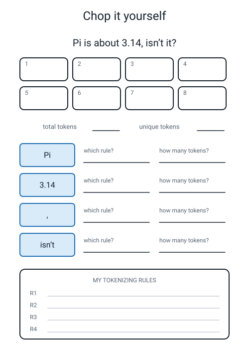
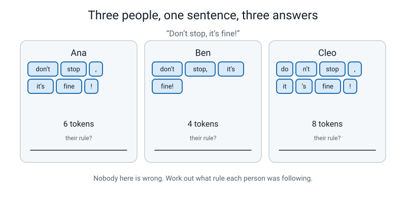

# Workbook — Week 27: Term 3 Checkpoint — From Pixels to Words

**Name:** ________________________   **Date:** ______________

[📖 Read the chapter first](../student-guide/week-27.md) · [Course Home](../README.md)

> **What you need:** pencil, two coloured pens, and a book you like with a paragraph of about 60 words flagged. **No screen needed for any of this.**
> **Time:** about 50 minutes.

---

## ✅ Warm-Up (5 min)

*From last week — Pixel Lab. No looking back.*

**W1.** What does an **edge map** show you?

`________________________________________________________`

**W2.** A spreadsheet does not really remember cell **addresses** in a formula. What does it remember instead?

`________________________________________________________`

**W3.** A lamp adds 50 to every pixel in a photo.

What happens to the **brightness** numbers? `________________________________`

What happens to the **edge** numbers? `________________________________`

**W4.** `MIN(255, 900)` gives `__________`. What is that step called? `______________`

**W5.** Your spreadsheet has just filled a hundred cells in half a second. Why should you still work one of them out by hand?

`________________________________________________________`

---

## ✍️ Practice Set A — Understand It

**A1. Fill in the blanks.**

The pile of text you are learning from is called a __________________. One piece of text after chopping is called a __________________. Chopping text into pieces is called __________________.

A machine cannot handle "a sentence" any more than it can handle "a dog", because a machine can only handle ____________ in a ____________.

**A2. Multiple choice.** Under our six rules, which one of these is **never** a token? Circle one.

- (a) `.`
- (b) 🍕
- (c) `3` (out of `3.14`)
- (d) `don't`

**A3. True or false — and explain.** *"There is one correct way to tokenize a sentence."*

**TRUE / FALSE** (circle one)

Because: `________________________________________________________`

And the thing that really *is* wrong is: `_______________________________`

**A4. Match the pairs.** Draw a line from each rule to what it decides.

| Rule | | What it decides |
|---|---|---|
| 1. R1 — lowercase everything | | (a) the dot in `3.14` stays where it is |
| 2. R2 — `. , ! ?` are their own token | | (b) 🍕 gets counted like a word |
| 3. R3 — contractions stay whole | | (c) `Pizza` and `pizza` count as the same word |
| 4. R4 — a dot between two digits | | (d) `pizza-oven` stays as one piece |
| 5. R5 — hyphenated words stay whole | | (e) the `!` in `great!` becomes its own piece |
| 6. R6 — an emoji is its own token | | (f) `isn't` stays as one piece |

**A5. Fill in the worksheet.** Chop the sentence into the boxes, then answer the four rule questions and write your rules at the bottom.


*Figure W27.1 — Eight token boxes for one short sentence. The four tricky bits are pinned out for you.*

**A6. Two counts.** For the sentence `A pizza is a pizza.`

Tokens: `__________`   Unique tokens: `__________`

Which token appears twice? `__________`  And which other one? `__________`

---

## ✍️ Practice Set B — Use It

**B1. Tokenize three new sentences** under our six rules. Write the tokens separated by `/`, then the count.

```
   S1.  Don't panic! It's only 2.5 km.

        ______________________________________________  tokens: ____

   S2.  Our AI-powered oven cooks pizza in 3.5 minutes!

        ______________________________________________  tokens: ____

   S3.  Yes! Yes! Pizza again?

        ______________________________________________  tokens: ____
```

Total tokens across all three: `__________`

Now the unique count across all three. List the repeats first:

`________________________________________________________`

Unique tokens: `__________`

**B2. What would go wrong?** Dev starts tokenizing a two-page story without writing any rules down. On page 1 he treats `don't` as one token. Halfway through page 2 he decides `do` + `n't` is better and carries on that way.

(i) What is wrong with his frequency table at the end?

`________________________________________________________`

(ii) Can he fix it without starting again? Explain.

`________________________________________________________`

**B3. What would go wrong?** Nina keeps every rule except **R1** — she does not lowercase anything.

(i) What happens to a very common word like `the` in her frequency table?

`________________________________________________________`

(ii) Why does the *start of every sentence* make this worse?

`________________________________________________________`

**B4. Do it both ways.** Retokenize your three sentences from B1 with the punctuation **glued on** instead of split off.

```
   S1.  ______________________________________________  tokens: ____
   S2.  ______________________________________________  tokens: ____
   S3.  ______________________________________________  tokens: ____
```

| | Tokens | Unique |
|---|---|---|
| Punctuation split off | | |
| Punctuation glued on | | |

Which set is **smaller**? `________________`  Which is more **useful**, and why?

`________________________________________________________`

**B5. What would go wrong?** Some languages — Chinese, Japanese, Thai — are written with **no spaces between the words**. Ravi writes a tokenizer whose only rule is "split wherever there is a space".

(i) What happens when he runs it on a Chinese sentence?

`________________________________________________________`

(ii) Would his frequency table be any use at all? Explain.

`________________________________________________________`

---

## 🧩 Puzzle of the Week


*Figure W27.2 — One sentence, three people, three different token counts. None of them is cheating.*

Three people chopped the same sentence — `Don't stop, it's fine!` — and got three different answers.

**P1.** Write down the rule each person must have been following.

Ana got 6. Her rules: `________________________________________________`

Ben got 4. His rules: `________________________________________________`

Cleo got 8. Her rules: `________________________________________________`

**P2.** How many of the three are **wrong**? `__________`  Why?

`________________________________________________________`

**P3.** Ben's answer has the fewest pieces. Give one reason that is a **disadvantage**, not an advantage.

`________________________________________________________`

**P4.** Cleo split `it's` into `it` + `'s`. Give one genuine reason somebody might *want* to do that.

`________________________________________________________`

**P5.** Now the counts. For each person, how many **unique** tokens did they get?

Ana: `______`   Ben: `______`   Cleo: `______`

---

## 🤔 Think Deeper

**T1.** Our R4 says *"a dot between two digits stays in the number."* That is fine for a human, who can use judgement. Rewrite R4 so precisely that a machine could follow it with **no judgement at all** — then find one string where even your precise rule gives an answer you do not like.

My precise R4: `________________________________________________`

`________________________________________________________`

Where it breaks: `________________________________________________`

**T2.** Imagine tokenizing a whole book instead of four sentences. Which number grows faster — the **token count** or the **unique token count**? Say why, then say what that means for a machine trying to learn from text.

`________________________________________________________`

`________________________________________________________`

`________________________________________________________`

`________________________________________________________`

---

## 🛠️ Build It

### Part 1 — Term 3 reflection sheet

Write **one thing you can DO now that you could not do in Week 19** in each box. Start every one with the words **"I can"**, and get a number into at least one of them.

> "I learned about pixels" does not count. That names a topic. Name an **action**.

| | Something I can do now |
|---|---|
| **1** | |
| **2** | |
| **3** | |

Copy over the week numbers from the "Weeks to go back to" sheet:

`__________  __________  __________`

If that list is empty, write **"nothing to go back to"** — that is the best possible result and it deserves writing down.

### Part 2 — Tokenize your own paragraph

Take the paragraph you flagged in your book, about **60 words**.

> **💡 No book to hand?** Use this paragraph instead. It is exactly 60 words:
>
> *The dog ran down the lane and stopped at the gate. It was a small gate, painted green, and it did not open. The dog sat down. It waited for a long time. Then the boy came out of the house with a key, opened the gate, and the dog ran through it without looking back at the green gate.*

**Step 1 — the rules, FIRST.** You may use ours, you may change them. They must be written down **before** you chop anything.

```
   R1  ______________________________________________________

   R2  ______________________________________________________

   R3  ______________________________________________________

   R4  ______________________________________________________

   R5  ______________________________________________________

   R6  ______________________________________________________
```

**Step 2 — chop it.** Write out every token, numbered, on a separate sheet. Number them as you go — do not chop first and count afterwards.

**Step 3 — the two counts.**

Total tokens: `__________`   Unique tokens: `__________`

**Step 4 — the frequency table**, most common at the top. Add rows if you need them.

| Token | How many times |
|---|---|
| | |
| | |
| | |
| | |
| | |
| | |
| | |
| | |
| | |
| | |
| how many tokens appear **exactly once**? | |

**Step 5 — check your arithmetic.** Add up every number in the "how many times" column. It must equal your **total token** count. Count the rows in the table. That must equal your **unique token** count.

Do they? **Yes / No.** If no, go and find the missing piece — one of your two counts is wrong.

### Part 3 — Two written questions

**Q1.** Which token is the most common in your paragraph, and does it **mean** anything on its own?

`________________________________________________________`

`________________________________________________________`

**Q2.** If you had glued the punctuation onto the words instead, how would your **total** change, and what new problem would you create?

`________________________________________________________`

`________________________________________________________`

### Vocabulary boxes

| Word | Your definition, in your own words |
|---|---|
| **corpus** | |
| **token** | |
| **tokenize** | |

---

## 🎨 Draw It

**Draw the sentence of the term as one picture.** Two halves, side by side:

- **Left:** a small photo — anything, a face, a pizza, a letter — drawn as a **grid of numbers**. 5 × 5 is plenty. Put a real number in every square.
- **Right:** a short sentence chopped into a **strip of numbered token boxes**.

Then write one banner across the bottom in your own words saying what these two things have in common.


*Figure W27.3 — Your page. Draw where you would cut, and write the rule you used.*

**What a good answer looks like:** the left half is a 5 × 5 grid where a few cells hold 255 and the rest hold 0, arranged so you can just about see a shape. The right half is `[i]` `[love]` `[pizza]` `[.]` in four boxes numbered 1 to 4. The banner reads something like: *"Both of these are just numbers in a table. The machine cannot tell which one used to be a picture."*

A weaker answer draws a nice photo and a nice sentence but **no numbers**. The numbers are the whole point — they are the thing the two halves have in common.

---

## 📊 Self-Check

| I can… | 😀 Yes | 🙂 Nearly | 😕 Not yet |
|---|---|---|---|
| use the Term 3 words without notes — test set, accuracy, confusion matrix, pixel, filter | | | |
| tokenize a sentence by hand and say which rule made each decision | | | |
| count tokens and unique tokens separately, and explain why they differ | | | |
| say in one sentence why text and images are the same kind of problem to a machine | | | |
| define **corpus**, **token** and **tokenize** without looking them up | | | |

---

## ✅ Answers

<details>
<summary>Check your answers</summary>

### Warm-Up

**W1.** How strong the **edge** is at every place in the picture — an outline drawing made of numbers. The middles come out as 0 because the middles never change, so a solid letter goes in and a hollow outline comes out.

**W2.** **Directions** — which cells are its neighbours, relative to where the formula is sitting. That is why one formula dragged over a hundred cells does a hundred *different* sums.

**W3.** The **brightness** numbers all go **up by 50**. The **edge** numbers stay the **same** — because both sides of the edge got the same +50 bonus, and the bonus cancels out of a difference. ("Edges change much less" is also fine and slightly more honest.)

**W4.** **255.** That step is called **clipping**.

**W5.** Because a formula pointing at the wrong cells is still perfectly valid arithmetic — **you get no error message, just a wrong picture computed a hundred times, very confidently.** Checking one cell by hand is the only way to catch it. One check earns you the other ninety-nine.

### Practice Set A

**A1.** corpus · token · tokenize.

A machine can only handle **numbers** in a **table**.

**A2. (c) `3`.** Rule R4 keeps `3.14` whole — the dot stays in because there is a digit on both sides of it. So `3` never appears as a token at all.

The other three are all tokens: a full stop is one (R2), an emoji is one (R6), and a contraction stays whole as one (R3). **Being a word was never the requirement.**

**A3. FALSE.** Real systems built by real companies genuinely disagree about `don't`, about hyphens, and about whether to lowercase. There is no authority to appeal to.

The thing that really is wrong is **being inconsistent** — chopping `don't` as one token in one sentence and two in another. Your rules are correct if they are written down and you follow them everywhere.

**A4.** 1 → **(c)** · 2 → **(e)** · 3 → **(f)** · 4 → **(a)** · 5 → **(d)** · 6 → **(b)**

**A5.** `Pi is about 3.14, isn't it?`

```
   1. pi    2. is    3. about    4. 3.14
   5. ,     6. isn't 7. it       8. ?
```

**8 tokens, 8 unique** (nothing repeats).

The four rule questions:

| Bit | Which rule | How many tokens |
|---|---|---|
| `Pi` | **R1** — lowercase it | 1 (`pi`) |
| `3.14` | **R4** — a dot between two digits stays put. R4 beats R2 | 1 |
| `,` | **R2** — its own token | 1 |
| `isn't` | **R3** — contractions stay whole | 1 |

The trap is `3.14`. R2 says dots are their own token, so R2 on its own would give you `3` / `.` / `14` — three tokens, and not a number any more. **That is why R4 exists and why it beats R2.** If you got 10 tokens for this sentence, that is what happened. If you got 7, you dropped the comma.

**A6.** `A pizza is a pizza.` → `a / pizza / is / a / pizza / .`

**6 tokens, 4 unique.** `a` appears twice and `pizza` appears twice.

### Practice Set B

**B1.**

```
   S1.  don't / panic / ! / it's / only / 2.5 / km / .              8 tokens
   S2.  our / ai-powered / oven / cooks / pizza / in / 3.5 / minutes / !   9 tokens
   S3.  yes / ! / yes / ! / pizza / again / ?                       7 tokens
```

**Total: 8 + 9 + 7 = 24 tokens.**

The repeats:

```
   !      4 times  (S1 once, S2 once, S3 twice)   ->  3 extra
   pizza  2 times  (S2, S3)                       ->  1 extra
   yes    2 times  (both in S3)                   ->  1 extra
                                                       5 extra
```

**Unique: 24 − 5 = 19.**

Two things worth noticing. `2.5` and `3.5` are **different** tokens — obviously, but it is easy to lump them together as "the numbers". And `!` turns out to be the most common token in the whole set, which is a small preview of something you will meet again: **punctuation lives at the top of frequency tables, not the bottom.**

**B2.**

(i) His table is **nonsense for that word, and he cannot tell how much**. `don't` has a count based on page 1 only, `do` and `n't` have counts based on half of page 2 only, and none of those three numbers means anything. Worse, it *looks* completely fine — three tidy rows with three tidy numbers.

(ii) **No, not really.** He does not know exactly where he switched over, and even if he did, he would have to go back and re-chop everything before that point. Re-tokenizing the whole thing under one rule is faster and is the only way to get numbers he can trust. **This is exactly why you write the rules first** — it is not admin, it is the thing that makes the counts mean anything.

**B3.**

(i) `the` gets split into (at least) **two separate rows** — `The` and `the` — each with a fraction of the real count. One word with a count of 40 becomes two words with counts of about 12 and 28, and neither number is the truth about that word.

(ii) Because **every sentence starts with a capital letter.** So the most common words in English — `the`, `it`, `a`, `and`, `I` — are precisely the ones that keep appearing in two different forms. The more sentences you have, the worse it gets. This is the single most common reason a beginner's frequency table looks strange.

**B4.**

```
   S1.  don't / panic! / it's / only / 2.5 / km.                      6 tokens
   S2.  our / ai-powered / oven / cooks / pizza / in / 3.5 / minutes! 8 tokens
   S3.  yes! / yes! / pizza / again?                                  4 tokens
```

| | Tokens | Unique |
|---|---:|---:|
| Punctuation split off | **24** | **19** |
| Punctuation glued on | **18** | **16** |

*(Glued unique: 18 tokens, with `pizza` twice and `yes!` twice — two extra occurrences — so 18 − 2 = 16.)*

**Glued is smaller** — fewer tokens *and* fewer unique tokens.

**But split-off is more useful, for two reasons:**

1. **The counts stay together.** Glued on, `panic!` and `km.` and `minutes!` and `again?` are pieces that will almost certainly never appear in that exact form again in anything you read. Their counts are frozen at 1 forever. Split off, `panic` is just `panic`, and it can be counted every time it turns up.
2. **You keep the punctuation as information.** A `.` token tells you *a sentence ended here*, and next week you will need to know exactly that. Glued on, that information is scattered across dozens of different-looking words and is gone.

**Smaller is not the goal. Useful is the goal.**

**B5.**

(i) There are no spaces, so there is nothing to split on. He gets **one enormous token** containing the entire sentence.

(ii) **No use whatsoever.** His frequency table would have one row, with a count of 1, for a "word" that will never appear again as long as he lives. Every sentence in the language would be its own unique token.

This is a real problem and it had a real solution: it is one of the genuine reasons that **sub-word tokenizing** won. Chopping into small frequently-occurring pieces does not care about spaces at all — it just finds chunks that turn up a lot, which works for Chinese and English equally.

### Puzzle of the Week

**P1.**

**Ana (6): `don't / stop / , / it's / fine / !`** — punctuation split off into its own tokens; contractions kept whole. **These are our rules** (R2 + R3).

**Ben (4): `don't / stop, / it's / fine!`** — punctuation **glued on** to the word before it; contractions kept whole.

**Cleo (8): `do / n't / stop / , / it / 's / fine / !`** — punctuation split off **and** contractions split too, into the word plus the shortened bit.

**P2. None of them. Zero.** All three followed a consistent rule from start to finish, and all three could say what their rule was. Real tokenizers genuinely disagree in exactly these three ways — Cleo's split is the one used by several well-known real systems, because `n't` carries the meaning *not* and it is useful to have it as its own piece.

The only way to be wrong here would be to chop `don't` one way and `it's` the other way in the same piece of text.

**P3.** `stop,` and `fine!` are pieces that will hardly ever appear again in that exact form, so their counts are stuck at 1. He has also **lost the punctuation as information** — he can no longer tell where the sentence ended, because the full stop and the exclamation mark no longer exist as things he can count.

**P4.** Because **`n't` means *not***, and *not* completely reverses the meaning of a sentence. If you keep `n't` as its own piece, then `don't`, `isn't`, `wasn't` and `can't` all share one common piece that means "this is a negative" — and a machine can learn about that one piece from all four words at once, instead of having to learn each word separately. That is a genuinely good reason, and it is why real systems do it.

**P5.**

**Ana: 6 unique** — `don't`, `stop`, `,`, `it's`, `fine`, `!` — nothing repeats.

**Ben: 4 unique** — nothing repeats.

**Cleo: 8 unique** — nothing repeats.

In such a short sentence with no repeated words, tokens and unique tokens are **equal for all three**. That is worth noticing: the two counts only come apart when something appears twice. Add one more word — say the sentence were `Don't stop, don't stop!` — and they would separate immediately.

### Think Deeper

**T1. Model answer.**

> **My precise R4:** a `.` stays inside the token **if and only if** there is a digit immediately before it *and* a digit immediately after it, with no space on either side. Otherwise the `.` becomes its own token.
>
> **Where it breaks:** `3.` at the end of a sentence — as in *"There were 3."* My rule looks for a digit after the dot, does not find one, and splits it off. That is actually the answer I want, so that one is fine. But try **`192.168.0.1`** (an internet address). Every one of those dots has a digit on both sides, so my rule keeps the whole thing as one token — which is right, luckily. Now try **`Mr. Smith`**: no digits at all, so the dot splits off, and I get `mr` / `.` / `smith`, which puts a fake "end of sentence" marker in the middle of somebody's name. My rule cannot fix that, because it only ever looks at digits.

**Accept:** any version of *"a digit immediately before AND immediately after"*. The second half of the question is the harder and more valuable one — good breaking cases include `Mr.`, `etc.`, `U.K.`, a web address, a date like `12.3.2026`, or a price like `£4.50` where the currency symbol is not covered by any rule at all.

**The real lesson:** every rule you write precisely enough for a machine will have cases where it is wrong. Real tokenizers are long lists of exactly this kind of grubby special case, added one at a time by people who found a string that broke the last version.

**T2. Model answer.**

> The **token count** grows much faster. Every single word you add to the corpus adds 1 to the token count — always. But it only adds to the unique count if it is a word you have **never seen before**, and after a while that almost never happens: page 300 of a book has hardly any brand-new words on it, just `the` again.
>
> So a sentence might be 9 tokens and 7 unique, while a whole book is more like **80,000 tokens and 6,000 unique**.
>
> What it means for a machine: the number of **rows** in its table stops growing quite quickly, but the amount of **evidence** in each row keeps piling up. That is good news — it means collecting more text does not make the table unmanageably wider, it makes the counts inside it more trustworthy. It also means the most common words get enormous counts while most words are seen only once or twice, so a machine has plenty of evidence about `the` and almost none about anything interesting.

**Accept:** "the token count" with any correct version of *"new words run out and `the` never does"*. Level 5 answers get to the consequence — more text means better counts rather than a bigger table.

### Build It

**Part 1 — Term 3 reflection.** Any three that name genuinely **doable actions** are correct. This is the standard:

| Good | Not good enough | Why |
|---|---|---|
| "I can work out that a 12 × 12 image with a 3 × 3 filter gives a 10 × 10 output, and say why." | "I learned about filters." | The first names an action, with a number in it. The second names a topic. |
| "I can build a confusion matrix from a list of results and find the worst class." | "I know what a confusion matrix is." | Build versus know. |
| "I can say why 90% accuracy can be a rubbish result." | "I learned about accuracy." | The first shows the *point* of the week, not the label. |
| "I can prove edges beat brightness with two lamps and six numbers." | "Edges are better than brightness." | The first is a thing you did. The second is a claim you are repeating. |

If all three of yours are topic labels, rewrite them starting with the words **"I can"** and put a number in at least one. That single change fixes it almost every time.

**Part 2 — the fallback paragraph, fully worked.** Use this to check your method even if you used your own book.

```
   words                      60
   punctuation tokens          9        ( 5 full stops, 4 commas )
                            ────
   TOTAL TOKENS               69

   UNIQUE TOKENS              38        ( 36 different words + "." + "," )
```

The full frequency table, most common first:

| Token | Count |
|---|---:|
| the | 9 |
| **.** | 5 |
| gate | 4 |
| it | 4 |
| **,** | 4 |
| dog | 3 |
| and | 3 |
| a | 3 |
| ran | 2 |
| down | 2 |
| at | 2 |
| green | 2 |
| lane, stopped, was, small, painted, did, not, open, sat, waited, for, long, time, then, boy, came, out, of, house, with, key, opened, through, without, looking, back | 1 each (**26** tokens) |

**Check the arithmetic out loud:**

```
   tokens appearing more than once:
     9 + 5 + 4 + 4 + 4 + 3 + 3 + 3 + 2 + 2 + 2 + 2   =  43
   tokens appearing exactly once:                        26
                                                       ────
                                            TOTAL        69   ✓

   unique tokens:  12 (the repeated ones)  +  26  =  38      ✓
```

**Three things worth spotting in that table:**

1. **`the` is nine times more common than almost everything else** — and on its own it means nothing at all. That is true of nearly every English text, and it is why the most common words are the least interesting ones.
2. **The full stop is the second most common token.** Punctuation is not a footnote at the bottom of the table; it is right at the top. Good evidence that R2 was worth having.
3. **`open` and `opened` are two different tokens**, with a count of 1 each. Obviously the same idea to you. Not to the machine — different letters means a different token. Real systems have tricks for this and none of them fully work.

**Part 3 — the two written questions.**

**Q1 model answer:**

> The most common token is **`the`**, nine times. On its own it means almost nothing — you could not guess a single thing about the paragraph from it. The words that actually carry the meaning are `dog` (3), `gate` (4) and `green` (2), and they appear far less often.

**Q2 model answer:**

> The 9 punctuation tokens stop existing as separate pieces, so the total drops from **69 to 60**. But I would create a new problem: `gate.` and `gate,` and plain `gate` become **three separate entries** with counts of 2, 2 and… whatever is left, instead of one entry with a count of 4. So I would have fewer tokens *and* worse counts — and I would have thrown away the `.` tokens that tell me where each sentence ended.

**Vocabulary boxes:**

| Word | Model definition | Also fine |
|---|---|---|
| **corpus** | The pile of text you are learning from — a body of text | "the writing we're working from" · "all the text we've got" |
| **token** | One piece of text after chopping. Usually a word, but punctuation and emoji count too | "one piece after chopping" · "a word, or a full stop" |
| **tokenize** | To chop text into tokens, following written rules | "cutting text into pieces" |

### Draw It

A good answer has all three of these:

1. **Real numbers in the left-hand grid.** Not a nice drawing — actual numbers in actual squares. That is the whole point of the left half.
2. **Numbered token boxes in the right-hand strip**, including a box for the punctuation. If your sentence has a full stop and you did not give it a box, go back and add one.
3. **A banner that names the thing they have in common** — that both are just numbers in a table, and the machine cannot tell which one used to be a picture.

If you drew a lovely photo and a lovely sentence with no numbers anywhere, you have drawn the *before* and left out the *after*. The numbers are the shared destination, and the shared destination is the idea.

</details>

---

[⬅ Week 26 workbook](week-26.md) · [📖 Week 27 chapter](../student-guide/week-27.md) · [Course Home](../README.md) · [Week 28 workbook ➡](week-28.md) · [Glossary](../../glossary.md)
