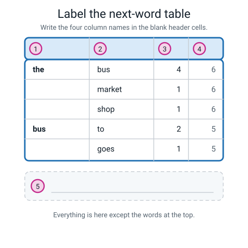
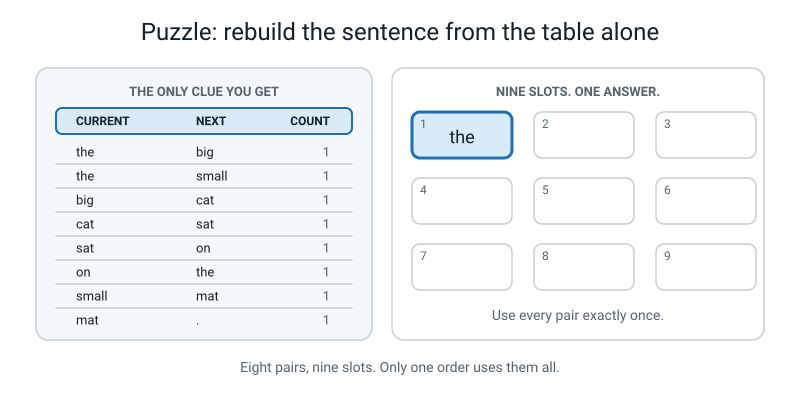
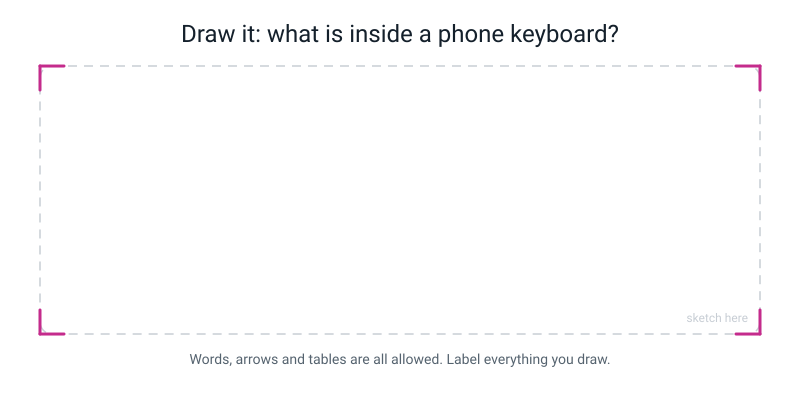

# Workbook — Week 28: Counting Word Pairs: The Whole Engine

**Name:** ________________________________  **Date:** ______________

[📖 Read the chapter first](../student-guide/week-28.md) · [Course Home](../README.md)

---

## ✅ Warm-Up (5 min)

Five quick questions about **last week** — tokens. Notebook closed.

**W1.** What is a **corpus**?

________________________________________________________________

**W2.** Tokenize `I love pizza!` **two** different ways, and give the token count for each.

Way 1 (punctuation glued on): ______________________________  tokens: ______

Way 2 (punctuation split off): ______________________________  tokens: ______

**W3.** For `i love pizza . do you love pizza ?` — how many **tokens**, and how many **unique** tokens?

tokens: ______   unique tokens: ______   Why are the two numbers different? ______________________

________________________________________________________________

**W4.** Which matters more in a tokenizer — being clever, or being consistent? Say why in one sentence.

________________________________________________________________

**W5.** Is a token always a word? Give an example that settles it.

________________________________________________________________

---

## ✍️ Practice Set A — Understand It

**A1. Fill in the blanks.**

(a) Number of bigrams = number of ____________ minus ________.

(b) A bigram is two tokens that appeared ________________________________, in that ____________.

(c) ____________ ____________ is how many times each word appears in a text.

(d) Any system that predicts likely next words is a ____________ ____________.

(e) The `.` is a ____________, so pairs are allowed to ____________ it.

---

**A2. Multiple choice.** Circle **one**. A story has **76 tokens**. How many bigrams will a complete tally have?

| | | |
|---|---|---|
| **A** | 75 | |
| **B** | 76 | |
| **C** | 77 | |
| **D** | You cannot tell without reading the story | |

Explain your choice in one line: ____________________________________________

---

**A3. True or false — and explain.**

(a) `hot dog` and `dog hot` are the same bigram.  **T / F**

Because: ________________________________________________________

(b) If your tally total equals tokens − 1, your table must be correct.  **T / F**

Because: ________________________________________________________

(c) One word can have more than one row in a next-word table.  **T / F**

Because: ________________________________________________________

---

**A4. Match the pairs.** Draw a line, or write the letter in the box.

| Term | | | Example |
|---|---|---|---|
| 1. word frequency | ☐ | **A** | `the → bus` |
| 2. bigram | ☐ | **B** | Your tally sheet (your phone keyboard and a chatbot do the same job with bigger, cleverer machinery) |
| 3. next-word prediction | ☐ | **C** | `the` appears 6 times in our corpus |
| 4. language model | ☐ | **D** | You are at `the`, so the best guess is `bus` |
| 5. corpus | ☐ | **E** | Six sentences about a bus |

---

**A5. Label the diagram.** Write the four column names in the blank header cells, and write the arithmetic check in box 5.


*Figure W28.1 — Five rows of real data, four blank headers. The box underneath is for the arithmetic check.*

Box 1: ____________  Box 2: ____________  Box 3: ____________  Box 4: ____________

Box 5: ________________________________________________________

---

**A6. Read the table.** Here is a finished next-word table from someone else's corpus. It is not the bus one.

| CURRENT | NEXT | COUNT | OUT OF |
|---|---|---:|---:|
| **dog** | barks | 3 | 6 |
| | sleeps | 2 | 6 |
| | runs | 1 | 6 |
| **cat** | sleeps | 4 | 5 |
| | purrs | 1 | 5 |
| **.** | the | 3 | 3 |

(a) How many **different** followers does `dog` have? ______

(b) What is the most likely word after `cat`, and how likely? ______________ , ______ out of ______

(c) How many times does the word `dog` appear in that corpus? ______  How do you know?

________________________________________________________________

(d) Which word is more **predictable**, `dog` or `cat`? Explain using the numbers.

________________________________________________________________

________________________________________________________________

---

## ✍️ Practice Set B — Use It

**B1.** Your friend tallies a 100-token story and ends up with **105** tally marks. Without seeing their sheet at all, what do you know?

________________________________________________________________

________________________________________________________________

---

**B2.** Another friend tallies a poem and decides to stop every pair at the **end of each line**, because "a line is like a sentence". Their poem has **48 tokens** in **8 lines**.

(a) Predict their pair count: ______ − ______ = ______ pairs

(b) What information have they thrown away by doing it that way?

________________________________________________________________

________________________________________________________________

---

**B3. Here is a situation. What would go wrong and why?** A student picks a **football team sheet** as their 60-word corpus — eleven player names, their positions, and the substitutes.

(a) What will their finished next-word table look like?

________________________________________________________________

________________________________________________________________

(b) Why is it a bad table for predicting anything?

________________________________________________________________

(c) What kind of text should they have picked instead?

________________________________________________________________

---

**B4. Here is a situation. What would go wrong and why?** A company builds a phone keyboard's next-word table by counting word pairs in **legal contracts only** — nothing else.

(a) Give two words it will suggest far too often.

________________________  and  ________________________

(b) Give two things this contracts-only table will never suggest, no matter how much you type.

________________________  and  ________________________

(c) Finish this sentence: a language model is only as good as ______________________________

________________________________________________________________

---

**B5.** Your tally on the bus corpus totals **39**, which is exactly right. But check 2 says:

```
   bus group:  6 marks,  but "bus" appears 5 times     <- one too many
   to  group:  3 marks,  but "to"  appears 4 times     <- one too few
```

What **single** mistake explains both of those at once?

________________________________________________________________

________________________________________________________________

Why did check 1 not spot it? ______________________________________________

---

## 🧩 Puzzle of the Week

### The Mystery Corpus

Somebody built a next-word table and then **threw away the text**. All you have is the table. Rebuild the original sentence.


*Figure W28.2 — Eight pairs, every count one. Nine slots, the first word given. Rebuild the sentence.*

The table, written out:

| CURRENT | NEXT | COUNT |
|---|---|---:|
| the | big | 1 |
| the | small | 1 |
| big | cat | 1 |
| cat | sat | 1 |
| sat | on | 1 |
| on | the | 1 |
| small | mat | 1 |
| mat | . | 1 |

**The clues you are given:**

- There are **8 pairs**, so the original text had **9 tokens**.
- The first token was `the`.
- Every pair must be used **exactly once**.

**Write the nine tokens:**

| 1 | 2 | 3 | 4 | 5 | 6 | 7 | 8 | 9 |
|---|---|---|---|---|---|---|---|---|
| the | ______ | ______ | ______ | ______ | ______ | ______ | ______ | ______ |

**The hard part.** At token 1 you are at `the`, and `the` has **two** followers — `big` and `small`. So you have a choice. Show that one of the two choices is **impossible**, by starting with it and seeing what happens:

If token 2 were `small`, the sentence goes: ____________________________________

and it runs out after ______ tokens, having used only ______ of the 8 pairs. So it must be wrong.

---

## 🤔 Think Deeper

**T1.** Your phone's next-word table was built by counting pairs in an enormous pile of text. **Somebody chose that pile.** Write a paragraph: who do you think chose it, what might they have included, and what might they have left out? Then say one way that choice could show up in the suggestions you see.

________________________________________________________________

________________________________________________________________

________________________________________________________________

________________________________________________________________

________________________________________________________________

---

**T2.** Does your brain actually keep a tally of word pairs? Write a paragraph. Say what we can be reasonably confident about, what we genuinely do not know, and what a person is claiming too much if they say *"chatbots work just like the brain"*.

________________________________________________________________

________________________________________________________________

________________________________________________________________

________________________________________________________________

________________________________________________________________

---

## 🛠️ Build It

### Your own next-word table, from your own sixty words

**Step checklist — tick as you go:**

- ☐ **1.** Choose a text of about **60 words**. Song lyrics, a recipe, a match report, a paragraph from a book, the rules of a game.
- ☐ **2.** Write your **tokenizing rules** at the top of the page, before you touch the text.
- ☐ **3.** Copy out the text and **number every token**.
- ☐ **4.** Write your **prediction**: tokens − 1 = ______ pairs. **Before** you make a single mark.
- ☐ **5.** Tally: CURRENT · NEXT · TALLY, working strictly left to right from token 1.
- ☐ **6.** Total the marks. Compare with your prediction.
- ☐ **7.** If it doesn't match, walk the sentence **joins** first.
- ☐ **8.** Add COUNT and OUT OF columns.
- ☐ **9.** Run **check 2** on your three biggest groups.
- ☐ **10.** Answer the four questions below.

> **⚠️ Watch out:** avoid text stuffed with names and numbers. Eleven names that each appear once make a table with nothing in it to predict. **Repetitive text makes a better table** — and noticing that is a real finding.

### My rules and my text

**My tokenizing rules:**

1. ________________________________________________________________
2. ________________________________________________________________
3. ________________________________________________________________
4. ________________________________________________________________

**My text:** ________________________________________________________

________________________________________________________________

________________________________________________________________

**Where it came from:** __________________________________________

### My prediction box

| Total tokens | − 1 | = pairs I expect | Marks I actually counted | ☐ Check 1 passed |
|---:|---:|---:|---:|---|
| ______ | 1 | ______ | ______ | ☐ |

### My tally sheet

| CURRENT | NEXT | TALLY | COUNT | OUT OF |
|---|---|---|---:|---:|
| | | | | |
| | | | | |
| | | | | |
| | | | | |
| | | | | |
| | | | | |
| | | | | |
| | | | | |
| | | | | |
| | | | | |
| | | | | |
| | | | | |

*(Copy this table out as many times as you need. Leave four blank lines under each new CURRENT word.)*

### Check 2 — my three biggest groups

| Word | OUT OF number in my table | Times the word appears | Same? |
|---|---:|---:|---|
| | | | ☐ |
| | | | ☐ |
| | | | ☐ |

> If one is **one too big** and another is **one too small**, you have written a pair into the wrong group. Find it.

### The four questions, answered off MY table

**Q1.** Which word appears **most often** in my text, and how many times?

________________________________________________________________

**Q2.** Which word has the most **different** followers? How many?

________________________________________________________________

**Q3.** What is the most likely word to come after my text's **first** word? Give the count.

________________________________________________________________

**Q4.** Find one pair that appears **exactly once**. Write it out.

________________________________________________________________

### The phone task

**The three suggestions I got after typing `I am going to the`:**

1. ______________  2. ______________  3. ______________

**My fifteen-tap sentence, unedited** (tap the **middle** suggestion fifteen times, and write down whatever comes out, including anything stupid):

________________________________________________________________

________________________________________________________________

**Did it start going round in a circle?** ☐ yes ☐ no. If yes, which words repeated? ______________

**What tally must be sitting behind those three keys?** Two lines.

________________________________________________________________

________________________________________________________________

---

## 🎨 Draw It

Draw what is inside a phone keyboard when it offers you three words. Label everything.


*Figure W28.3 — Your page. Draw what is actually inside a phone keyboard's suggestion bar.*

> **💡 What a good answer looks like:** left to right, four parts. (1) An enormous pile of text, with a note saying *"somebody counted pairs in this, once, long before you bought the phone."* (2) A table with three columns — CURRENT, NEXT, COUNT — and a few real rows in it. (3) An arrow labelled **"look up the word I just typed"** pointing at one group in the table. (4) Three keys, with an arrow from the top three rows of that group, labelled **"sorted by count, biggest first"**. Then the part that earns the marks: somewhere on your drawing, a box saying **"nothing anywhere in here is about what the words mean"**, with an arrow pointing at the table.

---

## 📊 Self-Check

Tick one box per row. Be honest — this is for you, not for marks.

| I can… | 😀 easily | 🙂 with a bit of help | 😕 not yet |
|---|---|---|---|
| Tally every bigram in a short text without missing one or double-counting | ☐ | ☐ | ☐ |
| Build a next-word table with COUNT and OUT OF columns | ☐ | ☐ | ☐ |
| Use **both** checks, and say why one is not enough | ☐ | ☐ | ☐ |
| Read a next-word table to say what will probably come next | ☐ | ☐ | ☐ |
| Explain what my phone is doing when it shows me three words | ☐ | ☐ | ☐ |
| Say what word frequency, a bigram, next-word prediction and a language model are | ☐ | ☐ | ☐ |

---

## ✅ Answers

<details>
<summary>Check your answers</summary>

### Warm-Up

**W1.** A **corpus** is the body of text a machine learns from. Our corpus this week was six sentences about a bus.

**W2.** Way 1 (glued): `[I] [love] [pizza!]` = **3 tokens**. Way 2 (split): `[I] [love] [pizza] [!]` = **4 tokens**.
Neither is "the right answer" — they are two different rules. What matters is that you wrote down which one you used and then used it every single time.

**W3.** **9 tokens, 7 unique.** The nine are `i · love · pizza · . · do · you · love · pizza · ?`. The unique ones are `i · love · pizza · . · do · you · ?`. They differ because `love` and `pizza` each appear **twice** — the token count says how much text you have, the unique count says how many *different* pieces are in it.

**W4. Consistent**, easily. A tokenizer that follows the same written rule every time gives you counts you can trust and check. A clever one that treats `don't` as one token in sentence A and two in sentence C gives you counts that mean nothing, because they are counting two different things.

**W5. No.** A **full stop** is a token and is not a word. So is a question mark, and in a lot of real systems so is an emoji. "Token = word" is close enough for this course and wrong in general.

---

### Practice Set A

**A1.** (a) **tokens**, **1** · (b) **next to each other**, **order** · (c) **Word frequency** · (d) **language model** · (e) **token**, **cross**

**A2. A — 75.** Every token starts exactly one pair, except the very last one, which has nothing after it. So it is always tokens − 1, and you never need to read the story to know it. (**D** is the tempting wrong answer: it feels like you would need to see the text. You don't. That is exactly what makes this check so useful.)

**A3.**

(a) **False.** Order is part of what a bigram *is*. `hot dog` and `dog hot` are two different bigrams, and only one of them ever turns up in a recipe. That direction is the whole reason pairs work where frequency fails.

(b) **False**, and this is the most important "false" in the week. Suppose you meant `to → the` and wrote it the wrong way round as `the → to`. How many marks went on the sheet? One — same as if you had got it right. **The total is completely blind to direction.** Passing a check means you did not fail *that* check. It does not mean you are right. That is why check 2 exists.

(c) **True.** A word gets one row for each **different** follower. `the` has three rows — `bus`, `market`, `shop` — because `the` was followed by three different words. Common words get lots of rows; that is normal, not a mistake.

**A4.** 1 → **C** · 2 → **A** · 3 → **D** · 4 → **B** · 5 → **E**

**A5.** Box 1 **CURRENT** · Box 2 **NEXT** · Box 3 **COUNT** · Box 4 **OUT OF** · Box 5 **bigrams = tokens − 1**
(CURRENT is where you are; NEXT is where you went. If you write them the other way round, every single pair in your table points backwards and nothing will tell you.)

**A6.**

(a) **3** — `barks`, `sleeps`, `runs`.

(b) **`sleeps`, 4 out of 5.** Read it straight off: the biggest count in the `cat` group is 4, and the group's OUT OF is 5.

(c) **6 times.** The OUT OF number for a group tells you how many times that word was followed by something — which is how many times it appears, unless it happens to be the very last token of the corpus. It isn't: a corpus of sentences ends with `.`, so the last token is a full stop, not `dog`. So 6 it is.

(d) **`cat` is more predictable.** Its best guess is 4 out of 5 — right about four times in five. `dog`'s best guess is 3 out of 6, which is only half the time. So even though `dog` appears *more often*, it is *less* predictable. That surprises most people, and it is worth remembering: **how often ≠ how predictable.**

---

### Practice Set B

**B1.** They are **wrong**, and you know it without reading a word of their story. It should be **99**, because 100 tokens − 1 = 99. They have six marks too many, so they either counted six pairs twice, or invented six pairs that were not there, or (most likely) lost their place and doubled back over a stretch of text.
**Bonus credit** if you added: "and even if they *had* got 99, I still could not be sure they were right." That is check 2 understood.

**B2.**

(a) **48 − 8 = 40 pairs.** One pair is lost at the end of every line, because a pair is not allowed to step across a line break. Eight lines, eight lost pairs. (Compare: our rule would have given 47.)

(b) They have thrown away **the whole line-break group** — and with it every clue about **which words start a line**. Under our rule, the followers of `.` are exactly the words that begin sentences, which is real, useful information that appeared without anybody being told what a sentence is. Their method deletes it.
It is worth saying clearly: their rule is not *wrong*. It is a different, defensible choice — as long as they wrote it down and used it every time. What is not defensible is doing it one way in verse 1 and the other way in verse 2.

**B3.**

(a) It will be a table where **almost every group has exactly one follower and every count is 1.** Eleven names, each appearing once; eleven positions, mostly appearing once. The `.` group will have a long list of different followers, one mark each.

(b) Because there is **nothing to predict**. A next-word table is useful when one follower is clearly commoner than the others — that is what lets it make a guess. If every count is 1, then every guess is a random pick among equals and the table has learned nothing about the language. Worse, the tally is miserable to do: you get almost no repeated rows, so you are writing a brand-new row for nearly every one of the 59 pairs.

(c) Something **repetitive**. Song lyrics with a chorus are almost the perfect choice. A recipe (`add`, `then`, `the`, `and` over and over). The rules of a game. A paragraph of ordinary prose with plenty of `the`, `and`, `to` in it.

**B4.**

(a) Any two legal-sounding words: **`hereinafter`**, **`party`**, **`agreement`**, **`whereas`**, **`shall`**, **`clause`**. Words that are common in contracts and nowhere else.

(b) Any two of: **slang**, **your friends' names**, **emoji**, **the name of a game**, **"lol"**, **anything invented after the contracts were written**. If a pair never occurred in the corpus, it has no count, so this table can never suggest it.

(c) …**the corpus it counted**. (Any wording of that idea is right: *"the text it was built from"*, *"the pile of words somebody chose"*.) The table cannot know anything that was not in the text, and it cannot help preferring whatever the text preferred.

**B5.** **One pair was written into the wrong group.** A pair that should have been `to → something` got recorded as a `bus → something` row instead. That single error does two things at once: it adds a mark to `bus` (now 6, one too many) and removes one from `to` (now 3, one too few).
**Check 1 could not spot it** because one mark went down on the sheet either way. The total is 39 whether you put the mark in the right group or the wrong one. **This pair of symptoms — one group one too big, another one too small — nearly always comes together, and it almost always means one misfiled pair.** That is the fastest bug to find in the whole activity once you know the signature.

---

### 🧩 Puzzle of the Week

**The answer:**

| 1 | 2 | 3 | 4 | 5 | 6 | 7 | 8 | 9 |
|---|---|---|---|---|---|---|---|---|
| the | big | cat | sat | on | the | small | mat | . |

**`the big cat sat on the small mat .`**

**How to get there.** You are at `the`, and `the` has two followers, so there is a genuine choice. Try the wrong one first, because that is what proves the answer:

**If token 2 were `small`:** `the small mat .` — and then you are stuck, because `.` has **no** followers in this table. The sentence dies after **4 tokens**, having used only **3** of the 8 pairs. So that branch is impossible.

**So token 2 must be `big`**, and after that there is no choice at all — every remaining group is forced:

```
   the  -> big     (choice: we proved small fails)
   big  -> cat     forced
   cat  -> sat     forced
   sat  -> on      forced
   on   -> the     forced
   the  -> small   (the only unused "the" pair left)
   small-> mat     forced
   mat  -> .       forced
```

Eight pairs, all used, nine tokens. ✓

**The bit worth noticing.** The word `the` appears **twice** in the answer, and that is the only reason `the` has two rows. A next-word table does not record *where* in the text a word was — only what came after it, each time. So when you rebuild a text from a table, the repeated words are where all the difficulty lives.

---

### 🤔 Think Deeper

**T1.** A strong answer says three things.

**Who chose it:** a company. Engineers at a phone maker or a keyboard app maker, deciding which piles of text to feed the counter — books, news, web pages, whatever they had rights to. Nobody voted on it and it is generally not published.

**What might be in or out:** in — a great deal of published English, mostly formal, mostly written by adults, mostly older than the phone. Out — languages with less text online, slang that arrived last year, the way *your* family talks, and anything that was never typed up in the first place.

**How it shows up:** the suggestions feel slightly like a newspaper. It offers you `the shop` and `the station` and has never heard of the nickname your friends use. If you type in two languages it will usually be much better at one of them. And it will suggest whatever was common in that pile, which is not the same as what is common for you.

**Full marks** for spotting that this is a *choice made by people*, not a fact about the world — and that nobody asked you. (Keep this answer. Weeks 31 and 32 are entirely about it.)

**T2.** A strong answer is careful about three separate things.

**What we can be confident about:** something in your head definitely predicts upcoming words. That is measurable — your reading slows down at an unexpected word, and you can hear a wrong note in a familiar phrase instantly, before you have worked out what is wrong. So prediction is genuinely happening.

**What we genuinely do not know:** whether your brain stores anything like *counts of pairs*. Nobody can open a brain and read the table off, the way you can read yours off a sheet of paper. That question is unsettled, and honest scientists say so.

**What is claiming too much:** saying *"chatbots work just like the brain."* Brains do plenty that next-word counting obviously cannot. You know what a bus **is**. You can ride one. You can be annoyed when it is late. None of that is in a tally of pairs. So: prediction, yes, certainly. Something distantly like counting, maybe. **The same table? No evidence at all.**

---

### 🛠️ Build It

Your table will be your own, so there is no single answer — but here is a fully worked reference on a 60-token match report, so you can see what a complete, full-credit job looks like.

**The reference corpus:**

```
   India won the toss and chose to bat. Rohit hit the first ball for four.
   He hit the next ball for six. The crowd stood up and cheered.
   India scored two hundred runs. Australia needed two hundred and one runs to win.
   They lost by four runs. It was a great match.
```

**60 tokens. Prediction: 60 − 1 = 59 pairs.**

**The groups with more than one mark:**

| CURRENT | NEXT | COUNT | OUT OF |
|---|---|---:|---:|
| **.** | rohit · he · the · india · australia · they · it | 1 each | 7 |
| **the** | toss · first · next · crowd | 1 each | 4 |
| **and** | chose · cheered · one | 1 each | 3 |
| **runs** | . | 2 | 3 |
| | to | 1 | 3 |
| **india** | won · scored | 1 each | 2 |
| **to** | bat · win | 1 each | 2 |
| **for** | four · six | 1 each | 2 |
| **four** | . · runs | 1 each | 2 |
| **hundred** | runs · and | 1 each | 2 |
| **hit** | the | 2 | 2 |
| **ball** | for | 2 | 2 |
| **two** | hundred | 2 | 2 |

Plus **26 groups with exactly one follower**: won→the, toss→and, chose→to, bat→., rohit→hit, first→ball, he→hit, next→ball, six→., crowd→stood, stood→up, up→and, cheered→., scored→two, australia→needed, needed→two, one→runs, win→., they→lost, lost→by, by→four, it→was, was→a, a→great, great→match, match→.

**Check 1:** 7 + 4 + 3 + 3 + 2 + 2 + 2 + 2 + 2 + 2 + 2 + 2 = 33, plus 26 singleton groups = **59** ✓ = 60 − 1 ✓

**Check 2, spot checks:** `runs` appears 3 times, 3 marks ✓ · `two` appears twice, 2 marks ✓ · `the` appears 4 times, 4 marks ✓ · `.` appears **8** times but token 60 is the last, so **7** marks is correct ✓

**The four questions, answered off that table:**

**Q1 — most common word.** The **full stop, 8 times**. Counting only real words, **`the`, 4 times**. A strong answer gives both. And notice: the top word in a match report is `the` — exactly as predicted. The most common word carries almost no meaning.

**Q2 — most different followers.** The **full stop, with 7** — `rohit`, `he`, `the`, `india`, `australia`, `they`, `it`. Among real words, **`the`, with 4**.
Write this in the margin, because it is the best thing in the exercise: **the followers of `.` are exactly the words that start sentences.** Nobody told the table what a sentence is. It counted, and the information appeared by itself.

**Q3 — most likely word after the first word.** The first word is `india`. It appears twice, followed once by `won` and once by `scored`. So there is **no single most likely word — it is a dead tie, 1 and 1.**
That is the **best possible outcome** for this question, and if you got it you should make a fuss of it. Sometimes the honest answer to "what comes next?" is *"the table genuinely does not know."* If your own corpus gave a clear winner instead, that is fine too — say what came second and how close it was.

**Q4 — a pair that appears exactly once.** Lots of them. Clean examples: `hundred → and`, `runs → to`, `four → runs`, `crowd → stood`. Any of the 26 singleton groups works, and so do most rows inside the bigger groups.

**The phone task.** The exact sentence differs on every device, so what is being marked is the **reasoning**, not the output. A full-credit answer has three parts:

1. **The three suggestions**, written down as they appeared. Common results after `I am going to the` are `shop`, `store`, `hospital`, `gym`, `park`, `bus`, `same`, `end`. Any three are fine.
2. **The fifteen-tap sentence, unedited.** Typically something like *"I am going to the shop and get a new one for me to be able to see you soon and I will be there in a bit and I will be there in a bit."* Two features are worth praising: it **reads like English one pair at a time** (even though the whole thing means very little), and it **goes round in a circle** near the end.
3. **The explanation.** Full credit needs all three of: (a) somebody counted word pairs in a large amount of text, beforehand; (b) the phone **looks up** the word you just typed; (c) it shows the **three followers with the biggest counts**. Half credit for "it has a table of what follows what" with no lookup and no top-three rule.

---

### 🎨 Draw It

There is no single right drawing, but a full-credit one has all four parts in order — the pile of text, the table, the lookup arrow on **one group**, and the three keys taken from the **top three rows by count**.

The thing that separates a good drawing from a correct one is the honest label: somewhere on the page, a note saying **"nothing in here is about what the words mean"**, pointing at the table. If a visitor could look at your drawing and come away thinking the phone understands the sentence, the drawing is not finished.

A nice extra, if you spotted it: a **second, smaller** pile of text labelled *"my own messages"*, feeding into the same table with a thinner arrow. That is why your friend's name eventually shows up as a suggestion, and it is a real part of how the thing works.

</details>

---

[⬅ Week 27 workbook](week-27.md) · [📖 Week 28 chapter](../student-guide/week-28.md) · [Course Home](../README.md) · [Week 29 workbook ➡](week-29.md) · [Glossary](../../glossary.md)
