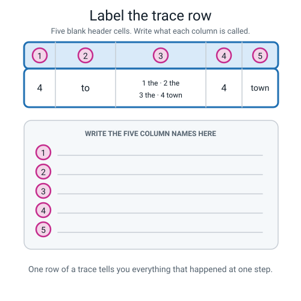
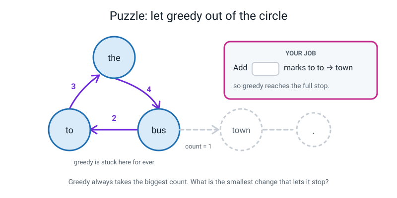
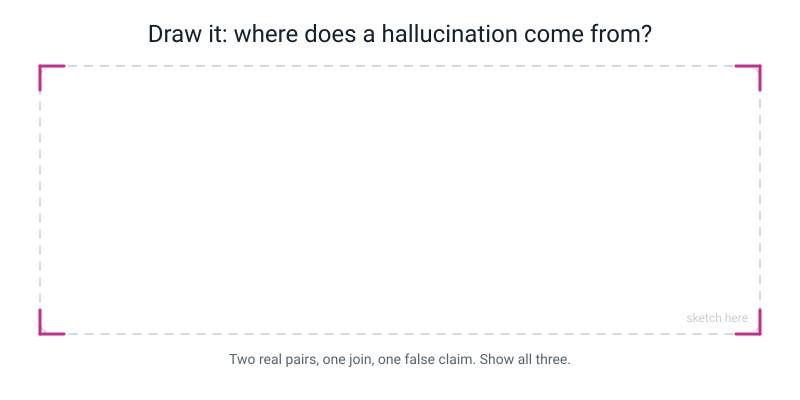

# Workbook — Week 29: Dice, Fluency, and Making Things Up

**Name:** ________________________________  **Date:** ______________

[📖 Read the chapter first](../student-guide/week-29.md) · [Course Home](../README.md)

---

## ✅ Warm-Up (5 min)

Five quick questions about **last week** — bigrams and tally sheets. Notebook closed.

**W1.** A text has **51 tokens**. How many bigrams will a complete tally have, and how do you know without reading it?

________________________________________________________________

**W2.** Why is `hot dog` a different bigram from `dog hot`?

________________________________________________________________

**W3.** Your tally total is exactly tokens − 1. Name one mistake that check would **not** catch.

________________________________________________________________

**W4.** In our bus corpus, `the` has three rows: `bus` 4, `market` 1, `shop` 1. What does the number **6** in the OUT OF column mean?

________________________________________________________________

**W5.** In three sentences, what is your phone doing when it shows three words above the keyboard?

________________________________________________________________

________________________________________________________________

---

## ✍️ Practice Set A — Understand It

**A1. Fill in the blanks.**

(a) Always picking the follower with the highest count is called ____________.

(b) Picking at random, but giving each follower a chance in proportion to its count, is called ____________.

(c) The text you give the model to start from is the ____________.

(d) How many previous words the model is allowed to look at is its ____________.

(e) When an AI produces something that sounds right but isn't true, that is a ____________.

(f) A word with only one follower has no choice to make. We call it ____________.

---

**A2. Multiple choice.** Circle **one**. The bag for `bus` has **5** slips. You roll a **6**. What do you do?

| | | |
|---|---|---|
| **A** | Use slip 5, since it's the closest | |
| **B** | Use slip 1, since 6 wraps round to the start | |
| **C** | The roll doesn't count. Cross it out and roll again | |
| **D** | Stop the sentence there | |

Why is **A** unfair? ______________________________________________________

________________________________________________________________

---

**A3. True or false — and explain.**

(a) Greedy generation is broken.  **T / F**

Because: ________________________________________________________

(b) A sentence that reads perfectly must be true.  **T / F**

Because: ________________________________________________________

(c) Sampling can produce a sentence that was already in the corpus, word for word.  **T / F**

Because: ________________________________________________________

---

**A4. Match the pairs.** Write the letter in the box.

| Word | | | Example |
|---|---|---|---|
| 1. sampling | ☐ | **A** | Our table sees 1 word. A big chatbot sees about 100,000 |
| 2. greedy | ☐ | **B** | `amma takes the bus to the market .` |
| 3. prompt | ☐ | **C** | The `the` bag has 4 `bus` slips out of 6 |
| 4. context | ☐ | **D** | The single word `amma`, typed in to start it off |
| 5. hallucination | ☐ | **E** | From `the` it always says `bus`, every single time |

---

**A5. Label the diagram.** Write the five column names in the blank header cells.


*Figure W29.1 — One row of a real trace. Name the five columns, then say which one the die decided.*

1 ____________  2 ____________  3 ____________  4 ____________  5 ____________

Why must you write out the whole bag at every step, and not just the roll?

________________________________________________________________

---

**A6. Complete two traces.** Use the Week 28 bus table. The bags are:

```
   the  - 6 slips: 1 bus  2 bus  3 bus  4 bus  5 market  6 shop
   .    - 5 slips: 1 amma 2 amma 3 the   4 my   5 i
   bus  - 5 slips: 1 to   2 to   3 goes  4 is   5 .
   to   - 4 slips: 1 the  2 the  3 the   4 town
   i    - 3 slips: 1 take 2 run  3 like
   amma - 2 slips: 1 takes 2 and
   Everything else is FORCED.
```

**Trace (i) — prompt `my`, one roll: 4.**

| STEP | AT WORD | SLIPS IN BAG | ROLL | GOT |
|---:|---|---|---|---|
| 1 | my | | | |
| 2 | | | | |
| 3 | | | | |
| 4 | | | | |
| 5 | | | | |

**Output:** ____________________________________  Reads well? ______  True? ______

**Trace (ii) — prompt `.`, rolls: 1, 2, 3.**

| STEP | AT WORD | SLIPS IN BAG | ROLL | GOT |
|---:|---|---|---|---|
| 1 | . | | | |
| 2 | | | | |
| 3 | | | | |
| 4 | | | | |
| 5 | | | | |
| 6 | | | | |

**Output:** ____________________________________  Reads well? ______  True? ______

If trace (ii) came out **fluent and false**, name the two pairs that joined to do it:

______________________  and  ______________________

---

## ✍️ Practice Set B — Use It

**B1.** Your cousin asks a chatbot the same question twice and gets two different answers. Explain why, in **two sentences**, using this week's words.

________________________________________________________________

________________________________________________________________

---

**B2.** Someone tells you: *"It only made things up because your table was tiny. A real one with a trillion counts wouldn't do that."*

(a) What part of that is **right**?

________________________________________________________________

(b) What part of that is **wrong**, and why?

________________________________________________________________

________________________________________________________________

---

**B3. Here is a situation. What would go wrong and why?** A school decides to save time by having a bigram generator fill in the attendance register. It was built by counting pairs in last year's registers, where `is` was followed by `here` far more often than by `absent`.

(a) The generator is set to **greedy**. What does it write about every single pupil, for ever?

________________________________________________________________

(b) Which word can it **never** write, and why is "never" the right word rather than "rarely"?

________________________________________________________________

________________________________________________________________

(c) Is anything **broken**? Answer yes or no, and defend it in one line.

________________________________________________________________

---

**B4. Here is a situation. What would go wrong and why?** A student building a story-writing app sets the dial all the way to **greedy**, because greedy is "reliable".

(a) What will happen the first time a user asks for a story?

________________________________________________________________

(b) What will happen the second time they ask for a story about the same thing?

________________________________________________________________

(c) Name one job where greedy is genuinely the **right** setting.

________________________________________________________________

---

**B5.** **Prove** that greedy generation starting from `the` can never say the word `amma`. Not "probably won't" — prove it. Write out the set of words greedy can reach, and say why nothing new can ever get into that set.

Words greedy reaches from `the`: ______________________________________

Why the set can never grow: ______________________________________________

________________________________________________________________

So `amma` is ____________, not merely ____________.

---

## 🧩 Puzzle of the Week

### Let Greedy Out of the Circle


*Figure W29.2 — Greedy is stuck going round three words forever. One branch gets it out — find the cost.*

Greedy is stuck going `the → bus → to → the → bus → to →` for ever. The `to` group looks like this:

```
   to  ->  the    3 marks
   to  ->  town   1 mark
```

If greedy ever chose `town`, it would then be **forced** to `.` and the sentence would end.

**(a)** What is the **smallest** number of marks you could add to `to → town` so that greedy escapes and the sentence ends?

Add ______ marks. New counts: `the` ______ vs `town` ______

**(b)** Write out the whole sentence greedy would then produce:

________________________________________________________________

**(c)** The trap. What if you added only **2** marks, making it 3 versus 3? Is a **tie** an escape? Think carefully about what greedy does with a tie.

________________________________________________________________

________________________________________________________________

**(d)** The real question. You just fixed a machine. Did you change the **procedure** (greedy) or the **data** (the table)? Why does that matter?

________________________________________________________________

________________________________________________________________

---

## 🤔 Think Deeper

**T1.** *"Fluent is easy. Fluent is what the machine is **for**."* Write a paragraph on what that means for how you should use a chatbot on your own homework. Be specific: name one job where you would trust it straight away, and one where you would check every claim before using a word of it.

________________________________________________________________

________________________________________________________________

________________________________________________________________

________________________________________________________________

________________________________________________________________

---

**T2.** Design an addition to the generator that would make it **refuse** to say things the corpus does not support. Describe how it would work in two or three sentences. Then — and this is the part that earns the marks — say what your design **costs**.

________________________________________________________________

________________________________________________________________

________________________________________________________________

________________________________________________________________

________________________________________________________________

---

## 🛠️ Build It

### Generate from your own table

Use **your own** next-word table from last week's homework. Not the bus one.

**Step checklist — tick as you go:**

- ☐ **1.** Put your Week 28 table on the desk. Find the groups with **more than one** follower.
- ☐ **2.** Write out a bag for each of those groups only, slips numbered. One-follower words are **forced** — no bag needed.
- ☐ **3.** Generate **sentence 1** by sampling. Write the bag and the roll at every step.
- ☐ **4.** Generate **sentence 2**. Then **sentence 3**.
- ☐ **5.** Generate one sentence **greedily** — no die, twelve words, stop.
- ☐ **6.** Work out how many words of your table greedy can never reach.
- ☐ **7.** Fill the whole READS WELL column. Put the pencil down. Then fill the whole TRUE column.
- ☐ **8.** Find the hallucination. Stamp it FALSE in red.
- ☐ **9.** Write the one-sentence explanation of where the falseness came from.

**Your roll strip** (take them left to right; if a number is bigger than the bag, cross it out and take the next; if you run out, start again):

> ### **4 · 1 · 3 · 6 · 2 · 5 · 1 · 4 · 2 · 6 · 3 · 1 · 5 · 2 · 4 · 1 · 6 · 3 · 2 · 5**

### My bags

| BAG FOR | Number of slips | The slips, numbered |
|---|---:|---|
| | | |
| | | |
| | | |
| | | |
| | | |

**Words in my table that are FORCED (one follower, no roll):** ______________________________

________________________________________________________________

### My traces

**Copy this template out three times — once for each sentence.** Add rows if your sentence runs longer.

**Sentence ______ — prompt: ____________  Rolls used: ______________________**

| STEP | AT WORD | SLIPS IN BAG | ROLL | GOT |
|---:|---|---|---|---|
| 1 | | | | |
| 2 | | | | |
| 3 | | | | |
| 4 | | | | |
| 5 | | | | |
| 6 | | | | |
| 7 | | | | |

**Output:** ____________________________________________________

**My three outputs, written out together so I can score them:**

1. ______________________________________________________________
2. ______________________________________________________________
3. ______________________________________________________________

### My greedy run

**Prompt:** ____________  **No rolls. Always the biggest count. Stop after 12 words.**

| At word | Followers and counts | Biggest | Picks |
|---|---|---|---|
| | | | |
| | | | |
| | | | |
| | | | |
| | | | |

**Output:** ____________________________________________________

**Words greedy can reach:** ______ out of ______ in my table.
**So ______ words are impossible.**

### My score sheet

> **⚠️ Watch out:** fill the **whole** READS WELL column first. Put the pencil down. **Then** go back to the top and fill the whole TRUE column. Never let the first column answer the second.

| # | The sentence | READS WELL? | TRUE TO CORPUS? |
|---|---|---|---|
| 1 | | | |
| 2 | | | |
| 3 | | | |
| G | | | |

### My hallucination write-up

**The sentence** (stamp FALSE across it in red):

________________________________________________________________

**Was any single step against the rules?** ☐ no ☐ yes — if yes, which? ______________

**The two pairs that joined to cause it:**

______________________  and  ______________________

**Where each pair came from in my text:**

________________________________________________________________

________________________________________________________________

**My one sentence — exactly where did the falseness come from?**

________________________________________________________________

________________________________________________________________

________________________________________________________________

> **💡 If none of your three sentences came out false, do not fake it.** Say so, then build a false one by hand from your own table and show that every step is legal. That counts for full marks — arguably more, because deliberately constructing one is harder than stumbling into one.

---

## 🎨 Draw It

Draw where a hallucination comes from. Two real pairs, one join, one false claim — show all three.


*Figure W29.3 — Your page. Draw where a hallucination comes from — and it is not the machine lying.*

> **💡 What a good answer looks like:** left to right. (1) Two boxes, side by side, each holding one real pair from your table, with a note under each saying which sentence of your corpus it came from — and both boxes ticked, because both are genuinely real. (2) A big arrow where the two boxes meet, labelled **"the join"**, circled. (3) The finished sentence written out, with a red **FALSE** band across it. Then the two parts that earn the marks: a small **window frame** drawn round only the **one** word the machine could see at the deciding moment, with the rest of the sentence outside it and greyed out; and a label somewhere saying **"nothing here is broken — every step obeyed every rule"**.

---

## 📊 Self-Check

| I can… | 😀 easily | 🙂 with a bit of help | 😕 not yet |
|---|---|---|---|
| Generate a sentence by sampling, writing every bag and every roll | ☐ | ☐ | ☐ |
| Generate greedily and explain why greedy loops and bores | ☐ | ☐ | ☐ |
| Name words greedy can **never** produce, and say why "never" is right | ☐ | ☐ | ☐ |
| Score a sentence on two separate axes without letting one answer the other | ☐ | ☐ | ☐ |
| Trace a hallucination to the two pairs that caused it | ☐ | ☐ | ☐ |
| Say what sampling, greedy, prompt, context and hallucination mean | ☐ | ☐ | ☐ |

---

## ✅ Answers

<details>
<summary>Check your answers</summary>

### Warm-Up

**W1. 50 bigrams.** Every token starts exactly one pair except the very last one, which has nothing after it. So it is always tokens − 1, and you never need to read the text.

**W2.** Because **order is part of what a bigram is**. A bigram records that word A was followed by word B, and `dog hot` records the opposite claim. `hot dog` turns up in a menu; `dog hot` turns up nowhere. That direction is exactly the information word frequency threw away.

**W3.** A pair written **backwards**, or filed into the **wrong group**. One mark goes down either way, so the total is identical. That is why check 2 exists — a misfiled pair makes one group one too big and another one too small.

**W4.** **`the` was followed by something six times**, so the whole group has six marks. It also equals how many times `the` appears — which is check 2.

**W5.** Three moving parts: (1) somebody counted word pairs in an enormous amount of text, long before you bought the phone; (2) the phone **looks up** the word you just typed; (3) it shows the **three followers with the biggest counts**. No understanding anywhere in it.

---

### Practice Set A

**A1.** (a) **greedy** · (b) **sampling** · (c) **prompt** · (d) **context** · (e) **hallucination** · (f) **forced**

**A2. C — the roll doesn't count, roll again.**
**A is unfair** because slip 5 would then get picked on a 5 **and** on a 6 — twice as often as slips 1 to 4, so the word on it becomes twice as likely as the data says. The counts are supposed to *be* the chances, and A breaks that. B is unfair for the same reason, with slip 1. (Real computers don't roll dice — they take a random number between 0 and 1 and scale it to the bag, so nothing is wasted. Same idea, better tool.)

**A3.**

(a) **False.** Greedy works perfectly — it does exactly what it was told, every time. The loop is a *consequence* of working correctly, not a malfunction. The real finding is more general: **best-at-each-step is not the same as best-overall**, which is also true in chess and in mazes.

(b) **False**, and this is the whole week. Reading well and being true are two completely different questions. The machine is optimising for exactly one of them — *does this word plausibly follow that word?* — and nothing anywhere in the procedure checks reality. A well-formed false sentence and a well-formed true sentence look identical to a next-word predictor, because they are both well-formed.

(c) **True**, and it catches people out. Sampling does not *avoid* the original text — `the bus goes to town .` is sentence 3 of our corpus, word for word, produced on rolls 2-3-4. It can copy, it can invent, and **it has no idea which of the two it just did.**

**A4.** 1 → **C** · 2 → **E** · 3 → **D** · 4 → **A** · 5 → **B**

**A5.** 1 **STEP** · 2 **AT WORD** · 3 **SLIPS IN BAG** · 4 **ROLL** · 5 **GOT**

**Why write out the whole bag:** it is the only thing that makes a random process **checkable afterwards**. Write only the roll, and nobody — including you tomorrow — can prove the word you got was really on that slip.

**A6.**

**Trace (i) — prompt `my`, roll 4:**

| STEP | AT WORD | SLIPS IN BAG | ROLL | GOT |
|---:|---|---|---|---|
| 1 | my | 1 bus | forced | bus |
| 2 | bus | 1 to · 2 to · 3 goes · 4 is · 5 . | **4** | is |
| 3 | is | 1 very | forced | very |
| 4 | very | 1 late | forced | late |
| 5 | late | 1 . | forced | . |

**Output: `my bus is very late .`** Reads well **✓** · True **✓** — that is sentence 4 of the corpus, word for word. Only **one** roll was needed; four of the five steps were forced. Notice how much of a small table has no choice in it at all.

**Trace (ii) — prompt `.`, rolls 1, 2, 3:**

| STEP | AT WORD | SLIPS IN BAG | ROLL | GOT |
|---:|---|---|---|---|
| 1 | . | 1 amma · 2 amma · 3 the · 4 my · 5 i | **1** | amma |
| 2 | amma | 1 takes · 2 and | **2** | and |
| 3 | and | 1 i | forced | i |
| 4 | i | 1 take · 2 run · 3 like | **3** | like |
| 5 | like | 1 it | forced | it |
| 6 | it | 1 . | forced | . |

**Output: `amma and i like it .`** Reads well **✓** — a perfectly ordinary English sentence. True **✗**.

Check the corpus: it says *"Amma and I run to the bus."* and, separately, *"I like it."* **Nobody ever said Amma liked anything.**

**The two pairs that joined:** **`and → i`** (from *"Amma and I run…"*) and **`i → like`** (from *"I like it."*). Both completely real. Glued together they make a claim the corpus never made — and at the moment it chose `like`, the entire world it could see was the single word `i`. `amma` was two tokens back and already gone.

---

### Practice Set B

**B1.** Two sentences, something like: *"Because it is **sampling** — drawing a slip out of a bag, where the common followers have more slips. Same bag, different draw, so the same **prompt** gives a different sequence of words."*
Full credit needs the word **sampling** (or the bag idea) **and** the point that nothing changed between the two tries. Half credit for "it's random", because that misses the *weighting*, which is the whole cleverness.

**B2.**

(a) **Right:** a bigger table, and especially a bigger **context**, genuinely fixes a real problem — **forgetting**. A large model would not lose track of the fact that we were talking about Amma, and would not produce our crude three-word loops. Say that clearly; pretending otherwise is dishonest.

(b) **Wrong:** it will not fix **truth**. Nothing in the counting procedure checks reality, so multiplying the counts by a million multiplies the *fluency* and leaves the missing step exactly as missing as it was. **The world is not in the window.** A big context can keep an answer consistent with the text so far; there is no step anywhere where anybody consults reality. That is not a small missing feature — it is a missing category.

**B3.**

(a) **"is here"** for every single pupil, for ever. The `is` group's biggest count is `here`, the table never changes, so the decision never changes.

(b) Never **`absent`** — and "never" is right rather than "rarely" because greedy is **deterministic**. `absent` has a smaller count than `here` in the only group that could produce it, so its chance is not small, it is **zero**.

(c) **No, nothing is broken.** Every step obeyed every rule. The register is wrong *and* the machine is working exactly as designed — which is why "fix the bug" is the wrong response. There is no broken line. What is missing is a step that never existed: one that checks whether the claim is true.

**B4.**

(a) **One story**: grammatical, dull, and repeating itself for ever — greedy walks into a circle and cannot climb out.

(b) **Exactly the same story**, word for word. Same table, same prompt, same choices. For a story app that is fatal: the whole point of "try again" is to get something different.

(c) Any job where the same input **must** give the same output — turning a form into a standard sentence, a keyboard strip you are building thumb-memory for, anything where two people comparing results must see the same thing. Greedy is not the bad one; it is the one for a different job.

**B5. The proof.**

Start at `the`. Greedy picks `bus` (4 beats 1 and 1). From `bus`, `to` (2 beats 1, 1, 1). From `to`, `the` (3 beats 1). **And now it is at a word it has already visited.**

**Words greedy reaches from `the`: `{ the, bus, to }`** — three words. **Why the set can never grow:** greedy's choice depends only on which word it is at, and the table never changes, so each of those three always hands back the same next word — and all three of those are already in the set. No way in, no way out. The set is **closed**.

**So `amma` is impossible, not merely unlikely.** So are `market`, `late`, `like`, `shop`, `goes`, `town` and eleven more — **17 of the 20 words.** Greedy is not a cautious version of the model; it is the model with 85% of it amputated.

---

### 🧩 Puzzle of the Week

**(a) Add 3 marks.** `to → town` goes from 1 to **4**, against `to → the` on **3**. Now `town` is the biggest and greedy takes it.

**(b)** Greedy then runs:

```
   the  -> bus    (4 beats 1 and 1)
   bus  -> to     (2 beats 1, 1, 1)
   to   -> town   (4 beats 3)     <- the escape
   town -> .      (forced)

   OUTPUT:  the bus to town .     -- and it STOPS.
```

**(c) A tie is not an escape.** Add only 2 marks and you get `the` 3 versus `town` 3 — greedy now has no answer inside the data, so you must invent a tie-break rule and write it down. Ours is *"whichever appeared first in the corpus wins."* `to → the` first occurs at tokens 5→6, `to → town` at 20→21, so **`the` wins the tie**, greedy picks `the`, and it is straight back in the circle. Two marks buys you nothing. (If you invented a *different* tie-break rule that does escape — say "the follower used least" — that is a good answer, as long as you noticed you had to add a rule that was not in the data.)

**(d) You changed the data, not the procedure.** Greedy is untouched — still "take the biggest count". What changed was three tally marks. **That is the point worth keeping:** the machine was stuck and the fix was **not in the machinery**. It was in what the machine had been given to count. Same pattern as Week 17, where the model got better when the *photos* changed rather than the training button — and it returns in Week 31.

---

### 🤔 Think Deeper

**T1.** A strong paragraph does three things: explains the quote, names a job where fluency **is** the product, and names a job where fluency is dangerous.

**What the quote means:** the machine is built to produce text that reads like text. That is the one thing it optimises for, and it is very good at it. So "it sounded convincing" tells you the machine did its job — and **nothing whatsoever** about whether the content is true.

**Trust it straight away:** anything with no fact in it to get wrong, or where checking takes five seconds — making a paragraph simpler, suggesting names, generating practice questions, rephrasing something you wrote.

**Check every claim:** anything **specific, checkable and expensive to get wrong** — a date, a page number, a quote attributed to a real person, a phone number, anything you will hand in as your own knowledge. The test is not "is this topic serious?" but **"what does it cost me if this sentence is wrong?"**

**T2.** There is no single right design, and the interesting part is always the cost. Two typical answers:

**Design 1 — "only allow whole sentences that were actually in the text."** Genuinely works: every output is a quotation, so it cannot produce a falsehood. **The cost:** it can never say anything **new**. You have destroyed the point of the machine and built a very slow photocopier.

**Design 2 — "check every sentence against a list of true things first."** Also works in principle. **The cost:** to check a claim you need a trustworthy list of true things, and no such list exists for most of the world — and the checker would have to run on every one of the hundreds of words in every answer, in a fraction of a second.

Full marks for sitting honestly in the trade-off rather than escaping it. **This is a real, current, unsolved research problem.** Some systems now search the web and quote sources, which genuinely helps; none of it is reliable. If you got here, you walked straight into the open frontier of the field.

---

### 🛠️ Build It

Your table is your own, so there is no single answer. Here is the whole thing done on the **bus table** with the supplied roll strip, so you can see what a complete, full-credit job looks like.

Roll strip, taken left to right: `4 1 3 6 2 5 1 4 2 6 3 1 5 2 4 1 6 3 2 5`

**Sentence 1 — prompt `the`. Uses strip numbers 1–4.**

| STEP | AT WORD | Bag | ROLL | GOT |
|---:|---|---:|---|---|
| 1 | the | 6 | **4** | bus |
| 2 | bus | 5 | **1** | to |
| 3 | to | 4 | **3** | the |
| 4 | the | 6 | **6** | shop |
| 5 | shop | 1 | forced | . |

**Output: `the bus to the shop .`** Reads well **✗** — there is no verb, so it is a fragment, not a sentence. True **n/a** — it makes no claim.

**Sentence 2 — prompt `amma`. Uses strip numbers 5–13.**

| STEP | AT WORD | Bag | ROLL | GOT |
|---:|---|---:|---|---|
| 1 | amma | 2 | **2** | and |
| 2 | and | 1 | forced | i |
| 3 | i | 3 | ~~5~~ too big → **1** | take |
| 4 | take | 1 | forced | the |
| 5 | the | 6 | **4** | bus |
| 6 | bus | 5 | **2** | to |
| 7 | to | 4 | ~~6~~ too big → **3** | the |
| 8 | the | 6 | **1** | bus |
| 9 | bus | 5 | **5** | . |

**Output: `amma and i take the bus to the bus .`** Reads well **✗** — it falls apart at "to the bus". True **✗** for the first half, worth spotting: in the corpus Amma and I **run to** the bus, and only **I** **take** it.

**Sentence 3 — prompt `i`. Uses strip numbers 14–15.**

| STEP | AT WORD | Bag | ROLL | GOT |
|---:|---|---:|---|---|
| 1 | i | 3 | **2** | run |
| 2 | run | 1 | forced | to |
| 3 | to | 4 | **4** | town |
| 4 | town | 1 | forced | . |

**Output: `i run to town .`** Reads well **✓** · True **✗**. **This is the hallucination.** Strip numbers 16–20 (`1 6 3 2 5`) are left over and unused — **completely normal, and say so.**

**Greedy — prompt `the`, 12 words:**

```
   the bus to the bus to the bus to the bus to
```

Reads well **✗**. Reachable set `{the, bus, to}` — **3 of 20** words, so **17 words are impossible.**

**The score sheet:**

| # | Sentence | Reads well? | True to corpus? |
|---|---|---|---|
| 1 | the bus to the shop . | ✗ | n/a |
| 2 | amma and i take the bus to the bus . | ✗ | ✗ (first half) |
| 3 | **i run to town .** | **✓** | **✗** |
| G | the bus to the bus to the bus to the bus to | ✗ | n/a |

**The hallucination write-up, at full credit:**

> *"The falseness in `i run to town .` came from gluing `run → to` onto `to → town`. Both pairs are real — `run to` came from 'Amma and I run to the bus', and `to town` came from 'The bus goes to town' — but they came from two different sentences about two different things, and nobody in the story ever runs to town. The table could not know, because when it chose `town` the only word it could see was `to`, and `run` had already been forgotten."*

**What full credit needs — three things:** the two pairs **named**; the observation that **both are real** (nothing invented, no rule broken); and the **one-word context** as the reason. The common near-miss is *"because it doesn't understand"* — true and useless, because it names no mechanism.

---

### 🎨 Draw It

There is no single right drawing. A full-credit one has both real pairs (ticked, because they *are* real), the join marked and circled, the false sentence stamped, **and** the one-word window drawn round the only thing the machine could see at the deciding moment. The label that separates a good drawing from a correct one is the honest one: **"nothing here is broken."** If a reader could look at your drawing and think a bug caused this, it has told them the wrong story.

</details>

---

[⬅ Week 28 workbook](week-28.md) · [📖 Week 29 chapter](../student-guide/week-29.md) · [Course Home](../README.md) · [Week 30 workbook ➡](week-30.md) · [Glossary](../../glossary.md)
